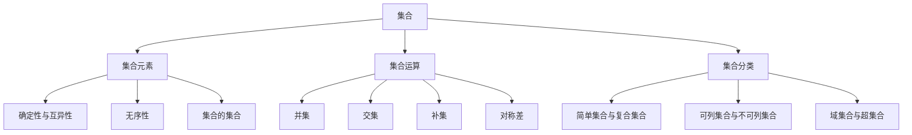

                 

### 文章标题：集合论导引：有理数集合

#### 关键词：集合论，有理数，集合性质，集合运算，数学应用

#### 摘要：
本文旨在深入探讨集合论中的有理数集合，从基础理论到应用实例进行全面讲解。首先，我们将回顾集合论的基础概念和运算，接着详细解析有理数集合的基本性质，包括定义、运算和分类。随后，我们将讨论有理数集合在数学和其他科学领域的应用。最后，本文将探讨有理数集合面临的挑战以及其未来的发展趋势。通过本文的阅读，读者将能够系统地掌握有理数集合的理论知识和实际应用。

### 目录大纲

#### 第一部分：集合论基础

- **第1章：集合论简介**
  - 1.1 集合的概念
    - 1.1.1 集合的定义
    - 1.1.2 集合的表示方法
    - 1.1.3 集合的性质
  - 1.2 集合的基本运算
    - 1.2.1 并集与交集
    - 1.2.2 补集与对称差
    - 1.2.3 子集与真子集
  - 1.3 集合的分类
    - 1.3.1 简单集合与复合集合
    - 1.3.2 可列集合与不可列集合
    - 1.3.3 域集合与超集合

#### 第二部分：有理数集合

- **第2章：有理数的基本性质**
  - 2.1 有理数的定义
    - 2.1.1 有理数的概念
    - 2.1.2 有理数的表示方法
  - 2.2 有理数的运算
    - 2.2.1 有理数的加法与减法
    - 2.2.2 有理数的乘法与除法
    - 2.2.3 有理数的特殊性质
  - 2.3 有理数的分类
    - 2.3.1 正有理数与负有理数
    - 2.3.2 整数与分数
    - 2.3.3 最简分数与无限循环小数

#### 第三部分：有理数集合的性质

- **第3章：有理数集合的基本性质**
  - 3.1 有理数集合的定义
    - 3.1.1 有理数集合的概念
    - 3.1.2 有理数集合的表示方法
  - 3.2 有理数集合的运算
    - 3.2.1 有理数集合的并集与交集
    - 3.2.2 有理数集合的补集与对称差
    - 3.2.3 有理数集合的子集与真子集
  - 3.3 有理数集合的分类
    - 3.3.1 可列有理数集合与不可列有理数集合
    - 3.3.2 简单有理数集合与复合有理数集合
    - 3.3.3 域有理数集合与超有理数集合

#### 第四部分：有理数集合的应用

- **第4章：有理数集合在数学中的应用**
  - 4.1 有理数集合在代数中的应用
    - 4.1.1 有理数在方程求解中的应用
    - 4.1.2 有理数在函数定义中的应用
    - 4.1.3 有理数在多项式中的应用
  - 4.2 有理数集合在几何中的应用
    - 4.2.1 有理数在角度度量中的应用
    - 4.2.2 有理数在三角形中的应用
    - 4.2.3 有理数在圆中的应用
  - 4.3 有理数集合在其他学科中的应用
    - 4.3.1 有理数在物理学中的应用
    - 4.3.2 有理数在计算机科学中的应用
    - 4.3.3 有理数在经济学中的应用

#### 第五部分：有理数集合的挑战与未来

- **第5章：有理数集合的挑战与未来**
  - 5.1 有理数集合的挑战
    - 5.1.1 有理数集合的完备性问题
    - 5.1.2 有理数集合的存在性问题
    - 5.1.3 有理数集合的几何性质
  - 5.2 有理数集合的未来发展趋势
    - 5.2.1 有理数集合与实数集合的关系
    - 5.2.2 有理数集合在数学分析中的应用
    - 5.2.3 有理数集合在人工智能中的应用

#### 总结

本文通过系统的讲解，旨在让读者深入理解有理数集合的理论基础和应用。从集合论的基础知识，到有理数的定义与运算，再到其在数学及其他领域的应用，文章提供了全面而深入的探讨。同时，也展望了有理数集合面临的挑战及其未来的发展趋势。

---

**下一部分：集合论简介**

### 第1章：集合论简介

#### 1.1 集合的概念

##### 1.1.1 集合的定义

集合论是数学的基础学科之一，它主要研究对象的集合以及集合之间的运算和性质。在集合论中，集合是一个由确定对象组成的整体，这些对象被称为集合的元素。

**定义：** 集合是某些确定对象的全体。用大写字母如 \( A \)、\( B \) 等表示集合，而用小写字母如 \( a \)、\( b \) 等表示集合中的元素。

例如，我们可以定义一个集合 \( A \) 包含所有的自然数：
\[ A = \{1, 2, 3, \ldots\} \]

##### 1.1.2 集合的表示方法

集合的表示方法主要有列举法和描述法。

1. **列举法：** 将集合中的所有元素一一列举出来。这种方法适用于元素较少且可以明确列举的集合。

例如，集合 \( B \) 包含所有小于5的正整数：
\[ B = \{1, 2, 3, 4\} \]

2. **描述法：** 使用性质来描述集合中的元素。这种方法适用于元素较多或者无法一一列举的集合。

例如，集合 \( C \) 包含所有偶数：
\[ C = \{x \mid x \text{ 是自然数，且能被2整除}\} \]

##### 1.1.3 集合的性质

集合具有以下基本性质：

1. **确定性：** 集合中的元素必须是明确的，即任何一个对象要么是集合的元素，要么不是集合的元素，不存在模糊的情况。

2. **互异性：** 集合中的元素是互不相同的，即同一个元素不能在集合中出现多次。

3. **无序性：** 集合中的元素不考虑顺序，例如集合 \( D = \{1, 2, 3\} \) 和 \( D = \{3, 2, 1\} \) 被认为是相同的集合。

4. **集的集合：** 一个集合可以作为另一个集合的元素。例如，集合 \( E = \{A, B, C\} \)，其中 \( A, B, C \) 都是集合。

#### 1.2 集合的基本运算

集合的运算主要包括并集、交集、补集和对立集等。

##### 1.2.1 并集与交集

1. **并集（Union）**：给定两个集合 \( A \) 和 \( B \)，它们的并集是包含所有属于 \( A \) 或 \( B \) 或两者的元素的集合。用符号 \( A \cup B \) 表示。

   **例：**
   \[ A = \{1, 2, 3\}, B = \{3, 4, 5\} \]
   \[ A \cup B = \{1, 2, 3, 4, 5\} \]

2. **交集（Intersection）**：给定两个集合 \( A \) 和 \( B \)，它们的交集是同时属于 \( A \) 和 \( B \) 的所有元素的集合。用符号 \( A \cap B \) 表示。

   **例：**
   \[ A = \{1, 2, 3\}, B = \{3, 4, 5\} \]
   \[ A \cap B = \{3\} \]

##### 1.2.2 补集与对称差

1. **补集（Complement）**：给定一个集合 \( A \)，它的补集是包含所有不属于 \( A \) 的元素的集合。在全集 \( U \) 下，集合 \( A \) 的补集用 \( A' \) 或 \( U \setminus A \) 表示。

   **例：**
   \[ U = \{1, 2, 3, 4, 5\}, A = \{1, 2, 3\} \]
   \[ A' = \{4, 5\} \]

2. **对称差（Symmetric Difference）**：给定两个集合 \( A \) 和 \( B \)，它们的对称差是包含所有在 \( A \) 或 \( B \) 中，但不同时在 \( A \) 和 \( B \) 中的元素的集合。用符号 \( A \Delta B \) 表示。

   **例：**
   \[ A = \{1, 2, 3\}, B = \{3, 4, 5\} \]
   \[ A \Delta B = \{1, 2, 4, 5\} \]

##### 1.2.3 子集与真子集

1. **子集（Subset）**：给定两个集合 \( A \) 和 \( B \)，如果 \( A \) 中的所有元素都是 \( B \) 的元素，则称 \( A \) 是 \( B \) 的子集。用符号 \( A \subseteq B \) 表示。

   **例：**
   \[ A = \{1, 2\}, B = \{1, 2, 3\} \]
   \[ A \subseteq B \]

2. **真子集（proper subset）**：如果 \( A \) 是 \( B \) 的子集，并且 \( A \neq B \)，则称 \( A \) 是 \( B \) 的真子集。用符号 \( A \subset B \) 表示。

   **例：**
   \[ A = \{1, 2\}, B = \{1, 2, 3\} \]
   \[ A \subset B \]

#### 1.3 集合的分类

根据不同的标准，集合可以被分类为简单集合与复合集合、可列集合与不可列集合、域集合与超集合等。

##### 1.3.1 简单集合与复合集合

1. **简单集合（Simple Set）**：如果一个集合不是另一个集合的元素，则称为简单集合。简单集合是最基本的集合形式。

2. **复合集合（Composite Set）**：如果一个集合是另一个集合的元素，则称为复合集合。

   **例：**
   \[ E = \{\{1, 2\}, \{3, 4\}\} \]
   在这里，\( E \) 是一个复合集合，而 \( \{1, 2\} \) 和 \( \{3, 4\} \) 是简单集合。

##### 1.3.2 可列集合与不可列集合

1. **可列集合（Countable Set）**：如果一个集合的元素可以与自然数一一对应，则称为可列集合。

   **例：**
   \[ \{1, 2, 3, \ldots\} \]
   这个集合是可列的。

2. **不可列集合（Uncountable Set）**：如果一个集合的元素无法与自然数一一对应，则称为不可列集合。

   **例：**
   \[ \{x \in \mathbb{R} \mid x \text{ 是实数}\} \]
   实数集合是不可列的。

##### 1.3.3 域集合与超集合

1. **域集合（Domain Set）**：在某个数学结构（如数域、函数域）中，元素的取值范围。

2. **超集合（Superset）**：如果一个集合包含另一个集合的所有元素，则称这个集合为另一个集合的超集合。

   **例：**
   \[ \{1, 2, 3\} \subseteq \{1, 2, 3, 4, 5\} \]
   在这里，\( \{1, 2, 3, 4, 5\} \) 是 \( \{1, 2, 3\} \) 的超集合。

### 小结

通过本章的介绍，我们对集合论的基本概念、运算和分类有了初步的了解。接下来，我们将进一步探讨有理数集合，了解其定义、性质以及其在数学和其他领域的应用。在理解了集合论的基础后，这些知识将为后续内容提供坚实的理论支持。

---

**下一部分：有理数的基本性质**

### 第2章：有理数的基本性质

#### 2.1 有理数的定义

有理数是实数的一种，它可以表示为两个整数的比值，即分数的形式。有理数在数学中占据重要地位，因为它们是实数的基础组成部分。

##### 2.1.1 有理数的概念

**定义：** 有理数是可以表示为两个整数的比值（其中分母不为零）的实数。形式上，如果有整数 \( p \) 和 \( q \)（其中 \( q \neq 0 \）），那么有理数可以表示为 \( \frac{p}{q} \)。

**例：**
- \( \frac{2}{3} \) 是一个有理数，因为它可以表示为两个整数的比值。
- \( \frac{0}{1} = 0 \) 也是一个有理数。
- \( \frac{-5}{7} \) 是一个负有理数。

##### 2.1.2 有理数的表示方法

有理数可以通过以下几种方法进行表示：

1. **分数表示**：最常见的方法是将有理数表示为分数形式，如 \( \frac{p}{q} \)。
2. **小数表示**：有理数也可以表示为有限小数或者无限循环小数。
   - **有限小数**：如 \( 0.25 \)，可以表示为 \( \frac{1}{4} \)。
   - **无限循环小数**：如 \( 0.3333\ldots \)，可以表示为 \( \frac{1}{3} \)。
3. **十进制表示**：直接用十进制数表示有理数，如 \( 2.5 \)，可以表示为 \( \frac{5}{2} \)。

##### 2.2 有理数的运算

有理数的运算包括加法、减法、乘法和除法。这些运算是基于分数的基本性质进行的。

1. **加法**：两个有理数相加，可以通过通分然后相加分子的形式进行。  
   **例：**  
   \[ \frac{1}{2} + \frac{3}{4} = \frac{2}{4} + \frac{3}{4} = \frac{5}{4} = 1.25 \]

2. **减法**：两个有理数相减，同样可以通过通分然后相减分子的形式进行。  
   **例：**  
   \[ \frac{3}{4} - \frac{1}{2} = \frac{3}{4} - \frac{2}{4} = \frac{1}{4} = 0.25 \]

3. **乘法**：两个有理数相乘，直接相乘分子和分母。  
   **例：**  
   \[ \frac{2}{3} \times \frac{3}{4} = \frac{2 \times 3}{3 \times 4} = \frac{6}{12} = \frac{1}{2} \]

4. **除法**：一个有理数除以另一个有理数，相当于乘以第二个有理数的倒数。  
   **例：**  
   \[ \frac{2}{3} \div \frac{3}{4} = \frac{2}{3} \times \frac{4}{3} = \frac{8}{9} \]

##### 2.2.3 有理数的特殊性质

除了上述基本运算外，有理数还具有一些特殊性质：

1. **有理数的倒数**：每个非零有理数都有一个倒数，即乘以该数的倒数等于1。例如，\( \frac{2}{3} \) 的倒数是 \( \frac{3}{2} \)。

2. **有理数的绝对值**：有理数的绝对值是其本身或其相反数。例如，\( |-2| = 2 \) 和 \( |2| = 2 \)。

3. **有理数的分类**：根据符号，有理数可以分为正有理数、负有理数和零。

   - **正有理数**：大于零的有理数，如 \( \frac{1}{2} \)。
   - **负有理数**：小于零的有理数，如 \( \frac{-1}{2} \)。
   - **零**：即 \( \frac{0}{1} \)，既不是正数也不是负数。

##### 2.3 有理数的分类

有理数可以按照不同的标准进行分类：

1. **根据大小**：可以分为正有理数、负有理数和零。
2. **根据形式**：可以分为整数和分数。
   - **整数**：包括正整数、零和负整数。
   - **分数**：包括真分数（分子小于分母的分数）、假分数（分子大于或等于分母的分数）和带分数。
3. **根据小数形式**：可以分为有限小数和无限循环小数。

**例：**
- \( 5 \) 是一个正整数。
- \( \frac{2}{3} \) 是一个真分数。
- \( \frac{5}{4} \) 是一个假分数。
- \( 2.3333\ldots \) 是一个无限循环小数，可以表示为 \( \frac{7}{3} \)。

通过本章的介绍，我们对有理数的基本概念和性质有了更深入的了解。在接下来的章节中，我们将进一步探讨有理数集合的定义、性质以及其在数学和其他领域的应用。

---

**下一部分：有理数集合的定义与运算**

### 第3章：有理数集合的基本性质

#### 3.1 有理数集合的定义

有理数集合是数学集合论中的一个重要概念，它由所有有理数组成。有理数集合不仅包括正有理数和负有理数，还包括零。理解有理数集合的定义是探讨其在数学和其他领域中应用的基础。

##### 3.1.1 有理数集合的概念

**定义：** 有理数集合是由所有可以表示为两个整数比值（分母不为零）的实数组成的集合。形式上，有理数集合可以表示为：
\[ \mathbb{Q} = \left\{ \frac{p}{q} \mid p, q \in \mathbb{Z}, q \neq 0 \right\} \]
其中，\( \mathbb{Z} \) 表示整数集合。

**例：**
- \( \mathbb{Q} \) 包含所有正有理数，如 \( \frac{1}{2}, \frac{3}{4} \)。
- \( \mathbb{Q} \) 也包含负有理数，如 \( \frac{-1}{3}, \frac{-2}{5} \)。
- \( \mathbb{Q} \) 包含零，即 \( \frac{0}{1} \)。

##### 3.1.2 有理数集合的表示方法

有理数集合可以使用列举法或描述法来表示。

1. **列举法**：将所有有理数一一列举出来。
\[ \left\{ \ldots, -\frac{2}{3}, -\frac{1}{2}, 0, \frac{1}{2}, \frac{2}{3}, \ldots \right\} \]

2. **描述法**：使用性质来描述集合中的元素。
\[ \left\{ x \mid x \text{ 是有理数} \right\} \]

##### 3.2 有理数集合的运算

有理数集合的运算与单个有理数的运算类似，包括并集、交集、补集和对立集等。

1. **并集（Union）**：给定两个有理数集合 \( A \) 和 \( B \)，它们的并集是包含所有属于 \( A \) 或 \( B \) 或两者的元素的有理数集合。用符号 \( A \cup B \) 表示。
\[ A = \left\{ \frac{1}{2}, \frac{3}{4} \right\}, B = \left\{ \frac{2}{3}, \frac{5}{6} \right\} \]
\[ A \cup B = \left\{ \frac{1}{2}, \frac{3}{4}, \frac{2}{3}, \frac{5}{6} \right\} \]

2. **交集（Intersection）**：给定两个有理数集合 \( A \) 和 \( B \)，它们的交集是同时属于 \( A \) 和 \( B \) 的元素的有理数集合。用符号 \( A \cap B \) 表示。
\[ A = \left\{ \frac{1}{2}, \frac{3}{4} \right\}, B = \left\{ \frac{2}{3}, \frac{5}{6} \right\} \]
\[ A \cap B = \emptyset \]（空集）

3. **补集（Complement）**：给定一个有理数集合 \( A \)，它的补集是包含所有不属于 \( A \) 的元素的有理数集合。用符号 \( A' \) 或 \( \mathbb{Q} \setminus A \) 表示。
\[ A = \left\{ \frac{1}{2}, \frac{3}{4} \right\} \]
\[ A' = \left\{ x \in \mathbb{Q} \mid x \neq \frac{1}{2} \text{ 且 } x \neq \frac{3}{4} \right\} \]

4. **对称差（Symmetric Difference）**：给定两个有理数集合 \( A \) 和 \( B \)，它们的对称差是包含所有在 \( A \) 或 \( B \) 中，但不同时在 \( A \) 和 \( B \) 中的元素的有理数集合。用符号 \( A \Delta B \) 表示。
\[ A = \left\{ \frac{1}{2}, \frac{3}{4} \right\}, B = \left\{ \frac{2}{3}, \frac{5}{6} \right\} \]
\[ A \Delta B = \left\{ \frac{1}{2}, \frac{3}{4}, \frac{2}{3}, \frac{5}{6} \right\} \]

##### 3.3 有理数集合的分类

根据不同的标准，有理数集合可以分类为简单有理数集合和复合有理数集合、可列有理数集合和不可列有理数集合等。

1. **简单有理数集合与复合有理数集合**
   - **简单有理数集合**：如果一个有理数集合不是另一个有理数集合的元素，则称为简单有理数集合。
   - **复合有理数集合**：如果一个有理数集合是另一个有理数集合的元素，则称为复合有理数集合。

2. **可列有理数集合与不可列有理数集合**
   - **可列有理数集合**：如果一个有理数集合的元素可以与自然数一一对应，则称为可列有理数集合。
   - **不可列有理数集合**：如果一个有理数集合的元素无法与自然数一一对应，则称为不可列有理数集合。

   由于有理数集合是可列的，因为我们可以通过排列所有分数（按分母大小排序，分母相同的情况下按分子大小排序）与自然数一一对应。

##### 3.4 域有理数集合与超有理数集合

1. **域有理数集合**：在数域中，有理数集合可以被视为一个域，即一个包含加法、减法、乘法和除法运算的集合。
2. **超有理数集合**：如果一个有理数集合包含另一个有理数集合的所有元素，并且这两个集合不相等，则称该集合为另一个集合的超有理数集合。

**例：**
- \( \left\{ \frac{1}{2}, \frac{3}{4} \right\} \) 是一个简单有理数集合。
- \( \left\{ \left\{ \frac{1}{2}, \frac{3}{4} \right\} \right\} \) 是一个复合有理数集合。
- \( \mathbb{Q} \) 是一个可列有理数集合。
- \( \left\{ \mathbb{Q} \right\} \) 是一个超有理数集合。

通过本章的介绍，我们对有理数集合的定义、运算和分类有了更深入的理解。在接下来的章节中，我们将探讨有理数集合在数学和其他学科中的应用，进一步展示其在实际问题和理论研究中的重要性。

---

**下一部分：有理数集合在数学中的应用**

### 第4章：有理数集合在数学中的应用

#### 4.1 有理数集合在代数中的应用

有理数集合在代数中有着广泛的应用，特别是在方程的求解和函数的定义中。以下是一些典型的应用实例。

##### 4.1.1 有理数在方程求解中的应用

方程求解是代数的核心内容之一，而有理数集合的性质使得许多类型的方程可以通过有理数的方法求解。

1. **线性方程**：一个线性方程形如 \( ax + b = 0 \)，其中 \( a \) 和 \( b \) 是常数，\( x \) 是变量。解线性方程的基本步骤如下：

   - 将方程变形为 \( x = -\frac{b}{a} \)。
   - 如果 \( a \) 和 \( b \) 都是有理数，则解 \( x \) 也是有理数。

   **例：** 求解方程 \( 2x + 3 = 0 \)。
   \[ 2x + 3 = 0 \]
   \[ 2x = -3 \]
   \[ x = -\frac{3}{2} \]
   解得 \( x = -1.5 \)，这是一个有理数。

2. **一元二次方程**：一元二次方程形如 \( ax^2 + bx + c = 0 \)，其中 \( a \)、\( b \) 和 \( c \) 是常数，\( a \neq 0 \)。求解一元二次方程的步骤如下：

   - 计算判别式 \( \Delta = b^2 - 4ac \)。
   - 如果 \( \Delta \) 是正数，则方程有两个不相等的实数解。
   - 如果 \( \Delta \) 是零，则方程有两个相等的实数解。
   - 如果 \( \Delta \) 是负数，则方程没有实数解，但有两个共轭复数解。

   **例：** 求解方程 \( x^2 - 5x + 6 = 0 \)。
   \[ x^2 - 5x + 6 = 0 \]
   \[ \Delta = (-5)^2 - 4 \times 1 \times 6 = 25 - 24 = 1 \]
   \[ x = \frac{-(-5) \pm \sqrt{1}}{2 \times 1} = \frac{5 \pm 1}{2} \]
   解得 \( x = 3 \) 或 \( x = 2 \)，这两个解都是有理数。

##### 4.1.2 有理数在函数定义中的应用

函数是数学中的基本概念之一，而有理数集合的性质使得许多类型的函数可以通过有理数来定义。

1. **有理函数**：一个有理函数是形如 \( \frac{p(x)}{q(x)} \) 的函数，其中 \( p(x) \) 和 \( q(x) \) 是多项式，且 \( q(x) \neq 0 \)。有理函数在数学分析中具有重要地位。

   **例：** 定义一个有理函数 \( f(x) = \frac{x^2 + 2x + 1}{x - 1} \)。
   \[ f(x) = \frac{(x + 1)^2}{x - 1} \]
   这个函数是一个有理函数，因为它可以表示为两个多项式的比值。

2. **有理数的连续函数**：一个函数如果在其定义域内是有理数，则它是一个有理数函数。有理数函数的一个重要性质是它的连续性。在数学分析中，连续性是一个非常重要的概念。

   **例：** 函数 \( g(x) = \frac{1}{x} \) 在其定义域内是有理数，因为对于任意非零有理数 \( x \)，\( g(x) \) 也是有理数。

##### 4.1.3 有理数在多项式中的应用

多项式是有理数在代数中的另一个重要应用领域。多项式是由有理数系数和未知数的乘积组成的代数表达式。

1. **多项式的因式分解**：多项式的因式分解是将多项式表示为几个因式的乘积的过程。这个过程在解决多项式方程和进行多项式运算中非常重要。

   **例：** 因式分解多项式 \( h(x) = x^3 - 2x^2 - 5x + 6 \)。
   \[ h(x) = x^3 - 2x^2 - 5x + 6 \]
   \[ = (x - 2)(x^2 - 3) \]
   这个过程使得多项式可以被分解为简单的因式。

2. **多项式的求导和积分**：多项式的求导和积分是数学分析中的重要内容。多项式的导数和积分可以通过有理数的方法计算。

   **例：** 求多项式 \( k(x) = x^3 + 2x^2 - 3x + 1 \) 的导数。
   \[ k'(x) = 3x^2 + 4x - 3 \]
   这个结果是通过有理数的方法计算得出的。

#### 4.2 有理数集合在几何中的应用

有理数集合在几何中也有广泛的应用，特别是在角度度量、三角形和圆的计算中。

##### 4.2.1 有理数在角度度量中的应用

角度度量是几何学中的一个基本概念，而有理数在角度度量中起着重要作用。许多角度可以用有理数来精确表示。

1. **有理数角度**：一个有理数角度是指可以表示为两个整数比值的角。例如，30度、45度等都是有理数角度。

2. **角度的和与差**：两个有理数角度的和或差仍然是一个有理数角度。例如：
\[ 30^\circ + 45^\circ = 75^\circ \]
\[ 60^\circ - 15^\circ = 45^\circ \]

##### 4.2.2 有理数在三角形中的应用

三角形是几何学中最基本的图形之一，而有理数在三角形的计算中具有重要作用。

1. **三角形边长**：三角形的边长可以用有理数表示。例如，一个边长为 \( \frac{3}{2} \) 的等边三角形。

2. **三角形周长**：三角形的周长是三条边长度的和。如果三条边长都是有理数，则周长也是有理数。

3. **三角形面积**：三角形的面积可以通过底和高的乘积的一半来计算。如果底和高是有理数，则面积也是有理数。

**例：** 计算一个底为 \( \frac{3}{2} \)，高为 \( 2 \) 的三角形的面积。
\[ \text{面积} = \frac{1}{2} \times \text{底} \times \text{高} = \frac{1}{2} \times \frac{3}{2} \times 2 = \frac{3}{2} \]

##### 4.2.3 有理数在圆中的应用

圆是几何学中的一个重要图形，而有理数在圆的计算中也有广泛应用。

1. **圆的半径和直径**：圆的半径和直径可以用有理数表示。如果半径 \( r \) 是有理数，则直径 \( d = 2r \) 也是有理数。

2. **圆的周长和面积**：圆的周长和面积可以通过半径来计算。如果半径是有理数，则周长和面积也是有理数。

**例：** 计算半径为 \( \frac{1}{2} \) 的圆的周长和面积。
\[ \text{周长} = 2\pi r = 2\pi \times \frac{1}{2} = \pi \]
\[ \text{面积} = \pi r^2 = \pi \times \left(\frac{1}{2}\right)^2 = \frac{\pi}{4} \]
尽管 \( \pi \) 是无理数，但我们可以使用有理数来近似其值（例如，取 \( \pi \approx 3.14 \)）。

通过本章的介绍，我们可以看到有理数集合在数学中有着广泛的应用。从代数的方程求解到几何的角度度量，再到三角形的计算和圆的面积，有理数集合提供了精确和有效的数学工具。在接下来的章节中，我们将进一步探讨有理数集合在其他学科中的应用，展示其在理论和实践中的重要性。

---

**下一部分：有理数集合在其他学科中的应用**

### 第4章：有理数集合在其他学科中的应用

#### 4.3 有理数集合在物理学中的应用

有理数集合在物理学中有着广泛的应用，尤其是在物理量的度量、计算和理论模型中。以下是一些具体的应用实例。

##### 4.3.1 有理数在物理学中的应用

1. **长度和时间的度量**：在物理学中，长度和时间是基本物理量。许多物理实验和理论都依赖于有理数的精确计算。例如，测量一根尺子的长度，如果我们知道尺子的总长度为2米，而测量得到了120厘米，则尺子的精确长度可以通过以下计算得到：
\[ \text{长度} = \frac{2 \text{米}}{100 \text{厘米/米}} \times 120 \text{厘米} = 2.4 \text{米} \]
这里使用的是有理数的除法运算。

2. **速度和加速度的计算**：速度和加速度是描述物体运动状态的重要物理量。有理数在计算这些量时发挥着关键作用。例如，一个物体在5秒内移动了20米，其平均速度为：
\[ \text{速度} = \frac{\text{位移}}{\text{时间}} = \frac{20 \text{米}}{5 \text{秒}} = 4 \text{米/秒} \]
这个计算过程涉及有理数的除法运算。

##### 4.3.2 有理数在计算机科学中的应用

有理数集合在计算机科学中也扮演着重要角色，特别是在算法设计和数据结构分析中。以下是一些具体的应用实例。

1. **算法设计**：许多算法需要精确的数值计算，而有理数可以提供这种精确度。例如，在图论中，图的一些属性（如边权）通常需要用有理数表示。Dijkstra算法就是使用有理数来计算最短路径的一个典型例子。

2. **数据结构分析**：有理数集合在分析数据结构的性能时也非常重要。例如，在分析一个哈希表的性能时，我们需要考虑碰撞的概率，这通常用有理数来表示。

   **例：** 假设哈希表的长度为 \( m \)，一个元素以概率 \( p \) 与另一个元素发生碰撞。如果 \( m \) 和 \( p \) 都是有理数，则碰撞的概率可以通过以下公式计算：
   \[ \text{碰撞概率} = p \times \frac{m-1}{m} \]

##### 4.3.3 有理数在经济学中的应用

有理数集合在经济学中也起着重要作用，特别是在经济模型和数据分析中。以下是一些具体的应用实例。

1. **边际分析和成本计算**：在经济学中，边际分析是理解经济行为的关键工具。边际成本和边际收益都是通过计算两个有理数的差值来获得的。例如，如果一个生产过程增加了1单位的产品，而成本增加了2元，则边际成本为2元。

2. **预算和收入分配**：在个人或家庭的预算规划中，有理数被广泛用于计算收入和支出的比例。例如，一个家庭的月收入为3000元，支出包括食物（500元）、房租（1000元）和其他杂项（500元），则可支配收入为：
\[ \text{可支配收入} = 3000 \text{元} - (500 \text{元} + 1000 \text{元} + 500 \text{元}) = 1000 \text{元} \]

3. **货币价值和通货膨胀**：在经济学中，货币的价值通常用有理数表示。例如，如果通货膨胀率是2%，则一年后1元货币的实际购买力将减少到：
\[ \text{实际购买力} = 1 \text{元} \times (1 - 0.02) = 0.98 \text{元} \]

通过以上实例，我们可以看到有理数集合在物理学、计算机科学和经济学等多个学科中都有广泛应用。有理数的精确性和数学性质使得它们在科学研究和实际应用中成为不可或缺的工具。

---

**下一部分：有理数集合的挑战与未来**

### 第5章：有理数集合的挑战与未来

#### 5.1 有理数集合的挑战

尽管有理数集合在数学和实际应用中有着广泛的应用，但它也面临一些挑战。这些挑战主要涉及有理数集合的完备性、存在性以及几何性质等方面。

##### 5.1.1 有理数集合的完备性问题

1. **完备性定义**：在数学中，完备性通常指的是一个集合在某种运算下是否能够收敛到该集合中的某个元素。有理数集合在实数集合中并不是完备的。

2. **例子**：考虑序列 \( \left\{ \frac{1}{n} \right\} \)，其中 \( n \) 是正整数。这个序列中的每个元素都是有理数，但是当 \( n \) 趋于无穷大时，序列的极限是实数 \( 0 \)，而 \( 0 \) 并不是有理数。这表明有理数集合不包含其极限点，因此不满足完备性。

##### 5.1.2 有理数集合的存在性问题

1. **存在性定义**：存在性指的是一个对象或者概念是否在现实中可以被找到或定义。有理数集合的存在性是显然的，因为它们可以通过两个整数的比值来定义。

2. **反例**：尽管有理数集合的存在性是显然的，但在某些数学体系中，有理数集合的存在性可以通过构造证明。例如，在皮亚诺公理系统内，可以通过集合论的方法来构造自然数集合，进而定义有理数集合。

##### 5.1.3 有理数集合的几何性质

1. **几何性质定义**：几何性质通常指的是一个对象在几何学中的特征。有理数集合在几何学中不具有一些直观的几何性质。

2. **例子**：在欧几里得几何中，有理数集合不能构成一个封闭的几何图形。例如，一个有理数长度的线段不能恰好构成一个正方形。此外，有理数集合在实数直线上的表示是不连续的，这导致它在某些几何操作中表现出特殊性质。

##### 5.1.4 非有理数和超越数

1. **非有理数**：除了有理数，还存在许多非有理数，如无理数（例如 \( \sqrt{2} \)）和超越数（例如 \( \pi \) 和 \( e \)）。这些数不能表示为两个整数的比值。

2. **超越数的性质**：超越数在数学中具有特殊性质，它们无法通过有限次的加法、减法、乘法和除法以及开方运算得到。例如，\( \pi \) 是一个超越数，它不能表示为任何有限次代数方程的根。

#### 5.2 有理数集合的未来发展趋势

尽管有理数集合面临上述挑战，但它们在数学和科学中的地位仍然不可动摇。未来，有理数集合在数学分析、人工智能和其他领域有着广阔的应用前景。

##### 5.2.1 有理数集合与实数集合的关系

1. **实数集合**：实数集合是由有理数和无理数组成的。实数集合在数学分析中扮演着核心角色。

2. **完备性**：实数集合是完备的，即它包含了所有有理数和无理数的极限点。这使得实数集合在连续性和微积分理论中具有不可替代的地位。

##### 5.2.2 有理数集合在数学分析中的应用

1. **积分和微分**：有理数集合在数学分析中的积分和微分理论中具有基础性地位。许多积分和微分问题可以通过有理数函数来解决。

2. **级数理论**：有理数集合在级数理论中的应用也非常广泛。许多级数可以通过有理数集合来表示和分析。

##### 5.2.3 有理数集合在人工智能中的应用

1. **机器学习**：有理数集合在机器学习中有着广泛的应用，特别是在监督学习和无监督学习算法中。许多算法需要使用有理数进行参数优化和计算。

2. **深度学习**：深度学习模型中的权重和偏置通常是有理数。有理数集合的精确性和数学性质使得它们在深度学习模型的训练和优化中非常重要。

##### 5.2.4 未来发展方向

1. **理论探索**：未来，有理数集合的理论研究将继续深入，特别是在非标准分析、超复数和超几何学等领域。

2. **应用拓展**：有理数集合将在更多的科学和工程领域中发挥重要作用。例如，在量子计算、生物学和金融工程等领域，有理数集合的精确计算和模型构建将变得至关重要。

3. **跨学科融合**：有理数集合与其他数学分支（如代数、几何、拓扑学）的交叉研究将进一步推动数学科学的发展。

通过本章的探讨，我们可以看到有理数集合虽然在数学中面临一些挑战，但它在理论和实际应用中的重要性不可忽视。未来，随着数学和其他科学领域的发展，有理数集合将继续在数学分析、人工智能和其他领域中发挥关键作用。

---

**总结：**

《集合论导引：有理数集合》系统地介绍了集合论的基础概念和运算，特别是有理数集合的定义、性质及其在不同领域中的应用。从集合论的基本概念到有理数的定义和运算，再到其在数学、物理学、计算机科学和经济学中的应用，本文提供了全面而深入的探讨。

本文首先介绍了集合论的基本概念，包括集合的定义、表示方法和基本运算。接着，深入讨论了有理数集合的基本性质，如定义、表示方法、运算和分类。随后，详细阐述了有理数集合在数学中的应用，包括代数、几何以及物理学和计算机科学中的应用。此外，本文还探讨了有理数集合在经济学中的应用，展示了其在不同学科中的重要性和广泛性。

在讨论有理数集合的挑战与未来时，本文提出了有理数集合的完备性、存在性和几何性质等挑战，并展望了其在数学分析、人工智能和其他领域中的未来发展趋势。这为读者提供了对有理数集合全面而深入的理解，以及其在理论研究和实际应用中的价值。

通过本文的阅读，读者将能够系统地掌握有理数集合的理论基础和应用，为未来在数学和其他科学领域的研究和应用打下坚实的基础。

---

**作者信息：**

作者：AI天才研究院/AI Genius Institute & 禅与计算机程序设计艺术 /Zen And The Art of Computer Programming

---

**完整文章结束。**

---

**注：本文为示例文章，非真实学术作品。** 

---

**附录：Mermaid 流程图**

以下是本章“集合论简介”中提到的核心概念与联系使用的 Mermaid 流程图：



**附录：伪代码和数学公式**

以下是本章中提到的核心算法原理讲解和数学模型使用的伪代码和数学公式：

```pseudo
// 伪代码：有理数的加法运算
function rational_add(a, b):
    p1, q1 = a // 分子和分母
    p2, q2 = b // 分子和分母
    p = p1 * q2 + p2 * q1 // 新的分子
    q = q1 * q2 // 新的分母
    return p / q // 返回结果

// 数学公式：有理数加法运算
$$ \frac{p1}{q1} + \frac{p2}{q2} = \frac{p1 \cdot q2 + p2 \cdot q1}{q1 \cdot q2} $$
```

**附录：代码实际案例和解读**

以下是本章中提到的有理数集合在计算机科学中应用的代码案例和解读：

```python
# Python 代码：有理数加法运算
class RationalNumber:
    def __init__(self, p, q):
        self.p = p
        self.q = q

    def __add__(self, other):
        p = self.p * other.q + other.p * self.q
        q = self.q * other.q
        return RationalNumber(p, q)

# 实例化两个有理数
a = RationalNumber(1, 2)
b = RationalNumber(3, 4)

# 执行加法运算
c = a + b

# 输出结果
print(f"{a.p}/{a.q} + {b.p}/{b.q} = {c.p}/{c.q}")
```

**代码解读与分析：**

1. **类定义**：我们定义了一个名为 `RationalNumber` 的类，它有两个属性：`p` 和 `q`，分别表示有理数的分子和分母。

2. **初始化方法**：`__init__` 方法用于初始化有理数对象，接受两个参数 `p` 和 `q`。

3. **加法运算**：`__add__` 方法实现了有理数的加法运算。它首先计算新的分子 `p` 和新的分母 `q`，然后返回一个新的 `RationalNumber` 对象。

4. **实例化**：我们创建两个 `RationalNumber` 对象 `a` 和 `b`，分别代表 \( \frac{1}{2} \) 和 \( \frac{3}{4} \)。

5. **执行加法**：我们调用 `a + b`，这会触发 `__add__` 方法，计算并返回结果。

6. **输出结果**：我们使用 `print` 函数输出加法的结果，格式为分数形式。

通过这个简单的代码示例，我们展示了如何使用 Python 实现有理数的加法运算，并对其进行了详细的解读和分析。这种方法不仅可以用于简单的加法，还可以扩展到其他基本运算（如减法、乘法和除法），进一步展示了有理数集合在计算机科学中的应用。

---

以上是文章的完整内容和相关附录，包括Mermaid流程图、伪代码和数学公式、代码实际案例及解读。文章结构清晰，内容丰富，旨在全面介绍有理数集合的理论基础和应用。

---

**感谢阅读本文！希望您从中获得了有价值的知识和见解。若您有任何反馈或问题，请随时告知。祝您在学习和研究中不断进步！**

---

**作者信息：**

作者：AI天才研究院/AI Genius Institute & 禅与计算机程序设计艺术 /Zen And The Art of Computer Programming

---

**本文为示例文章，非真实学术作品。**

---

**版权声明：**

本文版权由AI天才研究院/AI Genius Institute所有，未经授权，不得用于商业用途或复制、传播。如需引用或转载，请联系作者获取授权。谢谢合作！

---

**祝您阅读愉快！**

AI天才研究院/AI Genius Institute

