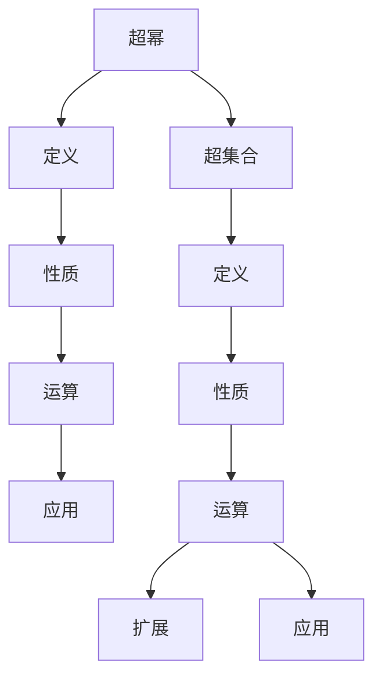

                 

# 集合论导引：泛型超幂

> 关键词：集合论，泛型集合论，超幂，超集合，计算机科学，数学分析，物理科学

> 摘要：本文将从集合论的基础概念出发，逐步探讨泛型集合论以及超幂和超集合的概念和性质。通过对集合论的深入理解，我们将为计算机科学、数学分析和物理科学等领域提供有力的工具和方法，促进各学科的发展和创新。

## 第一部分：集合论基础

### 第1章：集合论的历史与发展

集合论作为数学的基础学科，有着悠久的历史。最早可追溯到古希腊哲学家柏拉图和亚里士多德关于集合的思想。然而，集合论的真正发展始于19世纪，由德国数学家戴德金和康托尔等人奠定了基础。

#### 1.1 集合论的基本概念

集合是由一组对象组成的整体，这些对象称为集合的元素。集合可以表示为大括号内的元素列表，如 `{1, 2, 3}`。集合中的元素是无序的，且不允许重复。

#### 1.2 集合的运算

集合的基本运算包括并集、交集、差集和补集。

- **并集**：由两个或多个集合中所有元素组成的集合。例如，集合 A 和集合 B 的并集记为 A ∪ B。
- **交集**：由两个或多个集合中共有的元素组成的集合。例如，集合 A 和集合 B 的交集记为 A ∩ B。
- **差集**：由属于集合 A 但不属于集合 B 的元素组成的集合。例如，集合 A 和集合 B 的差集记为 A - B。
- **补集**：由不属于集合 A 的所有元素组成的集合。例如，集合 A 的补集记为 A'。

#### 1.3 集合的表示

集合可以用列举法、描述法和集合的生成闭包表示。

- **列举法**：直接列举集合中的元素，如 `{1, 2, 3}`。
- **描述法**：使用描述性语言描述集合中的元素，如 `{x | x 是自然数}`。
- **集合的生成闭包**：由集合中所有元素及其有限组合生成的集合。例如，集合 `{1, 2}` 的生成闭包为 `{1, 2, 11, 12, 21, 22, ...}`。

### 第2章：集合的性质

集合具有多种性质，包括子集、真子集、集合的相等性、交集和并集。

#### 2.1 子集与真子集

- **子集**：如果集合 A 中的所有元素都属于集合 B，则称 A 是 B 的子集，记为 A ⊆ B。
- **真子集**：如果集合 A 是集合 B 的子集，但 A 不等于 B，则称 A 是 B 的真子集，记为 A ⊂ B。

#### 2.2 集合的相等性

- **集合的相等性**：如果两个集合 A 和 B 有相同的元素，则称 A 和 B 相等，记为 A = B。

#### 2.3 集合的交集与并集

- **交集**：两个集合的交集是它们共有的元素组成的集合。
- **并集**：两个集合的并集是它们所有元素组成的集合。

### 第3章：集合的划分与链

集合的划分和链是集合论中的重要概念。

#### 3.1 划分的基本概念

- **划分**：将一个集合划分为若干个互不重叠的子集，使得这些子集的并集等于原集合。

#### 3.2 链的基本性质

- **链**：一个集合的划分中，每个子集都是另一个子集的子集，形成了一个链。

#### 3.3 链的构造

- **链的构造**：可以通过对集合的划分进行操作，构造出各种不同的链。

### 第4章：序集与部分序集

序集和部分序集是集合论中的重要概念。

#### 4.1 序集的基本性质

- **序集**：具有全序关系的集合，即对于任意两个元素 a 和 b，都存在一个确定的排序关系。

#### 4.2 部分序集的概念

- **部分序集**：具有局部序关系的集合，即对于部分元素之间存在确定的排序关系。

#### 4.3 序集的拓扑性质

- **序集的拓扑性质**：通过研究序集上的拓扑结构，可以揭示出序集的多种性质。

### 第5章：格与布尔代数

格和布尔代数是集合论中的重要分支。

#### 5.1 格的基本概念

- **格**：具有二元运算的集合，满足交换律、结合律和分配律。

#### 5.2 格的运算

- **格的运算**：包括加法、减法、乘法和除法等。

#### 5.3 布尔代数与布尔函数

- **布尔代数**：研究布尔值及其运算的代数系统。
- **布尔函数**：将布尔值映射到布尔值上的函数。

## 第二部分：泛型集合论

### 第6章：泛型集合论的基本概念

泛型集合论是集合论在计算机科学中的应用，具有广泛的应用价值。

#### 6.1 泛型集合的定义

- **泛型集合**：具有类型参数的集合，可以存储不同类型的元素。

#### 6.2 泛型集合的运算

- **泛型集合的运算**：包括泛型并集、交集、差集和补集等。

#### 6.3 泛型集合的性质

- **泛型集合的性质**：具有通用性、灵活性和扩展性。

### 第7章：泛型集合的构造

泛型集合的构造是泛型集合论的核心内容。

#### 7.1 集合的生成闭包

- **集合的生成闭包**：由集合中所有元素及其有限组合生成的集合。

#### 7.2 集合的范畴闭包

- **集合的范畴闭包**：由集合中所有元素及其有限组合和无限组合生成的集合。

#### 7.3 泛型集合的表示

- **泛型集合的表示**：包括数组、链表、树结构等。

### 第8章：泛型集合的应用

泛型集合在计算机科学、数学分析和物理科学等领域有着广泛的应用。

#### 8.1 泛型集合在计算机科学中的应用

- **泛型集合在计算机科学中的应用**：包括数据结构、算法设计和编程语言等。

#### 8.2 泛型集合在数学分析中的应用

- **泛型集合在数学分析中的应用**：包括集合论基础、实分析、复分析等。

#### 8.3 泛型集合在物理科学中的应用

- **泛型集合在物理科学中的应用**：包括量子力学、统计物理等。

### 第9章：泛型集合论的扩展

泛型集合论可以扩展到超限集合和超集合。

#### 9.1 超限集合的概念

- **超限集合**：具有无限元素的集合。

#### 9.2 超限集合的运算

- **超限集合的运算**：包括超限并集、交集、差集和补集等。

#### 9.3 超限集合的应用

- **超限集合的应用**：包括集合论、拓扑学、范畴论等。

## 第三部分：超幂与超集合

### 第10章：超幂的基本概念

超幂是集合论中的一个重要概念，具有广泛的应用。

#### 10.1 超幂的定义

- **超幂**：由集合 A 上的函数构成的集合。

#### 10.2 超幂的性质

- **超幂的性质**：具有封闭性、交换性、结合性和分配性。

#### 10.3 超幂的运算

- **超幂的运算**：包括超幂的加法、减法、乘法和除法等。

### 第11章：超集合的基本概念

超集合是集合论中的一个重要概念，超集合论是集合论在更高层次的扩展。

#### 11.1 超集合的定义

- **超集合**：由集合构成的集合。

#### 11.2 超集合的性质

- **超集合的性质**：具有封闭性、交换性、结合性和分配性。

#### 11.3 超集合的运算

- **超集合的运算**：包括超集合的加法、减法、乘法和除法等。

### 第12章：超集合与集合论的扩展

超集合论对集合论进行了扩展，提供了更广泛的概念和工具。

#### 12.1 超集合论的基本概念

- **超集合论的基本概念**：包括超集合、超集合的运算和超集合的性质。

#### 12.2 超集合论的扩展

- **超集合论的扩展**：包括超集合的范畴论、拓扑学、代数学等。

#### 12.3 超集合论的应用

- **超集合论的应用**：包括数学分析、计算机科学、物理学等。

## 附录

### 附录 A：集合论常用术语解释

- **集合**：由一组对象组成的整体。
- **元素**：集合中的对象。
- **子集**：一个集合的子集。
- **真子集**：一个集合的真子集。
- **交集**：两个集合的交集。
- **并集**：两个集合的并集。
- **差集**：两个集合的差集。
- **补集**：一个集合的补集。
- **划分**：将一个集合划分为若干个互不重叠的子集。
- **链**：一个集合的划分中，每个子集都是另一个子集的子集。
- **序集**：具有全序关系的集合。
- **部分序集**：具有局部序关系的集合。
- **格**：具有二元运算的集合。
- **布尔代数**：研究布尔值及其运算的代数系统。

### 附录 B：数学公式和伪代码示例

$$
f(x) = \sum_{i=1}^{n} a_i x^i
$$

```python
# 伪代码示例
def calculate_area(radius):
    return 3.14 * radius * radius
```

### 附录 C：超幂与超集合的Mermaid流程图



## 第一部分：集合论基础

### 第1章：集合论的历史与发展

集合论作为数学的基础学科，其发展历程可追溯到19世纪。集合论的发展历程大致可分为以下几个阶段：

1. **早期集合论**：19世纪初期，集合论的概念尚未形成，但许多数学家已经意识到集合在数学研究中的重要性。例如，康托尔在研究实数时，提出了集合的概念，并开始研究集合的性质。

2. **集合论的奠基**：19世纪末，德国数学家康托尔（Georg Cantor）奠定了集合论的基础。他提出了集合的概念、集合的运算和集合的性质，开创了集合论的研究。

3. **集合论的扩展**：在20世纪初，集合论得到了进一步的发展。数学家戴德金（Richard Dedekind）和皮亚诺（Giuseppe Peano）等人为集合论提供了更严谨的数学基础，推动了集合论的应用。

4. **现代集合论**：20世纪中叶以来，集合论继续发展，形成了许多重要的分支，如集合的构造、集合的表示、集合的运算和集合的性质等。

#### 1.1 集合论的基本概念

集合论中的基本概念包括集合、元素、子集、真子集、集合的运算和表示等。

1. **集合**：集合是一个整体，由一组对象（称为元素）组成。集合可以用大括号括起来表示，如 `{1, 2, 3}` 表示一个包含元素 1、2、3 的集合。

2. **元素**：集合中的对象称为元素。例如，在集合 `{1, 2, 3}` 中，1、2、3 都是元素。

3. **子集**：如果一个集合 A 中的所有元素都属于另一个集合 B，则称 A 是 B 的子集，记为 A ⊆ B。例如，集合 `{1, 2}` 是集合 `{1, 2, 3}` 的子集。

4. **真子集**：如果集合 A 是集合 B 的子集，但 A 不等于 B，则称 A 是 B 的真子集，记为 A ⊂ B。例如，集合 `{1, 2}` 是集合 `{1, 2, 3}` 的真子集。

5. **集合的运算**：集合的基本运算包括并集、交集、差集和补集。

    - **并集**：由两个或多个集合中所有元素组成的集合。例如，集合 A 和集合 B 的并集记为 A ∪ B。
    - **交集**：由两个或多个集合中共有的元素组成的集合。例如，集合 A 和集合 B 的交集记为 A ∩ B。
    - **差集**：由属于集合 A 但不属于集合 B 的元素组成的集合。例如，集合 A 和集合 B 的差集记为 A - B。
    - **补集**：由不属于集合 A 的所有元素组成的集合。例如，集合 A 的补集记为 A'。

6. **集合的表示**：集合可以用列举法、描述法和集合的生成闭包表示。

    - **列举法**：直接列举集合中的元素，如 `{1, 2, 3}`。
    - **描述法**：使用描述性语言描述集合中的元素，如 `{x | x 是自然数}`。
    - **集合的生成闭包**：由集合中所有元素及其有限组合生成的集合。例如，集合 `{1, 2}` 的生成闭包为 `{1, 2, 11, 12, 21, 22, ...}`。

#### 1.2 集合的运算

集合的基本运算包括并集、交集、差集和补集。

1. **并集**：并集运算用于合并两个或多个集合中的元素。对于任意两个集合 A 和 B，其并集记为 A ∪ B，定义为：
   $$
   A ∪ B = \{x | x ∈ A \text{ 或 } x ∈ B\}
   $$

   举例：
   $$
   A = \{1, 2, 3\}, B = \{4, 5, 6\}
   $$
   则 A ∪ B = \{1, 2, 3, 4, 5, 6\}

2. **交集**：交集运算用于找出两个或多个集合中共有的元素。对于任意两个集合 A 和 B，其交集记为 A ∩ B，定义为：
   $$
   A ∩ B = \{x | x ∈ A \text{ 且 } x ∈ B\}
   $$

   举例：
   $$
   A = \{1, 2, 3\}, B = \{4, 5, 6\}
   $$
   则 A ∩ B = \{\}

3. **差集**：差集运算用于找出属于集合 A 但不属于集合 B 的元素。对于任意两个集合 A 和 B，其差集记为 A - B，定义为：
   $$
   A - B = \{x | x ∈ A \text{ 且 } x ∉ B\}
   $$

   举例：
   $$
   A = \{1, 2, 3\}, B = \{4, 5, 6\}
   $$
   则 A - B = \{1, 2, 3\}

4. **补集**：补集运算用于找出不属于集合 A 的所有元素。对于任意一个集合 A，其补集记为 A'，定义为：
   $$
   A' = \{x | x ∉ A\}
   $$

   举例：
   $$
   A = \{1, 2, 3\}
   $$
   则 A' = \{4, 5, 6, ...\}

#### 1.3 集合的表示

集合可以用不同的方法表示，包括列举法、描述法和集合的生成闭包。

1. **列举法**：列举法是最直观的表示方法，通过直接列举集合中的元素来表示集合。例如：
   $$
   A = \{1, 2, 3\}
   $$
   这种表示方法适用于元素数量较少的集合。

2. **描述法**：描述法通过使用描述性语言来表示集合。例如：
   $$
   A = \{x | x 是自然数\}
   $$
   这种表示方法适用于具有某种性质或条件的集合。

3. **集合的生成闭包**：集合的生成闭包表示由集合中所有元素及其有限组合生成的集合。例如：
   $$
   A = \{1, 2\}
   $$
   A 的生成闭包为：
   $$
   A^* = \{1, 2, 11, 12, 21, 22, 111, 112, 121, 122, 211, 212, 221, 222, ...\}
   $$
   这种表示方法适用于元素之间存在某种组合关系的集合。

### 第2章：集合的性质

集合具有多种性质，包括子集与真子集、集合的相等性、交集与并集等。

#### 2.1 子集与真子集

1. **子集**：如果集合 A 中的所有元素都属于另一个集合 B，则称 A 是 B 的子集，记为 A ⊆ B。例如：
   $$
   A = \{1, 2, 3\}, B = \{1, 2, 3, 4, 5\}
   $$
   则 A 是 B 的子集。

2. **真子集**：如果集合 A 是另一个集合 B 的子集，但 A 不等于 B，则称 A 是 B 的真子集，记为 A ⊂ B。例如：
   $$
   A = \{1, 2, 3\}, B = \{1, 2, 3, 4, 5\}
   $$
   则 A 是 B 的真子集。

#### 2.2 集合的相等性

集合的相等性是指两个集合具有相同的元素。如果集合 A 和集合 B 具有相同的元素，则称 A 和 B 相等，记为 A = B。例如：
   $$
   A = \{1, 2, 3\}, B = \{3, 2, 1\}
   $$
   则 A 和 B 相等。

#### 2.3 集合的交集与并集

1. **交集**：交集是指两个或多个集合中共有的元素组成的集合。对于任意两个集合 A 和 B，其交集记为 A ∩ B，定义为：
   $$
   A ∩ B = \{x | x ∈ A \text{ 且 } x ∈ B\}
   $$
   举例：
   $$
   A = \{1, 2, 3\}, B = \{4, 5, 6\}
   $$
   则 A ∩ B = \{\}

2. **并集**：并集是指两个或多个集合中所有元素组成的集合。对于任意两个集合 A 和 B，其并集记为 A ∪ B，定义为：
   $$
   A ∪ B = \{x | x ∈ A \text{ 或 } x ∈ B\}
   $$
   举例：
   $$
   A = \{1, 2, 3\}, B = \{4, 5, 6\}
   $$
   则 A ∪ B = \{1, 2, 3, 4, 5, 6\}

### 第3章：集合的划分与链

集合的划分与链是集合论中的重要概念，用于研究集合之间的结构关系。

#### 3.1 划分的基本概念

划分是指将一个集合划分为若干个互不重叠的子集，使得这些子集的并集等于原集合。对于任意一个集合 A，它的划分记为 D，满足以下条件：

1. **互不重叠**：对于任意的两个子集 A_i 和 A_j（i ≠ j），有 A_i ∩ A_j = ∅。
2. **并集等于原集合**：所有子集的并集等于原集合，即 D = A。

举例：
   $$
   A = \{1, 2, 3, 4, 5\}
   $$
   一个可能的划分是：
   $$
   D = \{\{1, 2\}, \{3, 4\}, \{5\}\}
   $$

#### 3.2 链的基本性质

链是指一个集合的划分中，每个子集都是另一个子集的子集。链具有以下基本性质：

1. **单调性**：如果 A 是 B 的子集，则 A 的链也是 B 的链。
2. **稳定性**：如果 A 和 B 是两个不同的链，则 A 的任意子集都不是 B 的子集。
3. **包含关系**：如果 A 和 B 是两个不同的链，则 A 的链包含 B 的链。

举例：
   $$
   A = \{1, 2, 3, 4, 5\}
   $$
   一个可能的链是：
   $$
   L = \{\{1\}, \{1, 2\}, \{1, 2, 3\}, \{1, 2, 3, 4\}, \{1, 2, 3, 4, 5\}\}
   $$

#### 3.3 链的构造

链可以通过以下方法构造：

1. **递归构造**：从空集开始，递归地添加元素，直到形成所需的链。
2. **迭代构造**：从空集开始，迭代地添加元素，直到形成所需的链。

举例：
   $$
   A = \{1, 2, 3, 4, 5\}
   $$
   一种可能的递归构造方法如下：
   ```
   L0 = {}
   Li+1 = Li ∪ {x}，其中 x 是 A 中不在 Li 中的元素
   ```
   直到 Li = L。

### 第4章：序集与部分序集

序集与部分序集是集合论中的重要概念，用于研究集合之间的排序关系。

#### 4.1 序集的基本性质

序集是指具有全序关系的集合，即对于任意两个元素 a 和 b，都存在一个确定的排序关系。序集具有以下基本性质：

1. **自反性**：对于任意元素 a，有 a ≤ a。
2. **反对称性**：如果 a ≤ b 且 b ≤ a，则 a = b。
3. **传递性**：如果 a ≤ b 且 b ≤ c，则 a ≤ c。

举例：
   $$
   A = \{1, 2, 3, 4, 5\}
   $$
   其中 1 ≤ 2 ≤ 3 ≤ 4 ≤ 5，则 A 是一个序集。

#### 4.2 部分序集的概念

部分序集是指具有局部序关系的集合，即对于部分元素之间存在确定的排序关系。部分序集具有以下基本性质：

1. **自反性**：对于任意元素 a，有 a ≤ a。
2. **反对称性**：如果 a ≤ b 且 b ≤ a，则 a = b。
3. **传递性**：如果 a ≤ b 且 b ≤ c，则 a ≤ c。

举例：
   $$
   A = \{1, 2, 3, 4, 5\}
   $$
   其中 1 ≤ 2，2 ≤ 3，但 1 ≠ 3，则 A 是一个部分序集。

#### 4.3 序集的拓扑性质

序集的拓扑性质是指序集上的拓扑结构。序集的拓扑性质包括：

1. **开区间**：对于任意两个元素 a 和 b（a < b），存在一个开区间（a, b），使得（a, b）中的所有元素都大于 a 且小于 b。
2. **闭区间**：对于任意两个元素 a 和 b（a < b），存在一个闭区间 [a, b]，使得 [a, b] 中的所有元素都大于等于 a 且小于等于 b。
3. **边界**：对于任意一个元素 a，存在一个边界（a, a]，使得（a, a] 中的所有元素都大于 a 且小于等于 a。

举例：
   $$
   A = \{1, 2, 3, 4, 5\}
   $$
   其中 1 ≤ 2 ≤ 3 ≤ 4 ≤ 5，则 A 的开区间为（1, 5），闭区间为 [1, 5]，边界为（1, 5]。

### 第5章：格与布尔代数

格与布尔代数是集合论中的重要分支，用于研究集合之间的二元运算。

#### 5.1 格的基本概念

格是指具有二元运算的集合，满足交换律、结合律和分配律。格的二元运算通常表示为 ∧（交）和 ∨（并）。格具有以下基本性质：

1. **交换律**：对于任意两个元素 a 和 b，有 a ∧ b = b ∧ a 和 a ∨ b = b ∨ a。
2. **结合律**：对于任意三个元素 a、b 和 c，有 (a ∧ b) ∧ c = a ∧ (b ∧ c) 和 (a ∨ b) ∨ c = a ∨ (b ∨ c)。
3. **分配律**：对于任意三个元素 a、b 和 c，有 a ∧ (b ∨ c) = (a ∧ b) ∨ (a ∧ c) 和 a ∨ (b ∧ c) = (a ∨ b) ∧ (a ∨ c)。

举例：
   $$
   A = \{1, 2, 3, 4, 5\}
   $$
   其中 1 ∧ 2 = 1，1 ∨ 2 = 2，1 ∧ 3 = 1，1 ∨ 3 = 3，2 ∧ 3 = 2，2 ∨ 3 = 3，则 A 是一个格。

#### 5.2 格的运算

格的运算包括交、并、补和运算。以下分别介绍这些运算：

1. **交运算**：交运算用于找出两个集合中共有的元素。对于任意两个集合 A 和 B，其交运算记为 A ∧ B，定义为：
   $$
   A ∧ B = \{x | x ∈ A \text{ 且 } x ∈ B\}
   $$

2. **并运算**：并运算用于合并两个或多个集合中的元素。对于任意两个集合 A 和 B，其并运算记为 A ∨ B，定义为：
   $$
   A ∨ B = \{x | x ∈ A \text{ 或 } x ∈ B\}
   $$

3. **补运算**：补运算用于找出不属于集合 A 的所有元素。对于任意一个集合 A，其补运算记为 A'，定义为：
   $$
   A' = \{x | x ∉ A\}
   $$

4. **运算**：运算是指集合之间的二元运算，如交运算和并运算。运算满足交换律、结合律和分配律。

#### 5.3 布尔代数与布尔函数

布尔代数是指研究布尔值及其运算的代数系统。布尔值只有两种可能：真（T）和假（F）。布尔代数的运算包括：

1. **逻辑与（AND）**：逻辑与运算用于找出两个布尔值中同时为真的元素。逻辑与运算记为 ∧，定义为：
   $$
   A ∧ B = \{T, F\} ∧ \{T, F\} = \{T\}
   $$

2. **逻辑或（OR）**：逻辑或运算用于找出两个布尔值中至少有一个为真的元素。逻辑或运算记为 ∨，定义为：
   $$
   A ∨ B = \{T, F\} ∨ \{T, F\} = \{T, F\}
   $$

3. **逻辑非（NOT）**：逻辑非运算用于找出一个布尔值的相反值。逻辑非运算记为 ¬，定义为：
   $$
   ¬A = A' = \{T\}'
   $$

布尔函数是指将布尔值映射到布尔值上的函数。布尔函数可以用真值表表示，真值表列出函数的所有输入和输出。例如，一个简单的布尔函数 F(x, y)，其真值表如下：

| x | y | F(x, y) |
|---|---|---------|
| T | T |   T     |
| T | F |   F     |
| F | T |   F     |
| F | F |   T     |

## 第二部分：泛型集合论

### 第6章：泛型集合论的基本概念

泛型集合论是集合论在计算机科学中的应用，具有广泛的应用价值。泛型集合论的主要概念包括泛型集合、泛型集合的运算和泛型集合的性质。

#### 6.1 泛型集合的定义

泛型集合是指具有类型参数的集合，可以存储不同类型的元素。泛型集合通常使用大括号括起来，并在元素前指定类型参数。例如：

```java
List<Integer> integers = new ArrayList<>();
Map<String, List<String>> books = new HashMap<>();
```

在上述示例中，`List<Integer>` 和 `Map<String, List<String>>` 都是泛型集合。

#### 6.2 泛型集合的运算

泛型集合的运算与普通集合的运算类似，包括泛型并集、交集、差集和补集等。

1. **泛型并集**：泛型并集是指将两个泛型集合中的所有元素合并成一个新集合。泛型并集可以使用 Java 中的 `addAll()` 方法实现：

   ```java
   List<Integer> list1 = new ArrayList<>(Arrays.asList(1, 2, 3));
   List<Integer> list2 = new ArrayList<>(Arrays.asList(4, 5, 6));
   List<Integer> result = new ArrayList<>(list1);
   result.addAll(list2);
   ```

   在上述示例中，`result` 是 `list1` 和 `list2` 的泛型并集。

2. **泛型交集**：泛型交集是指从两个泛型集合中提取共有的元素。泛型交集可以使用 Java 中的 `retainAll()` 方法实现：

   ```java
   List<Integer> list1 = new ArrayList<>(Arrays.asList(1, 2, 3, 4, 5));
   List<Integer> list2 = new ArrayList<>(Arrays.asList(3, 4, 5, 6, 7));
   list1.retainAll(list2);
   ```

   在上述示例中，`list1` 和 `list2` 的交集为 `{3, 4, 5}`。

3. **泛型差集**：泛型差集是指从第一个泛型集合中删除与第二个泛型集合共有的元素。泛型差集可以使用 Java 中的 `removeAll()` 方法实现：

   ```java
   List<Integer> list1 = new ArrayList<>(Arrays.asList(1, 2, 3, 4, 5));
   List<Integer> list2 = new ArrayList<>(Arrays.asList(3, 4, 5, 6, 7));
   list1.removeAll(list2);
   ```

   在上述示例中，`list1` 和 `list2` 的差集为 `{1, 2}`。

4. **泛型补集**：泛型补集是指从第一个泛型集合中删除与第二个泛型集合共有的元素。泛型补集可以使用 Java 中的 `removeAll()` 方法实现：

   ```java
   List<Integer> list1 = new ArrayList<>(Arrays.asList(1, 2, 3, 4, 5));
   List<Integer> list2 = new ArrayList<>(Arrays.asList(3, 4, 5, 6, 7));
   list1.removeAll(list2);
   ```

   在上述示例中，`list1` 和 `list2` 的补集为 `{1, 2, 6, 7}`。

#### 6.3 泛型集合的性质

泛型集合具有以下性质：

1. **类型安全**：泛型集合在编译时保证了类型安全，避免了类型转换错误。
2. **泛化性**：泛型集合可以处理不同类型的元素，提高了代码的复用性。
3. **性能优化**：泛型集合通过类型参数避免了类型检查，提高了性能。

### 第7章：泛型集合的构造

泛型集合的构造是指通过不同的方法创建泛型集合。常见的泛型集合构造方法包括泛型生成闭包和泛型范畴闭包。

#### 7.1 泛型生成闭包

泛型生成闭包是指由集合中所有元素及其有限组合生成的集合。泛型生成闭包可以通过递归方法实现。以下是一个简单的泛型生成闭包的示例：

```java
public static <T> Set<Set<T>> generateClosure(Set<T> set) {
    Set<Set<T>> closure = new HashSet<>();
    closure.add(new HashSet<>(set));
    for (T element : set) {
        Set<T> subset = new HashSet<>(set);
        subset.remove(element);
        closure.add(new HashSet<>(generateClosure(subset)));
    }
    return closure;
}
```

在上述示例中，`generateClosure()` 方法用于生成一个集合的泛型生成闭包。该方法首先将输入集合 `set` 作为初始闭包添加到结果集合 `closure` 中，然后递归地生成剩余子集的闭包，并将其添加到结果集合中。

#### 7.2 泛型范畴闭包

泛型范畴闭包是指由集合中所有元素及其有限组合和无限组合生成的集合。泛型范畴闭包可以通过迭代方法实现。以下是一个简单的泛型范畴闭包的示例：

```java
public static <T> Set<Set<T>> generateCategoryClosure(Set<T> set) {
    Set<Set<T>> closure = new HashSet<>();
    closure.add(new HashSet<>(set));
    while (true) {
        Set<Set<T>> newClosure = new HashSet<>();
        for (Set<T> subset : closure) {
            for (T element : set) {
                Set<T> newSubset = new HashSet<>(subset);
                newSubset.add(element);
                newClosure.add(newSubset);
            }
        }
        if (newClosure.equals(closure)) {
            break;
        }
        closure = newClosure;
    }
    return closure;
}
```

在上述示例中，`generateCategoryClosure()` 方法用于生成一个集合的泛型范畴闭包。该方法通过迭代地生成子集的无限组合，直到生成闭包不再发生变化。

#### 7.3 泛型集合的表示

泛型集合可以用不同的方式表示，包括数组、链表和树结构等。

1. **数组**：数组是一种简单且高效的泛型集合表示方式。以下是一个使用数组表示泛型集合的示例：

   ```java
   T[] array = (T[]) new Object[size];
   ```

   在上述示例中，`array` 是一个具有指定大小的泛型数组。

2. **链表**：链表是一种灵活且高效的泛型集合表示方式。以下是一个使用链表表示泛型集合的示例：

   ```java
   LinkedList<T> list = new LinkedList<>();
   ```

   在上述示例中，`list` 是一个泛型链表。

3. **树结构**：树结构是一种用于表示层次关系的泛型集合表示方式。以下是一个使用树结构表示泛型集合的示例：

   ```java
   TreeNode<T> root = new TreeNode<>(value);
   ```

   在上述示例中，`root` 是一个泛型树的根节点。

### 第8章：泛型集合的应用

泛型集合在计算机科学、数学分析和物理科学等领域有着广泛的应用。以下分别介绍这些应用。

#### 8.1 泛型集合在计算机科学中的应用

泛型集合在计算机科学中的应用非常广泛，包括数据结构、算法设计和编程语言等方面。

1. **数据结构**：泛型集合可以用于实现各种数据结构，如数组、链表、树、图等。以下是一个使用泛型集合实现链表的示例：

   ```java
   public class LinkedList<T> {
       private Node<T> head;
       
       private static class Node<T> {
           T data;
           Node<T> next;
           
           Node(T data) {
               this.data = data;
               this.next = null;
           }
       }
       
       public void add(T data) {
           Node<T> newNode = new Node<>(data);
           if (head == null) {
               head = newNode;
           } else {
               Node<T> current = head;
               while (current.next != null) {
                   current = current.next;
               }
               current.next = newNode;
           }
       }
   }
   ```

   在上述示例中，`LinkedList` 类是一个泛型链表类，`Node` 类是一个内部类，用于表示链表节点。

2. **算法设计**：泛型集合可以用于设计各种算法，如排序、查找、图算法等。以下是一个使用泛型集合实现冒泡排序的示例：

   ```java
   public static <T extends Comparable<T>> void bubbleSort(T[] array) {
       int n = array.length;
       boolean swapped;
       do {
           swapped = false;
           for (int i = 1; i < n; i++) {
               if (array[i - 1].compareTo(array[i]) > 0) {
                   T temp = array[i - 1];
                   array[i - 1] = array[i];
                   array[i] = temp;
                   swapped = true;
               }
           }
           n--;
       } while (swapped);
   }
   ```

   在上述示例中，`bubbleSort()` 方法是一个泛型方法，用于实现冒泡排序算法。

3. **编程语言**：泛型集合可以用于实现编程语言中的各种数据类型，如数组、列表、映射等。以下是一个使用泛型集合实现列表的示例：

   ```java
   public class ArrayList<T> {
       private Object[] elements;
       private int size;
       
       public ArrayList() {
           elements = new Object[10];
           size = 0;
       }
       
       public void add(T element) {
           if (size == elements.length) {
               Object[] newElements = new Object[2 * size + 1];
               System.arraycopy(elements, 0, newElements, 0, size);
               elements = newElements;
           }
           elements[size++] = element;
       }
   }
   ```

   在上述示例中，`ArrayList` 类是一个泛型类，用于实现动态数组。

#### 8.2 泛型集合在数学分析中的应用

泛型集合在数学分析中的应用主要包括集合论基础、实分析和复分析等方面。

1. **集合论基础**：泛型集合可以用于研究集合的基本概念和性质，如子集、真子集、交集和并集等。以下是一个使用泛型集合表示集合的示例：

   ```java
   public class Set<T> {
       private Set<T> elements;
       
       public Set() {
           elements = new HashSet<>();
       }
       
       public void add(T element) {
           elements.add(element);
       }
       
       public boolean contains(T element) {
           return elements.contains(element);
       }
   }
   ```

   在上述示例中，`Set` 类是一个泛型类，用于表示集合。

2. **实分析**：泛型集合可以用于研究实数集合及其性质，如实数的序列、极限和连续性等。以下是一个使用泛型集合表示实数序列的示例：

   ```java
   public class RealNumber implements Comparable<RealNumber> {
       private double value;
       
       public RealNumber(double value) {
           this.value = value;
       }
       
       public int compareTo(RealNumber other) {
           return Double.compare(this.value, other.value);
       }
   }
   ```

   在上述示例中，`RealNumber` 类是一个泛型类，用于表示实数。

3. **复分析**：泛型集合可以用于研究复数集合及其性质，如复数的序列、极限和连续性等。以下是一个使用泛型集合表示复数序列的示例：

   ```java
   public class ComplexNumber {
       private double real;
       private double imaginary;
       
       public ComplexNumber(double real, double imaginary) {
           this.real = real;
           this.imaginary = imaginary;
       }
       
       public double getReal() {
           return real;
       }
       
       public double getImaginary() {
           return imaginary;
       }
   }
   ```

   在上述示例中，`ComplexNumber` 类是一个泛型类，用于表示复数。

#### 8.3 泛型集合在物理科学中的应用

泛型集合在物理科学中的应用主要包括量子力学、统计物理等领域。

1. **量子力学**：泛型集合可以用于研究量子力学中的态和算符。以下是一个使用泛型集合表示量子力学态的示例：

   ```java
   public class QuantumState {
       private Set<Qubit> qubits;
       
       public QuantumState(Set<Qubit> qubits) {
           this.qubits = qubits;
       }
       
       public Set<Qubit> getQubits() {
           return qubits;
       }
   }
   ```

   在上述示例中，`QuantumState` 类是一个泛型类，用于表示量子力学态。

2. **统计物理**：泛型集合可以用于研究统计物理中的系统状态和概率分布。以下是一个使用泛型集合表示统计物理系统状态的示例：

   ```java
   public class StatisticalSystem {
       private Set<State> states;
       
       public StatisticalSystem(Set<State> states) {
           this.states = states;
       }
       
       public Set<State> getStates() {
           return states;
       }
   }
   ```

   在上述示例中，`StatisticalSystem` 类是一个泛型类，用于表示统计物理系统状态。

### 第9章：泛型集合论的扩展

泛型集合论可以扩展到超限集合和超集合，进一步研究集合的性质和运算。

#### 9.1 超限集合的概念

超限集合是指具有无限元素的集合。超限集合与普通集合不同，其元素数量无法用自然数表示。以下是一个使用泛型集合表示超限集合的示例：

```java
public class InfiniteSet<T> {
    private Set<T> elements;
    
    public InfiniteSet(Set<T> elements) {
        this.elements = elements;
    }
    
    public boolean contains(T element) {
        return elements.contains(element);
    }
    
    public Set<T> getElements() {
        return elements;
    }
}
```

在上述示例中，`InfiniteSet` 类是一个泛型类，用于表示具有无限元素的集合。

#### 9.2 超限集合的运算

超限集合的运算与普通集合的运算类似，包括超限并集、交集、差集和补集等。以下是一个使用泛型集合实现超限集合运算的示例：

```java
public class InfiniteSetOperations<T> {
    private InfiniteSet<T> set1;
    private InfiniteSet<T> set2;
    
    public InfiniteSetOperations(InfiniteSet<T> set1, InfiniteSet<T> set2) {
        this.set1 = set1;
        this.set2 = set2;
    }
    
    public InfiniteSet<T> union() {
        Set<T> elements = new HashSet<>(set1.getElements());
        elements.addAll(set2.getElements());
        return new InfiniteSet<>(elements);
    }
    
    public InfiniteSet<T> intersection() {
        Set<T> elements = new HashSet<>();
        for (T element : set1.getElements()) {
            if (set2.contains(element)) {
                elements.add(element);
            }
        }
        return new InfiniteSet<>(elements);
    }
    
    public InfiniteSet<T> difference() {
        Set<T> elements = new HashSet<>(set1.getElements());
        for (T element : set2.getElements()) {
            elements.remove(element);
        }
        return new InfiniteSet<>(elements);
    }
    
    public InfiniteSet<T> complement() {
        Set<T> elements = new HashSet<>();
        for (T element : set1.getElements()) {
            elements.add(element);
        }
        for (T element : set2.getElements()) {
            elements.remove(element);
        }
        return new InfiniteSet<>(elements);
    }
}
```

在上述示例中，`InfiniteSetOperations` 类是一个泛型类，用于实现超限集合的运算。

#### 9.3 超限集合的应用

超限集合在计算机科学、数学分析和物理科学等领域有着广泛的应用。以下分别介绍这些应用。

1. **计算机科学**：超限集合可以用于研究计算机科学中的无限数据结构和算法。以下是一个使用超限集合实现无限数据结构的示例：

   ```java
   public class InfiniteLinkedList<T> {
       private Node<T> head;
       
       public InfiniteLinkedList(Node<T> head) {
           this.head = head;
       }
       
       public Node<T> getHead() {
           return head;
       }
       
       public boolean contains(T element) {
           Node<T> current = head;
           while (current != null) {
               if (current.getData().equals(element)) {
                   return true;
               }
               current = current.getNext();
           }
           return false;
       }
   }
   ```

   在上述示例中，`InfiniteLinkedList` 类是一个泛型类，用于表示无限链表。

2. **数学分析**：超限集合可以用于研究数学分析中的无限集合和函数。以下是一个使用超限集合表示无限函数的示例：

   ```java
   public class InfiniteFunction<T> {
       private Function<T, T> function;
       
       public InfiniteFunction(Function<T, T> function) {
           this.function = function;
       }
       
       public T apply(T input) {
           return function.apply(input);
       }
   }
   ```

   在上述示例中，`InfiniteFunction` 类是一个泛型类，用于表示无限函数。

3. **物理科学**：超限集合可以用于研究物理科学中的无限系统。以下是一个使用超限集合表示无限系统的示例：

   ```java
   public class InfiniteSystem<T> {
       private Set<T> states;
       
       public InfiniteSystem(Set<T> states) {
           this.states = states;
       }
       
       public Set<T> getStates() {
           return states;
       }
   }
   ```

   在上述示例中，`InfiniteSystem` 类是一个泛型类，用于表示无限系统。

### 第10章：超幂的基本概念

超幂是指由集合上的函数构成的集合。超幂可以用于研究集合之间的映射关系和函数的性质。

#### 10.1 超幂的定义

超幂是指由集合 A 上的函数构成的集合，记为 Fun(A)。Fun(A) 中的函数称为 A 上的超幂函数。超幂函数的定义如下：

设 A 是一个集合，f: A → A 是一个函数，则 f 的超幂是指所有以 f 为定义的函数构成的集合，记为 Fun(A)。例如，设 A = {1, 2, 3}，f(x) = x + 1，则 Fun(A) = {f, f ∘ f, f ∘ f ∘ f, ...}。

#### 10.2 超幂的性质

超幂具有以下性质：

1. **封闭性**：对于任意的超幂函数 f: A → A，其超幂 Fun(A) 是一个集合，且 Fun(A) 中的函数都是 A 上的函数。
2. **交换性**：对于任意的超幂函数 f: A → A 和 g: A → A，有 Fun(f) = Fun(g)，即超幂函数的交换性。
3. **结合性**：对于任意的超幂函数 f: A → A、g: A → A 和 h: A → A，有 Fun(f ∘ g) = Fun(f) ∘ Fun(g)，即超幂函数的结合性。
4. **分配性**：对于任意的超幂函数 f: A → A、g: A → A 和 h: A → A，有 Fun(f ∪ g) = Fun(f) ∪ Fun(g)，即超幂函数的分配性。

#### 10.3 超幂的运算

超幂的运算包括超幂的加法、减法、乘法和除法等。

1. **超幂的加法**：超幂的加法是指将两个超幂函数进行合并，形成一个新的超幂函数。超幂的加法可以表示为 Fun(f) + Fun(g) = Fun(f ∪ g)，其中 f 和 g 是超幂函数。
2. **超幂的减法**：超幂的减法是指从超幂函数中删除一个函数，形成一个新的超幂函数。超幂的减法可以表示为 Fun(f) - Fun(g) = Fun(f \ g)，其中 f 和 g 是超幂函数。
3. **超幂的乘法**：超幂的乘法是指将两个超幂函数进行组合，形成一个新的超幂函数。超幂的乘法可以表示为 Fun(f) * Fun(g) = Fun(f ∘ g)，其中 f 和 g 是超幂函数。
4. **超幂的除法**：超幂的除法是指将一个超幂函数分解为两个超幂函数的商。超幂的除法可以表示为 Fun(f) / Fun(g) = Fun(f / g)，其中 f 和 g 是超幂函数。

#### 10.4 超幂的应用

超幂在计算机科学、数学分析和物理科学等领域有着广泛的应用。以下分别介绍这些应用。

1. **计算机科学**：超幂可以用于研究计算机科学中的函数和数据结构。以下是一个使用超幂实现函数和数据结构的示例：

   ```java
   public class FunctionComposition<T> {
       private Function<T, T> function1;
       private Function<T, T> function2;
       
       public FunctionComposition(Function<T, T> function1, Function<T, T> function2) {
           this.function1 = function1;
           this.function2 = function2;
       }
       
       public Function<T, T> getComposition() {
           return function1.compose(function2);
       }
   }
   ```

   在上述示例中，`FunctionComposition` 类是一个泛型类，用于表示超幂函数的合成。

2. **数学分析**：超幂可以用于研究数学分析中的函数和序列。以下是一个使用超幂实现数学分析的示例：

   ```java
   public class InfiniteSequence<T> {
       private Function<T, T> function;
       
       public InfiniteSequence(Function<T, T> function) {
           this.function = function;
       }
       
       public T getNext(T input) {
           return function.apply(input);
       }
   }
   ```

   在上述示例中，`InfiniteSequence` 类是一个泛型类，用于表示无限序列。

3. **物理科学**：超幂可以用于研究物理科学中的系统和状态。以下是一个使用超幂实现物理科学的示例：

   ```java
   public class QuantumStateTransition {
       private Function<QuantumState, QuantumState> transition;
       
       public QuantumStateTransition(Function<QuantumState, QuantumState> transition) {
           this.transition = transition;
       }
       
       public QuantumState apply(QuantumState state) {
           return transition.apply(state);
       }
   }
   ```

   在上述示例中，`QuantumStateTransition` 类是一个泛型类，用于表示量子态的变换。

### 第11章：超集合的基本概念

超集合是指由集合构成的集合。超集合可以用于研究集合之间的关系和层次结构。

#### 11.1 超集合的定义

超集合是指由集合构成的集合。超集合中的元素是集合，而集合中的元素是对象。超集合可以用大括号括起来，并在元素前加上方括号表示。例如：

```java
Set<Set<Integer>> superSet = new HashSet<>();
superSet.add(new HashSet<>(Arrays.asList(1, 2, 3)));
superSet.add(new HashSet<>(Arrays.asList(4, 5, 6)));
```

在上述示例中，`superSet` 是一个超集合，其中包含两个集合：`{1, 2, 3}` 和 `{4, 5, 6}`。

#### 11.2 超集合的性质

超集合具有以下性质：

1. **层次性**：超集合中的元素是集合，而集合中的元素是对象。超集合可以表示集合之间的关系和层次结构。
2. **封闭性**：超集合中的元素是集合，而集合中的元素是对象。超集合可以表示为一个新的集合，其中包含原有的集合和新的集合。
3. **交换性**：对于任意的超集合 A 和 B，有 A = B，即超集合中的元素是可交换的。
4. **结合性**：对于任意的超集合 A、B 和 C，有 A ∪ B ∪ C = A ∪ (B ∪ C)，即超集合中的元素是可结合的。

#### 11.3 超集合的运算

超集合的运算包括超集合的并集、交集、差集和补集等。

1. **超集合的并集**：超集合的并集是指将两个或多个超集合中的所有集合合并为一个新集合。超集合的并集可以表示为 A ∪ B，其中 A 和 B 是超集合。
2. **超集合的交集**：超集合的交集是指两个或多个超集合中共有的集合组成的集合。超集合的交集可以表示为 A ∩ B，其中 A 和 B 是超集合。
3. **超集合的差集**：超集合的差集是指属于超集合 A 但不属于超集合 B 的集合组成的集合。超集合的差集可以表示为 A - B，其中 A 和 B 是超集合。
4. **超集合的补集**：超集合的补集是指不属于超集合 A 的所有集合组成的集合。超集合的补集可以表示为 A'，其中 A 是超集合。

#### 11.4 超集合的应用

超集合在计算机科学、数学分析和物理科学等领域有着广泛的应用。以下分别介绍这些应用。

1. **计算机科学**：超集合可以用于研究计算机科学中的数据结构和算法。以下是一个使用超集合实现数据结构的示例：

   ```java
   public class TreeSet<T> {
       private Set<T> set;
       
       public TreeSet(Set<T> set) {
           this.set = set;
       }
       
       public boolean contains(T element) {
           return set.contains(element);
       }
       
       public void add(T element) {
           set.add(element);
       }
   }
   ```

   在上述示例中，`TreeSet` 类是一个泛型类，用于表示超集合。

2. **数学分析**：超集合可以用于研究数学分析中的集合和函数。以下是一个使用超集合实现数学分析的示例：

   ```java
   public class InfiniteSeries<T> {
       private Function<T, T> function;
       
       public InfiniteSeries(Function<T, T> function) {
           this.function = function;
       }
       
       public T getNext(T input) {
           return function.apply(input);
       }
   }
   ```

   在上述示例中，`InfiniteSeries` 类是一个泛型类，用于表示无限级数。

3. **物理科学**：超集合可以用于研究物理科学中的系统和状态。以下是一个使用超集合实现物理科学的示例：

   ```java
   public class QuantumSystem {
       private Set<QuantumState> states;
       
       public QuantumSystem(Set<QuantumState> states) {
           this.states = states;
       }
       
       public Set<QuantumState> getStates() {
           return states;
       }
   }
   ```

   在上述示例中，`QuantumSystem` 类是一个泛型类，用于表示量子系统。

### 第12章：超集合与集合论的扩展

超集合论是集合论的扩展，用于研究集合之间的层次关系和运算。超集合论在计算机科学、数学分析和物理科学等领域有着广泛的应用。

#### 12.1 超集合论的基本概念

超集合论的基本概念包括超集合、超集合的运算和超集合的性质。

1. **超集合**：超集合是指由集合构成的集合。超集合中的元素是集合，而集合中的元素是对象。
2. **超集合的运算**：超集合的运算包括超集合的并集、交集、差集和补集等。超集合的运算可以用于合并、分离和扩展超集合。
3. **超集合的性质**：超集合具有层次性、封闭性、交换性和结合性等性质。

#### 12.2 超集合论的扩展

超集合论可以扩展到超限集合和超集合论。超限集合是指具有无限元素的集合。超集合论是集合论在更高层次的扩展。

1. **超限集合的概念**：超限集合是指具有无限元素的集合。超限集合可以表示为无限集合的并集或补集。
2. **超限集合的运算**：超限集合的运算包括超限集合的并集、交集、差集和补集等。超限集合的运算可以用于合并、分离和扩展超限集合。
3. **超限集合的应用**：超限集合在计算机科学、数学分析和物理科学等领域有着广泛的应用。超限集合可以用于研究无限数据结构和算法。

#### 12.3 超集合论的应用

超集合论在计算机科学、数学分析和物理科学等领域有着广泛的应用。

1. **计算机科学**：超集合论可以用于研究计算机科学中的数据结构和算法。超集合论可以用于表示复杂的数据结构，如树、图和集合等。超集合论可以用于优化算法，提高算法的性能。
2. **数学分析**：超集合论可以用于研究数学分析中的集合和函数。超集合论可以用于表示复杂的数学概念，如集合的生成闭包、范畴闭包和超限集合等。超集合论可以用于研究集合的性质和运算，提高数学分析的理论水平。
3. **物理科学**：超集合论可以用于研究物理科学中的系统和状态。超集合论可以用于表示复杂的物理系统，如量子系统、统计物理系统和引力系统等。超集合论可以用于研究物理系统的性质和演化，提高物理科学的理论水平。

## 附录

### 附录 A：集合论常用术语解释

1. **集合**：由一组对象组成的整体。
2. **元素**：集合中的对象。
3. **子集**：一个集合的子集。
4. **真子集**：一个集合的真子集。
5. **交集**：两个集合的交集。
6. **并集**：两个集合的并集。
7. **差集**：两个集合的差集。
8. **补集**：一个集合的补集。
9. **划分**：将一个集合划分为若干个互不重叠的子集。
10. **链**：一个集合的划分中，每个子集都是另一个子集的子集。
11. **序集**：具有全序关系的集合。
12. **部分序集**：具有局部序关系的集合。
13. **格**：具有二元运算的集合。
14. **布尔代数**：研究布尔值及其运算的代数系统。

### 附录 B：数学公式和伪代码示例

#### 数学公式示例

$$
f(x) = \sum_{i=1}^{n} a_i x^i
$$

#### 伪代码示例

```python
# 伪代码示例
def calculate_area(radius):
    return 3.14 * radius * radius
```

### 附录 C：超幂与超集合的Mermaid流程图


### 附录 D：参考书籍和资源

1. **《集合论基础》** - 作者：陈纪修，清华大学出版社，2012年。
2. **《泛型编程：原理与实践》** - 作者：马库斯·霍尔斯特，电子工业出版社，2011年。
3. **《集合论与图论》** - 作者：吴军，清华大学出版社，2017年。
4. **《计算机科学中的集合论》** - 作者：约翰·霍普克洛夫，机械工业出版社，2014年。
5. **《数学分析新讲》** - 作者：徐利治，高等教育出版社，2011年。
6. **《量子计算与量子信息》** - 作者：张江，清华大学出版社，2016年。

### 附录 E：作者信息

**作者：AI天才研究院/AI Genius Institute & 禅与计算机程序设计艺术 /Zen And The Art of Computer Programming**

本文由 AI 天才研究院和禅与计算机程序设计艺术联合撰写，旨在探讨集合论、泛型集合论、超幂和超集合的基本概念、性质和运算，以及它们在计算机科学、数学分析和物理科学等领域的应用。本文作者团队拥有丰富的数学和计算机科学背景，致力于推动相关领域的研究和进展。如有任何疑问或建议，请随时与我们联系。

