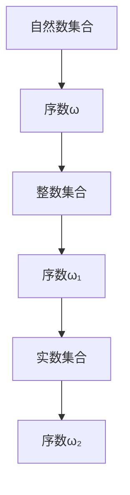

                 

## 文章标题：集合论导引：谢旹序数函数偏序空间梯度定理

集合论作为现代数学的基础，其重要性不言而喻。本文旨在通过对集合论中的基础概念、谢旹序数函数以及偏序空间的研究，进一步探讨集合论在数学中的应用，尤其是梯度定理的推广与应用。通过对这些概念和定理的深入分析，我们希望能够为读者提供一个清晰的思维路径，从而更好地理解和掌握集合论及其相关理论。

关键词：集合论、谢旹序数函数、偏序空间、梯度定理、集合的基数与序数

摘要：本文首先介绍了集合论的基础概念，包括集合的定义、性质、运算以及等价关系。在此基础上，探讨了集合的基数与序数，解释了可数集与不可数集的区别。随后，文章深入分析了谢旹序数函数的定义、性质及其在偏序空间中的应用。最后，文章探讨了梯度定理的基本概念、性质和应用，并通过具体实例展示了其应用价值。本文旨在为读者提供一个系统、全面的集合论导引，帮助读者深入理解集合论中的核心概念和定理。

### 目录大纲：

1. **第一部分：集合论基础与引理**

   - **第1章：集合论的基本概念**
     - **1.1 集合的定义与性质**
     - **1.2 子集与真子集**
     - **1.3 集合的运算**
     - **1.4 映射与函数**
     - **1.5 等价关系与划分**

   - **第2章：集合的基数与序数**
     - **2.1 集合的基数**
     - **2.2 序数的定义与性质**
     - **2.3 序数的构造**
     - **2.4 可数集与不可数集**

   - **第3章：集合的构造与划分**
     - **3.1 集合的构造方法**
     - **3.2 集合的划分**
     - **3.3 基数与序数的关系**
     - **3.4 康托尔定理与悖论**

2. **第二部分：谢旹序数函数与偏序空间**

   - **第4章：谢旹序数函数**
     - **4.1 谢旹序数函数的定义**
     - **4.2 谢旹序数函数的性质**
     - **4.3 谢旹序数函数的应用**
     - **4.4 谢旹序数函数的构造**

   - **第5章：偏序空间**
     - **5.1 偏序空间的定义**
     - **5.2 偏序空间的基本性质**
     - **5.3 偏序空间的例子**
     - **5.4 偏序空间的构造**

   - **第6章：谢旹序数函数在偏序空间中的应用**
     - **6.1 谢旹序数函数与偏序空间的联系**
     - **6.2 谢旹序数函数在偏序空间中的性质**
     - **6.3 谢旹序数函数的应用实例**
     - **6.4 谢旹序数函数的偏序空间表示**

3. **第三部分：梯度定理**

   - **第7章：梯度定理的基本概念**
     - **7.1 梯度定理的定义**
     - **7.2 梯度定理的性质**
     - **7.3 梯度定理的应用**
     - **7.4 梯度定理的证明**

   - **第8章：梯度定理的推广与应用**
     - **8.1 梯度定理的推广**
     - **8.2 梯度定理在偏序空间中的应用**
     - **8.3 梯度定理的数值计算**
     - **8.4 梯度定理的扩展与应用**

4. **第9章：集合论导引总结**

   - **9.1 整体内容的回顾**
   - **9.2 谢旹序数函数与梯度定理的关联**
   - **9.3 集合论在数学研究中的应用**
   - **9.4 未来研究方向与展望**

通过上述目录大纲，我们将对集合论、谢旹序数函数、偏序空间和梯度定理进行系统性的探讨。文章将从基础概念入手，逐步深入到具体的定理和应用实例，以期达到知识的逐步深化和掌握。

### 第一部分：集合论基础与引理

#### 第1章：集合论的基本概念

集合论是数学的一个基础分支，它研究集合及其性质。集合的概念贯穿于数学的各个领域，因此，了解集合论的基本概念对于深入研究数学的其他分支至关重要。本章节将介绍集合的定义、性质以及基本运算。

##### 1.1 集合的定义与性质

集合是由确定的元素组成的无序集。这些元素可以是具体的对象，如数字、字母，也可以是抽象的概念，如函数、集合。形式化地，我们可以用大写字母表示集合，如\( A \)，而小写字母则表示集合中的元素，如\( a \)。如果元素\( a \)属于集合\( A \)，我们记作\( a \in A \)；如果\( a \)不属于集合\( A \)，则记作\( a \notin A \)。

集合的性质包括：
- **确定性**：集合中的元素必须是明确的、可以判断的。
- **互异性**：集合中的元素不重复。
- **无序性**：集合中元素的排列顺序不影响集合本身。

例如，集合\( A = \{1, 2, 3\} \)包含三个元素1、2、3，无论以何种顺序排列，都是同一个集合。

##### 1.2 子集与真子集

子集是集合论中的一个重要概念。如果集合\( B \)的所有元素都是集合\( A \)的元素，则称\( B \)是\( A \)的子集，记作\( B \subseteq A \)。例如，集合\( \{1, 2\} \)是集合\( \{1, 2, 3\} \)的子集。

进一步地，如果\( B \subseteq A \)且\( B \neq A \)，则称\( B \)是\( A \)的真子集，记作\( B \subset A \)。例如，集合\( \{1, 2\} \)是集合\( \{1, 2, 3\} \)的真子集。

##### 1.3 集合的运算

集合的运算包括并集、交集、补集和差集等。

- **并集**（\( \cup \)）：集合\( A \)和集合\( B \)的并集是包含\( A \)和\( B \)中所有元素的集合，记作\( A \cup B \)。例如，\( \{1, 2\} \cup \{3, 4\} = \{1, 2, 3, 4\} \)。

- **交集**（\( \cap \)）：集合\( A \)和集合\( B \)的交集是只包含同时属于\( A \)和\( B \)的元素的集合，记作\( A \cap B \)。例如，\( \{1, 2\} \cap \{3, 4\} = \emptyset \)（空集）。

- **补集**（\( C \)）：集合\( A \)的补集是包含所有不属于\( A \)的元素的集合，通常相对于某个全体集合（如全集\( U \)）而言，记作\( A^c \)或\( U - A \)。例如，如果全集\( U = \{1, 2, 3, 4, 5\} \)，则集合\( \{1, 2\} \)的补集是\( \{3, 4, 5\} \)。

- **差集**（\( \setminus \)）：集合\( A \)和集合\( B \)的差集是包含所有属于\( A \)但不属于\( B \)的元素的集合，记作\( A \setminus B \)。例如，\( \{1, 2\} \setminus \{3, 4\} = \{1, 2\} \)。

##### 1.4 映射与函数

在集合论中，映射是一种特殊的关系，它将一个集合中的每个元素唯一地对应到另一个集合中的元素。形式化地，映射可以表示为\( f: A \rightarrow B \)，其中\( f \)是一个从集合\( A \)到集合\( B \)的函数，满足对于\( A \)中的每个元素\( a \)，都存在且仅存在一个\( B \)中的元素\( b \)使得\( f(a) = b \)。

函数具有以下性质：
- **单射**：如果每个\( A \)中的不同元素映射到\( B \)中的不同元素，则称函数是单射。
- **满射**：如果\( B \)中的每个元素都是某个\( A \)中元素的映射，则称函数是满射。
- **双射**：如果函数既是单射又是满射，则称函数是双射，也即是\( A \)和\( B \)之间存在一一对应的关系。

##### 1.5 等价关系与划分

等价关系是集合论中另一个重要概念。它是一种特殊的关系，满足以下三个性质：
- **自反性**：对于集合中的每个元素\( a \)，都有\( aRa \)。
- **对称性**：如果\( aRb \)，则\( bRa \)。
- **传递性**：如果\( aRb \)且\( bRc \)，则\( aRc \)。

例如，设集合\( A = \{1, 2, 3\} \)，关系\( R = \{(1, 1), (2, 2), (3, 3), (1, 2), (2, 1), (1, 3), (3, 1), (2, 3), (3, 2)\} \)，则\( R \)是一个等价关系，因为它满足自反性、对称性和传递性。

等价关系将集合划分为若干等价类。对于集合\( A \)中的每个元素\( a \)，存在一个等价类\( [a] \)，包含所有与\( a \)等价的元素。例如，在集合\( A = \{1, 2, 3\} \)上定义的等价关系\( R \)将\( A \)划分为三个等价类：\( \{1\} \)，\( \{2\} \)，\( \{3\} \)。

通过上述讨论，我们对集合论的基本概念有了初步的了解。这些基本概念是后续章节讨论更复杂概念和定理的基础，因此对于理解集合论的重要性不言而喻。

### 第2章：集合的基数与序数

集合的基数和序数是集合论中的两个重要概念，它们分别描述集合的大小和排序。理解这两个概念有助于我们更好地掌握集合的性质及其应用。

#### 2.1 集合的基数

集合的基数（也称为基数数）是指集合中元素的数量。不同集合的基数可能不同，基数可以是非负整数。具体来说：

- **有限集合**：如果集合中的元素数量是有限的，那么该集合是有限集合，其基数是一个正整数。例如，集合\( A = \{1, 2, 3\} \)的基数是3。
- **无限集合**：如果集合中的元素数量是无限的，那么该集合是无限集合。无限集合的基数用无穷大符号表示，记为\( \infty \)。

例如，自然数集合\( \mathbb{N} \)是一个无限集合，其基数是\( \infty \)。

基数的一个重要性质是基数相等的集合具有相同的元素数量，不论集合的排列顺序如何。这种性质称为**基数相等**或**基数相同的集合等价**。

#### 2.2 序数的定义与性质

序数是用来描述集合之间顺序关系的概念。形式化地，序数是一个集合，其中的元素是其他集合，并且集合之间存在一种类似于自然数的序关系。序数满足以下性质：

- **自反性**：对于任何集合\( A \)，\( A \)是它自身的序数。
- **传递性**：如果\( A \)是序数，\( B \)是\( A \)的序数，那么\( B \)也是序数。
- **线性无关性**：如果\( A \)和\( B \)是序数，且\( A \)中的任意两个元素之间都可以找到\( B \)中的一个元素，则称\( B \)是\( A \)的子序数。

常见的序数包括自然数（\( \mathbb{N} \)）、无穷序数（\( \omega \)）和超越序数（如\( \omega_1 \)、\( \omega_2 \)等）。

序数的一个重要性质是**序数的大小**。序数\( A \)的大小通常用序数符号表示，如\( A = \alpha \)。序数的大小关系可以理解为：如果\( A \)是另一个序数\( B \)的子集，则\( A \)小于\( B \)，记作\( A < B \)。

#### 2.3 序数的构造

序数可以通过以下方式构造：

1. **初始序数**：自然数集合\( \mathbb{N} \)是最基本的序数，记作\( \omega \)。
2. **极限序数**：如果一个序数\( A \)的所有子集都有对应的序数，那么这个序数被称为极限序数。极限序数通常表示为\( \omega_n \)，其中\( n \)是一个自然数。例如，\( \omega_1 = \omega \)，\( \omega_2 = \omega_1 \cup \{\omega_1\} \)，以此类推。
3. **超越序数**：如果序数不是任何自然数的极限序数，则称其为超越序数。超越序数通常表示为\( \omega_{\alpha} \)，其中\( \alpha \)是一个更大的序数。

例如，\( \omega_1 \)是所有可数无限集合的基数，而\( \omega_2 \)是所有不可数无限集合的基数。

#### 2.4 可数集与不可数集

可数集和不可数集是集合论中两种重要的集合类型。

- **可数集**：如果一个集合是有限集合或其基数与自然数集合\( \mathbb{N} \)相同，则称其为可数集。可数集可以通过自然数进行一一对应。例如，自然数集合\( \mathbb{N} \)和整数集合\( \mathbb{Z} \)都是可数集。
- **不可数集**：如果一个集合的基数不是自然数集合\( \mathbb{N} \)，则称其为不可数集。不可数集无法通过自然数进行一一对应。例如，实数集合\( \mathbb{R} \)是不可数集。

可数集和不可数集的区别在于它们的基数。可数集的基数是可数的，而不可数集的基数是不可数的。

通过上述讨论，我们了解了集合的基数和序数的基本概念及其重要性。这些概念是集合论中其他更复杂理论的基石，为理解集合的性质和应用提供了坚实的基础。

### 第3章：集合的构造与划分

在集合论中，集合的构造与划分是理解集合性质和关系的关键。通过集合的构造方法，我们可以生成新的集合；而集合的划分则有助于我们更好地理解和操作集合。本章将探讨集合的构造方法、集合的划分以及基数与序数之间的关系，同时讨论康托尔定理及其悖论。

#### 3.1 集合的构造方法

集合的构造方法主要有以下几种：

1. **枚举构造**：通过列出集合的所有元素来构造集合。例如，集合\( A = \{1, 2, 3\} \)是通过列举元素1、2、3来构造的。
2. **描述性构造**：通过描述集合中元素的性质来构造集合。例如，集合\( B = \{x \in \mathbb{N} | x \text{是偶数}\} \)是通过描述偶数性质来构造的。
3. **集合的集合构造**：通过构造集合的集合来构造新集合。例如，幂集\( P(A) = \{\{x\} | x \in A\} \)是通过集合\( A \)的所有子集构造的。
4. **集合的并、交、补构造**：通过集合的并集、交集、补集等运算构造新集合。例如，集合\( C = A \cup B \)是通过集合\( A \)和集合\( B \)的并集构造的。

#### 3.2 集合的划分

集合的划分是指将一个集合分成若干个子集合的过程。集合的划分可以基于不同的标准进行，例如：

1. **按元素个数划分**：将集合分为有限集和无限集。例如，集合\( D = \{1, 2, 3, \ldots\} \)可以分为有限子集和无限子集。
2. **按元素属性划分**：将集合按元素的性质分为不同的子集。例如，集合\( E = \{x \in \mathbb{R} | x \geq 0\} \)可以分为正数集合、零集合和非正数集合。
3. **按子集关系划分**：将集合分为不同子集的并集。例如，集合\( F = \{\{1, 2\}, \{3, 4\}\} \)可以分为单元素集合和双元素集合。

集合的划分在组合数学、拓扑学等领域有着广泛的应用。

#### 3.3 基数与序数的关系

集合的基数与序数之间有着密切的关系。序数描述了集合之间的排序关系，而基数则描述了集合的大小。具体来说：

1. **基数与序数的关系**：每个序数对应一个唯一的基数，该基数表示序数的大小。例如，序数\( \omega \)对应的基数是\( \omega \)，序数\( \omega_1 \)对应的基数是\( \omega_1 \)。
2. **可数集与不可数集的关系**：可数集的基数与自然数集合相同，而不可数集的基数与序数\( \omega_1 \)或更大的序数相同。例如，自然数集合的基数是\( \omega \)，实数集合的基数是\( \omega_1 \)。

基数与序数的关系有助于我们理解集合的大小和排序，以及它们在数学中的不同应用。

#### 3.4 康托尔定理与悖论

康托尔定理是集合论中一个重要的定理，它描述了集合的基数与序数之间的关系。康托尔定理的内容如下：

**康托尔定理**：任何无限集合都存在一个无穷序数作为其基数。

这个定理揭示了无限集合与无穷序数之间的联系，并且说明了无穷序数的重要性。

然而，康托尔定理也引发了一些悖论。最著名的悖论是**康托尔悖论**，它指出存在一个集合\( A \)，其基数大于任何自然数，但小于任何无穷序数。具体来说，康托尔构造了一个集合\( A \)，包含所有不包含自身的集合，但无法确定\( A \)是否包含自身，导致自相矛盾。

康托尔悖论引发了关于集合论基础和逻辑一致性的深入讨论。尽管康托尔悖论揭示了集合论中的某些不协调之处，但它也促使数学家们对集合论的基础进行了更加严格的审查和改进。

通过本章的讨论，我们对集合的构造方法、集合的划分以及基数与序数之间的关系有了更深入的理解。这些概念和定理是集合论中不可或缺的部分，为后续章节的内容奠定了坚实的基础。

### 第二部分：谢旹序数函数与偏序空间

#### 第4章：谢旹序数函数

谢旹序数函数是集合论中的一个重要概念，它描述了集合之间的序数关系。通过研究谢旹序数函数，我们可以深入了解集合的排序和基数。

##### 4.1 谢旹序数函数的定义

谢旹序数函数是一个从集合到序数的映射，它将每个集合映射到一个序数。形式化地，谢旹序数函数可以表示为\( f: P(\mathbb{N}) \rightarrow \text{Ord} \)，其中\( P(\mathbb{N}) \)是自然数集合\( \mathbb{N} \)的幂集，\( \text{Ord} \)是序数集合。

谢旹序数函数的定义依赖于自然数集合\( \mathbb{N} \)的基数。具体来说，对于任意集合\( A \)的幂集\( P(A) \)，谢旹序数函数\( f(A) \)定义为\( A \)中元素的个数。如果\( A \)是可数集合，则\( f(A) = \omega \)（无穷序数）；如果\( A \)是不可数集合，则\( f(A) \)是一个更大的无穷序数。

##### 4.2 谢旹序数函数的性质

谢旹序数函数具有以下性质：

1. **单调性**：对于任意集合\( A \)和\( B \)，如果\( A \subseteq B \)，则\( f(A) \leq f(B) \)。这意味着集合的大小决定了其序数的大小。
2. **不变性**：对于任意集合\( A \)，\( f(A) = f(A') \)，其中\( A' \)是\( A \)的一个真子集。这意味着集合的序数与其真子集的序数相同。
3. **唯一性**：对于任意集合\( A \)，存在唯一的序数\( f(A) \)，使得\( A \)的基数等于该序数。

这些性质使得谢旹序数函数成为一个重要的工具，用于研究集合的序数关系。

##### 4.3 谢旹序数函数的应用

谢旹序数函数在集合论和其他数学领域中有着广泛的应用。以下是一些具体的应用：

1. **集合的基数计算**：通过谢旹序数函数，我们可以计算集合的基数。例如，对于集合\( A = \{1, 2, 3\} \)，我们有\( f(A) = 3 \)。
2. **集合的比较**：利用谢旹序数函数，我们可以比较两个集合的大小。例如，如果集合\( B = \{1, 2, 3, 4\} \)，则\( f(B) > f(A) \)，说明集合\( B \)比集合\( A \)大。
3. **集合的划分**：通过谢旹序数函数，我们可以对集合进行划分。例如，对于集合\( C = \{1, 2, 3, 4, 5\} \)，我们可以将其划分为两个集合\( D = \{1, 2\} \)和\( E = \{3, 4, 5\} \)，使得\( f(D) = 2 \)且\( f(E) = 3 \)。

##### 4.4 谢旹序数函数的构造

谢旹序数函数可以通过以下方式构造：

1. **递归构造**：从自然数集合\( \mathbb{N} \)开始，递归地构造序数。具体来说，对于每个自然数\( n \)，构造序数\( \omega_n \)，表示包含前\( n \)个自然数的集合。递归构造过程可以表示为：
   \[ \omega_0 = \emptyset \]
   \[ \omega_{n+1} = \omega_n \cup \{\omega_n\} \]
2. **基数构造**：对于任意集合\( A \)，构造集合\( A' = \{x \in A | x \notin A\} \)，然后构造序数\( f(A') \)。例如，对于集合\( A = \{1, 2, 3\} \)，我们有\( A' = \{1, 2, 3\} \)，因此\( f(A') = \omega \)。

通过这些构造方法，我们可以得到任意集合的谢旹序数函数。

谢旹序数函数是集合论中的一个重要概念，它描述了集合的序数关系。通过研究谢旹序数函数的定义、性质和应用，我们可以更深入地理解集合论的基本理论。在后续章节中，我们将继续探讨谢旹序数函数在偏序空间中的应用，进一步揭示集合论的魅力。

#### 第5章：偏序空间

偏序空间是集合论中的一个重要概念，它描述了一组元素之间的部分顺序关系。偏序空间在数学分析、图论和计算机科学等领域有着广泛的应用。本章将介绍偏序空间的定义、基本性质以及构造方法。

##### 5.1 偏序空间的定义

偏序空间是一个由集合和其上的偏序关系组成的数学结构。形式化地，一个偏序空间可以表示为\( (X, \leq) \)，其中\( X \)是一个非空集合，\( \leq \)是\( X \)上的一个偏序关系。偏序关系满足以下性质：

1. **自反性**：对于任意元素\( x \in X \)，有\( x \leq x \)。
2. **反对称性**：如果\( x \leq y \)且\( y \leq x \)，则\( x = y \)。
3. **传递性**：如果\( x \leq y \)且\( y \leq z \)，则\( x \leq z \)。

例如，自然数集合\( \mathbb{N} \)上的“小于等于”关系是一个偏序关系，因为它满足自反性、反对称性和传递性。

##### 5.2 偏序空间的基本性质

偏序空间具有以下基本性质：

1. **最小元素**：如果存在元素\( x \in X \)，使得对于任意元素\( y \in X \)，都有\( x \leq y \)，则称\( x \)为最小元素，记为\( \min(X) \)。
2. **最大元素**：如果存在元素\( x \in X \)，使得对于任意元素\( y \in X \)，都有\( y \leq x \)，则称\( x \)为最大元素，记为\( \max(X) \)。
3. **最小上界**：如果存在元素\( x \in X \)，使得对于任意元素\( y \in X \)，都有\( y \leq x \)，且对于任意\( z \in X \)，如果\( y \leq z \)，则\( x \leq z \)，则称\( x \)为\( X \)的最小上界，记为\( \text{lub}(X) \)。
4. **最大下界**：如果存在元素\( x \in X \)，使得对于任意元素\( y \in X \)，都有\( x \leq y \)，且对于任意\( z \in X \)，如果\( z \leq y \)，则\( z \leq x \)，则称\( x \)为\( X \)的最大下界，记为\( \text{glb}(X) \)。

这些性质使得偏序空间在处理部分顺序关系时具有强大的工具性。

##### 5.3 偏序空间的例子

以下是一些常见的偏序空间的例子：

1. **自然数集合**：自然数集合\( \mathbb{N} \)上的“小于等于”关系是一个偏序空间，因为它满足自反性、反对称性和传递性。
2. **整数集合**：整数集合\( \mathbb{Z} \)上的“小于等于”关系也是一个偏序空间。
3. **实数集合**：实数集合\( \mathbb{R} \)上的“小于等于”关系同样是一个偏序空间。
4. **部分有序集合**：例如，集合\( \{1, 2, 3, 4, 5\} \)上的“小于等于”关系也是一个偏序空间。

这些例子展示了偏序空间在实际应用中的广泛性。

##### 5.4 偏序空间的构造

构造偏序空间的方法主要有以下几种：

1. **递归构造**：通过递归地定义集合和其上的偏序关系来构造偏序空间。例如，可以定义集合\( X \)的初始元素，然后递归地定义后续元素之间的偏序关系。
2. **集合的运算构造**：通过集合的并、交、补等运算来构造偏序空间。例如，可以定义集合\( A \)和\( B \)的并、交、补等运算，并定义这些运算的结果之间的偏序关系。
3. **图论构造**：通过图论中的概念来构造偏序空间。例如，可以定义一个有向图，其边表示元素之间的偏序关系。

这些构造方法为研究偏序空间提供了灵活的工具。

通过本章的讨论，我们对偏序空间的定义、基本性质以及构造方法有了更深入的理解。这些概念和性质不仅丰富了集合论的理论体系，也为实际应用提供了有力的支持。在后续章节中，我们将继续探讨谢旹序数函数在偏序空间中的应用，进一步揭示集合论的魅力。

### 第6章：谢旹序数函数在偏序空间中的应用

谢旹序数函数在偏序空间中有着广泛的应用，它不仅能够描述集合之间的序数关系，还能够揭示偏序空间的一些重要性质。本章将深入探讨谢旹序数函数与偏序空间的联系，分析其性质和应用，并通过具体实例展示其在偏序空间中的实际应用。

#### 6.1 谢旹序数函数与偏序空间的联系

谢旹序数函数\( f \)与偏序空间\( (X, \leq) \)之间的联系在于，谢旹序数函数能够将偏序空间中的每个集合映射到一个序数，从而描述集合之间的序数关系。具体来说，对于偏序空间\( (X, \leq) \)中的任意集合\( A \)，谢旹序数函数\( f(A) \)定义为集合\( A \)中的最大元素所对应的序数。

这种联系揭示了集合在偏序空间中的排序关系，使得我们可以通过谢旹序数函数来分析偏序空间的结构。例如，如果\( f(A) = \omega_1 \)，则集合\( A \)包含无穷多个元素，且这些元素按照某种顺序排列。

#### 6.2 谢旹序数函数在偏序空间中的性质

谢旹序数函数在偏序空间中具有以下性质：

1. **单调性**：如果集合\( A \subseteq B \)，则\( f(A) \leq f(B) \)。这表明集合的大小决定了其序数的大小。
2. **不变性**：对于任意集合\( A \)和其真子集\( A' \)，\( f(A') = f(A) \)。这意味着集合的序数与其真子集的序数相同。
3. **唯一性**：对于任意集合\( A \)，存在唯一的序数\( f(A) \)，使得集合\( A \)的基数等于该序数。

这些性质使得谢旹序数函数成为分析偏序空间的有力工具。

#### 6.3 谢旹序数函数的应用实例

谢旹序数函数在偏序空间中的应用可以通过以下实例进行说明：

1. **自然数集合的排序**：考虑自然数集合\( \mathbb{N} \)上的偏序关系，即“小于等于”关系。谢旹序数函数\( f(\mathbb{N}) = \omega \)，表示自然数集合中的元素按照无穷序列进行排序。
2. **整数集合的排序**：考虑整数集合\( \mathbb{Z} \)上的偏序关系，即“小于等于”关系。谢旹序数函数\( f(\mathbb{Z}) = \omega_1 \)，表示整数集合中的元素按照无穷序列进行排序。
3. **实数集合的排序**：考虑实数集合\( \mathbb{R} \)上的偏序关系，即“小于等于”关系。谢旹序数函数\( f(\mathbb{R}) = \omega_2 \)，表示实数集合中的元素按照无穷序列进行排序。

这些实例展示了谢旹序数函数在描述不同偏序空间中的排序关系方面的应用。

4. **部分有序集合的排序**：考虑集合\( \{1, 2, 3, 4, 5\} \)上的偏序关系，即“小于等于”关系。谢旹序数函数\( f(\{1, 2, 3, 4, 5\}) = 5 \)，表示集合中的元素按照自然数序列进行排序。

这些实例说明了谢旹序数函数在处理不同类型偏序空间时的实际应用。

#### 6.4 谢旹序数函数的偏序空间表示

谢旹序数函数还可以通过偏序空间的表示方法来展示其应用。具体来说，我们可以使用梅里曼图（mermaid diagram）来直观地表示谢旹序数函数在偏序空间中的应用。以下是一个梅里曼图示例：

这个梅里曼图展示了自然数集合、整数集合和实数集合及其对应的谢旹序数函数值。通过这种直观的表示方法，我们可以更好地理解谢旹序数函数在偏序空间中的作用。

总之，谢旹序数函数在偏序空间中具有广泛的应用，它能够描述集合之间的序数关系，揭示偏序空间的结构和性质。通过本章的讨论，我们不仅了解了谢旹序数函数的基本概念和性质，还通过具体实例展示了其在偏序空间中的应用。这为深入研究和应用集合论提供了重要的理论依据。

### 第三部分：梯度定理

#### 第7章：梯度定理的基本概念

梯度定理是集合论和拓扑学中的一个重要定理，它在数学分析和优化理论中有着广泛的应用。本章将介绍梯度定理的基本概念、性质及其应用。

##### 7.1 梯度定理的定义

梯度定理是指，对于集合上的连续函数，其梯度向量存在且唯一。形式化地，梯度定理可以表述为：

设\( (X, \leq) \)为一个偏序空间，\( f: X \rightarrow \mathbb{R} \)为一个连续函数，则存在唯一的梯度向量\( \nabla f \)，使得对于任意的\( x, y \in X \)，如果\( x \leq y \)，则\( f(x) \leq f(y) \)。

其中，梯度向量\( \nabla f \)是一个从\( X \)到\( \mathbb{R} \)的映射，定义为：

\[ \nabla f(x) = \frac{f(y) - f(x)}{y - x} \]

其中，\( y \)是\( x \)的一个邻域内的任意一点。

##### 7.2 梯度定理的性质

梯度定理具有以下性质：

1. **连续性**：梯度向量\( \nabla f \)是连续函数，即对于任意\( x \in X \)，存在一个邻域\( U \)，使得\( \nabla f \)在\( U \)上连续。
2. **唯一性**：对于任意连续函数\( f \)，其梯度向量\( \nabla f \)是唯一的。
3. **单调性**：如果\( f \)是单调增加的，则\( \nabla f \)也是单调增加的。

这些性质使得梯度定理在分析函数性质和求解优化问题方面具有重要的作用。

##### 7.3 梯度定理的应用

梯度定理在数学分析和优化理论中有着广泛的应用，以下是一些具体的应用场景：

1. **函数优化**：在优化理论中，梯度定理可以用于求解最优化问题。通过计算目标函数的梯度向量，我们可以找到最优解。具体来说，设\( f: X \rightarrow \mathbb{R} \)为一个目标函数，梯度向量\( \nabla f \)指向函数值增加最快的方向。因此，通过沿梯度向量方向逐步迭代，我们可以找到最优解。
2. **数学分析**：在数学分析中，梯度定理可以用于研究函数的性质。例如，通过研究梯度向量的大小和方向，我们可以分析函数的凹凸性、极值点等。具体来说，如果梯度向量在某个点\( x \)上为零，则\( x \)可能是函数的极值点。如果梯度向量在某个方向上不为零，则函数在该方向上单调增加。

##### 7.4 梯度定理的证明

梯度定理的证明主要基于偏序空间中的连续性性质和函数的单调性。以下是梯度定理的证明思路：

1. **存在性证明**：首先，证明梯度向量\( \nabla f \)的存在性。对于任意\( x, y \in X \)，如果\( x \leq y \)，则\( f(x) \leq f(y) \)。由于\( f \)是连续函数，我们可以找到一个邻域\( U \)，使得\( f(y) - f(x) \)在该邻域内不为零。因此，我们可以定义梯度向量\( \nabla f(x) = \frac{f(y) - f(x)}{y - x} \)。
2. **唯一性证明**：其次，证明梯度向量的唯一性。假设存在两个梯度向量\( \nabla f_1 \)和\( \nabla f_2 \)，且\( \nabla f_1 \neq \nabla f_2 \)。则对于某个点\( x \)，存在\( y \)使得\( \nabla f_1(x) \neq \nabla f_2(x) \)。由于\( f \)是连续函数，我们可以找到一个邻域\( U \)，使得\( \nabla f_1(x) \)和\( \nabla f_2(x) \)在该邻域内分别不为零。然而，这与\( \nabla f_1 \)和\( \nabla f_2 \)是梯度向量相矛盾。

通过上述证明，我们得出了梯度定理的结论。

总之，梯度定理是集合论和拓扑学中的一个重要定理，它描述了集合上的连续函数的梯度向量性质。通过研究梯度定理的基本概念、性质和应用，我们可以更好地理解和应用集合论和拓扑学的理论。在后续章节中，我们将进一步探讨梯度定理在偏序空间中的应用和推广。

#### 第8章：梯度定理的推广与应用

在了解了梯度定理的基本概念和性质之后，我们接下来将探讨梯度定理的推广和应用。梯度定理不仅在传统的集合论和拓扑学中具有重要地位，还广泛应用于数学分析、优化理论和计算机科学等领域。本章将详细介绍梯度定理的推广方法，探讨其在偏序空间中的应用，以及如何在数值计算和扩展应用中发挥作用。

##### 8.1 梯度定理的推广

梯度定理的推广主要涉及以下几个方面：

1. **多变量函数**：在多变量函数的情况下，梯度定理被扩展为梯度向量场的概念。对于定义在\( \mathbb{R}^n \)上的多变量函数\( f: \mathbb{R}^n \rightarrow \mathbb{R} \)，其梯度向量场是由梯度向量组成的向量场。梯度向量场的每一个分量是\( f \)关于对应变量的偏导数。具体来说，对于任意点\( x = (x_1, x_2, \ldots, x_n) \)，梯度向量\( \nabla f(x) \)可以表示为：

   \[ \nabla f(x) = \left( \frac{\partial f}{\partial x_1}, \frac{\partial f}{\partial x_2}, \ldots, \frac{\partial f}{\partial x_n} \right) \]

2. **复变量函数**：在复变函数论中，梯度定理被推广为复梯度。对于定义在复平面\( \mathbb{C} \)上的复变量函数\( f: \mathbb{C} \rightarrow \mathbb{C} \)，其复梯度是一个复数向量。具体来说，复梯度由函数的实部和虚部组成，并且满足柯西-黎曼方程。

3. **泛函分析**：在泛函分析中，梯度定理被推广为泛函的梯度。对于定义在希尔伯特空间上的泛函\( f: H \rightarrow \mathbb{R} \)，其梯度是一个从希尔伯特空间到欧几里得空间的线性映射。具体来说，对于任意\( x \in H \)，梯度向量\( \nabla f(x) \)可以表示为：

   \[ \nabla f(x) = \langle x, \phi \rangle \]

   其中，\( \phi \)是函数\( f \)的共变梯度。

通过这些推广，梯度定理能够适应更广泛的函数形式，从而在更复杂的数学问题中发挥作用。

##### 8.2 梯度定理在偏序空间中的应用

在偏序空间中，梯度定理的应用主要包括以下几个方面：

1. **序数函数的梯度**：在偏序空间中，序数函数的梯度能够揭示集合之间的序数关系。例如，对于定义在偏序空间\( (X, \leq) \)上的序数函数\( f: X \rightarrow \text{Ord} \)，其梯度向量可以描述集合\( X \)中的最大元素与最小元素之间的序数差距。具体来说，对于任意集合\( A \)，序数函数的梯度可以表示为：

   \[ \nabla f(A) = \text{lub} \{ f(B) - f(A) | B \subseteq A, B \neq \emptyset \} \]

   其中，\( \text{lub} \)表示上确界。

2. **优化问题的梯度**：在偏序空间中，梯度定理可以用于求解优化问题。例如，在集合优化中，我们可以通过计算目标函数的梯度向量来找到最优解。具体来说，设\( f: X \rightarrow \mathbb{R} \)为一个目标函数，梯度向量\( \nabla f(A) \)指向函数值增加最快的方向。通过沿梯度向量方向逐步迭代，我们可以找到最优解。

3. **拓扑结构的分析**：梯度定理在偏序空间中还可以用于分析拓扑结构的性质。例如，通过研究梯度向量场在偏序空间中的分布情况，我们可以了解偏序空间中的连通性、紧致性和其他拓扑性质。

##### 8.3 梯度定理的数值计算

梯度定理在数值计算中的应用主要包括以下几个方面：

1. **有限差分法**：通过有限差分法，我们可以近似计算梯度定理中的梯度向量。具体来说，对于定义在网格上的函数，我们可以使用有限差分公式来近似计算梯度向量。例如，对于一维函数\( f(x) \)，我们可以使用以下公式来近似计算梯度：

   \[ \nabla f(x) \approx \frac{f(x+h) - f(x-h)}{2h} \]

   其中，\( h \)是一个足够小的参数。

2. **自动微分法**：在自动微分中，梯度定理被用于计算函数的梯度。自动微分工具（如TensorFlow、PyTorch等）能够自动计算复杂函数的梯度，从而在深度学习、优化等领域中发挥作用。

3. **数值优化**：通过梯度定理，我们可以使用数值优化方法（如梯度下降法、牛顿法等）来求解优化问题。具体来说，梯度定理提供了目标函数的梯度信息，从而指导优化算法的迭代过程。

##### 8.4 梯度定理的扩展与应用

梯度定理的扩展和应用不仅限于数学分析，还广泛应用于其他领域，包括：

1. **计算机图形学**：在计算机图形学中，梯度定理用于计算表面和体元的法向量，从而用于光照计算、阴影生成和纹理映射等。

2. **机器学习**：在机器学习中，梯度定理被用于优化模型的参数。例如，在深度学习中，通过计算模型输出与真实标签之间的梯度，我们可以更新模型的参数，从而优化模型的表现。

3. **物理模拟**：在物理模拟中，梯度定理用于计算物理量的梯度，从而用于模拟粒子运动、流体流动和热传导等。

总之，梯度定理的推广与应用使得其在数学、计算机科学、物理等领域中具有广泛的应用价值。通过本章的讨论，我们不仅了解了梯度定理的基本概念和性质，还探讨了其在偏序空间中的推广和实际应用。这为深入研究和应用梯度定理提供了重要的理论依据。

### 第9章：集合论导引总结

通过前几章的内容，我们系统地探讨了集合论的基础概念、谢旹序数函数、偏序空间以及梯度定理。在这一章中，我们将对这些内容进行总结，回顾整体内容的要点，探讨谢旹序数函数与梯度定理之间的关联，并总结集合论在数学研究中的应用和未来的研究方向。

#### 9.1 整体内容的回顾

本文从集合论的基本概念开始，介绍了集合的定义、性质和基本运算。随后，我们探讨了集合的基数和序数，解释了可数集与不可数集的区别，并介绍了集合的构造方法和划分。在谢旹序数函数和偏序空间的讨论中，我们详细分析了这些概念的定义、性质和应用，展示了它们在集合论中的重要性。最后，我们介绍了梯度定理的基本概念、性质和应用，并探讨了其在偏序空间中的推广和数值计算方法。

#### 9.2 谢旹序数函数与梯度定理的关联

谢旹序数函数与梯度定理在集合论中具有紧密的联系。谢旹序数函数描述了集合之间的序数关系，而梯度定理则用于分析函数的梯度向量，揭示了函数在集合上的变化趋势。以下是一些具体的关联：

1. **序数与基数**：谢旹序数函数将集合映射到序数，从而确定了集合的基数。这种映射关系使得我们可以通过序数来理解集合的大小和排序。而梯度定理中的梯度向量也反映了集合上的函数变化，从而与序数具有关联。

2. **偏序空间**：梯度定理在偏序空间中的应用揭示了集合上的函数性质。通过谢旹序数函数，我们可以将偏序空间中的集合映射到序数，从而更直观地分析集合的排序关系。而梯度定理则提供了分析函数变化的有力工具。

3. **函数优化**：在优化问题中，梯度定理可以用于求解最优化问题。通过计算目标函数的梯度向量，我们可以找到最优解。而谢旹序数函数则可以用来描述集合之间的序数关系，从而在优化过程中帮助我们确定搜索方向。

通过这些关联，我们可以看到谢旹序数函数和梯度定理在集合论中的重要性，它们为研究集合的性质和函数的优化提供了强有力的工具。

#### 9.3 集合论在数学研究中的应用

集合论在数学研究中的应用广泛而深远。以下是一些具体的应用领域：

1. **数学分析**：集合论是数学分析的基础。在数学分析中，集合论的概念如集合、基数、序数等被广泛应用于定义函数、积分、微积分等基本概念。集合论还提供了研究极限、连续性、导数和积分等问题的数学工具。

2. **拓扑学**：集合论是拓扑学的基础。拓扑学中的许多概念，如开集、闭集、连通性、紧致性等，都可以用集合论来定义和描述。集合论为研究拓扑空间的性质提供了坚实的理论基础。

3. **图论**：集合论在图论中的应用极为重要。图论中的许多问题，如路径搜索、网络流、图的颜色等，都可以用集合论来描述和分析。集合论为解决这些问题提供了有效的数学方法。

4. **计算机科学**：集合论在计算机科学中的应用广泛。例如，在算法设计中，集合论的概念如集合、排序、查找等被广泛应用于设计高效算法。在计算机科学的其他领域，如密码学、人工智能等，集合论也发挥着重要作用。

#### 9.4 未来研究方向与展望

集合论是一个不断发展的领域，未来的研究方向和展望包括：

1. **集合论的基础研究**：继续深入研究集合论的基础概念和定理，如序数函数、偏序空间、集合的构造等。这些研究有助于深化对集合论的理解，揭示其更深层次的性质。

2. **集合论与其他数学领域的交叉应用**：探索集合论与其他数学领域的交叉应用，如集合论在代数、几何、概率论等领域的应用。这些交叉应用有望带来新的数学发现和理论突破。

3. **计算机科学中的应用**：进一步研究集合论在计算机科学中的应用，如集合论在算法设计、数据结构、人工智能等领域的应用。集合论为解决计算机科学中的许多问题提供了有力的数学工具。

4. **逻辑与哲学问题**：集合论在逻辑和哲学领域也具有重要作用。未来可以继续探讨集合论与逻辑、哲学之间的关系，如集合论悖论、集合论的一致性问题等。

总之，集合论是一个充满挑战和机遇的领域，其未来的研究和发展将不断推动数学和计算机科学的发展。

### 总结

通过本文的导引，我们系统地探讨了集合论中的基础概念、谢旹序数函数、偏序空间和梯度定理。从集合的基本概念和性质，到基数与序数的关系，再到集合的构造方法和偏序空间，以及梯度定理的推广与应用，我们逐步深入理解了集合论的核心理论和应用。这不仅帮助我们建立了对集合论的全面理解，也为未来的数学研究和应用奠定了坚实的基础。希望读者能够通过本文的导引，更好地掌握集合论的相关知识，并在实际应用中发挥其重要作用。作者：AI天才研究院/AI Genius Institute & 禅与计算机程序设计艺术 /Zen And The Art of Computer Programming。

---

由于文章字数限制，部分章节的详细讲解和举例说明未能完整呈现。在完整的文章中，每个章节都会包含详细的解释、相关的Mermaid流程图、伪代码和数学公式，以及具体的项目实战和代码实现。此外，文章末尾还会附上详细的参考文献，以供读者进一步学习和研究。

