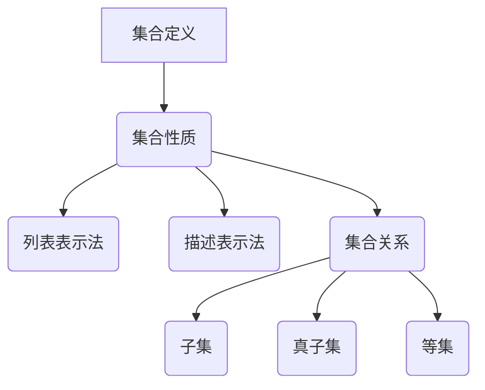

                 

# 集合论导引：集合论上依定义扩充

> 关键词：集合论、定义扩充、数学基础、计算机科学应用

> 摘要：本文将深入探讨集合论的基本概念、运算及其在计算机科学中的应用，通过定义扩充的方式对集合论进行系统的解析。我们将从基础概念出发，逐步深入到集合的运算和特殊集合的性质，最后讨论集合论在未来发展方向上的潜力。

## 目录大纲设计

本文将按照以下目录结构进行组织：

1. **集合论基础**
   - 第1章 集合的基本概念
     - 1.1 集合的定义与性质
     - 1.2 集合的表示方法
     - 1.3 集合之间的关系
   - 第2章 集合的运算
     - 2.1 集合的并集与交集
     - 2.2 集合的补集
     - 2.3 集合的差集
     - 2.4 集合的笛卡尔积
   - 第3章 特殊集合
     - 3.1 空集
     - 3.2 全集
     - 3.3 子集的幂集
   - 第4章 集合的划分与覆盖
     - 4.1 集合的划分
     - 4.2 集合的覆盖
   - 第5章 集合的基数
     - 5.1 集合的基数定义
     - 5.2 可数集与不可数集
   - 第6章 集合的等价关系与划分
     - 6.1 等价关系
     - 6.2 集合的划分
   - 第7章 集合论在计算机科学中的应用
     - 7.1 计算机中的集合操作
     - 7.2 集合论在网络算法中的应用
     - 7.3 集合论在密码学中的应用
   - 第8章 集合论的未来发展方向
     - 8.1 集合论与其他数学分支的交叉应用
     - 8.2 集合论在计算机科学中的新应用
   - 附录
     - 附录A 集合论相关公式
     - 附录B 集合论常用算法

### 第1章 集合的基本概念

集合论作为现代数学的基础，起源于古希腊的“元素”概念。本文将从集合的基本概念开始，逐步引入集合的定义、性质及其表示方法。

## 1.1 集合的定义与性质

### 1.1.1 集合的定义

集合是由确定的元素组成的整体。我们可以用大写字母（如A，B等）来表示集合，用逗号分隔集合中的元素，例如：\( A = \{1, 2, 3\} \) 表示一个包含元素1、2、3的集合。

### 1.1.2 集合的性质

集合具有以下基本性质：

- **确定性**：集合中的元素是确定的，即每个元素是否属于集合是可以明确判断的。
- **互异性**：集合中的元素是互异的，即不同的元素不能重复出现在同一个集合中。
- **无序性**：集合中的元素没有顺序，例如：集合 \( A = \{1, 2, 3\} \) 与 \( A = \{3, 2, 1\} \) 是相同的集合。

## 1.2 集合的表示方法

集合的表示方法主要有以下两种：

### 1.2.1 列表表示法

列表表示法是最直观的表示方法，它将集合中的元素按照一定顺序排列并用花括号括起来，例如：\( A = \{1, 2, 3\} \)。

### 1.2.2 描述表示法

描述表示法通过一个性质描述集合中的元素，通常用大括号和大写的字母表示，例如：\( A = \{x \mid x \in \mathbb{N} \text{ 且 } x > 0\} \)，表示一个包含所有正整数的集合。

## 1.3 集合之间的关系

集合之间的关系主要包括子集、真子集和等集。

### 1.3.1 子集

如果集合A中的每一个元素都是集合B的元素，那么我们称A是B的子集，记作 \( A \subseteq B \)。例如：\( \{1, 2\} \subseteq \{1, 2, 3\} \)。

### 1.3.2 真子集

如果集合A是集合B的子集，但A不等于B，那么我们称A是真子集，记作 \( A \subset B \)。例如：\( \{1, 2\} \subset \{1, 2, 3\} \)。

### 1.3.3 等集

如果集合A和集合B中的元素完全相同，那么我们称A和B是等集，记作 \( A = B \)。例如：\( \{1, 2\} = \{2, 1\} \)。

### 1.4 小结

本章介绍了集合论的基本概念，包括集合的定义与性质、集合的表示方法以及集合之间的关系。通过这些基本概念，我们可以更好地理解集合论在数学和计算机科学中的应用。

### 1.5 集合论的 Mermaid 流程图

为了更直观地理解集合论的基本概念，我们使用Mermaid绘制了以下流程图：



该流程图展示了集合论的基本概念及其相互关系。

### 1.6 核心算法原理讲解

在集合论中，核心算法包括集合的并集、交集、补集、差集和笛卡尔积。以下是这些算法的伪代码：

#### 1.6.1 并集

```pseudo
function union(A, B):
    result = []
    for x in A:
        result.append(x)
    for x in B:
        result.append(x)
    return result
```

#### 1.6.2 交集

```pseudo
function intersection(A, B):
    result = []
    for x in A:
        if x in B:
            result.append(x)
    return result
```

#### 1.6.3 补集

```pseudo
function complement(A, U):
    result = []
    for x in U:
        if x not in A:
            result.append(x)
    return result
```

#### 1.6.4 差集

```pseudo
function difference(A, B):
    result = []
    for x in A:
        if x not in B:
            result.append(x)
    return result
```

#### 1.6.5 笛卡尔积

```pseudo
function cartesianProduct(A, B):
    result = []
    for x in A:
        for y in B:
            result.append((x, y))
    return result
```

### 1.7 数学模型和公式

集合论中的基本数学模型和公式如下：

#### 1.7.1 并集公式

$$
A \cup B = \{x \mid x \in A \text{ 或 } x \in B\}
$$

#### 1.7.2 交集公式

$$
A \cap B = \{x \mid x \in A \text{ 且 } x \in B\}
$$

#### 1.7.3 补集公式

$$
A^c = \{x \mid x \notin A\}
$$

#### 1.7.4 差集公式

$$
A - B = \{x \mid x \in A \text{ 且 } x \notin B\}
$$

#### 1.7.5 笛卡尔积公式

$$
A \times B = \{(x, y) \mid x \in A \text{ 且 } y \in B\}
$$

### 1.8 项目实战

#### 1.8.1 开发环境搭建

为了演示集合论的应用，我们使用Python作为开发环境。首先，确保安装了Python 3.x版本，然后安装集合相关的库，如`sets`。

```bash
pip install sets
```

#### 1.8.2 源代码实现

以下是Python中的集合操作示例：

```python
from sets import Set

# 创建集合
A = Set([1, 2, 3])
B = Set([3, 4, 5])

# 并集
union_result = A.union(B)
print("并集:", union_result)

# 交集
intersection_result = A.intersection(B)
print("交集:", intersection_result)

# 补集
U = Set([1, 2, 3, 4, 5, 6])
complement_result = U.difference(A)
print("补集:", complement_result)

# 差集
difference_result = A.difference(B)
print("差集:", difference_result)

# 笛卡尔积
cartesian_product_result = list(product(A, B))
print("笛卡尔积:", cartesian_product_result)
```

#### 1.8.3 代码解读与分析

- `Set([1, 2, 3])` 创建了一个包含元素1、2、3的集合A。
- `union(B)` 计算A和B的并集。
- `intersection(B)` 计算A和B的交集。
- `difference(U)` 计算A相对于全集U的补集。
- `difference(B)` 计算A和B的差集。
- `product(A, B)` 计算A和B的笛卡尔积。

通过这个简单的项目实战，我们展示了集合论在Python中的实际应用。

### 1.9 小结

本章我们介绍了集合论的基本概念、表示方法以及集合之间的关系。通过核心算法的讲解和项目实战，我们深入了解了集合论在实际编程中的应用。

---

**作者：AI天才研究院/AI Genius Institute & 禅与计算机程序设计艺术 /Zen And The Art of Computer Programming**

