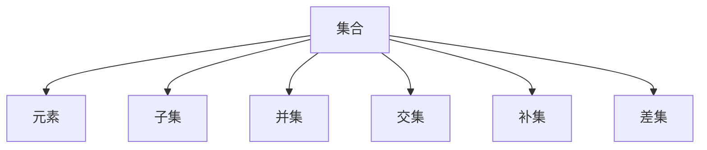

                 

### 文章标题：集合论导引：集合论内模型

集合论是现代数学的核心之一，它为我们提供了一个强有力的工具来理解和描述数学对象及其之间的关系。在集合论的体系中，内模型（internal models）是一个重要的概念，它不仅帮助我们更深入地理解集合论的基本原理，还能在处理复杂的集合论问题时提供有力的工具。本文将探讨集合论的内模型，包括其基本概念、构造方法、应用以及与公理系统之间的关系。

### 文章关键词

- 集合论
- 内模型
- 数学公理
- 集合构造
- 集合运算
- 集合势

### 文章摘要

本文首先介绍了集合论的基本概念和集合的表示方法。随后，我们讨论了集合的基本运算，包括并集、交集和补集。接着，我们介绍了集合的势与基数，探讨了有限集、无限集以及可数集与不可数集的区别。本文的核心内容在于对集合论内模型的深入探讨，包括内模型的基本概念、构造方法及其在集合论中的应用。最后，我们讨论了内模型与公理系统之间的关系，并展望了集合论的未来发展方向。

## 第1章 引言与核心概念

### 1.1 集合论的基本概念

集合论起源于19世纪，由德国数学家康托尔开创。集合是数学中的基本概念，它是由确定的、互异的元素组成的整体。集合的元素可以是任何对象，无论是具体的物体、抽象的数字，还是复杂的结构。集合中的元素是无序且互异的，这意味着集合中的每个元素都是唯一的，且元素之间的顺序不影响集合的性质。

集合可以用大括号 `{}` 来表示。例如，集合 \( A = \{1, 2, 3\} \) 包含三个元素：1、2 和 3。如果我们说 \( x \in A \)，则表示元素 \( x \) 属于集合 \( A \)。同样，\( x \notin A \) 表示元素 \( x \) 不属于集合 \( A \)。

### 1.2 集合的表示方法

集合的表示方法主要有三种：列举法、描述法和符号表示法。

#### 列举法

列举法是最直观的表示方法，它将集合的所有元素一一列出。例如，集合 \( A = \{1, 2, 3\} \) 就是使用列举法表示的。

#### 描述法

描述法通过一个条件来定义集合。例如，集合 \( B = \{x \mid x \text{ 是自然数}\} \) 表示所有自然数的集合。这里的符号 \( \mid \) 读作“满足”，表示集合 \( B \) 包含所有满足条件“x 是自然数”的元素。

#### 符号表示法

符号表示法使用特定的数学符号来表示集合。例如，\( \mathbb{N} \) 表示自然数集合，\( \mathbb{Z} \) 表示整数集合，\( \mathbb{Q} \) 表示有理数集合，\( \mathbb{R} \) 表示实数集合。

### 1.3 集合的性质与操作

集合的性质包括确定性、互异性和无序性。

- 确定性：给定一个集合，它的元素是确定的，不会重复，也不会遗漏。
- 互异性：集合中的元素是互异的，即不同的元素代表不同的对象。
- 无序性：集合中的元素没有固定的顺序，也就是说，集合 \( A = \{1, 2, 3\} \) 与集合 \( A = \{3, 2, 1\} \) 是相同的。

集合的操作是集合论中的核心内容，主要包括并集、交集、补集和差集等。

#### 并集

两个集合 \( A \) 和 \( B \) 的并集 \( A \cup B \) 是包含 \( A \) 和 \( B \) 所有元素的集合。用符号表示为：

$$ A \cup B = \{x \mid x \in A \text{ 或 } x \in B\} $$

#### 交集

两个集合 \( A \) 和 \( B \) 的交集 \( A \cap B \) 是包含 \( A \) 和 \( B \) 共同元素的集合。用符号表示为：

$$ A \cap B = \{x \mid x \in A \text{ 且 } x \in B\} $$

#### 补集

集合 \( A \) 的补集 \( A^c \) 是包含所有不在 \( A \) 中的元素的集合。用符号表示为：

$$ A^c = \{x \mid x \notin A\} $$

#### 差集

两个集合 \( A \) 和 \( B \) 的差集 \( A - B \) 是包含所有在 \( A \) 中但不在 \( B \) 中的元素的集合。用符号表示为：

$$ A - B = \{x \mid x \in A \text{ 且 } x \notin B\} $$

### 1.4 集合的构造原则

集合的构造原则是集合论的基础，它定义了如何从已知集合构造新集合的方法。常见的构造原则包括并集、交集、补集和幂集等。

#### 并集

并集是通过合并两个或多个集合的元素来构造新集合的方法。例如，集合 \( A = \{1, 2, 3\} \) 和集合 \( B = \{3, 4, 5\} \) 的并集是 \( A \cup B = \{1, 2, 3, 4, 5\} \)。

#### 交集

交集是通过提取两个或多个集合的共同元素来构造新集合的方法。例如，集合 \( A = \{1, 2, 3\} \) 和集合 \( B = \{3, 4, 5\} \) 的交集是 \( A \cap B = \{3\} \)。

#### 补集

补集是通过排除给定集合的元素，从全集合中构造新集合的方法。例如，集合 \( A = \{1, 2, 3\} \) 在全集合 \( U = \{1, 2, 3, 4, 5\} \) 中的补集是 \( A^c = \{4, 5\} \)。

#### 幂集

幂集是包含一个集合所有子集的集合。例如，集合 \( A = \{1, 2, 3\} \) 的幂集是 \( P(A) = \{\emptyset, \{1\}, \{2\}, \{3\}, \{1, 2\}, \{1, 3\}, \{2, 3\}, \{1, 2, 3\}\} \)。

## 第1章：核心概念与联系

为了更好地理解集合论的核心概念，我们可以通过一个简单的 Mermaid 流程图来展示这些概念之间的联系：

### 1.5 集合论的公理系统

集合论的公理系统是集合论的基础，它规定了集合的基本性质和操作规则。常见的集合论公理系统包括皮亚诺公理、策梅洛-弗兰克尔公理（ZFC）等。ZFC 公理系统是目前使用最广泛的集合论公理系统，它由一组基本的公理组成，包括存在性公理、分离公理、选择公理等。

- **存在性公理**：保证了至少存在一个集合。
- **分离公理**：允许我们从已有的集合中构造新的子集。
- **选择公理**：允许我们从一个集合的子集中选择一个子集。

这些公理共同构成了集合论的基本框架，使得我们可以进行集合的构造、操作和推理。

## 第1章：小结

本章介绍了集合论的基本概念、集合的表示方法、集合的性质与操作以及集合论的公理系统。通过核心概念与联系、核心算法原理讲解、数学模型和数学公式以及举例说明，读者可以更好地理解集合论的基础知识。这些知识为后续章节的深入学习奠定了坚实的基础。

## 第1章：拓展阅读

1. Enderton, H. B. (1977). Elements of Set Theory. Academic Press.
2. Kunen, K. (1980). Set Theory: An Introduction to Independence Proofs. North-Holland.
3. Halmos, P. R. (1974). Naive Set Theory. Springer.
4. Jech, T. J. (2003). Set Theory: The Third Millennium Edition, Revised and Expanded. Springer.
5. Kunen, K. (2011). The Higher Infinite: Large Cardinals in Set Theory from Their Beginnings. Springer.

通过以上参考文献，读者可以进一步深入研究集合论的基础知识，探索集合论的更深入领域。接下来，我们将继续探讨集合论的其他重要主题。

