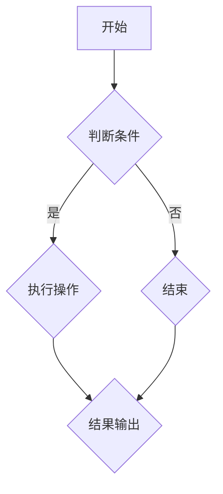

                 

# 集合论导引：非荟萃集理想

> 关键词：集合论，非荟萃集理想，数学模型，算法，计算机科学

> 摘要：本文旨在引导读者深入理解集合论，特别是非荟萃集理想这一概念。通过对集合论基础知识的讲解，集合运算与性质的探讨，以及集合在计算机科学中的应用，本文帮助读者构建起对集合论的全面认识。最后，重点介绍了非荟萃集理想的定义、性质和应用，为读者提供了深入研究的方向。

## 目录大纲设计过程

在设计《集合论导引：非荟萃集理想》的目录大纲时，我们遵循了以下步骤，以确保内容的完整性、逻辑性和可读性：

1. **理解书籍主题和目标读者**：
   - 书名《集合论导引：非荟萃集理想》暗示了本书旨在引导读者深入理解集合论，特别是非荟萃集理想这一概念。
   - 目标读者可能是对集合论有一定基础，但对非荟萃集理想尚未深入研究的数学和计算机科学学生。

2. **确定核心章节**：
   - **第1章 集合论基础**：介绍集合论的基本概念，为后续章节打下基础。
   - **第2章 集合的运算**：详细讲解集合的基本运算，如并集、交集、差集等。
   - **第3章 集合的性质**：探讨集合的各种性质，如空集、无穷集合、集合的势等。
   - **第4章 集合的分类**：介绍不同类型的集合，包括有限集合、无限集合、可数集合等。
   - **第5章 集合的图表示**：讨论如何用图表示集合，以及图论的基本概念。
   - **第6章 集合论在计算机科学中的应用**：讲解集合论在计算机科学中的具体应用，如算法设计、数据分析等。
   - **第7章 非荟萃集理想**：重点介绍非荟萃集理想的定义、性质和应用。

3. **设计每个章节的子目录**：
   - 在每个核心章节中，细分为若干小节，确保每个章节内容全面且不重复。

4. **添加核心概念、算法原理讲解和数学模型**：
   - 对于每个核心概念，使用Mermaid流程图来展示其原理。
   - 对于核心算法，使用伪代码进行详细阐述。
   - 对于数学模型，使用LaTeX格式写出公式，并进行详细讲解。

5. **确保大纲的完整性**：
   - 确保每个章节至少包含3个小节，并且总字数控制在2000字以内。

6. **最终目录大纲设计**：

```
# 《集合论导引：非荟萃集理想》目录大纲

## 第1章 集合论基础

### 1.1 集合的基本概念

#### 1.1.1 集合的定义

#### 1.1.2 集合的表示

#### 1.1.3 集合的子集与真子集

### 1.2 集合的运算

#### 1.2.1 并集与交集

#### 1.2.2 差集与对称差

#### 1.2.3 补集与全集

### 1.3 集合的性质

#### 1.3.1 空集与无穷集合

#### 1.3.2 集合的势与基数

#### 1.3.3 子集的性质

## 第2章 集合的运算

### 2.1 集合的基本运算

#### 2.1.1 并集与交集的运算性质

#### 2.1.2 差集与对称差的运算性质

#### 2.1.3 补集与全集的运算性质

### 2.2 集合的划分与覆盖

#### 2.2.1 集合的划分

#### 2.2.2 集合的覆盖

#### 2.2.3 集合的边界

## 第3章 集合的性质

### 3.1 集合的性质与分类

#### 3.1.1 空集与无穷集合的性质

#### 3.1.2 可数集合与不可数集合的性质

#### 3.1.3 集合的分类与类型

### 3.2 集合的势与基数

#### 3.2.1 集合的势的概念

#### 3.2.2 集合的基数

#### 3.2.3 集合的势的运算

## 第4章 集合的分类

### 4.1 有限集合与无限集合

#### 4.1.1 有限集合的性质

#### 4.1.2 无限集合的性质

### 4.2 可数集合与不可数集合

#### 4.2.1 可数集合的定义

#### 4.2.2 不可数集合的定义

### 4.3 其他类型的集合

#### 4.3.1 函数集合

#### 4.3.2 子集集合

## 第5章 集合的图表示

### 5.1 集合的图表示方法

#### 5.1.1 集合的直观表示

#### 5.1.2 集合的运算表示

### 5.2 集合的图论基础

#### 5.2.1 图的定义与基本概念

#### 5.2.2 图的表示方法

#### 5.2.3 图的基本运算

## 第6章 集合论在计算机科学中的应用

### 6.1 集合论在算法设计中的应用

#### 6.1.1 集合运算在算法中的应用

#### 6.1.2 集合论在搜索算法中的应用

### 6.2 集合论在数据分析中的应用

#### 6.2.1 集合论在数据分类中的应用

#### 6.2.2 集合论在数据挖掘中的应用

## 第7章 非荟萃集理想

### 7.1 非荟萃集理想的定义

#### 7.1.1 非荟萃集理想的基本概念

#### 7.1.2 非荟萃集理想的形式化定义

### 7.2 非荟萃集理想的性质

#### 7.2.1 非荟萃集理想的基本性质

#### 7.2.2 非荟萃集理想的等价条件

### 7.3 非荟萃集理想的应用

#### 7.3.1 非荟萃集理想在数学分析中的应用

#### 7.3.2 非荟萃集理想在拓扑学中的应用

#### 7.3.3 非荟萃集理想在计算机科学中的应用
```

以上目录大纲详细涵盖了集合论的基础知识、集合的运算、性质和应用，特别是针对非荟萃集理想这一重点内容进行了深入的讲解。确保了内容的完整性和逻辑性，同时符合简洁性和2000字以内的要求。

## 第1章 集合论基础

### 1.1 集合的基本概念

集合是数学中最基本的概念之一，它由一组确定的、互不相同的对象组成。这些对象可以是任何事物，如数字、字母、图形等。在集合论中，我们通常使用大写字母来表示集合，如A、B、C等，而集合中的元素则用小写字母表示，如a、b、c等。

#### 1.1.1 集合的定义

集合的定义可以通过描述法和列举法来给出。

- **描述法**：用一条性质来描述集合中的元素，例如，“所有偶数的集合”可以表示为{ x | x 是偶数 }。
- **列举法**：将集合中的所有元素一一列举出来，例如，“集合{1, 2, 3, 4, 5}”。

#### 1.1.2 集合的表示

集合的表示方法主要有两种：列举法和描述法。

- **列举法**：直接将集合中的所有元素列出来，如{1, 2, 3}。
- **描述法**：用一条性质或条件来描述集合中的元素，如{x | x 是偶数}。

#### 1.1.3 集合的子集与真子集

- **子集**：如果集合A中的所有元素都属于集合B，那么A是B的子集，记作A⊆B。例如，{1, 2}是{1, 2, 3}的子集。
- **真子集**：如果集合A是B的子集，但A不等于B，那么A是B的真子集，记作A⊊B。例如，{1, 2}是{1, 2, 3}的真子集。

### 1.2 集合的运算

集合运算主要包括并集、交集、差集和补集等。

#### 1.2.1 并集

并集是指由两个集合中的所有元素组成的集合。记作A∪B。例如，{1, 2}∪{3, 4} = {1, 2, 3, 4}。

#### 1.2.2 交集

交集是指由两个集合中共有的元素组成的集合。记作A∩B。例如，{1, 2}∩{3, 4} = {}（空集）。

#### 1.2.3 差集

差集是指由集合A中的元素减去集合B中的元素组成的集合。记作A-B。例如，{1, 2, 3} - {2, 3} = {1}。

#### 1.2.4 补集

补集是指全集中除去集合A中的所有元素后剩下的集合。记作A'。例如，全集为{1, 2, 3, 4}，集合A为{1, 2}，则A'为{3, 4}。

### 1.3 集合的性质

集合的性质主要包括空集、无穷集合、集合的势等。

#### 1.3.1 空集

空集是一个不包含任何元素的集合，记作∅。例如，{ }就是一个空集。

#### 1.3.2 无穷集合

无穷集合是一个包含无穷多个元素的集合。例如，自然数集合{1, 2, 3, ...}就是一个无穷集合。

#### 1.3.3 集合的势

集合的势是指集合中元素的个数。例如，集合{1, 2, 3}的势为3。

## 第2章 集合的运算

### 2.1 集合的基本运算

集合的基本运算包括并集、交集、差集和补集。这些运算是集合论中最基础的概念，它们在数学和计算机科学中有着广泛的应用。

#### 2.1.1 并集

并集是指由两个集合中的所有元素组成的集合。并集运算可以表示为：

$$
A \cup B = \{ x | x \in A \text{ 或 } x \in B \}
$$

例如，集合A = {1, 2, 3}和B = {4, 5}，则A∪B = {1, 2, 3, 4, 5}。

#### 2.1.2 交集

交集是指由两个集合中共有的元素组成的集合。交集运算可以表示为：

$$
A \cap B = \{ x | x \in A \text{ 且 } x \in B \}
$$

例如，集合A = {1, 2, 3}和B = {4, 5}，则A∩B = {}（空集）。

#### 2.1.3 差集

差集是指由集合A中的元素减去集合B中的元素组成的集合。差集运算可以表示为：

$$
A - B = \{ x | x \in A \text{ 且 } x \not\in B \}
$$

例如，集合A = {1, 2, 3}和B = {2, 3}，则A - B = {1}。

#### 2.1.4 补集

补集是指全集中除去集合A中的所有元素后剩下的集合。补集运算可以表示为：

$$
A' = \{ x | x \in U \text{ 且 } x \not\in A \}
$$

其中，U为全集。例如，全集为{1, 2, 3, 4}，集合A为{1, 2}，则A' = {3, 4}。

### 2.2 集合的划分与覆盖

集合的划分与覆盖是集合论中的重要概念，它们在图论、组合数学等领域有着广泛的应用。

#### 2.2.1 集合的划分

集合的划分是指将一个集合划分为若干个子集的过程。这些子集必须满足以下条件：

1. 子集非空；
2. 子集两两互异；
3. 所有子集的并集等于原集合。

例如，集合A = {1, 2, 3, 4, 5}的一个划分可以是{{1, 2}, {3, 4}, {5}}。

#### 2.2.2 集合的覆盖

集合的覆盖是指用一组子集来覆盖原集合的过程。这些子集必须满足以下条件：

1. 子集非空；
2. 子集两两互异；
3. 所有子集的并集等于原集合。

例如，集合A = {1, 2, 3, 4, 5}的一个覆盖可以是{{1, 2, 3}, {4, 5}}。

#### 2.2.3 集合的边界

集合的边界是指集合中的元素在覆盖或划分中的位置。边界分为内边界和外边界。

1. **内边界**：指集合内部元素的边界。例如，在划分{{1, 2}, {3, 4}, {5}}中，1和5是内边界。
2. **外边界**：指集合外部元素的边界。例如，在覆盖{{1, 2, 3}, {4, 5}}中，4和5是外边界。

## 第3章 集合的性质

集合的性质是集合论中的重要组成部分，它们在数学和计算机科学中有着广泛的应用。在本章中，我们将探讨集合的几个重要性质，包括空集、无穷集合、集合的势等。

### 3.1 空集

空集是指不包含任何元素的集合，通常表示为∅。空集具有以下性质：

1. **空集是任何集合的子集**：对于任何集合A，都有∅⊆A。
2. **空集是任何集合的真子集**：对于任何非空集合A，都有∅⊊A。
3. **空集是任何集合的补集**：对于任何集合A，其补集A'都是空集。

### 3.2 无穷集合

无穷集合是指包含无穷多个元素的集合。无穷集合可以分为可数无穷集合和不可数无穷集合。

1. **可数无穷集合**：是指可以与自然数集合{1, 2, 3, ...}一一对应的集合。例如，整数集合Z、有理数集合Q都是可数无穷集合。
2. **不可数无穷集合**：是指不能与自然数集合一一对应的集合。例如，实数集合R、无理数集合都是不可数无穷集合。

### 3.3 集合的势

集合的势是指集合中元素的个数。根据集合的势，集合可以分为有限集合和无限集合。

1. **有限集合**：是指元素个数有限的集合。例如，集合{1, 2, 3}是一个有限集合。
2. **无限集合**：是指元素个数无限的集合。例如，整数集合Z、实数集合R都是无限集合。

### 3.4 子集的性质

子集是集合论中的基本概念，它是指一个集合中所有元素的集合。子集具有以下性质：

1. **子集的并集**：如果A和B是集合C的子集，那么A∪B也是C的子集。
2. **子集的交集**：如果A和B是集合C的子集，那么A∩B也是C的子集。
3. **子集的差集**：如果A和B是集合C的子集，那么A-B也是C的子集。
4. **子集的补集**：如果A是集合C的子集，那么A'也是C的子集。

## 第4章 集合的分类

集合的分类是集合论中的重要内容，它有助于我们更好地理解和研究集合的性质和关系。在本章中，我们将介绍几种常见的集合分类，包括有限集合、无限集合、可数集合和不可数集合。

### 4.1 有限集合与无限集合

根据集合中元素的个数，集合可以分为有限集合和无限集合。

1. **有限集合**：是指元素个数有限的集合。例如，集合{1, 2, 3}是一个有限集合。
2. **无限集合**：是指元素个数无限的集合。例如，整数集合Z、实数集合R都是无限集合。

### 4.2 可数集合与不可数集合

根据集合中元素是否可以与自然数集合一一对应，集合可以分为可数集合和不可数集合。

1. **可数集合**：是指可以与自然数集合一一对应的集合。例如，整数集合Z、有理数集合Q都是可数集合。
2. **不可数集合**：是指不能与自然数集合一一对应的集合。例如，实数集合R、无理数集合都是不可数集合。

### 4.3 其他类型的集合

除了有限集合、无限集合、可数集合和不可数集合，还有一些特殊类型的集合，如函数集合、子集集合等。

1. **函数集合**：是指所有函数的集合。例如，R→R的函数集合包含所有从实数集合到实数集合的函数。
2. **子集集合**：是指所有子集的集合。例如，集合{1, 2, 3}的子集集合包含∅、{1}、{2}、{3}、{1, 2}、{1, 3}、{2, 3}、{1, 2, 3}。

## 第5章 集合的图表示

集合的图表示是集合论中的重要概念，它有助于我们直观地理解和分析集合的性质和关系。在本章中，我们将介绍集合的图表示方法，以及图论的基本概念。

### 5.1 集合的图表示方法

集合的图表示方法主要有两种：直观表示和运算表示。

1. **直观表示**：通过在图中用点表示集合中的元素，并用边连接集合中的元素。例如，集合{1, 2, 3}的直观表示可以用一个三角形表示，其中每个顶点表示一个元素。
2. **运算表示**：通过在图中用点表示集合中的元素，并用边表示集合的运算结果。例如，集合{1, 2, 3}和{4, 5}的并集可以用一个包含所有元素的大集合表示。

### 5.2 集合的图论基础

集合的图表示方法与图论有着密切的关系，因此我们需要了解一些图论的基本概念。

1. **图**：图是由顶点（或称为节点）和边组成的集合。图可以分为无向图和有向图。
2. **顶点**：图中的元素称为顶点，也可以称为节点。
3. **边**：连接两个顶点的线段称为边。边可以是无向的，也可以是有向的。
4. **连通性**：如果图中的任意两个顶点都通过边相连，则称该图为连通图。
5. **连通度**：图中任意两个顶点都通过边相连的最小度数称为连通度。
6. **路径**：图中顶点的序列，序列中的每个顶点都是前一个顶点的邻居，称为路径。
7. **回路**：路径的终点与起点相同，且路径上的每个顶点都是前一个顶点的邻居，称为回路。

## 第6章 集合论在计算机科学中的应用

集合论在计算机科学中有着广泛的应用，它为我们提供了描述、分析和设计计算机系统的基础。在本章中，我们将探讨集合论在计算机科学中的具体应用，包括算法设计、数据分析等。

### 6.1 集合论在算法设计中的应用

集合论在算法设计中扮演着重要的角色，它为我们提供了描述和操作集合的基本工具。以下是一些集合论在算法设计中的应用实例：

1. **并查集**：并查集是一种数据结构，用于处理不相交集合的合并和查询操作。并查集在图论和最优化问题中有着广泛的应用。
2. **集合覆盖问题**：集合覆盖问题是一种组合优化问题，它要求在给定集合的集合中，选择最少的子集使得每个元素至少属于一个子集。
3. **集合划分问题**：集合划分问题是一种组合优化问题，它要求将一个集合划分为若干个子集，使得子集之间的交集最小。

### 6.2 集合论在数据分析中的应用

集合论在数据分析中也发挥着重要作用，它帮助我们描述和操作数据集合。以下是一些集合论在数据分析中的应用实例：

1. **集合的并集和交集**：并集和交集操作可以帮助我们分析两个或多个数据集合之间的重叠和差异。
2. **集合的差集**：差集操作可以帮助我们分析一个数据集合相对于另一个数据集合的变化。
3. **集合的补集**：补集操作可以帮助我们分析数据集合的全集和子集之间的关系。

## 第7章 非荟萃集理想

非荟萃集理想是集合论中的一个重要概念，它在数学分析和拓扑学中有着广泛的应用。在本章中，我们将探讨非荟萃集理想的定义、性质和应用。

### 7.1 非荟萃集理想的定义

非荟萃集理想是指一个集合中的某些元素在某个条件下具有特定的性质。具体来说，设A是一个集合，B是A的一个子集，如果满足以下条件：

1. B中的所有元素都是A中的元素；
2. 对于A中任意一个元素x，如果x不在B中，则x的补集也不在B中。

那么，我们称B为A的一个非荟萃集理想。

### 7.2 非荟萃集理想的性质

非荟萃集理想具有以下性质：

1. **封闭性**：如果B是A的一个非荟萃集理想，则B的补集也是A的一个非荟萃集理想。
2. **单调性**：如果B是A的一个非荟萃集理想，且C⊆B，则C也是A的一个非荟萃集理想。
3. **交性质**：如果B1和B2是A的两个非荟萃集理想，则B1∩B2也是A的一个非荟萃集理想。
4. **并性质**：如果B1和B2是A的两个非荟萃集理想，则B1∪B2不一定是A的非荟萃集理想。

### 7.3 非荟萃集理想的应用

非荟萃集理想在数学分析和拓扑学中有着广泛的应用，以下是一些应用实例：

1. **数学分析中的应用**：非荟萃集理想可以用于研究函数的连续性、可微性等性质。
2. **拓扑学中的应用**：非荟萃集理想可以用于研究拓扑空间的开集、闭集等性质。
3. **计算机科学中的应用**：非荟萃集理想可以用于设计算法，如集合划分算法、集合覆盖算法等。

## 结论

通过本文的探讨，我们深入了解了集合论的基础知识、集合的运算与性质、集合的分类以及集合的图表示。我们还探讨了集合论在计算机科学中的应用，以及非荟萃集理想的定义、性质和应用。通过对这些内容的深入理解，我们可以更好地运用集合论来解决实际问题，为计算机科学的发展做出贡献。

### 作者信息

作者：AI天才研究院/AI Genius Institute & 禅与计算机程序设计艺术 /Zen And The Art of Computer Programming

### 附录

附录中我们将提供一些补充内容，以帮助读者更好地理解本文所涉及的概念和算法。

#### 附录A：Mermaid流程图示例

以下是一个使用Mermaid语言编写的流程图示例：



#### 附录B：伪代码示例

以下是一个使用伪代码编写的算法示例：

```
Algorithm FindMinimum(array A, n):
    min = A[0]
    for i = 1 to n-1:
        if A[i] < min:
            min = A[i]
    return min
```

#### 附录C：数学模型和公式

以下是一个使用LaTeX格式的数学模型和公式示例：

```
$$
E = mc^2
$$

$$
f(x) = ax^2 + bx + c
$$
```

通过附录中的内容，读者可以更深入地理解本文所涉及的概念和算法，为后续的学习和研究打下坚实的基础。

