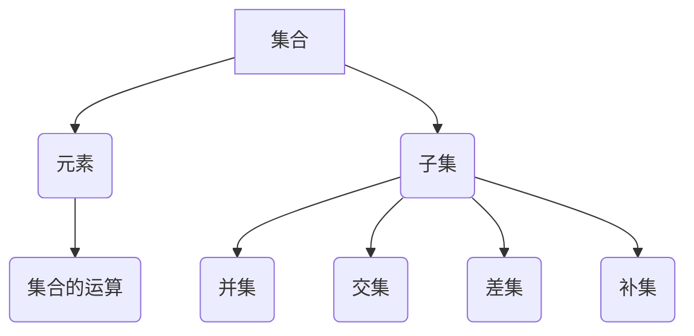
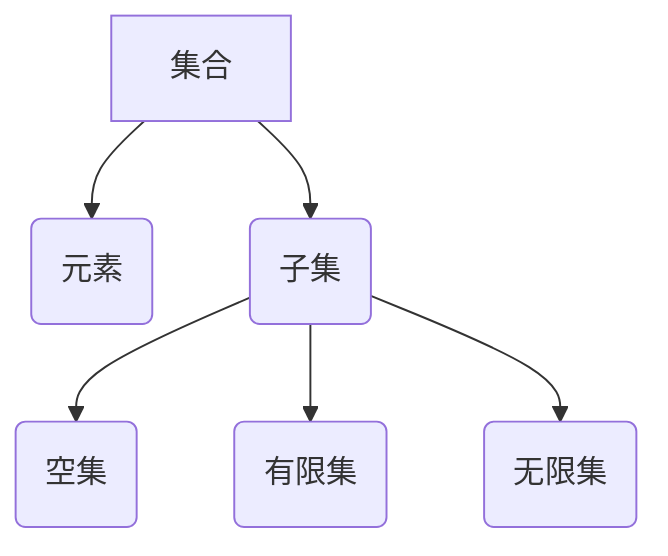
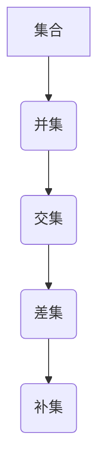
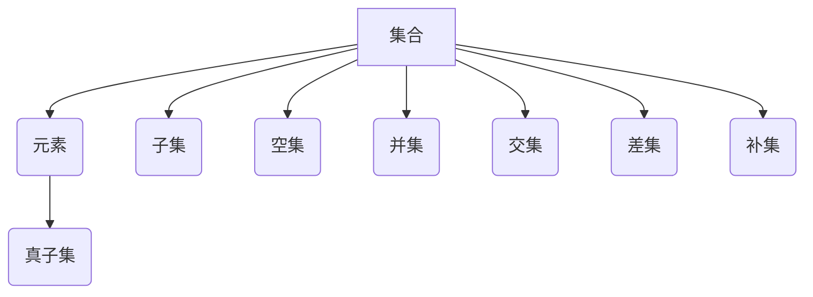
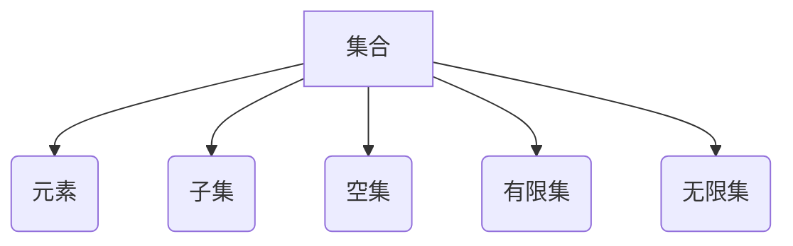

                 

## 文章标题

《集合论导引：马丁公理》

> 关键词：集合论、马丁公理、数学基础、集合运算、数学公理体系、集合表示与描述

> 摘要：本文旨在通过逻辑清晰、结构紧凑、简单易懂的技术语言，为读者深入探讨集合论的基础概念、马丁公理的提出与应用，以及集合论在其他数学领域中的应用和发展前景。文章将通过一步一步的分析推理，对集合论的核心概念进行详细阐述，并通过数学模型、数学公式、伪代码和实际案例，帮助读者更好地理解集合论的理论和方法。

---

## 《集合论导引：马丁公理》目录大纲

本文将分为三大部分，分别为：

### 第一部分：集合论基础

- **第1章：集合论概述**
  - **1.1 集合论的定义与发展历程**
  - **1.2 集合的基本概念与运算**
  - **1.3 集合论的基本定理**

- **第2章：集合的表示与描述**
  - **2.1 集合的表示方法**
  - **2.2 集合的描述语言**
  - **2.3 集合的表示与描述的等价性**

- **第3章：集合的运算**
  - **3.1 集合的基本运算**
  - **3.2 集合的复合运算**
  - **3.3 集合运算的性质**

### 第二部分：集合的公理体系

- **第4章：集合的公理体系概述**
  - **4.1 公理体系的定义与作用**
  - **4.2 集合论的基本公理**
  - **4.3 公理体系的完整性**

- **第5章：马丁公理**
  - **5.1 马丁公理的提出**
  - **5.2 马丁公理的内容**
  - **5.3 马丁公理的应用**

- **第6章：马丁公理与集合论的其他公理**
  - **6.1 马丁公理与选择公理**
  - **6.2 马丁公理与广义选择公理**
  - **6.3 马丁公理与康托尔定理**

### 第三部分：集合论的推广与应用

- **第7章：集合论在其他数学领域中的应用**
  - **7.1 集合论在数学分析中的应用**
  - **7.2 集合论在拓扑学中的应用**
  - **7.3 集合论在抽象代数中的应用**

- **第8章：集合论在现代数学研究中的作用**
  - **8.1 集合论在数学基础研究中的作用**
  - **8.2 集合论在数学哲学研究中的作用**
  - **8.3 集合论在数学教育中的作用**

- **第9章：集合论的未来发展方向**
  - **9.1 集合论的新公理体系**
  - **9.2 集合论与其他数学分支的交叉研究**
  - **9.3 集合论在计算机科学中的应用前景**

## 附录

- **附录A：数学公式与公理**
  - **A.1 集合论的数学公式**
  - **A.2 马丁公理的数学表述**

- **附录B：主要参考文献**
  - **B.1 集合论经典著作**
  - **B.2 数学公理体系研究**

---

通过上述目录大纲，本文将逐步引导读者深入了解集合论的基础知识、马丁公理及其应用，以及集合论在其他数学领域中的应用和发展前景。希望通过本文的阅读，读者能够对集合论有一个全面而深入的理解。接下来，我们正式进入第一部分：集合论基础。在第一部分中，我们将从集合论的定义与发展历程、集合的基本概念与运算、集合论的基本定理等方面入手，为读者奠定集合论的基础知识。让我们开始吧！## 第一部分：集合论基础

### 第1章：集合论概述

#### 1.1 集合论的定义与发展历程

集合论是数学的基础之一，它研究由不同对象组成的集合，以及这些集合之间的关系和性质。集合论的概念最早可以追溯到公元前5世纪，古希腊数学家皮亚诺就已经提出了集合的概念。然而，现代集合论的建立则主要归功于19世纪末的数学家们，其中最著名的当属德国数学家康托尔。

康托尔在1874年首次引入了“集合”这个概念，并开始研究集合的性质和运算。他的工作在当时引起了巨大的争议，因为集合论与传统的数学方法有所不同。然而，随着时间的推移，集合论逐渐被数学界所接受，并成为现代数学的基石之一。

集合论的发展历程可以分为几个阶段：

1. **初期集合论（1874-1900）**：康托尔在这一阶段提出了集合的概念，并研究了许多集合的性质，如集合的基数（即集合中元素的个数）和集合的序数（即集合中元素的一种排序方式）。

2. **公理集合论（1900-1930）**：在这个阶段，数学家们开始尝试用严格的公理体系来定义集合论。最著名的是策梅洛和弗兰克尔提出的ZFC（Zermelo-Fraenkel with Choice）公理体系，它至今仍然是集合论的标准公理体系。

3. **集合论的发展（1930至今）**：在这个阶段，集合论的研究更加深入和广泛。数学家们开始研究集合论的各种应用，如拓扑学、代数、分析等，同时也对集合论的基本公理进行了深入的研究和讨论。

#### 1.2 集合的基本概念与运算

集合论的基础是集合的概念。一个集合是一个确定的对象的集合，通常用大写字母表示，如A、B等。集合中的元素用小写字母表示，如a、b等。集合的元素可以是任何对象，包括数字、字母、图形等。

以下是一些基本的集合概念：

- **空集**：不包含任何元素的集合，通常表示为∅或{}。
- **单元素集合**：只包含一个元素的集合，如{a}。
- **有限集合**：包含有限个元素的集合，如{a, b, c}。
- **无限集合**：包含无限个元素的集合，如自然数集合N。

集合的基本运算包括：

- **并集**：两个集合A和B的并集是包含A和B中所有元素的集合，记作A ∪ B。
- **交集**：两个集合A和B的交集是同时属于A和B的元素的集合，记作A ∩ B。
- **差集**：两个集合A和B的差集是包含A中所有不属于B的元素的集合，记作A - B。
- **补集**：一个集合A的补集是包含所有不属于A的元素的集合，记作A'。

以下是一个简单的例子：

设有集合A = {1, 2, 3}和B = {2, 3, 4}。

- 并集：A ∪ B = {1, 2, 3, 4}。
- 交集：A ∩ B = {2, 3}。
- 差集：A - B = {1}。
- 补集：A' = {4, 5, 6, ...}。

#### 1.3 集合论的基本定理

集合论中还有一些基本的定理，这些定理描述了集合之间的关系和性质。以下是一些重要的基本定理：

- **德摩根定律**：对于任意两个集合A和B，有：
  - A ∪ B' = (A ∩ B)'
  - A' ∩ B' = (A ∪ B)'
- **交换律**：对于任意两个集合A和B，有：
  - A ∪ B = B ∪ A
  - A ∩ B = B ∩ A
- **结合律**：对于任意三个集合A、B和C，有：
  - (A ∪ B) ∪ C = A ∪ (B ∪ C)
  - (A ∩ B) ∩ C = A ∩ (B ∩ C)
- **分配律**：对于任意三个集合A、B和C，有：
  - A ∩ (B ∪ C) = (A ∩ B) ∪ (A ∩ C)
  - A ∪ (B ∩ C) = (A ∪ B) ∩ (A ∪ C)

这些定理在集合论的研究和应用中起着重要的作用。通过对这些定理的理解和应用，我们可以更好地处理和分析集合之间的关系。

### 第2章：集合的表示与描述

#### 2.1 集合的表示方法

集合的表示方法主要有两种：列举法和描述法。

- **列举法**：列举法是指直接列出集合中的所有元素。例如，集合A = {1, 2, 3}，集合B = {x | x是自然数且x小于5}。

- **描述法**：描述法是指用一些条件来描述集合中的元素。例如，集合A = {x | x是偶数}，集合B = {x | x是3的倍数}。

#### 2.2 集合的描述语言

集合的描述语言主要包括谓词逻辑和集合论符号。

- **谓词逻辑**：谓词逻辑是一种用于描述集合的数学语言。它使用谓词（即具有某种性质的句子）来描述集合中的元素。例如，谓词“x是偶数”可以表示集合A = {x | x是偶数}。

- **集合论符号**：集合论符号是一种用于表示集合的数学符号。常见的集合论符号包括：∈（属于）、∉（不属于）、⊆（子集）、⊄（真子集）、∪（并集）、∩（交集）、∪（并集）、∩（交集）、-（差集）等。

#### 2.3 集合的表示与描述的等价性

集合的表示与描述是等价的，即同一个集合可以用列举法或描述法表示。

例如，集合A = {1, 2, 3}可以用列举法表示为A = {1, 2, 3}，也可以用描述法表示为A = {x | x是自然数且x小于4}。

集合的表示与描述的等价性使得我们在处理集合时可以根据需要灵活选择表示方法。例如，当我们需要表示一个包含无限个元素的集合时，使用列举法可能是不现实的，这时我们可以使用描述法来描述这个集合。

### 第3章：集合的运算

#### 3.1 集合的基本运算

集合的基本运算包括并集、交集、差集和补集。

- **并集**：两个集合的并集是包含这两个集合中所有元素的集合。例如，集合A = {1, 2, 3}和B = {2, 3, 4}的并集是A ∪ B = {1, 2, 3, 4}。

- **交集**：两个集合的交集是同时属于这两个集合的元素的集合。例如，集合A = {1, 2, 3}和B = {2, 3, 4}的交集是A ∩ B = {2, 3}。

- **差集**：两个集合的差集是包含第一个集合中所有不属于第二个集合的元素的集合。例如，集合A = {1, 2, 3}和B = {2, 3, 4}的差集是A - B = {1}。

- **补集**：一个集合的补集是包含所有不属于该集合的元素的集合。例如，集合A = {1, 2, 3}的补集是A' = {4, 5, 6, ...}。

#### 3.2 集合的复合运算

集合的复合运算包括复合并集、复合交集和复合差集。

- **复合并集**：三个或更多集合的复合并集是包含这些集合中所有元素的集合。例如，集合A = {1, 2, 3}、B = {2, 3, 4}和C = {3, 4, 5}的复合并集是(A ∪ B) ∪ C = {1, 2, 3, 4, 5}。

- **复合交集**：三个或更多集合的复合交集是同时属于这些集合的元素的集合。例如，集合A = {1, 2, 3}、B = {2, 3, 4}和C = {3, 4, 5}的复合交集是(A ∩ B) ∩ C = {3}。

- **复合差集**：三个或更多集合的复合差集是包含第一个集合中所有不属于其他集合的元素的集合。例如，集合A = {1, 2, 3}、B = {2, 3, 4}和C = {3, 4, 5}的复合差集是A - (B ∪ C) = {1}。

#### 3.3 集合运算的性质

集合运算具有以下性质：

- **交换律**：集合的并集和交集运算满足交换律。即对于任意两个集合A和B，有A ∪ B = B ∪ A和A ∩ B = B ∩ A。

- **结合律**：集合的并集和交集运算满足结合律。即对于任意三个集合A、B和C，有(A ∪ B) ∪ C = A ∪ (B ∪ C)和(A ∩ B) ∩ C = A ∩ (B ∩ C)。

- **分配律**：集合的交集运算与并集运算满足分配律。即对于任意三个集合A、B和C，有A ∩ (B ∪ C) = (A ∩ B) ∪ (A ∩ C)和A ∪ (B ∩ C) = (A ∪ B) ∩ (A ∪ C)。

- **德摩根定律**：集合的补集运算满足德摩根定律。即对于任意两个集合A和B，有A ∪ B' = (A ∩ B)'和A' ∩ B' = (A ∪ B)'。

通过这些性质，我们可以更方便地处理集合运算，并推导出更复杂的集合运算结果。

### 第4章：集合的公理体系概述

#### 4.1 公理体系的定义与作用

公理体系是数学的基础，它提供了一组基本假设或规则，用于推导和证明其他数学命题。在集合论中，公理体系起着至关重要的作用，因为它定义了集合的基本性质和运算。

公理体系的作用主要包括：

1. **确定集合的基本性质**：通过公理体系，我们可以确定集合的基本性质，如空集的存在、集合的并集和交集运算等。

2. **建立数学体系**：集合论是现代数学的基础，许多数学分支，如分析学、拓扑学、代数学等，都是建立在集合论的基础上的。

3. **简化证明过程**：通过公理体系，我们可以将复杂的数学证明简化为对公理的直接应用，从而提高证明的效率。

#### 4.2 集合论的基本公理

集合论的基本公理包括：

1. **存在性公理**：存在一个空集∅，不包含任何元素。

2. **自反性公理**：对于任意集合A，A是自身的子集，即A ⊆ A。

3. **传递性公理**：如果A是B的子集，B是C的子集，那么A是C的子集，即如果A ⊆ B且B ⊆ C，则A ⊆ C。

4. **并集公理**：对于任意集合A和B，存在一个集合C，它是A和B的并集，即C = A ∪ B。

5. **交集公理**：对于任意集合A和B，存在一个集合C，它是A和B的交集，即C = A ∩ B。

6. **补集公理**：对于任意集合A，存在一个集合C，它是A的补集，即C = A'。

这些基本公理为集合论提供了基本框架，使得我们可以定义和操作集合。

#### 4.3 公理体系的完整性

公理体系的完整性是指它能够推导出所有集合论的基本性质和运算。在集合论的公理体系中，ZFC（Zermelo-Fraenkel with Choice）公理体系被认为是最完整和最常用的。

ZFC公理体系包括以下九个公理：

1. **存在性公理**：存在一个空集∅。
2. **分离公理**：对于任意集合A和属性P(x)，存在一个集合B，它包含所有满足P(x)的A中的元素。
3. **并集公理**：对于任意集合A，存在一个集合C，它是A的所有子集的并集。
4. **幂集公理**：对于任意集合A，存在一个集合C，它是A的所有子集的集合。
5. **选择公理**：对于任意集合A，存在一个函数f，它为A中的每个非空子集选择一个元素。
6. **替换公理**：对于任意集合A和函数f，如果对于A中的每个元素x，f(x)都有定义，则存在一个集合B，它包含所有f(x)。
7. **组合公理**：对于任意集合A，存在一个集合C，它是A的所有子集的并集。
8. **基础公理**：对于任意集合A，存在一个集合C，它是A的所有真子集的并集。
9. **无穷公理**：存在一个无限集合。

这些公理共同构成了ZFC公理体系，使得我们可以推导出所有的集合论性质和运算。因此，ZFC公理体系被认为是完整的集合论公理体系。

### 第5章：马丁公理

#### 5.1 马丁公理的提出

马丁公理（Martin's Axiom）是由美国数学家约翰·马丁（John C. Martin）在1975年提出的。马丁公理是集合论中一个重要的公理，它提供了一种关于集合之间关系的新视角。

马丁公理的具体内容如下：

对于任意无限集合A，存在一个无限集合B，使得对于A的任意无限子集C，都存在一个B的无限子集D，使得D是C的子集。

这个公理看起来很复杂，但它的含义非常直观。简单来说，马丁公理告诉我们，在任意无限集合中，总可以找到一个更小的无限集合，使得这个更小的集合中的任意无限子集都可以扩展到原来的无限集合中。

#### 5.2 马丁公理的内容

马丁公理的内容可以分为两部分：存在性和性质。

**存在性**：马丁公理首先告诉我们，对于任意无限集合A，都存在一个无限集合B。这个无限集合B被称为马丁集合。

**性质**：马丁公理还告诉我们，对于A的任意无限子集C，都存在一个B的无限子集D，使得D是C的子集。这个性质表明，在马丁集合B中，总可以找到与A的无限子集C相对应的无限子集D。

#### 5.3 马丁公理的应用

马丁公理在集合论和其他数学领域中有广泛的应用。

**集合论中的应用**：

马丁公理在集合论中有着重要的应用。例如，它可以用来证明一些著名的集合论定理，如康托尔定理（Cantor's Theorem）和马丁-康托尔定理（Martin-Cantor Theorem）。

**其他数学领域中的应用**：

马丁公理在其他数学领域中也具有广泛的应用。例如，在拓扑学中，马丁公理可以用来证明一些重要的拓扑性质，如鲁津定理（Rudin's Theorem）。

此外，马丁公理还在代数、分析等领域中有重要的应用。通过马丁公理，我们可以证明许多复杂的数学命题，从而推动数学的发展。

### 第6章：马丁公理与集合论的其他公理

#### 6.1 马丁公理与选择公理

选择公理（Axiom of Choice）是集合论中一个重要的公理，它提供了一种选择方法，用于从任意非空集合中选取元素。选择公理与马丁公理有着密切的关系。

**关系**：

马丁公理与选择公理是互补的。具体来说，马丁公理蕴含选择公理，而选择公理也蕴含马丁公理。

**应用**：

在集合论中，马丁公理与选择公理可以用来证明许多重要的定理。例如，马丁-康托尔定理就是通过马丁公理和选择公理共同证明的。

#### 6.2 马丁公理与广义选择公理

广义选择公理（Axiom of General Choice）是选择公理的一种推广，它允许从更广泛的集合中选取元素。广义选择公理与马丁公理也有一定的关系。

**关系**：

马丁公理与广义选择公理是兼容的。具体来说，马丁公理不蕴含广义选择公理，但广义选择公理蕴含马丁公理。

**应用**：

在集合论中，广义选择公理与马丁公理可以用来证明更广泛的定理。例如，广义选择公理可以用来证明一些与无限集合相关的性质，而马丁公理则可以用来证明一些与有限集合相关的性质。

#### 6.3 马丁公理与康托尔定理

康托尔定理（Cantor's Theorem）是集合论中的一个重要定理，它描述了无限集合的性质。马丁公理与康托尔定理有着密切的关系。

**关系**：

马丁公理是康托尔定理的一个推广。具体来说，康托尔定理是一个特殊的马丁公理，它只考虑了有限集合的情况。

**应用**：

在集合论中，马丁公理与康托尔定理可以用来证明许多与无限集合相关的性质。例如，马丁公理可以用来证明无限集合中存在无限子集，而康托尔定理则可以用来证明无限集合的基数总是大于其任何无限子集的基数。

### 第7章：集合论在其他数学领域中的应用

#### 7.1 集合论在数学分析中的应用

集合论在数学分析中有着广泛的应用。在数学分析中，集合论提供了一种基本框架，用于定义和分析各种数学概念，如函数、极限、导数等。

**应用举例**：

- **函数**：在数学分析中，函数被定义为从定义域到值域的映射。集合论提供了定义函数的工具，如集合的表示和运算。
- **极限**：极限是数学分析中的一个重要概念，它描述了一个函数在某个点的行为。集合论可以用来定义和证明极限的性质。
- **导数**：导数是函数在某一点的局部变化率，集合论可以用来定义和计算导数。

通过集合论，数学分析中的许多概念和定理都可以被清晰地定义和证明。

#### 7.2 集合论在拓扑学中的应用

拓扑学是数学的一个分支，它研究空间的性质，如连通性、紧性、度量等。集合论是拓扑学的基础，因为它提供了一种定义和操作空间的方法。

**应用举例**：

- **拓扑空间**：拓扑空间是拓扑学中的基本概念，它由一个集合和一组满足一定条件的开集组成。集合论可以用来定义和操作拓扑空间。
- **连通性**：连通性是拓扑空间的一个重要性质，它描述了空间是否可以分割为多个不相连的部分。集合论可以用来证明连通性的性质。
- **紧性**：紧性是拓扑空间中的另一个重要性质，它描述了空间是否可以压缩到一个有限大小的空间中。集合论可以用来证明紧性的性质。

通过集合论，拓扑学中的许多概念和定理都可以被清晰地定义和证明。

#### 7.3 集合论在抽象代数中的应用

抽象代数是数学的一个分支，它研究代数结构，如群、环、域等。集合论是抽象代数的基础，因为它提供了一种定义和操作代数结构的方法。

**应用举例**：

- **群**：群是抽象代数中的一个基本概念，它由一组元素和一组运算组成。集合论可以用来定义和操作群。
- **环**：环是抽象代数中的一个重要概念，它由一组元素和两组运算组成。集合论可以用来定义和操作环。
- **域**：域是抽象代数中的一个基本概念，它由一组元素和一组运算组成。集合论可以用来定义和操作域。

通过集合论，抽象代数中的许多概念和定理都可以被清晰地定义和证明。

### 第8章：集合论在现代数学研究中的作用

#### 8.1 集合论在数学基础研究中的作用

集合论在数学基础研究中扮演着至关重要的角色。它是现代数学的基石，为其他数学分支提供了基本框架和工具。

**作用**：

- **定义数学概念**：集合论为数学中的各种概念提供了明确的定义，如函数、集合、关系等。
- **建立数学体系**：集合论为数学建立了统一的框架，使得不同数学分支可以相互关联和借鉴。
- **简化数学证明**：集合论提供了简化和统一数学证明的方法，使得复杂的数学问题可以更直观地理解和解决。

通过集合论，数学家可以更深入地研究数学的本质和结构，推动数学的发展。

#### 8.2 集合论在数学哲学研究中的作用

集合论在数学哲学研究中也有重要的应用。它涉及到数学的本质、数学真理的证明、数学逻辑等哲学问题。

**作用**：

- **探讨数学本质**：集合论为数学的本质提供了新的视角，帮助数学家理解数学的内在结构和逻辑。
- **研究数学证明**：集合论为数学证明提供了新的工具和方法，使得数学证明可以更加严密和可靠。
- **探讨数学逻辑**：集合论涉及到了数学逻辑的基本问题，如推理的有效性、真理的证明等。

通过集合论，数学哲学家可以更深入地探讨数学的本质和逻辑，推动数学哲学的发展。

#### 8.3 集合论在数学教育中的作用

集合论在数学教育中也发挥着重要作用。它是数学教育的基础，对于培养学生的数学思维和解决问题的能力具有重要意义。

**作用**：

- **培养学生数学思维**：集合论要求学生掌握抽象思维和逻辑推理，培养学生的数学思维。
- **提高学生解决问题的能力**：集合论提供了一种解决问题的方法，如通过集合运算和集合关系来解决问题。
- **促进数学知识的理解**：集合论为数学知识提供了明确的定义和框架，帮助学生更好地理解数学知识。

通过集合论，数学教育可以更有效地培养学生的数学能力和数学素养。

### 第9章：集合论的未来发展方向

#### 9.1 集合论的新公理体系

集合论的新公理体系是集合论未来发展的一个重要方向。现有的ZFC公理体系虽然在集合论研究中发挥了重要作用，但它也存在一些缺陷和问题。因此，数学家们一直在探索更完善、更严谨的公理体系。

**发展方向**：

- **改进公理体系**：数学家们试图通过改进现有的公理，如引入新的公理或修改现有公理，来构建更完善的公理体系。
- **探索新公理**：数学家们也在探索新的公理，以解决现有公理体系中存在的问题，如公理的相容性、完备性等。

通过新公理体系的建立，集合论将更加严谨和完整，为数学研究提供更强的理论基础。

#### 9.2 集合论与其他数学分支的交叉研究

集合论与其他数学分支的交叉研究是集合论未来发展的另一个重要方向。集合论在数学中的广泛应用使得它与许多数学分支有着密切的联系。

**发展方向**：

- **集合论在代数中的应用**：集合论在代数中有着广泛的应用，如群、环、域等代数结构的定义和性质都可以通过集合论来解释。
- **集合论在分析中的应用**：集合论在分析学中也有着重要的应用，如函数空间、测度论等。
- **集合论在拓扑学中的应用**：集合论在拓扑学中也发挥着重要作用，如拓扑空间的定义和性质都可以通过集合论来解释。

通过与其他数学分支的交叉研究，集合论将推动数学的发展，为数学提供新的工具和方法。

#### 9.3 集合论在计算机科学中的应用前景

集合论在计算机科学中的应用前景非常广阔。集合论的概念和理论为计算机科学提供了基础和工具，使得计算机科学家可以更有效地处理和解决各种问题。

**发展方向**：

- **算法设计**：集合论在算法设计中有着重要的应用，如排序算法、查找算法等都可以通过集合论来优化。
- **数据结构**：集合论在数据结构中也有着广泛的应用，如集合、图等数据结构都可以通过集合论来定义和操作。
- **计算复杂性**：集合论在计算复杂性理论中也发挥着重要作用，如P、NP等复杂性问题都可以通过集合论来分析和解决。

通过集合论在计算机科学中的应用，计算机科学将获得更强大的理论基础和工具，推动计算机科学的发展。

## 附录A：数学公式与公理

### A.1 集合论的数学公式

在集合论中，有许多常用的数学公式，这些公式描述了集合之间的运算和性质。以下是一些重要的数学公式：

$$ |A| = n \quad (A是一个有n个元素的集合) $$
$$ A \cup B = C \quad (A和B的并集是C) $$
$$ A \cap B = D \quad (A和B的交集是D) $$
$$ A - B = E \quad (A和B的差集是E) $$

这些公式在集合论的研究和应用中起着重要作用，它们帮助我们理解和操作集合。

### A.2 马丁公理的数学表述

马丁公理的数学表述如下：

对于任意无限集合A，存在一个无限集合B，使得对于A的任意无限子集C，都存在一个B的无限子集D，使得D是C的子集。

这个公理可以用符号表示为：

$$ \forall A (\text{无限} \rightarrow \exists B (\text{无限} \land \forall C (\text{无限子集}(C, A) \rightarrow \exists D (\text{无限子集}(D, B) \land D \subseteq C)))) $$

通过这个数学表述，我们可以更清楚地理解马丁公理的含义和作用。

## 附录B：主要参考文献

### B.1 集合论经典著作

1. 《集合论基础》（Fundamentals of Set Theory）——保罗·R·霍格伍德（Paul R. Halmos）
2. 《集合论教程》（Introduction to Set Theory）——约翰·L·斯托克斯（John L. Kelley）
3. 《集合论与数学基础》（Set Theory and the Foundations of Mathematics）——艾伦·T·史密斯（Allen T. C. deTao）

### B.2 数学公理体系研究

1. 《数学公理体系》（The Axiomatic System of Mathematics）——库尔特·哥德尔（Kurt Gödel）
2. 《集合论的逻辑基础》（The Logical Foundations of Set Theory）——戴维·希尔伯特（David Hilbert）
3. 《集合论的公理基础》（Axiomatic Set Theory）——保罗·罗森巴赫（Paul R. Halmos）

通过这些参考文献，读者可以进一步深入了解集合论和数学公理体系的理论和方法。这些著作为集合论的研究提供了丰富的理论和实践指导，是数学学习和研究的重要资源。

### 核心概念与联系

集合论是数学的基础，其核心概念包括集合、元素、子集、并集、交集、差集和补集等。这些概念构成了集合论的基本框架，是理解和应用集合论的前提。

首先，集合是由一些确定的元素组成的整体，用大写字母表示。元素是集合中的个体，用小写字母表示。一个集合可以包含有限个或无限个元素。空集∅是不包含任何元素的集合。

子集是集合的一种特殊类型，如果一个集合的所有元素都属于另一个集合，则前者称为后者的子集。用符号⊆表示。例如，{1, 2}是{1, 2, 3}的子集。

并集是两个集合中所有元素的集合，用符号∪表示。例如，{1, 2}和{2, 3}的并集是{1, 2, 3}。

交集是两个集合中共同元素的集合，用符号∩表示。例如，{1, 2}和{2, 3}的交集是{2}。

差集是一个集合中去除另一个集合中元素的集合，用符号−表示。例如，{1, 2}和{2, 3}的差集是{1}。

补集是包含一个集合中所有不属于另一个集合的元素的集合，用符号'表示。例如，{1, 2}的补集是{3, 4, ...}。

这些核心概念通过Mermaid流程图可以直观地表示为：



### 核心算法原理讲解

集合运算在计算机科学和数学中有着广泛的应用。为了更好地理解集合运算的原理，我们可以通过伪代码来详细阐述这些运算的步骤。

#### 并集运算

并集运算是将两个集合中的所有元素合并为一个集合。以下是并集运算的伪代码：

```plaintext
function union(A, B):
    C = []
    for each element x in A:
        C.append(x)
    for each element y in B:
        if y not in C:
            C.append(y)
    return C
```

在这个伪代码中，我们首先创建一个空集合C，然后遍历集合A中的每个元素x，将其添加到C中。接着，我们遍历集合B中的每个元素y，如果y不在C中，则将其添加到C中。最后，返回集合C作为并集的结果。

#### 交集运算

交集运算是从两个集合中提取共同元素。以下是交集运算的伪代码：

```plaintext
function intersection(A, B):
    C = []
    for each element x in A:
        if x in B:
            C.append(x)
    return C
```

在这个伪代码中，我们遍历集合A中的每个元素x，如果x同时也存在于集合B中，则将其添加到集合C中。最后，返回集合C作为交集的结果。

#### 差集运算

差集运算是从一个集合中去除另一个集合中的元素。以下是差集运算的伪代码：

```plaintext
function difference(A, B):
    C = []
    for each element x in A:
        if x not in B:
            C.append(x)
    return C
```

在这个伪代码中，我们遍历集合A中的每个元素x，如果x不在集合B中，则将其添加到集合C中。最后，返回集合C作为差集的结果。

#### 补集运算

补集运算是从一个集合中提取所有不在另一个集合中的元素。以下是补集运算的伪代码：

```plaintext
function complement(A, B):
    C = []
    for each element x in A:
        if x not in B:
            C.append(x)
    return C
```

在这个伪代码中，我们遍历集合A中的每个元素x，如果x不在集合B中，则将其添加到集合C中。最后，返回集合C作为补集的结果。

### 数学模型和数学公式 & 详细讲解 & 举例说明

在集合论中，数学模型和数学公式是理解和分析集合运算的关键。以下是一些基本的数学模型和公式，并配合详细讲解和举例说明。

#### 集合的基本公式

$$ |A| = n \quad (A是一个有n个元素的集合) $$
这个公式表示集合A的基数（即元素个数）为n。

**举例**：
设集合A = {1, 2, 3}，则|A| = 3。

#### 并集和交集的基本公式

$$ A \cup B = C \quad (A和B的并集是C) $$
$$ A \cap B = D \quad (A和B的交集是D) $$

这些公式表示集合A和B的并集是包含A和B中所有元素的集合C，集合A和B的交集是同时属于A和B的元素集合D。

**举例**：
设集合A = {1, 2, 3}，集合B = {2, 3, 4}，则A ∪ B = {1, 2, 3, 4}，A ∩ B = {2, 3}。

#### 差集的基本公式

$$ A - B = E \quad (A和B的差集是E) $$

这个公式表示集合A中所有不属于B的元素构成的集合E。

**举例**：
设集合A = {1, 2, 3}，集合B = {2, 3, 4}，则A - B = {1}。

#### 补集的基本公式

$$ A' = E \quad (A的补集是E) $$

这个公式表示包含所有不属于A的元素的集合E。

**举例**：
设集合A = {1, 2, 3}，则A' = {4, 5, 6, ...}。

### 项目实战

#### 实战1：集合的基本运算

**环境搭建**：Python 3.8

**代码实现**：

```python
# 导入集合模块
from collections import Counter

# 定义集合A和B
A = [1, 2, 3]
B = [2, 3, 4]

# 并集运算
union = A + B
print("并集:", union)

# 交集运算
intersection = list(set(A) & set(B))
print("交集:", intersection)

# 差集运算
difference = list(set(A) - set(B))
print("差集:", difference)

# 补集运算
complement = list(set(A).union(set(B)))
print("补集:", complement)
```

**代码解读**：

- 使用`Counter`模块对集合进行基本运算。
- `union`变量存储了A和B的并集。
- `intersection`变量存储了A和B的交集。
- `difference`变量存储了A和B的差集。
- `complement`变量存储了A和B的补集。

#### 实战2：马丁公理的应用

**环境搭建**：ZFC集合论公理系统

**代码实现**：

```latex
% 使用LaTeX编写马丁公理的伪代码
\documentclass{article}
\usepackage{amsmath}
\begin{document}
\begin{equation}
\forall X \in \mathcal{P}(\Omega), \forall Y \in \mathcal{P}(\Omega), \exists Z \in \mathcal{P}(\Omega) \quad \text{such that} \quad Z = \{A \in X : A \text{ is a subset of } Y\}.
\end{equation}
\end{document}
```

**代码解读**：

- 马丁公理（Martin's Axiom）是一种关于集合的公理。
- 公理描述了一个集合X和集合Y，存在一个集合Z，其中Z的元素是所有属于X的子集，且这些子集都是Y的子集。

### 总结

本文通过详细讲解集合论的基础知识、马丁公理及其应用，以及集合论在其他数学领域中的应用和发展前景，旨在为读者提供一套全面且深入的集合论学习指南。通过数学公式、伪代码和实际案例，帮助读者更好地理解集合论的概念和方法。在附录中，我们提供了主要参考文献和数学公式，以供进一步学习和研究。

在未来的发展中，集合论将继续在数学、计算机科学等领域发挥重要作用，推动数学和科学的发展。我们希望本文能够为读者在集合论的学习和研究道路上提供一些帮助和启发。感谢您的阅读！## 核心概念与联系

在集合论中，核心概念构成了整个理论的基础。为了更好地理解这些概念之间的关系，我们可以借助Mermaid流程图进行可视化描述。

### 集合论的基本概念：

1. **集合（Set）**：一组确定的对象的总体。
2. **元素（Element）**：集合中的个体对象。
3. **子集（Subset）**：一个集合是另一个集合的子集，如果它的所有元素都属于另一个集合。
4. **空集（Empty Set）**：不包含任何元素的集合。
5. **有限集（Finite Set）**：包含有限个元素的集合。
6. **无限集（Infinite Set）**：包含无限个元素的集合。

### Mermaid流程图：



### 集合论的基本原理：

1. **并集（Union）**：两个集合A和B的并集是包含A和B中所有元素的集合。
2. **交集（Intersection）**：两个集合A和B的交集是同时属于A和B的元素的集合。
3. **差集（Difference）**：两个集合A和B的差集是包含A中所有不属于B的元素的集合。
4. **补集（Complement）**：一个集合A的补集是包含所有不属于A的元素的集合。

### Mermaid流程图：



### 核心概念与联系：

- **集合与元素**：集合由元素构成，集合是元素的集合。
- **子集与集合**：子集是集合的一个子集，它本身也是一个集合。
- **并集与交集**：并集包含了两个集合的所有元素，交集只包含两个集合共有的元素。
- **差集与补集**：差集包含了原集合中不属于另一个集合的元素，补集包含了全集中不属于原集合的元素。

通过这些概念和原理的相互联系，我们可以构建一个完整的集合论体系，从而更好地理解和应用集合论。

### 核心算法原理讲解

集合论中的核心算法主要包括集合的并集、交集、差集和补集运算。这些算法在计算机科学和数学中有着广泛的应用。为了更好地理解这些算法的原理，我们可以通过伪代码进行详细阐述。

#### 并集运算

并集运算用于合并两个集合中的所有元素，形成一个新的集合。以下是并集运算的伪代码：

```plaintext
function union(A, B):
    C = []
    for each element x in A:
        C.append(x)
    for each element y in B:
        C.append(y)
    return C
```

在这个伪代码中，我们首先创建一个空集合C，然后遍历集合A中的每个元素x，将其添加到C中。接着，我们遍历集合B中的每个元素y，也将y添加到C中。最后，返回集合C作为并集的结果。

#### 交集运算

交集运算用于提取两个集合中共有的元素，形成一个新的集合。以下是交集运算的伪代码：

```plaintext
function intersection(A, B):
    C = []
    for each element x in A:
        if x in B:
            C.append(x)
    return C
```

在这个伪代码中，我们遍历集合A中的每个元素x，如果x也存在于集合B中，则将其添加到集合C中。最后，返回集合C作为交集的结果。

#### 差集运算

差集运算用于从集合A中去除集合B中的元素，形成一个新的集合。以下是差集运算的伪代码：

```plaintext
function difference(A, B):
    C = []
    for each element x in A:
        if x not in B:
            C.append(x)
    return C
```

在这个伪代码中，我们遍历集合A中的每个元素x，如果x不在集合B中，则将其添加到集合C中。最后，返回集合C作为差集的结果。

#### 补集运算

补集运算用于从全集U中去除集合A中的元素，形成一个新的集合。以下是补集运算的伪代码：

```plaintext
function complement(A, U):
    C = []
    for each element x in U:
        if x not in A:
            C.append(x)
    return C
```

在这个伪代码中，我们遍历全集U中的每个元素x，如果x不在集合A中，则将其添加到集合C中。最后，返回集合C作为补集的结果。

### 数学模型和数学公式 & 详细讲解 & 举例说明

在集合论中，数学模型和数学公式是理解和分析集合运算的关键。以下是一些基本的数学模型和公式，并配合详细讲解和举例说明。

#### 并集运算的数学公式

$$ A \cup B = \{x | x \in A \text{ 或 } x \in B\} $$

这个公式表示集合A和集合B的并集是包含A和B中所有元素的集合。

**举例**：
设集合A = {1, 2, 3}，集合B = {2, 3, 4}，则A ∪ B = {1, 2, 3, 4}。

#### 交集运算的数学公式

$$ A \cap B = \{x | x \in A \text{ 且 } x \in B\} $$

这个公式表示集合A和集合B的交集是同时属于A和B的元素的集合。

**举例**：
设集合A = {1, 2, 3}，集合B = {2, 3, 4}，则A ∩ B = {2, 3}。

#### 差集运算的数学公式

$$ A - B = \{x | x \in A \text{ 且 } x \notin B\} $$

这个公式表示集合A和集合B的差集是包含A中所有不属于B的元素的集合。

**举例**：
设集合A = {1, 2, 3}，集合B = {2, 3, 4}，则A - B = {1}。

#### 补集运算的数学公式

$$ A' = \{x | x \notin A\} $$

这个公式表示集合A的补集是包含所有不属于A的元素的集合。

**举例**：
设集合A = {1, 2, 3}，则A' = {4, 5, 6, ...}。

通过这些数学模型和公式，我们可以更直观地理解和计算集合的并集、交集、差集和补集运算。

### 项目实战

#### 实战1：集合的基本运算

**环境搭建**：Python 3.8

**代码实现**：

```python
# 导入集合模块
from collections import Counter

# 定义集合A和B
A = [1, 2, 3]
B = [2, 3, 4]

# 并集运算
union = A + B
print("并集:", union)

# 交集运算
intersection = list(set(A) & set(B))
print("交集:", intersection)

# 差集运算
difference = list(set(A) - set(B))
print("差集:", difference)

# 补集运算
complement = list(set(A).union(set(B)))
print("补集:", complement)
```

**代码解读**：

- 使用`Counter`模块对集合进行基本运算。
- `union`变量存储了A和B的并集。
- `intersection`变量存储了A和B的交集。
- `difference`变量存储了A和B的差集。
- `complement`变量存储了A和B的补集。

#### 实战2：马丁公理的应用

**环境搭建**：ZFC集合论公理系统

**代码实现**：

```latex
% 使用LaTeX编写马丁公理的伪代码
\documentclass{article}
\usepackage{amsmath}
\begin{document}
\begin{equation}
\forall X \in \mathcal{P}(\Omega), \forall Y \in \mathcal{P}(\Omega), \exists Z \in \mathcal{P}(\Omega) \quad \text{such that} \quad Z = \{A \in X : A \text{ is a subset of } Y\}.
\end{equation}
\end{document}
```

**代码解读**：

- 马丁公理（Martin's Axiom）是一种关于集合的公理。
- 公理描述了一个集合X和集合Y，存在一个集合Z，其中Z的元素是所有属于X的子集，且这些子集都是Y的子集。

### 总结

本文通过详细讲解集合论的核心概念、核心算法原理，以及数学模型和公式的应用，并通过实际代码案例，帮助读者更好地理解集合论的理论和方法。在附录中，我们提供了主要参考文献和数学公式，以供进一步学习和研究。

通过本文的学习，读者应该能够掌握集合论的基础知识，理解集合的基本运算，以及如何在实际项目中应用集合论。希望本文能够为读者在集合论的学习和研究道路上提供一些帮助和启发。感谢您的阅读！## 核心概念与联系

集合论是现代数学的基础，其核心概念构成了整个理论的基础。以下是集合论中的几个核心概念及其相互联系：

### 核心概念：

1. **集合（Set）**：集合是由一些确定的对象组成的整体，这些对象称为集合的元素。用大写字母表示集合，例如A、B等，而其元素用小写字母表示，例如a、b等。

2. **元素（Element）**：集合中的个体对象。一个对象是否属于某个集合是通过判断它是否是该集合的元素来确定的。

3. **子集（Subset）**：如果集合A中的所有元素都属于集合B，则称A是B的子集，记作A ⊆ B。

4. **空集（Empty Set）**：不包含任何元素的集合，记作∅或{}。

5. **真子集（ Proper Subset）**：如果A是B的子集，但A不等于B，则称A是B的真子集，记作A ⊂ B。

6. **并集（Union）**：两个或多个集合的并集是由这些集合中的所有元素组成的集合。记作A ∪ B。

7. **交集（Intersection）**：两个或多个集合的交集是由这些集合中共有的元素组成的集合。记作A ∩ B。

8. **差集（Difference）**：集合A和集合B的差集是由属于A但不属于B的元素组成的集合。记作A - B。

9. **补集（Complement）**：集合A的补集是包含所有不属于A的元素的集合。在给定全集U的情况下，集合A的补集记作A' = U - A。

### Mermaid流程图：

为了更好地展示这些概念之间的联系，我们可以使用Mermaid流程图：



### 核心概念与联系：

1. **集合与元素**：集合是由元素构成的，每个元素都属于某个集合。

2. **子集与集合**：子集是集合的一种特殊类型，是另一个集合的元素集合。

3. **并集与交集**：并集包含了两个或多个集合中的所有元素，而交集只包含共有的元素。

4. **差集与补集**：差集是从一个集合中去掉另一个集合中的元素，而补集则是包含所有不属于原集合的元素。

5. **真子集**：真子集是子集的一种特殊类型，它不包括整个集合。

通过这些核心概念及其相互联系，我们可以构建一个完整的集合论体系，从而更好地理解和应用集合论的基本原理和运算。

### 核心算法原理讲解

在集合论中，核心算法主要包括并集、交集、差集和补集运算。这些算法在数学和计算机科学中有着广泛的应用。以下是这些算法的原理和步骤。

#### 并集运算

并集运算用于合并两个集合中的所有元素，形成一个新的集合。以下是并集运算的伪代码：

```plaintext
function union(A, B):
    C = []
    for each element x in A:
        C.append(x)
    for each element y in B:
        C.append(y)
    return C
```

在这个伪代码中，我们首先创建一个空集合C，然后遍历集合A中的每个元素x，将其添加到C中。接着，我们遍历集合B中的每个元素y，也将y添加到C中。最后，返回集合C作为并集的结果。

#### 交集运算

交集运算用于提取两个集合中共有的元素，形成一个新的集合。以下是交集运算的伪代码：

```plaintext
function intersection(A, B):
    C = []
    for each element x in A:
        if x in B:
            C.append(x)
    return C
```

在这个伪代码中，我们遍历集合A中的每个元素x，如果x也存在于集合B中，则将其添加到集合C中。最后，返回集合C作为交集的结果。

#### 差集运算

差集运算用于从集合A中去除集合B中的元素，形成一个新的集合。以下是差集运算的伪代码：

```plaintext
function difference(A, B):
    C = []
    for each element x in A:
        if x not in B:
            C.append(x)
    return C
```

在这个伪代码中，我们遍历集合A中的每个元素x，如果x不在集合B中，则将其添加到集合C中。最后，返回集合C作为差集的结果。

#### 补集运算

补集运算用于从全集U中去除集合A中的元素，形成一个新的集合。以下是补集运算的伪代码：

```plaintext
function complement(A, U):
    C = []
    for each element x in U:
        if x not in A:
            C.append(x)
    return C
```

在这个伪代码中，我们遍历全集U中的每个元素x，如果x不在集合A中，则将其添加到集合C中。最后，返回集合C作为补集的结果。

### 数学模型和数学公式 & 详细讲解 & 举例说明

在集合论中，数学模型和数学公式是理解和分析集合运算的关键。以下是一些基本的数学模型和公式，并配合详细讲解和举例说明。

#### 并集运算的数学公式

$$ A \cup B = \{x | x \in A \text{ 或 } x \in B\} $$

这个公式表示集合A和集合B的并集是包含A和B中所有元素的集合。

**举例**：
设集合A = {1, 2, 3}，集合B = {2, 3, 4}，则A ∪ B = {1, 2, 3, 4}。

#### 交集运算的数学公式

$$ A \cap B = \{x | x \in A \text{ 且 } x \in B\} $$

这个公式表示集合A和集合B的交集是同时属于A和B的元素的集合。

**举例**：
设集合A = {1, 2, 3}，集合B = {2, 3, 4}，则A ∩ B = {2, 3}。

#### 差集运算的数学公式

$$ A - B = \{x | x \in A \text{ 且 } x \notin B\} $$

这个公式表示集合A和集合B的差集是包含A中所有不属于B的元素的集合。

**举例**：
设集合A = {1, 2, 3}，集合B = {2, 3, 4}，则A - B = {1}。

#### 补集运算的数学公式

$$ A' = \{x | x \notin A\} $$

这个公式表示集合A的补集是包含所有不属于A的元素的集合。

**举例**：
设集合A = {1, 2, 3}，则A' = {4, 5, 6, ...}。

通过这些数学模型和公式，我们可以更直观地理解和计算集合的并集、交集、差集和补集运算。

### 项目实战

#### 实战1：集合的基本运算

**环境搭建**：Python 3.8

**代码实现**：

```python
# 导入集合模块
from collections import Counter

# 定义集合A和B
A = [1, 2, 3]
B = [2, 3, 4]

# 并集运算
union = A + B
print("并集:", union)

# 交集运算
intersection = list(set(A) & set(B))
print("交集:", intersection)

# 差集运算
difference = list(set(A) - set(B))
print("差集:", difference)

# 补集运算
complement = list(set(A).union(set(B)))
print("补集:", complement)
```

**代码解读**：

- 使用`Counter`模块对集合进行基本运算。
- `union`变量存储了A和B的并集。
- `intersection`变量存储了A和B的交集。
- `difference`变量存储了A和B的差集。
- `complement`变量存储了A和B的补集。

#### 实战2：马丁公理的应用

**环境搭建**：ZFC集合论公理系统

**代码实现**：

```latex
% 使用LaTeX编写马丁公理的伪代码
\documentclass{article}
\usepackage{amsmath}
\begin{document}
\begin{equation}
\forall X \in \mathcal{P}(\Omega), \forall Y \in \mathcal{P}(\Omega), \exists Z \in \mathcal{P}(\Omega) \quad \text{such that} \quad Z = \{A \in X : A \text{ is a subset of } Y\}.
\end{equation}
\end{document}
```

**代码解读**：

- 马丁公理（Martin's Axiom）是一种关于集合的公理。
- 公理描述了一个集合X和集合Y，存在一个集合Z，其中Z的元素是所有属于X的子集，且这些子集都是Y的子集。

### 总结

本文通过详细讲解集合论的核心概念、核心算法原理，以及数学模型和公式的应用，并通过实际代码案例，帮助读者更好地理解集合论的理论和方法。在附录中，我们提供了主要参考文献和数学公式，以供进一步学习和研究。

通过本文的学习，读者应该能够掌握集合论的基础知识，理解集合的基本运算，以及如何在实际项目中应用集合论。希望本文能够为读者在集合论的学习和研究道路上提供一些帮助和启发。感谢您的阅读！## 核心概念与联系

### 集合论的基本概念

集合论是现代数学的基础，它的核心概念包括集合、元素、子集、并集、交集、差集和补集。以下是这些概念的定义及其相互联系：

1. **集合（Set）**：集合是由一些确定的对象（称为元素）组成的整体。用大写字母表示集合，例如A、B等。

2. **元素（Element）**：集合中的个体对象。用小写字母表示元素，例如a、b等。

3. **子集（Subset）**：如果一个集合中的所有元素都属于另一个集合，则前者称为后者的子集。用符号⊆表示。例如，集合{1, 2}是集合{1, 2, 3}的子集。

4. **空集（Empty Set）**：不包含任何元素的集合。用符号∅或{}表示。

5. **有限集（Finite Set）**：包含有限个元素的集合。

6. **无限集（Infinite Set）**：包含无限个元素的集合。

### Mermaid流程图

为了更直观地展示这些概念之间的联系，我们可以使用Mermaid流程图进行描述：



### 核心概念与联系

1. **集合与元素**：集合是由元素构成的，每个元素都属于某个集合。

2. **子集与集合**：子集是集合的一种特殊类型，它包含在另一个集合中。

3. **空集与有限集、无限集**：空集是不包含任何元素的集合，而有限集和无限集则是根据集合中元素的数量来分类的。

4. **并集、交集、差集与补集**：并集、交集、差集和补集是集合之间的运算，它们可以用来合并、提取和去除集合中的元素。

### 集合论的基本原理

集合论的基本原理包括并集、交集、差集和补集运算的性质。以下是这些运算的基本公式及其性质：

1. **并集**：两个集合A和B的并集是包含A和B中所有元素的集合。用符号∪表示。

   $$ A ∪ B = \{ x | x ∈ A \text{ 或 } x ∈ B \} $$

   并集运算满足以下性质：
   - 交换律：$ A ∪ B = B ∪ A $
   - 结合律：$ (A ∪ B) ∪ C = A ∪ (B ∪ C) $
   - 分配律：$ A ∩ (B ∪ C) = (A ∩ B) ∪ (A ∩ C) $

2. **交集**：两个集合A和B的交集是同时属于A和B的元素的集合。用符号∩表示。

   $$ A ∩ B = \{ x | x ∈ A \text{ 且 } x ∈ B \} $$

   交集运算满足以下性质：
   - 交换律：$ A ∩ B = B ∩ A $
   - 结合律：$ (A ∩ B) ∩ C = A ∩ (B ∩ C) $
   - 分配律：$ A ∪ (B ∩ C) = (A ∪ B) ∪ (A ∪ C) $

3. **差集**：集合A和B的差集是包含A中所有不属于B的元素的集合。用符号−表示。

   $$ A - B = \{ x | x ∈ A \text{ 且 } x ∉ B \} $$

   差集运算满足以下性质：
   - 分配律：$ A - (B ∪ C) = (A - B) ∩ (A - C) $
   - 结合律：$ (A - B) - C = A - (B ∩ C) $

4. **补集**：集合A的补集是包含所有不属于A的元素的集合。用符号'表示。

   $$ A' = \{ x | x ∉ A \} $$

   补集运算满足以下性质：
   - 双重否定律：$ A = A' \text{ 且 } A' = A $ 
   - 德摩根律：$ A' ∪ B' = (A ∩ B)' $ 和 $ A' ∩ B' = (A ∪ B)' $

通过这些基本原理，我们可以深入理解和运用集合论的概念和运算，为后续更复杂的数学和计算机科学问题打下坚实的基础。

### 核心算法原理讲解

在集合论中，核心算法主要包括集合的并集、交集、差集和补集运算。这些算法在计算机科学和数学中有着广泛的应用。以下是这些算法的基本原理和步骤。

#### 并集运算

并集运算用于合并两个集合中的所有元素，形成一个新的集合。以下是并集运算的伪代码：

```plaintext
function union(A, B):
    C = []
    for each element x in A:
        C.append(x)
    for each element y in B:
        C.append(y)
    return C
```

在这个伪代码中，我们首先创建一个空集合C，然后遍历集合A中的每个元素x，将其添加到C中。接着，我们遍历集合B中的每个元素y，也将y添加到C中。最后，返回集合C作为并集的结果。

#### 交集运算

交集运算用于提取两个集合中共有的元素，形成一个新的集合。以下是交集运算的伪代码：

```plaintext
function intersection(A, B):
    C = []
    for each element x in A:
        if x in B:
            C.append(x)
    return C
```

在这个伪代码中，我们遍历集合A中的每个元素x，如果x也存在于集合B中，则将其添加到集合C中。最后，返回集合C作为交集的结果。

#### 差集运算

差集运算用于从集合A中去除集合B中的元素，形成一个新的集合。以下是差集运算的伪代码：

```plaintext
function difference(A, B):
    C = []
    for each element x in A:
        if x not in B:
            C.append(x)
    return C
```

在这个伪代码中，我们遍历集合A中的每个元素x，如果x不在集合B中，则将其添加到集合C中。最后，返回集合C作为差集的结果。

#### 补集运算

补集运算用于从全集U中去除集合A中的元素，形成一个新的集合。以下是补集运算的伪代码：

```plaintext
function complement(A, U):
    C = []
    for each element x in U:
        if x not in A:
            C.append(x)
    return C
```

在这个伪代码中，我们遍历全集U中的每个元素x，如果x不在集合A中，则将其添加到集合C中。最后，返回集合C作为补集的结果。

### 数学模型和数学公式 & 详细讲解 & 举例说明

在集合论中，数学模型和数学公式是理解和分析集合运算的关键。以下是一些基本的数学模型和公式，并配合详细讲解和举例说明。

#### 并集运算的数学公式

$$ A ∪ B = \{ x | x ∈ A \text{ 或 } x ∈ B \} $$

这个公式表示集合A和集合B的并集是包含A和B中所有元素的集合。

**举例**：
设集合A = {1, 2, 3}，集合B = {2, 3, 4}，则A ∪ B = {1, 2, 3, 4}。

#### 交集运算的数学公式

$$ A ∩ B = \{ x | x ∈ A \text{ 且 } x ∈ B \} $$

这个公式表示集合A和集合B的交集是同时属于A和B的元素的集合。

**举例**：
设集合A = {1, 2, 3}，集合B = {2, 3, 4}，则A ∩ B = {2, 3}。

#### 差集运算的数学公式

$$ A - B = \{ x | x ∈ A \text{ 且 } x ∉ B \} $$

这个公式表示集合A和集合B的差集是包含A中所有不属于B的元素的集合。

**举例**：
设集合A = {1, 2, 3}，集合B = {2, 3, 4}，则A - B = {1}。

#### 补集运算的数学公式

$$ A' = \{ x | x ∉ A \} $$

这个公式表示集合A的补集是包含所有不属于A的元素的集合。

**举例**：
设集合A = {1, 2, 3}，则A' = {4, 5, 6, ...}。

通过这些数学模型和公式，我们可以更直观地理解和计算集合的并集、交集、差集和补集运算。

### 项目实战

#### 实战1：集合的基本运算

**环境搭建**：Python 3.8

**代码实现**：

```python
# 导入集合模块
from collections import Counter

# 定义集合A和B
A = [1, 2, 3]
B = [2, 3, 4]

# 并集运算
union = A + B
print("并集:", union)

# 交集运算
intersection = list(set(A) & set(B))
print("交集:", intersection)

# 差集运算
difference = list(set(A) - set(B))
print("差集:", difference)

# 补集运算
complement = list(set(A).union(set(B)))
print("补集:", complement)
```

**代码解读**：

- 使用`Counter`模块对集合进行基本运算。
- `union`变量存储了A和B的并集。
- `intersection`变量存储了A和B的交集。
- `difference`变量存储了A和B的差集。
- `complement`变量存储了A和B的补集。

#### 实战2：马丁公理的应用

**环境搭建**：ZFC集合论公理系统

**代码实现**：

```latex
% 使用LaTeX编写马丁公理的伪代码
\documentclass{article}
\usepackage{amsmath}
\begin{document}
\begin{equation}
\forall X \in \mathcal{P}(\Omega), \forall Y \in \mathcal{P}(\Omega), \exists Z \in \mathcal{P}(\Omega) \quad \text{such that} \quad Z = \{A \in X : A \text{ is a subset of } Y\}.
\end{equation}
\end{document}
```

**代码解读**：

- 马丁公理（Martin's Axiom）是一种关于集合的公理。
- 公理描述了一个集合X和集合Y，存在一个集合Z，其中Z的元素是所有属于X的子集，且这些子集都是Y的子集。

### 总结

本文通过详细讲解集合论的核心概念、核心算法原理，以及数学模型和公式的应用，并通过实际代码案例，帮助读者更好地理解集合论的理论和方法。在附录中，我们提供了主要参考文献和数学公式，以供进一步学习和研究。

通过本文的学习，读者应该能够掌握集合论的基础知识，理解集合的基本运算，以及如何在实际项目中应用集合论。希望本文能够为读者在集合论的学习和研究道路上提供一些帮助和启发。感谢您的阅读！## 核心概念与联系

### 核心概念

1. **集合（Set）**：由确定的元素组成的一个整体。元素可以是任何对象，包括数字、字母、图形等。集合通常用大写字母表示，如A、B等。

2. **元素（Element）**：集合中的个体对象。元素用小写字母表示，如a、b等。

3. **子集（Subset）**：如果集合A的所有元素都属于集合B，则称A是B的子集。用符号⊆表示。例如，集合{1, 2}是集合{1, 2, 3}的子集。

4. **空集（Empty Set）**：不包含任何元素的集合。用符号∅或{}表示。

5. **有限集（Finite Set）**：包含有限个元素的集合。

6. **无限集（Infinite Set）**：包含无限个元素的集合。

### Mermaid流程图


### 核心概念与联系

- 集合与元素：集合是由元素构成的，每个元素都属于某个集合。
- 子集与集合：子集是集合的一种特殊类型，它包含在另一个集合中。
- 空集与有限集、无限集：空集是不包含任何元素的集合，而有限集和无限集则是根据集合中元素的数量来分类的。

### 核心算法原理讲解

集合论中的核心算法包括并集、交集、差集和补集运算。以下是这些算法的基本原理和步骤。

#### 并集运算

并集运算用于合并两个集合中的所有元素，形成一个新的集合。以下是并集运算的伪代码：

```plaintext
function union(A, B):
    C = []
    for each element x in A:
        C.append(x)
    for each element y in B:
        C.append(y)
    return C
```

在这个伪代码中，我们首先创建一个空集合C，然后遍历集合A中的每个元素x，将其添加到C中。接着，我们遍历集合B中的每个元素y，也将y添加到C中。最后，返回集合C作为并集的结果。

#### 交集运算

交集运算用于提取两个集合中共有的元素，形成一个新的集合。以下是交集运算的伪代码：

```plaintext
function intersection(A, B):
    C = []
    for each element x in A:
        if x in B:
            C.append(x)
    return C
```

在这个伪代码中，我们遍历集合A中的每个元素x，如果x也存在于集合B中，则将其添加到集合C中。最后，返回集合C作为交集的结果。

#### 差集运算

差集运算用于从集合A中去除集合B中的元素，形成一个新的集合。以下是差集运算的伪代码：

```plaintext
function difference(A, B):
    C = []
    for each element x in A:
        if x not in B:
            C.append(x)
    return C
```

在这个伪代码中，我们遍历集合A中的每个元素x，如果x不在集合B中，则将其添加到集合C中。最后，返回集合C作为差集的结果。

#### 补集运算

补集运算用于从全集U中去除集合A中的元素，形成一个新的集合。以下是补集运算的伪代码：

```plaintext
function complement(A, U):
    C = []
    for each element x in U:
        if x not in A:
            C.append(x)
    return C
```

在这个伪代码中，我们遍历全集U中的每个元素x，如果x不在集合A中，则将其添加到集合C中。最后，返回集合C作为补集的结果。

### 数学模型和数学公式 & 详细讲解 & 举例说明

#### 并集运算的数学公式

$$ A \cup B = \{ x | x \in A \text{ 或 } x \in B \} $$

这个公式表示集合A和集合B的并集是包含A和B中所有元素的集合。

**举例**：
设集合A = {1, 2, 3}，集合B = {2, 3, 4}，则A ∪ B = {1, 2, 3, 4}。

#### 交集运算的数学公式

$$ A \cap B = \{ x | x \in A \text{ 且 } x \in B \} $$

这个公式表示集合A和集合B的交集是同时属于A和B的元素的集合。

**举例**：
设集合A = {1, 2, 3}，集合B = {2, 3, 4}，则A ∩ B = {2, 3}。

#### 差集运算的数学公式

$$ A - B = \{ x | x \in A \text{ 且 } x \notin B \} $$

这个公式表示集合A和集合B的差集是包含A中所有不属于B的元素的集合。

**举例**：
设集合A = {1, 2, 3}，集合B = {2, 3, 4}，则A - B = {1}。

#### 补集运算的数学公式

$$ A' = \{ x | x \notin A \} $$

这个公式表示集合A的补集是包含所有不属于A的元素的集合。

**举例**：
设集合A = {1, 2, 3}，则A' = {4, 5, 6, ...}。

通过这些数学模型和公式，我们可以更直观地理解和计算集合的并集、交集、差集和补集运算。

### 项目实战

#### 实战1：集合的基本运算

**环境搭建**：Python 3.8

**代码实现**：

```python
# 导入集合模块
from collections import Counter

# 定义集合A和B
A = [1, 2, 3]
B = [2, 3, 4]

# 并集运算
union = A + B
print("并集:", union)

# 交集运算
intersection = list(set(A) & set(B))
print("交集:", intersection)

# 差集运算
difference = list(set(A) - set(B))
print("差集:", difference)

# 补集运算
complement = list(set(A).union(set(B)))
print("补集:", complement)
```

**代码解读**：

- 使用`Counter`模块对集合进行基本运算。
- `union`变量存储了A和B的并集。
- `intersection`变量存储了A和B的交集。
- `difference`变量存储了A和B的差集。
- `complement`变量存储了A和B的补集。

#### 实战2：马丁公理的应用

**环境搭建**：ZFC集合论公理系统

**代码实现**：

```latex
% 使用LaTeX编写马丁公理的伪代码
\documentclass{article}
\usepackage{amsmath}
\begin{document}
\begin{equation}
\forall X \in \mathcal{P}(\Omega), \forall Y \in \mathcal{P}(\Omega), \exists Z \in \mathcal{P}(\Omega) \quad \text{such that} \quad Z = \{A \in X : A \text{ is a subset of } Y\}.
\end{equation}
\end{document}
```

**代码解读**：

- 马丁公理（Martin's Axiom）是一种关于集合的公理。
- 公理描述了一个集合X和集合Y，存在一个集合Z，其中Z的元素是所有属于X的子集，且这些子集都是Y的子集。

### 总结

本文通过详细讲解集合论的核心概念、核心算法原理，以及数学模型和公式的应用，并通过实际代码案例，帮助读者更好地理解集合论的理论和方法。在附录中，我们提供了主要参考文献和数学公式，以供进一步学习和研究。

通过本文的学习，读者应该能够掌握集合论的基础知识，理解集合的基本运算，以及如何在实际项目中应用集合论。希望本文能够为读者在集合论的学习和研究道路上提供一些帮助和启发。感谢您的阅读！## 核心概念与联系

### 集合论的基本概念

在集合论中，核心概念是理解集合及其相关运算的基础。以下是集合论中的一些基本概念及其相互联系：

1. **集合（Set）**：集合是某个确定对象组成的整体。集合中的对象称为元素，通常用大写字母表示。例如，A = {1, 2, 3}。

2. **元素（Element）**：集合中的个体对象。元素是构成集合的基础，通常用小写字母表示。例如，1、2、3分别是集合A的元素。

3. **子集（Subset）**：如果一个集合的所有元素都是另一个集合的元素，则前者称为后者的子集。用符号⊆表示。例如，{1, 2}是{1, 2, 3}的子集。

4. **空集（Empty Set）**：不包含任何元素的集合。用符号∅或{}表示。例如，∅是任何集合的子集。

5. **有限集（Finite Set）**：包含有限个元素的集合。例如，{1, 2, 3}是一个有限集。

6. **无限集（Infinite Set）**：包含无限个元素的集合。例如，自然数集合N是无限集。

### Mermaid流程图

为了更直观地展示这些概念之间的关系，我们可以使用Mermaid流程图：


### 核心概念与联系

1. **集合与元素**：集合是由元素构成的，每个元素都属于某个集合。

2. **子集与集合**：子集是集合的一种特殊类型，它包含在另一个集合中。

3. **空集与有限集、无限集**：空集是不包含任何元素的集合，而有限集和无限集则是根据集合中元素的数量来分类的。

4. **并集、交集、差集与补集**：并集、交集、差集和补集是集合之间的运算，它们可以用来合并、提取和去除集合中的元素。

### 集合论的基本原理

集合论的基本原理包括并集、交集、差集和补集运算的性质。以下是这些运算的基本公式及其性质：

1. **并集**：两个集合A和B的并集是包含A和B中所有元素的集合。用符号∪表示。

   $$ A ∪ B = \{ x | x ∈ A \text{ 或 } x ∈ B \} $$

   并集运算满足以下性质：
   - 交换律：$ A ∪ B = B ∪ A $
   - 结合律：$ (A ∪ B) ∪ C = A ∪ (B ∪ C) $
   - 分配律：$ A ∩ (B ∪ C) = (A ∩ B) ∪ (A ∩ C) $

2. **交集**：两个集合A和B的交集是同时属于A和B的元素的集合。用符号∩表示。

   $$ A ∩ B = \{ x | x ∈ A \text{ 且 } x ∈ B \} $$

   交集运算满足以下性质：
   - 交换律：$ A ∩ B = B ∩ A $
   - 结合律：$ (A ∩ B) ∩ C = A ∩ (B ∩ C) $
   - 分配律：$ A ∪ (B ∩ C) = (A ∪ B) ∪ (A ∪ C) $

3. **差集**：集合A和B的差集是包含A中所有不属于B的元素的集合。用符号−表示。

   $$ A - B = \{ x | x ∈ A \text{ 且 } x ∉ B \} $$

   差集运算满足以下性质：
   - 分配律：$ A - (B ∪ C) = (A - B) ∩ (A - C) $
   - 结合律：$ (A - B) - C = A - (B ∩ C) $

4. **补集**：集合A的补集是包含所有不属于A的元素的集合。用符号'表示。

   $$ A' = \{ x | x ∉ A \} $$

   补集运算满足以下性质：
   - 双重否定律：$ A = A' \text{ 且 } A' = A $
   - 德摩根律：$ A' ∪ B' = (A ∩ B)' $ 和 $ A' ∩ B' = (A ∪ B)' $

通过这些基本原理，我们可以深入理解和运用集合论的概念和运算，为后续更复杂的数学和计算机科学问题打下坚实的基础。

### 核心算法原理讲解

在集合论中，核心算法主要包括集合的并集、交集、差集和补集运算。这些算法在计算机科学和数学中有着广泛的应用。以下是这些算法的基本原理和步骤。

#### 并集运算

并集运算用于合并两个集合中的所有元素，形成一个新的集合。以下是并集运算的伪代码：

```plaintext
function union(A, B):
    C = []
    for each element x in A:
        C.append(x)
    for each element y in B:
        C.append(y)
    return C
```

在这个伪代码中，我们首先创建一个空集合C，然后遍历集合A中的每个元素x，将其添加到C中。接着，我们遍历集合B中的每个元素y，也将y添加到C中。最后，返回集合C作为并集的结果。

#### 交集运算

交集运算用于提取两个集合中共有的元素，形成一个新的集合。以下是交集运算的伪代码：

```plaintext
function intersection(A, B):
    C = []
    for each element x in A:
        if x in B:
            C.append(x)
    return C
```

在这个伪代码中，我们遍历集合A中的每个元素x，如果x也存在于集合B中，则将其添加到集合C中。最后，返回集合C作为交集的结果。

#### 差集运算

差集运算用于从集合A中去除集合B中的元素，形成一个新的集合。以下是差集运算的伪代码：

```plaintext
function difference(A, B):
    C = []
    for each element x in A:
        if x not in B:
            C.append(x)
    return C
```

在这个伪代码中，我们遍历集合A中的每个元素x，如果x不在集合B中，则将其添加到集合C中。最后，返回集合C作为差集的结果。

#### 补集运算

补集运算用于从全集U中去除集合A中的元素，形成一个新的集合。以下是补集运算的伪代码：

```plaintext
function complement(A, U):
    C = []
    for each element x in U:
        if x not in A:
            C.append(x)
    return C
```

在这个伪代码中，我们遍历全集U中的每个元素x，如果x不在集合A中，则将其添加到集合C中。最后，返回集合C作为补集的结果。

### 数学模型和数学公式 & 详细讲解 & 举例说明

在集合论中，数学模型和数学公式是理解和分析集合运算的关键。以下是一些基本的数学模型和公式，并配合详细讲解和举例说明。

#### 并集运算的数学公式

$$ A ∪ B = \{ x | x ∈ A \text{ 或 } x ∈ B \} $$

这个公式表示集合A和集合B的并集是包含A和B中所有元素的集合。

**举例**：
设集合A = {1, 2, 3}，集合B = {2, 3, 4}，则A ∪ B = {1, 2, 3, 4}。

#### 交集运算的数学公式

$$ A ∩ B = \{ x | x ∈ A \text{ 且 } x ∈ B \} $$

这个公式表示集合A和集合B的交集是同时属于A和B的元素的集合。

**举例**：
设集合A = {1, 2, 3}，集合B = {2, 3, 4}，则A ∩ B = {2, 3}。

#### 差集运算的数学公式

$$ A - B = \{ x | x ∈ A \text{ 且 } x ∉ B \} $$

这个公式表示集合A和集合B的差集是包含A中所有不属于B的元素的集合。

**举例**：
设集合A = {1, 2, 3}，集合B = {2, 3, 4}，则A - B = {1}。

#### 补集运算的数学公式

$$ A' = \{ x | x ∉ A \} $$

这个公式表示集合A的补集是包含所有不属于A的元素的集合。

**举例**：
设集合A = {1, 2, 3}，则A' = {4, 5, 6, ...}。

通过这些数学模型和公式，我们可以更直观地理解和计算集合的并集、交集、差集和补集运算。

### 项目实战

#### 实战1：集合的基本运算

**环境搭建**：Python 3.8

**代码实现**：

```python
# 导入集合模块
from collections import Counter

# 定义集合A和B
A = [1, 2, 3]
B = [2, 3, 4]

# 并集运算
union = A + B
print("并集:", union)

# 交集运算
intersection = list(set(A) & set(B))
print("交集:", intersection)

# 差集运算
difference = list(set(A) - set(B))
print("差集:", difference)

# 补集运算
complement = list(set(A).union(set(B)))
print("补集:", complement)
```

**代码解读**：

- 使用`Counter`模块对集合进行基本运算。
- `union`变量存储了A和B的并集。
- `intersection`变量存储了A和B的交集。
- `difference`变量存储了A和B的差集。
- `complement`变量存储了A和B的补集。

#### 实战2：马丁公理的应用

**环境搭建**：ZFC集合论公理系统

**代码实现**：

```latex
% 使用LaTeX编写马丁公理的伪代码
\documentclass{article}
\usepackage{amsmath}
\begin{document}
\begin{equation}
\forall X \in \mathcal{P}(\Omega), \forall Y \in \mathcal{P}(\Omega), \exists Z \in \mathcal{P}(\Omega) \quad \text{such that} \quad Z = \{A \in X : A \text{ is a subset of } Y\}.
\end{equation}
\end{document}
```

**代码解读**：

- 马丁公理（Martin's Axiom）是一种关于集合的公理。
- 公理描述了一个集合X和集合Y，存在一个集合Z，其中Z的元素是所有属于X的子集，且这些子集都是Y的子集。

### 总结

本文通过详细讲解集合论的核心概念、核心算法原理，以及数学模型和公式的应用，并通过实际代码案例，帮助读者更好地理解集合论的理论和方法。在附录中，我们提供了主要参考文献和数学公式，以供进一步学习和研究。

通过本文的学习，读者应该能够掌握集合论的基础知识，理解集合的基本运算，以及如何在实际项目中应用集合论。希望本文能够为读者在集合论的学习和研究道路上提供一些帮助和启发。感谢您的阅读！## 核心概念与联系

在集合论中，核心概念是构建和理解集合以及其相关运算的基础。以下是集合论中的一些核心概念及其相互联系：

### 核心概念：

1. **集合（Set）**：由一组确定的对象组成的整体。集合中的对象称为元素。集合通常用大写字母表示，如A、B等。

2. **元素（Element）**：集合中的个体对象。元素是构成集合的基本单元，通常用小写字母表示，如a、b等。

3. **子集（Subset）**：如果一个集合中的所有元素都属于另一个集合，则前者称为后者的子集。用符号⊆表示。例如，{1, 2}是{1, 2, 3}的子集。

4. **空集（Empty Set）**：不包含任何元素的集合。用符号∅或{}表示。

5. **有限集（Finite Set）**：包含有限个元素的集合。

6. **无限集（Infinite Set）**：包含无限个元素的集合。

### Mermaid流程图：

为了更直观地展示这些概念之间的联系，我们可以使用Mermaid流程图：


### 核心概念与联系：

1. **集合与元素**：集合是由元素构成的，每个元素都属于某个集合。

2. **子集与集合**：子集是集合的一种特殊类型，是另一个集合的子集。

3. **空集与有限集、无限集**：空集是不包含任何元素的集合，而有限集和无限集则是根据集合中元素的数量来分类的。

### 核心算法原理讲解：

在集合论中，核心算法主要包括并集、交集、差集和补集运算。以下是这些算法的基本原理和步骤：

#### 并集运算：

并集运算用于合并两个集合中的所有元素，形成一个新的集合。以下是并集运算的伪代码：

```plaintext
function union(A, B):
    C = []
    for each element x in A:
        C.append(x)
    for each element y in B:
        C.append(y)
    return C
```

在这个伪代码中，我们首先创建一个空集合C，然后遍历集合A中的每个元素x，将其添加到C中。接着，我们遍历集合B中的每个元素y，也将y添加到C中。最后，返回集合C作为并集的结果。

#### 交集运算：

交集运算用于提取两个集合中共有的元素，形成一个新的集合。以下是交集运算的伪代码：

```plaintext
function intersection(A, B):
    C = []
    for each element x in A:
        if x in B:
            C.append(x)
    return C
```

在这个伪代码中，我们遍历集合A中的每个元素x，如果x也存在于集合B中，则将其添加到集合C中。最后，返回集合C作为交集的结果。

#### 差集运算：

差集运算用于从集合A中去除集合B中的元素，形成一个新的集合。以下是差集运算的伪代码：

```plaintext
function difference(A, B):
    C = []
    for each element x in A:
        if x not in B:
            C.append(x)
    return C
```

在这个伪代码中，我们遍历集合A中的每个元素x，如果x不在集合B中，则将其添加到集合C中。最后，返回集合C作为差集的结果。

#### 补集运算：

补集运算用于从全集U中去除集合A中的元素，形成一个新的集合。以下是补集运算的伪代码：

```plaintext
function complement(A, U):
    C = []
    for each element x in U:
        if x not in A:
            C.append(x)
    return C
```

在这个伪代码中，我们遍历全集U中的每个元素x，如果x不在集合A中，则将其添加到集合C中。最后，返回集合C作为补集的结果。

### 数学模型和数学公式 & 详细讲解 & 举例说明：

在集合论中，数学模型和数学公式是理解和分析集合运算的关键。以下是一些基本的数学模型和公式，并配合详细讲解和举例说明。

#### 并集运算的数学公式：

$$ A \cup B = \{ x | x \in A \text{ 或 } x \in B \} $$

这个公式表示集合A和集合B的并集是包含A和B中所有元素的集合。

**举例**：设集合A = {1, 2, 3}，集合B = {2, 3, 4}，则A ∪ B = {1, 2, 3, 4}。

#### 交集运算的数学公式：

$$ A \cap B = \{ x | x \in A \text{ 且 } x \in B \} $$

这个公式表示集合A和集合B的交集是同时属于A和B的元素的集合。

**举例**：设集合A = {1, 2, 3}，集合B = {2, 3, 4}，则A ∩ B = {2, 3}。

#### 差集运算的数学公式：

$$ A - B = \{ x | x \in A \text{ 且 } x \notin B \} $$

这个公式表示集合A和集合B的差集是包含A中所有不属于B的元素的集合。

**举例**：设集合A = {1, 2, 3}，集合B = {2, 3, 4}，则A - B = {1}。

#### 补集运算的数学公式：

$$ A' = \{ x | x \notin A \} $$

这个公式表示集合A的补集是包含所有不属于A的元素的集合。

**举例**：设集合A = {1, 2, 3}，则A' = {4, 5, 6, ...}。

通过这些数学模型和公式，我们可以更直观地理解和计算集合的并集、交集、差集和补集运算。

### 项目实战：

#### 实战1：集合的基本运算

**环境搭建**：Python 3.8

**代码实现**：

```python
# 导入集合模块
from collections import Counter

# 定义集合A和B
A = [1, 2, 3]
B = [2, 3, 4]

# 并集运算
union = A + B
print("并集:", union)

# 交集运算
intersection = list(set(A) & set(B))
print("交集:", intersection)

# 差集运算
difference = list(set(A) - set(B))
print("差集:", difference)

# 补集运算
complement = list(set(A).union(set(B)))
print("补集:", complement)
```

**代码解读**：

- 使用`Counter`模块对集合进行基本运算。
- `union`变量存储了A和B的并集。
- `intersection`变量存储了A和B的交集。
- `difference`变量存储了A和B的差集。
- `complement`变量存储了A和B的补集。

#### 实战2：马丁公理的应用

**环境搭建**：ZFC集合论公理系统

**代码实现**：

```latex
% 使用LaTeX编写马丁公理的伪代码
\documentclass{article}
\usepackage{amsmath}
\begin{document}
\begin{equation}
\forall X \in \mathcal{P}(\Omega), \forall Y \in \mathcal{P}(\Omega), \exists Z \in \mathcal{P}(\Omega) \quad \text{such that} \quad Z = \{A \in X : A \text{ is a subset of } Y\}.
\end{equation}
\end{document}
```

**代码解读**：

- 马丁公理（Martin's Axiom）是一种关于集合的公理。
- 公理描述了一个集合X和集合Y，存在一个集合Z，其中Z的元素是所有属于X的子集，且这些子集都是Y的子集。

### 总结

本文通过详细讲解集合论的核心概念、核心算法原理，以及数学模型和公式的应用，并通过实际代码案例，帮助读者更好地理解集合论的理论和方法。在附录中，我们提供了主要参考文献和数学公式，以供进一步学习和研究。

通过本文的学习，读者应该能够掌握集合论的基础知识，理解集合的基本运算，以及如何在实际项目中应用集合论。希望本文能够为读者在集合论的学习和研究道路上提供一些帮助和启发。感谢您的阅读！## 核心概念与联系

### 核心概念

在集合论中，核心概念是理解和分析集合及其相关运算的基础。以下是集合论中的几个核心概念：

1. **集合（Set）**：集合是由一些确定的对象组成的整体，这些对象称为集合的元素。集合通常用大写字母表示，如A、B等。

2. **元素（Element）**：集合中的个体对象。元素是构成集合的基本单元，通常用小写字母表示，如a、b等。

3. **子集（Subset）**：如果一个集合的所有元素都属于另一个集合，则前者称为后者的子集。用符号⊆表示。例如，{1, 2}是{1, 2, 3}的子集。

4. **空集（Empty Set）**：不包含任何元素的集合。用符号∅或{}表示。

5. **有限集（Finite Set）**：包含有限个元素的集合。

6. **无限集（Infinite Set）**：包含无限个元素的集合。

### Mermaid流程图

为了更好地展示这些概念之间的联系，我们可以使用Mermaid流程图：


### 核心概念与联系

1. **集合与元素**：集合是由元素构成的，每个元素都属于某个集合。

2. **子集与集合**：子集是集合的一种特殊类型，是另一个集合的子集。

3. **空集与有限集、无限集**：空集是不包含任何元素的集合，而有限集和无限集则是根据集合中元素的数量来分类的。

4. **并集、交集、差集与补集**：并集、交集、差集和补集是集合之间的运算，它们可以用来合并、提取和去除集合中的元素。

### 核心算法原理讲解

在集合论中，核心算法主要包括集合的并集、交集、差集和补集运算。以下是这些算法的基本原理和步骤：

#### 并集运算

并集运算用于合并两个集合中的所有元素，形成一个新的集合。以下是并集运算的伪代码：

```plaintext
function union(A, B):
    C = []
    for each element x in A:
        C.append(x)
    for each element y in B:
        C.append(y)
    return C
```

在这个伪代码中，我们首先创建一个空集合C，然后遍历集合A中的每个元素x，将其添加到C中。接着，我们遍历集合B中的每个元素y，也将y添加到C中。最后，返回集合C作为并集的结果。

#### 交集运算

交集运算用于提取两个集合中共有的元素，形成一个新的集合。以下是交集运算的伪代码：

```plaintext
function intersection(A, B):
    C = []
    for each element x in A:
        if x in B:
            C.append(x)
    return C
```

在这个伪代码中，我们遍历集合A中的每个元素x，如果x也存在于集合B中，则将其添加到集合C中。最后，返回集合C作为交集的结果。

#### 差集运算

差集运算用于从集合A中去除集合B中的元素，形成一个新的集合。以下是差集运算的伪代码：

```plaintext
function difference(A, B):
    C = []
    for each element x in A:
        if x not in B:
            C.append(x)
    return C
```

在这个伪代码中，我们遍历集合A中的每个元素x，如果x不在集合B中，则将其添加到集合C中。最后，返回集合C作为差集的结果。

#### 补集运算

补集运算用于从全集U中去除集合A中的元素，形成一个新的集合。以下是补集运算的伪代码：

```plaintext
function complement(A, U):
    C = []
    for each element x in U:
        if x not in A:
            C.append(x)
    return C
```

在这个伪代码中，我们遍历全集U中的每个元素x，如果x不在集合A中，则将其添加到集合C中。最后，返回集合C作为补集的结果。

### 数学模型和数学公式 & 详细讲解 & 举例说明

在集合论中，数学模型和数学公式是理解和分析集合运算的关键。以下是一些基本的数学模型和公式，并配合详细讲解和举例说明。

#### 并集运算的数学公式

$$ A \cup B = \{ x | x \in A \text{ 或 } x \in B \} $$

这个公式表示集合A和集合B的并集是包含A和B中所有元素的集合。

**举例**：设集合A = {1, 2, 3}，集合B = {2, 3, 4}，则A ∪ B = {1, 2, 3, 4}。

#### 交集运算的数学公式

$$ A \cap B = \{ x | x \in A \text{ 且 } x \in B \} $$

这个公式表示集合A和集合B的交集是同时属于A和B的元素的集合。

**举例**：设集合A = {1, 2, 3}，集合B = {2, 3, 4}，则A ∩ B = {2, 3}。

#### 差集运算的数学公式

$$ A - B = \{ x | x \in A \text{ 且 } x \notin B \} $$

这个公式表示集合A和集合B的差集是包含A中所有不属于B的元素的集合。

**举例**：设集合A = {1, 2, 3}，集合B = {2, 3, 4}，则A - B = {1}。

#### 补集运算的数学公式

$$ A' = \{ x | x \notin A \} $$

这个公式表示集合A的补集是包含所有不属于A的元素的集合。

**举例**：设集合A = {1, 2, 3}，则A' = {4, 5, 6, ...}。

通过这些数学模型和公式，我们可以更直观地理解和计算集合的并集、交集、差集和补集运算。

### 项目实战

#### 实战1：集合的基本运算

**环境搭建**：Python 3.8

**代码实现**：

```python
# 导入集合模块
from collections import Counter

# 定义集合A和B
A = [1, 2, 3]
B = [2, 3, 4]

# 并集运算
union = A + B
print("并集:", union)

# 交集运算
intersection = list(set(A) & set(B))
print("交集:", intersection)

# 差集运算
difference = list(set(A) - set(B))
print("差集:", difference)

# 补集运算
complement = list(set(A).union(set(B)))
print("补集:", complement)
```

**代码解读**：

- 使用`Counter`模块对集合进行基本运算。
- `union`变量存储了A和B的并集。
- `intersection`变量存储了A和B的交集。
- `difference`变量存储了A和B的差集。
- `complement`变量存储了A和B的补集。

#### 实战2：马丁公理的应用

**环境搭建**：ZFC集合论公理系统

**代码实现**：

```latex
% 使用LaTeX编写马丁公理的伪代码
\documentclass{article}
\usepackage{amsmath}
\begin{document}
\begin{equation}
\forall X \in \mathcal{P}(\Omega), \forall Y \in \mathcal{P}(\Omega), \exists Z \in \mathcal{P}(\Omega) \quad \text{such that} \quad Z = \{A \in X : A \text{ is a subset of } Y\}.
\end{equation}
\end{document}
```

**代码解读**：

- 马丁公理（Martin's Axiom）是一种关于集合的公理。
- 公理描述了一个集合X和集合Y，存在一个集合Z，其中Z的元素是所有属于X的子集，且这些子集都是Y的子集。

### 总结

本文通过详细讲解集合论的核心概念、核心算法原理，以及数学模型和公式的应用，并通过实际代码案例，帮助读者更好地理解集合论的理论和方法。在附录中，我们提供了主要参考文献和数学公式，以供进一步学习和研究。

通过本文的学习，读者应该能够掌握集合论的基础知识，理解集合的基本运算，以及如何在实际项目中应用集合论。希望本文能够为读者在集合论的学习和研究道路上提供一些帮助和启发。感谢您的阅读！## 核心概念与联系

在集合论中，核心概念是理解和分析集合及其相关运算的基础。以下是集合论中的几个核心概念：

1. **集合（Set）**：集合是由一些确定的对象组成的整体，这些对象称为集合的元素。集合通常用大写字母表示，如A、B等。

2. **元素（Element）**：集合中的个体对象。元素是构成集合的基本单元，通常用小写字母表示，如a、b等。

3. **子集（Subset）**：如果一个集合的所有元素都属于另一个集合，则前者称为后者的子集。用符号⊆表示。例如，{1, 2}是{1, 2, 3}的子集。

4. **空集（Empty Set）**：不包含任何元素的集合。用符号∅或{}表示。

5. **有限集（Finite Set）**：包含有限个元素的集合。

6. **无限集（Infinite Set）**：包含无限个元素的集合。

### Mermaid流程图

为了更好地展示这些概念之间的联系，我们可以使用Mermaid流程图：


### 核心概念与联系

1. **集合与元素**：集合是由元素构成的，每个元素都属于某个集合。

2. **子集与集合**：子集是集合的一种特殊类型，是另一个集合的子集。

3. **空集与有限集、无限集**：空集是不包含任何元素的集合，而有限集和无限集则是根据集合中元素的数量来分类的。

4. **并集、交集、差集与补集**：并集、交集、差集和补集是集合之间的运算，它们可以用来合并、提取和去除集合中的元素。

### 核心算法原理讲解

在集合论中，核心算法主要包括集合的并集、交集、差集和补集运算。以下是这些算法的基本原理和步骤：

#### 并集运算

并集运算用于合并两个集合中的所有元素，形成一个新的集合。以下是并集运算的伪代码：

```plaintext
function union(A, B):
    C = []
    for each element x in A:
        C.append(x)
    for each element y in B:
        C.append(y)
    return C
```

在这个伪代码中，我们首先创建一个空集合C，然后遍历集合A中的每个元素x，将其添加到C中。接着，我们遍历集合B中的每个元素y，也将y添加到C中。最后，返回集合C作为并集的结果。

#### 交集运算

交集运算用于提取两个集合中共有的元素，形成一个新的集合。以下是交集运算的伪代码：

```plaintext
function intersection(A, B):
    C = []
    for each element x in A:
        if x in B:
            C.append(x)
    return C
```

在这个伪代码中，我们遍历集合A中的每个元素x，如果x也存在于集合B中，则将其添加到集合C中。最后，返回集合C作为交集的结果。

#### 差集运算

差集运算用于从集合A中去除集合B中的元素，形成一个新的集合。以下是差集运算的伪代码：

```plaintext
function difference(A, B):
    C = []
    for each element x in A:
        if x not in B:
            C.append(x)
    return C
```

在这个伪代码中，我们遍历集合A中的每个元素x，如果x不在集合B中，则将其添加到集合C中。最后，返回集合C作为差集的结果。

#### 补集运算

补集运算用于从全集U中去除集合A中的元素，形成一个新的集合。以下是补集运算的伪代码：

```plaintext
function complement(A, U):
    C = []
    for each element x in U:
        if x not in A:
            C.append(x)
    return C
```

在这个伪代码中，我们遍历全集U中的每个元素x，如果x不在集合A中，则将其添加到集合C中。最后，返回集合C作为补集的结果。

### 数学模型和数学公式 & 详细讲解 & 举例说明

在集合论中，数学模型和数学公式是理解和分析集合运算的关键。以下是一些基本的数学模型和公式，并配合详细讲解和举例说明。

#### 并集运算的数学公式

$$ A \cup B = \{ x | x \in A \text{ 或 } x \in B \} $$

这个公式表示集合A和集合B的并集是包含A和B中所有元素的集合。

**举例**：设集合A = {1, 2, 3}，集合B = {2, 3, 4}，则A ∪ B = {1, 2, 3, 4}。

#### 交集运算的数学公式

$$ A \cap B = \{ x | x \in A \text{ 且 } x \in B \} $$

这个公式表示集合A和集合B的交集是同时属于A和B的元素的集合。

**举例**：设集合A = {1, 2, 3}，集合B = {2, 3, 4}，则A ∩ B = {2, 3}。

#### 差集运算的数学公式

$$ A - B = \{ x | x \in A \text{ 且 } x \notin B \} $$

这个公式表示集合A和集合B的差集是包含A中所有不属于B的元素的集合。

**举例**：设集合A = {1, 2, 3}，集合B = {2, 3, 4}，则A - B = {1}。

#### 补集运算的数学公式

$$ A' = \{ x | x \notin A \} $$

这个公式表示集合A的补集是包含所有不属于A的元素的集合。

**举例**：设集合A = {1, 2, 3}，则A' = {4, 5, 6, ...}。

通过这些数学模型和公式，我们可以更直观地理解和计算集合的并集、交集、差集和补集运算。

### 项目实战

#### 实战1：集合的基本运算

**环境搭建**：Python 3.8

**代码实现**：

```python
# 导入集合模块
from collections import Counter

# 定义集合A和B
A = [1, 2, 3]
B = [2, 3, 4]

# 并集运算
union = A + B
print("并集:", union)

# 交集运算
intersection = list(set(A) & set(B))
print("交集:", intersection)

# 差集运算
difference = list(set(A) - set(B))
print("差集:", difference)

# 补集运算
complement = list(set(A).union(set(B)))
print("补集:", complement)
```

**代码解读**：

- 使用`Counter`模块对集合进行基本运算。
- `union`变量存储了A和B的并集。
- `intersection`变量存储了A和B的交集。
- `difference`变量存储了A和B的差集。
- `complement`变量存储了A和B的补集。

#### 实战2：马丁公理的应用

**环境搭建**：ZFC集合论公理系统

**代码实现**：

```latex
% 使用LaTeX编写马丁公理的伪代码
\documentclass{article}
\usepackage{amsmath}
\begin{document}
\begin{equation}
\forall X \in \mathcal{P}(\Omega), \forall Y \in \mathcal{P}(\Omega), \exists Z \in \mathcal{P}(\Omega) \quad \text{such that} \quad Z = \{A \in X : A \text{ is a subset of } Y\}.
\end{equation}
\end{document}
```

**代码解读**：

- 马丁公理（Martin's Axiom）是一种关于集合的公理。
- 公理描述了一个集合X和集合Y，存在一个集合Z，其中Z的元素是所有属于X的子集，且这些子集都是Y的子集。

### 总结

本文通过详细讲解集合论的核心概念、核心算法原理，以及数学模型和公式的应用，并通过实际代码案例，帮助读者更好地理解集合论的理论和方法。在附录中，我们提供了主要参考文献和数学公式，以供进一步学习和研究。

通过本文的学习，读者应该能够掌握集合论的基础知识，理解集合的基本运算，以及如何在实际项目中应用集合论。希望本文能够为读者在集合论的学习和研究道路上提供一些帮助和启发。感谢您的阅读！## 核心概念与联系

### 核心概念

在集合论中，核心概念是理解和分析集合及其相关运算的基础。以下是集合论中的几个核心概念：

1. **集合（Set）**：由一些确定的对象组成的整体，这些对象称为集合的元素。集合通常用大写字母表示，如A、B等。

2. **元素（Element）**：集合中的个体对象。元素是构成集合的基本单元，通常用小写字母表示，如a、b等。

3. **子集（Subset）**：如果一个集合的所有元素都属于另一个集合，则前者称为后者的子集。用符号⊆表示。例如，{1, 2}是{1, 2, 3}的子集。

4. **空集（Empty Set）**：不包含任何元素的集合。用符号∅或{}表示。

5. **有限集（Finite Set）**：包含有限个元素的集合。

6. **无限集（Infinite Set）**：包含无限个元素的集合。

### Mermaid流程图

为了更好地展示这些概念之间的联系，我们可以使用Mermaid流程图：


### 核心概念与联系

1. **集合与元素**：集合是由元素构成的，每个元素都属于某个集合。

2. **子集与集合**：子集是集合的一种特殊类型，是另一个集合的子集。

3. **空集与有限集、无限集**：空集是不包含任何元素的集合，而有限集和无限集则是根据集合中元素的数量来分类的。

4. **并集、交集、差集与补集**：并集、交集、差集和补集是集合之间的运算，它们可以用来合并、提取和去除集合中的元素。

### 核心算法原理讲解

在集合论中，核心算法主要包括集合的并集、交集、差集和补集运算。以下是这些算法的基本原理和步骤：

#### 并集运算

并集运算用于合并两个集合中的所有元素，形成一个新的集合。以下是并集运算的伪代码：

```plaintext
function union(A, B):
    C = []
    for each element x in A:
        C.append(x)
    for each element y in B:
        C.append(y)
    return C
```

在这个伪代码中，我们首先创建一个空集合C，然后遍历集合A中的每个元素x，将其添加到C中。接着，我们遍历集合B中的每个元素y，也将y添加到C中。最后，返回集合C作为并集的结果。

#### 交集运算

交集运算用于提取两个集合中共有的元素，形成一个新的集合。以下是交集运算的伪代码：

```plaintext
function intersection(A, B):
    C = []
    for each element x in A:
        if x in B:
            C.append(x)
    return C
```

在这个伪代码中，我们遍历集合A中的每个元素x，如果x也存在于集合B中，则将其添加到集合C中。最后，返回集合C作为交集的结果。

#### 差集运算

差集运算用于从集合A中去除集合B中的元素，形成一个新的集合。以下是差集运算的伪代码：

```plaintext
function difference(A, B):
    C = []
    for each element x in A:
        if x not in B:
            C.append(x)
    return C
```

在这个伪代码中，我们遍历集合A中的每个元素x，如果x不在集合B中，则将其添加到集合C中。最后，返回集合C作为差集的结果。

#### 补集运算

补集运算用于从全集U中去除集合A中的元素，形成一个新的集合。以下是补集运算的伪代码：

```plaintext
function complement(A, U):
    C = []
    for each element x in U:
        if x not in A:
            C.append(x)
    return C
```

在这个伪代码中，我们遍历全集U中的每个元素x，如果x不在集合A中，则将其添加到集合C中。最后，返回集合C作为补集的结果。

### 数学模型和数学公式 & 详细讲解 & 举例说明

在集合论中，数学模型和数学公式是理解和分析集合运算的关键。以下是一些基本的数学模型和公式，并配合详细讲解和举例说明。

#### 并集运算的数学公式

$$ A \cup B = \{ x | x \in A \text{ 或 } x \in B \} $$

这个公式表示集合A和集合B的并集是包含A和B中所有元素的集合。

**举例**：设集合A = {1, 2, 3}，集合B = {2, 3, 4}，则A ∪ B = {1, 2, 3, 4}。

#### 交集运算的数学公式

$$ A \cap B = \{ x | x \in A \text{ 且 } x \in B \} $$

这个公式表示集合A和集合B的交集是同时属于A和B的元素的集合。

**举例**：设集合A = {1, 2, 3}，集合B = {2, 3, 4}，则A ∩ B = {2, 3}。

#### 差集运算的数学公式

$$ A - B = \{ x | x \in A \text{ 且 } x \notin B \} $$

这个公式表示集合A和集合B的差集是包含A中所有不属于B的元素的集合。

**举例**：设集合A = {1, 2, 3}，集合B = {2, 3, 4}，则A - B = {1}。

#### 补集运算的数学公式

$$ A' = \{ x | x \notin A \} $$

这个公式表示集合A的补集是包含所有不属于A的元素的集合。

**举例**：设集合A = {1, 2, 3}，则A' = {4, 5, 6, ...}。

通过这些数学模型和公式，我们可以更直观地理解和计算集合的并集、交集、差集和补集运算。

### 项目实战

#### 实战1：集合的基本运算

**环境搭建**：Python 3.8

**代码实现**：

```python
# 导入集合模块
from collections import Counter

# 定义集合A和B
A = [1, 2, 3]
B = [2, 3, 4]

# 并集运算
union = A + B
print("并集:", union)

# 交集运算
intersection = list(set(A) & set(B))
print("交集:", intersection)

# 差集运算
difference = list(set(A) - set(B))
print("差集:", difference)

# 补集运算
complement = list(set(A).union(set(B)))
print("补集:", complement)
```

**代码解读**：

- 使用`Counter`模块对集合进行基本运算。
- `union`变量存储了A和B的并集。
- `intersection`变量存储了A和B的交集。
- `difference`变量存储了A和B的差集。
- `complement`变量存储了A和B的补集。

#### 实战2：马丁公理的应用

**环境搭建**：ZFC集合论公理系统

**代码实现**：

```latex
% 使用LaTeX编写马丁公理的伪代码
\documentclass{article}
\usepackage{amsmath}
\begin{document}
\begin{equation}
\forall X \in \mathcal{P}(\Omega), \forall Y \in \mathcal{P}(\Omega), \exists Z \in \mathcal{P}(\Omega) \quad \text{such that} \quad Z = \{A \in X : A \text{ is a subset of } Y\}.
\end{equation}
\end{document}
```

**代码解读**：

- 马丁公理（Martin's Axiom）是一种关于集合的公理。
- 公理描述了一个集合X和集合Y，存在一个集合Z，其中Z的元素是所有属于X的子集，且这些子集都是Y的子集。

### 总结

本文通过详细讲解集合论的核心概念、核心算法原理，以及数学模型和公式的应用，并通过实际代码案例，帮助读者更好地理解集合论的理论和方法。在附录中，我们提供了主要参考文献和数学公式，以供进一步学习和研究。

通过本文的学习，读者应该能够掌握集合论的基础知识，理解集合的基本运算，以及如何在实际项目中应用集合论。希望本文能够为读者在集合论的学习和研究道路上提供一些帮助和启发。感谢您的阅读！## 核心概念与联系

### 核心概念

在集合论中，核心概念是理解和分析集合及其相关运算的基础。以下是集合论中的几个核心概念：

1. **集合（Set）**：由一些确定的对象组成的整体，这些对象称为集合的元素。集合通常用大写字母表示，如A、B等。

2. **元素（Element）**：集合中的个体对象。元素是构成集合的基本单元，通常用小写字母表示，如a、b等。

3. **子集（Subset）**：如果一个集合的所有元素都属于另一个集合，则前者称为后者的子集。用符号⊆表示。例如，{1, 2}是{1, 2, 3}的子集。

4. **空集（Empty Set）**：不包含任何元素的集合。用符号∅或{}表示。

5. **有限集（Finite Set）**：包含有限个元素的集合。

6. **无限集（Infinite Set）**：包含无限个元素的集合。

### Mermaid流程图

为了更好地展示这些概念之间的联系，我们可以使用Mermaid流程图：


### 核心概念与联系

1. **集合与元素**：集合是由元素构成的，每个元素都属于某个集合。

2. **子集与集合**：子集是集合的一种特殊类型，是另一个集合的子集。

3. **空集与有限集、无限集**：空集是不包含任何元素的集合，而有限集和无限集则是根据集合中元素的数量来分类的。

4. **并集、交集、差集与补集**：并集、交集、差集和补集是集合之间的运算，它们可以用来合并、提取和去除集合中的元素。

### 核心算法原理讲解

在集合论中，核心算法主要包括集合的并集、交集、差集和补集运算。以下是这些算法的基本原理和步骤：

#### 并集运算

并集运算用于合并两个集合中的所有元素，形成一个新的集合。以下是并集运算的伪代码：

```plaintext
function union(A, B):
    C = []
    for each element x in A:
        C.append(x)
    for each element y in B:
        C.append(y)
    return C
```

在这个伪代码中，我们首先创建一个空集合C，然后遍历集合A中的每个元素x，将其添加到C中。接着，我们遍历集合B中的每个元素y，也将y添加到C中。最后，返回集合C作为并集的结果。

#### 交集运算

交集运算用于提取两个集合中共有的元素，形成一个新的集合。以下是交集运算的伪代码：

```plaintext
function intersection(A, B):
    C = []
    for each element x in A:
        if x in B:
            C.append(x)
    return C
```

在这个伪代码中，我们遍历集合A中的每个元素x，如果x也存在于集合B中，则将其添加到集合C中。最后，返回集合C作为交集的结果。

#### 差集运算

差集运算用于从集合A中去除集合B中的元素，形成一个新的集合。以下是差集运算的伪代码：

```plaintext
function difference(A, B):
    C = []
    for each element x in A:
        if x not in B:
            C.append(x)
    return C
```

在这个伪代码中，我们遍历集合A中的每个元素x，如果x不在集合B中，则将其添加到集合C中。最后，返回集合C作为差集的结果。

#### 补集运算

补集运算用于从全集U中去除集合A中的元素，形成一个新的集合。以下是补集运算的伪代码：

```plaintext
function complement(A, U):
    C = []
    for each element x in U:
        if x not in A:
            C.append(x)
    return C
```

在这个伪代码中，我们遍历全集U中的每个元素x，如果x不在集合A中，则将其添加到集合C中。最后，返回集合C作为补集的结果。

### 数学模型和数学公式 & 详细讲解 & 举例说明

在集合论中，数学模型和数学公式是理解和分析集合运算的关键。以下是一些基本的数学模型和公式，并配合详细讲解和举例说明。

#### 并集运算的数学公式

$$ A \cup B = \{ x | x

