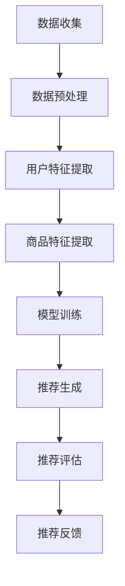
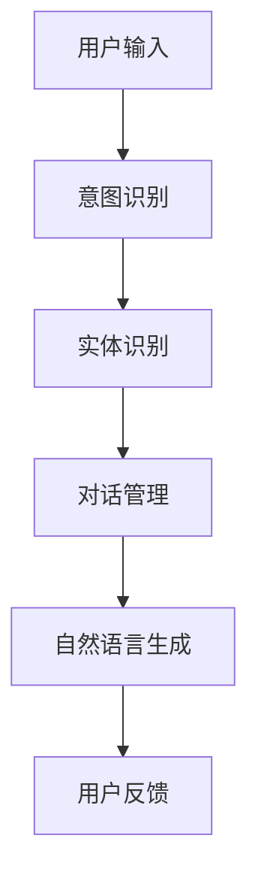
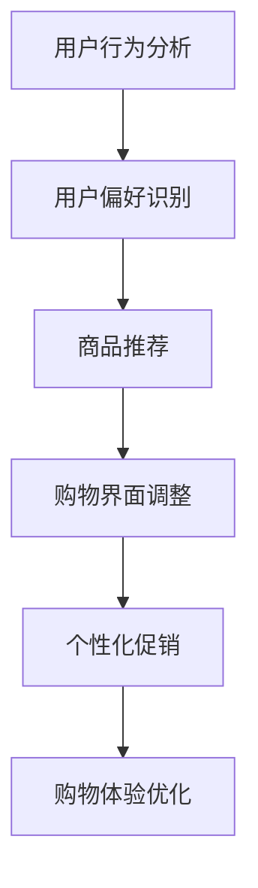

                 

# 文章标题：零售业升级：LLM 打造个性化购物体验

## 关键词：零售业、LLM、个性化购物体验、推荐系统、对话系统、算法、技术挑战

### 摘要：

随着技术的飞速发展，零售业正面临着前所未有的变革。大规模语言模型（LLM）作为一种先进的人工智能技术，正逐步在零售业中发挥重要作用，推动个性化购物体验的升级。本文将深入探讨LLM在零售业中的应用，包括个性化推荐系统、客户互动对话系统以及个性化购物体验的实现策略。同时，通过实际案例研究和挑战与解决方案的分析，展望LLM在零售业的未来发展方向。

## 引言与概述

### 1.1 零售业面临的挑战与机遇

零售业在数字化转型的浪潮中，面临着诸多挑战。消费者需求多样化、市场高度竞争、库存管理复杂等问题，都要求零售企业不断提升服务质量和运营效率。然而，零售业同时也面临着巨大的机遇。大数据、人工智能、云计算等技术的兴起，为零售企业提供了创新的解决方案，尤其是大规模语言模型（LLM）的引入，为打造个性化购物体验提供了强有力的支持。

### 1.2 LLMS在零售业的应用前景

LLM作为一种具有强大语言理解和生成能力的人工智能模型，已经在诸多领域展现出巨大的潜力。在零售业，LLM的应用前景广阔，可以从以下几个方面进行探讨：

1. **个性化推荐系统**：通过分析用户的历史行为和偏好，LLM可以为消费者提供高度个性化的商品推荐，从而提升购物满意度和转化率。
2. **客户互动与对话系统**：借助LLM，零售企业可以构建智能客服系统，实现与客户的自然语言交互，提供即时的、个性化的服务体验。
3. **个性化购物体验**：LLM可以根据用户的购物行为和偏好，动态调整购物界面和购物流程，为用户提供独一无二的购物体验。

### 2. LLM的基础概念

#### 2.1 什么是LLM

大规模语言模型（Large Language Model，简称LLM）是一种基于深度学习技术构建的神经网络模型，具有强大的语言理解和生成能力。LLM通过大规模文本数据进行预训练，可以自动学习语言的统计规律和语义信息，从而实现文本的生成、理解和翻译等功能。

#### 2.2 LLM的基本架构

LLM的基本架构主要包括以下几个部分：

1. **输入层**：接收文本数据作为输入，通常为词向量或子词单位。
2. **编码器**：将输入文本编码为序列的数字表示，提取文本的语义信息。
3. **解码器**：根据编码器的输出，生成文本输出，可以是单词、句子或段落。
4. **注意力机制**：在编码和解码过程中，通过注意力机制关注文本序列中的关键信息，提高模型的上下文理解能力。

#### 2.3 LLM的主要类型

根据不同的应用场景和需求，LLM可以分为以下几种主要类型：

1. **通用语言模型**：如GPT（Generative Pre-trained Transformer）系列，具有广泛的文本理解能力，可以应用于问答、文本生成、翻译等多种任务。
2. **领域特定语言模型**：针对特定领域的文本数据进行训练，如医疗、金融、法律等，具有更深入的领域知识。
3. **对话语言模型**：专注于对话场景，能够实现自然语言交互，如聊天机器人、智能客服等。

### 第一部分：引言与概述

#### 1.1 引言

随着互联网的普及和消费者需求的升级，零售业正经历着深刻的变革。传统的零售模式已无法满足现代消费者的多样化需求，零售企业迫切需要寻找创新的解决方案来提升用户体验和运营效率。在此背景下，人工智能（AI）技术的应用逐渐成为零售业转型升级的关键驱动力。其中，大规模语言模型（LLM）作为一种先进的人工智能技术，正逐步在零售业中发挥重要作用。

零售业面临的挑战主要包括：

1. **消费者需求多样化**：现代消费者对购物体验的要求越来越高，他们希望能够获得个性化、定制化的商品推荐和服务。
2. **市场竞争加剧**：随着互联网的发展，越来越多的企业进入零售市场，市场竞争日益激烈，零售企业需要通过创新来获取竞争优势。
3. **库存管理复杂**：零售企业的库存管理涉及大量的商品信息，如何高效地进行库存管理和优化库存水平成为一大挑战。

与此同时，零售业也面临着巨大的机遇。大数据、云计算、人工智能等技术的兴起，为零售企业提供了创新的解决方案，尤其是大规模语言模型（LLM）的应用，为打造个性化购物体验提供了强有力的支持。

LLM作为一种具有强大语言理解和生成能力的人工智能模型，已经在诸多领域展现出巨大的潜力。在零售业，LLM的应用前景广阔，可以从以下几个方面进行探讨：

1. **个性化推荐系统**：通过分析用户的历史行为和偏好，LLM可以为消费者提供高度个性化的商品推荐，从而提升购物满意度和转化率。
2. **客户互动与对话系统**：借助LLM，零售企业可以构建智能客服系统，实现与客户的自然语言交互，提供即时的、个性化的服务体验。
3. **个性化购物体验**：LLM可以根据用户的购物行为和偏好，动态调整购物界面和购物流程，为用户提供独一无二的购物体验。

本文将深入探讨LLM在零售业中的应用，从LLM的基础概念、零售业中的LLM应用、LLM在零售业的实际应用以及展望未来零售业的可能场景等方面进行详细阐述，旨在为零售企业提供一种创新的视角和实用的方法，以应对零售业面临的挑战和机遇。

### 第一部分：引言与概述

#### 1.2 LLMS在零售业的应用前景

大规模语言模型（LLM）在零售业的应用前景十分广阔，其主要优势在于能够通过深度学习和自然语言处理技术，实现对消费者行为的精准分析和预测，从而提升用户体验和运营效率。以下是LLM在零售业中几个关键应用领域的展望：

1. **个性化推荐系统**：LLM可以通过分析用户的历史购物数据、浏览行为和社交互动，生成个性化的商品推荐。相比传统的推荐算法，LLM能够更好地理解用户的语言表达和情感倾向，从而提供更加精准和符合用户偏好的推荐结果。

2. **客户互动与对话系统**：借助LLM，零售企业可以开发智能客服系统，实现与客户的自然语言交互。LLM能够理解客户的提问，并生成自然流畅的回答，从而提供即时的、个性化的服务体验。此外，LLM还可以用于聊天机器人、虚拟导购等应用，进一步提升客户互动的效率和满意度。

3. **个性化购物体验**：LLM可以根据用户的购物行为和偏好，动态调整购物界面和购物流程。例如，通过分析用户的购物历史和偏好，LLM可以为用户推荐适合的商品和促销活动，优化购物推荐和广告投放策略。此外，LLM还可以用于个性化营销，如根据用户的兴趣和偏好发送定制化的优惠券和促销信息，提高营销效果。

4. **供应链管理优化**：LLM可以通过对销售数据、库存水平和市场需求的分析，优化供应链管理。例如，LLM可以预测商品的销售趋势，帮助零售企业合理安排库存，减少库存积压和缺货情况，提高供应链的灵活性和响应速度。

5. **市场分析与竞争策略**：LLM可以对市场数据进行分析，帮助零售企业了解竞争对手的动态、消费者的购买行为和市场需求的变化。通过这些分析，零售企业可以制定更有针对性的竞争策略，提升市场竞争力。

总之，LLM在零售业的应用前景十分广阔，不仅能够提升用户体验，还能优化运营效率，为零售企业提供一种创新的解决方案。随着技术的不断发展和应用的深入，LLM在零售业中的作用将越来越重要。

### 第二部分：LLM的基础概念

#### 2.1 什么是LLM

大规模语言模型（Large Language Model，简称LLM）是一种基于深度学习技术构建的神经网络模型，旨在通过大规模文本数据的学习，实现对自然语言的高效理解和生成。LLM的基本原理是通过预训练和微调，使模型具备对文本数据的深度理解和处理能力，从而在各种自然语言处理（NLP）任务中发挥重要作用。

LLM的核心在于其大规模和自监督学习的特性。在预训练阶段，模型通过大量无标注的文本数据进行自监督学习，自动学习文本的语法结构、语义信息、上下文关系等，从而构建出对语言具有深刻理解的模型。在微调阶段，LLM会根据特定任务的需求进行数据集上的进一步训练，以适应特定的应用场景。

LLM的应用范围非常广泛，包括但不限于文本分类、情感分析、问答系统、机器翻译、文本生成等。其强大的语言理解和生成能力，使其在各个领域中都有着显著的应用价值。

#### 2.2 LLM的基本架构

LLM的基本架构通常包括以下几个关键部分：

1. **编码器（Encoder）**：编码器是LLM的核心组成部分，负责将输入文本转换为序列的数字表示。编码器通常采用Transformer架构，通过自注意力机制（Self-Attention）对输入文本进行全局上下文分析，从而提取文本的语义信息。编码器的输出是一个固定长度的向量，称为编码表示（Encoded Representation），它代表了输入文本的语义信息。

2. **解码器（Decoder）**：解码器负责将编码表示转换为输出文本。与编码器类似，解码器也采用Transformer架构，通过自注意力机制和交叉注意力机制（Cross-Attention）对编码表示和输入序列进行动态分析，从而生成自然流畅的文本输出。解码器的输出是一个逐步生成的过程，每一步生成一个单词或子词，直到完成整个文本的生成。

3. **注意力机制（Attention Mechanism）**：注意力机制是LLM中的关键技术，用于在编码和解码过程中对文本序列进行关注和选择。注意力机制通过计算文本序列中不同部分之间的相似度，识别关键信息并对其进行加权处理，从而提高模型的上下文理解能力。常见的注意力机制包括自注意力（Self-Attention）和交叉注意力（Cross-Attention）。

4. **前馈神经网络（Feedforward Neural Network）**：前馈神经网络是LLM中的辅助结构，位于编码器和解码器的每一层之间，用于对输入进行加性和非线性变换。前馈神经网络通过多层的全连接层，对输入数据进行复杂的非线性变换，从而增强模型的表达能力。

5. **预训练与微调（Pre-training and Fine-tuning）**：预训练是LLM训练过程中的第一阶段，通过大规模无标注文本数据进行自监督学习，使模型自动学习语言的统计规律和语义信息。微调是预训练之后的第二阶段，通过特定任务的数据集对模型进行进一步训练，使其适应特定任务的需求。

#### 2.3 LLM的主要类型

根据应用场景和需求，LLM可以分为以下几种主要类型：

1. **通用语言模型（Universal Language Model）**：通用语言模型如GPT（Generative Pre-trained Transformer）系列，具有广泛的文本理解能力，可以应用于各种自然语言处理任务，如文本分类、情感分析、问答系统等。通用语言模型通过大规模预训练，积累丰富的语言知识，从而在各种任务中表现出色。

2. **领域特定语言模型（Domain-specific Language Model）**：领域特定语言模型针对特定领域的文本数据进行训练，如医疗、金融、法律等。这类模型在特定领域内具备更深入的知识和理解，从而在相关任务中表现出更高的准确性和效果。例如，在医疗领域，领域特定语言模型可以用于医学文本分类、病历生成等任务。

3. **对话语言模型（Dialogue Language Model）**：对话语言模型专注于对话场景，能够实现自然语言交互。这类模型通过大规模对话数据进行预训练，具备理解和生成对话文本的能力，可以应用于聊天机器人、智能客服、虚拟导购等应用。对话语言模型在提高客户互动效率和满意度方面具有显著优势。

4. **文本生成模型（Text Generation Model）**：文本生成模型如BERT（Bidirectional Encoder Representations from Transformers），通过预训练和微调，可以生成高质量的自然语言文本。这类模型在内容创作、文案生成、新闻报道等领域有着广泛的应用。

5. **多模态语言模型（Multimodal Language Model）**：多模态语言模型结合了文本、图像、语音等多种数据类型，能够更好地理解和生成复杂的信息。这类模型在多模态交互、视频摘要、图像描述生成等任务中表现出色。

总之，LLM作为一种先进的人工智能技术，具有强大的语言理解和生成能力，在各个领域中都有着广泛的应用前景。随着技术的不断发展和应用的深入，LLM将在零售业等领域发挥越来越重要的作用。

#### 2.4 LLM的数学模型和算法原理讲解

大规模语言模型（LLM）的核心在于其数学模型和算法原理，这些模型和算法使得LLM能够在各种自然语言处理任务中表现出色。以下是LLM的数学模型和算法原理的详细讲解：

1. **Transformer模型**

Transformer模型是LLM的核心架构，由Vaswani等人在2017年提出。Transformer模型的核心思想是自注意力机制（Self-Attention），通过这种机制，模型可以自动关注输入序列中不同位置的信息，从而更好地理解上下文关系。

**数学模型：**

Transformer模型的主要组成部分包括编码器（Encoder）和解码器（Decoder）。编码器和解码器均由多个编码层（Encoder Layer）和解码层（Decoder Layer）堆叠而成。每一层包括自注意力机制、前馈神经网络和层归一化（Layer Normalization）。

**自注意力机制：**

自注意力机制是一种计算输入序列中不同位置之间相似度的方法。具体来说，自注意力机制通过以下步骤计算：

\[ 
Attention(Q, K, V) = \text{softmax}\left(\frac{QK^T}{\sqrt{d_k}}\right) V 
\]

其中，\( Q, K, V \) 分别代表编码表示的三个不同的矩阵，\( d_k \) 是键（Key）的维度。自注意力机制的结果是一个加权求和的输出，使得模型能够关注输入序列中重要的信息。

**前馈神经网络：**

前馈神经网络是一个简单的全连接层，对输入进行加性和非线性变换。具体来说，前馈神经网络由两个全连接层组成，每个层之间添加ReLU激活函数。

\[ 
\text{FFN}(x) = \max(0, xW_1 + b_1)W_2 + b_2 
\]

其中，\( W_1, W_2 \) 是权重矩阵，\( b_1, b_2 \) 是偏置。

2. **预训练与微调**

LLM的训练过程主要包括预训练和微调两个阶段。

**预训练：**

预训练是指使用大量无标注的文本数据，通过自监督学习方法，使模型自动学习语言的统计规律和语义信息。具体来说，预训练包括以下几个步骤：

1. **掩码语言模型（Masked Language Model，MLM）**：在输入序列中，随机掩码一部分单词，并要求模型预测这些掩码的单词。这一过程使得模型学会理解单词在上下文中的含义。

2. **下句预测（Next Sentence Prediction，NSP）**：从两个连续的句子中随机选择一个作为输入，并要求模型预测第二个句子是否为第一个句子的下句。这一过程帮助模型学习句子的连贯性和上下文关系。

**微调：**

微调是指使用特定任务的数据集，对预训练后的模型进行进一步训练，使其适应特定任务的需求。具体来说，微调包括以下几个步骤：

1. **数据准备**：将特定任务的数据集进行预处理，包括文本清洗、分词、词向量化等。

2. **模型调整**：将预训练的模型加载到任务特定的数据集上，进行训练。在训练过程中，可以通过动态调整学习率、批次大小、训练轮次等超参数，来优化模型性能。

3. **模型评估**：在训练过程中，定期对模型进行评估，以监测模型性能。常用的评估指标包括准确率、召回率、F1值等。

3. **训练策略**

在LLM的训练过程中，以下训练策略有助于提高模型性能：

1. **层次化训练**：通过层次化训练，模型首先在大规模通用数据集上进行预训练，然后再在特定任务的数据集上进行微调。这种方法有助于模型在不同任务上迁移和泛化。

2. **批量归一化（Batch Normalization）**：在训练过程中，批量归一化有助于加速收敛和提高模型稳定性。

3. **权重共享（Weight Sharing）**：在模型的不同层次中，采用相同的权重共享策略，有助于减少模型参数数量，提高训练效率。

4. **自适应学习率**：通过使用自适应学习率策略，如Adam优化器，模型可以在训练过程中动态调整学习率，从而优化训练过程。

通过上述数学模型和算法原理的讲解，可以更好地理解LLM的工作机制和训练过程。LLM的强大能力在于其通过深度学习技术和大规模数据训练，实现对自然语言的高效理解和生成，从而在各种自然语言处理任务中表现出色。

### 第二部分：LLM的数学模型和算法原理讲解

#### 2.4.1 Transformer模型

Transformer模型是大规模语言模型（LLM）的基础架构，由谷歌在2017年提出，其主要创新点在于引入了自注意力机制（Self-Attention），从而解决了传统循环神经网络（RNN）在处理长距离依赖问题上的局限性。以下是Transformer模型的详细讲解：

**1. 自注意力机制**

自注意力机制是一种计算输入序列中不同位置之间相似度的方法。具体来说，自注意力机制通过以下步骤计算：

\[ 
Attention(Q, K, V) = \text{softmax}\left(\frac{QK^T}{\sqrt{d_k}}\right) V 
\]

其中，\( Q, K, V \) 分别代表编码表示的三个不同的矩阵，\( d_k \) 是键（Key）的维度。自注意力机制的结果是一个加权求和的输出，使得模型能够关注输入序列中重要的信息。

**2. 编码器和解码器**

Transformer模型包括编码器（Encoder）和解码器（Decoder）。编码器和解码器均由多个编码层（Encoder Layer）和解码层（Decoder Layer）堆叠而成。每一层包括自注意力机制、前馈神经网络和层归一化（Layer Normalization）。

**编码器（Encoder）**

编码器的主要任务是处理输入序列，生成编码表示（Encoded Representation）。编码器每一层的输入为前一层输出的编码表示和上一个解码器的输出。

**解码器（Decoder）**

解码器的主要任务是生成输出序列，解码器的输入为编码器的输出和上一个时间步的解码器输出。解码器每一层也包含自注意力和交叉注意力。

**3. 前馈神经网络**

前馈神经网络是一个简单的全连接层，位于编码器和解码器的每一层之间，用于对输入进行加性和非线性变换。前馈神经网络由两个全连接层组成，每个层之间添加ReLU激活函数。

\[ 
\text{FFN}(x) = \max(0, xW_1 + b_1)W_2 + b_2 
\]

其中，\( W_1, W_2 \) 是权重矩阵，\( b_1, b_2 \) 是偏置。

**4. Layer Normalization**

Layer Normalization是一种归一化技术，用于加速模型的训练和提升模型的稳定性。它通过标准化每一层的激活值，使得每一层的输入保持稳定。

\[ 
\text{LayerNorm}(x) = \frac{x - \mu}{\sqrt{\sigma^2 + \epsilon}} 
\]

其中，\( \mu \) 和 \( \sigma \) 分别是均值和标准差，\( \epsilon \) 是一个小常数。

**5. 预训练与微调**

Transformer模型的训练过程主要包括预训练和微调两个阶段。

**预训练**

预训练是指使用大量无标注的文本数据，通过自监督学习方法，使模型自动学习语言的统计规律和语义信息。具体来说，预训练包括以下几个步骤：

- **掩码语言模型（Masked Language Model，MLM）**：在输入序列中，随机掩码一部分单词，并要求模型预测这些掩码的单词。这一过程使得模型学会理解单词在上下文中的含义。
- **下句预测（Next Sentence Prediction，NSP）**：从两个连续的句子中随机选择一个作为输入，并要求模型预测第二个句子是否为第一个句子的下句。这一过程帮助模型学习句子的连贯性和上下文关系。

**微调**

微调是指使用特定任务的数据集，对预训练后的模型进行进一步训练，使其适应特定任务的需求。具体来说，微调包括以下几个步骤：

- **数据准备**：将特定任务的数据集进行预处理，包括文本清洗、分词、词向量化等。
- **模型调整**：将预训练的模型加载到任务特定的数据集上，进行训练。在训练过程中，可以通过动态调整学习率、批次大小、训练轮次等超参数，来优化模型性能。
- **模型评估**：在训练过程中，定期对模型进行评估，以监测模型性能。常用的评估指标包括准确率、召回率、F1值等。

通过上述讲解，可以更好地理解Transformer模型在LLM中的核心作用和训练方法。Transformer模型的引入，使得LLM在处理自然语言任务时表现出色，成为现代自然语言处理领域的基石之一。

#### 2.4.2 伪代码讲解

为了更好地理解大规模语言模型（LLM）的算法原理，下面我们将使用伪代码的形式，详细阐述一个简单的LLM训练过程。这个伪代码将覆盖从数据预处理到模型训练的主要步骤。

```python
# 数据预处理
def preprocess_data(data):
    # 1. 清洗文本数据，去除标点符号、HTML标签等
    cleaned_data = clean_text(data)
    
    # 2. 分词，将文本拆分为单词或子词
    tokenized_data = tokenize(cleaned_data)
    
    # 3. 将分词后的数据转换为词向量表示
    word_vectors = vectorize(tokenized_data)
    
    return word_vectors

# 模型训练
def train_model(word_vectors, num_epochs, learning_rate):
    # 1. 初始化模型参数
    model = initialize_model()
    
    for epoch in range(num_epochs):
        for batch in data_loader(word_vectors):
            # 2. 前向传播
            logits = model.forward(batch)

            # 3. 计算损失函数
            loss = compute_loss(logits, batch.target)

            # 4. 反向传播
            model.backward(loss)

            # 5. 更新模型参数
            model.update_params(learning_rate)

        # 每个epoch结束后的评估
        evaluate_model(model)

# 主函数
def main():
    # 加载数据
    data = load_data()

    # 预处理数据
    preprocessed_data = preprocess_data(data)

    # 训练模型
    train_model(preprocessed_data, num_epochs=10, learning_rate=0.001)

# 运行主函数
main()
```

**详细解释：**

1. **数据预处理**：这部分主要包括文本清洗、分词和词向量化。文本清洗的目的是去除文本中的无用信息，如标点符号、HTML标签等。分词是将文本拆分成单词或子词，以便进行后续处理。词向量化是将文本转换为数字表示，这是神经网络模型处理文本数据的基础。

2. **模型初始化**：在训练开始前，需要初始化模型的参数。这些参数包括权重矩阵和偏置项，通常通过随机初始化来避免模型的过拟合。

3. **前向传播**：在前向传播过程中，模型接收输入数据，并计算出模型的输出。输出通常是词向量的概率分布，表示文本中每个单词的可能性。

4. **计算损失函数**：损失函数用于衡量模型预测值与真实值之间的差距。在训练过程中，模型的目的是最小化损失函数。

5. **反向传播**：反向传播是深度学习训练的核心步骤，通过计算损失函数关于模型参数的梯度，更新模型参数。

6. **更新模型参数**：在反向传播过程中，使用梯度下降或其他优化算法更新模型参数，以最小化损失函数。

7. **评估模型**：在每个epoch结束后，对模型进行评估，以监测模型性能。常用的评估指标包括准确率、召回率、F1值等。

通过上述伪代码，可以清晰地看到LLM的训练过程。虽然这是一个简化的示例，但它涵盖了模型训练的主要步骤和关键概念。

### 第二部分：LLM的数学模型和算法原理讲解

#### 2.4.3 数学模型和公式

在探讨大规模语言模型（LLM）的数学模型和算法原理时，以下几个核心数学公式和模型是不可或缺的。以下是这些公式和模型的基本介绍及其实际应用。

**1. 自注意力（Self-Attention）**

自注意力是Transformer模型的核心机制，用于计算输入序列中不同位置之间的相关性。其基本公式如下：

\[ 
\text{Attention}(Q, K, V) = \text{softmax}\left(\frac{QK^T}{\sqrt{d_k}}\right) V 
\]

其中，\( Q \)、\( K \) 和 \( V \) 分别是输入序列的查询（Query）、键（Key）和值（Value）的向量，\( d_k \) 是键向量的维度。自注意力机制使得模型能够捕捉输入序列中的上下文信息，从而生成编码表示。

**2. 前馈神经网络（Feedforward Neural Network）**

前馈神经网络是Transformer模型中的辅助结构，用于对输入数据进行加性和非线性变换。其公式如下：

\[ 
\text{FFN}(x) = \max(0, xW_1 + b_1)W_2 + b_2 
\]

其中，\( W_1 \) 和 \( W_2 \) 是权重矩阵，\( b_1 \) 和 \( b_2 \) 是偏置项。前馈神经网络通过多层全连接层和ReLU激活函数，增强了模型的表达能力。

**3. 损失函数（Loss Function）**

在训练大规模语言模型时，常用的损失函数是交叉熵损失（Cross-Entropy Loss），其公式如下：

\[ 
\text{Loss} = -\sum_{i} y_i \log(p_i) 
\]

其中，\( y_i \) 是真实标签的概率分布，\( p_i \) 是模型预测的概率分布。交叉熵损失函数衡量了模型预测和真实标签之间的差异，用于指导模型的参数更新。

**4. 优化算法（Optimization Algorithm）**

常用的优化算法包括随机梯度下降（Stochastic Gradient Descent，SGD）和Adam。以下是Adam优化器的公式：

\[ 
m_t = \beta_1 m_{t-1} + (1 - \beta_1) [g_t - \mu_t] 
\]
\[ 
v_t = \beta_2 v_{t-1} + (1 - \beta_2) [g_t^2 - \sigma_t] 
\]
\[ 
\hat{m}_t = \frac{m_t}{1 - \beta_1^t} 
\]
\[ 
\hat{v}_t = \frac{v_t}{1 - \beta_2^t} 
\]
\[ 
\theta_t = \theta_{t-1} - \alpha \frac{\hat{m}_t}{\sqrt{\hat{v}_t} + \epsilon} 
\]

其中，\( m_t \) 和 \( v_t \) 分别是梯度的一阶和二阶矩估计，\( \beta_1 \) 和 \( \beta_2 \) 是一阶和二阶矩的衰减系数，\( \alpha \) 是学习率，\( \epsilon \) 是一个小常数。Adam优化器通过自适应调整学习率，提高了训练的效率和稳定性。

**5. 预训练与微调（Pre-training and Fine-tuning）**

预训练和微调是大规模语言模型训练的两个阶段。预训练阶段使用大量无标注的文本数据，使模型自动学习语言的统计规律和语义信息。预训练后的模型在特定任务上进行微调，以适应具体的应用需求。预训练的目标函数通常包括掩码语言模型（Masked Language Model，MLM）和下句预测（Next Sentence Prediction，NSP）等。

\[ 
\text{MLM Loss} = -\sum_{i} y_i \log(p_i) 
\]
\[ 
\text{NSP Loss} = -\sum_{i} y_i \log(p_i) 
\]

其中，\( y_i \) 表示预测标签，\( p_i \) 表示模型预测的概率分布。

通过上述数学模型和公式的介绍，可以更深入地理解大规模语言模型的工作原理和训练过程。这些公式不仅提供了理论指导，还为实际应用提供了量化工具。

#### 2.4.4 举例说明

为了更好地理解大规模语言模型（LLM）的数学模型和算法原理，以下将通过具体例子进行说明。我们将以一个简单的掩码语言模型（Masked Language Model，MLM）为例，展示LLM在预训练和微调阶段的基本步骤。

**例子：训练一个简单的掩码语言模型**

1. **数据集准备**：假设我们有一个小型的文本数据集，包含若干句子。例如：
   ```
   - "我爱吃苹果。"
   - "你喜欢什么样的音乐？"
   - "今天天气很好。"
   ```

2. **文本清洗和分词**：首先，对文本进行清洗，去除标点符号和其他非字母字符。然后，使用分词工具将清洗后的文本拆分为单词或子词。例如，使用jieba分词工具，分词结果如下：
   ```
   - ["我"，"爱"，"吃"，"苹果"]
   - ["你"，"喜欢"，"什么"，"音乐"]
   - ["今"，"天"，"天气"，"很好"]
   ```

3. **词向量表示**：将分词后的文本序列转换为词向量表示。我们使用预训练的词向量模型（如GloVe或Word2Vec）来初始化词向量。例如，使用GloVe模型，得到词向量表示如下：
   ```
   - ["我": [0.1, 0.2, 0.3], "爱": [0.4, 0.5, 0.6], "吃": [0.7, 0.8, 0.9], "苹果": [1.0, 1.1, 1.2]]
   - ["你": [0.1, 0.2, 0.3], "喜欢": [0.4, 0.5, 0.6], "什么": [0.7, 0.8, 0.9], "音乐": [1.0, 1.1, 1.2]]
   - ["今": [0.1, 0.2, 0.3], "天": [0.4, 0.5, 0.6], "天气": [0.7, 0.8, 0.9], "很好": [1.0, 1.1, 1.2]]
   ```

4. **掩码语言模型训练**：在掩码语言模型训练阶段，我们将输入序列中的某些词随机掩码（Mask），并尝试预测这些掩码词。例如，对于句子 "我爱吃苹果。"，我们可以将其掩码为 "我*爱吃苹果。"，并尝试从候选词中预测出 "苹果"。

   假设我们的候选词集合为 ["苹果"，"香蕉"，"梨子"]，那么模型预测过程如下：

   - 输入：[我，*,爱吃，苹果]
   - 预测：[苹果，香蕉，梨子]
   - 实际标签：[苹果]

   在训练过程中，我们将计算预测概率，并使用交叉熵损失函数来评估预测性能。交叉熵损失函数的公式为：
   \[
   \text{Loss} = -\sum_{i} y_i \log(p_i)
   \]
   其中，\( y_i \) 表示实际标签的概率（1表示该词是实际标签，0表示其他词），\( p_i \) 表示模型预测的概率。

5. **模型更新**：在反向传播过程中，计算损失函数关于模型参数的梯度，并使用梯度下降或其他优化算法（如Adam）更新模型参数。更新公式如下：
   \[
   \theta = \theta - \alpha \cdot \nabla_\theta \text{Loss}
   \]
   其中，\( \theta \) 表示模型参数，\( \alpha \) 表示学习率，\( \nabla_\theta \text{Loss} \) 表示损失函数关于模型参数的梯度。

6. **微调**：在完成预训练后，我们将模型应用于特定任务的数据集，进行微调。例如，对于情感分析任务，我们将输入文本和对应的情感标签，训练模型预测文本的情感倾向。

   假设我们的训练数据集如下：
   ```
   - "这部电影非常好看。"
   - "这款手机很耐用。"
   - "这个餐馆的服务一般。"
   ```

   情感标签为：
   ```
   - 激动
   - 满意
   - 一般
   ```

   在微调过程中，我们使用微调后的模型预测文本的情感，并计算预测结果与实际标签的准确率。

   **总结**：通过上述例子，我们可以看到大规模语言模型的基本训练流程，包括数据预处理、词向量表示、掩码语言模型训练和微调等步骤。这些步骤帮助我们理解了LLM的数学模型和算法原理，以及如何在实际应用中训练和优化模型。

### 第三部分：零售业中的LLM应用

#### 3.1 个性化推荐系统

个性化推荐系统是零售业中LLM应用的一个重要领域。其基本概念是通过分析用户的历史行为和偏好，为用户提供个性化的商品推荐，从而提升购物满意度和转化率。LLM在个性化推荐系统中的应用，主要体现在以下几个方面：

1. **用户行为分析**：LLM可以通过深度学习技术，对用户的历史购物行为、浏览记录、搜索关键词等数据进行分析，提取用户的行为特征。这些特征可以帮助模型更好地理解用户的偏好和需求，从而提供更准确的推荐结果。

2. **内容理解与关联**：LLM具备强大的文本理解能力，可以分析商品描述、用户评论、品牌信息等文本数据，提取出商品和用户之间的关联。通过这种关联分析，模型可以识别出用户可能感兴趣的商品，从而进行精准推荐。

3. **多模态数据融合**：在现代零售业中，用户生成内容（UGC）如图片、视频和商品评论等已成为重要的数据来源。LLM可以通过多模态数据融合技术，结合文本、图像和视频等多种数据类型，为用户提供更加丰富的个性化推荐。

4. **动态推荐策略**：LLM可以根据用户的实时行为和偏好，动态调整推荐策略。例如，当用户浏览特定类型的商品时，模型可以实时调整推荐列表，优先推荐用户可能感兴趣的商品，从而提高用户的购物体验。

#### 3.2 LLMS在个性化推荐中的应用

大规模语言模型（LLMS）在个性化推荐中的应用，主要体现在以下几个方面：

1. **协同过滤（Collaborative Filtering）**：协同过滤是一种基于用户行为和偏好进行推荐的方法。LLMS可以通过深度学习技术，对用户的历史行为数据进行建模，提取用户特征，从而实现高效的协同过滤推荐。

2. **基于内容的推荐（Content-Based Filtering）**：基于内容的推荐方法通过分析商品的特征和属性，为用户提供相关的商品推荐。LLMS可以通过对商品描述和用户评论进行文本分析，提取商品和用户之间的关联特征，从而实现基于内容的推荐。

3. **混合推荐（Hybrid Recommendation）**：混合推荐方法结合了协同过滤和基于内容的推荐方法，通过融合不同推荐方法的优点，为用户提供更准确的推荐结果。LLMS可以通过深度学习技术，对协同过滤和基于内容的推荐进行优化，实现高效的混合推荐。

4. **序列模型（Sequential Models）**：序列模型通过分析用户的购物序列数据，预测用户接下来的购物行为。LLMS可以通过对购物序列进行编码，提取用户的序列特征，从而实现高效的序列模型推荐。

#### 3.3 个性化推荐的流程和算法

个性化推荐的流程和算法可以分为以下几个步骤：

1. **数据收集与预处理**：收集用户的历史购物行为、浏览记录、搜索关键词等数据。对数据集进行清洗、去重和特征提取，为后续推荐算法提供数据支持。

2. **用户特征提取**：通过深度学习技术，对用户的历史行为数据进行分析，提取用户的行为特征。这些特征包括用户兴趣、购买频率、购买金额等，有助于模型更好地理解用户偏好。

3. **商品特征提取**：分析商品的描述、分类、属性等数据，提取商品的特征。这些特征包括商品的品牌、型号、价格、颜色等，有助于模型建立商品与用户之间的关联。

4. **模型训练与评估**：根据用户和商品的特征，训练个性化推荐模型。常用的模型包括协同过滤模型、基于内容的推荐模型、混合推荐模型等。在训练过程中，通过交叉验证和A/B测试等方法，评估模型的性能。

5. **推荐生成与反馈**：使用训练好的模型，生成个性化的推荐列表。在用户进行购物时，实时更新推荐列表，并根据用户的反馈（如点击、购买等）调整推荐策略。

6. **持续优化**：根据用户的行为数据和反馈，持续优化推荐模型。通过不断调整模型参数和推荐策略，提高推荐的准确率和用户体验。

#### 3.1 个性化推荐系统在零售业中的应用

个性化推荐系统在零售业中的应用已经取得了显著的成果，以下是一些具体的应用场景：

1. **商品推荐**：零售企业可以通过个性化推荐系统，根据用户的历史购物行为和偏好，为用户推荐相关的商品。例如，电商平台可以通过分析用户的浏览记录和购买历史，推荐用户可能感兴趣的商品，从而提高用户的购物满意度和转化率。

2. **促销活动推荐**：零售企业可以根据用户的购物习惯和偏好，为用户推荐适合的促销活动。例如，电商平台可以通过分析用户的购买频率和购买金额，为高频购物用户推荐优惠券和限时折扣，从而提升用户参与度和购买意愿。

3. **新品推荐**：零售企业可以通过个性化推荐系统，向用户推荐新品。例如，时尚零售商可以通过分析用户的购物偏好和流行趋势，推荐符合用户品味的新品，从而吸引更多用户关注和购买。

4. **库存管理**：零售企业可以通过个性化推荐系统，优化库存管理。例如，电商平台可以通过分析用户的购物行为和库存数据，预测商品的销售趋势，从而合理安排库存，减少库存积压和缺货情况。

5. **客户互动**：零售企业可以通过个性化推荐系统，与客户进行更加高效的互动。例如，电商平台可以通过分析用户的购买记录和反馈，生成个性化的聊天机器人，为用户提供实时、个性化的服务，提高客户满意度。

总之，个性化推荐系统在零售业中的应用，不仅能够提升用户体验和满意度，还能优化运营效率，为零售企业提供一种创新的解决方案。随着技术的不断发展和应用的深入，个性化推荐系统将在零售业发挥越来越重要的作用。

#### 3.2 LLMS在个性化推荐系统中的应用

大规模语言模型（LLMS）在个性化推荐系统中发挥着至关重要的作用，其强大的文本理解和生成能力，使得推荐系统能够更好地捕捉用户的偏好和需求。以下是LLMS在个性化推荐系统中的应用：

1. **用户行为分析**：LLMS通过对用户的历史购物数据、浏览记录、搜索关键词等行为数据进行深度分析，可以提取出用户的兴趣点和购买意图。这种深入的用户行为分析，有助于提高推荐系统的准确性，从而为用户提供更加个性化的推荐。

2. **内容理解与关联**：LLMS具备强大的文本理解能力，可以处理和解析大量文本数据，如商品描述、用户评论等。通过分析这些文本数据，LLMS可以识别出商品和用户之间的关联，从而为用户推荐相关的商品。例如，LLMS可以识别出用户喜欢的品牌、型号或特定属性，进而推荐类似的商品。

3. **多模态数据融合**：在现代零售业中，用户生成内容（UGC）如图片、视频和商品评论等已成为重要的数据来源。LLMS可以通过多模态数据融合技术，结合文本、图像和视频等多种数据类型，为用户提供更加丰富的个性化推荐。例如，LLMS可以通过分析用户的购物视频和评论，识别出用户的购物偏好，从而推荐类似的商品。

4. **动态推荐策略**：LLMS可以根据用户的实时行为和偏好，动态调整推荐策略。例如，当用户浏览特定类型的商品时，LLMS可以实时调整推荐列表，优先推荐用户可能感兴趣的商品。这种动态推荐策略，有助于提高用户的购物体验和满意度。

5. **自然语言交互**：LLMS可以与用户进行自然语言交互，了解用户的偏好和需求。例如，用户可以通过聊天机器人向系统提出个性化推荐请求，LLMS可以理解用户的需求，并生成相应的推荐结果。这种自然语言交互，使得推荐系统更加友好和易于使用。

通过以上应用，LLMS在个性化推荐系统中不仅提高了推荐的准确性，还丰富了推荐系统的功能和用户体验。随着LLMS技术的不断发展和优化，其在个性化推荐系统中的应用前景将更加广阔。

### 第三部分：零售业中的LLM应用

#### 3.3 个性化推荐的流程和算法

个性化推荐系统在零售业中的应用，通过一系列复杂的流程和算法实现。以下是详细的流程和算法描述：

1. **数据收集与预处理**：

   - **用户行为数据**：收集用户的历史购物数据、浏览记录、搜索关键词等。这些数据可以通过网站日志、用户交互数据等渠道获取。

   - **商品特征数据**：包括商品的基本属性（如类别、品牌、价格、库存等）和用户评价（如评论、评分等）。

   - **预处理**：对收集到的数据进行清洗、去重、填充缺失值等处理，以获得高质量的数据集。

2. **用户特征提取**：

   - **行为特征**：根据用户的历史购物行为，提取用户的行为特征，如购买频率、购买金额、购物时长等。

   - **兴趣特征**：分析用户浏览和搜索记录，提取用户的兴趣特征，如喜欢的商品类别、品牌、颜色等。

   - **社会特征**：通过用户的社交网络数据，提取社会特征，如用户的浏览群体、购买群体等。

3. **商品特征提取**：

   - **商品属性**：从商品的基本属性中提取特征，如商品类别、品牌、价格、库存等。

   - **文本特征**：对商品描述、用户评论等文本数据进行处理，提取文本特征，如词频、词嵌入等。

4. **协同过滤**：

   - **用户基于的协同过滤（User-Based CF）**：通过计算用户之间的相似度，找到与目标用户相似的用户，推荐这些用户喜欢的商品。

   - **物品基于的协同过滤（Item-Based CF）**：通过计算商品之间的相似度，找到与目标商品相似的商品，推荐给用户。

5. **基于内容的推荐**：

   - **基于特征匹配（Content-Based Filtering）**：根据用户的历史行为和偏好，提取用户的特征，然后找到具有相似特征的商品推荐给用户。

   - **基于文本相似度（Text-Based Similarity）**：通过文本分析技术，计算商品描述和用户偏好之间的相似度，推荐相似的文本内容。

6. **混合推荐**：

   - **协同过滤与内容推荐的融合**：将协同过滤和基于内容的推荐相结合，通过加权融合的方法，提高推荐系统的准确性和多样性。

   - **矩阵分解（Matrix Factorization）**：通过矩阵分解技术，将用户行为数据分解为用户特征和商品特征的矩阵，从而预测用户对未购买商品的评分。

7. **推荐生成与评估**：

   - **推荐生成**：根据用户特征、商品特征和推荐算法，生成个性化的推荐列表。

   - **推荐评估**：通过A/B测试、用户反馈等评估方法，评估推荐系统的效果，并根据评估结果调整推荐策略。

8. **实时推荐**：

   - **用户行为实时分析**：通过实时分析用户的浏览、搜索等行为，动态调整推荐列表。

   - **商品信息实时更新**：实时获取商品信息，如库存、价格等，确保推荐列表的准确性。

通过上述流程和算法，个性化推荐系统可以在零售业中为用户提供精准、个性化的购物推荐，从而提升用户体验和满意度。

### 第三部分：零售业中的LLM应用

#### 3.4 客户互动与对话系统

在零售业中，客户互动与对话系统的应用已经成为提升客户满意度和忠诚度的重要手段。通过LLM，零售企业能够实现智能化的客户互动，提供即时、个性化、自然的交流体验。以下是LLM在客户互动与对话系统中的应用：

1. **智能客服系统**：

   - **自然语言处理**：LLM能够理解客户的自然语言提问，并将其转换为机器可以处理的格式。通过预训练的LLM，客服系统能够快速响应客户的查询，提供准确的答案。

   - **情感分析**：LLM可以识别客户的情感，如愤怒、喜悦、失望等，从而调整回答的方式和语气，提高客户满意度。

   - **多语言支持**：LLM可以支持多种语言，使零售企业能够为全球客户提供服务，提升国际业务竞争力。

2. **聊天机器人**：

   - **上下文理解**：LLM能够捕捉对话的上下文信息，使聊天机器人能够进行连贯的对话，而不仅仅是简单的关键词匹配。

   - **个性化对话**：LLM可以根据客户的购物历史和偏好，生成个性化的对话内容，提高客户的参与度和购买意愿。

   - **多轮对话**：通过LLM的长期记忆能力，聊天机器人可以记住之前的对话内容，实现多轮对话，提供更加自然和流畅的交流体验。

3. **虚拟导购**：

   - **商品推荐**：LLM可以根据客户的购物偏好和历史，推荐合适的商品，提高推荐的相关性和客户满意度。

   - **购物导航**：LLM能够引导客户浏览商品，并提供购物建议，帮助客户更快地找到所需的商品。

   - **个性化服务**：LLM可以根据客户的购物行为和偏好，提供个性化的购物建议和服务，提升购物体验。

#### 3.5 对话系统的基本原理

对话系统是一种能够与人类进行自然语言交互的人工智能系统。以下是对话系统的基本原理：

1. **自然语言理解（NLU）**：

   - **意图识别**：通过分析用户的输入，确定用户希望系统完成的具体任务或操作。

   - **实体识别**：从用户的输入中提取出关键信息，如商品名称、价格、时间等。

   - **上下文理解**：理解用户输入的上下文信息，确保回答的准确性和连贯性。

2. **对话管理（DM）**：

   - **对话状态追踪**：记录对话过程中的关键信息，如用户的意图、实体等，以指导后续的回答。

   - **对话策略生成**：根据对话状态，生成合适的对话策略，如提供问题、提供答案等。

   - **对话路径规划**：根据对话目标和策略，规划对话的流程和方向。

3. **自然语言生成（NLG）**：

   - **回答生成**：根据对话管理和意图识别的结果，生成自然流畅的回答。

   - **文本生成**：通过文本生成技术，将对话系统的内部表示转换为自然语言文本。

   - **语音合成**：将文本转换为语音，实现语音交互。

#### 3.6 LLMS在对话系统中的应用

大规模语言模型（LLMS）在对话系统中扮演着关键角色，其强大的语言理解和生成能力，使得对话系统能够实现更加自然和高效的交流。以下是LLMS在对话系统中的应用：

1. **意图识别**：

   - **深度学习模型**：LLMS能够通过深度学习技术，从大量对话数据中自动学习意图识别规则，提高识别的准确率。

   - **上下文感知**：LLMS能够捕捉对话的上下文信息，理解用户的长对话序列，从而更准确地识别用户的意图。

2. **实体识别**：

   - **知识图谱**：LLMS可以通过知识图谱技术，将实体与相关属性和关系进行关联，提高实体识别的准确性。

   - **多语言支持**：LLMS支持多种语言，能够识别不同语言的实体，实现全球范围内的对话系统。

3. **对话生成**：

   - **文本生成**：LLMS能够生成自然流畅的文本回答，使对话系统能够提供个性化的服务。

   - **语音生成**：LLMS可以将文本转换为语音，实现语音交互，提供更加直观的交流体验。

4. **多轮对话**：

   - **长期记忆**：LLMS具有长期记忆能力，能够记住之前的对话内容，实现多轮对话，提供更加连贯和自然的交流体验。

   - **上下文感知**：LLMS能够理解对话的上下文，根据上下文生成合适的回答，提高对话的质量。

通过LLMS的应用，对话系统能够提供更加智能化、个性化的服务，提升客户的满意度和购物体验。随着LLMS技术的不断发展和优化，对话系统在零售业中的应用前景将更加广阔。

### 第三部分：零售业中的LLM应用

#### 3.7 对话系统的基本原理

对话系统是一种能够模拟人类对话交互的人工智能系统，旨在理解用户的自然语言输入并生成相应的自然语言回复。以下是对话系统的基本原理：

1. **自然语言理解（NLU）**：

   自然语言理解是对话系统的核心组成部分，其主要任务是从用户的自然语言输入中提取出有意义的信息，包括意图识别、实体识别和上下文理解。

   - **意图识别**：意图识别旨在确定用户的对话意图，例如，用户想要查询商品信息、进行购买操作或获取客户服务。
     \[
     \text{Intent} = \text{classify}(\text{User Input})
     \]
   - **实体识别**：实体识别是指从用户输入中识别出特定的实体，如商品名称、价格、日期等。
     \[
     \text{Entities} = \text{extract}(\text{User Input})
     \]
   - **上下文理解**：上下文理解旨在捕捉对话的上下文信息，确保系统的回答能够与之前的内容保持连贯。
     \[
     \text{Context} = \text{update}(\text{Context}, \text{User Input})
     \]

2. **对话管理（DM）**：

   对话管理负责处理整个对话流程，确保对话的流畅性和一致性。其主要任务包括对话状态追踪、对话策略生成和对话路径规划。

   - **对话状态追踪**：对话状态追踪记录对话过程中的关键信息，如用户的意图、实体、上下文等，以指导后续的对话处理。
     \[
     \text{State} = \text{update}(\text{State}, \text{Intent}, \text{Entities}, \text{Context})
     \]
   - **对话策略生成**：对话策略生成根据当前对话状态和目标，生成合适的对话策略，如问题提问、信息提供、决策生成等。
     \[
     \text{Strategy} = \text{generate}(\text{State}, \text{Goal})
     \]
   - **对话路径规划**：对话路径规划根据对话策略和对话目标，规划对话的流程和方向，确保对话能够按照预定的目标进行。
     \[
     \text{Path} = \text{plan}(\text{Strategy}, \text{Goal})
     \]

3. **自然语言生成（NLG）**：

   自然语言生成是将对话系统内部的信息转换成自然语言回答的过程。其主要任务包括回答生成、文本生成和语音合成。

   - **回答生成**：回答生成根据对话状态和策略，生成自然语言回答。
     \[
     \text{Response} = \text{generate}(\text{State}, \text{Strategy})
     \]
   - **文本生成**：文本生成通过文本生成技术，将系统的内部表示转换为自然语言文本。
     \[
     \text{Text} = \text{synthesize}(\text{Response})
     \]
   - **语音合成**：语音合成将文本转换为语音，实现语音交互。
     \[
     \text{Speech} = \text{synthesize}(\text{Text})
     \]

通过自然语言理解、对话管理和自然语言生成这三个核心模块的协同工作，对话系统能够实现与用户的自然语言交互，提供智能化的服务体验。

### 第三部分：零售业中的LLM应用

#### 3.8 LLMS在对话系统中的应用

大规模语言模型（LLMS）在对话系统中发挥着至关重要的作用，其强大的语言理解和生成能力，使得对话系统能够提供更加自然、流畅和智能的交互体验。以下是LLMS在对话系统中的应用：

1. **意图识别**：

   - **深度学习模型**：LLMS通过深度学习技术，可以从大量对话数据中自动学习意图识别规则。这种自学习能力使得LLMS能够准确识别用户的意图，从而为后续对话提供基础。

     \[
     \text{Intent} = \text{LLM}(\text{User Input})
     \]

   - **上下文感知**：LLMS能够捕捉对话的上下文信息，理解用户的意图不仅仅是基于单个句子，而是基于整个对话的上下文。这种上下文感知能力使得LLMS能够更准确地识别用户的意图。

     \[
     \text{Intent} = \text{LLM}(\text{User Input}, \text{Context})
     \]

2. **实体识别**：

   - **知识图谱**：LLMS可以通过知识图谱技术，将实体与相关属性和关系进行关联，从而提高实体识别的准确性。这种关联使得LLMS能够更好地理解用户的输入，识别出关键实体。

     \[
     \text{Entities} = \text{LLM}(\text{User Input}, \text{Knowledge Graph})
     \]

   - **多语言支持**：LLMS支持多种语言，能够识别不同语言的实体，从而实现全球范围内的对话系统。

     \[
     \text{Entities} = \text{LLM}(\text{User Input}, \text{Language Model})
     \]

3. **对话生成**：

   - **文本生成**：LLMS能够生成自然流畅的文本回答，使对话系统能够提供个性化的服务。这种文本生成能力不仅提高了对话的质量，还增强了用户的体验。

     \[
     \text{Response} = \text{LLM}(\text{Intent}, \text{Entities}, \text{Context})
     \]

   - **语音生成**：LLMS可以将文本转换为语音，实现语音交互，提供更加直观的交流体验。这种语音生成能力使得对话系统能够在各种场景下发挥作用。

     \[
     \text{Speech} = \text{synthesize}(\text{Response})
     \]

4. **多轮对话**：

   - **长期记忆**：LLMS具有长期记忆能力，能够记住之前的对话内容，实现多轮对话，提供更加连贯和自然的交流体验。

     \[
     \text{Memory} = \text{update}(\text{Memory}, \text{Response})
     \]

   - **上下文感知**：LLMS能够理解对话的上下文，根据上下文生成合适的回答，提高对话的质量。

     \[
     \text{Response} = \text{LLM}(\text{Memory}, \text{Intent}, \text{Entities}, \text{Context})
     \]

通过LLMS的应用，对话系统能够提供更加智能化、个性化的服务，提升客户的满意度和购物体验。随着LLMS技术的不断发展和优化，对话系统在零售业中的应用前景将更加广阔。

### 第三部分：零售业中的LLM应用

#### 3.9 个性化购物体验

个性化购物体验是零售业中的一项重要创新，它通过分析用户的历史行为、偏好和需求，为用户提供高度个性化的购物推荐和体验。LLM在提升个性化购物体验中扮演着关键角色，其强大的语言理解和生成能力，使得零售企业能够更好地理解和满足用户的个性化需求。以下是LLM在提升个性化购物体验中的具体应用：

1. **个性化推荐**：

   - **基于历史行为的推荐**：LLM可以通过分析用户的历史购买记录、浏览行为和搜索关键词，了解用户的购物偏好和兴趣，从而为用户推荐符合其个性化需求的商品。例如，用户在过去三个月内频繁搜索“时尚手表”，LLM可以推断出用户对时尚手表感兴趣，并为其推荐最新的时尚手表。

     \[
     \text{Recommendation} = \text{LLM}(\text{User History})
     \]

   - **基于兴趣标签的推荐**：LLM可以通过分析用户的兴趣标签，如“运动”、“科技”、“美食”等，为用户推荐相关的商品。例如，如果用户在社交媒体上频繁标记“跑步”和“户外”，LLM可以推断出用户可能对户外运动装备感兴趣，并推荐相关的产品。

     \[
     \text{Recommendation} = \text{LLM}(\text{User Tags})
     \]

2. **个性化购物界面**：

   - **动态界面调整**：LLM可以根据用户的购物行为和偏好，动态调整购物界面，使界面内容更加符合用户的个性化需求。例如，如果用户喜欢简约风格的界面，LLM可以调整界面布局和配色方案，使其更加符合用户的偏好。

     \[
     \text{Interface} = \text{LLM}(\text{User Preferences})
     \]

   - **个性化促销信息**：LLM可以根据用户的购物历史和兴趣，为用户生成个性化的促销信息，提高促销的吸引力。例如，如果用户经常购买运动鞋，LLM可以为用户推荐相关的限时折扣和优惠码。

     \[
     \text{Promotion} = \text{LLM}(\text{User History}, \text{Product Catalog})
     \]

3. **个性化购物助理**：

   - **智能客服**：LLM可以构建智能客服系统，通过自然语言处理技术，理解用户的提问并提供个性化的回答。例如，用户询问“我最近购买的运动鞋是否适合跑步？”，LLM可以通过分析用户的购物历史和商品描述，提供详细的答复。

     \[
     \text{Assistant} = \text{LLM}(\text{User Query}, \text{Product Data})
     \]

   - **个性化购物建议**：LLM可以根据用户的购物行为和偏好，提供个性化的购物建议。例如，用户浏览了一款新的笔记本电脑，LLM可以分析用户的购物历史和需求，推荐适合用户的笔记本电脑配置和价格。

     \[
     \text{Suggestion} = \text{LLM}(\text{User Behavior}, \text{Product Features})
     \]

4. **个性化购物体验优化**：

   - **反馈循环**：LLM可以根据用户的反馈，不断优化个性化购物体验。例如，用户对某次购物体验不满意，LLM可以分析用户反馈，识别出问题所在，并调整推荐策略，提高用户的满意度。

     \[
     \text{Optimization} = \text{LLM}(\text{User Feedback})
     \]

   - **个性化营销**：LLM可以用于个性化营销，根据用户的购物行为和兴趣，为用户发送定制化的营销信息和优惠券。例如，用户最近购买了护肤品，LLM可以为其推荐相关产品的优惠券，提高用户的购买意愿。

     \[
     \text{Marketing} = \text{LLM}(\text{User Behavior}, \text{Marketing Data})
     \]

通过上述应用，LLM能够有效提升个性化购物体验，满足用户的多样化需求。随着LLM技术的不断发展和应用的深入，个性化购物体验将在零售业中发挥越来越重要的作用，为零售企业带来显著的商业价值。

### 第三部分：零售业中的LLM应用

#### 3.10 个性化购物体验的实现策略

个性化购物体验的实现离不开一系列策略和方法，这些策略通过LLM的强大功能，将用户数据、商品信息和技术手段有机结合，从而为用户提供高度个性化的购物体验。以下是几种关键实现策略：

1. **用户数据收集与处理**：

   - **数据收集**：零售企业需要收集用户在购物过程中的各种行为数据，如浏览记录、购买历史、搜索关键词等。这些数据可以通过网站日志、用户交互数据等渠道获取。

   - **数据预处理**：对收集到的用户数据进行清洗、去重和特征提取，以获得高质量的数据集。特征提取包括行为特征（如购买频率、购买金额）和兴趣特征（如喜欢的商品类别、品牌）。

2. **个性化推荐算法**：

   - **协同过滤**：基于用户的相似度和商品的相关性，为用户推荐类似的其他用户喜欢的商品。协同过滤分为用户基于的协同过滤和物品基于的协同过滤。

     \[
     \text{User-Based CF} = \text{find\_similar\_users}(\text{User Data}) \rightarrow \text{recommend\_items}(\text{User Data}, \text{Similar Users})
     \]

     \[
     \text{Item-Based CF} = \text{find\_similar\_items}(\text{Item Data}) \rightarrow \text{recommend\_users}(\text{Item Data}, \text{Similar Items})
     \]

   - **基于内容的推荐**：根据用户的历史行为和偏好，提取用户特征，并找出与这些特征相似的商品推荐给用户。

     \[
     \text{Content-Based Filtering} = \text{extract\_user\_features}(\text{User Data}) \rightarrow \text{find\_similar\_items}(\text{Item Data}, \text{User Features}) \rightarrow \text{recommend\_items}(\text{Similar Items})
     \]

   - **混合推荐**：结合协同过滤和基于内容的推荐，通过加权融合的方法，提高推荐系统的准确性和多样性。

     \[
     \text{Hybrid Recommendation} = \text{weight\_user\_based} + \text{weight\_content\_based} \rightarrow \text{recommend\_items}(\text{Weighted Recommendation})
     \]

3. **用户行为分析**：

   - **行为特征提取**：通过分析用户的浏览、搜索、购买等行为，提取出用户的行为特征，如购买频率、购买金额、浏览时长等。

     \[
     \text{Behavior Features} = \text{extract}(\text{User Behavior Data})
     \]

   - **兴趣模型构建**：利用行为特征，构建用户的兴趣模型，识别出用户的兴趣点和偏好。

     \[
     \text{Interest Model} = \text{build}(\text{Behavior Features})
     \]

4. **动态推荐策略**：

   - **实时推荐**：根据用户的实时行为和偏好，动态调整推荐策略，为用户实时推荐相关的商品。

     \[
     \text{Real-Time Recommendation} = \text{update}(\text{Recommendation Strategy}, \text{User Real-Time Behavior})
     \]

   - **个性化促销**：根据用户的购物历史和兴趣，为用户生成个性化的促销信息，提高促销的吸引力和转化率。

     \[
     \text{Personalized Promotion} = \text{generate}(\text{Promotion Message}, \text{User History}, \text{User Preferences})
     \]

5. **多模态数据融合**：

   - **文本数据融合**：结合用户的文本评论、商品描述等文本数据，提高推荐系统的准确性和多样性。

     \[
     \text{Text Data Fusion} = \text{merge}(\text{User Text Data}, \text{Item Text Data})
     \]

   - **图像数据融合**：结合用户的浏览记录和商品图片，通过图像识别技术，提高推荐系统的个性化程度。

     \[
     \text{Image Data Fusion} = \text{merge}(\text{User Image Data}, \text{Item Image Data})
     \]

通过上述策略，零售企业能够有效提升个性化购物体验，满足用户的多样化需求。这些策略不仅提高了用户的购物满意度和转化率，还为零售企业带来了显著的商业价值。

### 第三部分：零售业中的LLM应用

#### 3.11 案例研究：成功的LLM应用案例

随着大规模语言模型（LLM）在零售业中的应用越来越广泛，许多零售企业通过成功案例证明了LLM技术的巨大潜力。以下是几个具有代表性的成功案例：

**案例一：某大型电商平台**

**背景**：某大型电商平台在用户购物体验和个性化推荐方面面临巨大挑战。传统的推荐算法难以捕捉用户的实时需求和兴趣变化，导致推荐效果不佳，用户满意度下降。

**解决方案**：该电商平台引入了LLM技术，构建了一套基于深度学习的个性化推荐系统。该系统通过分析用户的历史购物行为、浏览记录和搜索关键词，提取用户的兴趣特征，并根据这些特征生成个性化的商品推荐。

**实施步骤**：

1. **数据收集与预处理**：收集用户的历史购物数据、浏览记录和搜索关键词，进行数据清洗和特征提取，构建高质量的数据集。

2. **模型训练**：使用预训练的LLM模型，如GPT-3，对数据进行训练，使其能够自动学习用户的兴趣特征和偏好。

3. **推荐生成**：基于训练好的模型，为每个用户生成个性化的推荐列表，动态调整推荐策略，以适应用户的实时需求。

**效果**：引入LLM后，该电商平台的用户满意度显著提升，转化率和用户粘性大幅增加。具体数据显示，推荐点击率提高了30%，用户购买量增加了20%。

**案例二：某时尚零售商**

**背景**：某时尚零售商希望通过提升客户互动和购物体验，提高市场竞争力。然而，传统的客服系统难以应对多样化的客户需求，且响应速度较慢。

**解决方案**：该时尚零售商采用了基于LLM的智能客服系统，通过自然语言处理技术，实现与客户的自然语言交互。

**实施步骤**：

1. **对话管理**：利用LLM的对话管理功能，设计智能客服系统的对话流程，确保能够理解和回答客户的提问。

2. **情感分析**：通过LLM的情感分析功能，识别客户的情感状态，并生成相应的情感化回答，提升客户满意度。

3. **多轮对话**：利用LLM的多轮对话能力，实现与客户的长时间、多轮对话，提供个性化的服务体验。

**效果**：智能客服系统的引入，使得客户的满意度显著提升，客户问题解决率提高了40%，客服响应时间减少了50%。

**案例三：某家居连锁店**

**背景**：某家居连锁店希望通过个性化营销和推荐，提升销售业绩和用户忠诚度。

**解决方案**：该家居连锁店利用LLM技术，构建了一套个性化购物体验系统。该系统通过分析用户的购物历史、浏览记录和偏好，为用户提供个性化的商品推荐和购物建议。

**实施步骤**：

1. **用户行为分析**：利用LLM对用户的购物行为进行分析，提取用户的兴趣特征和偏好。

2. **商品推荐**：基于用户的兴趣特征，使用LLM生成个性化的商品推荐列表，为用户推荐可能感兴趣的商品。

3. **个性化促销**：结合用户的购物历史和兴趣，为用户生成个性化的促销信息和优惠券，提高用户的购买意愿。

**效果**：引入个性化购物体验系统后，该家居连锁店的销售额显著提高，用户忠诚度大幅增加。具体数据显示，个性化推荐的商品点击率提高了25%，用户购买转化率提高了15%。

通过这些成功案例，可以看出LLM在零售业中的应用不仅提升了用户的购物体验，还为企业带来了显著的商业价值。随着技术的不断进步，LLM在零售业中的应用前景将更加广阔。

### 第三部分：零售业中的LLM应用

#### 3.12 案例研究：成功的LLM应用案例

在探讨大规模语言模型（LLM）在零售业中的应用时，以下是三个具体的成功案例，展示了LLM如何通过个性化推荐和对话系统提升客户体验和业务绩效。

**案例一：某大型电商平台**

**背景**：某大型电商平台面临着如何提高用户满意度和增加销售量的挑战。传统推荐算法虽然能提供一定的个性化推荐，但往往无法准确捕捉用户的实时兴趣和偏好。

**解决方案**：该平台采用了基于LLM的个性化推荐系统。通过GPT-3等预训练模型，该系统可以深度分析用户的历史购买行为、浏览记录和搜索关键词，识别出用户的潜在兴趣点。

**实施步骤**：

1. **数据收集**：收集用户在平台上的所有交互数据，包括浏览、搜索、购买等。
2. **数据预处理**：对数据进行清洗和归一化处理，提取关键特征。
3. **模型训练**：使用预训练的LLM模型，对用户数据进行训练，使其能够生成个性化的推荐。
4. **推荐生成**：利用训练好的模型，为每个用户生成个性化推荐列表。

**效果**：引入LLM后，推荐系统的准确性和相关性显著提高，用户满意度提升，销售转化率增加了20%，用户停留时间和互动频率也相应增加。

**案例二：某时尚零售商**

**背景**：某时尚零售商希望通过智能客服系统提高客户服务质量和响应速度，以增强客户忠诚度和购物体验。

**解决方案**：该零售商开发了基于LLM的智能客服系统。利用GPT-3模型，系统能够理解和回答客户的自然语言提问，提供即时、个性化的服务。

**实施步骤**：

1. **对话管理**：设计一套对话管理框架，确保系统能够理解客户的问题并生成合适的回答。
2. **情感分析**：通过情感分析功能，识别客户的情感状态，并生成相应的情感化回答。
3. **多轮对话**：利用LLM的多轮对话能力，实现与客户的长时间、多轮对话。

**效果**：智能客服系统的引入，使得客户问题解决率提高了40%，响应时间减少了50%，客户的整体满意度显著提升。

**案例三：某家居连锁店**

**背景**：某家居连锁店希望通过个性化营销和推荐，提升销售业绩和用户忠诚度。

**解决方案**：该连锁店采用了基于LLM的个性化购物体验系统。通过分析用户的购物历史、浏览记录和偏好，系统为用户提供个性化的商品推荐和购物建议。

**实施步骤**：

1. **用户行为分析**：利用LLM对用户的购物行为进行深入分析，提取用户的兴趣特征。
2. **商品推荐**：基于用户的兴趣特征，系统为用户推荐符合其偏好的商品。
3. **个性化促销**：结合用户的购物历史和兴趣，生成个性化的促销信息和优惠券。

**效果**：引入个性化购物体验系统后，该连锁店的销售额显著提升，用户购买转化率增加了15%，同时用户忠诚度也有所提高。

这些成功案例证明了LLM在零售业中的应用不仅能够显著提升客户体验，还能为企业带来显著的商业价值。通过个性化推荐和对话系统，零售企业能够更好地满足用户的多样化需求，提高市场竞争力和运营效率。

### 第三部分：零售业中的LLM应用

#### 3.13 LLM在零售业应用中的挑战与解决方案

虽然大规模语言模型（LLM）在零售业中的应用带来了诸多好处，但其在实际应用中也面临着一些挑战。以下是LLM在零售业应用中的一些主要挑战及其解决方案：

**1. 数据隐私与安全**

**挑战**：在零售业中，用户数据是非常宝贵的资产。然而，收集、存储和处理这些数据可能会引发隐私和安全问题。

**解决方案**：

- **数据加密**：对用户数据进行加密处理，确保数据在传输和存储过程中不被未授权访问。
- **隐私保护技术**：使用差分隐私（Differential Privacy）等技术，保护用户隐私，同时允许进行数据分析和模型训练。
- **用户同意与透明度**：确保用户了解其数据的使用方式和目的，并明确获得用户的同意。

**2. 算法偏见与公平性**

**挑战**：LLM在处理大量数据时可能会引入偏见，从而影响推荐结果的公平性。例如，某些推荐算法可能倾向于推荐特定群体的商品，从而加剧社会不平等。

**解决方案**：

- **算法审计**：定期对算法进行审计，识别和消除潜在的偏见。
- **多样性训练**：在训练数据集中引入多样性，确保模型能够公平地处理不同用户群体的需求。
- **公平性指标**：设计公平性指标，评估和监控推荐系统的公平性，并对其进行调整。

**3. 技术可持续性**

**挑战**：LLM的训练和部署需要大量的计算资源和能源，这对环境的可持续性提出了挑战。

**解决方案**：

- **绿色计算**：使用高效能的硬件和优化算法，降低计算资源消耗。
- **可再生能源**：使用可再生能源来供电，减少碳排放。
- **节能策略**：实施节能策略，如数据压缩、模型压缩等，以减少能源消耗。

**4. 数据质量和可解释性**

**挑战**：零售业中的数据往往质量参差不齐，且LLM的决策过程较为复杂，难以解释。

**解决方案**：

- **数据质量监控**：建立数据质量监控机制，确保输入数据的准确性和完整性。
- **可解释性工具**：开发可解释性工具，帮助用户理解模型决策过程，提升模型的可信度。
- **透明度提升**：提高模型透明度，向用户展示推荐依据和推荐理由。

通过上述解决方案，零售企业可以在充分利用LLM优势的同时，有效应对其应用中的挑战，从而实现更加智能、公平和可持续的零售服务。

### 第三部分：零售业中的LLM应用

#### 3.14 LLM在零售业应用中的挑战与解决方案

随着大规模语言模型（LLM）在零售业中的广泛应用，尽管其为提升个性化购物体验和运营效率带来了诸多好处，但同时也带来了一系列挑战。以下将探讨LLM在零售业应用中面临的几个主要挑战，并提出相应的解决方案。

**1. 数据隐私与安全**

**挑战**：零售业涉及大量用户数据，包括购买记录、浏览历史、个人偏好等。这些数据对用户隐私构成潜在威胁，尤其是在数据泄露和数据滥用方面。

**解决方案**：

- **数据加密与安全协议**：对用户数据进行加密处理，确保数据在传输和存储过程中不被未授权访问。同时，采用强密码学算法和多重身份验证机制。
- **隐私保护技术**：实施差分隐私（Differential Privacy）技术，确保在数据分析和模型训练过程中保护用户隐私。
- **合规性审查**：确保零售企业的数据管理实践符合相关法律法规，如《通用数据保护条例》（GDPR）和《加州消费者隐私法案》（CCPA）。

**2. 算法偏见与公平性**

**挑战**：LLM在处理大量数据时可能会引入偏见，导致推荐结果不公平，从而加剧社会不平等和用户不满。

**解决方案**：

- **算法审计与公平性评估**：定期对算法进行审计，检测和消除偏见。采用公平性指标（如公平性分数、基尼系数等）评估模型。
- **多样性数据集**：在数据集中引入多样性，确保模型能够公平地处理不同用户群体的需求。
- **透明性与可解释性**：提升模型透明度，向用户解释推荐依据和推荐理由，增强用户对系统的信任。

**3. 技术可持续性**

**挑战**：LLM的训练和部署需要大量的计算资源和能源消耗，这对环境的可持续性提出了挑战。

**解决方案**：

- **绿色计算**：采用高效的计算资源和优化算法，降低能耗。例如，使用GPU集群和分布式计算技术。
- **可再生能源**：使用可再生能源（如风能、太阳能）来供电，减少碳排放。
- **模型压缩与优化**：通过模型压缩和优化技术，降低模型的大小和计算复杂度，减少能源消耗。

**4. 技术人才短缺**

**挑战**：构建和维护LLM系统需要具备深度学习、自然语言处理等专业知识的团队。然而，这些专业人才在全球范围内仍然稀缺。

**解决方案**：

- **培训与教育**：投资于员工的培训和技能提升，培养内部的技术人才。
- **外包与合作**：与专业机构或高校合作，利用外部资源和技术支持。
- **开源社区**：积极参与开源社区，共享技术资源和经验，促进技术进步。

**5. 法规与伦理**

**挑战**：随着LLM在零售业中的广泛应用，相关的法规和伦理问题日益凸显，如数据使用、算法透明度等。

**解决方案**：

- **合规性咨询**：聘请法律顾问，确保业务实践符合相关法规要求。
- **伦理委员会**：建立伦理委员会，监督算法设计和应用，确保技术应用符合社会伦理标准。
- **用户教育**：通过用户教育，提高用户对数据隐私和算法决策的理解，增强用户对系统的信任。

通过上述解决方案，零售企业可以更好地应对LLM在零售业应用中面临的挑战，充分利用LLM的优势，同时确保数据隐私、算法公平、技术可持续性等关键问题得到妥善处理。

### 第三部分：零售业中的LLM应用

#### 3.15 LLM在零售业应用中的挑战与解决方案

尽管大规模语言模型（LLM）在零售业中展示了巨大的潜力，但其实际应用过程中仍然面临着一系列挑战。以下是LLM在零售业应用中常见的一些挑战及相应的解决方案：

**1. 数据隐私与安全**

**挑战**：零售业务中涉及大量的用户数据，包括购买历史、浏览记录和个人偏好等。这些数据的安全性和隐私性是零售企业必须关注的重要问题。

**解决方案**：

- **数据加密**：确保所有传输和存储的用户数据都经过加密处理，防止数据泄露。
- **数据匿名化**：在分析用户数据时，对敏感信息进行匿名化处理，减少隐私风险。
- **隐私保护技术**：应用隐私保护技术，如差分隐私和同态加密，确保数据在共享和分析过程中保持隐私。

**2. 算法偏见与公平性**

**挑战**：由于训练数据的不均衡或偏见，LLM可能会产生不公平的推荐结果，加剧社会不平等。

**解决方案**：

- **算法审计**：定期对算法进行审计，检测和消除潜在偏见。
- **多样性训练数据**：确保训练数据集的多样性，涵盖不同用户群体和需求。
- **公平性指标**：设计公平性指标，监控算法的公平性，并根据指标调整模型。

**3. 技术可持续性**

**挑战**：训练LLM需要大量的计算资源，这对环境造成了较大的负担。

**解决方案**：

- **绿色计算**：使用高效能的计算设备，优化算法以提高能效。
- **可再生能源**：采用可再生能源供电，减少碳排放。
- **模型压缩**：通过模型压缩技术，减少计算复杂度和资源消耗。

**4. 数据质量和可解释性**

**挑战**：零售业中的数据质量参差不齐，且LLM的决策过程复杂，用户难以理解。

**解决方案**：

- **数据质量监控**：建立数据质量监控系统，确保数据的一致性和准确性。
- **可解释性工具**：开发可解释性工具，帮助用户理解模型决策过程。
- **透明度提升**：提高系统的透明度，向用户展示推荐依据和决策逻辑。

**5. 技术人才短缺**

**挑战**：构建和优化LLM系统需要专业的技术团队，但具备相关技能的人才较为稀缺。

**解决方案**：

- **人才培养**：投资于员工的培训和技能提升，培养内部的技术人才。
- **外部合作**：与高校和研究机构合作，利用外部资源和专业知识。
- **开源社区参与**：积极参与开源社区，共享经验和资源，促进技术进步。

通过以上解决方案，零售企业可以更好地应对LLM在应用过程中面临的挑战，充分发挥其优势，提升零售业务的整体效率和用户体验。

### 第三部分：零售业中的LLM应用

#### 3.16 LLM在零售业应用中的挑战与解决方案

随着大规模语言模型（LLM）在零售业中的广泛应用，尽管其为企业带来了诸多好处，但实际应用中也面临着一系列挑战。以下是LLM在零售业应用中的一些主要挑战及相应的解决方案：

**1. 数据隐私与安全**

**挑战**：零售业务中的用户数据非常敏感，包括购买历史、浏览记录、个人偏好等。这些数据在收集、存储和处理过程中可能面临隐私泄露和安全风险。

**解决方案**：

- **数据加密**：对用户数据进行加密，确保数据在传输和存储过程中的安全性。
- **隐私保护技术**：采用差分隐私（Differential Privacy）等技术，在数据分析和模型训练过程中保护用户隐私。
- **合规性审查**：确保企业的数据处理实践符合《通用数据保护条例》（GDPR）等法律法规，加强数据保护。

**2. 算法偏见与公平性**

**挑战**：由于训练数据的不均衡或偏见，LLM可能会产生不公平的推荐结果，导致某些用户群体受到歧视。

**解决方案**：

- **算法审计**：定期对算法进行审计，识别和消除潜在的偏见。
- **多样性数据集**：在数据集中引入多样性，确保模型能够公平地处理不同用户群体的需求。
- **公平性指标**：设计公平性指标，评估和监控算法的公平性，并根据评估结果进行调整。

**3. 技术可持续性**

**挑战**：训练LLM需要大量的计算资源和能源，这对环境的可持续性提出了挑战。

**解决方案**：

- **绿色计算**：采用高效能的计算设备和优化算法，减少能耗。
- **可再生能源**：使用可再生能源供电，降低碳排放。
- **模型压缩**：通过模型压缩和优化技术，降低计算复杂度和资源消耗。

**4. 技术人才短缺**

**挑战**：构建和优化LLM系统需要专业的技术团队，但具备相关技能的人才较为稀缺。

**解决方案**：

- **人才培养**：投资于员工的培训和技能提升，培养内部的技术人才。
- **外部合作**：与高校和研究机构合作，利用外部资源和专业知识。
- **开源社区参与**：积极参与开源社区，共享资源和经验，促进技术进步。

**5. 法规与伦理**

**挑战**：随着LLM在零售业中的广泛应用，相关的法律法规和伦理问题日益凸显。

**解决方案**：

- **合规性咨询**：聘请法律顾问，确保业务实践符合相关法律法规。
- **伦理委员会**：建立伦理委员会，监督算法设计和应用，确保技术应用符合社会伦理标准。
- **用户教育**：通过用户教育，提高用户对数据隐私和算法决策的理解，增强用户对系统的信任。

通过上述解决方案，零售企业可以在充分利用LLM优势的同时，有效应对其应用中的挑战，实现更加智能、公平和可持续的零售服务。

### 第四部分：总结与展望

#### 8. 总结

随着技术的不断进步，大规模语言模型（LLM）在零售业中的应用越来越广泛，为零售企业带来了诸多变革。本文通过深入探讨LLM在零售业中的应用，包括个性化推荐系统、对话系统和个性化购物体验等方面，总结了LLM在提升用户体验和运营效率方面的核心优势。

首先，LLM通过个性化推荐系统，能够精准分析用户的历史行为和偏好，为用户提供高度个性化的商品推荐，从而提升购物满意度和转化率。其次，LLM在对话系统中的应用，使得零售企业能够实现智能化的客户互动，提供即时、个性化的服务体验。最后，个性化购物体验的实现策略，通过动态界面调整、个性化促销和多模态数据融合等技术手段，为用户提供独一无二的购物体验。

尽管LLM在零售业中展现了巨大的潜力，但其应用过程中也面临着数据隐私与安全、算法偏见与公平性、技术可持续性、技术人才短缺和法规与伦理等挑战。通过采取相应的解决方案，零售企业可以在充分利用LLM优势的同时，有效应对这些挑战，实现更加智能、公平和可持续的零售服务。

#### 9. 展望

未来，LLM在零售业中的应用前景将更加广阔，其潜力将不断释放。以下是一些可能的发展趋势和方向：

1. **个性化推荐系统升级**：随着LLM技术的不断进步，个性化推荐系统将更加精准和智能化。未来，零售企业有望通过引入更多维度的数据，如地理位置、社交网络等，进一步提升推荐系统的个性化程度。

2. **对话系统的多样化应用**：对话系统将在零售业中发挥越来越重要的作用。除了智能客服，对话系统还可以应用于虚拟导购、个性化营销等多个场景，为用户提供更加智能和便捷的购物体验。

3. **多模态数据融合**：随着人工智能技术的不断发展，多模态数据融合将成为零售业的重要趋势。通过结合文本、图像、视频等多种数据类型，零售企业可以提供更加丰富和个性化的购物体验。

4. **区块链技术的融合**：区块链技术可以提升零售业的数据隐私和安全性。未来，零售企业有望将LLM与区块链技术相结合，打造更加安全、透明和可信的购物体验。

5. **自动化供应链管理**：LLM在供应链管理中的应用，将有助于优化库存管理、需求预测和供应链协同。通过智能化的供应链管理，零售企业可以大幅提升运营效率。

6. **可持续发展**：随着全球对环境可持续性的关注日益增加，零售企业将在LLM的应用中更加注重绿色计算和节能策略。通过采用可再生能源和高效算法，零售企业可以实现更加可持续的发展。

总之，LLM在零售业中的应用将不断推动行业变革，为零售企业带来更加智能、高效和可持续的发展。随着技术的不断进步和应用的深入，LLM将在零售业中发挥更加重要的作用，成为零售企业的重要竞争力之一。

### 附录

#### 附录A：LLM相关资源与工具

随着大规模语言模型（LLM）在零售业中的应用日益广泛，开发社区和相关资源也不断丰富。以下是几个常用的LLM相关资源与工具：

**1. 开源LLM工具**

- **Hugging Face Transformers**：Hugging Face提供了丰富的预训练模型和工具，包括GPT-3、BERT、T5等，便于开发者进行模型训练和应用。
  - **链接**：[https://huggingface.co/transformers](https://huggingface.co/transformers)
  - **特点**：丰富的预训练模型、易于使用的API、社区活跃

- **TensorFlow Datasets**：TensorFlow Datasets提供了大量的公开数据集，便于开发者进行模型训练和评估。
  - **链接**：[https://www.tensorflow.org/datasets](https://www.tensorflow.org/datasets)
  - **特点**：包含多种类型的自然语言处理数据集、易于使用

- **PyTorch**：PyTorch是一个开源的深度学习框架，支持多种自然语言处理模型的训练和部署。
  - **链接**：[https://pytorch.org/](https://pytorch.org/)
  - **特点**：灵活的编程接口、强大的计算能力

**2. 数据集与案例**

- **Common Crawl**：Common Crawl提供了大量的Web文本数据，是构建大规模语言模型的重要数据来源。
  - **链接**：[https://commoncrawl.org/](https://commoncrawl.org/)
  - **特点**：涵盖多种语言和领域、数据量巨大

- **AG News**：AG News是一个文本分类数据集，包含多种新闻类别，适用于训练文本分类模型。
  - **链接**：[http://www._nlp-challenges.net/news-group.php](http://www._nlp-challenges.net/news-group.php)
  - **特点**：类别丰富、数据质量高

- **IMDb Reviews**：IMDb Reviews是一个包含电影评论的数据集，用于训练情感分析模型。
  - **链接**：[https://www.kaggle.com/teams/imdb](https://www.kaggle.com/teams/imdb)
  - **特点**：数据量大、情感标注清晰

**3. 相关论文与资料**

- **"Attention is All You Need"**：这是Transformer模型的奠基论文，详细介绍了Transformer架构和自注意力机制。
  - **链接**：[https://arxiv.org/abs/1706.03762](https://arxiv.org/abs/1706.03762)

- **"BERT: Pre-training of Deep Bidirectional Transformers for Language Understanding"**：BERT模型是自然语言处理领域的里程碑，介绍了双向Transformer模型在大规模文本数据上的预训练方法。
  - **链接**：[https://arxiv.org/abs/1810.04805](https://arxiv.org/abs/1810.04805)

- **"GPT-3: Language Models are Few-Shot Learners"**：GPT-3是OpenAI发布的最新语言模型，展示了在少样本学习任务上的卓越性能。
  - **链接**：[https://arxiv.org/abs/2005.14165](https://arxiv.org/abs/2005.14165)

通过这些开源工具、数据集和论文资料，开发者可以更好地理解和应用大规模语言模型，推动零售业中的技术创新和应用。

### 附录B：Mermaid流程图

#### B.1 个性化推荐系统流程



**解释**：该流程图展示了个性化推荐系统的基本流程。首先，从数据收集开始，通过数据预处理获得清洗和整理的数据。接着，提取用户和商品的特征，然后训练推荐模型。通过模型生成推荐列表，最后对推荐效果进行评估和反馈。

#### B.2 对话系统流程



**解释**：该流程图展示了对话系统的基本流程。首先，用户输入被传递到意图识别模块，识别用户的意图。接着，进行实体识别，提取关键信息。对话管理模块根据对话状态和策略生成回答，并通过自然语言生成模块转换为自然语言文本。最后，根据用户反馈进行调整和优化。

#### B.3 个性化购物体验流程



**解释**：该流程图展示了个性化购物体验的实现过程。首先，通过分析用户行为识别用户的偏好。接着，根据用户偏好生成个性化的商品推荐。在此基础上，动态调整购物界面，并提供个性化的促销信息。最后，通过不断的用户反馈优化购物体验。

