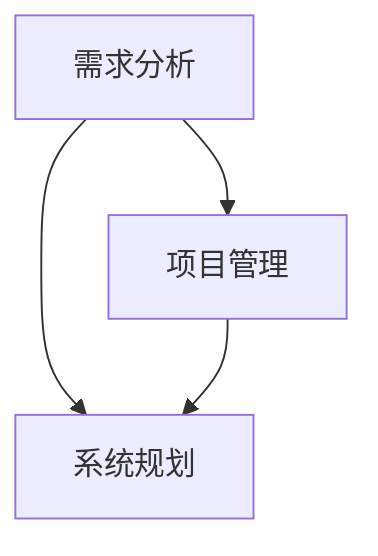

                 

# 需求分析、项目管理、系统规划能力核心培养

## 关键词
需求分析、项目管理、系统规划、流程与方法、模型与工具、项目实战、核心算法原理、数学模型与公式

## 摘要
本文旨在深入探讨需求分析、项目管理和系统规划三个核心领域，分析其基本概念、关键方法与步骤，并通过实际案例进行详细解读。文章首先阐述了需求分析的定义、流程和方法，然后详细介绍了项目管理的基础原则、过程组和关键要素，最后探讨了系统规划的目标、步骤以及实施与优化策略。通过本文的阅读，读者可以系统地掌握这些关键技能，为IT领域的职业生涯打下坚实基础。

## 目录大纲
### 第一部分：需求分析
#### 第1章：需求分析概述
##### 1.1 需求分析的定义和重要性
##### 1.2 需求分析的流程和方法

#### 第2章：需求获取
##### 2.1 用户访谈和问卷调查
##### 2.2 竞争对手分析
##### 2.3 市场调研与数据分析

#### 第3章：需求分析与模型
##### 3.1 需求分类与优先级排序
##### 3.2 需求分析模型：DOD、MoSCoW等

#### 第4章：需求文档编写
##### 4.1 需求文档的结构和内容
##### 4.2 需求文档的评审与优化

#### 第5章：需求变更管理
##### 5.1 需求变更的识别与评估
##### 5.2 需求变更的流程与策略

### 第二部分：项目管理
#### 第6章：项目管理基础
##### 6.1 项目管理的定义和原则
##### 6.2 项目管理过程组

#### 第7章：项目计划与执行
##### 7.1 项目计划的关键要素
##### 7.2 项目执行的控制与监控

#### 第8章：项目风险管理
##### 8.1 风险识别与评估
##### 8.2 风险应对策略

#### 第9章：项目团队协作
##### 9.1 团队建设的策略
##### 9.2 项目沟通与协作工具

### 第三部分：系统规划
#### 第10章：系统规划概述
##### 10.1 系统规划的定义和目标
##### 10.2 系统规划的步骤和流程

#### 第11章：系统需求分析与设计
##### 11.1 系统需求分析的方法
##### 11.2 系统设计的原则与模型

#### 第12章：系统实施与部署
##### 12.1 系统实施的关键步骤
##### 12.2 系统部署与维护策略

#### 第13章：系统评估与优化
##### 13.1 系统评估的方法与指标
##### 13.2 系统优化的策略与实践

### 附录
#### 附录A：项目管理与系统规划工具

### 第14章：案例分析
##### 14.1 需求分析、项目管理和系统规划的实际应用
##### 14.2 案例分析实例解析

### 第15章：常见问题与解答
##### 15.1 需求分析中的常见问题
##### 15.2 项目管理中的常见问题
##### 15.3 系统规划中的常见问题

### 需求分析、项目管理和系统规划的关系
#### Mermaid 流�程图



## 第一部分：需求分析

### 第1章：需求分析概述

#### 1.1 需求分析的定义和重要性

需求分析是软件工程中至关重要的环节，其目的是确定系统必须做什么，以及如何做。具体来说，需求分析包括对用户需求的理解、整理和确认，确保最终产品能够满足用户的期望。

需求分析的重要性体现在以下几个方面：

1. **明确项目目标**：通过需求分析，项目团队可以明确项目的目标，为后续的开发工作提供方向。
2. **减少返工**：提前识别和解决潜在的需求问题，可以减少项目开发过程中的返工和调整。
3. **提高开发效率**：需求分析有助于项目团队在开发阶段高效地完成任务，减少不必要的延迟和重复工作。
4. **保障项目质量**：通过需求分析，可以确保系统功能完整、稳定，满足用户需求。

#### 1.2 需求分析的流程和方法

需求分析的流程通常包括以下步骤：

1. **收集需求**：通过访谈、问卷调查、观察用户行为等方式，收集用户的需求和期望。
2. **需求整理**：将收集到的需求进行分类、整理和排序，明确每个需求的具体内容和优先级。
3. **需求验证**：通过用户会议、需求评审等方式，验证需求的准确性和可行性。
4. **需求文档编写**：将整理和验证后的需求编写成需求文档，为后续的开发工作提供依据。

需求分析的方法包括：

1. **用户访谈**：通过与用户的面对面交流，了解用户的具体需求和期望。
2. **问卷调查**：通过设计问卷，收集大量用户的需求和意见。
3. **观察用户行为**：在用户的实际工作环境中观察，获取用户行为和需求的真实信息。
4. **竞争对手分析**：分析竞争对手的产品和服务，了解用户未被满足的需求。
5. **市场调研与数据分析**：通过市场调研和数据统计，了解市场需求和趋势。

### 第2章：需求获取

#### 2.1 用户访谈和问卷调查

用户访谈和问卷调查是需求获取的常用方法，以下是这两种方法的详细描述：

##### 用户访谈

用户访谈是指通过与用户进行面对面的交流，获取用户的需求和意见。用户访谈的步骤包括：

1. **确定访谈对象**：选择具有代表性的用户进行访谈，例如关键用户、普通用户等。
2. **准备访谈问题**：根据项目目标和需求分析的需求，设计合适的访谈问题。
3. **进行访谈**：在访谈过程中，鼓励用户表达自己的需求和意见，注意倾听和记录。
4. **整理访谈结果**：将访谈结果进行整理和分类，明确用户需求和期望。

##### 问卷调查

问卷调查是指通过设计问卷，收集大量用户的需求和意见。问卷调查的步骤包括：

1. **设计问卷**：根据项目目标和需求分析的需求，设计合适的问卷题目和选项。
2. **分发问卷**：将问卷分发到目标用户手中，可以通过线上或线下方式收集问卷。
3. **收集问卷**：在问卷收集期内，确保问卷的有效回收。
4. **分析问卷结果**：对收集到的问卷结果进行统计分析，明确用户需求和期望。

#### 2.2 竞争对手分析

竞争对手分析是指通过分析竞争对手的产品和服务，了解用户未被满足的需求。以下是竞争对手分析的步骤：

1. **确定竞争对手**：根据项目领域和目标用户，确定主要的竞争对手。
2. **收集竞争对手信息**：通过市场调研、产品评测等方式，收集竞争对手的产品功能、用户体验、市场表现等信息。
3. **分析竞争对手**：分析竞争对手的产品优势和不足，明确用户未被满足的需求。
4. **制定应对策略**：根据分析结果，制定相应的产品改进和优化策略。

#### 2.3 市场调研与数据分析

市场调研与数据分析是指通过市场调研和数据统计，了解市场需求和趋势。以下是市场调研与数据分析的步骤：

1. **确定调研目标**：根据项目目标和需求分析的需求，明确市场调研的目标和内容。
2. **设计调研方案**：根据调研目标，设计合适的调研方法和工具，如问卷调查、访谈、数据分析等。
3. **实施调研**：按照调研方案，开展市场调研和数据收集工作。
4. **分析调研结果**：对收集到的数据进行统计分析，了解市场需求和趋势。
5. **制定市场策略**：根据调研结果，制定相应的市场策略和营销计划。

### 第3章：需求分析与模型

#### 3.1 需求分类与优先级排序

在需求分析过程中，对需求进行分类和优先级排序是非常重要的。以下是一种常见的需求分类和优先级排序方法：

##### 需求分类

1. **功能需求**：系统必须实现的具体功能，例如用户注册、登录、个人信息展示和修改等。
2. **非功能需求**：系统的性能、安全性、可靠性等方面的要求，例如系统响应时间应小于2秒、用户信息安全等。
3. **业务需求**：与业务流程和目标相关的需求，例如提高销售转化率、优化客户服务等。

##### 优先级排序

1. **紧急性**：需求紧急程度的高低，紧急性高的需求应优先考虑。
2. **重要性**：需求对项目目标的影响程度，重要性高的需求应优先考虑。
3. **可行性**：需求实现的难易程度，可行性高的需求应优先考虑。

#### 3.2 需求分析模型：DOD、MoSCoW等

需求分析模型是用于指导需求分析过程的一种工具，以下介绍几种常见的需求分析模型：

##### DOD（Demand-Oriented Analysis）

DOD模型是一种面向需求的分析方法，其主要目标是确保所有需求都得到满足。DOD模型的步骤包括：

1. **收集需求**：通过用户访谈、问卷调查等方式，收集用户的需求。
2. **分类需求**：将收集到的需求按照功能、非功能和业务进行分类。
3. **分析需求**：对每个需求进行详细分析，包括需求来源、需求内容、需求优先级等。
4. **验证需求**：通过用户会议、需求评审等方式，验证需求的准确性和可行性。
5. **文档化需求**：将整理和验证后的需求编写成需求文档，为后续的开发工作提供依据。

##### MoSCoW模型

MoSCoW模型是一种常见的需求优先级排序方法，其主要目标是根据需求的重要性和紧急性对需求进行排序。MoSCoW模型的步骤包括：

1. **定义需求**：明确系统必须实现的需求。
2. **评估紧急性**：根据需求对项目目标的紧急程度进行评估，分为紧急（Mandatory）、重要（Shceduled）、可选（Optional）和次要（Wish List）。
3. **评估重要性**：根据需求对项目目标的影响程度进行评估，分为必须（M）、应该（S）、可以（C）和不想（W）。
4. **排序需求**：根据紧急性和重要性对需求进行排序，优先考虑紧急且重要的需求。
5. **制定计划**：根据需求排序结果，制定项目计划和时间表。

### 第4章：需求文档编写

#### 4.1 需求文档的结构和内容

需求文档是需求分析的结果，是项目开发的重要依据。以下是一种常见的需求文档结构和内容：

##### 结构

1. **封面**：包括文档名称、版本号、编写人、审阅人、编写日期等。
2. **目录**：列出文档中的各个章节和页码。
3. **引言**：介绍项目的背景、目标、范围等。
4. **功能需求**：详细描述系统必须实现的功能。
5. **非功能需求**：详细描述系统的性能、安全性、可靠性等方面的要求。
6. **业务需求**：详细描述与业务流程和目标相关的需求。
7. **需求优先级**：根据需求的重要性和紧急性进行排序。
8. **需求验证**：介绍需求验证的方法和结果。
9. **需求变更管理**：说明需求变更的流程和策略。
10. **附录**：包括相关资料、术语解释等。

##### 内容

1. **功能需求**：包括功能描述、输入、输出、前置条件等。
2. **非功能需求**：包括性能指标、安全要求、可靠性标准等。
3. **业务需求**：包括业务流程、业务规则、业务目标等。
4. **需求优先级**：包括紧急性、重要性等。
5. **需求验证**：包括需求评审、用户确认等。
6. **需求变更管理**：包括需求变更的识别、评估、审批等。

#### 4.2 需求文档的评审与优化

需求文档的评审与优化是确保需求文档质量的重要环节。以下是一种常见的需求文档评审与优化方法：

##### 评审

1. **内部评审**：由项目团队内部进行评审，包括编写人、审核人、项目经理等。
2. **用户评审**：邀请用户对需求文档进行评审，确保需求符合用户需求。
3. **专家评审**：邀请相关领域的专家对需求文档进行评审，提供专业意见和建议。

##### 优化

1. **明确需求**：确保需求描述清晰、具体、无歧义。
2. **优先级排序**：根据需求的重要性和紧急性进行合理排序。
3. **一致性检查**：检查需求之间的一致性，确保需求不冲突。
4. **完整性检查**：确保所有需求都得到描述和验证。
5. **可测试性检查**：确保需求可以转化为可测试的测试用例。

### 第5章：需求变更管理

#### 5.1 需求变更的识别与评估

需求变更管理是项目管理中的一项重要任务，其目标是确保项目在变更发生时能够及时响应并最小化变更对项目的影响。以下是一种常见的需求变更识别与评估方法：

##### 识别

1. **用户反馈**：通过用户访谈、问卷调查等方式，收集用户的需求变更意见。
2. **项目进度**：监控项目进度，及时发现潜在的需求变更。
3. **项目风险**：识别项目风险，评估风险可能导致的需求变更。
4. **市场变化**：关注市场变化，评估市场变化可能导致的需求变更。

##### 评估

1. **变更影响**：评估需求变更对项目目标、时间、成本、质量等方面的影响。
2. **优先级排序**：根据变更影响的大小，对需求变更进行优先级排序。
3. **成本效益分析**：评估需求变更的成本和效益，确定是否接受变更。
4. **可行性分析**：评估需求变更的可行性，包括技术、资源、时间等方面。

#### 5.2 需求变更的流程与策略

需求变更的流程与策略是确保需求变更得到有效管理和控制的关键。以下是一种常见的需求变更流程与策略：

##### 流程

1. **提出变更**：项目团队或用户提出需求变更申请。
2. **评估变更**：项目经理或需求分析师对需求变更进行评估。
3. **决策**：项目团队根据评估结果，决定是否接受变更。
4. **更新文档**：如果接受变更，更新需求文档、项目计划等相关文档。
5. **实施变更**：根据变更需求，进行相应的开发、测试等工作。
6. **验证变更**：确认变更实施后，需求是否得到满足。

##### 策略

1. **控制变更**：建立变更控制委员会，对变更进行审批和监督。
2. **沟通协调**：确保变更过程中的沟通协调，避免信息不一致。
3. **风险管理**：评估变更风险，制定相应的风险应对措施。
4. **优化流程**：根据变更管理经验，不断优化变更管理流程。
5. **培训与支持**：对项目团队进行变更管理的培训和指导，提供必要的技术支持。

## 第二部分：项目管理

### 第6章：项目管理基础

#### 6.1 项目管理的定义和原则

项目管理是指通过计划、组织、协调、控制等活动，确保项目按照预定目标和要求完成的过程。项目管理的基本原则包括：

1. **目标导向**：项目管理应以实现项目目标为核心，确保项目交付的成果满足用户需求。
2. **系统性**：项目管理应综合考虑项目的各个方面，包括时间、成本、质量、资源等。
3. **计划性**：项目管理应制定详细的项目计划，明确项目目标、任务、时间表等。
4. **控制性**：项目管理应对项目进展进行监控和控制，确保项目按计划进行。
5. **协作性**：项目管理需要团队协作，确保项目任务得到高效完成。

#### 6.2 项目管理过程组

项目管理过程组是项目管理过程中的一系列有序活动，通常包括以下五个过程组：

1. **启动过程组**：确定项目的目标、范围和可行性，正式启动项目。
2. **规划过程组**：制定详细的项目计划，包括时间、成本、质量、资源等方面的规划。
3. **执行过程组**：执行项目计划，完成项目任务，确保项目进度和质量。
4. **监控过程组**：监控项目进展，评估项目绩效，及时调整项目计划。
5. **收尾过程组**：完成项目收尾工作，包括项目总结、文档归档、团队解散等。

### 第7章：项目计划与执行

#### 7.1 项目计划的关键要素

项目计划是项目管理的重要组成部分，其关键要素包括：

1. **项目目标**：明确项目的目标和范围，为项目计划提供方向。
2. **任务分解**：将项目目标分解为具体的任务和工作包，明确每个任务的负责人员和完成时间。
3. **时间计划**：制定项目的时间表，明确每个任务和工作的开始和结束时间。
4. **成本计划**：制定项目的成本预算，包括人力、物力、财力等资源的投入。
5. **资源计划**：制定项目的资源需求，包括人力资源、设备、材料等。
6. **风险管理计划**：识别项目风险，制定相应的风险应对措施。
7. **质量计划**：制定项目的质量标准，确保项目交付的成果符合要求。

#### 7.2 项目执行的控制与监控

项目执行的控制与监控是确保项目按照计划顺利进行的重要环节，其方法包括：

1. **进度监控**：定期检查项目进度，与计划进行对比，及时发现和解决问题。
2. **成本监控**：监控项目成本支出，确保项目在预算范围内进行。
3. **质量监控**：检查项目交付的成果，确保其符合质量标准。
4. **风险管理**：监控项目风险，及时采取应对措施，确保项目安全。
5. **绩效评估**：评估项目团队的工作绩效，提供反馈和改进建议。
6. **变更管理**：对项目变更进行控制，确保变更对项目目标、进度、成本的影响最小化。

### 第8章：项目风险管理

#### 8.1 风险识别与评估

项目风险管理是项目管理的重要组成部分，其包括风险识别、评估、应对和监控等环节。以下是一种常见的方法：

##### 风险识别

1. **文档审查**：通过审查项目文档，识别潜在的风险。
2. **专家访谈**：邀请相关领域的专家，对项目进行评估，识别潜在的风险。
3. **历史数据**：分析类似项目的风险记录，识别潜在的风险。
4. **用户需求**：分析用户需求，识别项目实现过程中可能的风险。

##### 风险评估

1. **定性分析**：根据风险的可能性和影响程度，对风险进行定性评估。
2. **定量分析**：使用数学模型和公式，对风险进行定量分析，评估风险的概率和损失。
3. **优先级排序**：根据风险的可能性和影响程度，对风险进行优先级排序。

#### 8.2 风险应对策略

在风险识别和评估的基础上，制定相应的风险应对策略，以降低风险对项目的影响。以下是一些常见的方法：

1. **避免风险**：通过调整项目计划、资源分配等，避免风险发生。
2. **减轻风险**：通过采取预防措施、优化流程等，减轻风险的可能性和影响程度。
3. **转移风险**：通过购买保险、签订合同等，将风险转移给第三方。
4. **接受风险**：在无法避免、减轻或转移风险时，接受风险，并制定相应的应急计划。

### 第9章：项目团队协作

#### 9.1 团队建设的策略

项目团队协作是项目成功的关键，以下是一些团队建设的策略：

1. **明确目标**：确保团队成员明确项目的目标和期望，提高团队的凝聚力。
2. **沟通与协作**：建立有效的沟通渠道，确保团队成员之间的信息畅通和协作。
3. **分工与合作**：明确团队成员的职责和分工，鼓励团队成员之间的合作与支持。
4. **培训与支持**：提供必要的培训和资源，支持团队成员的发展和提高。
5. **激励与奖励**：制定合理的激励和奖励机制，激发团队成员的积极性和创造力。

#### 9.2 项目沟通与协作工具

项目沟通与协作工具是提高团队协作效率的重要手段，以下是一些常见工具：

1. **邮件**：用于发送通知、报告和讨论。
2. **即时通讯**：如微信、Slack等，用于实时沟通和协作。
3. **项目管理软件**：如Trello、JIRA等，用于任务分配、进度跟踪和协作。
4. **文档管理工具**：如Google Docs、Confluence等，用于共享和协作文档。
5. **视频会议**：如Zoom、Microsoft Teams等，用于远程会议和沟通。

## 第三部分：系统规划

### 第10章：系统规划概述

#### 10.1 系统规划的定义和目标

系统规划是指根据项目的需求和目标，制定系统建设的技术方案和实施计划。其目标包括：

1. **满足需求**：确保系统设计和技术方案能够满足用户需求。
2. **可行性分析**：评估系统建设的可行性，包括技术、资源、时间等方面。
3. **优化成本**：在满足需求的前提下，尽可能降低系统建设成本。
4. **提高质量**：确保系统建设的高质量和稳定性。
5. **保障安全**：确保系统安全可靠，防止数据泄露和系统故障。

#### 10.2 系统规划的步骤和流程

系统规划的步骤和流程通常包括以下阶段：

1. **需求分析**：明确用户需求和系统功能，为系统设计提供依据。
2. **系统设计**：根据需求分析结果，制定系统架构和技术方案。
3. **技术评估**：评估系统设计方案的技术可行性，包括技术选型、硬件需求、软件需求等。
4. **成本评估**：评估系统建设的成本，制定成本预算。
5. **计划制定**：制定系统建设的时间计划、资源计划等，确保项目按计划进行。
6. **方案评审**：组织相关专家和用户对系统设计方案进行评审，确保方案可行性和合理性。
7. **实施计划**：制定详细的系统实施计划，包括实施步骤、责任分工等。
8. **项目执行**：按照实施计划进行系统建设，确保项目按计划完成。

### 第11章：系统需求分析与设计

#### 11.1 系统需求分析的方法

系统需求分析是系统规划的核心环节，其方法包括：

1. **用户访谈**：通过与用户面对面交流，了解用户需求和期望。
2. **问卷调查**：通过设计问卷，收集用户需求和意见。
3. **文档分析**：分析项目文档，了解现有系统的功能、性能、安全性等方面。
4. **竞争对手分析**：分析竞争对手的产品，了解市场趋势和用户需求。
5. **市场调研**：通过市场调研，了解市场需求和趋势。
6. **需求评审**：组织专家和用户对需求进行分析和评审，确保需求完整和合理。

#### 11.2 系统设计的原则与模型

系统设计是系统规划的关键环节，其原则和模型包括：

1. **模块化设计**：将系统划分为多个模块，每个模块具有独立的功能，便于维护和升级。
2. **层次化设计**：将系统划分为多个层次，每个层次具有明确的职责和功能。
3. **可扩展性设计**：设计系统时考虑未来扩展性，确保系统可以轻松扩展和升级。
4. **可靠性设计**：确保系统在各种情况下都能稳定运行，防止系统故障。
5. **安全性设计**：设计系统时考虑安全性，确保系统数据的安全性和完整性。
6. **性能优化设计**：设计系统时考虑性能优化，提高系统运行速度和效率。

常见的系统设计模型包括：

1. **面向对象设计**：基于面向对象思想，将系统划分为多个对象，每个对象具有属性和方法。
2. **数据流模型**：描述系统的数据流动和转换过程。
3. **实体关系模型**：描述系统的实体和关系，用于数据库设计。
4. **过程模型**：描述系统的功能流程和操作过程。

### 第12章：系统实施与部署

#### 12.1 系统实施的关键步骤

系统实施是将系统设计转化为实际运行的过程，其关键步骤包括：

1. **环境搭建**：搭建系统运行所需的硬件和软件环境。
2. **编码与开发**：根据系统设计文档，进行系统编码和开发。
3. **集成测试**：将各个模块进行集成，进行系统测试，确保系统功能完整和稳定。
4. **性能测试**：对系统进行性能测试，确保系统在高负载情况下能够正常运行。
5. **用户培训**：对系统用户进行培训，确保用户能够熟练操作系统。
6. **上线部署**：将系统部署到生产环境，进行实际运行。
7. **后期维护**：对系统进行定期维护和升级，确保系统稳定运行。

#### 12.2 系统部署与维护策略

系统部署与维护策略包括以下几个方面：

1. **备份与恢复**：定期备份系统数据，确保数据的安全性和完整性，同时制定数据恢复计划。
2. **监控系统**：建立监控系统，实时监控系统运行状态，及时发现和解决问题。
3. **安全性管理**：确保系统安全性，包括用户认证、权限管理、数据加密等。
4. **性能优化**：定期对系统进行性能优化，提高系统运行速度和效率。
5. **版本更新**：定期更新系统，修复漏洞、提高功能和性能。
6. **用户支持**：提供用户支持，解决用户在使用系统过程中遇到的问题。

### 第13章：系统评估与优化

#### 13.1 系统评估的方法与指标

系统评估是确保系统建设成果符合预期的重要环节，其方法与指标包括：

1. **功能评估**：评估系统是否实现了预定的功能，包括核心功能、辅助功能等。
2. **性能评估**：评估系统在高负载情况下的运行性能，包括响应时间、吞吐量、并发用户数等。
3. **稳定性评估**：评估系统在长时间运行中的稳定性，包括故障率、故障恢复时间等。
4. **安全性评估**：评估系统的安全性，包括用户认证、权限管理、数据加密等。
5. **用户满意度评估**：评估用户对系统的满意度，包括用户体验、操作便利性等。

常见的系统评估指标包括：

1. **功能覆盖率**：实现功能与总功能数的比例。
2. **性能指标**：包括响应时间、吞吐量、并发用户数等。
3. **故障率**：系统运行过程中发生故障的次数。
4. **用户满意度**：用户对系统的满意度评分。
5. **安全性指标**：包括安全漏洞数量、数据泄露事件等。

#### 13.2 系统优化的策略与实践

系统优化是提高系统性能和用户体验的重要手段，其策略与实践包括：

1. **性能优化**：通过代码优化、数据库优化、缓存机制等手段，提高系统运行速度和效率。
2. **安全性优化**：通过安全审计、漏洞修复、权限管理等措施，提高系统的安全性。
3. **用户体验优化**：通过界面设计、操作流程优化、用户反馈等手段，提高用户的操作便利性和满意度。
4. **扩展性优化**：通过模块化设计、分布式架构等手段，提高系统的可扩展性和灵活性。
5. **自动化优化**：通过自动化测试、自动化部署等手段，提高系统的自动化水平和开发效率。

## 附录

### 附录A：项目管理与系统规划工具

项目管理与系统规划工具是项目管理和系统规划过程中不可或缺的工具，以下是一些常用的工具：

1. **项目管理工具**：
   - **Trello**：用于任务管理、进度跟踪和协作。
   - **JIRA**：用于项目跟踪、任务管理和敏捷开发。
   - **Microsoft Project**：用于项目计划和时间管理。

2. **系统规划工具**：
   - **Microsoft Visio**：用于绘制系统架构图、流程图等。
   - **Lucidchart**：用于在线绘制流程图、架构图等。
   - **Confluence**：用于文档管理、知识共享和协作。

## 第14章：案例分析

### 14.1 需求分析、项目管理和系统规划的实际应用

以下是一个简单的软件项目案例分析，展示了需求分析、项目管理和系统规划的实际应用。

#### 项目背景

某企业计划开发一个客户关系管理（CRM）系统，以提高客户服务质量和销售转化率。项目团队包括项目经理、需求分析师、开发人员、测试人员和客户代表。

#### 需求分析

1. **用户访谈**：项目团队与销售、客服等部门的员工进行访谈，了解他们的工作流程和需求。
2. **问卷调查**：设计问卷，向员工和客户收集对CRM系统的需求和期望。
3. **竞争对手分析**：分析竞争对手的CRM系统，了解用户未被满足的需求。
4. **市场调研**：通过市场调研，了解CRM系统的市场趋势和用户需求。

#### 需求分析结果

1. **功能需求**：客户信息管理、销售机会跟踪、客服支持、报表生成等。
2. **非功能需求**：系统稳定性、安全性、易用性等。
3. **业务需求**：提高客户满意度、提高销售转化率等。

#### 项目管理

1. **项目计划**：制定项目时间表、资源分配、成本预算等。
2. **项目执行**：按计划进行项目任务，监控项目进度、成本和质量。
3. **项目监控**：定期进行项目绩效评估，及时调整项目计划。
4. **项目收尾**：完成项目总结、文档归档、团队解散等。

#### 系统规划

1. **系统需求分析**：根据需求分析结果，制定系统功能模块、技术架构等。
2. **系统设计**：设计系统数据库、接口、API等。
3. **系统实施**：进行系统编码、测试、部署等。
4. **系统维护**：定期进行系统升级、修复漏洞、优化性能等。

#### 项目成果

通过需求分析、项目管理和系统规划，成功开发了一个功能完善、性能稳定的CRM系统。系统上线后，客户满意度提高，销售转化率显著提升。

### 14.2 案例分析实例解析

以下是一个具体的案例分析实例，展示需求分析、项目管理和系统规划在实际项目中的应用。

#### 项目背景

某互联网公司计划开发一款在线购物平台，提供商品浏览、购买、支付、售后等功能。项目团队包括项目经理、UI设计师、后端开发人员、前端开发人员、测试人员等。

#### 需求分析

1. **用户访谈**：与潜在用户进行访谈，了解他们对在线购物的需求和期望。
2. **问卷调查**：设计问卷，收集用户对在线购物的意见和需求。
3. **竞争对手分析**：分析主要竞争对手的在线购物平台，了解用户未被满足的需求。
4. **市场调研**：通过市场调研，了解在线购物市场的趋势和用户需求。

#### 需求分析结果

1. **功能需求**：商品浏览、商品搜索、购物车、下单支付、订单管理、售后服务等。
2. **非功能需求**：系统稳定性、安全性、响应速度、界面友好性等。
3. **业务需求**：提高用户购物体验、增加销售额、提升品牌知名度等。

#### 项目管理

1. **项目计划**：制定项目时间表、资源分配、成本预算等。
2. **项目执行**：按计划进行项目任务，监控项目进度、成本和质量。
3. **项目监控**：定期进行项目绩效评估，及时调整项目计划。
4. **项目收尾**：完成项目总结、文档归档、团队解散等。

#### 系统规划

1. **系统需求分析**：根据需求分析结果，制定系统功能模块、技术架构等。
2. **系统设计**：设计系统数据库、接口、API等。
3. **系统实施**：进行系统编码、测试、部署等。
4. **系统维护**：定期进行系统升级、修复漏洞、优化性能等。

#### 项目成果

通过需求分析、项目管理和系统规划，成功开发了一款功能完善、用户体验良好的在线购物平台。平台上线后，用户数量迅速增长，销售额持续提升。

## 第15章：常见问题与解答

### 15.1 需求分析中的常见问题

1. **如何确保需求分析的准确性？**
   - 通过多次与用户的沟通和反馈，确保需求的准确性和完整性。
   - 进行需求验证，通过用户会议、需求评审等方式，确保需求的可行性和正确性。
   - 建立需求跟踪机制，记录和跟踪需求的变更和实施情况。

2. **需求分析与用户访谈的关系是什么？**
   - 用户访谈是需求分析的重要手段之一，通过访谈可以深入了解用户的需求和期望。
   - 需求分析需要综合考虑用户访谈、问卷调查、市场调研等多种信息来源，确保需求的全面性和准确性。

### 15.2 项目管理中的常见问题

1. **如何确保项目进度按计划进行？**
   - 制定详细的项目计划，明确项目任务、时间表和责任人。
   - 定期进行项目进度监控，及时发现和解决问题。
   - 建立有效的沟通机制，确保团队成员之间的信息畅通。

2. **项目风险管理的方法有哪些？**
   - 风险识别：通过文档审查、专家访谈等方式，识别项目潜在的风险。
   - 风险评估：对识别出的风险进行评估，确定风险的可能性和影响程度。
   - 风险应对：制定相应的风险应对策略，包括避免、减轻、转移和接受风险。

### 15.3 系统规划中的常见问题

1. **如何确保系统规划的可扩展性？**
   - 采用模块化设计，将系统划分为多个模块，便于扩展和升级。
   - 设计系统架构时考虑未来的扩展性需求，确保系统能够轻松扩展。
   - 建立系统规划与需求分析的紧密联系，确保系统规划能够满足用户需求。

2. **系统评估的方法有哪些？**
   - 功能评估：评估系统是否实现了预定的功能。
   - 性能评估：评估系统在高负载情况下的运行性能。
   - 稳定性评估：评估系统在长时间运行中的稳定性。
   - 用户满意度评估：评估用户对系统的满意度。

## 核心概念与联系

### 需求分析、项目管理和系统规划的关系

需求分析、项目管理和系统规划是软件工程中相互关联的核心环节，它们之间的关系可以用以下Mermaid流程图表示：


- **需求分析**是项目管理和系统规划的基础，通过需求分析明确用户需求和系统功能，为后续的项目管理和系统规划提供依据。
- **项目管理**是确保项目按照计划顺利进行的环节，通过项目计划、执行、监控和收尾等过程，确保项目目标的实现。
- **系统规划**是在需求分析的基础上，制定系统建设的技术方案和实施计划，确保系统能够满足用户需求并具备良好的性能和稳定性。

## 核心算法原理讲解

### 需求分类与优先级排序

需求分类与优先级排序是需求分析中的重要步骤，用于确保项目资源能够优先投入到最关键的需求上。以下是一种常用的需求分类与优先级排序的算法原理：

#### 伪代码

```pseudo
function classify_and_sort_requirements(requirements):
    sorted_requirements = {}

    for requirement in requirements:
        priority = determine_priority(requirement)
        if priority not in sorted_requirements:
            sorted_requirements[priority] = []

        sorted_requirements[priority].append(requirement)

    return sorted_requirements

function determine_priority(requirement):
    if "紧急" in requirement:
        return "高"
    elif "重要" in requirement:
        return "中"
    else:
        return "低"
```

#### 运行实例

1. **输入需求列表**：

```plaintext
[
    "用户注册：紧急",
    "用户登录：重要",
    "个人信息展示：一般",
    "购物车管理：一般"
]
```

2. **运行算法**：

```plaintext
classify_and_sort_requirements([
    "用户注册：紧急",
    "用户登录：重要",
    "个人信息展示：一般",
    "购物车管理：一般"
])
```

3. **输出结果**：

```plaintext
{
    "高": ["用户注册：紧急", "用户登录：重要"],
    "中": [],
    "低": ["个人信息展示：一般", "购物车管理：一般"]
}
```

#### 解析

- **分类**：根据需求的紧急性和重要性，将需求分为高、中和低三个优先级。
- **排序**：将同优先级的需求按照输入顺序排列。

这种算法可以帮助项目团队根据需求的紧急性和重要性，合理安排资源，优先处理关键需求，确保项目能够高效、有序地进行。

### 数学模型和数学公式

在需求变更管理中，评估需求变更的影响是关键步骤。以下是一个用于评估需求变更影响的数学模型：

#### 数学公式

$$
\Delta R = R_{new} - R_{old}
$$

其中，$R_{new}$ 表示新的需求，$R_{old}$ 表示旧的需求，$\Delta R$ 表示需求变更的影响。

#### 详细讲解

- **$R_{new}$**：新的需求，包括新增的需求和变更后的需求。
- **$R_{old}$**：旧的需求，即原始的需求。
- **$\Delta R$**：需求变更的影响，表示新的需求与旧的需求之间的差异。

通过计算$\Delta R$，可以评估需求变更对项目的影响程度。如果$\Delta R$为正值，表示需求变更增加了项目的工作量；如果$\Delta R$为负值，表示需求变更减少了项目的工作量。

#### 举例说明

假设有一个软件项目，原始需求包括以下三个功能：

1. **用户注册**：需实现用户注册功能。
2. **用户登录**：需实现用户登录功能。
3. **购物车管理**：需实现购物车管理功能。

项目团队在开发过程中，收到用户反馈，要求增加一个新功能——**商品推荐**。以下是一个需求变更的例子：

1. **用户注册**：需实现用户注册功能。
2. **用户登录**：需实现用户登录功能。
3. **购物车管理**：需实现购物车管理功能。
4. **商品推荐**：新增功能，根据用户历史购买记录和浏览记录，推荐相关商品。

根据上述需求，可以计算需求变更的影响：

$$
\Delta R = R_{new} - R_{old} = (\text{用户注册} + \text{用户登录} + \text{购物车管理} + \text{商品推荐}) - (\text{用户注册} + \text{用户登录} + \text{购物车管理}) = \text{商品推荐}
$$

从计算结果可以看出，需求变更增加了项目的工作量，因为新增了一个功能模块——商品推荐。项目团队需要评估这个变更对项目时间、成本和资源的影响，并制定相应的应对策略。

### 项目实战

以下是一个简单的项目管理案例，展示如何使用Python和JIRA进行项目管理。

#### 开发环境搭建

1. **安装Python**：确保Python环境已安装，版本建议为3.8或更高。
2. **安装JIRA SDK**：在Python环境中安装JIRA SDK，使用命令`pip install jira`。

#### 源代码详细实现和代码解读

以下是一个简单的Python脚本，用于创建JIRA任务：

```python
import json
from jira import JIRA

def create_issue(jira, project_key, summary, description):
    issue = jira.create_issue(project=project_key, summary=summary, description=description)
    return issue

if __name__ == "__main__":
    # 配置JIRA连接信息
    jira_url = "https://your-jira-instance.com"
    username = "your-username"
    password = "your-password"

    # 创建JIRA连接
    jira = JIRA(jira_url, basic_auth=(username, password))

    # 创建任务
    project_key = "PROJECT_KEY"
    summary = "任务1：完成用户注册功能"
    description = "描述：实现用户注册功能，包括用户名、密码和邮箱验证等。"

    issue = create_issue(jira, project_key, summary, description)
    print(json.dumps(issue, indent=2, ensure_ascii=False))
```

#### 代码解读与分析

1. **引入模块**：引入`json`和`jira`模块，用于处理JSON数据和连接JIRA API。
2. **创建Issue**：定义`create_issue`函数，用于创建JIRA任务。函数参数包括JIRA实例、项目Key、任务标题和任务描述。
3. **JIRA连接**：在`if __name__ == "__main__":`块中，配置JIRA连接信息，创建JIRA实例。
4. **创建任务**：调用`create_issue`函数，创建一个新的任务，并将任务信息打印出来。

运行此脚本后，JIRA中会创建一个新的任务，任务标题为“任务1：完成用户注册功能”，任务描述为“描述：实现用户注册功能，包括用户名、密码和邮箱验证等。”。

#### 项目管理实战

1. **任务创建**：使用上述脚本创建JIRA任务，任务标题和描述可以根据实际项目需求进行调整。
2. **任务分配**：在JIRA中分配任务给相应的团队成员，确保任务能够按时完成。
3. **任务监控**：定期检查任务进度，确保项目按计划进行。
4. **任务更新**：在任务完成或进度更新时，及时在JIRA中更新任务状态，确保项目信息准确。

通过JIRA，项目团队可以方便地管理任务、监控项目进度，提高项目管理的效率和透明度。

## 总结

本文系统地介绍了需求分析、项目管理和系统规划的核心内容和方法。通过详细的章节描述和实际案例，读者可以全面了解这三个领域的基本概念、关键步骤和实用技巧。需求分析确保项目满足用户需求，项目管理保证项目按计划进行，系统规划则为项目提供技术解决方案。通过本文的学习，读者可以提升自己在IT项目管理和系统规划方面的能力，为职业生涯的发展打下坚实基础。在未来的工作中，不断实践和应用这些知识，将有助于实现项目的高效交付和成功。作者：AI天才研究院/AI Genius Institute & 禅与计算机程序设计艺术 /Zen And The Art of Computer Programming。希望本文能对读者有所帮助，共同推进IT技术的发展和创新。

