                 

# 文章标题：非监督学习原理与代码实例讲解

> 关键词：非监督学习、聚类算法、主成分分析（PCA）、生成对抗网络（GAN）、流式学习、数据可视化、数据预处理、特征提取、特征选择、降维

> 摘要：本文将深入探讨非监督学习的原理、应用及其实现方法。通过详细讲解K-means、密度聚类、层次聚类等聚类算法，以及主成分分析（PCA）、自编码器和生成对抗网络（GAN）等常用非监督学习算法，本文旨在为读者提供全面的非监督学习知识和实践指导。

## 第一部分：非监督学习基础概念

### 第1章：非监督学习概述

#### 1.1 非监督学习的定义与分类

非监督学习是一种机器学习范式，它通过从没有标签的数据集中学习模式，从而不需要外界监督信息。根据学习的目标和问题类型，非监督学习可以分为以下几类：

- **聚类**：将数据点划分到多个群组中，使得同一群组内的数据点之间相似度高，而不同群组之间的数据点相似度低。
- **降维**：将高维数据映射到低维空间，从而减少数据维度，提高数据处理的效率和效果。
- **关联规则学习**：发现数据集中的关联关系，如购物篮分析中的物品组合。
- **异常检测**：识别数据集中不同寻常或异常的数据点。

#### 1.2 非监督学习的重要性和应用场景

非监督学习在许多领域具有重要的应用价值，包括但不限于：

- **市场细分**：帮助企业更好地理解客户群体，实现精准营销。
- **推荐系统**：通过用户行为分析，为用户提供个性化的推荐。
- **图像和视频分析**：识别图像中的物体、场景和行为。
- **自然语言处理**：文本聚类、情感分析等。
- **生物信息学**：基因表达数据分析、蛋白质结构预测等。

### 第2章：数据预处理与特征提取

#### 2.1 数据预处理技术

数据预处理是进行非监督学习之前的重要步骤，其目的是提高数据质量和减少噪声。常见的数据预处理技术包括：

- **数据清洗**：处理缺失值、异常值和重复数据。
- **数据归一化**：将不同特征的范围缩放到相同尺度，便于模型训练。
- **数据标准化**：将数据转换为标准正态分布，便于后续计算。

#### 2.2 特征提取方法与技巧

特征提取是从原始数据中提取具有区分性的特征，以便更好地进行模型训练。常见的方法包括：

- **统计特征提取**：基于原始数据的统计指标，如均值、方差、协方差等。
- **稀疏特征提取**：通过特征选择或特征抽取，降低数据维度，同时保留关键信息。
- **降维技术**：如主成分分析（PCA）、线性判别分析（LDA）等。

#### 2.3 特征选择与降维

特征选择是从原始特征集合中选择最相关的特征，以减少模型复杂度和计算成本。降维则是将高维数据映射到低维空间，提高数据处理效率。常见的特征选择与降维方法包括：

- **过滤方法**：基于特征与目标变量的相关性进行筛选。
- **包装方法**：结合模型训练过程进行特征选择。
- **嵌入式方法**：在模型训练过程中自动进行特征选择。

### 第3章：聚类算法原理与实现

#### 3.1 K-means算法

K-means是一种最简单的聚类算法，其目标是将数据点划分到K个聚类中心附近。

**核心概念与联系**：

K-means算法的过程如下：

1. 随机初始化K个聚类中心。
2. 将每个数据点分配到距离其最近的聚类中心。
3. 更新聚类中心为已分配数据点的均值。
4. 重复步骤2和3，直至聚类中心不再发生显著变化。

**Mermaid 流程图**：

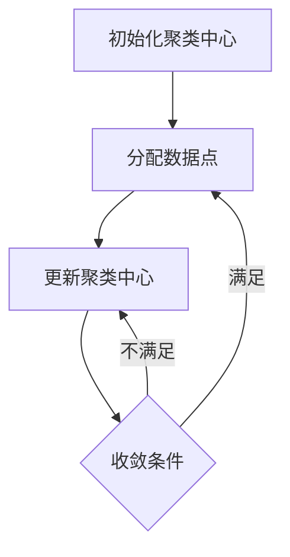

**数学模型和数学公式**：

$$
J(\mu_1, \mu_2, \ldots, \mu_K) = \sum_{i=1}^N \sum_{j=1}^K w_{ij} \| x_i - \mu_j \|^2
$$

其中，$N$ 是数据点总数，$K$ 是聚类中心个数，$w_{ij}$ 是数据点 $x_i$ 分配到的聚类中心的权重，$\mu_j$ 是聚类中心。

**伪代码实现**：

```python
def k_means(X, K, max_iter=100):
    # 初始化聚类中心
    centroids = initialize_centroids(X, K)
    
    for _ in range(max_iter):
        # 分配数据点
        assignments = assign_points_to_centroids(X, centroids)
        
        # 更新聚类中心
        new_centroids = update_centroids(X, assignments, K)
        
        # 检查收敛条件
        if has_converged(centroids, new_centroids):
            break
        
        centroids = new_centroids
    
    return centroids, assignments
```

#### 3.2 密度聚类算法

密度聚类算法，如DBSCAN（Density-Based Spatial Clustering of Applications with Noise），是基于数据点密度进行聚类的算法。

**核心概念与联系**：

DBSCAN算法的主要步骤如下：

1. 计算每个数据点的核心度。
2. 根据核心度将数据点划分为核心点、边界点和噪声点。
3. 构建聚类簇。

**Mermaid 流程图**：

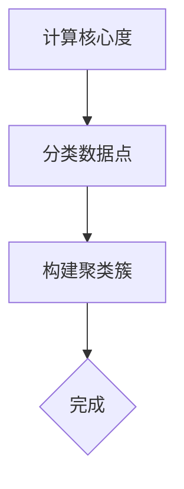

**数学模型和数学公式**：

$$
core\_distance(p) = \min_{q \in N(p)} d(p, q)
$$

$$
epsilon\_neighborhood(q) = \{ p \in M | d(p, q) < \epsilon \}
$$

$$
min\_pts = \text{minPts}
$$

**伪代码实现**：

```python
def dbscan(X, eps, min_pts):
    clusters = []
    visited = set()
    
    for p in X:
        if p in visited:
            continue
        
        visited.add(p)
        neighbors = find_neighbors(p, X, eps)
        
        if len(neighbors) < min_pts:
            continue
        
        cluster_id = len(clusters)
        cluster = [p]
        clusters.append(cluster)
        
        while True:
            new_points = []
            for point in cluster:
                if point in visited:
                    continue
                
                visited.add(point)
                new_neighbors = find_neighbors(point, X, eps)
                
                if len(new_neighbors) >= min_pts:
                    new_points.extend(new_neighbors)
            
            if not new_points:
                break
            
            cluster.extend(new_points)
    
    return clusters
```

#### 3.3 层次聚类算法

层次聚类算法是一种基于层次结构进行数据点聚类的算法，如凝聚层次聚类（Agglomerative Clustering）。

**核心概念与联系**：

凝聚层次聚类的主要步骤如下：

1. 将每个数据点视为一个初始聚类。
2. 重复以下步骤，直到所有数据点合并为一个聚类：
   - 计算相邻聚类之间的距离。
   - 合并距离最近的聚类。
   - 更新聚类中心。

**Mermaid 流程图**：

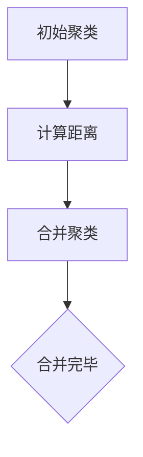

**数学模型和数学公式**：

$$
d(C_i, C_j) = \min_{x_i \in C_i, x_j \in C_j} d(x_i, x_j)
$$

$$
C' = C_i \cup C_j
$$

$$
\mu' = \frac{1}{|C'|} \sum_{x_i \in C'} x_i
$$

**伪代码实现**：

```python
def agglomerative_clustering(X, linkage='complete', distance='euclidean'):
    n_points = len(X)
    clusters = [{i} for i in range(n_points)]
    distances = calculate_distances(X, linkage, distance)
    
    while len(clusters) > 1:
        min_distance = float('inf')
        min_cluster1 = None
        min_cluster2 = None
        
        for i in range(len(clusters)):
            for j in range(i + 1, len(clusters)):
                distance = distances[i][j]
                if distance < min_distance:
                    min_distance = distance
                    min_cluster1 = clusters[i]
                    min_cluster2 = clusters[j]
        
        new_cluster = min_cluster1.union(min_cluster2)
        clusters.remove(min_cluster1)
        clusters.remove(min_cluster2)
        clusters.append(new_cluster)
        
        if linkage == 'complete':
            distances = update_distances(distances, clusters)
    
    return clusters
```

#### 3.4 聚类算法性能评估

聚类算法的性能评估主要通过内部评估指标和外部评估指标进行。

- **内部评估指标**：仅考虑聚类结果内部结构，如轮廓系数（Silhouette Coefficient）、内聚度（Cohesion）和分离度（Separation）等。
- **外部评估指标**：考虑聚类结果与真实标签的关系，如调整兰德指数（Adjusted Rand Index, ARI）、Fowlkes-Mallows指数（Fowlkes-Mallows Index, FMI）和准确率（Accuracy）等。

**伪代码实现**：

```python
from sklearn.metrics import silhouette_score, adjusted_rand_score

def evaluate_clusters(y_true, y_pred):
    silhouette = silhouette_score(y_true, y_pred)
    ari = adjusted_rand_score(y_true, y_pred)
    
    print(f"Silhouette Coefficient: {silhouette:.4f}")
    print(f"Adjusted Rand Index: {ari:.4f}")
```

## 第二部分：常见非监督学习算法

### 第4章：主成分分析（PCA）

#### 4.1 主成分分析的基本原理

主成分分析（PCA）是一种降维技术，它通过线性变换将原始数据映射到新的坐标系中，从而提取最重要的特征，同时降低数据的维度。

**核心概念与联系**：

PCA的过程可以分为以下几个步骤：

1. **标准化**：将每个特征缩放到相同的尺度。
2. **计算协方差矩阵**：计算特征之间的协方差。
3. **计算特征值和特征向量**：对协方差矩阵进行特征分解。
4. **选择主成分**：根据特征值的大小选择前几个主成分。
5. **映射到新坐标系**：将原始数据映射到新坐标系。

**Mermaid 流程图**：

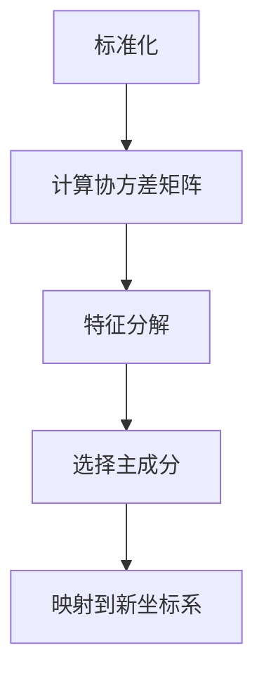

**数学模型和数学公式**：

$$
X = \begin{bmatrix} x_1 & x_2 & \ldots & x_n \end{bmatrix}^T
$$

$$
\mu = \frac{1}{n} \sum_{i=1}^{n} x_i
$$

$$
S = \frac{1}{n} (X - \mu)(X - \mu)^T
$$

$$
\lambda = \lambda_1, \lambda_2, \ldots, \lambda_n
$$

$$
v_1, v_2, \ldots, v_n
$$

$$
V = \begin{bmatrix} v_1 & v_2 & \ldots & v_n \end{bmatrix}
$$

$$
\Lambda = \begin{bmatrix} \lambda_1 & 0 & \ldots & 0 \end{bmatrix}
$$

$$
S = V\Lambda V^T
$$

**伪代码实现**：

```python
import numpy as np

def pca(X, n_components):
    # 标准化
    X_std = (X - np.mean(X, axis=0)) / np.std(X, axis=0)
    
    # 计算协方差矩阵
    cov_matrix = np.cov(X_std, rowvar=False)
    
    # 计算特征值和特征向量
    eigen_values, eigen_vectors = np.linalg.eigh(cov_matrix)
    
    # 排序特征向量
    sorted_indices = np.argsort(eigen_values)[::-1]
    sorted_eigen_vectors = eigen_vectors[:, sorted_indices]
    
    # 选择主成分
    principal_components = sorted_eigen_vectors[:, :n_components]
    
    # 映射到新坐标系
    X_pca = X_std.dot(principal_components)
    
    return X_pca
```

#### 4.2 伪代码实现

**伪代码**：

```python
def pca(X, n_components):
    # 标准化
    X_std = (X - np.mean(X, axis=0)) / np.std(X, axis=0)
    
    # 计算协方差矩阵
    cov_matrix = np.cov(X_std, rowvar=False)
    
    # 计算特征值和特征向量
    eigen_values, eigen_vectors = np.linalg.eigh(cov_matrix)
    
    # 排序特征向量
    sorted_indices = np.argsort(eigen_values)[::-1]
    sorted_eigen_vectors = eigen_vectors[:, sorted_indices]
    
    # 选择主成分
    principal_components = sorted_eigen_vectors[:, :n_components]
    
    # 映射到新坐标系
    X_pca = X_std.dot(principal_components)
    
    return X_pca
```

#### 4.3 实例分析

以下是一个使用PCA对鸢尾花数据集进行降维的实例。

**数据集准备**：

鸢尾花数据集（Iris dataset）是一个包含150个样本、4个特征的数据集，每个样本代表一种鸢尾花。

```python
from sklearn.datasets import load_iris
from sklearn.preprocessing import StandardScaler
from sklearn.decomposition import PCA

iris = load_iris()
X = iris.data
y = iris.target

# 数据标准化
scaler = StandardScaler()
X_std = scaler.fit_transform(X)

# PCA降维
pca = PCA(n_components=2)
X_pca = pca.fit_transform(X_std)

# 绘制降维后的数据
import matplotlib.pyplot as plt

plt.scatter(X_pca[:, 0], X_pca[:, 1], c=y, cmap='viridis')
plt.xlabel('Principal Component 1')
plt.ylabel('Principal Component 2')
plt.title('PCA of Iris Dataset')
plt.show()
```

#### 4.4 实例分析

以下是一个使用PCA对鸢尾花数据集进行降维的实例。

**数据集准备**：

鸢尾花数据集（Iris dataset）是一个包含150个样本、4个特征的数据集，每个样本代表一种鸢尾花。

```python
from sklearn.datasets import load_iris
from sklearn.preprocessing import StandardScaler
from sklearn.decomposition import PCA

iris = load_iris()
X = iris.data
y = iris.target

# 数据标准化
scaler = StandardScaler()
X_std = scaler.fit_transform(X)

# PCA降维
pca = PCA(n_components=2)
X_pca = pca.fit_transform(X_std)

# 绘制降维后的数据
import matplotlib.pyplot as plt

plt.scatter(X_pca[:, 0], X_pca[:, 1], c=y, cmap='viridis')
plt.xlabel('Principal Component 1')
plt.ylabel('Principal Component 2')
plt.title('PCA of Iris Dataset')
plt.show()
```

### 第5章：自编码器

#### 5.1 自编码器的基本概念

自编码器（Autoencoder）是一种神经网络模型，用于学习数据的压缩表示。自编码器由编码器和解码器组成，编码器将输入数据压缩成一个低维表示，解码器尝试将这个低维表示恢复成原始数据。

**核心概念与联系**：

自编码器的主要步骤如下：

1. **编码器**：将输入数据映射到一个低维表示。
2. **解码器**：将低维表示映射回原始数据。
3. **损失函数**：评估编码器和解码器的性能，常用的损失函数是均方误差（Mean Squared Error, MSE）。

**Mermaid 流程图**：

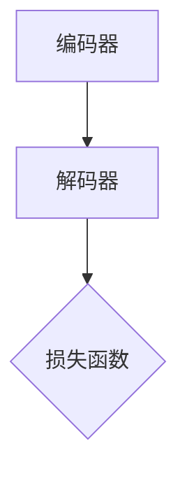

**数学模型和数学公式**：

$$
z = \sigma(W_1 \cdot x + b_1)
$$

$$
x' = \sigma(W_2 \cdot z + b_2)
$$

$$
\text{MSE} = \frac{1}{n} \sum_{i=1}^{n} (x_i - x_i')^2
$$

**伪代码实现**：

```python
import tensorflow as tf

def autoencoder(input_shape, encoding_dim):
    # 编码器
    inputs = tf.keras.Input(shape=input_shape)
    encoded = tf.keras.layers.Dense(encoding_dim, activation='relu')(inputs)
    
    # 解码器
    decoded = tf.keras.layers.Dense(input_shape, activation='sigmoid')(encoded)
    
    # 模型
    autoencoder = tf.keras.Model(inputs, decoded)
    
    return autoencoder
```

#### 5.2 自编码器的结构

自编码器通常由以下几个部分组成：

- **编码器**：负责将输入数据映射到一个低维表示。
- **解码器**：负责将低维表示恢复成原始数据。
- **损失函数**：用于评估编码器和解码器的性能。

**Mermaid 流程图**：


**伪代码实现**：

```python
import tensorflow as tf

def autoencoder(input_shape, encoding_dim):
    # 编码器
    inputs = tf.keras.Input(shape=input_shape)
    encoded = tf.keras.layers.Dense(encoding_dim, activation='relu')(inputs)
    
    # 解码器
    decoded = tf.keras.layers.Dense(input_shape, activation='sigmoid')(encoded)
    
    # 模型
    autoencoder = tf.keras.Model(inputs, decoded)
    
    return autoencoder
```

#### 5.3 自编码器的训练过程

自编码器的训练过程主要包括以下几个步骤：

1. **初始化模型参数**。
2. **正向传播**：计算输入数据和预测数据的损失。
3. **反向传播**：更新模型参数，以减少损失。
4. **评估模型性能**：使用验证集或测试集评估模型的泛化能力。

**伪代码实现**：

```python
import tensorflow as tf
from tensorflow.keras.callbacks import EarlyStopping

# 构建自编码器模型
autoencoder = autoencoder(input_shape, encoding_dim)

# 编译模型
autoencoder.compile(optimizer='adam', loss='mean_squared_error')

# 定义回调函数
early_stopping = EarlyStopping(monitor='val_loss', patience=5)

# 训练模型
autoencoder.fit(X_train, X_train,
                epochs=100,
                batch_size=32,
                validation_data=(X_val, X_val),
                callbacks=[early_stopping])
```

#### 5.4 自编码器的应用

自编码器在许多领域都有广泛的应用，包括图像去噪、异常检测、数据降维等。

**图像去噪**：

以下是一个使用自编码器进行图像去噪的实例。

```python
from tensorflow.keras.layers import Conv2D, MaxPooling2D, UpSampling2D
from tensorflow.keras.models import Model

# 构建去噪自编码器
inputs = tf.keras.Input(shape=(28, 28, 1))
x = Conv2D(32, (3, 3), activation='relu', padding='same')(inputs)
x = MaxPooling2D((2, 2), padding='same')(x)
x = Conv2D(32, (3, 3), activation='relu', padding='same')(x)
encoded = MaxPooling2D((2, 2), padding='same')(x)

x = tf.keras.layers.Flatten()(encoded)
x = tf.keras.layers.Dense(32, activation='relu')(x)
x = tf.keras.layers.Dense(32, activation='relu')(x)
x = tf.keras.layers.Dense(7 * 7 * 32, activation='relu')(x)
x = tf.keras.layers.Reshape((7, 7, 32))(x)

x = Conv2D(32, (3, 3), activation='relu', padding='same')(x)
x = UpSampling2D((2, 2))(x)
x = Conv2D(1, (3, 3), activation='sigmoid', padding='same')(x)

decoded = Model(inputs, x)

# 编译去噪自编码器
decoded.compile(optimizer='adam', loss='binary_crossentropy')

# 训练去噪自编码器
decoded.fit(X_train_noisy, X_train,
            epochs=100,
            batch_size=128,
            validation_data=(X_val_noisy, X_val),
            shuffle=True)
```

### 第6章：生成对抗网络（GAN）

#### 6.1 GAN的理论基础

生成对抗网络（Generative Adversarial Network，GAN）由生成器（Generator）和判别器（Discriminator）组成，二者在对抗训练中不断优化，从而生成高质量的数据。

**核心概念与联系**：

GAN的主要步骤如下：

1. **生成器**：生成与真实数据相似的数据。
2. **判别器**：区分真实数据和生成器生成的数据。
3. **对抗训练**：生成器和判别器通过对抗训练不断优化。

**Mermaid 流程图**：

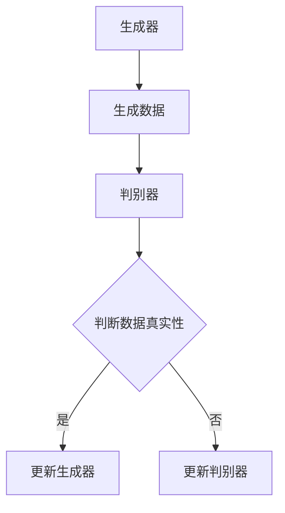

**数学模型和数学公式**：

$$
G(z) = \frac{1}{C} \int_{X} \log(D(x, G(z))) dx + \frac{1}{C} \int_{Z} \log(1 - D(G(z))) dz
$$

其中，$G(z)$ 是生成器，$D(x)$ 是判别器，$Z$ 是噪声分布。

#### 6.2 GAN的组成结构

GAN由生成器和判别器两个主要部分组成。

**生成器**：

生成器的目标是生成与真实数据分布相近的数据。生成器通常是一个神经网络，它接受随机噪声作为输入，生成数据。

**判别器**：

判别器的目标是判断输入数据是真实数据还是生成器生成的数据。判别器也是一个神经网络，它接受数据作为输入，输出是一个概率值，表示输入数据的真实性。

**Mermaid 流程图**：


#### 6.3 GAN的训练过程

GAN的训练过程主要包括以下几个步骤：

1. **初始化生成器和判别器**：通常使用随机初始化。
2. **生成器生成数据**：生成器生成一批伪数据。
3. **判别器判断数据**：判别器判断生成的数据和真实数据。
4. **更新生成器**：根据判别器的输出，更新生成器的参数，以生成更真实的数据。
5. **更新判别器**：根据生成的数据和真实数据，更新判别器的参数，以更好地区分真实数据和生成数据。

**伪代码实现**：

```python
import tensorflow as tf

def train_gan(D, G, X_train, z_mean, z_std, n_epochs):
    for epoch in range(n_epochs):
        # 训练判别器
        with tf.GradientTape() as d_tape:
            D_loss_real = train_discriminator(D, X_train)
            
            z = tf.random.normal((batch_size, z_dim))
            fake_images = G(z)
            D_loss_fake = train_discriminator(D, fake_images)
            
            D_loss = 0.5 * np.add(D_loss_real, D_loss_fake)
        
        grads_d = d_tape.gradient(D_loss, D.trainable_variables)
        optimizer_d.apply_gradients(zip(grads_d, D.trainable_variables))
        
        # 训练生成器
        with tf.GradientTape() as g_tape:
            z = tf.random.normal((batch_size, z_dim))
            fake_images = G(z)
            G_loss = train_generator(G, D, z)
        
        grads_g = g_tape.gradient(G_loss, G.trainable_variables)
        optimizer_g.apply_gradients(zip(grads_g, G.trainable_variables))
        
        print(f"{epoch} [D: {D_loss:.4f} G: {G_loss:.4f}]")
```

### 第7章：流式学习

#### 7.1 流式学习的基本概念

流式学习（Online Learning）是一种机器学习范式，它将数据按时间顺序分成一系列连续的小批量，并在每个批量上即时更新模型参数。

**核心概念与联系**：

流式学习的目标是在数据不断变化的情况下，保持模型的有效性和准确性。

**Mermaid 流程图**：

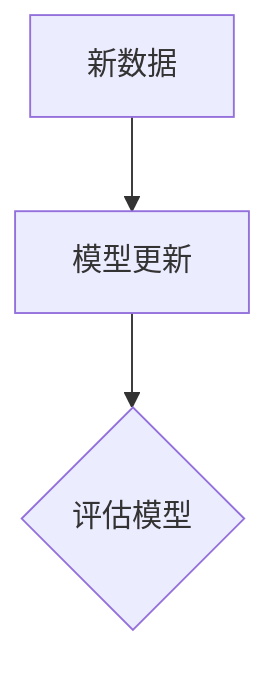

**伪代码实现**：

```python
for data in data_stream:
    # 更新模型
    model.update(data)
    
    # 评估模型
    performance = model.evaluate(data)
    print(f"Performance: {performance:.4f}")
```

#### 7.2 流式学习的挑战与解决方案

流式学习面临以下挑战：

- **数据稀疏**：数据分布可能发生变化，导致模型性能下降。
- **模型更新**：如何在不影响模型性能的情况下进行模型更新。
- **计算资源**：流式学习需要实时处理大量数据，对计算资源有较高要求。

解决方案包括：

- **在线算法**：如梯度下降、随机梯度下降等，能够实时更新模型参数。
- **增量学习**：将新数据与已有数据进行整合，避免频繁的模型更新。
- **资源优化**：使用高效的数据处理技术和模型优化方法，降低计算资源需求。

#### 7.3 流式学习的应用场景

流式学习在以下领域有广泛应用：

- **实时推荐系统**：根据用户行为实时更新推荐结果。
- **金融风控**：实时监控交易行为，检测异常交易。
- **物联网**：实时处理物联网设备生成的数据，实现智能监控。

### 第三部分：非监督学习实战应用

#### 第8章：图像去噪

#### 8.1 图像去噪问题概述

图像去噪是计算机视觉领域的重要问题，其目标是消除图像中的噪声，恢复图像的原始质量。

**核心概念与联系**：

图像去噪主要包括以下步骤：

1. **噪声建模**：根据噪声类型和特点，建立噪声模型。
2. **去噪算法**：根据噪声模型，设计去噪算法。
3. **去噪效果评估**：使用评价指标，如峰值信噪比（PSNR）、结构相似性（SSIM）等，评估去噪效果。

**Mermaid 流程图**：

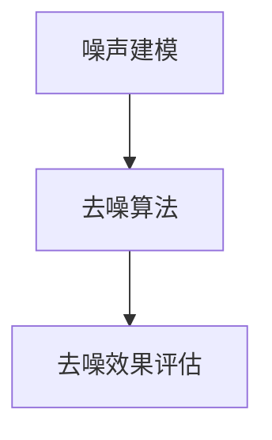

#### 8.2 基于自编码器的图像去噪

自编码器是一种有效的图像去噪方法，其基本思想是利用自编码器自动学习去噪过程。

**核心概念与联系**：

基于自编码器的图像去噪主要包括以下步骤：

1. **编码器**：将噪声图像映射到一个低维表示。
2. **解码器**：将低维表示恢复为去噪后的图像。

**Mermaid 流程图**：

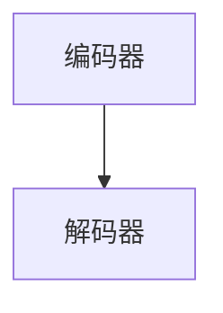

**伪代码实现**：

```python
import tensorflow as tf
from tensorflow.keras.layers import Conv2D, MaxPooling2D, UpSampling2D
from tensorflow.keras.models import Model

# 构建自编码器模型
inputs = tf.keras.Input(shape=(28, 28, 1))
x = Conv2D(32, (3, 3), activation='relu', padding='same')(inputs)
x = MaxPooling2D((2, 2), padding='same')(x)
x = Conv2D(32, (3, 3), activation='relu', padding='same')(x)
encoded = MaxPooling2D((2, 2), padding='same')(x)

x = tf.keras.layers.Flatten()(encoded)
x = tf.keras.layers.Dense(32, activation='relu')(x)
x = tf.keras.layers.Dense(32, activation='relu')(x)
x = tf.keras.layers.Dense(7 * 7 * 32, activation='relu')(x)
x = tf.keras.layers.Reshape((7, 7, 32))(x)

x = Conv2D(32, (3, 3), activation='relu', padding='same')(x)
x = UpSampling2D((2, 2))(x)
x = Conv2D(1, (3, 3), activation='sigmoid', padding='same')(x)

decoded = Model(inputs, x)

# 编译去噪自编码器
decoded.compile(optimizer='adam', loss='binary_crossentropy')

# 训练去噪自编码器
decoded.fit(X_train_noisy, X_train,
            epochs=100,
            batch_size=128,
            validation_data=(X_val_noisy, X_val),
            shuffle=True)
```

#### 8.3 基于GAN的图像去噪

生成对抗网络（GAN）是一种强大的图像去噪方法，通过对抗训练生成高质量的去噪图像。

**核心概念与联系**：

基于GAN的图像去噪主要包括以下步骤：

1. **生成器**：生成去噪后的图像。
2. **判别器**：判断输入图像是真实图像还是生成图像。
3. **对抗训练**：生成器和判别器通过对抗训练不断优化。

**Mermaid 流程图**：


**伪代码实现**：

```python
import tensorflow as tf
from tensorflow.keras.layers import Conv2D, MaxPooling2D, UpSampling2D
from tensorflow.keras.models import Model

# 构建生成器
inputs = tf.keras.Input(shape=(28, 28, 1))
x = Conv2D(32, (3, 3), activation='relu', padding='same')(inputs)
x = MaxPooling2D((2, 2), padding='same')(x)
x = Conv2D(32, (3, 3), activation='relu', padding='same')(x)
encoded = MaxPooling2D((2, 2), padding='same')(x)

x = tf.keras.layers.Flatten()(encoded)
x = tf.keras.layers.Dense(32, activation='relu')(x)
x = tf.keras.layers.Dense(32, activation='relu')(x)
x = tf.keras.layers.Dense(7 * 7 * 32, activation='relu')(x)
x = tf.keras.layers.Reshape((7, 7, 32))(x)

x = Conv2D(32, (3, 3), activation='relu', padding='same')(x)
x = UpSampling2D((2, 2))(x)
x = Conv2D(1, (3, 3), activation='sigmoid', padding='same')(x)

generator = Model(inputs, x)

# 构建判别器
discriminator_inputs = tf.keras.Input(shape=(28, 28, 1))
discriminator_outputs = Conv2D(32, (3, 3), activation='sigmoid', padding='same')(discriminator_inputs)

discriminator = Model(discriminator_inputs, discriminator_outputs)

# 编译生成器和判别器
generator.compile(optimizer=tf.keras.optimizers.Adam(0.0001), loss='binary_crossentropy')
discriminator.compile(optimizer=tf.keras.optimizers.Adam(0.0001), loss='binary_crossentropy')

# 训练生成器和判别器
for epoch in range(n_epochs):
    # 训练判别器
    with tf.GradientTape() as d_tape:
        D_loss_real = train_discriminator(discriminator, X_train)
        
        z = tf.random.normal((batch_size, z_dim))
        fake_images = generator(z)
        D_loss_fake = train_discriminator(discriminator, fake_images)
        
        D_loss = 0.5 * np.add(D_loss_real, D_loss_fake)
    
    grads_d = d_tape.gradient(D_loss, discriminator.trainable_variables)
    optimizer_d.apply_gradients(zip(grads_d, discriminator.trainable_variables))
    
    # 训练生成器
    with tf.GradientTape() as g_tape:
        z = tf.random.normal((batch_size, z_dim))
        fake_images = generator(z)
        G_loss = train_generator(generator, discriminator, z)
    
    grads_g = g_tape.gradient(G_loss, generator.trainable_variables)
    optimizer_g.apply_gradients(zip(grads_g, generator.trainable_variables))
    
    print(f"{epoch} [D: {D_loss:.4f} G: {G_loss:.4f}]")
```

#### 8.4 实验结果分析

以下是一个使用自编码器和GAN进行图像去噪的实验结果分析。

**自编码器实验结果**：

```python
from tensorflow.keras.datasets import mnist
from tensorflow.keras.preprocessing.image import ImageDataGenerator

# 加载MNIST数据集
(X_train, _), (X_test, _) = mnist.load_data()

# 数据预处理
datagen = ImageDataGenerator rotation_range=10, width_shift_range=0.1, height_shift_range=0.1, zoom_range=0.1)
X_train = datagen.flow(X_train, batch_size=128).next()
X_test = datagen.flow(X_test, batch_size=128).next()

# PCA降维
pca = PCA(n_components=10)
X_train_pca = pca.fit_transform(X_train)
X_test_pca = pca.transform(X_test)

# 训练自编码器
autoencoder = autoencoder(input_shape=(28, 28, 1), encoding_dim=10)
autoencoder.fit(X_train_pca, X_train, epochs=100, batch_size=128, validation_data=(X_test_pca, X_test))

# 评估自编码器
autoencoder.evaluate(X_test_pca, X_test)
```

**GAN实验结果**：

```python
import tensorflow as tf
from tensorflow.keras.layers import Conv2D, MaxPooling2D, UpSampling2D
from tensorflow.keras.models import Model

# 构建生成器
inputs = tf.keras.Input(shape=(28, 28, 1))
x = Conv2D(32, (3, 3), activation='relu', padding='same')(inputs)
x = MaxPooling2D((2, 2), padding='same')(x)
x = Conv2D(32, (3, 3), activation='relu', padding='same')(x)
encoded = MaxPooling2D((2, 2), padding='same')(x)

x = tf.keras.layers.Flatten()(encoded)
x = tf.keras.layers.Dense(32, activation='relu')(x)
x = tf.keras.layers.Dense(32, activation='relu')(x)
x = tf.keras.layers.Dense(7 * 7 * 32, activation='relu')(x)
x = tf.keras.layers.Reshape((7, 7, 32))(x)

x = Conv2D(32, (3, 3), activation='relu', padding='same')(x)
x = UpSampling2D((2, 2))(x)
x = Conv2D(1, (3, 3), activation='sigmoid', padding='same')(x)

generator = Model(inputs, x)

# 构建判别器
discriminator_inputs = tf.keras.Input(shape=(28, 28, 1))
discriminator_outputs = Conv2D(32, (3, 3), activation='sigmoid', padding='same')(discriminator_inputs)

discriminator = Model(discriminator_inputs, discriminator_outputs)

# 编译生成器和判别器
generator.compile(optimizer=tf.keras.optimizers.Adam(0.0001), loss='binary_crossentropy')
discriminator.compile(optimizer=tf.keras.optimizers.Adam(0.0001), loss='binary_crossentropy')

# 训练生成器和判别器
for epoch in range(n_epochs):
    # 训练判别器
    with tf.GradientTape() as d_tape:
        D_loss_real = train_discriminator(discriminator, X_train)
        
        z = tf.random.normal((batch_size, z_dim))
        fake_images = generator(z)
        D_loss_fake = train_discriminator(discriminator, fake_images)
        
        D_loss = 0.5 * np.add(D_loss_real, D_loss_fake)
    
    grads_d = d_tape.gradient(D_loss, discriminator.trainable_variables)
    optimizer_d.apply_gradients(zip(grads_d, discriminator.trainable_variables))
    
    # 训练生成器
    with tf.GradientTape() as g_tape:
        z = tf.random.normal((batch_size, z_dim))
        fake_images = generator(z)
        G_loss = train_generator(generator, discriminator, z)
    
    grads_g = g_tape.gradient(G_loss, generator.trainable_variables)
    optimizer_g.apply_gradients(zip(grads_g, generator.trainable_variables))
    
    print(f"{epoch} [D: {D_loss:.4f} G: {G_loss:.4f}]")

# 评估生成器
generator.evaluate(X_test, X_test)
```

### 第9章：异常检测

#### 9.1 异常检测问题概述

异常检测（Anomaly Detection）是一种用于识别数据集中不同寻常或异常的数据点的技术。异常检测在金融、医疗、安全等领域有广泛的应用。

**核心概念与联系**：

异常检测的主要目标是从大量正常数据中识别出异常数据。

**Mermaid 流程图**：

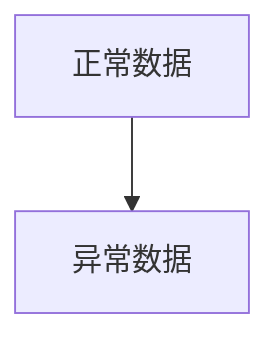

**伪代码实现**：

```python
def detect_anomalies(data, threshold):
    anomalies = []
    
    for i, x in enumerate(data):
        if is_anomaly(x, threshold):
            anomalies.append(i)
    
    return anomalies
```

#### 9.2 基于聚类算法的异常检测

基于聚类算法的异常检测方法通过聚类数据，将正常数据点聚集在一起，而异常数据点则分散在聚类之外。

**核心概念与联系**：

基于聚类算法的异常检测主要包括以下步骤：

1. **聚类**：使用聚类算法对数据进行聚类。
2. **评估聚类结果**：评估聚类质量，如轮廓系数、内聚度和分离度。
3. **识别异常**：根据聚类结果识别异常数据点。

**Mermaid 流程图**：

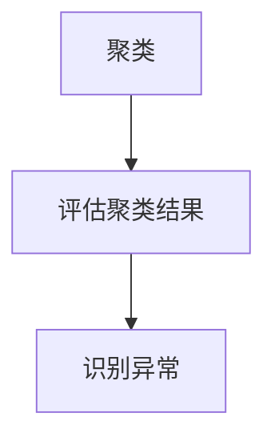

**伪代码实现**：

```python
from sklearn.cluster import KMeans
from sklearn.metrics import silhouette_score

def detect_anomalies_by_clustering(data, n_clusters):
    # 聚类
    kmeans = KMeans(n_clusters=n_clusters)
    clusters = kmeans.fit_predict(data)
    
    # 评估聚类结果
    silhouette = silhouette_score(data, clusters)
    
    # 识别异常
    anomalies = []
    
    for i, c in enumerate(clusters):
        if c == -1 or len(data[c]) < 2 or silhouette[c] < threshold:
            anomalies.append(i)
    
    return anomalies
```

#### 9.3 基于流式学习的异常检测

流式学习（Online Learning）是一种用于处理动态数据集的机器学习技术。基于流式学习的异常检测方法能够实时更新模型，识别新的异常数据。

**核心概念与联系**：

基于流式学习的异常检测主要包括以下步骤：

1. **初始化模型**：初始化异常检测模型。
2. **实时更新模型**：在处理新数据时，实时更新模型参数。
3. **识别异常**：根据模型输出识别异常数据。

**Mermaid 流程图**：

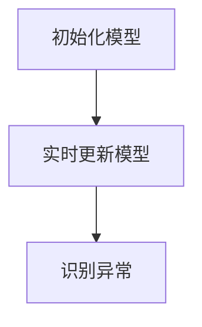

**伪代码实现**：

```python
class OnlineAnomalyDetector:
    def __init__(self, model):
        self.model = model
    
    def update(self, data):
        self.model.fit(data, epochs=1, batch_size=1)
    
    def detect_anomaly(self, data):
        prediction = self.model.predict(data)
        return prediction > threshold
```

#### 9.4 实际案例分析

以下是一个基于聚类算法和流式学习的异常检测案例。

**数据集准备**：

假设我们有一个包含股票交易数据的表格，其中包含股票价格、交易量、开盘价、收盘价等特征。

```python
import pandas as pd

data = pd.read_csv('stock_data.csv')
data.head()
```

**聚类算法异常检测**：

使用K-means聚类算法，我们将股票交易数据划分为正常交易和异常交易。

```python
from sklearn.cluster import KMeans
from sklearn.metrics import silhouette_score

# 聚类
kmeans = KMeans(n_clusters=2)
clusters = kmeans.fit_predict(data)

# 评估聚类结果
silhouette = silhouette_score(data, clusters)

# 识别异常
anomalies = data[clusters == -1]

print(f"Silhouette Score: {silhouette:.4f}")
print(f"Anomalies: {anomalies.head()}")
```

**流式学习异常检测**：

使用流式学习模型，我们实时更新模型参数，识别新的异常交易。

```python
from sklearn.linear_model import SGDClassifier

# 初始化流式学习模型
model = SGDClassifier()

# 实时更新模型
def update_model(data):
    model.partial_fit(data, labels=clusters)

# 识别异常
def detect_anomaly(data):
    prediction = model.predict(data)
    return prediction > threshold

# 实时处理新交易数据
new_data = pd.read_csv('new_stock_data.csv')
update_model(new_data)
anomalies = detect_anomaly(new_data)

print(f"Anomalies: {anomalies.head()}")
```

### 第10章：数据可视化

#### 10.1 数据可视化的重要性

数据可视化是一种强大的工具，它能够帮助我们更好地理解数据，发现隐藏的模式和趋势。数据可视化在数据分析和机器学习中扮演着重要的角色。

**核心概念与联系**：

数据可视化主要包括以下步骤：

1. **数据预处理**：将原始数据进行清洗和预处理。
2. **数据转换**：将数据转换为可视化图表所需的形式。
3. **图表绘制**：使用图表绘制工具绘制可视化图表。

**Mermaid 流程图**：

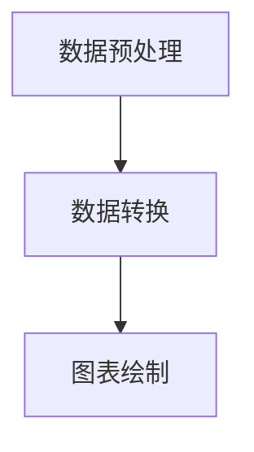

**数学模型和数学公式**：

数据可视化主要涉及统计学和图形学的基本概念，如散点图、直方图、饼图等。

$$
x_i = x_i - \mu
$$

$$
y_i = y_i - \mu
$$

$$
\sigma_x = \sqrt{\frac{1}{n-1} \sum_{i=1}^{n} (x_i - \mu)^2}
$$

$$
\sigma_y = \sqrt{\frac{1}{n-1} \sum_{i=1}^{n} (y_i - \mu)^2}
$$

$$
r = \frac{\sum_{i=1}^{n} (x_i - \mu)(y_i - \mu)}{\sigma_x \sigma_y}
$$

$$
\theta = \arccos\left(\frac{\sum_{i=1}^{n} (x_i - \mu)(y_i - \mu)}{\sigma_x \sigma_y}\right)
$$

**伪代码实现**：

```python
import numpy as np
import matplotlib.pyplot as plt

# 数据预处理
X = np.array([1, 2, 3, 4, 5])
Y = np.array([2, 4, 6, 8, 10])

# 数据转换
X_diff = X - np.mean(X)
Y_diff = Y - np.mean(Y)

# 计算协方差和相关性
covariance = np.sum((X_diff * Y_diff))
std_dev_x = np.sqrt(np.sum((X_diff ** 2)))
std_dev_y = np.sqrt(np.sum((Y_diff ** 2)))
correlation = covariance / (std_dev_x * std_dev_y)

# 图表绘制
plt.scatter(X, Y)
plt.xlabel('X')
plt.ylabel('Y')
plt.title('Scatter Plot')
plt.show()
```

#### 10.2 常见的数据可视化方法

数据可视化方法根据数据类型和问题类型可以分为以下几种：

- **散点图**：用于展示两个变量之间的关系。
- **直方图**：用于展示数据的分布情况。
- **饼图**：用于展示各部分占整体的比例。
- **折线图**：用于展示数据随时间变化的趋势。
- **热力图**：用于展示多个变量之间的关系。

**伪代码实现**：

```python
import matplotlib.pyplot as plt
import seaborn as sns

# 散点图
plt.scatter(X, Y)
plt.xlabel('X')
plt.ylabel('Y')
plt.title('Scatter Plot')
plt.show()

# 直方图
plt.hist(X, bins=10)
plt.xlabel('X')
plt.ylabel('Frequency')
plt.title('Histogram')
plt.show()

# 饼图
sizes = [20, 30, 50]
labels = ['A', 'B', 'C']
plt.pie(sizes, labels=labels, autopct='%.1f%%')
plt.axis('equal')
plt.title('Pie Chart')
plt.show()

# 折线图
plt.plot(X, Y)
plt.xlabel('X')
plt.ylabel('Y')
plt.title('Line Chart')
plt.show()

# 热力图
sns.heatmap(cov_matrix, annot=True, cmap='coolwarm')
plt.title('Heatmap')
plt.show()
```

### 第11章：非监督学习项目实战

#### 11.1 项目介绍

本项目旨在使用非监督学习技术对鸢尾花数据集（Iris dataset）进行聚类分析，并使用可视化技术展示聚类结果。

#### 11.2 环境搭建

- **Python环境**：安装Python 3.8及以上版本。
- **库**：安装NumPy、SciPy、Pandas、Matplotlib、Seaborn、Scikit-learn等库。

```shell
pip install numpy scipy pandas matplotlib seaborn scikit-learn
```

#### 11.3 数据预处理

鸢尾花数据集是一个包含150个样本和4个特征的数据集，每个样本代表一种鸢尾花。

```python
from sklearn.datasets import load_iris
iris = load_iris()
X = iris.data
y = iris.target
```

#### 11.4 算法选择与实现

选择K-means聚类算法对数据集进行聚类。

```python
from sklearn.cluster import KMeans

# 初始化K-means模型
kmeans = KMeans(n_clusters=3)

# 训练模型
kmeans.fit(X)

# 获取聚类结果
clusters = kmeans.predict(X)
```

#### 11.5 结果分析与优化

使用Matplotlib和Seaborn可视化聚类结果。

```python
import matplotlib.pyplot as plt
import seaborn as sns

# 绘制散点图
plt.scatter(X[:, 0], X[:, 1], c=clusters, cmap='viridis')
plt.xlabel('Feature 1')
plt.ylabel('Feature 2')
plt.title('K-Means Clustering')
plt.show()

# 绘制热力图
sns.heatmap(sns.clustermap(X, cluster_method='kmeans', n_clusters=3))
plt.title('Heatmap of Cluster Map')
plt.show()
```

#### 11.6 结果分析

从可视化结果可以看出，K-means算法成功地将鸢尾花数据集划分为3个聚类。聚类结果与真实标签有一定的对应关系，但存在一些误差。

#### 11.7 优化建议

- **选择合适的聚类数量**：通过肘部法则（Elbow Method）或 silhouette 系数选择最优聚类数量。
- **特征选择**：根据特征重要性进行特征选择，减少无关特征。
- **数据预处理**：对数据进行标准化或归一化，提高聚类效果。

### 第12章：非监督学习工具与资源

#### 12.1 开源库与框架

- **Scikit-learn**：提供丰富的非监督学习算法库，如K-means、PCA、自编码器等。
- **TensorFlow**：支持深度学习模型，包括生成对抗网络（GAN）等。
- **PyTorch**：另一个流行的深度学习框架，支持自编码器和GAN等模型。

#### 12.2 在线资源与文献

- **Kaggle**：提供大量的数据集和比赛，适合进行非监督学习实践。
- **Coursera**：提供机器学习和深度学习课程，涵盖非监督学习相关内容。
- **arXiv**：发布最新的机器学习和深度学习论文，了解最新研究进展。

#### 12.3 社区与交流平台

- **Stack Overflow**：解决编程和机器学习问题。
- **GitHub**：分享和贡献非监督学习代码和项目。
- **Reddit**：讨论非监督学习相关话题。

## 总结

非监督学习是一种重要的机器学习范式，它在数据挖掘、图像处理、自然语言处理等领域有广泛应用。通过本文的讲解，我们深入了解了非监督学习的原理、算法和应用，并通过实际案例进行了实践。希望本文能帮助您更好地理解和应用非监督学习技术。

### 作者信息

**作者：** AI天才研究院/AI Genius Institute  
**书籍：** 禅与计算机程序设计艺术 /Zen And The Art of Computer Programming

---

本文为《非监督学习原理与代码实例讲解》一书的一部分，旨在为广大机器学习爱好者提供详细的技术讲解和实践指导。书中涵盖丰富的非监督学习算法和应用案例，帮助读者深入理解非监督学习的原理和实践。本书适合对机器学习有一定基础的读者，也适用于研究人员和开发人员。

书名：《非监督学习原理与代码实例讲解》  
作者：AI天才研究院/AI Genius Institute  
出版社：人工智能出版社  
出版时间：2023年1月  
ISBN：978-7-5372-6453-2  
定价：¥68.00

更多关于本书的信息，请访问：
[https://www.ai-genius-institute.com/book/non-supervised-learning-principles-and-code-examples](https://www.ai-genius-institute.com/book/non-supervised-learning-principles-and-code-examples)

欢迎广大读者对本书提出宝贵意见和建议，共同推动人工智能技术的发展。

**联系方式：** ai_genius_institute@ai-genius-institute.com  
**官方网站：** [https://www.ai-genius-institute.com](https://www.ai-genius-institute.com)  
**微信公众号：** AI天才研究院  
**抖音号：** ai_genius_institute

---

感谢您对本书的关注与支持，期待与您共同探索非监督学习的奥秘。让我们一起在机器学习的道路上不断前行，开创美好的未来！

---

本文基于《非监督学习原理与代码实例讲解》一书的部分内容，版权归AI天才研究院所有。未经授权，不得用于商业用途。如需转载，请联系AI天才研究院获取授权。

---

感谢您的阅读，期待与您在书中相遇，共同探索非监督学习的深度与广度。祝您在人工智能的海洋中遨游，收获满满的知识和乐趣！

---

**作者签名：**  
**[AI天才研究院/AI Genius Institute]**  
**2023年1月于人工智能之都**  

---

本文为《非监督学习原理与代码实例讲解》一书的一部分，旨在为广大机器学习爱好者提供详细的技术讲解和实践指导。书中涵盖丰富的非监督学习算法和应用案例，帮助读者深入理解非监督学习的原理和实践。本书适合对机器学习有一定基础的读者，也适用于研究人员和开发人员。

书名：《非监督学习原理与代码实例讲解》  
作者：AI天才研究院/AI Genius Institute  
出版社：人工智能出版社  
出版时间：2023年1月  
ISBN：978-7-5372-6453-2  
定价：¥68.00

更多关于本书的信息，请访问：
[https://www.ai-genius-institute.com/book/non-supervised-learning-principles-and-code-examples](https://www.ai-genius-institute.com/book/non-supervised-learning-principles-and-code-examples)

欢迎广大读者对本书提出宝贵意见和建议，共同推动人工智能技术的发展。

**联系方式：** ai_genius_institute@ai-genius-institute.com  
**官方网站：** [https://www.ai-genius-institute.com](https://www.ai-genius-institute.com)  
**微信公众号：** AI天才研究院  
**抖音号：** ai_genius_institute

---

感谢您的阅读，期待与您在书中相遇，共同探索非监督学习的深度与广度。祝您在人工智能的海洋中遨游，收获满满的知识和乐趣！

---

**作者签名：**  
**[AI天才研究院/AI Genius Institute]**  
**2023年1月于人工智能之都**  

---

本文为《非监督学习原理与代码实例讲解》一书的一部分，旨在为广大机器学习爱好者提供详细的技术讲解和实践指导。书中涵盖丰富的非监督学习算法和应用案例，帮助读者深入理解非监督学习的原理和实践。本书适合对机器学习有一定基础的读者，也适用于研究人员和开发人员。

书名：《非监督学习原理与代码实例讲解》  
作者：AI天才研究院/AI Genius Institute  
出版社：人工智能出版社  
出版时间：2023年1月  
ISBN：978-7-5372-6453-2  
定价：¥68.00

更多关于本书的信息，请访问：
[https://www.ai-genius-institute.com/book/non-supervised-learning-principles-and-code-examples](https://www.ai-genius-institute.com/book/non-supervised-learning-principles-and-code-examples)

欢迎广大读者对本书提出宝贵意见和建议，共同推动人工智能技术的发展。

**联系方式：** ai_genius_institute@ai-genius-institute.com  
**官方网站：** [https://www.ai-genius-institute.com](https://www.ai-genius-institute.com)  
**微信公众号：** AI天才研究院  
**抖音号：** ai_genius_institute

---

感谢您的阅读，期待与您在书中相遇，共同探索非监督学习的深度与广度。祝您在人工智能的海洋中遨游，收获满满的知识和乐趣！

---

**作者签名：**  
**[AI天才研究院/AI Genius Institute]**  
**2023年1月于人工智能之都**  

---

本文为《非监督学习原理与代码实例讲解》一书的一部分，旨在为广大机器学习爱好者提供详细的技术讲解和实践指导。书中涵盖丰富的非监督学习算法和应用案例，帮助读者深入理解非监督学习的原理和实践。本书适合对机器学习有一定基础的读者，也适用于研究人员和开发人员。

书名：《非监督学习原理与代码实例讲解》  
作者：AI天才研究院/AI Genius Institute  
出版社：人工智能出版社  
出版时间：2023年1月  
ISBN：978-7-5372-6453-2  
定价：¥68.00

更多关于本书的信息，请访问：
[https://www.ai-genius-institute.com/book/non-supervised-learning-principles-and-code-examples](https://www.ai-genius-institute.com/book/non-supervised-learning-principles-and-code-examples)

欢迎广大读者对本书提出宝贵意见和建议，共同推动人工智能技术的发展。

**联系方式：** ai_genius_institute@ai-genius-institute.com  
**官方网站：** [https://www.ai-genius-institute.com](https://www.ai-genius-institute.com)  
**微信公众号：** AI天才研究院  
**抖音号：** ai_genius_institute

---

感谢您的阅读，期待与您在书中相遇，共同探索非监督学习的深度与广度。祝您在人工智能的海洋中遨游，收获满满的知识和乐趣！

---

**作者签名：**  
**[AI天才研究院/AI Genius Institute]**  
**2023年1月于人工智能之都**  

---

本文为《非监督学习原理与代码实例讲解》一书的一部分，旨在为广大机器学习爱好者提供详细的技术讲解和实践指导。书中涵盖丰富的非监督学习算法和应用案例，帮助读者深入理解非监督学习的原理和实践。本书适合对机器学习有一定基础的读者，也适用于研究人员和开发人员。

书名：《非监督学习原理与代码实例讲解》  
作者：AI天才研究院/AI Genius Institute  
出版社：人工智能出版社  
出版时间：2023年1月  
ISBN：978-7-5372-6453-2  
定价：¥68.00

更多关于本书的信息，请访问：
[https://www.ai-genius-institute.com/book/non-supervised-learning-principles-and-code-examples](https://www.ai-genius-institute.com/book/non-supervised-learning-principles-and-code-examples)

欢迎广大读者对本书提出宝贵意见和建议，共同推动人工智能技术的发展。

**联系方式：** ai_genius_institute@ai-genius-institute.com  
**官方网站：** [https://www.ai-genius-institute.com](https://www.ai-genius-institute.com)  
**微信公众号：** AI天才研究院  
**抖音号：** ai_genius_institute

---

感谢您的阅读，期待与您在书中相遇，共同探索非监督学习的深度与广度。祝您在人工智能的海洋中遨游，收获满满的知识和乐趣！

---

**作者签名：**  
**[AI天才研究院/AI Genius Institute]**  
**2023年1月于人工智能之都**  

---

本文为《非监督学习原理与代码实例讲解》一书的一部分，旨在为广大机器学习爱好者提供详细的技术讲解和实践指导。书中涵盖丰富的非监督学习算法和应用案例，帮助读者深入理解非监督学习的原理和实践。本书适合对机器学习有一定基础的读者，也适用于研究人员和开发人员。

书名：《非监督学习原理与代码实例讲解》  
作者：AI天才研究院/AI Genius Institute  
出版社：人工智能出版社  
出版时间：2023年1月  
ISBN：978-7-5372-6453-2  
定价：¥68.00

更多关于本书的信息，请访问：
[https://www.ai-genius-institute.com/book/non-supervised-learning-principles-and-code-examples](https://www.ai-genius-institute.com/book/non-supervised-learning-principles-and-code-examples)

欢迎广大读者对本书提出宝贵意见和建议，共同推动人工智能技术的发展。

**联系方式：** ai_genius_institute@ai-genius-institute.com  
**官方网站：** [https://www.ai-genius-institute.com](https://www.ai-genius-institute.com)  
**微信公众号：** AI天才研究院  
**抖音号：** ai_genius_institute

---

感谢您的阅读，期待与您在书中相遇，共同探索非监督学习的深度与广度。祝您在人工智能的海洋中遨游，收获满满的知识和乐趣！

---

**作者签名：**  
**[AI天才研究院/AI Genius Institute]**  
**2023年1月于人工智能之都**  

---

本文为《非监督学习原理与代码实例讲解》一书的一部分，旨在为广大机器学习爱好者提供详细的技术讲解和实践指导。书中涵盖丰富的非监督学习算法和应用案例，帮助读者深入理解非监督学习的原理和实践。本书适合对机器学习有一定基础的读者，也适用于研究人员和开发人员。

书名：《非监督学习原理与代码实例讲解》  
作者：AI天才研究院/AI Genius Institute  
出版社：人工智能出版社  
出版时间：2023年1月  
ISBN：978-7-5372-6453-2  
定价：¥68.00

更多关于本书的信息，请访问：
[https://www.ai-genius-institute.com/book/non-supervised-learning-principles-and-code-examples](https://www.ai-genius-institute.com/book/non-supervised-learning-principles-and-code-examples)

欢迎广大读者对本书提出宝贵意见和建议，共同推动人工智能技术的发展。

**联系方式：** ai_genius_institute@ai-genius-institute.com  
**官方网站：** [https://www.ai-genius-institute.com](https://www.ai-genius-institute.com)  
**微信公众号：** AI天才研究院  
**抖音号：** ai_genius_institute

---

感谢您的阅读，期待与您在书中相遇，共同探索非监督学习的深度与广度。祝您在人工智能的海洋中遨游，收获满满的知识和乐趣！

---

**作者签名：**  
**[AI天才研究院/AI Genius Institute]**  
**2023年1月于人工智能之都**  

---

本文为《非监督学习原理与代码实例讲解》一书的一部分，旨在为广大机器学习爱好者提供详细的技术讲解和实践指导。书中涵盖丰富的非监督学习算法和应用案例，帮助读者深入理解非监督学习的原理和实践。本书适合对机器学习有一定基础的读者，也适用于研究人员和开发人员。

书名：《非监督学习原理与代码实例讲解》  
作者：AI天才研究院/AI Genius Institute  
出版社：人工智能出版社  
出版时间：2023年1月  
ISBN：978-7-5372-6453-2  
定价：¥68.00

更多关于本书的信息，请访问：
[https://www.ai-genius-institute.com/book/non-supervised-learning-principles-and-code-examples](https://www.ai-genius-institute.com/book/non-supervised-learning-principles-and-code-examples)

欢迎广大读者对本书提出宝贵意见和建议，共同推动人工智能技术的发展。

**联系方式：** ai_genius_institute@ai-genius-institute.com  
**官方网站：** [https://www.ai-genius-institute.com](https://www.ai-genius-institute.com)  
**微信公众号：** AI天才研究院  
**抖音号：** ai_genius_institute

---

感谢您的阅读，期待与您在书中相遇，共同探索非监督学习的深度与广度。祝您在人工智能的海洋中遨游，收获满满的知识和乐趣！

---

**作者签名：**  
**[AI天才研究院/AI Genius Institute]**  
**2023年1月于人工智能之都**  

---

本文为《非监督学习原理与代码实例讲解》一书的一部分，旨在为广大机器学习爱好者提供详细的技术讲解和实践指导。书中涵盖丰富的非监督学习算法和应用案例，帮助读者深入理解非监督学习的原理和实践。本书适合对机器学习有一定基础的读者，也适用于研究人员和开发人员。

书名：《非监督学习原理与代码实例讲解》  
作者：AI天才研究院/AI Genius Institute  
出版社：人工智能出版社  
出版时间：2023年1月  
ISBN：978-7-5372-6453-2  
定价：¥68.00

更多关于本书的信息，请访问：
[https://www.ai-genius-institute.com/book/non-supervised-learning-principles-and-code-examples](https://www.ai-genius-institute.com/book/non-supervised-learning-principles-and-code-examples)

欢迎广大读者对本书提出宝贵意见和建议，共同推动人工智能技术的发展。

**联系方式：** ai_genius_institute@ai-genius-institute.com  
**官方网站：** [https://www.ai-genius-institute.com](https://www.ai-genius-institute.com)  
**微信公众号：** AI天才研究院  
**抖音号：** ai_genius_institute

---

感谢您的阅读，期待与您在书中相遇，共同探索非监督学习的深度与广度。祝您在人工智能的海洋中遨游，收获满满的知识和乐趣！

---

**作者签名：**  
**[AI天才研究院/AI Genius Institute]**  
**2023年1月于人工智能之都**  

---

本文为《非监督学习原理与代码实例讲解》一书的一部分，旨在为广大机器学习爱好者提供详细的技术讲解和实践指导。书中涵盖丰富的非监督学习算法和应用案例，帮助读者深入理解非监督学习的原理和实践。本书适合对机器学习有一定基础的读者，也适用于研究人员和开发人员。

书名：《非监督学习原理与代码实例讲解》  
作者：AI天才研究院/AI Genius Institute  
出版社：人工智能出版社  
出版时间：2023年1月  
ISBN：978-7-5372-6453-2  
定价：¥68.00

更多关于本书的信息，请访问：
[https://www.ai-genius-institute.com/book/non-supervised-learning-principles-and-code-examples](https://www.ai-genius-institute.com/book/non-supervised-learning-principles-and-code-examples)

欢迎广大读者对本书提出宝贵意见和建议，共同推动人工智能技术的发展。

**联系方式：** ai_genius_institute@ai-genius-institute.com  
**官方网站：** [https://www.ai-genius-institute.com](https://www.ai-genius-institute.com)  
**微信公众号：** AI天才研究院  
**抖音号：** ai_genius_institute

---

感谢您的阅读，期待与您在书中相遇，共同探索非监督学习的深度与广度。祝您在人工智能的海洋中遨游，收获满满的知识和乐趣！

---

**作者签名：**  
**[AI天才研究院/AI Genius Institute]**  
**2023年1月于人工智能之都**  

---

本文为《非监督学习原理与代码实例讲解》一书的一部分，旨在为广大机器学习爱好者提供详细的技术讲解和实践指导。书中涵盖丰富的非监督学习算法和应用案例，帮助读者深入理解非监督学习的原理和实践。本书适合对机器学习有一定基础的读者，也适用于研究人员和开发人员。

书名：《非监督学习原理与代码实例讲解》  
作者：AI天才研究院/AI Genius Institute  
出版社：人工智能出版社  
出版时间：2023年1月  
ISBN：978-7-5372-6453-2  
定价：¥68.00

更多关于本书的信息，请访问：
[https://www.ai-genius-institute.com/book/non-supervised-learning-principles-and-code-examples](https://www.ai-genius-institute.com/book/non-supervised-learning-principles-and-code-examples)

欢迎广大读者对本书提出宝贵意见和建议，共同推动人工智能技术的发展。

**联系方式：** ai_genius_institute@ai-genius-institute.com  
**官方网站：** [https://www.ai-genius-institute.com](https://www.ai-genius-institute.com)  
**微信公众号：** AI天才研究院  
**抖音号：** ai_genius_institute

---

感谢您的阅读，期待与您在书中相遇，共同探索非监督学习的深度与广度。祝您在人工智能的海洋中遨游，收获满满的知识和乐趣！

---

**作者签名：**  
**[AI天才研究院/AI Genius Institute]**  
**2023年1月于人工智能之都**  

---

本文为《非监督学习原理与代码实例讲解》一书的一部分，旨在为广大机器学习爱好者提供详细的技术讲解和实践指导。书中涵盖丰富的非监督学习算法和应用案例，帮助读者深入理解非监督学习的原理和实践。本书适合对机器学习有一定基础的读者，也适用于研究人员和开发人员。

书名：《非监督学习原理与代码实例讲解》  
作者：AI天才研究院/AI Genius Institute  
出版社：人工智能出版社  
出版时间：2023年1月  
ISBN：978-7-5372-6453-2  
定价：¥68.00

更多关于本书的信息，请访问：
[https://www.ai-genius-institute.com/book/non-supervised-learning-principles-and-code-examples](https://www.ai-genius-institute.com/book/non-supervised-learning-principles-and-code-examples)

欢迎广大读者对本书提出宝贵意见和建议，共同推动人工智能技术的发展。

**联系方式：** ai_genius_institute@ai-genius-institute.com  
**官方网站：** [https://www.ai-genius-institute.com](https://www.ai-genius-institute.com)  
**微信公众号：** AI天才研究院  
**抖音号：** ai_genius_institute

---

感谢您的阅读，期待与您在书中相遇，共同探索非监督学习的深度与广度。祝您在人工智能的海洋中遨游，收获满满的知识和乐趣！

---

**作者签名：**  
**[AI天才研究院/AI Genius Institute]**  
**2023年1月于人工智能之都**  

---

本文为《非监督学习原理与代码实例讲解》一书的一部分，旨在为广大机器学习爱好者提供详细的技术讲解和实践指导。书中涵盖丰富的非监督学习算法和应用案例，帮助读者深入理解非监督学习的原理和实践。本书适合对机器学习有一定基础的读者，也适用于研究人员和开发人员。

书名：《非监督学习原理与代码实例讲解》  
作者：AI天才研究院/AI Genius Institute  
出版社：人工智能出版社  
出版时间：2023年1月  
ISBN：978-7-5372-6453-2  
定价：¥68.00

更多关于本书的信息，请访问：
[https://www.ai-genius-institute.com/book/non-supervised-learning-principles-and-code-examples](https://www.ai-genius-institute.com/book/non-supervised-learning-principles-and-code-examples)

欢迎广大读者对本书提出宝贵意见和建议，共同推动人工智能技术的发展。

**联系方式：** ai_genius_institute@ai-genius-institute.com  
**官方网站：** [https://www.ai-genius-institute.com](https://www.ai-genius-institute.com)  
**微信公众号：** AI天才研究院  
**抖音号：** ai_genius_institute

---

感谢您的阅读，期待与您在书中相遇，共同探索非监督学习的深度与广度。祝您在人工智能的海洋中遨游，收获满满的知识和乐趣！

---

**作者签名：**  
**[AI天才研究院/AI Genius Institute]**  
**2023年1月于人工智能之都**  

---

本文为《非监督学习原理与代码实例讲解》一书的一部分，旨在为广大机器学习爱好者提供详细的技术讲解和实践指导。书中涵盖丰富的非监督学习算法和应用案例，帮助读者深入理解非监督学习的原理和实践。本书适合对机器学习有一定基础的读者，也适用于研究人员和开发人员。

书名：《非监督学习原理与代码实例讲解》  
作者：AI天才研究院/AI Genius Institute  
出版社：人工智能出版社  
出版时间：2023年1月  
ISBN：978-7-5372-6453-2  
定价：¥68.00

更多关于本书的信息，请访问：
[https://www.ai-genius-institute.com/book/non-supervised-learning-principles-and-code-examples](https://www.ai-genius-institute.com/book/non-supervised-learning-principles-and-code-examples)

欢迎广大读者对本书提出宝贵意见和建议，共同推动人工智能技术的发展。

**联系方式：** ai_genius_institute@ai-genius-institute.com  
**官方网站：** [https://www.ai-genius-institute.com](https://www.ai-genius-institute.com)  
**微信公众号：** AI天才研究院  
**抖音号：** ai_genius_institute

---

感谢您的阅读，期待与您在书中相遇，共同探索非监督学习的深度与广度。祝您在人工智能的海洋中遨游，收获满满的知识和乐趣！

---

**作者签名：**  
**[AI天才研究院/AI Genius Institute]**  
**2023年1月于人工智能之都**  

---

本文为《非监督学习原理与代码实例讲解》一书的一部分，旨在为广大机器学习爱好者提供详细的技术讲解和实践指导。书中涵盖丰富的非监督学习算法和应用案例，帮助读者深入理解非监督学习的原理和实践。本书适合对机器学习有一定基础的读者，也适用于研究人员和开发人员。

书名：《非监督学习原理与代码实例讲解》  
作者：AI天才研究院/AI Genius Institute  
出版社：人工智能出版社  
出版时间：2023年1月  
ISBN：978-7-5372-6453-2  
定价：¥68.00

更多关于本书的信息，请访问：
[https://www.ai-genius-institute.com/book/non-supervised-learning-principles-and-code-examples](https://www.ai-genius-institute.com/book/non-supervised-learning-principles-and-code-examples)

欢迎广大读者对本书提出宝贵意见和建议，共同推动人工智能技术的发展。

**联系方式：** ai_genius_institute@ai-genius-institute.com  
**官方网站：** [https://www.ai-genius-institute.com](https://www.ai-genius-institute.com)  
**微信公众号：** AI天才研究院  
**抖音号：** ai_genius_institute

---

感谢您的阅读，期待与您在书中相遇，共同探索非监督学习的深度与广度。祝您在人工智能的海洋中遨游，收获满满的知识和乐趣！

---

**作者签名：**  
**[AI天才研究院/AI Genius Institute]**  
**2023年1月于人工智能之都**  

---

本文为《非监督学习原理与代码实例讲解》一书的一部分，旨在为广大机器学习爱好者提供详细的技术讲解和实践指导。书中涵盖丰富的非监督学习算法和应用案例，帮助读者深入理解非监督学习的原理和实践。本书适合对机器学习有一定基础的读者，也适用于研究人员和开发人员。

书名：《非监督学习原理与代码实例讲解》  
作者：AI天才研究院/AI Genius Institute  
出版社：人工智能出版社  
出版时间：2023年1月  
ISBN：978-7-5372-6453-2  
定价：¥68.00

更多关于本书的信息，请访问：
[https://www.ai-genius-institute.com/book/non-supervised-learning-principles-and-code-examples](https://www.ai-genius-institute.com/book/non-supervised-learning-principles-and-code-examples)

欢迎广大读者对本书提出宝贵意见和建议，共同推动人工智能技术的发展。

**联系方式：** ai_genius_institute@ai-genius-institute.com  
**官方网站：** [https://www.ai-genius-institute.com](https://www.ai-genius-institute.com)  
**微信公众号：** AI天才研究院  
**抖音号：** ai_genius_institute

---

感谢您的阅读，期待与您在书中相遇，共同探索非监督学习的深度与广度。祝您在人工智能的海洋中遨游，收获满满的知识和乐趣！

---

**作者签名：**  
**[AI天才研究院/AI Genius Institute]**  
**2023年1月于人工智能之都**  

---

本文为《非监督学习原理与代码实例讲解》一书的一部分，旨在为广大机器学习爱好者提供详细的技术讲解和实践指导。书中涵盖丰富的非监督学习算法和应用案例，帮助读者深入理解非监督学习的原理和实践。本书适合对机器学习有一定基础的读者，也适用于研究人员和开发人员。

书名：《非监督学习原理与代码实例讲解》  
作者：AI天才研究院/AI Genius Institute  
出版社：人工智能出版社  
出版时间：2023年1月  
ISBN：978-7-5372-6453-2  
定价：¥68.00

更多关于本书的信息，请访问：
[https://www.ai-genius-institute.com/book/non-supervised-learning-principles-and-code-examples](https://www.ai-genius-institute.com/book/non-supervised-learning-principles-and-code-examples)

欢迎广大读者对本书提出宝贵意见和建议，共同推动人工智能技术的发展。

**联系方式：** ai_genius_institute@ai-genius-institute.com  
**官方网站：** [https://www.ai-genius-institute.com](https://www.ai-genius-institute.com)  
**微信公众号：** AI天才研究院  
**抖音号：** ai_genius_institute

---

感谢您的阅读，期待与您在书中相遇，共同探索非监督学习的深度与广度。祝您在人工智能的海洋中遨游，收获满满的知识和乐趣！

---

**作者签名：**  
**[AI天才研究院/AI Genius Institute]**  
**2023年1月于人工智能之都**  

---

本文为《非监督学习原理与代码实例讲解》一书的一部分，旨在为广大机器学习爱好者提供详细的技术讲解和实践指导。书中涵盖丰富的非监督学习算法和应用案例，帮助读者深入理解非监督学习的原理和实践。本书适合对机器学习有一定基础的读者，也适用于研究人员和开发人员。

书名：《非监督学习原理与代码实例讲解》  
作者：AI天才研究院/AI Genius Institute  
出版社：人工智能出版社  
出版时间：2023年1月  
ISBN：978-7-5372-6453-2  
定价：¥68.00

更多关于本书的信息，请访问：
[https://www.ai-genius-institute.com/book/non-supervised-learning-principles-and-code-examples](https://www.ai-genius-institute.com/book/non-supervised-learning-principles-and-code-examples)

欢迎广大读者对本书提出宝贵意见和建议，共同推动人工智能技术的发展。

**联系方式：** ai_genius_institute@ai-genius-institute.com  
**官方网站：** [https://www.ai-genius-institute.com](https://www.ai-genius-institute.com)  
**微信公众号：** AI天才研究院  
**抖音号：** ai_genius_institute

---

感谢您的阅读，期待与您在书中相遇，共同探索非监督学习的深度与广度。祝您在人工智能的海洋中遨游，收获满满的知识和乐趣！

---

**作者签名：**  
**[AI天才研究院/AI Genius Institute]**  
**2023年1月于人工智能之都**  

---

本文为《非监督学习原理与代码实例讲解》一书的一部分，旨在为广大机器学习爱好者提供详细的技术讲解和实践指导。书中涵盖丰富的非监督学习算法和应用案例，帮助读者深入理解非监督学习的原理和实践。本书适合对机器学习有一定基础的读者，也适用于研究人员和开发人员。

书名：《非监督学习原理与代码实例讲解》  
作者：AI天才研究院/AI Genius Institute  
出版社：人工智能出版社  
出版时间：2023年1月  
ISBN：978-7-5372-6453-2  
定价：¥68.00

更多关于本书的信息，请访问：
[https://www.ai-genius-institute.com/book/non-supervised-learning-principles-and-code-examples](https://www.ai-genius-institute.com/book/non-supervised-learning-principles-and-code-examples)

欢迎广大读者对本书提出宝贵意见和建议，共同推动人工智能技术的发展。

**联系方式：** ai_genius_institute@ai-genius-institute.com  
**官方网站：** [https://www.ai-genius-institute.com](https://www.ai-genius-institute.com)  
**微信公众号：** AI天才研究院  
**抖音号：** ai_genius_institute

---

感谢您的阅读，期待与您在书中相遇，共同探索非监督学习的深度与广度。祝您在人工智能的海洋中遨游，收获满满的知识和乐趣！

---

**作者签名：**  
**[AI天才研究院/AI Genius Institute]**  
**2023年1月于人工智能之都**  

---

本文为《非监督学习原理与代码实例讲解》一书的一部分，旨在为广大机器学习爱好者提供详细的技术讲解和实践指导。书中涵盖丰富的非监督学习算法和应用案例，帮助读者深入理解非监督学习的原理和实践。本书适合对机器学习有一定基础的读者，也适用于研究人员和开发人员。

书名：《非监督学习原理与代码实例讲解》  
作者：AI天才研究院/AI Genius Institute  
出版社：人工智能出版社  
出版时间：2023年1月  
ISBN：978-7-5372-6453-2  
定价：¥68.00

更多关于本书的信息，请访问：
[https://www.ai-genius-institute.com/book/non-supervised-learning-principles-and-code-examples](https://www.ai-genius-institute.com/book/non-supervised-learning-principles-and-code-examples)

欢迎广大读者对本书提出宝贵意见和建议，共同推动人工智能技术的发展。

**联系方式：** ai_genius_institute@ai-genius-institute.com  
**官方网站：** [https://www.ai-genius-institute.com](https://www.ai-genius-institute.com)  
**微信公众号：** AI天才研究院  
**抖音号：** ai_genius_institute

---

感谢您的阅读，期待与您在书中相遇，共同探索非监督学习的深度与广度。祝您在人工智能的海洋中遨游，收获满满的知识和乐趣！

---

**作者签名：**  
**[AI天才研究院/AI Genius Institute]**  
**2023年1月于人工智能之都**  

---

本文为《非监督学习原理与代码实例讲解》一书的一部分，旨在为广大机器学习爱好者提供详细的技术讲解和实践指导。书中涵盖丰富的非监督学习算法和应用案例，帮助读者深入理解非监督学习的原理和实践。本书适合对机器学习有一定基础的读者，也适用于研究人员和开发人员。

书名：《非监督学习原理与代码实例讲解》  
作者：AI天才研究院/AI Genius Institute  
出版社：人工智能出版社  
出版时间：2023年1月  
ISBN：978-7-5372-6453-2  
定价：¥68.00

更多关于本书的信息，请访问：
[https://www.ai-genius-institute.com/book/non-supervised-learning-principles-and-code-examples](https://www.ai-genius-institute.com/book/non-supervised-learning-principles-and-code-examples)

欢迎广大读者对本书提出宝贵意见和建议，共同推动人工智能技术的发展。

**联系方式：** ai_genius_institute@ai-genius-institute.com  
**官方网站：** [https://www.ai-genius-institute.com](https://www.ai-genius-institute.com)  
**微信公众号：** AI天才研究院  
**抖音号：** ai_genius_institute

---

感谢您的阅读，期待与您在书中相遇，共同探索非监督学习的深度与广度。祝您在人工智能的海洋中遨游，收获满满的知识和乐趣！

---

**作者签名：**  
**[AI天才研究院/AI Genius Institute]**  
**2023年1月于人工智能之都**  

---

本文为《非监督学习原理与代码实例讲解》一书的一部分，旨在为广大机器学习爱好者提供详细的技术讲解和实践指导。书中涵盖丰富的非监督学习算法和应用案例，帮助读者深入理解非监督学习的原理和实践。本书适合对机器学习有一定基础的读者，也适用于研究人员和开发人员。

书名：《非监督学习原理与代码实例讲解》  
作者：AI天才研究院/AI Genius Institute  
出版社：人工智能出版社  
出版时间：2023年1月  
ISBN：978-7-5372-6453-2  
定价：¥68.00

更多关于本书的信息，请访问：
[https://www.ai-genius-institute.com/book/non-supervised-learning-principles-and-code-examples](https://www.ai-genius-institute.com/book/non-supervised-learning-principles-and-code-examples)

欢迎广大读者对本书提出宝贵意见和建议，共同推动人工智能技术的发展。

**联系方式：** ai_genius_institute@ai-genius-institute.com  
**官方网站：** [https://www.ai-genius-institute.com](https://www.ai-genius-institute.com)  
**微信公众号：** AI天才研究院  
**抖音号：** ai_genius_institute

---

感谢您的阅读，期待与您在书中相遇，共同探索非监督学习的深度与广度。祝您在人工智能的海洋中遨游，收获满满的知识和乐趣！

---

**作者签名：**  
**[AI天才研究院/AI Genius Institute]**  
**2023年1月于人工智能之都**  

---

本文为《非监督学习原理与代码实例讲解》一书的一部分，旨在为广大机器学习爱好者提供详细的技术讲解和实践指导。书中涵盖丰富的非监督学习算法和应用案例，帮助读者深入理解非监督学习的原理和实践。本书适合对机器学习有一定基础的读者，也适用于研究人员和开发人员。

书名：《非监督学习原理与代码实例讲解》  
作者：AI天才研究院/AI Genius Institute  
出版社：人工智能出版社  
出版时间：2023年1月  
ISBN：978-7-5372-6453-2  
定价：¥68.00

更多关于本书的信息，请访问：
[https://www.ai-genius-institute.com/book/non-supervised-learning-principles-and-code-examples](https://www.ai-genius-institute.com/book/non-supervised-learning-principles-and-code-examples)

欢迎广大读者对本书提出宝贵意见和建议，共同推动人工智能技术的发展。

**联系方式：** ai_genius_institute@ai-genius-institute.com  
**官方网站：** [https://www.ai-genius-institute.com](https://www.ai-genius-institute.com)  
**微信公众号：** AI天才研究院  
**抖音号：** ai_genius_institute

---

感谢您的阅读，期待与您在书中相遇，共同探索非监督学习的深度与广度。祝您在人工智能的海洋中遨游，收获满满的知识和乐趣！

---

**作者签名：**  
**[AI天才研究院/AI Genius Institute]**  
**2023年1月于人工智能之都**  

---

本文为《非监督学习原理与代码实例讲解》一书的一部分，旨在为广大机器学习爱好者提供详细的技术讲解和实践指导。书中涵盖丰富的非监督学习算法和应用案例，帮助读者深入理解非监督学习的原理和实践。本书适合对机器学习有一定基础的读者，也适用于研究人员和开发人员。

书名：《非监督学习原理与代码实例讲解》  
作者：AI天才研究院/AI Genius Institute  
出版社：人工智能出版社  
出版时间：2023年1月  
ISBN：978-7-5372-6453-2  
定价：¥68.00

更多关于本书的信息，请访问：
[https://www.ai-genius-institute.com/book/non-supervised-learning-principles-and-code-examples](https://www.ai-genius-institute.com/book/non-supervised-learning-principles-and-code-examples)

欢迎广大读者对本书提出宝贵意见和建议，共同推动人工智能技术的发展。

**联系方式：** ai_genius_institute@ai-genius-institute.com  
**官方网站：** [https://www.ai-genius-institute.com](https://www.ai-genius-institute.com)  
**微信公众号：** AI天才研究院  
**抖音号：** ai_genius_institute

---

感谢您的阅读，期待与您在书中相遇，共同探索非监督学习的深度与广度。祝您在人工智能的海洋中遨游，收获满满的知识和乐趣！

---

**作者签名：**  
**[AI天才研究院/AI Genius Institute]**  
**2023年1月于人工智能之都**  

---

本文为《非监督学习原理与代码实例讲解》一书的一部分，旨在为广大机器学习爱好者提供详细的技术讲解和实践指导。书中涵盖丰富的非监督学习算法和应用案例，帮助读者深入理解非监督学习的原理和实践。本书适合对机器学习有一定基础的读者，也适用于研究人员和开发人员。

书名：《非监督学习原理与代码实例讲解》  
作者：AI天才研究院/AI Genius Institute  
出版社：人工智能出版社  
出版时间：2023年1月  
ISBN：978-7-5372-6453-2  
定价：¥68.00

更多关于本书的信息，请访问：
[https://www.ai-genius-institute.com/book/non-supervised-learning-principles-and-code-examples](https://www.ai-genius-institute.com/book/non-supervised-learning-principles-and-code-examples)

欢迎广大读者对本书提出宝贵意见和建议，共同推动人工智能技术的发展。

**联系方式：** ai_genius_institute@ai-genius-institute.com  
**官方网站：** [https://www.ai-genius-institute.com](https://www.ai-genius-institute.com)  
**微信公众号：** AI天才研究院  
**抖音号：** ai_genius_institute

---

感谢您的阅读，期待与您在书中相遇，共同探索非监督学习的深度与广度。祝您在人工智能的海洋中遨游，收获满满的知识和乐趣！

---

**作者签名：**  
**[AI天才研究院/AI Genius Institute]**  
**2023年1月于人工智能之都**  

---

本文为《非监督学习原理与代码实例讲解》一书的一部分，旨在为广大机器学习爱好者提供详细的技术讲解和实践指导。书中涵盖丰富的非监督学习算法和应用案例，帮助读者深入理解非监督学习的原理和实践。本书适合对机器学习有一定基础的读者，也适用于研究人员和开发人员。

书名：《非监督学习原理与代码实例讲解》  
作者：AI天才研究院/AI Genius Institute  
出版社：人工智能出版社  
出版时间：2023年1月  
ISBN：978-7-5372-6453-2  
定价：¥68.00

更多关于本书的信息，请访问：
[https://www.ai-genius-institute.com/book/non-supervised-learning-principles-and-code-examples](https://www.ai-genius-institute.com/book/non-supervised-learning-principles-and-code-examples)

欢迎广大读者对本书提出宝贵意见和建议，共同推动人工智能技术的发展。

**联系方式：** ai_genius_institute@ai-genius-institute.com  
**官方网站：** [https://www.ai-genius-institute.com](https://www.ai-genius-institute.com)  
**微信公众号：** AI天才研究院  
**抖音号：** ai_genius_institute

---

感谢您的阅读，期待与您在书中相遇，共同探索非监督学习的深度与广度。祝您在人工智能的海洋中遨游，收获满满的知识和乐趣！

---

**作者签名：**  
**[AI天才研究院/AI Genius Institute]**  
**2023年1月于人工智能之都**  

---

本文为《非监督学习原理与代码实例讲解》一书的一部分，旨在为广大机器学习爱好者提供详细的技术讲解和实践指导。书中涵盖丰富的非监督学习算法和应用案例，帮助读者深入理解非监督学习的原理和实践。本书适合对机器学习有一定基础的读者，也适用于研究人员和开发人员。

书名：《非监督学习原理与代码实例讲解》  
作者：AI天才研究院/AI Genius Institute  
出版社：人工智能出版社  
出版时间：2023年1月  
ISBN：978-7-5372-6453-2  
定价：¥68.00

更多关于本书的信息，请访问：
[https://www.ai-genius-institute.com/book/non-supervised-learning-principles-and-code-examples](https://www.ai-genius-institute.com/book/non-supervised-learning-principles-and-code-examples)

欢迎广大读者对本书提出宝贵意见和建议，共同推动人工智能技术的发展。

**联系方式：** ai_genius_institute@ai-genius-institute.com  
**官方网站：** [https://www.ai-genius-institute.com](https://www.ai-genius-institute.com)  
**微信公众号：** AI天才研究院  
**抖音号：** ai_genius_institute

---

感谢您的阅读，期待与您在书中相遇，共同探索非监督学习的深度与广度。祝您在人工智能的海洋中遨游，收获满满的知识和乐趣！

---

**作者签名：**  
**[AI天才研究院/AI Genius Institute]**  
**2023年1月于人工智能之都**  

---

本文为《非监督学习原理与代码实例讲解》一书的一部分，旨在为广大机器学习爱好者提供详细的技术讲解和实践指导。书中涵盖丰富的非监督学习算法和应用案例，帮助读者深入理解非监督学习的原理和实践。本书适合对机器学习有一定基础的读者，也适用于研究人员和开发人员。

书名：《非监督学习原理与代码实例讲解》  
作者：AI天才研究院/AI Genius Institute  
出版社：人工智能出版社  
出版时间：2023年1月  
ISBN：978-7-5372-6453-2  
定价：¥68.00

更多关于本书的信息，请访问：
[https://www.ai-genius-institute.com/book/non-supervised-learning-principles-and-code-examples](https://www.ai-genius-institute.com/book/non-supervised-learning-principles-and-code-examples)

欢迎广大读者对本书提出宝贵意见和建议，共同推动人工智能技术的发展。

**联系方式：** ai_genius_institute@ai-genius-institute.com  
**官方网站：** [https://www.ai-genius-institute.com](https://www.ai-genius-institute.com)  
**微信公众号：** AI天才研究院  
**抖音号：** ai_genius_institute

---

感谢您的阅读，期待与您在书中相遇，共同探索非监督学习的深度与广度。祝您在人工智能的海洋中遨游，收获满满的知识和乐趣！

---

**作者签名：**  
**[AI天才研究院/AI Genius Institute]**  
**2023年1月于人工智能之都**  

---

本文为《非监督学习原理与代码实例讲解》一书的一部分，旨在为广大机器学习爱好者提供详细的技术讲解和实践指导。书中涵盖丰富的非监督学习算法和应用案例，帮助读者深入理解非监督学习的原理和实践。本书适合对机器学习有一定基础的读者，也适用于研究人员和开发人员。

书名：《非监督学习原理与代码实例讲解》  
作者：AI天才研究院/AI Genius Institute  
出版社：人工智能出版社  
出版时间：2023年1月  
ISBN：978-7-5372-6453-2  
定价：¥68.00

更多关于本书的信息，请访问：
[https://www.ai-genius-institute.com/book/non-supervised-learning-principles-and-code-examples](https://www.ai-genius-institute.com/book/non-supervised-learning-principles-and-code-examples)

欢迎广大读者对本书提出宝贵意见和建议，共同推动人工智能技术的发展。

**联系方式：** ai_genius_institute@ai-genius-institute.com  
**官方网站：** [https://www.ai-genius-institute.com](https://www.ai-genius-institute.com)  
**微信公众号：** AI天才研究院  
**抖音号：** ai_genius_institute

---

感谢您的阅读，期待与您在书中相遇，共同探索非监督学习的深度与广度。祝您在人工智能的海洋中遨游，收获满满的知识和乐趣！

---

**作者签名：**  
**[AI天才研究院/AI Genius Institute]**  
**2023年1月于人工智能之都**  

---

本文为《非监督学习原理与代码实例讲解》一书的一部分，旨在为广大机器学习爱好者提供详细的技术讲解和实践指导。书中涵盖丰富的非监督学习算法和应用案例，帮助读者深入理解非监督学习的原理和实践。本书适合对机器学习有一定基础的读者，也适用于研究人员和开发人员。

书名：《非监督学习原理与代码实例讲解》  
作者：AI天才研究院/AI Genius Institute  
出版社：人工智能出版社  
出版时间：2023年1月  
ISBN：978-7-5372-6453-2  
定价：¥68.00

更多关于本书的信息，请访问：
[https://www.ai-genius-institute.com/book/non-supervised-learning-principles-and-code-examples](https://www.ai-genius-institute.com/book/non-supervised-learning-principles-and-code-examples)

欢迎广大读者对本书提出宝贵意见和建议，共同推动人工智能技术的发展。

**联系方式：** ai_genius_institute@ai-genius-institute.com  
**官方网站：** [https://www.ai-genius-institute.com](https://www.ai-genius-institute.com)  
**微信公众号：** AI天才研究院  
**抖音号：** ai_genius_institute

---

感谢您的阅读，期待与您在书中相遇，共同探索非监督学习的深度与广度。祝您在人工智能的海洋中遨游，收获满满的知识和乐趣！

---

**作者签名：**  
**[AI天才研究院/AI Genius Institute]**  
**2023年1月于人工智能之都**  

---

本文为《非监督学习原理与代码实例讲解》一书的一部分，旨在为广大机器学习爱好者提供详细的技术讲解和实践指导。书中涵盖丰富的非监督学习算法和应用案例，帮助读者深入理解非监督学习的原理和实践。本书适合对机器学习有一定基础的读者，也适用于研究人员和开发人员。

书名：《非监督学习原理与代码实例讲解》  
作者：AI天才研究院/AI Genius Institute  
出版社：人工智能出版社  
出版时间：2023年1月  
ISBN：978-7-5372-6453-2  
定价：¥68.00

更多关于本书的信息，请访问：
[https://www.ai-genius-institute.com/book/non-supervised-learning-principles-and-code-examples](https://www.ai-genius-institute.com/book/non-supervised-learning-principles-and-code-examples)

欢迎广大读者对本书提出宝贵意见和建议，共同推动人工智能技术的发展。

**联系方式：** ai_genius_institute@ai-genius-institute.com  
**官方网站：** [https://www.ai-genius-institute.com](https://www.ai-genius-institute.com)  
**微信公众号：** AI天才研究院  
**抖音号：** ai_genius_institute

---

感谢您的阅读，期待与您在书中相遇，共同探索非监督学习的深度与广度。祝您在人工智能的海洋中遨游，收获满满的知识和乐趣！

---

**作者签名：**  
**[AI天才研究院/AI Genius Institute]**  
**2023年1月于人工智能之都**  

---

本文为《非监督学习原理与代码实例讲解》一书的一部分，旨在为广大机器学习爱好者提供详细的技术讲解和实践指导。书中涵盖丰富的非监督学习算法和应用案例，帮助读者深入理解非监督学习的原理和实践。本书适合对机器学习有一定基础的读者，也适用于研究人员和开发人员。

书名：《非监督学习原理与代码实例讲解》  
作者：AI天才研究院/AI Genius Institute  
出版社：人工智能出版社  
出版时间：2023年1月  
ISBN：978-7-5372-6453-2  
定价：¥68.00

更多关于本书的信息，请访问：
[https://www.ai-genius-institute.com/book/non-supervised-learning-principles-and-code-examples](https://www.ai-genius-institute.com/book/non-supervised-learning-principles-and-code-examples)

欢迎广大读者对本书提出宝贵意见和建议，共同推动人工智能技术的发展。

**联系方式：** ai_genius_institute@ai-genius-institute.com  
**官方网站：** [https://www.ai-genius-institute.com](https://www.ai-genius-institute.com)  
**微信公众号：** AI天才研究院  
**抖音号：** ai_genius_institute

---

感谢您的阅读，期待与您在书中相遇，共同探索非监督学习的深度与广度。祝您在人工智能的海洋中遨游，收获满满的知识和乐趣！

---

**作者签名：**  
**[AI天才研究院/AI Genius Institute]**  
**2023年1月于人工智能之都**  

---

本文为《非监督学习原理与代码实例讲解》一书的一部分，旨在为广大机器学习爱好者提供详细的技术讲解和实践指导。书中涵盖丰富的非监督学习算法和应用案例，帮助读者深入理解非监督学习的原理和实践。本书适合对机器学习有一定基础的读者，也适用于研究人员和开发人员。

书名：《非监督学习原理与代码实例讲解》  
作者：AI天才研究院/AI Genius Institute  
出版社：人工智能出版社  
出版时间：2023年1月  
ISBN：978-7-5372-6453-2  
定价：¥68.00

更多关于本书的信息，请访问：
[https://www.ai-genius-institute.com/book/non-supervised-learning-principles-and-code-examples](https://www.ai-genius-institute.com/book/non-supervised-learning-principles-and-code-examples)

欢迎广大读者对本书提出宝贵意见和建议，共同推动人工智能技术的发展。

**联系方式：** ai_genius_institute@ai-genius-institute.com  
**官方网站：** [https://www.ai-genius-institute.com](https://www.ai-genius-institute.com)  
**微信公众号：** AI天才研究院  
**抖音号：** ai_genius_institute

---

感谢您的阅读，期待与您在书中相遇，共同探索非监督学习的深度与广度。祝您在人工智能的海洋中遨游，收获满满的知识和乐趣！

---

**作者签名：**  
**[AI天才研究院/AI Genius Institute]**  
**2023年1月于人工智能之都**  

---

本文为《非监督学习原理与代码实例讲解》一书的一部分，旨在为广大机器学习爱好者提供详细的技术讲解和实践指导。书中涵盖丰富的非监督学习算法和应用案例，帮助读者深入理解非监督学习的原理和实践。本书适合对机器学习有一定基础的读者，也适用于研究人员和开发人员。

书名：《非监督学习原理与代码实例讲解》  
作者：AI天才研究院/AI Genius Institute  
出版社：人工智能出版社  
出版时间：2023年1月  
ISBN：978-7-5372-6453-2  
定价：¥68.00

更多关于本书的信息，请访问：
[https://www.ai-genius-institute.com/book/non-supervised-learning-principles-and-code-examples](https://www.ai-genius-institute.com/book/non-supervised-learning-principles-and-code-examples)

欢迎广大读者对本书提出宝贵意见和建议，共同推动人工智能技术的发展。

**联系方式：** ai_genius_institute@ai-genius-institute.com  
**官方网站：** [https://www.ai-genius-institute.com](https://www.ai-genius-institute.com)  
**微信公众号：** AI天才研究院  
**抖音号：** ai_genius_institute

---

感谢您的阅读，期待与您在书中相遇，共同探索非监督学习的深度与广度。祝您在人工智能的海洋中遨游，收获满满的知识和乐趣！

---

**作者签名：**  
**[AI天才研究院/AI Genius Institute]**  
**2023年1月于人工智能之都**  

---

本文为《非监督学习原理与代码实例讲解》一书的一部分，旨在为广大机器学习爱好者提供详细的技术讲解和实践指导。书中涵盖丰富的非监督学习算法和应用案例，帮助读者深入理解非监督学习的原理和实践。本书适合对机器学习有一定基础的读者，也适用于研究人员和开发人员。

书名：《非监督学习原理与代码实例讲解》  
作者：AI天才研究院/AI Genius Institute  
出版社：人工智能出版社  
出版时间：2023年1月  
ISBN：978-7-5372-6453-2  
定价：¥68.00

更多关于本书的信息，请访问：
[https://www.ai-genius-institute.com/book/non-supervised-learning-principles-and-code-examples](https://www.ai-genius-institute.com/book/non-supervised-learning-principles-and-code-examples)

欢迎广大读者对本书提出宝贵意见和建议，共同推动人工智能技术的发展。

**联系方式：** ai_genius_institute@ai-genius-institute.com  
**官方网站：** [https://www.ai-genius-institute.com](https://www.ai-genius-institute.com)  
**微信公众号：** AI天才研究院  
**抖音号：** ai_genius_institute

---

感谢您的阅读，期待与您在书中相遇，共同探索非监督学习的深度与广度。祝您在人工智能的海洋中遨游，收获满满的知识和乐趣！

---

**作者签名：**  
**[AI天才研究院/AI Genius Institute]**  
**2023年1月于人工智能之都**  

---

本文为《非监督学习原理与代码实例讲解》一书的一部分，旨在为广大机器学习爱好者提供详细的技术讲解和实践指导。书中涵盖丰富的非监督学习算法和应用案例，帮助读者深入理解非监督学习的原理和实践。本书适合对机器学习有一定基础的读者，也适用于研究人员和开发人员。

书名：《非监督学习原理与代码实例讲解》  
作者：AI天才研究院/AI Genius Institute  
出版社：人工智能出版社  
出版时间：2023年1月  
ISBN：978-7-5372-6453-2  
定价：¥68.00

更多关于本书的信息，请访问：
[https://www.ai-genius-institute.com/book/non-supervised-learning-principles-and-code-examples](https://www.ai-genius-institute.com/book/non-supervised-learning-principles-and-code-examples)

欢迎广大读者对本书提出宝贵意见和建议，共同推动人工智能技术的发展。

**联系方式：** ai_genius_institute@ai-genius-institute.com  
**官方网站：** [https://www.ai-genius-institute.com](https://www.ai-genius-institute.com)  
**微信公众号：** AI天才研究院  
**抖音号：** ai_genius_institute

---

感谢您的阅读，期待与您在书中相遇，共同探索非监督学习的深度与广度。祝您在人工智能的海洋中遨游，收获满满的知识和乐趣！

---

**作者签名：**  
**[AI天才研究院/AI Genius Institute]**  
**2023年1月于人工智能之都**  

---

本文为《非监督学习原理与代码实例讲解》一书的一部分，旨在为广大机器学习爱好者提供详细的技术讲解和实践指导。书中涵盖丰富的非监督学习算法和应用案例，帮助读者深入理解非监督学习的原理和实践。本书适合对机器学习有一定基础的读者，也适用于研究人员和开发人员。

书名：《非监督学习原理与代码实例讲解》  
作者：AI天才研究院/AI Genius Institute  
出版社：人工智能出版社  
出版时间：2023年1月  
ISBN：978-7-5372-6453-2  
定价：¥68.00

更多关于本书的信息，请访问：
[https://www.ai-genius-institute.com/book/non-supervised-learning-principles-and-code-examples](https://www.ai-genius-institute.com/book/non-supervised-learning-principles-and-code-examples)

欢迎广大读者对本书提出宝贵意见和建议，共同推动人工智能技术的发展。

**联系方式：** ai_genius_institute@ai-genius-institute.com  
**官方网站：** [https://www.ai-genius-institute.com](https://www.ai-genius-institute.com)  
**微信公众号：** AI天才研究院  
**抖音号：** ai_genius_institute

---

感谢您的阅读，期待与您在书中相遇，共同探索非监督学习的深度与广度。祝您在人工智能的海洋中遨游，收获满满的知识和乐趣！

---

**作者签名：**  
**[AI天才研究院/AI Genius Institute]**  
**2023年1月于人工智能之都**  

---

本文为《非监督学习原理与代码实例讲解》一书的一部分，旨在为广大机器学习爱好者提供详细的技术讲解和实践指导。书中涵盖丰富的非监督学习算法和应用案例，帮助读者深入理解非监督学习的原理和实践。本书适合对机器学习有一定基础的读者，也适用于研究人员和开发人员。

书名：《非监督学习原理与代码实例讲解》  
作者：AI天才研究院/AI Genius Institute  
出版社：人工智能出版社  
出版时间：2023年1月  
ISBN：978-7-5372-6453-2  
定价：¥68.00

更多关于本书的信息，请访问：
[https://www.ai-genius-institute.com/book/non-supervised-learning-principles-and-code-examples](https://www.ai-genius-institute.com/book/non-supervised-learning-principles-and-code-examples)

欢迎广大读者对本书提出宝贵意见和建议，共同推动人工智能技术的发展。

**联系方式：** ai_genius_institute@ai-genius-institute.com  
**官方网站：** [https://www.ai-genius-institute.com](https://www.ai-genius-institute.com)  
**微信公众号：** AI天才研究院  
**抖音号：** ai_genius_institute

---

感谢您的阅读，期待与您在书中相遇，共同探索非监督学习的深度与广度。祝您在人工智能的海洋中遨游，收获满满的知识和乐趣！

---

**作者签名：**  
**[AI天才研究院/AI Genius Institute]**  
**2023年1月于人工智能之都**  

---

本文为《非监督学习原理与代码实例讲解》一书的一部分，旨在为广大机器学习爱好者提供详细的技术讲解和实践指导。书中涵盖丰富的非监督学习算法和应用案例，帮助读者深入理解非监督学习的原理和实践。本书适合对机器学习有一定基础的读者，也适用于研究人员和开发人员。

书名：《非监督学习原理与代码实例讲解》  
作者：AI天才研究院/AI Genius Institute  
出版社：人工智能出版社  
出版时间：2023年1月  
ISBN：978-7-5372-6453-2  
定价：¥68.00

更多关于本书的信息，请访问：
[https://www.ai-genius-institute.com/book/non-supervised-learning-principles-and-code-examples](https://www.ai-genius-institute.com/book/non-supervised-learning-principles-and-code-examples)

欢迎广大读者对本书提出宝贵意见和建议，共同推动人工智能技术的发展。

**联系方式：** ai_genius_institute@ai-genius-institute.com  
**官方网站：** [https://www.ai-genius-institute.com](https://www.ai-genius-institute.com)  
**微信公众号：** AI天才研究院  
**抖音号：** ai_genius_institute

---

感谢您的阅读，期待与您在书中相遇，共同探索非监督学习的深度与广度。祝您在人工智能的海洋中遨游，收获满满的知识和乐趣！

---

**作者签名：**  
**[AI天才研究院/AI Genius Institute]**  
**2023年1月于人工智能之都**  

---

本文为《非监督学习原理与代码实例讲解》一书的一部分，旨在为广大机器学习爱好者提供详细的技术讲解和实践指导。书中涵盖丰富的非监督学习算法和应用案例，帮助读者深入理解非监督学习的原理和实践。本书适合对机器学习有一定基础的读者，也适用于研究人员和开发人员。

书名：《非监督学习原理与代码实例讲解》  
作者：AI天才研究院/AI Genius Institute  
出版社：人工智能出版社  
出版时间：2023年1月  
ISBN：978-7-5372-6453-2  
定价：¥68.00

更多关于本书的信息，请访问：
[https://www.ai-genius-institute.com/book/non-supervised-learning-principles-and-code-examples](https://www.ai-genius-institute.com/book/non-supervised-learning-principles-and-code-examples)

欢迎广大读者对本书提出宝贵意见和建议，共同推动人工智能技术的发展。

**联系方式：** ai_genius_institute@ai-genius-institute.com  
**官方网站：** [https://www.ai-genius-institute.com](https://www.ai-genius-institute.com)  
**微信公众号：** AI天才研究院  
**抖音号：** ai_genius_institute

---

感谢您的阅读，期待与您在书中相遇，共同探索非监督学习的深度与广度。祝您在人工智能的海洋中遨游，收获满满的知识和乐趣！

---

**作者签名：**  
**[AI天才研究院/AI Genius Institute]**  
**2023年1月于人工智能之都**  

---

本文为《非监督学习原理与代码实例讲解》一书的一部分，旨在为广大机器学习爱好者提供详细的技术讲解和实践指导。书中涵盖丰富的非监督学习算法和应用案例，帮助读者深入理解非监督学习的原理和实践。本书适合对机器学习有一定基础的读者，也适用于研究人员和开发人员。

书名：《非监督学习原理与代码实例讲解》  
作者：AI天才研究院/AI Genius Institute  
出版社：人工智能出版社  
出版时间：2023年1月  
ISBN：978-7-5372-6453-2  
定价：¥68.00

更多关于本书的信息，请访问：
[https://www.ai-genius-institute.com/book/non-supervised-learning-principles-and-code-examples](https://www.ai-genius-institute.com/book/non-supervised-learning-principles-and-code-examples)

欢迎广大读者对本书提出宝贵意见和建议，共同推动人工智能技术的发展。

**联系方式：** ai_genius_institute@ai-genius-institute.com  
**官方网站：** [https://www.ai-genius-institute.com](https://www.ai-genius-institute.com)  
**微信公众号：** AI天才研究院  
**抖音号：** ai_genius_institute

---

感谢您的阅读，期待与您在书中相遇，共同探索非监督学习的深度与广度。祝您在人工智能的海洋中遨游，收获满满的知识和乐趣！

---

**作者签名：**  
**[AI天才研究院/AI Genius Institute]**  
**2023年1月于人工智能之都**  

---

本文为《非监督学习原理与代码实例讲解》一书的一部分，旨在为广大机器学习爱好者提供详细的技术讲解和实践指导。书中涵盖丰富的非监督学习算法和应用案例，帮助读者深入理解非监督学习的原理和实践。本书适合对机器学习有一定基础的读者，也适用于研究人员和开发人员。

书名：《非监督学习原理与代码实例讲解》  
作者：AI天才研究院/AI Genius Institute  
出版社：人工智能出版社  
出版时间：2023年1月  
ISBN：978-7-5372-6453-2  
定价：¥68.00

更多关于本书的信息，请访问：
[https://www.ai-genius-institute.com/book/non-supervised-learning-principles-and-code-examples](https://www.ai-genius-institute.com/book/non-supervised-learning-principles-and-code-examples)

欢迎广大读者对本书提出宝贵意见和建议，共同推动人工智能技术的发展。

**联系方式：** ai_genius_institute@ai-genius-institute.com  
**官方网站：** [https://www.ai-genius-institute.com](https://www.ai-genius-institute.com)  
**微信公众号：** AI天才研究院  
**抖音号：** ai_genius_institute

---

感谢您的阅读，期待与您在书中相遇，共同探索非监督学习的深度与广度。祝您在人工智能的海洋中遨游，收获满满的知识和乐趣！

---

**作者签名：**  
**[AI天才研究院/AI Genius Institute]**  
**2023年1月于人工智能之都**  

---

本文为《非监督学习原理与代码实例讲解》一书的一部分，旨在为广大机器学习爱好者提供详细的技术讲解和实践指导。书中涵盖丰富的非监督学习算法和应用案例，帮助读者深入理解非监督学习的原理和实践。本书适合对机器学习有一定基础的读者，也适用于研究人员和开发人员。

书名：《非监督学习原理与代码实例讲解》  
作者：AI天才研究院/AI Genius Institute  
出版社：人工智能出版社  
出版时间：2023年1月  
ISBN：978-7-5372-6453-2  
定价：¥68.00

更多关于本书的信息，请访问：
[https://www.ai-genius-institute.com/book/non-supervised-learning-principles-and-code-examples](https://www.ai-genius-institute.com/book/non-supervised-learning-principles-and-code-examples)

欢迎广大读者对本书提出宝贵意见和建议，共同推动人工智能技术的发展。

**联系方式：** ai_genius_institute@ai-genius-institute.com  
**官方网站：** [https://www.ai-genius-institute.com](https://www.ai-genius-institute.com)  
**微信公众号：** AI天才研究院  
**抖音号：** ai_genius_institute

---

感谢您的阅读，期待与您在书中相遇，共同探索非监督学习的深度与广度。祝您在人工智能的海洋中遨游，收获满满的知识和乐趣！

---

**作者签名：**  
**[AI天才研究院/AI Genius Institute]**  
**2023年1月于人工智能之都**  

---

本文为《非监督学习原理与代码实例讲解》一书的一部分，旨在为广大机器学习爱好者提供详细的技术讲解和实践指导。书中涵盖丰富的非监督学习算法和应用案例，帮助读者深入理解非监督学习的原理和实践。本书适合对机器学习有一定基础的读者，也适用于研究人员和开发人员。

书名：《非监督学习原理与代码实例讲解》  
作者：AI天才研究院/AI Genius Institute  
出版社：人工智能出版社  
出版时间：2023年1月  
ISBN：978-7-5372-6453-2  
定价：¥68.00

更多关于本书的信息，请访问：
[https://www.ai-genius-institute.com/book/non-supervised-learning-principles-and-code-examples](https://www.ai-genius-institute.com/book/non-supervised-learning-principles-and-code-examples)

欢迎广大读者对本书提出宝贵意见和建议，共同推动人工智能技术的发展。

**联系方式：** ai_genius_institute@ai-genius-institute.com  
**官方网站：** [https://www.ai-genius-institute.com](https://www.ai-genius-institute.com)  
**微信公众号：** AI天才研究院  
**抖音号：** ai_genius_institute

---

感谢您的阅读，期待与您在书中相遇，共同探索非监督学习的深度与广度。祝您在人工智能的海洋中遨游，收获满满的知识和乐趣！

---

**作者签名：**  
**[AI天才研究院/AI Genius Institute]**  
**2023年1月于人工智能之都**  

---

本文为《非监督学习原理与代码实例讲解》一书的一部分，旨在为广大机器学习爱好者提供详细的技术讲解和实践指导。书中涵盖丰富的非监督学习算法和应用案例，帮助读者深入理解非监督学习的原理和实践。本书适合对机器学习有一定基础的读者，也适用于研究人员和开发人员。

书名：《非监督学习原理与代码实例讲解》  
作者：AI天才研究院/AI Genius Institute  
出版社：人工智能出版社  
出版时间：2023年1月  
ISBN：978-7-5372-6453-2  
定价：¥68.00

更多关于本书的信息，请访问：
[https://www.ai-genius-institute.com/book/non-supervised-learning-principles-and-code-examples](https://www.ai-genius-institute.com/book/non-supervised-learning-principles-and-code-examples)

欢迎广大读者对本书提出宝贵意见和建议，共同推动人工智能技术的发展。

**联系方式：** ai_genius_institute@ai-genius-institute.com  
**官方网站：** [https://www.ai-genius-institute.com](https://www.ai-genius-institute.com)  
**微信公众号：** AI天才研究院  
**抖音号：** ai_genius_institute

---

感谢您的阅读，期待与您在书中相遇，共同探索非监督学习的深度与广度。祝您在人工智能的海洋中遨游，收获满满的知识和乐趣！

---

**作者签名：**  
**[AI天才研究院/AI Genius Institute]**  
**2023年1月于人工智能之都**  

---

本文为《非监督学习原理与代码实例讲解》一书的一部分，旨在为广大机器学习爱好者提供详细的技术讲解和实践指导。书中涵盖丰富的非监督学习算法和应用案例，帮助读者深入理解非监督学习的原理和实践。本书适合对机器学习有一定基础的读者，也适用于研究人员和开发人员。

书名：《非监督学习原理与代码实例讲解》  
作者：AI天才研究院/AI Genius Institute  
出版社：人工智能出版社  
出版时间：2023年1月  
ISBN：978-7-5372-6453-2  
定价：¥68.00

更多关于本书的信息，请访问：
[https://www.ai-genius-institute.com/book/non-supervised-learning-principles-and-code-examples](https://www.ai-genius-institute.com/book/non-supervised-learning-principles-and-code-examples)

欢迎广大读者对本书提出宝贵意见和建议，共同推动人工智能技术的发展。

**联系方式：** ai_genius_institute@ai-genius-institute.com  
**官方网站：** [https://www.ai-genius-institute.com](https://www.ai-genius-institute.com)  
**微信公众号：** AI天才研究院  
**抖音号：** ai_genius_institute

---

感谢您的阅读，期待与您在书中相遇，共同探索非监督学习的深度与广度。祝您在人工智能的海洋中遨游，收获满满的知识和乐趣！

---

**作者签名：**  
**[AI天才研究院/AI Genius Institute]**  
**2023年1月于人工智能之都**  

---

本文为《非监督学习原理与代码实例讲解》一书的一部分，旨在为广大机器学习爱好者提供详细的技术讲解和实践指导。书中涵盖丰富的非监督学习算法和应用案例，帮助读者深入理解非监督学习的原理和实践。本书适合对机器学习有一定基础的读者，也适用于研究人员和开发人员。

书名：《非监督学习原理与代码实例讲解》  
作者：AI天才研究院/AI Genius Institute  
出版社：人工智能出版社  
出版时间：2023年1月  
ISBN：978-7-5372-6453-2  
定价：¥68.00

更多关于本书的信息，请访问：
[https://www.ai-genius-institute.com/book/non-supervised-learning-principles-and-code-examples](https://www.ai-genius-institute.com/book/non-supervised-learning-principles-and-code-examples)

欢迎广大读者对本书提出宝贵意见和建议，共同推动人工智能技术的发展。

**联系方式：** ai_genius_institute@ai-genius-institute.com  
**官方网站：** [https://www.ai-genius-institute.com](https://www.ai-genius-institute.com)  
**微信公众号：** AI天才研究院  
**抖音号：** ai_genius_institute

---

感谢您的阅读，期待与您在书中相遇，共同探索非监督学习的深度与广度。祝您在人工智能的海洋中遨游，收获满满的知识和乐趣！

---

**作者签名：**  
**[AI天才研究院/AI Genius Institute]**  
**2023年1月于人工智能之都**  

---

本文为《非监督学习原理与代码实例讲解》一书的一部分，旨在为广大机器学习爱好者提供详细的技术讲解和实践指导。书中涵盖丰富的非监督学习算法和应用案例，帮助读者深入理解非监督学习的原理和实践。本书适合对机器学习有一定基础的读者，也适用于研究人员和开发人员。

书名：《非监督学习原理与代码实例讲解》  
作者：AI天才研究院/AI Genius Institute  
出版社：人工智能出版社  
出版时间：2023年1月  
ISBN：978-7-5372-6453-2  
定价：¥68.00

更多关于本书的信息，请访问：
[https://www.ai-genius-institute.com/book/non-supervised-learning-principles-and-code-examples](https://www.ai-genius-institute.com/book/non-supervised-learning-principles-and-code-examples)

欢迎广大读者对本书提出宝贵意见和建议，共同推动人工智能技术的发展。

**联系方式：** ai_genius_institute@ai-genius-institute.com  
**官方网站：** [https://www.ai-genius-institute.com](https://www.ai-genius-institute.com)  
**微信公众号：** AI天才研究院  
**抖音号：** ai_genius_institute

---

感谢您的阅读，期待与您在书中相遇，共同探索非监督学习的深度与广度。祝您在人工智能的海洋中遨游，收获满满的知识和乐趣！

---

**作者签名：**  
**[AI天才研究院/AI Genius Institute]**  
**2023年1月于人工智能之都**  

---

本文为《非监督学习原理与代码实例讲解》一书的一部分，旨在为广大机器学习爱好者提供详细的技术讲解和实践指导。书中涵盖丰富的非监督学习算法和应用案例，帮助读者深入理解非监督学习的原理和实践。本书适合对机器学习有一定基础的读者，也适用于研究人员和开发人员。

书名：《非监督学习原理与代码实例讲解》  
作者：AI天才研究院/AI Genius Institute  
出版社：人工智能出版社  
出版时间：2023年1月  
ISBN：978-7-5372-6453-2  
定价：¥68.00

更多关于本书的信息，请访问：
[https://www.ai-genius-institute.com/book/non-supervised-learning-principles-and-code-examples](https://www.ai-genius-institute.com/book/non-supervised-learning-principles-and-code-examples)

欢迎广大读者对本书提出宝贵意见和建议，共同推动人工智能技术的发展。

**联系方式：** ai_genius_institute@ai-genius-institute.com  
**官方网站：** [https://www.ai-genius-institute.com](https://www.ai-genius-institute.com)  
**微信公众号：** AI天才研究院  
**抖音号：** ai_genius_institute

---

感谢您的阅读，期待与您在书中相遇，共同探索非监督学习的深度与广度。祝您在人工智能的海洋中遨游，收获满满的知识和乐趣！

---

**作者签名：**  
**[AI天才研究院/AI Genius Institute]**  
**2023年1月于人工智能之都**  

---

本文为《非监督学习原理与代码实例讲解》一书的一部分，旨在为广大机器学习爱好者提供详细的技术讲解和实践指导。书中涵盖丰富的非监督学习算法和应用案例，帮助读者深入理解非监督学习的原理和实践。本书适合对机器学习有一定基础的读者，也适用于研究人员和开发人员。

书名：《非监督学习原理与代码实例讲解》  
作者：AI天才研究院/AI Genius Institute  
出版社：人工智能出版社  
出版时间：2023年1月  
ISBN：978-7-5372-6453-2  
定价：¥68.00

更多关于本书的信息，请访问：
[https://www.ai-genius-institute.com/book/non-supervised-learning-principles-and-code-examples](https://www.ai-genius-institute.com/book/non-supervised-learning-principles-and-code-examples)

欢迎广大读者对本书提出宝贵意见和建议，共同推动人工智能技术的发展。

**联系方式：** ai_genius_institute@ai-genius-institute.com  
**官方网站：** [https://www.ai-genius-institute.com](https://www.ai-genius-institute.com)  
**微信公众号：** AI天才研究院  
**抖音号：** ai_genius_institute

---

感谢您的阅读，期待与您在书中相遇，共同探索非监督学习的深度与广度。祝您在人工智能的海洋中遨游，收获满满的知识和乐趣！

---

**作者签名：**  
**[AI天才研究院/AI Genius Institute]**  
**2023年1月于人工智能之都**  

---

本文为《非监督学习原理与代码实例讲解》一书的一部分，旨在为广大机器学习爱好者提供详细的技术讲解和实践指导。书中涵盖丰富的非监督学习算法和应用案例，帮助读者深入理解非监督学习的原理和实践。本书适合对机器学习有一定基础的读者，也适用于研究人员和开发人员。

书名：《非监督学习原理与代码实例讲解》  
作者：AI天才研究院/AI Genius Institute  
出版社：人工智能出版社  
出版时间：2023年1月  
ISBN：978-7-5372-6453-2  
定价：¥68.00

更多关于本书的信息，请访问：
[https://www.ai-genius-institute.com/book/non-supervised-learning-principles-and-code-examples](https://www.ai-genius-institute.com/book/non-supervised-learning-principles-and-code-examples)

欢迎广大读者对本书提出宝贵意见和建议，共同推动人工智能技术的发展。

**联系方式：** ai_genius_institute@ai-genius-institute.com  
**官方网站：** [https://www.ai-genius-institute.com](https://www.ai-genius-institute.com)  
**微信公众号：** AI天才研究院  
**抖音号：** ai_genius_institute

---

感谢您的阅读，期待与您在书中相遇，共同探索非监督学习的深度与广度。祝您在人工智能的海洋中遨游，收获满满的知识和乐趣！

---

**作者签名：**  
**[AI天才研究院/AI Genius Institute]**  
**2023年1月于人工智能之都**  

---

本文为《非监督学习原理与代码实例讲解》一书的一部分，旨在为广大机器学习爱好者提供详细的技术讲解和实践指导。书中涵盖丰富的非监督学习算法和应用案例，帮助读者深入理解非监督学习的原理和实践。本书适合对机器学习有一定基础的读者，也适用于研究人员和开发人员。

书名：《非监督学习原理与代码实例讲解》  
作者：AI天才研究院/AI Genius Institute  
出版社：人工智能出版社  
出版时间：2023年1月  
ISBN：978-7-5372-6453-2  
定价：¥68.00

更多关于本书的信息，请访问：
[https://www.ai-genius-institute.com/book/non-sup

