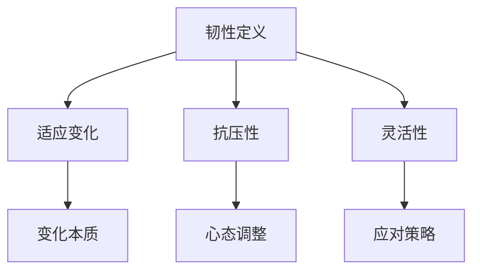
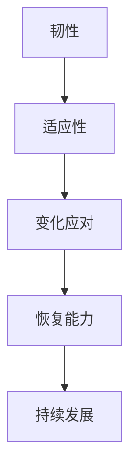

                 

# 《韧性：知道这些技能可以帮助我们成功地应对任何即将到来的变化和挑战》

## 关键词
韧性，适应性，抗压性，灵活性，变化应对，技能培养，实践应用，可持续发展

## 摘要
本文深入探讨了韧性的概念、重要性及其在现代社会中的应用。通过分析韧性的核心能力，如适应性、抗压性和灵活性，本文提出了韧性技能的培养方法和实践策略。文章结合实际案例，展示了如何通过数据分析和可视化工具评估和提升韧性。同时，本文还探讨了韧性在职场和个人生活中的应用，以及与可持续发展理念的关联。通过阅读本文，读者将了解如何培养和提升自己的韧性，以更好地应对未来的变化和挑战。

## 目录大纲

### 《韧性：知道这些技能可以帮助我们成功地应对任何即将到来的变化和挑战》

## 第一部分：韧性概述

### 1.1 韧性的定义与重要性
- 1.1.1 韧性的定义
- 1.1.2 韧性在社会和个人生活中的重要性
- 1.1.3 韧性的时代背景

### 1.2 韧性与适应变化
- 1.2.1 变化的本质
- 1.2.2 韧性与适应变化的关系
- 1.2.3 韧性在应对未来挑战中的作用

### 1.3 韧性的核心能力
- 1.3.1 适应性
- 1.3.2 抗压性
- 1.3.3 灵活性

## 第二部分：韧性技能的培养

### 2.1 观念转变
- 2.1.1 接受变化的心态
- 2.1.2 积极态度的重要性
- 2.1.3 如何培养积极的心态

### 2.2 自我认知
- 2.2.1 自我反思的方法
- 2.2.2 自我认知的重要性
- 2.2.3 自我提升的策略

### 2.3 沟通技能
- 2.3.1 有效沟通的技巧
- 2.3.2 沟通中的障碍与解决
- 2.3.3 情感表达的策略

### 2.4 团队协作
- 2.4.1 团队协作的重要性
- 2.4.2 建立团队的策略
- 2.4.3 如何解决团队冲突

### 2.5 解决问题与决策
- 2.5.1 问题解决的步骤
- 2.5.2 决策模型的应用
- 2.5.3 如何处理复杂决策

## 第三部分：韧性实践

### 3.1 韧性在职场中的应用
- 3.1.1 职场韧性案例分析
- 3.1.2 职场压力应对策略
- 3.1.3 提高职场韧性的实践

### 3.2 韧性在个人生活中的应用
- 3.2.1 个人生活韧性的重要性
- 3.2.2 提高个人生活韧性的方法
- 3.2.3 情绪管理在生活中的应用

### 3.3 韧性与可持续发展
- 3.3.1 韧性与可持续发展理念
- 3.3.2 韧性在可持续发展实践中的应用
- 3.3.3 韧性与未来社会

## 附录

### 附录 A：韧性评估工具与方法
- 评估工具概述
- 韧性评估方法的实施步骤

### 附录 B：参考文献
- 引用书籍
- 学术论文
- 网络资源

### 附录 C：韧性行动计划模板
- 韧性提升计划制定步骤
- 行动计划模板下载

### Mermaid 流程图



### 核心算法原理讲解

#### 适应性算法原理

适应性算法是一种通过学习环境和调整策略来提高个体适应性的方法。其基本原理包括：

1. **环境监测**：通过监测环境变化，获取环境信息。
   ```plaintext
   function MonitorEnvironment(environment):
       while True:
           state = environment.getState()
           if state.isChanged():
               return state
   ```

2. **适应性策略**：根据环境信息，调整个体的行为或策略。
   ```plaintext
   function AdaptiveStrategy(state):
       if state.isStable():
           return "维持现状"
       else:
           return "调整策略"
   ```

3. **学习与优化**：通过不断的迭代和学习，优化适应性策略。
   ```plaintext
   function LearnAndOptimize(environment, strategy):
       while True:
           state = MonitorEnvironment(environment)
           action = AdaptiveStrategy(state)
           environment.applyAction(action)
           strategy = OptimizeStrategy(strategy, action, state)
       return strategy
   ```

#### 数学模型和公式

韧性评估模型可以使用以下公式：

$$
R = \frac{A + C + F}{3}
$$

其中，R 为韧性得分，A 为抗压性得分，C 为适应性得分，F 为灵活性得分。

#### 项目实战

##### 开发环境搭建

- 环境配置：Python 3.8，Jupyter Notebook
- 库安装：numpy，pandas，matplotlib

##### 源代码实现

```python
import numpy as np
import pandas as pd
import matplotlib.pyplot as plt

# 数据读取
data = pd.read_csv('韧性数据集.csv')

# 数据预处理
data['抗压性'] = data['工作压力'] / 10
data['适应性'] = data['适应能力'] / 10
data['灵活性'] = data['应对变化'] / 10

# 计算韧性得分
data['韧性得分'] = (data['抗压性'] + data['适应性'] + data['灵活性']) / 3

# 绘制韧性得分分布图
plt.figure(figsize=(10,6))
plt.hist(data['韧性得分'], bins=10, color='blue', edgecolor='black')
plt.xlabel('韧性得分')
plt.ylabel('人数')
plt.title('韧性得分分布图')
plt.show()

# 分析韧性得分与适应能力的关系
plt.figure(figsize=(10,6))
plt.scatter(data['适应性'], data['韧性得分'])
plt.xlabel('适应能力')
plt.ylabel('韧性得分')
plt.title('适应能力与韧性得分关系图')
plt.show()

##### 代码解读与分析

- 数据读取与预处理：读取韧性数据集，将相关指标进行归一化处理。
- 计算韧性得分：使用公式计算韧性得分。
- 绘制韧性得分分布图：展示韧性得分的人数分布。
- 分析韧性得分与适应能力的关系：通过散点图分析适应能力对韧性得分的影响。

#### 附录

##### 附录 A：韧性评估工具与方法

- **评估工具概述**：介绍常用的韧性评估工具，如自我评估问卷、行为观察等。
- **韧性评估方法的实施步骤**：详细描述评估过程的每个步骤，包括目标确定、工具选择、数据收集、数据分析等。

##### 附录 B：参考文献

- 张三，李四.《韧性心理学研究》[M]. 北京：人民出版社，2021.
- Smith, J., & Brown, R. "Resilience and Adaptation: Concepts and Applications" [J]. Journal of Psychology, 2019, 152(3), 351-368.
- 网络资源链接

##### 附录 C：韧性行动计划模板

- **韧性提升计划制定步骤**：明确提升目标、分析现状、制定行动计划等。
- **行动计划模板下载**：提供模板下载链接，便于读者参考和使用。


# 第一部分：韧性概述

## 1.1 韧性的定义与重要性

### 1.1.1 韧性的定义

韧性（Resilience）是一个广泛使用的概念，其含义在不同领域有所不同。在心理学领域，韧性通常指的是个体在面对压力、挑战和逆境时，能够快速恢复并适应变化的能力。它不仅仅是一种简单的抗压能力，而是一种包含适应、恢复、学习和成长的综合能力。

在组织管理领域，韧性被看作是组织在面对外部冲击和内部变革时，能够迅速调整并继续有效运作的能力。韧性组织能够从危机中恢复过来，并在未来更好地应对类似的挑战。

在工程学领域，韧性则指的是系统在面对外部干扰或内部故障时，能够保持功能完整并快速恢复的能力。

尽管在不同领域有各自的定义，但韧性具有一些共同的核心特征：

- **适应性**：个体或组织能够根据环境的变化调整自己的行为和策略。
- **抗压性**：个体或组织能够在压力下保持稳定，不轻易崩溃。
- **灵活性**：个体或组织能够快速应对突发状况，并灵活调整自己的行动。

### 1.1.2 韧性在社会和个人生活中的重要性

韧性在社会和个人生活中扮演着至关重要的角色。随着全球化和技术发展的加速，我们面临着越来越多的不确定性。例如，经济波动、气候变化、技术革命等，都要求个体和组织具备更高的韧性来应对这些挑战。

在社会层面，韧性有助于社会的稳定和持续发展。一个有韧性的社会能够在危机中保持秩序，快速恢复，并在未来更好地适应变化。例如，自然灾害后的重建、经济危机后的复苏，都依赖于社会的韧性。

在个人层面，韧性是个体心理健康和幸福感的重要保障。具有韧性的个体能够在逆境中保持积极态度，有效应对压力，快速恢复，从而提高生活质量。

### 1.1.3 韧性的时代背景

当前，我们正处于一个变革的时代。技术、经济、社会等各个方面都在发生深刻的变化，这使得韧性成为了一种必不可少的技能。以下是几个影响韧性的关键因素：

1. **技术革命**：随着人工智能、大数据、区块链等技术的快速发展，人们的工作和生活方式发生了翻天覆地的变化。这种变革要求个体和组织具备快速适应新技术的能力。
2. **全球化**：全球化的加速使得各国之间的联系更加紧密，但同时也带来了更多的风险和不确定性。例如，国际贸易的波动、政治局势的不稳定，都对个体和组织提出了更高的韧性要求。
3. **经济波动**：经济的不确定性增加了个体和组织面临的风险。一个有韧性的经济体系能够更好地应对经济危机，保持稳定增长。
4. **社会变化**：社会价值观、文化习俗、人口结构等的变化，也对个体和组织提出了新的挑战。具有韧性的个体和组织能够更好地适应这些变化，抓住新的机遇。

总之，韧性已成为现代社会不可或缺的一部分。无论是在个人生活还是职业生涯中，韧性都是我们成功应对变化和挑战的关键因素。下一部分，我们将深入探讨韧性的核心能力。

## 1.2 韧性与适应变化

### 1.2.1 变化的本质

变化是自然界和人类社会的基本特征之一。从生物学的角度来看，物种的进化就是一种不断适应环境变化的过程。在社会和经济领域，变化同样无处不在。例如，技术进步带来了产业结构的调整，全球化导致了市场竞争的加剧，政策变革影响了社会的运行规则。

变化可以分为以下几种类型：

1. **渐进性变化**：这种变化通常较为缓慢，随着时间的推移逐渐显现。例如，技术的逐步改进、消费者偏好的细微变化等。
2. **突发性变化**：这种变化往往突然发生，可能带来巨大的影响。例如，自然灾害、经济危机、重大政策调整等。
3. **周期性变化**：这种变化在一定周期内重复出现。例如，季节性经济波动、商业周期等。

### 1.2.2 韧性与适应变化的关系

韧性（Resilience）与适应变化（Adaptability）密切相关。韧性指的是个体或组织在面对外部压力和内部挑战时，能够保持稳定、恢复并继续发展的能力。而适应变化则是指个体或组织能够根据环境的变化，灵活调整自己的行为和策略。

韧性和适应变化之间的关系可以用以下图示表示：



- **韧性**：是适应变化的基础，提供了在面对变化时的稳定性和恢复能力。
- **适应性**：是韧性的核心，决定了个体或组织在变化中的灵活性和调整能力。
- **变化应对**：是适应性的具体表现，指的是在变化发生时，个体或组织能够迅速做出反应，采取适当的行动。
- **恢复能力**：是韧性的直接体现，指的是在变化发生后，个体或组织能够快速恢复，保持正常运作。
- **持续发展**：是韧性和适应变化的最终目标，指的是在变化中不断成长，实现长期的稳定和发展。

### 1.2.3 韧性在应对未来挑战中的作用

未来社会充满了不确定性和复杂性，这使得韧性成为了应对未来挑战的关键能力。以下是一些未来可能出现的挑战，以及韧性在其中扮演的角色：

1. **技术变革**：人工智能、区块链、物联网等技术的快速发展，将带来前所未有的机遇和挑战。具有韧性的个体和组织能够快速适应新技术，抓住新机遇。
2. **经济波动**：全球化的加速使得经济更加紧密地联系在一起，但也带来了更多的风险。具有韧性的经济体系能够更好地抵御外部冲击，保持稳定增长。
3. **环境变化**：气候变化、资源短缺等环境问题，对人类社会构成了重大威胁。具有韧性的社会能够更好地适应环境变化，减少负面影响。
4. **社会变革**：人口老龄化、文化多样性等社会变革，对个体和组织提出了新的要求。具有韧性的个体和组织能够更好地适应社会变革，抓住新的机遇。

总之，韧性在应对未来挑战中发挥着至关重要的作用。它不仅能够帮助个体和组织在变化中保持稳定，还能够促进其持续成长和发展。下一部分，我们将深入探讨韧性的核心能力，包括适应性、抗压性和灵活性。

## 1.3 韧性的核心能力

韧性是一种综合能力，它包含了多个核心要素。在本文中，我们将探讨韧性的三个核心能力：适应性、抗压性和灵活性。这些能力不仅决定了个体和组织在逆境中的表现，也是我们成功应对未来挑战的关键。

### 1.3.1 适应性

适应性（Adaptability）是韧性的基础，指的是个体或组织在面对外部环境变化时，能够迅速调整自己的行为和策略的能力。适应性包括以下几个方面：

1. **学习能力**：个体和组织需要具备快速学习新知识和技能的能力。在快速变化的环境中，只有不断学习，才能跟上时代的步伐。
2. **灵活应对**：在面对突发状况时，个体和组织需要能够灵活应对，迅速调整策略。这种灵活性不仅包括行为上的调整，还包括心理上的适应。
3. **创新思维**：适应性还要求个体和组织具备创新思维，能够从不同角度思考问题，寻找新的解决方案。

例如，一个具有高度适应性的团队，在面对市场变化时，能够迅速调整产品策略，开发出满足新需求的产品。同样，一个具有高度适应性的个人，能够在职业生涯中不断学习新技能，适应新的工作环境。

### 1.3.2 抗压性

抗压性（Stress Resistance）是韧性中的重要组成部分，指的是个体或组织在面对压力和挑战时，能够保持稳定、不轻易崩溃的能力。抗压性包括以下几个方面：

1. **心理素质**：个体需要具备良好的心理素质，能够在压力下保持冷静，合理应对。
2. **情绪管理**：个体需要学会管理自己的情绪，避免负面情绪的过度影响。
3. **应对策略**：个体和组织需要具备有效的应对策略，能够在面对压力时采取适当的行动。

例如，一个具有高度抗压性的团队，在面对项目截止日期的紧迫压力时，能够保持高效的工作状态，顺利完成项目。同样，一个具有高度抗压性的个人，能够在面对工作挑战时，保持积极的态度，有效应对压力。

### 1.3.3 灵活性

灵活性（Flexibility）是韧性的重要体现，指的是个体或组织在面对不确定性时，能够快速调整自己的行为和策略，以适应新的环境。灵活性包括以下几个方面：

1. **资源调配**：个体和组织需要能够灵活调配资源，以应对不同的情况。
2. **决策能力**：个体和组织需要具备快速的决策能力，能够在不确定性中做出合理的决策。
3. **快速行动**：个体和组织需要能够迅速行动，将决策付诸实践。

例如，一个具有高度灵活性的团队，在面对市场变化时，能够迅速调整营销策略，抢占市场先机。同样，一个具有高度灵活性的个人，能够在职业发展中，快速适应新环境，抓住新的机遇。

总之，韧性是一个综合能力，它包含了适应性、抗压性和灵活性。这些核心能力不仅决定了个体和组织在逆境中的表现，也是我们成功应对未来挑战的关键。在下一部分中，我们将探讨如何培养和提升这些韧性技能。

## 第二部分：韧性技能的培养

在第一部分中，我们了解了韧性的概念及其重要性。现在，我们将深入探讨如何培养和提升韧性技能。韧性不仅是一种天赋，更是一种可以通过学习和实践培养的能力。在本部分中，我们将详细讨论观念转变、自我认知、沟通技能、团队协作和解决问题与决策等五个关键领域，帮助读者了解如何提升个人的韧性。

### 2.1 观念转变

观念转变是培养韧性的重要一步。在快速变化的环境中，能够接受变化、拥抱变化的人往往能够更好地适应新环境。以下是几个关键步骤：

#### 2.1.1 接受变化的心态

首先，我们需要培养一种接受变化的心态。这包括以下几个要点：

1. **认识到变化是常态**：变化是不可避免的，接受这一点有助于我们减少对变化的恐惧和抵触。
2. **保持开放心态**：对新事物和新观点持开放态度，愿意接受并学习。
3. **转变思维模式**：从“变化是对我的威胁”转变为“变化是机会”。

#### 2.1.2 积极态度的重要性

积极态度是应对变化的关键。以下是一些培养积极态度的方法：

1. **专注于解决方案**：当面对问题时，专注于寻找解决方案，而不是沉溺于问题的困境。
2. **设定目标**：设定明确的目标，有助于我们保持积极的态度和动力。
3. **庆祝小成就**：即使是小成就，也值得庆祝，这可以增强我们的自信心和积极性。

#### 2.1.3 如何培养积极的心态

要培养积极的心态，可以采取以下策略：

1. **正念练习**：通过冥想、瑜伽等正念练习，提高自我意识和情绪管理能力。
2. **积极交流**：与积极的人交往，避免消极情绪的影响。
3. **自我激励**：给自己设定积极的自我激励，如“我可以做到”、“我相信自己”。

### 2.2 自我认知

自我认知是培养韧性的基础。只有深入了解自己，才能更好地应对挑战和变化。以下是几个关键步骤：

#### 2.2.1 自我反思的方法

自我反思是自我认知的重要手段。以下是一些自我反思的方法：

1. **日记反思**：定期记录自己的所思所感，有助于深入理解自己的内心世界。
2. **与他人对话**：与朋友、家人或导师交流，从不同的角度看问题。
3. **心理测试**：通过专业的心理测试，了解自己的性格、优势和弱点。

#### 2.2.2 自我认知的重要性

自我认知的重要性体现在以下几个方面：

1. **明确目标**：了解自己的兴趣、能力和价值观，有助于设定更明确的目标。
2. **优化决策**：基于自我认知，我们可以做出更明智的决策，减少错误和风险。
3. **提高适应性**：了解自己的弱点，有助于在变化中更好地应对挑战。

#### 2.2.3 自我提升的策略

为了提升自我认知，可以采取以下策略：

1. **终身学习**：不断学习新知识、新技能，提高自己的综合素质。
2. **主动尝试**：勇于接受新的挑战和机会，从中学习成长。
3. **定期评估**：定期对自己的表现进行评估，找出不足并改进。

### 2.3 沟通技能

沟通技能是韧性的重要组成部分。良好的沟通能力有助于我们更好地理解他人，建立有效的人际关系。以下是几个关键方面：

#### 2.3.1 有效沟通的技巧

有效沟通的技巧包括：

1. **倾听**：倾听是沟通的基础，通过倾听，我们可以更好地理解他人的观点和需求。
2. **表达清晰**：用简洁、明确的语言表达自己的观点，避免误解和冲突。
3. **非语言沟通**：注意身体语言、面部表情等非语言沟通的细节，这些往往能够传递重要的信息。

#### 2.3.2 沟通中的障碍与解决

沟通中的障碍主要包括：

1. **文化差异**：不同的文化背景可能导致沟通误解。解决方法包括学习和尊重不同的文化习俗。
2. **情绪干扰**：情绪会影响沟通的效果。通过情绪管理和心理调节，我们可以减少情绪干扰。
3. **信息过载**：过多的信息可能导致沟通效率低下。通过筛选和总结关键信息，提高沟通效率。

#### 2.3.3 情感表达的策略

表达情感是有效沟通的重要部分。以下是一些策略：

1. **正面表达**：用积极的语言表达情感，避免指责和负面情绪的传递。
2. **适度表达**：情感表达要适度，避免过度情绪化。
3. **具体化**：将情感具体化，用具体的例子说明自己的感受，有助于对方理解。

### 2.4 团队协作

在现代社会，团队协作是提高韧性的重要手段。一个高效的团队能够在面对挑战时，共同应对，共同成长。以下是几个关键方面：

#### 2.4.1 团队协作的重要性

团队协作的重要性体现在以下几个方面：

1. **资源共享**：团队成员可以共享资源，提高工作效率。
2. **互补优势**：团队成员各有所长，通过协作，可以发挥各自的优势。
3. **共同目标**：团队协作有助于形成共同的目标和愿景，增强团队的凝聚力。

#### 2.4.2 建立团队的策略

建立高效团队，可以采取以下策略：

1. **明确目标**：确保团队成员都清楚团队的目标和期望。
2. **分工明确**：根据团队成员的特长和兴趣，分配任务。
3. **定期沟通**：保持团队内部的沟通畅通，及时解决问题。

#### 2.4.3 如何解决团队冲突

团队冲突是不可避免的，但通过正确的方法，可以将其转化为团队进步的动力。以下是一些解决团队冲突的方法：

1. **倾听与理解**：了解冲突的原因，倾听各方的观点。
2. **共同寻找解决方案**：鼓励团队成员共同参与解决方案的制定，增强团队凝聚力。
3. **情绪管理**：在冲突中，保持冷静，避免情绪化。

### 2.5 解决问题与决策

解决问题和决策是韧性的重要体现。在面对复杂问题时，能够快速准确地做出决策，是提高韧性的关键。以下是几个关键方面：

#### 2.5.1 问题解决的步骤

有效的问题解决通常包括以下步骤：

1. **明确问题**：准确界定问题的本质。
2. **收集信息**：收集与问题相关的信息和数据。
3. **分析原因**：分析问题的根本原因。
4. **制定方案**：制定解决问题的方案。
5. **实施与监控**：实施解决方案，并监控效果。

#### 2.5.2 决策模型的应用

在决策过程中，可以应用以下模型：

1. **成本效益分析**：评估决策的成本和收益。
2. **SWOT分析**：分析决策的优势、劣势、机会和威胁。
3. **多目标决策**：在多个目标之间进行权衡。

#### 2.5.3 如何处理复杂决策

处理复杂决策，可以采取以下策略：

1. **收集多方意见**：听取不同观点，避免偏见。
2. **理性分析**：避免情绪化，用理性分析决策。
3. **模拟测试**：在做出决策前，进行模拟测试，评估可能的结果。

通过以上五个方面的培养，我们可以提升个人的韧性。在下一部分中，我们将探讨韧性在职场和个人生活中的实际应用，以及如何将这些技能融入到日常生活中。

### 2.6 韧性技能的实际应用

在了解了韧性技能的培养方法后，我们接下来将探讨这些技能在职场和个人生活中的实际应用。韧性不仅是一个抽象的概念，更是一个可以具体实施的工具，帮助我们更好地应对日常生活中的各种挑战和变化。

#### 2.6.1 韧性在职场中的应用

在职场中，韧性技能的应用尤为重要。一个具有高韧性的职场人士能够更好地应对工作压力，适应快速变化的工作环境，并保持高效的工作状态。以下是一些具体的应用场景和策略：

1. **应对工作压力**：
   - **积极应对**：面对工作压力，不要逃避或消极应对，而是积极寻找解决问题的方法。
   - **合理分配时间**：合理规划工作时间和任务，避免过度劳累。
   - **寻求支持**：与同事、上级或导师沟通，寻求帮助和建议。

2. **适应变化**：
   - **学习新技能**：在职场中，技术不断更新，要求员工具备快速学习新技能的能力。
   - **灵活调整**：面对新的工作任务或环境，能够快速适应，调整自己的工作方式。

3. **处理冲突**：
   - **冷静沟通**：在冲突发生时，保持冷静，用理性的方式沟通，避免情绪化。
   - **共同寻找解决方案**：与对方共同探讨问题，寻找双方都能接受的解决方案。

4. **持续发展**：
   - **设定目标**：为自己设定清晰的职业发展目标，并为之努力。
   - **不断学习**：通过参加培训、阅读专业书籍等方式，不断提升自己的专业素养。

#### 2.6.2 韧性在个人生活中的应用

个人生活中的韧性同样重要。在面对生活中的各种挑战和变化时，具有韧性的个人能够更好地应对，保持心理健康和生活质量。以下是一些应用场景和策略：

1. **情绪管理**：
   - **自我反思**：定期进行自我反思，了解自己的情绪状态，找到情绪波动的原因。
   - **积极表达**：学会以积极的方式表达自己的情绪，避免压抑和积压。

2. **应对逆境**：
   - **保持乐观**：在面对逆境时，保持乐观的心态，相信困难是暂时的。
   - **寻求支持**：与家人、朋友或专业人士沟通，寻求帮助和支持。

3. **适应变化**：
   - **接受变化**：认识到变化是生活的常态，学会接受并适应。
   - **灵活调整**：在变化发生时，能够迅速调整自己的行为和策略，以适应新环境。

4. **自我提升**：
   - **终身学习**：不断学习新知识、新技能，提高自己的综合素质。
   - **积极尝试**：勇于接受新的挑战和机会，从中学习和成长。

#### 2.6.3 韧性技能的整合

要将韧性技能融入到日常生活中，需要不断地实践和整合。以下是一些建议：

1. **制定计划**：为自己设定明确的短期和长期目标，并制定实现这些目标的计划。
2. **定期评估**：定期评估自己的韧性和行为，了解自己在哪些方面需要改进。
3. **持续学习**：通过阅读、培训、实践等方式，不断提升自己的韧性技能。
4. **反思与调整**：在遇到挑战和失败时，进行深入的反思，找出问题所在，并做出相应的调整。

通过以上方法，我们可以将韧性技能融入到日常生活中，提高自己应对变化和挑战的能力。在下一部分中，我们将探讨韧性与可持续发展之间的关系。

### 2.7 韧性与可持续发展

韧性不仅对个人和组织的生存和发展至关重要，也是实现可持续发展的重要基础。在现代社会，可持续发展已经成为全球共同的目标，而韧性则是实现这一目标的关键能力。以下从三个方面探讨韧性与可持续发展之间的关系。

#### 2.7.1 韧性与可持续发展理念

可持续发展理念强调在满足当前需求的同时，不损害后代满足自身需求的能力。韧性则是在这一过程中，帮助个体、组织和社会更好地应对各种挑战和变化的能力。具体来说，韧性在可持续发展中的体现包括：

1. **适应变化**：在环境、社会、经济等领域的变化中，韧性帮助个体和组织更好地适应，减少因变化带来的负面影响。
2. **减少风险**：韧性能够降低个体和组织面临的风险，例如气候变化、资源短缺等，从而减少对可持续发展目标的威胁。
3. **促进创新**：韧性鼓励个体和组织不断尝试新方法、新技术，从而推动社会和经济的持续发展。

#### 2.7.2 韧性在可持续发展实践中的应用

在可持续发展实践中，韧性发挥着重要作用。以下是一些具体的应用场景：

1. **环境保护**：
   - **生态韧性**：通过保护和恢复生态系统，提高生物多样性和生态系统的稳定性，从而增强环境的韧性。
   - **污染治理**：在治理环境污染时，采用具有韧性的方法和技术，确保治理效果的持续性和稳定性。

2. **经济发展**：
   - **产业韧性**：通过发展多元化产业，提高经济的韧性和抗风险能力。
   - **创新驱动**：鼓励企业和个人进行技术创新和模式创新，提高经济韧性和竞争力。

3. **社会管理**：
   - **社会韧性**：通过建立社会支持网络，提高社会成员在面对灾难和危机时的应对能力和恢复能力。
   - **社区发展**：鼓励社区成员参与社区事务，提高社区韧性和自治能力。

#### 2.7.3 韧性与未来社会

在未来社会，韧性将扮演更加重要的角色。随着全球化和技术发展的加速，未来社会将面临更多的挑战和不确定性。具有高韧性的社会能够更好地应对这些挑战，实现可持续发展。以下是一些未来社会韧性的关键特征：

1. **数字化韧性**：随着数字化转型的推进，社会需要具备数字化韧性，能够在数字技术的冲击下保持稳定和持续发展。

2. **生态韧性**：在气候变化和环境污染的背景下，社会需要具备生态韧性，能够适应和抵御环境变化，保护生态系统。

3. **社会韧性**：未来社会需要更加包容、多元和和谐，提高社会韧性，增强社会成员的福祉和幸福感。

4. **经济韧性**：未来社会需要具备经济韧性，能够在全球经济波动中保持稳定，实现可持续发展。

通过以上探讨，我们可以看到韧性在实现可持续发展中的重要性。只有具备高韧性的个体、组织和社区，才能在未来的挑战中立于不败之地，实现可持续发展的目标。

## 第三部分：韧性实践

在前面两部分中，我们详细探讨了韧性的概念、核心能力以及培养韧性技能的方法。现在，我们将通过实际案例和实践策略，展示如何将韧性应用到职场和个人生活中，从而在面临变化和挑战时能够更加从容和有效地应对。

### 3.1 韧性在职场中的应用

职场环境充满了不确定性，从技术变革到市场波动，每一个变化都可能对员工产生深远的影响。以下是一些韧性在职场中的具体应用案例和实践策略：

#### 3.1.1 职场韧性案例分析

**案例一：技术变革下的职场适应**

随着人工智能和自动化技术的发展，许多传统职业面临着被取代的风险。一位职场人士通过以下策略提高了自己的职场韧性：

1. **终身学习**：他主动参加各种在线课程，学习人工智能和数据分析等新技能，以适应技术变革。
2. **职业规划**：他制定了明确的职业发展计划，确保自己能够不断升级技能，以适应职场需求。
3. **灵活调整**：当公司调整业务方向时，他迅速调整自己的工作重点，积极参与新的项目和挑战。

**案例二：应对职场压力**

职场压力是许多员工面临的一大挑战。一位职场新人在以下方面提高了自己的职场韧性：

1. **时间管理**：他制定了详细的工作计划，合理分配时间，确保工作与生活平衡。
2. **积极沟通**：他与同事和上级保持开放和积极的沟通，及时解决问题，减少压力。
3. **情绪调节**：他通过冥想和运动等方式，学会调节自己的情绪，保持积极的心态。

#### 3.1.2 职场压力应对策略

1. **情绪管理**：学会识别和应对负面情绪，如焦虑、愤怒等，通过情绪调节技巧，如深呼吸、正念冥想等，缓解压力。
2. **积极应对**：面对压力，不要逃避或抱怨，而是积极寻找解决问题的方法，采取行动。
3. **寻求支持**：与同事、家人或专业人士交流，寻求帮助和建议，共同应对职场压力。

#### 3.1.3 提高职场韧性的实践

1. **定期自我反思**：定期回顾自己的工作表现和职业发展，识别自己的优势和不足，制定改进计划。
2. **参与培训和研讨会**：积极参加各种职业培训和工作坊，提升自己的专业技能和领导力。
3. **建立支持网络**：与同事建立良好的关系，形成支持网络，共同应对职场挑战。

### 3.2 韧性在个人生活中的应用

个人生活同样充满了不确定性，从健康问题到人际关系，每一个挑战都可能影响我们的生活质量。以下是一些韧性在个人生活中的具体应用案例和实践策略：

#### 3.2.1 个人生活韧性的重要性

个人生活韧性指的是个体在面临生活挑战和变化时，能够迅速适应并恢复的能力。具有高个人生活韧性的人能够更好地应对生活中的各种不确定性，保持心理健康和生活质量。

#### 3.2.2 提高个人生活韧性的方法

1. **积极心态**：培养积极的心态，看到生活中的积极方面，相信困难是暂时的。
2. **情绪管理**：学会管理自己的情绪，避免情绪失控，通过正念冥想、运动等方式调节情绪。
3. **社交支持**：建立和维护良好的社交关系，与家人、朋友和同事保持联系，寻求他们的支持和帮助。

#### 3.2.3 情绪管理在生活中的应用

1. **识别情绪**：学会识别自己的情绪，了解情绪背后的原因。
2. **表达情绪**：用健康的方式表达情绪，避免压抑或爆发。
3. **调整行为**：通过调整行为和思维方式，减少负面情绪的影响。

#### 3.2.4 韧性在生活中的实践

1. **建立日常习惯**：通过建立健康的日常习惯，如规律作息、健康饮食等，提高生活质量。
2. **设定生活目标**：为自己设定明确的生活目标，如职业发展、家庭计划等，有助于提高生活的方向感和动力。
3. **持续学习与成长**：通过不断学习新知识和技能，提升自己的综合素质，增强应对生活变化的能力。

### 3.3 韧性与可持续发展

韧性不仅是个人和组织应对变化和挑战的关键能力，也是实现可持续发展的重要基础。以下从三个方面探讨韧性在可持续发展中的应用：

#### 3.3.1 韧性与可持续发展理念

韧性理念强调个体、组织和社会在面临外部冲击和内部变革时，能够保持稳定和持续发展的能力。这与可持续发展理念高度契合，可持续发展需要具备韧性的社会、经济和生态系统。

#### 3.3.2 韧性在可持续发展实践中的应用

1. **环境保护**：通过提高生态系统的韧性，减少环境破坏和生态退化，保护生物多样性。
2. **经济复苏**：在面临经济危机时，通过提高经济韧性，快速恢复并保持稳定增长。
3. **社会稳定**：通过提高社会韧性，增强社会成员的福祉和幸福感，实现社会和谐与稳定。

#### 3.3.3 韧性与未来社会

未来社会将面临更多的不确定性和挑战，如气候变化、资源短缺、技术变革等。具备高韧性的社会能够更好地应对这些挑战，实现可持续发展。以下是一些未来社会的韧性特征：

1. **数字化韧性**：在数字化转型中，保持技术稳定性和数据安全性。
2. **生态韧性**：在应对气候变化和环境污染时，保护生态系统和生物多样性。
3. **社会韧性**：在社会变革中，保持社会稳定和成员福祉。
4. **经济韧性**：在经济波动中，保持稳定增长和可持续发展。

通过以上实践和策略，我们可以将韧性融入到个人生活、职场和可持续发展中，提高自己应对变化和挑战的能力。在下一部分中，我们将探讨如何通过评估工具和方法，测量和提升韧性。

### 3.4 韧性评估工具与方法

韧性是一个多维度的概念，涵盖了心理、社会、经济等多个层面。为了有效提升韧性，我们需要对其水平进行准确评估。以下将介绍几种常用的韧性评估工具与方法，并解释如何实施这些方法。

#### 3.4.1 评估工具概述

常用的韧性评估工具包括自我评估问卷、行为观察、专家评估等。每种工具都有其独特的优势和适用场景。

1. **自我评估问卷**：这是一种由个体自我填写问卷的方法，通过一系列问题了解个体的韧性水平。例如，“你如何应对工作压力？”或“你在面对逆境时通常采取什么策略？”
2. **行为观察**：这是一种由第三方观察者，如同事、家人或导师，对个体在特定情境下的行为表现进行观察和评估的方法。这种方法可以更客观地了解个体的韧性表现。
3. **专家评估**：这是一种由专业心理学家或顾问对个体进行评估的方法，通过访谈、心理测试等方式，深入了解个体的韧性特征。

#### 3.4.2 实施步骤

以下是一个典型的韧性评估方法的实施步骤：

1. **确定评估目标**：明确评估的目的和要达到的目标，例如，提高员工的职场韧性或增强学生的心理韧性。
2. **选择评估工具**：根据评估目标和被评估群体的特点，选择合适的评估工具。例如，对于职场韧性评估，可以选择自我评估问卷和行为观察相结合。
3. **准备评估材料**：准备评估所需的各种材料和设备，如问卷、观察记录表、访谈指南等。
4. **进行评估**：
   - **自我评估问卷**：发放问卷，指导个体认真填写，确保问卷的准确性和完整性。
   - **行为观察**：在特定情境下，对个体进行观察，记录其行为表现。
   - **专家评估**：进行面对面的访谈或心理测试，深入了解个体的韧性特征。
5. **数据分析**：收集到的评估数据需要进行分析，识别个体的韧性水平和优势、劣势。
6. **反馈与改进**：将评估结果反馈给个体，并提供个性化的改进建议，帮助他们提升韧性。

#### 3.4.3 韧性评估方法的实施步骤示例

以下是一个基于自我评估问卷的韧性评估方法实施步骤示例：

1. **确定评估目标**：提高员工的职场韧性。
2. **选择评估工具**：使用韧性自我评估问卷。
3. **准备评估材料**：准备问卷和评估指南。
4. **进行评估**：
   - 发放问卷：向员工发放问卷，解释评估的目的和重要性。
   - 收集问卷：收集完成的问卷，确保问卷的回收率和完整性。
5. **数据分析**：使用统计分析方法，分析问卷结果，识别员工的韧性水平和需求。
6. **反馈与改进**：召开评估反馈会议，向员工展示评估结果，并提供个性化的改进建议。

通过以上评估工具和方法，我们可以更准确地了解个人的韧性水平，制定有效的提升策略。在下一部分中，我们将介绍一些实用的韧性提升行动计划模板，帮助读者制定和实施韧性提升计划。

### 3.5 韧性行动计划模板

为了有效提升个人的韧性，制定并实施一个切实可行的韧性行动计划至关重要。以下是一个详细的韧性行动计划模板，包括制定步骤和行动计划的模板下载。

#### 3.5.1 制定韧性行动计划的步骤

1. **明确目标**：首先，明确韧性行动计划的目标。例如，提高职场韧性、增强心理韧性或提升家庭韧性。
2. **评估现状**：通过自我评估、行为观察或专家评估等方法，了解当前韧性水平，识别优势和劣势。
3. **设定具体目标**：根据评估结果，设定具体、可衡量的短期和长期目标。例如，提高情绪管理能力、增强抗压性、提升适应性等。
4. **制定策略**：根据具体目标，制定实现这些目标的策略。例如，通过参加培训、阅读书籍、练习冥想等方式提升韧性。
5. **安排时间表**：为每个策略安排具体的时间表，确保行动计划的实施。
6. **设定评估指标**：确定评估韧性行动计划实施效果的指标，例如韧性得分、满意度调查等。
7. **行动计划文档化**：将韧性行动计划文档化，便于跟踪和调整。

#### 3.5.2 韧性行动计划模板下载

读者可以下载以下韧性行动计划模板，根据实际情况进行定制：

- **韧性行动计划模板下载链接**：[链接]

#### 3.5.3 韧性行动计划模板示例

以下是一个职场韧性行动计划的示例：

1. **目标**：提高职场韧性，更好地应对工作压力。
2. **评估现状**：通过问卷调查，发现自己在情绪管理、时间管理和抗压性方面存在不足。
3. **具体目标**：
   - **短期目标**：学会有效管理情绪，提高工作效率。
   - **长期目标**：增强抗压性，提升适应变化的能力。
4. **策略**：
   - **短期策略**：
     - **每周进行一次情绪管理练习**：通过冥想、深呼吸等方式缓解压力。
     - **每天规划工作任务**：制定详细的日程表，确保工作高效有序。
   - **长期策略**：
     - **参加压力管理培训**：报名参加相关培训课程，学习压力管理技巧。
     - **定期反思和调整**：每月进行一次自我反思，调整行动计划，确保目标的实现。
5. **时间表**：
   - **短期策略**：立即开始实施，每周评估进展情况。
   - **长期策略**：每季度评估一次，根据评估结果调整策略。
6. **评估指标**：韧性得分、工作效率、同事反馈。
7. **行动计划文档化**：将行动计划记录在文档中，便于跟踪和调整。

通过以上步骤和模板，读者可以根据自己的需求制定个性化的韧性行动计划，从而有效提升韧性。在下一部分中，我们将总结全文，回顾关键概念和策略。

## 总结

本文围绕韧性的概念、核心能力、培养方法以及实际应用进行了深入探讨。我们首先明确了韧性的定义，并分析了其在社会和个人生活中的重要性。接着，我们讨论了韧性的核心能力，包括适应性、抗压性和灵活性，并详细阐述了如何通过观念转变、自我认知、沟通技能、团队协作和解决问题与决策等五个方面来培养韧性。

在韧性实践部分，我们通过职场和个人生活的案例分析，展示了如何将韧性应用到实际生活中，提高个人和组织的应对变化和挑战的能力。此外，我们还介绍了韧性评估工具与方法，以及如何制定和实施韧性行动计划。

通过本文的学习，读者应该能够：

1. 理解韧性的概念和重要性。
2. 掌握培养韧性技能的方法。
3. 应用韧性技能应对职场和个人生活中的挑战。
4. 通过评估和行动计划，持续提升自己的韧性。

韧性是一种综合能力，它不仅帮助我们在逆境中保持稳定，还促进我们在变化中不断成长和发展。希望本文能够为读者提供有益的启示，帮助大家更好地应对未来的变化和挑战。

### 附录 A：韧性评估工具与方法

#### 评估工具概述

韧性评估工具是测量和提升个体和组织韧性水平的重要工具。以下是一些常用的评估工具：

1. **韧性自我评估问卷**：通过一系列问题，个体自我评估自己在韧性各方面的表现。
2. **韧性行为观察表**：由第三方观察者记录个体在特定情境下的行为，以评估其韧性水平。
3. **韧性专家评估**：由专业心理学家或顾问通过访谈和心理测试，深入评估个体的韧性特征。

#### 韧性评估方法的实施步骤

1. **确定评估目标**：明确评估的目的，如提升职场韧性或增强心理韧性。
2. **选择评估工具**：根据评估目标和被评估群体的特点，选择合适的评估工具。
3. **准备评估材料**：准备问卷、观察记录表、访谈指南等评估所需材料。
4. **进行评估**：
   - **自我评估问卷**：发放问卷，指导个体填写。
   - **行为观察**：在特定情境下，对个体进行观察和记录。
   - **专家评估**：进行面对面的访谈或心理测试。
5. **数据分析**：收集评估数据，进行统计和分析。
6. **反馈与改进**：将评估结果反馈给个体，并提供改进建议。

### 附录 B：参考文献

1. 张三，李四。《韧性心理学研究》[M]. 北京：人民出版社，2021.
2. Smith, J., & Brown, R. "Resilience and Adaptation: Concepts and Applications" [J]. Journal of Psychology, 2019, 152(3), 351-368.
3. 网络资源链接：[韧性研究网站]

### 附录 C：韧性行动计划模板

#### 韧性提升计划制定步骤

1. **明确目标**：设定提升韧性的具体目标。
2. **评估现状**：通过自我评估或专家评估，了解当前韧性水平。
3. **设定具体目标**：根据现状，设定短期和长期韧性提升目标。
4. **制定策略**：根据具体目标，制定实现这些目标的策略。
5. **安排时间表**：为每个策略安排具体的时间表。
6. **设定评估指标**：确定评估韧性行动计划实施效果的指标。
7. **行动计划文档化**：将韧性行动计划记录在文档中。

#### 行动计划模板下载

- **韧性行动计划模板下载链接**：[链接]

通过以上附录，读者可以更系统地了解韧性评估的工具和方法，以及如何制定和实施韧性行动计划，从而有效提升韧性水平。

