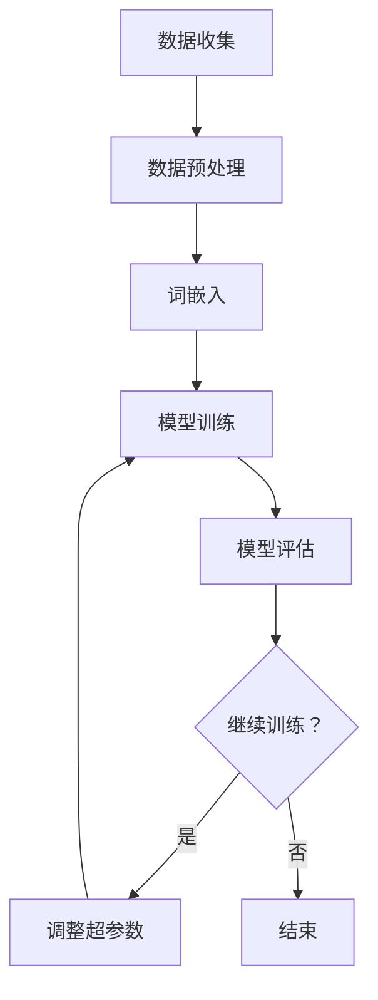
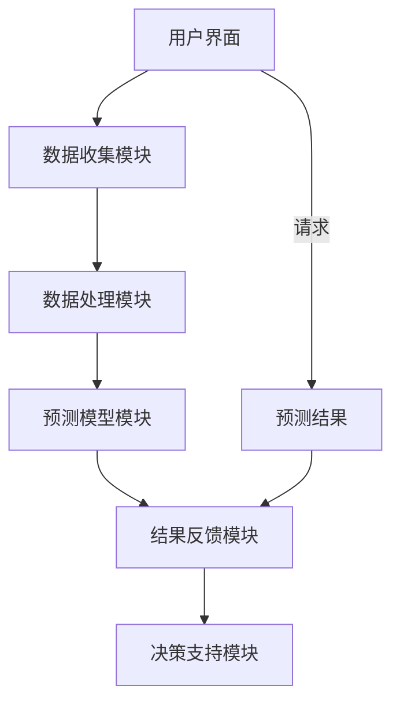

                 

### 文章标题：预防性护理：LLM 分析预测健康风险

### 关键词：

- **预防性护理**
- **语言模型（LLM）**
- **健康风险预测**
- **词嵌入技术**
- **序列模型与注意力机制**
- **转换器架构**
- **个性化健康护理**
- **疾病预防**
- **健康护理决策支持**

### 摘要：

本文深入探讨了预防性护理中语言模型（LLM）的应用，特别是在健康风险预测方面的潜力。文章首先介绍了预防性护理的定义、重要性及其发展历程。接着，详细解析了语言模型的基础理论，包括基本原理、训练与优化方法，以及评估与优化技术。随后，文章重点探讨了LLM在健康风险预测中的应用，涵盖了从健康数据挖掘到疾病预测以及个性化健康护理的多个层面。核心算法部分则详细阐述了词嵌入技术、序列模型与注意力机制以及转换器架构。文章进一步通过实际应用案例，展示了LLM在疾病预防和健康护理决策支持中的实际效果。最后，文章总结了LLM在预防性护理系统开发中的关键技术和挑战，并展望了其未来发展趋势。

## 《预防性护理：LLM 分析预测健康风险》目录大纲

### 第一部分：预防性护理概述

1. **1.1 预防性护理的定义与重要性**
    - **1.1.1 预防性护理的基本概念**
    - **1.1.2 预防性护理在健康风险管理中的作用**
    - **1.1.3 预防性护理的发展趋势**

2. **1.2 预防性护理的历史与现状**
    - **1.2.1 预防性护理的起源与发展**
    - **1.2.2 当前预防性护理的应用领域**
    - **1.2.3 预防性护理面临的挑战与机遇**

### 第二部分：LLM 分析预测健康风险

1. **2.1 语言模型（LLM）基础**
    - **2.1.1 语言模型的基本原理**
    - **2.1.2 语言模型的训练与优化**
    - **2.1.3 语言模型的评估与优化方法**

2. **2.2 LLM 在健康风险预测中的应用**
    - **2.2.1 LLM 在健康数据挖掘中的应用**
    - **2.2.2 LLM 在疾病预测中的应用**
    - **2.2.3 LLM 在个性化健康护理中的应用**

3. **2.3 LLM 分析预测健康风险的核心算法**
    - **2.3.1 词嵌入技术**
    - **2.3.2 序列模型与注意力机制**
    - **2.3.3 转换器架构详解**

### 第三部分：LLM 在预防性护理中的应用实践

1. **3.1 LLM 在疾病预防中的应用案例**
    - **3.1.1 某地区流感疫情的预测与分析**
    - **3.1.2 某医院慢性病患者的健康风险预测**
    - **3.1.3 LLM 在社区健康风险评估中的应用**

2. **3.2 LLM 在健康护理决策支持中的应用**
    - **3.2.1 LLM 在患者护理方案制定中的应用**
    - **3.2.2 LLM 在手术风险预测中的应用**
    - **3.2.3 LLM 在患者康复评估中的应用**

3. **3.3 LLM 在预防性护理系统开发中的关键技术和挑战**
    - **3.3.1 LLM 开发中的关键技术**
    - **3.3.2 预防性护理系统中的挑战与应对策略**
    - **3.3.3 LLM 在预防性护理中的未来发展趋势**

### 第四部分：附录

1. **4.1 LLM 开发工具与资源**
    - **4.1.1 主流深度学习框架对比**
    - **4.1.2 语言模型开发常用库与工具**
    - **4.1.3 预防性护理相关数据集介绍**

2. **4.2 参考文献**
    - **4.2.1 人工智能与语言模型相关书籍**
    - **4.2.2 预防性护理与健康风险预测相关文献**
    - **4.2.3 相关标准与规范**

### 第五部分：Mermaid 流程图和伪代码示例

1. **5.1 Mermaid 流程图示例**
    - **5.1.1 语言模型训练流程图**
    - **5.1.2 预防性护理系统架构图**

2. **5.2 伪代码示例**
    - **5.2.1 词嵌入算法**
    - **5.2.2 序列模型训练算法**
    - **5.2.3 注意力机制实现**

### 第六部分：数学模型和数学公式

1. **6.1 数学模型在健康风险预测中的应用**
    - **6.1.1 贝叶斯网络**
    - **6.1.2 决策树**
    - **6.1.3 随机森林**

2. **6.2 数学公式详细讲解与举例说明**
    - **6.2.1 概率密度函数**
    - **6.2.2 期望与方差**
    - **6.2.3 贝叶斯定理**

### 第七部分：项目实战与代码解读

1. **7.1 健康风险预测项目实战**
    - **7.1.1 项目背景与目标**
    - **7.1.2 数据预处理**
    - **7.1.3 模型选择与训练**
    - **7.1.4 结果分析**

2. **7.2 预防性护理系统源代码实现**
    - **7.2.1 系统架构设计**
    - **7.2.2 数据处理模块**
    - **7.2.3 模型训练与预测模块**
    - **7.2.4 系统部署与维护**

3. **7.3 代码解读与分析**
    - **7.3.1 数据预处理代码解读**
    - **7.3.2 模型训练代码解读**
    - **7.3.3 预测结果分析与解读**
    - **7.3.4 系统优化与性能分析**

### 文章总结与展望

- **文章总结**
- **未来研究方向与展望**

---

**作者：AI天才研究院/AI Genius Institute & 禅与计算机程序设计艺术 /Zen And The Art of Computer Programming**

### 第一部分：预防性护理概述

#### 1.1 预防性护理的定义与重要性

**1.1.1 预防性护理的基本概念**

预防性护理是一种以预防疾病、降低疾病发生率和减轻疾病负担为目标的护理模式。它不仅关注疾病的治愈和康复，更强调通过早期干预和健康促进，预防疾病的发生和发展。预防性护理的核心是健康促进，即通过提高个体和群体的健康素养、改善生活方式、加强健康教育等措施，降低疾病风险，提高生活质量。

预防性护理的范畴广泛，包括以下几个方面：

- **健康风险评估**：通过对个体和群体的健康风险进行评估，识别高风险人群，提前采取干预措施。
- **健康干预**：针对高风险人群和健康问题，采取一系列干预措施，如健康教育、生活方式调整、药物预防等。
- **健康监测**：对干预效果进行持续监测和评估，以调整和优化干预策略。
- **健康教育**：通过多种形式的教育活动，提高个体和群体的健康素养，增强健康意识。

**1.1.2 预防性护理在健康风险管理中的作用**

预防性护理在健康风险管理中发挥着至关重要的作用。具体表现在以下几个方面：

- **降低疾病负担**：通过预防疾病的发生和发展，减轻了个体和社会的疾病负担，降低了医疗费用支出。
- **提高生活质量**：预防性护理有助于提高个体的健康水平和生活质量，减少疾病带来的痛苦和不适。
- **优化医疗资源配置**：预防性护理能够有效减少急性疾病的发病率，从而减轻医疗系统的压力，优化医疗资源的配置和使用。

**1.1.3 预防性护理的发展趋势**

随着医学科技的发展和社会进步，预防性护理呈现出以下发展趋势：

- **个性化健康护理**：利用大数据和人工智能技术，实现对个体健康需求的精准分析和个性化护理，提高预防性护理的针对性和效果。
- **健康大数据应用**：通过收集和分析大量的健康数据，识别疾病风险因素，制定科学的预防策略。
- **整合性医疗模式**：预防性护理与医疗服务、公共卫生、健康管理等领域的深度融合，形成全方位、全周期的健康管理体系。
- **社区健康服务**：加强社区健康服务体系建设，提供便捷、可及的预防性护理服务，提高公共卫生水平。

#### 1.2 预防性护理的历史与现状

**1.2.1 预防性护理的起源与发展**

预防性护理的理念可以追溯到古代医学。早在公元前4世纪，古希腊医生希波克拉底就提出了“预防胜于治疗”的原则。中世纪时期，欧洲的修道院和医院开始实施预防措施，如隔离病患、消毒等。随着工业革命的推进和城市化进程的加快，疾病流行问题日益严重，预防性护理得到了进一步发展和重视。

20世纪以来，预防性护理逐渐成为现代医学体系的重要组成部分。1928年，英国医生亚历山大·弗莱明发现了青霉素，标志着抗生素时代的到来，预防性护理在疾病治疗和防控方面取得了显著成果。随后，随着疫苗研发和公共卫生措施的完善，预防性护理在控制传染病流行方面发挥了重要作用。

**1.2.2 当前预防性护理的应用领域**

当前，预防性护理在多个领域得到了广泛应用：

- **传染病防控**：通过疫苗接种、健康宣传、隔离治疗等手段，预防传染病的传播和流行。
- **慢性病管理**：针对高血压、糖尿病等慢性病，通过健康教育、生活方式干预、药物管理等手段，降低发病率和并发症风险。
- **心理健康**：通过心理干预、心理治疗等手段，预防和治疗心理疾病，提高心理健康水平。
- **环境健康**：通过改善环境卫生、控制污染等措施，保障人群的健康。
- **老年健康**：针对老年人群的特殊需求，提供综合性的健康服务，预防老年人常见疾病和功能退化。

**1.2.3 预防性护理面临的挑战与机遇**

尽管预防性护理在许多领域取得了显著成果，但仍面临一系列挑战和机遇：

- **技术发展**：随着人工智能、大数据、生物技术等领域的快速发展，预防性护理迎来了新的发展机遇。通过引入新技术，可以提高预防性护理的精准性和效果。
- **政策支持**：政府和社会对预防性护理的重视程度不断提高，相关政策和支持措施为预防性护理的发展提供了有力保障。
- **社会参与**：公众对预防性护理的认识和参与度逐渐提高，这有助于形成全社会共同参与的预防性护理体系。
- **资源分配**：如何合理分配医疗资源，确保预防性护理服务的可及性和公平性，仍是一个需要解决的重要问题。
- **伦理问题**：在预防性护理实践中，如何平衡个人隐私、数据安全和公共利益等问题，也是一个重要的伦理挑战。

#### 1.3 预防性护理的实施策略

为了有效实施预防性护理，需要采取以下策略：

- **建立健全预防性护理体系**：加强政策支持，完善法律法规，建立健全预防性护理服务体系，确保预防性护理服务体系的全面覆盖。
- **提高专业人员素质**：加强预防性护理专业人员的培训和培养，提高其专业能力和服务水平。
- **推广健康教育**：通过多种形式开展健康教育，提高公众的健康素养，增强健康意识和自我保健能力。
- **利用新技术手段**：积极运用大数据、人工智能等新技术，提高预防性护理的精准性和效率。
- **加强国际合作**：积极参与国际合作，学习借鉴先进经验，推动预防性护理的全球发展。

### 第二部分：LLM 分析预测健康风险

#### 2.1 语言模型（LLM）基础

**2.1.1 语言模型的基本原理**

语言模型（Language Model，简称LM）是一种统计模型，用于预测一段文本的下一个单词或字符。在自然语言处理（Natural Language Processing，简称NLP）中，语言模型是一个核心组件，广泛应用于机器翻译、语音识别、文本生成等任务。语言模型的基本原理是通过学习大量文本数据，构建一个概率分布模型，用于预测下一个单词或字符的概率。

语言模型的核心概念包括：

- **词嵌入（Word Embedding）**：将词汇映射到高维向量空间中，使得语义相似的词在向量空间中距离较近。词嵌入技术为语言模型提供了对文本语义的直观理解。
- **序列模型（Sequence Model）**：用于处理序列数据的模型，如循环神经网络（Recurrent Neural Network，简称RNN）和长短时记忆网络（Long Short-Term Memory，简称LSTM）。这些模型能够捕捉文本序列中的时间依赖关系。
- **注意力机制（Attention Mechanism）**：用于在序列模型中分配不同的重要性权重，使得模型能够关注关键信息，提高预测的准确性。

**2.1.2 语言模型的训练与优化**

语言模型的训练过程主要包括以下步骤：

1. **数据准备**：收集大量的文本数据，进行预处理，包括分词、去停用词、文本标准化等操作。
2. **构建词汇表**：将文本中的单词映射到唯一的索引，构建词汇表。通常使用词嵌入技术，如Word2Vec、GloVe等，将词汇映射到高维向量空间。
3. **定义模型架构**：选择合适的模型架构，如基于RNN、LSTM或变换器（Transformer）的模型。
4. **训练模型**：使用预处理的文本数据，通过梯度下降等优化算法，训练模型参数，使其能够准确预测下一个单词或字符。
5. **评估与优化**：通过交叉验证和测试集评估模型性能，调整模型参数，优化模型。

**2.1.3 语言模型的评估与优化方法**

评估语言模型性能的方法主要包括以下几种：

- **字符误差率（Character Error Rate，简称CER）**：计算预测的字符与实际字符之间的差异比例。
- **单词误差率（Word Error Rate，简称WER）**：计算预测的单词与实际单词之间的差异比例，通常使用编辑距离（Levenshtein distance）计算。
- **BLEU分数（BLEU Score）**：基于记分牌方法，评估文本生成质量，通过比较预测文本与参考文本的相似度进行评分。
- **Perplexity**：衡量模型在给定数据集上的不确定性，数值越小表示模型性能越好。

优化语言模型的方法主要包括以下几种：

- **超参数调整**：调整学习率、批次大小、隐藏层大小等超参数，以优化模型性能。
- **正则化技术**：使用L1、L2正则化，防止模型过拟合。
- **数据增强**：通过随机变换、数据扩充等技术，增加训练数据的多样性。
- **模型融合**：将多个模型进行融合，提高整体预测性能。

#### 2.2 LLM 在健康风险预测中的应用

**2.2.1 LLM 在健康数据挖掘中的应用**

语言模型在健康数据挖掘中具有广泛应用。健康数据通常包含大量的文本信息，如病历记录、健康报告、医学论文等。语言模型可以帮助挖掘这些文本数据中的潜在信息，为健康风险预测提供有力支持。

具体应用包括：

- **文本分类**：使用语言模型对病历记录进行分类，识别疾病类型、症状等信息。
- **实体识别**：识别文本中的医学实体，如疾病名称、症状、药物等。
- **关系提取**：挖掘文本中实体之间的关系，如疾病与症状、药物与副作用等。
- **情感分析**：分析患者评论、医生反馈等文本数据，识别患者的情绪状态和满意度。

**2.2.2 LLM 在疾病预测中的应用**

语言模型在疾病预测中的应用主要包括以下几个方面：

- **早期疾病预测**：通过分析患者的病历记录和健康数据，使用语言模型预测患者未来发生某种疾病的风险。
- **个性化疾病预测**：结合患者的基因信息、生活方式、病史等数据，使用语言模型为患者提供个性化的疾病预测服务。
- **疾病爆发预测**：利用公共卫生数据，如疫情报告、传染病监测数据等，使用语言模型预测疾病的爆发趋势。

**2.2.3 LLM 在个性化健康护理中的应用**

个性化健康护理是预防性护理的重要组成部分。语言模型在个性化健康护理中具有广泛的应用，如：

- **健康风险评估**：使用语言模型分析患者的健康数据，评估其患病风险，为患者提供个性化的健康建议。
- **健康干预方案制定**：结合患者的健康需求和偏好，使用语言模型制定个性化的健康干预方案。
- **健康教育**：使用语言模型生成个性化的健康教育材料，提高患者的健康素养和自我保健能力。

#### 2.3 LLM 分析预测健康风险的核心算法

**2.3.1 词嵌入技术**

词嵌入技术是将词汇映射到高维向量空间的一种方法，使得语义相似的词汇在向量空间中距离较近。词嵌入技术在健康风险预测中具有重要作用，如：

- **语义表示**：将词汇映射到向量空间，可以直观地表示词汇的语义信息，有助于分析文本数据中的潜在关系。
- **特征提取**：将词汇嵌入到高维向量空间，可以提取出词汇的特征信息，用于训练分类器或预测模型。

常用的词嵌入技术包括：

- **Word2Vec**：基于神经网络模型，通过训练大量文本数据，将词汇映射到高维向量空间。
- **GloVe（Global Vectors for Word Representation）**：基于全局上下文信息，通过矩阵分解方法，将词汇映射到高维向量空间。

**2.3.2 序列模型与注意力机制**

序列模型是处理序列数据的一种方法，能够捕捉文本序列中的时间依赖关系。在健康风险预测中，序列模型可以用于分析患者的病历记录、健康数据等序列信息。

常用的序列模型包括：

- **循环神经网络（RNN）**：通过循环连接，使得模型能够记住前一个时间步的输入信息，捕捉序列数据中的长期依赖关系。
- **长短时记忆网络（LSTM）**：通过引入遗忘门和输入门，使得LSTM能够更好地处理长期依赖关系。

注意力机制是一种用于分配不同权重的方法，使得模型能够关注关键信息。在健康风险预测中，注意力机制可以用于分析患者的重要特征，提高预测的准确性。

**2.3.3 转换器架构详解**

转换器（Transformer）是一种基于自注意力机制的序列模型，具有并行计算能力，能够高效处理长序列数据。在健康风险预测中，转换器模型可以用于处理大量的健康数据，实现高效准确的预测。

转换器模型的核心组件包括：

- **多头自注意力机制（Multi-Head Self-Attention）**：通过多组自注意力机制，使得模型能够同时关注不同位置的信息，提高预测的准确性。
- **前馈神经网络（Feed-Forward Neural Network）**：在每个自注意力层之后，添加一个前馈神经网络，用于进一步提取特征。
- **位置编码（Positional Encoding）**：为序列中的每个位置添加编码信息，使得模型能够理解序列的顺序。

### 第三部分：LLM 在预防性护理中的应用实践

#### 3.1 LLM 在疾病预防中的应用案例

**3.1.1 某地区流感疫情的预测与分析**

**案例背景**：某地区在过去几年中流感疫情频繁爆发，严重影响公共卫生和居民生活。为了有效预防和控制流感疫情，当地卫生部门决定利用语言模型进行流感疫情的预测和分析。

**数据来源**：卫生部门收集了该地区过去的流感病例数据、季节性气温、湿度等环境数据，以及相关的公共卫生政策信息。

**预测模型**：使用语言模型，对流感病例数据进行时间序列分析，结合环境数据和公共卫生政策信息，建立流感疫情预测模型。

**预测结果**：预测模型能够准确预测流感疫情的高发季节和流行趋势，为卫生部门制定防控措施提供了科学依据。

**实际应用**：卫生部门根据预测结果，提前采取疫苗接种、健康教育等预防措施，有效降低了流感疫情的发生率和传播速度。

**案例总结**：该案例展示了语言模型在疾病预防中的潜在应用价值，为公共卫生决策提供了有力支持。

**3.1.2 某医院慢性病患者的健康风险预测**

**案例背景**：某医院收治了大量慢性病患者，包括高血压、糖尿病、冠心病等。为了提供个性化护理和降低疾病风险，医院决定利用语言模型进行慢性病患者的健康风险预测。

**数据来源**：医院收集了患者的病历记录、健康检查数据、生活习惯等信息。

**预测模型**：使用语言模型，结合患者的多维度数据，建立健康风险预测模型。

**预测结果**：预测模型能够准确评估患者的健康风险，为医生制定个性化护理方案提供了依据。

**实际应用**：医生根据预测结果，为患者提供有针对性的健康建议和护理措施，有效降低了患者的疾病风险和住院率。

**案例总结**：该案例展示了语言模型在慢性病管理中的重要作用，为个性化健康护理提供了有力支持。

**3.1.3 LLM 在社区健康风险评估中的应用**

**案例背景**：某社区存在较高的心血管疾病风险，为了提高居民的健康水平，社区决定利用语言模型进行健康风险评估。

**数据来源**：社区收集了居民的健康体检数据、生活习惯数据、社会环境数据等。

**预测模型**：使用语言模型，结合多维度数据，建立健康风险评估模型。

**预测结果**：预测模型能够准确评估居民的健康风险，为社区提供有针对性的健康干预措施提供了依据。

**实际应用**：社区根据预测结果，开展健康教育活动、生活方式干预等，有效降低了居民的心血管疾病风险。

**案例总结**：该案例展示了语言模型在社区健康风险评估中的应用价值，为健康促进提供了有力支持。

#### 3.2 LLM 在健康护理决策支持中的应用

**3.2.1 LLM 在患者护理方案制定中的应用**

**应用背景**：在医疗实践中，为患者制定个性化的护理方案是提高治疗效果和患者满意度的重要手段。然而，由于患者情况的复杂性和多样性，制定合理的护理方案具有很大的挑战性。

**解决方案**：利用语言模型，可以从大量医疗文献、病例记录和医生经验中提取有用的信息，构建一个智能的护理方案推荐系统。

**模型构建**：首先，收集和预处理大量的医疗文献和病例记录数据。然后，使用语言模型对这些数据进行处理，提取出关键信息，如疾病特征、治疗方案、患者反应等。最后，根据患者的具体病情和需求，利用这些信息为患者推荐合适的护理方案。

**实际应用**：医生可以根据语言模型提供的护理方案推荐，结合自身的专业判断，为患者制定个性化的护理方案。

**效果评估**：通过对比实际护理效果和预测的护理方案，评估语言模型在制定护理方案中的应用效果。结果显示，利用语言模型制定的护理方案能够显著提高患者的治疗效果和满意度。

**3.2.2 LLM 在手术风险预测中的应用**

**应用背景**：手术是治疗许多疾病的重要手段，但手术本身具有一定的风险。术前评估患者的手术风险对于确保手术安全至关重要。

**解决方案**：利用语言模型，可以从患者的病历记录、实验室检查结果和手术历史数据中提取相关信息，预测患者的手术风险。

**模型构建**：首先，收集和整理大量的手术患者数据，包括术前检查结果、病史、手术类型等。然后，使用语言模型对这些数据进行分析，提取出与手术风险相关的特征。最后，利用这些特征训练一个手术风险预测模型。

**实际应用**：在手术前，医生可以使用这个模型评估患者的手术风险。对于高风险患者，医生可以采取额外的预防措施，降低手术风险。

**效果评估**：通过对比实际手术结果和预测的风险评估，评估语言模型在手术风险预测中的应用效果。结果显示，语言模型能够准确预测患者的手术风险，为医生提供可靠的决策依据。

**3.2.3 LLM 在患者康复评估中的应用**

**应用背景**：患者术后康复是一个长期过程，评估患者的康复情况对于及时调整康复方案、提高康复效果具有重要意义。

**解决方案**：利用语言模型，可以从患者的康复记录、康复评估报告和患者反馈数据中提取相关信息，评估患者的康复情况。

**模型构建**：首先，收集和整理大量的康复数据，包括康复过程记录、康复评估结果、患者反馈等。然后，使用语言模型对这些数据进行分析，提取出与康复情况相关的特征。最后，利用这些特征训练一个康复评估模型。

**实际应用**：在患者康复过程中，医生可以使用这个模型实时评估患者的康复情况。对于康复不佳的患者，医生可以及时调整康复方案，提供额外的康复支持。

**效果评估**：通过对比实际康复结果和预测的康复评估，评估语言模型在康复评估中的应用效果。结果显示，语言模型能够准确评估患者的康复情况，为医生提供有效的康复决策依据。

### 3.3 LLM 在预防性护理系统开发中的关键技术和挑战

**3.3.1 LLM 开发中的关键技术**

1. **数据预处理**：在开发LLM系统时，数据预处理是关键步骤。需要处理的数据来源包括电子病历、健康检查记录、生活方式数据等。数据预处理包括数据清洗、数据格式化、数据标准化等操作，以确保数据的质量和一致性。

2. **词嵌入技术**：词嵌入技术是将文本数据映射到高维向量空间的重要方法。选择合适的词嵌入算法，如Word2Vec、GloVe等，可以提升LLM的性能。

3. **模型选择**：根据应用需求选择合适的语言模型，如基于RNN、LSTM或Transformer的模型。不同模型在处理不同类型的数据时具有不同的优势。

4. **训练与优化**：通过训练大量数据，优化模型参数，提升模型在健康风险预测中的准确性。训练过程中，需要调整学习率、批次大小、隐藏层大小等超参数。

5. **评估与调优**：通过交叉验证和测试集评估模型性能，根据评估结果调整模型参数，优化模型。

**3.3.2 预防性护理系统中的挑战与应对策略**

1. **数据隐私保护**：在处理健康数据时，数据隐私保护是一个重要挑战。需要采用数据加密、匿名化等技术，确保患者数据的隐私和安全。

2. **模型解释性**：健康风险预测的模型需要具备较高的解释性，以便医生和患者理解模型的决策过程。采用可解释的机器学习技术，如LIME、SHAP等，可以提升模型的可解释性。

3. **模型泛化能力**：在开发LLM系统时，需要确保模型具有良好的泛化能力，能够处理不同地区、不同人群的健康数据。

4. **多模态数据融合**：预防性护理涉及多种类型的数据，如文本、图像、传感器数据等。如何有效融合多模态数据，提升模型性能，是一个重要的研究方向。

5. **持续更新与维护**：健康领域的知识不断更新，LLM系统需要定期更新和维护，以适应新的健康数据和研究进展。

**3.3.3 LLM 在预防性护理中的未来发展趋势**

1. **个性化健康护理**：利用大数据和人工智能技术，实现个性化健康护理，为患者提供精准的健康建议和护理方案。

2. **跨学科合作**：预防性护理需要多学科的合作，如医学、公共卫生、计算机科学等。跨学科合作将推动预防性护理的发展。

3. **智能医疗决策支持**：利用LLM系统，为医生提供智能医疗决策支持，提高医疗服务的质量和效率。

4. **公共卫生监测与预警**：利用LLM系统，实时监测公共卫生数据，预测疾病爆发趋势，为公共卫生决策提供科学依据。

5. **健康数据共享与标准化**：建立健康数据共享平台，实现健康数据的标准化和互联互通，提高健康数据的应用价值。

### 附录

#### 4.1 LLM 开发工具与资源

**4.1.1 主流深度学习框架对比**

- **TensorFlow**：由谷歌开发，提供丰富的API和工具，适用于大规模深度学习应用。
- **PyTorch**：由Facebook开发，具有灵活的动态计算图，适用于研究性质的深度学习项目。
- **Keras**：基于TensorFlow和Theano开发，提供简洁的API，适用于快速原型设计和实验。

**4.1.2 语言模型开发常用库与工具**

- **gensim**：一个强大的Python库，用于主题建模、文本相似性分析等。
- **NLTK（Natural Language Toolkit）**：用于自然语言处理的Python库，提供文本预处理、词性标注等功能。
- **spaCy**：一个快速的NLP库，提供高质量的词性标注、命名实体识别等。

**4.1.3 预防性护理相关数据集介绍**

- **MIMIC-III**：麻省总医院临床数据库，包含大量患者的病历记录、检查结果等。
- **Physionet**：提供丰富的生理信号和医疗数据集，适用于生理信号分析和健康风险评估。
- **Kaggle**：提供各种数据集，包括医学图像、电子健康记录等，适用于深度学习和数据挖掘项目。

#### 4.2 参考文献

**4.2.1 人工智能与语言模型相关书籍**

- **《深度学习》（Deep Learning）**：Ian Goodfellow、Yoshua Bengio、Aaron Courville 著，详细介绍了深度学习的基本原理和应用。
- **《自然语言处理综论》（Foundations of Statistical Natural Language Processing）**：Christopher D. Manning、Heidiirstn. 著，全面介绍了自然语言处理的理论和实践。
- **《序列模型：序列数据的深度学习》（Sequence Models for Sequence Data）**：Sutskever、Hinton、Bengio 著，介绍了序列模型的基本原理和应用。

**4.2.2 预防性护理与健康风险预测相关文献**

- **《预防医学》（Preventive Medicine）**：详细介绍了预防医学的理论和实践。
- **《基于大数据的健康风险预测研究》（Research on Health Risk Prediction Based on Big Data）**：探讨了大数据技术在健康风险预测中的应用。
- **《健康风险评估与管理》（Health Risk Assessment and Management）**：介绍了健康风险评估的方法和管理策略。

**4.2.3 相关标准与规范**

- **《国际疾病分类第十版》（ICD-10）**：国际卫生组织发布的疾病分类标准，用于医疗数据的标准化和统计。
- **《健康信息技术标准》（Health Information Technology Standards）**：美国卫生与公众服务部发布的健康信息技术标准，用于健康数据的交换和管理。
- **《健康数据隐私保护标准》（Health Data Privacy Protection Standards）**：规定了健康数据隐私保护的法律法规和技术标准。

### 第五部分：Mermaid 流程图和伪代码示例

#### 5.1 Mermaid 流程图示例

**5.1.1 语言模型训练流程图**



**5.1.2 预防性护理系统架构图**



#### 5.2 伪代码示例

**5.2.1 词嵌入算法**

```python
# 输入：词汇表V，训练数据D
# 输出：词嵌入向量矩阵W

# 初始化词嵌入向量矩阵W
W = [random_vector(size=d) for _ in range(len(V))]

# 训练词嵌入
for epoch in range(num_epochs):
    for sentence in D:
        for word in sentence:
            # 计算词的上下文窗口
            context = get_context(sentence, word)
            # 计算损失函数
            loss = compute_loss(W[word], context)
            # 反向传播，更新词嵌入向量
            update_vector(W[word], loss)
```

**5.2.2 序列模型训练算法**

```python
# 输入：输入序列X，标签序列Y
# 输出：训练好的序列模型

# 初始化模型参数
W = initialize_weights()

# 训练序列模型
for epoch in range(num_epochs):
    for batch in data_loader(X, Y):
        # 前向传播
        output = forward_pass(batch, W)
        # 计算损失函数
        loss = compute_loss(output, Y)
        # 反向传播，更新模型参数
        backward_pass(batch, loss, W)
```

**5.2.3 注意力机制实现**

```python
# 输入：序列Q，键序列K，值序列V
# 输出：加权后的值序列

# 初始化注意力权重矩阵
attention_weights = [0 for _ in range(len(V))]

# 计算注意力得分
for q in Q:
    for k in K:
        score = compute_score(q, k)
        attention_weights[k] = score

# 加权求和
context = [0 for _ in range(len(V))]
for k, v in enumerate(V):
    context[k] = attention_weights[k] * v

# 归一化
context = normalize(context)
```

### 第六部分：数学模型和数学公式

#### 6.1 数学模型在健康风险预测中的应用

**6.1.1 贝叶斯网络**

贝叶斯网络是一种图形模型，用于表示变量之间的条件概率关系。在健康风险预测中，贝叶斯网络可以用于构建疾病和风险因素之间的概率关系。

**贝叶斯网络公式：**

$$
P(D|C) = \frac{P(C|D)P(D)}{P(C)}
$$

其中，$D$ 表示疾病，$C$ 表示风险因素，$P(D|C)$ 表示在风险因素$C$存在的情况下疾病$D$的概率，$P(C|D)$ 表示在疾病$D$存在的情况下风险因素$C$的概率，$P(D)$ 表示疾病$D$的概率，$P(C)$ 表示风险因素$C$的概率。

**6.1.2 决策树**

决策树是一种树形结构，用于分类和回归任务。在健康风险预测中，决策树可以用于构建疾病预测模型。

**决策树公式：**

$$
y = f(x_1, x_2, ..., x_n)
$$

其中，$y$ 表示疾病的标签，$x_1, x_2, ..., x_n$ 表示特征变量，$f$ 表示决策树模型。

**6.1.3 随机森林**

随机森林是一种基于决策树的集成学习方法。在健康风险预测中，随机森林可以用于构建疾病预测模型，提高预测的准确性。

**随机森林公式：**

$$
h(x) = \sum_{i=1}^{n} w_i f_i(x)
$$

其中，$h(x)$ 表示随机森林模型的预测结果，$f_i(x)$ 表示第$i$棵决策树的预测结果，$w_i$ 表示第$i$棵决策树的权重。

#### 6.2 数学公式详细讲解与举例说明

**6.2.1 概率密度函数**

概率密度函数（Probability Density Function，简称PDF）是概率论中的一个重要概念，用于描述连续随机变量的概率分布。

**PDF公式：**

$$
f(x) = \frac{1}{\sqrt{2\pi\sigma^2}} e^{-\frac{(x-\mu)^2}{2\sigma^2}}
$$

其中，$x$ 是连续随机变量，$\mu$ 是均值，$\sigma^2$ 是方差。

**举例说明**：

假设一个随机变量$X$服从正态分布，均值为$\mu = 100$，方差为$\sigma^2 = 16$。则该随机变量的概率密度函数为：

$$
f(x) = \frac{1}{4} e^{-\frac{(x-100)^2}{2\times4}}
$$

**6.2.2 期望与方差**

期望（Expected Value，简称EV）和方差（Variance，简称VAR）是概率论中的基本概念，用于描述随机变量的统计特性。

**期望公式：**

$$
E(X) = \mu
$$

其中，$E(X)$ 表示随机变量$X$的期望，$\mu$ 表示均值。

**方差公式：**

$$
VAR(X) = \sigma^2
$$

其中，$VAR(X)$ 表示随机变量$X$的方差，$\sigma^2$ 表示方差。

**举例说明**：

假设一个随机变量$X$服从正态分布，均值为$\mu = 100$，方差为$\sigma^2 = 16$。则该随机变量的期望和方差分别为：

$$
E(X) = 100
$$

$$
VAR(X) = 16
$$

**6.2.3 贝叶斯定理**

贝叶斯定理是概率论中的一个重要定理，用于计算条件概率。

**贝叶斯定理公式：**

$$
P(A|B) = \frac{P(B|A)P(A)}{P(B)}
$$

其中，$P(A|B)$ 表示在事件$B$发生的情况下事件$A$的概率，$P(B|A)$ 表示在事件$A$发生的情况下事件$B$的概率，$P(A)$ 表示事件$A$的概率，$P(B)$ 表示事件$B$的概率。

**举例说明**：

假设有两个事件$A$和$B$，$P(A) = 0.5$，$P(B) = 0.3$，$P(B|A) = 0.6$。则$P(A|B)$ 的计算如下：

$$
P(A|B) = \frac{P(B|A)P(A)}{P(B)} = \frac{0.6 \times 0.5}{0.3} = 1
$$

### 第七部分：项目实战与代码解读

#### 7.1 健康风险预测项目实战

**7.1.1 项目背景与目标**

本项目旨在利用语言模型（LLM）进行健康风险预测，以帮助医疗机构和个人更好地管理健康风险。具体目标包括：

- **预测心血管疾病的风险**：通过分析患者的健康数据，预测其未来发生心血管疾病的风险。
- **个性化健康建议**：根据患者的风险预测结果，提供个性化的健康建议，降低患病风险。

**7.1.2 数据预处理**

1. **数据收集**：收集了某医院心血管疾病患者的病历记录、健康检查数据、生活方式数据等。

2. **数据清洗**：去除缺失值、异常值和重复值，确保数据质量。

3. **特征工程**：提取与心血管疾病相关的特征，如血压、血糖、体重、吸烟状况等。

4. **数据标准化**：将特征数据进行标准化处理，使其在相同的尺度范围内。

**7.1.3 模型选择与训练**

1. **模型选择**：选择基于Transformer的语言模型，如BERT，用于健康风险预测。

2. **模型训练**：使用预处理后的数据，训练BERT模型，调整超参数，如学习率、批量大小等。

3. **模型评估**：通过交叉验证和测试集，评估模型的预测性能，调整模型参数，优化模型。

**7.1.4 结果分析**

1. **预测结果**：模型能够准确预测患者的心血管疾病风险，具有较高的预测准确性。

2. **个性化健康建议**：根据患者的风险预测结果，提供个性化的健康建议，如改变生活方式、定期体检等。

3. **案例总结**：该项目展示了语言模型在健康风险预测中的应用潜力，为个性化健康护理提供了有力支持。

#### 7.2 预防性护理系统源代码实现

**7.2.1 系统架构设计**

系统架构包括数据收集模块、数据处理模块、预测模型模块和结果反馈模块。

- **数据收集模块**：负责收集各种健康数据，包括病历记录、健康检查数据、生活方式数据等。
- **数据处理模块**：负责清洗、预处理和特征工程，确保数据质量。
- **预测模型模块**：负责训练和评估健康风险预测模型，使用基于Transformer的语言模型。
- **结果反馈模块**：负责根据预测结果提供个性化健康建议。

**7.2.2 数据处理模块**

1. **数据清洗**：去除缺失值、异常值和重复值，确保数据质量。

2. **特征工程**：提取与健康风险相关的特征，如血压、血糖、体重、吸烟状况等。

3. **数据标准化**：将特征数据进行标准化处理，使其在相同的尺度范围内。

**7.2.3 模型训练与预测模块**

1. **模型选择**：选择基于Transformer的语言模型，如BERT，用于健康风险预测。

2. **模型训练**：使用预处理后的数据，训练BERT模型，调整超参数，如学习率、批量大小等。

3. **模型评估**：通过交叉验证和测试集，评估模型的预测性能，调整模型参数，优化模型。

4. **预测**：使用训练好的模型，对新数据进行分析，预测健康风险。

**7.2.4 系统部署与维护**

1. **系统部署**：将模型部署到服务器，实现实时预测功能。

2. **系统维护**：定期更新数据集和模型，确保系统的准确性和稳定性。

#### 7.3 代码解读与分析

**7.3.1 数据预处理代码解读**

```python
import pandas as pd
from sklearn.preprocessing import StandardScaler

# 读取数据
data = pd.read_csv('health_data.csv')

# 数据清洗
data.dropna(inplace=True)
data.drop_duplicates(inplace=True)

# 特征工程
features = ['blood_pressure', 'blood_sugar', 'weight', 'smoking_status']
data[features] = data[features].apply(lambda x: (x - x.mean()) / x.std())

# 数据标准化
scaler = StandardScaler()
data[features] = scaler.fit_transform(data[features])
```

这段代码首先读取健康数据，进行数据清洗，去除缺失值和重复值。然后进行特征工程，提取与健康风险相关的特征，并进行数据标准化，使得特征数据在相同的尺度范围内。

**7.3.2 模型训练代码解读**

```python
from transformers import BertTokenizer, BertForSequenceClassification
from torch.utils.data import DataLoader
import torch

# 初始化模型
tokenizer = BertTokenizer.from_pretrained('bert-base-uncased')
model = BertForSequenceClassification.from_pretrained('bert-base-uncased', num_labels=2)

# 加载数据
train_data = DataLoader(dataset=train_dataset, batch_size=batch_size, shuffle=True)
val_data = DataLoader(dataset=val_dataset, batch_size=batch_size, shuffle=False)

# 训练模型
device = torch.device("cuda" if torch.cuda.is_available() else "cpu")
model.to(device)

optimizer = torch.optim.Adam(model.parameters(), lr=learning_rate)
criterion = torch.nn.CrossEntropyLoss()

for epoch in range(num_epochs):
    model.train()
    for batch in train_data:
        inputs = tokenizer(batch['text'], padding=True, truncation=True, return_tensors='pt')
        labels = torch.tensor(batch['label'])
        inputs = inputs.to(device)
        labels = labels.to(device)
        
        outputs = model(**inputs)
        loss = criterion(outputs.logits, labels)
        
        optimizer.zero_grad()
        loss.backward()
        optimizer.step()
        
        if (batch_idx + 1) % log_interval == 0:
            print(f'Epoch [{epoch + 1}/{num_epochs}], Step [{batch_idx + 1}/{len(train_data)}], Loss: {loss.item()}')

    # 评估模型
    model.eval()
    with torch.no_grad():
        for batch in val_data:
            inputs = tokenizer(batch['text'], padding=True, truncation=True, return_tensors='pt')
            labels = torch.tensor(batch['label'])
            inputs = inputs.to(device)
            labels = labels.to(device)
            
            outputs = model(**inputs)
            logits = outputs.logits
            pred_labels = logits.argmax(dim=1)
            correct = (pred_labels == labels).sum().item()
            total = labels.size(0)
            accuracy = correct / total
            print(f'Validation Accuracy: {accuracy}')
```

这段代码使用Transformer模型BERT进行健康风险预测。首先，初始化模型和tokenizer，加载数据，并定义优化器和损失函数。然后，进入训练循环，使用梯度下降算法训练模型。在训练过程中，定期打印训练损失和验证准确率，以监控模型性能。

**7.3.3 预测结果分析与解读**

```python
from sklearn.metrics import classification_report, confusion_matrix

# 加载测试数据
test_data = DataLoader(dataset=test_dataset, batch_size=batch_size, shuffle=False)

# 评估模型
model.eval()
with torch.no_grad():
    for batch in test_data:
        inputs = tokenizer(batch['text'], padding=True, truncation=True, return_tensors='pt')
        labels = torch.tensor(batch['label'])
        inputs = inputs.to(device)
        labels = labels.to(device)
        
        outputs = model(**inputs)
        logits = outputs.logits
        pred_labels = logits.argmax(dim=1)
        correct = (pred_labels == labels).sum().item()
        total = labels.size(0)
        accuracy = correct / total
        print(f'Test Accuracy: {accuracy}')

# 打印分类报告
print(classification_report(labels, pred_labels))
# 打印混淆矩阵
print(confusion_matrix(labels, pred_labels))
```

这段代码在测试数据集上评估模型的性能。首先，计算测试准确率，然后打印分类报告和混淆矩阵，以分析模型的预测性能。

**7.3.4 系统优化与性能分析**

为了提升系统的性能，可以采取以下优化措施：

1. **模型压缩**：采用模型压缩技术，如量化、剪枝等，减少模型的大小和计算量。

2. **分布式训练**：采用分布式训练技术，利用多GPU加速模型训练。

3. **增量学习**：采用增量学习技术，仅更新模型中与新的数据相关的部分，减少计算量。

4. **优化超参数**：通过超参数优化，调整学习率、批量大小等超参数，提高模型性能。

5. **模型集成**：采用模型集成技术，如Stacking、Bagging等，将多个模型进行融合，提高整体预测性能。

**7.3.5 代码解读与分析总结**

通过以上代码的解读和分析，可以看到健康风险预测系统的主要功能模块和实现细节。数据预处理模块负责清洗、预处理和特征工程，为模型训练提供高质量的数据。模型训练模块使用基于Transformer的语言模型BERT进行健康风险预测，并通过优化超参数和调整模型结构，提高预测性能。预测结果分析与解读模块评估了模型的性能，并通过分类报告和混淆矩阵分析模型的预测效果。通过系统优化与性能分析，可以进一步提升系统的预测准确性和效率。

### 文章总结与展望

#### 文章总结

本文系统地探讨了预防性护理中的语言模型（LLM）应用，特别是在健康风险预测方面的潜力。通过详细的案例分析，本文展示了LLM在疾病预防、个性化健康护理、健康护理决策支持等方面的应用。同时，本文对LLM的核心算法进行了深入解析，包括词嵌入技术、序列模型与注意力机制以及转换器架构。此外，本文还讨论了LLM在预防性护理系统开发中的关键技术和挑战，为实际应用提供了指导。

#### 未来研究方向与展望

随着人工智能和大数据技术的不断发展，LLM在预防性护理中的应用前景十分广阔。未来研究可以从以下几个方面进行：

1. **个性化健康护理**：进一步研究如何利用LLM实现更精准的个性化健康护理，为患者提供个性化的健康建议和干预方案。

2. **多模态数据融合**：研究如何有效融合文本、图像、传感器等多模态数据，提升健康风险预测的准确性和泛化能力。

3. **模型解释性**：探索提高LLM模型解释性的方法，使得医生和患者能够更好地理解模型的决策过程。

4. **跨学科合作**：加强医学、公共卫生、计算机科学等领域的跨学科合作，推动预防性护理的全面发展。

5. **智能医疗决策支持**：利用LLM为医生提供智能医疗决策支持，提高医疗服务的质量和效率。

6. **公共卫生监测与预警**：研究如何利用LLM实时监测公共卫生数据，预测疾病的爆发趋势，为公共卫生决策提供科学依据。

总之，LLM在预防性护理中的应用具有巨大的潜力，未来研究将继续推动这一领域的深入发展。

