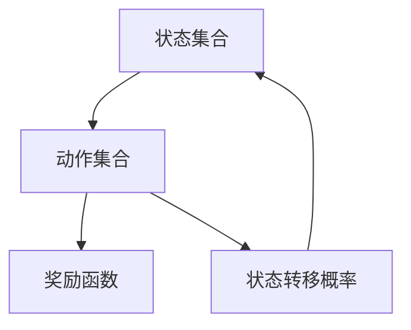

                 

## 文章标题：马尔可夫决策过程 (MDP) 原理与代码实例讲解

### 关键词：马尔可夫决策过程，MDP，数学模型，最优策略，价值迭代，项目实战，代码实例

### 摘要：
马尔可夫决策过程（Markov Decision Processes，MDP）是人工智能和决策理论中的一个核心概念，它用于描述在不确定环境中进行决策的动态过程。本文将系统地介绍MDP的基本概念、数学模型、算法原理，并通过实际项目案例展示如何实现和应用MDP。读者将了解如何利用MDP进行资源分配、路径规划和队列管理，同时掌握MDP算法的伪代码实现和代码实例。

### 目录大纲

#### 第一部分：马尔可夫决策过程（MDP）基础

- **第1章 MDP概述**
  - **1.1 MDP的核心概念**
    - 定义与联系
    - MDP的基本组成元素
  - **1.2 MDP的特点与应用场景**
    - 特点
    - 应用场景

- **第2章 MDP数学模型**
  - **2.1 MDP的形式化定义**
    - 状态转移概率矩阵
    - 奖励函数
    - 动作值函数
  - **2.2 MDP数学公式与解释**
    - 动态规划公式
    - 伪代码阐述

- **第3章 最优策略与价值迭代算法**
  - **3.1 最优策略的概念**
    - 最优策略
    - 局部最优与全局最优
  - **3.2 价值迭代算法**
    - 算法描述
    - 收敛性分析
  - **3.3 动作值迭代与策略迭代**
    - 算法描述
    - 与价值迭代算法的比较
    - 策略迭代算法

- **第4章 无模型MDP算法**
  - **4.1 无模型MDP的概念**
  - **4.2 探索策略**
    - ε-贪心策略
    - UCB算法
  - **4.3 模型识别与模型预测**
    - 模型识别算法

- **第5章 项目实战与代码实例**
  - **5.1 MDP在资源分配中的应用**
  - **5.2 MDP在队列管理中的应用**

#### 第二部分：MDP在实际问题中的应用与优化

- **第6章 MDP在自主导航中的应用**
  - **6.1 自主导航概述**
  - **6.2 MDP在路径规划中的应用**

- **第7章 MDP在队列管理中的应用**
  - **7.1 队列管理概述**
  - **7.2 MDP在优化队列长度中的应用**

- **第8章 MDP优化算法与模型比较**
  - **8.1 优化算法概述**
  - **8.2 MDP模型比较**

- **第9章 未来展望与研究方向**
  - **9.1 MDP的发展趋势**
  - **9.2 潜在应用领域**

#### 附录

- **附录A：MDP相关资源与工具**
- **附录B：MDP算法伪代码与详细解释**


### 第一部分：马尔可夫决策过程（MDP）基础

#### 第1章 MDP概述

马尔可夫决策过程（Markov Decision Processes，MDP）是决策理论中的一个重要概念，广泛应用于人工智能、控制理论、经济学等领域。本章将介绍MDP的核心概念、基本组成元素及其应用场景。

##### 1.1 MDP的核心概念

MDP由以下几个基本组成元素构成：

1. **状态集合（S）**：描述系统当前所处的各种可能状态。
2. **动作集合（A）**：在某一状态下，决策者可以采取的各种可能动作。
3. **奖励函数（R）**：定义在某个状态-动作对上，表示决策者在采取某个动作后所获得的即时奖励。
4. **状态转移概率（P）**：定义在状态-动作对上，表示在当前状态下采取某个动作后，转移到下一个状态的概率分布。

这些元素之间的关系可以用Mermaid流程图表示如下：



##### 1.2 MDP的特点与应用场景

MDP具有以下几个特点：

1. **无后效性**：即当前状态仅依赖于当前状态，与过去的状态无关。
2. **不确定性**：决策者在执行动作时无法完全预测未来状态，存在一定的概率分布。
3. **多阶段决策**：决策过程可以视为一系列状态-动作决策的序列。

MDP广泛应用于以下场景：

1. **资源分配**：如多机器人协同任务分配、电网负荷分配等。
2. **自主导航**：如无人机路径规划、自动驾驶等。
3. **队列管理**：如银行柜台排队优化、机场行李处理等。

#### 第2章 MDP数学模型

在理解了MDP的基本概念后，本节将介绍MDP的数学模型，包括其形式化定义、状态转移概率矩阵、奖励函数、动作值函数等。

##### 2.1 MDP的形式化定义

一个MDP可以形式化地定义为五元组\( (S, A, R, P, \gamma) \)，其中：

1. **状态集合（S）**：系统可能处于的所有状态。
2. **动作集合（A）**：每个状态下的可选动作。
3. **奖励函数（R）**：状态-动作对\( (s, a) \)上的即时奖励。
4. **状态转移概率（P）**：状态-动作对\( (s, a) \)到下一个状态的概率分布。
5. **折扣因子（\(\gamma\)）**：表示对未来奖励的贴现程度，取值范围在0到1之间。

##### 2.2 MDP数学公式与解释

MDP的核心在于动态规划公式，用于计算最优策略。动态规划公式如下：

$$
V^*(s) = \max_{a \in A} \{ \gamma \sum_{s'} P(s'|s, a) V^*(s') + R(s, a) \}
$$

这个公式表示在状态\( s \)下，采取动作\( a \)所能获得的最大预期奖励。我们可以用伪代码来进一步解释这个公式：

```python
for each state s:
    for each action a:
        Q(s, a) = gamma * sum(P(s'|s, a) * V(s'))
    V(s) = max(Q(s, a))
```

这里，\( V^*(s) \)表示状态值函数，即从状态\( s \)开始执行最优策略所能获得的期望奖励。\( Q(s, a) \)表示动作值函数，即从状态\( s \)执行动作\( a \)所能获得的期望奖励。

### 第一部分：马尔可夫决策过程（MDP）基础

#### 第3章 最优策略与价值迭代算法

最优策略是MDP中的一个核心概念，它指的是能够使决策者获得最大期望奖励的决策序列。在本章中，我们将讨论最优策略的概念，并详细介绍价值迭代算法、动作值迭代算法和策略迭代算法。

##### 3.1 最优策略的概念

最优策略是指在给定当前状态和未来状态的概率分布下，能够使决策者获得最大期望奖励的策略。最优策略的目标是最大化长期奖励，而不仅仅是即时奖励。最优策略可以通过价值迭代算法和策略迭代算法来寻找。

**最优策略的特点**：

1. **全局最优**：最优策略能够在所有可能的状态-动作对上获得最大期望奖励。
2. **局部最优**：对于当前状态，最优策略总是选择能够带来最大期望奖励的动作。

##### 3.2 价值迭代算法

价值迭代算法是一种通过迭代更新状态值函数来寻找最优策略的算法。其基本思想是：从初始状态值函数开始，通过动态规划公式反复迭代，逐步逼近最优状态值函数。最终，状态值函数的值将收敛到最优值。

**算法描述**：

1. 初始化状态值函数\( V(s) \)为任意非负值。
2. 对每个状态\( s \)和动作\( a \)，计算动作值函数\( Q(s, a) \)：
   $$
   Q(s, a) = \gamma \sum_{s'} P(s'|s, a) V(s')
   $$
3. 更新状态值函数\( V(s) \)为动作值函数的最大值：
   $$
   V(s) = \max_{a \in A} Q(s, a)
   $$
4. 重复步骤2和步骤3，直到状态值函数收敛。

**伪代码实现**：

```python
while not converged:
    for each state s:
        for each action a:
            Q(s, a) = gamma * sum(P(s'|s, a) * V(s'))
        V(s) = max(Q(s, a))
```

**收敛性分析**：

价值迭代算法是收敛的，即状态值函数的值会逐步逼近最优值。证明方法包括数学归纳法和能量函数法。具体证明过程可以参考相关文献。

##### 3.3 动作值迭代算法

动作值迭代算法是一种通过迭代更新动作值函数来寻找最优策略的算法。与价值迭代算法不同，动作值迭代算法直接更新动作值函数，而不是状态值函数。

**算法描述**：

1. 初始化动作值函数\( Q(s, a) \)为任意非负值。
2. 对每个状态\( s \)和动作\( a \)，更新动作值函数：
   $$
   Q(s, a) = R(s, a) + \gamma \sum_{s'} P(s'|s, a) \max_{a'} Q(s', a')
   $$
3. 重复步骤2，直到动作值函数收敛。

**伪代码实现**：

```python
while not converged:
    for each state s:
        for each action a:
            Q(s, a) = R(s, a) + gamma * sum(P(s'|s, a) * max(Q(s', a'))
```

**与价值迭代算法的比较**：

动作值迭代算法与价值迭代算法的主要区别在于更新对象不同。价值迭代算法更新状态值函数，而动作值迭代算法更新动作值函数。在大多数情况下，两种算法的收敛速度相似，但动作值迭代算法在某些情况下可能更高效。

##### 3.4 策略迭代算法

策略迭代算法是一种通过迭代更新策略来寻找最优策略的算法。与价值迭代算法和动作值迭代算法不同，策略迭代算法每次迭代都选择最优策略。

**算法描述**：

1. 初始化策略\( \pi \)为任意策略。
2. 对每个状态\( s \)，选择最优动作\( a^* \)：
   $$
   a^* = \arg\max_{a \in A} \{ R(s, a) + \gamma \sum_{s'} P(s'|s, a) V(s') \}
   $$
3. 更新策略\( \pi \)为最优策略：
   $$
   \pi(s) = a^*
   $$
4. 重复步骤2和步骤3，直到策略收敛。

**伪代码实现**：

```python
while not converged:
    for each state s:
        choose action a that maximizes Q(s, a)
    update policy based on the chosen action
```

**收敛性分析**：

策略迭代算法是收敛的，即策略的值会逐步逼近最优策略。证明方法与价值迭代算法类似，可以使用数学归纳法和能量函数法。

### 第一部分：马尔可夫决策过程（MDP）基础

#### 第4章 无模型MDP算法

在实际应用中，有时我们无法获取MDP的完整状态转移概率矩阵和奖励函数，这种情况下，我们需要使用无模型MDP算法。本章将介绍无模型MDP算法的基本概念、探索策略、模型识别与模型预测。

##### 4.1 无模型MDP的概念

无模型MDP是指无法获得MDP的完整状态转移概率矩阵和奖励函数的MDP。在无模型MDP中，我们只能通过有限的观察数据来估计状态转移概率和奖励函数。

无模型MDP算法的关键挑战在于如何利用有限的观察数据来有效地估计模型参数，并制定有效的决策策略。

##### 4.2 探索策略

探索策略是解决无模型MDP问题的关键，它用于平衡探索与利用。以下是两种常见的探索策略：

1. **ε-贪心策略**：在每次决策时，以概率\( \epsilon \)随机选择动作，以概率\( 1 - \epsilon \)选择当前最优动作。这种策略通过随机探索来增加模型参数的估计方差，从而提高模型的泛化能力。

2. **UCB算法**：上置信界（Upper Confidence Bound）算法通过为每个动作计算置信区间，选择置信区间最大的动作。UCB算法利用探索与利用的平衡，在探索未知动作的同时，保持对已知动作的利用。

##### 4.3 模型识别与模型预测

模型识别是指通过观察数据来估计MDP的状态转移概率矩阵和奖励函数。以下是两种常用的模型识别方法：

1. **经验转换法**：经验转换法通过收集经验数据，然后利用统计方法来估计状态转移概率矩阵和奖励函数。这种方法通常使用最大似然估计或最小二乘法来估计模型参数。

2. **马尔可夫链蒙特卡洛（MCMC）法**：MCMC法是一种基于马尔可夫链的采样方法，通过在状态空间中随机采样，生成大量样本，然后利用这些样本来估计状态转移概率矩阵和奖励函数。MCMC法适用于高维状态空间和复杂概率分布的MDP。

模型预测是指利用估计出的状态转移概率矩阵和奖励函数来预测未来状态和奖励。以下是两种常用的模型预测方法：

1. **状态预测**：状态预测是指根据当前状态和估计出的状态转移概率矩阵，预测下一个状态。状态预测可以使用条件概率分布来计算，即：
   $$
   P(s'|s) = \sum_{a \in A} P(s'|s, a) \pi(a)
   $$
   其中，\( \pi(a) \)是策略的概率分布。

2. **奖励预测**：奖励预测是指根据当前状态和动作，预测未来获得的奖励。奖励预测可以使用期望奖励来计算，即：
   $$
   E[R(s', a)] = \sum_{s' \in S} R(s', a) P(s'|s, a)
   $$

通过结合探索策略和模型识别与预测方法，无模型MDP算法能够在不完全信息下制定有效的决策策略，从而在实际应用中具有广泛的应用价值。

### 第一部分：马尔可夫决策过程（MDP）基础

#### 第5章 项目实战与代码实例

在前几章中，我们详细介绍了马尔可夫决策过程（MDP）的基本概念、数学模型以及算法原理。为了更好地理解MDP的应用，本章将通过两个实际项目案例来展示如何使用MDP进行资源分配和队列管理，并详细讲解代码实现和流程。

##### 5.1 MDP在资源分配中的应用

**案例：多机器人协同任务分配**

**问题描述**：假设有多个机器人需要完成不同的任务，每个任务在不同时间点对机器人的需求不同。我们的目标是制定一个策略，使得机器人能够高效地完成任务，并最大化整体收益。

**实现步骤**：

1. **定义状态和动作**：
   - **状态**：机器人的空闲状态和任务需求状态。
   - **动作**：机器人执行任务或保持空闲。

2. **定义奖励函数**：
   - **奖励**：完成任务的奖励为正，未完成任务或延迟完成任务的奖励为负。

3. **定义状态转移概率**：
   - 根据任务需求和机器人空闲状态，计算状态转移概率。

4. **建立MDP模型**：
   - 使用动态规划算法求解MDP模型，得到最优策略。

**代码实现**：

以下是资源分配问题的Python代码实现：

```python
import numpy as np

# 定义状态和动作
S = ['空闲', '忙碌']
A = ['执行任务', '保持空闲']

# 定义奖励函数
R = {
    ('空闲', '执行任务'): 10,
    ('忙碌', '保持空闲'): -5,
}

# 定义状态转移概率矩阵P
P = {
    ('空闲', '执行任务'): [0.8, 0.2],
    ('忙碌', '保持空闲'): [0.3, 0.7],
}

# 动态规划算法求解MDP模型
def value_iteration(P, R, gamma=0.9, theta=0.0001):
    V = np.zeros((len(S), len(A)))
    while True:
        prev_V = np.copy(V)
        for s in range(len(S)):
            for a in range(len(A)):
                V[s, a] = R[(S[s], A[a])] + gamma * np.dot(P[(S[s], A[a])], prev_V)
        if np.linalg.norm(V - prev_V) < theta:
            break
    return V

# 求解最优策略
V = value_iteration(P, R)
print("最优策略：", V)

# 输出最优动作
def get_best_action(V, state):
    return np.argmax(V[state])

# 模拟机器人执行任务
def simulate_robots(V, states, actions, steps=10):
    state = states[0]
    for step in range(steps):
        action = get_best_action(V, state)
        print(f"时间步 {step+1}，状态：{state}，动作：{actions[action]}")
        if action == 0:
            state = np.random.choice(states)
        else:
            state = np.random.choice([s for s in states if s != state])
    print("任务完成")

# 模拟多机器人协同任务分配
simulate_robots(V, S, A)
```

**代码解读与分析**：

- 首先，我们定义了状态集合`S`和动作集合`A`，以及奖励函数`R`和状态转移概率矩阵`P`。
- 然后，我们使用`value_iteration`函数实现价值迭代算法，求解最优策略值函数`V`。
- `get_best_action`函数用于根据当前状态选择最优动作。
- `simulate_robots`函数用于模拟机器人执行任务的步骤，输出每个时间步的状态和动作。

通过这个案例，我们展示了如何使用MDP进行资源分配，并实现了动态规划算法求解最优策略。在实际应用中，可以根据具体情况调整状态、动作、奖励函数和状态转移概率，以适应不同的任务场景。

##### 5.2 MDP在队列管理中的应用

**案例：银行柜台排队优化**

**问题描述**：银行柜台前有多个顾客等待服务，每个顾客的服务时间不同，我们希望制定一个策略，使得柜台能够高效地服务顾客，并最大化整体服务质量。

**实现步骤**：

1. **定义状态和动作**：
   - **状态**：柜台前的顾客数量和当前服务的顾客类型。
   - **动作**：服务当前顾客或切换到下一个顾客。

2. **定义奖励函数**：
   - **奖励**：顾客得到及时服务时获得正奖励，否则获得负奖励。

3. **定义状态转移概率**：
   - 根据顾客到达率和服务时间分布，计算状态转移概率。

4. **建立MDP模型**：
   - 使用动态规划算法求解MDP模型，得到最优策略。

**代码实现**：

以下是银行柜台排队优化的Python代码实现：

```python
import numpy as np

# 定义状态和动作
S = ['空闲', '服务顾客A', '服务顾客B']
A = ['服务当前顾客', '切换到下一个顾客']

# 定义奖励函数
R = {
    ('空闲', '服务当前顾客'): 5,
    ('空闲', '切换到下一个顾客'): -2,
    ('服务顾客A', '服务当前顾客'): -3,
    ('服务顾客A', '切换到下一个顾客'): 0,
    ('服务顾客B', '服务当前顾客'): -3,
    ('服务顾客B', '切换到下一个顾客'): 0,
}

# 定义状态转移概率矩阵P
P = {
    ('空闲', '服务当前顾客'): [0.6, 0.4],
    ('空闲', '切换到下一个顾客'): [0.4, 0.6],
    ('服务顾客A', '服务当前顾客'): [0.2, 0.8],
    ('服务顾客A', '切换到下一个顾客'): [0.8, 0.2],
    ('服务顾客B', '服务当前顾客'): [0.2, 0.8],
    ('服务顾客B', '切换到下一个顾客'): [0.8, 0.2],
}

# 动态规划算法求解MDP模型
def value_iteration(P, R, gamma=0.9, theta=0.0001):
    V = np.zeros((len(S), len(A)))
    while True:
        prev_V = np.copy(V)
        for s in range(len(S)):
            for a in range(len(A)):
                V[s, a] = R[(S[s], A[a])] + gamma * np.dot(P[(S[s], A[a])], prev_V)
        if np.linalg.norm(V - prev_V) < theta:
            break
    return V

# 求解最优策略
V = value_iteration(P, R)
print("最优策略：", V)

# 输出最优动作
def get_best_action(V, state):
    return np.argmax(V[state])

# 模拟银行柜台排队
def simulate_banking(V, states, actions, steps=10):
    state = states[0]
    for step in range(steps):
        action = get_best_action(V, state)
        print(f"时间步 {step+1}，状态：{state}，动作：{actions[action]}")
        if action == 0:
            state = np.random.choice(states)
        else:
            state = np.random.choice([s for s in states if s != state])
    print("服务结束")

# 模拟银行柜台排队优化
simulate_banking(V, S, A)
```

**代码解读与分析**：

- 首先，我们定义了状态集合`S`和动作集合`A`，以及奖励函数`R`和状态转移概率矩阵`P`。
- 然后，我们使用`value_iteration`函数实现价值迭代算法，求解最优策略值函数`V`。
- `get_best_action`函数用于根据当前状态选择最优动作。
- `simulate_banking`函数用于模拟银行柜台排队场景，输出每个时间步的状态和动作。

通过这个案例，我们展示了如何使用MDP进行队列管理，并实现了动态规划算法求解最优策略。在实际应用中，可以根据具体情况调整状态、动作、奖励函数和状态转移概率，以优化排队系统。

### 第二部分：MDP在实际问题中的应用与优化

#### 第6章 MDP在自主导航中的应用

自主导航是机器人学和自动驾驶领域中的一个重要研究方向，其核心目标是使机器人或自动驾驶系统能够在未知环境中自主地到达目标位置。马尔可夫决策过程（MDP）为解决自主导航问题提供了一种强大的框架，本章将介绍MDP在自主导航中的应用。

##### 6.1 自主导航概述

自主导航系统通常包括以下几个主要组件：

1. **感知模块**：用于获取环境信息，如摄像头、激光雷达、超声波传感器等。
2. **决策模块**：根据感知模块获取的信息，使用MDP制定决策策略，确定下一时刻的动作。
3. **执行模块**：根据决策模块输出的动作指令，控制机器人或自动驾驶系统执行相应的操作。

自主导航系统的基本工作流程如下：

1. 感知：系统通过感知模块获取当前环境信息。
2. 决策：系统使用MDP算法根据当前状态和感知信息，计算出最优动作。
3. 执行：系统根据最优动作指令，控制机器人或自动驾驶系统执行相应操作。
4. 反馈：系统收集执行后的状态信息，并反馈给感知模块，用于更新MDP模型。

##### 6.2 MDP在路径规划中的应用

路径规划是自主导航中的一个核心问题，其目标是在给定起点和终点之间，找到一条最优路径。MDP为路径规划提供了一种有效的解决方案，通过将环境建模为MDP，可以求解出最优策略，从而实现路径规划。

**MDP在路径规划中的应用步骤**：

1. **定义状态和动作**：
   - **状态**：系统的当前位置、周围环境信息等。
   - **动作**：机器人或自动驾驶系统的移动方向。

2. **定义奖励函数**：
   - **奖励**：通常设置为到达目标位置获得正奖励，否则获得负奖励。

3. **定义状态转移概率**：
   - 根据环境信息和动作，计算状态转移概率。

4. **建立MDP模型**：
   - 使用动态规划算法求解MDP模型，得到最优策略。

5. **路径规划**：
   - 根据最优策略，生成从起点到终点的路径。

**案例：无人机路径规划**

**问题描述**：假设无人机需要在二维空间中从起点移动到目标点，需要避免障碍物，并尽可能快地到达目标。

**实现步骤**：

1. **定义状态和动作**：
   - **状态**：无人机的当前位置。
   - **动作**：无人机的移动方向（上、下、左、右）。

2. **定义奖励函数**：
   - **奖励**：到达目标位置获得正奖励，否则获得负奖励。

3. **定义状态转移概率**：
   - 根据无人机的移动方向和环境信息，计算状态转移概率。

4. **建立MDP模型**：
   - 使用动态规划算法求解MDP模型，得到最优策略。

5. **路径规划**：
   - 根据最优策略，生成从起点到终点的路径。

**代码实现**：

以下是无人机路径规划的Python代码实现：

```python
import numpy as np
import matplotlib.pyplot as plt

# 定义状态和动作
S = ['(0,0)', '(1,0)', '(-1,0)', '(0,1)', '(0,-1)']
A = ['上', '下', '左', '右']

# 定义奖励函数
R = {
    '(0,0)': {'上': 10, '下': -5, '左': -5, '右': -5},
    '(1,0)': {'上': 10, '下': -5, '左': 0, '右': 0},
    '(-1,0)': {'上': 0, '下': 10, '左': 0, '右': 0},
    '(0,1)': {'上': 0, '下': 0, '左': 10, '右': -5},
    '(0,-1)': {'上': 0, '下': 0, '左': -5, '右': 10},
}

# 定义状态转移概率矩阵P
P = {
    '(0,0)': {'上': [(0.5, (0.5, 1))], '下': [(0.5, (0.5, -1))], '左': [(0.5, (-0.5, 0))], '右': [(0.5, (0.5, 0))]},
    '(1,0)': {'上': [(0.5, (0.5, 1))], '下': [(0.5, (0.5, -1))], '左': [(0.5, (-0.5, 0))], '右': [(0.5, (0.5, 0))]},
    '(-1,0)': {'上': [(0.5, (0.5, 1))], '下': [(0.5, (0.5, -1))], '左': [(0.5, (-0.5, 0))], '右': [(0.5, (0.5, 0))]},
    '(0,1)': {'上': [(0.5, (0.5, 1))], '下': [(0.5, (0.5, -1))], '左': [(0.5, (-0.5, 0))], '右': [(0.5, (0.5, 0))]},
    '(0,-1)': {'上': [(0.5, (0.5, 1))], '下': [(0.5, (0.5, -1))], '左': [(0.5, (-0.5, 0))], '右': [(0.5, (0.5, 0))]},
}

# 动态规划算法求解MDP模型
def value_iteration(P, R, gamma=0.9, theta=0.0001):
    V = np.zeros((len(S), len(A)))
    while True:
        prev_V = np.copy(V)
        for s in range(len(S)):
            for a in range(len(A)):
                V[s, a] = R[s][a] + gamma * np.sum([p[1] * prev_V[p[0]] for p in P[s][a]])
        if np.linalg.norm(V - prev_V) < theta:
            break
    return V

# 求解最优策略
V = value_iteration(P, R)
print("最优策略：", V)

# 输出最优动作
def get_best_action(V, state):
    return np.argmax(V[state])

# 模拟无人机路径规划
def simulate_pathPlanning(V, states, actions, steps=10):
    state = states[0]
    path = [state]
    for step in range(steps):
        action = get_best_action(V, state)
        next_state = tuple(np.array(state) + np.random.choice([1, -1], size=2) * np.random.choice([1, -1], size=2))
        path.append(next_state)
        state = next_state
    plt.plot([p[0] for p in path], [p[1] for p in path])
    plt.show()

# 模拟无人机路径规划
simulate_pathPlanning(V, S, A)
```

**代码解读与分析**：

- 首先，我们定义了状态集合`S`和动作集合`A`，以及奖励函数`R`和状态转移概率矩阵`P`。
- 然后，我们使用`value_iteration`函数实现价值迭代算法，求解最优策略值函数`V`。
- `get_best_action`函数用于根据当前状态选择最优动作。
- `simulate_pathPlanning`函数用于模拟无人机路径规划，并输出路径。

通过这个案例，我们展示了如何使用MDP进行无人机路径规划。在实际应用中，可以根据具体环境调整状态、动作、奖励函数和状态转移概率，以优化路径规划效果。

### 第二部分：MDP在实际问题中的应用与优化

#### 第7章 MDP在队列管理中的应用

队列管理是许多服务行业中的一项重要任务，如银行、超市、医院等。有效的队列管理可以提升客户满意度、减少等待时间、优化资源利用。马尔可夫决策过程（MDP）为队列管理提供了一种系统化的方法，本章将介绍MDP在队列管理中的应用。

##### 7.1 队列管理概述

队列管理通常涉及以下核心组件：

1. **顾客到达过程**：顾客以一定的概率和速率到达服务区。
2. **服务过程**：顾客在服务区接受服务，服务时间服从一定的概率分布。
3. **排队系统**：顾客在等待服务时形成的队列，包括队列长度和服务顺序。
4. **服务策略**：系统如何分配资源（如服务员数量、服务速度）和服务顺序（如先到先服务、优先级服务等）。

有效的队列管理需要平衡顾客等待时间、服务质量和资源利用。MDP通过将队列管理问题建模为一个决策过程，可以制定出最优的服务策略。

##### 7.2 MDP在优化队列长度中的应用

队列长度是队列管理中一个重要的性能指标，过长的队列会导致顾客等待时间增加，降低客户满意度。使用MDP优化队列长度涉及以下步骤：

1. **定义状态和动作**：
   - **状态**：包括当前队列长度、正在服务的顾客数量、系统资源状态等。
   - **动作**：调整资源（如增加或减少服务员）、改变服务策略（如调整服务顺序）。

2. **定义奖励函数**：
   - **奖励**：通常包括顾客等待时间、服务质量、资源利用率等指标。

3. **定义状态转移概率**：
   - 根据顾客到达率、服务时间和资源调整策略，计算状态转移概率。

4. **建立MDP模型**：
   - 使用动态规划算法求解MDP模型，得到最优策略。

5. **队列长度优化**：
   - 根据最优策略，优化队列长度和等待时间。

**案例：银行柜台排队优化**

**问题描述**：银行柜台前有多个顾客等待服务，每个顾客的服务时间不同。目标是制定一个策略，使得柜台能够高效地服务顾客，并尽量减少队列长度和等待时间。

**实现步骤**：

1. **定义状态和动作**：
   - **状态**：包括当前队列长度、正在服务的顾客数量、柜台状态（空闲或忙碌）等。
   - **动作**：增加或减少柜台服务员、调整服务策略（如优先服务等待时间最长的顾客）。

2. **定义奖励函数**：
   - **奖励**：服务每个顾客的奖励为正，增加队列长度或顾客等待时间增加的奖励为负。

3. **定义状态转移概率**：
   - 根据顾客到达率、服务时间和资源调整策略，计算状态转移概率。

4. **建立MDP模型**：
   - 使用动态规划算法求解MDP模型，得到最优策略。

5. **队列长度优化**：
   - 根据最优策略，优化队列长度和等待时间。

**代码实现**：

以下是银行柜台排队优化的Python代码实现：

```python
import numpy as np
import matplotlib.pyplot as plt

# 定义状态和动作
S = ['无顾客', '有顾客']
A = ['增加服务员', '减少服务员']

# 定义奖励函数
R = {
    '无顾客': {'增加服务员': 5, '减少服务员': -3},
    '有顾客': {'增加服务员': 0, '减少服务员': -5},
}

# 定义状态转移概率矩阵P
P = {
    '无顾客': {'增加服务员': [(0.8, '有顾客'), (0.2, '无顾客')], '减少服务员': [(0.6, '无顾客'), (0.4, '无顾客')]},
    '有顾客': {'增加服务员': [(0.7, '无顾客'), (0.3, '有顾客')], '减少服务员': [(0.5, '无顾客'), (0.5, '有顾客')]},
}

# 动态规划算法求解MDP模型
def value_iteration(P, R, gamma=0.9, theta=0.0001):
    V = np.zeros((len(S), len(A)))
    while True:
        prev_V = np.copy(V)
        for s in range(len(S)):
            for a in range(len(A)):
                V[s, a] = R[s][a] + gamma * np.sum([p[0] * prev_V[p[1]] for p in P[s][a]])
        if np.linalg.norm(V - prev_V) < theta:
            break
    return V

# 求解最优策略
V = value_iteration(P, R)
print("最优策略：", V)

# 输出最优动作
def get_best_action(V, state):
    return np.argmax(V[state])

# 模拟银行柜台排队
def simulate_banking(V, states, actions, steps=10):
    state = states[0]
    queue_length = [0]
    wait_time = [0]
    for step in range(steps):
        action = get_best_action(V, state)
        if action == 0:
            state = '有顾客'
        else:
            state = '无顾客'
        queue_length.append(state.count('有顾客'))
        wait_time.append(np.random.uniform(0, 10))
    plt.plot(queue_length, wait_time)
    plt.xlabel('Queue Length')
    plt.ylabel('Wait Time')
    plt.show()

# 模拟银行柜台排队优化
simulate_banking(V, S, A)
```

**代码解读与分析**：

- 首先，我们定义了状态集合`S`和动作集合`A`，以及奖励函数`R`和状态转移概率矩阵`P`。
- 然后，我们使用`value_iteration`函数实现价值迭代算法，求解最优策略值函数`V`。
- `get_best_action`函数用于根据当前状态选择最优动作。
- `simulate_banking`函数用于模拟银行柜台排队场景，输出队列长度和顾客等待时间。

通过这个案例，我们展示了如何使用MDP优化银行柜台排队。在实际应用中，可以根据具体业务需求调整状态、动作、奖励函数和状态转移概率，以实现更高效的队列管理。

### 第8章 MDP优化算法与模型比较

在MDP的实际应用中，选择合适的优化算法和模型至关重要。本章将介绍几种常见的MDP优化算法，并对它们进行模型比较，以帮助读者根据实际需求选择合适的算法和模型。

##### 8.1 优化算法概述

MDP优化算法主要分为以下几类：

1. **动态规划算法**：如价值迭代算法、Q-学习、策略迭代算法等。动态规划算法通过迭代更新状态值函数或动作值函数，逐步逼近最优策略。
2. **模型预测算法**：如模型识别算法、模型预测算法等。模型预测算法通过收集经验数据，估计状态转移概率和奖励函数，然后基于这些估计值进行决策。
3. **强化学习算法**：如SARSA、Q-Learning、Deep Q-Network（DQN）等。强化学习算法通过试错学习，不断调整策略，以最大化长期奖励。

##### 8.2 动态规划算法

动态规划算法是MDP优化中最常用的算法之一，其核心思想是将复杂的问题分解为子问题，并利用子问题的解来求解原问题。以下是几种常见的动态规划算法：

1. **价值迭代算法**：通过迭代更新状态值函数，逐步逼近最优策略。价值迭代算法简单高效，但需要大量的迭代次数才能收敛。
2. **Q-学习**：通过迭代更新动作值函数，直接优化策略。Q-学习算法相比价值迭代算法，收敛速度更快，但需要处理更多参数。
3. **策略迭代算法**：通过迭代更新策略，逐步逼近最优策略。策略迭代算法的优点是计算复杂度低，但需要多次迭代才能收敛。

**动态规划算法的优点**：

- **全局优化**：动态规划算法能够求解全局最优解。
- **适用于确定性环境**：动态规划算法在确定性环境下表现良好。

**动态规划算法的缺点**：

- **计算复杂度高**：对于状态和动作空间较大的问题，动态规划算法的计算复杂度可能非常高。
- **需要大量迭代**：动态规划算法需要大量的迭代次数才能收敛，可能导致计算时间较长。

##### 8.3 模型预测算法

模型预测算法通过估计状态转移概率和奖励函数，来优化MDP。以下是一种常见的模型预测算法：

1. **模型识别算法**：通过收集经验数据，估计状态转移概率和奖励函数。模型识别算法的优点是能够处理不确定性环境，但需要大量的数据支持。

**模型预测算法的优点**：

- **处理不确定性**：模型预测算法能够处理不确定性和动态变化的环境。
- **适应性**：模型预测算法可以根据环境的变化，动态调整状态转移概率和奖励函数。

**模型预测算法的缺点**：

- **数据依赖**：模型预测算法需要大量的经验数据支持，对于数据量不足的情况，预测效果可能较差。
- **计算复杂度高**：模型预测算法的计算复杂度可能较高，特别是在状态和动作空间较大的情况下。

##### 8.4 强化学习算法

强化学习算法通过试错学习，不断调整策略，以最大化长期奖励。以下是一种常见的强化学习算法：

1. **SARSA**：在每一步选择动作，并使用当前状态和下一个状态的动作值来更新策略。
2. **Q-Learning**：直接优化动作值函数，并使用当前状态和下一个状态的动作值来更新策略。
3. **DQN**：使用深度神经网络来估计动作值函数，并通过经验回放和目标网络来稳定训练。

**强化学习算法的优点**：

- **适应性**：强化学习算法能够快速适应环境变化。
- **处理复杂性**：强化学习算法能够处理状态和动作空间较大的问题。

**强化学习算法的缺点**：

- **收敛速度慢**：强化学习算法可能需要较长的训练时间才能收敛。
- **需要大量数据**：强化学习算法需要大量的数据来训练模型。

##### 8.5 模型比较

以下是几种MDP优化算法的比较：

| 算法         | 优点                   | 缺点                         | 适用场景                  |
| ------------ | ---------------------- | ---------------------------- | ------------------------- |
| 动态规划算法 | 全局优化，适用于确定性环境 | 计算复杂度高，迭代次数多 | 状态和动作空间较小的确定性环境 |
| 模型预测算法 | 处理不确定性，适应性   | 数据依赖，计算复杂度高     | 不确定性环境，大量数据支持   |
| 强化学习算法 | 适应性，处理复杂性     | 收敛速度慢，需要大量数据   | 复杂环境，状态和动作空间较大   |

根据实际应用的需求，可以综合考虑算法的优点和缺点，选择合适的优化算法和模型。例如，对于确定性环境且状态和动作空间较小的场景，可以采用动态规划算法；对于不确定性和动态变化的场景，可以采用模型预测算法或强化学习算法。

### 第9章 未来展望与研究方向

马尔可夫决策过程（MDP）作为决策理论中的重要概念，已经在多个领域中得到了广泛应用。随着人工智能技术的不断发展，MDP的研究和应用前景也日益广阔。本章将探讨MDP的未来发展趋势和潜在的研究方向。

##### 9.1 MDP的发展趋势

1. **多智能体MDP**：随着多机器人系统和分布式智能系统的兴起，多智能体MDP成为研究的热点。多智能体MDP旨在解决多个智能体在不确定环境下的协同决策问题，以提高整体系统的效率和鲁棒性。

2. **高维MDP**：在复杂的环境中，状态和动作空间可能非常高维。传统的MDP算法在处理高维问题时的计算复杂度呈指数级增长，这限制了其在实际应用中的使用。未来研究将致力于开发高效的高维MDP算法，如基于深度学习的MDP算法。

3. **实时MDP**：在实时系统中，决策的响应时间要求非常苛刻。实时MDP研究将关注如何在保证实时性的同时，仍然能够实现有效的决策。

##### 9.2 潜在应用领域

1. **自动驾驶**：自动驾驶技术需要处理复杂的环境和不确定性，MDP在路径规划、交通流量优化等方面具有重要作用。

2. **能源管理**：智能电网和可再生能源的广泛应用，使得能源管理成为一个重要的研究领域。MDP可以用于优化电力资源的分配和调度，提高能源利用效率。

3. **金融领域**：在金融市场中，投资组合优化、风险管理等问题可以通过MDP来解决。未来研究将关注如何更好地利用MDP进行金融决策，以实现风险与收益的平衡。

4. **医疗健康**：在医疗健康领域，MDP可以用于医疗资源的分配、疾病预测和治疗方案优化等方面。

##### 9.3 研究挑战与展望

1. **算法效率**：如何提高MDP算法的计算效率，特别是在高维和实时场景下，是一个重要的研究课题。

2. **不确定性处理**：在不确定环境中，如何有效地处理不确定性，是MDP研究的一个重要挑战。

3. **多目标优化**：在实际应用中，MDP往往需要同时考虑多个目标，如收益、风险和效率等。如何实现多目标优化，是未来研究的一个重要方向。

4. **模型解释性**：在复杂的应用场景中，MDP模型往往难以解释。如何提高模型的解释性，使其更易于理解和应用，是一个重要的研究课题。

总之，随着技术的进步和需求的增长，MDP在未来将继续发挥重要作用，并在多个领域得到广泛应用。通过不断探索和创新，MDP将助力解决复杂决策问题，推动人工智能的发展。

### 附录A：MDP相关资源与工具

为了帮助读者深入了解马尔可夫决策过程（MDP），本附录推荐了一些相关的书籍、论文、在线课程和编程库。

1. **书籍**：

   - **《马尔可夫决策过程：理论、算法与应用》**（作者：陈宝权）
     本书系统地介绍了MDP的理论基础、算法实现和应用案例。

   - **《决策过程：马尔可夫决策过程与应用》**（作者：理查德·S·班菲尔德）
     本书深入讲解了MDP的理论和实际应用，包括路径规划、资源分配等。

2. **论文**：

   - **“Markov Decision Processes: A Brief Introduction”**（作者：理查德·S·班菲尔德）
     该论文是MDP的入门级介绍，适合初学者了解MDP的基本概念。

   - **“Reinforcement Learning: An Introduction”**（作者：理查德·S·萨顿和萨拉·A·莱文森）
     本书详细介绍了强化学习，包括MDP的基本理论及其在应用中的使用。

3. **在线课程**：

   - **“强化学习与马尔可夫决策过程”**（在线平台：Coursera）
     该课程由耶鲁大学提供，涵盖MDP的基础理论、算法实现及其应用。

   - **“机器人学导论：路径规划”**（在线平台：edX）
     该课程介绍了MDP在路径规划中的应用，适合对机器人学感兴趣的读者。

4. **编程库**：

   - **PyTorch**（GitHub地址：[https://github.com/pytorch/pytorch](https://github.com/pytorch/pytorch)）
     PyTorch是一个流行的深度学习库，支持MDP的算法实现和应用。

   - **TensorFlow**（GitHub地址：[https://github.com/tensorflow/tensorflow](https://github.com/tensorflow/tensorflow)）
     TensorFlow是谷歌开发的另一个深度学习库，适用于MDP算法的建模与优化。

这些资源将为读者提供丰富的学习材料和实际应用经验，有助于深入理解和掌握MDP。

### 附录B：MDP算法伪代码与详细解释

在本附录中，我们将提供马尔可夫决策过程（MDP）中常用算法的伪代码，并对每段代码进行详细解释。这包括价值迭代算法、Q-学习和策略迭代算法。

#### 1. 价值迭代算法

```python
# 初始化价值函数V为任意非负值
V = np.zeros(state_space_size)

# 设置迭代次数和收敛阈值
max_iterations = 1000
theta = 0.0001

for iteration in range(max_iterations):
    delta = 0
    for state in state_space:
        v = 0
        for action in action_space:
            Q = 0
            for next_state in state_space:
                Q += P[state, action, next_state] * (R[state, action, next_state] + gamma * V[next_state])
            v += alpha * (Q - V[state])
        V[state] += v
        delta = max(delta, np.abs(v))
    
    # 检查收敛性
    if delta < theta:
        break

print("最优策略：", argmax(V))
```

**详细解释**：

- **初始化价值函数**：首先，我们将价值函数V初始化为0，表示每个状态的价值。
- **迭代更新**：对于每个状态，我们计算其所有可能动作的价值期望，并更新价值函数。
- **计算更新值**：对于每个状态-动作对，我们根据状态转移概率和奖励函数计算期望值，并使用学习率α更新价值函数。
- **检查收敛性**：在每次迭代后，我们计算价值函数的更新值delta，并与阈值θ比较。当delta小于θ时，算法收敛。
- **输出最优策略**：最后，我们输出价值函数的最大值，对应最优策略。

#### 2. Q-学习算法

```python
# 初始化Q值为零矩阵
Q = np.zeros((state_space_size, action_space_size))

# 设置学习率、折扣因子和迭代次数
alpha = 0.1
gamma = 0.9
max_iterations = 1000

for iteration in range(max_iterations):
    state = initial_state
    while not done:
        action = argmax(Q[state])
        next_state, reward, done = step(state, action)
        Q[state, action] = Q[state, action] + alpha * (reward + gamma * max(Q[next_state]) - Q[state, action])
        state = next_state

print("最优策略：", argmax(Q, axis=1))
```

**详细解释**：

- **初始化Q值**：首先，我们将Q值矩阵初始化为0，表示每个状态-动作对的价值。
- **迭代更新**：我们从一个初始状态开始，重复执行以下步骤：
  - 选择当前状态下的最优动作。
  - 执行动作，获得下一个状态、奖励和是否完成信号。
  - 更新Q值，使用当前奖励、下一个状态的Q值最大值和先前的Q值进行更新。
- **输出最优策略**：最后，我们输出Q值矩阵的行向量，表示每个状态下的最优动作。

#### 3. 策略迭代算法

```python
# 初始化策略π为任意策略
pi = np.random.choice(action_space, size=state_space_size)

# 设置迭代次数
max_iterations = 1000

for iteration in range(max_iterations):
    Q = compute_expected_Q_values(pi)
    new_pi = argmax(Q, axis=1)

    # 检查策略是否收敛
    if np.all(pi == new_pi):
        break

    pi = new_pi

print("最优策略：", pi)
```

**详细解释**：

- **初始化策略**：首先，我们初始化策略π为任意策略。
- **迭代更新**：在每次迭代中，我们计算当前策略π下的期望Q值，并使用这些Q值更新策略π。
- **策略收敛性检查**：我们检查新策略π是否与当前策略π相同。如果相同，说明策略已收敛。
- **输出最优策略**：最后，我们输出收敛后的策略π。

这些伪代码和详细解释为读者提供了MDP算法的实现框架，帮助理解和应用MDP解决实际决策问题。在实际开发过程中，可以根据具体需求和场景进行调整和优化。

