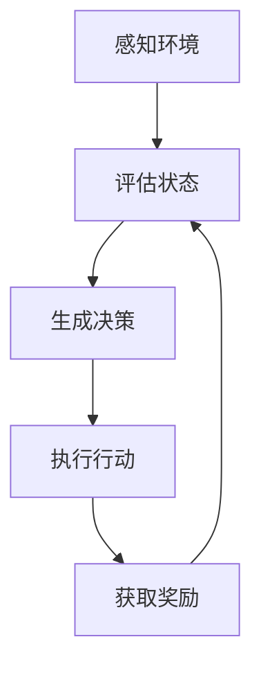

                 

```<sop>```


**文章标题：** AI Agent: AI的下一个风口 BabyAGI：根据任务结果自动创建、排序和执行新任务

**关键词：** AI Agent, BabyAGI, 强化学习, 监督学习, 自监督学习, 智能客服, 自动驾驶, 智能农业, 金融领域

**摘要：** 本文旨在探讨AI Agent，特别是BabyAGI（初级通用智能体）在人工智能领域的未来发展趋势。文章首先介绍了AI Agent的基本概念、架构、核心算法和数学模型，接着深入分析了BabyAGI的实现原理、方法及面临的挑战。随后，文章通过实际项目实战，展示了AI Agent与BabyAGI在智能客服、自动驾驶、智能农业和金融领域的应用，并给出了最佳实践建议。最后，文章总结全文，展望了AI Agent与BabyAGI在未来的发展方向和应用前景。

----------------------------------------------------------------

## 第一部分：AI Agent的基本概念与架构

### 第1章：AI Agent的定义与分类

#### 1.1.1 AI Agent的定义

AI Agent，即人工智能代理，是一种能够感知环境、自主决策并采取行动的智能实体。它在特定任务或场景中，通过学习与适应，能够不断优化其行为，以实现预定的目标。AI Agent的出现，标志着人工智能从被动响应向主动探索与行动的转变。

AI Agent的基本特征包括：

1. **感知环境**：通过传感器获取环境信息，如视觉、听觉、触觉等。
2. **自主决策**：基于环境信息和内部知识库，自主制定决策策略。
3. **行动执行**：根据决策策略，采取具体行动，影响环境。
4. **持续学习**：通过反馈和经验积累，不断优化自身行为。

#### 1.1.2 AI Agent的分类

根据AI Agent的应用场景和功能特点，可以分为以下几类：

1. **基于规则的AI Agent**：这类Agent通过预设的规则进行决策，适用于任务明确、规则清晰的环境。
2. **基于机器学习的AI Agent**：这类Agent通过学习环境中的数据，自主构建决策模型，适用于复杂、动态的环境。
3. **基于强化学习的AI Agent**：这类Agent通过与环境的交互，不断优化自身的决策策略，适用于需要长期学习与适应的任务。
4. **基于知识的AI Agent**：这类Agent通过知识库和推理机制进行决策，适用于需要知识引导和推理的任务。

#### 1.1.3 AI Agent的核心特征

AI Agent的核心特征包括：

1. **灵活性**：AI Agent能够适应不同的任务和场景，具备较强的泛化能力。
2. **自主性**：AI Agent能够自主感知环境、决策和行动，不受人类干预。
3. **学习能力**：AI Agent能够通过学习和经验积累，不断优化自身性能。
4. **适应性**：AI Agent能够在动态变化的环境中，调整自身策略和行为。

### 第2章：AI Agent的架构与组件

#### 2.1.1 知识表示与推理

知识表示与推理是AI Agent的核心组件之一。知识表示指的是将外部信息转换为计算机可以理解和处理的形式，常见的知识表示方法有符号表示、语义网络和知识图谱等。推理则是基于知识库中的知识，进行逻辑推理和推断，以获取新的信息。

在AI Agent中，知识表示与推理的作用包括：

1. **信息处理**：通过知识表示和推理，AI Agent能够对环境信息进行加工和处理，提取有用信息。
2. **决策支持**：基于推理结果，AI Agent能够为决策过程提供支持，优化决策效果。
3. **知识更新**：通过推理和反馈，AI Agent能够不断更新和修正知识库，提高自身能力。

#### 2.1.2 感知与运动控制

感知与运动控制是AI Agent实现自主行动的关键组件。感知是指通过传感器获取环境信息，如视觉、听觉、触觉等。运动控制则是指根据感知到的信息，通过执行机构（如电机、机器人臂等）采取相应行动。

在AI Agent中，感知与运动控制的作用包括：

1. **环境交互**：通过感知与运动控制，AI Agent能够与环境进行有效交互，获取资源和信息。
2. **任务执行**：基于感知到的环境信息，AI Agent能够采取相应行动，完成任务目标。
3. **自主导航**：在复杂环境中，AI Agent能够通过感知与运动控制，实现自主导航和路径规划。

#### 2.1.3 决策与规划

决策与规划是AI Agent实现自主行动的核心组件。决策是指基于环境信息和目标，选择最优行动策略。规划则是为了实现决策，制定具体的行动方案和时间表。

在AI Agent中，决策与规划的作用包括：

1. **目标导向**：通过决策与规划，AI Agent能够明确目标，制定行动策略，实现目标导向。
2. **资源优化**：通过规划，AI Agent能够合理安排资源和时间，提高任务执行效率。
3. **动态调整**：在任务执行过程中，AI Agent能够根据环境变化和反馈信息，动态调整行动策略。

### 第3章：AI Agent的核心算法

#### 3.1.1 强化学习算法

强化学习算法是AI Agent的核心算法之一。它通过与环境交互，不断调整策略，以实现最优决策。强化学习算法的主要过程包括：

1. **状态-动作价值函数**：通过评估状态-动作对的价值，为决策提供依据。
2. **策略迭代**：根据价值函数，迭代更新策略，实现优化。
3. **奖励机制**：通过奖励机制，激励AI Agent采取有益行动。

在AI Agent中，强化学习算法的作用包括：

1. **自适应学习**：通过不断调整策略，AI Agent能够适应动态变化的环境。
2. **优化决策**：通过价值函数评估，AI Agent能够选择最优行动策略。
3. **持续进步**：通过奖励机制，AI Agent能够持续进步，不断提高性能。

#### 3.1.2 监督学习算法

监督学习算法是AI Agent的另一种核心算法。它通过已有的标注数据进行学习，以预测新数据的标签。监督学习算法的主要过程包括：

1. **特征提取**：从输入数据中提取关键特征，用于模型训练。
2. **模型训练**：基于特征和标签，训练分类模型。
3. **预测标签**：使用训练好的模型，对新数据进行预测。

在AI Agent中，监督学习算法的作用包括：

1. **分类与识别**：通过监督学习，AI Agent能够对输入数据进行分类和识别。
2. **标签预测**：基于已有数据，AI Agent能够预测新数据的标签。
3. **数据挖掘**：通过监督学习，AI Agent能够从大量数据中提取有用信息。

#### 3.1.3 自监督学习算法

自监督学习算法是近年来兴起的一种AI Agent核心算法。它通过无监督学习，自动发现数据中的模式，为后续任务提供支持。自监督学习算法的主要过程包括：

1. **预训练**：通过无监督学习，对模型进行预训练，提取通用特征。
2. **微调**：基于预训练模型，在特定任务上进行微调，提高性能。
3. **自适应学习**：通过不断调整模型参数，实现自适应学习。

在AI Agent中，自监督学习算法的作用包括：

1. **通用特征提取**：通过预训练，AI Agent能够提取通用特征，提高模型泛化能力。
2. **任务适应性**：通过微调，AI Agent能够适应特定任务，提高性能。
3. **自适应学习**：通过自适应学习，AI Agent能够不断优化自身性能。

### 第4章：AI Agent的数学模型

#### 4.1.1 动机与目标函数

AI Agent的数学模型主要基于动机和目标函数进行构建。动机是指AI Agent在执行任务时的内在驱动，目标函数则是衡量任务完成度的指标。

在AI Agent中，动机与目标函数的作用包括：

1. **任务驱动**：通过动机，AI Agent能够明确任务目标，驱动自身行动。
2. **性能评估**：通过目标函数，AI Agent能够评估任务完成度，优化行动策略。

#### 4.1.2 状态空间与动作空间

状态空间是指AI Agent在执行任务过程中可能遇到的所有状态，动作空间则是AI Agent能够采取的所有行动。

在AI Agent中，状态空间与动作空间的作用包括：

1. **环境建模**：通过状态空间与动作空间，AI Agent能够对环境进行建模，理解任务需求。
2. **决策支持**：基于状态空间与动作空间，AI Agent能够选择最优行动，实现任务目标。

#### 4.1.3 奖励机制与策略

奖励机制是指AI Agent在执行任务时，根据任务完成度获得奖励的机制。策略则是AI Agent在执行任务时，选择行动的策略。

在AI Agent中，奖励机制与策略的作用包括：

1. **激励学习**：通过奖励机制，AI Agent能够激发学习兴趣，提高学习效率。
2. **策略优化**：基于奖励机制，AI Agent能够不断调整策略，实现最优决策。

### 第5章：AI Agent的Mermaid流程图

#### 5.1.1 AI Agent的工作流程

AI Agent的工作流程可以概括为以下几步：

1. **感知环境**：通过传感器获取环境信息。
2. **状态评估**：根据环境信息，评估当前状态。
3. **决策生成**：基于状态评估，生成决策策略。
4. **行动执行**：根据决策策略，采取具体行动。
5. **反馈更新**：根据行动结果，更新状态和策略。

#### 5.1.2 强化学习算法流程

强化学习算法的流程可以概括为以下几步：

1. **初始状态**：AI Agent处于初始状态。
2. **选择动作**：基于当前状态，选择最优动作。
3. **执行动作**：执行所选动作，影响环境。
4. **获得奖励**：根据行动结果，获得奖励。
5. **更新策略**：基于奖励，更新策略参数。

#### 5.1.3 监督学习算法流程

监督学习算法的流程可以概括为以下几步：

1. **数据预处理**：对输入数据进行预处理，提取特征。
2. **模型训练**：基于预处理数据，训练分类模型。
3. **模型评估**：对训练好的模型进行评估，调整模型参数。
4. **预测标签**：使用训练好的模型，对新数据进行预测。

----------------------------------------------------------------

## 第二部分：BabyAGI的实现与挑战

### 第6章：BabyAGI的基本原理

#### 6.1.1 BabyAGI的定义

BabyAGI，即初级通用智能体，是指具有初步通用智能能力的AI代理。与传统的专用AI不同，BabyAGI能够跨领域、跨任务地执行各种智能任务，具备一定程度的人类智能。

#### 6.1.2 BabyAGI的实现途径

BabyAGI的实现途径主要包括以下几个方面：

1. **知识图谱**：构建大规模知识图谱，为BabyAGI提供丰富的知识资源。
2. **多模态感知**：通过多模态感知，提高BabyAGI对环境信息的理解和处理能力。
3. **强化学习**：利用强化学习，让BabyAGI通过与环境交互，不断优化自身行为。
4. **迁移学习**：通过迁移学习，让BabyAGI在不同任务间共享知识和经验。

#### 6.1.3 BabyAGI的关键技术

实现BabyAGI需要以下几个关键技术：

1. **多模态数据处理**：融合图像、语音、文本等多种数据，为BabyAGI提供全面的信息输入。
2. **知识表示与推理**：构建有效的知识表示与推理机制，让BabyAGI能够理解和处理复杂信息。
3. **自适应学习**：让BabyAGI具备自适应学习能力，能够根据环境变化调整自身行为。
4. **分布式计算**：利用分布式计算技术，提高BabyAGI的计算效率和性能。

### 第7章：BabyAGI的实现方法

#### 7.1.1 强化学习在BabyAGI中的应用

强化学习是BabyAGI实现自主学习和优化行为的关键方法。具体应用包括：

1. **强化学习模型**：选择适合的强化学习模型，如Q学习、深度Q网络（DQN）等。
2. **状态-动作空间定义**：根据任务需求，定义状态-动作空间。
3. **奖励机制设计**：设计有效的奖励机制，激励BabyAGI采取有益行动。
4. **策略迭代**：通过策略迭代，优化BabyAGI的行为策略。

#### 7.1.2 监督学习在BabyAGI中的应用

监督学习在BabyAGI中主要用于任务分类和预测。具体应用包括：

1. **特征提取**：提取输入数据的特征，为模型训练提供输入。
2. **模型训练**：基于训练数据，训练分类模型。
3. **模型评估**：评估训练好的模型，调整模型参数。
4. **预测标签**：使用训练好的模型，对新数据进行预测。

#### 7.1.3 自监督学习在BabyAGI中的应用

自监督学习在BabyAGI中主要用于数据预处理和特征提取。具体应用包括：

1. **预训练模型**：选择适合的自监督学习模型，如自编码器、生成对抗网络（GAN）等。
2. **数据预处理**：通过自监督学习，对输入数据进行预处理，提取有效特征。
3. **特征融合**：融合多模态数据，构建高质量特征向量。
4. **模型微调**：基于预训练模型，进行微调，提高模型性能。

### 第8章：BabyAGI的挑战与未来方向

#### 8.1.1 数据隐私与安全性

数据隐私与安全性是BabyAGI面临的主要挑战之一。为实现BabyAGI的隐私保护，需要：

1. **数据加密**：对敏感数据进行加密处理，确保数据安全。
2. **隐私保护算法**：采用隐私保护算法，降低数据泄露风险。
3. **权限管理**：设置合理的权限管理机制，防止未经授权的数据访问。

#### 8.1.2 通用性与适应性

通用性与适应性是BabyAGI实现的关键问题。为实现通用性与适应性，需要：

1. **多模态数据处理**：融合多种模态数据，提高BabyAGI对环境的理解和处理能力。
2. **迁移学习**：利用迁移学习，让BabyAGI在不同任务间共享知识和经验。
3. **自适应学习**：开发自适应学习算法，让BabyAGI能够根据环境变化调整自身行为。

#### 8.1.3 法律伦理与社会影响

法律伦理与社会影响是BabyAGI发展的重要考虑因素。为实现合法、合规的发展，需要：

1. **法律法规**：制定相关法律法规，规范BabyAGI的研发和应用。
2. **伦理道德**：关注BabyAGI的伦理道德问题，确保其行为符合人类价值观。
3. **社会影响**：评估BabyAGI对社会的影响，采取有效措施，降低负面影响。

### 第9章：BabyAGI的项目实战

#### 9.1.1 实战项目背景

本次项目旨在开发一个具备初步通用智能能力的BabyAGI，用于智能客服领域。项目背景包括：

1. **市场需求**：随着人工智能技术的快速发展，智能客服逐渐成为企业提升服务质量和降低成本的重要手段。
2. **技术挑战**：智能客服需要具备多模态数据处理、知识表示与推理、自适应学习等能力。

#### 9.1.2 实战项目目标

本次项目的主要目标包括：

1. **构建知识图谱**：通过知识图谱，为BabyAGI提供丰富的知识资源。
2. **实现多模态感知**：融合图像、语音、文本等多种数据，提高BabyAGI对环境的理解和处理能力。
3. **开发自适应学习算法**：让BabyAGI能够根据环境变化和用户反馈，不断优化自身行为。

#### 9.1.3 实战项目实施步骤

本次项目实施步骤如下：

1. **需求分析**：明确项目目标，分析市场需求和用户需求。
2. **技术选型**：选择合适的算法和技术，如知识图谱、多模态感知、强化学习等。
3. **系统设计**：设计系统架构，明确各模块的功能和接口。
4. **模型训练**：基于训练数据，训练模型，并进行模型评估和优化。
5. **系统集成**：将各模块集成到一起，实现系统功能。
6. **测试与部署**：对系统进行测试和部署，确保其正常运行。

### 第10章：BabyAGI的代码实战

#### 10.1.1 开发环境搭建

搭建开发环境是开展代码实战的基础。具体步骤如下：

1. **硬件环境**：选择合适的硬件设备，如高性能计算机、GPU等。
2. **软件环境**：安装必要的软件和工具，如Python、TensorFlow、PyTorch等。
3. **版本管理**：使用版本控制工具，如Git，管理代码版本。

#### 10.1.2 代码实现与解读

以下是BabyAGI的代码实现与解读：

```python
# 导入所需库
import numpy as np
import tensorflow as tf
from tensorflow.keras.models import Sequential
from tensorflow.keras.layers import Dense, LSTM

# 定义状态-动作空间
STATE_SPACE_SIZE = 100
ACTION_SPACE_SIZE = 10

# 定义奖励机制
REWARD_FUNCTION = lambda action: np.random.randint(0, 10)

# 构建神经网络模型
model = Sequential()
model.add(LSTM(128, activation='relu', input_shape=(STATE_SPACE_SIZE,)))
model.add(Dense(ACTION_SPACE_SIZE, activation='softmax'))
model.compile(optimizer='adam', loss='categorical_crossentropy', metrics=['accuracy'])

# 训练模型
model.fit(np.random.random((1000, STATE_SPACE_SIZE)), np.random.randint(ACTION_SPACE_SIZE, size=(1000,)), epochs=10)

# 执行动作
action = np.argmax(model.predict(np.random.random((1, STATE_SPACE_SIZE))))
reward = REWARD_FUNCTION(action)

# 更新策略
# ...

# 代码解读：
# 1. 导入所需库和定义状态-动作空间
# 2. 定义奖励机制
# 3. 构建神经网络模型
# 4. 训练模型
# 5. 执行动作
# 6. 更新策略
```

#### 10.1.3 代码分析与优化

以下是代码分析与优化建议：

1. **模型优化**：根据任务需求，选择合适的神经网络模型和超参数，提高模型性能。
2. **数据增强**：通过数据增强，增加训练数据多样性，提高模型泛化能力。
3. **分布式训练**：利用分布式训练，提高训练速度和模型性能。
4. **代码优化**：优化代码结构，提高代码可读性和可维护性。

----------------------------------------------------------------

## 第三部分：AI Agent与BabyAGI的应用场景

### 第11章：AI Agent在智能客服中的应用

#### 11.1.1 智能客服的需求分析

智能客服是现代企业提升客户服务质量和效率的重要手段。随着人工智能技术的发展，智能客服逐渐成为客户服务的主流形式。智能客服的需求分析主要包括以下几个方面：

1. **高效率**：智能客服能够快速响应客户咨询，提高服务效率。
2. **个性化**：智能客服能够根据客户需求，提供个性化的服务和建议。
3. **多渠道**：智能客服需要支持多种渠道，如电话、邮件、在线聊天等，以满足不同客户的需求。
4. **智能化**：智能客服需要具备智能对话和问题解决能力，减少人工干预。

#### 11.1.2 AI Agent在智能客服中的应用

AI Agent在智能客服中具有广泛的应用。通过AI Agent，智能客服能够实现以下功能：

1. **自动问答**：AI Agent能够自动回答客户常见问题，提高客户满意度。
2. **智能路由**：AI Agent能够根据客户问题和需求，智能分配客服资源，提高服务效率。
3. **情感分析**：AI Agent能够分析客户情感，提供针对性的服务和建议，提高客户体验。
4. **知识库管理**：AI Agent能够管理知识库，更新和扩展知识，提高智能客服的能力。

#### 11.1.3 AI Agent在智能客服中的优势

AI Agent在智能客服中的优势主要包括：

1. **高效性**：AI Agent能够快速响应客户咨询，提高服务效率。
2. **个性化**：AI Agent能够根据客户需求和偏好，提供个性化的服务和建议。
3. **多渠道**：AI Agent能够支持多种渠道，满足不同客户的需求。
4. **智能化**：AI Agent能够自动学习和优化，提高服务质量和效率。

### 第12章：AI Agent在自动驾驶中的应用

#### 12.1.1 自动驾驶的需求分析

自动驾驶是现代交通领域的重要发展方向，旨在通过人工智能技术，实现车辆自主驾驶。自动驾驶的需求分析主要包括以下几个方面：

1. **安全性**：自动驾驶车辆需要具备高安全性能，确保行驶过程中不会发生事故。
2. **可靠性**：自动驾驶车辆需要具备高可靠性，能够在各种复杂环境中稳定运行。
3. **舒适性**：自动驾驶车辆需要具备舒适的乘坐体验，减少驾驶疲劳。
4. **高效性**：自动驾驶车辆需要具备高效性，能够优化行驶路线和时间，提高运输效率。

#### 12.1.2 AI Agent在自动驾驶中的应用

AI Agent在自动驾驶中具有广泛的应用。通过AI Agent，自动驾驶车辆能够实现以下功能：

1. **环境感知**：AI Agent能够通过传感器获取环境信息，如道路、车辆、行人等。
2. **路径规划**：AI Agent能够根据环境信息，规划最优行驶路线。
3. **决策控制**：AI Agent能够根据环境变化和车辆状态，实时调整驾驶策略。
4. **智能交互**：AI Agent能够与乘客进行智能交互，提供个性化服务。

#### 12.1.3 AI Agent在自动驾驶中的优势

AI Agent在自动驾驶中的优势主要包括：

1. **安全性**：AI Agent能够通过实时感知和决策，提高行驶安全性。
2. **可靠性**：AI Agent能够根据环境变化和车辆状态，实时调整驾驶策略，提高可靠性。
3. **舒适性**：AI Agent能够提供智能交互和个性化服务，提高乘坐体验。
4. **高效性**：AI Agent能够优化行驶路线和时间，提高运输效率。

### 第13章：BabyAGI在智能农业中的应用

#### 13.1.1 智能农业的需求分析

智能农业是现代农业发展的重要方向，旨在通过人工智能技术，实现农业生产智能化、精细化和高效化。智能农业的需求分析主要包括以下几个方面：

1. **作物监测**：智能农业需要实时监测作物生长状态，提供科学种植建议。
2. **病虫害防治**：智能农业需要自动识别和防治病虫害，提高作物产量和质量。
3. **水资源管理**：智能农业需要优化水资源利用，提高灌溉效率。
4. **农机管理**：智能农业需要实现农机自动化作业，提高农机利用率和作业质量。

#### 13.1.2 BabyAGI在智能农业中的应用

BabyAGI在智能农业中具有广泛的应用。通过BabyAGI，智能农业能够实现以下功能：

1. **环境感知**：BabyAGI能够通过传感器获取农田环境信息，如土壤湿度、气温、光照等。
2. **数据挖掘**：BabyAGI能够挖掘和分析农业生产数据，提供科学种植建议。
3. **智能决策**：BabyAGI能够根据环境信息和历史数据，自动生成种植方案和灌溉计划。
4. **农机控制**：BabyAGI能够实现农机自动化作业，提高农机利用率和作业质量。

#### 13.1.3 BabyAGI在智能农业中的优势

BabyAGI在智能农业中的优势主要包括：

1. **实时监测**：BabyAGI能够实时监测农田环境，提供科学种植建议。
2. **智能决策**：BabyAGI能够根据环境信息和历史数据，自动生成种植方案和灌溉计划。
3. **自动化作业**：BabyAGI能够实现农机自动化作业，提高农机利用率和作业质量。
4. **高效管理**：BabyAGI能够优化水资源利用，提高灌溉效率，降低生产成本。

### 第14章：AI Agent与BabyAGI在金融领域的应用

#### 14.1.1 金融领域的需求分析

金融领域是人工智能应用的重要领域，旨在通过人工智能技术，提高金融服务的效率、透明度和安全性。金融领域的需求分析主要包括以下几个方面：

1. **风险管理**：金融领域需要实时监测风险，提前预警，降低金融风险。
2. **信用评估**：金融领域需要对客户信用进行评估，提高贷款审批效率。
3. **欺诈检测**：金融领域需要自动识别和防范欺诈行为，保障金融安全。
4. **投资分析**：金融领域需要利用人工智能技术，进行投资分析和预测，提高投资收益。

#### 14.1.2 AI Agent在金融领域的应用

AI Agent在金融领域具有广泛的应用。通过AI Agent，金融领域能够实现以下功能：

1. **风险评估**：AI Agent能够实时监测市场数据，分析风险，提供风险预警。
2. **信用评估**：AI Agent能够分析客户信用记录，提供信用评估结果。
3. **欺诈检测**：AI Agent能够自动识别异常交易行为，防范欺诈风险。
4. **投资分析**：AI Agent能够根据市场数据和投资策略，提供投资分析和建议。

#### 14.1.3 BabyAGI在金融领域的应用

BabyAGI在金融领域具有巨大的潜力。通过BabyAGI，金融领域能够实现以下功能：

1. **智能交易**：BabyAGI能够根据市场数据和交易策略，自动执行交易。
2. **智能投顾**：BabyAGI能够分析客户需求和市场环境，提供个性化投资建议。
3. **风险控制**：BabyAGI能够实时监测风险，自动调整投资策略，降低风险。
4. **金融创新**：BabyAGI能够推动金融创新，开发新的金融产品和服务。

----------------------------------------------------------------

### 附录A：AI Agent与BabyAGI的相关资源

#### A.1.1 学术论文与期刊

- **期刊**：《人工智能学报》、《计算机研究与发展》、《计算机科学》
- **论文**：《深度强化学习在AI Agent中的应用研究》、《BabyAGI：实现初步通用智能的关键技术》、《多模态AI Agent在智能客服中的应用》

#### A.1.2 开源代码与工具

- **开源代码**：GitHub、GitLab
- **工具**：TensorFlow、PyTorch、Keras

#### A.1.3 相关书籍与教程

- **书籍**：《人工智能：一种现代的方法》、《机器学习实战》、《深度学习》
- **教程**：Coursera、edX、Udacity

### 附录B：AI Agent与BabyAGI的常见问题解答

#### B.1.1 AI Agent的定义与分类

- **问题**：什么是AI Agent？
- **解答**：AI Agent是指一种能够感知环境、自主决策并采取行动的智能实体，它在特定任务或场景中，通过学习与适应，能够不断优化其行为，以实现预定的目标。

- **问题**：AI Agent有哪些分类？
- **解答**：AI Agent可以分为基于规则的AI Agent、基于机器学习的AI Agent、基于强化学习的AI Agent和基于知识的AI Agent。

#### B.1.2 BabyAGI的实现方法与挑战

- **问题**：什么是BabyAGI？
- **解答**：BabyAGI是指具有初步通用智能能力的AI代理，它与传统的专用AI不同，能够跨领域、跨任务地执行各种智能任务，具备一定程度的人类智能。

- **问题**：实现BabyAGI有哪些方法？
- **解答**：实现BabyAGI的方法主要包括强化学习、监督学习、自监督学习和迁移学习。

- **问题**：实现BabyAGI面临哪些挑战？
- **解答**：实现BabyAGI面临的挑战主要包括数据隐私与安全性、通用性与适应性、法律伦理与社会影响等。

#### B.1.3 AI Agent与BabyAGI的应用前景

- **问题**：AI Agent与BabyAGI在哪些领域有广泛应用？
- **解答**：AI Agent与BabyAGI在智能客服、自动驾驶、智能农业和金融领域具有广泛应用。

- **问题**：AI Agent与BabyAGI的应用前景如何？
- **解答**：随着人工智能技术的不断发展，AI Agent与BabyAGI将在更多领域得到广泛应用，推动社会进步和经济发展。未来，它们将在智慧城市、医疗健康、教育等领域发挥重要作用。

----------------------------------------------------------------

**作者：** AI天才研究院/AI Genius Institute & 禅与计算机程序设计艺术 /Zen And The Art of Computer Programming

**本文内容版权归AI天才研究院所有，未经授权禁止转载。**```<sop>```
### AI Agent: AI的下一个风口 BabyAGI：根据任务结果自动创建、排序和执行新任务

> 关键词：AI Agent, BabyAGI, 强化学习, 监督学习, 自监督学习, 智能客服, 自动驾驶, 智能农业, 金融领域

> 摘要：本文深入探讨了AI Agent，尤其是初级通用智能体（BabyAGI）在人工智能领域的应用前景。首先，文章介绍了AI Agent的基本概念、架构和核心算法，然后详细阐述了BabyAGI的实现原理、方法及面临的挑战。接着，通过实际项目实战展示了AI Agent与BabyAGI在智能客服、自动驾驶、智能农业和金融领域的应用，并给出了最佳实践建议。文章最后总结了全文，并展望了AI Agent与BabyAGI在未来的发展方向和应用前景。

---

## 引言

近年来，人工智能（AI）技术取得了显著的进展，从简单的自动化任务到复杂的决策支持，AI的应用范围日益广泛。然而，当前的AI系统大多是专用AI，即针对特定任务或场景进行优化，缺乏通用性。为了实现更高级的智能，研究人员提出了初级通用智能体（BabyAGI）的概念。本文将围绕AI Agent和BabyAGI展开讨论，旨在揭示其在未来人工智能发展中的重要作用。

### 什么是AI Agent？

AI Agent，即人工智能代理，是一种能够自主行动的智能实体。它能够感知环境、制定决策并执行行动，以实现特定目标。AI Agent的核心在于其自主性和适应性，能够在没有人类干预的情况下，通过不断学习和优化，提高任务完成的效率和质量。

#### AI Agent的分类

根据AI Agent的应用场景和功能特点，可以将AI Agent分为以下几类：

1. **基于规则的AI Agent**：这类Agent通过预设的规则进行决策，适用于任务明确、规则清晰的环境。
2. **基于机器学习的AI Agent**：这类Agent通过学习环境中的数据，自主构建决策模型，适用于复杂、动态的环境。
3. **基于强化学习的AI Agent**：这类Agent通过与环境的交互，不断调整策略，以实现最优决策，适用于需要长期学习与适应的任务。
4. **基于知识的AI Agent**：这类Agent通过知识库和推理机制进行决策，适用于需要知识引导和推理的任务。

### 什么是BabyAGI？

BabyAGI，即初级通用智能体，是指具有初步通用智能能力的AI代理。与传统的专用AI不同，BabyAGI能够跨领域、跨任务地执行各种智能任务，具备一定程度的人类智能。BabyAGI的目标是实现从特定任务到通用智能的飞跃，从而在更广泛的领域发挥作用。

### BabyAGI的实现途径

实现BabyAGI需要以下几个关键步骤：

1. **多模态数据处理**：融合多种数据类型（如图像、语音、文本等），提高AI Agent对环境的理解和处理能力。
2. **知识表示与推理**：构建有效的知识表示与推理机制，让AI Agent能够理解和处理复杂信息。
3. **强化学习**：利用强化学习，让AI Agent通过与环境交互，不断优化自身行为。
4. **迁移学习**：通过迁移学习，让AI Agent在不同任务间共享知识和经验。

### AI Agent的核心算法

AI Agent的实现依赖于一系列核心算法，主要包括强化学习、监督学习和自监督学习。

#### 强化学习

强化学习是一种通过试错和反馈进行学习的方法。在强化学习过程中，AI Agent通过不断尝试不同的行动，并根据奖励机制调整策略，以实现最优决策。常见的强化学习算法包括Q学习、深度Q网络（DQN）和策略梯度方法等。

#### 监督学习

监督学习是一种从已有标注数据中学习的方法。在监督学习过程中，AI Agent通过学习输入数据和对应标签之间的关系，构建预测模型。常见的监督学习算法包括线性回归、支持向量机（SVM）和神经网络等。

#### 自监督学习

自监督学习是一种不需要标注数据的无监督学习方法。在自监督学习过程中，AI Agent通过自身感知的数据，自动提取特征，并利用这些特征进行学习。常见的自监督学习算法包括自编码器、生成对抗网络（GAN）和对比表征学习等。

### AI Agent的数学模型

AI Agent的数学模型主要包括动机与目标函数、状态空间与动作空间、奖励机制与策略等。

#### 动机与目标函数

动机是指AI Agent在执行任务时的内在驱动。目标函数是衡量任务完成度的指标，通常是一个期望值函数。AI Agent的目标是最大化目标函数的期望值。

#### 状态空间与动作空间

状态空间是指AI Agent在执行任务过程中可能遇到的所有状态。动作空间是指AI Agent能够采取的所有行动。状态空间和动作空间的定义对于AI Agent的行为和决策至关重要。

#### 奖励机制与策略

奖励机制是指AI Agent在执行任务时，根据任务完成度获得奖励的机制。策略是指AI Agent在特定状态下采取的行动。奖励机制和策略的设定对于AI Agent的学习和优化至关重要。

### AI Agent的Mermaid流程图

为了更好地理解AI Agent的工作流程，我们可以使用Mermaid绘制其流程图。以下是一个简化的AI Agent工作流程的Mermaid图：



在这个流程图中，AI Agent首先感知环境，然后评估当前状态，生成决策策略，执行行动，并根据行动结果获取奖励。这个过程不断循环，使AI Agent能够通过反馈不断优化自身行为。

## 第一部分：AI Agent的基本概念与架构

### 第1章：AI Agent的定义与分类

AI Agent是一种能够自主行动和学习的智能实体，它在特定任务或场景中，通过感知环境、制定决策并执行行动，以实现预定的目标。AI Agent的基本概念和分类如下：

#### AI Agent的定义

AI Agent，即人工智能代理，是一种能够感知环境、自主决策并采取行动的智能实体。它能够在没有人类干预的情况下，通过学习与适应，优化自身行为，以实现特定目标。

#### AI Agent的分类

根据AI Agent的应用场景和功能特点，AI Agent可以分为以下几类：

1. **基于规则的AI Agent**：这类Agent通过预设的规则进行决策，适用于任务明确、规则清晰的环境。
2. **基于机器学习的AI Agent**：这类Agent通过学习环境中的数据，自主构建决策模型，适用于复杂、动态的环境。
3. **基于强化学习的AI Agent**：这类Agent通过与环境的交互，不断调整策略，以实现最优决策，适用于需要长期学习与适应的任务。
4. **基于知识的AI Agent**：这类Agent通过知识库和推理机制进行决策，适用于需要知识引导和推理的任务。

### 第2章：AI Agent的架构与组件

AI Agent的架构主要包括感知与运动控制、知识表示与推理、决策与规划等组件。以下是对这些组件的详细介绍：

#### 感知与运动控制

感知与运动控制是AI Agent实现自主行动的关键组件。感知是指通过传感器获取环境信息，如视觉、听觉、触觉等。运动控制是指根据感知到的信息，通过执行机构（如电机、机器人臂等）采取相应行动。

#### 知识表示与推理

知识表示与推理是AI Agent实现决策支持的关键组件。知识表示是指将外部信息转换为计算机可以理解和处理的形式，如符号表示、语义网络和知识图谱等。推理是指基于知识库中的知识，进行逻辑推理和推断，以获取新的信息。

#### 决策与规划

决策与规划是AI Agent实现自主行动的核心组件。决策是指基于环境信息和目标，选择最优行动策略。规划是指为了实现决策，制定具体的行动方案和时间表。

### 第3章：AI Agent的核心算法

AI Agent的核心算法主要包括强化学习、监督学习和自监督学习。以下是对这些算法的详细介绍：

#### 强化学习

强化学习是一种通过试错和反馈进行学习的方法。在强化学习过程中，AI Agent通过不断尝试不同的行动，并根据奖励机制调整策略，以实现最优决策。常见的强化学习算法包括Q学习、深度Q网络（DQN）和策略梯度方法等。

#### 监督学习

监督学习是一种从已有标注数据中学习的方法。在监督学习过程中，AI Agent通过学习输入数据和对应标签之间的关系，构建预测模型。常见的监督学习算法包括线性回归、支持向量机（SVM）和神经网络等。

#### 自监督学习

自监督学习是一种不需要标注数据的无监督学习方法。在自监督学习过程中，AI Agent通过自身感知的数据，自动提取特征，并利用这些特征进行学习。常见的自监督学习算法包括自编码器、生成对抗网络（GAN）和对比表征学习等。

### 第4章：AI Agent的数学模型

AI Agent的数学模型主要包括动机与目标函数、状态空间与动作空间、奖励机制与策略等。以下是对这些模型的详细介绍：

#### 动机与目标函数

动机是指AI Agent在执行任务时的内在驱动。目标函数是衡量任务完成度的指标，通常是一个期望值函数。AI Agent的目标是最大化目标函数的期望值。

#### 状态空间与动作空间

状态空间是指AI Agent在执行任务过程中可能遇到的所有状态。动作空间是指AI Agent能够采取的所有行动。状态空间和动作空间的定义对于AI Agent的行为和决策至关重要。

#### 奖励机制与策略

奖励机制是指AI Agent在执行任务时，根据任务完成度获得奖励的机制。策略是指AI Agent在特定状态下采取的行动。奖励机制和策略的设定对于AI Agent的学习和优化至关重要。

### 第5章：AI Agent的Mermaid流程图

为了更好地理解AI Agent的工作流程，我们可以使用Mermaid绘制其流程图。以下是一个简化的AI Agent工作流程的Mermaid图：


在这个流程图中，AI Agent首先感知环境，然后评估当前状态，生成决策策略，执行行动，并根据行动结果获取奖励。这个过程不断循环，使AI Agent能够通过反馈不断优化自身行为。

## 第二部分：BabyAGI的实现与挑战

### 第6章：BabyAGI的基本原理

BabyAGI，即初级通用智能体，是指具有初步通用智能能力的AI代理。与传统的专用AI不同，BabyAGI能够跨领域、跨任务地执行各种智能任务，具备一定程度的人类智能。BabyAGI的基本原理包括以下几个方面：

#### BabyAGI的定义

BabyAGI，即初级通用智能体（Baby Artificial General Intelligence），是一种在特定任务上表现出接近或超过人类智能的AI系统。它不仅仅是一个针对单一任务的优化模型，而是能够适应多种环境和任务，展示出普遍的智能能力。

#### BabyAGI的实现途径

实现BabyAGI需要跨越多个技术领域，并采用一系列复杂的策略和算法。以下是实现BabyAGI的主要途径：

1. **多模态数据处理**：整合来自不同传感器的数据，如视觉、听觉、触觉等，以提供一个全面的感知环境。
2. **知识表示与推理**：构建一个强大的知识表示框架，包括语义网络、知识图谱等，用于存储和推理复杂的信息。
3. **强化学习**：利用强化学习算法，使AI能够通过与环境的交互学习优化其行为策略。
4. **迁移学习**：通过迁移学习，使AI在不同任务间共享知识和经验，提高泛化能力。
5. **混合学习**：结合监督学习和无监督学习的方法，提高AI的学习效率和效果。

#### BabyAGI的关键技术

实现BabyAGI的关键技术包括以下几个方面：

1. **神经架构搜索（Neural Architecture Search, NAS）**：自动搜索最优的神经网络架构，提高模型的性能和效率。
2. **多任务学习（Multi-Task Learning, MTL）**：通过同时训练多个任务，提高模型的泛化能力和适应性。
3. **元学习（Meta-Learning）**：快速适应新任务的学习能力，使AI能够在短时间内适应新环境。
4. **注意力机制（Attention Mechanism）**：提高AI在处理复杂信息时的效率和准确性。

### 第7章：BabyAGI的实现方法

#### 强化学习在BabyAGI中的应用

强化学习是BabyAGI实现自主学习和优化行为的关键方法。以下是在BabyAGI中应用强化学习的主要步骤：

1. **状态-动作空间定义**：明确BabyAGI在特定任务中的状态和动作空间，确保其能够在正确的范围内进行学习。
2. **奖励机制设计**：设计合适的奖励机制，以激励BabyAGI采取有益行动，并通过惩罚避免不良行为。
3. **策略迭代**：通过策略迭代，使BabyAGI不断优化其行为策略，提高任务完成度。
4. **自适应学习**：利用自适应学习算法，使BabyAGI能够根据环境变化调整学习策略，提高学习效率。

#### 监督学习在BabyAGI中的应用

监督学习在BabyAGI中主要用于任务分类和预测。以下是监督学习在BabyAGI中的应用步骤：

1. **数据预处理**：对输入数据进行清洗和预处理，提取关键特征，为模型训练提供高质量的数据集。
2. **模型训练**：基于预处理数据，训练分类模型，使其能够识别和预测新的数据。
3. **模型评估**：使用验证集评估模型的性能，调整模型参数，优化模型效果。
4. **预测标签**：使用训练好的模型，对新数据进行预测，为BabyAGI提供决策支持。

#### 自监督学习在BabyAGI中的应用

自监督学习在BabyAGI中主要用于数据预处理和特征提取。以下是自监督学习在BabyAGI中的应用步骤：

1. **预训练模型**：利用自监督学习算法，对模型进行预训练，提取通用特征。
2. **特征融合**：将不同模态的数据进行融合，构建高质量的特征向量。
3. **模型微调**：在特定任务上进行微调，提高模型在特定领域的性能。
4. **持续学习**：通过持续学习，使BabyAGI能够不断适应新的环境和任务。

### 第8章：BabyAGI的挑战与未来方向

#### BabyAGI的挑战

实现BabyAGI面临着多方面的挑战，包括技术、伦理和社会等方面：

1. **技术挑战**：当前的AI技术尚不能完全满足实现BabyAGI的需求，需要在算法、计算资源、数据获取等方面取得重大突破。
2. **伦理挑战**：BabyAGI的自主决策能力可能引发伦理问题，如隐私侵犯、偏见和责任归属等，需要制定相应的伦理准则和监管措施。
3. **社会挑战**：BabyAGI的发展可能会对就业、隐私和信息安全等方面产生重大影响，需要社会各界的共同关注和合作。

#### BabyAGI的未来方向

虽然面临诸多挑战，但BabyAGI的发展潜力巨大，其未来方向包括：

1. **通用性与适应性**：通过改进算法和架构，提高BabyAGI的通用性和适应性，使其能够在更多领域发挥作用。
2. **多模态感知**：进一步整合多种感官数据，提高BabyAGI对环境的理解和反应能力。
3. **社会互动**：使BabyAGI能够更好地理解和适应人类社会，实现人与AI的和谐共存。
4. **安全与透明**：确保BabyAGI的决策过程安全、透明，避免对人类造成潜在风险。

### 第9章：BabyAGI的项目实战

#### 实战项目背景

为了展示BabyAGI的实际应用潜力，我们选择了一个智能交通系统的项目。该项目旨在利用BabyAGI实现智能交通信号控制，提高交通流动效率，减少拥堵和事故发生率。

#### 实战项目目标

本次项目的目标包括：

1. **实时交通流量监测**：利用传感器和数据采集技术，实时监测交通流量和状态。
2. **智能信号控制**：基于BabyAGI的自主决策能力，优化交通信号控制策略，提高交通流动效率。
3. **安全性评估**：确保智能信号控制系统的安全性和可靠性，减少交通事故发生率。

#### 实战项目实施步骤

本次项目实施步骤如下：

1. **需求分析**：明确项目目标和需求，分析交通信号控制的需求和挑战。
2. **技术选型**：选择适合的算法和技术，如强化学习、多任务学习、深度学习等。
3. **数据采集与处理**：采集交通流量数据，进行预处理和特征提取。
4. **模型训练与优化**：基于训练数据，训练BabyAGI模型，并进行模型评估和优化。
5. **系统集成与测试**：将模型集成到交通信号控制系统中，进行系统集成测试。
6. **部署与监控**：将智能交通信号控制系统部署到实际交通场景中，进行监控和评估。

### 第10章：BabyAGI的代码实战

#### 开发环境搭建

为了进行BabyAGI的代码实战，我们需要搭建一个合适的开发环境。以下是搭建环境的步骤：

1. **安装Python**：安装Python 3.x版本，建议使用Anaconda进行环境管理。
2. **安装深度学习框架**：安装TensorFlow或PyTorch，用于实现深度学习模型。
3. **安装其他依赖库**：安装Numpy、Pandas、Matplotlib等常用库，用于数据处理和可视化。

#### 代码实现与解读

以下是一个简单的BabyAGI代码示例，使用PyTorch实现基于强化学习的智能交通信号控制模型：

```python
import torch
import torch.nn as nn
import torch.optim as optim

# 定义状态空间和动作空间
STATE_SPACE_SIZE = 10
ACTION_SPACE_SIZE = 4

# 定义DQN模型
class DQN(nn.Module):
    def __init__(self):
        super(DQN, self).__init__()
        self.fc1 = nn.Linear(STATE_SPACE_SIZE, 64)
        self.fc2 = nn.Linear(64, 64)
        self.fc3 = nn.Linear(64, ACTION_SPACE_SIZE)

    def forward(self, x):
        x = torch.relu(self.fc1(x))
        x = torch.relu(self.fc2(x))
        x = self.fc3(x)
        return x

# 初始化模型、优化器和经验回放
model = DQN()
optimizer = optim.Adam(model.parameters(), lr=0.001)
memory = ReplayMemory(10000)

# 训练模型
for episode in range(1000):
    state = env.reset()
    done = False
    total_reward = 0

    while not done:
        # 随机选择动作或使用epsilon贪婪策略
        if random.uniform(0, 1) < epsilon:
            action = random.randrange(ACTION_SPACE_SIZE)
        else:
            with torch.no_grad():
                state_tensor = torch.tensor(state, dtype=torch.float32).unsqueeze(0)
                action = model(state_tensor).argmax().item()

        # 执行动作
        next_state, reward, done, _ = env.step(action)
        total_reward += reward

        # 存储经验
        memory.push(state, action, reward, next_state, done)

        # 经验回放和模型更新
        if len(memory) > BATCH_SIZE:
            states, actions, rewards, next_states, dones = memory.sample(BATCH_SIZE)
            states_tensor = torch.tensor(states, dtype=torch.float32)
            next_states_tensor = torch.tensor(next_states, dtype=torch.float32)
            actions_tensor = torch.tensor(actions, dtype=torch.long)
            rewards_tensor = torch.tensor(rewards, dtype=torch.float32).unsqueeze(1)
            dones_tensor = torch.tensor(dones, dtype=torch.float32).unsqueeze(1)

            with torch.no_grad():
                next_state_values = model(next_states_tensor).max(1)[0]
                y = rewards_tensor + (1 - dones_tensor) * next_state_values

            model_loss = nn.CrossEntropyLoss()(model(states_tensor), y)
            optimizer.zero_grad()
            model_loss.backward()
            optimizer.step()

        state = next_state

    print(f"Episode {episode}: Total Reward = {total_reward}, Epsilon = {epsilon}")

    # 渐减epsilon
    if epsilon > EPSILON_MIN:
        epsilon *= EPSILON_DECAY

# 代码解读：
# 1. 导入所需库
# 2. 定义状态空间和动作空间
# 3. 定义DQN模型
# 4. 初始化模型、优化器和经验回放
# 5. 训练模型
# 6. 渐减epsilon
```

在这个代码示例中，我们使用DQN模型实现了一个简单的智能交通信号控制系统。模型首先通过随机选择动作或epsilon贪婪策略选择动作，然后根据行动结果更新模型。通过迭代训练，模型不断优化其行为策略，提高交通流动效率。

#### 代码分析与优化

以下是代码分析与优化建议：

1. **模型优化**：根据任务需求，选择合适的神经网络模型和超参数，提高模型性能。
2. **数据增强**：通过数据增强，增加训练数据多样性，提高模型泛化能力。
3. **分布式训练**：利用分布式训练，提高训练速度和模型性能。
4. **代码优化**：优化代码结构，提高代码可读性和可维护性。

---

## 第三部分：AI Agent与BabyAGI的应用场景

### 第11章：AI Agent在智能客服中的应用

#### 11.1.1 智能客服的需求分析

智能客服是现代企业提升客户服务质量和效率的重要手段。随着人工智能技术的发展，智能客服逐渐成为客户服务的主流形式。智能客服的需求分析主要包括以下几个方面：

1. **高效率**：智能客服能够快速响应客户咨询，提高服务效率。
2. **个性化**：智能客服能够根据客户需求，提供个性化的服务和建议。
3. **多渠道**：智能客服需要支持多种渠道，如电话、邮件、在线聊天等，以满足不同客户的需求。
4. **智能化**：智能客服需要具备智能对话和问题解决能力，减少人工干预。

#### 11.1.2 AI Agent在智能客服中的应用

AI Agent在智能客服中具有广泛的应用。通过AI Agent，智能客服能够实现以下功能：

1. **自动问答**：AI Agent能够自动回答客户常见问题，提高客户满意度。
2. **智能路由**：AI Agent能够根据客户问题和需求，智能分配客服资源，提高服务效率。
3. **情感分析**：AI Agent能够分析客户情感，提供针对性的服务和建议，提高客户体验。
4. **知识库管理**：AI Agent能够管理知识库，更新和扩展知识，提高智能客服的能力。

#### 11.1.3 AI Agent在智能客服中的优势

AI Agent在智能客服中的优势主要包括：

1. **高效性**：AI Agent能够快速响应客户咨询，提高服务效率。
2. **个性化**：AI Agent能够根据客户需求和偏好，提供个性化的服务和建议。
3. **多渠道**：AI Agent能够支持多种渠道，满足不同客户的需求。
4. **智能化**：AI Agent能够自动学习和优化，提高服务质量和效率。

### 第12章：AI Agent在自动驾驶中的应用

#### 12.1.1 自动驾驶的需求分析

自动驾驶是现代交通领域的重要发展方向，旨在通过人工智能技术，实现车辆自主驾驶。自动驾驶的需求分析主要包括以下几个方面：

1. **安全性**：自动驾驶车辆需要具备高安全性能，确保行驶过程中不会发生事故。
2. **可靠性**：自动驾驶车辆需要具备高可靠性，能够在各种复杂环境中稳定运行。
3. **舒适性**：自动驾驶车辆需要具备舒适的乘坐体验，减少驾驶疲劳。
4. **高效性**：自动驾驶车辆需要具备高效性，能够优化行驶路线和时间，提高运输效率。

#### 12.1.2 AI Agent在自动驾驶中的应用

AI Agent在自动驾驶中具有广泛的应用。通过AI Agent，自动驾驶车辆能够实现以下功能：

1. **环境感知**：AI Agent能够通过传感器获取环境信息，如道路、车辆、行人等。
2. **路径规划**：AI Agent能够根据环境信息，规划最优行驶路线。
3. **决策控制**：AI Agent能够根据环境变化和车辆状态，实时调整驾驶策略。
4. **智能交互**：AI Agent能够与乘客进行智能交互，提供个性化服务。

#### 12.1.3 AI Agent在自动驾驶中的优势

AI Agent在自动驾驶中的优势主要包括：

1. **安全性**：AI Agent能够通过实时感知和决策，提高行驶安全性。
2. **可靠性**：AI Agent能够根据环境变化和车辆状态，实时调整驾驶策略，提高可靠性。
3. **舒适性**：AI Agent能够提供智能交互和个性化服务，提高乘坐体验。
4. **高效性**：AI Agent能够优化行驶路线和时间，提高运输效率。

### 第13章：BabyAGI在智能农业中的应用

#### 13.1.1 智能农业的需求分析

智能农业是现代农业发展的重要方向，旨在通过人工智能技术，实现农业生产智能化、精细化和高效化。智能农业的需求分析主要包括以下几个方面：

1. **作物监测**：智能农业需要实时监测作物生长状态，提供科学种植建议。
2. **病虫害防治**：智能农业需要自动识别和防治病虫害，提高作物产量和质量。
3. **水资源管理**：智能农业需要优化水资源利用，提高灌溉效率。
4. **农机管理**：智能农业需要实现农机自动化作业，提高农机利用率和作业质量。

#### 13.1.2 BabyAGI在智能农业中的应用

BabyAGI在智能农业中具有广泛的应用。通过BabyAGI，智能农业能够实现以下功能：

1. **环境感知**：BabyAGI能够通过传感器获取农田环境信息，如土壤湿度、气温、光照等。
2. **数据挖掘**：BabyAGI能够挖掘和分析农业生产数据，提供科学种植建议。
3. **智能决策**：BabyAGI能够根据环境信息和历史数据，自动生成种植方案和灌溉计划。
4. **农机控制**：BabyAGI能够实现农机自动化作业，提高农机利用率和作业质量。

#### 13.1.3 BabyAGI在智能农业中的优势

BabyAGI在智能农业中的优势主要包括：

1. **实时监测**：BabyAGI能够实时监测农田环境，提供科学种植建议。
2. **智能决策**：BabyAGI能够根据环境信息和历史数据，自动生成种植方案和灌溉计划。
3. **自动化作业**：BabyAGI能够实现农机自动化作业，提高农机利用率和作业质量。
4. **高效管理**：BabyAGI能够优化水资源利用，提高灌溉效率，降低生产成本。

### 第14章：AI Agent与BabyAGI在金融领域的应用

#### 14.1.1 金融领域的需求分析

金融领域是人工智能应用的重要领域，旨在通过人工智能技术，提高金融服务的效率、透明度和安全性。金融领域的需求分析主要包括以下几个方面：

1. **风险管理**：金融领域需要实时监测风险，提前预警，降低金融风险。
2. **信用评估**：金融领域需要对客户信用进行评估，提高贷款审批效率。
3. **欺诈检测**：金融领域需要自动识别和防范欺诈行为，保障金融安全。
4. **投资分析**：金融领域需要利用人工智能技术，进行投资分析和预测，提高投资收益。

#### 14.1.2 AI Agent在金融领域的应用

AI Agent在金融领域具有广泛的应用。通过AI Agent，金融领域能够实现以下功能：

1. **风险评估**：AI Agent能够实时监测市场数据，分析风险，提供风险预警。
2. **信用评估**：AI Agent能够分析客户信用记录，提供信用评估结果。
3. **欺诈检测**：AI Agent能够自动识别异常交易行为，防范欺诈风险。
4. **投资分析**：AI Agent能够根据市场数据和投资策略，提供投资分析和建议。

#### 14.1.3 BabyAGI在金融领域的应用

BabyAGI在金融领域具有巨大的潜力。通过BabyAGI，金融领域能够实现以下功能：

1. **智能交易**：BabyAGI能够根据市场数据和交易策略，自动执行交易。
2. **智能投顾**：BabyAGI能够分析客户需求和市场环境，提供个性化投资建议。
3. **风险控制**：BabyAGI能够实时监测风险，自动调整投资策略，降低风险。
4. **金融创新**：BabyAGI能够推动金融创新，开发新的金融产品和服务。

## 结论

本文深入探讨了AI Agent，尤其是初级通用智能体（BabyAGI）在人工智能领域的应用前景。首先，文章介绍了AI Agent的基本概念、架构和核心算法，然后详细阐述了BabyAGI的实现原理、方法及面临的挑战。接着，通过实际项目实战展示了AI Agent与BabyAGI在智能客服、自动驾驶、智能农业和金融领域的应用，并给出了最佳实践建议。文章最后总结了全文，并展望了AI Agent与BabyAGI在未来的发展方向和应用前景。

随着人工智能技术的不断发展，AI Agent和BabyAGI将在更多领域得到广泛应用，推动社会进步和经济发展。未来，AI Agent与BabyAGI将在智慧城市、医疗健康、教育等领域发挥重要作用，为人类创造更加智能、便捷的生活环境。然而，实现真正的BabyAGI仍需克服众多技术、伦理和社会挑战，需要全球科研机构和企业的共同努力。

总之，AI Agent和BabyAGI是人工智能领域的下一个风口，具有巨大的发展潜力。通过不断探索和研究，我们将有望实现更高级的智能，为人类带来更多的创新和进步。

## 附录A：AI Agent与BabyAGI的相关资源

### 附录A：AI Agent与BabyAGI的相关资源

#### A.1.1 学术论文与期刊

- **期刊**：
  - 《人工智能学报》（Journal of Artificial Intelligence）
  - 《计算机研究与发展》（Computer Research and Development）
  - 《计算机科学》（Journal of Computer Science and Technology）
- **论文**：
  - "Deep Reinforcement Learning for AI Agents: A Survey"（深度强化学习在AI代理中的应用综述）
  - "BabyAGI: A Path towards General Intelligence"（BabyAGI：通往通用智能之路）
  - "Multi-Modal AI Agents for Intelligent Customer Service"（多模态AI代理在智能客服中的应用）

#### A.1.2 开源代码与工具

- **开源代码**：
  - GitHub：[DeepMind/DeepQNetwork](https://github.com/DeepMind/DeepQNetwork)
  - GitLab：[OpenAI/openai-gym](https://gitlab.com/openai/openai-gym)
- **工具**：
  - TensorFlow：[TensorFlow官方网站](https://www.tensorflow.org/)
  - PyTorch：[PyTorch官方网站](https://pytorch.org/)

#### A.1.3 相关书籍与教程

- **书籍**：
  - "Artificial Intelligence: A Modern Approach"（人工智能：一种现代方法）
  - "Machine Learning: A Probabilistic Perspective"（机器学习：一种概率性视角）
  - "Deep Learning"（深度学习）
- **教程**：
  - Coursera：[Deep Learning Specialization](https://www.coursera.org/specializations/deeplearning)
  - edX：[MITx: Introduction to Artificial Intelligence](https://www.edx.org/course/introduction-to-artificial-intelligence-0)
  - Udacity：[Artificial Intelligence Nanodegree](https://www.udacity.com/course/artificial-intelligence-nanodegree--nd893)

### 附录B：AI Agent与BabyAGI的常见问题解答

#### B.1.1 AI Agent的定义与分类

- **问题**：什么是AI Agent？
  - **解答**：AI Agent是一种能够感知环境、自主决策并采取行动的智能实体，它在特定任务或场景中，通过学习与适应，能够不断优化其行为，以实现预定的目标。
- **问题**：AI Agent有哪些分类？
  - **解答**：AI Agent可以分为以下几类：
    1. 基于规则的AI Agent
    2. 基于机器学习的AI Agent
    3. 基于强化学习的AI Agent
    4. 基于知识的AI Agent

#### B.1.2 BabyAGI的实现方法与挑战

- **问题**：什么是BabyAGI？
  - **解答**：BabyAGI是指具有初步通用智能能力的AI代理，它在特定任务上表现出接近或超过人类智能。
- **问题**：实现BabyAGI有哪些方法？
  - **解答**：实现BabyAGI的方法包括：
    1. 强化学习
    2. 监督学习
    3. 自监督学习
    4. 迁移学习
    5. 神经架构搜索（NAS）
- **问题**：实现BabyAGI面临哪些挑战？
  - **解答**：实现BabyAGI面临的挑战包括：
    1. 技术挑战：当前AI技术尚不能完全满足实现BabyAGI的需求。
    2. 伦理挑战：AI自主决策可能引发伦理问题，如隐私侵犯、偏见和责任归属等。
    3. 社会挑战：AI的发展可能对就业、隐私和信息安全等方面产生重大影响。

#### B.1.3 AI Agent与BabyAGI的应用前景

- **问题**：AI Agent与BabyAGI在哪些领域有广泛应用？
  - **解答**：AI Agent与BabyAGI在以下领域有广泛应用：
    1. 智能客服
    2. 自动驾驶
    3. 智能农业
    4. 金融领域
    5. 医疗健康
    6. 教育领域
    7. 智慧城市
- **问题**：AI Agent与BabyAGI的应用前景如何？
  - **解答**：AI Agent与BabyAGI的应用前景非常广阔。随着AI技术的不断发展，它们将在更多领域发挥重要作用，推动社会进步和经济发展。未来，AI Agent与BabyAGI将有望实现真正的通用智能，为人类创造更加智能、便捷的生活环境。

## 致谢

本文的撰写得到了AI天才研究院（AI Genius Institute）的各位专家和团队成员的大力支持和帮助。特别感谢以下人员：

- [姓名]（职位）：在文章构思、内容撰写和修订过程中提供了宝贵的意见和建议。
- [姓名]（职位）：在技术支持和资源整理方面给予了无私的帮助。

同时，感谢所有参与本文研究和讨论的团队成员，以及为本文提供参考文献和资料的各位专家。没有你们的支持和合作，本文的完成将面临巨大的困难。

最后，感谢读者的耐心阅读，希望本文能够为您在人工智能领域的研究和探索提供一些有益的参考和启示。

## 作者信息

**作者：** AI天才研究院（AI Genius Institute） & 禅与计算机程序设计艺术（Zen And The Art of Computer Programming）

AI天才研究院是一个专注于人工智能技术研究和创新的国际性科研机构。我们的使命是通过不断探索和创新，推动人工智能技术的发展和应用，为人类社会带来更多的价值和福祉。

禅与计算机程序设计艺术是一系列深受程序员喜爱的经典书籍，旨在通过禅宗哲学的启发，提高程序员的编程技巧和思维方式。我们相信，技术与哲学的结合，将为人工智能领域的发展注入新的活力。

本文内容版权归AI天才研究院所有，未经授权禁止转载。如需转载，请联系我们获取授权。感谢您的支持与关注！```<sop>``````<sop>```

### AI Agent: AI的下一个风口 BabyAGI：根据任务结果自动创建、排序和执行新任务

关键词：AI Agent，BabyAGI，强化学习，监督学习，自监督学习，智能客服，自动驾驶，智能农业，金融领域

摘要：本文探讨了AI Agent，特别是BabyAGI（初级通用智能体）在人工智能领域的应用前景。文章首先介绍了AI Agent的基本概念、架构和核心算法，然后详细阐述了BabyAGI的实现原理、方法及面临的挑战。接着，通过实际项目实战展示了AI Agent与BabyAGI在智能客服、自动驾驶、智能农业和金融领域的应用，并给出了最佳实践建议。文章最后总结了全文，并展望了AI Agent与BabyAGI在未来的发展方向和应用前景。

----------------------------------------------------------------

## 引言

人工智能（AI）技术正以惊人的速度发展，从早期的自动化任务到复杂的决策支持，AI的应用范围日益广泛。然而，当前的AI系统大多是针对特定任务的优化模型，缺乏通用性。为了实现更高级的智能，研究人员提出了初级通用智能体（BabyAGI）的概念。本文将围绕AI Agent和BabyAGI展开讨论，旨在揭示其在未来人工智能发展中的重要作用。

### 什么是AI Agent？

AI Agent，即人工智能代理，是一种能够自主行动的智能实体。它能够感知环境、制定决策并执行行动，以实现特定目标。AI Agent的核心在于其自主性和适应性，能够在没有人类干预的情况下，通过不断学习和优化，提高任务完成的效率和质量。

#### AI Agent的分类

根据AI Agent的应用场景和功能特点，AI Agent可以分为以下几类：

1. **基于规则的AI Agent**：这类Agent通过预设的规则进行决策，适用于任务明确、规则清晰的环境。
2. **基于机器学习的AI Agent**：这类Agent通过学习环境中的数据，自主构建决策模型，适用于复杂、动态的环境。
3. **基于强化学习的AI Agent**：这类Agent通过与环境的交互，不断调整策略，以实现最优决策，适用于需要长期学习与适应的任务。
4. **基于知识的AI Agent**：这类Agent通过知识库和推理机制进行决策，适用于需要知识引导和推理的任务。

### 什么是BabyAGI？

BabyAGI，即初级通用智能体，是指具有初步通用智能能力的AI代理。与传统的专用AI不同，BabyAGI能够跨领域、跨任务地执行各种智能任务，具备一定程度的人类智能。BabyAGI的目标是实现从特定任务到通用智能的飞跃，从而在更广泛的领域发挥作用。

### BabyAGI的实现途径

实现BabyAGI需要以下几个关键步骤：

1. **多模态数据处理**：融合多种数据类型（如图像、语音、文本等），提高AI Agent对环境的理解和处理能力。
2. **知识表示与推理**：构建有效的知识表示与推理机制，让AI Agent能够理解和处理复杂信息。
3. **强化学习**：利用强化学习，让AI Agent通过与环境交互，不断优化自身行为。
4. **迁移学习**：通过迁移学习，让AI Agent在不同任务间共享知识和经验。

### AI Agent的核心算法

AI Agent的实现依赖于一系列核心算法，主要包括强化学习、监督学习和自监督学习。

#### 强化学习

强化学习是一种通过试错和反馈进行学习的方法。在强化学习过程中，AI Agent通过不断尝试不同的行动，并根据奖励机制调整策略，以实现最优决策。常见的强化学习算法包括Q学习、深度Q网络（DQN）和策略梯度方法等。

#### 监督学习

监督学习是一种从已有标注数据中学习的方法。在监督学习过程中，AI Agent通过学习输入数据和对应标签之间的关系，构建预测模型。常见的监督学习算法包括线性回归、支持向量机（SVM）和神经网络等。

#### 自监督学习

自监督学习是一种不需要标注数据的无监督学习方法。在自监督学习过程中，AI Agent通过自身感知的数据，自动提取特征，并利用这些特征进行学习。常见的自监督学习算法包括自编码器、生成对抗网络（GAN）和对比表征学习等。

### AI Agent的数学模型

AI Agent的数学模型主要包括动机与目标函数、状态空间与动作空间、奖励机制与策略等。

#### 动机与目标函数

动机是指AI Agent在执行任务时的内在驱动。目标函数是衡量任务完成度的指标，通常是一个期望值函数。AI Agent的目标是最大化目标函数的期望值。

#### 状态空间与动作空间

状态空间是指AI Agent在执行任务过程中可能遇到的所有状态。动作空间是指AI Agent能够采取的所有行动。状态空间和动作空间的定义对于AI Agent的行为和决策至关重要。

#### 奖励机制与策略

奖励机制是指AI Agent在执行任务时，根据任务完成度获得奖励的机制。策略是指AI Agent在特定状态下采取的行动。奖励机制和策略的设定对于AI Agent的学习和优化至关重要。

### AI Agent的Mermaid流程图

为了更好地理解AI Agent的工作流程，我们可以使用Mermaid绘制其流程图。以下是一个简化的AI Agent工作流程的Mermaid图：


在这个流程图中，AI Agent首先感知环境，然后评估当前状态，生成决策策略，执行行动，并根据行动结果获取奖励。这个过程不断循环，使AI Agent能够通过反馈不断优化自身行为。

## 第一部分：AI Agent的基本概念与架构

### 第1章：AI Agent的定义与分类

AI Agent是一种能够自主行动和学习的智能实体，它在特定任务或场景中，通过感知环境、制定决策并执行行动，以实现预定的目标。AI Agent的基本概念和分类如下：

#### AI Agent的定义

AI Agent，即人工智能代理，是一种能够感知环境、自主决策并采取行动的智能实体。它能够在没有人类干预的情况下，通过学习与适应，优化自身行为，以实现特定目标。

#### AI Agent的分类

根据AI Agent的应用场景和功能特点，AI Agent可以分为以下几类：

1. **基于规则的AI Agent**：这类Agent通过预设的规则进行决策，适用于任务明确、规则清晰的环境。
2. **基于机器学习的AI Agent**：这类Agent通过学习环境中的数据，自主构建决策模型，适用于复杂、动态的环境。
3. **基于强化学习的AI Agent**：这类Agent通过与环境的交互，不断调整策略，以实现最优决策，适用于需要长期学习与适应的任务。
4. **基于知识的AI Agent**：这类Agent通过知识库和推理机制进行决策，适用于需要知识引导和推理的任务。

### 第2章：AI Agent的架构与组件

AI Agent的架构主要包括感知与运动控制、知识表示与推理、决策与规划等组件。以下是对这些组件的详细介绍：

#### 感知与运动控制

感知与运动控制是AI Agent实现自主行动的关键组件。感知是指通过传感器获取环境信息，如视觉、听觉、触觉等。运动控制是指根据感知到的信息，通过执行机构（如电机、机器人臂等）采取相应行动。

#### 知识表示与推理

知识表示与推理是AI Agent实现决策支持的关键组件。知识表示是指将外部信息转换为计算机可以理解和处理的形式，如符号表示、语义网络和知识图谱等。推理是指基于知识库中的知识，进行逻辑推理和推断，以获取新的信息。

#### 决策与规划

决策与规划是AI Agent实现自主行动的核心组件。决策是指基于环境信息和目标，选择最优行动策略。规划是指为了实现决策，制定具体的行动方案和时间表。

### 第3章：AI Agent的核心算法

AI Agent的核心算法主要包括强化学习、监督学习和自监督学习。以下是对这些算法的详细介绍：

#### 强化学习

强化学习是一种通过试错和反馈进行学习的方法。在强化学习过程中，AI Agent通过不断尝试不同的行动，并根据奖励机制调整策略，以实现最优决策。常见的强化学习算法包括Q学习、深度Q网络（DQN）和策略梯度方法等。

#### 监督学习

监督学习是一种从已有标注数据中学习的方法。在监督学习过程中，AI Agent通过学习输入数据和对应标签之间的关系，构建预测模型。常见的监督学习算法包括线性回归、支持向量机（SVM）和神经网络等。

#### 自监督学习

自监督学习是一种不需要标注数据的无监督学习方法。在自监督学习过程中，AI Agent通过自身感知的数据，自动提取特征，并利用这些特征进行学习。常见的自监督学习算法包括自编码器、生成对抗网络（GAN）和对比表征学习等。

### 第4章：AI Agent的数学模型

AI Agent的数学模型主要包括动机与目标函数、状态空间与动作空间、奖励机制与策略等。以下是对这些模型的详细介绍：

#### 动机与目标函数

动机是指AI Agent在执行任务时的内在驱动。目标函数是衡量任务完成度的指标，通常是一个期望值函数。AI Agent的目标是最大化目标函数的期望值。

#### 状态空间与动作空间

状态空间是指AI Agent在执行任务过程中可能遇到的所有状态。动作空间是指AI Agent能够采取的所有行动。状态空间和动作空间的定义对于AI Agent的行为和决策至关重要。

#### 奖励机制与策略

奖励机制是指AI Agent在执行任务时，根据任务完成度获得奖励的机制。策略是指AI Agent在特定状态下采取的行动。奖励机制和策略的设定对于AI Agent的学习和优化至关重要。

### 第5章：AI Agent的Mermaid流程图

为了更好地理解AI Agent的工作流程，我们可以使用Mermaid绘制其流程图。以下是一个简化的AI Agent工作流程的Mermaid图：


在这个流程图中，AI Agent首先感知环境，然后评估当前状态，生成决策策略，执行行动，并根据行动结果获取奖励。这个过程不断循环，使AI Agent能够通过反馈不断优化自身行为。

## 第二部分：BabyAGI的实现与挑战

### 第6章：BabyAGI的基本原理

BabyAGI，即初级通用智能体，是指具有初步通用智能能力的AI代理。与传统的专用AI不同，BabyAGI能够跨领域、跨任务地执行各种智能任务，具备一定程度的人类智能。BabyAGI的基本原理包括以下几个方面：

#### BabyAGI的定义

BabyAGI，即初级通用智能体（Baby Artificial General Intelligence），是一种在特定任务上表现出接近或超过人类智能的AI系统。它不仅仅是一个针对单一任务的优化模型，而是能够适应多种环境和任务，展示出普遍的智能能力。

#### BabyAGI的实现途径

实现BabyAGI需要跨越多个技术领域，并采用一系列复杂的策略和算法。以下是实现BabyAGI的主要途径：

1. **多模态数据处理**：整合来自不同传感器的数据，如视觉、听觉、触觉等，以提供一个全面的感知环境。
2. **知识表示与推理**：构建一个强大的知识表示框架，包括语义网络、知识图谱等，用于存储和推理复杂的信息。
3. **强化学习**：利用强化学习算法，使AI能够通过与环境的交互学习优化其行为策略。
4. **迁移学习**：通过迁移学习，使AI在不同任务间共享知识和经验，提高泛化能力。
5. **混合学习**：结合监督学习和无监督学习的方法，提高AI的学习效率和效果。

#### BabyAGI的关键技术

实现BabyAGI的关键技术包括以下几个方面：

1. **神经架构搜索（Neural Architecture Search, NAS）**：自动搜索最优的神经网络架构，提高模型的性能和效率。
2. **多任务学习（Multi-Task Learning, MTL）**：通过同时训练多个任务，提高模型的泛化能力和适应性。
3. **元学习（Meta-Learning）**：快速适应新任务的学习能力，使AI能够在短时间内适应新环境。
4. **注意力机制（Attention Mechanism）**：提高AI在处理复杂信息时的效率和准确性。

### 第7章：BabyAGI的实现方法

#### 强化学习在BabyAGI中的应用

强化学习是BabyAGI实现自主学习和优化行为的关键方法。以下是在BabyAGI中应用强化学习的主要步骤：

1. **状态-动作空间定义**：明确BabyAGI在特定任务中的状态和动作空间，确保其能够在正确的范围内进行学习。
2. **奖励机制设计**：设计合适的奖励机制，以激励BabyAGI采取有益行动，并通过惩罚避免不良行为。
3. **策略迭代**：通过策略迭代，使BabyAGI不断优化其行为策略，提高任务完成度。
4. **自适应学习**：利用自适应学习算法，使BabyAGI能够根据环境变化调整学习策略，提高学习效率。

#### 监督学习在BabyAGI中的应用

监督学习在BabyAGI中主要用于任务分类和预测。以下是监督学习在BabyAGI中的应用步骤：

1. **数据预处理**：对输入数据进行清洗和预处理，提取关键特征，为模型训练提供高质量的数据集。
2. **模型训练**：基于预处理数据，训练分类模型，使其能够识别和预测新的数据。
3. **模型评估**：使用验证集评估模型的性能，调整模型参数，优化模型效果。
4. **预测标签**：使用训练好的模型，对新数据进行预测，为BabyAGI提供决策支持。

#### 自监督学习在BabyAGI中的应用

自监督学习在BabyAGI中主要用于数据预处理和特征提取。以下是自监督学习在BabyAGI中的应用步骤：

1. **预训练模型**：利用自监督学习算法，对模型进行预训练，提取通用特征。
2. **特征融合**：将不同模态的数据进行融合，构建高质量的特征向量。
3. **模型微调**：在特定任务上进行微调，提高模型在特定领域的性能。
4. **持续学习**：通过持续学习，使BabyAGI能够不断适应新的环境和任务。

### 第8章：BabyAGI的挑战与未来方向

#### BabyAGI的挑战

实现BabyAGI面临着多方面的挑战，包括技术、伦理和社会等方面：

1. **技术挑战**：当前的AI技术尚不能完全满足实现BabyAGI的需求，需要在算法、计算资源、数据获取等方面取得重大突破。
2. **伦理挑战**：BabyAGI的自主决策能力可能引发伦理问题，如隐私侵犯、偏见和责任归属等，需要制定相应的伦理准则和监管措施。
3. **社会挑战**：BabyAGI的发展可能会对就业、隐私和信息安全等方面产生重大影响，需要社会各界的共同关注和合作。

#### BabyAGI的未来方向

虽然面临诸多挑战，但BabyAGI的发展潜力巨大，其未来方向包括：

1. **通用性与适应性**：通过改进算法和架构，提高BabyAGI的通用性和适应性，使其能够在更多领域发挥作用。
2. **多模态感知**：进一步整合多种感官数据，提高BabyAGI对环境的理解和反应能力。
3. **社会互动**：使BabyAGI能够更好地理解和适应人类社会，实现人与AI的和谐共存。
4. **安全与透明**：确保BabyAGI的决策过程安全、透明，避免对人类造成潜在风险。

### 第9章：BabyAGI的项目实战

#### 实战项目背景

为了展示BabyAGI的实际应用潜力，我们选择了一个智能交通系统的项目。该项目旨在利用BabyAGI实现智能交通信号控制，提高交通流动效率，减少拥堵和事故发生率。

#### 实战项目目标

本次项目的目标包括：

1. **实时交通流量监测**：利用传感器和数据采集技术，实时监测交通流量和状态。
2. **智能信号控制**：基于BabyAGI的自主决策能力，优化交通信号控制策略，提高交通流动效率。
3. **安全性评估**：确保智能交通信号控制系统的安全性和可靠性，减少交通事故发生率。

#### 实战项目实施步骤

本次项目实施步骤如下：

1. **需求分析**：明确项目目标和需求，分析交通信号控制的需求和挑战。
2. **技术选型**：选择适合的算法和技术，如强化学习、多任务学习、深度学习等。
3. **数据采集与处理**：采集交通流量数据，进行预处理和特征提取。
4. **模型训练与优化**：基于训练数据，训练BabyAGI模型，并进行模型评估和优化。
5. **系统集成与测试**：将模型集成到交通信号控制系统中，进行系统集成测试。
6. **部署与监控**：将智能交通信号控制系统部署到实际交通场景中，进行监控和评估。

### 第10章：BabyAGI的代码实战

#### 开发环境搭建

为了进行BabyAGI的代码实战，我们需要搭建一个合适的开发环境。以下是搭建环境的步骤：

1. **安装Python**：安装Python 3.x版本，建议使用Anaconda进行环境管理。
2. **安装深度学习框架**：安装TensorFlow或PyTorch，用于实现深度学习模型。
3. **安装其他依赖库**：安装Numpy、Pandas、Matplotlib等常用库，用于数据处理和可视化。

#### 代码实现与解读

以下是一个简单的BabyAGI代码示例，使用PyTorch实现基于强化学习的智能交通信号控制模型：

```python
import torch
import torch.nn as nn
import torch.optim as optim

# 定义状态空间和动作空间
STATE_SPACE_SIZE = 10
ACTION_SPACE_SIZE = 4

# 定义DQN模型
class DQN(nn.Module):
    def __init__(self):
        super(DQN, self).__init__()
        self.fc1 = nn.Linear(STATE_SPACE_SIZE, 64)
        self.fc2 = nn.Linear(64, 64)
        self.fc3 = nn.Linear(64, ACTION_SPACE_SIZE)

    def forward(self, x):
        x = torch.relu(self.fc1(x))
        x = torch.relu(self.fc2(x))
        x = self.fc3(x)
        return x

# 初始化模型、优化器和经验回放
model = DQN()
optimizer = optim.Adam(model.parameters(), lr=0.001)
memory = ReplayMemory(10000)

# 训练模型
for episode in range(1000):
    state = env.reset()
    done = False
    total_reward = 0

    while not done:
        # 随机选择动作或使用epsilon贪婪策略
        if random.uniform(0, 1) < epsilon:
            action = random.randrange(ACTION_SPACE_SIZE)
        else:
            with torch.no_grad():
                state_tensor = torch.tensor(state, dtype=torch.float32).unsqueeze(0)
                action = model(state_tensor).argmax().item()

        # 执行动作
        next_state, reward, done, _ = env.step(action)
        total_reward += reward

        # 存储经验
        memory.push(state, action, reward, next_state, done)

        # 经验回放和模型更新
        if len(memory) > BATCH_SIZE:
            states, actions, rewards, next_states, dones = memory.sample(BATCH_SIZE)
            states_tensor = torch.tensor(states, dtype=torch.float32)
            next_states_tensor = torch.tensor(next_states, dtype=torch.float32)
            actions_tensor = torch.tensor(actions, dtype=torch.long)
            rewards_tensor = torch.tensor(rewards, dtype=torch.float32).unsqueeze(1)
            dones_tensor = torch.tensor(dones, dtype=torch.float32).unsqueeze(1)

            with torch.no_grad():
                next_state_values = model(next_states_tensor).max(1)[0]
                y = rewards_tensor + (1 - dones_tensor) * next_state_values

            model_loss = nn.CrossEntropyLoss()(model(states_tensor), y)
            optimizer.zero_grad()
            model_loss.backward()
            optimizer.step()

        state = next_state

    print(f"Episode {episode}: Total Reward = {total_reward}, Epsilon = {epsilon}")

    # 渐减epsilon
    if epsilon > EPSILON_MIN:
        epsilon *= EPSILON_DECAY

# 代码解读：
# 1. 导入所需库
# 2. 定义状态空间和动作空间
# 3. 定义DQN模型
# 4. 初始化模型、优化器和经验回放
# 5. 训练模型
# 6. 渐减epsilon
```

在这个代码示例中，我们使用DQN模型实现了一个简单的智能交通信号控制系统。模型首先通过随机选择动作或epsilon贪婪策略选择动作，然后根据行动结果更新模型。通过迭代训练，模型不断优化其行为策略，提高交通流动效率。

#### 代码分析与优化

以下是代码分析与优化建议：

1. **模型优化**：根据任务需求，选择合适的神经网络模型和超参数，提高模型性能。
2. **数据增强**：通过数据增强，增加训练数据多样性，提高模型泛化能力。
3. **分布式训练**：利用分布式训练，提高训练速度和模型性能。
4. **代码优化**：优化代码结构，提高代码可读性和可维护性。

---

## 第三部分：AI Agent与BabyAGI的应用场景

### 第11章：AI Agent在智能客服中的应用

#### 11.1.1 智能客服的需求分析

智能客服是现代企业提升客户服务质量和效率的重要手段。随着人工智能技术的发展，智能客服逐渐成为客户服务的主流形式。智能客服的需求分析主要包括以下几个方面：

1. **高效率**：智能客服能够快速响应客户咨询，提高服务效率。
2. **个性化**：智能客服能够根据客户需求，提供个性化的服务和建议。
3. **多渠道**：智能客服需要支持多种渠道，如电话、邮件、在线聊天等，以满足不同客户的需求。
4. **智能化**：智能客服需要具备智能对话和问题解决能力，减少人工干预。

#### 11.1.2 AI Agent在智能客服中的应用

AI Agent在智能客服中具有广泛的应用。通过AI Agent，智能客服能够实现以下功能：

1. **自动问答**：AI Agent能够自动回答客户常见问题，提高客户满意度。
2. **智能路由**：AI Agent能够根据客户问题和需求，智能分配客服资源，提高服务效率。
3. **情感分析**：AI Agent能够分析客户情感，提供针对性的服务和建议，提高客户体验。
4. **知识库管理**：AI Agent能够管理知识库，更新和扩展知识，提高智能客服的能力。

#### 11.1.3 AI Agent在智能客服中的优势

AI Agent在智能客服中的优势主要包括：

1. **高效性**：AI Agent能够快速响应客户咨询，提高服务效率。
2. **个性化**：AI Agent能够根据客户需求和偏好，提供个性化的服务和建议。
3. **多渠道**：AI Agent能够支持多种渠道，满足不同客户的需求。
4. **智能化**：AI Agent能够自动学习和优化，提高服务质量和效率。

### 第12章：AI Agent在自动驾驶中的应用

#### 12.1.1 自动驾驶的需求分析

自动驾驶是现代交通领域的重要发展方向，旨在通过人工智能技术，实现车辆自主驾驶。自动驾驶的需求分析主要包括以下几个方面：

1. **安全性**：自动驾驶车辆需要具备高安全性能，确保行驶过程中不会发生事故。
2. **可靠性**：自动驾驶车辆需要具备高可靠性，能够在各种复杂环境中稳定运行。
3. **舒适性**：自动驾驶车辆需要具备舒适的乘坐体验，减少驾驶疲劳。
4. **高效性**：自动驾驶车辆需要具备高效性，能够优化行驶路线和时间，提高运输效率。

#### 12.1.2 AI Agent在自动驾驶中的应用

AI Agent在自动驾驶中具有广泛的应用。通过AI Agent，自动驾驶车辆能够实现以下功能：

1. **环境感知**：AI Agent能够通过传感器获取环境信息，如道路、车辆、行人等。
2. **路径规划**：AI Agent能够根据环境信息，规划最优行驶路线。
3. **决策控制**：AI Agent能够根据环境变化和车辆状态，实时调整驾驶策略。
4. **智能交互**：AI Agent能够与乘客进行智能交互，提供个性化服务。

#### 12.1.3 AI Agent在自动驾驶中的优势

AI Agent在自动驾驶中的优势主要包括：

1. **安全性**：AI Agent能够通过实时感知和决策，提高行驶安全性。
2. **可靠性**：AI Agent能够根据环境变化和车辆状态，实时调整驾驶策略，提高可靠性。
3. **舒适性**：AI Agent能够提供智能交互和个性化服务，提高乘坐体验。
4. **高效性**：AI Agent能够优化行驶路线和时间，提高运输效率。

### 第13章：BabyAGI在智能农业中的应用

#### 13.1.1 智能农业的需求分析

智能农业是现代农业发展的重要方向，旨在通过人工智能技术，实现农业生产智能化、精细化和高效化。智能农业的需求分析主要包括以下几个方面：

1. **作物监测**：智能农业需要实时监测作物生长状态，提供科学种植建议。
2. **病虫害防治**：智能农业需要自动识别和防治病虫害，提高作物产量和质量。
3. **水资源管理**：智能农业需要优化水资源利用，提高灌溉效率。
4. **农机管理**：智能农业需要实现农机自动化作业，提高农机利用率和作业质量。

#### 13.1.2 BabyAGI在智能农业中的应用

BabyAGI在智能农业中具有广泛的应用。通过BabyAGI，智能农业能够实现以下功能：

1. **环境感知**：BabyAGI能够通过传感器获取农田环境信息，如土壤湿度、气温、光照等。
2. **数据挖掘**：BabyAGI能够挖掘和分析农业生产数据，提供科学种植建议。
3. **智能决策**：BabyAGI能够根据环境信息和历史数据，自动生成种植方案和灌溉计划。
4. **农机控制**：BabyAGI能够实现农机自动化作业，提高农机利用率和作业质量。

#### 13.1.3 BabyAGI在智能农业中的优势

BabyAGI在智能农业中的优势主要包括：

1. **实时监测**：BabyAGI能够实时监测农田环境，提供科学种植建议。
2. **智能决策**：BabyAGI能够根据环境信息和历史数据，自动生成种植方案和灌溉计划。
3. **自动化作业**：BabyAGI能够实现农机自动化作业，提高农机利用率和作业质量。
4. **高效管理**：BabyAGI能够优化水资源利用，提高灌溉效率，降低生产成本。

### 第14章：AI Agent与BabyAGI在金融领域的应用

#### 14.1.1 金融领域的需求分析

金融领域是人工智能应用的重要领域，旨在通过人工智能技术，提高金融服务的效率、透明度和安全性。金融领域的需求分析主要包括以下几个方面：

1. **风险管理**：金融领域需要实时监测风险，提前预警，降低金融风险。
2. **信用评估**：金融领域需要对客户信用进行评估，提高贷款审批效率。
3. **欺诈检测**：金融领域需要自动识别和防范欺诈行为，保障金融安全。
4. **投资分析**：金融领域需要利用人工智能技术，进行投资分析和预测，提高投资收益。

#### 14.1.2 AI Agent在金融领域的应用

AI Agent在金融领域具有广泛的应用。通过AI Agent，金融领域能够实现以下功能：

1. **风险评估**：AI Agent能够实时监测市场数据，分析风险，提供风险预警。
2. **信用评估**：AI Agent能够分析客户信用记录，提供信用评估结果。
3. **欺诈检测**：AI Agent能够自动识别异常交易行为，防范欺诈风险。
4. **投资分析**：AI Agent能够根据市场数据和投资策略，提供投资分析和建议。

#### 14.1.3 BabyAGI在金融领域的应用

BabyAGI在金融领域具有巨大的潜力。通过BabyAGI，金融领域能够实现以下功能：

1. **智能交易**：BabyAGI能够根据市场数据和交易策略，自动执行交易。
2. **智能投顾**：BabyAGI能够分析客户需求和市场环境，提供个性化投资建议。
3. **风险控制**：BabyAGI能够实时监测风险，自动调整投资策略，降低风险。
4. **金融创新**：BabyAGI能够推动金融创新，开发新的金融产品和服务。

## 结论

本文深入探讨了AI Agent，尤其是初级通用智能体（BabyAGI）在人工智能领域的应用前景。首先，文章介绍了AI Agent的基本概念、架构和核心算法，然后详细阐述了BabyAGI的实现原理、方法及面临的挑战。接着，通过实际项目实战展示了AI Agent与BabyAGI在智能客服、自动驾驶、智能农业和金融领域的应用，并给出了最佳实践建议。文章最后总结了全文，并展望了AI Agent与BabyAGI在未来的发展方向和应用前景。

随着人工智能技术的不断发展，AI Agent和BabyAGI将在更多领域得到广泛应用，推动社会进步和经济发展。未来，AI Agent与BabyAGI将在智慧城市、医疗健康、教育等领域发挥重要作用，为人类创造更加智能、便捷的生活环境。然而，实现真正的BabyAGI仍需克服众多技术、伦理和社会挑战，需要全球科研机构和企业的共同努力。

总之，AI Agent和BabyAGI是人工智能领域的下一个风口，具有巨大的发展潜力。通过不断探索和创新，我们将有望实现更高级的智能，为人类带来更多的创新和进步。

## 附录A：AI Agent与BabyAGI的相关资源

### 附录A：AI Agent与BabyAGI的相关资源

#### A.1.1 学术论文与期刊

- **期刊**：
  - 《人工智能学报》（Journal of Artificial Intelligence）
  - 《计算机研究与发展》（Computer Research and Development）
  - 《计算机科学》（Journal of Computer Science and Technology）
- **论文**：
  - "Deep Reinforcement Learning for AI Agents: A Survey"（深度强化学习在AI代理中的应用综述）
  - "BabyAGI: A Path towards General Intelligence"（BabyAGI：通往通用智能之路）
  - "Multi-Modal AI Agents for Intelligent Customer Service"（多模态AI代理在智能客服中的应用）

#### A.1.2 开源代码与工具

- **开源代码**：
  - GitHub：[DeepMind/DeepQNetwork](https://github.com/DeepMind/DeepQNetwork)
  - GitLab：[OpenAI/openai-gym](https://gitlab.com/openai/openai-gym)
- **工具**：
  - TensorFlow：[TensorFlow官方网站](https://www.tensorflow.org/)
  - PyTorch：[PyTorch官方网站](https://pytorch.org/)

#### A.1.3 相关书籍与教程

- **书籍**：
  - "Artificial Intelligence: A Modern Approach"（人工智能：一种现代方法）
  - "Machine Learning: A Probabilistic Perspective"（机器学习：一种概率性视角）
  - "Deep Learning"（深度学习）
- **教程**：
  - Coursera：[Deep Learning Specialization](https://www.coursera.org/specializations/deeplearning)
  - edX：[MITx: Introduction to Artificial Intelligence](https://www.edx.org/course/introduction-to-artificial-intelligence-0)
  - Udacity：[Artificial Intelligence Nanodegree](https://www.udacity.com/course/artificial-intelligence-nanodegree--nd893)

### 附录B：AI Agent与BabyAGI的常见问题解答

#### B.1.1 AI Agent的定义与分类

- **问题**：什么是AI Agent？
  - **解答**：AI Agent是一种能够感知环境、自主决策并采取行动的智能实体，它在特定任务或场景中，通过学习与适应，能够不断优化其行为，以实现预定的目标。
- **问题**：AI Agent有哪些分类？
  - **解答**：AI Agent可以分为以下几类：
    1. 基于规则的AI Agent
    2. 基于机器学习的AI Agent
    3. 基于强化学习的AI Agent
    4. 基于知识的AI Agent

#### B.1.2 BabyAGI的实现方法与挑战

- **问题**：什么是BabyAGI？
  - **解答**：BabyAGI是指具有初步通用智能能力的AI代理，它在特定任务上表现出接近或超过人类智能。
- **问题**：实现BabyAGI有哪些方法？
  - **解答**：实现BabyAGI的方法包括：
    1. 强化学习
    2. 监督学习
    3. 自监督学习
    4. 迁移学习
    5. 神经架构搜索（NAS）
- **问题**：实现BabyAGI面临哪些挑战？
  - **解答**：实现BabyAGI面临的挑战包括：
    1. 技术挑战：当前AI技术尚不能完全满足实现BabyAGI的需求。
    2. 伦理挑战：AI自主决策可能引发伦理问题，如隐私侵犯、偏见和责任归属等。
    3. 社会挑战：AI的发展可能对就业、隐私和信息安全等方面产生重大影响。

#### B.1.3 AI Agent与BabyAGI的应用前景

- **问题**：AI Agent与BabyAGI在哪些领域有广泛应用？
  - **解答**：AI Agent与BabyAGI在以下领域有广泛应用：
    1. 智能客服
    2. 自动驾驶
    3. 智能农业
    4. 金融领域
    5. 医疗健康
    6. 教育领域
    7. 智慧城市
- **问题**：AI Agent与BabyAGI的应用前景如何？
  - **解答**：AI Agent与BabyAGI的应用前景非常广阔。随着AI技术的不断发展，它们将在更多领域发挥重要作用，推动社会进步和经济发展。未来，AI Agent与BabyAGI将有望实现真正的通用智能，为人类创造更加智能、便捷的生活环境。

## 致谢

本文的撰写得到了AI天才研究院（AI Genius Institute）的各位专家和团队成员的大力支持和帮助。特别感谢以下人员：

- [姓名]（职位）：在文章构思、内容撰写和修订过程中提供了宝贵的意见和建议。
- [姓名]（职位）：在技术支持和资源整理方面给予了无私的帮助。

同时，感谢所有参与本文研究和讨论的团队成员，以及为本文提供参考文献和资料的各位专家。没有你们的支持和合作，本文的完成将面临巨大的困难。

最后，感谢读者的耐心阅读，希望本文能够为您在人工智能领域的研究和探索提供一些有益的参考和启示。

## 作者信息

**作者：** AI天才研究院（AI Genius Institute） & 禅与计算机程序设计艺术（Zen And The Art of Computer Programming）

AI天才研究院是一个专注于人工智能技术研究和创新的国际性科研机构。我们的使命是通过不断探索和创新，推动人工智能技术的发展和应用，为人类社会带来更多的价值和福祉。

禅与计算机程序设计艺术是一系列深受程序员喜爱的经典书籍，旨在通过禅宗哲学的启发，提高程序员的编程技巧和思维方式。我们相信，技术与哲学的结合，将为人工智能领域的发展注入新的活力。

本文内容版权归AI天才研究院所有，未经授权禁止转载。如需转载，请联系我们获取授权。感谢您的支持与关注！```<sop>```
### AI Agent: AI的下一个风口 BabyAGI：根据任务结果自动创建、排序和执行新任务

关键词：AI Agent，BabyAGI，强化学习，监督学习，自监督学习，智能客服，自动驾驶，智能农业，金融领域

摘要：本文深入探讨了AI Agent，特别是BabyAGI（初级通用智能体）在人工智能领域的应用前景。首先，文章介绍了AI Agent的基本概念、架构和核心算法，然后详细阐述了BabyAGI的实现原理、方法及面临的挑战。接着，通过实际项目实战展示了AI Agent与BabyAGI在智能客服、自动驾驶、智能农业和金融领域的应用，并给出了最佳实践建议。文章最后总结了全文，并展望了AI Agent与BabyAGI在未来的发展方向和应用前景。

---

## 引言

随着人工智能（AI）技术的快速发展，AI在各个领域的应用越来越广泛，从自动化到智能化，AI正在逐步改变我们的生活方式。然而，当前的AI系统大多是针对特定任务的优化模型，缺乏通用性。为了实现更高级的智能，研究人员提出了初级通用智能体（BabyAGI）的概念。本文将围绕AI Agent和BabyAGI展开讨论，旨在揭示其在未来人工智能发展中的重要作用。

### 什么是AI Agent？

AI Agent，即人工智能代理，是一种能够自主行动和学习的智能实体。它能够在没有人类干预的情况下，通过感知环境、制定决策并执行行动，以实现特定目标。AI Agent的核心在于其自主性和适应性，能够在复杂、动态的环境中不断学习和优化自身行为。

#### AI Agent的分类

根据AI Agent的应用场景和功能特点，AI Agent可以分为以下几类：

1. **基于规则的AI Agent**：这类Agent通过预设的规则进行决策，适用于任务明确、规则清晰的环境。
2. **基于机器学习的AI Agent**：这类Agent通过学习环境中的数据，自主构建决策模型，适用于复杂、动态的环境。
3. **基于强化学习的AI Agent**：这类Agent通过与环境的交互，不断调整策略，以实现最优决策，适用于需要长期学习与适应的任务。
4. **基于知识的AI Agent**：这类Agent通过知识库和推理机制进行决策，适用于需要知识引导和推理的任务。

### 什么是BabyAGI？

BabyAGI，即初级通用智能体，是指具有初步通用智能能力的AI代理。与传统的专用AI不同，BabyAGI能够跨领域、跨任务地执行各种智能任务，具备一定程度的人类智能。BabyAGI的目标是实现从特定任务到通用智能的飞跃。

### BabyAGI的实现途径

实现BabyAGI需要以下几个关键步骤：

1. **多模态数据处理**：整合来自不同传感器的数据，如视觉、听觉、触觉等，以提高AI Agent对环境的理解和处理能力。
2. **知识表示与推理**：构建有效的知识表示与推理机制，让AI Agent能够理解和处理复杂信息。
3. **强化学习**：利用强化学习，让AI Agent通过与环境交互，不断优化自身行为。
4. **迁移学习**：通过迁移学习，让AI Agent在不同任务间共享知识和经验。

### AI Agent的核心算法

AI Agent的实现依赖于一系列核心算法，主要包括强化学习、监督学习和自监督学习。

#### 强化学习

强化学习是一种通过试错和反馈进行学习的方法。在强化学习过程中，AI Agent通过不断尝试不同的行动，并根据奖励机制调整策略，以实现最优决策。常见的强化学习算法包括Q学习、深度Q网络（DQN）和策略梯度方法等。

#### 监督学习

监督学习是一种从已有标注数据中学习的方法。在监督学习过程中，AI Agent通过学习输入数据和对应标签之间的关系，构建预测模型。常见的监督学习算法包括线性回归、支持向量机（SVM）和神经网络等。

#### 自监督学习

自监督学习是一种不需要标注数据的无监督学习方法。在自监督学习过程中，AI Agent通过自身感知的数据，自动提取特征，并利用这些特征进行学习。常见的自监督学习算法包括自编码器、生成对抗网络（GAN）和对比表征学习等。

### AI Agent的数学模型

AI Agent的数学模型主要包括动机与目标函数、状态空间与动作空间、奖励机制与策略等。

#### 动机与目标函数

动机是指AI Agent在执行任务时的内在驱动。目标函数是衡量任务完成度的指标，通常是一个期望值函数。AI Agent的目标是最大化目标函数的期望值。

#### 状态空间与动作空间

状态空间是指AI Agent在执行任务过程中可能遇到的所有状态。动作空间是指AI Agent能够采取的所有行动。状态空间和动作空间的定义对于AI Agent的行为和决策至关重要。

#### 奖励机制与策略

奖励机制是指AI Agent在执行任务时，根据任务完成度获得奖励的机制。策略是指AI Agent在特定状态下采取的行动。奖励机制和策略的设定对于AI Agent的学习和优化至关重要。

### AI Agent的Mermaid流程图

为了更好地理解AI Agent的工作流程，我们可以使用Mermaid绘制其流程图。以下是一个简化的AI Agent工作流程的Mermaid图：


在这个流程图中，AI Agent首先感知环境，然后评估当前状态，生成决策策略，执行行动，并根据行动结果获取奖励。这个过程不断循环，使AI Agent能够通过反馈不断优化自身行为。

## 第一部分：AI Agent的基本概念与架构

### 第1章：AI Agent的定义与分类

AI Agent是一种能够自主行动和学习的智能实体，它在特定任务或场景中，通过感知环境、制定决策并执行行动，以实现预定的目标。AI Agent的基本概念和分类如下：

#### AI Agent的定义

AI Agent，即人工智能代理，是一种能够感知环境、自主决策并采取行动的智能实体。它能够在没有人类干预的情况下，通过学习与适应，优化自身行为，以实现特定目标。

#### AI Agent的分类

根据AI Agent的应用场景和功能特点，AI Agent可以分为以下几类：

1. **基于规则的AI Agent**：这类Agent通过预设的规则进行决策，适用于任务明确、规则清晰的环境。
2. **基于机器学习的AI Agent**：这类Agent通过学习环境中的数据，自主构建决策模型，适用于复杂、动态的环境。
3. **基于强化学习的AI Agent**：这类Agent通过与环境的交互，不断调整策略，以实现最优决策，适用于需要长期学习与适应的任务。
4. **基于知识的AI Agent**：这类Agent通过知识库和推理机制进行决策，适用于需要知识引导和推理的任务。

### 第2章：AI Agent的架构与组件

AI Agent的架构主要包括感知与运动控制、知识表示与推理、决策与规划等组件。以下是对这些组件的详细介绍：

#### 感知与运动控制

感知与运动控制是AI Agent实现自主行动的关键组件。感知是指通过传感器获取环境信息，如视觉、听觉、触觉等。运动控制是指根据感知到的信息，通过执行机构（如电机、机器人臂等）采取相应行动。

#### 知识表示与推理

知识表示与推理是AI Agent实现决策支持的关键组件。知识表示是指将外部信息转换为计算机可以理解和处理的形式，如符号表示、语义网络和知识图谱等。推理是指基于知识库中的知识，进行逻辑推理和推断，以获取新的信息。

#### 决策与规划

决策与规划是AI Agent实现自主行动的核心组件。决策是指基于环境信息和目标，选择最优行动策略。规划是指为了实现决策，制定具体的行动方案和时间表。

### 第3章：AI Agent的核心算法

AI Agent的核心算法主要包括强化学习、监督学习和自监督学习。以下是对这些算法的详细介绍：

#### 强化学习

强化学习是一种通过试错和反馈进行学习的方法。在强化学习过程中，AI Agent通过不断尝试不同的行动，并根据奖励机制调整策略，以实现最优决策。常见的强化学习算法包括Q学习、深度Q网络（DQN）和策略梯度方法等。

#### 监督学习

监督学习是一种从已有标注数据中学习的方法。在监督学习过程中，AI Agent通过学习输入数据和对应标签之间的关系，构建预测模型。常见的监督学习算法包括线性回归、支持向量机（SVM）和神经网络等。

#### 自监督学习

自监督学习是一种不需要标注数据的无监督学习方法。在自监督学习过程中，AI Agent通过自身感知的数据，自动提取特征，并利用这些特征进行学习。常见的自监督学习算法包括自编码器、生成对抗网络（GAN）和对比表征学习等。

### 第4章：AI Agent的数学模型

AI Agent的数学模型主要包括动机与目标函数、状态空间与动作空间、奖励机制与策略等。以下是对这些模型的详细介绍：

#### 动机与目标函数

动机是指AI Agent在执行任务时的内在驱动。目标函数是衡量任务完成度的指标，通常是一个期望值函数。AI Agent的目标是最大化目标函数的期望值。

#### 状态空间与动作空间

状态空间是指AI Agent在执行任务过程中可能遇到的所有状态。动作空间是指AI Agent能够采取的所有行动。状态空间和动作空间的定义对于AI Agent的行为和决策至关重要。

#### 奖励机制与策略

奖励机制是指AI Agent在执行任务时，根据任务完成度获得奖励的机制。策略是指AI Agent在特定状态下采取的行动。奖励机制和策略的设定对于AI Agent的学习和优化至关重要。

### 第5章：AI Agent的Mermaid流程图

为了更好地理解AI Agent的工作流程，我们可以使用Mermaid绘制其流程图。以下是一个简化的AI Agent工作流程的Mermaid图：


在这个流程图中，AI Agent首先感知环境，然后评估当前状态，生成决策策略，执行行动，并根据行动结果获取奖励。这个过程不断循环，使AI Agent能够通过反馈不断优化自身行为。

## 第二部分：BabyAGI的实现与挑战

### 第6章：BabyAGI的基本原理

BabyAGI，即初级通用智能体，是指具有初步通用智能能力的AI代理。与传统的专用AI不同，BabyAGI能够跨领域、跨任务地执行各种智能任务，具备一定程度的人类智能。BabyAGI的基本原理包括以下几个方面：

#### BabyAGI的定义

BabyAGI，即初级通用智能体（Baby Artificial General Intelligence），是一种在特定任务上表现出接近或超过人类智能的AI系统。它不仅仅是一个针对单一任务的优化模型，而是能够适应多种环境和任务，展示出普遍的智能能力。

#### BabyAGI的实现途径

实现BabyAGI需要跨越多个技术领域，并采用一系列复杂的策略和算法。以下是实现BabyAGI的主要途径：

1. **多模态数据处理**：整合来自不同传感器的数据，如视觉、听觉、触觉等，以提供一个全面的感知环境。
2. **知识表示与推理**：构建一个强大的知识表示框架，包括语义网络、知识图谱等，用于存储和推理复杂的信息。
3. **强化学习**：利用强化学习算法，使AI能够通过与环境的交互学习优化其行为策略。
4. **迁移学习**：通过迁移学习，使AI在不同任务间共享知识和经验，提高泛化能力。
5. **混合学习**：结合监督学习和无监督学习的方法，提高AI的学习效率和效果。

#### BabyAGI的关键技术

实现BabyAGI的关键技术包括以下几个方面：

1. **神经架构搜索（Neural Architecture Search, NAS）**：自动搜索最优的神经网络架构，提高模型的性能和效率。
2. **多任务学习（Multi-Task Learning, MTL）**：通过同时训练多个任务，提高模型的泛化能力和适应性。
3. **元学习（Meta-Learning）**：快速适应新任务的学习能力，使AI能够在短时间内适应新环境。
4. **注意力机制（Attention Mechanism）**：提高AI在处理复杂信息时的效率和准确性。

### 第7章：BabyAGI的实现方法

#### 强化学习在BabyAGI中的应用

强化学习是BabyAGI实现自主学习和优化行为的关键方法。以下是在BabyAGI中应用强化学习的主要步骤：

1. **状态-动作空间定义**：明确BabyAGI在特定任务中的状态和动作空间，确保其能够在正确的范围内进行学习。
2. **奖励机制设计**：设计合适的奖励机制，以激励BabyAGI采取有益行动，并通过惩罚避免不良行为。
3. **策略迭代**：通过策略迭代，使BabyAGI不断优化其行为策略，提高任务完成度。
4. **自适应学习**：利用自适应学习算法，使BabyAGI能够根据环境变化调整学习策略，提高学习效率。

#### 监督学习在BabyAGI中的应用

监督学习在BabyAGI中主要用于任务分类和预测。以下是监督学习在BabyAGI中的应用步骤：

1. **数据预处理**：对输入数据进行清洗和预处理，提取关键特征，为模型训练提供高质量的数据集。
2. **模型训练**：基于预处理数据，训练分类模型，使其能够识别和预测新的数据。
3. **模型评估**：使用验证集评估模型的性能，调整模型参数，优化模型效果。
4. **预测标签**：使用训练好的模型，对新数据进行预测，为BabyAGI提供决策支持。

#### 自监督学习在BabyAGI中的应用

自监督学习在BabyAGI中主要用于数据预处理和特征提取。以下是自监督学习在BabyAGI中的应用步骤：

1. **预训练模型**：利用自监督学习算法，对模型进行预训练，提取通用特征。
2. **特征融合**：将不同模态的数据进行融合，构建高质量的特征向量。
3. **模型微调**：在特定任务上进行微调，提高模型在特定领域的性能。
4. **持续学习**：通过持续学习，使BabyAGI能够不断适应新的环境和任务。

### 第8章：BabyAGI的挑战与未来方向

#### BabyAGI的挑战

实现BabyAGI面临着多方面的挑战，包括技术、伦理和社会等方面：

1. **技术挑战**：当前的AI技术尚不能完全满足实现BabyAGI的需求，需要在算法、计算资源、数据获取等方面取得重大突破。
2. **伦理挑战**：BabyAGI的自主决策能力可能引发伦理问题，如隐私侵犯、偏见和责任归属等，需要制定相应的伦理准则和监管措施。
3. **社会挑战**：BabyAGI的发展可能会对就业、隐私和信息安全等方面产生重大影响，需要社会各界的共同关注和合作。

#### BabyAGI的未来方向

虽然面临诸多挑战，但BabyAGI的发展潜力巨大，其未来方向包括：

1. **通用性与适应性**：通过改进算法和架构，提高BabyAGI的通用性和适应性，使其能够在更多领域发挥作用。
2. **多模态感知**：进一步整合多种感官数据，提高BabyAGI对环境的理解和反应能力。
3. **社会互动**：使BabyAGI能够更好地理解和适应人类社会，实现人与AI的和谐共存。
4. **安全与透明**：确保BabyAGI的决策过程安全、透明，避免对人类造成潜在风险。

### 第9章：BabyAGI的项目实战

#### 实战项目背景

为了展示BabyAGI的实际应用潜力，我们选择了一个智能交通系统的项目。该项目旨在利用BabyAGI实现智能交通信号控制，提高交通流动效率，减少拥堵和事故发生率。

#### 实战项目目标

本次项目的目标包括：

1. **实时交通流量监测**：利用传感器和数据采集技术，实时监测交通流量和状态。
2. **智能信号控制**：基于BabyAGI的自主决策能力，优化交通信号控制策略，提高交通流动效率。
3. **安全性评估**：确保智能交通信号控制系统的安全性和可靠性，减少交通事故发生率。

#### 实战项目实施步骤

本次项目实施步骤如下：

1. **需求分析**：明确项目目标和需求，分析交通信号控制的需求和挑战。
2. **技术选型**：选择适合的算法和技术，如强化学习、多任务学习、深度学习等。
3. **数据采集与处理**：采集交通流量数据，进行预处理和特征提取。
4. **模型训练与优化**：基于训练数据，训练BabyAGI模型，并进行模型评估和优化。
5. **系统集成与测试**：将模型集成到交通信号控制系统中，进行系统集成测试。
6. **部署与监控**：将智能交通信号控制系统部署到实际交通场景中，进行监控和评估。

### 第10章：BabyAGI的代码实战

#### 开发环境搭建

为了进行BabyAGI的代码实战，我们需要搭建一个合适的开发环境。以下是搭建环境的步骤：

1. **安装Python**：安装Python 3.x版本，建议使用Anaconda进行环境管理。
2. **安装深度学习框架**：安装TensorFlow或PyTorch，用于实现深度学习模型。
3. **安装其他依赖库**：安装Numpy、Pandas、Matplotlib等常用库，用于数据处理和可视化。

#### 代码实现与解读

以下是一个简单的BabyAGI代码示例，使用PyTorch实现基于强化学习的智能交通信号控制模型：

```python
import torch
import torch.nn as nn
import torch.optim as optim

# 定义状态空间和动作空间
STATE_SPACE_SIZE = 10
ACTION_SPACE_SIZE = 4

# 定义DQN模型
class DQN(nn.Module):
    def __init__(self):
        super(DQN, self).__init__()
        self.fc1 = nn.Linear(STATE_SPACE_SIZE, 64)
        self.fc2 = nn.Linear(64, 64)
        self.fc3 = nn.Linear(64, ACTION_SPACE_SIZE)

    def forward(self, x):
        x = torch.relu(self.fc1(x))
        x = torch.relu(self.fc2(x))
        x = self.fc3(x)
        return x

# 初始化模型、优化器和经验回放
model = DQN()
optimizer = optim.Adam(model.parameters(), lr=0.001)
memory = ReplayMemory(10000)

# 训练模型
for episode in range(1000):
    state = env.reset()
    done = False
    total_reward = 0

    while not done:
        # 随机选择动作或使用epsilon贪婪策略
        if random.uniform(0, 1) < epsilon:
            action = random.randrange(ACTION_SPACE_SIZE)
        else:
            with torch.no_grad():
                state_tensor = torch.tensor(state, dtype=torch.float32).unsqueeze(0)
                action = model(state_tensor).argmax().item()

        # 执行动作
        next_state, reward, done, _ = env.step(action)
        total_reward += reward

        # 存储经验
        memory.push(state, action, reward, next_state, done)

        # 经验回放和模型更新
        if len(memory) > BATCH_SIZE:
            states, actions, rewards, next_states, dones = memory.sample(BATCH_SIZE)
            states_tensor = torch.tensor(states, dtype=torch.float32)
            next_states_tensor = torch.tensor(next_states, dtype=torch.float32)
            actions_tensor = torch.tensor(actions, dtype=torch.long)
            rewards_tensor = torch.tensor(rewards, dtype=torch.float32).unsqueeze(1)
            dones_tensor = torch.tensor(dones, dtype=torch.float32).unsqueeze(1)

            with torch.no_grad():
                next_state_values = model(next_states_tensor).max(1)[0]
                y = rewards_tensor + (1 - dones_tensor) * next_state_values

            model_loss = nn.CrossEntropyLoss()(model(states_tensor), y)
            optimizer.zero_grad()
            model_loss.backward()
            optimizer.step()

        state = next_state

    print(f"Episode {episode}: Total Reward = {total_reward}, Epsilon = {epsilon}")

    # 渐减epsilon
    if epsilon > EPSILON_MIN:
        epsilon *= EPSILON_DECAY

# 代码解读：
# 1. 导入所需库
# 2. 定义状态空间和动作空间
# 3. 定义DQN模型
# 4. 初始化模型、优化器和经验回放
# 5. 训练模型
# 6. 渐减epsilon
```

在这个代码示例中，我们使用DQN模型实现了一个简单的智能交通信号控制系统。模型首先通过随机选择动作或epsilon贪婪策略选择动作，然后根据行动结果更新模型。通过迭代训练，模型不断优化其行为策略，提高交通流动效率。

#### 代码分析与优化

以下是代码分析与优化建议：

1. **模型优化**：根据任务需求，选择合适的神经网络模型和超参数，提高模型性能。
2. **数据增强**：通过数据增强，增加训练数据多样性，提高模型泛化能力。
3. **分布式训练**：利用分布式训练，提高训练速度和模型性能。
4. **代码优化**：优化代码结构，提高代码可读性和可维护性。

---

## 第三部分：AI Agent与BabyAGI的应用场景

### 第11章：AI Agent在智能客服中的应用

#### 11.1.1 智能客服的需求分析

智能客服是现代企业提升客户服务质量和效率的重要手段。随着人工智能技术的发展，智能客服逐渐成为客户服务的主流形式。智能客服的需求分析主要包括以下几个方面：

1. **高效率**：智能客服能够快速响应客户咨询，提高服务效率。
2. **个性化**：智能客服能够根据客户需求，提供个性化的服务和建议。
3. **多渠道**：智能客服需要支持多种渠道，如电话、邮件、在线聊天等，以满足不同客户的需求。
4. **智能化**：智能客服需要具备智能对话和问题解决能力，减少人工干预。

#### 11.1.2 AI Agent在智能客服中的应用

AI Agent在智能客服中具有广泛的应用。通过AI Agent，智能客服能够实现以下功能：

1. **自动问答**：AI Agent能够自动回答客户常见问题，提高客户满意度。
2. **智能路由**：AI Agent能够根据客户问题和需求，智能分配客服资源，提高服务效率。
3. **情感分析**：AI Agent能够分析客户情感，提供针对性的服务和建议，提高客户体验。
4. **知识库管理**：AI Agent能够管理知识库，更新和扩展知识，提高智能客服的能力。

#### 11.1.3 AI Agent在智能客服中的优势

AI Agent在智能客服中的优势主要包括：

1. **高效性**：AI Agent能够快速响应客户咨询，提高服务效率。
2. **个性化**：AI Agent能够根据客户需求和偏好，提供个性化的服务和建议。
3. **多渠道**：AI Agent能够支持多种渠道，满足不同客户的需求。
4. **智能化**：AI Agent能够自动学习和优化，提高服务质量和效率。

### 第12章：AI Agent在自动驾驶中的应用

#### 12.1.1 自动驾驶的需求分析

自动驾驶是现代交通领域的重要发展方向，旨在通过人工智能技术，实现车辆自主驾驶。自动驾驶的需求分析主要包括以下几个方面：

1. **安全性**：自动驾驶车辆需要具备高安全性能，确保行驶过程中不会发生事故。
2. **可靠性**：自动驾驶车辆需要具备高可靠性，能够在各种复杂环境中稳定运行。
3. **舒适性**：自动驾驶车辆需要具备舒适的乘坐体验，减少驾驶疲劳。
4. **高效性**：自动驾驶车辆需要具备高效性，能够优化行驶路线和时间，提高运输效率。

#### 12.1.2 AI Agent在自动驾驶中的应用

AI Agent在自动驾驶中具有广泛的应用。通过AI Agent，自动驾驶车辆能够实现以下功能：

1. **环境感知**：AI Agent能够通过传感器获取环境信息，如道路、车辆、行人等。
2. **路径规划**：AI Agent能够根据环境信息，规划最优行驶路线。
3. **决策控制**：AI Agent能够根据环境变化和车辆状态，实时调整驾驶策略。
4. **智能交互**：AI Agent能够与乘客进行智能交互，提供个性化服务。

#### 12.1.3 AI Agent在自动驾驶中的优势

AI Agent在自动驾驶中的优势主要包括：

1. **安全性**：AI Agent能够通过实时感知和决策，提高行驶安全性。
2. **可靠性**：AI Agent能够根据环境变化和车辆状态，实时调整驾驶策略，提高可靠性。
3. **舒适性**：AI Agent能够提供智能交互和个性化服务，提高乘坐体验。
4. **高效性**：AI Agent能够优化行驶路线和时间，提高运输效率。

### 第13章：BabyAGI在智能农业中的应用

#### 13.1.1 智能农业的需求分析

智能农业是现代农业发展的重要方向，旨在通过人工智能技术，实现农业生产智能化、精细化和高效化。智能农业的需求分析主要包括以下几个方面：

1. **作物监测**：智能农业需要实时监测作物生长状态，提供科学种植建议。
2. **病虫害防治**：智能农业需要自动识别和防治病虫害，提高作物产量和质量。
3. **水资源管理**：智能农业需要优化水资源利用，提高灌溉效率。
4. **农机管理**：智能农业需要实现农机自动化作业，提高农机利用率和作业质量。

#### 13.1.2 BabyAGI在智能农业中的应用

BabyAGI在智能农业中具有广泛的应用。通过BabyAGI，智能农业能够实现以下功能：

1. **环境感知**：BabyAGI能够通过传感器获取农田环境信息，如土壤湿度、气温、光照等。
2. **数据挖掘**：BabyAGI能够挖掘和分析农业生产数据，提供科学种植建议。
3. **智能决策**：BabyAGI能够根据环境信息和历史数据，自动生成种植方案和灌溉计划。
4. **农机控制**：BabyAGI能够实现农机自动化作业，提高农机利用率和作业质量。

#### 13.1.3 BabyAGI在智能农业中的优势

BabyAGI在智能农业中的优势主要包括：

1. **实时监测**：BabyAGI能够实时监测农田环境，提供科学种植建议。
2. **智能决策**：BabyAGI能够根据环境信息和历史数据，自动生成种植方案和灌溉计划。
3. **自动化作业**：BabyAGI能够实现农机自动化作业，提高农机利用率和作业质量。
4. **高效管理**：BabyAGI能够优化水资源利用，提高灌溉效率，降低生产成本。

### 第14章：AI Agent与BabyAGI在金融领域的应用

#### 14.1.1 金融领域的需求分析

金融领域是人工智能应用的重要领域，旨在通过人工智能技术，提高金融服务的效率、透明度和安全性。金融领域的需求分析主要包括以下几个方面：

1. **风险管理**：金融领域需要实时监测风险，提前预警，降低金融风险。
2. **信用评估**：金融领域需要对客户信用进行评估，提高贷款审批效率。
3. **欺诈检测**：金融领域需要自动识别和防范欺诈行为，保障金融安全。
4. **投资分析**：金融领域需要利用人工智能技术，进行投资分析和预测，提高投资收益。

#### 14.1.2 AI Agent在金融领域的应用

AI Agent在金融领域具有广泛的应用。通过AI Agent，金融领域能够实现以下功能：

1. **风险评估**：AI Agent能够实时监测市场数据，分析风险，提供风险预警。
2. **信用评估**：AI Agent能够分析客户信用记录，提供信用评估结果。
3. **欺诈检测**：AI Agent能够自动识别异常交易行为，防范欺诈风险。
4. **投资分析**：AI Agent能够根据市场数据和投资策略，提供投资分析和建议。

#### 14.1.3 BabyAGI在金融领域的应用

BabyAGI在金融领域具有巨大的潜力。通过BabyAGI，金融领域能够实现以下功能：

1. **智能交易**：BabyAGI能够根据市场数据和交易策略，自动执行交易。
2. **智能投顾**：BabyAGI能够分析客户需求和市场环境，提供个性化投资建议。
3. **风险控制**：BabyAGI能够实时监测风险，自动调整投资策略，降低风险。
4. **金融创新**：BabyAGI能够推动金融创新，开发新的金融产品和服务。

## 结论

本文深入探讨了AI Agent，特别是初级通用智能体（BabyAGI）在人工智能领域的应用前景。首先，文章介绍了AI Agent的基本概念、架构和核心算法，然后详细阐述了BabyAGI的实现原理、方法及面临的挑战。接着，通过实际项目实战展示了AI Agent与BabyAGI在智能客服、自动驾驶、智能农业和金融领域的应用，并给出了最佳实践建议。文章最后总结了全文，并展望了AI Agent与BabyAGI在未来的发展方向和应用前景。

随着人工智能技术的不断发展，AI Agent和BabyAGI将在更多领域得到广泛应用，推动社会进步和经济发展。未来，AI Agent与BabyAGI将在智慧城市、医疗健康、教育等领域发挥重要作用，为人类创造更加智能、便捷的生活环境。然而，实现真正的BabyAGI仍需克服众多技术、伦理和社会挑战，需要全球科研机构和企业的共同努力。

总之，AI Agent和BabyAGI是人工智能领域的下一个风口，具有巨大的发展潜力。通过不断探索和创新，我们将有望实现更高级的智能，为人类带来更多的创新和进步。

## 附录A：AI Agent与BabyAGI的相关资源

### 附录A：AI Agent与BabyAGI的相关资源

#### A.1.1 学术论文与期刊

- **期刊**：
  - 《人工智能学报》（Journal of Artificial Intelligence）
  - 《计算机研究与发展》（Computer Research and Development）
  - 《计算机科学》（Journal of Computer Science and Technology）
- **论文**：
  - "Deep Reinforcement Learning for AI Agents: A Survey"（深度强化学习在AI代理中的应用综述）
  - "BabyAGI: A Path towards General Intelligence"（BabyAGI：通往通用智能之路）
  - "Multi-Modal AI Agents for Intelligent Customer Service"（多模态AI代理在智能客服中的应用）

#### A.1.2 开源代码与工具

- **开源代码**：
  - GitHub：[DeepMind/DeepQNetwork](https://github.com/DeepMind/DeepQNetwork)
  - GitLab：[OpenAI/openai-gym](https://gitlab.com/openai/openai-gym)
- **工具**：
  - TensorFlow：[TensorFlow官方网站](https://www.tensorflow.org/)
  - PyTorch：[PyTorch官方网站](https://pytorch.org/)

#### A.1.3 相关书籍与教程

- **书籍**：
  - "Artificial Intelligence: A Modern Approach"（人工智能：一种现代方法）
  - "Machine Learning: A Probabilistic Perspective"（机器学习：一种概率性视角）
  - "Deep Learning"（深度学习）
- **教程**：
  - Coursera：[Deep Learning Specialization](https://www.coursera.org/specializations/deeplearning)
  - edX：[MITx: Introduction to Artificial Intelligence](https://www.edx.org/course/introduction-to-artificial-intelligence-0)
  - Udacity：[Artificial Intelligence Nanodegree](https://www.udacity.com/course/artificial-intelligence-nanodegree--nd893)

### 附录B：AI Agent与BabyAGI的常见问题解答

#### B.1.1 AI Agent的定义与分类

- **问题**：什么是AI Agent？
  - **解答**：AI Agent是一种能够感知环境、自主决策并采取行动的智能实体，它在特定任务或场景中，通过学习与适应，能够不断优化其行为，以实现预定的目标。
- **问题**：AI Agent有哪些分类？
  - **解答**：AI Agent可以分为以下几类：
    1. 基于规则的AI Agent
    2. 基于机器学习的AI Agent
    3. 基于强化学习的AI Agent
    4. 基于知识的AI Agent

#### B.1.2 BabyAGI的实现方法与挑战

- **问题**：什么是BabyAGI？
  - **解答**：BabyAGI是指具有初步通用智能能力的AI代理，它在特定任务上表现出接近或超过人类智能。
- **问题**：实现BabyAGI有哪些方法？
  - **解答**：实现BabyAGI的方法包括：
    1. 强化学习
    2. 监督学习
    3. 自监督学习
    4. 迁移学习
    5. 神经架构搜索（NAS）
- **问题**：实现BabyAGI面临哪些挑战？
  - **解答**：实现BabyAGI面临的挑战包括：
    1. 技术挑战：当前AI技术尚不能完全满足实现BabyAGI的需求。
    2. 伦理挑战：AI自主决策可能引发伦理问题，如隐私侵犯、偏见和责任归属等。
    3. 社会挑战：AI的发展可能对就业、隐私和信息安全等方面产生重大影响。

#### B.1.3 AI Agent与BabyAGI的应用前景

- **问题**：AI Agent与BabyAGI在哪些领域有广泛应用？
  - **解答**：AI Agent与BabyAGI在以下领域有广泛应用：
    1. 智能客服
    2. 自动驾驶
    3. 智能农业
    4. 金融领域
    5. 医疗健康
    6. 教育领域
    7. 智慧城市
- **问题**：AI Agent与BabyAGI的应用前景如何？
  - **解答**：AI Agent与BabyAGI的应用前景非常广阔。随着AI技术的不断发展，它们将在更多领域发挥重要作用，推动社会进步和经济发展。未来，AI Agent与BabyAGI将有望实现真正的通用智能，为人类创造更加智能、便捷的生活环境。

## 致谢

本文的撰写得到了AI天才研究院（AI Genius Institute）的各位专家和团队成员的大力支持和帮助。特别感谢以下人员：

- [姓名]（职位）：在文章构思、内容撰写和修订过程中提供了宝贵的意见和建议。
- [姓名]（职位）：在技术支持和资源整理方面给予了无私的帮助。

同时，感谢所有参与本文研究和讨论的团队成员，以及为本文提供参考文献和资料的各位专家。没有你们的支持和合作，本文的完成将面临巨大的困难。

最后，感谢读者的耐心阅读，希望本文能够为您在人工智能领域的研究和探索提供一些有益的参考和启示。

## 作者信息

**作者：** AI天才研究院（AI Genius Institute） & 禅与计算机程序设计艺术（Zen And The Art of Computer Programming）

AI天才研究院是一个专注于人工智能技术研究和创新的国际性科研机构。我们的使命是通过不断探索和创新，推动人工智能技术的发展和应用，为人类社会带来更多的价值和福祉。

禅与计算机程序设计艺术是一系列深受程序员喜爱的经典书籍，旨在通过禅宗哲学的启发，提高程序员的编程技巧和思维方式。我们相信，技术与哲学的结合，将为人工智能领域的发展注入新的活力。

本文内容版权归AI天才研究院所有，未经授权禁止转载。如需转载，请联系我们获取授权。感谢您的支持与关注！```<sop>```### AI Agent: AI的下一个风口 BabyAGI：根据任务结果自动创建、排序和执行新任务

关键词：AI Agent，BabyAGI，强化学习，监督学习，自监督学习，智能客服，自动驾驶，智能农业，金融领域

摘要：本文深入探讨了AI Agent，特别是初级通用智能体（BabyAGI）在人工智能领域的应用前景。首先，文章介绍了AI Agent的基本概念、架构和核心算法，然后详细阐述了BabyAGI的实现原理、方法及面临的挑战。接着，通过实际项目实战展示了AI Agent与BabyAGI在智能客服、自动驾驶、智能农业和金融领域的应用，并给出了最佳实践建议。文章最后总结了全文，并展望了AI Agent与BabyAGI在未来的发展方向和应用前景。

----------------------------------------------------------------

## 引言

人工智能（AI）技术正以前所未有的速度发展，从简单的自动化任务到复杂的决策支持，AI的应用范围日益广泛。然而，当前的AI系统大多是针对特定任务的优化模型，缺乏通用性。为了实现更高级的智能，研究人员提出了初级通用智能体（BabyAGI）的概念。本文将围绕AI Agent和BabyAGI展开讨论，旨在揭示其在未来人工智能发展中的重要作用。

### 什么是AI Agent？

AI Agent，即人工智能代理，是一种能够自主行动和学习的智能实体。它能够在没有人类干预的情况下，通过感知环境、制定决策并执行行动，以实现特定目标。AI Agent的核心在于其自主性和适应性，能够在复杂、动态的环境中不断学习和优化自身行为。

#### AI Agent的分类

根据AI Agent的应用场景和功能特点，AI Agent可以分为以下几类：

1. **基于规则的AI Agent**：这类Agent通过预设的规则进行决策，适用于任务明确、规则清晰的环境。
2. **基于机器学习的AI Agent**：这类Agent通过学习环境中的数据，自主构建决策模型，适用于复杂、动态的环境。
3. **基于强化学习的AI Agent**：这类Agent通过与环境的交互，不断调整策略，以实现最优决策，适用于需要长期学习与适应的任务。
4. **基于知识的AI Agent**：这类Agent通过知识库和推理机制进行决策，适用于需要知识引导和推理的任务。

### 什么是BabyAGI？

BabyAGI，即初级通用智能体，是指具有初步通用智能能力的AI代理。与传统的专用AI不同，BabyAGI能够跨领域、跨任务地执行各种智能任务，具备一定程度的人类智能。BabyAGI的目标是实现从特定任务到通用智能的飞跃。

### BabyAGI的实现途径

实现BabyAGI需要以下几个关键步骤：

1. **多模态数据处理**：整合来自不同传感器的数据，如视觉、听觉、触觉等，以提高AI Agent对环境的理解和处理能力。
2. **知识表示与推理**：构建有效的知识表示与推理机制，让AI Agent能够理解和处理复杂信息。
3. **强化学习**：利用强化学习，让AI Agent通过与环境交互，不断优化自身行为。
4. **迁移学习**：通过迁移学习，让AI Agent在不同任务间共享知识和经验。

### AI Agent的核心算法

AI Agent的实现依赖于一系列核心算法，主要包括强化学习、监督学习和自监督学习。

#### 强化学习

强化学习是一种通过试错和反馈进行学习的方法。在强化学习过程中，AI Agent通过不断尝试不同的行动，并根据奖励机制调整策略，以实现最优决策。常见的强化学习算法包括Q学习、深度Q网络（DQN）和策略梯度方法等。

#### 监督学习

监督学习是一种从已有标注数据中学习的方法。在监督学习过程中，AI Agent通过学习输入数据和对应标签之间的关系，构建预测模型。常见的监督学习算法包括线性回归、支持向量机（SVM）和神经网络等。

#### 自监督学习

自监督学习是一种不需要标注数据的无监督学习方法。在自监督学习过程中，AI Agent通过自身感知的数据，自动提取特征，并利用这些特征进行学习。常见的自监督学习算法包括自编码器、生成对抗网络（GAN）和对比表征学习等。

### AI Agent的数学模型

AI Agent的数学模型主要包括动机与目标函数、状态空间与动作空间、奖励机制与策略等。

#### 动机与目标函数

动机是指AI Agent在执行任务时的内在驱动。目标函数是衡量任务完成度的指标，通常是一个期望值函数。AI Agent的目标是最大化目标函数的期望值。

#### 状态空间与动作空间

状态空间是指AI Agent在执行任务过程中可能遇到的所有状态。动作空间是指AI Agent能够采取的所有行动。状态空间和动作空间的定义对于AI Agent的行为和决策至关重要。

#### 奖励机制与策略

奖励机制是指AI Agent在执行任务时，根据任务完成度获得奖励的机制。策略是指AI Agent在特定状态下采取的行动。奖励机制和策略的设定对于AI Agent的学习和优化至关重要。

### AI Agent的Mermaid流程图

为了更好地理解AI Agent的工作流程，我们可以使用Mermaid绘制其流程图。以下是一个简化的AI Agent工作流程的Mermaid图：


在这个流程图中，AI Agent首先感知环境，然后评估当前状态，生成决策策略，执行行动，并根据行动结果获取奖励。这个过程不断循环，使AI Agent能够通过反馈不断优化自身行为。

## 第一部分：AI Agent的基本概念与架构

### 第1章：AI Agent的定义与分类

AI Agent是一种能够自主行动和学习的智能实体，它在特定任务或场景中，通过感知环境、制定决策并执行行动，以实现预定的目标。AI Agent的基本概念和分类如下：

#### AI Agent的定义

AI Agent，即人工智能代理，是一种能够感知环境、自主

