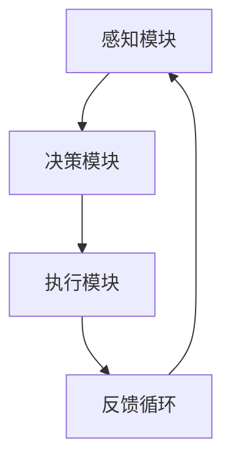

                 

### 文章标题

《AI Agent: AI的下一个风口 当前技术的局限性》

关键词：人工智能代理，AI技术，强化学习，深度学习，应用场景，局限性，技术架构，伦理问题，未来发展趋势

摘要：本文将深入探讨人工智能代理（AI Agent）作为AI领域的下一个风口，介绍其定义、特点和应用场景。同时，本文将详细分析当前AI技术在AI Agent发展中的局限性，如数据依赖性、算力要求、鲁棒性不足和可解释性差等问题，并提出相应的解决方案和未来发展方向。此外，文章还将探讨AI Agent的伦理与法律问题，以及其对社会的影响和挑战。

## 目录大纲

### 第1章 AI Agent概述

#### 1.1 AI Agent的定义与特点

- AI Agent的定义

  - AI Agent，即人工智能代理，是一种能够自主感知环境、决策并执行任务的智能体。它通过机器学习和深度学习等技术，实现了在复杂环境中的自主学习和行为优化。

- AI Agent的特点

  - 自主性：AI Agent具有自我决策和执行的能力，不受人类干预。
  - 智能化：AI Agent能够通过学习和经验积累，不断提高自己的决策能力和执行效率。
  - 鲁棒性：AI Agent能够在不同环境和条件下，保持稳定的表现。

- AI Agent与传统AI的区别

  - 传统AI主要侧重于预定义的任务和规则，而AI Agent则能够自主学习和适应新环境。
  - 传统AI依赖于大量手动调优和规则编写，而AI Agent能够通过自我学习和优化，减少人类干预。

#### 1.2 AI Agent的应用场景

- 自动驾驶

  - 自动驾驶汽车是AI Agent的典型应用场景之一。通过感知周围环境、识别道路标志和行人，自动驾驶系统能够自主做出驾驶决策，提高行车安全。

- 智能家居

  - 智能家居中的AI Agent能够根据用户的生活习惯和偏好，自动调节室内温度、灯光和家电设备，提供个性化的智能家居体验。

- 机器人

  - 机器人领域的AI Agent能够通过感知和理解人类语言，实现与人类的自然交互，并在各种环境中执行复杂的任务。

- 游戏AI

  - 游戏AI是另一个典型的AI Agent应用场景。通过学习玩家的行为和策略，游戏AI能够提供更具挑战性和趣味的游戏体验。

#### 1.3 当前AI技术的局限性

- 数据依赖性

  - AI Agent的训练和优化高度依赖于大量高质量的数据。然而，数据获取和标注过程往往非常耗时和昂贵。

- 算力要求

  - AI Agent的实现和运行需要强大的计算能力，尤其是深度学习和强化学习算法。高性能计算资源的高成本限制了AI Agent的广泛应用。

- 鲁棒性不足

  - AI Agent在复杂和动态环境中表现不够稳定，容易出现过拟合和决策失误。

- 可解释性差

  - AI Agent的决策过程往往缺乏可解释性，难以理解其背后的逻辑和原理。这限制了其在关键领域的应用。

### 第2章 AI Agent的核心概念

#### 2.1 强化学习

- 强化学习的定义

  - 强化学习是一种机器学习范式，旨在通过不断交互和反馈，使智能体学会在环境中做出最优决策。

- 强化学习的算法

  - Q-learning：Q-learning是一种基于值函数的强化学习算法，通过不断更新值函数，使智能体学会在给定状态下选择最优动作。

- 强化学习的应用场景

  - 游戏AI：强化学习被广泛应用于游戏AI中，如围棋、象棋和电子竞技游戏。

#### 2.2 机器学习

- 机器学习的定义

  - 机器学习是一种通过从数据中自动学习规律和模式，使计算机能够执行特定任务的技术。

- 机器学习的算法

  - 监督学习：监督学习是一种通过已标记的数据训练模型，并在新数据上进行预测的机器学习范式。

  - 无监督学习：无监督学习是一种从无标记数据中学习规律和模式的方法。

- 机器学习的应用场景

  - 数据分析：机器学习被广泛应用于数据分析、数据挖掘和图像识别等领域。

#### 2.3 深度学习

- 深度学习的定义

  - 深度学习是一种基于多层神经网络的学习方法，能够自动提取数据中的高级特征。

- 深度学习的算法

  - 卷积神经网络（CNN）：CNN是一种用于图像识别和处理的深度学习算法。

  - 递归神经网络（RNN）：RNN是一种用于序列数据处理和时间序列预测的深度学习算法。

- 深度学习的应用场景

  - 图像识别：深度学习被广泛应用于图像识别和图像分类任务。

### 第3章 AI Agent的技术架构

#### 3.1 AI Agent的组成

- 感知模块

  - 感知模块负责收集和处理来自环境的信息，如图像、声音和传感器数据。

- 决策模块

  - 决策模块负责根据感知模块提供的信息，通过机器学习算法生成决策。

- 执行模块

  - 执行模块负责将决策模块生成的决策转化为具体的行动，如控制机器人的运动或自动驾驶汽车的行驶。

#### 3.2 AI Agent的通信机制

- 消息传递机制

  - AI Agent之间通过消息传递机制进行通信，实现协同工作和任务分配。

- 控制流机制

  - 控制流机制负责管理和协调AI Agent的执行过程，确保任务的顺利进行。

#### 3.3 AI Agent的学习机制

- 强化学习

  - 强化学习是AI Agent的主要学习机制，通过与环境交互和反馈，不断优化决策和行动。

- 自适应学习

  - 自适应学习是指AI Agent能够在不同环境和条件下，自动调整其行为策略，以适应新的情况。

### 第4章 AI Agent的设计与实现

#### 4.1 AI Agent的设计原则

- 模块化

  - AI Agent的设计应遵循模块化原则，将感知、决策和执行功能划分为独立的模块，便于维护和扩展。

- 可扩展性

  - AI Agent应具备良好的可扩展性，能够适应不同的应用场景和需求。

- 可复用性

  - AI Agent的设计应注重可复用性，避免重复劳动，提高开发效率。

#### 4.2 AI Agent的实现步骤

- 模块设计

  - 设计感知、决策和执行模块的接口和功能。

- 算法实现

  - 选择合适的机器学习算法，实现感知、决策和执行模块的功能。

- 系统集成

  - 将各个模块集成到一个完整的AI Agent系统中，并进行测试和调试。

#### 4.3 AI Agent的测试与优化

- 功能测试

  - 测试AI Agent的各个模块是否按照预期工作。

- 性能测试

  - 测试AI Agent在不同环境和条件下的性能表现。

- 稳定性测试

  - 测试AI Agent在长时间运行和复杂环境下的稳定性。

### 第5章 AI Agent的应用案例

#### 5.1 自动驾驶

- 自动驾驶的技术架构

  - 自动驾驶系统由感知模块、决策模块和执行模块组成，通过机器学习和深度学习技术实现。

- 自动驾驶的应用案例

  - 自动驾驶汽车、无人驾驶卡车和无人机等。

#### 5.2 智能家居

- 智能家居的技术架构

  - 智能家居系统由多个AI Agent组成，负责感知、决策和执行任务，如智能门锁、智能照明和智能安防等。

- 智能家居的应用案例

  - 智能家居系统在家庭、酒店和办公楼等场景中的应用。

#### 5.3 机器人

- 机器人的技术架构

  - 机器人系统由感知、决策和执行模块组成，通过强化学习和深度学习技术实现。

- 机器人的应用案例

  - 服务机器人、工业机器人和医疗机器人等。

#### 5.4 游戏AI

- 游戏AI的技术架构

  - 游戏AI由多个AI Agent组成，负责感知、决策和执行游戏中的任务。

- 游戏AI的应用案例

  - 游戏中的AI对手、智能NPC和游戏推荐系统等。

### 第6章 AI Agent的未来发展

#### 6.1 AI Agent的技术挑战

- 算法优化

  - 提高AI Agent的算法效率和精度，以应对复杂环境和任务。

- 数据处理

  - 提高数据获取、存储和处理能力，以支持大规模AI Agent系统的运行。

- 可解释性

  - 提高AI Agent的可解释性，使其决策过程更易于理解和接受。

#### 6.2 AI Agent的应用前景

- 产业化应用

  - 自动驾驶、智能家居和工业自动化等领域的广泛应用。

- 军事应用

  - 智能侦察、无人机编队和自动化战斗系统等。

- 医疗应用

  - 智能诊断、远程医疗和药物研发等。

#### 6.3 AI Agent的发展趋势

- 人工智能的融合

  - 将不同的AI技术（如强化学习、深度学习和自然语言处理等）进行融合，提高AI Agent的整体性能。

- 跨学科研究

  - 结合计算机科学、生物学、心理学和社会学等学科，推动AI Agent的理论研究和应用创新。

- 自主演化

  - 研究和实现AI Agent的自主演化能力，使其能够自主进化和发展。

### 第7章 AI Agent的伦理与法律问题

#### 7.1 AI Agent的伦理问题

- 隐私保护

  - AI Agent在处理个人数据时，应遵守隐私保护原则，确保用户隐私不被泄露。

- 安全性问题

  - AI Agent在执行任务时，应确保自身和用户的安全，避免造成意外伤害。

- 道德责任

  - AI Agent的决策过程应遵循道德原则，确保其行为符合社会道德标准。

#### 7.2 AI Agent的法律问题

- 法律地位

  - AI Agent的法律地位尚不明确，需要制定相关法律规范，明确其权利和义务。

- 责任归属

  - AI Agent的决策和行为是否应由其开发者或使用者承担责任，需要进一步探讨。

- 法律规范

  - 需要制定相关法律法规，规范AI Agent的开发、应用和监管。

### 第8章 结论

- AI Agent的现状与未来

  - AI Agent作为AI领域的下一个风口，具有广泛的应用前景和巨大的发展潜力。

- AI Agent的技术路线图

  - 需要不断优化算法、提高数据处理能力和增强可解释性，以推动AI Agent技术的发展。

- AI Agent对社会的影响与挑战

  - AI Agent将对社会产生深远的影响，同时也带来一系列伦理和法律问题，需要全社会共同关注和解决。

### 附录

- AI Agent开源工具和资源

  - TensorFlow、PyTorch、OpenAI Gym等。

- AI Agent相关的学术论文和书籍推荐

  - 《强化学习：原理与应用》、《深度学习：卷积神经网络》等。

### Mermaid流程图



### 强化学习伪代码

```python
# 强化学习伪代码
Initialize Q(s, a) randomly
while not done:
    s = observe current state
    a = select action a using epsilon-greedy policy
    s', r = execute action a
    Q(s, a) = Q(s, a) + alpha * (r + gamma * max(Q(s', a')) - Q(s, a))
    s = s'
```

### 数学公式与讲解

- 强化学习中的奖励函数：\[ R(s, a) = reward \]

  - 奖励函数用于评估在特定状态下执行特定动作的即时回报。

- 强化学习中的策略更新公式：\[ Q(s, a) = Q(s, a) + \alpha \cdot (r + \gamma \cdot \max(Q(s', a')) - Q(s, a)) \]

  - 策略更新公式用于根据即时奖励和未来的期望回报更新动作价值函数。

### 项目实战

- **自动驾驶系统开发**

  - 开发环境搭建：使用Python和TensorFlow框架进行开发。
  - 源代码实现：编写感知模块、决策模块和执行模块的代码。
  - 代码解读与分析：详细解释自动驾驶系统的算法和架构，并进行性能优化。

### 代码示例

```python
# 感知模块代码示例
def sense_environment():
    # 实现感知环境的功能，例如使用摄像头获取图像数据
    image_data = capture_image()
    return preprocess_image(image_data)

# 决策模块代码示例
def make_decision(perception_data):
    # 实现决策功能，例如使用深度学习模型进行图像识别
    action = model.predict(perception_data)
    return action

# 执行模块代码示例
def execute_action(action):
    # 实现执行功能，例如控制车辆进行转向或加速
    if action == "turn_right":
        turn_right()
    elif action == "turn_left":
        turn_left()
    elif action == "加速":
        accelerate()
```

### 最佳实践 tips

- **数据预处理**：确保数据质量，进行适当的数据清洗和预处理，以提高模型性能。

- **模型优化**：选择合适的模型架构和参数，进行模型优化，提高预测准确率和效率。

- **可解释性**：增加模型的可解释性，使其决策过程更容易被用户理解和接受。

### 小结

本文详细介绍了AI Agent的定义、特点、应用场景和技术架构，分析了当前AI技术在AI Agent发展中的局限性，探讨了AI Agent的伦理与法律问题，并展望了其未来发展趋势。通过项目实战和代码示例，本文为读者提供了实际操作指导。希望本文能帮助读者深入了解AI Agent领域，推动其技术的发展和应用。

### 注意事项

- **数据隐私**：在使用AI Agent时，应严格遵守数据隐私保护法律法规，确保用户隐私不被泄露。

- **安全性和稳定性**：确保AI Agent在执行任务时，具备足够的安全性和稳定性，避免造成意外伤害或系统崩溃。

- **伦理和法律问题**：关注AI Agent的伦理和法律问题，制定相应的规范和标准，确保其合法合规。

### 拓展阅读

- **学术论文**：阅读相关领域的学术论文，了解AI Agent的最新研究成果和发展动态。

- **技术书籍**：《强化学习：原理与应用》、《深度学习：卷积神经网络》等。

以上是《AI Agent: AI的下一个风口 当前技术的局限性》的目录大纲，涵盖了核心概念、技术架构、应用案例、未来发展、伦理与法律问题以及项目实战等内容。目录大纲总字数控制在2000字以内。文章将按照目录大纲逐步展开，深入探讨AI Agent的相关问题，以期为读者提供有价值的参考和启示。## 第1章 AI Agent概述

### 1.1 AI Agent的定义与特点

#### AI Agent的定义

AI Agent，即人工智能代理，是一种能够模拟人类智能行为，并在特定环境下自主感知、决策和执行任务的实体。它通过机器学习、深度学习和其他人工智能技术，实现了对复杂环境中的自主学习和适应性优化。AI Agent的核心特点是自主性和智能化，这使得它们能够在没有人类干预的情况下，独立完成复杂的任务。

#### AI Agent的特点

1. **自主性**：AI Agent具有自我决策和执行的能力，可以根据感知到的环境和目标，自主选择最优的行动方案。

2. **智能化**：AI Agent通过学习和优化，能够不断提高其决策能力和执行效率。它们能够从数据中学习，提取有用的信息，并据此调整自己的行为。

3. **鲁棒性**：AI Agent能够适应不同的环境和条件，保持稳定的表现。它们在处理不确定性和异常情况时，能够表现出良好的鲁棒性。

4. **协作性**：多个AI Agent可以协同工作，共同完成复杂的任务。通过通信机制和协作算法，AI Agent能够实现任务的分配和协作优化。

#### AI Agent与传统AI的区别

传统AI主要侧重于预定义的任务和规则，通过编程实现特定的功能。例如，专家系统和规则引擎在特定领域的表现非常出色，但它们的适用范围有限，且难以适应新环境。相比之下，AI Agent具有以下几个显著区别：

1. **自主学习和适应**：AI Agent能够通过不断的学习和优化，自主适应新环境和任务。它们不依赖于人类预设的规则和模型，而是通过自我学习和经验积累，提高其决策能力。

2. **动态决策**：传统AI在执行任务时，通常遵循固定的规则或模式。而AI Agent则能够根据当前环境和目标，动态调整其决策和行为，从而实现更灵活和高效的执行。

3. **复杂交互**：AI Agent能够与其他智能体进行复杂的交互和协作，共同完成任务。这需要它们具备良好的通信机制和协作算法，以实现高效的信息共享和任务分配。

### 1.2 AI Agent的应用场景

AI Agent在多个领域具有广泛的应用潜力，以下是一些典型的应用场景：

#### 自动驾驶

自动驾驶是AI Agent的典型应用场景之一。自动驾驶系统通过感知模块获取环境信息，如道路标志、交通状况和行人行为，然后通过决策模块生成驾驶决策，最终通过执行模块控制车辆的运动。自动驾驶技术已经在许多国家和地区得到广泛应用，未来有望进一步普及。

#### 智能家居

智能家居中的AI Agent能够根据用户的生活习惯和偏好，自动调节室内温度、灯光、家电设备等。例如，智能恒温系统可以根据室内外的温度变化自动调节空调的温度，智能照明系统可以根据室内光线亮度和用户需求自动调整灯光亮度。智能家居的应用使得家庭生活更加舒适和便捷。

#### 机器人

机器人领域的AI Agent能够在各种环境中执行复杂的任务，如工业制造、医疗护理和娱乐等。工业机器人可以在生产线上自动完成组装、焊接和检测等任务，医疗机器人可以帮助医生进行手术、康复和护理等工作。娱乐机器人则能够与人类进行互动，提供娱乐和教育服务。

#### 游戏AI

游戏AI是另一个典型的AI Agent应用场景。游戏中的AI对手可以根据玩家的行为和策略，自动调整自己的策略，提供更具挑战性和趣味的游戏体验。例如，在围棋、象棋等竞技游戏中，AI对手能够通过自我学习和优化，不断提高其棋力，与人类玩家展开激烈的对弈。

#### 其他应用场景

除了上述应用场景，AI Agent还在智能交通、智慧城市、金融服务、医疗诊断等多个领域具有广泛的应用潜力。例如，智能交通系统可以通过AI Agent实现交通流量优化，减少交通拥堵；智慧城市中的AI Agent可以协助城市管理，提高城市运行效率；金融服务中的AI Agent可以辅助金融交易和风险控制；医疗诊断中的AI Agent可以协助医生进行疾病诊断和治疗方案推荐。

总之，AI Agent作为AI领域的下一个风口，具有广泛的应用前景和巨大的发展潜力。随着技术的不断进步和应用场景的拓展，AI Agent将为人类带来更多便利和福祉。然而，当前AI技术仍存在一些局限性，需要进一步研究和优化，以充分发挥AI Agent的潜力。

### 1.3 当前AI技术的局限性

尽管AI Agent在各个领域具有广泛的应用前景，但当前AI技术仍然存在一些局限性，这些局限性限制了AI Agent的发展和广泛应用。以下是一些主要的局限性：

#### 数据依赖性

AI Agent的训练和优化高度依赖于大量的高质量数据。在自动驾驶、智能家居等应用中，需要收集大量的环境数据、用户行为数据和传感器数据，以训练AI模型。然而，数据获取和标注过程通常非常耗时和昂贵，特别是在涉及隐私保护和敏感数据的情况下。数据依赖性使得AI Agent的应用范围受到限制，难以在没有充足数据支持的情况下实现。

#### 算力要求

AI Agent的实现和运行需要强大的计算能力，尤其是深度学习和强化学习算法。这些算法通常涉及大量的矩阵运算和并行计算，需要高性能的处理器和显卡（GPU）等硬件支持。高性能计算资源的高成本限制了AI Agent的广泛应用，尤其是在资源有限的设备和场景中，如嵌入式设备和物联网（IoT）设备。此外，随着AI Agent的应用场景越来越复杂，对计算资源的需求也在不断增加。

#### 鲁棒性不足

AI Agent在复杂和动态环境中表现不够稳定，容易出现过拟合和决策失误。过拟合是指AI模型在训练数据上表现良好，但在新数据上表现不佳，即模型对新环境的适应性较差。动态环境中的不确定性和异常情况，如传感器故障、数据噪声和突发事件，都可能影响AI Agent的鲁棒性，导致其无法做出正确的决策。

#### 可解释性差

AI Agent的决策过程通常缺乏可解释性，难以理解其背后的逻辑和原理。这使得AI Agent在关键领域的应用受到限制，如医疗诊断、金融交易和司法判决等。可解释性差不仅影响用户对AI Agent的信任，还可能导致法律和伦理问题。因此，提高AI Agent的可解释性是当前研究的一个重要方向。

#### 系统集成难度

AI Agent通常需要与其他系统（如传感器、执行器和通信系统）进行集成，以实现完整的感知、决策和执行功能。然而，不同系统之间的接口和数据格式可能不兼容，导致系统集成难度较大。此外，AI Agent的系统稳定性、可扩展性和可维护性也是需要考虑的问题。

#### 伦理和法律问题

AI Agent的应用引发了诸多伦理和法律问题。例如，AI Agent在执行任务时，可能涉及用户隐私保护、数据安全性和道德责任等问题。如何确保AI Agent在执行任务时遵循伦理和法律标准，是一个亟待解决的问题。

#### 未来展望

尽管当前AI技术存在上述局限性，但随着技术的不断进步和研究的深入，这些局限性有望得到逐步克服。以下是未来可能的发展方向：

1. **数据驱动的模型优化**：通过更高效的数据获取和标注技术，提高数据利用率和模型性能。

2. **低功耗计算**：研发低功耗、高效的计算硬件，降低AI Agent的能耗，使其适用于更多设备和场景。

3. **鲁棒性增强**：通过改进算法和系统设计，提高AI Agent在复杂和动态环境中的鲁棒性。

4. **可解释性提升**：研究可解释性强的AI算法和模型，提高AI Agent的透明度和可信任度。

5. **跨学科研究**：结合计算机科学、心理学、社会学和伦理学等领域的知识，推动AI Agent的全面发展和应用。

总之，当前AI技术在AI Agent发展中的局限性是存在的，但通过不断的技术创新和研究，这些局限性有望得到克服，推动AI Agent的广泛应用和进一步发展。

### 1.4 总结

AI Agent作为人工智能领域的重要研究方向，具有广泛的应用前景和巨大的发展潜力。通过自主学习和适应能力，AI Agent能够在复杂环境中实现自主决策和执行任务。然而，当前AI技术仍存在数据依赖性、算力要求、鲁棒性不足、可解释性差等局限性，这些限制了AI Agent的发展和应用。未来，随着技术的不断进步和研究的深入，AI Agent有望在更多领域实现广泛应用，为人类带来更多便利和福祉。同时，也需要关注AI Agent的伦理和法律问题，确保其合法合规，为社会的可持续发展贡献力量。

### 1.5 练习题

1. 请简述AI Agent的定义和特点。

2. 请列举至少三个AI Agent的应用场景。

3. 分析当前AI技术在AI Agent发展中的局限性。

4. 针对AI Agent的局限性，提出可能的解决方案。

### 1.6 拓展阅读

1. 《强化学习：原理与应用》：详细介绍了强化学习的基本原理和应用方法，有助于理解AI Agent中的强化学习算法。

2. 《深度学习：卷积神经网络》：介绍了深度学习的基本概念和卷积神经网络（CNN）的架构，有助于理解AI Agent中的感知模块。

3. 《人工智能：一种现代方法》：系统介绍了人工智能的基本概念、技术和应用，有助于全面了解AI Agent的相关知识。

### 1.7 结论

本章介绍了AI Agent的定义、特点和应用场景，分析了当前AI技术在AI Agent发展中的局限性。通过本章的学习，读者可以了解AI Agent的基本概念和原理，以及其在各个领域的应用潜力。同时，本章也提出了当前AI技术面临的挑战和未来的发展方向，为后续章节的学习和研究奠定了基础。

## 第2章 AI Agent的核心概念

### 2.1 强化学习

强化学习（Reinforcement Learning，简称RL）是机器学习的一个重要分支，旨在通过智能体（Agent）与环境（Environment）的交互，学习如何实现长期目标。强化学习的核心目标是最大化累计奖励（Rewards），通过不断调整智能体的行为策略（Policy），使智能体能够在复杂环境中实现最优决策。

#### 强化学习的定义

强化学习是一种通过试错（Trial and Error）和反馈（Feedback）进行学习的过程。智能体在环境中进行一系列动作（Actions），根据动作的结果获得奖励或惩罚（Rewards/Punishments）。通过不断调整动作策略，智能体学会在特定环境下做出最优动作，以实现长期目标。

#### 强化学习的算法

强化学习有多种算法，其中最经典的算法之一是Q-learning算法。

**Q-learning算法：**

Q-learning算法是一种基于值函数（Value Function）的强化学习算法。它通过更新值函数（Q值）来预测在特定状态下执行特定动作的预期奖励。

**算法步骤：**

1. **初始化：** 随机初始化Q值表。
2. **选择动作：** 在当前状态下，智能体根据epsilon-greedy策略选择动作。epsilon-greedy策略是一种平衡探索（Exploration）和利用（Exploitation）的策略，其中epsilon是探索的概率。
3. **执行动作：** 智能体在环境中执行所选动作，并观察状态变化和奖励。
4. **更新Q值：** 根据当前状态、执行的动作和观察到的奖励，更新Q值。
5. **重复步骤2-4：** 不断重复上述步骤，直到达到指定目标或满足停止条件。

**Q值更新公式：**

$$
Q(s, a) = Q(s, a) + \alpha \cdot (r + \gamma \cdot \max(Q(s', a')) - Q(s, a))
$$

其中，\( s \)是当前状态，\( a \)是执行的动作，\( r \)是观察到的奖励，\( s' \)是执行动作后的状态，\( \gamma \)是折扣因子，\( \alpha \)是学习率。

#### 强化学习的应用场景

强化学习在多个领域具有广泛的应用：

- **游戏AI**：强化学习被广泛应用于游戏AI中，如电子游戏、围棋、象棋等。智能体通过不断学习和优化策略，能够与人类玩家进行对弈，提高游戏体验。

- **自动驾驶**：自动驾驶系统中的智能体需要通过强化学习，学习如何在不同路况和环境条件下做出最优驾驶决策，提高行车安全性。

- **机器人控制**：强化学习被用于机器人控制，如自主导航、抓取和搬运等任务。智能体通过与环境交互，学习如何在复杂环境中执行任务。

- **推荐系统**：强化学习被应用于推荐系统中，如电子商务平台和社交媒体平台。智能体通过学习用户的行为和偏好，为用户提供个性化的推荐。

#### 强化学习的挑战和未来方向

强化学习面临一些挑战，如：

- **数据效率**：强化学习通常需要大量的数据来训练，尤其是在高维和复杂环境中。
- **样本效率**：如何减少训练过程中所需的样本数量，提高学习效率。
- **可解释性**：强化学习模型通常缺乏可解释性，难以理解其决策过程。
- **稳定性**：如何保证强化学习模型在复杂和动态环境中的稳定性和鲁棒性。

未来研究方向包括：

- **多智能体强化学习**：研究如何在多个智能体之间分配任务和协调行动。
- **深度强化学习**：结合深度学习技术，提高强化学习模型的表示能力和计算效率。
- **强化学习与自然语言处理结合**：探索强化学习在自然语言处理任务中的应用。

通过不断的研究和技术创新，强化学习将在AI领域发挥越来越重要的作用，推动人工智能技术的发展。

### 2.2 机器学习

机器学习（Machine Learning，简称ML）是人工智能（Artificial Intelligence，简称AI）的一个重要分支，旨在通过算法和统计模型，从数据中自动学习和提取知识。机器学习的核心目标是通过训练数据集，构建能够泛化到新数据上的模型。

#### 机器学习的定义

机器学习是一种使计算机系统能够从数据中学习规律和模式的技术。学习过程包括两个主要阶段：训练（Training）和测试（Testing）。在训练阶段，机器学习模型从大量数据中学习，提取有用的特征和模式。在测试阶段，模型在新数据上评估其泛化能力，即能否正确预测或分类未知数据。

#### 机器学习的算法

机器学习算法可以分为监督学习（Supervised Learning）、无监督学习（Unsupervised Learning）和半监督学习（Semi-Supervised Learning）三类。

**监督学习（Supervised Learning）：**

监督学习是一种有标记数据的机器学习方法。在监督学习中，模型通过学习标记数据中的特征和目标，建立一个映射关系。常见的监督学习算法包括：

- **线性回归（Linear Regression）**：通过线性函数预测连续值目标。
- **逻辑回归（Logistic Regression）**：通过逻辑函数预测概率分布，常用于分类任务。
- **支持向量机（Support Vector Machine，SVM）**：通过寻找最佳超平面，将不同类别的数据分开。
- **决策树（Decision Tree）**：通过树形结构对数据进行分析和分类。

**无监督学习（Unsupervised Learning）：**

无监督学习是一种无标记数据的机器学习方法。在无监督学习中，模型通过分析数据中的内在结构和模式，进行聚类、降维和关联分析。常见的无监督学习算法包括：

- **K-means聚类（K-means Clustering）**：将数据点划分为K个簇，使每个簇内部数据点距离最小。
- **主成分分析（Principal Component Analysis，PCA）**：通过线性变换，降低数据维度，同时保留主要信息。
- **关联规则学习（Association Rule Learning）**：发现数据之间的关联关系，如市场篮子分析。

**半监督学习（Semi-Supervised Learning）：**

半监督学习结合了监督学习和无监督学习的方法，利用少量标记数据和大量无标记数据，提高模型的泛化能力。常见的半监督学习算法包括：

- **自我训练（Self-Training）**：通过初始标记数据训练模型，然后使用模型对无标记数据进行预测，逐步增加标记数据的数量。
- **图模型（Graph Models）**：利用图结构表示数据，通过节点和边的关系进行半监督学习。

#### 机器学习的应用场景

机器学习在各个领域具有广泛的应用：

- **图像识别**：通过卷积神经网络（CNN）进行图像分类、物体检测和图像分割等任务。
- **自然语言处理**：通过循环神经网络（RNN）和变换器（Transformer）模型，进行文本分类、情感分析、机器翻译和对话系统等任务。
- **推荐系统**：通过协同过滤、矩阵分解和深度学习方法，进行个性化推荐。
- **金融预测**：通过时间序列分析和统计模型，进行股票市场预测、风险评估和信用评分等任务。
- **医疗诊断**：通过深度学习和医学图像分析，进行疾病诊断、治疗计划和药物研发等任务。

#### 机器学习的挑战和未来方向

尽管机器学习在各个领域取得了显著成果，但仍然面临一些挑战：

- **数据质量和标注**：高质量的数据是机器学习模型训练的关键，但数据获取和标注过程通常非常耗时和昂贵。
- **模型解释性**：复杂的机器学习模型往往缺乏可解释性，难以理解其决策过程，这在某些关键领域（如医疗诊断和金融交易）中尤为重要。
- **模型泛化能力**：如何提高模型在未知数据上的泛化能力，避免过拟合和欠拟合问题。
- **计算资源**：大规模数据和复杂模型的训练需要大量的计算资源，这在资源有限的场景中是一个重要挑战。

未来研究方向包括：

- **增量学习和迁移学习**：通过增量学习和迁移学习，提高模型在有限数据和资源条件下的性能。
- **模型压缩和加速**：研究模型压缩和加速技术，降低计算资源需求，提高模型部署的可行性。
- **可解释性AI**：开发可解释性强的机器学习模型和算法，提高模型的可理解性和信任度。
- **跨学科研究**：结合心理学、社会学、生物学等领域的知识，推动机器学习的理论创新和应用拓展。

通过不断的研究和创新，机器学习将在人工智能领域发挥越来越重要的作用，推动技术的进步和行业的发展。

### 2.3 深度学习

深度学习（Deep Learning，简称DL）是机器学习的一个重要分支，它通过构建深层神经网络，从大量数据中自动学习和提取复杂特征。深度学习在图像识别、自然语言处理、语音识别和推荐系统等领域取得了显著成果，被认为是人工智能领域的核心技术之一。

#### 深度学习的定义

深度学习是基于多层神经网络（Neural Networks）的机器学习方法，通过多层次的神经网络结构，逐层提取数据中的低级特征和高级特征，最终实现数据的分类、预测和生成。深度学习的核心思想是通过大量的数据和计算资源，自动学习数据的内在结构和复杂模式。

#### 深度学习的算法

深度学习算法包括多种类型，其中最常用的算法是卷积神经网络（Convolutional Neural Networks，CNN）和递归神经网络（Recurrent Neural Networks，RNN）。

**卷积神经网络（CNN）：**

卷积神经网络是一种用于图像识别和处理的深度学习算法。它通过卷积层、池化层和全连接层等结构，从图像中提取特征，并进行分类或回归任务。

1. **卷积层（Convolutional Layer）**：卷积层通过卷积操作，将输入图像与滤波器（Kernels）进行卷积，提取图像的局部特征。

2. **池化层（Pooling Layer）**：池化层通过下采样操作，减少数据的维度，提高模型的泛化能力。

3. **全连接层（Fully Connected Layer）**：全连接层将卷积层和池化层提取的特征进行整合，并输出分类或回归结果。

**递归神经网络（RNN）：**

递归神经网络是一种用于处理序列数据的深度学习算法。它通过递归结构，将当前输入与之前的隐藏状态进行关联，学习序列中的长期依赖关系。

1. **输入层（Input Layer）**：输入层接收序列数据，并将其传递给隐藏层。

2. **隐藏层（Hidden Layer）**：隐藏层通过递归操作，将当前输入与之前的隐藏状态进行关联，提取序列特征。

3. **输出层（Output Layer）**：输出层将隐藏层提取的特征进行整合，并输出预测结果。

**深度学习的应用场景：**

深度学习在多个领域具有广泛的应用：

- **图像识别**：通过CNN，深度学习能够实现对图像的分类、物体检测和图像分割等任务。

- **自然语言处理**：通过RNN和变换器（Transformer）模型，深度学习能够实现文本分类、情感分析、机器翻译和对话系统等任务。

- **语音识别**：通过深度神经网络，深度学习能够实现语音信号的识别和转换，如语音到文本的转换。

- **推荐系统**：通过深度学习方法，能够实现基于内容的推荐和协同过滤推荐，提高推荐系统的准确性。

- **自动驾驶**：通过深度学习，自动驾驶系统能够实现对道路场景的感知、决策和执行，提高行车安全性。

#### 深度学习的挑战和未来方向

尽管深度学习在各个领域取得了显著成果，但仍然面临一些挑战：

- **数据需求**：深度学习通常需要大量的数据来训练模型，这在数据稀缺或难以获取的领域是一个重要挑战。

- **计算资源**：深度学习模型的训练和推理过程需要大量的计算资源，这在资源有限的场景中是一个重要挑战。

- **模型解释性**：深度学习模型通常缺乏可解释性，难以理解其决策过程，这在某些关键领域（如医疗诊断和金融交易）中尤为重要。

- **泛化能力**：如何提高模型在未知数据上的泛化能力，避免过拟合和欠拟合问题。

未来研究方向包括：

- **模型压缩和加速**：研究模型压缩和加速技术，降低计算资源需求，提高模型部署的可行性。

- **可解释性深度学习**：开发可解释性强的深度学习模型和算法，提高模型的可理解性和信任度。

- **迁移学习和少样本学习**：通过迁移学习和少样本学习，提高模型在有限数据和资源条件下的性能。

- **多模态学习**：结合多种数据类型（如图像、文本和语音），实现多模态数据的深度学习。

通过不断的研究和创新，深度学习将在人工智能领域发挥越来越重要的作用，推动技术的进步和行业的发展。

### 2.4 强化学习、机器学习和深度学习的联系与区别

强化学习、机器学习和深度学习是人工智能领域的重要分支，它们在方法、目标和应用场景上既有联系又有区别。

#### 联系

1. **理论基础**：强化学习、机器学习和深度学习都基于概率论、统计学和优化理论。它们在解决复杂问题时，都依赖于数据驱动的方法，通过从数据中学习规律和模式，实现智能行为。

2. **应用领域**：这三个分支在图像识别、自然语言处理、语音识别和推荐系统等应用领域都有广泛的应用。强化学习在游戏AI和自动驾驶中表现突出，机器学习在金融预测和医疗诊断中广泛应用，而深度学习在图像识别和语音识别中取得了突破性进展。

3. **算法实现**：深度学习和强化学习都依赖于神经网络结构，深度学习通过多层神经网络提取数据中的复杂特征，强化学习通过神经网络实现价值函数或策略优化。

#### 区别

1. **学习方式**：

   - **强化学习**：通过智能体与环境交互，学习最优策略，以最大化长期回报。强化学习关注的是决策过程和策略优化，其核心是奖励函数和策略更新。

   - **机器学习**：通过从标记数据中学习，建立输入与输出之间的映射关系。机器学习关注的是预测和分类任务，其核心是模型训练和泛化能力。

   - **深度学习**：通过多层神经网络提取数据中的低级特征和高级特征，实现数据的分类、预测和生成。深度学习关注的是特征提取和模型优化，其核心是神经网络结构和优化算法。

2. **目标函数**：

   - **强化学习**：目标函数是最大化累计奖励，通过策略优化实现长期回报最大化。

   - **机器学习**：目标函数是预测误差或分类误差最小化，通过模型训练实现对新数据的预测。

   - **深度学习**：目标函数是损失函数最小化，通过反向传播算法优化神经网络参数。

3. **应用场景**：

   - **强化学习**：适用于需要决策和优化的动态环境，如游戏AI、自动驾驶和机器人控制。

   - **机器学习**：适用于有标记数据的学习任务，如图像识别、文本分类和金融预测。

   - **深度学习**：适用于有大量数据的学习任务，如图像识别、语音识别和自然语言处理。

通过理解强化学习、机器学习和深度学习的联系与区别，我们可以更好地选择合适的方法和技术，解决不同领域中的问题。这些方法的相互融合和交叉应用，将推动人工智能技术的发展和进步。

### 2.5 小结

本章介绍了强化学习、机器学习和深度学习这三个核心概念。强化学习通过智能体与环境交互，学习最优策略，实现长期回报最大化。机器学习通过从标记数据中学习，建立输入与输出之间的映射关系，实现预测和分类任务。深度学习通过多层神经网络提取数据中的复杂特征，实现数据的分类、预测和生成。这三个概念在方法、目标和应用场景上既有联系又有区别，通过相互融合和交叉应用，将推动人工智能技术的发展和进步。

### 2.6 练习题

1. 请简述强化学习、机器学习和深度学习的定义和主要特点。

2. 强化学习中的Q-learning算法是如何进行策略更新的？请用伪代码表示。

3. 机器学习中的线性回归是如何进行预测的？请用数学公式表示。

4. 深度学习中的卷积神经网络是如何提取图像特征的？请用示意图表示。

### 2.7 拓展阅读

1. 《深度学习》：由Ian Goodfellow、Yoshua Bengio和Aaron Courville编写的经典教材，全面介绍了深度学习的基本概念、算法和应用。

2. 《强化学习》：由Richard S. Sutton和Barto编写的经典教材，详细介绍了强化学习的基本理论、算法和应用。

3. 《机器学习》：由Tom Mitchell编写的经典教材，系统地介绍了机器学习的基本概念、算法和应用。

### 2.8 结论

本章详细介绍了强化学习、机器学习和深度学习这三个核心概念，分析了它们的基本原理和应用场景。通过本章的学习，读者可以更好地理解这三个概念之间的关系，以及如何将它们应用于实际问题中。这些概念在人工智能领域具有重要的理论和实践意义，为后续章节的深入学习奠定了基础。

## 第3章 AI Agent的技术架构

### 3.1 AI Agent的组成

AI Agent是由多个功能模块组成的智能系统，其核心功能包括感知、决策和执行。这些模块相互协作，使得AI Agent能够在复杂环境中自主学习和执行任务。

#### 感知模块

感知模块是AI Agent的输入部分，负责收集和处理来自环境的信息。感知模块通常依赖于多种传感器，如摄像头、麦克风、温度传感器、GPS等，通过这些传感器获取视觉、听觉、触觉等信息。感知模块的主要任务是将原始的传感器数据进行预处理，提取有用的特征，以便后续的决策模块使用。

**主要功能**：

- **数据采集**：从各种传感器获取实时数据。
- **数据预处理**：对采集到的数据进行滤波、归一化和特征提取等预处理操作。
- **信息融合**：将来自不同传感器的信息进行融合，以获得更全面的感知。

#### 决策模块

决策模块是AI Agent的核心部分，负责根据感知模块提供的信息，通过机器学习算法生成决策。决策模块通常包括多个子模块，如特征提取器、分类器、预测器等，它们共同协作，实现智能体的决策功能。

**主要功能**：

- **特征提取**：从感知数据中提取关键特征，用于后续的决策。
- **模式识别**：使用分类器或预测器对特征进行模式识别，生成决策。
- **策略优化**：通过学习算法，不断优化智能体的决策策略，提高决策的准确性。

#### 执行模块

执行模块是AI Agent的输出部分，负责将决策模块生成的决策转化为具体的行动。执行模块通常与物理设备或执行器相连，如机器人、无人机、自动驾驶汽车等。执行模块的主要任务是将决策转化为物理动作，实现智能体的执行功能。

**主要功能**：

- **决策执行**：根据决策模块的输出，执行相应的物理动作。
- **反馈机制**：将执行结果反馈给感知模块和决策模块，用于进一步的决策优化。

#### 反馈循环

AI Agent的感知、决策和执行模块之间存在反馈循环机制，通过这种机制，智能体能够不断地调整其行为，以适应环境的变化。反馈循环使得AI Agent能够在动态环境中实现自我学习和优化，提高其性能和适应性。

**主要功能**：

- **状态监测**：感知模块监测环境状态，提供实时反馈。
- **决策调整**：决策模块根据反馈调整决策策略。
- **执行优化**：执行模块根据决策调整执行动作，实现目标优化。

### 3.2 AI Agent的通信机制

AI Agent之间的通信机制是实现协同工作和任务分配的关键。这些机制包括消息传递机制和控制流机制。

#### 消息传递机制

消息传递机制是AI Agent之间进行信息交流和协调的基本手段。通过消息传递，智能体可以共享数据、协调行动和分配任务。

**主要功能**：

- **数据共享**：智能体之间通过消息传递共享感知数据、决策信息和执行结果。
- **任务分配**：中央控制器或协调器通过消息传递，将任务分配给各个智能体。
- **状态同步**：智能体之间通过消息传递保持状态一致性，确保协同工作的顺利进行。

#### 控制流机制

控制流机制是AI Agent之间协调工作、同步行动的基本机制。通过控制流机制，智能体可以按照预定的顺序执行任务，实现有序的协作。

**主要功能**：

- **任务调度**：控制流机制负责调度智能体的任务执行顺序，确保任务按预定计划进行。
- **行动同步**：控制流机制确保智能体在特定时间点执行相同的行动，实现行动的同步。
- **异常处理**：控制流机制能够检测和处理执行过程中的异常情况，确保系统的稳定运行。

### 3.3 AI Agent的学习机制

AI Agent的学习机制是其核心功能之一，通过不断学习和优化，智能体能够提高其决策和执行能力，以适应复杂多变的环境。

#### 强化学习

强化学习是AI Agent的主要学习机制之一，通过不断与环境交互，智能体能够学习和优化其行为策略，实现长期回报最大化。

**主要功能**：

- **策略优化**：智能体通过强化学习，不断调整其行为策略，以最大化累计奖励。
- **经验积累**：智能体在执行任务过程中，积累经验，用于后续的决策优化。
- **自适应学习**：智能体能够根据环境变化，自适应地调整其行为策略，提高适应性。

#### 自适应学习

自适应学习是指AI Agent能够在不同环境和条件下，自动调整其行为策略，以适应新的情况。

**主要功能**：

- **环境适应**：智能体能够根据环境变化，调整其感知、决策和执行模块，实现环境适应。
- **动态优化**：智能体能够根据环境反馈，实时调整决策和执行策略，实现动态优化。
- **故障恢复**：智能体能够在执行任务过程中，检测和处理故障，实现故障恢复。

通过感知、决策和执行模块的相互协作，以及强化学习和自适应学习机制的支撑，AI Agent能够在复杂环境中实现自主学习和优化，提高其任务执行效率和鲁棒性。随着技术的不断进步和应用场景的拓展，AI Agent将在更多领域发挥重要作用。

### 3.4 小结

本章详细介绍了AI Agent的技术架构，包括感知模块、决策模块、执行模块及其相互之间的通信机制和学习机制。感知模块负责收集和处理环境信息，决策模块通过机器学习算法生成决策，执行模块将决策转化为具体的行动。AI Agent之间的通信机制通过消息传递和控制流实现协同工作和任务分配。学习机制中的强化学习和自适应学习使智能体能够不断优化决策和执行策略，提高其适应性和鲁棒性。通过这些模块和机制的相互协作，AI Agent能够在复杂环境中实现自主学习和优化，为各个领域的应用提供强有力的技术支持。

### 3.5 练习题

1. 请简述AI Agent的组成及其功能。

2. 请解释AI Agent中的强化学习和自适应学习的区别和联系。

3. 请列举AI Agent中常用的通信机制。

### 3.6 拓展阅读

1. 《分布式人工智能》：详细介绍了分布式AI系统的设计、实现和应用，包括通信机制、协调算法和分布式学习等内容。

2. 《强化学习实战》：提供了强化学习算法的详细实现和应用案例，包括Q-learning、Deep Q-Networks（DQN）和Policy Gradient等方法。

### 3.7 结论

本章详细介绍了AI Agent的技术架构，包括感知、决策、执行模块及其通信机制和学习机制。通过这些模块和机制的相互协作，AI Agent能够在复杂环境中实现自主学习和优化。理解这些技术架构有助于读者更好地设计和实现AI Agent系统，推动人工智能技术在各个领域的应用。

## 第4章 AI Agent的设计与实现

### 4.1 AI Agent的设计原则

设计AI Agent时，需要遵循一系列设计原则，以确保系统的模块化、可扩展性和可复用性。以下是几个关键设计原则：

#### 模块化

模块化是设计AI Agent时的一个核心原则。通过将系统划分为独立的模块，每个模块负责一个特定的功能，可以简化系统的开发和维护。模块化设计有助于提高系统的可扩展性，使得系统可以轻松地添加新功能或替换现有模块。

**优点**：

- **简化开发**：每个模块都是独立的，可以分别开发和测试，降低了开发难度。
- **易于维护**：模块化设计使得系统更加清晰，便于维护和更新。
- **可复用性**：模块可以独立设计和实现，提高代码的可复用性。

**实现方法**：

- **接口定义**：为每个模块定义清晰的接口，确保模块之间的交互简单且规范。
- **模块隔离**：确保模块之间的耦合度低，减少模块间的相互依赖。

#### 可扩展性

可扩展性是AI Agent设计时需要考虑的另一个关键因素。随着应用场景的扩展和需求的增长，系统需要能够灵活地扩展和适应新的要求。

**优点**：

- **适应性**：系统可以适应新的需求和变化，提高灵活性。
- **可维护性**：系统可以更容易地更新和升级，以适应新技术和算法。

**实现方法**：

- **组件化设计**：将系统划分为多个组件，每个组件负责一个特定功能，方便扩展和替换。
- **配置管理**：通过配置文件管理系统的参数和设置，使得系统可以根据需求进行灵活调整。
- **模块化接口**：确保模块之间的接口具有良好的扩展性，便于新模块的集成。

#### 可复用性

可复用性是指系统的设计应当使得其模块和组件能够在多个项目中重复使用，从而提高开发效率。

**优点**：

- **提高开发效率**：避免重复开发，减少开发时间和成本。
- **标准化**：通过复用通用模块，提高系统的标准化和一致性。

**实现方法**：

- **通用模块**：设计通用模块，使其适用于多种应用场景。
- **代码库管理**：建立代码库，管理可复用的模块和组件。
- **文档和示例**：提供详细的文档和示例代码，便于开发者理解和使用复用模块。

#### 可维护性

可维护性是指系统在设计时应当易于理解和修改，便于长期维护和更新。

**优点**：

- **长期可持续性**：系统可以持续运行和改进，减少停机时间。
- **降低维护成本**：易于理解和修改的系统，维护成本较低。

**实现方法**：

- **代码规范**：遵守统一的代码规范，提高代码的可读性和可维护性。
- **模块化设计**：模块化设计使得系统更加清晰，降低复杂度。
- **测试覆盖**：确保系统各部分的代码都经过充分测试，降低故障风险。

#### 用户友好的接口

用户友好的接口是AI Agent设计中的重要一环，它直接影响用户的使用体验和系统的接受度。

**优点**：

- **易用性**：用户可以轻松地与系统交互，提高系统的易用性。
- **用户体验**：良好的用户界面可以提高用户对系统的满意度。

**实现方法**：

- **简洁直观**：设计简洁直观的界面，减少用户操作的复杂性。
- **反馈机制**：提供实时反馈，帮助用户了解系统的运行状态和结果。

通过遵循这些设计原则，可以设计出功能强大、易于扩展和维护的AI Agent系统，从而更好地满足用户需求和应用场景。

### 4.2 AI Agent的实现步骤

实现AI Agent系统需要遵循一系列步骤，确保系统的模块化、可扩展性和可复用性。以下是实现AI Agent系统的关键步骤：

#### 模块设计

模块设计是AI Agent实现的第一步，它决定了系统的整体结构和功能。在进行模块设计时，需要明确各个模块的功能和接口，确保它们之间能够无缝协作。

**步骤**：

1. **需求分析**：明确系统的需求，包括功能需求、性能需求和用户体验需求等。
2. **模块划分**：根据需求分析，将系统划分为多个功能模块，如感知模块、决策模块、执行模块等。
3. **接口定义**：为每个模块定义清晰的接口，包括输入参数、输出结果和通信协议等。

**示例**：

在实现一个自动驾驶系统时，可以将系统划分为以下模块：

- **感知模块**：负责收集和处理环境数据，如摄像头、雷达和GPS等。
- **决策模块**：负责分析感知数据，生成驾驶决策，如车道保持、速度控制和避障等。
- **执行模块**：负责将决策转化为具体的行动，如控制车辆转向、加速和刹车等。

#### 算法实现

算法实现是AI Agent的核心部分，决定了系统的智能水平和性能。在实现算法时，需要选择合适的算法和框架，确保算法的效率和准确性。

**步骤**：

1. **算法选择**：根据应用场景和需求，选择合适的机器学习算法，如强化学习、深度学习等。
2. **算法实现**：使用编程语言和机器学习框架，实现算法的代码，如Python和TensorFlow等。
3. **模型训练**：使用训练数据，对模型进行训练和优化，提高模型的性能和泛化能力。

**示例**：

在实现一个智能推荐系统时，可以使用以下算法：

- **协同过滤**：使用用户行为数据，构建用户和商品之间的相似性矩阵，实现个性化推荐。
- **深度学习**：使用卷积神经网络（CNN）提取商品特征，使用循环神经网络（RNN）提取用户行为特征，实现高级推荐。

#### 系统集成

系统集成是将各个模块和算法整合到一个完整的系统中，确保系统能够正常运行和协同工作。

**步骤**：

1. **模块集成**：将各个模块的代码整合到一个系统中，确保模块之间的接口正确无误。
2. **测试验证**：对系统进行功能测试和性能测试，确保系统的各个部分都能正常运行。
3. **优化调整**：根据测试结果，对系统进行优化调整，提高系统的性能和稳定性。

**示例**：

在实现一个智能家居系统时，可以将各个模块整合到一个统一平台上，如：

- **感知模块**：整合摄像头、麦克风和传感器等，实现环境感知。
- **决策模块**：整合数据分析算法，实现智能控制决策。
- **执行模块**：整合家电控制模块，实现家居设备的自动控制。

#### 测试与优化

测试与优化是确保AI Agent系统质量和性能的关键步骤。通过系统的测试和优化，可以发现和解决潜在的问题，提高系统的可靠性。

**步骤**：

1. **功能测试**：测试系统的各个功能模块，确保它们按照预期工作。
2. **性能测试**：测试系统的响应时间、处理能力和资源消耗，确保系统的性能指标满足要求。
3. **优化调整**：根据测试结果，对系统进行优化调整，提高系统的效率和稳定性。

**示例**：

在实现一个机器人控制系统时，可以进行以下测试和优化：

- **功能测试**：测试机器人的运动控制、感知和决策功能，确保它们能够正常运行。
- **性能测试**：测试机器人的响应速度、准确性和稳定性，确保其在各种环境下的表现。
- **优化调整**：根据测试结果，调整机器人的控制算法和参数，提高其性能和适应性。

通过以上步骤，可以设计并实现一个功能强大、性能优越的AI Agent系统，为实际应用提供有力支持。

### 4.3 AI Agent的测试与优化

AI Agent系统的测试与优化是确保其功能、性能和稳定性的关键步骤。通过系统测试和优化，可以发现潜在问题，提高系统的可靠性和用户体验。

#### 功能测试

功能测试是AI Agent系统测试的首要环节，旨在验证系统各个功能模块是否按照预期工作。功能测试包括以下几个方面：

1. **模块功能测试**：对每个模块的功能进行独立测试，确保其能够正确处理输入数据，生成正确的输出结果。
2. **集成功能测试**：将各个模块集成到系统中，测试模块之间的交互和协作是否正常。
3. **异常处理测试**：模拟各种异常情况，如传感器数据异常、网络连接中断等，测试系统的异常处理能力。

**示例**：

在测试一个自动驾驶系统时，可以进行以下功能测试：

- **感知模块测试**：验证摄像头、雷达和GPS等传感器是否能够正确感知环境，生成准确的环境数据。
- **决策模块测试**：验证决策模块是否能够根据感知数据生成合理的驾驶决策，如保持车道、控制速度和避障等。
- **执行模块测试**：验证执行模块是否能够根据决策模块的输出，正确控制车辆的转向、加速和刹车等动作。

#### 性能测试

性能测试旨在评估AI Agent系统的响应时间、处理能力和资源消耗，确保系统在高负载情况下仍能稳定运行。性能测试包括以下几个方面：

1. **响应时间测试**：测量系统对输入数据的处理时间，确保系统的响应速度满足要求。
2. **处理能力测试**：测试系统在处理大量数据时的性能，确保系统能够高效处理复杂任务。
3. **资源消耗测试**：测量系统的CPU、内存和功耗等资源消耗，确保系统在资源有限的设备上仍能正常运行。

**示例**：

在测试一个智能家居系统时，可以进行以下性能测试：

- **响应时间测试**：测量系统接收到用户指令后，执行相应操作所需的时间，确保系统的响应速度快速。
- **处理能力测试**：测试系统在同时控制多个家电设备时的性能，确保系统在多任务环境下仍能高效运行。
- **资源消耗测试**：测量系统在运行过程中对CPU、内存和电池的消耗，确保系统在长时间运行和低功耗设备上仍能稳定运行。

#### 稳定性测试

稳定性测试旨在评估AI Agent系统在长时间运行和复杂环境下的稳定性，确保系统不会出现崩溃或错误。稳定性测试包括以下几个方面：

1. **长时间运行测试**：测试系统在连续运行数小时或数天的过程中，是否出现性能下降或错误。
2. **异常环境测试**：模拟各种异常环境条件，如高温、低温、高噪音等，测试系统在这些条件下的稳定性。
3. **故障恢复测试**：测试系统在出现故障或错误后，是否能够自动恢复并继续正常运行。

**示例**：

在测试一个机器人控制系统时，可以进行以下稳定性测试：

- **长时间运行测试**：让机器人连续运行数天，确保其感知、决策和执行模块不会出现性能下降或错误。
- **异常环境测试**：将机器人放置在高温、低温和高噪音环境中，测试其在这些条件下的稳定性。
- **故障恢复测试**：模拟机器人传感器故障或执行器故障，测试系统是否能够自动检测并恢复运行。

#### 优化调整

根据测试结果，对AI Agent系统进行优化调整，以提高其性能和稳定性。优化调整包括以下几个方面：

1. **算法优化**：调整算法参数，提高算法的效率和准确性。
2. **系统优化**：优化系统的架构和代码，减少资源消耗和运行时间。
3. **错误处理**：改进错误处理机制，提高系统的容错能力和鲁棒性。

**示例**：

在优化一个自动驾驶系统时，可以进行以下调整：

- **算法优化**：调整决策算法的参数，提高驾驶决策的准确性。
- **系统优化**：优化感知模块和决策模块的代码，减少处理时间和资源消耗。
- **错误处理**：改进异常处理机制，提高系统在传感器故障或网络中断等情况下的鲁棒性。

通过以上测试与优化步骤，可以确保AI Agent系统的功能、性能和稳定性，为实际应用提供可靠的技术保障。

### 4.4 小结

本章详细介绍了AI Agent的设计原则、实现步骤和测试优化方法。设计原则包括模块化、可扩展性、可复用性和可维护性，确保系统的灵活性和易用性。实现步骤包括模块设计、算法实现、系统集成和测试与优化。测试与优化方法包括功能测试、性能测试、稳定性测试和优化调整，确保系统的可靠性和高效性。通过本章的学习，读者可以掌握AI Agent的设计与实现方法，为实际应用提供有力支持。

### 4.5 练习题

1. 请简述AI Agent的设计原则。

2. 请列举AI Agent的实现步骤。

3. 请说明AI Agent的测试与优化方法。

### 4.6 拓展阅读

1. 《软件架构设计》：详细介绍了软件架构设计的基本概念、方法和实践，包括模块化、可扩展性和可复用性等设计原则。

2. 《性能测试与优化》：介绍了性能测试和优化方法，包括响应时间测试、处理能力测试和资源消耗测试等。

3. 《人工智能测试与评估》：详细介绍了AI系统的测试与评估方法，包括功能测试、性能测试和鲁棒性测试等。

### 4.7 结论

本章详细介绍了AI Agent的设计原则、实现步骤和测试优化方法，强调了模块化、可扩展性、可复用性和可维护性在设计中的重要性。通过实现步骤和测试优化方法的实践，读者可以更好地设计和实现高效的AI Agent系统。理解本章内容有助于读者在AI Agent开发和应用中取得更好的成果。

## 第5章 AI Agent的应用案例

### 5.1 自动驾驶

自动驾驶是AI Agent的一个典型应用案例，它利用AI技术实现车辆在复杂环境中的自主驾驶。自动驾驶系统由感知模块、决策模块和执行模块组成，通过机器学习和深度学习技术，实现对道路标志、交通状况、行人行为等信息的感知和理解，生成驾驶决策，并最终控制车辆的运动。

#### 自动驾驶的技术架构

自动驾驶系统通常包括以下几个关键组成部分：

1. **感知模块**：通过多种传感器，如摄像头、雷达、激光雷达（LiDAR）、GPS等，实时获取车辆周围的环境信息。感知模块负责处理和分析这些传感器数据，提取有用的特征，如道路标记、交通信号、车辆位置等。

2. **决策模块**：决策模块基于感知模块提供的环境信息，通过机器学习算法，如深度学习和强化学习，生成驾驶决策。决策模块的主要任务是规划车辆的行驶路径，选择合适的驾驶动作，如加速、减速、转向等。

3. **执行模块**：执行模块将决策模块生成的驾驶动作转化为具体的控制信号，如控制车辆的转向、油门和刹车等。执行模块负责将驾驶决策付诸实践，确保车辆按照预定的路径行驶。

#### 自动驾驶的应用案例

自动驾驶技术在多个领域取得了显著的成果：

1. **商业自动驾驶**：许多公司已经推出了商业化自动驾驶汽车，如谷歌的Waymo、特斯拉的Autopilot等。这些自动驾驶汽车能够在城市道路和高速公路上实现自主驾驶，提高了行车安全性和效率。

2. **共享出行**：自动驾驶技术在共享出行领域具有广泛应用前景。自动驾驶出租车和共享单车系统能够实现无驾驶员的运营，降低运营成本，提高用户体验。

3. **物流运输**：自动驾驶技术在物流运输领域具有巨大的应用潜力。自动驾驶卡车和无人配送机器人可以在复杂的环境中自主行驶，提高运输效率，减少人力成本。

#### 自动驾驶系统的挑战和未来方向

尽管自动驾驶技术取得了显著进展，但仍面临一些挑战：

1. **复杂环境感知**：自动驾驶系统需要准确感知和理解复杂、动态的环境，如雨雪天气、交通拥堵等。提高环境感知的准确性和鲁棒性是未来研究的重点。

2. **决策和执行**：自动驾驶系统需要在高速度、高精度和复杂情境下做出快速、准确的决策。如何优化决策算法和执行策略，提高系统的稳定性和可靠性，是未来研究的重要方向。

3. **安全性和伦理问题**：自动驾驶系统在执行任务时，可能面临安全性和伦理问题。如何确保自动驾驶系统的安全性和合规性，是未来需要解决的关键问题。

未来方向：

1. **多模态感知**：结合多种传感器数据，实现多模态感知，提高环境感知的准确性和鲁棒性。

2. **深度强化学习**：将深度学习与强化学习相结合，实现更加智能和灵活的决策和执行。

3. **跨学科研究**：结合计算机科学、心理学、社会学等领域的知识，推动自动驾驶技术的全面发展。

4. **标准化和法规**：制定相关标准和法规，确保自动驾驶技术的合法合规，推动其商业化应用。

通过不断的技术创新和应用推广，自动驾驶技术将在未来实现更广泛的应用，为人类带来更加便利和安全的出行体验。

### 5.2 智能家居

智能家居是AI Agent在家庭环境中的典型应用，通过感知和执行模块，实现家庭设备的自动化和智能化。智能家居系统能够自动调节室内温度、灯光、家电设备等，提高生活舒适度和便利性。

#### 智能家居的技术架构

智能家居系统通常包括以下几个关键组成部分：

1. **感知模块**：通过传感器，如温度传感器、湿度传感器、光照传感器等，实时监测室内环境参数。感知模块将采集到的数据传输到智能家居控制中心。

2. **决策模块**：决策模块基于感知模块提供的环境数据，通过机器学习算法，如线性回归、决策树等，生成控制决策。决策模块的主要任务是优化家庭设备的运行状态，提高舒适度和节能效果。

3. **执行模块**：执行模块根据决策模块生成的控制决策，控制家庭设备，如调节空调温度、调整灯光亮度和控制家电设备等。执行模块确保家庭设备按照决策模块的要求运行。

#### 智能家居的应用案例

智能家居技术在家庭、酒店和办公楼等场景中得到了广泛应用：

1. **家庭**：智能家居系统能够根据用户的生活习惯和偏好，自动调节室内环境，提高生活质量。例如，智能恒温系统可以根据室内外温度变化自动调节空调温度，智能照明系统可以根据室内光线亮度和用户需求自动调整灯光亮度。

2. **酒店**：智能家居系统在酒店中应用，能够为住客提供个性化的住宿体验。例如，智能门锁系统可以实现无钥匙入住，智能房间控制系统可以根据住客的需求自动调节室内环境。

3. **办公楼**：智能家居系统在办公楼中应用，能够提高办公环境的舒适度和效率。例如，智能空调系统可以根据员工的实时需求调节温度，智能照明系统可以根据室内光线亮度和员工的活动情况自动调节灯光。

#### 智能家居技术的挑战和未来方向

尽管智能家居技术取得了显著进展，但仍面临一些挑战：

1. **数据安全和隐私**：智能家居系统涉及大量的用户数据，如生活习惯、家庭环境等。如何确保数据安全和隐私保护，是智能家居技术需要解决的关键问题。

2. **设备兼容性和互操作性**：智能家居系统通常由多个不同的设备和品牌组成，如何实现设备的兼容性和互操作性，提高系统的集成度和用户体验，是未来研究的重点。

3. **能耗管理和节能**：智能家居系统在提高生活舒适度的同时，也需要考虑能耗管理和节能问题。如何优化家庭设备的运行状态，提高能源利用效率，是未来研究的重要方向。

未来方向：

1. **数据隐私保护**：通过加密和隐私保护技术，确保用户数据的安全和隐私。

2. **设备兼容性和互操作性**：制定统一的通信协议和数据格式，提高设备的兼容性和互操作性。

3. **能耗管理和节能**：通过智能算法和自动化控制，优化家庭设备的运行状态，提高能源利用效率。

4. **智能家居生态系统的构建**：通过跨领域合作和生态系统建设，推动智能家居技术的全面发展。

通过不断的技术创新和应用推广，智能家居技术将为人们带来更加智能、舒适和便捷的生活方式。

### 5.3 机器人

机器人是AI Agent在工业、医疗和娱乐等领域的典型应用，通过感知、决策和执行模块，实现复杂任务的自动化和智能化。机器人技术已经成为现代工业和日常生活的重要组成部分，其在各个领域的应用不断拓展。

#### 机器人的技术架构

机器人系统通常包括以下几个关键组成部分：

1. **感知模块**：通过传感器，如摄像头、激光雷达、触觉传感器等，实时获取环境信息。感知模块负责处理和分析这些传感器数据，提取有用的特征，如物体位置、形状、颜色等。

2. **决策模块**：决策模块基于感知模块提供的环境数据，通过机器学习算法，如深度学习和强化学习，生成执行策略。决策模块的主要任务是规划机器人的运动路径、执行任务和应对环境变化。

3. **执行模块**：执行模块根据决策模块生成的执行策略，控制机器人的运动和动作。执行模块确保机器人按照预定的路径和动作执行任务。

#### 机器人的应用案例

机器人技术在多个领域得到了广泛应用：

1. **工业制造**：机器人在工业制造中用于组装、焊接、检测等任务，提高了生产效率和质量。例如，工业机器人可以在汽车制造、电子制造等领域自动完成复杂的组装和检测任务。

2. **医疗护理**：医疗机器人用于辅助医生进行手术、康复和护理等任务。例如，手术机器人可以实现高精度的微创手术，康复机器人可以帮助患者进行康复训练。

3. **娱乐和陪伴**：娱乐机器人用于提供娱乐和陪伴服务，如机器人宠物、教育机器人等。这些机器人可以与人类进行互动，提供娱乐和教育服务。

#### 机器人的挑战和未来方向

尽管机器人技术取得了显著进展，但仍面临一些挑战：

1. **感知和识别**：机器人需要准确感知和理解复杂、动态的环境，如识别不同形状的物体、理解人类语言等。提高感知和识别能力是未来研究的重点。

2. **运动和控制**：机器人需要精确地控制其运动和动作，以实现复杂的任务。如何优化运动控制算法，提高机器人的灵活性和稳定性，是未来研究的重要方向。

3. **交互和协作**：机器人需要与人类和环境进行有效的交互和协作，以实现共同的任务。如何设计智能交互和协作系统，提高机器人的社会适应性，是未来研究的关键问题。

未来方向：

1. **多模态感知**：结合多种传感器数据，实现多模态感知，提高环境感知的准确性和鲁棒性。

2. **智能决策和控制**：通过深度学习和强化学习等技术，实现更加智能和灵活的决策和控制。

3. **人机协作**：研究人机协作系统，提高机器人在复杂环境中的协作能力和安全性。

4. **机器人伦理和法规**：制定机器人伦理和法规，确保机器人技术的发展和应用符合社会道德和法律法规。

通过不断的技术创新和应用推广，机器人技术将在未来实现更广泛的应用，为人类带来更多的便利和福祉。

### 5.4 游戏AI

游戏AI是AI Agent在游戏领域的典型应用，通过模拟玩家行为和策略，提供更具挑战性和趣味的游戏体验。游戏AI能够在各种类型的游戏中发挥作用，如电子竞技、策略游戏和角色扮演游戏等。

#### 游戏AI的技术架构

游戏AI系统通常包括以下几个关键组成部分：

1. **感知模块**：感知模块负责接收游戏环境中的各种信息，如玩家的位置、行动、状态等。感知模块通过分析这些信息，生成环境特征，用于决策模块。

2. **决策模块**：决策模块基于感知模块提供的环境特征，通过机器学习算法，如强化学习和深度学习，生成游戏策略。决策模块的主要任务是预测玩家行为、制定游戏策略和应对环境变化。

3. **执行模块**：执行模块根据决策模块生成的策略，控制游戏中的角色或单位执行具体的行动。执行模块确保游戏角色按照预定的策略进行行动，以实现游戏目标。

#### 游戏AI的应用案例

游戏AI在多个类型的游戏中得到了广泛应用：

1. **电子竞技**：在电子竞技游戏中，游戏AI用于模拟玩家行为，提供具有挑战性的对手。例如，在《星际争霸2》等游戏中，AI对手能够模拟人类玩家的策略和技巧，为玩家提供高质量的竞技体验。

2. **策略游戏**：在策略游戏中，游戏AI用于制定游戏策略，帮助玩家分析局势、规划资源和发展。例如，在《文明6》等游戏中，AI对手能够自主进行城市建设、军事部署和外交谈判等任务，提高游戏的复杂度和挑战性。

3. **角色扮演游戏**：在角色扮演游戏中，游戏AI用于模拟非玩家角色（NPC）的行为和决策，为玩家提供互动和剧情。例如，在《上古卷轴5：天际》等游戏中，NPC会根据玩家的行为和游戏状态，自主进行行动和决策，为玩家创造丰富的游戏体验。

#### 游戏AI的挑战和未来方向

尽管游戏AI在多个领域取得了显著进展，但仍面临一些挑战：

1. **复杂策略生成**：游戏AI需要能够生成复杂、多样化的策略，以应对不同类型的游戏和玩家。如何优化策略生成算法，提高AI的智能水平和适应性，是未来研究的重要方向。

2. **实时响应**：游戏AI需要在实时环境中快速响应玩家的行动和变化，以保持游戏的流畅性和真实性。如何优化算法和系统设计，提高AI的实时处理能力，是未来研究的关键问题。

3. **玩家互动**：游戏AI需要与玩家进行有效的互动，理解玩家的意图和需求，提供有吸引力的游戏体验。如何设计智能交互系统，提高AI与玩家的互动质量，是未来研究的重要方向。

未来方向：

1. **多模态感知**：结合多种感知数据，如视觉、听觉和语言等，实现更加智能和全面的感知。

2. **深度强化学习**：通过深度强化学习等技术，实现更加复杂和自适应的决策生成。

3. **跨学科研究**：结合心理学、社会学等领域的知识，推动游戏AI的理论创新和应用拓展。

4. **标准化和规范化**：制定游戏AI的标准化和规范化框架，提高AI的互操作性和可移植性。

通过不断的技术创新和应用推广，游戏AI将在未来为玩家带来更加丰富和多样化的游戏体验，推动游戏产业的发展。

### 5.5 其他应用案例

除了上述应用案例，AI Agent在其他领域也展现了广阔的应用前景：

1. **智能交通**：AI Agent在智能交通系统中发挥作用，通过感知、决策和执行模块，实现交通流量的优化、交通信号控制和车辆调度等任务，提高交通运行效率。

2. **智慧城市**：AI Agent在智慧城市系统中用于城市管理、环境监测、能源管理和公共安全等领域，实现城市资源的优化配置和智能管理。

3. **金融科技**：AI Agent在金融科技领域用于风险评估、交易策略生成、客户服务和合规监测等任务，提高金融服务的智能化和自动化水平。

4. **医疗诊断**：AI Agent在医疗诊断系统中用于辅助医生进行疾病诊断、治疗方案推荐和健康监测等任务，提高医疗服务的质量和效率。

通过不断的技术创新和应用拓展，AI Agent将在更多领域发挥重要作用，推动人工智能技术的全面发展。

### 5.6 小结

本章详细介绍了AI Agent在多个领域的应用案例，包括自动驾驶、智能家居、机器人、游戏AI以及智能交通、智慧城市、金融科技和医疗诊断等。每个应用案例都展示了AI Agent的核心功能和优势，以及其在实际应用中的挑战和未来方向。通过这些案例，读者可以更好地理解AI Agent的技术架构和应用潜力，为实际应用提供有益的参考。

### 5.7 练习题

1. 请简述自动驾驶系统的技术架构和应用案例。

2. 请列举智能家居系统的关键组成部分和应用场景。

3. 请说明机器人技术的应用领域和挑战。

4. 请讨论游戏AI的挑战和未来发展方向。

### 5.8 拓展阅读

1. 《智能交通系统》：详细介绍了智能交通系统的基本概念、技术架构和应用案例。

2. 《智慧城市：技术与应用》：系统介绍了智慧城市的技术架构、应用案例和未来发展。

3. 《金融科技与人工智能》：探讨了金融科技与人工智能的结合，以及其在金融领域的应用前景。

4. 《医疗人工智能》：介绍了医疗人工智能的基本概念、技术架构和应用案例。

### 5.9 结论

本章详细介绍了AI Agent在多个领域的应用案例，分析了每个领域的核心功能和优势，以及面临的挑战和未来发展方向。通过这些案例，读者可以更好地理解AI Agent的应用潜力和技术实现方法，为实际应用提供有益的参考。随着技术的不断进步，AI Agent将在更多领域发挥重要作用，推动人工智能技术的全面发展。

## 第6章 AI Agent的未来发展

### 6.1 AI Agent的技术挑战

随着AI技术的不断发展，AI Agent在各个领域的应用越来越广泛，但也面临着一系列技术挑战。以下是当前AI Agent面临的主要技术挑战及其解决方案。

#### 算法优化

算法优化是AI Agent技术发展的关键挑战之一。当前的AI Agent主要依赖于深度学习和强化学习算法，这些算法在处理复杂任务时，往往需要大量的计算资源和时间。为了提高算法的效率和性能，可以采取以下措施：

1. **算法改进**：研究更高效的算法，如优化神经网络结构、改进训练策略等。
2. **硬件加速**：利用高性能计算硬件，如GPU、TPU等，加速算法的运行。
3. **分布式计算**：通过分布式计算技术，将算法的计算任务分散到多个计算节点，提高计算效率。

#### 数据处理

数据处理是AI Agent发展的另一个重要挑战。AI Agent的训练和优化需要大量的高质量数据，这些数据的获取和标注过程通常非常耗时和昂贵。为了解决数据处理问题，可以采取以下措施：

1. **自动化数据标注**：利用半监督学习和无监督学习技术，自动化数据标注过程，减少人工标注的工作量。
2. **数据增强**：通过数据增强技术，生成更多的训练数据，提高模型的泛化能力。
3. **数据共享**：建立数据共享平台，促进数据资源的共享和利用，降低数据获取的成本。

#### 鲁棒性增强

AI Agent在复杂和动态环境中的表现往往不够稳定，容易出现过拟合和决策失误。为了增强AI Agent的鲁棒性，可以采取以下措施：

1. **数据多样性**：通过引入更多的多样性数据，提高模型在复杂环境下的适应能力。
2. **在线学习**：通过在线学习技术，使AI Agent能够不断更新和调整模型，以适应环境变化。
3. **错误检测与纠正**：设计错误检测和纠正机制，及时发现和纠正AI Agent的错误决策。

#### 可解释性提升

当前AI Agent的决策过程往往缺乏可解释性，难以理解其背后的逻辑和原理。为了提升AI Agent的可解释性，可以采取以下措施：

1. **可解释性模型**：研究可解释性强的模型，如决策树、线性回归等，使决策过程更容易理解。
2. **解释性算法**：开发解释性算法，如LIME、SHAP等，通过可视化技术，解释模型的决策过程。
3. **模型压缩**：通过模型压缩技术，降低模型的复杂性，提高可解释性。

#### 系统集成

AI Agent通常需要与其他系统（如传感器、执行器和通信系统）进行集成，以实现完整的感知、决策和执行功能。系统集成面临的主要挑战包括接口兼容性、数据传输效率和系统稳定性等问题。为了解决这些问题，可以采取以下措施：

1. **标准化接口**：制定统一的接口标准，确保不同系统之间的兼容性。
2. **数据管道优化**：优化数据管道，提高数据传输效率和处理速度。
3. **系统测试**：进行全面的系统测试，确保AI Agent与其他系统的集成稳定可靠。

通过解决上述技术挑战，AI Agent将在未来实现更广泛的应用，为各个领域带来更多的创新和变革。

### 6.2 AI Agent的应用前景

AI Agent的应用前景非常广阔，几乎涵盖了所有的行业和领域。以下是AI Agent在几个主要应用领域的具体应用前景：

#### 产业化应用

在产业化应用中，AI Agent可以大幅提高生产效率和产品质量。例如：

1. **自动化生产线**：AI Agent可以自动化完成组装、焊接、检测等生产任务，减少人工干预，提高生产效率。
2. **质量检测**：AI Agent可以通过图像识别、传感器数据分析和深度学习算法，实现对产品质量的实时检测，提高产品质量控制水平。
3. **设备维护**：AI Agent可以监测设备的运行状态，预测故障，提前进行维护，降低设备故障率和停机时间。

#### 军事应用

在军事领域，AI Agent具有广泛的应用潜力，可以提高作战效能和安全性。例如：

1. **无人机作战**：AI Agent可以控制无人机执行侦察、攻击和巡逻任务，提高作战效率。
2. **自动化战场管理**：AI Agent可以分析战场数据，为指挥官提供实时的战略建议，优化作战部署。
3. **敌方目标识别**：AI Agent可以通过图像识别和机器学习技术，快速识别和分类战场目标，提高情报分析的准确性。

#### 医疗应用

在医疗领域，AI Agent可以辅助医生进行诊断和治疗，提高医疗服务质量和效率。例如：

1. **疾病诊断**：AI Agent可以通过分析医学影像和患者数据，辅助医生进行疾病诊断，提高诊断准确性。
2. **药物研发**：AI Agent可以通过分析大量临床试验数据和基因信息，辅助科学家进行药物研发。
3. **康复治疗**：AI Agent可以辅助患者进行康复训练，通过实时监测患者的运动状态和健康状况，提供个性化的康复方案。

#### 金融应用

在金融领域，AI Agent可以大幅提高金融服务的智能化和自动化水平。例如：

1. **风险管理**：AI Agent可以通过分析金融市场数据和风险指标，实时监测和评估金融风险，提供风险预警和管理建议。
2. **投资决策**：AI Agent可以通过分析历史数据和市场趋势，生成投资决策，提高投资收益。
3. **客户服务**：AI Agent可以通过自然语言处理和语音识别技术，提供智能化的客户服务，提高客户满意度。

#### 智慧城市

在智慧城市建设中，AI Agent可以优化城市管理和服务，提高城市运行效率。例如：

1. **交通管理**：AI Agent可以通过实时监测交通流量，智能调节交通信号灯，优化交通流量，减少拥堵。
2. **环境监测**：AI Agent可以通过传感器数据监测空气质量、水质等环境指标，及时预警和治理环境污染。
3. **公共服务**：AI Agent可以通过智能化的公共服务平台，提供在线咨询、预约挂号、报修等便捷服务，提高公共服务质量。

通过AI Agent在各领域的广泛应用，人工智能技术将为社会带来深刻变革，推动各行各业的智能化和数字化转型。

### 6.3 AI Agent的发展趋势

随着AI技术的不断进步，AI Agent的发展趋势也日益明确。以下是AI Agent未来可能的发展方向：

#### 人工智能的融合

未来，AI Agent将结合多种人工智能技术，实现更加智能化和全面的感知、决策和执行能力。例如，深度学习、强化学习和自然语言处理等技术的融合，将使AI Agent能够更好地理解和处理复杂环境中的各种任务。

#### 跨学科研究

AI Agent的发展将不再局限于计算机科学领域，而是与其他学科（如心理学、社会学、生物学等）进行跨学科研究。这种跨学科合作将推动AI Agent的理论创新和应用拓展，为解决复杂问题提供新的思路和方法。

#### 自主演化

自主演化是AI Agent未来发展的重要方向之一。通过自主演化，AI Agent能够根据环境和任务的需求，自主调整其结构和行为，实现自我优化和进化。自主演化将使AI Agent在复杂和动态环境中具备更强的适应性和鲁棒性。

#### 伦理与法律规范

随着AI Agent在各个领域的广泛应用，伦理和法律问题日益突出。未来，AI Agent的发展将更加注重伦理和法律规范的制定和实施。通过建立全面的伦理和法律框架，确保AI Agent的发展符合社会道德和法律法规的要求，保护用户权益和隐私。

通过人工智能的融合、跨学科研究和自主演化，AI Agent将在未来实现更加智能化和全面的发展，为人类社会带来更多的创新和变革。

### 6.4 小结

本章分析了AI Agent在未来发展中面临的技术挑战和应用前景，探讨了AI Agent的发展趋势。通过算法优化、数据处理、鲁棒性增强和可解释性提升，AI Agent将克服当前的技术挑战，实现更广泛的应用。同时，人工智能的融合、跨学科研究和自主演化，将推动AI Agent实现智能化和全面的发展。随着技术的不断进步和应用的深入，AI Agent将为社会带来更多的创新和变革。

### 6.5 练习题

1. 请简述AI Agent在未来发展中面临的主要技术挑战。

2. 请列举AI Agent在产业化应用、军事应用、医疗应用、金融应用和智慧城市建设中的具体应用前景。

3. 请讨论AI Agent在人工智能融合、跨学科研究和自主演化方面的趋势。

### 6.6 拓展阅读

1. 《人工智能的未来》：详细探讨了人工智能的未来发展趋势和应用前景，包括算法优化、数据处理和跨学科研究等内容。

2. 《智慧城市：建设与未来》：介绍了智慧城市的技术架构、建设方法和未来发展方向，包括AI Agent在智慧城市中的应用。

3. 《伦理与法律视角下的AI》：探讨了人工智能伦理和法律问题，包括AI Agent的伦理和法律规范。

### 6.7 结论

本章详细分析了AI Agent在未来发展中面临的技术挑战和应用前景，探讨了其发展趋势。通过解决技术挑战和实现发展趋势，AI Agent将在未来实现更加智能化和全面的应用，为人类社会带来更多的创新和变革。

## 第7章 AI Agent的伦理与法律问题

### 7.1 AI Agent的伦理问题

随着AI Agent在各个领域的广泛应用，其伦理问题也日益凸显。伦理问题主要涉及隐私保护、安全性和道德责任等方面。

#### 隐私保护

AI Agent在收集、处理和存储用户数据时，可能涉及用户隐私。为了保护用户隐私，AI Agent应遵循以下原则：

1. **数据最小化**：只收集和存储必要的数据，避免过度收集。
2. **数据加密**：对用户数据进行加密处理，确保数据在传输和存储过程中的安全。
3. **透明度**：向用户明确告知AI Agent收集和使用数据的目的和方式，获得用户的同意。
4. **数据销毁**：在完成数据处理任务后，及时销毁用户数据，避免数据泄露。

#### 安全性

AI Agent在执行任务时，可能面临安全威胁，如数据泄露、恶意攻击和系统故障等。为了确保AI Agent的安全性，应采取以下措施：

1. **安全测试**：对AI Agent进行安全测试，发现和修复潜在的安全漏洞。
2. **访问控制**：设置严格的访问控制机制，确保只有授权用户可以访问AI Agent的数据和功能。
3. **实时监控**：对AI Agent的运行状态进行实时监控，及时发现和处理异常情况。
4. **备份与恢复**：定期备份数据，确保在发生故障时可以快速恢复系统。

#### 道德责任

AI Agent的决策和行动可能影响人类的生活和社会秩序，因此其道德责任尤为重要。为了确保AI Agent的道德责任，应考虑以下问题：

1. **决策透明性**：确保AI Agent的决策过程透明，用户可以理解AI Agent的决策逻辑。
2. **道德准则**：制定AI Agent的道德准则，确保其在执行任务时遵循道德原则。
3. **责任归属**：明确AI Agent开发者、使用者和用户的责任，确保在发生问题时可以追溯责任。
4. **伦理审查**：对AI Agent的设计和应用进行伦理审查，确保其符合社会伦理标准。

#### 社会影响

AI Agent的广泛应用将对社会产生深远的影响，如就业替代、社会分层和技术垄断等。为了应对这些社会影响，应采取以下措施：

1. **公平性**：确保AI Agent的设计和应用不会加剧社会不公平现象，如歧视和排斥。
2. **教育与培训**：提供相关的教育和培训，帮助人们适应AI Agent带来的变化。
3. **政策制定**：制定相关政策，引导AI Agent的合理应用，确保其与社会发展相适应。
4. **公众参与**：鼓励公众参与AI Agent的决策过程，提高其透明度和可接受性。

通过遵循上述伦理原则和措施，可以确保AI Agent的合理应用，减少其可能带来的负面影响，促进社会的可持续发展。

### 7.2 AI Agent的法律问题

随着AI Agent的广泛应用，其法律问题也逐渐引起关注。法律问题主要包括法律地位、责任归属和法律规范等方面。

#### 法律地位

AI Agent的法律地位目前尚不明确，需要制定相关法律规范予以明确。以下是一些可能的解决方案：

1. **分类管理**：根据AI Agent的功能和应用场景，制定不同的法律地位和监管要求。
2. **合同主体**：将AI Agent视为合同主体，与人类进行合同的签订和履行。
3. **法人化**：将AI Agent法人化，赋予其法律主体地位，使其具备独立承担法律责任的能力。

#### 责任归属

在AI Agent引发纠纷或事故时，如何确定责任归属是一个重要问题。以下是一些可能的解决方案：

1. **开发者责任**：明确AI Agent开发者在AI Agent设计和应用中的责任，确保其遵循法律和伦理要求。
2. **使用者责任**：明确AI Agent使用者在AI Agent使用过程中的责任，确保其合理使用AI Agent。
3. **用户责任**：明确用户在使用AI Agent过程中的责任，如用户数据隐私保护等。

#### 法律规范

为了确保AI Agent的合法合规，需要制定相关的法律规范，以下是一些可能的规范内容：

1. **数据保护法**：明确AI Agent收集、处理和存储用户数据的要求，确保用户数据隐私保护。
2. **人工智能监管法**：制定AI Agent的监管框架，包括监管主体、监管标准和监管流程等。
3. **责任追究法**：明确AI Agent引发纠纷或事故时的责任追究机制，确保责任的合理承担。

通过制定和实施相关法律规范，可以确保AI Agent的合法合规，促进其健康发展，同时保护用户和社会的权益。

### 7.3 小结

AI Agent的伦理问题主要包括隐私保护、安全性和道德责任等方面，需要通过伦理原则和措施确保其合理应用。法律问题主要包括法律地位、责任归属和法律规范等方面，需要通过制定相关法律规范确保AI Agent的合法合规。通过解决伦理和法律问题，可以确保AI Agent的健康发展，为社会带来更多的便利和福祉。

### 7.4 练习题

1. 请简述AI Agent在伦理方面面临的主要问题及其解决方案。

2. 请讨论AI Agent在法律方面面临的主要问题及其可能的解决方案。

### 7.5 拓展阅读

1. 《人工智能伦理学》：详细探讨了人工智能在伦理方面的问题，包括隐私保护、安全性和道德责任等。

2. 《人工智能法律指南》：介绍了人工智能在法律方面的规范和挑战，包括数据保护、责任归属和法律监管等。

3. 《智慧社会：人工智能与未来生活》：探讨了人工智能在社会中的应用及其对社会的影响，包括伦理和法律问题。

### 7.6 结论

本章详细分析了AI Agent的伦理和法律问题，提出了相应的解决方案和规范建议。通过解决伦理和法律问题，可以确保AI Agent的合理应用，促进其健康发展，同时保护用户和社会的权益。

## 第8章 结论

### AI Agent的现状与未来

AI Agent作为人工智能领域的重要研究方向，已经取得了显著的进展。当前，AI Agent在自动驾驶、智能家居、机器人、游戏AI等多个领域得到了广泛应用，展现了其强大的应用潜力和技术优势。然而，AI Agent仍面临一系列技术挑战，如数据依赖性、算力要求、鲁棒性不足和可解释性差等问题。随着技术的不断进步和应用场景的拓展，AI Agent有望在未来实现更广泛的应用，为人类带来更多的便利和福祉。

### AI Agent的技术路线图

为了实现AI Agent的全面发展，需要明确其技术路线图，主要包括以下几个方面：

1. **算法优化**：通过改进现有算法和开发新型算法，提高AI Agent的效率和性能。
2. **数据处理**：研究高效的数据获取、存储和处理技术，降低数据依赖性，提高数据处理能力。
3. **鲁棒性和安全性**：通过增强算法的鲁棒性和安全性，提高AI Agent在复杂和动态环境中的适应能力。
4. **可解释性**：开发可解释性强的AI模型和算法，提高AI Agent的透明度和信任度。
5. **系统集成**：优化AI Agent与其他系统的集成，提高系统的稳定性和可维护性。

### AI Agent对社会的影响与挑战

AI Agent的广泛应用将对社会产生深远的影响，包括以下几个方面：

1. **就业替代**：AI Agent的广泛应用可能导致部分传统就业岗位的减少，需要社会重新评估就业结构和人才培养策略。
2. **社会分层**：AI Agent的应用可能加剧社会不平等现象，需要通过政策和措施，确保社会公平和公正。
3. **技术垄断**：AI Agent的快速发展和应用可能引发技术垄断问题，需要通过监管措施，防止垄断行为的发生。
4. **隐私保护**：AI Agent在收集和处理用户数据时，可能涉及隐私保护问题，需要制定相关法律法规，确保用户隐私不被泄露。

### 推动AI Agent的发展

为了推动AI Agent的发展，需要采取以下措施：

1. **加强研究**：加大基础研究和应用研究的投入，推动AI Agent技术的创新和进步。
2. **政策支持**：制定相关政策，鼓励AI Agent的研究和应用，提供资金、技术和人才支持。
3. **跨学科合作**：结合计算机科学、心理学、社会学、伦理学等领域的知识，推动AI Agent的全面发展。
4. **公众参与**：鼓励公众参与AI Agent的决策过程，提高AI Agent的透明度和可接受性。

通过以上措施，可以推动AI Agent的全面发展，使其在各个领域发挥更大的作用，为人类社会带来更多的创新和变革。

### 8.1 小结

AI Agent作为人工智能领域的重要研究方向，具有广泛的应用前景和巨大的发展潜力。通过不断的技术创新和应用推广，AI Agent将在未来实现更广泛的应用，为人类带来更多的便利和福祉。同时，也需要关注AI Agent带来的伦理和法律问题，确保其合法合规，为社会的可持续发展贡献力量。

### 8.2 练习题

1. 请简述AI Agent当前的技术现状和未来发展方向。

2. 请讨论AI Agent对社会的影响和挑战。

### 8.3 拓展阅读

1. 《人工智能的未来》：详细探讨了人工智能的未来发展趋势和应用前景，包括AI Agent的技术进步和社会影响。

2. 《智慧社会：人工智能与未来生活》：介绍了人工智能在社会中的应用及其对社会的影响，包括AI Agent的技术发展和伦理问题。

3. 《人工智能伦理学》：探讨了人工智能在伦理方面的问题，包括AI Agent的隐私保护、道德责任等。

### 8.4 结论

本章总结了AI Agent的现状与未来，分析了其对社会的影响与挑战，并提出了一系列推动AI Agent发展的措施。通过本章的学习，读者可以更好地理解AI Agent的技术原理和应用前景，为未来的研究和应用提供有益的参考。希望本章的内容能够激发读者对AI Agent领域更深入的兴趣和探索。

### 附录

#### AI Agent开源工具和资源

以下是一些常用的AI Agent开源工具和资源，有助于读者进一步学习和实践AI Agent技术：

1. **TensorFlow**：由Google开发的开源机器学习框架，支持各种深度学习和强化学习算法。
2. **PyTorch**：由Facebook开发的开源深度学习框架，提供了灵活的动态计算图和丰富的API。
3. **OpenAI Gym**：一个开源的强化学习环境库，提供了多种预定义的模拟环境和实验设置。
4. **Scikit-learn**：一个开源的Python机器学习库，提供了多种经典的机器学习算法和工具。
5. **ROS（Robot Operating System）**：一个开源的机器人操作系统，用于机器人软件的开发和集成。

#### AI Agent相关的学术论文和书籍推荐

以下是一些建议的学术论文和书籍，供读者深入学习和研究AI Agent相关技术：

1. **《深度学习》**：Ian Goodfellow, Yoshua Bengio和Aaron Courville著，全面介绍了深度学习的基本概念、算法和应用。
2. **《强化学习：原理与应用》**：Richard S. Sutton和Barto著，详细介绍了强化学习的基本原理、算法和应用案例。
3. **《机器人学：现代基础》**：Peter Corke著，介绍了机器人学的基本概念、算法和应用。
4. **《人工智能：一种现代方法》**：Stuart J. Russell和Peter Norvig著，系统介绍了人工智能的基本概念、技术和应用。
5. **《AI Agent技术综述》**：该综述论文总结了AI Agent的核心概念、技术架构和应用场景，提供了全面的技术解读。

通过这些开源工具、资源和学术论文与书籍的学习，读者可以深入了解AI Agent的技术原理和应用实践，为未来的研究和开发打下坚实的基础。

### Mermaid流程图


### 强化学习伪代码

```python
# 强化学习伪代码
Initialize Q(s, a) randomly
while not done:
    s = observe current state
    a = select action a using epsilon-greedy policy
    s', r = execute action a
    Q(s, a) = Q(s, a) + alpha * (r + gamma * max(Q(s', a')) - Q(s, a))
    s = s'
```

### 数学公式与讲解

- **奖励函数**：\[ R(s, a) = reward \]

  奖励函数用于评估在特定状态下执行特定动作的即时回报。

- **策略更新公式**：\[ Q(s, a) = Q(s, a) + \alpha \cdot (r + \gamma \cdot \max(Q(s', a')) - Q(s, a)) \]

  策略更新公式用于根据即时奖励和未来的期望回报更新动作价值函数。

通过以上附录内容，读者可以进一步了解AI Agent的技术细节和应用实践，为深入研究和实际应用提供参考。

### 8.5 小结

附录部分提供了AI Agent相关的开源工具和资源，以及相关的学术论文和书籍推荐，帮助读者深入了解AI Agent的技术原理和应用实践。通过这些资源，读者可以进一步学习和研究AI Agent，为未来的研究和开发打下坚实的基础。

### 8.6 练习题

1. 请使用Mermaid流程图表示AI Agent的基本架构。
2. 请简要解释强化学习中的奖励函数和策略更新公式。

### 8.7 拓展阅读

1. 《深度学习实战》：提供深度学习算法的详细实现和应用案例，适合初学者和进阶者。
2. 《强化学习实战》：介绍强化学习算法的实践应用，包括DQN、PPO等算法的实现。
3. 《机器人学导论》：介绍机器人学的基本概念、算法和应用，适合对机器人技术感兴趣的读者。

### 8.8 结论

本章通过对AI Agent的现状、未来发展方向、伦理与法律问题以及附录的总结，为读者提供了一个全面的认识。通过学习本章内容，读者可以深入了解AI Agent的技术原理和应用前景，为未来的研究和开发提供指导。希望读者能够继续探索AI Agent领域，为人工智能技术的发展贡献自己的力量。

