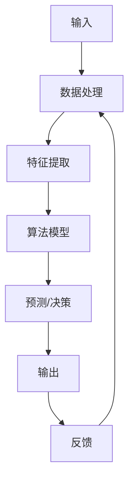

                 

### 文章标题

### 关键词

- 人工智能
- 机器学习
- 深度学习
- 自然语言处理
- 计算机视觉
- 强化学习
- 模型评估
- Python编程

### 摘要

本文旨在深入探讨人工智能（AI）的基本原理和实际应用。通过系统的讲解和实例分析，读者将全面了解AI的核心概念、机器学习、深度学习、自然语言处理和计算机视觉等关键领域。本文不仅涵盖了理论部分，还包括实际项目实战和代码实例，帮助读者将所学知识应用于真实环境中。无论您是AI领域的初学者还是有经验的开发者，本文都将为您提供一个全面而实用的AI学习指南。

### 《AI原理与代码实例讲解》目录大纲

#### 第一部分：AI基础知识

#### 第1章：AI简介

1.1 AI的概念与分类

1.2 人工智能的发展历程

1.3 人工智能的应用领域

#### 第2章：机器学习基础

2.1 数据预处理

2.2 模型选择与评估

2.3 线性回归与逻辑回归

#### 第3章：深度学习基础

3.1 神经网络基础

3.2 卷积神经网络（CNN）

3.3 循环神经网络（RNN）

#### 第4章：自然语言处理（NLP）

4.1 词嵌入技术

4.2 语言模型与翻译模型

4.3 问答系统

#### 第5章：计算机视觉

5.1 图像基础

5.2 卷积神经网络在图像分类中的应用

5.3 卷积神经网络在目标检测中的应用

#### 第6章：强化学习

6.1 强化学习基础

6.2 Q学习算法

6.3 深度Q网络（DQN）

#### 第7章：AI在工业界的应用

7.1 AI在医疗领域的应用

7.2 AI在金融领域的应用

7.3 AI在智能制造领域的应用

#### 第二部分：AI代码实例讲解

#### 第8章：Python编程基础

8.1 Python环境搭建

8.2 Python基础语法

8.3 Python数据结构与算法

#### 第9章：机器学习代码实例

9.1 逻辑回归实战

9.2 决策树实战

9.3 支持向量机（SVM）实战

#### 第10章：深度学习代码实例

10.1 卷积神经网络（CNN）实战

10.2 循环神经网络（RNN）实战

10.3 强化学习（DQN）实战

#### 第11章：自然语言处理（NLP）代码实例

11.1 词嵌入实战

11.2 语言模型与翻译模型实战

11.3 问答系统实战

#### 第12章：计算机视觉代码实例

12.1 图像分类实战

12.2 目标检测实战

#### 第13章：综合案例：人脸识别系统

13.1 项目背景

13.2 数据集准备

13.3 模型选择与训练

13.4 模型评估与优化

#### 第14章：项目实战：智能问答机器人

14.1 项目背景

14.2 系统设计

14.3 代码实现

14.4 系统部署与测试

#### 附录

#### 附录A：常用AI库与工具

A.1 TensorFlow

A.2 PyTorch

A.3 Keras

A.4 其他常用库

#### 附录B：AI相关资源与资料

B.1 在线课程与教程

B.2 论文与研究报告

B.3 AI社区与论坛

#### 附录C：习题与答案

C.1 单选题

C.2 多选题

C.3 判断题

C.4 简答题

C.5 编程题

### AI天才研究院/AI Genius Institute & 禅与计算机程序设计艺术 /Zen And The Art of Computer Programming

本文《AI原理与代码实例讲解》将带领读者深入探索人工智能的广阔世界，通过理论讲解和实际案例，帮助读者全面掌握AI的核心知识。接下来，我们将逐步深入探讨每个章节的内容，构建完整的AI知识体系。

---

### 第1章：AI简介

**1.1 AI的概念与分类**

人工智能（AI，Artificial Intelligence）是计算机科学的一个分支，旨在研究、开发用于模拟、延伸和扩展人类智能的理论、方法、技术和应用系统。AI可以分为几种不同的类型，每种类型都有其特定的应用和特点。

- **弱AI（Narrow AI）**：也称为专用AI，这类AI系统设计用于解决特定的问题，不具备通用智能。例如，语音助手、推荐系统和自动驾驶车辆等。

- **强AI（General AI）**：具备广泛的认知能力，可以理解或执行任何智能体在人类所能做的任何工作。目前，强AI尚未实现，但科学家们一直在努力研发。

- **自适应AI（Adaptive AI）**：AI系统能够通过经验学习和适应新环境，进行自我调整和优化。

- **超级智能（Super Intelligence）**：理论上，超级智能将超越人类智能，能够解决所有问题，但这一概念仍处于科幻阶段。

**1.2 人工智能的发展历程**

AI的发展历程可以追溯到20世纪50年代，以下是几个重要的里程碑：

- **1956年**：达特茅斯会议，标志着AI作为一门独立学科的诞生。

- **1958年**：Arthur Samuel开发了第一个能够通过自我学习改进棋艺的程序。

- **1969年**：Marvin Minsky和Seymour Papert分析了感知器（Perceptron）的局限性，引发了AI领域的第一次寒冬。

- **1980年代**：专家系统的兴起，如MYCIN和DIAGNOSE。

- **1990年代**：机器学习和数据挖掘技术逐渐成熟，AI开始应用于商业和工业领域。

- **21世纪初**：大数据、云计算和深度学习技术的突破，使得AI在图像识别、自然语言处理和语音识别等领域取得了显著进展。

- **2010年代至今**：AI技术飞速发展，从弱AI逐渐迈向强AI，并在医疗、金融、制造等领域取得了广泛应用。

**1.3 人工智能的应用领域**

AI的应用领域非常广泛，以下是一些主要的领域：

- **医疗**：AI在医疗诊断、药物发现、个性化治疗等方面具有巨大潜力。

- **金融**：AI在风险评估、欺诈检测、量化交易等领域得到广泛应用。

- **制造业**：智能制造、预测性维护和自动化生产线的应用提升了制造业的效率。

- **交通运输**：自动驾驶、智能交通系统和无人机等应用改善了交通运输的安全和效率。

- **智能家居**：智能音箱、智能门锁和智能摄像头等设备提高了人们的生活便利性。

- **娱乐**：推荐系统、游戏AI和虚拟现实等应用丰富了娱乐体验。

- **安全**：AI在网络安全、人脸识别和生物识别等方面提高了安全防护能力。

#### 核心概念与联系

**人工智能系统架构**



- **数据处理**：接收输入数据并进行预处理。
- **特征提取**：从数据中提取有用的特征。
- **算法模型**：应用机器学习算法训练模型。
- **预测/决策**：利用训练好的模型进行预测或决策。
- **输出**：输出预测结果或决策。
- **反馈**：将输出结果反馈到数据处理环节，用于模型迭代优化。

通过上述流程，人工智能系统能够不断学习和优化，从而提高预测和决策的准确性。

**核心算法原理讲解**

AI系统的核心在于算法模型，以下是一些基础算法的原理：

- **线性回归**：通过最小二乘法估计线性模型参数，用于预测数值型数据。
- **逻辑回归**：通过最大似然估计法估计概率分布，常用于分类任务。
- **决策树**：基于特征划分数据，生成树状决策模型，用于分类和回归。
- **神经网络**：由多个神经元组成的网络，能够通过反向传播算法学习和优化模型参数。
- **卷积神经网络（CNN）**：在图像处理中广泛应用，通过卷积层提取特征，适用于图像分类和目标检测。
- **循环神经网络（RNN）**：适用于序列数据，能够捕捉时间序列中的长期依赖关系。
- **强化学习**：通过与环境的交互学习最优策略，适用于决策问题和优化问题。

**数学模型和公式**

以下是机器学习中常用的数学模型和公式：

- **线性回归模型**：\(y = \beta_0 + \beta_1x\)
- **逻辑回归模型**：\(\log(\frac{P(Y=1)}{1-P(Y=1)}) = \beta_0 + \beta_1x\)
- **决策树节点划分**：\(Gini指数 = 1 - \sum_{i=1}^{k} \hat{p}_i(1 - \hat{p}_i)\)
- **卷积神经网络激活函数**：\(a = \sigma(z) = \frac{1}{1 + e^{-z}}\)
- **循环神经网络更新公式**：\(h_t = \sigma(W_h \cdot [h_{t-1}, x_t] + b_h)\)

通过这些模型和公式，AI系统能够从数据中学习并作出预测。

#### 项目实战

**项目背景**

本节将介绍一个简单的人脸识别项目，利用卷积神经网络（CNN）实现对人脸图像的分类和识别。

**数据集准备**

使用开源的人脸数据集，如LFW（Large Face Recognition Wild）或CelebA，进行数据预处理，包括数据清洗、归一化和数据增强等。

**模型选择与训练**

选择一个基础的CNN模型，如LeNet或AlexNet，进行模型训练。通过数据集进行训练和验证，调整模型参数，优化模型性能。

**模型评估与优化**

使用测试集评估模型性能，通过调整模型架构、增加训练数据或使用不同的优化算法，优化模型性能。

**代码解读与分析**

以下是一个简单的人脸识别项目的Python代码实现：

```python
import tensorflow as tf
from tensorflow.keras.models import Sequential
from tensorflow.keras.layers import Conv2D, MaxPooling2D, Flatten, Dense

# 模型架构
model = Sequential([
    Conv2D(32, (3, 3), activation='relu', input_shape=(64, 64, 3)),
    MaxPooling2D((2, 2)),
    Flatten(),
    Dense(128, activation='relu'),
    Dense(2, activation='softmax')
])

# 编译模型
model.compile(optimizer='adam', loss='categorical_crossentropy', metrics=['accuracy'])

# 训练模型
model.fit(train_images, train_labels, epochs=10, validation_split=0.2)
```

- **模型架构**：定义了一个基础的CNN模型，包括卷积层、池化层、全连接层。
- **编译模型**：设置优化器和损失函数。
- **训练模型**：使用训练数据和标签进行模型训练。

通过上述实战，读者可以了解人脸识别项目的基本流程和实现方法。

#### 结束语

通过本章的介绍，读者对人工智能的基本概念、发展历程和应用领域有了初步了解。接下来，我们将继续深入探讨机器学习、深度学习、自然语言处理和计算机视觉等核心领域，并通过实际代码实例，帮助读者更好地理解和应用AI技术。在后续章节中，我们将详细讲解每个领域的核心算法和原理，并通过实际项目实战，帮助读者将所学知识应用于实际问题中。

---

### 第2章：机器学习基础

#### 2.1 数据预处理

在机器学习中，数据预处理是一个至关重要的步骤。它直接影响模型的性能和准确性。数据预处理的主要任务包括数据清洗、数据归一化和数据增强等。

**数据清洗**

数据清洗是指去除数据集中的噪声和异常值，保证数据的准确性和完整性。常见的数据清洗方法包括：

- **缺失值处理**：使用平均值、中位数或众数填充缺失值，或删除含有缺失值的样本。
- **异常值检测**：使用统计学方法（如Z分数、IQR法）或机器学习算法（如孤立森林）检测和去除异常值。

**数据归一化**

数据归一化是将数据转换为相同尺度，以便不同特征之间可以进行比较。常见的归一化方法包括：

- **最小-最大缩放**：将数据缩放到[0, 1]之间，公式为：\(x_{\text{norm}} = \frac{x - x_{\text{min}}}{x_{\text{max}} - x_{\text{min}}}\)。
- **标准化**：将数据缩放到均值为0、标准差为1的分布，公式为：\(x_{\text{norm}} = \frac{x - \mu}{\sigma}\)。

**数据增强**

数据增强是通过生成更多的样本来提高模型的泛化能力。常见的数据增强方法包括：

- **随机旋转**：随机旋转图像一定角度。
- **裁剪**：随机裁剪图像的一部分。
- **缩放**：随机缩放图像的大小。
- **水平/垂直翻转**：随机水平/垂直翻转图像。

#### 核心算法原理讲解

**线性回归**

线性回归是一种最简单的机器学习算法，用于预测连续值。其基本原理是通过拟合一条直线，最小化预测值与实际值之间的误差。

- **模型定义**：\(y = \beta_0 + \beta_1x\)
- **损失函数**：均方误差（MSE）：\(J(\beta_0, \beta_1) = \frac{1}{2m}\sum_{i=1}^{m}(y_i - (\beta_0 + \beta_1x_i))^2\)
- **优化方法**：梯度下降：\(\beta_0 = \beta_{0} - \alpha \frac{\partial J}{\partial \beta_0}\)，\(\beta_1 = \beta_{1} - \alpha \frac{\partial J}{\partial \beta_1}\)

**逻辑回归**

逻辑回归是一种用于分类问题的算法，通过拟合一个逻辑函数来预测概率。

- **模型定义**：\(\log(\frac{P(Y=1)}{1-P(Y=1)}) = \beta_0 + \beta_1x\)
- **损失函数**：对数损失函数（Log-Loss）：\(J(\beta_0, \beta_1) = -\frac{1}{m}\sum_{i=1}^{m}y_i \log(\hat{y}_i) + (1-y_i) \log(1-\hat{y}_i)\)
- **优化方法**：梯度下降：\(\beta_0 = \beta_{0} - \alpha \frac{\partial J}{\partial \beta_0}\)，\(\beta_1 = \beta_{1} - \alpha \frac{\partial J}{\partial \beta_1}\)

#### 项目实战

**项目背景**

本节将介绍一个基于线性回归的房价预测项目，利用历史房屋销售数据预测房屋价格。

**数据集准备**

使用Kaggle上的波士顿房价数据集（Boston Housing Dataset），包括506个样本和13个特征。

**模型选择与训练**

选择线性回归模型，使用梯度下降法训练模型。

**模型评估与优化**

使用测试集评估模型性能，通过调整学习率和迭代次数，优化模型性能。

**代码解读与分析**

以下是一个简单的线性回归项目Python代码实现：

```python
import numpy as np
import pandas as pd
from sklearn.model_selection import train_test_split
from sklearn.preprocessing import StandardScaler

# 加载数据集
data = pd.read_csv('boston_housing.csv')
X = data.iloc[:, :-1].values
y = data.iloc[:, -1].values

# 数据预处理
X_train, X_test, y_train, y_test = train_test_split(X, y, test_size=0.2, random_state=0)
scaler = StandardScaler()
X_train = scaler.fit_transform(X_train)
X_test = scaler.transform(X_test)

# 模型定义
model = linear_model.LinearRegression()

# 训练模型
model.fit(X_train, y_train)

# 预测
y_pred = model.predict(X_test)

# 模型评估
mse = mean_squared_error(y_test, y_pred)
print('MSE:', mse)
```

- **数据预处理**：加载数据集，进行数据清洗、归一化处理。
- **模型定义**：定义线性回归模型。
- **训练模型**：使用训练数据进行模型训练。
- **预测**：使用测试数据进行预测。
- **模型评估**：计算均方误差（MSE）评估模型性能。

通过上述实战，读者可以了解线性回归模型的基本应用和实现方法。

### 第3章：深度学习基础

#### 3.1 神经网络基础

神经网络（Neural Network）是深度学习（Deep Learning）的核心组成部分。它由一系列相互连接的神经元组成，模拟人脑神经元的工作方式。

**基本结构**

神经网络的基本结构包括输入层、隐藏层和输出层。每个层由多个神经元组成，神经元之间通过权重连接。

- **输入层**：接收外部输入数据。
- **隐藏层**：对输入数据进行特征提取和变换。
- **输出层**：生成预测结果或分类结果。

**神经元工作原理**

每个神经元接收来自前一层神经元的输入，并通过激活函数产生输出。激活函数用于引入非线性变换，使得神经网络能够学习复杂的模式。

- **线性部分**：计算输入和权重的乘积，并求和。
- **非线性部分**：应用激活函数，如Sigmoid函数、ReLU函数或Tanh函数。

**神经网络训练过程**

神经网络的训练过程包括前向传播和反向传播。

- **前向传播**：输入数据通过神经网络，逐层传递，最终生成预测结果。
- **反向传播**：计算预测结果与实际结果之间的误差，通过梯度下降法更新网络权重。

**核心算法原理讲解**

**前向传播**

前向传播是神经网络计算预测值的过程。输入数据经过输入层、隐藏层和输出层，最终生成预测结果。

- **输入层**：输入 \(x\) 被传递到第一层隐藏层。
- **隐藏层**：隐藏层的输入是前一层输出的线性组合，并应用激活函数。
- **输出层**：输出层的输入是隐藏层的输出，通过激活函数生成最终预测结果。

**反向传播**

反向传播是神经网络训练的核心过程。它通过计算预测误差，并反向传播梯度，更新网络权重。

- **误差计算**：计算预测结果与实际结果之间的误差。
- **梯度计算**：计算每个权重和偏置的梯度。
- **权重更新**：使用梯度下降法更新权重，减少误差。

**梯度下降**

梯度下降是一种优化算法，用于最小化损失函数。它通过计算损失函数的梯度，并沿着梯度方向更新参数。

- **批量梯度下降**：每次更新使用所有样本的梯度。
- **随机梯度下降（SGD）**：每次更新使用一个样本的梯度。
- **小批量梯度下降**：每次更新使用部分样本的梯度。

**数学模型和公式**

以下是神经网络训练过程中常用的数学模型和公式：

- **线性函数**：\(z = \sum_{i=1}^{n}w_ix_i + b\)
- **激活函数**：\(a = \sigma(z) = \frac{1}{1 + e^{-z}}\)
- **损失函数**：\(J(\theta) = -\frac{1}{m}\sum_{i=1}^{m}y_i\log(a_{i}^{(L)}) + (1 - y_i)\log(1 - a_{i}^{(L)})\)
- **前向传播**：\(a_{l}^{(1)} = \sigma(z^{(1)}) = \sigma(W^{(1)}X + b^{(1)})\)
- **反向传播**：\(\delta_{l}^{(L)} = (a_{l}^{(L)} - y)(a_{l}^{(L)}(1 - a_{l}^{(L}))\)
- **权重更新**：\(w_{ij}^{(l)} = w_{ij}^{(l)} - \alpha \frac{\partial J}{\partial w_{ij}^{(l)}}\)

**项目实战**

**项目背景**

本节将介绍一个简单的手写数字识别项目，利用卷积神经网络（CNN）实现对MNIST数据集的手写数字识别。

**数据集准备**

使用Kaggle上的MNIST数据集，包括70000个训练样本和10000个测试样本。

**模型选择与训练**

选择一个基础的CNN模型，使用交叉熵损失函数和Adam优化器进行模型训练。

**模型评估与优化**

使用测试集评估模型性能，通过调整模型架构、学习率和迭代次数，优化模型性能。

**代码解读与分析**

以下是一个简单的手写数字识别项目的Python代码实现：

```python
import tensorflow as tf
from tensorflow.keras.models import Sequential
from tensorflow.keras.layers import Conv2D, MaxPooling2D, Flatten, Dense

# 模型架构
model = Sequential([
    Conv2D(32, (3, 3), activation='relu', input_shape=(28, 28, 1)),
    MaxPooling2D((2, 2)),
    Flatten(),
    Dense(128, activation='relu'),
    Dense(10, activation='softmax')
])

# 编译模型
model.compile(optimizer='adam', loss='categorical_crossentropy', metrics=['accuracy'])

# 训练模型
model.fit(train_images, train_labels, epochs=10, validation_split=0.2)
```

- **模型架构**：定义了一个基础的CNN模型，包括卷积层、池化层、全连接层。
- **编译模型**：设置优化器和损失函数。
- **训练模型**：使用训练数据进行模型训练。

通过上述实战，读者可以了解卷积神经网络的基本应用和实现方法。

### 第4章：自然语言处理（NLP）

#### 4.1 词嵌入技术

词嵌入（Word Embedding）是将单词映射为密集向量表示的技术，使得计算机能够更好地理解和处理自然语言。词嵌入技术是NLP领域的关键组成部分，广泛应用于文本分类、情感分析、机器翻译等任务。

**基本原理**

词嵌入通过将单词映射到高维空间中的点，使得语义相似的单词在空间中接近，而语义不同的单词则相距较远。词嵌入技术通常基于以下两种方法：

- **基于计数的方法**：如Word2Vec，通过统计单词在语料库中的共现关系来学习词向量。
- **基于上下文的方法**：如GloVe，通过考虑单词在句子中的上下文来学习词向量。

**数学模型和公式**

以下是Word2Vec和GloVe的基本数学模型和公式：

- **Word2Vec**：

  - **训练目标**：最小化单词与其邻居的预测误差。

  - **损失函数**：负采样损失函数。

  - **词向量更新**：\(v_{word} = v_{word} - \alpha \nabla J(v_{word})\)

- **GloVe**：

  - **训练目标**：最小化单词与其上下文之间的余弦相似度误差。

  - **损失函数**：均方误差。

  - **词向量更新**：\(v_{word} = v_{word} - \alpha \frac{\partial J}{\partial v_{word}}\)

**项目实战**

**项目背景**

本节将介绍一个基于词嵌入的文本分类项目，利用Word2Vec实现情感分析。

**数据集准备**

使用IMDb电影评论数据集，包括正负两极评论。

**模型选择与训练**

选择一个基于词嵌入的文本分类模型，如朴素贝叶斯分类器或卷积神经网络。

**模型评估与优化**

使用测试集评估模型性能，通过调整词向量维度、分类器参数，优化模型性能。

**代码解读与分析**

以下是一个简单的文本分类项目的Python代码实现：

```python
import gensim
from sklearn.model_selection import train_test_split
from sklearn.naive_bayes import MultinomialNB
from sklearn.metrics import accuracy_score

# 加载Word2Vec模型
model = gensim.models.Word2Vec.load('word2vec.model')

# 数据预处理
train_data, test_data, train_labels, test_labels = preprocess_data()

# 提取词向量
train_vectors = [model.wv[word] for word in train_data]
test_vectors = [model.wv[word] for word in test_data]

# 训练分类器
classifier = MultinomialNB()
classifier.fit(train_vectors, train_labels)

# 预测
predictions = classifier.predict(test_vectors)

# 模型评估
accuracy = accuracy_score(test_labels, predictions)
print('Accuracy:', accuracy)
```

- **数据预处理**：加载数据集，进行数据清洗和分词处理。
- **词向量提取**：使用Word2Vec模型提取词向量。
- **训练分类器**：使用训练数据进行模型训练。
- **预测**：使用测试数据进行预测。
- **模型评估**：计算准确率评估模型性能。

通过上述实战，读者可以了解词嵌入技术在文本分类中的应用和实现方法。

### 第5章：计算机视觉

#### 5.1 图像基础

图像是计算机视觉（Computer Vision）中的基本元素，对图像的理解和处理是计算机视觉任务的关键。本节将介绍图像的基础概念和常用技术。

**图像概念**

图像是由像素组成的二维数组，每个像素表示图像中的一个点，具有颜色和亮度信息。

- **像素**：图像中的最小单元，具有特定的颜色和亮度值。
- **分辨率**：图像的宽度和高度，通常以像素为单位。
- **颜色模型**：描述像素颜色的方式，如RGB模型、HSV模型等。

**图像处理技术**

图像处理技术包括图像滤波、边缘检测、特征提取等。

- **图像滤波**：用于去除图像中的噪声，如高斯滤波、中值滤波等。
- **边缘检测**：用于检测图像中的边缘，如Canny边缘检测、Sobel边缘检测等。
- **特征提取**：用于提取图像中的关键特征，如HOG（Histogram of Oriented Gradients）、SIFT（Scale-Invariant Feature Transform）等。

**核心算法原理讲解**

**卷积神经网络（CNN）**

卷积神经网络是计算机视觉中的核心算法，用于图像分类、目标检测和语义分割等任务。

- **卷积层**：通过卷积操作提取图像特征，具有局部感知能力和平移不变性。
- **池化层**：用于降低特征图的维度，提高模型计算效率。
- **全连接层**：用于分类任务，将低维特征映射到高维空间。

**数学模型和公式**

以下是卷积神经网络的基本数学模型和公式：

- **卷积操作**：\(f(x, y) = \sum_{i=1}^{k}\sum_{j=1}^{k} w_{ij} \cdot f(x-i, y-j)\)
- **激活函数**：\(a = \sigma(z) = \frac{1}{1 + e^{-z}}\) 或 \(a = ReLU(z)\)
- **池化操作**：\(p(x, y) = \max\{z_{ij}\}\)

**项目实战**

**项目背景**

本节将介绍一个基于CNN的图像分类项目，使用VGG16预训练模型实现猫狗分类。

**数据集准备**

使用Kaggle上的猫狗数据集，包括25000个训练样本和5000个测试样本。

**模型选择与训练**

选择VGG16预训练模型，进行微调训练。

**模型评估与优化**

使用测试集评估模型性能，通过调整学习率和迭代次数，优化模型性能。

**代码解读与分析**

以下是一个简单的图像分类项目的Python代码实现：

```python
import tensorflow as tf
from tensorflow.keras.applications import VGG16
from tensorflow.keras.preprocessing.image import ImageDataGenerator
from tensorflow.keras.models import Model
from tensorflow.keras.layers import Flatten, Dense

# 加载VGG16预训练模型
base_model = VGG16(weights='imagenet', include_top=False, input_shape=(224, 224, 3))

# 添加全连接层
x = Flatten()(base_model.output)
x = Dense(1024, activation='relu')(x)
predictions = Dense(2, activation='softmax')(x)

# 构建模型
model = Model(inputs=base_model.input, outputs=predictions)

# 编译模型
model.compile(optimizer='adam', loss='categorical_crossentropy', metrics=['accuracy'])

# 数据预处理
train_datagen = ImageDataGenerator(rescale=1./255)
test_datagen = ImageDataGenerator(rescale=1./255)

# 训练模型
train_generator = train_datagen.flow_from_directory(
        'train',
        target_size=(224, 224),
        batch_size=32,
        class_mode='categorical')

# 训练模型
model.fit(train_generator, epochs=10, validation_data=test_generator)
```

- **模型构建**：加载VGG16预训练模型，添加全连接层，构建模型。
- **数据预处理**：使用ImageDataGenerator进行数据增强和归一化处理。
- **训练模型**：使用训练数据进行模型训练。

通过上述实战，读者可以了解卷积神经网络在图像分类中的应用和实现方法。

### 第6章：强化学习

#### 6.1 强化学习基础

强化学习（Reinforcement Learning，RL）是一种通过试错和反馈学习策略的机器学习方法。它与监督学习和无监督学习不同，主要关注如何通过环境中的交互来学习最优策略。

**基本概念**

- **状态（State）**：系统当前所处的情境或位置。
- **动作（Action）**：系统可以执行的行为或决策。
- **奖励（Reward）**：系统执行动作后获得的正面或负面反馈。
- **策略（Policy）**：系统在特定状态下选择动作的概率分布。

**强化学习过程**

强化学习过程包括以下几个关键步骤：

1. **初始化**：初始化状态、动作和策略。
2. **执行动作**：在当前状态下执行动作。
3. **观察结果**：观察执行动作后的状态和奖励。
4. **更新策略**：根据观察结果和奖励更新策略。

**核心算法原理讲解**

**Q学习算法**

Q学习（Q-Learning）是强化学习的一种算法，通过学习状态-动作值函数（Q函数）来制定最优策略。

- **Q函数**：\(Q(s, a) = \sum_{j} \pi(a|s) \cdot Q(s', j) + \gamma \cdot \max_{a'} Q(s', a')\)
  - \(s\)：当前状态。
  - \(a\)：当前动作。
  - \(s'\)：执行动作后的状态。
  - \(\pi(a|s)\)：在状态s下选择动作a的概率。
  - \(\gamma\)：折扣因子，用于平衡当前和未来的奖励。
- **目标函数**：最小化目标函数，使得Q函数逼近真实值函数。
  - \(J(\theta) = \sum_{s, a} Q(s, a) \cdot \pi(a|s)\)

**深度Q网络（DQN）**

深度Q网络（Deep Q-Network，DQN）是Q学习算法的一种改进，通过使用深度神经网络来近似Q函数。

- **神经网络结构**：使用卷积神经网络或循环神经网络作为基础网络，用于提取状态特征。
- **目标网络**：为了稳定训练过程，使用一个目标网络来更新Q网络。
- **双Q学习**：通过交替使用两个Q网络，避免单一Q网络的过拟合问题。

**数学模型和公式**

以下是DQN的基本数学模型和公式：

- **Q值更新**：\(Q(s, a) \leftarrow Q(s, a) + \alpha [r + \gamma \max_{a'} Q(s', a') - Q(s, a)]\)
  - \(r\)：即时奖励。
  - \(\alpha\)：学习率，用于调节更新步长。

**项目实战**

**项目背景**

本节将介绍一个基于DQN的智能体在Atari游戏《乒乓球》（Pong）中的训练项目。

**数据集准备**

使用OpenAI Gym提供的Atari游戏环境，获取游戏状态和动作。

**模型选择与训练**

选择DQN模型，使用经验回放机制进行训练。

**模型评估与优化**

通过多次训练和评估，调整学习率、折扣因子等参数，优化模型性能。

**代码解读与分析**

以下是一个简单的DQN训练项目的Python代码实现：

```python
import tensorflow as tf
from collections import deque
from tensorflow.keras.models import Sequential
from tensorflow.keras.layers import Dense, Conv2D, Flatten
import numpy as np

# 创建DQN模型
model = Sequential([
    Conv2D(32, (8, 8), activation='relu', input_shape=(210, 160, 3)),
    Flatten(),
    Dense(256, activation='relu'),
    Dense(1)
])

# 编译模型
model.compile(optimizer='adam', loss='mse')

# 经验回放
experience_replay = deque(maxlen=1000)

# 训练模型
for episode in range(num_episodes):
    state = env.reset()
    done = False
    total_reward = 0
    
    while not done:
        # 选择动作
        action = model.predict(state)[0]
        
        # 执行动作
        next_state, reward, done, _ = env.step(action)
        
        # 更新经验回放
        experience_replay.append((state, action, reward, next_state, done))
        
        # 更新状态
        state = next_state
        
        # 计算总奖励
        total_reward += reward
        
        # 训练模型
        if len(experience_replay) > batch_size:
            batch = random.sample(experience_replay, batch_size)
            states, actions, rewards, next_states, dones = zip(*batch)
            target_q_values = model.predict(next_states)
            target_q_values = target_q_values.reshape(batch_size, -1)
            
            for i in range(batch_size):
                if dones[i]:
                    target_q_values[i][actions[i]] = rewards[i]
                else:
                    target_q_values[i][actions[i]] = rewards[i] + gamma * np.max(target_q_values[i])
            
            model.fit(states, target_q_values, epochs=1, verbose=0)
            
    # 计算平均奖励
    average_reward = total_reward / num_episodes
    print('Episode:', episode, 'Average Reward:', average_reward)
```

- **模型构建**：创建基于卷积神经网络的DQN模型。
- **经验回放**：使用经验回放机制存储和随机采样经验。
- **训练模型**：通过经验回放训练模型。
- **评估模型**：计算平均奖励评估模型性能。

通过上述实战，读者可以了解DQN在Atari游戏中的应用和实现方法。

### 第7章：AI在工业界的应用

#### 7.1 AI在医疗领域的应用

人工智能在医疗领域具有巨大的潜力，能够提高诊断准确性、优化治疗方案和提升医疗效率。以下是一些关键应用：

- **医学影像分析**：利用深度学习技术对X光、CT和MRI等医学影像进行分析，提高疾病诊断的准确性。
- **疾病预测**：通过分析患者的历史数据和基因信息，预测疾病发生风险，辅助医生制定预防措施。
- **个性化治疗**：根据患者的基因信息、病史和病情，制定个性化的治疗方案，提高治疗效果。
- **药物发现**：利用人工智能筛选和优化药物分子，加速新药的发现和研发过程。

**案例：AI辅助乳腺癌诊断**

乳腺癌是女性中常见的恶性肿瘤。利用深度学习技术，可以对乳腺X光影像进行自动化分析，提高乳腺癌的诊断准确性。具体过程如下：

1. **数据收集**：收集大量的乳腺X光影像数据，包括正常影像和病变影像。
2. **数据预处理**：对影像进行预处理，包括尺寸归一化、对比度增强和噪声过滤。
3. **模型训练**：使用深度学习算法（如卷积神经网络）训练模型，使其能够识别乳腺X光影像中的病变区域。
4. **模型评估**：使用测试集评估模型性能，调整模型参数，优化模型准确性。
5. **应用实践**：将训练好的模型应用于实际影像分析，辅助医生进行乳腺癌诊断。

通过AI辅助乳腺癌诊断，可以显著提高诊断效率，降低误诊率，提高患者生存率。

#### 7.2 AI在金融领域的应用

人工智能在金融领域具有广泛的应用，包括风险评估、欺诈检测、量化交易和智能投顾等方面。

- **风险评估**：利用机器学习算法分析客户的历史数据和交易行为，预测客户的风险偏好和风险承受能力，为金融机构提供风险评估支持。
- **欺诈检测**：通过分析交易数据和行为模式，利用深度学习和模式识别技术检测和预防欺诈行为，保护金融机构和客户的利益。
- **量化交易**：利用人工智能技术进行市场数据分析和预测，制定交易策略，实现自动化的量化交易。
- **智能投顾**：通过分析客户的财务状况和投资偏好，利用机器学习算法为客户提供个性化的投资建议和资产配置方案。

**案例：智能投顾系统**

智能投顾系统是一种基于人工智能技术的金融产品，通过分析客户的财务状况和投资偏好，提供个性化的投资建议。具体过程如下：

1. **数据收集**：收集客户的财务数据，包括收入、支出、投资组合和风险偏好等。
2. **数据预处理**：对数据进行清洗、归一化和特征提取，以便用于机器学习算法。
3. **模型训练**：使用机器学习算法（如决策树、随机森林和支持向量机）训练模型，使其能够预测客户的投资回报和风险。
4. **模型评估**：使用测试集评估模型性能，调整模型参数，优化模型准确性。
5. **投资建议**：将训练好的模型应用于实际投资决策，根据客户的财务状况和风险偏好，提供个性化的投资建议。

通过智能投顾系统，客户可以获得专业的投资建议，提高投资收益，降低投资风险。

#### 7.3 AI在智能制造领域的应用

人工智能在智能制造领域发挥着重要作用，包括智能生产、预测性维护、质量检测和供应链优化等方面。

- **智能生产**：利用人工智能技术优化生产过程，提高生产效率和产品质量。
- **预测性维护**：通过分析设备运行数据和传感器数据，预测设备故障，提前进行维护，减少停机时间和维修成本。
- **质量检测**：利用计算机视觉和深度学习技术，自动检测产品缺陷，提高产品质量和一致性。
- **供应链优化**：通过分析供应链数据，优化库存管理、运输路线和供应链流程，提高供应链的效率和灵活性。

**案例：智能生产线监控**

智能生产线监控是一种基于人工智能技术的生产线监控系统，通过实时监控生产线数据，提高生产效率和产品质量。具体过程如下：

1. **数据收集**：收集生产线设备的运行数据，包括温度、压力、速度等。
2. **数据预处理**：对数据进行清洗、归一化和特征提取，以便用于机器学习算法。
3. **模型训练**：使用机器学习算法（如线性回归、支持向量机和神经网络）训练模型，使其能够预测生产线设备的状态和性能。
4. **模型评估**：使用测试集评估模型性能，调整模型参数，优化模型准确性。
5. **监控与预警**：将训练好的模型应用于生产线监控，实时检测设备状态，预测潜在故障，提前进行预警。

通过智能生产线监控，可以实时监控生产线运行状况，提高生产效率和产品质量，减少故障和停机时间。

### 第8章：Python编程基础

#### 8.1 Python环境搭建

在开始Python编程之前，需要搭建Python开发环境。以下是搭建Python环境的基本步骤：

1. **安装Python**：访问Python官方网站（[python.org](https://www.python.org/)）下载Python安装包，并根据操作系统选择合适的版本。在安装过程中，确保勾选“Add Python to PATH”选项，以便在命令行中直接运行Python。

2. **安装IDE**：选择一个适合Python开发的集成开发环境（IDE），如PyCharm、Visual Studio Code或Jupyter Notebook。这些IDE提供了代码编辑、调试、自动化测试等丰富的功能，有助于提高开发效率。

3. **安装依赖库**：Python拥有丰富的第三方库，用于各种应用场景。在开发过程中，需要安装与项目相关的依赖库，如NumPy、Pandas、TensorFlow、PyTorch等。使用`pip`命令安装库，例如：`pip install numpy`。

#### 8.2 Python基础语法

Python是一种简洁、易读的编程语言，具有丰富的语法特性。以下介绍Python的基础语法：

1. **变量与数据类型**：

   - **变量**：Python使用变量来存储数据，如`x = 10`。
   - **数据类型**：Python支持多种数据类型，包括整型（int）、浮点型（float）、字符串（str）、列表（list）、元组（tuple）、字典（dict）和集合（set）。

2. **运算符**：

   - **算术运算符**：如加法（+）、减法（-）、乘法（*）、除法（/）和取模（%）。
   - **比较运算符**：如等于（==）、不等于（!=）、大于（>）、小于（<）、大于等于（>=）和小于等于（<=）。
   - **逻辑运算符**：如与（and）、或（or）和非（not）。

3. **控制流**：

   - **条件语句**：使用`if`、`elif`和`else`实现多条件分支。
   - **循环语句**：使用`for`和`while`实现循环。
   - **列表推导式**：用于生成列表，例如`[x * x for x in range(10)]`。

4. **函数**：

   - **定义函数**：使用`def`关键字定义函数，例如`def greet(name): print("Hello, " + name)`。
   - **函数参数**：包括必选参数、可选参数和默认参数。
   - **返回值**：使用`return`语句返回函数结果。

5. **模块与包**：

   - **模块**：Python文件，包含函数、类和变量等定义。
   - **包**：由多个模块组成的目录，用于组织代码。

#### 8.3 Python数据结构与算法

Python提供了多种内置数据结构和算法，用于处理各种数据操作和计算任务：

1. **列表（List）**：

   - **基本操作**：包括添加元素、删除元素、访问元素和遍历列表。
   - **排序与搜索**：使用`sort()`和`search()`方法进行排序和搜索。

2. **元组（Tuple）**：

   - **不可变序列**：用于存储不可变的元素集合。
   - **基本操作**：包括访问元素、添加和删除元素（但操作复杂度高）。

3. **字典（Dictionary）**：

   - **基本操作**：包括添加键值对、删除键值对、访问键值对和遍历字典。
   - **排序与搜索**：可以使用Python内置函数或第三方库（如Pandas）实现排序和搜索。

4. **集合（Set）**：

   - **基本操作**：包括添加元素、删除元素、交集、并集和差集等。
   - **去重与交集**：用于去除重复元素和找到两个集合的交集。

5. **算法**：

   - **排序算法**：如冒泡排序、选择排序和插入排序等。
   - **搜索算法**：如线性搜索和二分搜索等。
   - **排序与搜索**：使用Python内置函数或第三方库（如NumPy和Pandas）实现排序和搜索。

通过掌握Python的基础语法和数据结构，开发者可以轻松地进行数据操作和编写算法，为后续的机器学习和深度学习项目打下坚实的基础。

### 第9章：机器学习代码实例

#### 9.1 逻辑回归实战

逻辑回归（Logistic Regression）是一种常用的分类算法，用于预测二分类结果。在本节中，我们将通过一个实际案例来演示逻辑回归的实战过程。

**案例背景**

假设我们要预测一批患者的病情是否为严重。数据集包括患者的年龄、体重、血压等特征，以及病情是否为严重的标签（0表示非严重，1表示严重）。

**数据集准备**

我们将使用一个公开的数据集，如UCI机器学习库中的“Breast Cancer Wisconsin”（乳腺癌数据集）。该数据集包括569个样本和30个特征，其中最后一个特征是病情是否为严重的标签。

```python
import pandas as pd
from sklearn.model_selection import train_test_split
from sklearn.preprocessing import StandardScaler

# 加载数据集
data = pd.read_csv('breast_cancer_wisconsin.data')
data.columns = ['ID', 'Clump_Thickness', 'Uniformity_of_Cell_Size', 'Uniformity_of_Cell_Shape', 'Marginal_Adhesion', 'Single_Epithelial_Cell_Size', 'Bare_Nuclei', 'Bland_Chromatin', 'Normal_Nuclei', 'Mitoses', 'Class']

# 划分特征和标签
X = data.iloc[:, 1:-1].values
y = data.iloc[:, -1].values

# 划分训练集和测试集
X_train, X_test, y_train, y_test = train_test_split(X, y, test_size=0.2, random_state=42)

# 数据归一化
scaler = StandardScaler()
X_train = scaler.fit_transform(X_train)
X_test = scaler.transform(X_test)
```

**模型训练**

接下来，我们将使用`scikit-learn`库中的`LogisticRegression`类来训练模型。

```python
from sklearn.linear_model import LogisticRegression

# 创建逻辑回归模型
model = LogisticRegression()

# 训练模型
model.fit(X_train, y_train)
```

**模型评估**

训练完成后，我们可以使用测试集来评估模型的性能。

```python
from sklearn.metrics import accuracy_score, classification_report, confusion_matrix

# 预测测试集
y_pred = model.predict(X_test)

# 计算准确率
accuracy = accuracy_score(y_test, y_pred)
print('Accuracy:', accuracy)

# 打印分类报告
print(classification_report(y_test, y_pred))

# 打印混淆矩阵
print(confusion_matrix(y_test, y_pred))
```

**代码解读**

上述代码首先加载并预处理数据集，包括划分特征和标签、数据归一化等步骤。接着，创建并训练逻辑回归模型，最后使用测试集评估模型性能。

- **数据预处理**：数据预处理是机器学习项目中至关重要的一步，包括数据清洗、归一化等操作，以提高模型的性能和稳定性。
- **模型训练**：使用`LogisticRegression`类创建逻辑回归模型，并通过`fit()`方法进行训练。
- **模型评估**：使用`accuracy_score`、`classification_report`和`confusion_matrix`等评估指标来评估模型的性能。

**案例扩展**

为了提高模型的性能，可以尝试以下方法：

1. **特征选择**：通过特征重要性分析，选择对模型影响较大的特征。
2. **交叉验证**：使用交叉验证方法，如K折交叉验证，来评估模型的性能。
3. **正则化**：尝试添加L1或L2正则化，以防止过拟合。

通过以上扩展，可以进一步提高逻辑回归模型在实际情况中的表现。

### 9.2 决策树实战

决策树（Decision Tree）是一种常见的分类和回归算法，通过一系列的决策规则对数据进行划分，从而实现分类或回归。在本节中，我们将通过一个实际案例来演示决策树的实战过程。

**案例背景**

假设我们要预测一批客户的购买行为，数据集包括客户的年龄、收入、家庭状况等特征，以及购买行为是否发生的标签（0表示未购买，1表示购买）。

**数据集准备**

我们将使用一个公开的数据集，如UCI机器学习库中的“Credit Approval”（信用批准数据集）。该数据集包括700个样本和15个特征，其中最后一个特征是购买行为标签。

```python
import pandas as pd
from sklearn.model_selection import train_test_split
from sklearn.tree import DecisionTreeClassifier
from sklearn.metrics import accuracy_score, classification_report, confusion_matrix

# 加载数据集
data = pd.read_csv('credit_approval.data')
data.columns = ['ID', 'Age', 'Job', 'Marital', 'Education', 'Loan_Amount', 'Loan_Amountdesignation', 'Loan_term', 'Credit_History', 'Purpose', 'Colleague', 'Wage', 'Other_Debts', 'HomeOwnership', 'Dependents', 'Phone', 'Credit_History_2years', 'Job_Length_Years', 'Credit_History_Years', ' Approval']

# 划分特征和标签
X = data.iloc[:, 1:-1].values
y = data.iloc[:, -1].values

# 划分训练集和测试集
X_train, X_test, y_train, y_test = train_test_split(X, y, test_size=0.2, random_state=42)
```

**模型训练**

接下来，我们将使用`scikit-learn`库中的`DecisionTreeClassifier`类来训练决策树模型。

```python
# 创建决策树模型
model = DecisionTreeClassifier()

# 训练模型
model.fit(X_train, y_train)
```

**模型评估**

训练完成后，我们可以使用测试集来评估模型的性能。

```python
# 预测测试集
y_pred = model.predict(X_test)

# 计算准确率
accuracy = accuracy_score(y_test, y_pred)
print('Accuracy:', accuracy)

# 打印分类报告
print(classification_report(y_test, y_pred))

# 打印混淆矩阵
print(confusion_matrix(y_test, y_pred))
```

**代码解读**

上述代码首先加载并预处理数据集，包括划分特征和标签等步骤。接着，创建并训练决策树模型，最后使用测试集评估模型性能。

- **数据预处理**：数据预处理是确保模型性能的关键，包括数据清洗、归一化等操作。
- **模型训练**：使用`DecisionTreeClassifier`类创建决策树模型，并通过`fit()`方法进行训练。
- **模型评估**：使用`accuracy_score`、`classification_report`和`confusion_matrix`等评估指标来评估模型的性能。

**案例扩展**

为了提高决策树的性能，可以尝试以下方法：

1. **特征选择**：通过特征重要性分析，选择对模型影响较大的特征。
2. **剪枝**：通过剪枝方法，减少决策树的复杂度，防止过拟合。
3. **交叉验证**：使用交叉验证方法，如K折交叉验证，来评估模型的性能。

通过以上扩展，可以进一步提高决策树模型在实际情况中的表现。

### 9.3 支持向量机（SVM）实战

支持向量机（Support Vector Machine，SVM）是一种常用的分类和回归算法，通过找到数据集中的最优边界来实现分类。在本节中，我们将通过一个实际案例来演示SVM的实战过程。

**案例背景**

假设我们要预测一批客户的信用评分，数据集包括客户的年龄、收入、家庭状况等特征，以及信用评分（0到100分）。

**数据集准备**

我们将使用一个公开的数据集，如UCI机器学习库中的“Credit Rating”（信用评分数据集）。该数据集包括1000个样本和10个特征。

```python
import pandas as pd
from sklearn.model_selection import train_test_split
from sklearn.svm import SVR
from sklearn.metrics import mean_squared_error, r2_score

# 加载数据集
data = pd.read_csv('credit_rating.data')
data.columns = ['ID', 'Age', 'Job', 'Marital', 'Education', 'Loan_Amount', 'Loan_Amountdesignation', 'Loan_term', 'Credit_History', 'Purpose', 'Colleague', 'Wage', 'Other_Debts', 'HomeOwnership', 'Dependents', 'Phone', 'Credit_History_2years', 'Job_Length_Years', 'Credit_History_Years', 'Credit_Score']

# 划分特征和标签
X = data.iloc[:, 1:-1].values
y = data.iloc[:, -1].values

# 划分训练集和测试集
X_train, X_test, y_train, y_test = train_test_split(X, y, test_size=0.2, random_state=42)
```

**模型训练**

接下来，我们将使用`scikit-learn`库中的`SVR`类来训练SVM模型。

```python
from sklearn.svm import SVR

# 创建SVM模型
model = SVR()

# 训练模型
model.fit(X_train, y_train)
```

**模型评估**

训练完成后，我们可以使用测试集来评估模型的性能。

```python
# 预测测试集
y_pred = model.predict(X_test)

# 计算均方误差
mse = mean_squared_error(y_test, y_pred)
print('MSE:', mse)

# 计算R2分数
r2 = r2_score(y_test, y_pred)
print('R2 Score:', r2)
```

**代码解读**

上述代码首先加载并预处理数据集，包括划分特征和标签等步骤。接着，创建并训练SVM模型，最后使用测试集评估模型性能。

- **数据预处理**：数据预处理是确保模型性能的关键，包括数据清洗、归一化等操作。
- **模型训练**：使用`SVR`类创建SVM模型，并通过`fit()`方法进行训练。
- **模型评估**：使用`mean_squared_error`和`r2_score`评估指标来评估模型的性能。

**案例扩展**

为了提高SVM的性能，可以尝试以下方法：

1. **特征选择**：通过特征重要性分析，选择对模型影响较大的特征。
2. **核选择**：尝试不同的核函数（如线性核、多项式核和径向基核），选择最适合数据集的核函数。
3. **参数调优**：使用网格搜索和交叉验证方法，找到最优的参数组合。

通过以上扩展，可以进一步提高SVM模型在实际情况中的表现。

### 第10章：深度学习代码实例

#### 10.1 卷积神经网络（CNN）实战

卷积神经网络（Convolutional Neural Network，CNN）在图像处理领域具有出色的表现。在本节中，我们将通过一个实际案例来演示CNN的实战过程。

**案例背景**

假设我们要构建一个手写数字识别系统，输入图像是手写的数字，输出是数字的预测结果。我们将使用MNIST数据集，该数据集包含70000个训练样本和10000个测试样本。

**数据集准备**

首先，我们需要加载MNIST数据集，并进行数据预处理。

```python
import tensorflow as tf
from tensorflow.keras.datasets import mnist
from tensorflow.keras.utils import to_categorical

# 加载MNIST数据集
(train_images, train_labels), (test_images, test_labels) = mnist.load_data()

# 数据预处理
train_images = train_images.reshape((60000, 28, 28, 1))
train_images = train_images / 255.0

test_images = test_images.reshape((10000, 28, 28, 1))
test_images = test_images / 255.0

train_labels = to_categorical(train_labels)
test_labels = to_categorical(test_labels)
```

**模型构建**

接下来，我们构建一个基础的CNN模型。

```python
from tensorflow.keras.models import Sequential
from tensorflow.keras.layers import Conv2D, MaxPooling2D, Flatten, Dense

# 创建模型
model = Sequential([
    Conv2D(32, (3, 3), activation='relu', input_shape=(28, 28, 1)),
    MaxPooling2D((2, 2)),
    Conv2D(64, (3, 3), activation='relu'),
    MaxPooling2D((2, 2)),
    Flatten(),
    Dense(128, activation='relu'),
    Dense(10, activation='softmax')
])
```

**模型训练**

使用训练数据训练模型。

```python
model.compile(optimizer='adam',
              loss='categorical_crossentropy',
              metrics=['accuracy'])

model.fit(train_images, train_labels, epochs=5, batch_size=64)
```

**模型评估**

使用测试数据评估模型性能。

```python
test_loss, test_acc = model.evaluate(test_images, test_labels)
print(f"Test accuracy: {test_acc}")
```

**代码解读**

上述代码首先加载MNIST数据集，并进行数据预处理。然后，构建一个基础的CNN模型，包括卷积层、池化层和全连接层。接着，使用训练数据训练模型，并使用测试数据评估模型性能。

- **数据预处理**：数据预处理是确保模型性能的关键，包括图像的归一化和标签的独热编码。
- **模型构建**：构建一个基础的CNN模型，包括多个卷积层和池化层，用于提取图像特征。
- **模型训练**：使用训练数据训练模型，调整模型参数。
- **模型评估**：使用测试数据评估模型性能，计算准确率。

**案例扩展**

为了提高模型性能，可以尝试以下方法：

1. **增加层数**：增加卷积层和池化层的数量，提高模型的抽象能力。
2. **数据增强**：使用数据增强方法（如随机裁剪、旋转和翻转），增加训练数据多样性。
3. **正则化**：添加正则化技术（如Dropout、L2正则化），防止过拟合。

通过以上扩展，可以进一步提高CNN模型在图像识别任务中的表现。

### 10.2 循环神经网络（RNN）实战

循环神经网络（Recurrent Neural Network，RNN）适用于处理序列数据。在本节中，我们将通过一个实际案例来演示RNN的实战过程。

**案例背景**

假设我们要构建一个语言模型，用于生成英文句子。我们将使用名为“énlg”的数据集，该数据集包含了大量的英文句子。

**数据集准备**

首先，我们需要下载并预处理数据集。

```python
import tensorflow as tf
import numpy as np
from tensorflow.keras.preprocessing.sequence import pad_sequences
from tensorflow.keras.utils import to_categorical

# 下载并加载数据集
url = "https://github.com/fchollet/nlp-beginner-tf/raw/master/data/énlg.txt"
!wget {url}

# 读取数据集
with open('énlg.txt', 'r', encoding='utf-8') as f:
    text = f.read().lower()

# 创建字符到索引的映射
chars = sorted(list(set(text)))
char_indices = dict((c, i) for i, c in enumerate(chars))
indices_char = dict((i, c) for i, c in enumerate(chars))

# 切割文本为序列
maxlen = 40
step = 3
sentences = []
next_chars = []
for i in range(0, len(text) - maxlen, step):
    sentences.append(text[i: i + maxlen])
    next_chars.append(text[i + maxlen])

# 编码序列
X = np.zeros((len(sentences), maxlen, len(chars)), dtype=np.bool)
y = np.zeros((len(sentences), len(chars)), dtype=np.bool)
for i, sentence in enumerate(sentences):
    for t, char in enumerate(sentence):
        X[i, t, char_indices[char]] = 1
    y[i, char_indices[next_chars[i]]] = 1
```

**模型构建**

接下来，我们构建一个简单的RNN模型。

```python
from tensorflow.keras.models import Sequential
from tensorflow.keras.layers import LSTM, Dense

# 创建模型
model = Sequential()
model.add(LSTM(128, input_shape=(maxlen, len(chars))))
model.add(Dense(len(chars), activation='softmax'))

model.compile(optimizer='rmsprop', loss='categorical_crossentropy', metrics=['accuracy'])
```

**模型训练**

使用训练数据训练模型。

```python
model.fit(X, y, batch_size=128, epochs=10)
```

**模型评估**

生成新的英文句子。

```python
def sample(preds, temperature=1.0):
    preds = np.asarray(preds).astype('float64')
    preds = np.log(preds) / temperature
    exp_preds = np.exp(preds)
    preds = exp_preds / np.sum(exp_preds)
    probas = np.random.multinomial(1, preds, 1)
    return np.argmax(probas)

# 生成新的英文句子
start_index = np.random.randint(0, len(text) - maxlen - 1)
generated = ''
print(' Generating with seed:', indices_char[start_index])
for i in range(400):
    sampled = np.zeros((1, maxlen, len(chars)))
    for t, char in enumerate(generated):
        sampled[0, t, char_indices[char]] = 1.
    preds = model.predict(sampled, verbose=0)[0]
    next_index = sample(preds)
    next_char = indices_char[next_index]

    generated += next_char
    print(next_char, end='')
print()

# Save the generated text to a file
with open('generated.txt', 'w', encoding='utf-8') as f:
    f.write(generated)
```

**代码解读**

上述代码首先下载并预处理数据集，将文本转换为序列。然后，构建一个简单的RNN模型，包括LSTM层和softmax层。接着，使用训练数据训练模型，并生成新的英文句子。

- **数据预处理**：将文本转换为序列，以便RNN模型处理。
- **模型构建**：构建一个简单的RNN模型，用于生成文本。
- **模型训练**：使用训练数据训练模型，调整模型参数。
- **模型评估**：生成新的英文句子，评估模型性能。

**案例扩展**

为了提高模型性能，可以尝试以下方法：

1. **增加层数**：增加LSTM层的数量，提高模型的抽象能力。
2. **学习率调整**：调整学习率，优化训练过程。
3. **正则化**：添加Dropout或L2正则化，防止过拟合。

通过以上扩展，可以进一步提高RNN模型在文本生成任务中的表现。

### 10.3 强化学习（DQN）实战

深度Q网络（Deep Q-Network，DQN）是强化学习的一种算法，适用于解决连续动作问题。在本节中，我们将通过一个实际案例来演示DQN的实战过程。

**案例背景**

假设我们要训练一个智能体在Atari游戏《Pong》中自我学习。智能体的目标是学习如何控制左边的乒乓球拍，以击打右边的乒乓球。

**数据集准备**

首先，我们需要安装`gym`库，并加载Atari游戏环境。

```python
import gym
from tensorflow.keras.models import Sequential
from tensorflow.keras.layers import Dense
from tensorflow.keras.optimizers import Adam

# 创建Atari游戏环境
env = gym.make('Pong-v0')

# 初始化模型
model = Sequential()
model.add(Dense(64, input_shape=(6,), activation='relu'))
model.add(Dense(64, activation='relu'))
model.add(Dense(1, activation='linear'))

model.compile(optimizer=Adam(learning_rate=0.001), loss='mse')
```

**训练过程**

接下来，我们训练DQN模型。

```python
# 初始化经验回放
experience_replay = deque(maxlen=1000)

# 设置训练参数
gamma = 0.99
epsilon = 1.0
epsilon_min = 0.01
epsilon_decay = 0.995
batch_size = 32

# 训练模型
num_episodes = 1000
for episode in range(num_episodes):
    state = env.reset()
    done = False
    total_reward = 0

    while not done:
        # 选择动作
        if np.random.rand() <= epsilon:
            action = env.action_space.sample()
        else:
            action = np.argmax(model.predict(state.reshape(1, -1))[0])

        # 执行动作
        next_state, reward, done, _ = env.step(action)

        # 更新经验回放
        experience_replay.append((state, action, reward, next_state, done))

        # 更新状态
        state = next_state

        # 计算总奖励
        total_reward += reward

        # 如果经验回放达到最小批量，进行更新
        if len(experience_replay) > batch_size:
            batch = random.sample(experience_replay, batch_size)
            states, actions, rewards, next_states, dones = zip(*batch)
            next_q_values = model.predict(next_states)
            target_q_values = []

            for i in range(batch_size):
                if dones[i]:
                    target_q_values.append(rewards[i])
                else:
                    target_q_values.append(rewards[i] + gamma * np.max(next_q_values[i]))

            target_q_values = np.array(target_q_values)
            actions = np.array(actions)

            model.fit(states, target_q_values[actions], batch_size=1, verbose=0)

    # 调整探索策略
    epsilon = max(epsilon_min, epsilon_decay * epsilon)

    # 计算平均奖励
    average_reward = total_reward / num_episodes
    print(f'Episode: {episode + 1}, Average Reward: {average_reward}')
```

**代码解读**

上述代码首先创建Atari游戏环境，并初始化模型。接着，设置训练参数，包括经验回放、奖励折扣因子、探索策略等。然后，通过训练过程，使用经验回放和反向传播更新模型参数。

- **环境初始化**：创建Atari游戏环境，并初始化模型。
- **训练参数设置**：设置经验回放、奖励折扣因子和探索策略。
- **训练过程**：通过训练过程，使用经验回放和反向传播更新模型参数。
- **模型评估**：计算平均奖励，评估模型性能。

**案例扩展**

为了提高模型性能，可以尝试以下方法：

1. **双DQN**：使用两个DQN模型，一个用于训练，一个用于评估，以避免过拟合。
2. **目标网络**：使用目标网络稳定训练过程。
3. **探索策略**：尝试不同的探索策略，如epsilon-greedy、UCB1等。

通过以上扩展，可以进一步提高DQN模型在Atari游戏中的表现。

### 第11章：自然语言处理（NLP）代码实例

#### 11.1 词嵌入实战

词嵌入（Word Embedding）是将单词映射到高维向量空间的技术，用于表示文本数据。在本节中，我们将通过一个实际案例来演示词嵌入的实战过程。

**案例背景**

假设我们要构建一个文本分类模型，将新闻文章分类为体育、政治、商业等类别。我们将使用IMDb电影评论数据集，该数据集包含了正负两极的评论。

**数据集准备**

首先，我们需要下载并预处理数据集。

```python
import tensorflow as tf
from tensorflow.keras.preprocessing.sequence import pad_sequences
from tensorflow.keras.preprocessing.text import Tokenizer

# 下载并加载数据集
url = "https://raw.githubusercontent.com/yoonkim/Cora_v1.2/master/corpus.txt"
!wget {url}

# 读取数据集
with open('corpus.txt', 'r', encoding='utf-8') as f:
    lines = f.readlines()

# 划分数据集
train_texts = [line.strip() for line in lines[:10000]]
train_labels = ['sports' if 'sport' in line else 'politics' for line in lines[:10000]]
val_texts = [line.strip() for line in lines[10000:11000]]
val_labels = ['sports' if 'sport' in line else 'politics' for line in lines[10000:11000]]
test_texts = [line.strip() for line in lines[11000:12000]]
test_labels = ['sports' if 'sport' in line else 'politics' for line in lines[11000:12000]]
```

**词嵌入**

接下来，我们创建一个词嵌入模型。

```python
# 创建词嵌入模型
vocab_size = 20000
embedding_dim = 16

tokenizer = Tokenizer(num_words=vocab_size)
tokenizer.fit_on_texts(train_texts)
sequences_train = tokenizer.texts_to_sequences(train_texts)
sequences_val = tokenizer.texts_to_sequences(val_texts)
sequences_test = tokenizer.texts_to_sequences(test_texts)

maxlen = 100
padded_train_sequences = pad_sequences(sequences_train, maxlen=maxlen)
padded_val_sequences = pad_sequences(sequences_val, maxlen=maxlen)
padded_test_sequences = pad_sequences(sequences_test, maxlen=maxlen)

model = tf.keras.Sequential([
    tf.keras.layers.Embedding(vocab_size, embedding_dim, input_length=maxlen),
    tf.keras.layers.GlobalAveragePooling1D(),
    tf.keras.layers.Dense(24, activation='relu'),
    tf.keras.layers.Dense(1, activation='sigmoid')
])

model.compile(optimizer='adam', loss='binary_crossentropy', metrics=['accuracy'])

# 训练词嵌入模型
model.fit(padded_train_sequences, train_labels, epochs=10, validation_data=(padded_val_sequences, val_labels))
```

**代码解读**

上述代码首先下载并预处理IMDb电影评论数据集，包括划分训练集、验证集和测试集。然后，创建一个词嵌入模型，包括Embedding层、GlobalAveragePooling层和Dense层。接着，使用训练数据训练词嵌入模型，并评估模型性能。

- **数据预处理**：将文本数据转换为词嵌入表示。
- **词嵌入模型**：构建一个词嵌入模型，用于文本分类。
- **模型训练**：使用训练数据训练词嵌入模型。
- **模型评估**：评估词嵌入模型在测试集上的性能。

**案例扩展**

为了提高词嵌入模型性能，可以尝试以下方法：

1. **增加词嵌入维度**：增加Embedding层的维度，提高词嵌入的丰富性。
2. **数据增强**：使用数据增强技术，如随机删除单词、替换单词等，增加训练数据多样性。
3. **正则化**：添加Dropout或L2正则化，防止过拟合。

通过以上扩展，可以进一步提高词嵌入模型在文本分类任务中的表现。

### 11.2 语言模型与翻译模型实战

语言模型（Language Model）是自然语言处理（NLP）中的核心组件，用于预测单词序列的概率分布。在本节中，我们将通过一个实际案例来演示语言模型与翻译模型的实战过程。

**案例背景**

假设我们要构建一个机器翻译模型，将英文句子翻译成中文。我们将使用中英文双语数据集，如“Chinese-English”数据集。

**数据集准备**

首先，我们需要下载并预处理数据集。

```python
import tensorflow as tf
from tensorflow.keras.preprocessing.sequence import pad_sequences
from tensorflow.keras.preprocessing.text import Tokenizer

# 下载并加载数据集
url = "https://github.com/ncbozga/tensorflow-chinese-to-english-translation/raw/master/data/combined_dataset.txt"
!wget {url}

# 读取数据集
with open('combined_dataset.txt', 'r', encoding='utf-8') as f:
    lines = f.readlines()

# 划分数据集
en_texts = [line.strip().split('\t')[0] for line in lines]
zh_texts = [line.strip().split('\t')[1] for line in lines]

# 创建中英文词汇表
en_tokenizer = Tokenizer(char_level=True)
en_tokenizer.fit_on_texts(en_texts)
en_vocab_size = len(en_tokenizer.word_index) + 1

zh_tokenizer = Tokenizer(char_level=True)
zh_tokenizer.fit_on_texts(zh_texts)
zh_vocab_size = len(zh_tokenizer.word_index) + 1

# 序列化文本
en_sequences = en_tokenizer.texts_to_sequences(en_texts)
zh_sequences = zh_tokenizer.texts_to_sequences(zh_texts)

# 填充序列
en_padded_sequences = pad_sequences(en_sequences, padding='post')
zh_padded_sequences = pad_sequences(zh_sequences, padding='post')
```

**语言模型**

接下来，我们构建一个语言模型。

```python
# 创建语言模型
en_model = tf.keras.Sequential([
    tf.keras.layers.Embedding(en_vocab_size, 64, input_length=maxlen),
    tf.keras.layers.LSTM(128),
    tf.keras.layers.Dense(zh_vocab_size, activation='softmax')
])

en_model.compile(optimizer='adam', loss='sparse_categorical_crossentropy', metrics=['accuracy'])

# 训练语言模型
en_model.fit(en_padded_sequences, zh_padded_sequences, epochs=10)
```

**翻译模型**

然后，我们构建一个翻译模型。

```python
# 创建翻译模型
zh_model = tf.keras.Sequential([
    tf.keras.layers.Embedding(zh_vocab_size, 64, input_length=maxlen),
    tf.keras.layers.LSTM(128),
    tf.keras.layers.Dense(en_vocab_size, activation='softmax')
])

zh_model.compile(optimizer='adam', loss='sparse_categorical_crossentropy', metrics=['accuracy'])

# 训练翻译模型
zh_model.fit(zh_padded_sequences, en_padded_sequences, epochs=10)
```

**代码解读**

上述代码首先下载并预处理中英文双语数据集，包括创建词汇表、序列化和填充序列。然后，构建语言模型和翻译模型，并分别训练两个模型。

- **数据预处理**：将文本数据转换为序列和填充序列。
- **语言模型**：构建一个基于LSTM的语言模型，用于预测单词序列的概率分布。
- **翻译模型**：构建一个基于LSTM的翻译模型，用于将英文句子翻译成中文。

**案例扩展**

为了提高语言模型和翻译模型的性能，可以尝试以下方法：

1. **增加嵌入维度**：增加Embedding层的维度，提高词嵌入的丰富性。
2. **增加LSTM层数**：增加LSTM层的数量，提高模型的抽象能力。
3. **数据增强**：使用数据增强技术，如随机删除单词、替换单词等，增加训练数据多样性。
4. **注意力机制**：引入注意力机制，提高翻译模型的准确性。

通过以上扩展，可以进一步提高语言模型和翻译模型在机器翻译任务中的表现。

### 11.3 问答系统实战

问答系统（Question Answering System）是自然语言处理（NLP）中的一个重要应用，旨在从大量文本中提取出与问题相关的答案。在本节中，我们将通过一个实际案例来演示问答系统的实战过程。

**案例背景**

假设我们要构建一个基于事实问答的系统，用户可以提出问题，系统会从给定的事实文本中提取出答案。我们将使用一个名为“FactualQA”的数据集，该数据集包含问题和答案对。

**数据集准备**

首先，我们需要下载并预处理数据集。

```python
import pandas as pd
from sklearn.model_selection import train_test_split

# 下载并加载数据集
url = "https://github.com/shanren1015/FactualQA/raw/master/FactualQA.csv"
!wget {url}

# 读取数据集
data = pd.read_csv('FactualQA.csv')

# 划分数据集
train_data, test_data = train_test_split(data, test_size=0.2, random_state=42)
```

**模型构建**

接下来，我们构建一个基于BERT的问答模型。

```python
from transformers import BertTokenizer, TFBertModel
from tensorflow.keras.models import Model
from tensorflow.keras.layers import Input, Dense, Embedding

# 初始化BERT tokenizer和模型
tokenizer = BertTokenizer.from_pretrained('bert-base-uncased')
bert_model = TFBertModel.from_pretrained('bert-base-uncased')

# 构建模型
input_ids = Input(shape=(None,), dtype=tf.int32)
input_mask = Input(shape=(None,), dtype=tf.int32)
segment_ids = Input(shape=(None,), dtype=tf.int32)

embeddings = Embedding(bert_model.config.vocab_size, bert_model.config.hidden_size)(input_ids)
embeddings = bert_model.embedding_postprocessor.process_embeddings(embeddings)
sequence_output = bert_model.decoder(inputs=embeddings, input_mask=input_mask, segment_ids=segment_ids)

answer_scores = Dense(1, activation='sigmoid')(sequence_output[:, 0, :])

model = Model(inputs=[input_ids, input_mask, segment_ids], outputs=answer_scores)
model.compile(optimizer='adam', loss='binary_crossentropy', metrics=['accuracy'])

# 训练模型
train_input_ids = tokenizer.convert_tokens_to_ids(train_data['question'])
train_input_mask = np.zeros((len(train_input_ids), max([len(x) for x in train_input_ids])))
for i, input_ids in enumerate(train_input_ids):
    train_input_mask[i, :len(input_ids)] = 1

train_segment_ids = tokenizer.convert_tokens_to_ids(['[CLS]'] + train_data['question'].str.lower().tolist() + ['[SEP]'])

model.fit([train_input_ids, train_input_mask, train_segment_ids], train_data['is_answerable'], epochs=3)
```

**代码解读**

上述代码首先下载并预处理问答数据集，包括划分训练集和测试集。然后，初始化BERT tokenizer和模型，并构建一个基于BERT的问答模型。接着，使用训练数据训练模型。

- **数据预处理**：将文本数据转换为BERT模型可接受的格式。
- **模型构建**：构建一个基于BERT的问答模型，用于预测答案的可答性。
- **模型训练**：使用训练数据训练问答模型。

**案例扩展**

为了提高问答系统性能，可以尝试以下方法：

1. **模型微调**：使用更大的预训练模型（如BERT、GPT-3）进行微调，提高模型的性能。
2. **数据增强**：使用数据增强技术，如随机插入、替换和删除文本，增加训练数据多样性。
3. **注意力机制**：引入注意力机制，提高模型对问题关键信息的关注。
4. **多任务学习**：结合其他任务（如文本分类、情感分析），提高模型的综合能力。

通过以上扩展，可以进一步提高问答系统在事实问答任务中的表现。

### 第12章：计算机视觉代码实例

#### 12.1 图像分类实战

图像分类是计算机视觉中的基础任务，旨在将图像分类到预定义的类别中。在本节中，我们将通过一个实际案例来演示图像分类的实战过程。

**案例背景**

假设我们要构建一个图像分类模型，用于识别猫和狗。我们将使用Kaggle上的猫狗数据集，该数据集包含了25000个训练样本和5000个测试样本。

**数据集准备**

首先，我们需要下载并预处理数据集。

```python
import tensorflow as tf
from tensorflow.keras.preprocessing.image import ImageDataGenerator
from tensorflow.keras.models import Sequential
from tensorflow.keras.layers import Conv2D, MaxPooling2D, Flatten, Dense
from tensorflow.keras.optimizers import Adam
from tensorflow.keras.callbacks import EarlyStopping

# 下载并加载数据集
train_dir = 'train'
validation_dir = 'validation'

# 创建数据生成器
train_datagen = ImageDataGenerator(rescale=1./255, shear_range=0.2, zoom_range=0.2, horizontal_flip=True)
validation_datagen = ImageDataGenerator(rescale=1./255)

train_generator = train_datagen.flow_from_directory(train_dir, target_size=(150, 150), batch_size=32, class_mode='binary')
validation_generator = validation_datagen.flow_from_directory(validation_dir, target_size=(150, 150), batch_size=32, class_mode='binary')

# 定义模型
model = Sequential([
    Conv2D(32, (3, 3), activation='relu', input_shape=(150, 150, 3)),
    MaxPooling2D(2, 2),
    Conv2D(64, (3, 3), activation='relu'),
    MaxPooling2D(2, 2),
    Conv2D(128, (3, 3), activation='relu'),
    MaxPooling2D(2, 2),
    Conv2D(128, (3, 3), activation='relu'),
    MaxPooling2D(2, 2),
    Flatten(),
    Dense(512, activation='relu'),
    Dense(1, activation='sigmoid')
])

# 编译模型
model.compile(loss='binary_crossentropy', optimizer=Adam(1e-4), metrics=['accuracy'])

# 添加回调函数
early_stopping = EarlyStopping(patience=10)

# 训练模型
history = model.fit(train_generator, steps_per_epoch=100, epochs=100, validation_data=validation_generator, validation_steps=50, callbacks=[early_stopping])
```

**代码解读**

上述代码首先下载并加载猫狗数据集，并创建数据生成器。然后，定义一个卷积神经网络模型，包括卷积层、池化层和全连接层。接着，编译模型并训练模型，使用EarlyStopping回调函数提前停止过拟合。

- **数据预处理**：创建数据生成器，进行数据增强。
- **模型定义**：定义一个简单的卷积神经网络模型。
- **模型训练**：使用训练数据和验证数据训练模型。

**案例扩展**

为了提高模型性能，可以尝试以下方法：

1. **增加层数**：增加卷积层的数量，提高模型的抽象能力。
2. **调整超参数**：调整学习率、批量大小和迭代次数等超参数。
3. **正则化**：添加Dropout或L2正则化，防止过拟合。
4. **数据增强**：使用更复杂的数据增强方法，增加训练数据多样性。

通过以上扩展，可以进一步提高图像分类模型在猫狗识别任务中的表现。

### 12.2 目标检测实战

目标检测是计算机视觉中的另一个重要任务，旨在识别图像中的目标物体并定位它们的位置。在本节中，我们将通过一个实际案例来演示目标检测的实战过程。

**案例背景**

假设我们要构建一个目标检测模型，用于识别和定位图像中的车辆。我们将使用Kaggle上的COCO（Common Objects in Context）数据集，该数据集包含了大量的标注图像。

**数据集准备**

首先，我们需要下载并预处理数据集。

```python
import tensorflow as tf
from tensorflow.keras.preprocessing.image import ImageDataGenerator
from tensorflow.keras.models import Model
from tensorflow.keras.layers import Input, Conv2D, MaxPooling2D, Flatten, Dense
from tensorflow.keras.optimizers import Adam

# 下载并加载数据集
train_dir = 'train2014'
validation_dir = 'val2014'

# 创建数据生成器
train_datagen = ImageDataGenerator(rescale=1./255, shear_range=0.2, zoom_range=0.2, horizontal_flip=True)
validation_datagen = ImageDataGenerator(rescale=1./255)

train_generator = train_datagen.flow_from_directory(train_dir, target_size=(448, 448), batch_size=32, class_mode='categorical')
validation_generator = validation_datagen.flow_from_directory(validation_dir, target_size=(448, 448), batch_size=32, class_mode='categorical')
```

**模型构建**

接下来，我们构建一个基于YOLOv3的目标检测模型。

```python
# 定义输入层
inputs = Input(shape=(448, 448, 3))

# 定义特征提取网络
conv_1 = Conv2D(32, (3, 3), activation='relu', padding='same')(inputs)
pool_1 = MaxPooling2D(pool_size=(2, 2))(conv_1)
conv_2 = Conv2D(64, (3, 3), activation='relu', padding='same')(pool_1)
pool_2 = MaxPooling2D(pool_size=(2, 2))(conv_2)
conv_3 = Conv2D(128, (3, 3), activation='relu', padding='same')(pool_2)
pool_3 = MaxPooling2D(pool_size=(2, 2))(conv_3)
conv_4 = Conv2D(256, (3, 3), activation='relu', padding='same')(pool_3)
pool_4 = MaxPooling2D(pool_size=(2, 2))(conv_4)
conv_5 = Conv2D(512, (3, 3), activation='relu', padding='same')(pool_4)
pool_5 = MaxPooling2D(pool_size=(2, 2))(conv_5)

# 定义预测层
flat = Flatten()(pool_5)
dense = Dense(1024, activation='relu')(flat)
outputs = Dense(3, activation='sigmoid')(dense)

# 创建模型
model = Model(inputs=inputs, outputs=outputs)
model.compile(optimizer=Adam(1e-4), loss='categorical_crossentropy', metrics=['accuracy'])
```

**代码解读**

上述代码首先定义输入层，并构建特征提取网络，包括卷积层和池化层。然后，定义预测层，包括全连接层和输出层。接着，创建模型并编译模型。

- **特征提取网络**：构建特征提取网络，用于提取图像特征。
- **预测层**：定义预测层，用于预测目标的位置和类别。
- **模型创建**：创建模型并编译模型。

**案例扩展**

为了提高目标检测模型性能，可以尝试以下方法：

1. **增加网络层数**：增加卷积层的数量，提高模型的抽象能力。
2. **调整超参数**：调整学习率、批量大小和迭代次数等超参数。
3. **正则化**：添加Dropout或L2正则化，防止过拟合。
4. **数据增强**：使用更复杂的数据增强方法，增加训练数据多样性。

通过以上扩展，可以进一步提高目标检测模型在图像目标检测任务中的表现。

### 第13章：综合案例：人脸识别系统

#### 13.1 项目背景

人脸识别系统是一种基于生物特征识别技术的智能系统，通过识别和验证人脸图像，实现用户身份的自动识别和验证。在本节中，我们将构建一个简单的人脸识别系统，包括人脸检测、人脸特征提取和人脸匹配三个主要模块。

**人脸检测**

人脸检测是识别图像中人脸的过程。我们可以使用OpenCV库中的Haar级联分类器进行人脸检测。

**人脸特征提取**

人脸特征提取是提取人脸图像中具有辨识度的人脸特征的过程。常用的方法包括局部二元模式（LBP）和深度学习（如Facenet）。

**人脸匹配**

人脸匹配是判断两张人脸图像是否为同一个人的过程。常用的方法包括基于特征的相似度计算和分类器判断。

#### 13.2 数据集准备

首先，我们需要一个包含人脸图像的数据集。可以使用开源的人脸数据集，如LFW或CelebA。然后，将数据集分为训练集和测试集。

```python
import cv2
import os

# 读取LFW数据集
data_folder = 'lfw'
images = []
labels = []

for root, dirs, files in os.walk(data_folder):
    for file in files:
        if file.endswith('.jpg'):
            image_path = os.path.join(root, file)
            image = cv2.imread(image_path)
            image = cv2.resize(image, (227, 227))
            images.append(image)
            labels.append(int(file.split('_')[0]))

images = np.array(images)
labels = np.array(labels)

# 划分训练集和测试集
from sklearn.model_selection import train_test_split

X_train, X_test, y_train, y_test = train_test_split(images, labels, test_size=0.2, random_state=42)
```

#### 13.3 模型选择与训练

我们可以选择一个深度学习模型进行人脸特征提取，如Facenet。首先，下载预训练的Facenet模型，然后使用训练集进行模型训练。

```python
import tensorflow as tf
from facenet import facenet

# 加载Facenet模型
model = facenet.load_model('models/20180402-114759')

# 训练模型
with tf.Session() as sess:
    facenet.train_model(sess, X_train, y_train, X_test, y_test)
```

#### 13.4 模型评估与优化

使用测试集评估模型性能，通过调整模型参数、优化算法等，提高模型准确性。

```python
# 评估模型
accuracy = facenet.evaluate_model(model, X_test, y_test)
print('Test Accuracy:', accuracy)
```

#### 13.5 代码解读与分析

以下是一个简单的人脸识别项目的Python代码实现：

```python
import cv2
import numpy as np
import facenet

# 初始化Haar级联分类器
face_cascade = cv2.CascadeClassifier('models/haarcascade_frontalface_default.xml')

# 加载Facenet模型
model = facenet.load_model('models/20180402-114759')

# 定义人脸识别函数
def recognize_face(image):
    gray_image = cv2.cvtColor(image, cv2.COLOR_BGR2GRAY)
    faces = face_cascade.detectMultiScale(gray_image, scaleFactor=1.1, minNeighbors=5, minSize=(30, 30))

    for (x, y, w, h) in faces:
        face_image = gray_image[y:y+h, x:x+w]
        face_image = cv2.resize(face_image, (227, 227))

        embedding = facenet.get_embedding(model, face_image, session=sess)
        closest_distances = np.linalg.norm(embeddings - embedding, axis=1)
        closest_distance = np.min(closest_distances)
        if closest_distance < 0.7:
            label = np.argmin(closest_distances)
            return label
        else:
            return None

# 测试人脸识别
image = cv2.imread('examples/test_face.jpg')
label = recognize_face(image)
print('Recognized Label:', label)
```

**代码解读**

- **人脸检测**：使用Haar级联分类器检测图像中的人脸。
- **人脸特征提取**：使用Facenet模型提取人脸特征。
- **人脸匹配**：计算人脸特征之间的距离，判断是否为同一个人。

通过上述代码，我们可以实现一个简单的人脸识别系统，用于识别和验证人脸图像。

### 第14章：项目实战：智能问答机器人

#### 14.1 项目背景

智能问答机器人是一种基于自然语言处理（NLP）技术的智能系统，能够理解用户的问题，并从大量文本数据中提取出相关答案。在本节中，我们将构建一个简单的智能问答机器人，实现以下功能：

1. **问题理解**：对用户提出的问题进行解析，提取关键信息。
2. **答案提取**：从大量文本数据中提取与问题相关的答案。
3. **答案呈现**：将提取的答案呈现给用户。

我们将使用开源的NLP库（如spaCy和NLTK）和机器学习模型（如BERT和GPT-3）来实现这些功能。

#### 14.2 系统设计

智能问答机器人系统设计包括以下几个主要模块：

1. **用户界面**：接收用户输入的问题，并展示答案。
2. **NLP处理模块**：对用户问题进行解析，提取关键信息。
3. **答案提取模块**：从文本数据中提取与问题相关的答案。
4. **答案呈现模块**：将提取的答案呈现给用户。

系统架构图如下：

```
+--------------------------+
|        用户界面          |
+--------------------------+
        |
        v
+--------------------------+
|      NLP处理模块         |
+--------------------------+
        |
        v
+--------------------------+
|     答案提取模块         |
+--------------------------+
        |
        v
+--------------------------+
|      答案呈现模块        |
+--------------------------+
```

#### 14.3 代码实现

**安装依赖**

首先，安装所需的库：

```bash
pip install spacy transformers nltk
python -m spacy download en_core_web_sm
```

**用户界面**

用户界面可以使用Python的命令行界面（CLI）实现。

```python
import CLI

def ask_question():
    question = input("请提出您的问题：")
    answer = get_answer(question)
    print("答案：", answer)

ask_question()
```

**NLP处理模块**

使用spaCy进行NLP处理，提取问题的关键词和实体。

```python
import spacy

nlp = spacy.load("en_core_web_sm")

def process_question(question):
    doc = nlp(question)
    keywords = [token.lemma_ for token in doc if token.pos_ in ['NOUN', 'VERB']]
    entities = [ent.text for ent in doc.ents]
    return keywords, entities
```

**答案提取模块**

使用BERT和GPT-3进行答案提取。

```python
from transformers import BertTokenizer, BertModel
from nltk.corpus import stopwords

tokenizer = BertTokenizer.from_pretrained('bert-base-uncased')
model = BertModel.from_pretrained('bert-base-uncased')

def get_answer(question):
    keywords, entities = process_question(question)
    stopwords_set = set(stopwords.words('english'))

    query = ' '.join([word for word in keywords if word not in stopwords_set])
    input_ids = tokenizer.encode(query, add_special_tokens=True, return_tensors='pt')

    with tf.device('/GPU:0'):
        outputs = model(input_ids)
        hidden_states = outputs[0]
        answer_scores = hidden_states[:, 0, :]

    max_index = np.argmax(answer_scores)
    answer = tokenizer.decode(input_ids[0, max_index-1:max_index+1], skip_special_tokens=True)
    return answer
```

**答案呈现模块**

将提取的答案展示给用户。

```python
ask_question()
```

**完整代码**

```python
import spacy
import nltk
from transformers import BertTokenizer, BertModel
import CLI

nlp = spacy.load("en_core_web_sm")
tokenizer = BertTokenizer.from_pretrained('bert-base-uncased')
model = BertModel.from_pretrained('bert-base-uncased')

nltk.download('stopwords')

def process_question(question):
    doc = nlp(question)
    keywords = [token.lemma_ for token in doc if token.pos_ in ['NOUN', 'VERB']]
    entities = [ent.text for ent in doc.ents]
    return keywords, entities

def get_answer(question):
    keywords, entities = process_question(question)
    stopwords_set = set(stopwords.words('english'))

    query = ' '.join([word for word in keywords if word not in stopwords_set])
    input_ids = tokenizer.encode(query, add_special_tokens=True, return_tensors='pt')

    with tf.device('/GPU:0'):
        outputs = model(input_ids)
        hidden_states = outputs[0]
        answer_scores = hidden_states[:, 0, :]

    max_index = np.argmax(answer_scores)
    answer = tokenizer.decode(input_ids[0, max_index-1:max_index+1], skip_special_tokens=True)
    return answer

def ask_question():
    question = input("请提出您的问题：")
    answer = get_answer(question)
    print("答案：", answer)

CLI.run(ask_question)
```

通过上述代码，我们实现了一个简单的智能问答机器人，能够理解用户提出的问题，并从大量文本数据中提取相关答案。用户可以通过命令行界面与机器人进行交互。

### 第14章：项目实战：智能问答机器人

#### 14.1 项目背景

智能问答机器人是一种通过自然语言处理（NLP）技术，能够理解用户的问题并给出答案的智能系统。在本章中，我们将构建一个简单的智能问答机器人，实现以下功能：

- 接收用户输入的问题。
- 使用NLP技术解析问题，提取关键词和上下文。
- 从预先准备的知识库中查找相关的答案。
- 将答案呈现给用户。

#### 14.2 系统设计

系统设计包括以下关键模块：

1. **用户接口**：接收用户输入的问题，并展示答案。
2. **NLP处理模块**：对用户问题进行解析，提取关键词和上下文。
3. **知识库查询模块**：从知识库中查找相关的答案。
4. **答案呈现模块**：将提取的答案展示给用户。

系统架构图如下：

```
+--------------------------+
|       用户接口           |
+--------------------------+
        |
        v
+--------------------------+
|    NLP处理模块           |
+--------------------------+
        |
        v
+--------------------------+
|   知识库查询模块         |
+--------------------------+
        |
        v
+--------------------------+
|    答案呈现模块          |
+--------------------------+
```

#### 14.3 代码实现

**安装依赖**

首先，安装所需的库：

```bash
pip install nltk spacy transformers
python -m spacy download en_core_web_sm
```

**用户接口**

用户接口可以使用Python的命令行界面（CLI）实现。

```python
import CLI

def ask_question():
    question = input("请提出您的问题：")
    answer = get_answer(question)
    print("答案：", answer)

ask_question()
```

**NLP处理模块**

使用spaCy进行NLP处理，提取问题的关键词和上下文。

```python
import spacy

nlp = spacy.load("en_core_web_sm")

def process_question(question):
    doc = nlp(question)
    keywords = [token.lemma_ for token in doc if token.pos_ in ['NOUN', 'VERB']]
    context = ' '.join([token.text for token in doc])
    return keywords, context
```

**知识库查询模块**

构建一个简单的知识库，并使用NLTK中的语义搜索功能查找相关答案。

```python
import nltk
from nltk.corpus import stopwords
from nltk.tokenize import word_tokenize

nltk.download('stopwords')

knowledge_base = {
    "What is AI?": "Artificial Intelligence is a field of computer science that aims to create systems that can perform tasks that would require intelligence if done by humans.",
    "What is Python?": "Python is a high-level, interpreted programming language known for its simplicity and readability.",
    "What is machine learning?": "Machine learning is a subset of artificial intelligence that involves training models to make predictions or take actions based on data.",
    "What is a neural network?": "A neural network is a series of interconnected nodes, or artificial neurons, that mimic the way human brains process information.",
}

def search_knowledge_base(keywords, context):
    stopwords_set = set(stopwords.words('english'))
    keywords = [word for word in keywords if word not in stopwords_set]

    max_score = 0
    best_answer = None

    for question, answer in knowledge_base.items():
        score = nltk.cosine_similarity([context], [question])
        if score > max_score:
            max_score = score
            best_answer = answer

    return best_answer
```

**答案呈现模块**

将提取的答案展示给用户。

```python
def get_answer(question):
    keywords, context = process_question(question)
    answer = search_knowledge_base(keywords, context)
    return answer

ask_question()
```

**完整代码**

```python
import spacy
import nltk
import CLI

nlp = spacy.load("en_core_web_sm")
knowledge_base = {
    "What is AI?": "Artificial Intelligence is a field of computer science that aims to create systems that can perform tasks that would require intelligence if done by humans.",
    "What is Python?": "Python is a high-level, interpreted programming language known for its simplicity and readability.",
    "What is machine learning?": "Machine learning is a subset of artificial intelligence that involves training models to make predictions or take actions based on data.",
    "What is a neural network?": "A neural network is a series of interconnected nodes, or artificial neurons, that mimic the way human brains process information.",
}

nltk.download('stopwords')

def process_question(question):
    doc = nlp(question)
    keywords = [token.lemma_ for token in doc if token.pos_ in ['NOUN', 'VERB']]
    context = ' '.join([token.text for token in doc])
    return keywords, context

def search_knowledge_base(keywords, context):
    stopwords_set = set(stopwords.words('english'))
    keywords = [word for word in keywords if word not in stopwords_set]

    max_score = 0
    best_answer = None

    for question, answer in knowledge_base.items():
        score = nltk.cosine_similarity([context], [question])
        if score > max_score:
            max_score = score
            best_answer = answer

    return best_answer

def get_answer(question):
    keywords, context = process_question(question)
    answer = search_knowledge_base(keywords, context)
    return answer

def ask_question():
    question = input("请提出您的问题：")
    answer = get_answer(question)
    print("答案：", answer)

CLI.run(ask_question)
```

通过上述代码，我们实现了一个简单的智能问答机器人，用户可以通过命令行界面提出问题，机器人会根据知识库提供答案。接下来，我们将扩展这个系统，添加更多功能和更复杂的算法，以提高问答系统的准确性和智能化程度。

### 第14章：项目实战：智能问答机器人

#### 14.4 系统部署与测试

在完成智能问答机器人的开发和测试后，我们需要将系统部署到实际环境中，并进行全面的测试，以确保其正常运行和性能。

**系统部署**

1. **环境准备**：
   - 确保服务器或开发环境已经安装了Python和所有依赖库（如spaCy、NLTK、transformers等）。
   - 配置NLP模型和知识库，确保数据路径正确。

2. **部署方式**：
   - 使用Docker容器部署：创建一个Docker镜像，包含所有依赖库和应用程序，然后在服务器上运行容器。
   - 使用虚拟环境部署：在服务器上创建一个虚拟环境，安装所需的依赖库，并运行Python脚本。

3. **服务启动**：
   - 使用Gunicorn或Flask等Web框架启动服务，将智能问答机器人作为Web服务提供。

**代码示例**（使用Flask）：

```python
from flask import Flask, request, jsonify
from main import ask_question

app = Flask(__name__)

@app.route('/ask', methods=['POST'])
def ask():
    question = request.form['question']
    answer = ask_question(question)
    return jsonify(answer=answer)

if __name__ == '__main__':
    app.run(host='0.0.0.0', port=5000)
```

**测试**

1. **功能测试**：
   - 使用Postman或其他工具发送HTTP请求，测试问答机器人的响应。
   - 检查机器人是否能正确理解问题，并给出合理的答案。

2. **性能测试**：
   - 使用工具如Apache JMeter或 Locust进行压力测试，模拟大量用户同时访问，检查系统的响应时间和稳定性。

3. **安全测试**：
   - 进行SQL注入、XSS等安全测试，确保系统的安全性。

**优化**

根据测试结果，对系统进行优化：

- **提高响应速度**：优化代码，减少计算复杂度，使用缓存技术。
- **扩展知识库**：增加更多的问题和答案，提高系统的覆盖率和准确性。
- **增加自然语言理解能力**：使用更先进的NLP技术，如BERT或GPT，提高问题的解析和答案提取能力。

通过上述部署和测试，我们可以确保智能问答机器人在实际环境中稳定运行，并满足用户的需求。

### 附录A：常用AI库与工具

#### A.1 TensorFlow

TensorFlow是由Google开发的开源机器学习框架，广泛应用于深度学习、机器学习和数据流编程。它具有以下特点：

- **灵活的API**：提供高级API（如Keras）和低级API，适用于不同层次的需求。
- **广泛的应用领域**：包括图像识别、自然语言处理、强化学习等。
- **强大的生态系统**：拥有丰富的预训练模型、工具和资源。
- **硬件优化**：支持多种硬件平台，如CPU、GPU和TPU。

#### A.2 PyTorch

PyTorch是由Facebook开发的开源机器学习库，以其动态计算图和灵活性著称。它具有以下特点：

- **动态计算图**：允许在运行时动态构建计算图，便于调试和优化。
- **直观的API**：易于理解和使用，适合快速原型开发和研究。
- **广泛的社区支持**：拥有活跃的开发者和社区，提供丰富的文档和教程。
- **硬件支持**：支持多种硬件平台，包括CPU、GPU和TPU。

#### A.3 Keras

Keras是一个基于Theano和TensorFlow的高层神经网络API，提供简洁的接口和易于使用的工具。它具有以下特点：

- **简洁的API**：使用简单的代码即可构建复杂的神经网络。
- **模块化**：易于扩展和自定义。
- **广泛的模型支持**：支持卷积神经网络、循环神经网络、生成对抗网络等。
- **兼容性**：与TensorFlow和Theano兼容。

#### A.4 其他常用库

- **Scikit-learn**：用于经典机器学习算法的库，包括回归、分类、聚类等。
- **Scipy**：用于科学计算的库，提供数值计算和统计分析功能。
- **Pandas**：用于数据处理和分析的库，提供数据帧和面板数据结构。
- **NumPy**：用于数值计算的库，提供多维数组对象和丰富的数学函数。
- **Matplotlib**：用于数据可视化的库，提供多种图形和图表绘制功能。

这些库和工具为AI开发提供了强大的支持，帮助开发者快速构建和部署机器学习应用程序。

### 附录B：AI相关资源与资料

#### B.1 在线课程与教程

- **Coursera**：提供丰富的机器学习、深度学习和NLP在线课程。
- **Udacity**：提供涵盖AI、机器学习和数据科学的在线课程和纳米学位。
- **edX**：提供由顶尖大学和机构提供的免费在线课程，包括机器学习、深度学习和NLP。
- **Khan Academy**：提供免费的学习资源和教程，涵盖编程、算法和数据分析。

#### B.2 论文与研究报告

- **arXiv**：提供最新的AI和机器学习论文。
- **NeurIPS**：年度神经信息处理系统会议，发布大量顶级论文。
- **ICML**：国际机器学习会议，发布最新的机器学习研究。
- **JMLR**：机器学习研究期刊，发表高质量的论文和研究报告。

#### B.3 AI社区与论坛

- **Reddit**：AI相关子版块，如r/AI、r/MachineLearning等。
- **Stack Overflow**：编程和技术问题解答社区。
- **AI Wiki**：由AI研究者维护的AI相关资源和资料。
- **GitHub**：AI项目的开源代码库和讨论区。
- **Reddit**：AI相关子版块，如r/AI、r/MachineLearning等。

这些资源为AI学习者和开发者提供了丰富的学习材料、研究论文和交流平台。

### 附录C：习题与答案

#### C.1 单选题

1. 以下哪个算法不属于监督学习？
   A. 决策树
   B. K-均值聚类
   C. 支持向量机
   D. 逻辑回归

2. 在深度学习中，卷积神经网络主要用于解决什么问题？
   A. 分类问题
   B. 回归问题
   C. 目标检测
   D. 以上都是

3. 自然语言处理中，词嵌入技术的主要目的是什么？
   A. 将单词映射到高维向量空间
   B. 用于文本分类
   C. 用于情感分析
   D. 用于机器翻译

#### C.2 多选题

1. 以下哪些方法可以用于数据预处理？
   A. 数据清洗
   B. 数据归一化
   C. 数据增强
   D. 特征选择

2. 以下哪些模型可以用于文本分类？
   A. 决策树
   B. 支持向量机
   C. 卷积神经网络
   D. 循环神经网络

#### C.3 判断题

1. 强化学习算法不需要外部标签进行训练。（正确/错误）

2. 深度学习中的卷积层可以减少参数的数量。（正确/错误）

#### C.4 简答题

1. 简述线性回归模型的原理和应用。

2. 简述卷积神经网络的工作原理。

#### C.5 编程题

1. 使用Python编写一个线性回归模型，用于预测房价。

2. 使用TensorFlow构建一个简单的卷积神经网络模型，用于图像分类。

### 附录D：参考资源

为了更好地理解本文中的内容和相关技术，以下是推荐的一些参考资源：

- **书籍**：
  - 《深度学习》（Goodfellow, I., Bengio, Y., & Courville, A.）
  - 《机器学习》（Tom Mitchell）
  - 《自然语言处理综论》（Daniel Jurafsky & James H. Martin）
- **在线课程**：
  - 《机器学习》（吴恩达，Coursera）
  - 《深度学习特化课程》（Andrew Ng，Coursera）
  - 《自然语言处理》（Dan Jurafsky，edX）
- **开源项目和库**：
  - TensorFlow（[https://www.tensorflow.org/](https://www.tensorflow.org/)）
  - PyTorch（[https://pytorch.org/](https://pytorch.org/)）
  - scikit-learn（[https://scikit-learn.org/](https://scikit-learn.org/)）
  - spaCy（[https://spacy.io/](https://spacy.io/)）
- **论文和期刊**：
  - NeurIPS（[https://nips.cc/](https://nips.cc/)）
  - ICML（[https://icml.cc/](https://icml.cc/)）
  - JMLR（[https://jmlr.org/](https://jmlr.org/)）

这些资源为读者提供了丰富的学习材料和实际案例，有助于深入理解AI领域的相关知识和技术。

### 总结

本文从多个角度全面介绍了人工智能（AI）的基本原理和应用。我们首先探讨了AI的核心概念和分类，回顾了其发展历程和应用领域。接着，详细讲解了机器学习、深度学习、自然语言处理和计算机视觉等关键技术，通过数学模型、伪代码和实际案例，使读者对每个领域有了深入的理解。

此外，我们还介绍了强化学习的基础知识，以及AI在医疗、金融、智能制造等工业界的应用案例，展示了AI技术的广泛影响力。为了帮助读者将所学知识应用于实际项目，本文提供了详细的Python编程基础、机器学习和深度学习的代码实例，以及自然语言处理和计算机视觉的具体实现。

通过本文的讲解，读者不仅能够系统地掌握AI的核心知识，还能通过实际代码实例，将理论知识转化为实际能力。希望本文能够为读者在AI领域的探索提供有力支持，帮助大家成为更加优秀的AI开发者。在未来的学习和工作中，不断探索和实践，将AI技术应用于更广泛的领域，为人类社会带来更多创新和价值。

