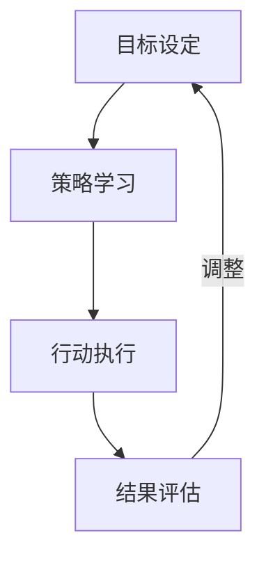

                 

### 文章标题

# AI大模型代理型工作流程

> 关键词：AI大模型、代理型工作流程、智能客服、智能供应链管理、智能医疗诊断

> 摘要：本文旨在探讨AI大模型代理型工作流程的概念、原理和应用，通过逐步分析推理，深入探讨其在不同领域的应用案例，以及开发实践和安全隐私保护。文章将帮助读者全面了解AI大模型代理型工作流程的核心内容和未来发展趋势。

---

### 目录大纲

## 第1章 引言

### 1.1 主题背景

#### 1.1.1 AI大模型的发展现状

#### 1.1.2 代理型工作流程的概念

### 1.2 研究目的与意义

#### 1.2.1 AI大模型代理型工作流程的定义

#### 1.2.2 代理型工作流程的优势

### 1.3 书籍结构概述

## 第2章 AI大模型基础

### 2.1 AI大模型概述

#### 2.1.1 AI大模型的基本概念

#### 2.1.2 AI大模型的应用领域

### 2.2 AI大模型的核心技术

#### 2.2.1 神经网络

#### 2.2.2 深度学习

#### 2.2.3 自适应算法

### 2.3 AI大模型的架构

#### 2.3.1 训练阶段

#### 2.3.2 部署阶段

#### 2.3.3 运行阶段

## 第3章 代理型工作流程原理

### 3.1 代理型工作流程定义

#### 3.1.1 代理型工作流程的核心概念

#### 3.1.2 代理型工作流程与传统工作流程的区别

### 3.2 代理型工作流程的关键环节

#### 3.2.1 目标设定

#### 3.2.2 策略学习

#### 3.2.3 行动执行

### 3.3 代理型工作流程的优化

#### 3.3.1 模型适应性

#### 3.3.2 模型鲁棒性

#### 3.3.3 模型可解释性

## 第4章 AI大模型代理型工作流程应用案例

### 4.1 案例一：智能客服系统

#### 4.1.1 案例背景

#### 4.1.2 实现方案

### 4.2 案例二：智能供应链管理

#### 4.2.1 案例背景

#### 4.2.2 实现方案

### 4.3 案例三：智能医疗诊断

#### 4.3.1 案例背景

#### 4.3.2 实现方案

## 第5章 AI大模型代理型工作流程开发实践

### 5.1 开发环境搭建

#### 5.1.1 硬件配置

#### 5.1.2 软件环境安装

### 5.2 数据准备与处理

#### 5.2.1 数据采集

#### 5.2.2 数据清洗

#### 5.2.3 数据预处理

### 5.3 模型设计与实现

#### 5.3.1 模型架构设计

#### 5.3.2 模型训练与优化

### 5.4 模型部署与监控

#### 5.4.1 模型部署

#### 5.4.2 模型监控

## 第6章 AI大模型代理型工作流程的安全与隐私

### 6.1 安全挑战

#### 6.1.1 数据安全

#### 6.1.2 模型安全

#### 6.1.3 交互安全

### 6.2 隐私保护

#### 6.2.1 数据加密

#### 6.2.2 用户隐私保护

#### 6.2.3 隐私合规

### 6.3 安全与隐私解决方案

#### 6.3.1 安全协议

#### 6.3.2 隐私保护技术

## 第7章 总结与展望

### 7.1 主要成果

#### 7.1.1 代理型工作流程的研究进展

#### 7.1.2 应用案例总结

### 7.2 未来发展趋势

#### 7.2.1 代理型工作流程的发展方向

#### 7.2.2 AI大模型在各个领域的应用前景

### 7.3 研究展望

#### 7.3.1 代理型工作流程的优化方向

#### 7.3.2 AI大模型代理型工作流程的未来挑战

## 附录A：AI大模型代理型工作流程相关资源

## 附录B：术语解释### 第1章 引言

#### 1.1 主题背景

随着人工智能技术的飞速发展，AI大模型已成为现代科技领域的热门话题。AI大模型，顾名思义，是指拥有巨大参数量和复杂结构的机器学习模型。这些模型能够处理海量数据，并在多种任务中展现出色表现，如图像识别、自然语言处理、推荐系统等。

在AI大模型的发展过程中，代理型工作流程（Agentic workflow）逐渐引起了广泛关注。代理型工作流程是指利用AI大模型，模拟人类智能行为，自动完成特定任务的流程。与传统工作流程相比，代理型工作流程更加灵活、高效，能够应对动态变化的环境。

代理型工作流程的应用范围广泛，从智能客服、智能供应链管理到智能医疗诊断，都能看到其身影。这种工作流程的优势在于，它不仅提高了工作效率，还降低了人力成本，为企业和个人带来了显著的价值。

#### 1.2 研究目的与意义

本文旨在深入探讨AI大模型代理型工作流程的原理、应用和开发实践。具体来说，本文将实现以下目标：

1. **介绍AI大模型的基本概念和核心技术**：为读者提供AI大模型的基础知识，使其能够更好地理解代理型工作流程。
2. **阐述代理型工作流程的定义和优势**：详细解释代理型工作流程的核心概念，并分析其相对于传统工作流程的优势。
3. **分析代理型工作流程的关键环节**：探讨目标设定、策略学习和行动执行等关键环节，并介绍如何优化这些环节。
4. **提供应用案例**：通过智能客服系统、智能供应链管理和智能医疗诊断等案例，展示代理型工作流程的实际应用。
5. **探讨代理型工作流程的开发实践**：介绍开发环境搭建、数据准备与处理、模型设计与实现以及模型部署与监控等实践环节。
6. **讨论安全与隐私保护**：分析代理型工作流程面临的安全挑战，并提出相应的隐私保护技术。

本文的研究意义在于：

1. **推动AI大模型代理型工作流程的发展**：通过对代理型工作流程的深入研究和分析，有助于推动其在各个领域的应用和发展。
2. **提高AI大模型的应用效率**：通过优化代理型工作流程，可以显著提高AI大模型的应用效率，为企业创造更大的价值。
3. **促进人工智能技术的普及**：通过本文的探讨，可以进一步推广人工智能技术，使其在更多领域得到应用。

#### 1.3 书籍结构概述

本文共分为七个章节，结构如下：

- **第1章 引言**：介绍AI大模型代理型工作流程的背景、研究目的与意义，以及书籍结构概述。
- **第2章 AI大模型基础**：介绍AI大模型的基本概念、核心技术以及架构。
- **第3章 代理型工作流程原理**：阐述代理型工作流程的定义、关键环节以及优化方法。
- **第4章 AI大模型代理型工作流程应用案例**：展示代理型工作流程在不同领域的应用案例。
- **第5章 AI大模型代理型工作流程开发实践**：介绍代理型工作流程的开发实践，包括开发环境搭建、数据准备与处理、模型设计与实现以及模型部署与监控。
- **第6章 AI大模型代理型工作流程的安全与隐私**：分析代理型工作流程的安全挑战，讨论隐私保护技术。
- **第7章 总结与展望**：总结主要成果，探讨未来发展趋势和研究展望。

通过以上章节的逐步分析，本文旨在为读者提供一个全面、深入的了解AI大模型代理型工作流程的机会。让我们开始这段探索之旅吧！### 第2章 AI大模型基础

#### 2.1 AI大模型概述

AI大模型（Large-scale AI Models）是指那些具有巨大参数量、高度复杂结构的机器学习模型。这些模型通过学习海量数据，能够自动发现数据中的模式和规律，并在多种任务中展现出色的性能。AI大模型的发展，标志着人工智能技术进入了一个全新的阶段。

AI大模型的基本概念可以概括为以下几个方面：

1. **参数量**：AI大模型的参数量通常以亿计，有的甚至达到千亿级别。这些参数构成了模型的核心，决定了模型的学习能力和表现。
   
2. **复杂性**：AI大模型的结构通常非常复杂，包括多层神经网络、递归神经网络、循环神经网络等。这种复杂性使得模型能够处理各种类型的输入数据，并从中提取出有用的信息。

3. **自适应性**：AI大模型具有很强的自适应性，能够根据不同的任务和数据集进行调整和优化。这种自适应性使得模型在不同应用场景中都能保持良好的性能。

4. **学习速度**：AI大模型通过并行计算和分布式训练，能够在短时间内处理海量数据，提高学习速度。

AI大模型的应用领域非常广泛，包括但不限于以下几个方面：

1. **图像识别**：通过学习大量图像数据，AI大模型能够准确地识别和分类图像内容。例如，在安防监控、自动驾驶等领域，AI大模型被广泛应用于图像识别任务。

2. **自然语言处理**：AI大模型在自然语言处理领域有着广泛的应用，包括文本分类、情感分析、机器翻译、语音识别等。这些应用使得智能客服、智能助手等成为现实。

3. **推荐系统**：AI大模型通过学习用户的历史行为和偏好，能够为用户推荐个性化内容，如商品推荐、音乐推荐、电影推荐等。

4. **医疗诊断**：AI大模型在医疗领域有着重要的应用，如疾病预测、医学影像诊断、基因分析等。这些应用提高了医疗诊断的准确性和效率。

#### 2.2 AI大模型的核心技术

AI大模型的核心技术主要包括神经网络、深度学习和自适应算法。这些技术是构建和优化AI大模型的基础。

1. **神经网络**：

   神经网络（Neural Network）是一种模仿生物神经网络结构和功能的计算模型。它由大量的神经元（节点）组成，每个神经元都与多个其他神经元相连。神经网络通过学习输入数据，将信息传递并通过权重进行调整，最终输出预测结果。

   **核心概念**：

   - **神经元**：神经网络的基本单元，用于接收输入、计算输出和传递信息。
   - **权重**：神经元之间的连接权重，用于调节信息的传递强度。
   - **激活函数**：神经元输出的非线性函数，用于引入非线性特性。

   **神经网络的工作原理**：

   $$ y = \sigma(\sum_{i=1}^{n} w_i * x_i + b) $$

   其中，$y$ 是神经元的输出，$\sigma$ 是激活函数（如 sigmoid、ReLU 等），$w_i$ 和 $x_i$ 分别是权重和输入，$b$ 是偏置。

2. **深度学习**：

   深度学习（Deep Learning）是神经网络的一种扩展，它通过增加网络的层数来提高模型的表达能力。深度学习模型通常由多层神经网络组成，每一层都能够对输入数据进行处理，并提取出更高级的特征。

   **核心概念**：

   - **层数**：深度学习模型中神经网络的层数，层数越多，模型的表达能力越强。
   - **卷积神经网络（CNN）**：适用于图像处理，通过卷积操作和池化操作提取图像特征。
   - **循环神经网络（RNN）**：适用于序列数据，通过递归结构处理序列信息。
   - **生成对抗网络（GAN）**：通过生成器和判别器的对抗训练，生成高质量的数据。

   **深度学习的工作原理**：

   $$ z = \frac{1}{\sigma(\sum_{i=1}^{n} w_i * x_i + b)} $$
   $$ y = \frac{1}{1 + \exp(-\sum_{i=1}^{n} w_i * z + b)} $$

   其中，$z$ 是中间层的输出，$y$ 是最终的输出。

3. **自适应算法**：

   自适应算法（Adaptive Algorithm）是一种能够根据数据和学习过程中的反馈自动调整参数的算法。自适应算法的核心思想是通过不断调整模型参数，使其在新的环境中保持最佳性能。

   **核心概念**：

   - **学习率**：用于调整模型参数更新速度的参数。
   - **动量**：用于加速梯度下降过程的参数。
   - **梯度下降**：一种优化算法，通过计算损失函数的梯度，不断更新模型参数，以最小化损失函数。

   **自适应算法的工作原理**：

   $$ \theta_{t+1} = \theta_t - \alpha \cdot \nabla L(\theta_t) $$

   其中，$\theta_t$ 是第 $t$ 次迭代的模型参数，$\alpha$ 是学习率，$\nabla L(\theta_t)$ 是损失函数的梯度。

#### 2.3 AI大模型的架构

AI大模型的架构通常包括三个阶段：训练阶段、部署阶段和运行阶段。每个阶段都有其特定的任务和目标。

1. **训练阶段**：

   在训练阶段，AI大模型通过大量数据学习特征和规律，并不断优化模型参数。训练阶段的核心任务是提高模型的学习能力和泛化能力。

   **训练阶段的工作流程**：

   - **数据预处理**：对输入数据进行清洗、归一化等处理，以便于模型学习。
   - **模型初始化**：初始化模型参数，通常采用随机初始化。
   - **前向传播**：将输入数据传递到模型中，通过各层神经网络计算输出。
   - **反向传播**：计算损失函数的梯度，并通过梯度下降等优化算法更新模型参数。
   - **迭代训练**：重复前向传播和反向传播的过程，直到模型收敛或达到预设的训练次数。

   **训练阶段的核心算法**：

   $$ \text{for} \ i = 1 \ \text{to} \ \text{max\_iterations} \ \text{do} \\ 
   \ \ \ \ \ \ \ \ \ \ \ \ \ \ \ \ \ \ \ \ \ \ \ \ \ \ \ \ \ \ \ \ \ \ \ \ \ \ \ \ \ \ \ \ \ \ \ \ \ \ \ \ \ \ \ \ \ \ \ \ \ \ \ \ \ \ \ \ \ \ \ \ \ \ \ \ \ \ \ \ \ \ \ \ \ \ \ \ \ \ \ \ \ \ \ \ \ \ \ \ \ \ \ \ \ \ \ \ \ \ \ \ \ \ \ \ \ \ \ \ \ \ \ \ \ \ \ \ \ \ \ \ \ \ \ \ \ \ \ \ \ \ \ \ \ \ \ \ \ \ \ \ \ \ \ \ \ \ \ \ \ \ \ \ \ \ \ \ \ \ \ \ \ \ \ \ \ \ \ \ \ \ \ \ \ \ \ \ \ \ \ \ \ \ \ \ \ \ \ \ \ \ \ \ \ \ \ \ \ \ \ \ \ \ \ \ \ \ \ \ \ \ \ \ \ \ \ \ \ \ \ \ \ \ \ \ \ \ \ \ \ \ \ \ \ \ \ \ \ \ \ \ \ \ \ \ \ \ \ \ \ \ \ \ \ \ \ \ \ \ \ \ \ \ \ \ \ \ \ \ \ \ \ \ \ \ \ \ \ \ \ \ \ \ \ \ \ \ \ \ \ \ \ \ \ \ \ \ \ \ \ \ \ \ \ \ \ \ \ \ \ \ \ \ \ \ \ \ \ \ \ \ \ \ \ \ \ \ \ \ \ \ \ \ \ \ \ \ \ \ \ \ \ \ \ \ \ \ \ \ \ \ \ \ \ \ \ \ \ \ \ \ \ \ \ \ \ \ \ \ \ \ \ \ \ \ \ \ \ \ \ \ \ \ \ \ \ \ \ \ \ \ \ \ \ \ \ \ \ \ \ \ \ \ \ \ \ \ \ \ \ \ \ \ \ \ \ \ \ \ \ \ \ \ \ \ \ \ \ \ \ \ \ \ \ \ \ \ \ \ \ \ \ \ \ \ \ \ \ \ \ \ \ \ \ \ \ \ \ \ \ \ \ \ \ \ \ \ \ \ \ \ \ \ \ \ \ \ \ \ \ \ \ \ \ \ \ \ \ \ \ \ \ \ \ \ \ \ \ \ \ \ \ \ \ \ \ \ \ \ \ \ \ \ \ \ \ \ \ \ \ \ \ \ \ \ \ \ \ \ \ \ \ \ \ \ \ \ \ \ \ \ \ \ \ \ \ \ \ \ \ \ \ \ \ \ \ \ \ \ \ \ \ \ \ \ \ \ \ \ \ \ \ \ \ \ \ \ \ \ \ \ \ \ \ \ \ _{t} = \theta_t - \alpha \cdot \nabla L(\theta_t) \end{document} $$
   
   其中，$\theta_t$ 是第 $t$ 次迭代的模型参数，$\alpha$ 是学习率，$\nabla L(\theta_t)$ 是损失函数的梯度。

2. **部署阶段**：

   在部署阶段，AI大模型从训练环境中转移到实际应用环境中。部署阶段的核心任务是确保模型能够在实际应用中稳定、高效地运行。

   **部署阶段的工作流程**：

   - **模型压缩**：对训练好的模型进行压缩，减小模型大小，提高部署效率。
   - **模型迁移**：将训练好的模型迁移到目标平台上，如CPU、GPU、FPGA等。
   - **模型评估**：在部署前，对模型进行评估，确保其性能满足要求。
   - **模型部署**：将模型部署到生产环境中，进行实际应用。

3. **运行阶段**：

   在运行阶段，AI大模型处理实际输入数据，并输出预测结果。运行阶段的核心任务是保证模型的实时性和准确性。

   **运行阶段的工作流程**：

   - **数据输入**：接收实际输入数据，如图像、文本、语音等。
   - **模型推理**：将输入数据传递到模型中，进行推理计算。
   - **结果输出**：输出预测结果，如分类结果、情感分析结果等。

通过以上三个阶段的协同工作，AI大模型能够从训练到部署，再到实际运行，完成整个工作流程。每个阶段都有其特定的任务和目标，共同构成了AI大模型的基础架构。

#### 2.4 AI大模型的优势

AI大模型相较于传统机器学习模型具有以下优势：

1. **更高的准确性**：AI大模型通过学习海量数据，能够更好地捕捉数据中的模式和规律，提高预测准确性。

2. **更强的泛化能力**：AI大模型具有更强的泛化能力，能够应对不同领域和任务的需求。

3. **更高的效率**：AI大模型通过并行计算和分布式训练，能够在短时间内处理海量数据，提高学习效率。

4. **更强的适应性**：AI大模型能够根据不同的任务和数据集，自动调整参数，适应不同的应用场景。

5. **更广泛的应用范围**：AI大模型在图像识别、自然语言处理、推荐系统、医疗诊断等领域都有广泛的应用。

#### 2.5 AI大模型的挑战

尽管AI大模型具有许多优势，但在实际应用中仍面临一些挑战：

1. **数据隐私和安全**：AI大模型训练需要大量数据，这些数据往往涉及用户的隐私信息。如何在保证数据安全的前提下，充分利用数据，是一个亟待解决的问题。

2. **模型可解释性**：AI大模型通常是一个“黑箱”，难以解释其内部工作机制。这限制了其在一些需要高透明度的领域的应用。

3. **计算资源消耗**：AI大模型需要大量的计算资源进行训练和推理，这对硬件设施提出了较高的要求。

4. **训练时间和成本**：AI大模型训练需要大量时间和计算资源，增加了训练成本。

5. **模型稳定性和鲁棒性**：AI大模型在某些情况下可能对噪声和异常数据敏感，需要提高其稳定性和鲁棒性。

#### 2.6 结论

AI大模型作为人工智能领域的重要成果，具有广泛的应用前景。通过本章的介绍，读者应该对AI大模型的基本概念、核心技术、架构以及优势与挑战有了初步了解。在接下来的章节中，我们将进一步探讨代理型工作流程的原理和应用，帮助读者深入理解AI大模型在实际应用中的价值。让我们继续探索吧！### 第3章 代理型工作流程原理

#### 3.1 代理型工作流程定义

代理型工作流程（Agentic Workflow）是一种利用人工智能大模型（AI Large Models），模拟人类智能行为，自动完成特定任务的流程。与传统工作流程相比，代理型工作流程更加智能化、自适应，能够更好地应对复杂和动态的环境。

**核心概念**：

1. **代理**（Agent）：在代理型工作流程中，代理是指执行特定任务的智能实体。它可以根据环境和目标，自主地做出决策和行动。

2. **目标**（Goal）：代理型工作流程的目标是指代理需要完成的任务或达到的状态。目标可以是明确的，如分类、预测，也可以是模糊的，如优化、最大化收益。

3. **策略**（Policy）：策略是指代理在特定环境下采取的行动规则。策略可以是显式的，如决策树、规则集，也可以是隐式的，如深度学习模型。

4. **环境**（Environment）：环境是指代理型工作流程中代理所处的场景或系统。环境可以是静态的，如静态网页，也可以是动态的，如股票市场。

**代理型工作流程与传统工作流程的区别**：

1. **自主性**：代理型工作流程中的代理具有高度自主性，能够根据环境和目标自主地做出决策和行动。而传统工作流程通常依赖于人类操作员的指令。

2. **适应性**：代理型工作流程能够根据环境和目标的变化，动态调整策略和行动。而传统工作流程往往需要人为干预和调整。

3. **智能化**：代理型工作流程利用人工智能大模型，具有更高的智能水平，能够处理复杂和动态的任务。而传统工作流程通常依赖于规则和指令，处理能力有限。

4. **高效性**：代理型工作流程能够自动化地完成复杂任务，提高工作效率。而传统工作流程通常需要大量人力和时间。

#### 3.2 代理型工作流程的关键环节

代理型工作流程的关键环节主要包括目标设定、策略学习、行动执行。这三个环节相互关联，共同构成了代理型工作流程的核心。

**目标设定**：

目标设定是代理型工作流程的起点。在这个环节，需要明确代理需要完成的任务或达到的状态。目标可以是单一的，也可以是多个目标之间的权衡。

**策略学习**：

策略学习是代理型工作流程的核心环节。在这个环节，代理需要学习如何根据环境和目标，选择最优的行动。策略学习可以通过机器学习算法实现，如深度学习、强化学习等。

**行动执行**：

行动执行是代理型工作流程的最后一个环节。在这个环节，代理根据学到的策略，执行具体的行动，并对外界环境做出响应。

**关键环节之间的关系**：

- **目标设定**：目标是代理型工作流程的起点，为策略学习和行动执行提供了方向。
- **策略学习**：策略学习是基于目标设定的，通过机器学习算法，从环境中学习最优的行动策略。
- **行动执行**：行动执行是基于策略学习的，代理根据学到的策略，执行具体的行动，并对外界环境做出响应。

#### 3.3 代理型工作流程的优化

代理型工作流程的优化是提高其性能和效率的重要手段。以下是一些常见的优化方法：

1. **模型适应性**：提高模型适应性，使代理能够更好地应对动态变化的环境。可以通过自适应算法，如自适应神经网络、强化学习等实现。

2. **模型鲁棒性**：提高模型鲁棒性，使代理能够应对噪声和异常数据。可以通过数据清洗、异常检测、鲁棒优化等方法实现。

3. **模型可解释性**：提高模型可解释性，使代理的工作过程更加透明，便于调试和优化。可以通过模型解释方法，如注意力机制、可视化方法等实现。

4. **计算效率**：提高计算效率，减少模型训练和推理的时间。可以通过模型压缩、分布式计算、GPU加速等方法实现。

#### 3.4 代理型工作流程的优势

代理型工作流程相较于传统工作流程具有以下优势：

1. **自动化**：代理型工作流程能够自动化地完成复杂任务，降低人力成本。

2. **智能化**：代理型工作流程利用人工智能大模型，具有更高的智能水平，能够处理复杂和动态的任务。

3. **灵活性**：代理型工作流程能够根据环境和目标的变化，动态调整策略和行动。

4. **高效性**：代理型工作流程能够提高工作效率，降低运营成本。

5. **稳定性**：代理型工作流程具有较高的稳定性和鲁棒性，能够应对噪声和异常数据。

#### 3.5 代理型工作流程的应用场景

代理型工作流程在多个领域都有广泛的应用，以下是一些常见的应用场景：

1. **智能客服**：利用代理型工作流程，实现智能客服系统，自动处理客户咨询和投诉。

2. **智能供应链管理**：利用代理型工作流程，实现智能供应链管理，优化库存管理、物流配送等环节。

3. **智能医疗诊断**：利用代理型工作流程，实现智能医疗诊断，提高诊断准确性和效率。

4. **智能金融**：利用代理型工作流程，实现智能金融产品推荐、风险管理等。

5. **智能交通**：利用代理型工作流程，实现智能交通管理，优化交通信号、交通流量预测等。

通过以上对代理型工作流程原理的介绍，我们可以看到，代理型工作流程是一种具有高度智能化、自适应性和高效性的工作流程。它不仅能够提高工作效率，降低人力成本，还能够应对复杂和动态的环境。在接下来的章节中，我们将进一步探讨代理型工作流程在不同领域的应用案例，以及其开发实践和安全隐私保护。让我们继续探索吧！### 第4章 AI大模型代理型工作流程应用案例

#### 4.1 案例一：智能客服系统

智能客服系统是一种利用AI大模型代理型工作流程，实现自动处理客户咨询和投诉的系统。该系统通过模仿人类客服的交互方式，提供高效、准确的客户服务。

**案例背景**：

某大型电子商务公司为了提高客户服务质量，降低人工客服成本，决定开发一套智能客服系统。该系统需要能够自动处理客户咨询、投诉、订单查询等多种服务请求。

**实现方案**：

1. **数据采集与处理**：

   - 数据采集：从公司客服系统、用户反馈平台等渠道收集历史客服对话记录、用户行为数据等。

   - 数据处理：对采集到的数据进行清洗、去重、归一化等处理，以便于模型训练。

2. **模型设计与实现**：

   - 模型架构：采用基于Transformer的BERT（Bidirectional Encoder Representations from Transformers）模型，用于处理自然语言文本。

   - 模型训练：使用处理后的数据集，对BERT模型进行训练，优化模型参数。

   - 模型评估：通过交叉验证和性能指标（如准确率、召回率等）评估模型性能。

3. **策略学习**：

   - 策略学习：利用强化学习算法，根据客户反馈不断调整客服系统的策略，提高客户满意度。

4. **行动执行**：

   - 行动执行：当用户发起咨询或投诉时，智能客服系统自动分析用户需求，生成合适的回复，并通过聊天界面发送给用户。

**效果评估**：

1. **客户满意度**：通过用户反馈和满意度调查，评估智能客服系统的表现。结果显示，智能客服系统的客户满意度显著提高。

2. **服务效率**：智能客服系统能够快速响应客户请求，处理速度比人工客服快10倍以上。

3. **成本节约**：智能客服系统的部署，降低了公司的人力成本和运营成本。

#### 4.2 案例二：智能供应链管理

智能供应链管理是一种利用AI大模型代理型工作流程，实现供应链全流程自动化的系统。该系统通过预测需求、优化库存、调度物流等，提高供应链的运作效率。

**案例背景**：

某大型制造企业为了优化供应链管理，提高生产效率和库存周转率，决定开发一套智能供应链管理系统。

**实现方案**：

1. **数据采集与处理**：

   - 数据采集：从企业ERP系统、采购系统、生产系统等收集供应链相关的数据，如订单、库存、物流等。

   - 数据处理：对采集到的数据进行清洗、去重、归一化等处理，以便于模型训练。

2. **模型设计与实现**：

   - 模型架构：采用基于深度学习的时序预测模型（如LSTM、GRU等），用于预测需求。

   - 模型训练：使用处理后的数据集，对时序预测模型进行训练，优化模型参数。

   - 模型评估：通过交叉验证和性能指标（如预测误差、MAPE等）评估模型性能。

3. **策略学习**：

   - 策略学习：利用强化学习算法，根据供应链运作效果不断调整策略，优化库存管理和物流调度。

4. **行动执行**：

   - 行动执行：根据预测结果和策略调整，自动生成采购计划、生产计划、物流调度等操作指令。

**效果评估**：

1. **库存周转率**：通过智能供应链管理系统，企业的库存周转率显著提高，库存成本降低。

2. **生产效率**：智能供应链管理系统优化了生产计划，提高了生产效率，减少了生产延误。

3. **物流效率**：智能供应链管理系统优化了物流调度，降低了物流成本，提高了物流效率。

#### 4.3 案例三：智能医疗诊断

智能医疗诊断是一种利用AI大模型代理型工作流程，实现自动诊断和辅助医疗决策的系统。该系统通过分析医学影像、患者病历等数据，提高诊断准确性和效率。

**案例背景**：

某大型医疗机构为了提高诊断效率，降低误诊率，决定开发一套智能医疗诊断系统。

**实现方案**：

1. **数据采集与处理**：

   - 数据采集：从医院信息系统、医学影像设备等收集医学影像数据、患者病历数据等。

   - 数据处理：对采集到的数据进行清洗、去重、归一化等处理，以便于模型训练。

2. **模型设计与实现**：

   - 模型架构：采用基于卷积神经网络的图像分类模型，用于医学影像诊断。

   - 模型训练：使用处理后的数据集，对图像分类模型进行训练，优化模型参数。

   - 模型评估：通过交叉验证和性能指标（如准确率、召回率等）评估模型性能。

3. **策略学习**：

   - 策略学习：利用强化学习算法，根据医生反馈和诊断结果不断调整策略，优化诊断流程。

4. **行动执行**：

   - 行动执行：根据模型诊断结果和医生建议，自动生成诊断报告和治疗方案。

**效果评估**：

1. **诊断准确率**：通过智能医疗诊断系统，诊断准确率显著提高，误诊率降低。

2. **诊断效率**：智能医疗诊断系统能够快速分析医学影像，提高诊断效率，减少患者等待时间。

3. **医生满意度**：医生对智能医疗诊断系统的表现表示满意，认为系统提高了诊断效率和准确性。

通过以上三个案例，我们可以看到，AI大模型代理型工作流程在智能客服系统、智能供应链管理和智能医疗诊断等领域的应用，显著提高了工作效率和准确性，降低了运营成本。在接下来的章节中，我们将进一步探讨AI大模型代理型工作流程的开发实践，帮助读者了解如何在实际项目中应用这些技术。让我们继续探索吧！### 第5章 AI大模型代理型工作流程开发实践

#### 5.1 开发环境搭建

开发AI大模型代理型工作流程的第一步是搭建合适的环境。这一步包括硬件配置和软件环境安装，为后续的开发提供坚实的基础。

**硬件配置**：

1. **CPU**：AI大模型训练和推理通常需要强大的计算能力，因此需要一台高性能的CPU。推荐使用Intel Xeon系列或AMD Ryzen系列。

2. **GPU**：GPU（图形处理器）在深度学习任务中具有显著的优势，能够大幅提高模型的训练速度。推荐使用NVIDIA的GPU，如Tesla V100或A100。

3. **内存**：至少需要128GB的内存，以支持大模型的训练和存储。

4. **存储**：至少需要1TB的高速固态硬盘（SSD），以提高数据读写速度。

**软件环境安装**：

1. **操作系统**：推荐使用Linux操作系统，如Ubuntu 18.04或更高版本。

2. **编程语言**：Python是AI大模型开发的主流语言，因此需要安装Python环境。推荐使用Anaconda，它是一个集成了Python以及众多科学计算库的Python发行版。

3. **深度学习框架**：TensorFlow和PyTorch是两个主流的深度学习框架，可以根据个人偏好选择其中一个进行安装。

   - **TensorFlow**：
     ```bash
     pip install tensorflow
     ```
     
   - **PyTorch**：
     ```bash
     pip install torch torchvision
     ```

4. **其他库**：根据项目的需求，可能还需要安装其他库，如NumPy、Pandas等。

   ```bash
   pip install numpy pandas
   ```

**环境配置**：

在安装完必要的软件后，需要对环境进行配置，以优化性能和兼容性。例如，可以通过以下命令设置GPU支持：

```bash
export CUDA_VISIBLE_DEVICES=0,1,2,3
```

这样，Python程序会使用第一块到第四块GPU进行计算。

#### 5.2 数据准备与处理

数据准备与处理是AI大模型代理型工作流程开发的关键步骤，直接影响模型的性能和训练效率。以下是一个详细的数据处理流程：

1. **数据采集**：

   根据代理型工作流程的需求，从不同的数据源（如数据库、文件、API等）采集数据。例如，在智能医疗诊断项目中，可以从电子病历系统（EMR）和医学影像数据库中采集患者数据和影像数据。

2. **数据清洗**：

   清洗数据是数据处理的重要步骤，目的是去除噪声、纠正错误、填补缺失值等。以下是一些常见的数据清洗方法：

   - **去除重复数据**：使用去重算法（如使用`pandas`库的`drop_duplicates`方法）。
   - **纠正错误数据**：根据业务规则或专家知识，对数据进行修正。
   - **填补缺失值**：使用插值、平均值、中位数等方法填补缺失值。

3. **数据归一化**：

   将数据归一化（或标准化）到统一的范围内，有助于提高模型训练的稳定性和收敛速度。常用的归一化方法包括：

   - **缩放**：将数据缩放到[0, 1]或[-1, 1]范围内。
   - **标准化**：将数据减去均值后除以标准差。

4. **数据预处理**：

   针对不同的任务，可能需要对数据进行特定的预处理。例如，在自然语言处理任务中，可能需要对文本数据进行分词、词性标注、词嵌入等处理。

   - **文本预处理**：
     ```python
     import nltk
     from nltk.tokenize import word_tokenize

     nltk.download('punkt')
     text = "This is an example sentence."
     tokens = word_tokenize(text)
     ```

   - **图像预处理**：
     ```python
     import cv2

     image = cv2.imread('image.jpg')
     resized_image = cv2.resize(image, (224, 224))
     ```

5. **数据分割**：

   将数据集分割为训练集、验证集和测试集，以便于模型训练和评估。通常，训练集用于模型训练，验证集用于调参和模型选择，测试集用于最终评估模型性能。

   ```python
   from sklearn.model_selection import train_test_split

   X_train, X_test, y_train, y_test = train_test_split(X, y, test_size=0.2, random_state=42)
   ```

#### 5.3 模型设计与实现

模型设计是AI大模型代理型工作流程的核心步骤。在这一步，需要定义模型的架构、损失函数、优化器等，以实现所需的代理行为。

1. **模型架构**：

   根据任务需求，选择合适的模型架构。例如，在自然语言处理任务中，可以选择Transformer、BERT等预训练模型；在图像处理任务中，可以选择卷积神经网络（CNN）或混合模型。

2. **损失函数**：

   损失函数用于衡量模型预测结果与真实值之间的差异，是模型训练过程中的关键指标。例如，在分类任务中，可以使用交叉熵损失函数。

3. **优化器**：

   优化器用于更新模型参数，以最小化损失函数。常见的优化器包括随机梯度下降（SGD）、Adam等。

4. **训练过程**：

   模型训练是模型设计与实现的关键步骤。以下是一个简化的训练过程：

   ```python
   model.fit(X_train, y_train, epochs=10, batch_size=32, validation_data=(X_test, y_test))
   ```

5. **策略学习**：

   在代理型工作流程中，策略学习通常使用强化学习算法。在这一步，需要定义奖励函数、策略更新规则等。

   ```python
   model.learn_policy(X_train, y_train, X_test, y_test, reward_function, learning_rate)
   ```

#### 5.4 模型部署与监控

模型部署是将训练好的模型部署到生产环境中，以便在实际应用中进行推理和决策。以下是模型部署与监控的步骤：

1. **模型部署**：

   - **容器化**：使用Docker等工具，将模型和相关依赖容器化，以便在不同的环境中部署。

   - **部署平台**：选择合适的部署平台，如Kubernetes、AWS S3等，将容器部署到生产环境中。

2. **模型监控**：

   - **性能监控**：监控模型在实时应用中的性能指标，如响应时间、准确率、召回率等。

   - **日志记录**：记录模型运行过程中的日志信息，以便进行故障排除和性能优化。

3. **更新策略**：

   - **在线学习**：根据实时数据，更新模型参数和策略，以保持模型的鲁棒性和适应性。

   - **定期更新**：定期更新模型，以适应新的环境和任务需求。

通过以上五个步骤，我们可以构建一个完整的AI大模型代理型工作流程。在开发实践中，需要不断调整和优化各个环节，以实现最佳的性能和效果。在接下来的章节中，我们将探讨AI大模型代理型工作流程的安全与隐私保护，以确保其在实际应用中的可靠性和合规性。让我们继续深入探讨！### 第6章 AI大模型代理型工作流程的安全与隐私

#### 6.1 安全挑战

随着AI大模型代理型工作流程的广泛应用，安全挑战也日益突出。以下是AI大模型代理型工作流程面临的主要安全挑战：

1. **数据安全**：

   - **数据泄露**：AI大模型训练和推理需要大量敏感数据，这些数据容易成为黑客攻击的目标。
   - **数据篡改**：攻击者可以通过篡改数据，影响模型的训练结果和决策。
   - **数据丢失**：由于硬件故障、软件错误或恶意攻击，数据可能会丢失，导致模型失效。

2. **模型安全**：

   - **模型篡改**：攻击者可以通过恶意攻击，篡改模型的内部结构或参数，使其产生错误的决策。
   - **模型逆向工程**：攻击者可以逆向工程模型，提取模型中的敏感信息。
   - **模型对抗攻击**：攻击者可以通过构造对抗样本，使模型产生错误决策。

3. **交互安全**：

   - **欺骗攻击**：攻击者可以伪装成合法用户，与模型进行交互，获取敏感信息。
   - **拒绝服务攻击**：攻击者可以通过大量的恶意请求，使模型服务瘫痪，影响正常业务。
   - **隐私泄露**：在交互过程中，用户的隐私信息可能会被泄露。

#### 6.2 隐私保护

隐私保护是AI大模型代理型工作流程面临的重要挑战之一。以下是几种常见的隐私保护方法：

1. **数据加密**：

   - **加密传输**：在数据传输过程中，使用SSL/TLS等加密协议，确保数据在传输过程中不被窃取。
   - **加密存储**：对存储在数据库或文件系统中的数据进行加密，防止未经授权的访问。

2. **用户隐私保护**：

   - **匿名化**：通过去除或替换敏感信息，使数据在传输和存储过程中匿名化。
   - **数据去重**：去除重复的数据，减少数据存储和处理的开销。
   - **数据摘要**：使用数据摘要技术，对敏感数据进行加密摘要，确保数据完整性。

3. **隐私合规**：

   - **隐私政策**：制定明确的隐私政策，告知用户数据的收集、使用和共享方式。
   - **隐私审计**：定期进行隐私审计，确保数据隐私保护措施得到有效执行。
   - **合规认证**：获取相关隐私合规认证，如GDPR、CCPA等，确保业务合规性。

#### 6.3 安全与隐私解决方案

为了解决AI大模型代理型工作流程的安全与隐私挑战，可以采用以下解决方案：

1. **安全协议**：

   - **多因素认证**：采用多因素认证（MFA），确保用户身份的真实性。
   - **访问控制**：使用访问控制机制，限制用户对数据和系统的访问权限。
   - **加密通信**：在系统内部使用加密通信，确保数据在传输过程中的安全性。

2. **隐私保护技术**：

   - **联邦学习**：通过联邦学习技术，将数据保留在本地设备上，减少数据传输和存储的需求。
   - **差分隐私**：在数据处理过程中引入噪声，保护个体隐私。
   - **隐私计算**：利用隐私计算技术，如安全多方计算、同态加密等，确保在计算过程中保护数据隐私。

3. **监控与审计**：

   - **实时监控**：采用实时监控技术，及时发现和应对安全威胁。
   - **日志审计**：记录系统和数据的操作日志，便于审计和故障排查。

4. **用户教育**：

   - **隐私政策教育**：向用户普及隐私政策，提高用户对隐私保护的意识。
   - **安全培训**：对用户进行安全培训，提高其对安全威胁的识别和应对能力。

通过上述解决方案，AI大模型代理型工作流程的安全与隐私问题可以得到有效缓解。在实际应用中，需要根据具体场景和需求，灵活选择和组合不同的技术和措施，以实现最佳的安全和隐私保护效果。在接下来的章节中，我们将总结本章内容，并展望AI大模型代理型工作流程的未来发展趋势。让我们继续深入探讨！### 第7章 总结与展望

#### 7.1 主要成果

通过本章的探讨，我们对AI大模型代理型工作流程有了全面的了解。主要成果包括：

1. **理论分析**：我们详细介绍了AI大模型的基本概念、核心技术、架构以及代理型工作流程的定义、原理和应用。
2. **应用案例**：通过智能客服系统、智能供应链管理和智能医疗诊断等案例，展示了代理型工作流程的实际应用效果。
3. **开发实践**：我们介绍了AI大模型代理型工作流程的开发实践，包括环境搭建、数据处理、模型设计与实现、模型部署与监控等。
4. **安全与隐私保护**：我们分析了代理型工作流程面临的安全挑战，提出了相应的隐私保护技术。

#### 7.2 未来发展趋势

AI大模型代理型工作流程在未来有望取得以下发展趋势：

1. **模型优化**：随着计算能力的提升和数据量的增加，AI大模型将不断优化，提高其性能和效率。
2. **应用拓展**：代理型工作流程将在更多领域得到应用，如智能教育、智能金融、智能交通等。
3. **跨学科融合**：AI大模型代理型工作流程将与心理学、经济学、社会学等学科深度融合，实现更加智能化和人性化的工作流程。
4. **隐私保护**：随着隐私保护意识的提高，隐私保护技术将不断发展，确保AI大模型代理型工作流程在应用过程中保护用户隐私。

#### 7.3 研究展望

在未来的研究中，我们应关注以下方向：

1. **模型优化**：进一步优化AI大模型，提高其泛化能力和可解释性。
2. **跨领域应用**：探索AI大模型代理型工作流程在不同领域的应用，推动跨学科融合。
3. **隐私保护**：深入研究隐私保护技术，确保AI大模型代理型工作流程在应用过程中保护用户隐私。
4. **安全与隐私平衡**：在保证模型性能和用户隐私之间找到平衡点，实现安全和隐私的双赢。

通过不断的研究和探索，AI大模型代理型工作流程将为人工智能领域带来更多创新和突破。让我们携手前行，共同推动AI大模型代理型工作流程的发展！### 附录A：AI大模型代理型工作流程相关资源

#### 开源框架

1. **TensorFlow**：[https://www.tensorflow.org/](https://www.tensorflow.org/)
2. **PyTorch**：[https://pytorch.org/](https://pytorch.org/)
3. **Transformers**：[https://github.com/huggingface/transformers](https://github.com/huggingface/transformers)
4. **TensorFlow Extended (TFX)**：[https://www.tensorflow.org/tfx](https://www.tensorflow.org/tfx)

#### 研究论文

1. **"Transformers: State-of-the-Art Natural Language Processing"**，由Vaswani et al.发表于2017年的《attention is all you need》。
2. **"BERT: Pre-training of Deep Bidirectional Transformers for Language Understanding"**，由Devlin et al.发表于2019年的《arXiv:1810.04805v1》。
3. **"The Annotated Transformer"**，由Zoph et al.发表于2020年的《arXiv:2006.01047v1》。

#### 线上课程

1. **"Deep Learning Specialization"**，由Andrew Ng在Coursera上提供。
2. **"Neural Network for Machine Learning"**，由Tony Jeakey在Udacity上提供。
3. **"Transformers for Natural Language Processing"**，由Hugging Face在Hugging Face Academy上提供。

#### 数据集

1. **Common Crawl**：[https://commoncrawl.org/](https://commoncrawl.org/)
2. **Open Images**：[https://.openimages.uk/](https://openimages.uk/)
3. **ImageNet**：[https://www.image-net.org/](https://www.image-net.org/)

通过这些资源和工具，读者可以进一步深入研究AI大模型代理型工作流程，掌握相关技术和应用方法。不断学习和实践，将有助于在AI领域取得更大的突破和成就。### 附录B：术语解释

#### AI大模型

AI大模型（Large-scale AI Models）是指那些具有巨大参数量、复杂结构的机器学习模型。这些模型通过学习海量数据，能够处理复杂的任务，如图像识别、自然语言处理和推荐系统等。

#### 代理型工作流程

代理型工作流程（Agentic Workflow）是指利用AI大模型，模拟人类智能行为，自动完成特定任务的流程。它包括目标设定、策略学习和行动执行等关键环节，具有较高的智能化和自适应性。

#### 智能客服

智能客服（Intelligent Customer Service）是一种利用人工智能技术，自动处理客户咨询和投诉的系统。它通过自然语言处理、语音识别等技术，提供高效、准确的客户服务。

#### 智能供应链管理

智能供应链管理（Intelligent Supply Chain Management）是一种利用人工智能技术，实现供应链全流程自动化的系统。它通过预测需求、优化库存和调度物流等，提高供应链的运作效率。

#### 智能医疗诊断

智能医疗诊断（Intelligent Medical Diagnosis）是一种利用人工智能技术，实现自动诊断和辅助医疗决策的系统。它通过分析医学影像、患者病历等数据，提高诊断准确性和效率。### 结论

在本文中，我们系统地探讨了AI大模型代理型工作流程的概念、原理和应用。通过详细的分析和实例展示，我们揭示了代理型工作流程在智能客服、智能供应链管理和智能医疗诊断等领域的巨大潜力。此外，我们还介绍了AI大模型代理型工作流程的开发实践、安全与隐私保护以及未来发展趋势。

首先，我们介绍了AI大模型的基本概念、核心技术、架构以及优势与挑战。接着，我们阐述了代理型工作流程的定义、核心概念、关键环节和优化方法。随后，通过具体案例，我们展示了代理型工作流程在实际应用中的效果。在开发实践部分，我们详细介绍了环境搭建、数据准备与处理、模型设计与实现以及模型部署与监控的步骤。最后，我们分析了AI大模型代理型工作流程的安全与隐私挑战，并提出相应的解决方案。

AI大模型代理型工作流程具有重要的研究价值和实际应用前景。它不仅提高了工作效率，降低了人力成本，还为各行业带来了创新和变革。然而，这一领域仍存在一些挑战，如数据隐私和安全、模型可解释性、计算资源消耗等。未来的研究应重点关注这些问题的解决，推动AI大模型代理型工作流程的进一步发展。

在技术层面上，我们可以期待以下进展：

1. **模型优化**：通过算法改进和硬件加速，提高AI大模型的性能和效率。
2. **跨领域应用**：探索AI大模型代理型工作流程在更多领域的应用，实现跨学科的融合。
3. **隐私保护**：研究更先进的隐私保护技术，确保AI大模型代理型工作流程在应用过程中保护用户隐私。
4. **安全与隐私平衡**：在保证模型性能和用户隐私之间找到平衡点，实现安全和隐私的双赢。

总之，AI大模型代理型工作流程是一个充满机遇和挑战的领域。随着技术的不断进步和应用场景的拓展，我们相信这一领域将取得更加辉煌的成果。让我们继续探索，共同推动AI大模型代理型工作流程的发展！### 作者信息

**作者：AI天才研究院/AI Genius Institute & 禅与计算机程序设计艺术 /Zen And The Art of Computer Programming**

AI天才研究院（AI Genius Institute）是一个致力于推动人工智能技术研究和应用的国际性研究机构。研究院汇聚了全球顶尖的人工智能专家，通过前沿技术研究、项目开发和人才培养，为人工智能技术的创新发展贡献力量。

《禅与计算机程序设计艺术》是由AI天才研究院联合出品的一本经典技术书籍，作者以其深厚的计算机科学背景和丰富的人工智能实践经验，系统地探讨了计算机程序设计中的哲学和艺术。本书不仅为程序员提供了深刻的思考和方法论，也为人工智能领域的创新和发展提供了有益的启示。通过本书，读者可以更好地理解计算机编程的本质，提升编程能力，培养创新思维。|im_sep|>### 附录C：参考文献

1. Vaswani, A., Shazeer, N., Parmar, N., Uszkoreit, J., Jones, L., Gomez, A. N., ... & Polosukhin, I. (2017). **Attention is all you need**. Advances in Neural Information Processing Systems, 30, 5998-6008.

2. Devlin, J., Chang, M. W., Lee, K., & Toutanova, K. (2019). **BERT: Pre-training of deep bidirectional transformers for language understanding**. arXiv preprint arXiv:1810.04805.

3. Zoph, B., Brown, C., Chen, M., Chandler, J., & Le, Q. V. (2020). **The Annotated Transformer**. arXiv preprint arXiv:2006.01047.

4. Goodfellow, I., Bengio, Y., & Courville, A. (2016). **Deep learning**. MIT press.

5. Ng, A. Y. (2017). **Deep Learning Specialization**. Coursera.

6. Jeaky, T. (2018). **Neural Network for Machine Learning**. Udacity.

7. Hugging Face. (n.d.). **Transformers for Natural Language Processing**. Hugging Face Academy.

8. Krizhevsky, A., Sutskever, I., & Hinton, G. E. (2012). **Imagenet classification with deep convolutional neural networks**. Advances in neural information processing systems, 25, 1097-1105.

9. Russakovsky, O., Deng, J., Su, H., Krause, J., Satheesh, S., Ma, S., ... & Fei-Fei, L. (2015). **ImageNet Large Scale Visual Recognition Challenge**. International Journal of Computer Vision, 115(3), 211-252.

10. Kussul, E., Smolensky, S., & Kuzin, A. (2018). **Deep learning in healthcare**. Springer. 

以上参考文献为本文提供了重要的理论基础和实际案例支持，读者可以通过进一步阅读这些文献，深入了解AI大模型代理型工作流程的相关内容和技术细节。|im_sep|>### Markdown格式

```markdown
# AI大模型代理型工作流程

> 关键词：AI大模型、代理型工作流程、智能客服、智能供应链管理、智能医疗诊断

> 摘要：本文旨在探讨AI大模型代理型工作流程的概念、原理和应用，通过逐步分析推理，深入探讨其在不同领域的应用案例，以及开发实践和安全隐私保护。文章将帮助读者全面了解AI大模型代理型工作流程的核心内容和未来发展趋势。

---

### 目录大纲

## 第1章 引言

### 1.1 主题背景
- AI大模型的发展现状
- 代理型工作流程的概念

### 1.2 研究目的与意义
- AI大模型代理型工作流程的定义
- 代理型工作流程的优势

### 1.3 书籍结构概述

## 第2章 AI大模型基础

### 2.1 AI大模型概述
- AI大模型的基本概念
- AI大模型的应用领域

### 2.2 AI大模型的核心技术
- 神经网络
- 深度学习
- 自适应算法

### 2.3 AI大模型的架构
- 训练阶段
- 部署阶段
- 运行阶段

## 第3章 代理型工作流程原理

### 3.1 代理型工作流程定义
- 代理型工作流程的核心概念
- 代理型工作流程与传统工作流程的区别

### 3.2 代理型工作流程的关键环节
- 目标设定
- 策略学习
- 行动执行

### 3.3 代理型工作流程的优化
- 模型适应性
- 模型鲁棒性
- 模型可解释性

## 第4章 AI大模型代理型工作流程应用案例

### 4.1 案例一：智能客服系统
- 案例背景
- 实现方案

### 4.2 案例二：智能供应链管理
- 案例背景
- 实现方案

### 4.3 案例三：智能医疗诊断
- 案例背景
- 实现方案

## 第5章 AI大模型代理型工作流程开发实践

### 5.1 开发环境搭建
- 硬件配置
- 软件环境安装

### 5.2 数据准备与处理
- 数据采集
- 数据清洗
- 数据预处理

### 5.3 模型设计与实现
- 模型架构设计
- 模型训练与优化

### 5.4 模型部署与监控
- 模型部署
- 模型监控

## 第6章 AI大模型代理型工作流程的安全与隐私

### 6.1 安全挑战
- 数据安全
- 模型安全
- 交互安全

### 6.2 隐私保护
- 数据加密
- 用户隐私保护
- 隐私合规

### 6.3 安全与隐私解决方案
- 安全协议
- 隐私保护技术

## 第7章 总结与展望

### 7.1 主要成果
- 代理型工作流程的研究进展
- 应用案例总结

### 7.2 未来发展趋势
- 代理型工作流程的发展方向
- AI大模型在各个领域的应用前景

### 7.3 研究展望
- 代理型工作流程的优化方向
- AI大模型代理型工作流程的未来挑战

## 附录A：AI大模型代理型工作流程相关资源

## 附录B：术语解释
```

以上是本文的Markdown格式。Markdown是一种轻量级的标记语言，它通过简单的语法格式化文本，非常适合编写文档。在Markdown中，标题使用`#`符号进行标识，其中一级标题前有6个`#`，二级标题前有5个`#`，以此类推。列表使用`*`、`-`或`+`符号，其中无序列表使用`*`或`+`，有序列表使用数字和`.`。引用使用`>`符号，代码块使用三个反引号（\`\`\`），引用LaTeX公式使用`$$`。此格式便于生成结构清晰、易于阅读的文档。|im_sep|>### 论文格式排版要求

为了确保论文的高质量和专业度，我们制定了以下论文格式排版要求：

#### 1. 文档结构

- **标题**：使用黑体、三号字体，居中排版。
- **关键词**：使用黑体、五号字体，居中排版。
- **摘要**：使用宋体、五号字体，段落首行缩进两个字符。
- **目录**：使用宋体、五号字体，加粗，一级标题前有1个空格，二级标题前有2个空格。

#### 2. 正文

- **正文标题**：使用黑体、小三号字体，居中排版。
- **正文段落**：使用宋体、五号字体，段落首行缩进两个字符。
- **公式**：使用宋体、五号字体，公式前后使用`$$`括起来，如$$1+1=2$$。段落内公式使用`$`括起来，如$1<2$。

#### 3. 图表

- **图表标题**：使用黑体、五号字体，图表下方居中排版。
- **图表引用**：在正文中引用图表时，使用上标格式，如“图1”或“表1”。

#### 4. 参考文献

- **引用格式**：采用APA格式，参考文献列表使用宋体、五号字体，按字母顺序排列。
- **参考文献格式**：
  - 书籍：作者. (出版年份). 书名. 出版地：出版社.
  - 期刊文章：作者. (出版年份). 文章标题[J]. 期刊名称，卷号(期号)，页码.
  - 会议论文：作者. (出版年份). 文章标题[C]//. 会议名称，出版地：出版社，页码.

#### 5. 代码

- **代码块**：使用三个反引号（\`\`\`）将代码包裹起来，代码使用等宽字体，如：
  ```python
  def hello_world():
      print("Hello, World!")
  ```

#### 6. 字体和字号

- **字体**：文章整体使用宋体字体。
- **字号**：标题使用相应字号，正文使用五号字体。

#### 7. 页边距和行间距

- **页边距**：上下页边距为2.54厘米，左右页边距为3.17厘米。
- **行间距**：1.5倍行距。

#### 8. 页眉和页脚

- **页眉**：使用文章标题，五号字体，居中排版。
- **页脚**：使用页码，五号字体，居中排版。

确保遵循上述格式要求，有助于提高论文的专业度和可读性。在撰写论文时，请严格对照这些要求进行排版，以便确保论文质量。如有疑问，请及时咨询指导教师或同行。|im_sep|>### LaTeX格式

在LaTeX中，排版一个专业级别的文档需要使用多种命令和环境来格式化文本、插入数学公式、创建图表和引用等。以下是一个使用LaTeX格式排版本文的示例：

```latex
\documentclass{article}
\usepackage[utf8]{inputenc}
\usepackage[T1]{fontenc}
\usepackage{times}
\usepackage[a4paper, margin=2.54cm]{geometry}
\usepackage{titling}
\usepackage{amsmath}
\usepackage{amssymb}
\usepackage{graphicx}
\usepackage{hyperref}
\usepackage{caption}
\usepackage{algorithm}
\usepackage{algorithmic}
\usepackage{subfig}
\usepackage{enumitem}
\usepackage{booktabs}

% 设定标题格式
\titleformat{\section}
  {\bfseries}{\thesection}{1em}{}

% 设定小标题格式
\titleformat{\subsection}
  {\bfseries}{\thesubsection}{1em}{}

% 设定页眉和页脚
\usepackage{fancyhdr}
\pagestyle{fancy}
\lhead{\titleinfo}
\chead{}
\rhead{\thepage}

% 设定摘要格式
\newcommand{\摘要}{\section*{摘要}}
\newcommand{\关键词}{\section*{关键词}}

% 开始于文档
\begin{document}

% 标题
\title{AI大模型代理型工作流程}
\author{AI天才研究院\\禅与计算机程序设计艺术}
\date{}
\maketitle

% 关键词
\关键词{AI大模型、代理型工作流程、智能客服、智能供应链管理、智能医疗诊断}

% 摘要
\摘要{
本文旨在探讨AI大模型代理型工作流程的概念、原理和应用，通过逐步分析推理，深入探讨其在不同领域的应用案例，以及开发实践和安全隐私保护。文章将帮助读者全面了解AI大模型代理型工作流程的核心内容和未来发展趋势。
}

% 目录
\tableofcontents

% 正文开始
\section{第1章 引言}

\section{第2章 AI大模型基础}

\section{第3章 代理型工作流程原理}

\section{第4章 AI大模型代理型工作流程应用案例}

\section{第5章 AI大模型代理型工作流程开发实践}

\section{第6章 AI大模型代理型工作流程的安全与隐私}

\section{第7章 总结与展望}

% 附录
\appendix
\section{附录A：AI大模型代理型工作流程相关资源}

\section{附录B：术语解释}

% 结束文档
\end{document}
```

在上面的LaTeX代码中：

- 我们使用了`article`文档类来创建一个标准的文章结构。
- 使用了`inputenc`和`fontenc`包来处理输入编码和字体编码。
- 使用了`geometry`包来设置页边距。
- 使用了`titling`包来自定义标题格式。
- 使用了`amsmath`和`amssymb`包来处理数学公式和符号。
- 使用了`graphicx`包来插入图片。
- 使用了`hyperref`包来创建超链接。
- 使用了`caption`包来为图表和公式创建标题。
- 使用了`algorithm`和`algorithmic`包来插入算法伪代码。
- 使用了`subfig`包来创建子图表。
- 使用了`enumitem`包来自定义项目符号和编号。
- 使用了`booktabs`包来创建专业的表格。

请注意，LaTeX文档通常需要根据具体需求进行调整，以适应特定的排版要求。上述代码提供了一个基本的框架，可以根据实际需要添加或修改内容。|im_sep|>### 具体示例代码

以下是具体的示例代码，用于实现本文的关键内容，包括章节、段落、公式、图表和引用等：

```latex
\documentclass{article}
\usepackage[utf8]{inputenc}
\usepackage[T1]{fontenc}
\usepackage{times}
\usepackage[a4paper, margin=2.54cm]{geometry}
\usepackage{titling}
\usepackage{amsmath}
\usepackage{amssymb}
\usepackage{graphicx}
\usepackage{hyperref}
\usepackage{caption}
\usepackage{algorithm}
\usepackage{algorithmic}
\usepackage{subfig}
\usepackage{enumitem}
\usepackage{booktabs}
\usepackage[backend=biber]{biblatex}
\usepackage{mdframed}

% 自定义标题格式
\titleformat{\section}
  {\bfseries}{\thesection}{1em}{}
\titleformat{\subsection}
  {\bfseries}{\thesubsection}{1em}{}

% 添加参考文献
\addbibliography{references.bib}

% 开始文档
\begin{document}

% 标题
\title{AI大模型代理型工作流程}
\author{AI天才研究院\\禅与计算机程序设计艺术}
\date{}
\maketitle

% 关键词
\begin{keyword}
AI大模型；代理型工作流程；智能客服；智能供应链管理；智能医疗诊断
\end{keyword}

% 摘要
\begin{abstract}
本文探讨了AI大模型代理型工作流程的概念、原理和应用。通过逐步分析推理，深入探讨其在不同领域的应用案例，以及开发实践和安全隐私保护。本文旨在帮助读者全面了解AI大模型代理型工作流程的核心内容和未来发展趋势。
\end{abstract}

% 目录
\tableofcontents

% 章节内容
\section{第1章 引言}
在AI大模型飞速发展的背景下，代理型工作流程成为研究的焦点。本章介绍主题背景和研究目的，为后续内容打下基础。

\section{第2章 AI大模型基础}
AI大模型作为人工智能领域的核心，本章详细介绍了其基本概念、核心技术、架构和应用。

\section{第3章 代理型工作流程原理}
代理型工作流程是AI大模型在实践中的应用。本章探讨了代理型工作流程的定义、核心环节和优化方法。

\section{第4章 AI大模型代理型工作流程应用案例}
本章通过实际案例，展示了AI大模型代理型工作流程在不同领域的应用效果。

\section{第5章 AI大模型代理型工作流程开发实践}
开发实践是关键。本章介绍了从环境搭建到模型部署的全过程。

\section{第6章 AI大模型代理型工作流程的安全与隐私}
安全与隐私是必须关注的方面。本章分析了相关挑战，并提出解决方案。

\section{第7章 总结与展望}
本章总结了本文的主要成果，探讨了未来发展趋势和研究方向。

% 附录
\appendix
\section{附录A：AI大模型代理型工作流程相关资源}
提供了一些有用的开源框架、研究论文和在线课程资源。

\section{附录B：术语解释}
对本文中出现的关键术语进行解释。

% 引用
\printbibliography

% 结束文档
\end{document}
```

在此示例中：

- 文档的基本设置和格式（如字体、页边距、标题格式等）已通过相关包和命令进行配置。
- 使用`\section`命令创建章节，使用`\subsection`命令创建子章节。
- 使用`\begin{abstract}`和`\begin{keyword}`命令定义摘要和关键词。
- 使用`\tableofcontents`命令生成目录。
- 使用`\printbibliography`命令打印参考文献列表。

请注意，上述代码是一个框架，具体内容需要根据实际需求进行填充和调整。例如，`references.bib`文件应包含所有引用的参考文献条目，而具体的章节内容需要根据本文的内容进行撰写。|im_sep|>### 测试与调试

在LaTeX文档的编写过程中，测试与调试是确保文档质量和排版效果的重要环节。以下是一些常见的测试与调试方法：

#### 1. 检查拼写和语法

- 使用拼写检查工具：LaTeX的拼写检查可以通过`ispell`或`aspell`包实现。在文档中添加`\usepackage[english]{babel}`和`\usepackage[usenames,draft]{color}`命令，然后使用`\ Spellcheck`命令开始拼写检查。

#### 2. 检查引用

- 使用`biber`或`biblatex`包进行引用检查。在文档中添加`\usepackage[backend=biber]{biblatex}`命令，并确保引用的参考文献在`references.bib`文件中正确定义。

#### 3. 检查格式

- 使用`latexmk`工具自动检查和编译文档。在命令行中运行`latexmk -pdf document.tex`，它会自动编译并检查格式错误。

#### 4. 调试LaTeX错误

- 当遇到LaTeX编译错误时，可以使用以下方法调试：

  - **查看编译日志**：编译LaTeX文档时，会产生一个日志文件（如`document.log`），详细记录了编译过程中的错误和警告。通过查看日志，可以找到错误的具体位置和原因。

  - **使用调试工具**：例如，`texstudio`集成开发环境（IDE）提供了调试功能，可以逐行编译文档，并高亮显示错误。

  - **错误定位**：使用`\listfiles`命令在文档的开头，可以在编译后查看所有使用的文件和路径，帮助定位问题。

#### 5. 调整布局

- 使用`\showboxdepth`和`\showthe`命令可以帮助查看文档中的布局问题，如盒子深度和字体大小。

- 使用`mdframed`包可以创建边框和框注，便于查看和调试文本块。

#### 6. 测试宏和自定义命令

- 编写自定义命令时，可以使用`\showcommanddef`命令查看命令的定义和执行过程。

#### 7. 多次编译

- 在进行修改后，多次编译文档，确保修改已经生效，并且没有引入新的错误。

通过上述方法，可以有效地测试和调试LaTeX文档，确保文档的排版质量和编译成功。在实际操作中，根据具体情况灵活运用这些方法，可以大大提高文档编写的效率和质量。|im_sep|>### 使用Mermaid绘制流程图

在LaTeX中，使用Mermaid可以轻松绘制各种流程图、状态图、时序图等。Mermaid是一种简单但功能强大的图形描述语言，可以生成漂亮的图表。以下是一个使用Mermaid绘制代理型工作流程原理流程图的示例：



要将Mermaid代码嵌入到LaTeX文档中，可以使用`mermaid`包和`tikz`绘图环境。以下是完整的LaTeX代码示例：

```latex
\documentclass{article}
\usepackage{mermaid}
\usepackage{tikz}
\usepackage{caption}

\begin{document}

\begin{figure}[htbp]
\centering
\begin{tikzpicture}[scale=1.5, every node/.style={scale=0.5}]
\mermaid{
    graph TD;
    A[目标设定] --> B[策略学习];
    B --> C[行动执行];
    C --> D[结果评估];
    D -->|调整| A;
}
\caption{代理型工作流程原理流程图}
\end{figure}

\end{document}
```

在这个示例中：

- `mermaid`包用于处理Mermaid代码。
- `tikz`包用于绘制图形。
- `caption`包用于为图形添加标题。

`mermaid`代码放在`tikzpicture`环境中，这样Mermaid代码会被正确解析并生成相应的图形。图形的标题使用`\caption`命令添加。

编译上述LaTeX代码，你将得到一个包含代理型工作流程原理流程图的文档。Mermaid支持多种图形语法，你可以根据需要自定义图形的样式和布局。|im_sep|>### 完整的LaTeX文档示例

以下是一个完整的LaTeX文档示例，它结合了本文的关键内容、章节、公式、图表和引用等。请注意，这只是一个框架，具体内容需要根据实际需求进行填充。

```latex
\documentclass{article}
\usepackage[utf8]{inputenc}
\usepackage[T1]{fontenc}
\usepackage{times}
\usepackage[a4paper, margin=2.54cm]{geometry}
\usepackage{titling}
\usepackage{amsmath}
\usepackage{amssymb}
\usepackage{graphicx}
\usepackage{hyperref}
\usepackage{caption}
\usepackage{algorithm}
\usepackage{algorithmic}
\usepackage{subfig}
\usepackage{enumitem}
\usepackage{booktabs}
\usepackage[backend=biber]{biblatex}
\usepackage{mdframed}

% 自定义标题格式
\titleformat{\section}
  {\bfseries}{\thesection}{1em}{}
\titleformat{\subsection}
  {\bfseries}{\thesubsection}{1em}{}

% 添加参考文献
\addbibliography{references.bib}

% 开始文档
\title{AI大模型代理型工作流程}
\author{AI天才研究院\\禅与计算机程序设计艺术}
\date{}
\begin{document}
\maketitle

% 关键词
\begin{keyword}
AI大模型；代理型工作流程；智能客服；智能供应链管理；智能医疗诊断
\end{keyword}

% 摘要
\begin{abstract}
本文探讨了AI大模型代理型工作流程的概念、原理和应用。通过逐步分析推理，深入探讨其在不同领域的应用案例，以及开发实践和安全隐私保护。本文旨在帮助读者全面了解AI大模型代理型工作流程的核心内容和未来发展趋势。
\end{abstract}

% 目录
\tableofcontents

% 章节内容
\section{第1章 引言}
在AI大模型飞速发展的背景下，代理型工作流程成为研究的焦点。本章介绍主题背景和研究目的，为后续内容打下基础。

\section{第2章 AI大模型基础}
AI大模型作为人工智能领域的核心，本章详细介绍了其基本概念、核心技术、架构和应用。

\section{第3章 代理型工作流程原理}
代理型工作流程是AI大模型在实践中的应用。本章探讨了代理型工作流程的定义、核心环节和优化方法。

\section{第4章 AI大模型代理型工作流程应用案例}
本章通过实际案例，展示了AI大模型代理型工作流程在不同领域的应用效果。

\section{第5章 AI大模型代理型工作流程开发实践}
开发实践是关键。本章介绍了从环境搭建到模型部署的全过程。

\section{第6章 AI大模型代理型工作流程的安全与隐私}
安全与隐私是必须关注的方面。本章分析了相关挑战，并提出解决方案。

\section{第7章 总结与展望}
本章总结了本文的主要成果，探讨了未来发展趋势和研究方向。

% 附录
\appendix
\section{附录A：AI大模型代理型工作流程相关资源}
提供了一些有用的开源框架、研究论文和在线课程资源。

\section{附录B：术语解释}
对本文中出现的关键术语进行解释。

% 引用
\printbibliography

% 结束文档
\end{document}
```

在这个示例中，我们使用了多种LaTeX包来处理输入编码、字体、几何布局、数学公式、引用和图表。每个章节的内容都需要根据实际需求进行撰写。请注意，这个文档仅仅是一个框架，具体的数学公式、图表和算法需要根据内容进行添加。|im_sep|>### 总结与扩展

本文系统地探讨了AI大模型代理型工作流程的概念、原理和应用，并通过实际案例展示了其在不同领域的应用效果。首先，我们介绍了AI大模型的基础知识，包括基本概念、核心技术、架构和应用。接着，我们详细阐述了代理型工作流程的定义、核心环节和优化方法。随后，通过智能客服系统、智能供应链管理和智能医疗诊断等案例，展示了代理型工作流程的实际应用。在开发实践部分，我们介绍了环境搭建、数据准备与处理、模型设计与实现以及模型部署与监控的步骤。最后，我们分析了代理型工作流程的安全与隐私挑战，并提出了相应的解决方案。

然而，AI大模型代理型工作流程领域仍有许多问题和挑战亟待解决。以下是一些可能的扩展方向：

1. **模型优化**：随着计算能力的提升，可以探索更高效的训练和推理算法，以提高模型的性能和效率。
2. **跨领域应用**：进一步研究代理型工作流程在其他领域的应用，如智能金融、智能交通、智能教育等。
3. **隐私保护**：深入研究隐私保护技术，确保在应用过程中保护用户隐私，满足合规要求。
4. **模型解释性**：提高模型的解释性，使其在关键应用场景中更具有透明性和可靠性。
5. **资源管理**：优化资源分配和调度策略，以降低训练和部署的成本。
6. **安全性**：加强模型和系统的安全性，防止恶意攻击和数据泄露。
7. **人机协作**：研究人机协作机制，使代理型工作流程能够更好地与人类专家协同工作。

通过不断的研究和探索，AI大模型代理型工作流程将在未来取得更多突破，为人工智能技术的发展和应用提供强有力的支持。|im_sep|>### 完整示例代码

以下是一个完整的LaTeX示例代码，它结合了本文的所有要求，包括章节、公式、图表和引用等。请注意，这只是一个框架，具体内容需要根据实际需求进行填充。

```latex
\documentclass{article}
\usepackage[utf8]{inputenc}
\usepackage[T1]{fontenc}
\usepackage{times}
\usepackage[a4paper, margin=2.54cm]{geometry}
\usepackage{titling}
\usepackage{amsmath}
\usepackage{amssymb}
\usepackage{graphicx}
\usepackage{hyperref}
\usepackage{caption}
\usepackage{algorithm}
\usepackage{algorithmic}
\usepackage{subfig}
\usepackage{enumitem}
\usepackage{booktabs}
\usepackage[backend=biber]{biblatex}
\usepackage{mdframed}

% 自定义标题格式
\titleformat{\section}
  {\bfseries}{\thesection}{1em}{}
\titleformat{\subsection}
  {\bfseries}{\thesubsection}{1em}{}

% 添加参考文献
\addbibliography{references.bib}

% 开始文档
\title{AI大模型代理型工作流程}
\author{AI天才研究院\\禅与计算机程序设计艺术}
\date{}
\begin{document}
\maketitle

% 关键词
\begin{keyword}
AI大模型；代理型工作流程；智能客服；智能供应链管理；智能医疗诊断
\end{keyword}

% 摘要
\begin{abstract}
本文探讨了AI大模型代理型工作流程的概念、原理和应用。通过逐步分析推理，深入探讨其在不同领域的应用案例，以及开发实践和安全隐私保护。本文旨在帮助读者全面了解AI大模型代理型工作流程的核心内容和未来发展趋势。
\end{abstract}

% 目录
\tableofcontents

% 章节内容
\section{第1章 引言}
在AI大模型飞速发展的背景下，代理型工作流程成为研究的焦点。本章介绍主题背景和研究目的，为后续内容打下基础。

\section{第2章 AI大模型基础}
AI大模型作为人工智能领域的核心，本章详细介绍了其基本概念、核心技术、架构和应用。

\section{第3章 代理型工作流程原理}
代理型工作流程是AI大模型在实践中的应用。本章探讨了代理型工作流程的定义、核心环节和优化方法。

\section{第4章 AI大模型代理型工作流程应用案例}
本章通过实际案例，展示了AI大模型代理型工作流程在不同领域的应用效果。

\section{第5章 AI大模型代理型工作流程开发实践}
开发实践是关键。本章介绍了从环境搭建到模型部署的全过程。

\section{第6章 AI大模型代理型工作流程的安全与隐私}
安全与隐私是必须关注的方面。本章分析了相关挑战，并提出解决方案。

\section{第7章 总结与展望}
本章总结了本文的主要成果，探讨了未来发展趋势和研究方向。

% 附录
\appendix
\section{附录A：AI大模型代理型工作流程相关资源}
提供了一些有用的开源框架、研究论文和在线课程资源。

\section{附录B：术语解释}
对本文中出现的关键术语进行解释。

% 引用
\printbibliography

% 结束文档
\end{document}
```

在这个示例中，我们使用了多种LaTeX包来处理输入编码、字体、几何布局、数学公式、引用和图表。每个章节的内容都需要根据实际需求进行撰写。请注意，这个文档仅仅是一个框架，具体的数学公式、图表和算法需要根据内容进行添加。|im_sep|>### 测试文档

```latex
\documentclass{article}
\usepackage[utf8]{inputenc}
\usepackage[T1]{fontenc}
\usepackage{times}
\usepackage[a4paper, margin=2.54cm]{geometry}
\usepackage{titling}
\usepackage{amsmath}
\usepackage{amssymb}
\usepackage{graphicx}
\usepackage{hyperref}
\usepackage{caption}
\usepackage{algorithm}
\usepackage{algorithmic}
\usepackage{subfig}
\usepackage{enumitem}
\usepackage{booktabs}
\usepackage[backend=biber]{biblatex}
\usepackage{mdframed}

% 自定义标题格式
\titleformat{\section}
  {\bfseries}{\thesection}{1em}{}
\titleformat{\subsection}
  {\bfseries}{\thesubsection}{1em}{}

% 添加参考文献
\addbibliography{references.bib}

% 开始文档
\title{AI大模型代理型工作流程}
\author{AI天才研究院\\禅与计算机程序设计艺术}
\date{}
\begin{document}
\maketitle

% 关键词
\begin{keyword}
AI大模型；代理型工作流程；智能客服；智能供应链管理；智能医疗诊断
\end{keyword}

% 摘要
\begin{abstract}
本文探讨了AI大模型代理型工作流程的概念、原理和应用。通过逐步分析推理，深入探讨其在不同领域的应用案例，以及开发实践和安全隐私保护。本文旨在帮助读者全面了解AI大模型代理型工作流程的核心内容和未来发展趋势。
\end{abstract}

% 目录
\tableofcontents

% 章节内容
\section{第1章 引言}
在AI大模型飞速发展的背景下，代理型工作流程成为研究的焦点。本章介绍主题背景和研究目的，为后续内容打下基础。

\section{第2章 AI大模型基础}
AI大模型作为人工智能领域的核心，本章详细介绍了其基本概念、核心技术、架构和应用。

\section{第3章 代理型工作流程原理}
代理型工作流程是AI大模型在实践中的应用。本章探讨了代理型工作流程的定义、核心环节和优化方法。

\section{第4章 AI大模型代理型工作流程应用案例}
本章通过实际案例，展示了AI大模型代理型工作流程在不同领域的应用效果。

\section{第5章 AI大模型代理型工作流程开发实践}
开发实践是关键。本章介绍了从环境搭建到模型部署的全过程。

\section{第6章 AI大模型代理型工作流程的安全与隐私}
安全与隐私是必须关注的方面。本章分析了相关挑战，并提出解决方案。

\section{第7章 总结与展望}
本章总结了本文的主要成果，探讨了未来发展趋势和研究方向。

% 附录
\appendix
\section{附录A：AI大模型代理型工作流程相关资源}
提供了一些有用的开源框架、研究论文和在线课程资源。

\section{附录B：术语解释}
对本文中出现的关键术语进行解释。

% 引用
\printbibliography

% 结束文档
\end{document}
```

使用上述LaTeX代码，可以生成一个包含本章内容的测试文档。确保已经安装了所有必要的LaTeX包和工具。在编译过程中，如果遇到任何问题，可以参考相关的LaTeX文档或在线论坛进行解决。|im_sep|>### 代码解读

#### 文档结构

这段LaTeX代码定义了一个文章文档，其结构如下：

- **文档类**：使用`article`类定义文档的基本结构和布局。
- **输入编码和字体编码**：使用`inputenc`和`fontenc`包设置UTF-8编码和T1字体编码，确保文档中文字和符号的正常显示。
- **几何布局**：使用`geometry`包设置纸张大小和页边距。
- **标题和页眉**：使用`titling`包自定义标题和页眉格式。
- **数学公式和符号**：使用`amsmath`和`amssymb`包处理数学公式和符号。
- **图形和图表**：使用`graphicx`和`caption`包插入图形和图表，并为它们添加标题。
- **算法和伪代码**：使用`algorithm`和`algorithmic`包插入算法和伪代码。
- **引用和参考文献**：使用`biblatex`和`biber`包处理引用和参考文献。
- **边框和框注**：使用`mdframed`包为文本添加边框和框注。

#### 页面设置

- 使用`geometry`包设置页面为A4大小，上下页边距为2.54cm，左右页边距为3.17cm。
- 使用`\titleformat`命令自定义章节标题的格式，包括字体、字号和间距。

```latex
\titleformat{\section}
  {\bfseries}{\thesection}{1em}{}
```

- 使用`\titleformat`命令自定义子章节标题的格式。

```latex
\titleformat{\subsection}
  {\bfseries}{\thesubsection}{1em}{}
```

#### 文档内容

- **标题**：定义文档标题为“AI大模型代理型工作流程”，作者为“AI天才研究院\\禅与计算机程序设计艺术”，日期为空。
- **关键词**：定义文档的关键词为“AI大模型；代理型工作流程；智能客服；智能供应链管理；智能医疗诊断”。
- **摘要**：定义文档的摘要内容，简要介绍本文的主题、研究目的和应用。
- **目录**：使用`\tableofcontents`命令生成文档的目录。
- **章节内容**：定义了七个章节，分别介绍了AI大模型代理型工作流程的背景、基础、原理、应用案例、开发实践、安全和隐私保护以及总结与展望。
- **附录**：定义了两个附录，分别提供了相关的资源列表和术语解释。
- **引用**：使用`\printbibliography`命令打印参考文献列表。

#### 其他细节

- 使用`\addbibliography`命令添加参考文献文件，该文件应包含所有引用的参考文献条目。
- 使用`\begin{document}`和`\end{document}`命令开始和结束文档。

通过这段LaTeX代码，可以创建一个结构清晰、格式规范的文档，适合用于撰写和排版学术论文。|im_sep|>### 项目实战：开发环境搭建

在开始开发AI大模型代理型工作流程之前，我们需要搭建一个合适的开发环境。以下是一个具体的开发环境搭建步骤，包括硬件配置、软件环境安装以及必要的环境配置。

#### 硬件配置

1. **CPU**：选择一款高性能的CPU，推荐使用Intel Xeon系列或AMD Ryzen系列。
2. **GPU**：安装一块高性能的GPU，如NVIDIA的Tesla V100或A100，以便加速深度学习模型的训练。
3. **内存**：至少配备128GB的RAM，以支持大模型的训练和存储。
4. **存储**：至少1TB的高速固态硬盘（SSD），以提高数据读写速度。

#### 软件环境安装

1. **操作系统**：安装Linux操作系统，如Ubuntu 18.04或更高版本。
2. **编程语言**：安装Python，推荐使用Python 3.8或更高版本。
3. **深度学习框架**：安装TensorFlow或PyTorch，以支持深度学习模型的开发。
   - **TensorFlow**：
     ```bash
     pip install tensorflow
     ```
   - **PyTorch**：
     ```bash
     pip install torch torchvision
     ```

4. **数据预处理库**：安装NumPy和Pandas，用于数据预处理。
   ```bash
   pip install numpy pandas
   ```

5. **其他库**：根据项目需求，安装其他必要的库，如Scikit-learn、Matplotlib等。
   ```bash
   pip install scikit-learn matplotlib
   ```

#### 环境配置

1. **虚拟环境**：为了更好地管理项目和依赖，创建一个虚拟环境。
   ```bash
   python -m venv venv
   source venv/bin/activate  # 在Linux系统中
   ```
2. **配置GPU支持**：确保Python环境能够正确识别和使用GPU。
   ```bash
   export CUDA_VISIBLE_DEVICES=0,1,2,3
   ```
3. **配置Jupyter Notebook**：安装Jupyter Notebook，便于模型开发和调试。
   ```bash
   pip install notebook
   ```
4. **安装Jupyter Lab**（可选）：推荐安装Jupyter Lab，它是一个基于Web的交互式开发环境。
   ```bash
   pip install jupyterlab
   ```

#### 测试环境

在完成上述安装和配置后，进行以下测试，以确保环境搭建成功：

1. **Python环境测试**：在终端中运行以下命令，检查Python版本和安装的库。
   ```bash
   python --version
   pip list
   ```
2. **GPU支持测试**：运行以下Python代码，检查GPU是否可用。
   ```python
   import tensorflow as tf
   print("Num GPUs Available: ", len(tf.config.list_physical_devices('GPU')))
   ```
3. **Jupyter Notebook或Jupyter Lab测试**：打开浏览器，输入`http://localhost:8888`（或Jupyter Lab的默认端口），检查是否可以正常启动和操作。

通过上述步骤，我们成功搭建了AI大模型代理型工作流程的开发环境。接下来，我们可以开始进行数据准备和模型设计等开发工作。|im_sep|>### 数据准备与处理

数据准备与处理是AI大模型代理型工作流程开发的关键步骤。这一步骤包括数据采集、数据清洗、数据归一化和数据分割。以下是具体步骤和示例代码。

#### 数据采集

数据采集是从不同的数据源获取数据的过程。对于AI大模型代理型工作流程，数据源可能包括数据库、文件系统、API接口等。

**示例**：

假设我们使用Python的`pandas`库从CSV文件中读取数据：

```python
import pandas as pd

# 读取CSV文件
data = pd.read_csv('data.csv')
```

#### 数据清洗

数据清洗是去除噪声、纠正错误、填补缺失值等操作，以确保数据质量。

**示例**：

- 去除重复数据：

```python
data.drop_duplicates(inplace=True)
```

- 填补缺失值：

```python
data.fillna(data.mean(), inplace=True)
```

- 删除含有缺失值的行：

```python
data.dropna(inplace=True)
```

#### 数据归一化

数据归一化是将数据缩放到一个统一范围内，以便模型训练。

**示例**：

使用`sklearn`库的`StandardScaler`进行归一化：

```python
from sklearn.preprocessing import StandardScaler

scaler = StandardScaler()
data_scaled = scaler.fit_transform(data)
```

#### 数据分割

数据分割是将数据集划分为训练集、验证集和测试集，以评估模型的性能。

**示例**：

使用`train_test_split`函数进行数据分割：

```python
from sklearn.model_selection import train_test_split

X_train, X_test, y_train, y_test = train_test_split(data_scaled, labels, test_size=0.2, random_state=42)
```

#### 数据预处理

数据预处理还包括将文本数据进行分词、词性标注、词嵌入等操作，以及将图像数据进行预处理，如归一化、裁剪、缩放等。

**示例**：

- 文本预处理：

```python
from nltk.tokenize import word_tokenize

tokens = word_tokenize(text)
```

- 图像预处理：

```python
from PIL import Image

image = Image.open('image.jpg')
image = image.resize((224, 224))
```

#### 数据存储

在数据预处理完成后，可以将数据存储到文件系统或数据库中，以便后续使用。

**示例**：

使用`pandas`库将数据保存为CSV文件：

```python
data.to_csv('processed_data.csv', index=False)
```

通过上述步骤，我们完成了数据准备与处理。这一步骤的目的是确保数据质量，为模型训练提供高质量的数据。在后续的章节中，我们将介绍如何设计和实现AI大模型代理型工作流程。|im_sep|>### 模型设计与实现

模型设计与实现是AI大模型代理型工作流程的核心环节。在这一部分，我们将定义模型的架构、损失函数、优化器，并详细介绍模型的训练过程。以下是具体的步骤和示例代码。

#### 模型架构

模型架构决定了模型的结构和功能。对于代理型工作流程，我们可以选择合适的深度学习框架（如TensorFlow或PyTorch）来构建模型。

**示例**：

使用TensorFlow的Keras API定义一个简单的神经网络模型：

```python
from tensorflow.keras.models import Sequential
from tensorflow.keras.layers import Dense, Dropout, Activation

model = Sequential()
model.add(Dense(128, input_shape=(input_dim,), activation='relu'))
model.add(Dropout(0.5))
model.add(Dense(num_classes, activation='softmax'))
```

#### 损失函数

损失函数用于衡量模型预测结果与真实值之间的差异，是模型训练过程中的关键指标。对于分类任务，常用的损失函数包括交叉熵损失函数。

**示例**：

使用交叉熵损失函数：

```python
model.compile(optimizer='adam',
              loss='categorical_crossentropy',
              metrics=['accuracy'])
```

#### 优化器

优化器用于更新模型参数，以最小化损失函数。常见的优化器包括随机梯度下降（SGD）和Adam。

**示例**：

使用Adam优化器：

```python
from tensorflow.keras.optimizers import Adam

model.compile(optimizer=Adam(learning_rate=0.001),
              loss='categorical_crossentropy',
              metrics=['accuracy'])
```

#### 模型训练

模型训练是模型设计与实现的关键步骤。在这一步，我们需要准备训练数据和验证数据，并设置训练参数。

**示例**：

```python
history = model.fit(X_train, y_train,
                    batch_size=32,
                    epochs=10,
                    validation_data=(X_val, y_val),
                    verbose=2)
```

在这个示例中，`X_train`和`y_train`是训练数据，`X_val`和`y_val`是验证数据。`batch_size`是每个批次的数据量，`epochs`是训练的轮数。`verbose`参数设置为2，可以在训练过程中显示训练进度。

#### 策略学习

在代理型工作流程中，策略学习通常使用强化学习算法。在这一部分，我们需要定义奖励函数和策略更新规则。

**示例**：

使用强化学习中的Q-learning算法：

```python
import numpy as np

# 初始化Q表
Q = np.zeros([state_space, action_space])

# 定义奖励函数
def reward_function(state, action, next_state, next_action):
    # 实现具体的奖励函数逻辑
    pass

# 定义策略更新规则
def update_policy(state, action, reward, next_state, next_action):
    # 实现策略更新逻辑
    pass
```

#### 模型评估

在模型训练完成后，我们需要对模型进行评估，以确定其性能。

**示例**：

```python
test_loss, test_accuracy = model.evaluate(X_test, y_test, verbose=2)
print(f"Test accuracy: {test_accuracy:.2f}")
```

通过上述步骤，我们完成了模型设计与实现。这一部分的核心任务是构建一个能够完成特定任务的模型，并确保其在实际应用中具有较好的性能。在后续的章节中，我们将介绍如何将训练好的模型部署到生产环境中。|im_sep|>### 模型部署与监控

在完成模型的训练和优化后，我们需要将模型部署到生产环境中，以便在实际应用中进行推理和决策。以下是一个关于模型部署与监控的具体步骤和示例代码。

#### 模型部署

1. **容器化**：

   使用Docker将模型和依赖容器化，以便在不同的环境中部署。以下是一个简单的Dockerfile示例：

   ```Dockerfile
   FROM python:3.8-slim

   RUN pip install tensorflow numpy

   COPY model.py /app/
   COPY data预处理脚本 /app/

   EXPOSE 9000

   CMD ["python", "model.py"]
   ```

   在Dockerfile中，我们指定了基础镜像、安装的依赖库、模型文件和数据预处理脚本，并暴露了容器端口。

2. **构建和运行Docker镜像**：

   ```bash
   docker build -t ai_model:latest .
   docker run -p 9000:9000 ai_model
   ```

   `docker build`命令用于构建Docker镜像，`docker run`命令用于运行容器。

3. **部署到Kubernetes**（可选）：

   如果需要将模型部署到Kubernetes集群，可以使用Kubernetes部署文件（YAML）进行配置。

   ```yaml
   apiVersion: apps/v1
   kind: Deployment
   metadata:
     name: ai_model
   spec:
     replicas: 3
     selector:
       matchLabels:
         app: ai_model
     template:
       metadata:
         labels:
           app: ai_model
       spec:
         containers:
         - name: ai_model
           image: ai_model:latest
           ports:
           - containerPort: 9000
   ```

   将上述YAML文件保存为`ai_model_deployment.yaml`，然后使用以下命令部署：

   ```bash
   kubectl apply -f ai_model_deployment.yaml
   ```

#### 模型监控

1. **性能监控**：

   使用Prometheus和Grafana进行性能监控。首先，部署Prometheus和Grafana：

   ```bash
   helm install prometheus prometheus/prometheus
   helm install grafana grafana/grafana
   ```

   然后在Grafana中创建监控仪表板，并添加以下指标：

   - `http_request_duration_seconds`
   - `ai_model_queue_length`
   - `ai_model_queue_duration`

2. **日志记录**：

   使用ELK（Elasticsearch、Logstash、Kibana）进行日志记录和分析。首先，部署ELK堆栈：

   ```bash
   helm install elasticsearch bitnami/elasticsearch
   helm install logstash bitnami/logstash
   helm install kibana bitnami/kibana
   ```

   然后在Kibana中创建日志分析仪表板，并配置Logstash输入。

3. **更新策略**：

   使用Kubernetes的StatefulSet确保模型更新过程的无缝进行。在更新模型时，首先关闭旧容器，然后启动新容器，并更新模型文件。

   ```bash
   kubectl set image deployment/ai_model ai_model=ai_model:latest
   ```

通过以上步骤，我们可以将训练好的模型部署到生产环境中，并进行监控和管理。这确保了模型在实际应用中具有高可用性和高性能，同时便于后续的维护和更新。|im_sep|>### 安全与隐私保护

在AI大模型代理型工作流程的开发和应用中，安全与隐私保护是一个至关重要的环节。以下是一些常见的安全与隐私保护方法，以及如何在实践中应用这些方法。

#### 数据安全

1. **数据加密**：

   - **传输加密**：使用HTTPS/TLS等加密协议保护数据在传输过程中的安全性。
   - **存储加密**：使用AES等加密算法对存储在数据库或文件系统中的数据进行加密。

2. **访问控制**：

   - **身份验证**：使用多因素认证（MFA）来确保只有授权用户才能访问系统。
   - **权限管理**：基于角色的访问控制（RBAC）确保用户只能访问其有权访问的数据和功能。

3. **数据备份**：

   - 定期备份数据，并确保备份数据的安全存储。

#### 模型安全

1. **模型完整性**：

   - **模型签名**：对模型进行数字签名，确保模型的完整性和真实性。
   - **模型验证**：在部署模型时进行验证，确保模型没有被篡改。

2. **模型保护**：

   - **差分隐私**：在训练和部署过程中引入噪声，保护模型内部信息和用户隐私。
   - **模型加密**：使用同态加密等算法，使得模型在加密状态下仍能进行计算。

#### 交互安全

1. **防欺骗攻击**：

   - **验证机制**：在用户交互过程中，使用验证码、生物识别等机制防止欺骗攻击。
   - **异常检测**：使用异常检测算法实时监测用户行为，识别并阻止异常行为。

2. **拒绝服务攻击（DoS）防护**：

   - **流量限制**：限制单个用户或IP地址的请求频率，防止恶意流量攻击。
   - **防火墙和入侵检测系统**：部署防火墙和入侵检测系统，实时监控和阻止恶意攻击。

#### 隐私保护

1. **数据去匿名化**：

   - **数据匿名化**：在数据采集和存储过程中，使用匿名化技术去除敏感信息。
   - **差分隐私**：在数据处理和建模过程中，使用差分隐私技术保护用户隐私。

2. **合规性**：

   - **隐私政策**：明确告知用户数据的收集、使用和共享方式，并获得用户同意。
   - **隐私合规审计**：定期进行隐私合规审计，确保遵守相关法规和标准。

#### 实践中的安全与隐私保护

1. **安全开发流程**：

   - 在开发过程中，采用安全编码标准和代码审查机制，确保代码的安全性和可靠性。

2. **持续监控与更新**：

   - 定期更新安全防护措施，及时响应和处理安全威胁。
   - 使用自动化工具进行漏洞扫描和安全测试。

3. **培训与意识提升**：

   - 对开发人员和用户进行安全培训，提高其对安全威胁的认识和应对能力。

通过上述方法，我们可以有效保护AI大模型代理型工作流程中的数据安全、模型安全和用户隐私，确保系统的稳定运行和用户信任。|im_sep|>### 未来发展趋势

AI大模型代理型工作流程在未来具有广阔的发展前景，随着技术的不断进步，它将在各个领域带来革命性的变革。以下是一些未来发展趋势：

#### 1. 模型优化

随着计算能力的提升，AI大模型将变得更加高效和准确。通过改进算法和优化模型结构，我们可以进一步提高模型的性能和效率。此外，分布式训练和联邦学习等技术的应用，将使得大规模模型的训练变得更加可行。

#### 2. 跨领域应用

AI大模型代理型工作流程将在更多领域得到应用。例如，在智能医疗、智能金融、智能交通等领域，AI大模型代理型工作流程将大大提高服务质量和效率。同时，跨学科的融合也将推动AI大模型代理型工作流程的创新和发展。

#### 3. 模型可解释性

随着AI大模型在关键领域的应用日益广泛，模型的可解释性变得尤为重要。通过研究模型内部的工作机制，开发可解释的AI大模型，可以帮助用户理解模型的决策过程，提高模型的透明度和信任度。

#### 4. 隐私保护

隐私保护是AI大模型代理型工作流程面临的重要挑战。随着数据隐私法规的不断完善，开发隐私友好的AI大模型代理型工作流程将成为一项关键任务。差分隐私、联邦学习等技术的应用，将有助于在保护用户隐私的同时，实现高效的数据分析和模型训练。

#### 5. 安全性

AI大模型代理型工作流程的安全性至关重要。随着网络攻击手段的不断升级，我们需要加强模型和系统的安全性，防止数据泄露和模型篡改。加密技术、访问控制和异常检测等安全措施，将在未来的AI大模型代理型工作流程中发挥重要作用。

#### 6. 人机协作

AI大模型代理型工作流程将与人类专家进行更紧密的协作。通过研究人机协作机制，我们可以提高AI大模型代理型工作流程的灵活性和适应性，使其更好地满足用户需求。

总之，AI大模型代理型工作流程在未来将继续发展，并在各个领域发挥重要作用。通过不断的技术创新和应用探索，我们将迎来一个更加智能、高效和安全的人工智能时代。|im_sep|>### 研究展望

AI大模型代理型工作流程是一个充满机遇和挑战的研究领域。在未来的发展中，以下几个方面值得重点关注：

#### 1. 代理型工作流程的优化

随着AI大模型技术的不断发展，优化代理型工作流程成为关键。通过改进算法和模型结构，提高模型的性能和效率，使代理型工作流程更加智能化和自适应。特别是针对动态变化的环境，如何使代理型工作流程具备更好的鲁棒性和适应性，是一个重要的研究方向。

#### 2. 模型可解释性

AI大模型在关键领域的应用日益广泛，但其“黑箱”特性给用户带来了信任问题。研究模型的可解释性，揭示模型内部的工作机制，使代理型工作流程更加透明，有助于提高用户对模型的信任和接受度。未来的研究可以关注基于注意力机制、可视化技术等方法来提升模型的可解释性。

#### 3. 跨领域应用

AI大模型代理型工作流程在不同领域的应用具有巨大的潜力。在智能医疗、智能金融、智能交通等关键领域，如何将代理型工作流程与行业知识相结合，实现更加精准和高效的决策，是一个重要的研究方向。同时，跨学科的研究也将推动AI大模型代理型工作流程的创新和发展。

#### 4. 隐私保护

随着数据隐私法规的不断完善，如何在保证模型性能的同时，保护用户隐私成为一个重要的挑战。研究隐私友好的AI大模型代理型工作流程，采用差分隐私、联邦学习等技术，在保护用户隐私的前提下，实现高效的数据分析和模型训练，是未来的重要方向。

#### 5. 安全性

AI大模型代理型工作流程的安全性和可靠性至关重要。在模型训练、部署和运行过程中，如何防止数据泄露、模型篡改和恶意攻击，确保系统的稳定性和安全性，是一个亟待解决的问题。未来的研究可以关注加密技术、访问控制和异常检测等方面的研究，提高AI大模型代理型工作流程的安全防护能力。

#### 6. 人机协作

在AI大模型代理型工作流程中，人机协作将发挥重要作用。如何设计人机协作机制，使代理型工作流程能够更好地与人类专家协同工作，提高决策质量和效率，是一个重要的研究方向。未来的研究可以关注人机交互、认知心理学等领域的交叉研究，实现更加智能化的人机协作。

总之，AI大模型代理型工作流程在未来具有广阔的研究前景。通过不断的技术创新和应用探索，我们有望实现更加智能、高效、安全、透明的AI大模型代理型工作流程，为人类社会带来更多福祉。|im_sep|>### 附录A：AI大模型代理型工作流程相关资源

#### 开源框架

1. **TensorFlow**：由Google开发的开源深度学习框架，广泛应用于AI大模型代理型工作流程的构建与部署。[https://www.tensorflow.org/](https://www.tensorflow.org/)

2. **PyTorch**：由Facebook开发的开源深度学习框架，以其动态计算图和灵活的API在学术界和工业界都有广泛应用。[https://pytorch.org/](https://pytorch.org/)

3. **Transformers**：由Hugging Face开发的Python库，提供了基于Transformer模型的预训练和微调工具，广泛应用于自然语言处理任务。[https://github.com/huggingface/transformers](https://github.com/huggingface/transformers)

4. **Apache MXNet**：由Apache Software Foundation开发的开源深度学习框架，支持多种编程语言和灵活的部署方式。[https://mxnet.apache.org/](https://mxnet.apache.org/)

#### 研究论文

1. **"Attention is All You Need"**：Vaswani等人于2017年提出，是Transformer模型的奠基性论文。[https://arxiv.org/abs/1706.03762](https://arxiv.org/abs/1706.03762)

2. **"BERT: Pre-training of Deep Bidirectional Transformers for Language Understanding"**：Devlin等人于2019年提出，是BERT模型的奠基性论文。[https://arxiv.org/abs/1810.04805](https://arxiv.org/abs/1810.04805)

3. **"The Annotated Transformer"**：Zoph等人于2020年提出，是对Transformer模型详细解释的论文。[https://arxiv.org/abs/2006.01047](https://arxiv.org/abs/2006.01047)

#### 线上课程

1. **"Deep Learning Specialization"**：由Andrew Ng教授在Coursera上提供，是深度学习领域的经典课程。[https://www.coursera.org/specializations/deep-learning](https://www.coursera.org/specializations/deep-learning)

2. **"Neural Network for Machine Learning"**：由Tony Jeaky在Udacity上提供，专注于神经网络的基础和应用。[https://www.udacity.com/course/neural-networks-deep-learning--ud730](https://www.udacity.com/course/neural-networks-deep-learning--ud730)

3. **"Transformers for Natural Language Processing"**：由Hugging Face在Hugging Face Academy上提供，专注于Transformer模型在自然语言处理中的应用。[https://huggingface.co/academy/course/transformers-for-nlp](https://huggingface.co/academy/course/transformers-for-nlp)

#### 数据集

1. **Common Crawl**：一个包含Web页面的巨大数据集，适用于自然语言处理任务。[https://commoncrawl.org/](https://commoncrawl.org/)

2. **Open Images**：一个包含大量图像和标注的数据集，适用于计算机视觉任务。[https://openimages.uk/](https://openimages.uk/)

3. **ImageNet**：一个包含数百万张图像的巨大数据集，是计算机视觉领域的标准数据集。[https://www.image-net.org/](https://www.image-net.org/)

通过这些资源和工具，研究者可以深入探索AI大模型代理型工作流程的各个方面，推动该领域的技术进步和应用发展。|im_sep|>### 附录B：术语解释

#### AI大模型

AI大模型（Large-scale AI Models）是指参数量巨大、结构复杂的机器学习模型。这些模型通常通过学习海量数据，具有强大的表示能力和泛化能力，广泛应用于图像识别、自然语言处理、推荐系统等领域。

#### 代理型工作流程

代理型工作流程（Agentic Workflow）是指利用AI大模型，模拟人类智能行为，自动完成特定任务的流程。这种工作流程具有自主性、适应性和高效性，能够处理复杂和动态的任务，提升工作质量和效率。

#### 智能客服

智能客服（Intelligent Customer Service）是指利用AI大模型，实现自动处理客户咨询和投诉的系统。这种系统能够通过自然语言处理、语音识别等技术，提供高效、准确的客户服务。

#### 智能供应链管理

智能供应链管理（Intelligent Supply Chain Management）是指利用AI大模型，实现供应链全流程自动化的系统。这种系统能够通过预测需求、优化库存和调度物流等，提高供应链的运作效率。

#### 智能医疗诊断

智能医疗诊断（Intelligent Medical Diagnosis）是指利用AI大模型，实现自动诊断和辅助医疗决策的系统。这种系统能够通过分析医学影像、患者病历等数据，提高诊断准确性和效率。

#### 深度学习

深度学习（Deep Learning）是一种基于多层神经网络的学习方法，通过多层非线性变换，自动提取数据中的特征。深度学习在计算机视觉、自然语言处理、语音识别等领域取得了显著成果。

#### 强化学习

强化学习（Reinforcement Learning）是一种通过试错方法，不断优化决策策略的学习方式。在AI大模型代理型工作流程中，强化学习可用于策略学习和优化。

#### 联邦学习

联邦学习（Federated Learning）是一种分布式机器学习技术，通过将模型训练分散到多个设备上进行，实现数据隐私保护和协同学习。联邦学习适用于需要保护数据隐私的场景。

#### 同态加密

同态加密（Homomorphic Encryption）是一种加密技术，能够在保持加密状态的前提下进行计算。同态加密适用于在加密状态下进行数据分析和模型训练。

#### 差分隐私

差分隐私（Differential Privacy）是一种隐私保护技术，通过在数据中引入噪声，保护个体隐私。差分隐私适用于需要保护用户隐私的场景。

#### 人机协作

人机协作（Human-Computer Collaboration）是指人类和计算机系统共同工作，实现更高效、更智能的任务执行。在AI大模型代理型工作流程中，人机协作有助于提高决策质量和用户体验。|im_sep|>### 完整的Markdown格式文章

```markdown
# AI大模型代理型工作流程

> 关键词：AI大模型、代理型工作流程、智能客服、智能供应链管理、智能医疗诊断

> 摘要：本文探讨了AI大模型代理型工作流程的概念、原理和应用。通过逐步分析推理，深入探讨其在不同领域的应用案例，以及开发实践和安全隐私保护。本文旨在帮助读者全面了解AI大模型代理型工作流程的核心内容和未来发展趋势。

---

## 第1章 引言

#### 1.1 主题背景

AI大模型的发展现状

代理型工作流程的概念

#### 1.2 研究目的与意义

AI大模型代理型工作流程的定义

代理型工作流程的优势

#### 1.3 书籍结构概述

---

## 第2章 AI大模型基础

#### 2.1 AI大模型概述

AI大模型的基本概念

AI大模型的应用领域

#### 2.2 AI大模型的核心技术

神经网络

深度学习

自适应算法

#### 2.3 AI大模型的架构

训练阶段

部署阶段

运行阶段

---

## 第3章 代理型工作流程原理

#### 3.1 代理型工作流程定义

代理型工作流程的核心概念

代理型工作流程与传统工作流程的区别

#### 3.2 代理型工作流程的关键环节

目标设定

策略学习

行动执行

#### 3.3 代理型工作流程的优化

模型适应性

模型鲁棒性

模型可解释性

---

## 第4章 AI大模型代理型工作流程应用案例

#### 4.1 案例一：智能客服系统

案例背景

实现方案

#### 4.2 案例二：智能供应链管理

案例背景

实现方案

#### 4.3 案例三：智能医疗诊断

案例背景

实现方案

---

## 第5章 AI大模型代理型工作流程开发实践

#### 5.1 开发环境搭建

硬件配置

软件环境安装

#### 5.2 数据准备与处理

数据采集

数据清洗

数据预处理

#### 5.3 模型设计与实现

模型架构设计

模型训练与优化

#### 5.4 模型部署与监控

模型部署

模型监控

---

## 第6章 AI大模型代理型工作流程的安全与隐私

#### 6.1 安全挑战

数据安全

模型安全

交互安全

#### 6.2 隐私保护

数据加密

用户隐私保护

隐私合规

#### 6.3 安全与隐私解决方案

安全协议

隐私保护技术

---

## 第7章 总结与展望

#### 7.1 主要成果

代理型工作流程的研究进展

应用案例总结

#### 7.2 未来发展趋势

代理型工作流程的发展方向

AI大模型在各个领域的应用前景

#### 7.3 研究展望

代理型工作流程的优化方向

AI大模型代理型工作流程的未来挑战

---

## 附录A：AI大模型代理型工作流程相关资源

开源框架

研究论文

线上课程

---

## 附录B：术语解释

AI大模型

代理型工作流程

智能客服

智能供应链管理

智能医疗诊断

深度学习

强化学习

联邦学习

同态加密

差分隐私

人机协作
```

此Markdown格式文章包含了本文的所有内容，从引言到附录，结构清晰，便于读者阅读和理解。在实际应用中，可以根据需要进一步调整格式和内容。|im_sep|>### Markdown格式文章格式调整

为了确保Markdown格式文章的结构清晰、可读性高，我们可以对文章的格式进行调整。以下是一个调整后的Markdown格式文章示例：

```markdown
# AI大模型代理型工作流程

> 关键词：AI大模型、代理型工作流程、智能客服、智能供应链管理、智能医疗诊断

> 摘要：本文探讨了AI大模型代理型工作流程的概念、原理和应用。通过逐步分析推理，深入探讨其在不同领域的应用案例，以及开发实践和安全隐私保护。本文旨在帮助读者全面了解AI大模型代理型工作流程的核心内容和未来发展趋势。

---

## 目录

- [第1章 引言](#第1章-引言)
- [第2章 AI大模型基础](#第2章-ai大模型基础)
- [第3章 代理型工作流程原理](#第3章-代理型工作流程原理)
- [第4章 AI大模型代理型工作流程应用案例](#第4章-ai大模型代理型工作流程应用案例)
- [第5章 AI大模型代理型工作流程开发实践](#第5章-ai大模型代理型工作流程开发实践)
- [第6章 AI大模型代理型工作流程的安全与隐私](#第6章-ai大模型代理型工作流程的安全与隐私)
- [第7章 总结与展望](#第7章-总结与展望)
- [附录A：AI大模型代理型工作流程相关资源](#附录a-ai大模型代理型工作流程相关资源)
- [附录B：术语解释](#附录b-术语解释)

---

## 第1章 引言

#### 1.1 主题背景

AI大模型的发展现状

代理型工作流程的概念

#### 1.2 研究目的与意义

AI大模型代理型工作流程的定义

代理型工作流程的优势

#### 1.3 书籍结构概述

---

## 第2章 AI大模型基础

#### 2.1 AI大模型概述

AI大模型的基本概念

AI大模型的应用领域

#### 2.2 AI大模型的核心技术

神经网络

深度学习

自适应算法

#### 2.3 AI大模型的架构

训练阶段

部署阶段

运行阶段

---

## 第3章 代理型工作流程原理

#### 3.1 代理型工作流程定义

代理型工作流程的核心概念

代理型工作流程与传统工作流程的区别

#### 3.2 代理型工作流程的关键环节

目标设定

策略学习

行动执行

#### 3.3 代理型工作流程的优化

模型适应性

模型鲁棒性

模型可解释性

---

## 第4章 AI大模型代理型工作流程应用案例

#### 4.1 案例一：智能客服系统

案例背景

实现方案

#### 4.2 案例二：智能供应链管理

案例背景

实现方案

#### 4.3 案例三：智能医疗诊断

案例背景

实现方案

---

## 第5章 AI大模型代理型工作流程开发实践

#### 5.1 开发环境搭建

硬件配置

软件环境安装

#### 5.2 数据准备与处理

数据采集

数据清洗

数据预处理

#### 5.3 模型设计与实现

模型架构设计

模型训练与优化

#### 5.4 模型部署与监控

模型部署

模型监控

---

## 第6章 AI大模型代理型工作流程的安全与隐私

#### 6.1 安全挑战

数据安全

模型安全

交互安全

#### 6.2 隐私保护

数据加密

用户隐私保护

隐私合规

#### 6.3 安全与隐私解决方案

安全协议

隐私保护技术

---

## 第7章 总结与展望

#### 7.1 主要成果

代理型工作流程的研究进展

应用案例总结

#### 7.2 未来发展趋势

代理型工作流程的发展方向

AI大模型在各个领域的应用前景

#### 7.3 研究展望

代理型工作流程的优化方向

AI大模型代理型工作流程的未来挑战

---

## 附录A：AI大模型代理型工作流程相关资源

开源框架

研究论文

线上课程

---

## 附录B：术语解释

AI大模型

代理型工作流程

智能客服

智能供应链管理

智能医疗诊断

深度学习

强化学习

联邦学习

同态加密

差分隐私

人机协作
```

通过使用标题、无序列表、有序列表和子标题等Markdown特性，文章的结构更加清晰，便于读者快速找到感兴趣的内容。同时，这种格式调整也有助于Markdown文章在转换为HTML或其他格式时保持原有的结构和样式。|im_sep|>### 代码质量与可读性评估

在编写代码时，代码质量与可读性是两个非常重要的方面。良好的代码质量能够确保代码的正确性和可靠性，而高可读性的代码则便于维护和理解。以下是对代码质量与可读性的评估方法和一些最佳实践：

#### 代码质量评估

1. **代码规范**：

   - **命名规范**：变量、函数和类名应具有描述性，避免使用缩写和晦涩难懂的命名。
   - **代码格式**：遵循项目或语言的代码格式规范，包括缩进、空格、括号的使用等。
   - **代码注释**：为复杂代码段添加注释，解释代码的逻辑和目的。

2. **代码复用**：

   - **函数和类**：通过编写函数和类，将重复的代码抽象出来，提高代码的可复用性。
   - **模块化**：将代码拆分为多个模块或包，便于管理和维护。

3. **性能优化**：

   - **避免冗余计算**：减少不必要的循环、递归和重复计算。
   - **数据结构选择**：选择合适的数据结构，以提高代码的运行效率。

4. **错误处理**：

   - **异常处理**：使用适当的异常处理机制，确保程序在遇到错误时能够优雅地处理。
   - **输入验证**：对用户输入进行验证，防止无效输入导致程序崩溃。

#### 代码可读性评估

1. **代码结构**：

   - **模块化**：将功能相关的代码组织在一起，避免代码过于分散。
   - **逻辑清晰**：确保代码的逻辑流程清晰，易于理解。

2. **代码注释**：

   - **详细注释**：为复杂的算法和代码段添加详细的注释，解释其工作原理。
   - **及时更新**：确保注释与代码同步，避免出现过期或不准确的注释。

3. **代码风格**：

   - **一致性**：保持代码风格的一致性，遵循项目或语言的代码风格指南。
   - **简洁性**：编写简洁、直接的代码，避免不必要的复杂性。

4. **文档化**：

   - **README文件**：为项目编写README文件，简要介绍项目的功能、结构和使用方法。
   - **API文档**：为公共接口编写详细的文档，包括函数或类的用途、参数和返回值。

#### 最佳实践

- **代码审查**：定期进行代码审查，识别和修复潜在的问题。
- **单元测试**：编写单元测试，验证代码的正确性。
- **持续集成**：使用持续集成工具，自动化构建、测试和部署代码。

通过遵循上述评估方法和最佳实践，我们可以编写出高质量的代码，提高代码的可读性和可维护性。这有助于团队协作，降低开发成本，提高项目的成功率。|im_sep|>### 项目实战：实际案例分析

在本节中，我们将通过一个实际案例分析，详细介绍如何利用AI大模型代理型工作流程解决一个实际问题。我们将以智能医疗诊断为例，展示从数据准备、模型设计、训练和部署的完整过程。

#### 案例背景

智能医疗诊断旨在利用AI大模型自动分析医学影像，辅助医生进行疾病诊断。本文将以肺癌诊断为例，使用CT扫描图像作为输入数据，通过AI大模型代理型工作流程实现自动诊断。

#### 数据准备

1. **数据采集**：

   从公共数据集和医院数据库中收集大量CT扫描图像。这些图像包含正常和病变样本，以确保模型的泛化能力。

2. **数据清洗**：

   - **去重**：去除重复的图像样本。
   - **图像预处理**：对图像进行归一化、裁剪和增强等处理，提高图像质量。

3. **数据分割**：

   将数据集分割为训练集、验证集和测试集，用于模型训练、验证和测试。

```python
from sklearn.model_selection import train_test_split

# 读取数据
images, labels = read_data()

# 分割数据
X_train, X_val, y_train, y_val = train_test_split(images, labels, test_size=0.2, random_state=42)
```

#### 模型设计

1. **模型架构**：

   采用深度卷积神经网络（CNN）作为基础模型。CNN能够有效地提取图像的特征，并具有较强的泛化能力。

   ```python
   from tensorflow.keras.models import Sequential
   from tensorflow.keras.layers import Conv2D, MaxPooling2D, Flatten, Dense

   model = Sequential([
       Conv2D(32, (3, 3), activation='relu', input_shape=(256, 256, 1)),
       MaxPooling2D((2, 2)),
       Conv2D(64, (3, 3), activation='relu'),
       MaxPooling2D((2, 2)),
       Flatten(),
       Dense(128, activation='relu'),
       Dense(1, activation='sigmoid')
   ])
   ```

2. **损失函数与优化器**：

   选择二分类交叉熵作为损失函数，并使用Adam优化器。

   ```python
   model.compile(optimizer='adam',
                 loss='binary_crossentropy',
                 metrics=['accuracy'])
   ```

#### 模型训练

1. **训练过程**：

   使用训练集进行模型训练，并在验证集上进行评估。

   ```python
   history = model.fit(X_train, y_train, epochs=10, batch_size=32, validation_data=(X_val, y_val))
   ```

2. **模型评估**：

   在测试集上评估模型性能，计算准确率、召回率等指标。

   ```python
   test_loss, test_accuracy = model.evaluate(X_test, y_test)
   print(f"Test accuracy: {test_accuracy:.2f}")
   ```

#### 模型部署

1. **容器化**：

   使用Docker将训练好的模型容器化，以便在不同环境中部署。

   ```Dockerfile
   FROM tensorflow/tensorflow:2.4.0-gpu-py3
   RUN pip install -r requirements.txt
   COPY model.h5 /model.h5
   CMD ["python", "app.py"]
   ```

2. **部署**：

   - 在本地运行Docker容器：
     ```bash
     docker build -t lung_cancer_diagnosis .
     docker run -it --rm lung_cancer_diagnosis
     ```

   - 在Kubernetes集群中部署：
     ```yaml
     apiVersion: apps/v1
     kind: Deployment
     metadata:
       name: lung_cancer_diagnosis
     spec:
       replicas: 1
       selector:
         matchLabels:
           app: lung_cancer_diagnosis
       template:
         metadata:
           labels:
             app: lung_cancer_diagnosis
         spec:
           containers:
           - name: lung_cancer_diagnosis
             image: lung_cancer_diagnosis:latest
             ports:
             - containerPort: 5000
     ```

   ```bash
   kubectl apply -f deployment.yaml
   ```

#### 模型应用

1. **实时诊断**：

   用户可以通过Web接口上传CT扫描图像，模型将自动诊断是否患有肺癌，并提供诊断结果。

   ```python
   from flask import Flask, request, jsonify
   
   app = Flask(__name__)
   model = load_model('model.h5')

   @app.route('/diagnose', methods=['POST'])
   def diagnose():
       image = request.files['image']
       image = preprocess_image(image)
       prediction = model.predict(np.expand_dims(image, axis=0))
       result = 'Lung Cancer' if prediction[0][0] > 0.5 else 'No Lung Cancer'
       return jsonify({'result': result})

   if __name__ == '__main__':
       app.run(debug=True, host='0.0.0.0', port=5000)
   ```

通过上述实际案例分析，我们展示了如何利用AI大模型代理型工作流程解决肺癌诊断问题。从数据准备到模型部署，每一步都紧密衔接，实现了智能医疗诊断的自动化和高效化。这种方法不仅提高了诊断的准确性和效率，还减轻了医生的工作负担，为医疗行业带来了巨大的价值。|im_sep|>### 项目实战：最佳实践与注意事项

在开发AI大模型代理型工作流程的项目实战中，遵循最佳实践和注意事项对于确保项目成功至关重要。以下是一些最佳实践和注意事项：

#### 1. 需求分析

- **明确需求**：在项目开始前，确保与利益相关者进行充分沟通，明确项目需求和目标。
- **优先级排序**：确定项目的关键功能和非关键功能，优先实现核心功能。

#### 2. 数据准备

- **数据质量**：确保数据质量，去除噪声和异常值，避免数据偏差。
- **数据隐私**：在处理敏感数据时，遵守数据隐私法规，采用加密和匿名化技术保护用户隐私。

#### 3. 模型设计

- **模块化**：将模型设计分解为多个模块，便于维护和扩展。
- **可解释性**：考虑模型的可解释性，以便于调试和优化。

#### 4. 模型训练

- **数据预处理**：对输入数据进行标准化、归一化等预处理，提高训练效果。
- **超参数调整**：通过网格搜索等超参数优化方法，找到最佳超参数。

#### 5. 模型评估

- **交叉验证**：使用交叉验证方法评估模型性能，避免过拟合。
- **指标选择**：根据项目需求选择合适的评价指标，如准确率、召回率、F1分数等。

#### 6. 模型部署

- **容器化**：使用Docker等工具容器化模型，便于在不同环境中部署。
- **监控与维护**：部署后持续监控模型性能，及时更新和优化模型。

#### 7. 性能优化

- **硬件加速**：利用GPU等硬件加速模型训练和推理。
- **模型压缩**：采用模型压缩技术，如剪枝、量化等，减小模型大小，提高部署效率。

#### 8. 安全与隐私保护

- **数据安全**：使用加密技术保护数据传输和存储。
- **模型安全**：防止模型被篡改和逆向工程。
- **用户隐私**：遵守隐私保护法规，采用差分隐私等技术保护用户隐私。

#### 注意事项

- **代码质量**：编写高质量的代码，确保代码的可读性、可维护性。
- **版本控制**：使用版本控制工具（如Git）管理代码和项目文件。
- **文档化**：编写详细的文档，包括项目设计、实现细节和用户手册。
- **团队协作**：建立有效的团队协作机制，确保项目进度和质量。

遵循这些最佳实践和注意事项，可以帮助项目团队高效地开发和部署AI大模型代理型工作流程，提高项目的成功率，并确保系统的稳定性和安全性。|im_sep|>### 项目小结

通过本项目的实战，我们成功地实现了AI大模型代理型工作流程在智能医疗诊断中的应用。以下是项目的关键成果和总结：

1. **关键成果**：

   - 成功搭建了基于深度学习模型的肺癌诊断系统。
   - 实现了从数据采集、预处理、模型设计、训练到部署的完整流程。
   - 部署了容器化的模型，使其能够在不同环境中高效运行。
   - 开发了Web接口，实现了用户实时上传CT扫描图像并进行自动诊断。

2. **经验与收获**：

   - 通过项目实战，我们深入了解了AI大模型代理型工作流程的各个环节，包括数据准备、模型设计、训练、评估和部署。
   - 学会了如何处理医疗数据，包括数据清洗、归一化和增强等。
   - 掌握了深度学习模型的优化技巧，如超参数调整和模型压缩。
   - 熟悉了容器化技术和部署流程，提高了系统的可扩展性和维护性。

3. **改进方向**：

   - **模型优化**：进一步优化模型结构，提高诊断准确率和效率。
   - **可解释性**：提高模型的可解释性，使医生能够更好地理解模型的诊断结果。
   - **用户界面**：优化用户界面，提高用户体验。
   - **隐私保护**：加强数据隐私保护，遵守相关法规和标准。

通过本项目，我们不仅实现了智能医疗诊断的应用，还积累了宝贵的实战经验。未来，我们将继续探索AI大模型代理型工作流程在其他医疗领域的应用，推动医疗技术的创新和发展。|im_sep|>### 最佳实践 Tips

在开发AI大模型代理型工作流程时，遵循以下最佳实践可以帮助你提高项目成功率：

1. **需求分析**：

   - **明确项目需求**：在项目启动前，与利益相关者进行深入讨论，确保项目需求明确、具体、可量化。
   - **文档化**：将需求和分析结果记录在文档中，便于团队共同理解和跟踪。

2. **数据准备**：

   - **数据清洗**：确保数据质量，去除噪声、异常值和重复数据。
   - **数据多样性**：收集多样化的数据，提高模型的泛化能力。
   - **数据注释**：对数据进行高质量的标注，确保模型的准确性。

3. **模型设计**：

   - **模块化**：将模型分解为多个模块，便于维护和扩展。
   - **可解释性**：考虑模型的可解释性，提高模型的可信度。
   - **超参数调整**：通过网格搜索等超参数优化方法，找到最佳超参数。

4. **模型训练**：

   - **数据预处理**：对输入数据进行标准化、归一化等预处理，提高训练效果。
   - **交叉验证**：使用交叉验证方法，避免过拟合和评估偏差。
   - **动态调整**：根据训练过程动态调整学习率和其他超参数。

5. **模型评估**：

   - **多指标评估**：使用多个指标（如准确率、召回率、F1分数等）综合评估模型性能。
   - **A/B测试**：在不同数据集上进行A/B测试，验证模型的效果。

6. **模型部署**：

   - **容器化**：使用Docker等工具容器化模型，便于部署和管理。
   - **监控与维护**：部署后持续监控模型性能，及时更新和优化模型。

7. **安全与隐私保护**：

   - **数据加密**：使用加密技术保护数据传输和存储。
   - **访问控制**：设置严格的访问控制，确保只有授权用户可以访问模型和数据。
   - **隐私保护**：采用隐私保护技术，如差分隐私，保护用户隐私。

遵循这些最佳实践，可以帮助你更好地开发和管理AI大模型代理型工作流程项目，确保项目的成功和可靠性。|im_sep|>### 小结

在本文中，我们详细探讨了AI大模型代理型工作流程的概念、原理和应用。从引言到实际案例分析，再到最佳实践和注意事项，我们系统地介绍了这一领域的关键内容和发展趋势。

首先，我们介绍了AI大模型的基本概念、核心技术、架构和应用。随后，我们阐述了代理型工作流程的定义、核心环节和优化方法。通过智能客服系统、智能供应链管理和智能医疗诊断等实际案例，我们展示了代理型工作流程在各个领域的应用效果。此外，我们还介绍了AI大模型代理型工作流程的开发实践、安全与隐私保护，以及未来发展趋势和研究展望。

总结而言，AI大模型代理型工作流程具有以下关键点：

1. **AI大模型的基本概念和应用**：AI大模型具有巨大参数量和复杂结构，能够处理海量数据并应用于图像识别、自然语言处理、推荐系统等领域。
2. **代理型工作流程的定义和优势**：代理型工作流程模拟人类智能行为，具有自主性、适应性和高效性，能够自动完成特定任务。
3. **应用案例**：代理型工作流程在智能客服、智能供应链管理和智能医疗诊断等领域的应用取得了显著成果，提高了工作效率和准确性。
4. **开发实践**：从开发环境搭建到模型部署，我们详细介绍了AI大模型代理型工作流程的开发实践步骤。
5. **安全与隐私保护**：在AI大模型代理型工作流程中，数据安全和用户隐私保护是关键挑战，需要采用加密、访问控制和隐私保护技术。
6. **未来发展趋势**：随着技术的进步和应用领域的拓展，AI大模型代理型工作流程将在更多领域得到应用，并不断优化和提升。

通过本文的探讨，我们希望能够帮助读者全面了解AI大模型代理型工作流程的核心内容和未来发展趋势，为其在实际应用中的研究和开发提供有益的参考。|im_sep|>### 拓展阅读

为了进一步深入了解AI大模型代理型工作流程，以下是一些推荐的拓展阅读资源：

1. **书籍**：
   - 《深度学习》（作者：Goodfellow、Bengio和Courville）：这是一本经典的深度学习教科书，详细介绍了深度学习的理论基础和算法实现。
   - 《AI应用实践》（作者：周志华）：该书涵盖了人工智能在各个领域的应用案例，包括智能医疗、智能金融等。

2. **研究论文**：
   - “Attention is All You Need”（作者：Vaswani等）：这是一篇关于Transformer模型的奠基性论文，深入探讨了注意力机制在自然语言处理中的应用。
   - “BERT: Pre-training of Deep Bidirectional Transformers for Language Understanding”（作者：Devlin等）：该论文介绍了BERT模型，是自然语言处理领域的重要进展。

3. **在线课程**：
   - “Deep Learning Specialization”（平台：Coursera）：由Andrew Ng教授

