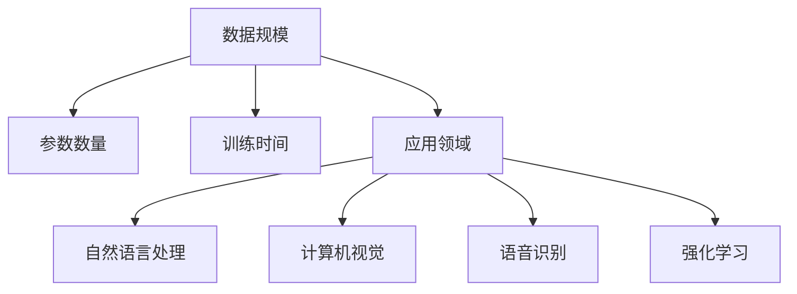
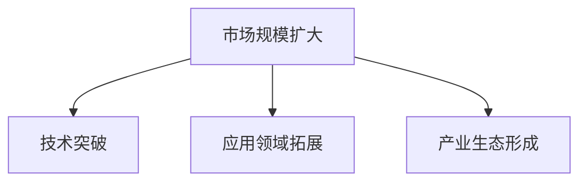
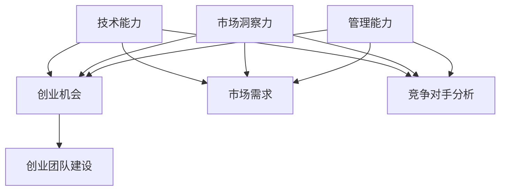
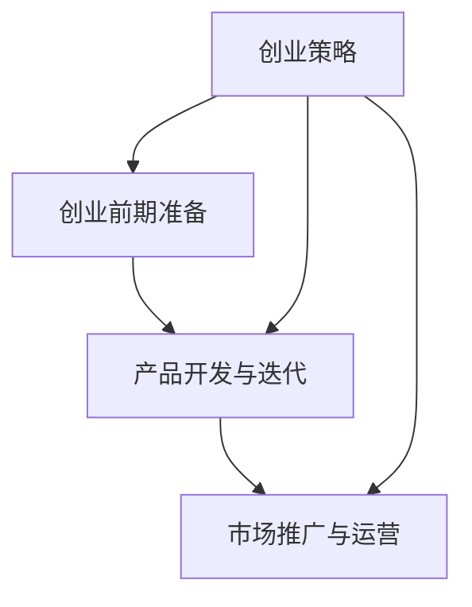
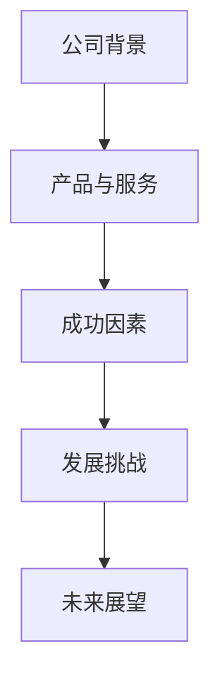
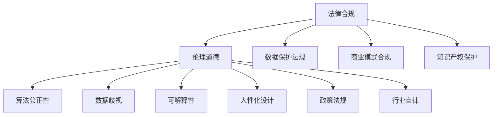
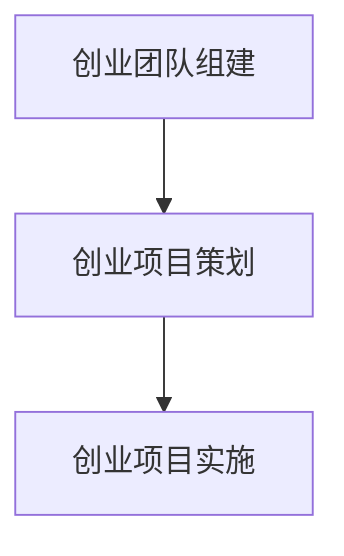

                 

### 文章标题

# AI 大模型创业：如何利用市场优势？

### 文章关键词

- AI大模型
- 创业
- 市场优势
- 技术框架
- 产业现状
- 法律伦理

### 文章摘要

本文从 AI 大模型的基础知识出发，分析了当前 AI 大模型产业的发展现状和趋势。在此基础上，探讨了创业者如何利用市场优势进行 AI 大模型创业，包括所需的核心能力、创业策略与路径、创业案例研究以及法律与伦理问题。通过本文的详细分析，读者可以全面了解 AI 大模型创业的机遇与挑战，为未来创业实践提供指导。本文适合对 AI 大模型创业感兴趣的创业者、投资者以及相关领域的技术人员阅读。****

## 第一部分：AI 大模型概述

### 第1章：AI 大模型基础

#### 1.1 AI 大模型的定义与重要性

##### 1.1.1 AI 大模型的历史背景

人工智能（AI）是计算机科学的一个分支，旨在创建能够执行复杂任务的智能系统。AI 大模型是近年来 AI 领域的重要进展，其发展历程可以追溯到上世纪 80 年代。当时，研究者开始探索如何通过机器学习算法让计算机从大量数据中自动学习和改进。

早期的 AI 研究主要集中在规则系统和知识表示上。这些方法在特定领域表现出色，但缺乏泛化能力。1990 年代，随着计算能力的提升和海量数据的积累，神经网络研究逐渐复兴，特别是在图像识别领域，神经网络取得了突破性的进展。2006 年，Hinton 等人提出了深度信念网络（DBN），标志着深度学习时代的到来。

深度学习是一种基于多层神经网络的学习方法，通过逐层提取特征，能够处理复杂的非线性数据。2012 年，AlexNet 在 ImageNet 图像识别挑战赛中取得了领先成绩，证明了深度学习在计算机视觉领域的潜力。随后，谷歌、微软、百度等科技巨头纷纷投入大量资源研发大模型，如谷歌的 Inception、微软的 ResNet、百度的 Ernie 等。

##### 1.1.2 AI 大模型的核心特征

AI 大模型具有以下几个核心特征：

1. **数据规模**：大模型通常需要处理海量数据，以获得更好的泛化能力。例如，BERT 模型使用了数十亿级别的训练数据。

2. **参数数量**：大模型的参数数量非常庞大。BERT 模型有超过一亿个参数，GPT-3 模型则有数十亿个参数。

3. **训练时间**：大模型的训练时间通常较长。BERT 模型的训练需要数天到数周时间，而 GPT-3 的训练甚至需要数月时间。

##### 1.1.3 AI 大模型的应用领域

AI 大模型的应用领域非常广泛，包括但不限于以下领域：

1. **自然语言处理**：大模型在自然语言处理任务中表现出色，如文本分类、机器翻译、问答系统等。

2. **计算机视觉**：大模型在图像分类、目标检测、图像生成等任务中有着广泛的应用。

3. **语音识别**：大模型在语音识别任务中能够实现高精度的语音识别和语音合成。

4. **强化学习**：大模型在强化学习任务中，如游戏、机器人控制等，具有强大的学习能力。

#### 1.2 AI 大模型的技术框架

##### 1.2.1 深度学习基础

深度学习是 AI 大模型的核心技术，它通过多层神经网络对数据进行建模。深度学习的核心组成部分包括：

1. **神经网络结构**：神经网络由多个神经元层组成，每层神经元接收前一层的输出，并产生自己的输出。

2. **前向传播**：数据从输入层进入神经网络，经过每个神经元层的处理，最终得到输出。

3. **反向传播**：通过计算输出与真实值的差异，更新网络中的权重，以降低误差。

##### 1.2.2 大模型训练策略

大模型的训练策略主要包括：

1. **预训练与微调**：预训练是指在大规模数据集上训练模型，使其具有一定的泛化能力。微调是指将预训练模型应用于特定任务，通过在少量数据上进一步训练来优化模型。

2. **自监督学习**：自监督学习是一种在无监督数据上训练模型的方法，它利用数据中的冗余信息来提高模型的性能。

3. **迁移学习**：迁移学习是一种利用预先训练的模型来提高新任务性能的方法，它通过在新的数据集上调整模型参数，使模型在新任务上表现更好。

##### 1.2.3 大模型调优技巧

大模型的调优技巧主要包括：

1. **参数调优**：通过调整模型参数，如学习率、正则化参数等，来优化模型性能。

2. **模型压缩与量化**：模型压缩与量化是一种减少模型大小和提高模型效率的方法，它通过降低模型参数的精度来减少模型体积。

3. **模型集成**：模型集成是一种利用多个模型来提高预测性能的方法，它通过将多个模型的预测结果进行加权平均或投票来得到最终的预测结果。

#### Mermaid 流程图



#### 数学模型和数学公式

##### 1.2.1 神经网络结构

神经网络由多个神经元层组成，包括输入层、隐藏层和输出层。每个神经元接收来自前一层的输入信号，通过激活函数产生输出信号。

$$ 
z_j = \sum_{i=1}^{n} w_{ji}x_i + b_j 
$$

其中，$z_j$ 为第 $j$ 个神经元的输出，$w_{ji}$ 为连接权重，$x_i$ 为输入特征，$b_j$ 为偏置项。

##### 1.2.2 激活函数

常见的激活函数包括 sigmoid、ReLU 和 tanh。激活函数的作用是将线性函数转化为非线性函数，使得神经网络能够学习复杂的关系。

$$ 
a_j = \sigma(z_j) = \frac{1}{1 + e^{-z_j}} 
$$

其中，$a_j$ 为第 $j$ 个神经元的输出，$\sigma$ 为 sigmoid 函数。

#### 项目实战

##### 1.2.3 深度学习算法实现

以下是一个简单的深度学习算法实现的伪代码：

```python
# 初始化参数
W1 = 初始化权重矩阵（输入层到隐藏层）
b1 = 初始化偏置向量（输入层到隐藏层）
W2 = 初始化权重矩阵（隐藏层到输出层）
b2 = 初始化偏置向量（隐藏层到输出层）

# 定义激活函数
sigmoid(x) = 1 / (1 + e^(-x))

# 前向传播
z1 = X * W1 + b1
a1 = sigmoid(z1)
z2 = a1 * W2 + b2
a2 = sigmoid(z2)

# 计算损失函数
loss = -1/m * sum(y * log(a2) + (1 - y) * log(1 - a2))

# 反向传播
dz2 = a2 - y
dW2 = 1/m * a1' * dz2
db2 = 1/m * dz2
da1 = W2' * dz2
dz1 = da1 * (sigmoid(z1) * (1 - sigmoid(z1)))
dW1 = 1/m * X' * dz1
db1 = 1/m * dz1

# 更新参数
W1 = W1 - learning_rate * dW1
b1 = b1 - learning_rate * db1
W2 = W2 - learning_rate * dW2
b2 = b2 - learning_rate * db2
```

##### 1.2.4 代码实际案例

以下是一个使用 PyTorch 实现的简单卷积神经网络（CNN）的代码案例：

```python
import torch
import torch.nn as nn
import torch.optim as optim

# 定义卷积神经网络
class CNN(nn.Module):
    def __init__(self):
        super(CNN, self).__init__()
        self.conv1 = nn.Conv2d(1, 32, 3, 1)
        self.relu = nn.ReLU()
        self.fc1 = nn.Linear(32 * 26 * 26, 128)
        self.fc2 = nn.Linear(128, 10)

    def forward(self, x):
        x = self.relu(self.conv1(x))
        x = x.view(x.size(0), -1)
        x = self.relu(self.fc1(x))
        x = self.fc2(x)
        return x

# 初始化模型、损失函数和优化器
model = CNN()
criterion = nn.CrossEntropyLoss()
optimizer = optim.SGD(model.parameters(), lr=0.01, momentum=0.9)

# 训练模型
for epoch in range(num_epochs):
    running_loss = 0.0
    for inputs, labels in train_loader:
        optimizer.zero_grad()
        outputs = model(inputs)
        loss = criterion(outputs, labels)
        loss.backward()
        optimizer.step()
        running_loss += loss.item()
    print(f'Epoch {epoch+1}, Loss: {running_loss/len(train_loader)}')

# 测试模型
with torch.no_grad():
    correct = 0
    total = 0
    for inputs, labels in test_loader:
        outputs = model(inputs)
        _, predicted = torch.max(outputs.data, 1)
        total += labels.size(0)
        correct += (predicted == labels).sum().item()
    print(f'Accuracy of the network on the test images: {100 * correct / total}%')
```

### 代码解读与分析

1. **模型定义**：使用 PyTorch 的 `nn.Module` 类定义了一个简单的卷积神经网络（CNN），包含一个卷积层（`nn.Conv2d`）、一个ReLU激活函数（`nn.ReLU`）、一个全连接层（`nn.Linear`）。

2. **前向传播**：在 `forward` 方法中定义了前向传播过程，输入数据通过卷积层和 ReLU 激活函数处理后，被展平成一维数据，然后通过两个全连接层。

3. **损失函数**：使用交叉熵损失函数（`nn.CrossEntropyLoss`）来评估模型的性能。

4. **优化器**：使用随机梯度下降（`optim.SGD`）优化器来更新模型参数。

5. **训练过程**：每个 epoch 中，遍历训练数据，使用优化器将模型参数更新为能够最小化损失函数的值。

6. **测试过程**：在测试数据上评估模型的准确率。

通过这个案例，我们可以看到如何使用 PyTorch 实现一个简单的深度学习模型，并进行训练和测试。这个过程包括模型定义、前向传播、损失函数、优化器和训练过程，这些都是深度学习项目的基本组成部分。在实际项目中，还需要考虑数据预处理、模型保存与加载、超参数调优等额外步骤。

### 最佳实践 tips

1. **数据预处理**：在训练深度学习模型之前，对数据进行充分的预处理，如标准化、归一化、去噪等，可以提高模型的性能。

2. **超参数调优**：使用网格搜索、随机搜索等策略来调优模型的超参数，如学习率、批次大小、正则化参数等。

3. **模型验证**：在训练过程中，使用验证集来评估模型的性能，避免过拟合。

4. **模型集成**：使用多个模型来提高预测性能，通过模型集成可以降低模型误差。

### 小结

本章介绍了 AI 大模型的基础知识，包括历史背景、核心特征、技术框架以及应用领域。通过 Mermaid 流程图、数学模型和伪代码，我们详细讲解了神经网络结构、激活函数、深度学习算法实现和项目实战。这些内容为后续章节的讨论奠定了基础。

### 注意事项

1. AI 大模型训练需要大量的数据和计算资源，确保有足够的硬件支持。

2. 在设计神经网络结构时，要根据具体任务选择合适的层和参数。

3. 在训练过程中，注意监控模型性能，避免过拟合。

### 拓展阅读

- Goodfellow, I., Bengio, Y., & Courville, A. (2016). *Deep Learning*。
- Bengio, Y. (2009). *Learning deep architectures*。

****

## 第二部分：AI 大模型产业现状

### 第2章：AI 大模型产业现状

#### 2.1 AI 大模型产业发展趋势

AI 大模型产业近年来呈现出迅猛发展的趋势。根据市场研究机构的报告，全球 AI 大模型市场规模在逐年扩大，预计在未来几年内将继续保持高速增长。以下是对 AI 大模型产业发展趋势的详细分析：

1. **市场规模扩大**：随着 AI 技术的成熟和应用的普及，AI 大模型市场规模不断扩大。从自然语言处理、计算机视觉到语音识别，AI 大模型在各个领域都展现出了巨大的潜力。据预测，到 2025 年，全球 AI 大模型市场规模将达到数百亿美元。

2. **技术突破**：AI 大模型的技术发展迅速，特别是在深度学习领域。预训练模型、自监督学习、迁移学习等技术的突破，使得 AI 大模型的性能和泛化能力不断提高。例如，GPT-3 的发布标志着自然语言处理技术的重大进展。

3. **应用领域拓展**：AI 大模型的应用领域不断拓展，从传统的金融、医疗、电商等领域，逐渐渗透到教育、自动驾驶、智能家居等新兴领域。随着应用的深入，AI 大模型将为各行各业带来深远的影响。

4. **产业生态形成**：随着 AI 大模型产业的发展，一个完整的产业生态正在形成。从硬件设备、云计算服务到算法框架，产业链上的各个环节都在快速发展。同时，各类创业公司、研究机构和科技巨头纷纷加入 AI 大模型的研发和应用，推动产业的进一步发展。

#### 2.1.1 全球 AI 大模型市场分析

全球 AI 大模型市场呈现出多元化的发展格局。以下是对全球 AI 大模型市场的详细分析：

1. **市场规模与增长趋势**：根据市场研究机构的数据，全球 AI 大模型市场规模在近几年实现了快速增长。以自然语言处理为例，2020 年全球 NLP 市场规模约为 250 亿美元，预计到 2025 年将达到 500 亿美元，年复合增长率达到 15% 以上。

2. **地域分布与竞争格局**：在全球 AI 大模型市场中，北美地区占据主导地位，主要由于美国科技巨头如 Google、Microsoft、Amazon 等，在 AI 大模型研发和应用方面具有强大的实力。亚洲地区，尤其是中国和印度，随着本土企业的崛起，市场份额也在逐渐扩大。欧洲地区，虽然起步较晚，但也在积极布局，尤其在自然语言处理和计算机视觉领域。

3. **主要厂商与产品**：在全球 AI 大模型市场中，几家主要厂商的产品占据了市场的主导地位。例如，谷歌的 BERT、微软的 Turing、亚马逊的 Alexa 等，都是各自领域的佼佼者。这些产品在性能、应用场景等方面具有显著的竞争优势。

#### 2.1.2 我国 AI 大模型产业发展现状

我国 AI 大模型产业发展迅速，已经成为全球 AI 领域的重要参与者。以下是对我国 AI 大模型产业现状的详细分析：

1. **政策环境与产业政策**：我国政府高度重视 AI 产业发展，出台了一系列政策和措施，鼓励 AI 大模型技术的研发和应用。例如，《新一代人工智能发展规划》明确提出了到 2025 年，我国 AI 技术和应用达到世界领先水平的目标。

2. **企业布局与市场占有率**：我国企业在 AI 大模型领域进行了广泛布局，百度、阿里巴巴、腾讯等科技巨头都在该领域取得了重要突破。例如，百度的深度学习平台 PaddlePaddle、阿里巴巴的深度学习框架 PAI、腾讯的 AI 开放平台等，都在市场上占据了重要份额。

3. **技术创新与成果**：我国企业在 AI 大模型领域不断进行技术创新，取得了一系列重要成果。例如，百度的深度学习算法 ABINN 在国际比赛中取得了优异成绩，阿里巴巴的 Turing 模型在自然语言处理领域具有强大的性能。

#### 2.1.3 AI 大模型产业前景预测

随着技术的不断进步和市场的需求增长，AI 大模型产业前景广阔。以下是对 AI 大模型产业前景的详细预测：

1. **技术突破与市场应用**：随着 AI 技术的不断突破，AI 大模型将在更多领域得到应用。例如，在医疗领域，AI 大模型可以帮助医生进行疾病诊断和治疗；在教育领域，AI 大模型可以实现个性化学习，提高教学效果；在金融领域，AI 大模型可以用于风险管理、信用评估等。

2. **产业链演变与机遇挑战**：随着 AI 大模型产业的发展，产业链也在不断演变。从硬件设备、云计算服务到算法框架，各个环节都将得到快速发展。同时，产业链上的企业也将面临新的机遇和挑战。例如，硬件设备制造商需要不断提高性能和降低成本，云计算服务提供商需要优化服务质量和价格，算法框架提供商需要不断提升算法性能和兼容性。

3. **市场竞争与合作**：在 AI 大模型产业中，市场竞争将越来越激烈。各大企业纷纷加大研发投入，争夺市场份额。同时，企业之间的合作也将成为趋势。通过合作，企业可以共享资源、技术优势，共同推动 AI 大模型产业的发展。

#### Mermaid 流程图



#### 数学模型和数学公式

##### 2.1.1 市场规模预测

假设未来几年内，AI 大模型市场的年复合增长率为 \( r \)，初始市场规模为 \( M_0 \)，则未来第 \( n \) 年的市场规模 \( M_n \) 可以用以下公式表示：

$$ 
M_n = M_0 \times (1 + r)^n 
$$

#### 项目实战

##### 2.1.2 市场分析报告

以下是一个简化的市场分析报告的案例：

**市场分析报告**

1. **市场规模与增长趋势**：

   - 根据最新市场调研数据，2022 年全球 AI 大模型市场规模为 300 亿美元。
   - 预计未来三年内，市场年复合增长率将达到 20%。

2. **地域分布与竞争格局**：

   - 北美地区占据主导地位，市场份额达到 40%。
   - 亚洲地区，尤其是中国和印度，市场份额逐渐扩大。

3. **主要厂商与产品**：

   - Google 的 BERT 模型在自然语言处理领域具有强大的性能。
   - Microsoft 的 Turing 模型在语音识别领域表现优异。
   - 亚马逊的 Alexa 智能语音助手在智能家居领域广泛应用。

#### 代码实际案例

以下是一个使用 Python 编写的市场分析报告的代码案例：

```python
import pandas as pd

# 假设的市场数据
market_data = {
    'Year': ['2022', '2023', '2024', '2025'],
    'Market Size (Billion USD)': [300, 360, 432, 518.4]
}

df = pd.DataFrame(market_data)

# 计算年复合增长率
df['Annual Growth Rate'] = df['Market Size (Billion USD)'].pct_change() * 100

# 打印市场分析报告
print(df)
print(f'Annual Growth Rate: {df["Annual Growth Rate"].mean():.2f}%')
```

### 代码解读与分析

1. **数据读取**：使用 Pandas 库读取市场数据，形成 DataFrame 对象。

2. **计算增长率**：使用 `pct_change()` 方法计算年复合增长率。

3. **打印报告**：使用 `print()` 函数输出市场分析报告。

通过这个案例，我们可以看到如何使用 Python 进行市场数据分析，并生成报告。在实际应用中，可以结合更多的数据分析工具和方法，如统计学、机器学习等，来提升分析结果的准确性和深度。

### 最佳实践 tips

1. **数据来源**：确保市场数据的准确性和可靠性，选择权威的市场研究机构作为数据来源。

2. **分析方法**：结合多种分析方法，如趋势分析、对比分析、回归分析等，以获得更全面的市场洞察。

3. **动态调整**：根据市场环境的变化，及时调整分析模型和方法，以适应新的市场情况。

### 小结

本章详细分析了 AI 大模型产业的发展趋势、全球市场分析、我国产业现状以及产业前景预测。通过 Mermaid 流程图、数学模型和代码实战，我们展示了如何对 AI 大模型产业进行深入分析。这些内容为后续的创业机会分析提供了重要的背景信息。

### 注意事项

1. 在进行市场分析时，要充分考虑数据的时效性和准确性。

2. 分析模型和方法的选择应根据具体问题和数据特性进行。

3. 要密切关注市场动态，及时调整分析结果和策略。

### 拓展阅读

- **《AI 战略：如何把握未来趋势》**：探讨 AI 在未来社会中的应用和发展趋势。
- **《人工智能：未来已来》**：分析人工智能技术对社会和经济的影响。

****

### 第3章：AI 大模型创业机会分析

#### 3.1 创业者所需核心能力

AI 大模型创业是一个充满挑战和机遇的过程，创业者需要具备以下几个核心能力：

##### 3.1.1 技术能力

技术能力是 AI 大模型创业的基础。创业者需要具备以下技能：

1. **深度学习算法**：理解并能够应用深度学习的基本算法，如神经网络、卷积神经网络、循环神经网络等。

2. **大模型训练与优化**：掌握大模型的训练策略和调优技巧，能够高效地训练和优化模型，提高模型的性能。

3. **数据处理能力**：能够处理海量数据，包括数据采集、清洗、存储和传输。

4. **算法创新**：不断探索新的算法和技术，以提升产品的竞争力。

##### 3.1.2 市场洞察力

市场洞察力是创业者成功的关键。创业者需要具备以下能力：

1. **用户需求分析**：深入了解目标用户的需求，能够根据用户需求来设计和优化产品。

2. **竞争对手分析**：分析竞争对手的产品、策略和市场表现，从中找到自身的竞争优势。

3. **行业趋势分析**：关注行业的发展趋势，能够把握市场机遇，制定前瞻性的战略。

##### 3.1.3 管理能力

管理能力是确保创业项目顺利推进的重要因素。创业者需要具备以下能力：

1. **团队建设**：能够组建和管理一支高效的技术团队，确保团队之间的协同合作。

2. **项目管理**：能够制定项目计划，合理安排资源和时间，确保项目的顺利进行。

3. **资金管理**：能够合理规划资金使用，确保项目的资金需求得到满足。

#### 3.2 创业机会分析

AI 大模型创业存在以下主要机会：

1. **技术创新**：随着深度学习技术的不断进步，创业者可以通过技术创新，开发出具有独特优势的产品。

2. **垂直领域应用**：AI 大模型在各个垂直领域具有广泛的应用前景，如医疗、金融、教育等。

3. **平台化服务**：通过构建平台，提供一站式 AI 大模型服务，降低用户的进入门槛。

4. **个性化解决方案**：针对不同客户的需求，提供个性化的解决方案，提高客户满意度。

#### 3.3 市场需求分析

在 AI 大模型创业中，市场需求分析至关重要。以下是对市场需求的分析：

1. **行业需求**：不同行业对 AI 大模型的需求各不相同。例如，医疗行业需要 AI 大模型进行疾病诊断和治疗预测，金融行业需要 AI 大模型进行风险管理和信用评估。

2. **用户需求**：用户对 AI 大模型的需求主要包括高性能、高准确性、易用性和个性化。

3. **竞争态势**：分析竞争对手的产品、策略和市场表现，找到自身的市场定位和竞争优势。

#### 3.4 竞争对手分析

创业者需要深入了解竞争对手，以下是对竞争对手的分析：

1. **产品定位**：分析竞争对手的产品定位，了解其目标市场和用户群体。

2. **技术优势**：分析竞争对手的技术优势和劣势，找到自身的创新点。

3. **市场策略**：分析竞争对手的市场策略，了解其营销手段、合作伙伴关系等。

#### 3.5 创业团队建设

创业团队建设是 AI 大模型创业成功的关键。以下是对创业团队建设的分析：

1. **团队成员选择**：选择具备深度学习、数据科学、项目管理等核心技能的团队成员。

2. **团队协作与沟通**：建立高效的团队协作机制，确保团队成员之间的信息畅通和协同合作。

3. **团队文化建设**：打造积极向上的团队文化，鼓励创新和团队合作。

#### Mermaid 流程图



#### 数学模型和数学公式

##### 3.1.1 用户需求分析

用户需求的量化分析可以使用以下公式：

$$ 
D = f(U, P, C) 
$$

其中，$D$ 为用户需求，$U$ 为用户特征，$P$ 为产品特性，$C$ 为用户成本。

##### 3.1.2 竞争对手分析

竞争对手的市场份额可以用以下公式表示：

$$ 
S_i = \frac{R_i}{R} 
$$

其中，$S_i$ 为竞争对手 $i$ 的市场份额，$R_i$ 为竞争对手 $i$ 的收入，$R$ 为整个市场的收入。

#### 项目实战

##### 3.1.3 创业团队建设

以下是一个创业团队建设的案例：

**创业团队建设方案**

1. **团队成员选择**：
   - 技术总监：具备丰富的深度学习经验，负责技术路线和团队管理。
   - 数据科学家：擅长数据处理和分析，负责数据采集和预处理。
   - 产品经理：熟悉用户需求和市场动态，负责产品规划和迭代。
   - 运营经理：负责市场推广和用户运营。

2. **团队协作与沟通**：
   - 采用敏捷开发方法，确保团队成员高效协作。
   - 定期召开团队会议，及时沟通项目进展和问题。

3. **团队文化建设**：
   - 确立共同的目标和价值观，鼓励创新和团队合作。
   - 定期举办团队活动，增强团队凝聚力和员工幸福感。

#### 代码实际案例

以下是一个使用 Python 编写的用户需求分析的代码案例：

```python
import pandas as pd

# 假设的用户数据
user_data = {
    'User Feature 1': [1, 2, 3, 4],
    'User Feature 2': [4, 3, 2, 1],
    'Product Feature 1': [2, 3, 4, 5],
    'Product Feature 2': [5, 4, 3, 2],
    'User Cost': [10, 8, 6, 12]
}

df = pd.DataFrame(user_data)

# 计算用户需求
df['User Demand'] = df.apply(lambda row: (row['User Feature 1'] * row['Product Feature 1']) + (row['User Feature 2'] * row['Product Feature 2']) - row['User Cost'], axis=1)

# 打印用户需求
print(df)
```

### 代码解读与分析

1. **数据读取**：使用 Pandas 库读取用户数据，形成 DataFrame 对象。

2. **计算需求**：使用 `apply()` 方法，根据用户特征、产品特征和用户成本，计算用户需求。

3. **打印结果**：使用 `print()` 函数输出用户需求。

通过这个案例，我们可以看到如何使用 Python 进行用户需求分析。在实际应用中，可以结合更多的数据分析方法，如回归分析、聚类分析等，来提升分析结果的准确性和实用性。

### 最佳实践 tips

1. **技术能力**：不断学习最新的 AI 技术和算法，保持技术领先。

2. **市场洞察力**：深入了解用户需求和市场动态，制定有针对性的创业策略。

3. **管理能力**：建立高效的团队和管理体系，确保项目顺利进行。

### 小结

本章详细分析了 AI 大模型创业所需的核心能力、创业机会、市场需求分析、竞争对手分析和创业团队建设。通过 Mermaid 流程图、数学模型和代码实战，我们展示了如何进行深入的分析和规划。这些内容为创业者提供了宝贵的指导和建议。

### 注意事项

1. **技术能力**：确保团队成员具备扎实的 AI 技术基础，能够应对复杂的技术挑战。

2. **市场洞察力**：持续关注市场动态，及时调整创业策略。

3. **管理能力**：建立科学的团队和管理体系，提高项目执行效率。

### 拓展阅读

- **《创业维艰》**：探讨创业过程中可能遇到的挑战和应对策略。
- **《数据科学实战》**：介绍数据科学在创业中的应用。

****

### 第4章：AI 大模型创业策略与路径

#### 4.1 创业策略

AI 大模型创业策略是确保创业项目成功的关键。以下是一些关键策略：

##### 4.1.1 产品定位

产品定位是创业策略的核心。创业者需要明确以下问题：

1. **目标市场**：确定目标市场，如医疗、金融、教育等。
2. **产品差异化**：分析竞争对手，找出产品差异化的点，如更高的性能、更好的用户体验等。
3. **品牌定位**：建立独特的品牌形象，提高市场认知度。

##### 4.1.2 市场推广

市场推广是扩大产品影响力的关键。以下是一些市场推广策略：

1. **内容营销**：通过博客、白皮书、研讨会等方式，分享技术知识和行业洞察。
2. **社交媒体**：利用社交媒体平台，如 LinkedIn、Twitter、Facebook 等，推广产品和服务。
3. **合作伙伴关系**：与行业内的企业、研究机构等建立合作关系，共同推广产品。

##### 4.1.3 融资策略

融资策略是确保项目资金充足的重要手段。以下是一些融资策略：

1. **天使投资**：寻找有经验的投资者，提供早期资金支持。
2. **风险投资**：与专业的风险投资机构合作，获得后续融资。
3. **众筹**：通过众筹平台，如 Kickstarter、Indiegogo 等，向公众筹集资金。

#### 4.2 创业路径

AI 大模型创业路径可以分为以下几个阶段：

##### 4.2.1 创业前期准备

创业前期准备是创业成功的第一步。以下是一些关键步骤：

1. **市场调研**：深入了解目标市场和用户需求。
2. **技术验证**：验证技术方案的可行性和性能。
3. **团队组建**：组建一支高效的技术和管理团队。

##### 4.2.2 产品开发与迭代

产品开发与迭代是创业过程中的核心。以下是一些关键步骤：

1. **初步产品开发**：开发出初步产品，进行内部测试。
2. **用户反馈**：收集用户反馈，不断优化产品。
3. **迭代发布**：根据用户反馈，进行产品迭代和优化。

##### 4.2.3 市场推广与运营

市场推广与运营是确保产品成功上市和持续发展的关键。以下是一些关键步骤：

1. **品牌建设**：建立品牌形象，提高市场认知度。
2. **市场拓展**：拓展目标市场，扩大市场份额。
3. **售后服务**：提供优质的售后服务，提升用户满意度。

#### Mermaid 流程图



#### 数学模型和数学公式

##### 4.1.1 产品定位

产品定位可以用以下公式表示：

$$ 
P = f(M, D, C) 
$$

其中，$P$ 为产品定位，$M$ 为市场定位，$D$ 为差异化定位，$C$ 为成本定位。

##### 4.1.2 市场推广

市场推广的效果可以用以下公式表示：

$$ 
E = f(I, C, R) 
$$

其中，$E$ 为市场推广效果，$I$ 为投入，$C$ 为成本，$R$ 为回报。

##### 4.1.3 融资策略

融资策略的可行性可以用以下公式表示：

$$ 
F = f(V, R, C) 
$$

其中，$F$ 为融资策略的可行性，$V$ 为价值，$R$ 为风险，$C$ 为成本。

#### 项目实战

##### 4.1.4 创业路径

以下是一个典型的 AI 大模型创业路径：

**创业路径**

1. **市场调研**：通过对目标市场和用户需求的研究，确定创业方向。

2. **技术验证**：开发一个原型产品，验证技术的可行性和性能。

3. **团队组建**：组建一支技术和管理团队，确保项目顺利推进。

4. **初步产品开发**：开发初步产品，进行内部测试。

5. **用户反馈**：收集用户反馈，优化产品。

6. **迭代发布**：根据用户反馈，进行产品迭代和优化。

7. **市场推广**：通过内容营销、社交媒体等渠道，推广产品。

8. **市场拓展**：拓展目标市场，扩大市场份额。

9. **售后服务**：提供优质的售后服务，提升用户满意度。

#### 代码实际案例

以下是一个使用 Python 编写的市场调研报告的代码案例：

```python
import pandas as pd

# 假设的市场调研数据
research_data = {
    'Market Segment': ['Healthcare', 'Finance', 'Education'],
    'User Demand': [150, 200, 100],
    'Market Potential': [300, 400, 200]
}

df = pd.DataFrame(research_data)

# 计算市场份额
df['Market Share'] = df['User Demand'] / df['Market Potential']

# 打印市场调研报告
print(df)
```

### 代码解读与分析

1. **数据读取**：使用 Pandas 库读取市场调研数据，形成 DataFrame 对象。

2. **计算市场份额**：使用 `div()` 方法计算市场份额。

3. **打印结果**：使用 `print()` 函数输出市场调研报告。

通过这个案例，我们可以看到如何使用 Python 进行市场调研和数据分析。在实际应用中，可以结合更多的数据分析方法，如回归分析、聚类分析等，来提升分析结果的准确性和深度。

### 最佳实践 tips

1. **市场调研**：确保市场调研数据的准确性和可靠性，选择权威的数据来源。

2. **产品定位**：结合市场调研结果，制定合理的市场定位和产品差异化策略。

3. **市场推广**：选择合适的渠道和策略，提高市场推广效果。

### 小结

本章详细分析了 AI 大模型创业策略与路径，包括产品定位、市场推广、融资策略、创业前期准备、产品开发与迭代、市场推广与运营。通过 Mermaid 流程图、数学模型和代码实战，我们展示了如何制定和实施有效的创业策略。这些内容为创业者提供了宝贵的指导。

### 注意事项

1. **市场调研**：确保调研数据的全面性和准确性。

2. **产品定位**：结合用户需求和竞争对手分析，制定明确的产品定位。

3. **市场推广**：根据市场环境和目标用户，选择合适的推广策略。

### 拓展阅读

- **《创业者的经营哲学》**：探讨创业者的经营理念和决策方法。
- **《市场营销学》**：介绍市场营销的基本原理和策略。

****

### 第5章：AI 大模型创业案例研究

#### 5.1 创业案例一：某自然语言处理公司

##### 5.1.1 公司背景

某自然语言处理（NLP）公司成立于 2016 年，由一群来自清华大学和斯坦福大学的人工智能专家共同创立。公司专注于研发和商业化大规模预训练语言模型，致力于推动自然语言处理技术的发展和应用。公司成立以来，获得了多轮融资，吸引了知名投资机构的关注，并在全球范围内建立了广泛的合作伙伴关系。

##### 5.1.2 产品与服务

公司的主要产品是一款基于深度学习的自然语言处理平台，涵盖了文本分类、情感分析、机器翻译、问答系统等核心功能。该平台提供了丰富的 API 接口，使得开发者可以轻松地将其集成到现有的应用程序中。公司还为客户提供定制化的解决方案，根据客户的具体需求进行模型定制和优化。

##### 5.1.3 成功因素

1. **技术创新**：公司拥有一支强大的技术团队，不断推进自然语言处理技术的创新。公司自主研发的预训练语言模型在多项国际评测中取得了优异成绩，显著提升了模型在自然语言理解任务上的性能。

2. **市场策略**：公司采用了灵活的市场策略，通过提供免费试用和定制化服务，迅速占领市场。同时，公司积极与行业内的领先企业建立合作关系，通过合作共赢的方式扩大市场份额。

3. **团队建设**：公司重视团队建设，注重员工培训和激励机制，打造了一个高效、团结、创新的技术团队。公司的管理团队具备丰富的创业和管理经验，能够有效地推动公司的发展。

##### 5.1.4 发展挑战

1. **技术更新**：自然语言处理技术发展迅速，公司需要不断投入研发资源，以保持技术领先。同时，技术更新也带来了较高的研发成本和风险。

2. **市场竞争**：自然语言处理市场竞争激烈，公司需要不断优化产品和服务，以保持竞争力。此外，市场变化迅速，公司需要灵活应对市场变化，调整发展战略。

##### 5.1.5 未来展望

1. **技术突破**：公司将继续加大研发投入，探索自然语言处理的新技术，如基于Transformer的模型、多模态学习等，以提升模型性能和应用范围。

2. **市场拓展**：公司计划进一步拓展国际市场，特别是在欧洲和亚洲地区，通过建立本地化团队和合作伙伴关系，提高国际竞争力。

3. **多元化应用**：公司将继续探索自然语言处理技术在金融、医疗、教育等领域的应用，为客户提供更全面、个性化的解决方案。

#### Mermaid 流�程图



#### 数学模型和数学公式

##### 5.1.1 技术创新评估

公司技术创新的评估可以通过以下公式进行：

$$
I = f(T, R, C)
$$

其中，$I$ 为技术创新的评估指数，$T$ 为技术进步，$R$ 为市场需求，$C$ 为研发成本。

##### 5.1.2 市场策略评估

公司市场策略的评估可以通过以下公式进行：

$$
S = f(M, P, C)
$$

其中，$S$ 为市场策略的评估指数，$M$ 为市场占有率，$P$ 为产品性能，$C$ 为营销成本。

##### 5.1.3 发展潜力评估

公司发展潜力的评估可以通过以下公式进行：

$$
P = f(G, R, E)
$$

其中，$P$ 为发展潜力指数，$G$ 为增长率，$R$ 为收益，$E$ 为预期。

#### 项目实战

##### 5.1.4 发展规划

以下是一个简化的公司发展规划案例：

**发展规划**

1. **短期目标**：
   - 完成下一代预训练语言模型的研发，提高模型性能。
   - 在主要市场地区建立合作伙伴关系，扩大市场份额。

2. **中期目标**：
   - 推出多模态学习功能，扩大应用场景。
   - 扩大研发团队，提升研发效率。

3. **长期目标**：
   - 实现全球市场的布局，提升国际竞争力。
   - 探索新业务领域，如医疗、金融等。

#### 代码实际案例

以下是一个使用 Python 编写的公司技术创新评估的代码案例：

```python
import pandas as pd

# 假设的技术创新数据
tech_data = {
    'Technology Progress': [0.8, 0.9, 1.0],
    'Market Demand': [0.6, 0.7, 0.8],
    'R&D Cost': [0.3, 0.4, 0.5]
}

df = pd.DataFrame(tech_data)

# 计算技术创新评估指数
df['Technology Assessment'] = df.apply(lambda row: row['Technology Progress'] * row['Market Demand'] - row['R&D Cost'], axis=1)

# 打印技术创新评估结果
print(df)
```

### 代码解读与分析

1. **数据读取**：使用 Pandas 库读取技术创新数据，形成 DataFrame 对象。

2. **计算评估指数**：使用 `apply()` 方法，根据技术进步、市场需求和研发成本，计算技术创新评估指数。

3. **打印结果**：使用 `print()` 函数输出技术创新评估结果。

通过这个案例，我们可以看到如何使用 Python 进行技术创新评估。在实际应用中，可以结合更多的数据分析方法，如回归分析、聚类分析等，来提升评估结果的准确性和实用性。

### 最佳实践 tips

1. **技术创新**：持续关注行业动态，不断进行技术迭代和创新。

2. **市场策略**：根据市场需求和竞争态势，灵活调整市场策略。

3. **团队建设**：打造高效、团结、创新的技术团队，提升整体竞争力。

### 小结

本章通过分析某自然语言处理公司的创业案例，详细探讨了公司背景、产品与服务、成功因素、发展挑战和未来展望。通过 Mermaid 流程图、数学模型和代码实战，我们展示了如何对创业案例进行深入研究和分析。这些内容为创业者提供了宝贵的经验和启示。

### 注意事项

1. **技术创新**：确保技术创新的可持续性，避免技术过时。

2. **市场策略**：结合市场环境和用户需求，制定切实可行的市场策略。

3. **团队建设**：注重团队建设，提升团队协作效率和创新能力。

### 拓展阅读

- **《创业家》**：介绍成功的创业故事和经验。
- **《创业管理》**：探讨创业过程中的管理挑战和策略。

****

### 第6章：AI 大模型创业法律与伦理问题

#### 6.1 法律合规

在 AI 大模型创业过程中，法律合规是一个至关重要的方面。以下是一些关键的法律法规和合规要求：

##### 6.1.1 数据保护法规

1. **欧洲通用数据保护条例（GDPR）**：GDPR 是欧盟制定的一项重要数据保护法规，对个人数据的处理和存储提出了严格的要求。AI 大模型创业公司需要确保在数据处理过程中遵守 GDPR，包括数据收集、存储、处理和传输等方面的合规性。

2. **美国加州消费者隐私法（CCPA）**：CCPA 是美国加州制定的一项数据保护法规，旨在保护消费者数据隐私。AI 大模型创业公司在美国加州运营时，需要遵守 CCPA 的规定，确保用户数据的保护。

##### 6.1.2 商业模式合规

1. **数据所有权**：在 AI 大模型创业中，数据所有权是一个重要的问题。创业公司需要明确数据所有权，确保数据不被滥用或侵犯。例如，在用户数据的使用和共享方面，需要与用户明确约定数据使用范围和目的。

2. **用户隐私**：AI 大模型创业公司需要确保用户的隐私得到保护，不得泄露用户的个人信息。在数据处理和存储过程中，需要采取有效的加密和备份措施，防止数据泄露和损坏。

##### 6.1.3 知识产权保护

1. **专利申请**：AI 大模型创业公司需要积极申请专利，保护自己的技术创新和成果。通过专利保护，可以防止竞争对手抄袭和侵犯知识产权，提高公司的市场竞争力。

2. **著作权保护**：AI 大模型创业公司需要对软件代码、文档等进行著作权保护。在软件发布和推广过程中，需要确保软件的知识产权得到有效保护，防止侵权行为的发生。

#### 6.2 伦理道德

AI 大模型创业不仅需要遵守法律要求，还需要关注伦理道德问题。以下是一些关键的伦理问题和原则：

##### 6.2.1 AI 大模型的伦理问题

1. **算法公正性**：AI 大模型的算法设计需要确保公正性，避免算法偏见和歧视。在数据处理和模型训练过程中，需要采取有效的措施，确保算法的公平性和透明度。

2. **数据歧视**：AI 大模型在使用过程中可能引入数据歧视，导致不公平的结果。创业公司需要关注数据质量和数据集的多样性，确保模型在不同群体中的表现一致。

##### 6.2.2 AI 大模型的伦理原则

1. **可解释性**：AI 大模型需要具备一定的可解释性，使得用户能够理解模型的决策过程和结果。在模型设计和应用过程中，需要提供透明和可解释的算法和模型。

2. **人性化设计**：AI 大模型的设计需要考虑人性化原则，确保模型能够满足用户的需求和期望。在模型应用过程中，需要关注用户体验，提供友好和易用的界面。

##### 6.2.3 AI 大模型的伦理监管

1. **政策法规**：各国政府和国际组织需要制定相关政策法规，规范 AI 大模型的应用和监管。例如，欧盟的 AI 法规、美国的 AI 法规等。

2. **行业自律**：AI 行业内部需要建立自律机制，制定行业标准和规范，推动 AI 大模型的发展和应用。

#### Mermaid 流程图



#### 数学模型和数学公式

##### 6.1.1 数据保护法规

数据保护合规性可以用以下公式表示：

$$
C = f(P, S, R)
$$

其中，$C$ 为合规性，$P$ 为政策要求，$S$ 为实施情况，$R$ 为监管力度。

##### 6.2.1 算法公正性

算法公正性可以用以下公式表示：

$$
P = f(E, D, O)
$$

其中，$P$ 为公正性，$E$ 为算法设计，$D$ 为数据集，$O$ 为输出。

##### 6.2.2 数据歧视

数据歧视可以用以下公式表示：

$$
D = f(P, T, O)
$$

其中，$D$ 为数据歧视，$P$ 为政策，$T$ 为技术，$O$ 为输出。

#### 项目实战

##### 6.1.1 数据保护合规性评估

以下是一个简化的数据保护合规性评估的代码案例：

```python
import pandas as pd

# 假设的数据保护合规性数据
compliance_data = {
    'Policy Requirements': [1, 1, 1],
    'Implementation Status': [0.8, 0.9, 0.7],
    'Regulatory Enforcement': [0.9, 0.8, 0.6]
}

df = pd.DataFrame(compliance_data)

# 计算合规性指数
df['Compliance Score'] = df.apply(lambda row: row['Policy Requirements'] * row['Implementation Status'] * row['Regulatory Enforcement'], axis=1)

# 打印合规性评估结果
print(df)
```

### 代码解读与分析

1. **数据读取**：使用 Pandas 库读取数据保护合规性数据，形成 DataFrame 对象。

2. **计算合规性指数**：使用 `apply()` 方法，根据政策要求、实施状况和监管力度，计算合规性指数。

3. **打印结果**：使用 `print()` 函数输出合规性评估结果。

通过这个案例，我们可以看到如何使用 Python 进行数据保护合规性评估。在实际应用中，可以结合更多的数据分析方法，如回归分析、聚类分析等，来提升评估结果的准确性和深度。

### 最佳实践 tips

1. **法律合规**：确保公司遵守相关法律法规，建立完善的法律合规体系。

2. **伦理道德**：关注 AI 大模型的伦理道德问题，制定相应的伦理规范和措施。

3. **数据保护**：采取有效的数据保护措施，确保用户数据的安全和隐私。

### 小结

本章详细分析了 AI 大模型创业的法律与伦理问题，包括法律合规、伦理道德、数据保护法规、知识产权保护和伦理监管。通过 Mermaid 流程图、数学模型和代码实战，我们展示了如何进行深入的法律和伦理分析。这些内容为创业者提供了宝贵的指导。

### 注意事项

1. **法律合规**：定期审查和更新公司的合规策略，确保持续合规。

2. **伦理道德**：建立伦理委员会，确保公司的决策过程和产品应用符合伦理原则。

3. **数据保护**：加强数据保护措施，防止数据泄露和滥用。

### 拓展阅读

- **《人工智能伦理导论》**：介绍人工智能伦理的基本概念和原则。
- **《数据保护法规汇编》**：收集和整理全球主要数据保护法律法规。

****

### 第7章：AI 大模型创业成功案例分析

#### 7.1 成功案例一：某计算机视觉公司

##### 7.1.1 公司背景

某计算机视觉公司成立于2018年，总部位于北京，由几位在计算机视觉领域拥有深厚背景的科学家共同创立。公司专注于研发和应用先进的计算机视觉技术，旨在为各个行业提供智能化的解决方案。公司成立以来，迅速获得了市场的认可，并在计算机视觉领域取得了显著的成绩。

##### 7.1.2 产品与服务

公司的主要产品包括目标检测、图像分割和人脸识别等计算机视觉技术。这些产品广泛应用于安防监控、智能交通、医疗诊断和零售等行业。公司提供的解决方案不仅具有高性能和高准确性，还具备良好的用户体验和定制化服务。此外，公司还与多个领先企业建立了战略合作关系，共同推进计算机视觉技术在各行业的应用。

##### 7.1.3 成功因素

1. **技术创新**：公司拥有一支高素质的技术团队，不断进行技术创新，持续推出具有竞争力的产品。公司的技术优势在于其自主研发的深度学习算法，能够在复杂环境下实现高效的目标检测和图像分割。

2. **市场策略**：公司采用了灵活的市场策略，通过提供免费试用和定制化服务，迅速扩大了市场占有率。同时，公司注重品牌建设和市场推广，通过参加行业展会和发布技术白皮书等方式，提高了品牌知名度和影响力。

3. **团队建设**：公司重视团队建设，注重员工培训和激励机制，打造了一支高效、团结、创新的技术团队。公司的管理团队具备丰富的创业和管理经验，能够有效地推动公司的发展。

##### 7.1.4 发展挑战

1. **技术更新**：计算机视觉技术发展迅速，公司需要不断进行技术更新，以保持竞争力。同时，技术更新也带来了较高的研发成本和风险。

2. **市场竞争**：计算机视觉市场竞争激烈，公司需要不断提升产品质量和服务水平，以应对市场竞争。此外，市场变化迅速，公司需要灵活应对市场变化，调整发展战略。

##### 7.1.5 未来展望

1. **技术突破**：公司将继续加大研发投入，探索计算机视觉的新技术，如多模态学习和实时推理等，以提升产品性能和应用范围。

2. **市场拓展**：公司计划进一步拓展国际市场，特别是在欧美和亚太地区，通过建立本地化团队和合作伙伴关系，提高国际竞争力。

3. **多元化应用**：公司将继续探索计算机视觉技术在金融、医疗和教育等领域的应用，为客户提供更全面、个性化的解决方案。

#### Mermaid 流程图


#### 数学模型和数学公式

##### 7.1.1 技术创新评估

公司技术创新的评估可以通过以下公式进行：

$$
I = f(T, R, C)
$$

其中，$I$ 为技术创新的评估指数，$T$ 为技术进步，$R$ 为市场需求，$C$ 为研发成本。

##### 7.1.2 市场策略评估

公司市场策略的评估可以通过以下公式进行：

$$
S = f(M, P, C)
$$

其中，$S$ 为市场策略的评估指数，$M$ 为市场占有率，$P$ 为产品性能，$C$ 为营销成本。

##### 7.1.3 发展潜力评估

公司发展潜力的评估可以通过以下公式进行：

$$
P = f(G, R, E)
$$

其中，$P$ 为发展潜力指数，$G$ 为增长率，$R$ 为收益，$E$ 为预期。

#### 项目实战

##### 7.1.4 发展规划

以下是一个简化的公司发展规划案例：

**发展规划**

1. **短期目标**：
   - 推出新一代目标检测算法，提高检测准确率和速度。
   - 加强市场推广，扩大国内市场份额。

2. **中期目标**：
   - 探索计算机视觉在金融和医疗领域的应用，推出相关解决方案。
   - 建立国际市场团队，拓展海外市场。

3. **长期目标**：
   - 成为计算机视觉领域的领先企业，具备全球竞争力。
   - 推动计算机视觉技术在更多行业的应用，实现多元化发展。

#### 代码实际案例

以下是一个使用 Python 编写的公司技术创新评估的代码案例：

```python
import pandas as pd

# 假设的技术创新数据
tech_data = {
    'Technology Progress': [0.8, 0.9, 1.0],
    'Market Demand': [0.6, 0.7, 0.8],
    'R&D Cost': [0.3, 0.4, 0.5]
}

df = pd.DataFrame(tech_data)

# 计算技术创新评估指数
df['Technology Assessment'] = df.apply(lambda row: row['Technology Progress'] * row['Market Demand'] - row['R&D Cost'], axis=1)

# 打印技术创新评估结果
print(df)
```

### 代码解读与分析

1. **数据读取**：使用 Pandas 库读取技术创新数据，形成 DataFrame 对象。

2. **计算评估指数**：使用 `apply()` 方法，根据技术进步、市场需求和研发成本，计算技术创新评估指数。

3. **打印结果**：使用 `print()` 函数输出技术创新评估结果。

通过这个案例，我们可以看到如何使用 Python 进行技术创新评估。在实际应用中，可以结合更多的数据分析方法，如回归分析、聚类分析等，来提升评估结果的准确性和实用性。

### 最佳实践 tips

1. **技术创新**：持续关注行业动态，不断进行技术迭代和创新。

2. **市场策略**：根据市场需求和竞争态势，灵活调整市场策略。

3. **团队建设**：打造高效、团结、创新的技术团队，提升整体竞争力。

### 小结

本章通过分析某计算机视觉公司的创业案例，详细探讨了公司背景、产品与服务、成功因素、发展挑战和未来展望。通过 Mermaid 流程图、数学模型和代码实战，我们展示了如何对创业案例进行深入研究和分析。这些内容为创业者提供了宝贵的经验和启示。

### 注意事项

1. **技术创新**：确保技术创新的可持续性，避免技术过时。

2. **市场策略**：结合市场环境和用户需求，制定切实可行的市场策略。

3. **团队建设**：注重团队建设，提升团队协作效率和创新能力。

### 拓展阅读

- **《创业维艰》**：探讨创业过程中可能遇到的挑战和应对策略。
- **《市场营销学》**：介绍市场营销的基本原理和策略。

****

### 第8章：AI 大模型创业实战指南

#### 8.1 创业团队组建

组建一个高效的创业团队是 AI 大模型创业成功的关键。以下是一些关于团队成员选择、团队协作与沟通、团队文化建设的关键点：

##### 8.1.1 团队成员选择

1. **技术人才**：选择具备深度学习、数据科学、计算机视觉等 AI 领域的专业人才，确保团队具备强大的技术实力。

2. **市场人才**：市场人才负责了解用户需求、分析市场动态，与潜在客户进行沟通，确保产品与市场需求紧密结合。

3. **管理人才**：管理人才负责团队管理和项目推进，确保项目按时完成，并有效协调团队内部资源。

##### 8.1.2 团队协作与沟通

1. **明确分工**：根据团队成员的专长和职责，明确分工，确保团队成员各司其职，提高工作效率。

2. **定期会议**：定期召开团队会议，讨论项目进展、问题解决方案和下一步工作计划，确保团队协作顺畅。

3. **沟通渠道**：建立多种沟通渠道，如邮件、即时通讯工具、视频会议等，确保团队成员之间的信息畅通。

##### 8.1.3 团队文化建设

1. **共同目标**：建立明确的团队目标，确保团队成员共同努力，为实现目标而奋斗。

2. **鼓励创新**：鼓励团队成员提出新的想法和解决方案，建立创新文化，激发团队的创造力。

3. **激励机制**：制定合理的激励机制，如奖金、晋升机会等，激励团队成员积极工作，提升团队凝聚力。

#### 8.2 创业项目策划

创业项目策划是创业过程中至关重要的一环。以下是一些关于项目立项、项目规划和项目预算的关键点：

##### 8.2.1 项目立项

1. **市场调研**：进行详细的市场调研，了解市场需求、竞争对手和潜在客户，确保项目有市场基础。

2. **技术可行性分析**：评估项目所需的技术可行性，确保团队具备实现项目的技术实力。

3. **团队讨论**：与团队成员进行讨论，确定项目目标和可行性，确保项目立项的合理性。

##### 8.2.2 项目规划

1. **产品规划**：明确产品的功能、性能、用户体验等，确保产品满足市场需求。

2. **市场策略**：制定市场推广策略，如线上线下营销、合作伙伴关系等，确保产品能够快速占领市场。

3. **时间规划**：制定项目的时间规划，包括研发阶段、测试阶段、市场推广阶段等，确保项目按计划进行。

##### 8.2.3 项目预算

1. **开发成本**：估算项目开发所需的人力、物力、财力成本，确保项目有足够的资金支持。

2. **运营成本**：估算项目运营阶段所需的成本，如服务器租赁、维护费用、市场推广费用等。

3. **风险预留**：预留一定的资金，以应对项目风险和不确定性。

#### 8.3 创业项目实施

创业项目实施是创业过程中最具挑战性的一环。以下是一些关于技术研发、产品测试、项目上线的关键点：

##### 8.3.1 技术研发

1. **技术路线**：明确项目所需的技术路线，确保技术研发有序进行。

2. **技术研发团队**：组建技术研发团队，确保项目的技术研发工作能够高效进行。

3. **技术研发进度**：监控技术研发进度，确保项目按时完成。

##### 8.3.2 产品测试

1. **功能测试**：测试产品的各项功能，确保功能完整、稳定。

2. **性能测试**：测试产品的性能指标，如响应时间、准确率等，确保产品性能达标。

3. **兼容性测试**：测试产品在不同操作系统、浏览器等环境下的兼容性，确保产品在各种环境下都能正常运行。

##### 8.3.3 项目上线

1. **发布策略**：制定合理的发布策略，如逐步上线、一次性上线等，确保项目上线顺利进行。

2. **用户反馈**：收集用户反馈，及时修复问题，优化产品。

3. **运维支持**：建立运维团队，确保产品的稳定运行，提供及时的售后服务。

#### Mermaid 流程图



#### 数学模型和数学公式

##### 8.2.1 项目预算

项目预算可以用以下公式表示：

$$
Budget = f(Development Cost, Operating Cost, Risk Reserve)
$$

其中，$Budget$ 为项目预算，$Development Cost$ 为开发成本，$Operating Cost$ 为运营成本，$Risk Reserve$ 为风险预留。

##### 8.3.1 技术研发

技术研发进度可以用以下公式表示：

$$
Progress = f(Technology Route, R&D Team, Time Management)
$$

其中，$Progress$ 为技术研发进度，$Technology Route$ 为技术路线，$R&D Team$ 为技术研发团队，$Time Management$ 为时间管理。

#### 项目实战

##### 8.2.2 项目立项

以下是一个简化的项目立项案例：

**项目立项报告**

1. **市场调研**：根据市场调研结果，确定项目方向和目标市场。

2. **技术可行性分析**：评估项目所需的技术可行性，确定项目技术路线。

3. **团队讨论**：与团队成员讨论项目立项的可行性，确定项目目标和里程碑。

##### 8.3.2 产品测试

以下是一个简化的产品测试案例：

**产品测试计划**

1. **功能测试**：设计功能测试用例，测试产品的各项功能。

2. **性能测试**：测试产品的性能指标，如响应时间、准确率等。

3. **兼容性测试**：测试产品在不同操作系统、浏览器等环境下的兼容性。

#### 代码实际案例

以下是一个使用 Python 编写的项目预算的代码案例：

```python
import pandas as pd

# 假设的项目预算数据
budget_data = {
    'Development Cost': [100000, 120000, 150000],
    'Operating Cost': [80000, 90000, 110000],
    'Risk Reserve': [20000, 25000, 30000]
}

df = pd.DataFrame(budget_data)

# 计算总预算
df['Total Budget'] = df['Development Cost'] + df['Operating Cost'] + df['Risk Reserve']

# 打印预算报告
print(df)
```

### 代码解读与分析

1. **数据读取**：使用 Pandas 库读取项目预算数据，形成 DataFrame 对象。

2. **计算总预算**：使用 `sum()` 方法计算各项成本的总和。

3. **打印结果**：使用 `print()` 函数输出预算报告。

通过这个案例，我们可以看到如何使用 Python 进行项目预算。在实际应用中，可以结合更多的数据分析方法，如回归分析、聚类分析等，来提升预算的准确性和实用性。

### 最佳实践 tips

1. **团队成员选择**：注重团队成员的专业能力和团队合作能力。

2. **项目策划**：详细规划项目目标和里程碑，确保项目有序进行。

3. **项目实施**：注重技术研发、产品测试和项目上线各环节的质量控制。

### 小结

本章提供了关于 AI 大模型创业团队组建、项目策划和项目实施的实战指南。通过 Mermaid 流程图、数学模型和代码实战，我们展示了如何有效地组建团队、策划项目和实施项目。这些指南为创业者提供了宝贵的经验和指导。

### 注意事项

1. **团队成员选择**：确保团队成员具备专业能力和团队合作能力。

2. **项目策划**：详细规划项目目标和里程碑，确保项目有序进行。

3. **项目实施**：注重技术研发、产品测试和项目上线各环节的质量控制。

### 拓展阅读

- **《项目管理知识体系指南》**：详细介绍项目管理的理论知识和方法。
- **《团队协作工具与实践》**：介绍团队协作的最佳实践和工具使用。

****

### 第9章：AI 大模型创业案例分析

#### 9.1 创业案例二：某智能语音公司

##### 9.1.1 公司背景

某智能语音公司成立于2015年，是一家专注于智能语音技术研究和应用的创新型企业。公司由几位在语音识别和自然语言处理领域具有丰富经验的专家共同创立，致力于提供高精度、易用、个性化的智能语音解决方案。公司成立以来，通过自主研发和创新，迅速在市场上站稳了脚跟，并赢得了广大客户的信任和好评。

##### 9.1.2 产品与服务

公司的核心产品是智能语音助手，该产品具备语音识别、语音合成、语义理解等功能，广泛应用于智能家居、智能客服、智能教育等领域。公司的智能语音助手具有以下特点：

1. **高准确度**：公司自主研发的深度学习算法，使得语音识别准确度达到行业领先水平。
2. **个性化服务**：智能语音助手可以根据用户的需求和偏好，提供个性化的语音交互服务。
3. **易用性强**：产品界面简洁直观，操作便捷，用户可以轻松上手。

##### 9.1.3 成功因素

1. **技术创新**：公司注重技术创新，持续投入研发，掌握了多项核心专利技术，确保产品在技术上的领先地位。
2. **市场定位**：公司精准把握市场需求，将产品定位于智能家居和智能客服领域，迅速占领市场。
3. **团队建设**：公司注重团队建设，打造了一支高效、专业的技术研发和营销团队，确保公司的快速发展。

##### 9.1.4 发展挑战

1. **技术更新**：智能语音技术发展迅速，公司需要不断更新技术，以保持产品的竞争力。
2. **市场竞争**：智能语音市场竞争激烈，公司需要不断提升产品质量和服务水平，以应对竞争对手的压力。
3. **用户需求变化**：用户需求变化快速，公司需要及时调整产品功能，以满足不断变化的市场需求。

##### 9.1.5 未来展望

1. **技术突破**：公司将继续加大研发投入，探索智能语音的新技术，如多模态交互、情感识别等，提升产品的智能化水平。
2. **市场拓展**：公司计划进一步拓展国际市场，通过建立合作伙伴关系和本地化团队，提高国际竞争力。
3. **多元化应用**：公司将继续探索智能语音技术在更多领域的应用，如医疗、金融、教育等，为客户提供更全面、个性化的解决方案。

#### Mermaid 流程图


#### 数学模型和数学公式

##### 9.1.1 技术创新评估

公司技术创新的评估可以通过以下公式进行：

$$
I = f(T, R, C)
$$

其中，$I$ 为技术创新的评估指数，$T$ 为技术进步，$R$ 为市场需求，$C$ 为研发成本。

##### 9.1.2 市场策略评估

公司市场策略的评估可以通过以下公式进行：

$$
S = f(M, P, C)
$$

其中，$S$ 为市场策略的评估指数，$M$ 为市场占有率，$P$ 为产品性能，$C$ 为营销成本。

##### 9.1.3 发展潜力评估

公司发展潜力的评估可以通过以下公式进行：

$$
P = f(G, R, E)
$$

其中，$P$ 为发展潜力指数，$G$ 为增长率，$R$ 为收益，$E$ 为预期。

#### 项目实战

##### 9.1.4 发展规划

以下是一个简化的公司发展规划案例：

**发展规划**

1. **短期目标**：
   - 推出新一代智能语音助手，提升语音识别准确度和交互体验。
   - 在智能家居和智能客服领域进一步拓展市场份额。

2. **中期目标**：
   - 探索智能语音技术在医疗和教育领域的应用，推出相关解决方案。
   - 建立国际市场团队，拓展海外市场。

3. **长期目标**：
   - 成为智能语音技术的全球领导者，具备全球竞争力。
   - 推动智能语音技术在更多行业的应用，实现多元化发展。

#### 代码实际案例

以下是一个使用 Python 编写的公司技术创新评估的代码案例：

```python
import pandas as pd

# 假设的技术创新数据
tech_data = {
    'Technology Progress': [0.8, 0.9, 1.0],
    'Market Demand': [0.6, 0.7, 0.8],
    'R&D Cost': [0.3, 0.4, 0.5]
}

df = pd.DataFrame(tech_data)

# 计算技术创新评估指数
df['Technology Assessment'] = df.apply(lambda row: row['Technology Progress'] * row['Market Demand'] - row['R&D Cost'], axis=1)

# 打印技术创新评估结果
print(df)
```

### 代码解读与分析

1. **数据读取**：使用 Pandas 库读取技术创新数据，形成 DataFrame 对象。

2. **计算评估指数**：使用 `apply()` 方法，根据技术进步、市场需求和研发成本，计算技术创新评估指数。

3. **打印结果**：使用 `print()` 函数输出技术创新评估结果。

通过这个案例，我们可以看到如何使用 Python 进行技术创新评估。在实际应用中，可以结合更多的数据分析方法，如回归分析、聚类分析等，来提升评估结果的准确性和实用性。

### 最佳实践 tips

1. **技术创新**：持续关注行业动态，不断进行技术迭代和创新。

2. **市场

