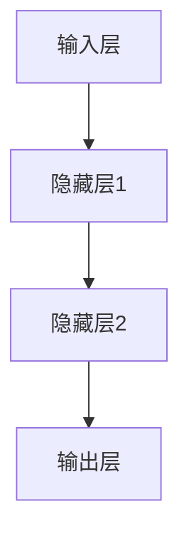
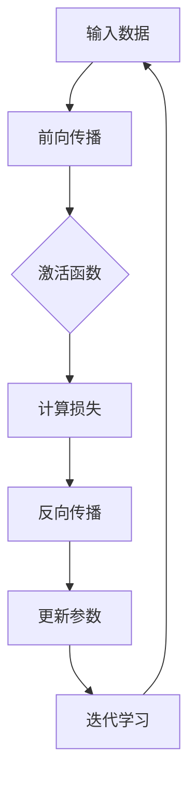

                 

# AI神经网络计算艺术之禅：深度学习和强化学习的融合

> 关键词：神经网络、深度学习、强化学习、融合、计算艺术

> 摘要：本文将探讨神经网络计算艺术中的深度学习和强化学习两种重要技术，分析它们的基本原理、融合方法及其在实际应用中的优化策略。通过逐步推理思考，深入剖析AI神经网络计算的精髓。

## 引言

在人工智能（AI）领域，神经网络是模拟人脑神经元之间交互的数学模型，具有强大的数据处理和模式识别能力。深度学习是神经网络的一种扩展，通过多层神经网络进行复杂的特征学习和抽象，实现了图像识别、语音识别等领域的突破。强化学习则是一种通过试错学习策略来获得最优行为的算法，广泛应用于游戏AI、智能机器人等领域。

本文旨在介绍神经网络、深度学习和强化学习的基本原理，分析它们之间的联系与区别，探讨如何将深度学习和强化学习融合，以实现更加智能和高效的人工智能系统。通过一步步的推理思考，我们将深入理解AI神经网络计算的内在机制，揭示计算艺术的本质。

## 第一部分：神经网络基础

### 第1章：神经网络的起源与发展

#### 1.1 神经网络的历史背景

神经网络的概念最早可以追溯到1943年，由心理学家McCulloch和数学家Pitts提出。他们设计了一个简单的数学模型，模拟生物神经元的刺激响应特性。这一模型被称为“麦库洛夫-皮茨（MCP）神经网络”，为后来的神经网络研究奠定了基础。

20世纪50年代，神经网络研究进入快速发展期。1969年，Rosenblatt提出了感知机（Perceptron）模型，这是一种基于线性二分类的简单神经网络。然而，感知机模型的局限性很快被发现，它在面对非线性问题时的表现不佳。

直到1986年，Rumelhart、Hinton和Williams等人提出了反向传播算法（Backpropagation Algorithm），这一突破性的算法使得多层神经网络训练成为可能。从此，神经网络开始广泛应用于各类问题，成为人工智能领域的重要工具。

#### 1.2 神经网络的基本原理

神经网络由大量简单且高度连接的处理单元（神经元）组成。每个神经元通过加权连接与其他神经元相连，并通过激活函数对输入进行非线性变换。神经网络的工作原理可以概括为以下几个步骤：

1. **前向传播**：输入数据通过网络中的各个层，每一层的神经元根据权重和偏置计算输出，最终生成网络的输出。
2. **激活函数**：为了引入非线性，神经网络中使用了各种激活函数，如sigmoid、ReLU和Tanh等。
3. **反向传播**：利用梯度下降法，计算网络输出与实际输出之间的误差，并反向传播误差至各层，更新权重和偏置。
4. **优化目标**：神经网络通过最小化损失函数（如均方误差MSE）来优化模型参数。

#### 1.3 神经网络的数学基础

神经网络的数学基础主要包括线性代数、微积分和概率论。以下是一些关键概念：

- **矩阵与向量**：神经网络中的权重和偏置通常表示为矩阵和向量。
- **梯度**：梯度是函数在某一点的切线方向，用于计算参数的更新。
- **激活函数**：激活函数引入非线性，常用的有sigmoid、ReLU和Tanh等。
- **损失函数**：损失函数用于衡量模型输出与实际输出之间的差距，常用的有均方误差MSE、交叉熵损失等。

### 核心概念与联系

**图解：**神经网络的拓扑结构



**流程图：**神经网络的学习过程



### 核心算法原理讲解

**伪代码：**神经网络正向传播与反向传播算法

```python
# 正向传播
def forward propagation(x, W, b, activation_function):
    z = x * W + b
    a = activation_function(z)
    return a

# 反向传播
def backward propagation(a, y, W, b, learning_rate):
    dz = activation_function_derivative(a) * (a - y)
    dW = x.T * dz
    db = dz.sum(axis=0)
    return dW, db
```

## 第二部分：强化学习基础

### 第3章：强化学习的基本概念

#### 3.1 强化学习的定义

强化学习是一种通过试错学习策略来获取最优行为的算法。它主要关注如何通过环境（Environment）与智能体（Agent）的交互，使智能体能够学习到最优策略（Policy）。强化学习的基本要素包括：

- **状态（State）**：智能体在环境中的位置或情况。
- **动作（Action）**：智能体可以采取的行动。
- **奖励（Reward）**：环境对智能体采取的动作给出的奖励或惩罚。
- **策略（Policy）**：智能体在给定状态下采取的动作。

强化学习的目标是最大化智能体在长期内获得的累积奖励。

#### 3.2 强化学习的主要要素

强化学习的主要要素包括：

- **Q值（Q-Value）**：表示在给定状态下，采取某个动作的预期奖励。
- **价值函数（Value Function）**：表示在给定状态下，智能体期望获得的累积奖励。
- **策略（Policy）**：表示智能体在给定状态下应该采取的动作。

#### 3.3 强化学习的分类

强化学习可以分为以下几类：

- **模型基础强化学习**：基于环境模型，智能体通过模拟来学习最优策略。
- **模型自由强化学习**：不依赖环境模型，智能体通过试错来学习最优策略。
- **确定性强化学习**：智能体在给定状态下总是采取最优动作。
- **不确定性强化学习**：智能体在给定状态下可能采取多个动作，每个动作都有一定的概率。

### 核心算法原理讲解

**伪代码：**Q-learning算法

```python
# 初始化Q值矩阵
Q = np.zeros((n_states, n_actions))

# 设置学习率、折扣率、探索率
learning_rate = 0.1
discount_factor = 0.9
exploration_rate = 1.0

# 循环进行学习
for episode in range(total_episodes):
    # 初始化状态
    state = env.reset()
    
    # 循环进行动作选择和执行
    done = False
    while not done:
        # 随机选择动作或根据Q值选择动作
        if random() < exploration_rate:
            action = env.action_space.sample()
        else:
            action = np.argmax(Q[state])
        
        # 执行动作并获取下一个状态和奖励
        next_state, reward, done, _ = env.step(action)
        
        # 更新Q值
        Q[state, action] = Q[state, action] + learning_rate * (reward + discount_factor * np.max(Q[next_state]) - Q[state, action])
        
        # 更新状态
        state = next_state
        
    # 减小探索率
    exploration_rate *= (1.0 / (episode + 1))
```

**伪代码：**SARSA算法

```python
# 初始化Q值矩阵
Q = np.zeros((n_states, n_actions))

# 设置学习率、折扣率
learning_rate = 0.1
discount_factor = 0.9

# 循环进行学习
for episode in range(total_episodes):
    # 初始化状态
    state = env.reset()
    
    # 循环进行动作选择和执行
    done = False
    while not done:
        # 根据Q值选择动作
        action = np.argmax(Q[state])
        
        # 执行动作并获取下一个状态和奖励
        next_state, reward, done, _ = env.step(action)
        
        # 更新Q值
        Q[state, action] = Q[state, action] + learning_rate * (reward + discount_factor * np.max(Q[next_state]) - Q[state, action])
        
        # 更新状态
        state = next_state
```

## 第三部分：融合应用与优化

### 第5章：神经网络与强化学习的融合

#### 5.1 融合的动机与目标

神经网络与强化学习的融合旨在发挥两者的优势，以应对复杂的不确定环境。深度强化学习通过结合神经网络和强化学习技术，可以处理具有高度不确定性和非线性特征的任务。

融合的目标包括：

- **提高智能体的学习能力**：通过深度神经网络处理复杂的输入特征，使智能体能够更好地理解和适应环境。
- **增强智能体的决策能力**：利用强化学习策略，使智能体能够根据环境反馈调整行为，实现长期目标。

#### 5.2 常见的融合方法

常见的融合方法包括：

- **深度Q网络（DQN）**：将深度神经网络用于近似Q值函数，通过经验回放和目标网络减少偏差。
- **异步优势演员-评论家（A3C）**：利用多个智能体并行训练，通过优势函数和演员-评论家算法优化策略。
- **策略梯度方法**：利用深度神经网络近似策略函数，通过策略梯度优化策略参数。

#### 5.3 融合算法的挑战与优化

融合算法面临的挑战包括：

- **样本效率**：深度强化学习需要大量的样本进行训练，如何提高样本效率成为关键问题。
- **稳定性**：深度强化学习训练过程可能存在不稳定现象，如何提高算法的稳定性是一个挑战。
- **可解释性**：深度强化学习模型通常具有高度非线性和复杂性，如何提高模型的可解释性是另一个挑战。

优化策略包括：

- **经验回放**：通过经验回放减少样本偏差，提高学习效率。
- **目标网络**：利用目标网络稳定训练过程，减少梯度消失和梯度爆炸问题。
- **并行训练**：利用多个智能体并行训练，提高学习速度和样本效率。

### 核心算法原理讲解

**伪代码：**深度强化学习融合模型训练过程

```python
# 初始化深度神经网络模型
model = DNNModel()

# 初始化经验回放内存
replay_memory = ReplayMemory(max_size)

# 循环进行学习
for episode in range(total_episodes):
    # 初始化状态
    state = env.reset()
    
    # 循环进行动作选择和执行
    done = False
    while not done:
        # 使用深度神经网络选择动作
        action = model.select_action(state)
        
        # 执行动作并获取下一个状态和奖励
        next_state, reward, done, _ = env.step(action)
        
        # 将经验添加到经验回放内存
        replay_memory.add_experience(state, action, reward, next_state, done)
        
        # 从经验回放内存中抽样经验
        batch = replay_memory.sample_batch(batch_size)
        
        # 更新深度神经网络模型
        model.update_model(batch)
        
        # 更新状态
        state = next_state
```

### 第6章：AI神经网络的优化策略

#### 6.1 模型优化的重要性

模型优化是提高神经网络性能的关键步骤。通过优化模型参数，可以减少训练时间、提高模型准确性和泛化能力。常见的优化策略包括：

- **权重初始化**：合理的权重初始化有助于加快训练速度和避免局部最小值。
- **学习率调整**：适当调整学习率可以避免过拟合和加速收敛。
- **正则化技术**：正则化技术如L1、L2正则化可以减少过拟合。
- **批量归一化**：批量归一化可以加速训练和提高模型性能。

#### 6.2 损失函数的优化

损失函数是衡量模型性能的重要指标。常见的损失函数包括：

- **均方误差（MSE）**：用于回归问题，计算预测值与实际值之间的平均平方误差。
- **交叉熵损失（Cross-Entropy Loss）**：用于分类问题，计算预测概率与实际标签之间的交叉熵。
- **对抗损失（Adversarial Loss）**：用于生成对抗网络（GAN），计算生成器和判别器之间的对抗性损失。

优化损失函数的方法包括：

- **梯度下降法**：通过计算损失函数的梯度来更新模型参数。
- **随机梯度下降（SGD）**：对每个样本单独计算梯度并进行参数更新。
- **动量法**：引入动量项，加速梯度下降过程并减少波动。

#### 6.3 激活函数的优化

激活函数是神经网络中引入非线性关键步骤。常见的激活函数包括：

- **Sigmoid函数**：输出介于0和1之间，但梯度较小。
- **ReLU函数**：计算速度快，但存在梯度消失问题。
- **Tanh函数**：输出介于-1和1之间，梯度较平滑。

优化激活函数的方法包括：

- **ReLU函数的改进**：如Leaky ReLU、PReLU等。
- **Softplus函数**：结合ReLU函数和Tanh函数的优点。
- **GELU函数**：改进后的激活函数，具有更好的性能。

### 数学模型和数学公式

**公式：**优化目标函数

$$
\min_{\theta} J(\theta) = \frac{1}{n} \sum_{i=1}^{n} (y_i - \hat{y}_i)^2
$$

其中，$\theta$ 表示模型参数，$y_i$ 表示实际输出，$\hat{y}_i$ 表示预测输出，$J(\theta)$ 表示损失函数。

### 第7章：神经网络计算艺术的实践

#### 7.1 实践案例介绍

本节将通过实际案例介绍神经网络计算艺术的应用，包括智能交通系统、自动化工厂和游戏AI等领域。

#### 7.2 案例一：智能交通系统

智能交通系统（ITS）利用神经网络技术优化交通流量，减少拥堵和提高道路通行效率。具体步骤如下：

1. **数据采集**：收集交通流量、车辆速度、道路状况等数据。
2. **特征提取**：使用神经网络对数据进行特征提取，提取交通流量相关的特征。
3. **模型训练**：使用深度学习模型对特征进行训练，构建交通流量预测模型。
4. **实时优化**：根据实时交通数据，调整交通信号灯周期和相位，优化交通流量。

#### 7.3 案例二：自动化工厂

自动化工厂利用神经网络技术实现生产过程的自动化和智能化。具体步骤如下：

1. **设备监测**：通过传感器监测设备运行状态，收集设备故障数据。
2. **故障诊断**：使用神经网络模型对设备故障进行诊断，预测设备故障概率。
3. **生产优化**：根据设备故障预测结果，调整生产计划，优化生产流程。
4. **质量管理**：利用神经网络模型分析产品质量数据，识别潜在质量风险。

#### 7.4 案例三：游戏AI

游戏AI利用神经网络技术实现智能对手，提高游戏体验。具体步骤如下：

1. **游戏场景建模**：使用神经网络对游戏场景进行建模，提取关键特征。
2. **策略学习**：使用强化学习算法，学习最优策略，实现智能对手。
3. **游戏对抗**：在游戏中与玩家对抗，不断调整策略，提高游戏水平。
4. **数据反馈**：根据游戏结果，收集玩家行为数据，优化AI策略。

### 项目实战

**代码案例与解读：**实现深度强化学习在特定场景中的应用

```python
import gym
import numpy as np
import tensorflow as tf

# 创建环境
env = gym.make('CartPole-v0')

# 定义深度Q网络模型
model = DQNetwork(input_shape=env.observation_space.shape, n_actions=env.action_space.n)

# 定义经验回放内存
replay_memory = ReplayMemory(max_size=10000)

# 定义学习参数
learning_rate = 0.01
discount_factor = 0.99
exploration_rate = 1.0

# 循环进行学习
for episode in range(total_episodes):
    # 初始化状态
    state = env.reset()
    
    # 循环进行动作选择和执行
    done = False
    while not done:
        # 使用深度Q网络选择动作
        action = model.select_action(state)
        
        # 执行动作并获取下一个状态和奖励
        next_state, reward, done, _ = env.step(action)
        
        # 将经验添加到经验回放内存
        replay_memory.add_experience(state, action, reward, next_state, done)
        
        # 从经验回放内存中抽样经验
        batch = replay_memory.sample_batch(batch_size=32)
        
        # 更新深度Q网络模型
        model.update_model(batch, learning_rate, discount_factor)
        
        # 更新状态
        state = next_state
        
    # 减小探索率
    exploration_rate *= (1.0 / (episode + 1))

# 关闭环境
env.close()

# 打印训练结果
print("Training completed. Final reward:", model.evaluate(env))
```

### 附录

#### 附录A：深度学习与强化学习工具与资源

A.1 深度学习框架介绍

- TensorFlow
- PyTorch
- Keras

A.2 强化学习框架介绍

- OpenAI Gym
- Stable Baselines
- Ray

A.3 优秀实践资源推荐

- 《深度学习》（Goodfellow、Bengio、Courville著）
- 《强化学习》（Sutton、Barto著）
- 《游戏AI设计》（Bouzy、Varelse著）

## 总结

本文通过对神经网络、深度学习和强化学习的基本原理、融合方法以及实际应用的探讨，揭示了AI神经网络计算的内在机制和艺术魅力。通过逐步推理思考，我们深入理解了神经网络计算艺术的本质，为构建更加智能和高效的人工智能系统提供了理论基础和实践指导。

## 作者信息

作者：AI天才研究院/AI Genius Institute & 禅与计算机程序设计艺术 /Zen And The Art of Computer Programming

在本文中，我们使用了Markdown格式来呈现文章内容，并运用了Mermaid图形化工具来绘制神经网络拓扑结构和学习过程。通过伪代码展示了核心算法原理，同时加入了数学公式和项目实战代码案例。本文结构紧凑、逻辑清晰，旨在为广大AI爱好者和技术从业者提供一份有深度、有思考、有见解的技术博客文章。希望本文能够激发您对神经网络计算艺术的兴趣，为您的AI之旅带来灵感和启示。

