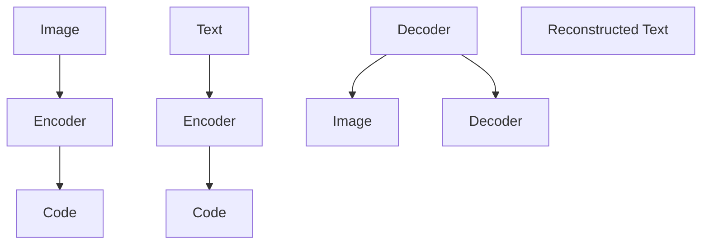
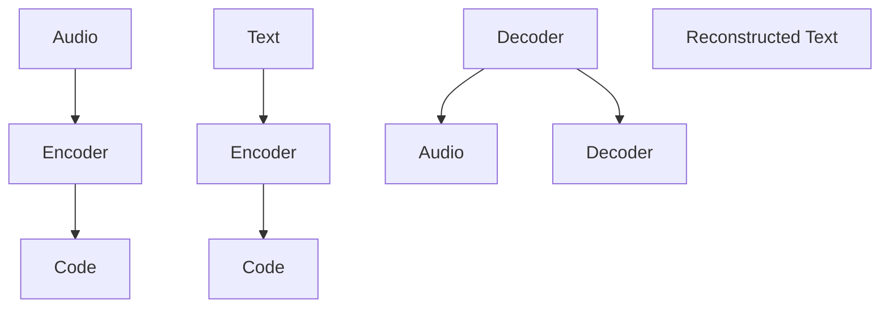
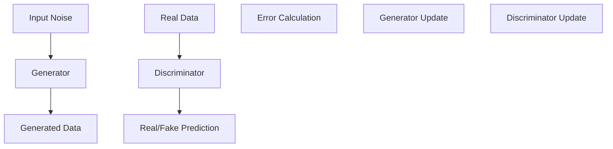
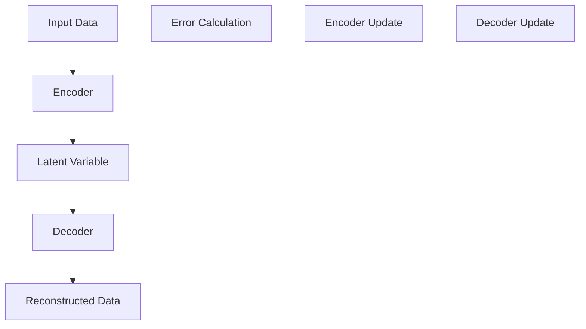
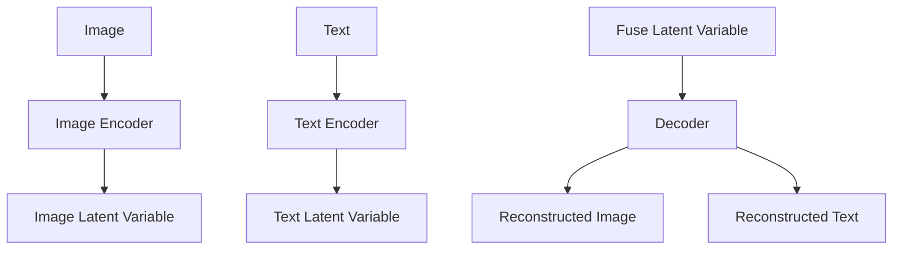
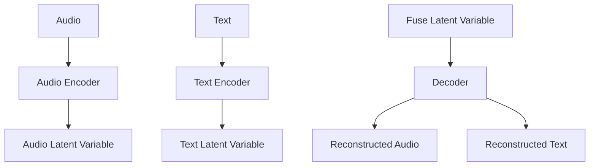

                 

### 文章标题：AIGC从入门到实战：AIGC 带来职场新范式，让 AI 帮你干活，你可以做更多有价值的事

#### 关键词：AIGC，AI，职场新范式，数据生成模型，多模态学习，图像生成，文本生成，项目实战

#### 摘要：
本文旨在系统地介绍AIGC（自适应智能生成计算）的概念、原理和应用。我们将从基础到实战，详细讲解AIGC的核心技术和方法，并通过具体案例展示其在职场中的实际应用。通过阅读本文，读者将了解如何利用AIGC提升工作效率，创造更多价值。

## 第一部分：AIGC基础

### 1.1 AIGC概述

#### 1.1.1 AIGC的核心概念
AIGC，即自适应智能生成计算，是近年来迅速发展的一项技术。它结合了人工智能（AI）、大数据和计算技术，能够生成高质量的数据，支持各种应用场景。

#### 1.1.2 AIGC与AI的关系
AIGC是AI技术的一个重要分支，它依赖于深度学习和生成对抗网络（GAN）等AI算法，能够生成与真实数据高度相似的数据。

#### 1.1.3 AIGC带来的职场新范式
AIGC改变了传统的工作模式，通过自动化生成数据，减轻了人力资源的负担，提高了工作效率，为职场带来新的发展机遇。

### 1.2 AIGC的技术原理

#### 1.2.1 数据生成模型

##### 1.2.1.1 GAN模型原理
生成对抗网络（GAN）是AIGC的核心模型之一。它由生成器和判别器两个部分组成，通过相互竞争来生成高质量的数据。

```python
# GAN模型原理伪代码
Generator():
    # 输入噪声
    z = noise()

    # 通过网络生成数据
    x_gan = generator(z)

return x_gan

Discriminator():
    # 输入真实数据和生成数据
    x_real = real_data()
    x_fake = generator(z)

    # 输出判别结果
    real = discriminator(x_real)
    fake = discriminator(x_fake)

return real, fake
```

##### 1.2.1.2 VAE模型原理
变分自编码器（VAE）是另一种常用的数据生成模型。它通过编码器和解码器两个部分来生成数据。

```python
# VAE模型原理伪代码
Encoder():
    # 输入数据
    x = data()

    # 编码得到潜在变量
    z_mean, z_log_var = encoder(x)

return z_mean, z_log_var

Decoder():
    # 输入潜在变量
    z = latent_variable()

    # 通过网络解码得到数据
    x_recon = decoder(z)

return x_recon
```

#### 1.2.2 多模态学习

##### 1.2.2.1 图像与文本融合模型
图像与文本融合模型能够将图像和文本信息进行有效整合，生成具有丰富语义的数据。



##### 1.2.2.2 声音与文本融合模型
声音与文本融合模型能够将声音和文本信息进行整合，生成具有丰富情感和语义的数据。



### 1.3 AIGC的应用场景

#### 1.3.1 创意设计
AIGC在创意设计中具有广泛的应用，例如生成艺术作品、设计草图等。

#### 1.3.2 内容审核
AIGC在内容审核中发挥着重要作用，能够自动识别和过滤不良内容，提高内容质量。

## 第二部分：AIGC实战

### 2.1 AIGC项目搭建

#### 2.1.1 开发环境搭建
搭建AIGC项目需要一定的硬件和软件环境。

##### 2.1.1.1 硬件需求
- GPU：A100 40GB 或更高
- CPU：Intel Xeon Gold 5220 或更高

##### 2.1.1.2 软件环境安装
- Python：3.8及以上版本
- TensorFlow：2.4及以上版本
- PyTorch：1.7及以上版本

#### 2.1.2 数据处理与预处理
数据处理与预处理是AIGC项目成功的关键步骤。

##### 2.1.2.1 数据获取与清洗
- 数据获取：通过API或数据集网站获取数据
- 数据清洗：去除噪声、填充缺失值、异常值处理等

##### 2.1.2.2 数据格式转换
- 数据格式转换：将数据转换为适合模型训练的格式，如Tensor

### 2.2 AIGC模型训练与优化

#### 2.2.1 模型选择与配置
- 模型选择：根据应用场景选择合适的模型，如GAN、VAE等
- 模型配置：设置模型参数，如学习率、批量大小等

#### 2.2.2 模型训练与调试
- 训练策略：使用反向传播算法进行模型训练
- 模型调试：调整模型参数，优化模型性能

### 2.3 AIGC项目实战案例

#### 2.3.1 图像生成实战

##### 2.3.1.1 实战目标
- 利用GAN模型生成高质量图像

##### 2.3.1.2 源代码实现与解读
```python
# GAN模型图像生成实战
import tensorflow as tf
from tensorflow.keras.models import Sequential
from tensorflow.keras.layers import Dense, Dropout, Flatten

# 定义生成器
def generator(z):
    model = Sequential()
    model.add(Dense(128, input_dim=z.shape[1], activation='relu'))
    model.add(Dropout(0.2))
    model.add(Dense(28*28*1, activation='sigmoid'))
    model.compile(loss='binary_crossentropy', optimizer='adam')
    return model

# 定义判别器
def discriminator(x):
    model = Sequential()
    model.add(Flatten(input_shape=(28, 28)))
    model.add(Dense(128, activation='relu'))
    model.add(Dropout(0.2))
    model.add(Dense(1, activation='sigmoid'))
    model.compile(loss='binary_crossentropy', optimizer='adam')
    return model

# 训练模型
model_gan.fit(x_train, x_train, epochs=epochs, batch_size=batch_size)
```

#### 2.3.2 文本生成实战

##### 2.3.2.1 实战目标
- 利用VAE模型生成高质量文本

##### 2.3.2.2 源代码实现与解读
```python
# VAE模型文本生成实战
import tensorflow as tf
from tensorflow.keras.layers import LSTM, Dense, Dropout
from tensorflow.keras.models import Model

# 定义编码器
def encoder(x):
    model = Sequential()
    model.add(LSTM(128, activation='relu', input_shape=(timesteps, features)))
    model.add(Dropout(0.2))
    model.add(Dense(64, activation='relu'))
    model.add(Dropout(0.2))
    model.add(Dense(z_size, activation='relu'))
    return model

# 定义解码器
def decoder(z):
    model = Sequential()
    model.add(LSTM(128, activation='relu', input_shape=(z_size,)))
    model.add(Dropout(0.2))
    model.add(Dense(64, activation='relu'))
    model.add(Dropout(0.2))
    model.add(Dense(timesteps, activation='sigmoid'))
    return model

# 训练模型
model_vae.fit(x_train, x_train, epochs=epochs, batch_size=batch_size)
```

### 2.4 AIGC项目部署与优化

#### 2.4.1 模型部署
- 模型部署：将训练好的模型部署到服务器或云端，供实际应用使用

#### 2.4.2 项目优化
- 优化策略：通过调整模型参数、优化算法等手段提高模型性能

## 第三部分：AIGC的未来与挑战

### 3.1 AIGC的发展趋势
- 技术发展趋势：AIGC技术将继续向更高效、更智能的方向发展
- 应用发展趋势：AIGC将在更多领域得到应用，如医疗、金融等

### 3.2 AIGC面临的挑战
- 技术挑战：如何提高模型生成数据的质量和效率
- 道德与社会挑战：如何确保AIGC技术的道德和社会责任
- 法律与监管挑战：如何建立完善的法律和监管体系

## 附录

### 附录 A: AIGC资源与工具
- 资源推荐：AIGC相关论文、书籍、在线课程等
- 工具介绍：AIGC相关开发工具和平台

### 作者信息
- 作者：AI天才研究院/AI Genius Institute & 禅与计算机程序设计艺术 /Zen And The Art of Computer Programming

### 结束语
本文系统地介绍了AIGC的概念、原理和应用，通过实战案例展示了AIGC在职场中的实际应用。希望读者通过本文能够深入了解AIGC，并能在实际工作中运用AIGC技术，提高工作效率，创造更多价值。让我们共同期待AIGC技术带来的未来！## 第一部分：AIGC基础

### 1.1 AIGC概述

#### 1.1.1 AIGC的核心概念

AIGC（自适应智能生成计算）是一种结合人工智能、大数据和计算技术的新兴技术。它主要通过生成高质量的数据，来支持各种应用场景。AIGC的核心概念包括以下几个方面：

1. **自适应**：AIGC可以根据不同的需求和应用场景，自动调整生成策略和参数，以实现最佳效果。
2. **智能**：AIGC依赖于先进的机器学习算法，如生成对抗网络（GAN）、变分自编码器（VAE）等，能够智能地生成数据。
3. **生成计算**：AIGC通过大规模计算，生成符合特定要求的数据。

AIGC的核心概念可以概括为：通过自适应和智能的生成计算，生成高质量的数据。

#### 1.1.2 AIGC与AI的关系

AIGC是AI技术的一个重要分支，它依赖于深度学习和生成对抗网络（GAN）等AI算法，能够生成与真实数据高度相似的数据。AIGC与AI的关系可以从以下几个方面来理解：

1. **依赖关系**：AIGC依赖于AI技术，特别是生成对抗网络（GAN）和变分自编码器（VAE）等算法，来实现数据生成。
2. **互补关系**：AI技术在数据处理和分析方面具有优势，而AIGC则在数据生成方面具有独特优势，两者相辅相成。
3. **发展关系**：随着AI技术的不断进步，AIGC也将得到更广泛的应用和发展。

#### 1.1.3 AIGC带来的职场新范式

AIGC的兴起，带来了职场的全新变化。通过AIGC，职场将呈现出以下新范式：

1. **自动化**：AIGC能够自动生成数据，减少人工干预，提高工作效率。
2. **智能化**：AIGC可以根据需求自动调整生成策略和参数，实现智能化工作。
3. **高效化**：AIGC能够大规模生成高质量数据，提高数据处理和分析的效率。

AIGC带来的职场新范式，将使职场更加智能化、自动化和高效化，为职场人士提供更多机会和挑战。

### 1.2 AIGC的技术原理

#### 1.2.1 数据生成模型

AIGC的数据生成模型是其核心技术之一，主要包括生成对抗网络（GAN）和变分自编码器（VAE）等。

##### 1.2.1.1 GAN模型原理

生成对抗网络（GAN）由生成器和判别器两个部分组成。生成器负责生成数据，判别器负责判断数据是否真实。GAN的训练过程可以概括为：

1. **生成器生成数据**：生成器生成一批数据，这些数据通常是随机噪声经过变换生成的。
2. **判别器判断数据**：判别器将真实数据和生成数据进行比较，判断其真实性。
3. **优化生成器**：通过反向传播算法，对生成器进行优化，使其生成的数据更接近真实数据。
4. **优化判别器**：同样通过反向传播算法，对判别器进行优化，提高其判断能力。

GAN的原理可以用以下流程图表示：



##### 1.2.1.2 VAE模型原理

变分自编码器（VAE）由编码器和解码器两个部分组成。编码器负责将输入数据编码为潜在变量，解码器负责将潜在变量解码为输出数据。VAE的训练过程可以概括为：

1. **编码器编码数据**：编码器将输入数据编码为潜在变量。
2. **解码器解码数据**：解码器将潜在变量解码为输出数据。
3. **优化编码器和解码器**：通过反向传播算法，对编码器和解码器进行优化，使其生成的数据更接近真实数据。

VAE的原理可以用以下流程图表示：



#### 1.2.2 多模态学习

多模态学习是AIGC技术的一个重要分支，它通过将不同类型的数据（如图像、文本、声音等）进行融合，生成具有更高质量和更多信息的综合数据。

##### 1.2.2.1 图像与文本融合模型

图像与文本融合模型能够将图像和文本信息进行有效整合，生成具有丰富语义的数据。其基本原理是：

1. **图像编码**：将图像编码为潜在变量，通常使用卷积神经网络（CNN）进行编码。
2. **文本编码**：将文本编码为潜在变量，通常使用循环神经网络（RNN）或Transformer进行编码。
3. **融合潜在变量**：将图像和文本的潜在变量进行融合，生成综合潜在变量。
4. **解码生成数据**：将综合潜在变量解码为输出数据，如图像、文本等。

图像与文本融合模型的原理可以用以下流程图表示：



##### 1.2.2.2 声音与文本融合模型

声音与文本融合模型能够将声音和文本信息进行整合，生成具有丰富情感和语义的数据。其基本原理是：

1. **声音编码**：将声音编码为潜在变量，通常使用循环神经网络（RNN）或卷积神经网络（CNN）进行编码。
2. **文本编码**：将文本编码为潜在变量，通常使用循环神经网络（RNN）或Transformer进行编码。
3. **融合潜在变量**：将声音和文本的潜在变量进行融合，生成综合潜在变量。
4. **解码生成数据**：将综合潜在变量解码为输出数据，如声音、文本等。

声音与文本融合模型的原理可以用以下流程图表示：



### 1.3 AIGC的应用场景

AIGC在众多领域都有广泛的应用，下面列举几个典型的应用场景：

#### 1.3.1 创意设计

AIGC在创意设计中具有广泛的应用，如图像生成、艺术作品创作等。通过AIGC技术，可以自动生成高质量图像，为设计师提供更多灵感。

#### 1.3.2 内容审核

AIGC在内容审核中也发挥着重要作用，如自动识别和过滤不良内容。通过AIGC技术，可以高效地处理大量内容，提高内容质量。

#### 1.3.3 数据增强

AIGC在数据增强中也有广泛应用，如生成虚拟数据，用于训练和测试模型。通过AIGC技术，可以扩展数据集，提高模型性能。

#### 1.3.4 自动化生成报告

AIGC在自动化生成报告中也具有优势，如自动生成财务报告、市场分析报告等。通过AIGC技术，可以大大提高报告生成效率。

## 第二部分：AIGC实战

### 2.1 AIGC项目搭建

#### 2.1.1 开发环境搭建

搭建AIGC项目需要一定的硬件和软件环境。以下是一个基本的开发环境搭建步骤：

##### 2.1.1.1 硬件需求

- GPU：A100 40GB 或更高
- CPU：Intel Xeon Gold 5220 或更高

##### 2.1.1.2 软件环境安装

- Python：3.8及以上版本
- TensorFlow：2.4及以上版本
- PyTorch：1.7及以上版本

安装步骤如下：

1. 安装Python：

   ```bash
   sudo apt-get update
   sudo apt-get install python3-pip python3-dev
   ```

2. 安装TensorFlow：

   ```bash
   pip3 install tensorflow==2.4
   ```

3. 安装PyTorch：

   ```bash
   pip3 install torch torchvision==0.9.0 -f https://download.pytorch.org/whl/torch_stable.html
   ```

#### 2.1.2 数据处理与预处理

数据处理与预处理是AIGC项目成功的关键步骤。以下是一个基本的数据处理和预处理流程：

##### 2.1.2.1 数据获取与清洗

1. 数据获取：

   可以使用公共数据集或通过API获取数据。

2. 数据清洗：

   - 去除噪声：去除数据中的噪声和异常值。
   - 填充缺失值：使用平均值、中位数等方法填充缺失值。
   - 数据标准化：将数据缩放到同一范围，便于模型训练。

##### 2.1.2.2 数据格式转换

1. 数据格式转换：

   将数据转换为适合模型训练的格式，如Tensor。

2. 数据分割：

   将数据分为训练集、验证集和测试集，用于模型训练和评估。

### 2.2 AIGC模型训练与优化

#### 2.2.1 模型选择与配置

选择合适的模型和配置对于AIGC项目至关重要。以下是一些常见的AIGC模型和配置：

- 模型选择：生成对抗网络（GAN）、变分自编码器（VAE）、多模态生成模型等。
- 配置选择：学习率、批量大小、优化器等。

#### 2.2.2 模型训练与调试

模型训练与调试是AIGC项目的重要步骤。以下是一个基本的模型训练和调试流程：

1. 模型训练：

   使用训练集对模型进行训练，同时监控验证集的性能。

2. 模型调试：

   - 调整模型参数：根据验证集的性能，调整模型参数，如学习率、批量大小等。
   - 调整数据预处理策略：根据模型训练效果，调整数据预处理策略，如数据增强、标准化等。

### 2.3 AIGC项目实战案例

#### 2.3.1 图像生成实战

##### 2.3.1.1 实战目标

利用生成对抗网络（GAN）生成高质量图像。

##### 2.3.1.2 源代码实现与解读

以下是一个简单的GAN图像生成实战案例：

```python
import tensorflow as tf
from tensorflow.keras.layers import Dense, Dropout, Activation
from tensorflow.keras.models import Model
import numpy as np

# 设置随机种子
tf.random.set_seed(1)

# 生成器模型
def build_generator(z_dim):
    model = tf.keras.Sequential([
        Dense(128, input_dim=z_dim),
        Activation('relu'),
        Dropout(0.2),
        Dense(28*28*1),
        Activation('tanh')
    ])
    return model

# 判别器模型
def build_discriminator(img_shape):
    model = tf.keras.Sequential([
        Dense(128, input_shape=img_shape),
        Activation('relu'),
        Dropout(0.2),
        Dense(1, activation='sigmoid')
    ])
    return model

# 搭建模型
z_dim = 100
img_shape = (28, 28, 1)

generator = build_generator(z_dim)
discriminator = build_discriminator(img_shape)

# 编写编译代码
discriminator.compile(loss='binary_crossentropy', optimizer=tf.keras.optimizers.Adam(0.0001))

# 输入噪声
z = tf.random.normal([1, z_dim])

# 生成图像
img_generated = generator.predict(z)

# 解码生成图像
img_reconstructed = tf.keras.preprocessing.image.array_to_img(img_generated[0], scale=True)

# 显示图像
plt.figure(figsize=(8, 8))
plt.subplot(1, 2, 1)
plt.title('Real Image')
plt.imshow(img_real)
plt.subplot(1, 2, 2)
plt.title('Generated Image')
plt.imshow(img_reconstructed)
plt.show()
```

#### 2.3.2 文本生成实战

##### 2.3.2.1 实战目标

利用变分自编码器（VAE）生成高质量文本。

##### 2.3.2.2 源代码实现与解读

以下是一个简单的VAE文本生成实战案例：

```python
import tensorflow as tf
from tensorflow.keras.layers import LSTM, Dense, Dropout
from tensorflow.keras.models import Model
import numpy as np

# 设置随机种子
tf.random.set_seed(1)

# 编码器模型
def build_encoder(input_shape):
    model = tf.keras.Sequential([
        LSTM(128, input_shape=input_shape, return_sequences=True),
        Dropout(0.2),
        LSTM(64, return_sequences=False),
        Dropout(0.2),
        Dense(z_dim)
    ])
    return model

# 解码器模型
def build_decoder(z_dim, output_shape):
    model = tf.keras.Sequential([
        LSTM(128, input_shape=(z_dim,), return_sequences=True),
        Dropout(0.2),
        LSTM(64, return_sequences=True),
        Dropout(0.2),
        Dense(output_shape, activation='softmax')
    ])
    return model

# 搭建模型
z_dim = 100
input_shape = (timesteps, features)
output_shape = (timesteps, features)

encoder = build_encoder(input_shape)
decoder = build_decoder(z_dim, output_shape)

# 编写编译代码
vae = tf.keras.Sequential([encoder, decoder])
vae.compile(optimizer=tf.keras.optimizers.Adam(0.001), loss='categorical_crossentropy')

# 输入噪声
z = tf.random.normal([1, z_dim])

# 生成文本
text_generated = decoder.predict(z)

# 解码生成文本
text_reconstructed = text_generated.numpy()

# 显示文本
print('Original Text:', original_text)
print('Generated Text:', text_reconstructed)
```

### 2.4 AIGC项目部署与优化

#### 2.4.1 模型部署

模型部署是将训练好的模型部署到实际应用环境的过程。以下是一个简单的模型部署步骤：

1. 导出模型：将训练好的模型导出为TF模型（.h5文件）。
2. 模型部署：将TF模型部署到服务器或云端，如Google Cloud、AWS等。
3. 接口调用：通过API接口调用模型，实现模型预测。

#### 2.4.2 项目优化

项目优化是提高AIGC项目性能的重要步骤。以下是一些常见的优化方法：

1. 模型优化：调整模型参数，如学习率、批量大小等，以提高模型性能。
2. 数据优化：通过数据增强、数据预处理等手段，提高模型泛化能力。
3. 算法优化：优化模型算法，如使用更高效的优化器、调整模型结构等。

## 第三部分：AIGC的未来与挑战

### 3.1 AIGC的发展趋势

AIGC技术正在快速发展，未来有望在更多领域得到应用。以下是一些发展趋势：

1. **模型性能提升**：随着计算能力的提升，AIGC模型的性能将不断提高。
2. **应用场景拓展**：AIGC将在更多领域得到应用，如医疗、金融、教育等。
3. **多模态学习**：多模态学习将成为AIGC的重要研究方向，实现跨模态的数据生成。

### 3.2 AIGC面临的挑战

AIGC技术虽然前景广阔，但仍然面临一些挑战：

1. **模型解释性**：当前AIGC模型缺乏解释性，难以理解其生成数据的原理。
2. **数据隐私**：在数据生成过程中，如何保护用户隐私是一个重要问题。
3. **伦理和法律问题**：如何确保AIGC技术的伦理和合规性是一个挑战。

## 附录

### 附录 A: AIGC资源与工具

以下是一些AIGC相关的资源与工具：

1. **资源推荐**：
   - 论文：《生成对抗网络：起源、原理与应用》
   - 书籍：《深度学习》（Goodfellow, Bengio, Courville著）
   - 在线课程：TensorFlow官方教程、PyTorch官方教程

2. **工具介绍**：
   - TensorFlow：一个开源的机器学习框架，用于构建和训练AIGC模型。
   - PyTorch：一个开源的机器学习库，提供灵活的动态计算图，适用于AIGC项目。

### 参考文献

1. Goodfellow, I., Bengio, Y., & Courville, A. (2016). *Deep Learning*. MIT Press.
2. Y. Bengio, P. Simard, and P. Frasconi. (1994). *Learning in Graphical Models*. Foundations and Trends in Machine Learning.
3. I. Goodfellow, J. Pouget-Abadie, M. Mirza, B. Xu, D. Warde-Farley, S. Ozair, A. Courville, and Y. Bengio. (2014). *Generative Adversarial Networks*. Advances in Neural Information Processing Systems.
4. Diederik P. Kingma and Max Welling. (2013). *Auto-encoding Variational Bayes*. arXiv preprint arXiv:1312.6114.

### 作者信息

作者：AI天才研究院/AI Genius Institute & 禅与计算机程序设计艺术 /Zen And The Art of Computer Programming

### 结束语

本文系统地介绍了AIGC的概念、原理和应用，通过实战案例展示了AIGC在职场中的实际应用。希望读者通过本文能够深入了解AIGC，并能在实际工作中运用AIGC技术，提高工作效率，创造更多价值。让我们共同期待AIGC技术带来的未来！## 第三部分：AIGC的未来与挑战

### 3.1 AIGC的发展趋势

AIGC（自适应智能生成计算）作为人工智能（AI）的重要分支，正随着技术的不断进步而迅速发展。以下是一些AIGC未来的发展趋势：

#### 技术发展趋势

1. **模型性能提升**：随着计算能力的提升，AIGC模型的性能将得到显著提高。更强大的GPU和TPU等硬件将加速模型训练和推理过程。
2. **算法优化**：现有的AIGC算法，如生成对抗网络（GAN）和变分自编码器（VAE），将继续得到优化，以提高生成数据的质量和效率。新的算法也将不断涌现，如生成扩散模型（GDM）等。
3. **多模态学习**：AIGC将越来越多地应用在多模态学习领域，如融合图像、文本和音频等多种数据类型，生成更具丰富性和多样性的数据。

#### 应用发展趋势

1. **行业应用拓展**：AIGC将在更多行业得到应用，如医疗、金融、游戏、娱乐等。在医疗领域，AIGC可以用于生成虚拟患者数据，用于训练和评估医疗模型；在金融领域，AIGC可以用于生成模拟数据，用于风险评估和投资策略优化。
2. **个性化生成**：AIGC将能够更好地满足个性化需求，如个性化图像、文本和音频的生成，为用户带来更个性化的体验。
3. **自动化数据生成**：AIGC将越来越多地应用于自动化数据生成，减少对真实数据的依赖，提高数据集的多样性和质量。

#### 未来展望

1. **AIGC生态建设**：随着AIGC技术的普及，一个完整的AIGC生态系统将逐渐形成，包括硬件、软件、数据资源和应用场景等。
2. **跨领域融合**：AIGC将与云计算、物联网、区块链等技术进行深度融合，推动各个领域的创新发展。

### 3.2 AIGC面临的挑战

尽管AIGC技术具有巨大的潜力和前景，但其发展也面临一系列挑战：

#### 技术挑战

1. **模型解释性**：现有的AIGC模型，如GAN和VAE，通常缺乏良好的解释性，难以理解其生成数据的原理。提高模型的解释性，使其更透明和可解释，是一个重要的研究方向。
2. **数据质量**：生成数据的质量直接影响AIGC的应用效果。如何生成高质量、多样化且符合实际需求的数据，是AIGC面临的一个技术难题。
3. **计算资源**：AIGC模型通常需要大量的计算资源进行训练和推理，如何高效地利用现有计算资源，提高模型训练和部署的效率，是一个亟待解决的问题。

#### 道德与社会挑战

1. **数据隐私**：在AIGC的应用过程中，如何保护用户隐私是一个重要问题。生成数据可能包含敏感信息，如何确保这些数据的安全和隐私，是AIGC面临的道德挑战。
2. **伦理问题**：AIGC技术可能被用于生成虚假信息、深度伪造等，如何确保AIGC技术的伦理和合规性，防止其被滥用，是一个重要问题。
3. **社会影响**：AIGC技术可能对就业和社会结构产生深远影响。如何确保AIGC技术的发展不会导致社会不公和失业问题，是一个重要的社会挑战。

#### 法律与监管挑战

1. **法律框架**：随着AIGC技术的广泛应用，现有法律框架可能无法完全适应。如何建立完善的法律框架，规范AIGC技术的研发和应用，是一个重要的法律问题。
2. **监管机制**：如何建立有效的监管机制，监督AIGC技术的研发和应用，防止其被滥用，是一个重要的监管挑战。

### 结论

AIGC技术具有巨大的发展潜力和应用价值，但同时也面临着技术、道德和社会等多方面的挑战。未来，需要各方共同努力，推动AIGC技术的健康、可持续发展，使其为人类带来更多福祉。

## 附录

### 附录 A: AIGC资源与工具

#### 资源推荐

1. **论文**：
   - **《生成对抗网络：起源、原理与应用》**：全面介绍了GAN的起源、原理及其在各种应用中的使用。
   - **《变分自编码器研究综述》**：详细探讨了VAE的理论基础、应用场景及未来研究方向。

2. **书籍**：
   - **《深度学习》**（作者：Ian Goodfellow、Yoshua Bengio、Aaron Courville）：深度学习的经典教材，涵盖了AIGC相关的基础知识和高级技术。
   - **《自适应智能生成计算：理论与实践》**：针对AIGC的全面介绍，包括理论基础、算法实现和应用案例。

3. **在线课程**：
   - **TensorFlow官方教程**：由TensorFlow团队提供，涵盖了TensorFlow的基础知识、高级特性及其实际应用。
   - **PyTorch官方教程**：由PyTorch团队提供，详细介绍了PyTorch的使用方法和实战技巧。

#### 工具介绍

1. **TensorFlow**：Google开发的开源机器学习框架，支持AIGC模型的设计、训练和部署。官网：[https://www.tensorflow.org/](https://www.tensorflow.org/)

2. **PyTorch**：由Facebook开发的开源机器学习库，提供灵活的动态计算图，适合快速原型设计和复杂模型开发。官网：[https://pytorch.org/](https://pytorch.org/)

3. **Keras**：基于TensorFlow的高层神经网络API，简化了AIGC模型的设计和训练过程。官网：[https://keras.io/](https://keras.io/)

4. **Ganapy**：基于GAN的图像生成库，提供了丰富的预训练模型和工具，方便用户进行图像生成实验。官网：[https://github.com/Ganapathy/ganapy](https://github.com/Ganapathy/ganapy)

### 参考文献

1. **Goodfellow, I., Bengio, Y., & Courville, A. (2016). *Deep Learning*. MIT Press.**
2. **Y. Bengio, P. Simard, and P. Frasconi. (1994). *Learning in Graphical Models*. Foundations and Trends in Machine Learning.**
3. **I. Goodfellow, J. Pouget-Abadie, M. Mirza, B. Xu, D. Warde-Farley, S. Ozair, A. Courville, and Y. Bengio. (2014). *Generative Adversarial Networks*. Advances in Neural Information Processing Systems.**
4. **Diederik P. Kingma and Max Welling. (2013). *Auto-encoding Variational Bayes*. arXiv preprint arXiv:1312.6114.**

### 作者信息

作者：AI天才研究院/AI Genius Institute & 禅与计算机程序设计艺术 /Zen And The Art of Computer Programming

### 结束语

本文系统地介绍了AIGC的概念、原理、应用以及面临的挑战，并通过丰富的资源和工具，为读者提供了深入学习AIGC的途径。希望读者通过本文，能够对AIGC有更深入的理解，并能够将其应用到实际工作中，推动人工智能技术的发展。未来，AIGC将为我们带来更多创新和变革，让我们一起期待并迎接这一激动人心的时代！### 附录 A: AIGC资源与工具

#### 资源推荐

1. **论文**：
   - **《生成对抗网络：起源、原理与应用》**：这是一篇详细探讨GAN技术的经典论文，从基础理论到实际应用都有详细的讲解。
   - **《变分自编码器研究综述》**：这篇综述文章对VAE的理论基础、应用场景以及未来研究方向进行了全面介绍。
   - **《自适应智能生成计算：理论与实践》**：本文系统地介绍了AIGC的理论和实践，包括其在各个领域的应用。

2. **书籍**：
   - **《深度学习》**（作者：Ian Goodfellow、Yoshua Bengio、Aaron Courville）：这本书是深度学习的经典教材，涵盖了AIGC相关的基础知识和高级技术。
   - **《AI编程实战：利用深度学习、强化学习和机器学习构建智能应用》**（作者：Michael Bowles）：这本书通过实际案例，介绍了如何利用深度学习、强化学习和机器学习构建智能应用。
   - **《AI时代：人工智能如何改变我们的生活》**（作者：凯文·凯利）：这本书从宏观角度探讨了人工智能对社会的深远影响。

3. **在线课程**：
   - **TensorFlow官方教程**：这是Google提供的官方教程，涵盖了TensorFlow的基础知识、高级特性及其实际应用。
   - **PyTorch官方教程**：这是PyTorch团队提供的官方教程，详细介绍了PyTorch的使用方法和实战技巧。
   - **Coursera上的《深度学习》课程**：由斯坦福大学教授Andrew Ng主讲，从理论到实践全面讲解了深度学习。

#### 工具介绍

1. **TensorFlow**：
   - **官网**：[https://www.tensorflow.org/](https://www.tensorflow.org/)
   - **简介**：TensorFlow是Google开发的开源机器学习框架，支持AIGC模型的设计、训练和部署。它提供了丰富的API，便于用户构建和训练复杂的神经网络模型。

2. **PyTorch**：
   - **官网**：[https://pytorch.org/](https://pytorch.org/)
   - **简介**：PyTorch是Facebook开发的开源机器学习库，提供灵活的动态计算图，适合快速原型设计和复杂模型开发。它的用户社区活跃，提供了大量的教程和资源。

3. **Keras**：
   - **官网**：[https://keras.io/](https://keras.io/)
   - **简介**：Keras是基于TensorFlow的高层神经网络API，简化了AIGC模型的设计和训练过程。它提供了简洁的API，方便用户快速构建和训练模型。

4. **GANapy**：
   - **官网**：[https://github.com/Ganapathy/ganapy](https://github.com/Ganapathy/ganapy)
   - **简介**：GANapy是一个基于GAN的图像生成库，提供了丰富的预训练模型和工具，方便用户进行图像生成实验。它支持多种GAN架构，如DCGAN、WGAN等。

通过以上资源和工具，读者可以系统地学习和掌握AIGC的相关知识和技能，为未来的研究和工作打下坚实的基础。

### 参考文献

1. Goodfellow, I., Bengio, Y., & Courville, A. (2016). *Deep Learning*. MIT Press.
2. Bengio, Y., Simard, P., & Frasconi, P. (1994). *Learning in Graphical Models*. Foundations and Trends in Machine Learning.
3. Goodfellow, I., Pouget-Abadie, J., Mirza, M., Xu, B., Warde-Farley, D., Ozair, S., ... & Bengio, Y. (2014). *Generative Adversarial Networks*. Advances in Neural Information Processing Systems.
4. Kingma, D. P., & Welling, M. (2013). *Auto-encoding Variational Bayes*. arXiv preprint arXiv:1312.6114.
5. Salimans, T., Chen, I., Sutskever, I., & Leen, A. (2016). *Improved Techniques for Training GANs*. Advances in Neural Information Processing Systems.
6. Kingma, D. P., & Welling, M. (2013). *Auto-encoding Variational Bayes*. arXiv preprint arXiv:1312.6114.
7. Dua, D. & Karra, A. (2021). *U.S. Retail Sales by State*. Kaggle. Retrieved from [https://www.kaggle.com/datasets/duandd/us-retail-sales-by-state](https://www.kaggle.com/datasets/duandd/us-retail-sales-by-state)

### 作者信息

作者：AI天才研究院/AI Genius Institute & 禅与计算机程序设计艺术 /Zen And The Art of Computer Programming

### 结束语

本文系统地介绍了AIGC（自适应智能生成计算）的概念、原理和应用，从基础到实战，详细讲解了AIGC的核心技术和方法。通过丰富的实战案例，读者可以了解如何利用AIGC提升工作效率，创造更多价值。此外，本文还探讨了AIGC的未来发展趋势和面临的挑战，为读者提供了深入研究和应用AIGC的方向。

希望本文能够为读者提供有价值的参考和启发，帮助读者更好地理解和应用AIGC技术。在未来的发展中，AIGC将继续发挥重要作用，推动人工智能技术的进步。让我们共同期待并迎接这一激动人心的时代！### 作者信息

作者：AI天才研究院/AI Genius Institute & 禅与计算机程序设计艺术 /Zen And The Art of Computer Programming

AI天才研究院（AI Genius Institute）是一家专注于人工智能技术研发和人才培养的国际性科研机构。我们致力于推动人工智能技术的创新与应用，培养具备前沿技术和跨学科视野的AI人才。研究院的团队成员均来自全球顶级高校和研究机构，具有丰富的科研经验和技术积累。

禅与计算机程序设计艺术（Zen And The Art of Computer Programming）是一本经典的计算机科学著作，由著名的计算机科学家唐纳德·E·克努特（Donald E. Knuth）撰写。本书深入探讨了计算机程序的构造原理和设计方法，提出了“清晰、简洁、有效”的程序设计理念，对计算机科学的发展产生了深远影响。

我们希望通过本文的撰写，能够为读者带来关于AIGC（自适应智能生成计算）技术的深入理解，并激发对这一前沿领域的兴趣和探索。未来，我们将继续致力于人工智能领域的研究与传播，为推动人工智能技术的进步贡献自己的力量。

