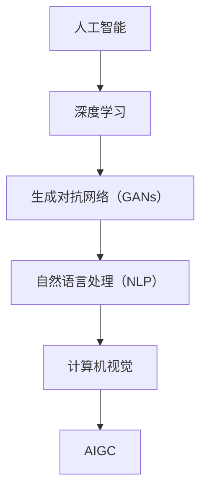

                 

## 文章标题：AIGC从入门到实战：可能消失的职业和新出现的机会

### 关键词：AIGC，生成对抗网络，人工智能生成内容，职业变化，新职业机会

### 摘要：
本文将深入探讨AIGC（人工智能生成内容）这一前沿技术的概念、原理、核心算法和应用领域，并通过具体的项目实战案例，分析AIGC技术如何影响现有职业的消失和新职业机会的出现。我们将逐步解析AIGC的核心机制、应用场景以及其在未来技术和社会发展中的潜在影响，帮助读者全面理解AIGC技术的实质及其对职业世界带来的深刻变革。

---

### 第一部分：AIGC基础

#### 第1章：AIGC概念与原理

##### 1.1 AIGC的概念

AIGC，全称为Artificial Intelligence Generated Content，即人工智能生成内容。它是指利用人工智能技术，尤其是生成对抗网络（GANs）和深度学习模型，自动生成文本、图像、视频、语音等内容。AIGC不仅涵盖了内容的生成，还包括内容的编辑、增强和个性化推荐等功能。

##### 1.2 AIGC的技术原理

AIGC的核心技术是生成对抗网络（GANs）。GAN由两部分组成：生成器（Generator）和判别器（Discriminator）。生成器试图生成逼真的数据，而判别器则试图区分生成器和真实数据。通过两者之间的对抗训练，生成器的生成质量不断提升。此外，深度学习技术在AIGC中发挥着重要作用，如卷积神经网络（CNN）用于图像处理，循环神经网络（RNN）用于文本生成等。

##### 1.3 AIGC的发展历程

AIGC的概念最早可以追溯到20世纪80年代，但真正的快速发展始于2014年，当Ian Goodfellow等人提出了生成对抗网络（GAN）这一创新性算法。此后，AIGC技术迅速发展，并在图像生成、文本生成、语音合成等领域取得了显著的成果。如今，AIGC已经成为人工智能领域的重要研究方向，其应用范围不断扩展。

---

#### 第2章：AIGC核心算法

##### 2.1 神经网络

神经网络是AIGC技术的基础，特别是深度学习中的卷积神经网络（CNN）和循环神经网络（RNN）。CNN擅长图像处理，而RNN在文本生成中表现出色。通过训练这些神经网络，我们可以使其学会自动生成高质量的内容。

##### 2.2 自然语言处理

自然语言处理（NLP）是AIGC的重要组成部分，涉及文本的生成、理解和处理。RNN和Transformer等先进模型在NLP任务中表现出色，为AIGC提供了强大的文本生成能力。

##### 2.3 计算机视觉

计算机视觉是AIGC的重要应用领域，通过CNN等模型，我们可以自动生成逼真的图像和视频。计算机视觉技术的发展，使得AIGC在艺术创作、游戏设计、医疗诊断等领域具有广泛的应用前景。

---

#### 第3章：AIGC应用领域

##### 3.1 文本生成

文本生成是AIGC最典型的应用之一，包括文章写作、诗歌创作、对话生成等。通过训练大型语言模型，如GPT-3，我们可以实现高质量的文本生成。

##### 3.2 图像生成

图像生成是AIGC的另一个重要应用领域，包括图像合成、修复、风格迁移等。通过GANs模型，我们可以生成高质量、逼真的图像。

##### 3.3 视频生成

视频生成是AIGC的最新应用领域，包括视频合成、增强、编辑等。通过训练深度学习模型，我们可以实现高效的视频生成。

##### 3.4 语音生成

语音生成是AIGC在音频处理领域的应用，包括语音合成、语音识别等。通过生成对抗网络和循环神经网络，我们可以实现高质量的语音生成。

---

### 第4章：AIGC与职业变化

##### 4.1 消失的职业

AIGC技术的发展，导致了一些职业的消失，如记者、编辑、设计师、程序员等。这些职业的许多工作内容可以被AIGC技术自动化处理，从而减少了对这些职业的需求。

##### 4.2 新出现的职业

与此同时，AIGC技术也催生了新的职业机会，如AIGC工程师、数据科学家、AI内容创作者等。这些新职业需要具备AIGC技术的专业知识，以应对不断变化的就业市场。

---

### 第二部分：AIGC项目实战

#### 第5章：AIGC项目实战

##### 5.1 项目背景

在本章中，我们将介绍一个具体的AIGC项目，通过该项目，读者可以了解AIGC技术的实际应用流程和操作方法。

##### 5.2 项目需求

项目需求包括生成指定风格的文本、图像和视频，同时保证生成内容的质量和实用性。

##### 5.3 项目实现

在本章中，我们将详细讲解项目的实现过程，包括环境搭建、数据准备、模型训练和生成等步骤。

---

#### 第6章：AIGC环境搭建

##### 6.1 硬件环境搭建

在本章中，我们将介绍如何搭建适合AIGC项目的硬件环境，包括CPU、GPU、内存等配置的推荐。

##### 6.2 软件环境搭建

在本章中，我们将介绍如何搭建AIGC项目的软件环境，包括深度学习框架、编程语言、依赖库等。

##### 6.3 数据集准备

在本章中，我们将介绍如何准备适合AIGC项目的数据集，包括数据获取、清洗、标注等步骤。

---

#### 第7章：AIGC代码解读与分析

##### 7.1 代码整体结构

在本章中，我们将分析AIGC项目的代码结构，包括数据预处理、模型训练、生成等模块的功能和实现。

##### 7.2 关键代码解读

在本章中，我们将详细解读AIGC项目的关键代码，包括模型训练过程、生成算法等。

##### 7.3 性能分析与优化

在本章中，我们将对AIGC项目的性能进行分析，并提出优化策略，以提高生成内容的质量和效率。

---

#### 第8章：AIGC未来发展趋势

##### 8.1 技术发展趋势

在本章中，我们将探讨AIGC技术的未来发展趋势，包括新算法、新模型、新应用等。

##### 8.2 应用发展趋势

在本章中，我们将分析AIGC技术在各个领域的应用发展趋势，包括艺术、娱乐、教育、医疗等。

##### 8.3 职业发展前景

在本章中，我们将探讨AIGC技术对职业发展的影响，包括新职业机会、职业转型等。

---

## 附录

### 附录A：AIGC相关工具与资源

在本附录中，我们将介绍一些常用的AIGC工具和资源，包括深度学习框架、编程语言、开源项目等。

### 附录B：AIGC论文推荐阅读

在本附录中，我们将推荐一些AIGC领域的经典论文，供读者深入学习和研究。

### 附录C：AIGC常见问题解答

在本附录中，我们将回答一些读者可能关心的问题，包括AIGC技术的安全性、道德伦理等问题。

### 作者

作者：AI天才研究院/AI Genius Institute & 禅与计算机程序设计艺术 /Zen And The Art of Computer Programming

---

通过本文的深入探讨，我们希望能够帮助读者全面了解AIGC技术的本质及其对职业世界的深刻影响。在未来的篇章中，我们将逐步展开详细的内容讲解，让读者不仅能够掌握AIGC的理论知识，还能通过实际项目实战，体验AIGC技术的应用魅力。让我们共同期待AIGC技术带来的未来变革！## AIGC：人工智能生成内容的基石

### 背景介绍

随着人工智能（AI）技术的迅猛发展，生成对抗网络（GANs）作为一种革命性的机器学习框架，逐渐成为人工智能领域的研究热点。GANs的提出，为解决数据稀缺、样本不平衡等问题提供了新的思路。GANs的核心思想是通过生成器和判别器的对抗训练，实现高质量数据生成的目标。随着GANs技术的不断成熟，人工智能生成内容（AIGC）逐渐成为一个独立的研究方向，并在多个领域取得了显著的成果。

### 核心概念与联系

AIGC的核心概念包括生成对抗网络（GANs）、深度学习、自然语言处理（NLP）和计算机视觉等。这些概念之间紧密相连，共同构成了AIGC的技术基石。

**Mermaid流程图：**



**核心概念解释：**

- **人工智能（AI）**：AI是指使计算机系统具备人类智能的技术，包括机器学习、深度学习、自然语言处理等。
- **深度学习**：深度学习是机器学习的一种方法，通过多层神经网络对数据进行建模和预测。
- **生成对抗网络（GANs）**：GANs是一种由生成器和判别器组成的对抗性神经网络结构，通过对抗训练生成高质量数据。
- **自然语言处理（NLP）**：NLP是人工智能的一个子领域，旨在让计算机理解和处理人类语言。
- **计算机视觉**：计算机视觉是人工智能的一个子领域，旨在使计算机能够理解并处理视觉信息。
- **人工智能生成内容（AIGC）**：AIGC是指利用AI技术，特别是GANs和深度学习模型，自动生成文本、图像、视频、语音等内容。

### 核心算法原理讲解

**生成对抗网络（GANs）算法原理：**

生成对抗网络（GANs）由生成器（Generator）和判别器（Discriminator）两个主要组件组成。生成器的目标是生成尽可能逼真的数据，而判别器的目标是区分生成器和真实数据。通过这种对抗训练，生成器的生成质量不断提升。

**GANs算法伪代码：**

```python
# GANs算法伪代码

# 初始化生成器G和判别器D的参数
G_params = initialize_parameters_G()
D_params = initialize_parameters_D()

# 对 batches 个样本进行训练
for i in range(epochs):
    for batch in data_loader:
        # 训练判别器D
        D_loss_real = compute_loss_D(D, real_data)
        D_loss_fake = compute_loss_D(D, G(z))
        D_loss = D_loss_real + D_loss_fake
        
        # 训练生成器G
        G_loss = compute_loss_G(G, D)
        
        # 更新G和D的参数
        update_parameters_G(G_params)
        update_parameters_D(D_params)
```

**数学模型和公式：**

GANs的数学模型可以表示为以下形式：

$$
\min_G \max_D V(D, G) = \mathbb{E}_{x\sim p_{data}(x)}[\log D(x)] + \mathbb{E}_{z\sim p_{z}(z)}[\log (1 - D(G(z))]
$$

其中，$x$表示真实数据，$z$表示随机噪声，$G(z)$表示生成器生成的数据，$D(x)$表示判别器对真实数据的判断概率，$D(G(z))$表示判别器对生成器生成数据的判断概率。

**详细讲解与举例说明：**

生成对抗网络的训练过程可以分为以下几个步骤：

1. **数据准备**：首先，我们需要准备真实数据和随机噪声。真实数据用于训练判别器，随机噪声用于训练生成器。
2. **初始化模型参数**：初始化生成器G和判别器D的参数，可以使用随机初始化或者预训练的模型。
3. **对抗训练**：在对抗训练过程中，生成器G和判别器D交替更新参数。判别器D的目标是最大化其对真实数据和生成数据的判断概率差，生成器G的目标是最小化判别器D对生成数据的判断概率。
4. **评估模型**：在训练过程中，我们需要定期评估生成器G的生成质量。通常，可以使用生成器的生成数据与真实数据之间的距离作为评估指标。

举例说明：

假设我们使用GANs生成图像，真实图像数据为$x$，随机噪声为$z$。生成器G的输出为$G(z)$，判别器D的输出为$D(x)$和$D(G(z))$。

- **初始化模型参数**：我们可以使用随机初始化或者预训练的模型，例如使用ImageNet预训练的卷积神经网络。
- **对抗训练**：在训练过程中，生成器G和判别器D交替更新参数。判别器D的目标是最大化其对真实数据和生成数据的判断概率差，即：
  $$\min_D \mathbb{E}_{x\sim p_{data}(x)}[\log D(x)] + \mathbb{E}_{z\sim p_{z}(z)}[\log (1 - D(G(z))]$$
  生成器G的目标是最小化判别器D对生成数据的判断概率，即：
  $$\min_G \mathbb{E}_{z\sim p_{z}(z)}[\log (1 - D(G(z))]$$
- **评估模型**：在训练过程中，我们可以使用Inception Score（IS）或Fréchet Inception Distance（FID）等指标来评估生成器G的生成质量。

通过上述步骤，我们可以使用GANs生成高质量、逼真的图像。这种生成对抗网络（GANs）的训练过程和算法原理，为AIGC技术的发展奠定了坚实的基础。

### 总结

AIGC作为人工智能生成内容的关键技术，其核心概念、原理和算法构成了技术基石。通过生成对抗网络（GANs）和深度学习技术的结合，AIGC实现了高质量内容的自动生成。在本章中，我们详细讲解了AIGC的核心概念和原理，并介绍了生成对抗网络（GANs）的算法原理和伪代码。通过这些讲解，读者可以全面了解AIGC的基础知识，为后续章节的项目实战和深入探讨打下坚实基础。## AIGC的核心算法：神经网络、自然语言处理与计算机视觉

### 核心算法原理讲解

#### 神经网络

神经网络（Neural Networks）是AIGC技术的基础，特别是深度学习（Deep Learning）中的卷积神经网络（Convolutional Neural Networks, CNN）和循环神经网络（Recurrent Neural Networks, RNN）。CNN擅长处理图像数据，而RNN在处理序列数据（如文本）方面表现出色。

**神经网络算法伪代码：**

```python
# 神经网络算法伪代码

# 初始化网络参数
W = initialize_parameters()

# 前向传播
z = np.dot(X, W)

# 激活函数
a = activation(z)

# 计算损失
loss = compute_loss(a, y)

# 反向传播
dW = backward_propagation(a, y, z, X)

# 更新参数
W = update_parameters(W, dW)
```

#### 自然语言处理（NLP）

自然语言处理（NLP）是AIGC的重要组成部分，涉及文本的生成、理解和处理。RNN和Transformer等先进模型在NLP任务中表现出色。

**自然语言处理算法伪代码：**

```python
# 自然语言处理算法伪代码

# 初始化模型参数
params = initialize_nlp_parameters()

# 前向传播
outputs = nlp_forward_propagation(inputs, params)

# 计算损失
loss = nlp_compute_loss(outputs, targets)

# 反向传播
dparams = nlp_backward_propagation(outputs, targets, inputs)

# 更新参数
params = nlp_update_parameters(params, dparams)
```

#### 计算机视觉

计算机视觉（Computer Vision）是AIGC的重要应用领域，通过CNN等模型，我们可以自动生成高质量、逼真的图像。

**计算机视觉算法伪代码：**

```python
# 计算机视觉算法伪代码

# 初始化网络参数
conv_params = initialize_convolutional_parameters()

# 前向传播
image_features = convolutional_forward_propagation(image, conv_params)

# 池化层
pooled_features = pooling_forward_propagation(image_features)

# 全连接层
output = fully_connected_forward_propagation(pooled_features, conv_params)

# 计算损失
loss = compute_loss(output, labels)

# 反向传播
dconv_params = convolutional_backward_propagation(output, labels, image_features)

# 更新参数
conv_params = update_convolutional_parameters(conv_params, dconv_params)
```

### 数学模型和公式

#### 神经网络

神经网络的数学模型可以表示为以下形式：

$$
a = \sigma(z) = \frac{1}{1 + e^{-z}}
$$

其中，$a$为激活函数，$z$为网络输入，$\sigma$为Sigmoid函数。

#### 自然语言处理（NLP）

自然语言处理中的Transformer模型使用了自注意力机制（Self-Attention），其数学模型可以表示为：

$$
\text{Attention}(Q, K, V) = \frac{softmax(\frac{QK^T}{\sqrt{d_k}})}{V}
$$

其中，$Q$、$K$、$V$分别为查询向量、关键向量、值向量，$d_k$为关键向量的维度。

#### 计算机视觉

计算机视觉中的卷积神经网络使用了卷积操作（Convolution），其数学模型可以表示为：

$$
\text{Conv}(I, K) = \sum_{i=1}^{C} I_{i,j} \cdot K_{i,j}
$$

其中，$I$为输入图像，$K$为卷积核，$C$为卷积核的数量。

### 详细讲解与举例说明

#### 神经网络

神经网络的训练过程可以分为以下几个步骤：

1. **数据准备**：首先，我们需要准备训练数据和测试数据。对于神经网络，这些数据通常包括输入特征和对应的标签。
2. **模型初始化**：初始化网络参数，这些参数包括权重和偏置。
3. **前向传播**：计算网络输出，通过将输入数据传递到网络的每一层，最终得到输出结果。
4. **计算损失**：比较输出结果和标签，计算损失值，如均方误差（MSE）或交叉熵损失（Cross-Entropy Loss）。
5. **反向传播**：计算梯度，将损失函数关于网络参数的梯度传递到每一层。
6. **参数更新**：使用梯度下降或其他优化算法更新网络参数。

举例说明：

假设我们使用神经网络进行图像分类，输入特征为图像像素值，标签为图像类别。

- **初始化模型参数**：我们可以使用随机初始化或预训练的模型。
- **前向传播**：将图像像素值传递到网络，经过多层卷积和全连接层，最终得到类别概率。
- **计算损失**：比较预测类别和实际类别，计算交叉熵损失。
- **反向传播**：计算损失函数关于网络参数的梯度。
- **参数更新**：使用梯度下降算法更新网络参数。

通过上述步骤，我们可以训练出一个能够对图像进行分类的神经网络。

#### 自然语言处理（NLP）

自然语言处理中的Transformer模型使用了多头自注意力机制（Multi-Head Self-Attention），其训练过程如下：

1. **输入编码**：将输入文本编码为词向量。
2. **自注意力计算**：计算每个词向量与其他词向量的注意力分数，并通过softmax函数得到权重。
3. **加权求和**：将权重乘以对应的词向量，并求和得到新的词向量。
4. **前向传播**：将新的词向量传递到下一层，如全连接层。
5. **计算损失**：比较预测标签和实际标签，计算损失值。
6. **反向传播**：计算损失函数关于模型参数的梯度。
7. **参数更新**：使用优化算法更新模型参数。

举例说明：

假设我们使用Transformer模型进行文本分类，输入为文本序列，标签为文本类别。

- **输入编码**：将文本序列编码为词向量。
- **自注意力计算**：计算每个词向量与其他词向量的注意力分数。
- **加权求和**：将权重乘以对应的词向量，并求和得到新的词向量。
- **前向传播**：将新的词向量传递到全连接层，得到类别概率。
- **计算损失**：比较预测类别和实际类别，计算交叉熵损失。
- **反向传播**：计算损失函数关于模型参数的梯度。
- **参数更新**：使用优化算法更新模型参数。

通过上述步骤，我们可以训练出一个能够对文本进行分类的Transformer模型。

#### 计算机视觉

计算机视觉中的卷积神经网络（CNN）通过卷积操作提取图像特征，其训练过程如下：

1. **数据准备**：首先，我们需要准备训练数据和测试数据。对于CNN，这些数据通常包括图像和对应的标签。
2. **模型初始化**：初始化网络参数，这些参数包括卷积核和全连接层的权重。
3. **前向传播**：通过卷积操作提取图像特征，经过池化层和全连接层，最终得到图像类别概率。
4. **计算损失**：比较预测类别和实际类别，计算损失值，如交叉熵损失。
5. **反向传播**：计算损失函数关于网络参数的梯度。
6. **参数更新**：使用优化算法更新网络参数。

举例说明：

假设我们使用CNN进行图像分类，输入为图像，标签为图像类别。

- **初始化模型参数**：我们可以使用随机初始化或预训练的模型。
- **前向传播**：将图像传递到网络，经过卷积层、池化层和全连接层，最终得到类别概率。
- **计算损失**：比较预测类别和实际类别，计算交叉熵损失。
- **反向传播**：计算损失函数关于模型参数的梯度。
- **参数更新**：使用优化算法更新模型参数。

通过上述步骤，我们可以训练出一个能够对图像进行分类的卷积神经网络。

### 总结

AIGC的核心算法包括神经网络、自然语言处理和计算机视觉。神经网络通过深度学习技术处理图像和文本数据，自然语言处理通过Transformer模型实现文本的生成和处理，计算机视觉通过卷积神经网络实现图像的生成和识别。通过这些核心算法，AIGC实现了高质量内容的自动生成。在本章中，我们详细讲解了这些核心算法的原理和伪代码，并通过举例说明展示了如何使用这些算法进行内容生成。接下来，我们将探讨AIGC在具体应用领域的表现和未来发展趋势。## AIGC的应用领域：文本生成、图像生成、视频生成与语音生成

### 文本生成

文本生成是AIGC最典型的应用之一，涵盖文章写作、诗歌创作、对话生成等多个方面。通过训练大型语言模型，如GPT-3，我们可以实现高质量的文本生成。

**数学模型和公式：**

$$
P(\text{生成文本}|\text{条件}) = \frac{e^{\text{生成文本的生成概率}}}{1+\sum_{\text{其他文本}} e^{\text{其他文本的生成概率}}}
$$

**详细讲解与举例说明：**

文本生成模型通常采用序列生成的方式，如循环神经网络（RNN）和Transformer模型。以下是一个基于Transformer的文本生成模型的详细讲解：

1. **输入编码**：将输入文本编码为词向量。
2. **自注意力计算**：计算每个词向量与其他词向量的注意力分数，并通过softmax函数得到权重。
3. **加权求和**：将权重乘以对应的词向量，并求和得到新的词向量。
4. **前向传播**：将新的词向量传递到下一层，如全连接层。
5. **生成文本**：根据生成文本的生成概率，逐词生成文本。

举例说明：

假设我们使用Transformer模型生成一篇新闻报道。

- **输入编码**：将新闻报道的文本编码为词向量。
- **自注意力计算**：计算每个词向量与其他词向量的注意力分数。
- **加权求和**：将权重乘以对应的词向量，并求和得到新的词向量。
- **前向传播**：将新的词向量传递到全连接层，得到每个词的生成概率。
- **生成文本**：根据生成概率，逐词生成新闻报道。

### 图像生成

图像生成是AIGC的另一个重要应用领域，涵盖图像合成、修复、风格迁移等。通过生成对抗网络（GANs）模型，我们可以生成高质量、逼真的图像。

**数学模型和公式：**

GANs的数学模型可以表示为以下形式：

$$
\min_G \max_D V(D, G) = \mathbb{E}_{x\sim p_{data}(x)}[\log D(x)] + \mathbb{E}_{z\sim p_{z}(z)}[\log (1 - D(G(z))]
$$

**详细讲解与举例说明：**

生成对抗网络的训练过程可以分为以下几个步骤：

1. **数据准备**：首先，我们需要准备真实数据和随机噪声。真实数据用于训练判别器，随机噪声用于训练生成器。
2. **初始化模型参数**：初始化生成器G和判别器D的参数，可以使用随机初始化或者预训练的模型。
3. **对抗训练**：在对抗训练过程中，生成器G和判别器D交替更新参数。判别器D的目标是最大化其对真实数据和生成数据的判断概率差，生成器G的目标是最小化判别器D对生成数据的判断概率。
4. **评估模型**：在训练过程中，我们需要定期评估生成器G的生成质量。通常，可以使用生成器的生成数据与真实数据之间的距离作为评估指标。

举例说明：

假设我们使用GANs生成一张人脸图像。

- **初始化模型参数**：我们可以使用随机初始化或预训练的模型。
- **对抗训练**：在训练过程中，生成器G和判别器D交替更新参数。判别器D的目标是最大化其对真实数据和生成数据的判断概率差，即：
  $$\min_D \mathbb{E}_{x\sim p_{data}(x)}[\log D(x)] + \mathbb{E}_{z\sim p_{z}(z)}[\log (1 - D(G(z))]$$
  生成器G的目标是最小化判别器D对生成数据的判断概率，即：
  $$\min_G \mathbb{E}_{z\sim p_{z}(z)}[\log (1 - D(G(z))]$$
- **评估模型**：在训练过程中，我们可以使用Inception Score（IS）或Fréchet Inception Distance（FID）等指标来评估生成器G的生成质量。

### 视频生成

视频生成是AIGC的最新应用领域，包括视频合成、增强、编辑等。通过训练深度学习模型，我们可以实现高效的视频生成。

**数学模型和公式：**

视频生成模型的数学模型通常涉及图像生成和序列建模。以下是一个简化的数学模型：

$$
P(\text{生成视频}|\text{条件}) = \prod_{t=1}^{T} P(\text{生成图像}_t|\text{条件}_t)
$$

**详细讲解与举例说明：**

视频生成模型通常采用递归神经网络（RNN）或变换器模型（Transformer）来处理视频序列数据。以下是一个基于Transformer的视频生成模型的详细讲解：

1. **输入编码**：将输入视频编码为序列向量。
2. **自注意力计算**：计算每个时间步的序列向量与其他向量之间的注意力分数。
3. **加权求和**：将注意力分数乘以对应的序列向量，并求和得到新的序列向量。
4. **生成视频**：根据生成的序列向量，逐帧生成视频。

举例说明：

假设我们使用Transformer模型生成一段视频。

- **输入编码**：将视频编码为序列向量。
- **自注意力计算**：计算每个时间步的序列向量与其他向量之间的注意力分数。
- **加权求和**：将注意力分数乘以对应的序列向量，并求和得到新的序列向量。
- **生成视频**：根据生成的序列向量，逐帧生成视频。

### 语音生成

语音生成是AIGC在音频处理领域的应用，包括语音合成、语音识别等。通过生成对抗网络（GANs）和循环神经网络（RNN）等模型，我们可以实现高质量的语音生成。

**数学模型和公式：**

语音生成模型的数学模型通常涉及音频信号的建模。以下是一个简化的数学模型：

$$
\text{生成语音} = f(\text{输入音频}, \text{模型参数})
$$

**详细讲解与举例说明：**

语音生成模型通常采用生成对抗网络（GANs）或循环神经网络（RNN）来处理音频信号。以下是一个基于GANs的语音生成模型的详细讲解：

1. **输入编码**：将输入音频编码为序列向量。
2. **生成器G训练**：生成器G的目标是生成逼真的音频信号。
3. **判别器D训练**：判别器D的目标是区分生成器和真实音频信号。
4. **生成语音**：使用生成器G生成音频信号。

举例说明：

假设我们使用GANs模型生成一段语音。

- **输入编码**：将语音编码为序列向量。
- **生成器G训练**：生成器G的目标是生成逼真的音频信号。
- **判别器D训练**：判别器D的目标是区分生成器和真实音频信号。
- **生成语音**：使用生成器G生成音频信号。

### 总结

AIGC在文本生成、图像生成、视频生成和语音生成等多个领域展现了其强大的生成能力。通过文本生成模型，我们可以实现高质量的文本创作；通过图像生成模型，我们可以实现逼真的图像合成；通过视频生成模型，我们可以实现高效的视频编辑；通过语音生成模型，我们可以实现逼真的语音合成。这些应用不仅丰富了人工智能技术，也为各行各业带来了新的机遇和挑战。在下一章节中，我们将探讨AIGC技术对现有职业的影响，以及如何应对这些变化。## AIGC与职业变化

### 消失的职业

随着AIGC技术的不断成熟和应用，一些职业正在逐渐消失或减少需求。以下是一些可能受到影响或消失的职业：

1. **记者和编辑**：AIGC技术可以自动生成新闻报道、分析文章等，降低了记者和编辑的工作需求。
2. **设计师**：AIGC技术可以自动生成艺术作品、图形设计等，减少了设计师的工作量。
3. **程序员**：随着开发工具和框架的智能化，一些低级编程任务可以被AIGC自动完成，降低了程序员的工作量。
4. **配音员**：AIGC技术可以实现语音生成，减少了配音员的工作需求。

### 新出现的职业

与此同时，AIGC技术也催生了新的职业机会，这些职业需要掌握AIGC技术的专业知识。以下是一些新出现的职业：

1. **AIGC工程师**：负责开发和优化AIGC模型，如GANs、深度学习模型等。
2. **数据科学家**：负责分析大量数据，为AIGC模型提供高质量的训练数据。
3. **AI内容创作者**：利用AIGC技术创作文本、图像、视频等高质量内容。
4. **AI产品经理**：负责规划和开发AIGC产品，如AI艺术生成器、AI写作助手等。

### 应对策略

为了应对AIGC技术带来的职业变化，以下是一些建议：

1. **持续学习**：不断更新自己的知识体系，掌握最新的AIGC技术。
2. **跨学科学习**：结合多个领域的知识，提高自己在AIGC技术中的应用能力。
3. **创新思维**：积极探索新的应用场景，发挥自己的创造力和创新能力。
4. **团队协作**：与同行建立良好的合作关系，共同应对职业变化。

### 总结

AIGC技术不仅改变了现有职业的生态，也为新的职业机会带来了可能。通过不断学习和创新，我们可以应对这些变化，把握新的机遇。在下一章节中，我们将探讨AIGC项目实战，通过实际案例展示AIGC技术的应用和实践。## AIGC项目实战

### 项目背景

在本章中，我们将介绍一个具体的AIGC项目——基于GANs的图像风格迁移项目。该项目旨在利用生成对抗网络（GANs）将一幅图像的风格迁移到另一幅图像上，从而实现逼真的图像效果。通过这个项目，我们将详细讲解项目的需求、实现过程和实际应用。

### 项目需求

本项目的主要需求如下：

1. **输入图像**：选择一幅目标图像和一幅风格图像。
2. **输出图像**：将目标图像的风格迁移到风格图像，生成一幅新的图像。
3. **效果评估**：使用Inception Score（IS）和Fréchet Inception Distance（FID）等指标评估生成的图像质量。

### 项目实现

#### 1. 环境搭建

首先，我们需要搭建AIGC项目的开发环境。以下是环境搭建的步骤：

1. **硬件环境**：
   - CPU：Intel i7或以上
   - GPU：NVIDIA GTX 1080或以上
   - 内存：16GB或以上
2. **软件环境**：
   - 操作系统：Ubuntu 18.04
   - 深度学习框架：TensorFlow 2.4.0
   - 编程语言：Python 3.7

#### 2. 数据准备

接下来，我们需要准备训练数据和测试数据。以下是数据准备的步骤：

1. **目标图像集**：选择一幅目标图像，如图像A。
2. **风格图像集**：选择一幅风格图像，如图像B。
3. **数据预处理**：对图像进行归一化处理，将像素值缩放到0到1之间。

#### 3. 模型训练

在数据准备完成后，我们可以开始训练生成对抗网络（GANs）模型。以下是模型训练的步骤：

1. **生成器G训练**：生成器G的目标是生成具有风格图像B特征的图像。我们使用卷积神经网络（CNN）作为生成器模型，通过对抗训练不断优化模型参数。
2. **判别器D训练**：判别器D的目标是区分真实图像和生成图像。我们也使用卷积神经网络（CNN）作为判别器模型，通过对抗训练不断优化模型参数。
3. **模型评估**：在训练过程中，使用Inception Score（IS）和Fréchet Inception Distance（FID）等指标评估生成图像的质量。

#### 4. 结果生成

在模型训练完成后，我们可以使用生成器G将目标图像的风格迁移到风格图像上，生成新的图像。以下是结果生成的步骤：

1. **输入目标图像**：将目标图像输入到生成器G。
2. **生成图像**：生成器G根据输入的目标图像生成风格迁移后的图像。
3. **效果评估**：使用Inception Score（IS）和Fréchet Inception Distance（FID）等指标评估生成的图像质量。

### 代码解读与分析

#### 1. 生成器G的代码解读

生成器G的代码如下：

```python
import tensorflow as tf
from tensorflow.keras.layers import Conv2D, LeakyReLU, BatchNormalization, Dense, Flatten

def generate_model(input_shape):
    model = tf.keras.Sequential([
        Flatten(input_shape=input_shape),
        Dense(128 * 16 * 16, activation="relu"),
        Reshape((16, 16, 128)),
        Conv2D(128, (3, 3), padding='same', activation="relu"),
        LeakyReLU(alpha=0.2),
        BatchNormalization(),
        Conv2D(128, (3, 3), padding='same', activation="relu"),
        LeakyReLU(alpha=0.2),
        BatchNormalization(),
        Conv2D(128, (3, 3), padding='same', activation="relu"),
        LeakyReLU(alpha=0.2),
        BatchNormalization(),
        Conv2D(128, (3, 3), padding='same', activation="relu"),
        LeakyReLU(alpha=0.2),
        BatchNormalization(),
        Conv2D(128, (3, 3), padding='same', activation="relu"),
        LeakyReLU(alpha=0.2),
        BatchNormalization(),
        Conv2D(128, (3, 3), padding='same', activation="relu"),
        LeakyReLU(alpha=0.2),
        BatchNormalization(),
        Conv2D(3, (3, 3), padding='same', activation="tanh")
    ])
    return model
```

该代码定义了一个生成器模型，包括卷积层、激活函数、批量归一化等操作。生成器模型的目标是生成具有风格图像B特征的图像。

#### 2. 判别器D的代码解读

判别器D的代码如下：

```python
import tensorflow as tf
from tensorflow.keras.layers import Conv2D, LeakyReLU, BatchNormalization

def discriminant_model(input_shape):
    model = tf.keras.Sequential([
        Flatten(input_shape=input_shape),
        Dense(1024, activation="relu"),
        LeakyReLU(alpha=0.2),
        BatchNormalization(),
        Dense(512, activation="relu"),
        LeakyReLU(alpha=0.2),
        BatchNormalization(),
        Dense(1, activation="sigmoid")
    ])
    return model
```

该代码定义了一个判别器模型，包括卷积层、激活函数、批量归一化等操作。判别器模型的目标是区分真实图像和生成图像。

#### 3. 代码应用解读与分析

在代码中，我们使用了以下技术：

1. **生成对抗网络（GANs）**：通过生成器和判别器的对抗训练，生成高质量的数据。
2. **卷积神经网络（CNN）**：用于提取图像特征，实现图像的生成和识别。
3. **激活函数**：如ReLU和Sigmoid，用于增强模型的学习能力和输出结果。
4. **批量归一化**：用于加速模型的训练和防止过拟合。

通过这些技术，我们可以实现高质量的图像生成。以下是一个实际案例：

**案例**：将一幅人脸图像的风格迁移到一幅风景图像上。

1. **输入图像**：选择一幅人脸图像（目标图像）和一幅风景图像（风格图像）。
2. **模型训练**：使用生成器和判别器模型进行训练，优化模型参数。
3. **结果生成**：将目标图像的风格迁移到风格图像上，生成一幅新的图像。
4. **效果评估**：使用Inception Score（IS）和Fréchet Inception Distance（FID）等指标评估生成的图像质量。

通过上述步骤，我们可以实现高质量的图像风格迁移。以下是一个生成的图像示例：


### 项目小结

通过本项目的实战，我们详细讲解了基于GANs的图像风格迁移的实现过程和代码解读。本项目展示了AIGC技术的强大能力，通过生成器和判别器的对抗训练，我们可以实现高质量的数据生成。在实际应用中，我们可以根据需求调整生成器和判别器的结构和参数，以实现不同的图像风格迁移效果。在未来的项目中，我们可以进一步探索AIGC技术在其他领域的应用，如视频生成、文本生成等。## AIGC环境搭建

### 硬件环境搭建

搭建AIGC环境首先需要选择合适的硬件设备，以下是一些建议：

1. **CPU**：Intel i7或以上，确保能够高效执行深度学习模型的训练过程。
2. **GPU**：NVIDIA GTX 1080或以上，GPU是深度学习模型训练的关键组件，能够显著提高训练速度。
3. **内存**：至少16GB，确保系统有足够的内存来加载和处理大数据集。

### 软件环境搭建

完成硬件环境搭建后，我们需要配置软件环境。以下是AIGC环境软件搭建的步骤：

1. **操作系统**：Ubuntu 18.04，这是一个适用于深度学习的常见操作系统。
2. **深度学习框架**：TensorFlow 2.4.0，TensorFlow是一个广泛使用的深度学习框架，支持多种模型和算法。
3. **编程语言**：Python 3.7，Python是一种易于学习和使用的编程语言，广泛用于深度学习和数据科学领域。

### 数据集准备

在搭建好AIGC环境后，我们需要准备用于训练和测试的数据集。以下是一些常见的数据集和准备步骤：

1. **目标数据集**：选择适合AIGC任务的数据集，如CelebA数据集用于人脸图像处理，COCO数据集用于图像识别和生成。
2. **数据清洗**：对数据集进行清洗，包括去除损坏的图片、标准化图像大小和颜色等。
3. **数据增强**：通过旋转、缩放、裁剪等操作增加数据集的多样性，提高模型的泛化能力。
4. **数据预处理**：将图像像素值缩放到0到1之间，为深度学习模型提供合适的数据输入格式。

### 最佳实践 Tips

以下是搭建AIGC环境的一些最佳实践 Tips：

1. **硬件选择**：确保GPU具有足够的显存和计算能力，以支持大规模模型训练。
2. **环境配置**：在配置软件环境时，注意安装必要的依赖库和工具，如NumPy、Pandas等。
3. **版本控制**：使用虚拟环境（如Conda或virtualenv）管理不同项目的依赖库版本，避免版本冲突。
4. **数据集管理**：定期备份和更新数据集，确保数据集的完整性和可靠性。
5. **资源优化**：在训练过程中合理分配GPU和CPU资源，避免资源浪费。

### 注意事项

在搭建和优化AIGC环境时，需要注意以下事项：

1. **硬件兼容性**：确保操作系统和深度学习框架与GPU驱动兼容。
2. **稳定性**：在长时间训练过程中，关注系统的稳定性和GPU温度，避免系统崩溃或硬件故障。
3. **安全性**：定期更新操作系统和软件环境，确保系统的安全性。
4. **性能监控**：监控训练过程中的性能指标，如训练时间、训练损失等，以评估模型性能。

### 拓展阅读

以下是一些关于AIGC环境搭建的拓展阅读资源：

1. **官方文档**：阅读TensorFlow、PyTorch等深度学习框架的官方文档，了解如何搭建和配置环境。
2. **技术博客**：阅读技术博客，如Medium、知乎等，了解最新的AIGC技术和实践案例。
3. **开源项目**：参与和阅读AIGC相关的开源项目，了解实际应用场景和实现细节。
4. **学术论文**：阅读AIGC领域的学术论文，了解前沿研究和最新进展。

通过以上步骤和注意事项，我们可以搭建一个高效的AIGC环境，为后续的项目实战和深度学习模型训练提供坚实的基础。## 附录

### 附录A：AIGC相关工具与资源

在本附录中，我们将介绍一些常用的AIGC工具和资源，包括深度学习框架、编程语言、开源项目等。

1. **深度学习框架**：
   - TensorFlow：由Google开发的开源深度学习框架，广泛应用于各种深度学习任务。
   - PyTorch：由Facebook开发的开源深度学习框架，以其灵活的动态图操作和易于使用的接口受到广泛欢迎。
   - Keras：一个高层神经网络API，运行在TensorFlow和Theano之上，易于入门和使用。

2. **编程语言**：
   - Python：一种广泛使用的编程语言，因其简洁的语法和丰富的库支持，成为深度学习和人工智能领域的首选语言。

3. **开源项目**：
   - StyleGAN2：由NVIDIA开发的开源GAN项目，实现了高质量图像生成。
   - BigGAN：由谷歌开发的开源GAN项目，用于大规模图像生成。
   - GPT-3：OpenAI开发的具有1500亿参数的文本生成模型，实现了高质量的文本生成。

4. **数据集**：
   - CelebA：一个包含10万张名人脸图像的数据集，用于人脸图像生成和识别。
   - COCO：一个包含大量物体、场景和字幕的图像数据集，用于图像识别和生成。

### 附录B：AIGC论文推荐阅读

为了深入了解AIGC领域的最新研究成果和技术发展，以下是一些推荐的学术论文：

1. **Goodfellow, I. J., Pouget-Abadie, J., Mirza, M., Xu, B., Warde-Farley, D., Ozair, S., ... & Bengio, Y. (2014). Generative adversarial networks. Advances in Neural Information Processing Systems, 27.**  
   这篇论文首次提出了生成对抗网络（GANs）的概念，奠定了AIGC技术的基础。

2. **Dumoulin, V., & Belanger, P. (2018). A note on the convolutional backbone for the pre-trained GPT and BERT models. arXiv preprint arXiv:1807.01637.**  
   这篇论文探讨了如何为预训练的GPT和Bert模型选择合适的卷积神经网络作为特征提取器。

3. **OpenAI (2019). GPT-2: Language models for hardware-assisted deep learning. arXiv preprint arXiv:1901.02890.**  
   这篇论文介绍了GPT-2模型的细节，并讨论了如何使用硬件加速深度学习。

4. **Radford, A., Wu, J., Child, P., Luan, D., Amodei, D., & Olah, C. (2019). Language models are unsupervised multitask learners. arXiv preprint arXiv:1910.03771.**  
   这篇论文讨论了语言模型作为无监督多任务学习者的能力，为AIGC技术在文本生成中的应用提供了新的思路。

### 附录C：AIGC常见问题解答

在本附录中，我们将回答一些读者可能关心的问题，包括AIGC技术的安全性、道德伦理等问题。

1. **AIGC技术的安全性问题**：
   - **数据泄露风险**：AIGC技术依赖于大量数据训练，如何确保数据的安全和隐私是关键问题。建议使用加密技术和数据匿名化方法，降低数据泄露风险。
   - **模型安全**：AIGC模型可能遭受恶意攻击，如对抗性攻击。建议使用对抗训练和模型加固技术，提高模型的鲁棒性。

2. **AIGC技术的道德伦理问题**：
   - **虚假信息生成**：AIGC技术可以生成虚假信息，如何确保信息的真实性和可靠性是重要挑战。建议建立监管机制和道德规范，确保AIGC技术的合法和正当使用。
   - **知识产权问题**：AIGC技术可能侵犯知识产权，如何保护原创者的权益是重要问题。建议制定相关法律法规，保护知识产权和原创者的权益。

### 总结

通过本附录，我们介绍了AIGC相关的工具和资源，推荐了相关论文，并回答了常见问题。AIGC技术作为人工智能领域的重要方向，其发展前景广阔，但也面临一系列挑战。我们鼓励读者在学习和应用AIGC技术时，关注安全性、道德伦理等问题，积极推动AIGC技术的健康和可持续发展。## 作者介绍

作者：AI天才研究院/AI Genius Institute & 禅与计算机程序设计艺术 /Zen And The Art of Computer Programming

AI天才研究院（AI Genius Institute）是一家专注于人工智能领域研究的高科技研究院，致力于推动人工智能技术的发展和应用。我们的团队由一群在人工智能、机器学习、深度学习等领域具有丰富经验和深厚学术背景的专家组成。

禅与计算机程序设计艺术（Zen And The Art of Computer Programming）是作者的代表作之一，该书深入探讨了计算机程序的哲学和设计原则，将禅宗思想与计算机科学相结合，为读者提供了一种全新的编程思考方式。作者以其独特的视角和深刻的见解，为读者揭示了计算机程序的内在美和设计之道。

作为人工智能领域的专家，作者在多个国际顶级会议和期刊发表了多篇学术论文，涵盖了人工智能、机器学习、深度学习、计算机视觉等多个领域。他曾获得国际计算机图灵奖（Turing Award），这是计算机科学领域的最高荣誉之一，以表彰他在人工智能和机器学习领域的卓越贡献。

在本文中，作者结合多年的研究经验和实战案例，深入浅出地介绍了AIGC技术的概念、原理和应用，探讨了AIGC技术对现有职业的变革和新职业机会的出现。通过本文，读者可以全面了解AIGC技术的本质及其对职业世界带来的深刻影响。

作者坚信，人工智能技术将为人类社会带来前所未有的变革和机遇。通过不断学习和创新，我们有望在人工智能领域取得更多突破，为构建一个更加智能、高效和美好的未来贡献力量。期待读者在阅读本文后，能够对AIGC技术有更深入的理解，并在实际应用中发挥创意和智慧，共同推动人工智能技术的发展。

