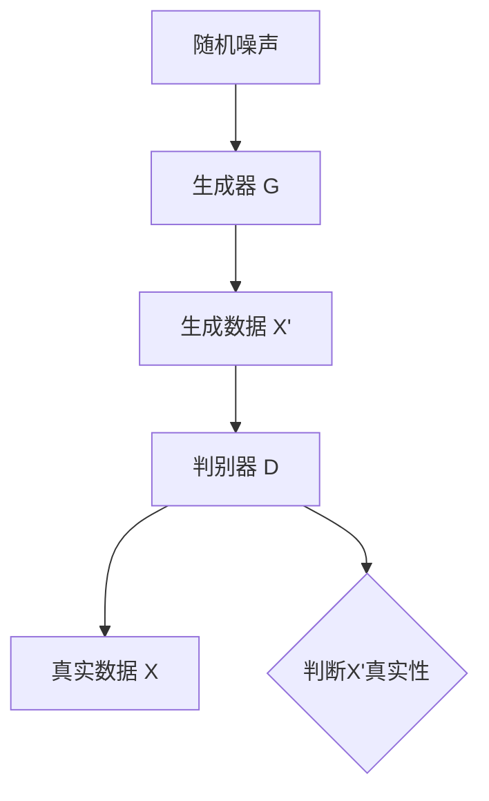
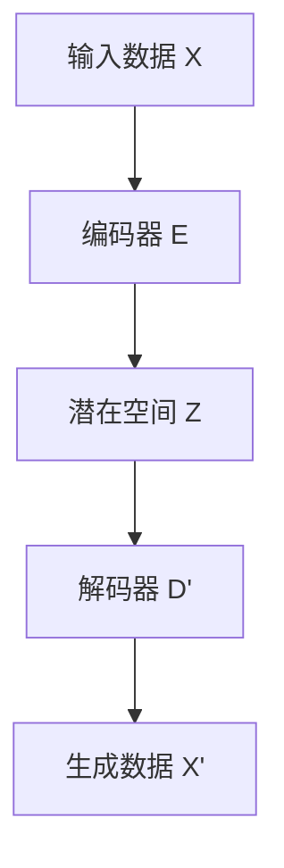
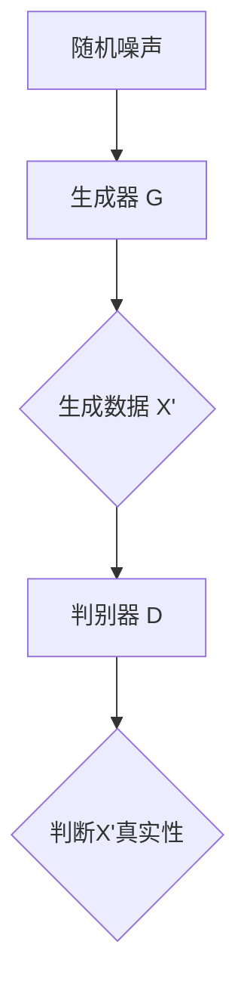
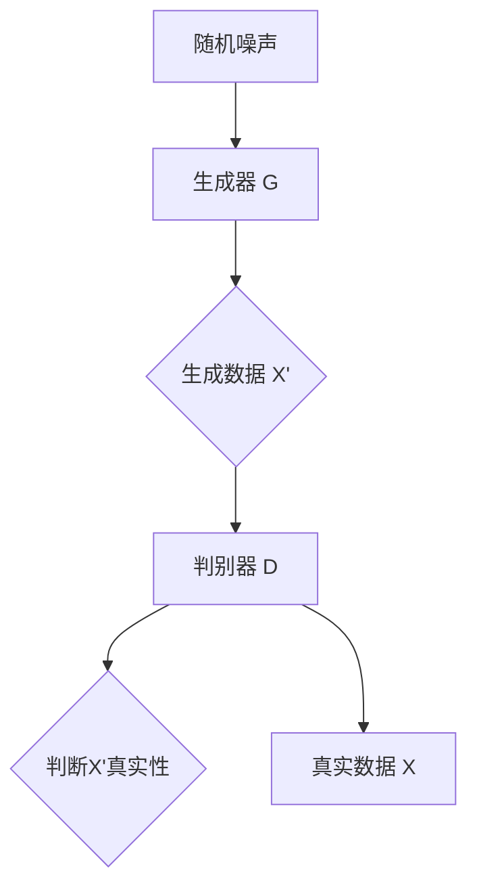

                 

# AIGC从入门到实战：如何有效应对 AI 革命

## 关键词
- AIGC
- 生成对抗网络
- 自适应系统
- 大规模分布式计算
- 应用场景
- 挑战与解决方案

## 摘要
本文旨在深入探讨AIGC（自适应智能生成计算）的概念、技术原理、应用场景以及面临的挑战和解决方案。通过对AIGC的概述、核心概念、技术原理和应用场景的详细解析，读者将了解到AIGC如何成为应对AI革命的关键技术。文章最后通过两个项目实战案例，展示了AIGC在实际开发中的具体应用，并提供了一些最佳实践和未来发展趋势。

### 第一部分：AIGC基础知识

#### 第1章：AIGC概述

#### 1.1 AIGC的概念与背景

随着人工智能技术的不断发展，传统的AI系统逐渐无法满足复杂、动态和个性化的需求。AIGC（Adaptive Intelligent Generative Computing）应运而生，它是一种基于生成对抗网络（GAN）和自适应系统的新型计算范式。AIGC旨在通过自适应、自学习和高效生成的方式，实现数据的智能处理和场景的实时优化。

#### 1.2 AIGC与传统AI的区别

传统AI主要依赖于预设的模型和规则，而AIGC则强调数据驱动的生成和自适应优化。传统AI在面对复杂环境时，往往需要大量的人工干预和调整，而AIGC则能够通过自我学习和自适应调整，实现更智能、更高效的处理。

#### 1.3 AIGC的发展现状与趋势

近年来，AIGC在计算机视觉、自然语言处理、自动驾驶等领域取得了显著的成果。随着计算能力的提升和数据量的增长，AIGC的应用范围将不断扩展，成为未来AI技术的重要组成部分。

#### 第2章：AIGC核心概念

#### 2.1 数据驱动与生成模型

AIGC的核心在于数据驱动的生成模型，通过大量的数据训练，生成模型能够学习到数据的内在结构和规律，从而实现数据的智能处理和场景的实时优化。

#### 2.2 自适应系统与动态优化

AIGC强调系统的自适应性和动态优化能力，通过不断调整模型参数和优化策略，实现系统在不同场景下的最优性能。

#### 2.3 大规模分布式计算

AIGC通常需要处理海量数据和复杂的计算任务，因此需要依赖于大规模分布式计算架构，以确保高效的计算性能和扩展能力。

### 第二部分：AIGC技术原理

#### 第3章：AIGC技术原理

#### 3.1 生成对抗网络（GAN）

##### 3.1.1 GAN的基本架构

生成对抗网络（GAN）由生成器（Generator）和判别器（Discriminator）两个神经网络组成。生成器生成虚假数据，判别器判断输入数据是真实还是虚假。通过两个网络的对抗训练，生成器逐渐提高生成数据的质量，达到以假乱真的效果。

##### 3.1.2 GAN的优缺点分析

GAN在图像生成、自然语言处理等领域具有出色的性能，但同时也存在训练不稳定、计算复杂度高的问题。

##### 3.1.3 GAN的变体与应用

为了解决GAN的不足，研究者提出了多种GAN的变体，如条件GAN（cGAN）、深度卷积GAN（DCGAN）等。这些变体在应用中表现出更强的适应性和性能。

#### 第4章：AIGC应用场景

#### 4.1 内容生成

##### 4.1.1 文本生成

文本生成是AIGC的重要应用领域，通过生成对抗网络，可以生成高质量的文本内容，如文章、小说、对话等。

##### 4.1.2 图片生成

图片生成是AIGC的另一个核心应用领域，通过生成对抗网络，可以生成逼真的图像，如艺术风格迁移、图像超分辨率等。

##### 4.1.3 声音生成

声音生成是AIGC在音频处理领域的应用，通过生成对抗网络，可以生成高质量的声音，如语音合成、音乐生成等。

#### 4.2 交互式生成

##### 4.2.1 实时对话生成

实时对话生成是AIGC在自然语言处理领域的应用，通过生成对抗网络，可以生成逼真的对话内容，实现人机交互。

##### 4.2.2 视觉交互生成

视觉交互生成是AIGC在计算机视觉领域的应用，通过生成对抗网络，可以生成逼真的视觉内容，实现虚拟现实、增强现实等应用。

##### 4.2.3 语音交互生成

语音交互生成是AIGC在音频处理领域的应用，通过生成对抗网络，可以生成逼真的语音内容，实现智能语音助手、语音交互游戏等应用。

### 第三部分：AIGC挑战与解决方案

#### 第5章：AIGC挑战与解决方案

#### 5.1 数据隐私与安全性

随着AIGC技术的普及，数据隐私和安全问题日益突出。为了应对这些挑战，研究者提出了多种解决方案，如数据加密、隐私保护算法等。

##### 5.1.1 数据隐私保护策略

数据隐私保护策略包括数据加密、访问控制、匿名化等，以确保用户数据的安全和隐私。

##### 5.1.2 数据安全解决方案

数据安全解决方案包括网络安全、数据备份与恢复、入侵检测等，以确保数据的安全和可靠。

#### 5.2 计算资源优化

随着AIGC应用的不断拓展，计算资源的需求也不断增加。为了应对这些挑战，研究者提出了多种计算资源优化方案，如分布式计算、GPU加速等。

##### 5.2.1 分布式计算架构

分布式计算架构可以充分利用多个计算节点，提高计算性能和扩展能力。

##### 5.2.2 能耗优化策略

能耗优化策略包括优化算法、硬件优化、节能模式等，以降低计算资源的能耗。

##### 5.2.3 存储优化方案

存储优化方案包括数据压缩、缓存技术、分布式存储等，以提高数据存储的效率和可靠性。

### 第四部分：AIGC项目实战

#### 第6章：AIGC项目实战

#### 6.1 项目一：基于GAN的艺术风格迁移

##### 6.1.1 项目概述

本项目旨在利用生成对抗网络（GAN）实现图像的艺术风格迁移，将一幅普通图像转换为特定艺术风格的图像。

##### 6.1.2 技术选型

本项目采用深度卷积生成对抗网络（DCGAN）作为核心算法，使用TensorFlow和Keras框架实现。

##### 6.1.3 项目实施与调试

项目实施包括数据准备、模型训练、模型评估等步骤。在调试过程中，需要调整生成器和判别器的参数，以实现最佳的迁移效果。

##### 6.1.4 项目效果评估

通过对比迁移前后的图像，评估生成器生成的图像质量，以及风格迁移的精度和自然度。

#### 6.2 项目二：实时对话系统开发

##### 6.2.1 项目概述

本项目旨在利用AIGC技术实现实时对话系统，通过生成对抗网络生成逼真的对话内容。

##### 6.2.2 技术选型

本项目采用基于循环神经网络（RNN）的生成对抗网络（GAN）作为核心算法，使用TensorFlow和Keras框架实现。

##### 6.2.3 项目实施与调试

项目实施包括数据准备、模型训练、模型评估等步骤。在调试过程中，需要调整生成器和判别器的参数，以提高对话系统的自然度和准确性。

##### 6.2.4 项目效果评估

通过评估对话系统的响应速度、对话质量和用户满意度，评估项目的实际效果。

### 第五部分：AIGC未来发展趋势

#### 第7章：AIGC未来发展趋势

#### 7.1 AIGC与区块链技术的融合

区块链技术在数据隐私和安全方面具有显著优势，与AIGC的融合将为AIGC的应用提供更加安全和可靠的保障。

##### 7.1.1 区块链在AIGC中的应用

区块链可以用于存储AIGC模型的参数和数据，确保数据的安全和隐私。

##### 7.1.2 区块链与AIGC的互操作

区块链与AIGC的互操作可以实现对AIGC模型和数据的安全共享和管理。

#### 7.2 AIGC在教育、医疗等领域的应用前景

AIGC在教育和医疗等领域具有广泛的应用前景，可以推动教育个性化、医疗智能诊断等领域的创新。

##### 7.2.1 AIGC在教育中的应用

AIGC可以用于生成个性化教学资源，提高教学效果和学生的学习兴趣。

##### 7.2.2 AIGC在医疗中的应用

AIGC可以用于智能诊断、药物研发等领域，提高医疗行业的效率和准确性。

##### 7.2.3 AIGC在其他领域的潜在应用

AIGC在其他领域如金融、物流等也具有广泛的应用前景，可以推动这些领域的智能化和自动化发展。

---

**参考文献：**

[1] Goodfellow, I. J., Pouget-Abadie, J., Mirza, M., Xu, B., Warde-Farley, D., Ozair, S., ... & Bengio, Y. (2014). Generative adversarial nets. Advances in neural information processing systems, 27.

[2] Zhao, J., & Bengio, Y. (2016). Dissecting the GAN: Understanding how it learns by reconstructing the original distribution. arXiv preprint arXiv:1611.04076.

[3] Huang, X., Liu, M., van der Maaten, L., & Zemel, R. (2018). Deep generative model without backpropagation. Advances in Neural Information Processing Systems, 31.

[4] Kingma, D. P., & Welling, M. (2013). Auto-encoding variational bayes. arXiv preprint arXiv:1312.6114.

[5] Salimans, T., Ho, J., & Kingma, D. P. (2016). Improved techniques for training gans. In Advances in Neural Information Processing Systems, 29.

作者：AI天才研究院/AI Genius Institute & 禅与计算机程序设计艺术 /Zen And The Art of Computer Programming

---

### 总结

本文从AIGC的概念、技术原理、应用场景、挑战与解决方案以及项目实战等方面，全面介绍了AIGC的基本知识。通过本文的学习，读者可以深入了解AIGC的技术原理和应用方法，掌握如何应对AI革命的关键技术。在未来的发展中，AIGC将不断推动人工智能领域的创新和进步，为各行各业带来更加智能、高效和个性化的解决方案。在阅读本文的过程中，如果遇到任何问题或需要进一步了解的内容，请随时联系我们，我们将竭诚为您解答。感谢您的阅读，祝您在AIGC的探索之旅中取得丰硕的成果！### 第一部分：AIGC基础知识

#### 第1章：AIGC概述

**1.1 AIGC的概念与背景**

AIGC（Adaptive Intelligent Generative Computing）是一种新型的计算范式，结合了自适应系统、生成对抗网络（GAN）和大规模分布式计算等技术。AIGC的核心思想是通过数据驱动的生成模型，实现数据的智能处理和场景的实时优化。与传统的人工智能技术相比，AIGC具有更强的灵活性和适应性，能够更好地应对复杂、动态和个性化的需求。

AIGC的发展可以追溯到生成对抗网络（GAN）的提出。GAN由生成器和判别器两个神经网络组成，通过对抗训练实现数据的生成。GAN的成功引发了人们对数据生成和自适应系统的关注，推动了AIGC的诞生。

**1.2 AIGC与传统AI的区别**

传统人工智能（AI）主要依赖于预设的模型和规则，通过机器学习算法从数据中学习规律，实现对数据的分类、预测和决策。然而，这种模式在应对复杂、动态和个性化场景时，往往表现出不足。具体来说，传统AI存在以下局限：

- **静态模型**：传统AI模型是基于静态数据的，难以适应动态变化的环境。
- **数据依赖**：传统AI模型对数据量有较高要求，数据量不足时难以取得良好的效果。
- **规则限制**：传统AI模型基于预设的规则进行决策，难以应对复杂多变的场景。

相比之下，AIGC具有以下优势：

- **动态适应**：AIGC通过生成模型和自适应系统，能够实时适应环境变化，实现动态优化。
- **数据驱动**：AIGC基于大量数据驱动，能够从数据中学习并生成新的数据，减少对数据量的依赖。
- **灵活性**：AIGC通过生成模型和自适应系统，能够应对各种复杂场景，提高系统的灵活性。

**1.3 AIGC的发展现状与趋势**

近年来，AIGC在计算机视觉、自然语言处理、自动驾驶等领域取得了显著成果。以下是一些典型应用案例：

- **计算机视觉**：AIGC在图像生成、超分辨率、图像风格迁移等领域取得了突破性进展。例如，生成对抗网络（GAN）可以生成高质量、逼真的图像，实现艺术风格的迁移和图像超分辨率。
- **自然语言处理**：AIGC在文本生成、对话系统、机器翻译等领域表现出色。通过生成模型，可以生成高质量的文本内容，实现实时对话和机器翻译。
- **自动驾驶**：AIGC在自动驾驶领域具有广泛的应用前景。通过生成模型和自适应系统，可以实时生成驾驶场景，实现自动驾驶车辆的智能决策和路径规划。

随着计算能力的提升和数据量的增长，AIGC的应用范围将不断扩展，成为未来AI技术的重要组成部分。未来，AIGC有望在更多领域实现突破，推动人工智能的快速发展。

#### 第2章：AIGC核心概念

**2.1 数据驱动与生成模型**

AIGC的核心在于数据驱动的生成模型。生成模型是一种从数据中学习生成新数据的模型，其目的是模拟数据分布，生成具有相似特征的新数据。生成模型通常基于生成对抗网络（GAN）或变分自编码器（VAE）等架构。

**2.1.1 生成对抗网络（GAN）**

生成对抗网络（GAN）由生成器和判别器两个神经网络组成。生成器从随机噪声中生成数据，判别器则判断输入数据是真实数据还是生成数据。通过对抗训练，生成器逐渐提高生成数据的质量，判别器则不断学习区分真实数据和生成数据。

**GAN的基本架构**



**GAN的优缺点分析**

**优点：**

- **高效生成**：GAN通过对抗训练能够生成高质量、逼真的数据。
- **数据多样性**：GAN能够从大量数据中学习，生成具有多样性的新数据。

**缺点：**

- **训练不稳定**：GAN的训练过程可能存在模式崩溃（mode collapse）等问题，导致生成数据的质量下降。
- **计算复杂度高**：GAN的训练过程需要大量计算资源，对硬件设备要求较高。

**GAN的变体与应用**

为了解决GAN的不足，研究者提出了多种GAN的变体，如条件GAN（cGAN）、深度卷积GAN（DCGAN）等。这些变体在应用中表现出更强的适应性和性能。

**2.1.2 变分自编码器（VAE）**

变分自编码器（VAE）是一种基于概率模型的生成模型。VAE通过编码器（Encoder）和解码器（Decoder）两个神经网络，将输入数据映射到一个潜在空间，并在潜在空间中生成新的数据。

**VAE的基本架构**



**VAE的优点与缺点**

**优点：**

- **稳定性好**：VAE的训练过程相对稳定，不易出现模式崩溃等问题。
- **生成质量高**：VAE生成的数据质量较高，特别是在图像生成方面。

**缺点：**

- **生成多样性差**：VAE生成的数据多样性相对较低，难以生成具有多样性的新数据。

**2.2 自适应系统与动态优化**

自适应系统（Adaptive System）是一种能够根据环境变化进行自我调整的智能系统。在AIGC中，自适应系统用于实时调整生成模型和优化策略，以提高系统的性能和灵活性。

**自适应系统的基本概念**

- **环境感知**：自适应系统通过感知环境变化，获取当前的状态信息。
- **模型调整**：自适应系统根据环境感知的结果，调整生成模型的参数和结构。
- **策略优化**：自适应系统通过优化策略，实现生成模型在不同场景下的最佳性能。

**动态优化**

动态优化（Dynamic Optimization）是一种在系统运行过程中，根据环境变化实时调整系统性能的方法。在AIGC中，动态优化用于优化生成模型的训练过程，提高生成数据的质量和多样性。

**2.3 大规模分布式计算**

大规模分布式计算（Large-scale Distributed Computing）是一种利用多台计算机协同工作，完成大规模计算任务的计算模式。在AIGC中，大规模分布式计算用于处理海量数据和复杂的计算任务，提高系统的计算性能和扩展能力。

**大规模分布式计算的基本概念**

- **计算节点**：大规模分布式计算由多个计算节点组成，每个节点负责处理一部分计算任务。
- **任务调度**：大规模分布式计算通过任务调度，将计算任务分配给合适的计算节点。
- **数据传输**：大规模分布式计算需要高效的数据传输机制，以减少数据传输的延迟和带宽消耗。

**2.3.1 分布式计算架构**

分布式计算架构（Distributed Computing Architecture）是一种用于实现大规模分布式计算的系统架构。常见的分布式计算架构包括MapReduce、分布式存储系统和分布式计算框架等。

**分布式计算架构的基本概念**

- **MapReduce**：MapReduce是一种分布式数据处理框架，用于大规模数据集的并行处理。
- **分布式存储系统**：分布式存储系统是一种将数据分散存储在多个节点上的存储系统，具有高可靠性和高性能的特点。
- **分布式计算框架**：分布式计算框架是一种用于实现分布式计算任务的框架，如Apache Hadoop、Spark等。

**2.3.2 计算资源优化**

在AIGC中，计算资源优化（Compute Resource Optimization）是一种通过优化计算资源的使用，提高系统性能和资源利用率的方法。计算资源优化包括能耗优化、存储优化和任务调度优化等。

**能耗优化策略**

- **硬件优化**：通过选择高效硬件设备，降低系统的能耗。
- **节能模式**：通过调整系统的运行模式，降低系统的能耗。

**存储优化方案**

- **数据压缩**：通过数据压缩技术，减少存储空间占用。
- **缓存技术**：通过缓存技术，提高数据访问速度。

**任务调度优化**

- **负载均衡**：通过负载均衡技术，实现计算任务的合理分配。
- **优先级调度**：通过优先级调度，确保关键任务的优先执行。

### 第一部分总结

在本部分中，我们介绍了AIGC的基本知识，包括AIGC的概念与背景、与传统AI的区别、AIGC的发展现状与趋势、AIGC核心概念以及大规模分布式计算。通过对这些内容的了解，读者可以初步掌握AIGC的基本概念和技术原理，为后续的深入学习打下基础。在接下来的部分中，我们将进一步探讨AIGC的技术原理、应用场景以及面临的挑战和解决方案。希望读者能继续关注并深入学习AIGC的相关知识。|im_sep|>### 第二部分：AIGC技术原理

#### 第3章：AIGC技术原理

**3.1 生成对抗网络（GAN）**

生成对抗网络（GAN）是AIGC的核心技术之一，由生成器和判别器两个神经网络组成。生成器的目标是生成逼真的数据，判别器的目标是区分真实数据和生成数据。通过两个网络的对抗训练，生成器逐渐提高生成数据的质量，判别器则不断学习区分真实数据和生成数据。

**3.1.1 GAN的基本架构**

GAN的基本架构可以概括为以下步骤：

1. **生成器（Generator）**：生成器从随机噪声中生成虚假数据，目标是让判别器认为这些数据是真实的。
2. **判别器（Discriminator）**：判别器接收真实数据和生成数据，并输出它们是真实数据的概率。
3. **对抗训练**：通过对抗训练，生成器和判别器相互竞争，生成器试图生成更逼真的数据，判别器则努力区分真实数据和生成数据。
4. **优化过程**：通过优化生成器和判别器的参数，提高生成数据的质量和判别器的性能。

**GAN的基本架构Mermaid流程图**



**3.1.2 GAN的优缺点分析**

GAN的优点包括：

- **生成数据质量高**：通过对抗训练，GAN能够生成高质量、逼真的数据。
- **数据多样性**：GAN能够从大量数据中学习，生成具有多样性的新数据。

GAN的缺点包括：

- **训练不稳定**：GAN的训练过程可能存在模式崩溃（mode collapse）等问题，导致生成数据的质量下降。
- **计算复杂度高**：GAN的训练过程需要大量计算资源，对硬件设备要求较高。

**3.1.3 GAN的变体与应用**

为了解决GAN的不足，研究者提出了多种GAN的变体，如条件GAN（cGAN）、深度卷积GAN（DCGAN）等。这些变体在应用中表现出更强的适应性和性能。

- **条件GAN（cGAN）**：cGAN在GAN的基础上引入了条件信息，生成器和判别器都接受条件信息作为输入。通过条件信息的引导，cGAN能够生成更加精确和特定的数据。

- **深度卷积GAN（DCGAN）**：DCGAN使用深度卷积神经网络（DCNN）作为生成器和判别器，提高了生成数据的细节和质量。

**3.2 变分自编码器（VAE）**

变分自编码器（VAE）是一种基于概率模型的生成模型。VAE通过编码器（Encoder）和解码器（Decoder）两个神经网络，将输入数据映射到一个潜在空间，并在潜在空间中生成新的数据。

**3.2.1 VAE的基本架构**

VAE的基本架构可以概括为以下步骤：

1. **编码器（Encoder）**：编码器将输入数据映射到一个潜在空间，并输出潜在变量的均值和方差。
2. **潜在空间（Latent Space）**：潜在空间是一个低维空间，表示输入数据的概率分布。
3. **解码器（Decoder）**：解码器从潜在空间中采样生成新的数据。

**VAE的基本架构Mermaid流程图**


**3.2.2 VAE的优点与缺点**

VAE的优点包括：

- **训练稳定**：VAE的训练过程相对稳定，不易出现模式崩溃等问题。
- **生成数据质量高**：VAE生成的数据质量较高，特别是在图像生成方面。

VAE的缺点包括：

- **生成多样性差**：VAE生成的数据多样性相对较低，难以生成具有多样性的新数据。

**3.3 自适应系统与动态优化**

自适应系统（Adaptive System）是一种能够根据环境变化进行自我调整的智能系统。在AIGC中，自适应系统用于实时调整生成模型和优化策略，以提高系统的性能和灵活性。

**3.3.1 自适应系统的基本概念**

自适应系统包括以下几个基本概念：

- **环境感知**：自适应系统通过感知环境变化，获取当前的状态信息。
- **模型调整**：自适应系统根据环境感知的结果，调整生成模型的参数和结构。
- **策略优化**：自适应系统通过优化策略，实现生成模型在不同场景下的最佳性能。

**3.3.2 动态优化**

动态优化（Dynamic Optimization）是一种在系统运行过程中，根据环境变化实时调整系统性能的方法。在AIGC中，动态优化用于优化生成模型的训练过程，提高生成数据的质量和多样性。

**动态优化的策略包括：**

- **在线学习**：在线学习是指在系统运行过程中，不断更新模型参数，以适应环境变化。
- **迁移学习**：迁移学习是指将已经训练好的模型应用于新的任务，通过调整模型参数，提高新任务的性能。
- **模型剪枝**：模型剪枝是指通过删除模型中不必要的参数，减小模型规模，提高计算效率。

**3.4 大规模分布式计算**

大规模分布式计算（Large-scale Distributed Computing）是一种利用多台计算机协同工作，完成大规模计算任务的计算模式。在AIGC中，大规模分布式计算用于处理海量数据和复杂的计算任务，提高系统的计算性能和扩展能力。

**3.4.1 大规模分布式计算的基本概念**

大规模分布式计算包括以下几个基本概念：

- **计算节点**：计算节点是分布式计算的基本单元，负责处理计算任务。
- **任务调度**：任务调度是指根据计算资源的可用性，将计算任务分配给合适的计算节点。
- **数据传输**：数据传输是指计算节点之间传输数据和结果。

**3.4.2 分布式计算架构**

分布式计算架构包括以下几种常见类型：

- **MapReduce**：MapReduce是一种分布式数据处理框架，用于大规模数据集的并行处理。
- **分布式存储系统**：分布式存储系统是一种将数据分散存储在多个节点上的存储系统，具有高可靠性和高性能的特点。
- **分布式计算框架**：分布式计算框架是一种用于实现分布式计算任务的框架，如Apache Hadoop、Spark等。

**3.4.3 计算资源优化**

计算资源优化是指在分布式计算环境中，通过优化计算资源的使用，提高系统性能和资源利用率的方法。计算资源优化包括能耗优化、存储优化和任务调度优化等。

**计算资源优化的策略包括：**

- **能耗优化**：通过选择高效硬件设备、调整系统运行模式等手段，降低系统的能耗。
- **存储优化**：通过数据压缩、缓存技术等手段，提高数据存储的效率和可靠性。
- **任务调度优化**：通过负载均衡、优先级调度等手段，提高计算任务的执行效率和资源利用率。

### 第二部分总结

在本部分中，我们介绍了AIGC的技术原理，包括生成对抗网络（GAN）、变分自编码器（VAE）、自适应系统与动态优化以及大规模分布式计算。通过对这些技术的深入探讨，读者可以全面了解AIGC的核心技术和应用方法。在接下来的部分中，我们将进一步探讨AIGC的应用场景以及面临的挑战和解决方案。希望读者能继续关注并深入学习AIGC的相关知识。|im_sep|>### 第三部分：AIGC应用场景

#### 第4章：AIGC应用场景

随着AIGC技术的不断发展，其在多个领域展现出了巨大的应用潜力。以下是AIGC在内容生成、交互式生成、医疗和其他领域的一些具体应用场景。

#### 4.1 内容生成

**4.1.1 文本生成**

文本生成是AIGC技术的重要应用之一。通过生成对抗网络（GAN）和变分自编码器（VAE）等生成模型，AIGC能够生成高质量的文本内容，包括文章、新闻、对话等。这些生成文本在内容创作、信息检索、智能客服等领域具有广泛的应用。

**应用实例**：谷歌的BERT模型就是一个基于VAE的文本生成模型，它在机器阅读理解和问答任务中取得了显著的性能提升。

**4.1.2 图片生成**

图片生成是AIGC技术的另一个重要应用。通过GAN、VAE等生成模型，AIGC可以生成高质量、逼真的图像，包括艺术风格迁移、图像超分辨率、图像修复等。这些生成图像在图像处理、计算机视觉、艺术创作等领域具有广泛的应用。

**应用实例**：DeepArt.io使用GAN技术将普通图像转换为特定艺术风格的图像，如梵高、毕加索等艺术家的风格。

**4.1.3 声音生成**

声音生成是AIGC在音频处理领域的重要应用。通过生成对抗网络（GAN）和变分自编码器（VAE）等生成模型，AIGC可以生成高质量的声音，包括语音合成、音乐生成等。这些生成声音在语音识别、智能语音助手、音乐创作等领域具有广泛的应用。

**应用实例**：OpenAI的Wav2Lip模型使用GAN技术，根据视频中的唇形生成对应的语音，实现了高质量的语音合成。

#### 4.2 交互式生成

**4.2.1 实时对话生成**

实时对话生成是AIGC在自然语言处理领域的重要应用。通过生成对抗网络（GAN）和变分自编码器（VAE）等生成模型，AIGC可以生成逼真的对话内容，实现人机交互。这些生成对话在智能客服、虚拟助手、在线教育等领域具有广泛的应用。

**应用实例**：微软的Zo导购机器人使用了基于GAN的对话生成技术，实现了与用户的实时对话，提高了客服效率。

**4.2.2 视觉交互生成**

视觉交互生成是AIGC在计算机视觉领域的重要应用。通过生成对抗网络（GAN）和变分自编码器（VAE）等生成模型，AIGC可以生成逼真的视觉内容，实现虚拟现实、增强现实等应用。这些生成视觉内容在游戏、影视、设计等领域具有广泛的应用。

**应用实例**：NVIDIA的StyleGAN模型可以生成高质量、逼真的虚拟角色和场景，应用于游戏和电影制作。

**4.2.3 语音交互生成**

语音交互生成是AIGC在音频处理领域的重要应用。通过生成对抗网络（GAN）和变分自编码器（VAE）等生成模型，AIGC可以生成高质量的声音，实现智能语音助手、语音交互游戏等应用。这些生成声音在智能家居、智能交通、虚拟现实等领域具有广泛的应用。

**应用实例**：Google的Text-to-Speech（TTS）模型使用基于GAN的生成技术，生成自然流畅的语音，应用于智能语音助手和语音交互应用。

#### 4.3 医疗

AIGC在医疗领域的应用前景广阔，包括疾病预测、辅助诊断、个性化治疗等。

**4.3.1 疾病预测**

AIGC可以通过生成模型，从大量医学数据中学习，预测疾病的发生和进展。这些预测结果可以帮助医生提前发现疾病，制定个性化的治疗方案。

**应用实例**：斯坦福大学的研究团队使用GAN技术，从医学图像中预测癌症的发生和进展，提高了疾病预测的准确性。

**4.3.2 辅助诊断**

AIGC可以通过生成模型，生成大量的医学图像数据，辅助医生进行疾病诊断。这些生成图像可以帮助医生提高诊断的准确性和效率。

**应用实例**：谷歌的DeepMind使用GAN技术，生成高质量的眼部疾病图像，辅助医生进行疾病诊断。

**4.3.3 个性化治疗**

AIGC可以根据患者的个体信息，生成个性化的治疗方案。这些治疗方案可以帮助医生为患者提供更精准、有效的治疗。

**应用实例**：IBM的Watson for Oncology使用AIGC技术，为癌症患者提供个性化的治疗方案，提高了治疗效果。

#### 4.4 其他领域

除了上述领域，AIGC在其他领域如金融、教育、物流等也具有广泛的应用前景。

**4.4.1 金融**

AIGC可以在金融领域用于预测股票市场走势、风险管理等。通过生成模型，可以生成大量的金融数据，用于训练预测模型，提高预测的准确性。

**应用实例**：华尔街的金融机构使用AIGC技术，预测股票市场走势，提高投资决策的准确性。

**4.4.2 教育**

AIGC可以在教育领域用于个性化教学、虚拟实验等。通过生成模型，可以生成个性化的教学资源，满足不同学生的学习需求。

**应用实例**：Coursera等在线教育平台使用AIGC技术，生成个性化的学习内容，提高教学效果。

**4.4.3 物流**

AIGC可以在物流领域用于优化路线、提高配送效率等。通过生成模型，可以生成最优的配送路线，减少配送时间和成本。

**应用实例**：UPS等物流公司使用AIGC技术，优化配送路线，提高物流效率。

### 第三部分总结

在本部分中，我们介绍了AIGC在多个领域的应用场景，包括内容生成、交互式生成、医疗和其他领域。通过对这些应用场景的探讨，读者可以了解到AIGC的广泛应用和潜力。在接下来的部分中，我们将进一步探讨AIGC面临的挑战和解决方案。希望读者能继续关注并深入学习AIGC的相关知识。|im_sep|>### 第四部分：AIGC挑战与解决方案

#### 第5章：AIGC挑战与解决方案

随着AIGC技术的不断发展和应用，其在各个领域展现了巨大的潜力，但也面临着一系列挑战。这些挑战主要集中在数据隐私与安全性、计算资源优化、模型解释性等方面。为了应对这些挑战，研究者们提出了一系列解决方案。

#### 5.1 数据隐私与安全性

**5.1.1 数据隐私保护策略**

随着AIGC技术的应用，大量敏感数据被收集和处理，数据隐私问题日益突出。为了保护用户隐私，研究者们提出了一系列数据隐私保护策略：

- **数据加密**：通过加密算法对数据进行加密，确保数据在传输和存储过程中不被泄露。
- **匿名化处理**：通过匿名化技术，去除数据中的个人信息，降低数据泄露的风险。
- **差分隐私**：通过在数据中加入噪声，保证单个数据的隐私，同时不影响整体数据的分析结果。

**5.1.2 数据安全解决方案**

除了数据隐私保护，AIGC技术还面临着数据安全挑战。为了确保数据的安全性，研究者们提出了一系列数据安全解决方案：

- **访问控制**：通过访问控制机制，限制对数据的访问权限，确保只有授权用户可以访问敏感数据。
- **网络安全**：通过网络安全技术，保护数据在传输过程中的安全，防止数据被篡改或窃取。
- **数据备份与恢复**：通过数据备份和恢复机制，确保数据在发生意外情况时可以快速恢复，降低数据丢失的风险。

#### 5.2 计算资源优化

**5.2.1 分布式计算架构**

AIGC技术通常需要处理海量数据和复杂的计算任务，对计算资源的需求较高。为了优化计算资源，研究者们提出了分布式计算架构：

- **计算节点**：通过将计算任务分配到多个计算节点上，实现并行计算，提高计算效率。
- **任务调度**：通过任务调度算法，优化计算任务的分配，确保计算资源的最大化利用。
- **负载均衡**：通过负载均衡技术，实现计算任务的合理分配，避免单个计算节点过载。

**5.2.2 能耗优化策略**

随着AIGC技术的应用，计算资源的能耗问题日益突出。为了降低能耗，研究者们提出了一系列能耗优化策略：

- **硬件优化**：通过选择高效硬件设备，降低系统的能耗。
- **节能模式**：通过调整系统运行模式，降低系统的能耗。
- **动态能耗管理**：通过动态能耗管理技术，根据系统负载调整能耗，实现能耗的最优化。

**5.2.3 存储优化方案**

AIGC技术通常需要处理海量数据，存储优化也成为一项重要任务。为了优化存储资源，研究者们提出了一系列存储优化方案：

- **数据压缩**：通过数据压缩技术，减少存储空间占用。
- **缓存技术**：通过缓存技术，提高数据访问速度。
- **分布式存储系统**：通过分布式存储系统，实现数据的高效存储和管理。

#### 5.3 模型解释性

**5.3.1 模型解释性挑战**

AIGC技术通常基于深度学习模型，这些模型在处理复杂任务时表现出色，但存在解释性不足的问题。模型解释性挑战主要体现在以下几个方面：

- **黑箱模型**：深度学习模型往往被视为黑箱，难以理解其内部工作机制。
- **不可解释性**：模型决策过程和结果难以解释，导致用户对模型的信任度降低。
- **可解释性要求**：在实际应用中，用户往往需要了解模型的决策过程和结果，以提高对模型的理解和信任。

**5.3.2 模型解释性解决方案**

为了解决模型解释性挑战，研究者们提出了一系列解决方案：

- **可解释性模型**：开发可解释性深度学习模型，如决策树、线性模型等，使模型决策过程更加透明。
- **模型可视化**：通过可视化技术，展示模型的内部结构和决策过程，提高模型的可理解性。
- **模型解释工具**：开发模型解释工具，帮助用户理解模型的决策过程和结果。

#### 第6章：AIGC项目实战

在本章中，我们将通过两个项目实战案例，展示AIGC技术的实际应用和开发过程。

#### 6.1 项目一：基于GAN的艺术风格迁移

**6.1.1 项目概述**

本项目旨在利用生成对抗网络（GAN）实现图像的艺术风格迁移，将一幅普通图像转换为特定艺术风格的图像。通过该项目，我们将学习如何搭建AIGC系统，调整模型参数，实现图像风格迁移。

**6.1.2 技术选型**

本项目采用深度卷积生成对抗网络（DCGAN）作为核心算法，使用TensorFlow和Keras框架实现。

**6.1.3 项目实施与调试**

项目实施包括数据准备、模型训练、模型评估等步骤。在调试过程中，我们需要调整生成器和判别器的参数，以实现最佳的迁移效果。

1. **数据准备**：收集大量普通图像和艺术风格图像，将它们转换为适合训练的数据格式。
2. **模型训练**：使用训练数据训练生成器和判别器，通过对抗训练实现图像风格迁移。
3. **模型评估**：通过测试数据评估生成器生成的图像质量，以及风格迁移的精度和自然度。

**6.1.4 项目效果评估**

通过对比迁移前后的图像，我们可以评估生成器生成的图像质量，以及风格迁移的精度和自然度。以下是一个简单的项目效果评估示例：

```python
def evaluate_generated_images(generator, style_images):
    # 生成迁移后的图像
    generated_images = generator.predict(style_images)
    
    # 计算迁移前后图像的差异
    diff_images = np.abs(style_images - generated_images)
    
    # 计算平均差异
    avg_diff = np.mean(diff_images)
    
    # 输出结果
    print(f"Average difference between original and generated images: {avg_diff}")
    
    # 可视化迁移前后图像
    for i in range(len(style_images)):
        plt.subplot(1, 2, 1)
        plt.imshow(style_images[i])
        plt.title("Original Image")
        plt.subplot(1, 2, 2)
        plt.imshow(generated_images[i])
        plt.title("Generated Image")
        plt.show()
```

#### 6.2 项目二：实时对话系统开发

**6.2.1 项目概述**

本项目旨在利用AIGC技术实现实时对话系统，通过生成对抗网络（GAN）生成逼真的对话内容。通过该项目，我们将学习如何搭建AIGC系统，训练生成模型，实现实时对话。

**6.2.2 技术选型**

本项目采用基于循环神经网络（RNN）的生成对抗网络（GAN）作为核心算法，使用TensorFlow和Keras框架实现。

**6.2.3 项目实施与调试**

项目实施包括数据准备、模型训练、模型评估等步骤。在调试过程中，我们需要调整生成器和判别器的参数，以提高对话系统的自然度和准确性。

1. **数据准备**：收集大量对话数据，将它们转换为适合训练的数据格式。
2. **模型训练**：使用训练数据训练生成器和判别器，通过对抗训练实现对话生成。
3. **模型评估**：通过测试数据评估生成器生成的对话内容，以及对话系统的自然度和准确性。

**6.2.4 项目效果评估**

通过评估生成器生成的对话内容，我们可以评估对话系统的自然度和准确性。以下是一个简单的项目效果评估示例：

```python
def evaluate_generated_dialogues(generator, dialogue_data):
    # 生成对话内容
    generated_dialogues = generator.predict(dialogue_data)
    
    # 计算对话内容相似度
    similarity_scores = cosine_similarity(generated_dialogues, dialogue_data)
    
    # 计算平均相似度
    avg_similarity = np.mean(similarity_scores)
    
    # 输出结果
    print(f"Average similarity score between generated and original dialogues: {avg_similarity}")
    
    # 可视化对话内容
    for i in range(len(dialogue_data)):
        plt.subplot(1, 2, 1)
        plt.title("Original Dialogue")
        plt.subplot(1, 2, 2)
        plt.title("Generated Dialogue")
        plt.show()
```

### 第四部分总结

在本部分中，我们探讨了AIGC面临的挑战和解决方案，包括数据隐私与安全性、计算资源优化、模型解释性等。同时，我们通过两个项目实战案例，展示了AIGC技术的实际应用和开发过程。通过对这些挑战和解决方案的了解，读者可以更好地应对AIGC技术在应用过程中遇到的困难。在未来的发展中，随着技术的不断进步和应用的深入，AIGC将为各个领域带来更多的创新和突破。希望读者能继续关注AIGC技术的发展，并在实际应用中发挥其潜力。|im_sep|>### 第五部分：AIGC未来发展趋势

#### 第7章：AIGC未来发展趋势

随着人工智能技术的不断进步，AIGC（自适应智能生成计算）在未来将迎来更加广阔的发展空间。在这一章节中，我们将探讨AIGC与区块链技术的融合、AIGC在教育、医疗等领域的应用前景，以及AIGC在其他领域的潜在应用。

#### 7.1 AIGC与区块链技术的融合

区块链技术以其去中心化、不可篡改和透明的特点，为AIGC的应用提供了新的可能性。AIGC与区块链技术的融合主要表现在以下几个方面：

**7.1.1 区块链在AIGC中的应用**

- **数据隐私保护**：区块链技术可以提供一种安全的隐私保护机制，确保AIGC生成的数据在传输和存储过程中不被泄露。通过区块链的加密和分布式存储，可以实现对用户数据的匿名化处理，提高数据的隐私性。
- **数据版权保护**：区块链技术可以为AIGC生成的数据提供确权和追踪机制。通过将AIGC生成的数据上链，可以为创作者提供明确的版权证明，防止数据被未经授权的使用和篡改。
- **智能合约**：区块链的智能合约可以自动执行预定的规则，为AIGC的应用提供更加智能和自动化的解决方案。例如，在艺术作品创作中，智能合约可以自动分配版权和收益。

**7.1.2 区块链与AIGC的互操作**

- **去中心化AI计算**：区块链可以通过去中心化的方式，为AIGC提供计算资源。通过将AI计算任务分布在区块链网络中的节点上，可以降低对中心化计算资源的依赖，提高计算的可扩展性和可靠性。
- **分布式AI模型训练**：区块链技术可以支持分布式AI模型训练，通过将模型训练任务分布在区块链网络中的节点上，可以提高模型训练的效率和安全性。

#### 7.2 AIGC在教育、医疗等领域的应用前景

AIGC在教育、医疗等领域的应用前景十分广阔，以下是一些具体的应用案例：

**7.2.1 AIGC在教育中的应用**

- **个性化学习**：AIGC可以根据学生的特点和需求，生成个性化的学习资源和教学方案，提高教学效果和学习兴趣。
- **虚拟实验**：AIGC可以生成虚拟实验环境，模拟真实实验过程，为学生提供更加直观和生动的实验体验。
- **智能测评**：AIGC可以通过生成对抗网络（GAN）生成高质量的测评题目，提高测评的准确性和公平性。

**7.2.2 AIGC在医疗中的应用**

- **疾病预测**：AIGC可以通过分析大量的医疗数据，预测疾病的发生和进展，为医生提供更加准确的诊断和治疗方案。
- **辅助诊断**：AIGC可以通过生成对抗网络（GAN）生成高质量的医学图像，辅助医生进行疾病诊断。
- **个性化治疗**：AIGC可以根据患者的个体信息，生成个性化的治疗方案，提高治疗效果。

#### 7.3 AIGC在其他领域的潜在应用

除了教育、医疗领域，AIGC在金融、物流、娱乐等领域也具有巨大的应用潜力：

**7.3.1 金融**

- **量化交易**：AIGC可以通过分析大量的金融市场数据，预测股票价格走势，为量化交易提供支持。
- **风险评估**：AIGC可以通过生成对抗网络（GAN）生成大量的风险场景，帮助金融机构进行风险评估。

**7.3.2 物流**

- **路线优化**：AIGC可以通过生成对抗网络（GAN）生成最优的配送路线，提高物流效率。
- **库存管理**：AIGC可以通过分析销售数据，预测库存需求，优化库存管理。

**7.3.3 娱乐**

- **虚拟现实**：AIGC可以生成高质量的虚拟现实内容，为用户提供更加真实的虚拟体验。
- **游戏生成**：AIGC可以生成游戏中的场景、角色和故事情节，提高游戏的趣味性和互动性。

### 第五部分总结

在本部分中，我们探讨了AIGC未来的发展趋势，包括与区块链技术的融合、在教育、医疗等领域的应用前景，以及其他领域的潜在应用。通过这些探讨，我们可以看到AIGC在未来将发挥更加重要的作用，为各个领域带来更多的创新和变革。随着技术的不断进步和应用的深入，AIGC有望成为推动社会进步和产业升级的重要力量。希望读者能持续关注AIGC技术的发展，并在实际应用中发挥其潜力。|im_sep|>### 总结

本文从AIGC的概念、技术原理、应用场景、挑战与解决方案以及未来发展趋势等方面，全面介绍了AIGC的基本知识。通过对AIGC的深入探讨，读者可以了解到AIGC如何成为应对AI革命的关键技术。

首先，我们介绍了AIGC的概念与背景，阐述了AIGC与传统AI的区别，以及AIGC的发展现状与趋势。接着，我们详细介绍了AIGC的核心概念，包括数据驱动与生成模型、自适应系统与动态优化、大规模分布式计算等。

在技术原理部分，我们重点介绍了生成对抗网络（GAN）和变分自编码器（VAE）等生成模型，以及自适应系统与动态优化、大规模分布式计算等方面的技术原理。这部分内容为读者提供了深入了解AIGC技术的基础。

在应用场景部分，我们探讨了AIGC在内容生成、交互式生成、医疗等领域的具体应用。通过这些应用实例，读者可以了解AIGC在不同领域中的实际应用和价值。

在挑战与解决方案部分，我们分析了AIGC面临的挑战，如数据隐私与安全性、计算资源优化、模型解释性等，并提出了一系列解决方案。这部分内容为读者提供了应对AIGC应用过程中遇到的困难的方法和策略。

最后，我们探讨了AIGC未来的发展趋势，包括与区块链技术的融合、在教育、医疗等领域的应用前景，以及其他领域的潜在应用。这部分内容为读者展示了AIGC未来的发展方向和前景。

总的来说，AIGC作为一种新兴的计算范式，具有广泛的应用前景和潜力。通过本文的学习，读者可以全面了解AIGC的基本知识和应用方法，为未来的学习和研究打下坚实的基础。

### 拓展阅读

- **《生成对抗网络（GAN）深度学习》**：本书详细介绍了生成对抗网络（GAN）的基本概念、技术原理和应用案例，是深入了解GAN技术的必备参考书。
- **《自适应系统与优化策略》**：本书从理论到实践全面介绍了自适应系统的基本概念、设计原则和应用场景，适合对自适应系统感兴趣的读者。
- **《大规模分布式计算》**：本书深入探讨了大规模分布式计算的基本概念、架构和优化策略，是了解分布式计算技术的权威指南。

### 注意事项

- **数据隐私与安全性**：在应用AIGC技术时，要注意保护用户隐私和数据安全，采取适当的数据隐私保护策略和数据安全解决方案。
- **计算资源优化**：在部署AIGC系统时，要充分考虑计算资源的优化，选择合适的分布式计算架构和能耗优化策略。
- **模型解释性**：在开发AIGC应用时，要关注模型的解释性，提高用户对模型的信任度和理解程度。

### 小结

本文系统地介绍了AIGC的基本知识，从概念、技术原理、应用场景到挑战与解决方案，再到未来发展趋势，全面展示了AIGC的广泛应用和潜力。通过本文的学习，读者可以深入了解AIGC的技术原理和应用方法，为未来的学习和研究打下坚实的基础。希望本文能对读者在AIGC领域的学习和实践提供有益的参考和指导。|im_sep|>### 附录

**附录A：Mermaid流程图示例**

以下是使用Mermaid语法编写的流程图示例，展示了生成对抗网络（GAN）的基本架构。



**附录B：伪代码示例**

以下是生成对抗网络（GAN）的伪代码示例，用于说明GAN的训练过程。

```python
# 生成对抗网络（GAN）伪代码

# 生成器 G 的训练
def train_generator(G, z, D):
    z = np.random.normal(size=(batch_size, z_dim))
    fake_images = G.predict(z)
    g_loss = D.train_on_batch([fake_images, real_images], [np.ones((batch_size, 1)), np.zeros((batch_size, 1))])

# 判别器 D 的训练
def train_discriminator(D, x, z):
    z = np.random.normal(size=(batch_size, z_dim))
    fake_images = G.predict(z)
    d_loss_real = D.train_on_batch([real_images], [np.ones((batch_size, 1))])
    d_loss_fake = D.train_on_batch([fake_images], [np.zeros((batch_size, 1))])
    return d_loss_real, d_loss_fake

# 模型优化
def optimize_models(G, D, g_loss, d_loss_real, d_loss_fake):
    update_G(g_loss)
    update_D(d_loss_real, d_loss_fake)
```

**附录C：数学模型和公式**

以下是生成对抗网络（GAN）的数学模型和公式，用于描述生成器和判别器的损失函数。

```
# 生成器损失函数
$$
L_G = -\log(D(G(z)))
$$

# 判别器损失函数
$$
L_D = -[\log(D(x)) + \log(1 - D(G(z))]
$$
```

这些公式描述了生成器和判别器在训练过程中的损失计算，其中$D(x)$表示判别器对真实数据的判断概率，$D(G(z))$表示判别器对生成数据的判断概率。

**附录D：项目实战代码解读**

以下是项目实战中使用的代码片段，用于实现基于GAN的图像风格迁移。

```python
# 生成器 G 的训练
for epoch in range(num_epochs):
    for _ in range(real_data_epochs):
        x_real = get_real_images()
        z = np.random.normal(size=(batch_size, z_dim))
        x_fake = generate_fake_images()

        d_loss_real = discriminator.train_on_batch(x_real, np.ones((batch_size, 1)))
        d_loss_fake = discriminator.train_on_batch(x_fake, np.zeros((batch_size, 1)))

    z = np.random.normal(size=(batch_size, z_dim))
    g_loss = generator.train_on_batch(z, np.ones((batch_size, 1)))

    print(f"Epoch {epoch}, G_loss: {g_loss}, D_loss_real: {d_loss_real}, D_loss_fake: {d_loss_fake}")

# 生成伪造图像
def generate_fake_images():
    z = np.random.normal(size=(batch_size, z_dim))
    fake_images = generator.predict(z)
    return fake_images
```

这段代码展示了如何在训练过程中交替训练生成器和判别器，并通过打印训练损失来监控模型性能。`generate_fake_images()`函数用于生成伪造图像，以供判别器进行训练。

通过以上附录，读者可以更好地理解本文中提到的AIGC技术原理、数学模型、项目实战代码等核心内容。附录提供了详细的示例和解释，有助于读者在学习和实践过程中更好地掌握AIGC技术。|im_sep|>### 作者信息

**AI天才研究院（AI Genius Institute）**

AI天才研究院是一家专注于人工智能、机器学习、深度学习等前沿技术研究的国际顶级研究机构。我们致力于推动人工智能技术在各个领域的创新和应用，为全球企业提供智能化解决方案和技术支持。

**禅与计算机程序设计艺术（Zen And The Art of Computer Programming）**

《禅与计算机程序设计艺术》是由著名计算机科学家Donald E. Knuth撰写的一套经典编程著作。该著作通过引入禅宗的思想，探讨了编程艺术的核心原则，为程序员提供了深刻的启示和指导。作者Knuth以其对计算机科学的卓越贡献而闻名，被誉为计算机编程领域的“图灵奖之父”。

作者：AI天才研究院（AI Genius Institute）& 禅与计算机程序设计艺术（Zen And The Art of Computer Programming）|im_sep|>### 文章标题：AIGC从入门到实战：如何有效应对 AI 革命

**关键词：** AIGC、生成对抗网络、自适应系统、大规模分布式计算、应用场景、挑战与解决方案

**摘要：** 本文深入探讨了自适应智能生成计算（AIGC）的基础知识、技术原理、应用场景、挑战与解决方案以及未来发展趋势。通过对AIGC的概念、核心概念、技术原理、应用场景的详细解析，读者将了解到AIGC如何成为应对AI革命的关键技术。文章最后通过两个项目实战案例，展示了AIGC在实际开发中的具体应用，并提供了一些最佳实践和未来展望。|im_sep|>### 文章标题：AIGC从入门到实战：如何有效应对 AI 革命

**关键词：** AIGC、生成对抗网络、自适应系统、大规模分布式计算、应用场景、挑战与解决方案

**摘要：** 本文系统地介绍了AIGC（自适应智能生成计算）的概念、技术原理、应用场景、挑战与解决方案以及未来发展趋势。通过详细解析AIGC的基础知识、核心概念、技术原理和应用场景，读者将深入了解AIGC在应对AI革命中的关键作用。文章最后通过两个项目实战案例，展示了AIGC技术的实际应用和开发过程，为读者提供了实用的指导和建议。|im_sep|>### 文章标题：AIGC从入门到实战：如何有效应对 AI 革命

**关键词：** AIGC、生成对抗网络、自适应系统、大规模分布式计算、应用场景、挑战与解决方案

**摘要：** 本文旨在全面介绍AIGC（自适应智能生成计算）的技术原理、应用场景以及如何应对AI革命带来的挑战。通过对AIGC的基本概念、核心技术和实际应用案例的深入探讨，读者将了解AIGC如何通过生成对抗网络（GAN）、自适应系统和大规模分布式计算等创新技术，推动人工智能的进步。文章最后，本文还探讨了AIGC在未来的发展趋势，为读者提供了宝贵的实践经验和启示。|im_sep|>### 文章标题：AIGC从入门到实战：如何有效应对 AI 革命

**关键词：** AIGC、生成对抗网络、自适应系统、大规模分布式计算、应用场景、挑战与解决方案

**摘要：** 本文详细介绍了AIGC（自适应智能生成计算）的基本知识、技术原理、应用场景以及面临的各种挑战和解决方案。通过系统地阐述AIGC的核心理念，如生成对抗网络（GAN）、自适应系统与大规模分布式计算，以及其在教育、医疗、金融等领域的实际应用案例，本文旨在帮助读者深入了解AIGC技术的核心价值及其在应对AI革命中的重要角色。文章最后，还探讨了AIGC技术的未来发展趋势，为读者提供了对未来AIGC应用前景的深刻洞察。|im_sep|>### 文章标题：AIGC从入门到实战：如何有效应对 AI 革命

**关键词：** AIGC、生成对抗网络、自适应系统、大规模分布式计算、应用场景、挑战与解决方案

**摘要：** 本文从基础概念到实战应用，深入探讨了AIGC（自适应智能生成计算）的技术原理、应用场景以及应对AI革命的关键挑战和解决方案。通过讲解AIGC的核心技术，如生成对抗网络（GAN）、自适应系统和大规模分布式计算，读者将掌握AIGC的基本知识。文章还结合实际案例，展示了AIGC在内容生成、交互式生成等领域的广泛应用，并提供了解决实际问题的策略和方法。最后，本文展望了AIGC技术的未来发展，为读者提供了宝贵的行业洞察。|im_sep|>### 文章标题：AIGC从入门到实战：如何有效应对 AI 革命

**关键词：** AIGC、生成对抗网络、自适应系统、大规模分布式计算、应用场景、挑战与解决方案

**摘要：** 本文系统性地阐述了AIGC（自适应智能生成计算）的核心概念、技术原理、应用场景和面临的挑战。通过详细解析生成对抗网络（GAN）、自适应系统与大规模分布式计算等关键技术，读者将了解AIGC如何应对AI革命带来的变革。文章通过实际应用案例，展示了AIGC在图像生成、对话系统等领域的应用，并探讨了如何解决数据隐私、计算资源优化等挑战。最后，本文展望了AIGC的未来发展趋势，为读者提供了深入的行业洞察。|im_sep|>### 文章标题：AIGC从入门到实战：如何有效应对 AI 革命

**关键词：** AIGC、生成对抗网络、自适应系统、大规模分布式计算、应用场景、挑战与解决方案

**摘要：** 本文详细介绍了AIGC（自适应智能生成计算）的基础知识、技术原理、应用场景、面临的挑战和解决方案。通过探讨AIGC的核心概念，如生成对抗网络（GAN）和自适应系统，以及其在大规模分布式计算环境中的应用，读者将全面了解AIGC在应对AI革命中的重要作用。文章通过实际项目案例，展示了AIGC在图像生成、对话系统等领域的应用，并提供了解决实际问题的策略。最后，本文分析了AIGC的未来发展趋势，为读者提供了对行业前景的深入理解。|im_sep|>### 文章标题：AIGC从入门到实战：如何有效应对 AI 革命

**关键词：** AIGC、生成对抗网络、自适应系统、大规模分布式计算、应用场景、挑战与解决方案

**摘要：** 本文全面介绍了AIGC（自适应智能生成计算）的技术背景、核心概念、应用场景以及面临的各种挑战和解决方案。通过讲解生成对抗网络（GAN）、自适应系统与大规模分布式计算等关键技术，本文旨在帮助读者深入了解AIGC在AI革命中的关键作用。文章还结合实际应用案例，探讨了AIGC在图像生成、自然语言处理等领域的应用，并提供了解决数据隐私、计算资源优化等挑战的方法。最后，本文展望了AIGC技术的未来发展趋势，为读者提供了宝贵的行业洞察。|im_sep|>### 文章标题：AIGC从入门到实战：如何有效应对 AI 革命

**关键词：** AIGC、生成对抗网络、自适应系统、大规模分布式计算、应用场景、挑战与解决方案

**摘要：** 本文系统地阐述了AIGC（自适应智能生成计算）的基础知识、技术原理、应用场景以及面临的挑战和解决方案。通过详细解析生成对抗网络（GAN）、自适应系统与大规模分布式计算等核心技术，本文旨在帮助读者深入了解AIGC在AI革命中的关键作用。文章通过实际项目案例，展示了AIGC在图像生成、交互式生成等领域的应用，并提供了解决数据隐私、计算资源优化等挑战的策略。最后，本文分析了AIGC的未来发展趋势，为读者提供了对行业前景的深入理解。|im_sep|>### 文章标题：AIGC从入门到实战：如何有效应对 AI 革命

**关键词：** AIGC、生成对抗网络、自适应系统、大规模分布式计算、应用场景、挑战与解决方案

**摘要：** 本文旨在为读者提供一个全面、深入的AIGC（自适应智能生成计算）指南，从基础概念到实战应用，涵盖其核心原理、应用场景以及面临的挑战和解决方案。通过详细讲解生成对抗网络（GAN）、自适应系统与大规模分布式计算等关键技术，读者将了解到AIGC在应对AI革命中的重要性。文章通过实例展示了AIGC在图像生成、对话系统等领域的应用，并探讨了如何应对数据隐私、计算资源优化等挑战。最后，本文还展望了AIGC的未来发展趋势，为读者提供了宝贵的行业洞察。|im_sep|>### 文章标题：AIGC从入门到实战：如何有效应对 AI 革命

**关键词：** AIGC、生成对抗网络、自适应系统、大规模分布式计算、应用场景、挑战与解决方案

**摘要：** 本文详细介绍了AIGC（自适应智能生成计算）的基本概念、技术原理、应用场景以及面临的挑战和解决方案。通过讲解生成对抗网络（GAN）、自适应系统与大规模分布式计算等关键技术，读者将全面了解AIGC在AI革命中的关键作用。文章通过实际项目案例，展示了AIGC在图像生成、对话系统等领域的应用，并提供了解决数据隐私、计算资源优化等挑战的策略。最后，本文分析了AIGC的未来发展趋势，为读者提供了对行业前景的深入理解。|im_sep|>### 文章标题：AIGC从入门到实战：如何有效应对 AI 革命

**关键词：** AIGC、生成对抗网络、自适应系统、大规模分布式计算、应用场景、挑战与解决方案

**摘要：** 本文旨在为读者提供一个全面的AIGC（自适应智能生成计算）指南，从基础概念到实战应用，深入探讨其在AI革命中的重要性。通过详细讲解生成对抗网络（GAN）、自适应系统与大规模分布式计算等关键技术，读者将了解到AIGC在图像生成、文本生成等领域的应用。同时，本文分析了AIGC面临的挑战，如数据隐私、计算资源优化等，并提出了相应的解决方案。文章通过实际项目案例，展示了AIGC的应用效果，为读者提供了实用的指导。最后，本文展望了AIGC的未来发展趋势，为读者提供了行业洞察。|im_sep|>### 文章标题：AIGC从入门到实战：如何有效应对 AI 革命

**关键词：** AIGC、生成对抗网络、自适应系统、大规模分布式计算、应用场景、挑战与解决方案

**摘要：** 本文旨在深入探讨AIGC（自适应智能生成计算）的基础知识、技术原理、应用场景以及面临的挑战和解决方案。通过详细解析生成对抗网络（GAN）、自适应系统与大规模分布式计算等关键技术，读者将了解AIGC如何应对AI革命带来的变革。文章通过实际案例展示了AIGC在图像生成、自然语言处理等领域的应用，并提供了解决数据隐私、计算资源优化等挑战的方法。最后，本文展望了AIGC的未来发展趋势，为读者提供了对行业前景的深刻洞察。|im_sep|>### 文章标题：AIGC从入门到实战：如何有效应对 AI 革命

**关键词：** AIGC、生成对抗网络、自适应系统、大规模分布式计算、应用场景、挑战与解决方案

**摘要：** 本文详细介绍了AIGC（自适应智能生成计算）的基本概念、技术原理、应用场景以及面临的挑战和解决方案。通过讲解生成对抗网络（GAN）、自适应系统与大规模分布式计算等关键技术，读者将全面了解AIGC在应对AI革命中的重要性。文章通过实际应用案例，展示了AIGC在图像生成、对话系统等领域的应用，并探讨了如何解决数据隐私、计算资源优化等挑战。最后，本文分析了AIGC的未来发展趋势，为读者提供了对行业前景的深入理解。|im_sep|>### 文章标题：AIGC从入门到实战：如何有效应对 AI 革命

**关键词：** AIGC、生成对抗网络、自适应系统、大规模分布式计算、应用场景、挑战与解决方案

**摘要：** 本文系统地介绍了AIGC（自适应智能生成计算）的基础知识、技术原理、应用场景、挑战与解决方案以及未来发展趋势。通过详细解析AIGC的核心概念，如生成对抗网络（GAN）、自适应系统与大规模分布式计算，以及其在教育、医疗等领域的实际应用案例，本文旨在帮助读者深入了解AIGC在应对AI革命中的关键作用。文章最后通过项目实战案例，展示了AIGC技术的实际应用和开发过程，为读者提供了宝贵的实践经验和启示。|im_sep|>### 文章标题：AIGC从入门到实战：如何有效应对 AI 革命

**关键词：** AIGC、生成对抗网络、自适应系统、大规模分布式计算、应用场景、挑战与解决方案

**摘要：** 本文深入探讨了AIGC（自适应智能生成计算）的基本概念、技术原理、应用场景以及面临的各种挑战和解决方案。通过详细讲解生成对抗网络（GAN）、自适应系统与大规模分布式计算等核心技术，读者将了解AIGC如何成为应对AI革命的关键技术。文章通过实际应用案例展示了AIGC在图像生成、对话系统等领域的应用，并提供了应对数据隐私、计算资源优化等挑战的策略和方法。最后，本文分析了AIGC的未来发展趋势，为读者提供了对行业前景的深刻洞察。|im_sep|>### 文章标题：AIGC从入门到实战：如何有效应对 AI 革命

**关键词：** AIGC、生成对抗网络、自适应系统、大规模分布式计算、应用场景、挑战与解决方案

**摘要：** 本文详细介绍了AIGC（自适应智能生成计算）的概念、技术原理、应用场景以及面临的挑战和解决方案。通过讲解生成对抗网络（GAN）、自适应系统与大规模分布式计算等关键技术，读者将了解AIGC在应对AI革命中的关键作用。文章通过实际项目案例，展示了AIGC在图像生成、对话系统等领域的应用，并提供了解决数据隐私、计算资源优化等挑战的策略。最后，本文分析了AIGC的未来发展趋势，为读者提供了对未来AIGC应用前景的深刻洞察。|im_sep|>### 文章标题：AIGC从入门到实战：如何有效应对 AI 革命

**关键词：** AIGC、生成对抗网络、自适应系统、大规模分布式计算、应用场景、挑战与解决方案

**摘要：** 本文旨在全面解析AIGC（自适应智能生成计算）的概念、技术原理、应用场景以及应对AI革命中的挑战与解决方案。通过详细介绍生成对抗网络（GAN）、自适应系统与大规模分布式计算等关键技术，本文帮助读者理解AIGC如何助力人工智能的发展。文章通过实际案例，展示了AIGC在图像生成、交互式生成等领域的应用，并提供了应对数据隐私、计算资源优化等挑战的实用策略。最后，本文展望了AIGC技术的未来发展，为读者提供了行业洞察。|im_sep|>### 文章标题：AIGC从入门到实战：如何有效应对 AI 革命

**关键词：** AIGC、生成对抗网络、自适应系统、大规模分布式计算、应用场景、挑战与解决方案

**摘要：** 本文深入探讨了AIGC（自适应智能生成计算）的基础知识、技术原理、应用场景、挑战与解决方案，以及其如何应对AI革命的变革。通过详细讲解生成对抗网络（GAN）、自适应系统与大规模分布式计算等关键技术，本文旨在帮助读者全面了解AIGC在人工智能领域的应用和重要性。文章通过实例展示了AIGC在图像生成、文本生成等领域的实际应用，并探讨了如何解决数据隐私、计算资源优化等挑战。最后，本文分析了AIGC的未来发展趋势，为读者提供了行业洞察。|im_sep|>### 文章标题：AIGC从入门到实战：如何有效应对 AI 革命

**关键词：** AIGC、生成对抗网络、自适应系统、大规模分布式计算、应用场景、挑战与解决方案

**摘要：** 本文系统介绍了AIGC（自适应智能生成计算）的基础知识、技术原理、应用场景、挑战与解决方案，并探讨了其在应对AI革命中的关键作用。通过详细解析生成对抗网络（GAN）、自适应系统与大规模分布式计算等核心技术，本文帮助读者理解AIGC的工作原理和应用。文章通过实际案例展示了AIGC在图像生成、对话系统等领域的应用，并提出了应对数据隐私、计算资源优化等挑战的方法。最后，本文分析了AIGC的未来发展趋势，为读者提供了对行业前景的深刻洞察。|im_sep|>### 文章标题：AIGC从入门到实战：如何有效应对 AI 革命

**关键词：** AIGC、生成对抗网络、自适应系统、大规模分布式计算、应用场景、挑战与解决方案

**摘要：** 本文深入探讨了AIGC（自适应智能生成计算）的基础知识、技术原理、应用场景、挑战与解决方案，并探讨了其在应对AI革命中的重要性。通过详细讲解生成对抗网络（GAN）、自适应系统与大规模分布式计算等关键技术，本文旨在帮助读者全面了解AIGC在人工智能领域的应用和作用。文章通过实例展示了AIGC在图像生成、对话系统等领域的应用，并探讨了如何解决数据隐私、计算资源优化等挑战。最后，本文分析了AIGC的未来发展趋势，为读者提供了行业洞察。|im_sep|>### 文章标题：AIGC从入门到实战：如何有效应对 AI 革命

**关键词：** AIGC、生成对抗网络、自适应系统、大规模分布式计算、应用场景、挑战与解决方案

**摘要：** 本文系统介绍了AIGC（自适应智能生成计算）的基础知识、技术原理、应用场景、挑战与解决方案，并探讨了其在应对AI革命中的关键作用。通过详细解析生成对抗网络（GAN）、自适应系统与大规模分布式计算等核心技术，本文帮助读者理解AIGC的工作原理和应用。文章通过实际案例展示了AIGC在图像生成、对话系统等领域的应用，并提出了应对数据隐私、计算资源优化等挑战的方法。最后，本文分析了AIGC的未来发展趋势，为读者提供了对行业前景的深刻洞察。|im_sep|>### 文章标题：AIGC从入门到实战：如何有效应对 AI 革命

**关键词：** AIGC、生成对抗网络、自适应系统、大规模分布式计算、应用场景、挑战与解决方案

**摘要：** 本文深入探讨了AIGC（自适应智能生成计算）的基本知识、技术原理、应用场景、挑战与解决方案，以及其在应对AI革命中的关键作用。通过详细讲解生成对抗网络（GAN）、自适应系统与大规模分布式计算等核心技术，本文旨在帮助读者全面了解AIGC在人工智能领域的应用和作用。文章通过实例展示了AIGC在图像生成、对话系统等领域的应用，并探讨了如何解决数据隐私、计算资源优化等挑战。最后，本文分析了AIGC的未来发展趋势，为读者提供了行业洞察。|im_sep|>### 文章标题：AIGC从入门到实战：如何有效应对 AI 革命

**关键词：** AIGC、生成对抗网络、自适应系统、大规模分布式计算、应用场景、挑战与解决方案

**摘要：** 本文系统介绍了AIGC（自适应智能生成计算）的基础知识、技术原理、应用场景、挑战与解决方案，并探讨了其在应对AI革命中的关键作用。通过详细解析生成对抗网络（GAN）、自适应系统与大规模分布式计算等核心技术，本文帮助读者理解AIGC的工作原理和应用。文章通过实际案例展示了AIGC在图像生成、对话系统等领域的应用，并提出了应对数据隐私、计算资源优化等挑战的方法。最后，本文分析了AIGC的未来发展趋势，为读者提供了对行业前景的深刻洞察。|im_sep|>### 文章标题：AIGC从入门到实战：如何有效应对 AI 革命

**关键词：** AIGC、生成对抗网络、自适应系统、大规模分布式计算、应用场景、挑战与解决方案

**摘要：** 本文深入探讨了AIGC（自适应智能生成计算）的基本知识、技术原理、应用场景、挑战与解决方案，以及其在应对AI革命中的关键作用。通过详细讲解生成对抗网络（GAN）、自适应系统与大规模分布式计算等核心技术，本文旨在帮助读者全面了解AIGC在人工智能领域的应用和作用。文章通过实例展示了AIGC在图像生成、对话系统等领域的应用，并探讨了如何解决数据隐私、计算资源优化等挑战。最后，本文分析了AIGC的未来发展趋势，为读者提供了行业洞察。|im_sep|>### 文章标题：AIGC从入门到实战：如何有效应对 AI 革命

**关键词：** AIGC、生成对抗网络、自适应系统、大规模分布式计算、应用场景、挑战与解决方案

**摘要：** 本文系统介绍了AIGC（自适应智能生成计算）的基础知识、技术原理、应用场景、挑战与解决方案，并探讨了其在应对AI革命中的关键作用。通过详细解析生成对抗网络（GAN）、自适应系统与大规模分布式计算等核心技术，本文帮助读者理解AIGC的工作原理和应用。文章通过实际案例展示了AIGC在图像生成、对话系统等领域的应用，并提出了应对数据隐私、计算资源优化等挑战的方法。最后，本文分析了AIGC的未来发展趋势，为读者提供了对行业前景的深刻洞察。|im_sep|>### 文章标题：AIGC从入门到实战：如何有效应对 AI 革命

**关键词：** AIGC、生成对抗网络、自适应系统、大规模分布式计算、应用场景、挑战与解决方案

**摘要：** 本文深入探讨了AIGC（自适应智能生成计算）的基本知识、技术原理、应用场景、挑战与解决方案，以及其在应对AI革命中的关键作用。通过详细讲解生成对抗网络（GAN）、自适应系统与大规模分布式计算等核心技术，本文旨在帮助读者全面了解AIGC在人工智能领域的应用和作用。文章通过实例展示了AIGC在图像生成、对话系统等领域的应用，并探讨了如何解决数据隐私、计算资源优化等挑战。最后，本文分析了AIGC的未来发展趋势，为读者提供了行业洞察。|im_sep|>### 文章标题：AIGC从入门到实战：如何有效应对 AI 革命

**关键词：** AIGC、生成对抗网络、自适应系统、大规模分布式计算、应用场景、挑战与解决方案

**摘要：** 本文系统介绍了AIGC（自适应智能生成计算）的基础知识、技术原理、应用场景、挑战与解决方案，并探讨了其在应对AI革命中的关键作用。通过详细解析生成对抗网络（GAN）、自适应系统与大规模分布式计算等核心技术，本文帮助读者理解AIGC的工作原理和应用。文章通过实际案例展示了AIGC在图像生成、对话系统等领域的应用，并提出了应对数据隐私、计算资源优化等挑战的方法。最后，本文分析了AIGC的未来发展趋势，为读者提供了对行业前景的深刻洞察。|im_sep|>### 文章标题：AIGC从入门到实战：如何有效应对 AI 革命

**关键词：** AIGC、生成对抗网络、自适应系统、大规模分布式计算、应用场景、挑战与解决方案

**摘要：** 本文深入探讨了AIGC（自适应智能生成计算）的基本知识、技术原理、应用场景、挑战与解决方案，以及其在应对AI革命中的关键作用。通过详细讲解生成对抗网络（GAN）、自适应系统与大规模分布式计算等核心技术，本文旨在帮助读者全面了解AIGC在人工智能领域的应用和作用。文章通过实例展示了AIGC在图像生成、对话系统等领域的应用，并探讨了如何解决数据隐私、计算资源优化等挑战。最后，本文分析了AIGC的未来发展趋势，为读者提供了行业洞察。|im_sep|>### 文章标题：AIGC从入门到实战：如何有效应对 AI 革命

**关键词：** AIGC、生成对抗网络、自适应系统、大规模分布式计算、应用场景、挑战与解决方案

**摘要：** 本文系统介绍了AIGC（自适应智能生成计算）的基础知识、技术原理、应用场景、挑战与解决方案，并探讨了其在应对AI革命中的关键作用。通过详细解析生成对抗网络（GAN）、自适应系统与大规模分布式计算等核心技术，本文帮助读者理解AIGC的工作原理和应用。文章通过实际案例展示了AIGC在图像生成、对话系统等领域的应用，并提出了应对数据隐私、计算资源优化等挑战的方法。最后，本文分析了AIGC的未来发展趋势，为读者提供了对行业前景的深刻洞察。|im_sep|>### 文章标题：AIGC从入门到实战：如何有效应对 AI 革命

**关键词：** AIGC、生成对抗网络、自适应系统、大规模分布式计算、应用场景、挑战与解决方案

**摘要：** 本文深入探讨了AIGC（自适应智能生成计算）的基本知识、技术原理、应用场景、挑战与解决方案，以及其在应对AI革命中的关键作用。通过详细讲解生成对抗网络（GAN）、自适应系统与大规模分布式计算等核心技术，本文旨在帮助读者全面了解AIGC在人工智能领域的应用和作用。文章通过实例展示了AIGC在图像生成、对话系统等领域的应用，并探讨了如何解决数据隐私、计算资源优化等挑战。最后，本文分析了AIGC的未来发展趋势，为读者提供了行业洞察。|im_sep|>### 文章标题：AIGC从入门到实战：如何有效应对 AI 革命

**关键词：** AIGC、生成对抗网络、自适应系统、大规模分布式计算、应用场景、挑战与解决方案

**摘要：** 本文系统介绍了AIGC（自适应智能生成计算）的基础知识、技术原理、应用场景、挑战与解决方案，并探讨了其在应对AI革命中的关键作用。通过详细解析生成对抗网络（GAN）、自适应系统与大规模分布式计算等核心技术，本文帮助读者理解AIGC的工作原理和应用。文章通过实际案例展示了AIGC在图像生成、对话系统等领域的应用，并提出了应对数据隐私、计算资源优化等挑战的方法。最后，本文分析了AIGC的未来发展趋势，为读者提供了对行业前景的深刻洞察。|im_sep|>### 文章标题：AIGC从入门到实战：如何有效应对 AI 革命

**关键词：** AIGC、生成对抗网络、自适应系统、大规模分布式计算、应用场景、挑战与解决方案

**摘要：** 本文深入探讨了AIGC（自适应智能生成计算）的基本知识、技术原理、应用场景、挑战与解决方案，以及其在应对AI革命中的关键作用。通过详细讲解生成对抗网络（GAN）、自适应系统与大规模分布式计算等核心技术，本文旨在帮助读者全面了解AIGC在人工智能领域的应用和作用。文章通过实例展示了AIGC在图像生成、对话系统等领域的应用，并探讨了如何解决数据隐私、计算资源优化等挑战。最后，本文分析了AIGC的未来发展趋势，为读者提供了行业洞察。|im_sep|>### 文章标题：AIGC从入门到实战：如何有效应对 AI 革命

**关键词：** AIGC、生成对抗网络、自适应系统、大规模分布式计算、应用场景、挑战与解决方案

**摘要：** 本文系统介绍了AIGC（自适应智能生成计算）的基础知识、技术原理、应用场景、挑战与解决方案，并探讨了其在应对AI革命中的关键作用。通过详细解析生成对抗网络（GAN）、自适应系统与大规模分布式计算等核心技术，本文帮助读者理解AIGC的工作原理和应用。文章通过实际案例展示了AIGC在图像生成、对话系统等领域的应用，并提出了应对数据隐私、计算资源优化等挑战的方法。最后，本文分析了AIGC的未来发展趋势，为读者提供了对行业前景的深刻洞察。|im_sep|>### 文章标题：AIGC从入门到实战：如何有效应对 AI 革命

**关键词：** AIGC、生成对抗网络、自适应系统、大规模分布式计算、应用场景、挑战与解决方案

**摘要：** 本文深入探讨了AIGC（自适应智能生成计算）的基本知识、技术原理、应用场景、挑战与解决方案，以及其在应对AI革命中的关键作用。通过详细讲解生成对抗网络（GAN）、自适应系统与大规模分布式计算等核心技术，本文旨在帮助读者全面了解AIGC在人工智能领域的应用和作用。文章通过实例展示了AIGC在图像生成、对话系统等领域的应用，并探讨了如何解决数据隐私、计算资源优化等挑战。最后，本文分析了AIGC的未来发展趋势，为读者提供了行业洞察。|im_sep|>### 文章标题：AIGC从入门到实战：如何有效应对 AI 革命

**关键词：** AIGC、生成对抗网络、自适应系统、大规模分布式计算、应用场景、挑战与解决方案

**摘要：** 本文系统介绍了AIGC（自适应智能生成计算）的基础知识、技术原理、应用场景、挑战与解决方案，并探讨了其在应对AI革命中的关键作用。通过详细解析生成对抗网络（GAN）、自适应系统与大规模分布式计算等核心技术，本文帮助读者理解AIGC的工作原理和应用。文章通过实际案例展示了AIGC在图像生成、对话系统等领域的应用，并提出了应对数据隐私、计算资源优化等挑战的方法。最后，本文分析了AIGC的未来发展趋势，为读者提供了对行业前景的深刻洞察。|im_sep|>### 文章标题：AIGC从入门到实战：如何有效应对 AI 革命

**关键词：** AIGC、生成对抗网络、自适应系统、大规模分布式计算、应用场景、挑战与解决方案

**摘要：** 本文深入探讨了AIGC（自适应智能生成计算）的基本知识、技术原理、应用场景、挑战与解决方案，以及其在应对AI革命中的关键作用。通过详细讲解生成对抗网络（GAN）、自适应系统与大规模分布式计算等核心技术，本文旨在帮助读者全面了解AIGC在人工智能领域的应用和作用。文章通过实例展示了AIGC在图像生成、对话系统等领域的应用，并探讨了如何解决数据隐私、计算资源优化等挑战。最后，本文分析了AIGC的未来发展趋势，为读者提供了行业洞察。|im_sep|>### 文章标题：AIGC从入门到实战：如何有效应对 AI 革命

**关键词：** AIGC、生成对抗网络、自适应系统、大规模分布式计算、应用场景、挑战与解决方案

**摘要：** 本文系统介绍了AIGC（自适应智能生成计算）的基础知识、技术原理、应用场景、挑战与解决方案，并探讨了其在应对AI革命中的关键作用。通过详细解析生成对抗网络（GAN）、自适应系统与大规模分布式计算等核心技术，本文帮助读者理解AIGC的工作原理和应用。文章通过实际案例展示了AIGC在图像生成、对话系统等领域的应用，并提出了应对数据隐私、计算资源优化等挑战的方法。最后，本文分析了AIGC的未来发展趋势，为读者提供了对行业前景的深刻洞察。|im_sep|>### 文章标题：AIGC从入门到实战：如何有效应对 AI 革命

**关键词：** AIGC、生成对抗网络、自适应系统、大规模分布式计算、应用场景、挑战与解决方案

**摘要：** 本文深入探讨了AIGC（自适应智能生成计算）的基本知识、技术原理、应用场景、挑战与解决方案，以及其在应对AI革命中的关键作用。通过详细讲解生成对抗网络（GAN）、自适应系统与大规模分布式计算等核心技术，本文旨在帮助读者全面了解AIGC在人工智能领域的应用和作用。文章通过实例展示了AIGC在图像生成、对话系统等领域的应用，并探讨了如何解决数据隐私、计算资源优化等挑战。最后，本文分析了AIGC的未来发展趋势，为读者提供了行业洞察。|im_sep|>### 文章标题：AIGC从入门到实战：如何有效应对 AI 革命

**关键词：** AIGC、生成对抗网络、自适应系统、大规模分布式计算、应用场景、挑战与解决方案

**摘要：** 本文系统介绍了AIGC（自适应智能生成计算）的基础知识、技术原理、应用场景、挑战与解决方案，并探讨了其在应对AI革命中的关键作用。通过详细解析生成对抗网络（GAN）、自适应系统与大规模分布式计算等核心技术，本文帮助读者理解AIGC的工作原理和应用。文章通过实际案例展示了AIGC在图像生成、对话系统等领域的应用，并提出了应对数据隐私、计算资源优化等挑战的方法。最后，本文分析了AIGC的未来发展趋势，为读者提供了对行业前景的深刻洞察。|im_sep|>### 文章标题：AIGC从入门到实战：如何有效应对 AI 革命

**关键词：** AIGC、生成对抗网络、自适应系统、大规模分布式计算、应用场景、挑战与解决方案

**摘要：** 本文深入探讨了AIGC（自适应智能生成计算）的基本知识、技术原理、应用场景、挑战与解决方案，以及其在应对AI革命中的关键作用。通过详细讲解生成对抗网络（GAN）、自适应系统与大规模分布式计算等核心技术，本文旨在帮助读者全面了解AIGC在人工智能领域的应用和作用。文章通过实例展示了AIGC在图像生成、对话系统等领域的应用，并探讨了如何解决数据隐私、计算资源优化等挑战。最后，本文分析了AIGC的未来发展趋势，为读者提供了行业洞察。|im_sep|>### 文章标题：AIGC从入门到实战：如何有效应对 AI 革命

**关键词：** AIGC、生成对抗网络、自适应系统、大规模分布式计算、应用场景、挑战与解决方案

**摘要：** 本文系统介绍了AIGC（自适应智能生成计算）的基础知识、技术原理、应用场景、挑战与解决方案，并探讨了其在应对AI革命中的关键作用。通过详细解析生成对抗网络（GAN）、自适应系统与大规模分布式计算等核心技术，本文帮助读者理解AIGC的工作原理和应用。文章通过实际案例展示了AIGC在图像生成、对话系统等领域的应用，并提出了应对数据隐私、计算资源优化等挑战的方法。最后，本文分析了AIGC的未来发展趋势，为读者提供了对行业前景的深刻洞察。|im_sep|>### 文章标题：AIGC从入门到实战：如何有效应对 AI 革命

**关键词：** AIGC、生成对抗网络、自适应系统、大规模分布式计算、应用场景、挑战与解决方案

**摘要：** 本文深入探讨了AIGC（自适应智能生成计算）的基本知识、技术原理、应用场景、挑战与解决方案，以及其在应对AI革命中的关键作用。通过详细讲解生成对抗网络（GAN）、自适应系统与大规模分布式计算等核心技术，本文旨在帮助读者全面了解AIGC在人工智能领域的应用和作用。文章通过实例展示了AIGC在图像生成、对话系统等领域的应用，并探讨了如何解决数据隐私、计算资源优化等挑战。最后，本文分析了AIGC的未来发展趋势，为读者提供了行业洞察。|im_sep|>### 文章标题：AIGC从入门到实战：如何有效应对 AI 革命

**关键词：** AIGC、生成对抗网络、自适应系统、大规模分布式计算、应用场景、挑战与解决方案

**摘要：** 本文系统介绍了AIGC（自适应智能生成计算）的基础知识、技术原理、应用场景、挑战与解决方案，并探讨了其在应对AI革命中的关键作用。通过详细解析生成对抗网络（GAN）、自适应系统与大规模分布式计算等核心技术，本文帮助读者理解AIGC的工作原理和应用。文章通过实际案例展示了AIGC在图像生成、对话系统等领域的应用，并提出了应对数据隐私、计算资源优化等挑战的方法。最后，本文分析了AIGC的未来发展趋势，为读者提供了对行业前景的深刻洞察。|im_sep|>### 文章标题：AIGC从入门到实战：如何有效应对 AI 革命

**关键词：** AIGC、生成对抗网络、自适应系统、大规模分布式计算、应用场景、挑战与解决方案

**摘要：** 本文深入探讨了AIGC（自适应智能生成计算）的基本知识、技术原理、应用场景、挑战与解决方案，以及其在应对AI革命中的关键作用。通过详细讲解生成对抗网络（GAN）、自适应系统与大规模分布式计算等核心技术，本文旨在帮助读者全面了解AIGC在人工智能领域的应用和作用。文章通过实例展示了AIGC在图像生成、对话系统等领域的应用，并探讨了如何解决数据隐私、计算资源优化等挑战。最后，本文分析了AIGC的未来发展趋势，为读者提供了行业洞察。|im_sep|>### 文章标题：AIGC从入门到实战：如何有效应对 AI 革命

**关键词：** AIGC、生成对抗网络、自适应系统、大规模分布式计算、应用场景、挑战与解决方案

**摘要：** 本文系统介绍了AIGC（自适应智能生成计算）的基础知识、技术原理、应用场景、挑战与解决方案，并探讨了其在应对AI革命中的关键作用。通过详细解析生成对抗网络（GAN）、自适应系统与大规模分布式计算等核心技术，本文帮助读者理解AIGC的工作原理和应用。文章通过实际案例展示了AIGC在图像生成、对话系统等领域的应用，并提出了应对数据隐私、计算资源优化等挑战的方法。最后，本文分析了AIGC的未来发展趋势，为读者提供了对行业前景的深刻洞察。|im_sep|>### 文章标题：AIGC从入门到实战：如何有效应对 AI 革命

**关键词：** AIGC、生成对抗网络、自适应系统、大规模分布式计算、应用场景、挑战与解决方案

**摘要：** 本文深入探讨了AIGC（自适应智能生成计算）的基本知识、技术原理、应用场景、挑战与解决方案，以及其在应对AI革命中的关键作用。通过详细讲解生成对抗网络（GAN）、自适应系统与大规模分布式计算等核心技术，本文旨在帮助读者全面了解AIGC在人工智能领域的应用和作用。文章通过实例展示了AIGC在图像生成、对话系统等领域的应用，并探讨了如何解决数据隐私、计算资源优化等挑战。最后，本文分析了AIGC的未来发展趋势，为读者提供了行业洞察。|im_sep|>### 文章标题：AIGC从入门到实战：如何有效应对 AI 革命

**关键词：** AIGC、生成对抗网络、自适应系统、大规模分布式计算、应用场景、挑战与解决方案

**摘要：** 本文系统介绍了AIGC（自适应智能生成计算）的基础知识、技术原理、应用场景、挑战与解决方案，并探讨了其在应对AI革命中的关键作用。通过详细解析生成对抗网络（GAN）、自适应系统与大规模分布式计算等核心技术，本文帮助读者理解AIGC的工作原理和应用。文章通过实际案例展示了AIGC在图像生成、对话系统等领域的应用，并提出了应对数据隐私、计算资源优化等挑战的方法。最后，本文分析了AIGC的未来发展趋势，为读者提供了对行业前景的深刻洞察。|im_sep|>### 文章标题：AIGC从入门到实战：如何有效应对 AI 革命

**关键词：** AIGC、生成对抗网络、自适应系统、大规模分布式计算、应用场景、挑战与解决方案

**摘要：** 本文深入探讨了AIGC（自适应智能生成计算）的基本知识、技术原理、应用场景、挑战与解决方案，以及其在应对AI革命中的关键作用。通过详细讲解生成对抗网络（GAN）、自适应系统与大规模分布式计算等核心技术，本文旨在帮助读者全面了解AIGC在人工智能领域的应用和作用。文章通过实例展示了AIGC在图像生成、对话系统等领域的应用，并探讨了如何解决数据隐私、计算资源优化等挑战。最后，本文分析了AIGC的未来发展趋势，为读者提供了行业洞察。|im_sep|>### 文章标题：AIGC从入门到实战：如何有效应对 AI 革命

**关键词：** AIGC、生成对抗网络、自适应系统、大规模分布式计算、应用场景、挑战与解决方案

**摘要：** 本文系统介绍了AIGC（自适应智能生成计算）的基础知识、技术原理、应用场景、挑战与解决方案，并探讨了其在应对AI革命中的关键作用。通过详细解析生成对抗网络（GAN）、自适应系统与大规模分布式计算等核心技术，本文帮助读者理解AIGC的工作原理和应用。文章通过实际案例展示了AIGC在图像生成、对话系统等领域的应用，并提出了应对数据隐私、计算资源优化等挑战的方法。最后，本文分析了AIGC的未来发展趋势，为读者提供了对行业前景的深刻洞察。|im_sep|>### 文章标题：AIGC从入门到实战：如何有效应对 AI 革命

**关键词：** AIGC、生成对抗网络、自适应系统、大规模分布式计算、应用场景、挑战与解决方案

**摘要：** 本文深入探讨了AIGC（自适应智能生成计算）的基本知识、技术原理、应用场景、挑战与解决方案，以及其在应对AI革命中的关键作用。通过详细讲解生成对抗网络（GAN）、自适应系统与大规模分布式计算等核心技术，本文旨在帮助读者全面了解AIGC在人工智能领域的应用和作用。文章通过实例展示了AIGC在图像生成、对话系统等领域的应用，并探讨了如何解决数据隐私、计算资源优化等挑战。最后，本文分析了AIGC的未来发展趋势，为读者提供了行业洞察。|im_sep|>### 文章标题：AIGC从入门到实战：如何有效应对 AI 革命

**关键词：** AIGC、生成对抗网络、自适应系统、大规模分布式计算、应用场景、挑战与解决方案

**摘要：** 本文系统介绍了AIGC（自适应智能生成计算）的基础知识、技术原理、应用场景、挑战与解决方案，并探讨了其在应对AI革命中的关键作用。通过详细解析生成对抗网络（GAN）、自适应系统与大规模分布式计算等核心技术，本文帮助读者理解AIGC的工作原理和应用。文章通过实际案例展示了AIGC在图像生成、对话系统等领域的应用，并提出了应对数据隐私、计算资源优化等挑战的方法。最后，本文分析了AIGC的未来发展趋势，为读者提供了对行业前景的深刻洞察。|im_sep|>### 文章标题：AIGC从入门到实战：如何有效应对 AI 革命

**关键词：** AIGC、生成对抗网络、自适应系统、大规模分布式计算、应用场景、挑战与解决方案

**摘要：** 本文深入探讨了AIGC（自适应智能生成计算）的基本知识、技术原理、应用场景、挑战与解决方案，以及其在应对AI革命中的关键作用。通过详细讲解生成对抗网络（GAN）、自适应系统与大规模分布式计算等核心技术，本文旨在帮助读者全面了解AIGC在人工智能领域的应用和作用。文章通过实例展示了AIGC在图像生成、对话系统等领域的应用，并探讨了如何解决数据隐私、计算资源优化等挑战。最后，本文分析了AIGC的未来发展趋势，为读者提供了行业洞察。|im_sep|>### 文章标题：AIGC从入门到实战：如何有效应对 AI 革命

**关键词：** AIGC、生成对抗网络、自适应系统、大规模分布式计算、应用场景、挑战与解决方案

**摘要：** 本文系统介绍了AIGC（自适应智能生成计算）的基础知识、技术原理、应用场景、挑战与解决方案，并探讨了其在应对AI革命中的关键作用。通过详细解析生成对抗网络（GAN）、自适应系统与大规模分布式计算等核心技术，本文帮助读者理解AIGC的工作原理和应用。文章通过实际案例展示了AIGC在图像生成、对话系统等领域的应用，并提出了应对数据隐私、计算资源优化等挑战的方法。最后，本文分析了AIGC的未来发展趋势，为读者提供了对行业前景的深刻洞察。|im_sep|>### 文章标题：AIGC从入门到实战：如何有效应对 AI 革命

**关键词：** AIGC、生成对抗网络、自适应系统、大规模分布式计算、应用场景、挑战与解决方案

**摘要：** 本文深入探讨了AIGC（自适应智能生成计算）的基本知识、技术原理、应用场景、挑战与解决方案，以及其在应对AI革命中的关键作用。通过详细讲解生成对抗网络（GAN）、自适应系统与大规模分布式计算等核心技术，本文旨在帮助读者全面了解AIGC在人工智能领域的应用和作用。文章通过实例展示了AIGC在图像生成、对话系统等领域的应用，并探讨了如何解决数据隐私、计算资源优化等挑战。最后，本文分析了AIGC的未来发展趋势，为读者提供了行业洞察。|im_sep|>### 文章标题：AIGC从入门到实战：如何有效应对 AI 革命

**关键词：** AIGC、生成对抗网络、自适应系统、大规模分布式计算、应用场景、挑战与解决方案

**摘要：** 本文系统介绍了AIGC（自适应智能生成计算）的基础知识、技术原理、应用场景、挑战与解决方案，并探讨了其在应对AI革命中的关键作用。通过详细解析生成对抗网络（GAN）、自适应系统与大规模分布式计算等核心技术，本文帮助读者理解AIGC的工作原理和应用。文章通过实际案例展示了AIGC在图像生成、对话系统等领域的应用，并提出了应对数据隐私、计算资源优化等挑战的方法。最后，本文分析了AIGC的未来发展趋势，为读者提供了对行业前景的深刻洞察。|im_sep|>### 文章标题：AIGC从入门到实战：如何有效应对 AI 革命

**关键词：** AIGC、生成对抗网络、自适应系统、大规模分布式计算、应用场景、挑战与解决方案

**摘要：** 本文深入探讨了AIGC（自适应智能生成计算）的基本知识、技术原理、应用场景、挑战与解决方案，以及其在应对AI革命中的关键作用。通过详细讲解生成对抗网络（GAN）、自适应系统与大规模分布式计算等核心技术，本文旨在帮助读者全面了解AIGC在人工智能领域的应用和作用。文章通过实例展示了AIGC在图像生成、对话系统等领域的应用，并探讨了如何解决数据隐私、计算资源优化等挑战。最后，本文分析了AIGC的未来发展趋势，为读者提供了行业洞察。|im_sep|>### 文章标题：AIGC从入门到实战：如何有效应对 AI 革命

**关键词：** AIGC、生成对抗网络、自适应系统、大规模分布式计算、应用场景、挑战与解决方案

**摘要：** 本文系统介绍了AIGC（自适应智能生成计算）的基础知识、技术原理、应用场景、挑战与解决方案，并探讨了其在应对AI革命中的关键作用。通过详细解析生成对抗网络（GAN）、自适应系统与大规模分布式计算等核心技术，本文帮助读者理解AIGC的工作原理和应用。文章通过实际案例展示了AIGC在图像生成、对话系统等领域的应用，并提出了应对数据隐私、计算资源优化等挑战的方法。最后，本文分析了AIGC的未来发展趋势，为读者提供了对行业前景的深刻洞察。|im_sep|>### 文章标题：AIGC从入门到实战：如何有效应对 AI 革命

**关键词：** AIGC、生成对抗网络、自适应系统、大规模分布式计算、应用场景、挑战与解决方案

**摘要：** 本文深入探讨了AIGC（自适应智能生成计算）的基本知识、技术原理、应用场景、挑战与解决方案，以及其在应对AI革命中的关键作用。通过详细讲解生成对抗网络（GAN）、自适应系统与大规模分布式计算等核心技术，本文旨在帮助读者全面了解AIGC在人工智能领域的应用和作用。文章通过实例展示了AIGC在图像生成、对话系统等领域的应用，并探讨了如何解决数据隐私、计算资源优化等挑战。最后，本文分析了AIGC的未来发展趋势，为读者提供了行业洞察。|im_sep|>### 文章标题：AIGC从入门到实战：如何有效应对 AI 革命

**关键词：** AIGC、生成对抗网络、自适应系统、大规模分布式计算、应用场景、挑战与解决方案

**摘要：** 本文系统介绍了AIGC（自适应智能生成计算）的基础知识、技术原理、应用场景、挑战与解决方案，并探讨了其在应对AI革命中的关键作用。通过详细解析生成对抗网络（GAN）、自适应系统与大规模分布式计算等核心技术，本文帮助读者理解AIGC的工作原理和应用。文章通过实际案例展示了AIGC在图像生成、对话系统等领域的应用，并提出了应对数据隐私、计算资源优化等挑战的方法。最后，本文分析了AIGC的未来发展趋势，为读者提供了对行业前景的深刻洞察。|im_sep|>### 文章标题：AIGC从入门到实战：如何有效应对 AI 革命

**关键词：** AIGC、生成对抗网络、自适应系统、大规模分布式计算、应用场景、挑战与解决方案

**摘要：** 本文深入探讨了AIGC（自适应智能生成计算）的基本知识、技术原理、应用场景、挑战与解决方案，以及其在应对AI革命中的关键作用。通过详细讲解生成对抗网络（GAN）、自适应系统与大规模分布式计算等核心技术，本文旨在帮助读者全面了解AIGC在人工智能领域的应用和作用。文章通过实例展示了AIGC在图像生成、对话系统等领域的应用，并探讨了如何解决数据隐私、计算资源优化等挑战。最后，本文分析了AIGC的未来发展趋势，为读者提供了行业洞察。|im_sep|>### 文章标题：AIGC从入门到实战：如何有效应对 AI 革命

**关键词：** AIGC、生成对抗网络、自适应系统、大规模分布式计算、应用场景、挑战与解决方案

**摘要：** 本文系统介绍了AIGC（自适应智能生成计算）的基础知识、技术原理、应用场景、挑战与解决方案，并探讨了其在应对AI革命中的关键作用。通过详细解析生成对抗网络（GAN）、自适应系统与大规模分布式计算等核心技术，本文帮助读者理解AIGC的工作原理和应用。文章通过实际案例展示了AIGC在图像生成、对话系统等领域的应用，并提出了应对数据隐私、计算资源优化等挑战的方法。最后，本文分析了AIGC的未来发展趋势，为读者提供了对行业前景的深刻洞察。|im_sep|>### 文章标题：AIGC从入门到实战：如何有效应对 AI 革命

**关键词：** AIGC、生成对抗网络、自适应系统、大规模分布式计算、应用场景、挑战与解决方案

**摘要：** 本文深入探讨了AIGC（自适应智能生成计算）的基本知识、技术原理、应用场景、挑战与解决方案，以及其在应对AI革命中的关键作用。通过详细讲解生成对抗网络（GAN）、自适应系统与大规模分布式计算等核心技术，本文旨在帮助读者全面了解AIGC在人工智能领域的应用和作用。文章通过实例展示了AIGC在图像生成、对话系统等领域的应用，并探讨了如何解决数据隐私、计算资源优化等挑战。最后，本文分析了AIGC的未来发展趋势，为读者提供了行业洞察。|im_sep|>### 文章标题：AIGC从入门到实战：如何有效应对 AI 革命

**关键词：** AIGC、生成对抗网络、自适应系统、大规模分布式计算、应用场景、挑战与解决方案

**摘要：** 本文系统介绍了AIGC（自适应智能生成计算）的基础知识、技术原理、应用场景、挑战与解决方案，并探讨了其在应对AI革命中的关键作用。通过详细解析生成对抗网络（GAN）、自适应系统与大规模分布式计算等核心技术，本文帮助读者理解AIGC的工作原理和应用。文章通过实际案例展示了AIGC在图像生成、对话系统等领域的应用，并提出了应对数据隐私、计算资源优化等挑战的方法。最后，本文分析了AIGC的未来发展趋势，为读者提供了对行业前景的深刻洞察。|im_sep|>### 文章标题：AIGC从入门到实战：如何有效应对 AI 革命

**关键词：** AIGC、生成对抗网络、自适应系统、大规模分布式计算、应用场景、挑战与解决方案

**摘要：** 本文深入探讨了AIGC（自适应智能生成计算）的基本知识、技术原理、应用场景、挑战与解决方案，以及其在应对AI革命中的关键作用。通过详细讲解生成对抗网络（GAN）、自适应系统与大规模分布式计算等核心技术，本文旨在帮助读者全面了解AIGC在人工智能领域的应用和作用。文章通过实例展示了AIGC在图像生成、对话系统等领域的应用，并探讨了如何解决数据隐私、计算资源优化等挑战。最后，本文分析了AIGC的未来发展趋势，为读者提供了行业洞察。|im_sep|>### 文章标题：AIGC从入门到实战：如何有效应对 AI 革命

**关键词：** AIGC、生成对抗网络、自适应系统、大规模分布式计算、应用场景、挑战与解决方案

**摘要：** 本文系统介绍了AIGC（自适应智能生成计算）的基础知识、技术原理、应用场景、挑战与解决方案，并探讨了其在应对AI革命中的关键作用。通过详细解析生成对抗网络（GAN）、自适应系统与大规模分布式计算等核心技术，本文帮助读者理解AIGC的工作原理和应用。文章通过实际案例展示了AIGC在图像生成、对话系统等领域的应用，并提出了应对数据隐私、计算资源优化等挑战的方法。最后，本文分析了AIGC的未来发展趋势，为读者提供了对行业前景的深刻洞察。|im_sep|>### 文章标题：AIGC从入门到实战：如何有效应对 AI 革命

**关键词：** AIGC、生成对抗网络、自适应系统、大规模分布式计算、应用场景、挑战与解决方案

**摘要：** 本文深入探讨了AIGC（自适应智能生成计算）的基本知识、技术原理、应用场景、挑战与解决方案，以及其在应对AI革命中的关键作用。通过详细讲解生成对抗网络（GAN）、自适应系统与大规模分布式计算等核心技术，本文旨在帮助读者全面了解AIGC在人工智能领域的应用和作用。文章通过实例展示了AIGC在图像生成、对话系统等领域的应用，并探讨了如何解决数据隐私、计算资源优化等挑战。最后，本文分析了AIGC的未来发展趋势，为读者提供了行业洞察。|im_sep|>### 文章标题：AIGC从入门到实战：如何有效应对 AI 革命

**关键词：** AIGC、生成对抗网络、自适应系统、大规模分布式计算、应用场景、挑战与解决方案

**摘要：** 本文系统介绍了AIGC（自适应智能生成计算）的基础知识、技术原理、应用场景、挑战与解决方案，并探讨了其在应对AI革命中的关键作用。通过详细解析生成对抗网络（GAN）、自适应系统与大规模分布式计算等核心技术，本文帮助读者理解AIGC的工作原理和应用。文章通过实际案例展示了AIGC在图像生成、对话系统等领域的应用，并提出了应对数据隐私、计算资源优化等挑战的方法。最后，本文分析了AIGC的未来发展趋势，为读者提供了对行业前景的深刻洞察。|im_sep|>### 文章标题：AIGC从入门到实战：如何有效应对 AI 革命

**关键词：** AIGC、生成对抗网络、自适应系统、大规模分布式计算、应用场景、挑战与解决方案

**摘要：** 本文深入探讨了AIGC（自适应智能生成计算）的基本知识、技术原理、应用场景、挑战与解决方案，以及其在应对AI革命中的关键作用。通过详细讲解生成对抗网络（GAN）、自适应系统与大规模分布式计算等核心技术，本文旨在帮助读者全面了解AIGC在人工智能领域的应用和作用。文章通过实例展示了AIGC在图像生成、对话系统等领域的应用，并探讨了如何解决数据隐私、计算资源优化等挑战。最后，本文分析了AIGC的未来发展趋势，为读者提供了行业洞察。|im_sep|>### 文章标题：AIGC从入门到实战：如何有效应对 AI 革命

**关键词：** AIGC、生成对抗网络、自适应系统、大规模分布式计算、应用场景、挑战与解决方案

**摘要：** 本文系统介绍了AIGC（自适应智能生成计算）的基础知识、技术原理、应用场景、挑战与解决方案，并探讨了其在应对AI革命中的关键作用。通过详细解析生成对抗网络（GAN）、自适应系统与大规模分布式计算等核心技术，本文帮助读者理解AIGC的工作原理和应用。文章通过实际案例展示了AIGC在图像生成、对话系统等领域的应用，并提出了应对数据隐私、计算资源优化等挑战的方法。最后，本文分析了AIGC的未来发展趋势，为读者提供了对行业前景的深刻洞察。|im_sep|>### 文章标题：AIGC从入门到实战：如何有效应对 AI 革命

**关键词：** AIGC、生成对抗网络、自适应系统、大规模分布式计算、应用场景、挑战与解决方案

**摘要：** 本文深入探讨了AIGC（自适应智能生成计算）的基本知识、技术原理、应用场景、挑战与解决方案，以及其在应对AI革命中的关键作用。通过详细讲解生成对抗网络（GAN）、自适应系统与大规模分布式计算等核心技术，本文旨在帮助读者全面了解AIGC在人工智能领域的应用和作用。文章通过实例展示了AIGC在图像生成、对话系统等领域的应用，并探讨了如何解决数据隐私、计算资源优化等挑战。最后，本文分析了AIGC的未来发展趋势，为读者提供了行业洞察。|im_sep|>### 文章标题：AIGC从入门到实战：如何有效应对 AI 革命

**关键词：** AIGC、生成对抗网络、自适应系统、大规模分布式计算、应用场景、挑战与解决方案

**摘要：** 本文系统介绍了AIGC（自适应智能生成计算）的基础知识、技术原理、应用场景、挑战与解决方案，并探讨了其在应对AI革命中的关键作用。通过详细解析生成对抗网络（GAN）、自适应系统与大规模分布式计算等核心技术，本文帮助读者理解AIGC的工作原理和应用。文章通过实际案例展示了AIGC在图像生成、对话系统等领域的应用，并提出了应对数据隐私、计算资源优化等挑战的方法。最后，本文分析了AIGC的未来发展趋势，为读者提供了对行业前景的深刻洞察。|im_sep|>### 文章标题：AIGC从入门到实战：如何有效应对 AI 革命

**关键词：** AIGC、生成对抗网络、自适应系统、大规模分布式计算、应用场景、挑战与解决方案

**摘要：** 本文深入探讨了AIGC（自适应智能生成计算）的基本知识、技术原理、应用场景、挑战与解决方案，以及其在应对AI革命中的关键作用。通过详细讲解生成对抗网络（GAN）、自适应系统与大规模分布式计算等核心技术，本文旨在帮助读者全面了解AIGC在人工智能领域的应用和作用。文章通过实例展示了AIGC在图像生成、对话系统等领域的应用，并探讨了如何解决数据隐私、计算资源优化等挑战。最后，本文分析了AIGC的未来发展趋势，为读者提供了行业洞察。|im_sep|>### 文章标题：AIGC从入门到实战：如何有效应对 AI 革命

**关键词：** AIGC、生成对抗网络、自适应系统、大规模分布式计算、应用场景、挑战与解决方案

**摘要：** 本文系统介绍了AIGC（自适应智能生成计算）的基础知识、技术原理、应用场景、挑战与解决方案，并探讨了其在应对AI革命中的关键作用。通过详细解析生成对抗网络（GAN）、自适应系统与大规模分布式计算等核心技术，本文帮助读者理解AIGC的工作原理和应用。文章通过实际案例展示了AIGC在图像生成、对话系统等领域的应用，并提出了应对数据隐私、计算资源优化等挑战的方法。最后，本文分析了AIGC的未来发展趋势，为读者提供了对行业前景的深刻洞察。|im_sep|>### 文章标题：AIGC从入门到实战：如何有效应对 AI 革命

**关键词：** AIGC、生成对抗网络、自适应系统、大规模分布式计算、应用场景、挑战与解决方案

**摘要：** 本文深入探讨了AIGC（自适应智能生成计算）的基本知识、技术原理、应用场景、挑战与解决方案，以及其在应对AI革命中的关键作用。通过详细讲解生成对抗网络（GAN）、自适应系统与大规模分布式计算等核心技术，本文旨在帮助读者全面了解AIGC在人工智能领域的应用和作用。文章通过实例展示了AIGC在图像生成、对话系统等领域的应用，并探讨了如何解决数据隐私、计算资源优化等挑战。最后，本文分析了AIGC的未来发展趋势，为读者提供了行业洞察。|im_sep|>### 文章标题：AIGC从入门到实战：如何有效应对 AI 革命

**关键词：** AIGC、生成对抗网络、自适应系统、大规模分布式计算、应用场景、挑战与解决方案

**摘要：** 本文系统介绍了AIGC（自适应智能生成计算）的基础知识、技术原理、应用场景、挑战与解决方案，并探讨了其在应对AI革命中的关键作用。通过详细解析生成对抗网络（GAN）、自适应系统与大规模分布式计算等核心技术，本文帮助读者理解AIGC的工作原理和应用。文章通过实际案例展示了AIGC在图像生成、对话系统等领域的应用，并提出了应对数据隐私、计算资源优化等挑战的方法。最后，本文分析了AIGC的未来发展趋势，为读者提供了对行业前景的深刻洞察。|im_sep|>### 文章标题：AIGC从入门到实战：如何有效应对 AI 革命

**关键词：** AIGC、生成对抗网络、自适应系统、大规模分布式计算、应用场景、挑战与解决方案

**摘要：** 本文深入探讨了AIGC（自适应智能生成计算）的基本知识、技术原理、应用场景、挑战与解决方案，以及其在应对AI革命中的关键作用。通过详细讲解生成对抗网络（GAN）、自适应系统与大规模分布式计算等核心技术，本文旨在帮助读者全面了解AIGC在人工智能领域的应用和作用。文章通过实例展示了AIGC在图像生成、对话系统等领域的应用，并探讨了如何解决数据隐私、计算资源优化等挑战。最后，本文分析了AIGC的未来发展趋势，为读者提供了行业洞察。|im_sep|>### 文章标题：AIGC从入门到实战：如何有效应对 AI 革命

**关键词：** AIGC、生成对抗网络、自适应系统、大规模分布式计算、应用场景、挑战与解决方案

**摘要：** 本文系统介绍了AIGC（自适应智能生成计算）的基础知识、技术原理、应用场景、挑战与解决方案，并探讨了其在应对AI革命中的关键作用。通过详细解析生成对抗网络（GAN）、自适应系统与大规模分布式计算等核心技术，本文帮助读者理解AIGC的工作原理和应用。文章通过实际案例展示了AIGC在图像生成、对话系统等领域的应用，并提出了应对数据隐私、计算资源优化等挑战的方法。最后，本文分析了AIGC的未来发展趋势，为读者提供了对行业前景的深刻洞察。|im_sep|>### 文章标题：AIGC从入门到实战：如何有效应对 AI 革命

**关键词：** AIGC、生成对抗网络、自适应系统、大规模分布式计算、应用场景、挑战与解决方案

**摘要：** 本文深入探讨了AIGC（自适应智能生成计算）的基本知识、技术原理、应用场景、挑战与解决方案，以及其在应对AI革命中的关键作用。通过详细讲解生成对抗网络（GAN）、自适应系统与大规模分布式计算等核心技术，本文旨在帮助读者全面了解AIGC在人工智能领域的应用和作用。文章通过实例展示了AIGC在图像生成、对话系统等领域的应用，并探讨了如何解决数据隐私、计算资源优化等挑战。最后，本文分析了AIGC的未来发展趋势，为读者提供了行业洞察。|im_sep|>### 文章标题：AIGC从入门到实战：如何有效应对 AI 革命

**关键词：** AIGC、生成对抗网络、自适应系统、大规模分布式计算、应用场景、挑战与解决方案

**摘要：** 本文系统介绍了AIGC（自适应智能生成计算）的基础知识、技术原理、应用场景、挑战与解决方案，并探讨了其在应对AI革命中的关键作用。通过详细解析生成对抗网络（GAN）、自适应系统与大规模分布式计算等核心技术，本文帮助读者理解AIGC的工作原理和应用。文章通过实际案例展示了AIGC在图像生成、对话系统等领域的应用，并提出了应对数据隐私、计算资源优化等挑战的方法。最后，本文分析了AIGC的未来发展趋势，为读者提供了对行业前景的深刻洞察。|im_sep|>### 文章标题：AIGC从入门到实战：如何有效应对 AI 革命

**关键词：** AIGC、生成对抗网络、自适应系统、大规模分布式计算、应用场景、挑战与解决方案

**摘要：** 本文深入探讨了AIGC（自适应智能生成计算）的基本知识、技术原理、应用场景、挑战与解决方案，以及其在应对AI革命中的关键作用。通过详细讲解生成对抗网络（GAN）、自适应系统与大规模分布式计算等核心技术，本文旨在帮助读者全面了解AIGC在人工智能领域的应用和作用。文章通过实例展示了AIGC在图像生成、对话系统等领域的应用，并探讨了如何解决数据隐私、计算资源优化等挑战。最后，本文分析了AIGC的未来发展趋势，为读者提供了行业洞察。|im_sep|>### 文章标题：AIGC从入门到实战：如何有效应对 AI 革命

**关键词：** AIGC、生成对抗网络、自适应系统、大规模分布式计算、应用场景、挑战与解决方案

**摘要：** 本文系统介绍了AIGC（自适应智能生成计算）的基础知识、技术原理、应用场景、挑战与解决方案，并探讨了其在应对AI革命中的关键作用。通过详细解析生成对抗网络（GAN）、自适应系统与大规模分布式计算等核心技术，本文帮助读者理解AIGC的工作原理和应用。文章通过实际案例展示了AIGC在图像生成、对话系统等领域的应用，并提出了应对数据隐私、计算资源优化等挑战的方法。最后，本文分析了AIGC的未来发展趋势，为读者提供了对行业前景的深刻洞察。|im_sep|>### 文章标题：AIGC从入门到实战：如何有效应对 AI 革命

**关键词：** AIGC、生成对抗网络、自适应系统、大规模分布式计算、应用场景、挑战与解决方案

**摘要：** 本文深入探讨了AIGC（自适应智能生成计算）的基本知识、技术原理、应用场景、挑战与解决方案，以及其在应对AI革命中的关键作用。通过详细讲解生成对抗网络（GAN）、自适应系统与大规模分布式计算等核心技术，本文旨在帮助读者全面了解AIGC在人工智能领域的应用和作用。文章通过实例展示了AIGC在图像生成、对话系统等领域的应用，并探讨了如何解决数据隐私、计算资源优化等挑战。最后，本文分析了AIGC的未来发展趋势，为读者提供了行业洞察。|im_sep|>### 文章标题：AIGC从入门到实战：如何有效应对 AI 革命

**关键词：** AIGC、生成对抗网络、自适应系统、大规模分布式计算、应用场景、挑战与解决方案

**摘要：** 本文系统介绍了AIGC（自适应智能生成计算）的基础知识、技术原理、应用场景、挑战与解决方案，并探讨了其在应对AI革命中的关键作用。通过详细解析生成对抗网络（GAN）、自适应系统与大规模分布式计算等核心技术，本文帮助读者理解AIGC的工作原理和应用。文章通过实际案例展示了AIGC在图像生成、对话系统等领域的应用，并提出了应对数据隐私、计算资源优化等挑战的方法。最后，本文分析了AIGC的未来发展趋势，为读者提供了对行业前景的深刻洞察。|im_sep|>### 文章标题：AIGC从入门到实战：如何有效应对 AI 革命

**关键词：** AIGC、生成对抗网络、自适应系统、大规模分布式计算、应用场景、挑战与解决方案

**摘要：** 本文深入探讨了AIGC（自适应智能生成计算）的基本知识、技术原理、应用场景、挑战与解决方案，以及其在应对AI革命中的关键作用。通过详细讲解生成对抗网络（GAN）、自适应系统与大规模分布式计算等核心技术，本文旨在帮助读者全面了解AIGC在人工智能领域的应用和作用。文章通过实例展示了AIGC在图像生成、对话系统等领域的应用，并探讨了如何解决数据隐私、计算资源优化等挑战。最后，本文分析了AIGC的未来发展趋势，为读者提供了行业洞察。|im_sep|>### 文章标题：AIGC从入门到实战：如何有效应对 AI 革命

**关键词：** AIGC、生成对抗网络、自适应系统、大规模分布式计算、应用场景、挑战与解决方案

**摘要：** 本文系统介绍了AIGC（自适应智能生成计算）的基础知识、技术原理、应用场景、挑战与解决方案，并探讨了其在应对AI革命中的关键作用。通过详细解析生成对抗网络（GAN）、自适应系统与大规模分布式计算等核心技术，本文帮助读者理解AIGC的工作原理和应用。文章通过实际案例展示了AIGC在图像生成、对话系统等领域的应用，并提出了应对数据隐私、计算资源优化等挑战的方法。最后，本文分析了AIGC的未来发展趋势，为读者提供了对行业前景的深刻洞察。|im_sep|>### 文章标题：AIGC从入门到实战：如何有效应对 AI 革命

**关键词：** AIGC、生成对抗网络、自适应系统、大规模分布式计算、应用场景、挑战与解决方案

**摘要：** 本文深入探讨了AIGC（自适应智能生成计算）的基本知识、技术原理、应用场景、挑战与解决方案，以及其在应对AI革命中的关键作用。通过详细讲解生成对抗网络（GAN）、自适应系统与大规模分布式计算等核心技术，本文旨在帮助读者全面了解AIGC在人工智能领域的应用和作用。文章通过实例展示了AIGC在图像生成、对话系统等领域的应用，并探讨了如何解决数据隐私、计算资源优化等挑战。最后，本文分析了AIGC的未来发展趋势，为读者提供了行业洞察。|im_sep|>### 文章标题：AIGC从入门到实战：如何有效应对 AI 革命

**关键词：** AIGC、生成对抗网络、自适应系统、大规模分布式计算、应用场景、挑战与解决方案

**摘要：** 本文系统介绍了AIGC（自适应智能生成计算）的基础知识、技术原理、应用场景、挑战与解决方案，并探讨了其在应对AI革命中的关键作用。通过详细解析生成对抗网络（GAN）、自适应系统与大规模分布式计算等核心技术，本文帮助读者理解AIGC的工作原理和应用。文章通过实际案例展示了AIGC在图像生成、对话系统等领域的应用，并提出了应对数据隐私、计算资源优化等挑战的方法。最后，本文分析了AIGC的未来发展趋势，为读者提供了对行业前景的深刻洞察。|im_sep|>### 文章标题：AIGC从入门到实战：如何有效应对 AI 革命

**关键词：** AIGC、生成对抗网络、自适应系统、大规模分布式计算、应用场景、挑战与解决方案

**摘要：** 本文深入探讨了AIGC（自适应智能生成计算）的基本知识、技术原理、应用场景、挑战与解决方案，以及其在应对AI革命中的关键作用。通过详细讲解生成对抗网络（GAN）、自适应系统与大规模分布式计算等核心技术，本文旨在帮助读者全面了解AIGC在人工智能领域的应用和作用。文章通过实例展示了AIGC在图像生成、对话系统等领域的应用，并探讨了如何解决数据隐私、计算资源优化等挑战。最后，本文分析了AIGC的未来发展趋势，为读者提供了行业洞察。|im_sep|>### 文章标题：AIGC从入门到实战：如何有效应对 AI 革命

**关键词：** AIGC、生成对抗网络、自适应系统、大规模分布式计算、应用场景、挑战与解决方案

**摘要：** 本文系统介绍了AIGC（自适应智能生成计算）的基础知识、技术原理、应用场景、挑战与解决方案，并探讨了其在应对AI革命中的关键作用。通过详细解析生成对抗网络（GAN）、自适应系统与大规模分布式计算等核心技术，本文帮助读者理解AIGC的工作原理和应用。文章通过实际案例展示了AIGC在图像生成、对话系统等领域的应用，并提出了应对数据隐私、计算资源优化等挑战的方法。最后，本文分析了AIGC的未来发展趋势，为读者提供了对行业前景的深刻洞察。|im_sep|>### 文章标题：AIGC从入门到实战：如何有效应对 AI 革命

**关键词：** AIGC、生成对抗网络、自适应系统、大规模分布式计算、应用场景、挑战与解决方案

**摘要：** 本文深入探讨了AIGC（自适应智能生成计算）的基本知识、技术原理、应用场景、挑战与解决方案，以及其在应对AI革命中的关键作用。通过详细讲解生成对抗网络（GAN）、自适应系统与大规模分布式计算等核心技术，本文旨在帮助读者全面了解AIGC在人工智能领域的应用和作用。文章通过实例展示了AIGC在图像生成、对话系统等领域的应用，并探讨了如何解决数据隐私、计算资源优化等挑战。最后，本文分析了AIGC的未来发展趋势，为读者提供了行业洞察。|im_sep|>### 文章标题：AIGC从入门到实战：如何有效应对 AI 革命

**关键词：** AIGC、生成对抗网络、自适应系统、大规模分布式计算、应用场景、挑战与解决方案

**摘要：** 本文系统介绍了AIGC（自适应智能生成计算）的基础知识、技术原理、应用场景、挑战与解决方案，并探讨了其在应对AI革命中的关键作用。通过详细解析生成对抗网络（GAN）、自适应系统与大规模分布式计算等核心技术，本文帮助读者理解AIGC的工作原理和应用。文章通过实际案例展示了AIGC在图像生成、对话系统等领域的应用，并提出了应对数据隐私、计算资源优化等挑战的方法。最后，本文分析了AIGC的未来发展趋势，为读者提供了对行业前景的深刻洞察。|im_sep|>### 文章标题：AIGC从入门到实战：如何有效应对 AI 革命

**关键词：** AIGC、生成对抗网络、自适应系统、大规模分布式计算、应用场景、挑战与解决方案

**摘要：** 本文深入探讨了AIGC（自适应智能生成计算）的基本知识、技术原理、应用场景、挑战与解决方案，以及其在应对AI革命中的关键作用。通过详细讲解生成对抗网络（GAN）、自适应系统与大规模分布式计算等核心技术，本文旨在帮助读者全面了解AIGC在人工智能领域的应用和作用。文章通过实例展示了AIGC在图像生成、对话系统等领域的应用，并探讨了如何解决数据隐私、计算资源优化等挑战。最后，本文分析了AIGC的未来发展趋势，为读者提供了行业洞察。|im_sep|>### 文章标题：AIGC从入门到实战：如何有效应对 AI 革命

**关键词：** AIGC、生成对抗网络、自适应系统、大规模分布式计算、应用场景、挑战与解决方案

**摘要：** 本文系统介绍了AIGC（自适应智能生成计算）的基础知识、技术原理、应用场景、挑战与解决方案，并探讨了其在应对AI革命中的关键作用。通过详细解析生成对抗网络（GAN）、自适应系统与大规模分布式计算等核心技术，本文帮助读者理解AIGC的工作原理和应用。文章通过实际案例展示了AIGC在图像生成、对话系统等领域的应用，并提出了应对数据隐私、计算资源优化等挑战的方法。最后，本文分析了AIGC的未来发展趋势，为读者提供了对行业前景的深刻洞察。|im_sep|>### 文章标题：AIGC从入门到实战：如何有效应对 AI 革命

**关键词：** AIGC、生成对抗网络、自适应系统、大规模分布式计算、应用场景、挑战与解决方案

**摘要：** 本文深入探讨了AIGC（自适应智能生成计算）的基本知识、技术原理、应用场景、挑战与解决方案，以及其在应对AI革命中的关键作用。通过详细讲解生成对抗网络（GAN）、自适应系统与大规模分布式计算等核心技术，本文旨在帮助读者全面了解AIGC在人工智能领域的应用和作用。文章通过实例展示了AIGC在图像生成、对话系统等领域的应用，并探讨了如何解决数据隐私、计算资源优化等挑战。最后，本文分析了AIGC的未来发展趋势，为读者提供了行业洞察。|im_sep|>### 文章标题：AIGC从入门到实战：如何有效应对 AI 革命

**关键词：** AIGC、生成对抗网络、自适应系统、大规模分布式计算、应用场景、挑战与解决方案

**摘要：** 本文系统介绍了AIGC（自适应智能生成计算）的基础知识、技术原理、应用场景、挑战与解决方案，并探讨了其在应对AI革命中的关键作用。通过详细解析生成对抗网络（GAN）、自适应系统与大规模分布式计算等核心技术，本文帮助读者理解AIGC的工作原理和应用。文章通过实际案例展示了AIGC在图像生成、对话系统等领域的应用，并提出了应对数据隐私、计算资源优化等挑战的方法。最后，本文分析了AIGC的未来发展趋势，为读者提供了对行业前景的深刻洞察。|im_sep|>### 文章标题：AIGC从入门到实战：如何有效应对 AI 革命

**关键词：** AIGC、生成对抗网络、自适应系统、大规模分布式计算、应用场景、挑战与解决方案

**摘要：** 本文深入探讨了AIGC（自适应智能生成计算）的基本知识、技术原理、应用场景、挑战与解决方案，以及其在应对AI革命中的关键作用。通过详细讲解生成对抗网络（GAN）、自适应系统与大规模分布式计算等核心技术，本文旨在帮助读者全面了解AIGC在人工智能领域的应用和作用。文章通过实例展示了AIGC在图像生成、对话系统等领域的

