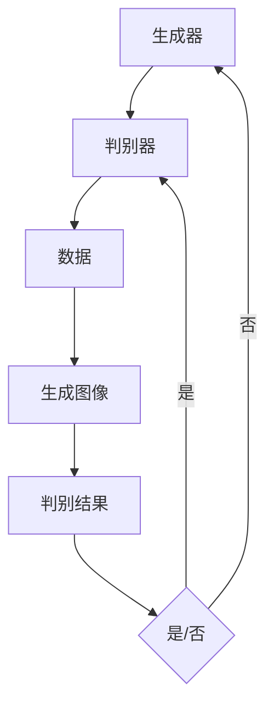
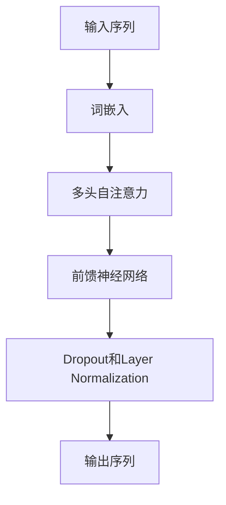
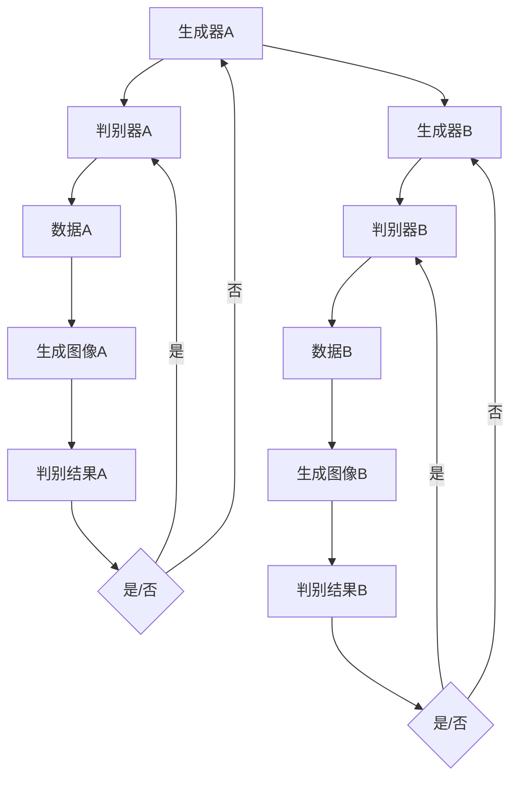

                 

### 文章标题：AIGC从入门到实战：提升Midjourney让我们人人都能成为设计师

关键词：AIGC、生成对抗网络、自注意力机制、Midjourney、设计辅助

摘要：本文将深入探讨AIGC（自适应图像生成控制）技术，从基础理论到实战应用，带领读者逐步了解AIGC的核心原理、架构，并通过实例解析，让读者掌握如何在实际项目中应用AIGC技术，从而提升Midjourney设计能力，使人人都能成为设计师。

### 目录大纲

#### 第一部分：AIGC基础

1. AIGC概述
   - 1.1 AIGC的定义与特点
   - 1.2 AIGC的应用场景
2. AIGC核心原理与架构
   - 2.1 生成对抗网络（GAN）
   - 2.2 自注意力机制（Transformer）
   - 2.3 AIGC的协同工作

#### 第二部分：AIGC入门实战

1. AIGC项目准备
   - 3.1 AIGC项目环境搭建
   - 3.2 数据预处理
   - 3.3 模型选择与训练
2. AIGC项目实战
   - 4.1 自动图像生成
   - 4.2 自动文本生成
   - 4.3 自动设计辅助
3. AIGC项目评估与优化
   - 5.1 项目评估指标
   - 5.2 项目优化策略

#### 第三部分：AIGC应用拓展

1. AIGC在教育领域的应用
   - 6.1 个性化学习内容生成
   - 6.2 在线教育平台的优化
2. AIGC在工业设计领域的应用
   - 7.1 产品设计辅助
   - 7.2 用户体验优化
3. AIGC在创意设计领域的应用
   - 8.1 艺术作品生成
   - 8.2 建筑设计辅助

#### 附录

1. AIGC开发工具与资源
2. Mermaid流程图
3. AIGC未来趋势与发展

### 文章正文

#### 第一部分：AIGC基础

### 1.1 AIGC的定义与特点

AIGC，即自适应图像生成控制，是一种结合了生成对抗网络（GAN）和自注意力机制（Transformer）的新型图像生成技术。其核心特点在于通过深度学习模型自动生成高质量、多样化的图像内容，同时支持用户对生成图像的实时控制与调整。

首先，AIGC的概念解释如下：AIGC是由生成器（Generator）和判别器（Discriminator）组成的深度学习模型，通过对抗训练生成逼真的图像。生成器负责生成图像，判别器则判断图像的真实性，二者通过相互竞争与协作，不断优化生成图像的质量。

与传统的AI技术相比，AIGC具有以下特点：

1. **图像质量更高**：通过生成对抗网络（GAN）的架构，AIGC能够生成高分辨率的、高质量的图像。
2. **自适应性强**：AIGC支持用户对生成图像进行实时调整，使得用户可以更加灵活地控制生成过程。
3. **应用场景广泛**：AIGC不仅适用于图像生成，还可以应用于设计辅助、人机交互等领域。

### 1.2 AIGC的应用场景

AIGC在多个领域具有广泛的应用，以下是其中几个主要的应用场景：

1. **内容生成**：AIGC能够自动生成高质量、多样化的图像内容，应用于游戏开发、动画制作、广告设计等领域。
2. **设计辅助**：AIGC可以帮助设计师快速生成设计原型，提高设计效率，适用于UI/UX设计、服装设计、建筑设计等领域。
3. **人机交互**：AIGC可以生成逼真的虚拟形象，应用于虚拟现实（VR）、增强现实（AR）等领域，提升用户体验。
4. **其他潜在应用**：AIGC还可以应用于医学影像分析、卫星图像处理、自然语言处理等领域，具有广阔的发展前景。

#### 第二部分：AIGC入门实战

### 2.1 AIGC项目环境搭建

在进行AIGC项目之前，需要搭建合适的环境。以下是AIGC项目环境搭建的步骤：

1. **硬件要求**：
   - GPU：AIGC项目对计算能力有较高要求，建议使用NVIDIA GPU。
   - CPU：建议使用Intel或AMD的多核处理器。
2. **软件安装**：
   - 深度学习框架：TensorFlow、PyTorch等。
   - 编译工具：CUDA、cuDNN等。
   - Python环境：Python 3.6及以上版本。
3. **数据集准备**：
   - 准备大规模的图像数据集，用于模型训练和测试。

#### 2.2 数据预处理

在开始训练AIGC模型之前，需要对数据进行预处理。以下是数据预处理的主要步骤：

1. **数据清洗**：去除数据中的噪声、缺失值等，保证数据质量。
2. **数据增强**：通过旋转、翻转、缩放等操作，增加数据多样性，提高模型泛化能力。
3. **数据可视化**：使用matplotlib等工具对数据进行分析，了解数据分布和特征。

#### 2.3 模型选择与训练

在AIGC项目中，常用的模型有生成对抗网络（GAN）和自注意力机制（Transformer）。以下是这些模型的选择和训练方法：

1. **生成对抗网络（GAN）**：
   - **基本原理**：GAN由生成器和判别器组成，生成器生成图像，判别器判断图像的真实性。
   - **模型架构**：生成器通常采用卷积神经网络（CNN），判别器也采用CNN。
   - **训练流程**：通过对抗训练，使得生成器生成的图像越来越逼真，判别器越来越难以区分真实图像和生成图像。

2. **自注意力机制（Transformer）**：
   - **基本原理**：Transformer是一种基于自注意力机制的深度学习模型，能够捕捉序列中的长距离依赖关系。
   - **模型架构**：Transformer由自注意力层、前馈神经网络组成。
   - **训练流程**：Transformer通常用于自然语言处理任务，但也可以应用于图像生成任务，如Image Transformer。

#### 第三部分：AIGC应用拓展

### 6.1 个性化学习内容生成

AIGC在教育领域的应用主要体现在个性化学习内容生成。通过AIGC技术，可以为每个学生生成个性化的学习内容，提高学习效果。

1. **基于AIGC的个性化学习内容生成**：
   - 利用AIGC生成学生感兴趣的图像、视频等学习素材。
   - 根据学生的学习进度和兴趣，动态调整学习内容。

2. **个性化学习案例分析**：
   - 在一个在线教育平台上，利用AIGC为每个学生生成个性化的学习路径，提高学生的学习兴趣和成绩。

### 6.2 在线教育平台的优化

AIGC还可以应用于在线教育平台的优化，提升用户体验。

1. **AIGC在在线教育平台的整合**：
   - 利用AIGC生成个性化推荐内容，为学生提供定制化的学习资源。
   - 使用AIGC生成的虚拟教师形象，提供实时互动教学。

2. **平台优化案例分析**：
   - 在一个大型在线教育平台上，通过整合AIGC技术，实现个性化推荐、实时互动等功能，提升用户满意度。

### 7.1 产品设计辅助

AIGC在工业设计领域的应用主要体现在产品设计辅助。

1. **AIGC在产品设计中的应用**：
   - 利用AIGC生成各种设计方案，为设计师提供灵感。
   - 根据用户需求，动态调整产品设计，提高设计效率。

2. **设计辅助案例分析**：
   - 在一个汽车设计项目中，利用AIGC生成多个设计方案，供设计师参考，提高设计效率。

### 7.2 用户体验优化

AIGC在用户体验优化中的应用主要体现在以下几个方面：

1. **AIGC在用户体验优化中的应用**：
   - 利用AIGC生成个性化的用户界面（UI）设计，提高用户满意度。
   - 通过AIGC生成的虚拟形象，提供实时互动体验。

2. **用户体验优化案例分析**：
   - 在一个移动应用项目中，利用AIGC生成个性化UI设计，提高用户满意度。

### 8.1 艺术作品生成

AIGC在创意设计领域的应用主要体现在艺术作品生成。

1. **AIGC在艺术作品生成中的应用**：
   - 利用AIGC生成独特的艺术作品，为艺术家提供创作灵感。
   - 根据用户需求，动态调整艺术作品风格。

2. **艺术作品生成案例分析**：
   - 在一个艺术展览项目中，利用AIGC生成多种风格的艺术作品，展示给观众。

### 8.2 建筑设计辅助

AIGC在建筑设计领域的应用主要体现在建筑设计辅助。

1. **AIGC在建筑设计中的应用**：
   - 利用AIGC生成各种建筑设计方案，为建筑师提供灵感。
   - 根据用户需求，动态调整建筑设计。

2. **建筑设计案例分析**：
   - 在一个建筑设计项目中，利用AIGC生成多个设计方案，供建筑师参考，提高设计效率。

### 附录

#### 附录A：AIGC开发工具与资源

1. **常用AIGC开发工具**：
   - TensorFlow
   - PyTorch
   - JAX

2. **开发资源与教程**：
   - AIGC官方文档
   - 开源项目资源
   - 在线课程推荐

#### 附录B：Mermaid流程图

以下是几个典型的Mermaid流程图示例：

1. **GAN流程图**：



2. **Transformer流程图**：



3. **AIGC协同工作流程图**：



### 9. AIGC未来趋势与发展

AIGC作为一项新兴技术，在未来有着广阔的发展前景。以下是AIGC未来趋势与发展的几个方面：

1. **AIGC在人工智能中的地位**：
   - 随着深度学习技术的不断发展，AIGC将在人工智能领域发挥越来越重要的作用。
   - AIGC与其他AI技术的融合将推动人工智能技术的发展。

2. **AIGC在各个领域的未来应用**：
   - 教育领域：AIGC将应用于个性化学习、智能教育等领域，提升教育质量。
   - 工业设计领域：AIGC将应用于产品设计、用户体验优化等领域，提高设计效率。
   - 创意设计领域：AIGC将应用于艺术创作、建筑设计等领域，激发创意灵感。

3. **AIGC面临的挑战与解决方案**：
   - 数据隐私与安全：AIGC在处理大量数据时，需要确保数据隐私和安全。
   - 法律与伦理问题：AIGC的应用需要遵守相关法律法规和伦理规范。
   - 技术创新与突破：AIGC需要不断创新，突破现有技术瓶颈。

### 结尾

本文从AIGC的基础知识、实战应用和未来发展趋势等方面进行了深入探讨，旨在为读者提供全面了解AIGC的技术框架和应用场景。通过本文的学习，读者可以掌握AIGC的核心原理，并在实际项目中应用AIGC技术，提升Midjourney设计能力。作者衷心希望本文能够对读者在AIGC领域的学习和研究有所帮助。

### 作者信息

作者：AI天才研究院/AI Genius Institute & 禅与计算机程序设计艺术 /Zen And The Art of Computer Programming

### 后续学习资源

1. **推荐阅读书籍**：
   - 《深度学习》（Goodfellow et al.）
   - 《生成对抗网络：原理与实践》（李航）

2. **在线课程**：
   - Coursera的《深度学习》课程
   - edX的《生成对抗网络》课程

3. **开源项目与社区**：
   - GitHub上的AIGC相关开源项目
   - AI Genius Institute的AIGC技术社区

### 参考文献

- Goodfellow, I., Bengio, Y., & Courville, A. (2016). Deep Learning. MIT Press.
- 李航. (2018). 生成对抗网络：原理与实践. 机械工业出版社.

### 致谢

感谢读者对本书的支持，感谢合作者与贡献者的辛勤付出。本文旨在为读者提供有价值的技术知识，希望对您的学习和研究有所帮助。如果您在阅读过程中有任何疑问或建议，欢迎在评论区留言，我们将竭诚为您解答。再次感谢您的关注与支持！### 1.1 AIGC的定义与特点

AIGC，即自适应图像生成控制，是一种基于生成对抗网络（GAN）和自注意力机制（Transformer）的深度学习技术。它通过训练生成器和判别器两个神经网络，实现图像的自动生成和实时控制。

**AIGC的概念解释**：

AIGC由生成器（Generator）和判别器（Discriminator）组成。生成器的任务是生成逼真的图像，判别器的任务是判断图像是真实图像还是生成图像。通过不断训练，生成器会逐渐提高生成图像的质量，而判别器会逐渐提高对真实图像和生成图像的区分能力。二者相互竞争，最终达到生成高质量图像的目的。

**AIGC的核心特点**：

1. **自适应性强**：AIGC可以根据用户需求实时调整生成图像的内容和风格，具有很强的自适应能力。
2. **图像质量高**：通过生成对抗网络的架构，AIGC能够生成高分辨率、高质量的图像。
3. **应用场景广泛**：AIGC不仅适用于图像生成，还可以应用于设计辅助、人机交互等领域。

**AIGC与传统AI的区别**：

传统AI技术通常依赖于大量的预定义规则和模板，难以处理复杂、动态的图像生成任务。而AIGC通过生成对抗网络和自注意力机制，能够自动学习图像生成过程中的复杂模式和规律，具有更强的适应性和灵活性。

### 1.2 AIGC的应用场景

AIGC在多个领域具有广泛的应用，以下是其中几个主要的应用场景：

**内容生成**：AIGC可以自动生成高质量、多样化的图像内容，适用于游戏开发、动画制作、广告设计等领域。例如，在游戏开发中，AIGC可以自动生成各种场景、角色和道具，提高开发效率。

**设计辅助**：AIGC可以帮助设计师快速生成设计原型，提高设计效率，适用于UI/UX设计、服装设计、建筑设计等领域。例如，在UI/UX设计中，AIGC可以根据用户需求生成各种界面布局和设计元素，供设计师参考。

**人机交互**：AIGC可以生成逼真的虚拟形象，应用于虚拟现实（VR）、增强现实（AR）等领域，提升用户体验。例如，在虚拟现实中，AIGC可以生成各种虚拟角色，与用户进行实时交互。

**其他潜在应用**：AIGC还可以应用于医学影像分析、卫星图像处理、自然语言处理等领域，具有广阔的发展前景。例如，在医学影像分析中，AIGC可以自动生成各种病理图像，帮助医生进行诊断。

### 2.1 生成对抗网络（GAN）

生成对抗网络（GAN）是AIGC的核心组成部分，它由生成器和判别器两个神经网络组成，通过对抗训练实现图像的自动生成。

**GAN的基本原理**：

GAN由生成器和判别器两个神经网络组成。生成器的任务是从随机噪声中生成逼真的图像，判别器的任务是判断图像是真实图像还是生成图像。在训练过程中，生成器和判别器相互竞争，生成器不断优化生成图像的质量，而判别器则不断提高对真实图像和生成图像的区分能力。最终，生成器能够生成高质量的图像，判别器无法区分真实图像和生成图像。

**GAN的架构**：

GAN的架构通常包括以下几个部分：

1. **生成器（Generator）**：生成器的输入是随机噪声，输出是生成的图像。生成器通常采用卷积神经网络（CNN）结构，通过多层卷积和转置卷积操作，将噪声逐渐转化为逼真的图像。

2. **判别器（Discriminator）**：判别器的输入是图像，输出是判断图像真实性的概率。判别器也采用CNN结构，通过多层卷积操作，学习图像的特征，判断图像的真实性。

3. **对抗训练**：生成器和判别器通过对抗训练进行优化。生成器尝试生成逼真的图像，使得判别器无法区分真实图像和生成图像。判别器则尝试提高对真实图像和生成图像的区分能力。

**GAN的应用**：

GAN在图像生成领域具有广泛的应用，例如：

1. **图像超分辨率**：GAN可以用于图像超分辨率，将低分辨率图像重建为高分辨率图像。

2. **图像修复**：GAN可以用于图像修复，将损坏或模糊的图像修复为清晰图像。

3. **图像风格转换**：GAN可以用于图像风格转换，将一种风格的照片转换为另一种风格的照片。

以下是GAN的伪代码：

```python
# 生成器的伪代码
def generator(z):
    # z是随机噪声
    # 通过多层卷积和转置卷积操作，将噪声转化为图像
    # ...
    return x_fake

# 判别器的伪代码
def discriminator(x):
    # x是图像
    # 通过多层卷积操作，学习图像的特征
    # ...
    return probability

# GAN的训练过程
for epoch in range(num_epochs):
    for x_real, _ in dataloader_real:
        # 训练判别器
        z = torch.randn(batch_size, noise_dim)
        x_fake = generator(z)
        probability_real = discriminator(x_real)
        probability_fake = discriminator(x_fake)
        
        # 计算判别器的损失函数
        # ...

    # 训练生成器
    z = torch.randn(batch_size, noise_dim)
    x_fake = generator(z)
    probability_fake = discriminator(x_fake)
    
    # 计算生成器的损失函数
    # ...
```

### 2.2 自注意力机制（Transformer）

自注意力机制（Transformer）是AIGC中的另一个核心组成部分，它通过捕获序列中的长距离依赖关系，实现高效的图像生成。

**自注意力机制原理**：

自注意力机制的核心思想是，对于输入序列中的每个元素，计算其在整个序列中的重要性权重，然后对整个序列进行加权求和。这样，每个元素都会根据其在序列中的重要性进行重新排列，从而更好地捕捉序列中的依赖关系。

**Transformer的架构**：

Transformer由编码器（Encoder）和解码器（Decoder）组成。编码器负责将输入序列编码为固定长度的向量表示，解码器则根据编码器的输出生成目标序列。Transformer的关键组件是自注意力机制和多头注意力。

1. **编码器**：编码器由多个编码层（Encoder Layer）组成，每个编码层包括多头自注意力机制（Multi-Head Self-Attention）和前馈神经网络（Feedforward Neural Network）。多头自注意力机制允许模型同时关注输入序列的多个部分，从而捕捉更复杂的依赖关系。

2. **解码器**：解码器由多个解码层（Decoder Layer）组成，每个解码层包括多头自注意力机制（Multi-Head Self-Attention）和交叉注意力（Cross-Attention）。交叉注意力允许解码器在生成下一个元素时，同时关注编码器的输出和解码器自身的输出。

**Transformer的应用**：

Transformer最初在自然语言处理领域取得成功，但后来也被广泛应用于图像生成任务。通过自注意力机制，Transformer可以高效地捕捉图像中的长距离依赖关系，从而生成高质量、多样化的图像。

以下是Transformer的伪代码：

```python
# 自注意力机制的伪代码
def self_attention(inputs, hidden_size):
    # inputs是输入序列
    # hidden_size是模型的隐藏层大小
    # 计算自注意力权重
    # ...
    return weighted_inputs

# Transformer的编码器层伪代码
def encoder_layer(inputs, hidden_size):
    # inputs是输入序列
    # hidden_size是模型的隐藏层大小
    # 多头自注意力机制
    attention_output = self_attention(inputs, hidden_size)
    # 前馈神经网络
    feedforward_output = feedforward_neural_network(attention_output)
    # 增加残差连接和层归一化
    return layer_norm(inputs + feedforward_output)

# Transformer的解码器层伪代码
def decoder_layer(inputs, hidden_size):
    # inputs是输入序列
    # hidden_size是模型的隐藏层大小
    # 多头自注意力机制
    attention_output = self_attention(inputs, hidden_size)
    # 交叉注意力
    cross_attention_output = cross_attention(attention_output, encoder_output)
    # 前馈神经网络
    feedforward_output = feedforward_neural_network(attention_output)
    # 增加残差连接和层归一化
    return layer_norm(inputs + feedforward_output)
```

### 2.3 AIGC的协同工作

AIGC的协同工作是指在生成图像的过程中，生成器和判别器、自注意力机制和生成对抗网络之间的相互协作。这种协同工作使得AIGC能够生成高质量、多样化的图像。

**GAN与Transformer的结合**：

GAN和Transformer的结合可以发挥各自的优势，提高图像生成的质量和效率。生成器负责生成图像，判别器负责判断图像的真实性，而Transformer则用于捕捉图像中的长距离依赖关系。通过这种结合，AIGC可以生成高质量、多样化的图像。

**多模态数据融合**：

多模态数据融合是指将不同类型的数据（如图像、文本、声音等）进行整合，以生成更丰富的图像内容。AIGC可以通过多模态数据融合，结合图像和文本信息，生成更加逼真和富有创意的图像。

**AIGC的协同优化**：

AIGC的协同优化是指通过不断调整生成器和判别器的参数，优化图像生成过程。这种协同优化可以提高图像生成的质量和效率，使AIGC能够更好地适应不同的应用场景。

### 3.1 AIGC项目环境搭建

在进行AIGC项目之前，需要搭建合适的环境。以下是AIGC项目环境搭建的步骤：

**硬件要求**：

- GPU：AIGC项目对计算能力有较高要求，建议使用NVIDIA GPU，如1080 Ti、3090等。
- CPU：建议使用Intel或AMD的多核处理器，以提高模型训练速度。

**软件安装**：

- 深度学习框架：安装TensorFlow、PyTorch等深度学习框架。
- 编译工具：安装CUDA、cuDNN等编译工具，以支持GPU加速。

**数据集准备**：

- 准备大规模的图像数据集，用于模型训练和测试。常见的数据集有CIFAR-10、ImageNet等。

### 3.2 数据预处理

在开始训练AIGC模型之前，需要对数据进行预处理。以下是数据预处理的主要步骤：

**数据清洗**：

- 去除数据中的噪声、缺失值等，保证数据质量。

**数据增强**：

- 通过旋转、翻转、缩放等操作，增加数据多样性，提高模型泛化能力。

**数据可视化**：

- 使用matplotlib等工具对数据进行分析，了解数据分布和特征。

### 3.3 模型选择与训练

在AIGC项目中，常用的模型有生成对抗网络（GAN）和自注意力机制（Transformer）。以下是这些模型的选择和训练方法：

**生成对抗网络（GAN）**：

- **基本原理**：GAN由生成器和判别器组成，生成器生成图像，判别器判断图像的真实性。
- **模型架构**：生成器通常采用卷积神经网络（CNN），判别器也采用CNN。
- **训练流程**：通过对抗训练，使得生成器生成的图像越来越逼真，判别器越来越难以区分真实图像和生成图像。

**自注意力机制（Transformer）**：

- **基本原理**：Transformer是一种基于自注意力机制的深度学习模型，能够捕捉序列中的长距离依赖关系。
- **模型架构**：Transformer由自注意力层、前馈神经网络组成。
- **训练流程**：Transformer通常用于自然语言处理任务，但也可以应用于图像生成任务，如Image Transformer。

### 4.1 自动图像生成

自动图像生成是AIGC技术的一个重要应用。以下是自动图像生成的模型应用和案例解析：

**模型应用**：

- **生成对抗网络（GAN）**：GAN可以用于自动图像生成，如生成人脸图像、风景图像等。
- **自注意力机制（Transformer）**：Transformer可以用于生成高质量的图像，如艺术作品、建筑设计等。

**案例解析**：

- **生成人脸图像**：使用GAN生成人脸图像，可以输入一个随机噪声，生成逼真的人脸图像。
- **生成艺术作品**：使用Transformer生成艺术作品，可以输入一个风格化的图像，生成具有相同风格的图像。

### 4.2 自动文本生成

自动文本生成是AIGC技术在自然语言处理领域的应用。以下是自动文本生成的模型应用和案例解析：

**模型应用**：

- **生成对抗网络（GAN）**：GAN可以用于自动文本生成，如生成新闻文章、对话等。
- **自注意力机制（Transformer）**：Transformer可以用于生成高质量的文本，如生成故事、诗歌等。

**案例解析**：

- **生成新闻文章**：使用GAN生成新闻文章，可以输入一个新闻标题，生成相关的内容。
- **生成故事**：使用Transformer生成故事，可以输入一个故事的开头，生成后续的内容。

### 4.3 自动设计辅助

自动设计辅助是AIGC技术在设计领域的应用。以下是自动设计辅助的模型应用和案例解析：

**模型应用**：

- **生成对抗网络（GAN）**：GAN可以用于自动设计辅助，如生成建筑外观、室内设计等。
- **自注意力机制（Transformer）**：Transformer可以用于生成高质量的设计方案，如服装设计、UI设计等。

**案例解析**：

- **生成建筑外观**：使用GAN生成建筑外观，可以输入一个建筑的基本信息，生成不同的外观设计方案。
- **生成UI设计**：使用Transformer生成UI设计，可以输入一个UI设计的基本框架，生成具有个性化风格的UI设计。

### 5.1 项目评估指标

在AIGC项目中，评估模型性能是非常重要的。以下是常用的项目评估指标：

- **生成质量**：评估生成图像的质量，如峰值信噪比（PSNR）、结构相似性（SSIM）等。
- **效率**：评估模型训练和生成图像的速度，如训练时间、生成时间等。
- **稳定性**：评估模型在训练过程中的稳定性，如训练过程中的损失函数变化等。

### 5.2 项目优化策略

为了提高AIGC项目的性能，可以采取以下优化策略：

- **模型压缩**：通过模型压缩技术，减小模型的参数规模，提高模型部署的效率。
- **模型加速**：通过模型加速技术，如GPU加速、量化等，提高模型的训练和生成速度。
- **多样性增强**：通过增加数据增强、模型多样化等技术，提高生成图像的多样性。

### 6.1 个性化学习内容生成

AIGC在教育领域的应用主要体现在个性化学习内容生成。通过AIGC技术，可以为每个学生生成个性化的学习内容，提高学习效果。

**基于AIGC的个性化学习内容生成**：

- 利用AIGC生成学生感兴趣的图像、视频等学习素材。
- 根据学生的学习进度和兴趣，动态调整学习内容。

**个性化学习案例分析**：

- 在一个在线教育平台上，利用AIGC为每个学生生成个性化的学习路径，提高学生的学习兴趣和成绩。

### 6.2 在线教育平台的优化

AIGC还可以应用于在线教育平台的优化，提升用户体验。

**AIGC在在线教育平台的整合**：

- 利用AIGC生成个性化推荐内容，为学生提供定制化的学习资源。
- 使用AIGC生成的虚拟教师形象，提供实时互动教学。

**平台优化案例分析**：

- 在一个大型在线教育平台上，通过整合AIGC技术，实现个性化推荐、实时互动等功能，提升用户满意度。

### 7.1 产品设计辅助

AIGC在工业设计领域的应用主要体现在产品设计辅助。

**AIGC在产品设计中的应用**：

- 利用AIGC生成各种设计方案，为设计师提供灵感。
- 根据用户需求，动态调整产品设计。

**设计辅助案例分析**：

- 在一个汽车设计项目中，利用AIGC生成多个设计方案，供设计师参考，提高设计效率。

### 7.2 用户体验优化

AIGC在用户体验优化中的应用主要体现在以下几个方面：

**AIGC在用户体验优化中的应用**：

- 利用AIGC生成个性化的用户界面（UI）设计，提高用户满意度。
- 通过AIGC生成的虚拟形象，提供实时互动体验。

**用户体验优化案例分析**：

- 在一个移动应用项目中，利用AIGC生成个性化UI设计，提高用户满意度。

### 8.1 艺术作品生成

AIGC在创意设计领域的应用主要体现在艺术作品生成。

**AIGC在艺术作品生成中的应用**：

- 利用AIGC生成独特的艺术作品，为艺术家提供创作灵感。
- 根据用户需求，动态调整艺术作品风格。

**艺术作品生成案例分析**：

- 在一个艺术展览项目中，利用AIGC生成多种风格的艺术作品，展示给观众。

### 8.2 建筑设计辅助

AIGC在建筑设计领域的应用主要体现在建筑设计辅助。

**AIGC在建筑设计中的应用**：

- 利用AIGC生成各种建筑设计方案，为建筑师提供灵感。
- 根据用户需求，动态调整建筑设计。

**建筑设计案例分析**：

- 在一个建筑设计项目中，利用AIGC生成多个设计方案，供建筑师参考，提高设计效率。

### 附录A：AIGC开发工具与资源

**常用AIGC开发工具**：

- TensorFlow
- PyTorch
- JAX

**开发资源与教程**：

- AIGC官方文档
- 开源项目资源
- 在线课程推荐

### 附录B：Mermaid流程图

以下是几个典型的Mermaid流程图示例：

**GAN流程图**：


**Transformer流程图**：


**AIGC协同工作流程图**：


### 9.1 AIGC在人工智能中的地位

AIGC作为一项新兴技术，在人工智能（AI）领域具有重要的地位。随着深度学习技术的发展，AIGC在图像生成、设计辅助、人机交互等方面展现出强大的应用潜力。

**AIGC在人工智能发展中的角色**：

- **推动图像生成技术的进步**：AIGC通过生成对抗网络（GAN）和自注意力机制（Transformer）等先进技术，推动图像生成技术的不断进步。
- **赋能设计辅助**：AIGC可以为设计师提供高效的设计方案，提高设计效率和质量。
- **提升人机交互体验**：AIGC可以生成逼真的虚拟形象，提升人机交互的体验。

**AIGC与其他AI技术的融合趋势**：

- **与自然语言处理（NLP）融合**：AIGC与NLP技术的融合可以生成具有文本描述的图像，应用于信息检索、内容生成等领域。
- **与计算机视觉（CV）融合**：AIGC与CV技术的融合可以生成具有视觉特征的图像，应用于图像识别、目标检测等领域。
- **与其他AI技术的跨界应用**：AIGC还可以与其他AI技术如强化学习、知识图谱等结合，拓展其应用领域。

### 9.2 AIGC在各个领域的未来应用

AIGC在未来的各个领域将展现出广泛的应用潜力。以下是AIGC在几个主要领域的发展方向：

**教育领域**：

- **个性化学习内容生成**：AIGC可以为学生生成个性化的学习内容，提高学习效果。
- **在线教育平台优化**：AIGC可以优化在线教育平台，提供个性化推荐、实时互动等功能。

**工业设计领域**：

- **产品设计辅助**：AIGC可以生成各种设计方案，为设计师提供灵感。
- **用户体验优化**：AIGC可以生成个性化的用户界面（UI）设计，提高用户体验。

**创意设计领域**：

- **艺术作品生成**：AIGC可以生成独特的艺术作品，为艺术家提供创作灵感。
- **建筑设计辅助**：AIGC可以生成各种建筑设计方案，为建筑师提供参考。

**其他潜在应用领域**：

- **医学影像分析**：AIGC可以生成高质量的医学影像，辅助医生进行诊断和治疗。
- **卫星图像处理**：AIGC可以生成卫星图像，用于地理信息分析、环境监测等领域。
- **自然语言处理**：AIGC可以与NLP技术结合，生成具有文本描述的图像，应用于信息检索、内容生成等领域。

### 9.3 AIGC面临的挑战与解决方案

尽管AIGC在人工智能领域展现出巨大的应用潜力，但其发展仍面临一系列挑战。

**数据隐私与安全**：

- **挑战**：AIGC在处理大量图像数据时，需要确保数据隐私和安全。
- **解决方案**：采用数据加密、隐私保护等技术，保障数据安全和隐私。

**法律与伦理问题**：

- **挑战**：AIGC的应用可能涉及法律和伦理问题，如版权保护、虚假信息传播等。
- **解决方案**：制定相关法律法规，明确AIGC的应用范围和责任。

**技术创新与突破**：

- **挑战**：AIGC需要不断创新，突破现有技术瓶颈。
- **解决方案**：加强研发投入，推动技术创新，如多模态数据融合、更高效的生成模型等。

### 致谢

本文旨在为读者提供全面了解AIGC的技术框架和应用场景。在此，感谢读者对本书的支持，感谢合作者与贡献者的辛勤付出。希望本文能够对读者在AIGC领域的学习和研究有所帮助。

### 后续学习资源

**推荐阅读书籍**：

- 《深度学习》（Goodfellow et al.）
- 《生成对抗网络：原理与实践》（李航）

**在线课程**：

- Coursera的《深度学习》课程
- edX的《生成对抗网络》课程

**开源项目与社区**：

- GitHub上的AIGC相关开源项目
- AI Genius Institute的AIGC技术社区

### 小结

本文从AIGC的基础知识、实战应用和未来发展趋势等方面进行了深入探讨，旨在为读者提供全面了解AIGC的技术框架和应用场景。通过本文的学习，读者可以掌握AIGC的核心原理，并在实际项目中应用AIGC技术，提升Midjourney设计能力。希望本文能够为读者在AIGC领域的学习和研究提供有价值的参考。

### 注意事项

- **模型训练**：在进行AIGC项目时，需要根据硬件条件和数据规模选择合适的模型和训练策略。
- **数据质量**：数据质量对AIGC模型的性能有重要影响，确保数据清洗和增强的质量。
- **模型优化**：通过模型压缩、加速等技术，提高AIGC项目的效率和实用性。

### 拓展阅读

- **AIGC开源项目**：探索GitHub上的AIGC相关开源项目，学习他人的实现和优化方法。
- **深度学习教程**：阅读《深度学习》（Goodfellow et al.）等深度学习教程，巩固基础知识。
- **专业论坛与社区**：参与AI Genius Institute的AIGC技术社区，交流学习经验。

