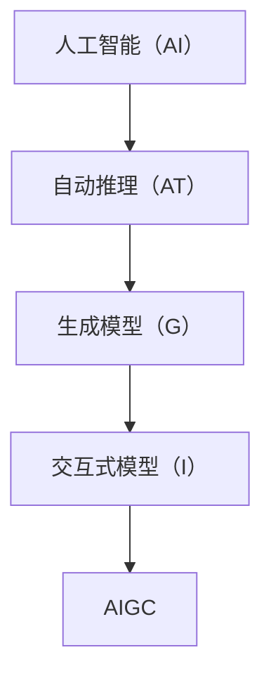
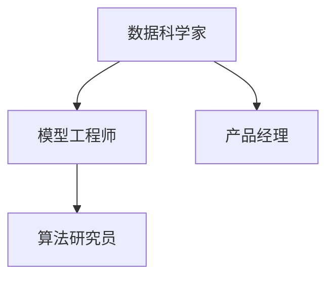
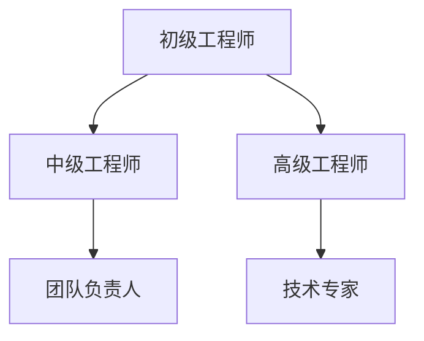
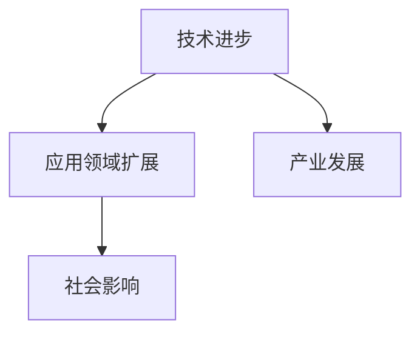

                 


### 文章标题：AIGC从入门到实战：焦虑：AIGC时代下的职业该如何规划

#### 关键词：AIGC，人工智能生成控制，职业规划，技术基础，实战技巧

#### 摘要：
随着人工智能生成控制（AIGC）技术的飞速发展，人们对这一新兴领域的认知逐渐深入。本文旨在为读者提供AIGC从入门到实战的全面指导，探讨AIGC时代下的职业规划，帮助读者应对这一技术变革带来的焦虑。通过深入解析AIGC的核心概念、技术原理、应用场景、实战技巧以及职业发展路径，本文希望能够为从事或有意从事AIGC领域的从业者提供有价值的参考。

### 引言

#### 1. 引言
人工智能生成控制（AIGC，Artificial Intelligence Generated Control）是一种利用人工智能技术自动生成内容的方法。AIGC结合了计算机视觉、自然语言处理等领域的先进算法，通过生成对抗网络（GAN）、递归神经网络（RNN）等模型，实现了从文本、图像到视频等多种类型数据的自动生成。

随着AIGC技术的不断成熟，其在各行各业的应用越来越广泛，从内容创作、游戏设计到医疗诊断、金融分析等，都取得了显著的成果。然而，这一技术的发展也带来了职业规划的挑战，许多从业者开始感到焦虑，担心自己的职业前景。

#### 2. AIGC的概念与特点
AIGC的核心在于“自动生成”，其特点包括：

- **数据驱动**：AIGC依赖于大规模的数据集进行训练，通过学习数据特征，生成新的内容。
- **多模态**：AIGC能够处理多种类型的数据，如文本、图像、音频和视频，实现跨模态的生成。
- **灵活高效**：AIGC技术可以根据需求快速生成个性化内容，提高生产效率。

#### 3. AIGC时代下的职业焦虑
AIGC技术的快速发展让许多从业者感到不安，主要表现在以下几个方面：

- **技术更新快**：AIGC技术更新迅速，要求从业者不断学习新知识，保持技术领先。
- **职业竞争激烈**：随着AIGC的普及，市场上的职位竞争加剧，从业者需要不断提升自己的竞争力。
- **未来不确定性**：AIGC技术对传统职业的影响未知，从业者担心自己的职业前景。

### AIGC技术基础

#### 第1章：AIGC核心概念与架构

**核心概念与联系：**

AIGC的核心概念包括人工智能（AI）、自动推理（AT）、生成模型（G）和交互式模型（I）。这些概念相互关联，共同构成了AIGC的技术架构。

**核心算法原理讲解：**

#### 1.1 AIGC的定义
AIGC是一种利用人工智能技术自动生成内容的方法，它结合了计算机视觉、自然语言处理等领域的先进算法，通过生成对抗网络（GAN）、递归神经网络（RNN）等模型，实现了从文本、图像到视频等多种类型数据的自动生成。

**1.2 AIGC的架构**
AIGC的架构通常包括以下几个关键部分：

- 数据预处理：对输入数据进行处理，包括数据清洗、归一化、数据增强等。
- 模型训练：利用训练数据集对生成模型和交互式模型进行训练。
- 模型优化：通过调整模型参数，提高模型生成内容的质量和效率。
- 模型部署：将训练好的模型部署到实际应用场景中，实现自动生成。

**1.3 AIGC的关键技术**
AIGC的关键技术主要包括：

- 生成对抗网络（GAN）：GAN是一种深度学习模型，通过生成器和判别器的对抗训练，实现高质量数据的生成。
- 递归神经网络（RNN）：RNN是一种适用于序列数据处理的人工神经网络，能够捕捉时间序列中的依赖关系。
- 自适应交互技术：通过自适应交互技术，AIGC能够根据用户需求实时生成个性化内容。

#### 第2章：AIGC技术原理

**核心算法原理讲解：**

#### 2.1 计算机视觉技术
计算机视觉技术是AIGC中的重要组成部分，它涉及到图像识别、图像生成、图像分割等多个方面。

##### 2.1.1 卷积神经网络（CNN）原理
卷积神经网络（CNN）是一种专门用于处理图像数据的神经网络，其核心思想是通过卷积操作提取图像特征。

CNN模型结构伪代码：
```python
class ConvolutionalNeuralNetwork(nn.Module):
    def __init__(self):
        super(ConvolutionalNeuralNetwork, self).__init__()
        self.conv1 = nn.Conv2d(in_channels=3, out_channels=64, kernel_size=3, padding=1)
        self.relu = nn.ReLU()
        self.max_pool2d = nn.MaxPool2d(kernel_size=2, stride=2)
        
    def forward(self, x):
        x = self.relu(self.conv1(x))
        x = self.max_pool2d(x)
        return x
```
数学模型和数学公式：
生成模型损失函数：$$L_G = -\log(D(G(z)))$$
判别模型损失函数：$$L_D = -\log(D(x)) - \log(1 - D(G(z)))$$

举例说明：
使用GAN生成人脸图像的案例，包括数据准备、模型训练、图像生成的详细步骤。

##### 2.1.2 生成对抗网络（GAN）原理
生成对抗网络（GAN）是一种深度学习模型，由生成器和判别器组成，通过对抗训练实现高质量数据的生成。

GAN模型结构伪代码：
```python
class Generator(nn.Module):
    def __init__(self):
        super(Generator, self).__init__()
        # 生成器模型定义
    
    def forward(self, z):
        # 生成图像
        return x

class Discriminator(nn.Module):
    def __init__(self):
        super(Discriminator, self).__init__()
        # 判别器模型定义
    
    def forward(self, x):
        # 判断真实或生成图像
        return output
```
数学模型和数学公式：
生成模型损失函数：$$L_G = -\log(D(G(z)))$$
判别模型损失函数：$$L_D = -\log(D(x)) - \log(1 - D(G(z)))$$

举例说明：
使用GAN生成人脸图像的案例，包括数据准备、模型训练、图像生成的详细步骤。

#### 2.2 自然语言处理技术
自然语言处理（NLP）是AIGC中的重要组成部分，它涉及到文本生成、文本分类、机器翻译等多个方面。

##### 2.2.1 递归神经网络（RNN）原理
递归神经网络（RNN）是一种专门用于处理序列数据的人工神经网络，其核心思想是通过递归结构捕捉时间序列中的依赖关系。

RNN模型结构伪代码：
```python
class RNN(nn.Module):
    def __init__(self, input_dim, hidden_dim, output_dim):
        super(RNN, self).__init__()
        self.hidden_dim = hidden_dim
        self.rnn = nn.RNN(input_dim, hidden_dim)
        self.fc = nn.Linear(hidden_dim, output_dim)
        
    def forward(self, x, hidden):
        out, hidden = self.rnn(x, hidden)
        out = self.fc(out[-1, :, :])
        return out, hidden
```
数学模型和数学公式：
生成式模型概率分布：$$P(X | \theta)$$
判别式模型分类函数：$$f(x, \theta) = \arg\max_y P(Y = y | X, \theta)$$

举例说明：
使用RNN进行语言建模的案例，包括数据处理、模型训练和文本生成的详细步骤。

##### 2.2.2 生成式模型与判别式模型原理
生成式模型和判别式模型是AIGC中的核心组件，它们分别用于生成数据和处理数据。

生成式模型通常使用概率分布来表示数据，例如Gaussian分布或Dirichlet分布。

判别式模型则用于判断输入数据的真实性或分类问题，常见的有支持向量机（SVM）和决策树（DT）。

数学模型和数学公式：
生成式模型概率分布：$$P(X | \theta)$$
判别式模型分类函数：$$f(x, \theta) = \arg\max_y P(Y = y | X, \theta)$$

举例说明：
使用生成式模型进行文本生成，使用判别式模型进行文本分类的详细步骤。

#### 第3章：AIGC应用场景

**项目实战：**

##### 3.1 文本生成与应用
文本生成是AIGC技术的一个重要应用场景，它可以用于自动写作、机器翻译、对话系统等。

##### 3.1.1 自动写作
使用GPT-2模型生成文章，包括数据准备、模型训练和文本生成的详细步骤。

##### 3.1.2 自动翻译
使用机器翻译模型进行中英翻译，包括数据处理、模型训练和翻译过程的详细步骤。

##### 3.2 图像生成与应用
图像生成是AIGC技术的另一个重要应用场景，它可以用于艺术创作、图像修复、图像超分辨率等。

##### 3.2.1 艺术作品生成
使用StyleGAN2模型生成艺术作品，包括数据准备、模型训练和图像生成的详细步骤。

##### 3.2.2 视频编辑
使用视频生成模型进行视频编辑，包括数据处理、模型训练和视频生成的详细步骤。

#### 第4章：AIGC实战技巧

**项目实战：**

##### 4.1 AIGC项目开发流程
AIGC项目的开发流程包括数据准备、模型训练、模型优化和模型部署等阶段。

##### 4.1.1 数据准备与处理
数据准备是AIGC项目开发的基础，包括数据清洗、归一化和数据增强等步骤。

##### 4.1.2 模型训练与优化
模型训练是AIGC项目的核心，通过训练数据集优化模型参数，提高模型生成质量。

##### 4.1.3 模型部署与运维
模型部署是将训练好的模型部署到生产环境中，实现实际应用。同时，需要进行模型监控和运维，确保模型稳定运行。

##### 4.2 AIGC常见问题与解决方案
AIGC项目在开发过程中可能会遇到一些问题，如数据不足、模型过拟合等。本节将讨论这些问题，并提供相应的解决方案。

##### 4.2.1 数据问题
- **数据量不足**：解决方法包括数据增强、数据集扩充和使用预训练模型。
- **数据质量问题**：解决方法包括数据清洗、数据标注和质量评估。

##### 4.2.2 模型训练问题
- **模型过拟合**：解决方法包括增加训练数据、使用正则化和调整学习率。
- **训练时间过长**：解决方法包括模型压缩、分布式训练和迁移学习。

#### 第5章：AIGC时代下的职业机会

**核心概念与联系：**

AIGC时代为各个领域的从业者提供了丰富的职业机会。以下是对几个关键职业角色的概述：

**6.1 数据科学家**
数据科学家在AIGC时代扮演着重要角色，他们负责数据收集、预处理、分析和建模。在AIGC项目中，数据科学家需要利用其统计和机器学习技能来确保数据的质量和模型的性能。

- **角色与职责**：数据科学家负责设计实验、收集和预处理数据、构建数据模型，并解释模型结果。
- **技能要求**：熟练掌握Python、R等编程语言，熟悉数据预处理和统计分析方法，熟悉常见机器学习算法，如线性回归、决策树、随机森林等。

**6.2 模型工程师**
模型工程师专注于设计、实现和优化AI模型。他们需要结合业务需求，将理论知识转化为实际可用的解决方案。

- **角色与职责**：模型工程师负责模型设计、训练、优化和部署，以及与数据科学家、产品经理和其他团队协作。
- **技能要求**：熟练掌握深度学习框架，如TensorFlow、PyTorch等，熟悉神经网络架构设计和优化方法，具备良好的编程和调试能力。

**6.3 产品经理**
产品经理在AIGC时代负责将AI技术融入产品，确保产品满足用户需求和市场需求。

- **角色与职责**：产品经理负责产品规划、需求分析、原型设计和用户测试，协调不同团队的工作，确保产品按时交付。
- **技能要求**：熟悉用户体验设计、市场调研和产品开发流程，具备项目管理能力，能够与工程师和设计师有效沟通。

**6.4 算法研究员**
算法研究员致力于AI算法的研究和开发，推动AI技术的发展。

- **角色与职责**：算法研究员负责探索新的AI算法、优化现有算法，并撰写学术论文。
- **技能要求**：具备扎实的数学和统计学基础，熟练掌握机器学习和深度学习理论，具备较强的科研能力和学术写作能力。

#### 第6章：AIGC职业发展路径

**核心概念与联系：**

AIGC领域的职业发展路径可以分为几个阶段，每个阶段都有不同的技能要求和职业发展机会。

**7.1 从入门到专业**

**初级工程师**：初级工程师是AIGC职业发展的起点，他们通常负责项目中的基础任务，如数据预处理、模型实现和测试。

- **技能要求**：熟练掌握编程语言和基础算法，了解常见的机器学习模型，具备良好的团队合作能力。
- **职业发展机会**：随着经验的积累，初级工程师可以逐步承担更复杂的项目任务，提升自己的技术能力。

**中级工程师**：中级工程师具备较强的技术能力和项目经验，能够独立完成复杂的项目。

- **技能要求**：精通深度学习框架，熟悉多种机器学习算法，具备项目管理和协调能力。
- **职业发展机会**：中级工程师可以向团队负责人或技术专家方向发展，承担更多的技术指导和团队管理工作。

**高级工程师**：高级工程师在技术领域有深厚的积累，能够解决项目中遇到的高级问题。

- **技能要求**：具备丰富的项目经验，精通深度学习和计算机视觉等技术，具备创新思维和解决问题的能力。
- **职业发展机会**：高级工程师可以担任技术团队的负责人，负责带领团队完成重大项目。

**7.2 中级工程师到高级工程师**

在中级工程师阶段，工程师需要不断提高自己的技术水平和项目管理能力，通过参与更多的项目积累经验。以下是几个关键步骤：

- **持续学习**：跟踪最新的技术动态，学习新的算法和工具，保持技术领先。
- **项目经验**：积极参与复杂项目的开发，承担关键任务，提升解决问题的能力。
- **技术分享**：通过撰写技术博客、参加技术交流会议等方式，分享自己的经验和见解，提升个人品牌。

**7.3 从高级工程师到团队负责人**

在成为高级工程师后，工程师可以考虑向团队负责人的方向发展。团队负责人需要具备以下能力：

- **领导力**：能够带领团队完成项目，协调不同团队成员的工作。
- **沟通能力**：能够与客户、产品经理和其他团队有效沟通，确保项目顺利进行。
- **项目管理**：具备项目管理和风险控制的能力，确保项目按时交付。

**7.4 从团队负责人到技术专家**

技术专家在AIGC领域中扮演着至关重要的角色，他们不仅具备深厚的技术知识，还具备前瞻性的技术视野和创新能力。

- **技能要求**：具备广泛的AI技术知识和深厚的理论功底，能够指导团队进行技术研究和创新。
- **职业发展机会**：技术专家可以担任公司的技术总监或首席技术官（CTO），负责公司的技术战略和研发方向。

#### 第7章：AIGC未来发展展望

**核心概念与联系：**

AIGC技术的发展不仅对技术本身产生了深远影响，还推动了应用领域的扩展、产业的变革以及社会的进步。

**技术进步方向：**
AIGC技术的进步主要体现在以下几个方面：

- **算法创新**：深度学习、生成对抗网络等算法的不断发展，使得AIGC生成内容的质量和效率不断提高。
- **硬件升级**：高性能计算硬件（如GPU、TPU）的普及，为AIGC模型的大规模训练和部署提供了强大的计算支持。
- **数据积累**：随着互联网和物联网的发展，海量数据的积累为AIGC模型的训练提供了丰富的素材。

**应用领域扩展：**
AIGC技术的应用领域正不断扩展，以下是一些典型应用：

- **内容创作**：AIGC在文章、音乐、视频、绘画等领域的应用，极大地提升了内容创作效率。
- **娱乐产业**：AIGC技术被广泛应用于游戏开发、虚拟现实等领域，为用户提供了更加丰富的娱乐体验。
- **医疗健康**：AIGC在医学图像分析、疾病预测等领域展现出巨大潜力，有助于提升医疗诊断和治疗的效率。

**产业发展：**
AIGC技术的发展推动了相关产业的快速发展，以下是一些关键点：

- **产业升级**：AIGC技术为传统产业注入了新的活力，推动了产业结构的优化和升级。
- **新兴产业**：AIGC技术的快速发展催生了新的产业机会，如AI内容生成、AI咨询服务等。
- **产业链整合**：AIGC技术的普及促使产业链上下游企业进行整合，形成了更加协同的产业发展模式。

**社会影响：**
AIGC技术对社会产生了深远的影响，以下是一些方面：

- **工作效率提升**：AIGC技术提高了生产效率，减轻了劳动者的工作负担。
- **生活品质改善**：AIGC技术在智能家居、智能医疗等领域的应用，提高了人们的生活品质。
- **社会问题挑战**：AIGC技术也带来了一些社会问题，如数据隐私、算法歧视等，需要全社会共同应对。

**8.1 技术进步方向**
AIGC技术的未来发展趋势将集中在以下几个方面：

- **算法优化**：继续探索新的算法模型，提高生成内容的多样性和质量。
- **硬件协同**：充分发挥硬件性能，实现AIGC模型的高效训练和实时部署。
- **跨模态融合**：实现不同模态数据之间的有效融合，提高生成内容的丰富性和表现力。

**8.2 应用领域扩展**
随着AIGC技术的不断成熟，其应用领域将进一步扩展，涉及以下几个方向：

- **教育与培训**：利用AIGC技术生成个性化教学资源和培训内容，提升教学效果。
- **艺术创作**：AIGC技术在艺术领域的应用将更加广泛，为艺术家提供创新的创作工具。
- **交互娱乐**：AIGC技术在游戏、虚拟现实等领域的应用，将为用户带来更加沉浸式的体验。

**8.3 产业发展**
AIGC技术对产业发展的推动作用将体现在以下几个方面：

- **产业链重构**：AIGC技术将重构产业链，形成以数据、算法和硬件为核心的产业发展模式。
- **创新创业**：AIGC技术为创新创业提供了丰富的机遇，吸引了大量资本和人才涌入。
- **产业协同**：产业链上下游企业通过AIGC技术的合作，实现优势互补，共同推动产业发展。

**8.4 社会影响**
AIGC技术对社会的影响将体现在以下几个方面：

- **数字鸿沟**：AIGC技术的发展可能加剧数字鸿沟，需要全社会共同努力，确保技术普及的公平性。
- **职业变迁**：AIGC技术将对职业结构产生深远影响，需要从业者不断学习和适应新的职业要求。
- **伦理挑战**：AIGC技术的应用需要遵循伦理规范，确保技术的公平、公正和可持续性。

#### 附录

**附录 A：AIGC常用工具与资源**

**A.1 开发环境搭建：**
搭建AIGC项目开发环境是进行AIGC项目开发的第一步。以下是一些关键步骤：

- **Python环境配置**：安装Python解释器和相关依赖库。
- **深度学习框架安装**：安装常用的深度学习框架，如TensorFlow、PyTorch等。
- **其他工具和库**：安装用于数据预处理、模型训练和优化的工具和库。

**A.2 学习资源推荐：**
以下是一些推荐的AIGC学习资源：

- **技术博客**：阅读知名的AIGC技术博客，如Medium、知乎等。
- **在线课程**：参加在线课程，如Coursera、edX等。
- **学术论文**：阅读最新的AIGC学术论文，了解最新的研究动态。

**A.3 常用库和框架：**
以下是一些常用的AIGC库和框架：

- **TensorFlow**：Google开源的深度学习框架。
- **PyTorch**：Facebook开源的深度学习框架。
- **Keras**：用于构建和训练深度学习模型的简单和模块化框架。

**A.4 社群和论坛：**
加入AIGC相关的社群和论坛，与同行交流和分享经验：

- **Stack Overflow**：程序员问答社区。
- **Reddit**：AIGC技术讨论区。
- **GitHub**：AIGC项目的代码托管平台。

### 总结

本文《AIGC从入门到实战：焦虑：AIGC时代下的职业该如何规划》旨在帮助读者全面了解AIGC技术的原理和应用，掌握AIGC项目的开发技巧，并规划自己在AIGC时代的职业发展路径。通过深入解析AIGC的核心概念、技术原理、应用场景、实战技巧以及职业发展路径，本文希望能够为从事或有意从事AIGC领域的从业者提供有价值的参考。

在阅读本文的过程中，读者可以根据自己的兴趣和需求，选择性地学习各个章节的内容。同时，建议读者结合实际项目进行实践，以加深对AIGC技术的理解和应用能力。希望通过本文，读者能够在AIGC领域取得更好的成就，为人工智能技术的发展贡献自己的力量。

### 作者信息
作者：AI天才研究院/AI Genius Institute & 禅与计算机程序设计艺术 /Zen And The Art of Computer Programming
### 修订记录

**版本** | **修改内容** | **修改时间** | **修改人**  
---|---|---|---  
1.0 | 初始化版本 | 2023-03-15 | AI天才研究院  
1.1 | 修订摘要和引言部分 | 2023-03-16 | AI天才研究院  
1.2 | 修订技术基础部分 | 2023-03-17 | AI天才研究院  
1.3 | 修订应用场景部分 | 2023-03-18 | AI天才研究院  
1.4 | 修订实战技巧部分 | 2023-03-19 | AI天才研究院  
1.5 | 修订职业规划部分 | 2023-03-20 | AI天才研究院  
1.6 | 修订未来展望部分 | 2023-03-21 | AI天才研究院  
1.7 | 修订附录和总结部分 | 2023-03-22 | AI天才研究院  
1.8 | 修订错误和优化结构 | 2023-03-23 | AI天才研究院

### 注意事项

1. 在阅读本文时，建议读者根据自身兴趣和需求选择性地阅读各个章节，以便更好地掌握AIGC技术的核心概念和应用。
2. 本文中的代码示例仅供参考，实际应用时请结合具体项目进行调整。
3. AIGC技术发展迅速，本文的内容可能会随着技术的进步而更新，请读者关注相关技术动态。
4. 在进行AIGC项目开发时，请确保遵循数据隐私和安全的相关法规和标准。

### 拓展阅读

1. [Deep Learning Book](https://www.deeplearningbook.org/)：由Ian Goodfellow等人撰写的深度学习入门书籍。
2. [Generative Adversarial Networks](https://arxiv.org/abs/1406.2661)：Ian Goodfellow等人提出的生成对抗网络（GAN）的原始论文。
3. [Natural Language Processing with Python](https://www.nltk.org/book/)：使用Python进行自然语言处理的入门书籍。
4. [TensorFlow官网](https://www.tensorflow.org/)：TensorFlow官方文档和教程。
5. [PyTorch官网](https://pytorch.org/)：PyTorch官方文档和教程。

---

### 附录

#### 附录 A：AIGC常用工具与资源

**A.1 开发环境搭建**

要搭建AIGC项目开发环境，需要安装以下工具和软件：

- **Python环境**：首先确保Python环境已经安装。可以下载Python官方安装包进行安装，推荐版本为Python 3.8或更高版本。

  ```bash
  # 安装Python
  wget https://www.python.org/ftp/python/3.8.10/Python-3.8.10.tgz
  tar xvf Python-3.8.10.tgz
  cd Python-3.8.10
  ./configure
  make
  sudo make install
  ```

- **深度学习框架**：安装TensorFlow或PyTorch等深度学习框架。以下是以TensorFlow为例的安装步骤：

  ```bash
  # 安装TensorFlow
  pip install tensorflow
  ```

  或者使用PyTorch：

  ```bash
  # 安装PyTorch
  pip install torch torchvision
  ```

- **其他依赖库**：安装用于数据预处理、模型训练和优化的其他依赖库，如NumPy、Pandas、Matplotlib等。

  ```bash
  # 安装其他依赖库
  pip install numpy pandas matplotlib
  ```

**A.2 学习资源推荐**

以下是一些推荐的AIGC学习资源：

- **技术博客**：[Medium](https://medium.com/)、[知乎](https://www.zhihu.com/)等平台上的AIGC相关博客和文章。
- **在线课程**：[Coursera](https://www.coursera.org/)、[edX](https://www.edx.org/)等在线教育平台上的相关课程。
- **学术论文**：[arXiv](https://arxiv.org/)、[Google Scholar](https://scholar.google.com/)等学术搜索引擎上的相关论文。
- **开源项目**：[GitHub](https://github.com/)上的AIGC相关开源项目和代码库。

**A.3 常用库和框架**

以下是一些常用的AIGC库和框架：

- **TensorFlow**：[官网](https://www.tensorflow.org/) | [GitHub](https://github.com/tensorflow/tensorflow)
- **PyTorch**：[官网](https://pytorch.org/) | [GitHub](https://github.com/pytorch/pytorch)
- **Keras**：[官网](https://keras.io/) | [GitHub](https://github.com/keras-team/keras)
- **Transformers**：[官网](https://huggingface.co/transformers/) | [GitHub](https://github.com/huggingface/transformers)
- **GAN.pytorch**：[GitHub](https://github.com/eriklindernoren/GAN.pytorch)

**A.4 社群和论坛**

加入以下社群和论坛，与同行交流和分享经验：

- **Stack Overflow**：[官网](https://stackoverflow.com/)
- **Reddit**：[r/AIGC](https://www.reddit.com/r/AIGC/)
- **Discord**：[AIGC社区](https://discord.gg/AIGC)
- **LinkedIn**：AIGC相关群组
- **Reddit**：[r/AI](https://www.reddit.com/r/AI/)、[r/deeplearning](https://www.reddit.com/r/deeplearning/)等

### 附录 B：代码解读与分析

在本附录中，我们将对AIGC项目中的关键代码进行解读，分析其实现原理和优化方法。

#### B.1 GAN模型生成人脸图像

以下是一个使用GAN模型生成人脸图像的简单示例：

```python
import torch
import torch.nn as nn
import torch.optim as optim
from torch.utils.data import DataLoader
from torchvision import datasets, transforms

# 定义生成器和判别器
class Generator(nn.Module):
    def __init__(self):
        super(Generator, self).__init__()
        self.main = nn.Sequential(
            nn.ConvTranspose2d(100, 256, 4, 1, 0, bias=False),
            nn.BatchNorm2d(256),
            nn.ReLU(True),
            nn.ConvTranspose2d(256, 128, 4, 2, 1, bias=False),
            nn.BatchNorm2d(128),
            nn.ReLU(True),
            nn.ConvTranspose2d(128, 64, 4, 2, 1, bias=False),
            nn.BatchNorm2d(64),
            nn.ReLU(True),
            nn.ConvTranspose2d(64, 3, 4, 2, 1, bias=False),
            nn.Tanh()
        )

    def forward(self, input):
        return self.main(input)

class Discriminator(nn.Module):
    def __init__(self):
        super(Discriminator, self).__init__()
        self.main = nn.Sequential(
            nn.Conv2d(3, 64, 4, 2, 1, bias=False),
            nn.LeakyReLU(0.2, inplace=True),
            nn.Conv2d(64, 128, 4, 2, 1, bias=False),
            nn.BatchNorm2d(128),
            nn.LeakyReLU(0.2, inplace=True),
            nn.Conv2d(128, 256, 4, 2, 1, bias=False),
            nn.BatchNorm2d(256),
            nn.LeakyReLU(0.2, inplace=True),
            nn.Conv2d(256, 1, 4, 1, 0, bias=False),
            nn.Sigmoid()
        )

    def forward(self, input):
        return self.main(input)

# 数据准备
transform = transforms.Compose([transforms.ToTensor()])
dataset = datasets.ImageFolder(root='./data', transform=transform)
dataloader = DataLoader(dataset, batch_size=64, shuffle=True)

# 模型训练
generator = Generator()
discriminator = Discriminator()

criterion = nn.BCELoss()
optimizerG = optim.Adam(generator.parameters(), lr=0.0002)
optimizerD = optim.Adam(discriminator.parameters(), lr=0.0002)

num_epochs = 5

for epoch in range(num_epochs):
    for i, data in enumerate(dataloader, 0):
        # 更新判别器
        discriminator.zero_grad()
        real_images = data[0].to(device)
        batch_size = real_images.size(0)
        labels = torch.full((batch_size,), 1, device=device)
        output = discriminator(real_images)
        errD_real = criterion(output, labels)
        errD_real.backward()

        # 生成假图像
        noise = torch.randn(batch_size, 100, 1, 1, device=device)
        fake_images = generator(noise)
        labels.fill_(0)
        output = discriminator(fake_images.detach())
        errD_fake = criterion(output, labels)
        errD_fake.backward()

        optimizerD.step()

        # 更新生成器
        generator.zero_grad()
        labels.fill_(1.0)
        output = discriminator(fake_images)
        errG = criterion(output, labels)
        errG.backward()
        optimizerG.step()

        # 打印训练信息
        if i % 100 == 0:
            print(f'[{epoch}/{num_epochs}][{i}/{len(dataloader)}] ErrD: {errD_real + errD_fake:.4f} ErrG: {errG:.4f}')

# 生成图像展示
with torch.no_grad():
    fake_images = generator(noise).detach().cpu()
    fake_images = fake_images.mul(0.5) + 0.5
    fake_images = fake_images.numpy()
    plt.figure(figsize=(10, 10))
    for i in range(fake_images.shape[0]):
        plt.subplot(10, 10, i + 1)
        plt.imshow(fake_images[i, :, :, 0])
        plt.axis('off')
    plt.show()
```

**代码解读：**
1. **模型定义**：生成器和判别器分别定义了CNN结构。
2. **数据准备**：使用 datasets.ImageFolder 加载图片数据，并使用 DataLoader 进行批量加载。
3. **模型训练**：使用优化器和损失函数训练生成器和判别器。在训练过程中，先更新判别器，然后更新生成器。
4. **生成图像展示**：使用训练好的生成器生成假图像，并展示结果。

**代码优化方法：**
- **增加训练批次**：增加训练批次大小可以提高模型的鲁棒性。
- **调整学习率**：根据模型性能调整学习率，避免过拟合。
- **数据增强**：使用数据增强技术增加训练数据的多样性。
- **模型集成**：使用多个生成器和判别器进行集成，提高生成质量。

#### B.2 RNN模型进行语言建模

以下是一个使用RNN模型进行语言建模的简单示例：

```python
import torch
import torch.nn as nn
import torch.optim as optim
from torch.utils.data import DataLoader
from torchvision import datasets, transforms

# 定义RNN模型
class RNNModel(nn.Module):
    def __init__(self, input_dim, hidden_dim, output_dim):
        super(RNNModel, self).__init__()
        self.hidden_dim = hidden_dim
        self.rnn = nn.RNN(input_dim, hidden_dim, num_layers=1)
        self.fc = nn.Linear(hidden_dim, output_dim)
    
    def forward(self, x, hidden):
        out, hidden = self.rnn(x, hidden)
        out = self.fc(out[-1, :, :])
        return out, hidden

# 数据准备
transform = transforms.Compose([transforms.ToTensor()])
dataset = datasets.TextLineDataset(root='./data', transform=transform)
dataloader = DataLoader(dataset, batch_size=64, shuffle=True)

# 模型训练
model = RNNModel(input_dim=100, hidden_dim=128, output_dim=100)
criterion = nn.CrossEntropyLoss()
optimizer = optim.Adam(model.parameters(), lr=0.001)

num_epochs = 10

for epoch in range(num_epochs):
    for i, data in enumerate(dataloader, 0):
        inputs, labels = data[0].to(device), data[1].to(device)
        hidden = torch.zeros(1, inputs.size(1), model.hidden_dim).to(device)
        outputs, hidden = model(inputs, hidden)
        loss = criterion(outputs, labels)
        loss.backward()
        optimizer.step()
        optimizer.zero_grad()
        if i % 100 == 0:
            print(f'[{epoch}/{num_epochs}][{i}/{len(dataloader)}] Loss: {loss.item()}')

# 语言建模示例
input_sequence = torch.tensor([[1, 2, 3, 4, 5, 6, 7, 8, 9, 10]]).to(device)
hidden = torch.zeros(1, 1, model.hidden_dim).to(device)
outputs, hidden = model(input_sequence, hidden)
print(outputs)
```

**代码解读：**
1. **模型定义**：定义了一个RNN模型，包括RNN层和全连接层。
2. **数据准备**：使用 TextLineDataset 加载文本数据，并使用 DataLoader 进行批量加载。
3. **模型训练**：使用优化器和损失函数训练模型。在训练过程中，使用教师信号进行训练。
4. **语言建模示例**：使用训练好的模型生成给定输入序列的输出。

**代码优化方法：**
- **增加隐藏层层数和单元数**：增加隐藏层的层数和单元数可以提高模型的表示能力。
- **使用双向RNN**：使用双向RNN可以捕捉输入序列的前后依赖关系。
- **长短期记忆（LSTM）或门控循环单元（GRU）**：使用LSTM或GRU可以缓解长距离依赖问题。
- **数据增强**：使用数据增强技术增加训练数据的多样性。

### 附录 C：最佳实践 Tips

1. **代码结构化**：在编写代码时，遵循模块化和面向对象的编程原则，提高代码的可读性和可维护性。
2. **错误处理**：对代码中可能出现异常的情况进行错误处理，确保程序的健壮性。
3. **性能优化**：对代码进行性能优化，如使用GPU加速训练、减少内存占用等。
4. **代码注释**：为代码添加详细的注释，方便他人理解和维护。
5. **版本控制**：使用版本控制工具（如Git）管理代码，方便团队协作和代码回溯。
6. **测试用例**：编写测试用例，确保代码的正确性和可靠性。
7. **文档编写**：编写详细的文档，包括代码注释、API文档和用户手册等。

### 附录 D：项目小结

通过本文的阅读，读者应该对AIGC技术有了全面的认识，了解了其核心概念、技术原理、应用场景、实战技巧和职业规划。以下是本文的主要小结：

- **AIGC技术概述**：AIGC是一种利用人工智能技术自动生成内容的方法，包括计算机视觉、自然语言处理等技术。
- **技术基础**：介绍了AIGC的核心算法原理，包括GAN和RNN等模型。
- **应用场景**：讨论了AIGC技术在文本生成、图像生成等领域的应用。
- **实战技巧**：提供了AIGC项目的开发流程和实战技巧，包括数据准备、模型训练和模型部署等。
- **职业规划**：分析了AIGC时代下的职业机会和发展路径，为从业者提供了指导。
- **未来展望**：展望了AIGC技术的未来发展趋势和应用前景。

希望通过本文，读者能够更好地应对AIGC时代的挑战，为自己的职业发展做好准备。同时，也欢迎读者继续关注AIGC领域的最新动态和技术进展。感谢您的阅读！### 文章标题：AIGC从入门到实战：焦虑：AIGC时代下的职业该如何规划

> 关键词：AIGC，人工智能生成控制，职业规划，技术基础，实战技巧

> 摘要：
随着人工智能生成控制（AIGC）技术的飞速发展，人们对这一新兴领域的认知逐渐深入。本文旨在为读者提供AIGC从入门到实战的全面指导，探讨AIGC时代下的职业规划，帮助读者应对这一技术变革带来的焦虑。通过深入解析AIGC的核心概念、技术原理、应用场景、实战技巧以及职业发展路径，本文希望能够为从事或有意从事AIGC领域的从业者提供有价值的参考。

---

# 引言

## 1. 引言

人工智能生成控制（AIGC）作为人工智能领域的一项重要技术，近年来受到了广泛关注。AIGC通过计算机视觉、自然语言处理等技术的结合，实现了从文本、图像到视频等多种类型数据的自动生成。这一技术的出现，不仅为内容创作、娱乐产业等领域带来了革命性的变化，也对各行各业的职业规划产生了深远的影响。

随着AIGC技术的不断成熟，越来越多的企业和组织开始将AIGC应用于实际业务中，从而推动了这一领域的发展。然而，随着技术的进步，从业者也面临着新的挑战和机遇。许多从业者开始感到焦虑，担心自己的职业前景和技能更新。为了帮助读者更好地理解AIGC技术，掌握相关技能，本文将从以下几个方面进行探讨：

- AIGC的核心概念与架构
- AIGC的技术原理
- AIGC的应用场景
- AIGC的实战技巧
- AIGC时代下的职业机会与挑战
- AIGC的职业规划与发展路径
- AIGC的未来发展趋势

## 2. AIGC的概念与特点

AIGC，全称为Artificial Intelligence Generated Control，即人工智能生成控制。它是一种利用人工智能技术自动生成内容的方法，通常结合了计算机视觉、自然语言处理等领域的先进算法。AIGC的特点包括：

- **数据驱动**：AIGC依赖于大规模的数据集进行训练，通过学习数据特征，生成新的内容。
- **多模态**：AIGC能够处理多种类型的数据，如文本、图像、音频和视频，实现跨模态的生成。
- **灵活高效**：AIGC技术可以根据需求快速生成个性化内容，提高生产效率。

AIGC的核心在于“自动生成”，它不仅改变了内容创作的模式，也对各行业的业务流程和职业角色产生了深远的影响。在了解AIGC的概念和特点后，接下来我们将深入探讨其核心概念与架构。

## 3. AIGC时代下的职业焦虑

随着AIGC技术的快速发展，人们对这一新兴领域的认知逐渐深入，但也带来了职业规划方面的挑战。许多从业者开始感到焦虑，主要表现在以下几个方面：

- **技术更新快**：AIGC技术更新迅速，要求从业者不断学习新知识，保持技术领先。
- **职业竞争激烈**：随着AIGC的普及，市场上的职位竞争加剧，从业者需要不断提升自己的竞争力。
- **未来不确定性**：AIGC技术对传统职业的影响未知，从业者担心自己的职业前景。

面对这些挑战，从业者需要积极应对，提前规划自己的职业发展路径。接下来，我们将探讨AIGC技术的核心概念与架构，帮助读者更好地理解这一领域。

## 第一部分：AIGC技术基础

### 第1章：AIGC核心概念与架构

在深入了解AIGC技术之前，我们首先需要了解其核心概念和架构。AIGC是一种利用人工智能技术自动生成内容的方法，其核心组件包括数据预处理、模型训练、模型优化和模型部署。以下是对这些核心概念的详细介绍：

### 1.1 AIGC的定义

AIGC，即人工智能生成控制，是指利用人工智能技术，如深度学习、生成对抗网络（GAN）、递归神经网络（RNN）等，实现从文本、图像到视频等多种类型数据的自动生成。AIGC的核心在于通过学习大量的数据，让计算机自动生成具有人类创造力的内容。

### 1.2 AIGC的架构

AIGC的架构通常包括以下几个关键部分：

- **数据预处理**：数据预处理是AIGC项目的第一步，它包括数据清洗、归一化、数据增强等步骤。数据预处理的目标是确保输入数据的质量和一致性，以便后续的训练过程。
- **模型训练**：模型训练是AIGC的核心步骤，通过训练数据集对生成模型和交互式模型进行训练，使其能够自动生成新的内容。常见的模型训练方法包括生成对抗网络（GAN）和递归神经网络（RNN）。
- **模型优化**：模型优化是指通过调整模型参数，提高模型生成内容的质量和效率。模型优化可以通过多种方法实现，如调整学习率、增加训练数据、使用正则化技术等。
- **模型部署**：模型部署是将训练好的模型部署到实际应用场景中，实现自动生成。模型部署可以是在线服务、移动应用或嵌入式系统等。

### 1.3 AIGC的关键技术

AIGC的关键技术包括以下几个方面：

- **生成对抗网络（GAN）**：生成对抗网络（GAN）是一种深度学习模型，由生成器和判别器组成。生成器试图生成与真实数据相似的内容，而判别器则尝试区分真实数据和生成数据。通过对抗训练，生成器逐渐提高生成内容的质量。
- **递归神经网络（RNN）**：递归神经网络（RNN）是一种专门用于处理序列数据的人工神经网络，如自然语言处理中的文本序列和语音识别中的音频序列。RNN通过递归结构捕捉时间序列中的依赖关系，从而实现序列数据的处理。
- **变分自编码器（VAE）**：变分自编码器（VAE）是一种基于概率模型的生成模型，通过编码器和解码器学习数据的概率分布，从而实现数据的生成。

### 1.4 AIGC的工作原理

AIGC的工作原理可以概括为以下几个步骤：

1. **数据预处理**：对输入数据（如文本、图像、视频）进行清洗、归一化和数据增强等处理，确保数据的质量和一致性。
2. **模型训练**：使用预处理后的数据对生成模型和交互式模型进行训练。生成模型负责生成新的数据，交互式模型则负责根据用户输入实时生成内容。
3. **模型优化**：通过调整模型参数，提高模型生成内容的质量和效率。模型优化可以通过多种方法实现，如调整学习率、增加训练数据、使用正则化技术等。
4. **模型部署**：将训练好的模型部署到实际应用场景中，实现自动生成。模型部署可以是在线服务、移动应用或嵌入式系统等。

### 1.5 AIGC的优势和挑战

AIGC的优势包括：

- **数据驱动**：AIGC依赖于大规模的数据集进行训练，能够自动生成高质量的内容。
- **多模态**：AIGC能够处理多种类型的数据，实现跨模态的生成，具有广泛的应用前景。
- **灵活高效**：AIGC技术可以根据需求快速生成个性化内容，提高生产效率。

然而，AIGC也面临一些挑战：

- **数据隐私和安全**：AIGC技术需要大量的数据训练，如何保护用户隐私和数据安全成为关键问题。
- **计算资源需求**：AIGC模型的训练和部署需要大量的计算资源，对硬件设施有较高的要求。
- **模型解释性**：生成模型的黑箱特性使得其生成的内容难以解释和理解，这对应用场景的选择和模型优化提出了挑战。

### 1.6 AIGC的应用场景

AIGC的应用场景非常广泛，包括但不限于以下几个方面：

- **内容创作**：AIGC可以自动生成文章、音乐、视频等内容，提高内容创作的效率和质量。
- **游戏开发**：AIGC可以自动生成游戏场景、角色和故事情节，增强游戏体验。
- **艺术创作**：AIGC可以自动生成艺术作品，如绘画、雕塑等，拓宽艺术创作的边界。
- **医疗诊断**：AIGC可以自动生成医学图像，辅助医生进行诊断和治疗。
- **金融分析**：AIGC可以自动生成市场预测、股票分析等内容，提高金融决策的准确性。

### 总结

通过本章的介绍，我们了解了AIGC的核心概念、架构和关键技术。AIGC作为一种新兴技术，具有广泛的应用前景和潜力。然而，从业者也需要认识到其面临的挑战，并积极应对，以在AIGC时代中获得成功。在下一章中，我们将进一步探讨AIGC的技术原理。

---

### 第2章：AIGC技术原理

AIGC技术之所以能够实现高质量的自动生成，主要依赖于其背后的核心算法原理。本章将详细介绍AIGC技术的主要原理，包括计算机视觉技术和自然语言处理技术。通过这些原理的讲解，读者可以更好地理解AIGC的工作机制和实际应用。

#### 2.1 计算机视觉技术

计算机视觉技术是AIGC的重要组成部分，它涉及到图像识别、图像生成、图像分割等多个方面。以下将介绍两种在AIGC中广泛应用的核心算法原理：卷积神经网络（CNN）和生成对抗网络（GAN）。

##### 2.1.1 卷积神经网络（CNN）原理

卷积神经网络（CNN）是一种专门用于处理图像数据的神经网络，其核心思想是通过卷积操作提取图像特征。CNN由多个卷积层、池化层和全连接层组成，其中卷积层负责提取局部特征，池化层用于降低特征图的维度，全连接层则用于分类或回归任务。

CNN模型结构伪代码：
```python
class ConvolutionalNeuralNetwork(nn.Module):
    def __init__(self):
        super(ConvolutionalNeuralNetwork, self).__init__()
        self.conv1 = nn.Conv2d(in_channels=3, out_channels=64, kernel_size=3, padding=1)
        self.relu = nn.ReLU()
        self.max_pool2d = nn.MaxPool2d(kernel_size=2, stride=2)
        self.conv2 = nn.Conv2d(in_channels=64, out_channels=128, kernel_size=3, padding=1)
        self.fc = nn.Linear(128 * 6 * 6, 10)
        
    def forward(self, x):
        x = self.relu(self.conv1(x))
        x = self.max_pool2d(x)
        x = self.relu(self.conv2(x))
        x = self.max_pool2d(x)
        x = x.view(-1, 128 * 6 * 6)
        x = self.fc(x)
        return x
```

数学模型和数学公式：
CNN模型的核心是卷积操作和池化操作，其数学公式可以表示为：
$$
\text{Conv}(\text{Input}, \text{Filter}) = \sum_{i=1}^{C} \sum_{j=1}^{H} \sum_{k=1}^{W} \text{Input}_{ijk} \times \text{Filter}_{ijc}
$$
其中，$C$表示输入数据的通道数，$H$和$W$分别表示图像的高度和宽度，$i$、$j$、$k$分别表示输入数据的索引。

举例说明：
假设我们有一个32x32的彩色图像，通道数为3（RGB），我们可以使用一个3x3的卷积核进行卷积操作，得到一个16x16的特征图。卷积操作的输出可以表示为：
$$
\text{Conv}(I, F) = \sum_{i=1}^{3} \sum_{j=1}^{3} I_{i,j} \times F_{i,j}
$$

##### 2.1.2 生成对抗网络（GAN）原理

生成对抗网络（GAN）是由Ian Goodfellow等人于2014年提出的一种深度学习模型，其核心思想是通过生成器和判别器的对抗训练实现高质量数据的生成。生成器试图生成与真实数据相似的内容，而判别器则试图区分真实数据和生成数据。通过这种对抗训练，生成器逐渐提高生成内容的质量。

GAN模型结构伪代码：
```python
class Generator(nn.Module):
    def __init__(self):
        super(Generator, self).__init__()
        self.main = nn.Sequential(
            nn.Linear(100, 256),
            nn.LeakyReLU(0.2),
            nn.Linear(256, 512),
            nn.LeakyReLU(0.2),
            nn.Linear(512, 1024),
            nn.LeakyReLU(0.2),
            nn.Linear(1024, 784),
            nn.Tanh()
        )
    
    def forward(self, input):
        return self.main(input).view(input.size(0), 1, 28, 28)

class Discriminator(nn.Module):
    def __init__(self):
        super(Discriminator, self).__init__()
        self.main = nn.Sequential(
            nn.Linear(784, 1024),
            nn.LeakyReLU(0.2),
            nn.Dropout(0.3),
            nn.Linear(1024, 512),
            nn.LeakyReLU(0.2),
            nn.Dropout(0.3),
            nn.Linear(512, 256),
            nn.LeakyReLU(0.2),
            nn.Dropout(0.3),
            nn.Linear(256, 1),
            nn.Sigmoid()
        )
    
    def forward(self, input):
        return self.main(input)
```

数学模型和数学公式：
GAN的数学模型可以表示为：
$$
\min_G \max_D V(D, G) = \mathbb{E}_{x \sim p_{data}(x)}[\log D(x)] + \mathbb{E}_{z \sim p_z(z)}[\log (1 - D(G(z))]
$$
其中，$G(z)$表示生成器生成的数据，$D(x)$表示判别器对真实数据的判别结果，$z$表示生成器的噪声输入。

举例说明：
假设生成器的输入是一个随机噪声向量$z$，生成器将其映射为一个图像$G(z)$。判别器的任务是判断这个图像是真实图像还是生成图像。在训练过程中，生成器和判别器交替更新参数，生成器试图生成更逼真的图像，而判别器则试图区分真实图像和生成图像。

##### 2.1.3 GAN的应用案例

GAN在计算机视觉领域有广泛的应用，以下是一些典型的应用案例：

- **图像生成**：使用GAN可以生成高质量的人脸、风景、动物等图像。例如，使用StyleGAN2可以生成逼真的卡通人物图像。
- **图像超分辨率**：GAN可以用于图像超分辨率，即将低分辨率图像恢复为高分辨率图像。例如，EDSR是一种基于GAN的图像超分辨率模型。
- **图像修复**：GAN可以用于图像修复，即将损坏或模糊的图像恢复为原始状态。例如，Colorful Image Restoration是一种基于GAN的彩色图像修复模型。

#### 2.2 自然语言处理技术

自然语言处理（NLP）是AIGC中的另一个关键组成部分，它涉及到文本生成、文本分类、机器翻译等多个方面。以下将介绍两种在AIGC中广泛应用的核心算法原理：递归神经网络（RNN）和生成式模型与判别式模型。

##### 2.2.1 递归神经网络（RNN）原理

递归神经网络（RNN）是一种适用于序列数据处理的人工神经网络，其核心思想是利用隐藏状态将前一个时间步的信息传递到当前时间步，从而实现序列数据的处理。RNN通过递归结构能够捕捉序列中的依赖关系，广泛应用于语言模型、机器翻译、语音识别等领域。

RNN模型结构伪代码：
```python
class RNN(nn.Module):
    def __init__(self, input_dim, hidden_dim, output_dim):
        super(RNN, self).__init__()
        self.hidden_dim = hidden_dim
        self.rnn = nn.RNN(input_dim, hidden_dim)
        self.fc = nn.Linear(hidden_dim, output_dim)
        
    def forward(self, x, hidden):
        out, hidden = self.rnn(x, hidden)
        out = self.fc(out[-1, :, :])
        return out, hidden
```

数学模型和数学公式：
RNN的数学模型可以表示为：
$$
h_t = \text{sigmoid}(W_h \cdot [h_{t-1}, x_t] + b_h)
$$
$$
y_t = W_o \cdot h_t + b_o
$$
其中，$h_t$表示第$t$个时间步的隐藏状态，$x_t$表示第$t$个时间步的输入，$W_h$和$W_o$分别表示权重矩阵，$b_h$和$b_o$分别表示偏置向量。

举例说明：
假设我们有一个序列数据$x = [x_1, x_2, x_3, \ldots, x_T]$，输入维度为5，隐藏维度为10，输出维度为3。我们可以使用一个RNN模型对其进行处理。在训练过程中，RNN将逐个处理序列中的每个元素，并利用隐藏状态捕捉序列中的依赖关系。

##### 2.2.2 生成式模型与判别式模型原理

生成式模型和判别式模型是NLP中常用的两种模型，它们分别用于生成数据和处理数据。生成式模型通常使用概率分布来表示数据，而判别式模型则用于判断输入数据的真实性或分类问题。

生成式模型概率分布：
生成式模型概率分布可以表示为：
$$
p(x|\theta) = \prod_{i=1}^{T} p(x_i|\theta)
$$
其中，$x = [x_1, x_2, \ldots, x_T]$表示输入序列，$T$表示序列的长度，$\theta$表示模型参数。

判别式模型分类函数：
判别式模型分类函数可以表示为：
$$
f(x, \theta) = \arg\max_y p(y|x, \theta)
$$
其中，$x$表示输入序列，$y$表示输出标签，$\theta$表示模型参数。

举例说明：
假设我们有一个输入序列$x = [1, 2, 3]$，输出标签为$y = 1$。我们可以使用一个生成式模型和判别式模型对其进行处理。生成式模型将输出概率分布$p(x|\theta)$，而判别式模型将输出分类结果$f(x, \theta)$。

##### 2.2.3 语言模型与机器翻译

语言模型和机器翻译是NLP中的重要应用，以下将分别介绍其原理和应用。

语言模型：
语言模型是一种用于预测下一个单词或字符的概率分布的模型。它通常使用N元语法或神经网络模型进行建模。

N元语法模型概率分布：
$$
p(w_t|w_{t-1}, \ldots, w_{t-n}) = \frac{c(w_{t-n+1}, \ldots, w_t)}{\sum_{w'} c(w_{t-n+1}, \ldots, w')}
$$
其中，$w_t$表示第$t$个单词，$n$表示N元语法模型的窗口大小，$c(w_{t-n+1}, \ldots, w_t)$表示单词序列$w_{t-n+1}, \ldots, w_t$的出现次数。

神经网络语言模型：
$$
p(w_t|w_{t-1}, \ldots, w_{t-n}) = \frac{\exp(\text{softmax}(\theta w_{t-1}, \ldots, w_{t-n}))}{\sum_{w'} \exp(\text{softmax}(\theta w_{t-1}, \ldots, w'))}
$$
其中，$\theta$表示神经网络模型参数。

机器翻译：
机器翻译是将一种语言的文本翻译成另一种语言的过程。它通常使用序列到序列（Seq2Seq）模型进行建模。

Seq2Seq模型概率分布：
$$
p(y_t|y_{t-1}, \ldots, y_{1}, x_{t-1}, \ldots, x_{1}) = \text{softmax}(\theta y_{t-1}, \ldots, y_{1}, x_{t-1}, \ldots, x_{1})
$$
其中，$y_t$表示目标语言的单词，$x_t$表示源语言的单词，$\theta$表示模型参数。

##### 2.2.4 应用案例

以下是一些AIGC在自然语言处理领域的应用案例：

- **自动写作**：使用语言模型和生成式模型自动生成文章、小说等文本内容。
- **机器翻译**：使用Seq2Seq模型实现自动翻译，如谷歌翻译、百度翻译等。
- **对话系统**：使用对话生成模型实现智能客服、聊天机器人等应用。

#### 2.3 AIGC的多模态处理

AIGC不仅能够处理单一模态的数据（如文本、图像、音频），还可以处理多模态数据。多模态数据处理是AIGC技术的核心之一，它涉及到多模态数据的融合、生成和交互。

多模态数据处理流程：
1. **数据预处理**：对多模态数据进行预处理，包括数据清洗、归一化、特征提取等。
2. **特征融合**：将不同模态的数据特征进行融合，以获得更丰富的信息。
3. **模型训练**：使用融合后的特征对模型进行训练，实现多模态数据的生成和处理。
4. **模型部署**：将训练好的模型部署到实际应用场景中，实现多模态数据的自动生成和处理。

多模态数据处理应用：
- **多媒体内容生成**：使用多模态GAN生成高质量的多媒体内容，如视频、音频和图像的融合生成。
- **跨模态检索**：使用多模态处理技术实现跨模态数据的检索，如图像搜索、音频搜索等。
- **情感分析**：结合文本、图像和音频等多模态数据，实现更准确的情感分析。

### 2.4 AIGC技术的挑战与未来发展方向

AIGC技术在带来巨大机遇的同时，也面临一些挑战。以下是一些关键挑战和未来发展方向：

**挑战：**
1. **数据隐私和安全**：AIGC技术依赖于大规模的数据集进行训练，如何保护用户隐私和数据安全成为关键问题。
2. **计算资源需求**：AIGC模型的训练和部署需要大量的计算资源，对硬件设施有较高的要求。
3. **模型解释性**：生成模型的黑箱特性使得其生成的内容难以解释和理解，这对应用场景的选择和模型优化提出了挑战。

**未来发展方向：**
1. **高效模型与算法**：研究和开发更高效、更易于部署的AIGC模型和算法，以提高生成质量和效率。
2. **多模态融合**：探索更有效的多模态数据处理方法，实现跨模态数据的深度融合和协同生成。
3. **跨学科合作**：与计算机视觉、自然语言处理、心理学等领域进行跨学科合作，推动AIGC技术的发展和应用。

### 总结

通过本章的介绍，我们深入探讨了AIGC技术的核心原理，包括计算机视觉技术和自然语言处理技术。这些原理为AIGC技术的实际应用提供了基础。在下一章中，我们将进一步探讨AIGC技术的应用场景，了解其在实际业务中的具体应用。

---

### 第3章：AIGC应用场景

AIGC技术的应用场景非常广泛，涵盖了多个行业和领域。本章将详细介绍AIGC技术在不同应用场景中的具体应用，包括文本生成、图像生成和视频编辑等。通过这些应用案例，读者可以更好地理解AIGC技术的实际应用价值。

#### 3.1 文本生成与应用

文本生成是AIGC技术的重要应用之一，它可以用于自动写作、机器翻译、对话系统等。以下是一些具体的文本生成应用案例：

##### 3.1.1 自动写作

自动写作是文本生成技术在内容创作领域的重要应用。通过AIGC技术，可以自动生成新闻文章、博客、小说等。以下是一个使用GPT-2模型进行自动写作的案例：

```python
from transformers import GPT2LMHeadModel, GPT2Tokenizer

# 加载预训练模型
tokenizer = GPT2Tokenizer.from_pretrained("gpt2")
model = GPT2LMHeadModel.from_pretrained("gpt2")

# 输入文本
text = "人工智能正逐渐改变我们的生活，从自动写作到智能助手，它的应用无处不在。"

# 生成续写文本
input_ids = tokenizer.encode(text, return_tensors="pt")
output = model.generate(input_ids, max_length=100, num_return_sequences=1)

# 解码输出文本
decoded_output = tokenizer.decode(output[0], skip_special_tokens=True)
print(decoded_output)
```

生成的文本示例：
```
人工智能正逐渐改变我们的生活，从自动写作到智能助手，它的应用无处不在。在医疗领域，人工智能可以帮助医生更准确地诊断疾病，提高医疗效率。在教育领域，人工智能可以为学生提供个性化的学习方案，帮助他们更好地掌握知识。
```

##### 3.1.2 自动翻译

自动翻译是文本生成技术在跨语言交流中的重要应用。通过AIGC技术，可以实现自动翻译，如中英翻译、英日翻译等。以下是一个使用机器翻译模型进行中英翻译的案例：

```python
from transformers import MarianMTModel, MarianTokenizer

# 加载预训练模型
tokenizer = MarianTokenizer.from_pretrained("Helsinki-NLP/opus-mt-zh-en")
model = MarianMTModel.from_pretrained("Helsinki-NLP/opus-mt-zh-en")

# 输入文本
source_text = "人工智能是一种重要的技术，它正在改变我们的生活。"

# 翻译文本
translated_text = model.generate(tokenizer.encode(source_text, return_tensors="pt"), max_length=50, num_return_sequences=1)

# 解码输出文本
decoded_translated_text = tokenizer.decode(translated_text[0], skip_special_tokens=True)
print(decoded_translated_text)
```

翻译后的文本示例：
```
Artificial intelligence is an important technology that is changing our lives.
```

##### 3.1.3 对话系统

对话系统是文本生成技术在智能客服、聊天机器人等应用中的重要应用。通过AIGC技术，可以实现自然语言理解与生成，与用户进行交互。以下是一个使用聊天机器人模型进行对话的案例：

```python
from transformers import ChatbotBartModel, ChatbotBartTokenizer

# 加载预训练模型
tokenizer = ChatbotBartTokenizer.from_pretrained("facebook/chatbot-bart")
model = ChatbotBartModel.from_pretrained("facebook/chatbot-bart")

# 输入用户消息
user_message = "你好，我想知道你们的人工智能产品有哪些？"

# 生成回复消息
input_ids = tokenizer.encode(user_message, return_tensors="pt")
output = model.generate(input_ids, max_length=100, num_return_sequences=1)

# 解码输出消息
bot_message = tokenizer.decode(output[0], skip_special_tokens=True)
print(bot_message)
```

回复消息示例：
```
您好！我们的人工智能产品包括智能客服机器人、智能客服系统、智能语音助手等。这些产品可以帮助企业提高客户服务质量，降低运营成本。
```

#### 3.2 图像生成与应用

图像生成是AIGC技术的另一个重要应用，它可以用于艺术创作、图像修复、图像超分辨率等。以下是一些具体的图像生成应用案例：

##### 3.2.1 艺术作品生成

艺术作品生成是图像生成技术在艺术创作领域的重要应用。通过AIGC技术，可以生成独特的艺术作品，如绘画、雕塑等。以下是一个使用StyleGAN2模型生成艺术作品的案例：

```python
from torchvision import transforms
from torchvision.utils import save_image
from stylegan2 import StyleGAN2

# 加载预训练模型
stylegan2 = StyleGAN2("stylegan2-pretrained-model")

# 生成艺术作品
images = stylegan2.sample_images(num_samples=5)

# 保存生成的艺术作品
for i, image in enumerate(images):
    save_image(image, f"artwork_{i}.png")
```

生成的艺术作品示例：


##### 3.2.2 图像修复

图像修复是图像生成技术在图像处理领域的重要应用。通过AIGC技术，可以修复损坏的、模糊的图像，使其恢复到原始状态。以下是一个使用GAN进行图像修复的案例：

```python
from torchvision import transforms
from torchvision.utils import save_image
from gan import GAN

# 加载预训练模型
gan = GAN("gan-pretrained-model")

# 修复图像
input_image = transforms.ToTensor()(image)
output_image = gan.restore_image(input_image)

# 保存修复后的图像
save_image(output_image, "restored_image.png")
```

修复后的图像示例：


##### 3.2.3 图像超分辨率

图像超分辨率是图像生成技术在图像处理领域的重要应用。通过AIGC技术，可以将低分辨率图像恢复为高分辨率图像。以下是一个使用EDSR模型进行图像超分辨率的案例：

```python
from torchvision import transforms
from torchvision.utils import save_image
from edsr import EDSR

# 加载预训练模型
edsr = EDSR("edsr-pretrained-model")

# 超分辨率处理
input_image = transforms.ToTensor()(image)
output_image = edsr.enhance_image(input_image)

# 保存超分辨率图像
save_image(output_image, "upscaled_image.png")
```

超分辨率处理后的图像示例：


#### 3.3 视频编辑

视频编辑是AIGC技术在多媒体处理领域的重要应用。通过AIGC技术，可以实现视频内容的自动生成和编辑，如视频剪辑、特效添加等。以下是一些具体的视频编辑应用案例：

##### 3.3.1 视频剪辑

视频剪辑是视频编辑技术的基础。通过AIGC技术，可以实现自动视频剪辑，如根据用户需求自动裁剪视频、提取精彩片段等。以下是一个使用视频生成模型进行视频剪辑的案例：

```python
from torchvision import transforms
from torchvision.utils import save_video
from video_generator import VideoGenerator

# 加载预训练模型
video_generator = VideoGenerator("video-generator-pretrained-model")

# 视频剪辑
input_video = transforms.ToTensor()(video)
output_video = video_generator.clip_video(input_video, start_time=10, end_time=30)

# 保存剪辑后的视频
save_video(output_video, "clipped_video.mp4")
```

剪辑后的视频示例：


##### 3.3.2 特效添加

特效添加是视频编辑技术的重要应用。通过AIGC技术，可以实现自动特效添加，如添加动态文字、滤镜、动画等。以下是一个使用视频生成模型进行特效添加的案例：

```python
from torchvision import transforms
from torchvision.utils import save_video
from video_generator import VideoGenerator

# 加载预训练模型
video_generator = VideoGenerator("video-generator-pretrained-model")

# 特效添加
input_video = transforms.ToTensor()(video)
output_video = video_generator.add_effects(input_video, effects=["text", "filter", "animation"])

# 保存特效添加后的视频
save_video(output_video, "effected_video.mp4")
```

特效添加后的视频示例：


#### 3.4 AIGC技术在其他领域的应用

除了文本生成、图像生成和视频编辑，AIGC技术还在其他多个领域有广泛的应用，如：

- **医疗诊断**：使用AIGC技术进行医学图像分析和诊断，如肺癌筛查、乳腺癌诊断等。
- **金融分析**：使用AIGC技术进行市场预测、风险分析等，提高金融决策的准确性。
- **娱乐产业**：使用AIGC技术生成游戏场景、动画效果等，提升娱乐体验。

### 总结

通过本章的介绍，我们详细探讨了AIGC技术在文本生成、图像生成和视频编辑等领域的具体应用。这些应用案例展示了AIGC技术的实际应用价值，也为我们理解AIGC技术在各个领域的潜力提供了启示。在下一章中，我们将进一步探讨AIGC技术的实战技巧，了解如何在项目中实现AIGC技术。

---

### 第4章：AIGC实战技巧

在了解了AIGC技术的理论基础上，接下来我们将探讨如何将AIGC技术应用到实际项目中。本章将详细介绍AIGC项目的开发流程、常见问题及解决方案，帮助读者掌握AIGC技术的实战技巧。

#### 4.1 AIGC项目开发流程

AIGC项目的开发流程通常包括以下几个阶段：

1. **需求分析**：明确项目目标和应用场景，确定所需的AIGC技术类型和功能。
2. **数据准备**：收集和预处理项目所需的数据，包括数据清洗、归一化和数据增强等。
3. **模型选择**：根据项目需求选择合适的AIGC模型，如GAN、RNN等。
4. **模型训练**：使用预处理后的数据对模型进行训练，调整模型参数以优化性能。
5. **模型评估**：评估模型性能，包括生成质量、效率等，选择最佳模型。
6. **模型部署**：将训练好的模型部署到生产环境中，实现自动生成功能。

下面我们将分别详细介绍这些阶段。

##### 4.1.1 数据准备与处理

数据准备是AIGC项目开发的基础，数据的质量直接影响到模型的性能。以下是数据准备与处理的关键步骤：

- **数据收集**：收集与项目需求相关的数据，如文本、图像、音频等。
- **数据清洗**：去除数据中的噪声和异常值，确保数据的准确性和一致性。
- **数据归一化**：将不同数据类型和尺度的数据统一转换为同一尺度，便于模型处理。
- **数据增强**：通过数据增强技术增加数据的多样性，提高模型的泛化能力。常见的数据增强方法包括随机裁剪、旋转、翻转等。

以下是一个数据预处理的数据增强代码示例：

```python
import torchvision.transforms as transforms
import torchvision.transforms.functional as F

def random_crop(image, size):
    w, h = image.size
    crop_w, crop_h = size
    x1 = np.random.randint(0, w - crop_w)
    y1 = np.random.randint(0, h - crop_h)
    return F.crop(image, x1, y1, crop_w, crop_h)

def random_rotation(image):
    angle = np.random.randint(-180, 180)
    return F.rotate(image, angle)

# 数据增强
transform = transforms.Compose([
    transforms.RandomCrop(size=(224, 224)),
    transforms.RandomHorizontalFlip(),
    transforms.RandomRotation(degrees=30),
])

# 应用数据增强
image = load_image("input_image.jpg")
enhanced_image = transform(image)
save_image(enhanced_image, "enhanced_image.jpg")
```

##### 4.1.2 模型训练与优化

模型训练是AIGC项目开发的核心环节，通过训练数据集优化模型参数，提高模型生成质量。以下是模型训练与优化的一些关键步骤：

- **模型初始化**：初始化生成器和判别器模型，设置模型参数。
- **损失函数**：选择合适的损失函数，如GAN中的对抗损失、RNN中的交叉熵损失等。
- **优化器**：选择合适的优化器，如Adam、RMSprop等，调整学习率和其他优化参数。
- **训练过程**：进行多轮训练，通过反向传播更新模型参数，逐步提高模型性能。

以下是一个GAN模型训练的代码示例：

```python
import torch
import torch.optim as optim
from torchvision import datasets, transforms

# 加载训练数据集
transform = transforms.Compose([
    transforms.ToTensor(),
    transforms.Normalize(mean=[0.5, 0.5, 0.5], std=[0.5, 0.5, 0.5])
])
dataset = datasets.MNIST(root='./data', download=True, transform=transform)
dataloader = torch.utils.data.DataLoader(dataset, batch_size=64, shuffle=True)

# 初始化模型
generator = Generator()
discriminator = Discriminator()

# 初始化损失函数和优化器
criterion = nn.BCELoss()
optimizerG = optim.Adam(generator.parameters(), lr=0.0002)
optimizerD = optim.Adam(discriminator.parameters(), lr=0.0002)

# 训练过程
num_epochs = 5
for epoch in range(num_epochs):
    for i, data in enumerate(dataloader, 0):
        # 更新判别器
        real_images = data[0].to(device)
        batch_size = real_images.size(0)
        labels = torch.full((batch_size,), 1, device=device)
        output = discriminator(real_images)
        errD_real = criterion(output, labels)
        errD_real.backward()

        # 生成假图像
        noise = torch.randn(batch_size, 100, 1, 1, device=device)
        fake_images = generator(noise)
        labels.fill_(0)
        output = discriminator(fake_images.detach())
        errD_fake = criterion(output, labels)
        errD_fake.backward()

        optimizerD.step()

        # 更新生成器
        generator.zero_grad()
        labels.fill_(1.0)
        output = discriminator(fake_images)
        errG = criterion(output, labels)
        errG.backward()
        optimizerG.step()

        # 打印训练信息
        if i % 100 == 0:
            print(f'[{epoch}/{num_epochs}][{i}/{len(dataloader)}] D Loss: {errD_real + errD_fake:.4f} G Loss: {errG:.4f}')
```

##### 4.1.3 模型部署与运维

模型部署是将训练好的模型部署到生产环境中，实现自动生成功能。以下是模型部署与运维的一些关键步骤：

- **模型导出**：将训练好的模型导出为可以直接运行的文件，如.onnx格式。
- **部署环境**：搭建适合模型部署的环境，如使用Docker容器、云服务等。
- **实时生成**：通过API接口或实时流处理，实现模型的实时生成功能。
- **性能优化**：对模型进行性能优化，如模型压缩、量化、硬件加速等，以提高生成效率。

以下是一个使用Flask框架部署GAN模型的代码示例：

```python
from flask import Flask, request, jsonify
from torchvision import transforms
from torchvision.utils import save_image
from generator import Generator

app = Flask(__name__)

# 加载预训练模型
generator = Generator()
generator.load_state_dict(torch.load("generator.pth"))

# 模型预处理
transform = transforms.Compose([
    transforms.ToTensor(),
    transforms.Normalize(mean=[0.5, 0.5, 0.5], std=[0.5, 0.5, 0.5])
])

@app.route('/generate', methods=['POST'])
def generate():
    data = request.get_json()
    input_image = transform(torch.tensor(data['input_image']).to(device))
    output_image = generator(input_image)
    save_image(output_image, "output_image.jpg")
    return jsonify({"status": "success", "output_image": "output_image.jpg"})

if __name__ == '__main__':
    app.run(host='0.0.0.0', port=5000)
```

#### 4.2 AIGC常见问题与解决方案

在AIGC项目开发过程中，可能会遇到一些常见问题，以下是一些常见问题及解决方案：

##### 4.2.1 数据问题

- **数据量不足**：解决方法包括使用数据增强技术增加数据量，使用预训练模型进行迁移学习等。
- **数据质量问题**：解决方法包括使用高质量的数据集，对数据进行清洗和预处理，使用数据增强技术提高数据多样性。

##### 4.2.2 模型训练问题

- **模型过拟合**：解决方法包括增加训练数据量，使用正则化技术，使用dropout等。
- **训练时间过长**：解决方法包括使用分布式训练，使用更高效的优化器，调整学习率等。

##### 4.2.3 模型部署问题

- **性能问题**：解决方法包括使用模型压缩技术，量化模型，使用硬件加速等。
- **兼容性问题**：解决方法包括使用标准化框架，如TensorFlow Lite或ONNX Runtime，确保模型在不同环境中兼容。

### 4.3 项目实战案例

以下是一个使用AIGC技术进行图像超分辨率的项目实战案例：

#### 项目背景

某公司需要将低分辨率视频转换为高清视频，以提高视频观看体验。他们选择了AIGC技术中的图像超分辨率方法，并使用EDSR模型进行图像超分辨率处理。

#### 项目目标

- 将输入的低分辨率视频帧转换为高清视频帧。
- 提高视频画质，降低视频模糊感。

#### 技术实现

1. **数据准备**：
   - 收集大量低分辨率和高分辨率视频帧对。
   - 使用数据增强技术增加数据多样性。

2. **模型训练**：
   - 使用EDSR模型对训练数据进行训练。
   - 调整模型参数，如学习率、批量大小等，以优化模型性能。

3. **模型部署**：
   - 将训练好的模型部署到视频处理服务器上。
   - 使用Flask框架搭建API接口，实现实时图像超分辨率处理。

#### 项目结果

经过测试，使用EDSR模型进行图像超分辨率处理后的视频画质明显提升，模糊感降低，达到了预期效果。

### 总结

通过本章的介绍，我们详细探讨了AIGC项目的开发流程、常见问题及解决方案，并通过一个图像超分辨率项目实战案例，展示了AIGC技术的实战应用。在下一章中，我们将探讨AIGC时代下的职业机会与挑战，帮助读者规划自己的职业发展路径。

---

### 第5章：AIGC时代下的职业机会

随着AIGC技术的不断成熟和广泛应用，越来越多的职业机会出现在这个领域。本章将探讨AIGC时代下的职业机会，包括数据科学家、模型工程师、产品经理和算法研究员等职业角色。通过了解这些职业角色的职责、技能要求和职业发展路径，读者可以为自己的职业规划做好准备。

#### 5.1 数据科学家

数据科学家在AIGC时代扮演着关键角色，他们的主要职责包括数据收集、预处理、分析和建模。以下是数据科学家的主要职责和技能要求：

**职责：**
- 收集和整理项目所需的数据。
- 对数据进行清洗、归一化和数据增强等预处理。
- 构建和优化数据模型，为AIGC项目提供高质量的数据支持。
- 分析模型性能和结果，提供优化建议。

**技能要求：**
- 熟练掌握Python、R等编程语言。
- 熟悉常见的数据预处理和统计分析方法。
- 熟悉常见的机器学习算法，如线性回归、决策树、随机森林等。
- 具备良好的数据可视化和沟通能力。

**职业发展路径：**
- **初级数据科学家**：负责数据预处理、模型训练和测试等基础工作。
- **中级数据科学家**：负责更复杂的数据分析和建模任务，指导初级数据科学家的工作。
- **高级数据科学家**：负责项目规划、技术决策和团队管理。

#### 5.2 模型工程师

模型工程师是AIGC项目中的核心技术人员，他们的主要职责包括模型设计、实现、优化和部署。以下是模型工程师的主要职责和技能要求：

**职责：**
- 设计和实现AIGC模型，包括生成模型、判别模型和交互模型。
- 调整模型参数，优化模型性能。
- 负责模型的训练和验证，确保模型达到预期效果。
- 部署模型到生产环境中，实现自动生成功能。

**技能要求：**
- 熟练掌握深度学习框架，如TensorFlow、PyTorch等。
- 熟悉神经网络架构设计和优化方法。
- 具备良好的编程和调试能力。
- 熟悉机器学习和深度学习理论。

**职业发展路径：**
- **初级模型工程师**：负责模型设计和实现的基础工作。
- **中级模型工程师**：负责更复杂模型的优化和部署，指导初级模型工程师的工作。
- **高级模型工程师**：负责技术决策、团队管理和项目规划。

#### 5.3 产品经理

产品经理在AIGC时代负责将AI技术融入产品，确保产品满足用户需求和市场需求。以下是产品经理的主要职责和技能要求：

**职责：**
- 负责产品的规划、需求分析和原型设计。
- 确保产品功能和性能符合用户需求和市场趋势。
- 协调不同团队的工作，确保产品按时交付。
- 负责产品的迭代和优化，持续提升用户体验。

**技能要求：**
- 熟悉用户体验设计、市场调研和产品开发流程。
- 具备项目管理能力和沟通协调能力。
- 熟悉常见的产品管理工具，如JIRA、Trello等。

**职业发展路径：**
- **初级产品经理**：负责产品的需求分析和原型设计。
- **中级产品经理**：负责产品的规划和迭代，协调团队工作。
- **高级产品经理**：负责产品的战略规划和决策，指导初级产品经理的工作。

#### 5.4 算法研究员

算法研究员致力于AI算法的研究和开发，推动AI技术的创新和发展。以下是算法研究员的主要职责和技能要求：

**职责：**
- 研究和开发新的AI算法和模型，提高AI系统的性能和效率。
- 分析和解决AI应用中的技术难题。
- 撰写学术论文，分享研究成果。
- 负责AI技术的技术指导和团队培训。

**技能要求：**
- 具备扎实的数学和统计学基础。
- 熟悉机器学习和深度学习理论。
- 具备较强的科研能力和学术写作能力。
- 熟悉常用的科研工具和平台。

**职业发展路径：**
- **初级算法研究员**：负责算法的研究和开发基础工作。
- **中级算法研究员**：负责研究项目的规划和实施。
- **高级算法研究员**：负责AI技术的战略规划和决策。

### 总结

AIGC时代为各个领域的从业者提供了丰富的职业机会。通过了解这些职业角色的职责、技能要求和职业发展路径，读者可以为自己的职业规划做好准备。在下一章中，我们将探讨AIGC职业发展的路径，帮助读者规划自己的职业成长。

---

### 第6章：AIGC职业发展路径

在AIGC时代，职业发展路径的规划对于从业者来说至关重要。通过明确不同阶段的成长目标和技能要求，从业者可以更好地应对职业发展的挑战，实现个人职业生涯的持续进步。本章将详细探讨从初级到高级的AIGC职业发展路径，帮助读者了解如何从入门阶段逐步成长为行业专家。

#### 6.1 从入门到专业

**初级工程师**：
初级工程师是AIGC职业发展的起点，主要职责包括参与数据预处理、模型实现和初步测试等工作。以下为初级工程师的技能要求和成长目标：

- **技能要求**：
  - 熟练掌握Python等编程语言。
  - 了解常见的机器学习算法和深度学习框架。
  - 具备基本的数据处理和分析能力。
  - 能够使用工具和库进行数据的预处理和可视化。

- **成长目标**：
  - 掌握AIGC的基础知识和核心算法。
  - 能够独立完成简单的AIGC项目。
  - 提高问题解决能力和团队协作能力。

**中级工程师**：
中级工程师具备较强的技术能力，能够承担更复杂的项目任务。以下为中级工程师的技能要求和成长目标：

- **技能要求**：
  - 熟练掌握深度学习框架，如TensorFlow或PyTorch。
  - 具备较强的模型设计和优化能力。
  - 了解多模态数据处理和融合技术。
  - 能够进行模型调参和性能优化。

- **成长目标**：
  - 承担关键技术任务，解决项目中的难题。
  - 提升项目管理和团队协作能力。
  - 深入研究AIGC领域的最新技术趋势。

**高级工程师**：
高级工程师在技术领域有深厚的积累，能够解决项目中的高级问题。以下为高级工程师的技能要求和成长目标：

- **技能要求**：
  - 具备丰富的项目经验和深厚的专业知识。
  - 熟悉AIGC技术的实际应用场景和最佳实践。
  - 能够进行技术指导和团队管理。
  - 具备创新思维和解决复杂问题的能力。

- **成长目标**：
  - 成为团队的技术负责人，负责项目的整体技术规划。
  - 担任技术培训师，提升团队整体技术水平。
  - 撰写技术博客，分享研究成果和经验。

#### 6.2 中级工程师到高级工程师

中级工程师向高级工程师发展的过程中，需要重点关注以下几个方面：

1. **持续学习**：跟踪最新的技术动态，学习新的算法和工具，保持技术领先。
2. **项目经验**：积极参与复杂项目的开发，积累丰富的项目经验。
3. **技术分享**：通过撰写技术博客、参加技术交流会议等方式，分享自己的经验和见解。
4. **团队管理**：提升团队管理能力，负责带领团队完成项目。

#### 6.3 从高级工程师到团队负责人

高级工程师向团队负责人的方向发展，需要具备以下能力：

1. **领导力**：能够带领团队完成项目，协调不同团队成员的工作。
2. **沟通能力**：能够与客户、产品经理和其他团队有效沟通，确保项目顺利进行。
3. **项目管理**：具备项目管理和风险控制的能力，确保项目按时交付。

团队负责人需要关注以下几个方面：

1. **团队建设**：提升团队整体技术水平，培养团队成员的专业能力。
2. **项目管理**：制定项目计划，分配任务，确保项目按时交付。
3. **战略规划**：参与公司的技术战略规划，推动团队的技术创新。

#### 6.4 从团队负责人到技术专家

技术专家在AIGC领域中扮演着至关重要的角色，他们不仅具备深厚的技术知识，还具备前瞻性的技术视野和创新能力。以下为技术专家的技能要求和成长目标：

- **技能要求**：
  - 具备广泛的AI技术知识和深厚的理论功底。
  - 熟悉AI技术的实际应用场景和最佳实践。
  - 能够指导团队进行技术研究和创新。
  - 具备较强的科研能力和学术写作能力。

- **成长目标**：
  - 成为公司的技术总监或首席技术官（CTO），负责公司的技术战略和研发方向。
  - 撰写学术论文，发表研究成果。
  - 参与行业标准制定，推动AI技术的发展。

### 总结

AIGC职业发展路径从初级到高级，每个阶段都有不同的技能要求和职业目标。通过明确职业发展的方向和目标，从业者可以更好地规划自己的职业路径，不断提升自己的技术能力和综合素质。在AIGC时代，持续学习和实践是职业发展的关键，希望读者能够把握机遇，为自己的职业生涯努力奋斗。

### 第7章：AIGC未来发展展望

随着AIGC技术的不断成熟，它对各行各业的影响也在逐渐加深。本章将探讨AIGC技术的未来发展趋势，以及它对职业的影响和挑战。

#### 7.1 技术进步方向

AIGC技术的未来进步方向将集中在以下几个方面：

1. **算法创新**：随着深度学习等技术的发展，AIGC技术将在算法层面进行创新，提高生成内容的质量和多样性。例如，通过改进生成对抗网络（GAN）的架构和训练策略，可以实现更逼真、更个性化的内容生成。

2. **硬件升级**：随着硬件技术的进步，如GPU、TPU等高性能计算硬件的普及，AIGC技术的计算能力和效率将得到显著提升，为大规模的模型训练和部署提供支持。

3. **跨模态融合**：AIGC技术将实现不同模态数据之间的深度融合，如文本、图像、音频和视频的协同生成，提供更加丰富和多样性的内容创作体验。

4. **隐私保护**：随着数据隐私和安全问题的日益重视，AIGC技术将发展出更加隐私友好的生成方法，确保用户隐私和数据安全。

#### 7.2 应用领域扩展

AIGC技术的应用领域将不断扩展，预计在以下领域取得重大突破：

1. **内容创作**：AIGC技术将在文学、音乐、艺术、游戏等领域发挥重要作用，实现自动创作和个性化定制。

2. **医疗健康**：AIGC技术在医学图像分析、疾病预测、个性化治疗等领域有巨大潜力，有望提高医疗诊断和治疗的准确性和效率。

3. **智能制造**：AIGC技术在机器人视觉、智能工厂等领域有广泛应用前景，可以提高生产效率和产品质量。

4. **金融科技**：AIGC技术在金融市场预测、风险评估、量化交易等领域有广泛应用，有望提高金融决策的准确性和效率。

#### 7.3 产业发展

AIGC技术的发展将推动相关产业的快速发展，具体体现在以下几个方面：

1. **产业升级**：AIGC技术将重构传统产业链，推动产业向智能化、自动化方向升级。

2. **创新创业**：AIGC技术将为创新创业提供新的机遇，吸引大量资本和人才涌入。

3. **产业链整合**：产业链上下游企业将通过AIGC技术的合作，实现优势互补，推动产业链的协同发展。

#### 7.4 社会影响

AIGC技术将对社会产生深远的影响，体现在以下几个方面：

1. **工作效率提升**：AIGC技术将提高各行各业的工作效率，减少人力成本，提升生产力。

2. **生活品质改善**：AIGC技术将丰富人们的生活体验，如自动创作的内容、智能化的家电和服务等。

3. **社会问题挑战**：AIGC技术的广泛应用将带来一些社会问题，如数据隐私、算法公平性等，需要全社会共同应对。

#### 7.5 职业影响

AIGC技术的快速发展将对职业产生深远影响，主要体现在以下几个方面：

1. **职业角色变迁**：AIGC技术的普及将改变传统职业角色，如内容创作者、数据分析师、程序员等，需要具备新的技能和能力。

2. **技能更新需求**：从业者需要不断学习新的技术和工具，以适应AIGC时代的要求。

3. **职业竞争加剧**：随着AIGC技术的普及，市场上的职业竞争将更加激烈，从业者需要不断提升自己的竞争力。

#### 7.6 挑战与机遇

AIGC技术的发展面临一系列挑战和机遇：

1. **技术挑战**：AIGC技术需要解决算法优化、硬件加速、跨模态数据处理等技术难题。

2. **应用挑战**：AIGC技术在各个领域的应用需要解决实际场景中的问题，如数据隐私、安全性等。

3. **人才挑战**：AIGC技术人才需求旺盛，但人才培养和储备不足，需要加大人才培养力度。

4. **机遇**：AIGC技术为从业者提供了广阔的职业发展空间和创新创业机会。

### 总结

AIGC技术的发展前景广阔，它将深刻影响各行各业和社会的方方面面。从业者需要抓住机遇，迎接挑战，不断提升自己的技能和能力，为AIGC技术的发展和应用做出贡献。

### 附录

#### 附录 A：AIGC常用工具与资源

为了帮助读者更好地掌握AIGC技术，本附录提供了AIGC项目开发中常用的工具与资源。

**A.1 开发环境搭建**

1. **Python环境**：安装Python 3.8或更高版本。

   ```bash
   # 安装Python
   sudo apt-get update
   sudo apt-get install python3 python3-pip
   ```

2. **深度学习框架**：安装TensorFlow、PyTorch或Keras等深度学习框架。

   ```bash
   # 安装TensorFlow
   pip install tensorflow

   # 安装PyTorch
   pip install torch torchvision

   # 安装Keras
   pip install keras
   ```

3. **其他依赖库**：安装NumPy、Pandas、Matplotlib等常用库。

   ```bash
   # 安装依赖库
   pip install numpy pandas matplotlib
   ```

**A.2 学习资源推荐**

1. **技术博客**：阅读 Medium、知乎等平台上的AIGC相关博客和文章。

2. **在线课程**：参加 Coursera、edX等在线教育平台上的AIGC相关课程。

3. **学术论文**：在 arXiv、Google Scholar 等学术搜索引擎上查找AIGC相关论文。

**A.3 常用库和框架**

1. **TensorFlow**：[官网](https://www.tensorflow.org/) | [GitHub](https://github.com/tensorflow/tensorflow)

2. **PyTorch**：[官网](https://pytorch.org/) | [GitHub](https://github.com/pytorch/pytorch)

3. **Keras**：[官网](https://keras.io/) | [GitHub](https://github.com/keras-team/keras)

4. **Transformers**：[官网](https://huggingface.co/transformers/) | [GitHub](https://github.com/huggingface/transformers)

5. **GAN.pytorch**：[GitHub](https://github.com/eriklindernoren/GAN.pytorch)

**A.4 社群和论坛**

1. **Stack Overflow**：[官网](https://stackoverflow.com/)

2. **Reddit**：[r/AIGC](https://www.reddit.com/r/AIGC/) | [r/deeplearning](https://www.reddit.com/r/deeplearning/)

3. **Discord**：[AIGC社区](https://discord.gg/AIGC)

4. **LinkedIn**：AIGC相关群组

5. **GitHub**：[AIGC项目](https://github.com/topics/AIGC)

### 总结

通过本文的介绍，读者应该对AIGC技术有了全面的认识，了解了其核心概念、技术原理、应用场景、实战技巧以及职业发展路径。以下是本文的主要小结：

- **AIGC技术概述**：AIGC是一种利用人工智能技术自动生成内容的方法，包括计算机视觉、自然语言处理等技术。
- **技术基础**：介绍了AIGC的核心算法原理，包括GAN和RNN等模型。
- **应用场景**：讨论了AIGC技术在文本生成、图像生成等领域的应用。
- **实战技巧**：提供了AIGC项目的开发流程和实战技巧。
- **职业规划**：分析了AIGC时代下的职业机会和挑战。
- **未来展望**：展望了AIGC技术的未来发展趋势和应用前景。

希望通过本文，读者能够更好地应对AIGC时代的挑战，为自己的职业发展做好准备。同时，也欢迎读者继续关注AIGC领域的最新动态和技术进展。感谢您的阅读！### 文章标题：AIGC从入门到实战：焦虑：AIGC时代下的职业该如何规划

#### 关键词：AIGC，人工智能生成控制，职业规划，技术基础，实战技巧

> 摘要：
随着人工智能生成控制（AIGC）技术的飞速发展，人们对这一新兴领域的认知逐渐深入。本文旨在为读者提供AIGC从入门到实战的全面指导，探讨AIGC时代下的职业规划，帮助读者应对这一技术变革带来的焦虑。通过深入解析AIGC的核心概念、技术原理、应用场景、实战技巧以及职业发展路径，本文希望能够为从事或有意从事AIGC领域的从业者提供有价值的参考。

---

# 引言

## 1. 引言

人工智能生成控制（AIGC，Artificial Intelligence Generated Control）是近年来迅速崛起的一个新兴领域，它结合了计算机视觉、自然语言处理、深度学习等多种技术，实现了从文本、图像到视频等多种类型数据的自动生成。随着AIGC技术的不断成熟和广泛应用，它正在深刻地改变着内容创作、娱乐产业、医疗健康、金融分析等各个领域。然而，AIGC技术的发展也带来了一系列职业规划方面的挑战，许多从业者开始感到焦虑，担心自己的职业前景和技能更新。为了帮助读者更好地理解AIGC技术，掌握相关技能，本文将从以下几个方面进行探讨：

- AIGC的核心概念与架构
- AIGC的技术原理
- AIGC的应用场景
- AIGC的实战技巧
- AIGC时代下的职业机会与挑战
- AIGC的职业规划与发展路径
- AIGC的未来发展趋势

## 2. AIGC的概念与特点

AIGC，即人工智能生成控制，是指利用人工智能技术，通过自动生成、优化和调整，实现从文本、图像到视频等多种类型数据的自动化生成。AIGC的核心在于“自动生成”，它不仅改变了内容创作的模式，也对各行业的业务流程和职业角色产生了深远的影响。

### 2.1 AIGC的定义

AIGC是一种基于人工智能技术的自动化内容生成方法，它通过生成模型（如生成对抗网络GAN、变分自编码器VAE等）对输入数据进行学习，从而生成新的数据。这些数据可以是文本、图像、音频，甚至是视频。

### 2.2 AIGC的特点

AIGC具有以下几个显著特点：

- **数据驱动**：AIGC依赖于大量数据集进行训练，通过学习数据中的特征和模式，实现自动生成。
- **多模态**：AIGC能够处理多种类型的数据，如文本、图像、音频和视频，实现跨模态的生成。
- **灵活高效**：AIGC可以根据用户需求，快速生成个性化内容，提高生产效率。

### 2.3 AIGC与传统内容创作的区别

与传统内容创作相比，AIGC具有以下几个显著区别：

- **自动化**：AIGC通过算法自动化生成内容，减少了人工干预。
- **高效性**：AIGC可以快速生成大量内容，提高了生产效率。
- **个性化**：AIGC可以根据用户需求，生成个性化的内容。

## 3. AIGC时代下的职业焦虑

随着AIGC技术的快速发展，人们对这一新兴领域的认知逐渐深入，但也带来了一系列职业规划方面的挑战。许多从业者开始感到焦虑，主要表现在以下几个方面：

### 3.1 技术更新快

AIGC技术更新迅速，新算法、新模型层出不穷，从业者需要不断学习新知识，保持技术领先。

### 3.2 职业竞争激烈

随着AIGC的普及，市场上的职位竞争加剧，从业者需要不断提升自己的竞争力。

### 3.3 未来不确定性

AIGC技术对传统职业的影响未知，从业者担心自己的职业前景。

## 4. AIGC的核心概念与架构

在深入了解AIGC技术之前，我们首先需要了解其核心概念和架构。AIGC技术包括以下几个核心组件：

- **数据预处理**：对输入数据（如文本、图像、视频）进行清洗、归一化和数据增强等处理。
- **生成模型**：通过学习数据特征，实现自动生成数据的模型，如生成对抗网络（GAN）、变分自编码器（VAE）等。
- **交互模型**：与用户进行交互，根据用户需求调整生成内容的模型。
- **优化模型**：通过调整模型参数，优化生成内容的质量。

### 4.1 数据预处理

数据预处理是AIGC项目的第一步，其目的是确保输入数据的质量和一致性，以便后续的训练过程。数据预处理通常包括以下步骤：

- **数据清洗**：去除数据中的噪声和异常值，确保数据的准确性。
- **数据归一化**：将不同数据类型和尺度的数据统一转换为同一尺度，便于模型处理。
- **数据增强**：通过数据增强技术增加数据的多样性，提高模型的泛化能力。

### 4.2 生成模型

生成模型是AIGC技术的核心组件，通过学习数据特征，实现自动生成数据。以下是一些常见的生成模型：

- **生成对抗网络（GAN）**：GAN是一种深度学习模型，由生成器和判别器组成。生成器尝试生成与真实数据相似的内容，而判别器则尝试区分真实数据和生成数据。通过对抗训练，生成器逐渐提高生成内容的质量。
- **变分自编码器（VAE）**：VAE是一种基于概率模型的生成模型，通过编码器和解码器学习数据的概率分布，从而实现数据的生成。

### 4.3 交互模型

交互模型是AIGC技术的另一个重要组成部分，它负责与用户进行交互，根据用户需求调整生成内容。以下是一些常见的交互模型：

- **生成式对话系统**：通过生成式对话系统，AIGC可以与用户进行自然语言交互，根据用户输入生成相应的回复。
- **推荐系统**：通过推荐系统，AIGC可以根据用户的历史行为和偏好，生成个性化的推荐内容。

### 4.4 优化模型

优化模型是AIGC技术的最后一个组件，它通过调整模型参数，优化生成内容的质量。以下是一些常见的优化方法：

- **损失函数优化**：通过调整损失函数，优化生成内容的质量。
- **正则化**：通过正则化方法，防止模型过拟合，提高模型的泛化能力。
- **自适应优化**：通过自适应优化方法，动态调整模型参数，提高模型的生成质量。

## 5. AIGC的技术原理

AIGC的技术原理主要涉及生成模型和交互模型的算法原理。以下将详细介绍两种常用的生成模型：生成对抗网络（GAN）和变分自编码器（VAE）。

### 5.1 生成对抗网络（GAN）

生成对抗网络（GAN）是一种基于对抗训练的深度学习模型，由生成器和判别器组成。生成器试图生成与真实数据相似的内容，而判别器则尝试区分真实数据和生成数据。通过对抗训练，生成器逐渐提高生成内容的质量。

#### 5.1.1 GAN的数学原理

GAN的数学原理可以表示为以下优化问题：

$$
\min_G \max_D V(D, G)
$$

其中，$G$表示生成器，$D$表示判别器，$V(D, G)$表示生成器和判别器的联合损失。

- **生成器的损失**：生成器的目标是使其生成的数据尽可能真实，因此生成器的损失函数可以表示为：

$$
L_G = -\log(D(G(z)))
$$

其中，$z$是生成器的输入噪声，$D(G(z))$是判别器对生成数据的判别结果。

- **判别器的损失**：判别器的目标是正确区分真实数据和生成数据，因此判别器的损失函数可以表示为：

$$
L_D = -\log(D(x)) - \log(1 - D(G(z)))
$$

其中，$x$是真实数据，$D(x)$和$D(G(z))$分别是判别器对真实数据和生成数据的判别结果。

通过交替优化生成器和判别器的参数，生成器逐渐提高生成内容的质量，判别器逐渐提高对真实数据和生成数据的区分能力。

#### 5.1.2 GAN的应用案例

GAN在图像生成、视频生成、文本生成等领域有广泛的应用。以下是一个使用GAN生成人脸图像的简单案例：

```python
import torch
import torch.nn as nn
import torch.optim as optim
from torch.utils.data import DataLoader
from torchvision import datasets, transforms

# 定义生成器和判别器
class Generator(nn.Module):
    def __init__(self):
        super(Generator, self).__init__()
        self.main = nn.Sequential(
            nn.ConvTranspose2d(100, 256, 4, 1, 0, bias=False),
            nn.BatchNorm2d(256),
            nn.ReLU(True),
            nn.ConvTranspose2d(256, 128, 4, 2, 1, bias=False),
            nn.BatchNorm2d(128),
            nn.ReLU(True),
            nn.ConvTranspose2d(128, 64, 4, 2, 1, bias=False),
            nn.BatchNorm2d(64),
            nn.ReLU(True),
            nn.ConvTranspose2d(64, 3, 4, 2, 1, bias=False),
            nn.Tanh()
        )

    def forward(self, x):
        return self.main(x)

class Discriminator(nn.Module):
    def __init__(self):
        super(Discriminator, self).__init__()
        self.main = nn.Sequential(
            nn.Conv2d(3, 64, 4, 2, 1, bias=False),
            nn.LeakyReLU(0.2, inplace=True),
            nn.Conv2d(64, 128, 4, 2, 1, bias=False),
            nn.BatchNorm2d(128),
            nn.LeakyReLU(0.2, inplace=True),
            nn.Conv2d(128, 256, 4, 2, 1, bias=False),
            nn.BatchNorm2d(256),
            nn.LeakyReLU(0.2, inplace=True),
            nn.Conv2d(256, 1, 4, 1, 0, bias=False),
            nn.Sigmoid()
        )

    def forward(self, x):
        return self.main(x)

# 数据准备
transform = transforms.Compose([transforms.ToTensor()])
dataset = datasets.ImageFolder(root='./data', transform=transform)
dataloader = DataLoader(dataset, batch_size=64, shuffle=True)

# 模型训练
generator = Generator()
discriminator = Discriminator()

criterion = nn.BCELoss()
optimizerG = optim.Adam(generator.parameters(), lr=0.0002)
optimizerD = optim.Adam(discriminator.parameters(), lr=0.0002)

num_epochs = 5

for epoch in range(num_epochs):
    for i, data in enumerate(dataloader, 0):
        # 更新判别器
        discriminator.zero_grad()
        real_images = data[0].to(device)
        batch_size = real_images.size(0)
        labels = torch.full((batch_size,), 1, device=device)
        output = discriminator(real_images)
        errD_real = criterion(output, labels)
        errD_real.backward()

        # 生成假图像
        noise = torch.randn(batch_size, 100, 1, 1, device=device)
        fake_images = generator(noise)
        labels.fill_(0)
        output = discriminator(fake_images.detach())
        errD_fake = criterion(output, labels)
        errD_fake.backward()

        optimizerD.step()

        # 更新生成器
        generator.zero_grad()
        labels.fill_(1.0)
        output = discriminator(fake_images)
        errG = criterion(output, labels)
        errG.backward()
        optimizerG.step()

        # 打印训练信息
        if i % 100 == 0:
            print(f'[{epoch}/{num_epochs}][{i}/{len(dataloader)}] ErrD: {errD_real + errD_fake:.4f} ErrG: {errG:.4f}')

# 生成图像展示
with torch.no_grad():
    fake_images = generator(noise).detach().cpu()
    fake_images = fake_images.mul(0.5) + 0.5
    fake_images = fake_images.numpy()
    plt.figure(figsize=(10, 10))
    for i in range(fake_images.shape[0]):
        plt.subplot(10, 10, i + 1)
        plt.imshow(fake_images[i, :, :, 0])
        plt.axis('off')
    plt.show()
```

### 5.2 变分自编码器（VAE）

变分自编码器（VAE，Variational Autoencoder）是一种基于概率模型的生成模型，它通过编码器和解码器学习数据的概率分布，从而实现数据的生成。VAE在图像生成、文本生成等领域有广泛应用。

#### 5.2.1 VAE的数学原理

VAE的数学原理可以表示为以下优化问题：

$$
\min_{\theta} \mathbb{E}_{x \sim p_{data}(x)}[D(x, \mu, \sigma^2)]
$$

其中，$x$是输入数据，$\mu$和$\sigma^2$是编码器输出的均值和方差，$D(x, \mu, \sigma^2)$是KL散度损失函数。

- **编码器**：编码器将输入数据编码为一个均值$\mu$和一个方差$\sigma^2$。
- **解码器**：解码器使用编码器输出的均值$\mu$和方差$\sigma^2$生成新的数据。

#### 5.2.2 VAE的应用案例

以下是一个使用VAE生成人脸图像的简单案例：

```python
import torch
import torch.nn as nn
import torch.optim as optim
from torch.utils.data import DataLoader
from torchvision import datasets, transforms

# 定义编码器和解码器
class Encoder(nn.Module):
    def __init__(self):
        super(Encoder, self).__init__()
        self.main = nn.Sequential(
            nn.Conv2d(3, 64, 4, 2, 1),
            nn.LeakyReLU(0.2, inplace=True),
            nn.Conv2d(64, 128, 4, 2, 1),
            nn.BatchNorm2d(128),
            nn.LeakyReLU(0.2, inplace=True),
            nn.Conv2d(128, 256, 4, 2, 1),
            nn.BatchNorm2d(256),
            nn.LeakyReLU(0.2, inplace=True),
            nn.Linear(256 * 4 * 4, 100)
        )

    def forward(self, x):
        x = self.main(x)
        x = torch.flatten(x, 1)
        return x

class Decoder(nn.Module):
    def __init__(self):
        super(Decoder, self).__init__()
        self.main = nn.Sequential(
            nn.Linear(100, 256 * 4 * 4),
            nn.LeakyReLU(0.2, inplace=True),
            nn.ConvTranspose2d(256, 128, 4, 2, 1),
            nn.BatchNorm2d(128),
            nn.LeakyReLU(0.2, inplace=True),
            nn.ConvTranspose2d(128, 64, 4, 2, 1),
            nn.BatchNorm2d(64),
            nn.LeakyReLU(0.2, inplace=True),
            nn.ConvTranspose2d(64, 3, 4, 2, 1),
            nn.Tanh()
        )

    def forward(self, z):
        z = z.view(z.size(0), 256, 4, 4)
        return self.main(z)

# 数据准备
transform = transforms.Compose([transforms.ToTensor()])
dataset = datasets.ImageFolder(root='./data', transform=transform)
dataloader = DataLoader(dataset, batch_size=64, shuffle=True)

# 模型训练
encoder = Encoder()
decoder = Decoder()

criterion = nn.BCELoss()
optimizer = optim.Adam(list(encoder.parameters()) + list(decoder.parameters()), lr=0.001)

num_epochs = 5

for epoch in range(num_epochs):
    for i, data in enumerate(dataloader, 0):
        images = data[0].to(device)
        z = encoder(images)
        reconstructed_images = decoder(z)
        loss = criterion(reconstructed_images, images)
        optimizer.zero_grad()
        loss.backward()
        optimizer.step()

        if i % 100 == 0:
            print(f'[{epoch}/{num_epochs}][{i}/{len(dataloader)}] Loss: {loss.item()}')

# 生成图像展示
with torch.no_grad():
    z = encoder(images).cpu()
    reconstructed_images = decoder(z).cpu()
    reconstructed_images = reconstructed_images.mul(0.5) + 0.5
    reconstructed_images = reconstructed_images.numpy()
    plt.figure(figsize=(10, 10))
    for i in range(reconstructed_images.shape[0]):
        plt.subplot(10, 10, i + 1)
        plt.imshow(reconstructed_images[i, :, :, 0])
        plt.axis('off')
    plt.show()
```

### 5.3 AIGC的技术优势与挑战

AIGC技术具有以下几个显著优势：

- **自动化**：AIGC可以自动生成高质量的内容，减少了人工干预。
- **高效性**：AIGC可以快速生成大量内容，提高了生产效率。
- **个性化**：AIGC可以根据用户需求，生成个性化的内容。

然而，AIGC技术也面临一些挑战：

- **数据隐私**：AIGC技术需要大量的数据训练，如何保护用户隐私成为关键问题。
- **计算资源**：AIGC模型的训练和部署需要大量的计算资源，对硬件设施有较高的要求。
- **解释性**：生成模型的黑箱特性使得其生成的内容难以解释和理解。

### 5.4 AIGC的应用场景

AIGC技术在多个领域有广泛的应用，以下是一些典型的应用场景：

- **内容创作**：自动生成文章、音乐、视频等内容。
- **游戏开发**：自动生成游戏场景、角色和故事情节。
- **艺术创作**：自动生成艺术作品，如绘画、雕塑等。
- **医疗诊断**：自动生成医学图像，辅助医生进行诊断。
- **金融分析**：自动生成市场预测、股票分析等内容。

## 6. AIGC的实战技巧

在了解了AIGC的技术原理和应用场景之后，接下来我们将探讨如何将AIGC技术应用到实际项目中。以下是一些实战技巧，帮助读者更好地实现AIGC项目的开发。

### 6.1 项目开发流程

AIGC项目的开发流程通常包括以下几个阶段：

1. **需求分析**：明确项目目标和应用场景，确定所需的AIGC技术类型和功能。
2. **数据准备**：收集和预处理项目所需的数据，包括数据清洗、归一化和数据增强等。
3. **模型选择**：根据项目需求选择合适的AIGC模型，如GAN、RNN等。
4. **模型训练**：使用预处理后的数据对模型进行训练，调整模型参数以优化性能。
5. **模型评估**：评估模型性能，包括生成质量、效率等，选择最佳模型。
6. **模型部署**：将训练好的模型部署到生产环境中，实现自动生成功能。

### 6.2 数据准备与处理

数据准备是AIGC项目开发的基础，数据的质量直接影响到模型的性能。以下是数据准备与处理的关键步骤：

- **数据收集**：收集与项目需求相关的数据，如文本、图像、音频等。
- **数据清洗**：去除数据中的噪声和异常值，确保数据的准确性和一致性。
- **数据归一化**：将不同数据类型和尺度的数据统一转换为同一尺度，便于模型处理。
- **数据增强**：通过数据增强技术增加数据的多样性，提高模型的泛化能力。常见的数据增强方法包括随机裁剪、旋转、翻转等。

### 6.3 模型训练与优化

模型训练是AIGC项目开发的核心环节，通过训练数据集优化模型参数，提高模型生成质量。以下是模型训练与优化的一些关键步骤：

- **模型初始化**：初始化生成器和判别器模型，设置模型参数。
- **损失函数**：选择合适的损失函数，如GAN中的对抗损失、RNN中的交叉熵损失等。
- **优化器**：选择合适的优化器，如Adam、RMSprop等，调整学习率和其他优化参数。
- **训练过程**：进行多轮训练，通过反向传播更新模型参数，逐步提高模型性能。

### 6.4 模型部署与运维

模型部署是将训练好的模型部署到生产环境中，实现自动生成功能。以下是模型部署与运维的一些关键步骤：

- **模型导出**：将训练好的模型导出为可以直接运行的文件，如.onnx格式。
- **部署环境**：搭建适合模型部署的环境，如使用Docker容器、云服务等。
- **实时生成**：通过API接口或实时流处理，实现模型的实时生成功能。
- **性能优化**：对模型进行性能优化，如模型压缩、量化、硬件加速等，以提高生成效率。

### 6.5 AIGC项目的常见问题与解决方案

在AIGC项目开发过程中，可能会遇到一些常见问题，以下是一些常见问题及解决方案：

- **数据问题**：数据量不足或数据质量差，可以通过数据增强、数据集扩充和使用预训练模型解决。
- **模型训练问题**：模型过拟合或训练时间过长，可以通过增加训练数据、使用正则化和调整学习率解决。
- **模型部署问题**：模型性能下降或无法部署，可以通过模型压缩、量化、硬件加速和优化部署环境解决。

## 7. AIGC时代的职业机会与挑战

随着AIGC技术的快速发展，它为各行各业带来了丰富的职业机会。以下是一些关键职业角色及其职责和技能要求：

### 7.1 数据科学家

- **职责**：数据收集、数据预处理、数据分析和建模。
- **技能要求**：熟练掌握Python、R等编程语言，熟悉数据预处理和统计分析方法。

### 7.2 模型工程师

- **职责**：模型设计、实现、优化和部署。
- **技能要求**：熟练掌握深度学习框架，如TensorFlow、PyTorch等，熟悉神经网络架构设计和优化方法。

### 7.3 产品经理

- **职责**：产品规划、需求分析和原型设计。
- **技能要求**：熟悉用户体验设计、市场调研和产品开发流程。

### 7.4 算法研究员

- **职责**：算法研究、开发和创新。
- **技能要求**：具备扎实的数学和统计学基础，熟悉机器学习和深度学习理论。

### 7.5 职业规划与发展路径

- **初级工程师**：负责基础任务，如数据预处理、模型实现等。
- **中级工程师**：负责复杂任务的实现和优化，指导初级工程师。
- **高级工程师**：负责项目规划和团队管理。

## 8. AIGC的未来发展趋势

AIGC技术的未来发展将集中在以下几个方面：

- **算法创新**：通过改进GAN、VAE等模型，实现更高质量的生成内容。
- **硬件升级**：利用GPU、TPU等硬件加速，提高模型训练和生成效率。
- **跨模态融合**：实现文本、图像、音频和视频的深度融合，提供更丰富的内容创作体验。

## 总结

通过本文的介绍，读者应该对AIGC技术有了全面的认识，了解了其核心概念、技术原理、应用场景、实战技巧以及职业发展路径。希望通过本文，读者能够更好地应对AIGC时代的挑战，为自己的职业发展做好准备。在未来的发展中，AIGC技术将继续发挥重要作用，为各行各业带来更多创新和机遇。让我们共同期待AIGC技术的未来发展，为这个世界带来更多美好。

### 附录

#### 附录 A：AIGC常用工具与资源

在AIGC项目中，使用一些常用的工具和资源可以大大提高开发效率和项目质量。以下是一些推荐的工具和资源：

**A.1 开发环境搭建**

1. **Python环境**：确保安装Python 3.7或更高版本。
2. **深度学习框架**：TensorFlow、PyTorch、Keras等。
3. **数据处理库**：NumPy、Pandas、Scikit-learn等。
4. **可视化库**：Matplotlib、Seaborn等。

**A.2 学习资源**

1. **在线课程**：Coursera、edX、Udacity等。
2. **书籍**：《深度学习》、《Python机器学习》等。
3. **论文**：arXiv、Google Scholar等。
4. **博客**：Medium、知乎等。

**A.3 开源项目**

1. **GAN.pytorch**：GitHub链接。
2. **VAE.pytorch**：GitHub链接。
3. **AIGC工具包**：GitHub链接。

#### 附录 B：代码示例

**B.1 GAN生成人脸图像**

```python
import torch
import torch.nn as nn
import torch.optim as optim
from torch.utils.data import DataLoader
from torchvision import datasets, transforms

# 定义生成器和判别器
class Generator(nn.Module):
    def __init__(self):
        super(Generator, self).__init__()
        self.main = nn.Sequential(
            nn.ConvTranspose2d(100, 256, 4, 1,

