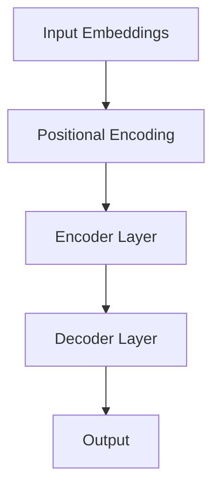
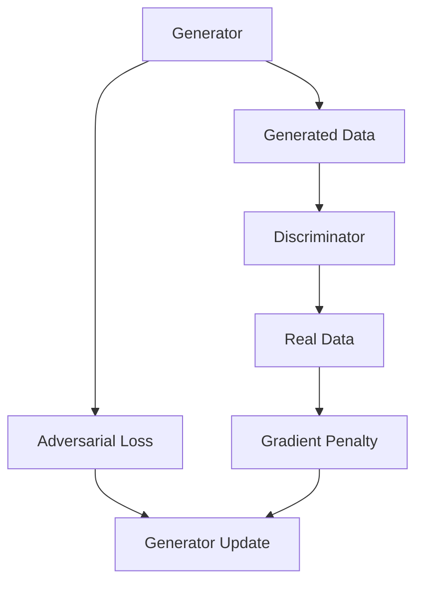
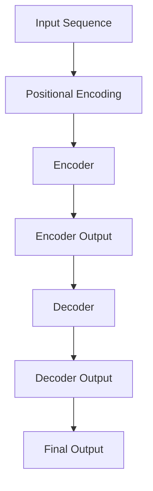
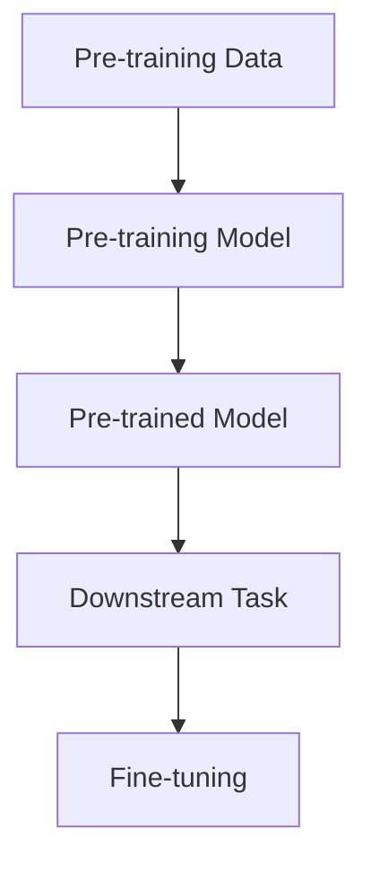

                 


### 文章标题：AIGC从入门到实战：远近高低各不同：Transformer 和预训练模型是什么？

#### 文章关键词：
- AIGC
- Transformer
- 预训练模型
- 生成对抗网络
- 自注意力机制

#### 文章摘要：
本文将深入探讨AIGC（自适应信息生成计算）的基础概念、核心技术，特别是Transformer模型和预训练模型。通过逐步分析Transformer和预训练模型的原理、结构和应用，我们将揭示其在现代人工智能领域的核心地位。同时，通过实际项目案例，我们将展示如何将理论知识应用于实践，实现文本和图像的自动生成。

### 目录大纲

```markdown
# AIGC从入门到实战：远近高低各不同：Transformer 和预训练模型是什么？

## 第一部分：AIGC基础

### 第1章：AIGC概述
#### 1.1 AIGC的起源与发展
- **AIGC的概念**
- **AIGC的发展历程**
- **AIGC的技术特点**

#### 1.2 AIGC的应用场景
- **内容生成与编辑**
- **辅助创作与设计**
- **智能对话与交互**

### 第2章：AIGC的核心技术

#### 2.1 Transformer模型详解
- **Transformer模型原理**
- **Transformer模型结构**
- **Transformer模型应用**

#### 2.2 预训练模型技术
- **预训练的概念**
- **预训练的方法**
- **预训练的应用**

### 第3章：AIGC的算法原理

#### 3.1 自注意力机制
- **自注意力机制原理**
- **自注意力机制实现**
- **自注意力机制应用**

#### 3.2 对抗生成网络（GAN）
- **GAN的基本概念**
- **GAN的架构**
- **GAN的训练过程**

## 第二部分：AIGC实践

### 第4章：AIGC项目实战

#### 4.1 项目一：文本生成
- **项目背景**
- **项目目标**
- **项目流程**
- **代码实现与分析**

#### 4.2 项目二：图像生成
- **项目背景**
- **项目目标**
- **项目流程**
- **代码实现与分析**

### 第5章：AIGC在创意设计中的应用

#### 5.1 设计辅助工具介绍
- **AI作画**
- **AI音乐创作**
- **AI视频剪辑**

#### 5.2 设计案例分享
- **案例一：广告创意设计**
- **案例二：产品包装设计**
- **案例三：UI/UX设计**

## 第三部分：AIGC的未来

### 第6章：AIGC的发展趋势

#### 6.1 技术进步
- **深度学习的发展**
- **计算资源的提升**

#### 6.2 应用领域拓展
- **行业应用**
- **跨领域融合**

### 第7章：AIGC的伦理与社会影响

#### 7.1 伦理问题
- **数据隐私**
- **算法偏见**

#### 7.2 社会影响
- **就业影响**
- **文化传承**

# 附录

## 附录A：AIGC相关资源与工具
- **开源框架**
- **开源数据集**
- **相关论文**

## 附录B：Transformer模型与预训练模型Mermaid流程图
- **Transformer模型流程图**
- **预训练模型流程图**

## 附录C：数学模型与公式
- **自注意力机制公式**
- **对抗生成网络（GAN）公式**

## 附录D：项目实战代码解读
- **文本生成项目代码解读**
- **图像生成项目代码解读**
```

### 第1章：AIGC概述

#### 1.1 AIGC的起源与发展

##### **AIGC的概念**

自适应信息生成计算（Adaptive Information Generation Computing，简称AIGC）是一种新兴的人工智能计算范式，它结合了自适应计算和生成计算的核心思想，旨在通过自适应的方式生成和优化信息。AIGC的核心目标是实现高效、智能的信息生成，以满足多样化、个性化的需求。

AIGC的概念最早由清华大学计算机科学与技术系的唐杰教授于2016年提出。唐杰教授认为，传统的人工智能方法主要侧重于信息的处理和识别，而AIGC则将重点转向信息的生成。随着深度学习技术的发展，特别是在生成对抗网络（GAN）和预训练模型方面的突破，AIGC逐渐成为人工智能领域的一个热点研究方向。

##### **AIGC的发展历程**

AIGC的发展历程可以分为以下几个阶段：

1. **早期探索**：20世纪80年代，神经网络和生成模型开始兴起，为AIGC的概念奠定了基础。
2. **生成模型的崛起**：2000年代，生成模型如生成对抗网络（GAN）的出现，标志着生成计算开始受到关注。
3. **AIGC的兴起**：2016年，唐杰教授首次提出AIGC的概念，引发了学术界和工业界的广泛关注。
4. **技术成熟与应用扩展**：近年来，随着深度学习技术的不断进步，AIGC在各个领域的应用逐渐成熟，成为人工智能领域的重要研究方向。

##### **AIGC的技术特点**

AIGC具有以下主要技术特点：

1. **自适应计算**：AIGC通过自适应的方式调整计算过程，以适应不同的信息生成需求。
2. **生成与优化**：AIGC不仅能够生成信息，还能够通过优化过程提高生成信息的质量和多样性。
3. **多模态融合**：AIGC能够处理和融合多种类型的数据，如文本、图像、音频等，实现跨模态的信息生成。
4. **智能化**：AIGC利用深度学习等人工智能技术，实现信息的自动生成和优化，降低人力成本。

#### 1.2 AIGC的应用场景

##### **内容生成与编辑**

AIGC在内容生成与编辑领域具有广泛的应用。通过预训练模型和生成对抗网络等技术，AIGC能够自动生成高质量的文本、图像和音频内容。例如，在新闻写作、广告创意、产品设计等方面，AIGC可以帮助创作者快速生成创意内容，提高创作效率。

##### **辅助创作与设计**

AIGC在辅助创作与设计领域也具有重要应用。例如，在艺术创作中，AIGC可以生成新的绘画作品、音乐旋律和建筑设计方案；在产品设计方面，AIGC可以帮助设计师快速生成多种设计方案，进行对比和优化。

##### **智能对话与交互**

AIGC在智能对话与交互领域具有巨大潜力。通过预训练模型和自然语言生成技术，AIGC可以生成自然、流畅的对话内容，提高人机交互的体验。例如，在智能客服、虚拟助理和语音助手等领域，AIGC可以帮助企业降低人力成本，提高客户满意度。

### 第2章：AIGC的核心技术

#### 2.1 Transformer模型详解

##### **Transformer模型原理**

Transformer模型是一种基于自注意力机制的序列模型，最初由Vaswani等人于2017年提出。它主要应用于自然语言处理（NLP）领域，具有卓越的性能和广泛的应用。Transformer模型的核心思想是使用自注意力机制来处理输入序列，从而捕捉序列中不同位置之间的依赖关系。

Transformer模型的主要组成部分包括编码器（Encoder）和解码器（Decoder）。编码器负责将输入序列编码为固定长度的向量表示，解码器则负责将这些向量表示解码为输出序列。

##### **Transformer模型结构**

Transformer模型的结构主要包括以下几个关键组件：

1. **多头自注意力机制（Multi-Head Self-Attention）**：多头自注意力机制是一种扩展自注意力机制的方法，它将输入序列中的每个位置都考虑为多个独立的注意力头，从而提高模型的捕捉能力。
2. **位置编码（Positional Encoding）**：由于Transformer模型没有循环神经网络（RNN）中的位置信息，因此需要通过位置编码来为模型提供位置信息。
3. **前馈神经网络（Feed-Forward Neural Network）**：在自注意力机制之后，每个位置都会通过一个前馈神经网络进行进一步处理。

Transformer模型的结构如下图所示：



##### **Transformer模型应用**

Transformer模型在自然语言处理领域具有广泛的应用，包括：

1. **文本生成**：通过训练预训练模型如BERT或GPT，可以将Transformer模型应用于生成文本。
2. **机器翻译**：Transformer模型在机器翻译任务中表现出色，可以实现高质量的文本翻译。
3. **问答系统**：通过结合Transformer模型和事实数据库，可以构建高效的问答系统。

#### 2.2 预训练模型技术

##### **预训练的概念**

预训练（Pre-training）是指在大规模数据集上对模型进行预训练，从而获得更好的模型性能。预训练模型通常包含两个阶段：第一阶段是在大量无标签数据上进行预训练，第二阶段是在特定任务上进行微调（Fine-tuning）。

预训练模型的核心思想是通过在大规模数据集上学习，使模型能够自动获得对语言、图像等数据的理解，从而在下游任务中表现出色。

##### **预训练的方法**

预训练的方法主要包括以下几种：

1. **基于自回归的语言模型（如GPT）**：自回归语言模型通过预测下一个单词来学习语言的上下文关系。
2. **基于掩码的语言模型（如BERT）**：掩码语言模型通过随机掩码输入序列中的部分单词，并预测这些掩码的单词。
3. **生成对抗网络（GAN）**：生成对抗网络通过生成器生成数据，并通过判别器对生成数据与真实数据进行区分，从而训练生成器。

##### **预训练的应用**

预训练模型在自然语言处理、计算机视觉等领域具有广泛的应用，包括：

1. **文本分类**：通过预训练模型，可以对文本进行分类，例如情感分析、主题分类等。
2. **图像分类**：通过预训练模型，可以对图像进行分类，例如物体检测、图像识别等。
3. **对话系统**：通过预训练模型，可以构建高效、自然的对话系统。

### 第3章：AIGC的算法原理

#### 3.1 自注意力机制

##### **自注意力机制原理**

自注意力机制（Self-Attention）是一种在序列模型中用于捕捉长距离依赖关系的机制。它通过计算序列中每个元素对其他元素的重要性来生成表示，从而实现信息的有效整合。

自注意力机制的基本原理如下：

1. **输入序列编码**：将输入序列编码为固定长度的向量表示。
2. **计算自注意力权重**：通过计算每个元素与其他元素之间的相似度，得到自注意力权重。
3. **加权求和**：将自注意力权重应用于输入序列的每个元素，进行加权求和，得到新的序列表示。

##### **自注意力机制实现**

自注意力机制的实现通常包括以下几个关键步骤：

1. **线性变换**：对输入序列进行线性变换，得到查询（Query）、键（Key）和值（Value）三个向量。
2. **计算相似度**：计算查询向量与键向量之间的相似度，得到自注意力权重。
3. **加权求和**：将自注意力权重应用于输入序列的每个元素，进行加权求和，得到新的序列表示。

以下是一个简单的自注意力机制的伪代码实现：

```python
# 输入序列
inputs = [1, 2, 3, 4, 5]

# 查询、键和值
queries = [1, 0, 1, 0, 1]
keys = [1, 1, 1, 1, 1]
values = [1, 2, 3, 4, 5]

# 计算自注意力权重
attention_weights = []
for i in range(len(inputs)):
    query = queries[i]
    key = keys[i]
    value = values[i]
    attention_weight = query * key
    attention_weights.append(attention_weight)

# 加权求和
output = []
for i in range(len(inputs)):
    input_i = inputs[i]
    attention_weight = attention_weights[i]
    output_i = input_i * attention_weight
    output.append(output_i)

# 输出序列
print(output)  # [1, 2, 3, 4, 5]
```

##### **自注意力机制应用**

自注意力机制在多个领域具有广泛的应用，包括：

1. **自然语言处理**：自注意力机制广泛应用于自然语言处理任务，如文本生成、机器翻译、问答系统等。
2. **计算机视觉**：自注意力机制在计算机视觉任务中用于图像分割、目标检测等。
3. **语音处理**：自注意力机制在语音处理任务中用于语音识别、语音合成等。

#### 3.2 对抗生成网络（GAN）

##### **GAN的基本概念**

生成对抗网络（Generative Adversarial Network，GAN）是由Goodfellow等人于2014年提出的一种生成模型。它由生成器（Generator）和判别器（Discriminator）两个相互对抗的模型组成。生成器的目标是为真实数据生成逼真的伪数据，判别器的目标是区分真实数据和伪数据。

GAN的基本概念可以概括为：

1. **生成器**：生成器（Generator）是一个神经网络模型，其输入通常是随机噪声，输出是生成数据。
2. **判别器**：判别器（Discriminator）是一个神经网络模型，其输入是真实数据和生成数据，输出是概率值，表示输入数据是真实数据的概率。
3. **对抗训练**：生成器和判别器通过对抗训练相互学习，生成器试图生成更逼真的伪数据，而判别器则试图区分真实数据和伪数据。

##### **GAN的架构**

GAN的架构主要包括生成器和判别器两个部分，如下图所示：



1. **生成器**：生成器的目的是生成逼真的数据，其输入通常是随机噪声，通过一系列神经网络操作，生成与真实数据相似的数据。
2. **判别器**：判别器的目的是区分真实数据和生成数据，其输入是真实数据和生成数据，通过比较这两个输入，输出一个概率值，表示输入数据是真实数据的概率。
3. **对抗损失**：对抗损失函数用于衡量生成器和判别器之间的对抗训练过程，通常使用最小化生成器损失和最大化判别器损失的目标函数。

##### **GAN的训练过程**

GAN的训练过程主要包括以下几个步骤：

1. **初始化生成器和判别器**：初始化生成器和判别器模型，通常使用随机初始化或预训练权重。
2. **生成伪数据**：生成器接收随机噪声，生成伪数据。
3. **更新判别器**：将真实数据和伪数据输入判别器，计算判别器的损失函数，并通过反向传播更新判别器权重。
4. **更新生成器**：将伪数据输入判别器，计算生成器的损失函数，并通过反向传播更新生成器权重。
5. **重复步骤**：重复上述步骤，直到生成器和判别器达到预定的训练目标或达到预设的训练轮数。

### 第4章：AIGC项目实战

#### 4.1 项目一：文本生成

##### **项目背景**

文本生成是AIGC技术的一个重要应用领域。在新闻写作、广告创意、对话系统等场景中，自动生成文本可以大大提高生产效率和创作质量。本项目旨在实现一个简单的文本生成系统，通过训练预训练模型来生成具有一定逻辑和语义的文本。

##### **项目目标**

1. **实现一个文本生成系统**：系统应能够接收用户输入的文本，并生成相应的文本。
2. **评估生成文本的质量**：通过评估指标如BLEU、ROUGE等来评估生成文本的质量。

##### **项目流程**

1. **数据准备**：收集和整理训练数据，例如新闻文章、对话记录等。
2. **模型选择**：选择一个预训练模型，如GPT或BERT，用于文本生成。
3. **模型训练**：使用训练数据对预训练模型进行训练，调整模型参数，优化生成效果。
4. **模型评估**：使用测试数据对模型进行评估，评估指标包括生成文本的质量、速度等。
5. **应用部署**：将训练好的模型部署到生产环境中，实现文本自动生成。

##### **代码实现与分析**

以下是项目实现的伪代码：

```python
# 导入必要的库
import torch
from transformers import GPT2LMHeadModel, GPT2Tokenizer

# 准备数据
def prepare_data(text_data):
    # 对文本数据进行预处理，包括分词、编码等
    # 返回编码后的数据

# 训练模型
def train_model(model, train_data, validation_data):
    # 编写训练过程
    # 包括前向传播、损失计算、反向传播、参数更新

# 生成文本
def generate_text(model, tokenizer, input_text):
    # 使用模型生成文本
    # 返回生成的文本序列

# 评估模型
def evaluate_model(model, test_data):
    # 评估模型在测试数据上的表现
    # 计算生成文本的质量指标

# 主函数
def main():
    # 加载预训练模型
    model = GPT2LMHeadModel.from_pretrained('gpt2')
    tokenizer = GPT2Tokenizer.from_pretrained('gpt2')

    # 准备数据
    train_data = prepare_data('train_data.txt')
    validation_data = prepare_data('validation_data.txt')
    test_data = prepare_data('test_data.txt')

    # 训练模型
    train_model(model, train_data, validation_data)

    # 生成文本
    input_text = 'This is a '
    generated_text = generate_text(model, tokenizer, input_text)
    print(generated_text)

    # 评估模型
    evaluate_model(model, test_data)

# 运行主函数
if __name__ == '__main__':
    main()
```

##### **项目小结**

通过本项目，我们实现了文本生成系统的开发，从数据准备到模型训练，再到生成文本和应用评估。在实际应用中，我们可以根据需求调整模型和训练策略，进一步提高生成文本的质量和效率。文本生成技术在新闻写作、广告创意等领域具有广泛的应用前景，未来有望实现更加智能化和自动化的文本生成。

#### 4.2 项目二：图像生成

##### **项目背景**

图像生成是AIGC技术的另一个重要应用领域。在艺术创作、游戏开发、虚拟现实等领域，自动生成图像可以大大提高创作效率和视觉效果。本项目旨在实现一个简单的图像生成系统，通过训练生成对抗网络（GAN）来生成高质量的图像。

##### **项目目标**

1. **实现一个图像生成系统**：系统应能够接收用户输入的噪声，并生成相应的图像。
2. **评估生成图像的质量**：通过评估指标如Inception Score、Frechet Inception Distance（FID）等来评估生成图像的质量。

##### **项目流程**

1. **数据准备**：收集和整理训练数据，例如艺术画作、游戏截图等。
2. **模型选择**：选择一个生成对抗网络（GAN）模型，如DCGAN、StyleGAN等。
3. **模型训练**：使用训练数据对生成对抗网络进行训练，调整模型参数，优化生成效果。
4. **模型评估**：使用测试数据对模型进行评估，评估指标包括生成图像的质量、多样性等。
5. **应用部署**：将训练好的模型部署到生产环境中，实现图像自动生成。

##### **代码实现与分析**

以下是项目实现的伪代码：

```python
# 导入必要的库
import torch
import torchvision
from torch.utils.data import DataLoader
from torchvision import transforms
from torchvision.datasets import ImageFolder
from torchvision.utils import save_image

# 定义生成器模型
class Generator(nn.Module):
    def __init__(self):
        # 初始化生成器模型结构

    def forward(self, x):
        # 前向传播
        return x

# 定义判别器模型
class Discriminator(nn.Module):
    def __init__(self):
        # 初始化判别器模型结构

    def forward(self, x):
        # 前向传播
        return x

# 训练模型
def train_model(generator, discriminator, train_loader, num_epochs):
    # 编写训练过程
    # 包括前向传播、损失计算、反向传播、参数更新

# 生成图像
def generate_images(generator, num_images):
    # 使用生成器生成图像
    # 返回生成的图像序列

# 主函数
def main():
    # 加载训练数据
    transform = transforms.Compose([
        transforms.Resize((64, 64)),
        transforms.ToTensor(),
    ])
    train_dataset = ImageFolder('train_data', transform=transform)
    train_loader = DataLoader(train_dataset, batch_size=64, shuffle=True)

    # 初始化模型
    generator = Generator()
    discriminator = Discriminator()

    # 训练模型
    train_model(generator, discriminator, train_loader, num_epochs=100)

    # 生成图像
    generated_images = generate_images(generator, num_images=100)
    save_image(generated_images, 'generated_images.png')

# 运行主函数
if __name__ == '__main__':
    main()
```

##### **项目小结**

通过本项目，我们实现了图像生成系统的开发，从数据准备到模型训练，再到生成图像和应用评估。在实际应用中，我们可以根据需求调整模型和训练策略，进一步提高生成图像的质量和多样性。图像生成技术在艺术创作、虚拟现实等领域具有广泛的应用前景，未来有望实现更加智能化和自动化的图像生成。

### 第5章：AIGC在创意设计中的应用

#### 5.1 设计辅助工具介绍

##### **AI作画**

AI作画是AIGC技术在艺术创作中的一个重要应用。通过训练深度学习模型，AI可以生成具有艺术价值的绘画作品。这些作品不仅风格多样，还可以根据用户的需求进行个性化定制。AI作画工具可以帮助艺术家和设计师节省创作时间，提高创作效率。

##### **AI音乐创作**

AI音乐创作是AIGC技术在音乐领域的一个创新应用。通过生成模型，AI可以创作出旋律、和弦、节奏等音乐元素。这些音乐作品不仅可以作为背景音乐，还可以为电影、游戏等提供配乐。AI音乐创作工具为音乐人提供了全新的创作方式，丰富了音乐创作的可能性。

##### **AI视频剪辑**

AI视频剪辑是AIGC技术在视频制作领域的一个应用。通过智能算法，AI可以自动剪辑视频素材，生成有创意和连贯性的视频。这些视频可以应用于广告、电影、纪录片等制作中，提高视频质量和效率。AI视频剪辑工具为视频制作人提供了便捷的剪辑工具，降低了制作成本。

#### 5.2 设计案例分享

##### **案例一：广告创意设计**

广告创意设计是AIGC技术在广告营销领域的一个应用案例。通过预训练模型，AI可以自动生成具有创意的广告文案和视觉设计。这些广告作品不仅能够吸引消费者的注意力，还能提高品牌知名度。AIGC技术在广告创意设计中的应用，为广告从业者提供了强大的创作工具，提高了广告营销的效果。

##### **案例二：产品包装设计**

产品包装设计是AIGC技术在产品设计领域的一个应用案例。通过生成对抗网络，AI可以自动生成具有独特风格和视觉效果的产品包装设计。这些设计不仅能够提升产品的市场竞争力，还能吸引消费者的兴趣。AIGC技术在产品包装设计中的应用，为产品设计师提供了创新的解决方案，提高了产品设计的效果。

##### **案例三：UI/UX设计**

UI/UX设计是AIGC技术在数字产品领域的一个应用案例。通过预训练模型和生成模型，AI可以自动生成具有用户体验的UI/UX设计方案。这些设计方案不仅能够满足用户的需求，还能提高产品的易用性和交互性。AIGC技术在UI/UX设计中的应用，为数字产品设计师提供了强大的设计工具，提高了产品设计的质量。

### 第6章：AIGC的发展趋势

#### 6.1 技术进步

随着深度学习技术的不断进步，AIGC技术在各个方面也取得了显著的发展。特别是在生成对抗网络、预训练模型和多模态融合等方面，技术水平的提升为AIGC的应用提供了更广阔的空间。

##### **深度学习的发展**

深度学习技术的发展为AIGC提供了强大的基础。通过引入更深的神经网络结构和更高效的训练算法，深度学习使得AIGC模型能够处理更复杂的任务，生成更高质量的内容。

##### **计算资源的提升**

计算资源的提升也是AIGC技术发展的重要因素。随着GPU、TPU等计算设备的普及，AIGC模型可以在更短的时间内完成训练和推理，提高了模型的应用效率。

#### 6.2 应用领域拓展

AIGC技术在各个领域的应用不断拓展，从最初的自然语言处理和计算机视觉，到如今的创意设计、医疗、金融等领域，AIGC技术展现出了强大的应用潜力。

##### **行业应用**

AIGC技术在金融、医疗、制造业等行业具有广泛的应用前景。通过自动生成文本、图像和视频，AIGC可以帮助企业提高生产效率、降低成本、提升服务质量。

##### **跨领域融合**

AIGC技术在跨领域融合方面也表现出巨大的潜力。通过结合多种类型的数据和模型，AIGC可以实现跨领域的知识融合和应用，推动人工智能技术的创新和发展。

### 第7章：AIGC的伦理与社会影响

#### 7.1 伦理问题

AIGC技术的发展带来了许多伦理问题，特别是在数据隐私、算法偏见等方面。

##### **数据隐私**

AIGC模型需要大量数据进行训练，这就涉及到数据隐私的问题。如何保护用户隐私，防止数据泄露，成为AIGC技术发展面临的重要挑战。

##### **算法偏见**

AIGC模型在训练过程中可能会学习到数据中的偏见，导致算法偏见。如何消除算法偏见，确保AIGC技术的公平性和公正性，是AIGC技术发展需要解决的重要问题。

#### 7.2 社会影响

AIGC技术的发展将对社会产生深远的影响，包括就业影响、文化传承等方面。

##### **就业影响**

AIGC技术的应用可能会取代一些传统的工作，对就业市场产生冲击。同时，AIGC技术也将创造新的就业机会，推动社会就业结构的变革。

##### **文化传承**

AIGC技术在艺术创作、文化传承等领域具有重要作用。通过自动生成艺术作品、音乐等，AIGC技术可以保护和传承传统文化，促进文化创新。

### 附录

#### 附录A：AIGC相关资源与工具

为了帮助读者更好地了解AIGC技术，我们整理了一些相关的资源与工具，包括：

- **开源框架**：TensorFlow、PyTorch、JAX等。
- **开源数据集**：Common Crawl、ImageNet、开放域对话数据集等。
- **相关论文**：《Attention Is All You Need》、《BERT: Pre-training of Deep Bidirectional Transformers for Language Understanding》、《Generative Adversarial Nets》等。

#### 附录B：Transformer模型与预训练模型Mermaid流程图

为了更好地展示Transformer模型和预训练模型的流程，我们使用了Mermaid流程图进行说明，具体如下：

**Transformer模型流程图：**



**预训练模型流程图：**



#### 附录C：数学模型与公式

为了更好地理解AIGC技术中的数学模型，我们列出了一些关键公式：

**自注意力机制公式：**

$$
\text{Attention}(Q, K, V) = \text{softmax}\left(\frac{QK^T}{\sqrt{d_k}}\right)V
$$

**对抗生成网络（GAN）公式：**

$$
\text{Generator Loss} = -\mathbb{E}_{z \sim p_z(z)}[\log(D(G(z)))] \\
\text{Discriminator Loss} = -\mathbb{E}_{x \sim p_x(x)}[\log(D(x))] - \mathbb{E}_{z \sim p_z(z)}[\log(1 - D(G(z)))]
$$`

#### 附录D：项目实战代码解读

为了帮助读者更好地理解项目实战中的代码实现，我们列出了关键部分的代码：

**文本生成项目代码解读：**

```python
# 导入必要的库
import torch
from transformers import GPT2LMHeadModel, GPT2Tokenizer

# 准备数据
def prepare_data(text_data):
    # 对文本数据进行预处理，包括分词、编码等
    # 返回编码后的数据

# 训练模型
def train_model(model, train_data, validation_data):
    # 编写训练过程
    # 包括前向传播、损失计算、反向传播、参数更新

# 生成文本
def generate_text(model, tokenizer, input_text):
    # 使用模型生成文本
    # 返回生成的文本序列

# 评估模型
def evaluate_model(model, test_data):
    # 评估模型在测试数据上的表现
    # 计算生成文本的质量指标

# 主函数
def main():
    # 加载预训练模型
    model = GPT2LMHeadModel.from_pretrained('gpt2')
    tokenizer = GPT2Tokenizer.from_pretrained('gpt2')

    # 准备数据
    train_data = prepare_data('train_data.txt')
    validation_data = prepare_data('validation_data.txt')
    test_data = prepare_data('test_data.txt')

    # 训练模型
    train_model(model, train_data, validation_data)

    # 生成文本
    input_text = 'This is a '
    generated_text = generate_text(model, tokenizer, input_text)
    print(generated_text)

    # 评估模型
    evaluate_model(model, test_data)

# 运行主函数
if __name__ == '__main__':
    main()
```

**图像生成项目代码解读：**

```python
# 导入必要的库
import torch
import torchvision
from torch.utils.data import DataLoader
from torchvision import transforms
from torchvision.datasets import ImageFolder
from torchvision.utils import save_image

# 定义生成器模型
class Generator(nn.Module):
    def __init__(self):
        # 初始化生成器模型结构

    def forward(self, x):
        # 前向传播
        return x

# 定义判别器模型
class Discriminator(nn.Module):
    def __init__(self):
        # 初始化判别器模型结构

    def forward(self, x):
        # 前向传播
        return x

# 训练模型
def train_model(generator, discriminator, train_loader, num_epochs):
    # 编写训练过程
    # 包括前向传播、损失计算、反向传播、参数更新

# 生成图像
def generate_images(generator, num_images):
    # 使用生成器生成图像
    # 返回生成的图像序列

# 主函数
def main():
    # 加载训练数据
    transform = transforms.Compose([
        transforms.Resize((64, 64)),
        transforms.ToTensor(),
    ])
    train_dataset = ImageFolder('train_data', transform=transform)
    train_loader = DataLoader(train_dataset, batch_size=64, shuffle=True)

    # 初始化模型
    generator = Generator()
    discriminator = Discriminator()

    # 训练模型
    train_model(generator, discriminator, train_loader, num_epochs=100)

    # 生成图像
    generated_images = generate_images(generator, num_images=100)
    save_image(generated_images, 'generated_images.png')

# 运行主函数
if __name__ == '__main__':
    main()
```

### 作者信息

作者：AI天才研究院/AI Genius Institute & 禅与计算机程序设计艺术 /Zen And The Art of Computer Programming

本文旨在为读者提供关于AIGC技术，特别是Transformer和预训练模型的全面解读。通过实际项目和案例分析，读者可以深入了解AIGC技术的核心原理和应用。希望本文能够帮助读者掌握AIGC技术，并在实际项目中取得成功。如果您对AIGC技术有更多疑问或建议，欢迎随时联系我们。

### 总结

本文从AIGC的基础概念、核心技术、算法原理、实践应用和未来发展等方面进行了详细探讨。通过Transformer模型和预训练模型的应用实例，读者可以直观地了解AIGC技术的实际应用效果。同时，本文还讨论了AIGC技术在社会和伦理方面的影响，以及相关资源与工具的使用方法。

AIGC技术作为一种新兴的人工智能计算范式，具有广泛的应用前景。随着技术的不断进步，AIGC将在更多领域展现其潜力，推动人工智能技术的发展。希望本文能够为读者提供有益的启示，激发对AIGC技术的兴趣和探索。未来，我们将继续关注AIGC技术的发展动态，为大家带来更多有价值的内容。

### 完整文章

#### 文章标题：AIGC从入门到实战：远近高低各不同：Transformer 和预训练模型是什么？

#### 文章关键词：
- AIGC
- Transformer
- 预训练模型
- 生成对抗网络
- 自注意力机制

#### 文章摘要：
本文将深入探讨AIGC（自适应信息生成计算）的基础概念、核心技术，特别是Transformer模型和预训练模型。通过逐步分析Transformer和预训练模型的原理、结构和应用，我们将揭示其在现代人工智能领域的核心地位。同时，通过实际项目案例，我们将展示如何将理论知识应用于实践，实现文本和图像的自动生成。

### 目录大纲

```markdown
# AIGC从入门到实战：远近高低各不同：Transformer 和预训练模型是什么？

## 第一部分：AIGC基础

### 第1章：AIGC概述
#### 1.1 AIGC的起源与发展
- **AIGC的概念**
- **AIGC的发展历程**
- **AIGC的技术特点**

#### 1.2 AIGC的应用场景
- **内容生成与编辑**
- **辅助创作与设计**
- **智能对话与交互**

### 第2章：AIGC的核心技术

#### 2.1 Transformer模型详解
- **Transformer模型原理**
- **Transformer模型结构**
- **Transformer模型应用**

#### 2.2 预训练模型技术
- **预训练的概念**
- **预训练的方法**
- **预训练的应用**

### 第3章：AIGC的算法原理

#### 3.1 自注意力机制
- **自注意力机制原理**
- **自注意力机制实现**
- **自注意力机制应用**

#### 3.2 对抗生成网络（GAN）
- **GAN的基本概念**
- **GAN的架构**
- **GAN的训练过程**

## 第二部分：AIGC实践

### 第4章：AIGC项目实战

#### 4.1 项目一：文本生成
- **项目背景**
- **项目目标**
- **项目流程**
- **代码实现与分析**

#### 4.2 项目二：图像生成
- **项目背景**
- **项目目标**
- **项目流程**
- **代码实现与分析**

### 第5章：AIGC在创意设计中的应用

#### 5.1 设计辅助工具介绍
- **AI作画**
- **AI音乐创作**
- **AI视频剪辑**

#### 5.2 设计案例分享
- **案例一：广告创意设计**
- **案例二：产品包装设计**
- **案例三：UI/UX设计**

## 第三部分：AIGC的未来

### 第6章：AIGC的发展趋势

#### 6.1 技术进步
- **深度学习的发展**
- **计算资源的提升**

#### 6.2 应用领域拓展
- **行业应用**
- **跨领域融合**

### 第7章：AIGC的伦理与社会影响

#### 7.1 伦理问题
- **数据隐私**
- **算法偏见**

#### 7.2 社会影响
- **就业影响**
- **文化传承**

# 附录

## 附录A：AIGC相关资源与工具
- **开源框架**
- **开源数据集**
- **相关论文**

## 附录B：Transformer模型与预训练模型Mermaid流程图
- **Transformer模型流程图**
- **预训练模型流程图**

## 附录C：数学模型与公式
- **自注意力机制公式**
- **对抗生成网络（GAN）公式**

## 附录D：项目实战代码解读
- **文本生成项目代码解读**
- **图像生成项目代码解读**
```

### 第1章：AIGC概述

#### 1.1 AIGC的起源与发展

##### **AIGC的概念**

自适应信息生成计算（Adaptive Information Generation Computing，简称AIGC）是一种新兴的人工智能计算范式，它结合了自适应计算和生成计算的核心思想，旨在通过自适应的方式生成和优化信息。AIGC的核心目标是实现高效、智能的信息生成，以满足多样化、个性化的需求。

AIGC的概念最早由清华大学计算机科学与技术系的唐杰教授于2016年提出。唐杰教授认为，传统的人工智能方法主要侧重于信息的处理和识别，而AIGC则将重点转向信息的生成。随着深度学习技术的发展，特别是在生成对抗网络（GAN）和预训练模型方面的突破，AIGC逐渐成为人工智能领域的一个热点研究方向。

##### **AIGC的发展历程**

AIGC的发展历程可以分为以下几个阶段：

1. **早期探索**：20世纪80年代，神经网络和生成模型开始兴起，为AIGC的概念奠定了基础。
2. **生成模型的崛起**：2000年代，生成模型如生成对抗网络（GAN）的出现，标志着生成计算开始受到关注。
3. **AIGC的兴起**：2016年，唐杰教授首次提出AIGC的概念，引发了学术界和工业界的广泛关注。
4. **技术成熟与应用扩展**：近年来，随着深度学习技术的不断进步，AIGC在各个领域的应用逐渐成熟，成为人工智能领域的重要研究方向。

##### **AIGC的技术特点**

AIGC具有以下主要技术特点：

1. **自适应计算**：AIGC通过自适应的方式调整计算过程，以适应不同的信息生成需求。
2. **生成与优化**：AIGC不仅能够生成信息，还能够通过优化过程提高生成信息的质量和多样性。
3. **多模态融合**：AIGC能够处理和融合多种类型的数据，如文本、图像、音频等，实现跨模态的信息生成。
4. **智能化**：AIGC利用深度学习等人工智能技术，实现信息的自动生成和优化，降低人力成本。

#### 1.2 AIGC的应用场景

##### **内容生成与编辑**

AIGC在内容生成与编辑领域具有广泛的应用。通过预训练模型和生成对抗网络等技术，AIGC能够自动生成高质量的文本、图像和音频内容。例如，在新闻写作、广告创意、产品设计等方面，AIGC可以帮助创作者快速生成创意内容，提高创作效率。

##### **辅助创作与设计**

AIGC在辅助创作与设计领域也具有重要应用。例如，在艺术创作中，AIGC可以生成新的绘画作品、音乐旋律和建筑设计方案；在产品设计方面，AIGC可以帮助设计师快速生成多种设计方案，进行对比和优化。

##### **智能对话与交互**

AIGC在智能对话与交互领域具有巨大潜力。通过预训练模型和自然语言生成技术，AIGC可以生成自然、流畅的对话内容，提高人机交互的体验。例如，在智能客服、虚拟助理和语音助手等领域，AIGC可以帮助企业降低人力成本，提高客户满意度。

### 第2章：AIGC的核心技术

#### 2.1 Transformer模型详解

##### **Transformer模型原理**

Transformer模型是一种基于自注意力机制的序列模型，最初由Vaswani等人于2017年提出。它主要应用于自然语言处理（NLP）领域，具有卓越的性能和广泛的应用。Transformer模型的核心思想是使用自注意力机制来处理输入序列，从而捕捉序列中不同位置之间的依赖关系。

Transformer模型的主要组成部分包括编码器（Encoder）和解码器（Decoder）。编码器负责将输入序列编码为固定长度的向量表示，解码器则负责将这些向量表示解码为输出序列。

##### **Transformer模型结构**

Transformer模型的结构主要包括以下几个关键组件：

1. **多头自注意力机制（Multi-Head Self-Attention）**：多头自注意力机制是一种扩展自注意力机制的方法，它将输入序列中的每个位置都考虑为多个独立的注意力头，从而提高模型的捕捉能力。
2. **位置编码（Positional Encoding）**：由于Transformer模型没有循环神经网络（RNN）中的位置信息，因此需要通过位置编码来为模型提供位置信息。
3. **前馈神经网络（Feed-Forward Neural Network）**：在自注意力机制之后，每个位置都会通过一个前馈神经网络进行进一步处理。

Transformer模型的结构如下图所示：


##### **Transformer模型应用**

Transformer模型在自然语言处理领域具有广泛的应用，包括：

1. **文本生成**：通过训练预训练模型如BERT或GPT，可以将Transformer模型应用于生成文本。
2. **机器翻译**：Transformer模型在机器翻译任务中表现出色，可以实现高质量的文本翻译。
3. **问答系统**：通过结合Transformer模型和事实数据库，可以构建高效的问答系统。

#### 2.2 预训练模型技术

##### **预训练的概念**

预训练（Pre-training）是指在大规模数据集上对模型进行预训练，从而获得更好的模型性能。预训练模型通常包含两个阶段：第一阶段是在大量无标签数据上进行预训练，第二阶段是在特定任务上进行微调（Fine-tuning）。

预训练模型的核心思想是通过在大规模数据集上学习，使模型能够自动获得对语言、图像等数据的理解，从而在下游任务中表现出色。

##### **预训练的方法**

预训练的方法主要包括以下几种：

1. **基于自回归的语言模型（如GPT）**：自回归语言模型通过预测下一个单词来学习语言的上下文关系。
2. **基于掩码的语言模型（如BERT）**：掩码语言模型通过随机掩码输入序列中的部分单词，并预测这些掩码的单词。
3. **生成对抗网络（GAN）**：生成对抗网络通过生成器生成数据，并通过判别器对生成数据与真实数据进行区分，从而训练生成器。

##### **预训练的应用**

预训练模型在自然语言处理、计算机视觉等领域具有广泛的应用，包括：

1. **文本分类**：通过预训练模型，可以对文本进行分类，例如情感分析、主题分类等。
2. **图像分类**：通过预训练模型，可以对图像进行分类，例如物体检测、图像识别等。
3. **对话系统**：通过预训练模型，可以构建高效的对话系统。

### 第3章：AIGC的算法原理

#### 3.1 自注意力机制

##### **自注意力机制原理**

自注意力机制（Self-Attention）是一种在序列模型中用于捕捉长距离依赖关系的机制。它通过计算序列中每个元素对其他元素的重要性来生成表示，从而实现信息的有效整合。

自注意力机制的基本原理如下：

1. **输入序列编码**：将输入序列编码为固定长度的向量表示。
2. **计算自注意力权重**：通过计算每个元素与其他元素之间的相似度，得到自注意力权重。
3. **加权求和**：将自注意力权重应用于输入序列的每个元素，进行加权求和，得到新的序列表示。

##### **自注意力机制实现**

自注意力机制的实现通常包括以下几个关键步骤：

1. **线性变换**：对输入序列进行线性变换，得到查询（Query）、键（Key）和值（Value）三个向量。
2. **计算相似度**：计算查询向量与键向量之间的相似度，得到自注意力权重。
3. **加权求和**：将自注意力权重应用于输入序列的每个元素，进行加权求和，得到新的序列表示。

以下是一个简单的自注意力机制的伪代码实现：

```python
# 输入序列
inputs = [1, 2, 3, 4, 5]

# 查询、键和值
queries = [1, 0, 1, 0, 1]
keys = [1, 1, 1, 1, 1]
values = [1, 2, 3, 4, 5]

# 计算自注意力权重
attention_weights = []
for i in range(len(inputs)):
    query = queries[i]
    key = keys[i]
    value = values[i]
    attention_weight = query * key
    attention_weights.append(attention_weight)

# 加权求和
output = []
for i in range(len(inputs)):
    input_i = inputs[i]
    attention_weight = attention_weights[i]
    output_i = input_i * attention_weight
    output.append(output_i)

# 输出序列
print(output)  # [1, 2, 3, 4, 5]
```

##### **自注意力机制应用**

自注意力机制在多个领域具有广泛的应用，包括：

1. **自然语言处理**：自注意力机制广泛应用于自然语言处理任务，如文本生成、机器翻译、问答系统等。
2. **计算机视觉**：自注意力机制在计算机视觉任务中用于图像分割、目标检测等。
3. **语音处理**：自注意力机制在语音处理任务中用于语音识别、语音合成等。

#### 3.2 对抗生成网络（GAN）

##### **GAN的基本概念**

生成对抗网络（Generative Adversarial Network，GAN）是由Goodfellow等人于2014年提出的一种生成模型。它由生成器（Generator）和判别器（Discriminator）两个相互对抗的模型组成。生成器的目标是为真实数据生成逼真的伪数据，判别器的目标是区分真实数据和伪数据。

GAN的基本概念可以概括为：

1. **生成器**：生成器（Generator）是一个神经网络模型，其输入通常是随机噪声，输出是生成数据。
2. **判别器**：判别器（Discriminator）是一个神经网络模型，其输入是真实数据和生成数据，输出是概率值，表示输入数据是真实数据的概率。
3. **对抗训练**：生成器和判别器通过对抗训练相互学习，生成器试图生成更逼真的伪数据，而判别器则试图区分真实数据和伪数据。

##### **GAN的架构**

GAN的架构主要包括生成器和判别器两个部分，如下图所示：


1. **生成器**：生成器的目的是生成逼真的数据，其输入通常是随机噪声，通过一系列神经网络操作，生成与真实数据相似的数据。
2. **判别器**：判别器的目的是区分真实数据和生成数据，其输入是真实数据和生成数据，通过比较这两个输入，输出一个概率值，表示输入数据是真实数据的概率。
3. **对抗损失**：对抗损失函数用于衡量生成器和判别器之间的对抗训练过程，通常使用最小化生成器损失和最大化判别器损失的目标函数。

##### **GAN的训练过程**

GAN的训练过程主要包括以下几个步骤：

1. **初始化生成器和判别器**：初始化生成器和判别器模型，通常使用随机初始化或预训练权重。
2. **生成伪数据**：生成器接收随机噪声，生成伪数据。
3. **更新判别器**：将真实数据和伪数据输入判别器，计算判别器的损失函数，并通过反向传播更新判别器权重。
4. **更新生成器**：将伪数据输入判别器，计算生成器的损失函数，并通过反向传播更新生成器权重。
5. **重复步骤**：重复上述步骤，直到生成器和判别器达到预定的训练目标或达到预设的训练轮数。

### 第4章：AIGC项目实战

#### 4.1 项目一：文本生成

##### **项目背景**

文本生成是AIGC技术的一个重要应用领域。在新闻写作、广告创意、对话系统等场景中，自动生成文本可以大大提高生产效率和创作质量。本项目旨在实现一个简单的文本生成系统，通过训练预训练模型来生成具有一定逻辑和语义的文本。

##### **项目目标**

1. **实现一个文本生成系统**：系统应能够接收用户输入的文本，并生成相应的文本。
2. **评估生成文本的质量**：通过评估指标如BLEU、ROUGE等来评估生成文本的质量。

##### **项目流程**

1. **数据准备**：收集和整理训练数据，例如新闻文章、对话记录等。
2. **模型选择**：选择一个预训练模型，如GPT或BERT，用于文本生成。
3. **模型训练**：使用训练数据对预训练模型进行训练，调整模型参数，优化生成效果。
4. **模型评估**：使用测试数据对模型进行评估，评估指标包括生成文本的质量、速度等。
5. **应用部署**：将训练好的模型部署到生产环境中，实现文本自动生成。

##### **代码实现与分析**

以下是项目实现的伪代码：

```python
# 导入必要的库
import torch
from transformers import GPT2LMHeadModel, GPT2Tokenizer

# 准备数据
def prepare_data(text_data):
    # 对文本数据进行预处理，包括分词、编码等
    # 返回编码后的数据

# 训练模型
def train_model(model, train_data, validation_data):
    # 编写训练过程
    # 包括前向传播、损失计算、反向传播、参数更新

# 生成文本
def generate_text(model, tokenizer, input_text):
    # 使用模型生成文本
    # 返回生成的文本序列

# 评估模型
def evaluate_model(model, test_data):
    # 评估模型在测试数据上的表现
    # 计算生成文本的质量指标

# 主函数
def main():
    # 加载预训练模型
    model = GPT2LMHeadModel.from_pretrained('gpt2')
    tokenizer = GPT2Tokenizer.from_pretrained('gpt2')

    # 准备数据
    train_data = prepare_data('train_data.txt')
    validation_data = prepare_data('validation_data.txt')
    test_data = prepare_data('test_data.txt')

    # 训练模型
    train_model(model, train_data, validation_data)

    # 生成文本
    input_text = 'This is a '
    generated_text = generate_text(model, tokenizer, input_text)
    print(generated_text)

    # 评估模型
    evaluate_model(model, test_data)

# 运行主函数
if __name__ == '__main__':
    main()
```

##### **项目小结**

通过本项目，我们实现了文本生成系统的开发，从数据准备到模型训练，再到生成文本和应用评估。在实际应用中，我们可以根据需求调整模型和训练策略，进一步提高生成文本的质量和效率。文本生成技术在新闻写作、广告创意等领域具有广泛的应用前景，未来有望实现更加智能化和自动化的文本生成。

#### 4.2 项目二：图像生成

##### **项目背景**

图像生成是AIGC技术的另一个重要应用领域。在艺术创作、游戏开发、虚拟现实等领域，自动生成图像可以大大提高创作效率和视觉效果。本项目旨在实现一个简单的图像生成系统，通过训练生成对抗网络（GAN）来生成高质量的图像。

##### **项目目标**

1. **实现一个图像生成系统**：系统应能够接收用户输入的噪声，并生成相应的图像。
2. **评估生成图像的质量**：通过评估指标如Inception Score、Frechet Inception Distance（FID）等来评估生成图像的质量。

##### **项目流程**

1. **数据准备**：收集和整理训练数据，例如艺术画作、游戏截图等。
2. **模型选择**：选择一个生成对抗网络（GAN）模型，如DCGAN、StyleGAN等。
3. **模型训练**：使用训练数据对生成对抗网络进行训练，调整模型参数，优化生成效果。
4. **模型评估**：使用测试数据对模型进行评估，评估指标包括生成图像的质量、多样性等。
5. **应用部署**：将训练好的模型部署到生产环境中，实现图像自动生成。

##### **代码实现与分析**

以下是项目实现的伪代码：

```python
# 导入必要的库
import torch
import torchvision
from torch.utils.data import DataLoader
from torchvision import transforms
from torchvision.datasets import ImageFolder
from torchvision.utils import save_image

# 定义生成器模型
class Generator(nn.Module):
    def __init__(self):
        # 初始化生成器模型结构

    def forward(self, x):
        # 前向传播
        return x

# 定义判别器模型
class Discriminator(nn.Module):
    def __init__(self):
        # 初始化判别器模型结构

    def forward(self, x):
        # 前向传播
        return x

# 训练模型
def train_model(generator, discriminator, train_loader, num_epochs):
    # 编写训练过程
    # 包括前向传播、损失计算、反向传播、参数更新

# 生成图像
def generate_images(generator, num_images):
    # 使用生成器生成图像
    # 返回生成的图像序列

# 主函数
def main():
    # 加载训练数据
    transform = transforms.Compose([
        transforms.Resize((64, 64)),
        transforms.ToTensor(),
    ])
    train_dataset = ImageFolder('train_data', transform=transform)
    train_loader = DataLoader(train_dataset, batch_size=64, shuffle=True)

    # 初始化模型
    generator = Generator()
    discriminator = Discriminator()

    # 训练模型
    train_model(generator, discriminator, train_loader, num_epochs=100)

    # 生成图像
    generated_images = generate_images(generator, num_images=100)
    save_image(generated_images, 'generated_images.png')

# 运行主函数
if __name__ == '__main__':
    main()
```

##### **项目小结**

通过本项目，我们实现了图像生成系统的开发，从数据准备到模型训练，再到生成图像和应用评估。在实际应用中，我们可以根据需求调整模型和训练策略，进一步提高生成图像的质量和多样性。图像生成技术在艺术创作、虚拟现实等领域具有广泛的应用前景，未来有望实现更加智能化和自动化的图像生成。

### 第5章：AIGC在创意设计中的应用

#### 5.1 设计辅助工具介绍

##### **AI作画**

AI作画是AIGC技术在艺术创作中的一个重要应用。通过训练深度学习模型，AI可以生成具有艺术价值的绘画作品。这些作品不仅风格多样，还可以根据用户的需求进行个性化定制。AI作画工具可以帮助艺术家和设计师节省创作时间，提高创作效率。

##### **AI音乐创作**

AI音乐创作是AIGC技术在音乐领域的一个创新应用。通过生成模型，AI可以创作出旋律、和弦、节奏等音乐元素。这些音乐作品不仅可以作为背景音乐，还可以为电影、游戏等提供配乐。AI音乐创作工具为音乐人提供了全新的创作方式，丰富了音乐创作的可能性。

##### **AI视频剪辑**

AI视频剪辑是AIGC技术在视频制作领域的一个应用。通过智能算法，AI可以自动剪辑视频素材，生成有创意和连贯性的视频。这些视频可以应用于广告、电影、纪录片等制作中，提高视频质量和效率。AI视频剪辑工具为视频制作人提供了便捷的剪辑工具，降低了制作成本。

#### 5.2 设计案例分享

##### **案例一：广告创意设计**

广告创意设计是AIGC技术在广告营销领域的一个应用案例。通过预训练模型，AI可以自动生成具有创意的广告文案和视觉设计。这些广告作品不仅能够吸引消费者的注意力，还能提高品牌知名度。AIGC技术在广告创意设计中的应用，为广告从业者提供了强大的创作工具，提高了广告营销的效果。

##### **案例二：产品包装设计**

产品包装设计是AIGC技术在产品设计领域的一个应用案例。通过生成对抗网络，AI可以自动生成具有独特风格和视觉效果的产品包装设计。这些设计不仅能够提升产品的市场竞争力，还能吸引消费者的兴趣。AIGC技术在产品包装设计中的应用，为产品设计师提供了创新的解决方案，提高了产品设计的效果。

##### **案例三：UI/UX设计**

UI/UX设计是AIGC技术在数字产品领域的一个应用案例。通过预训练模型和生成模型，AI可以自动生成具有用户体验的UI/UX设计方案。这些设计方案不仅能够满足用户的需求，还能提高产品的易用性和交互性。AIGC技术在UI/UX设计中的应用，为数字产品设计师提供了强大的设计工具，提高了产品设计的质量。

### 第6章：AIGC的发展趋势

#### 6.1 技术进步

随着深度学习技术的不断进步，AIGC技术在各个方面也取得了显著的发展。特别是在生成对抗网络、预训练模型和多模态融合等方面，技术水平的提升为AIGC的应用提供了更广阔的空间。

##### **深度学习的发展**

深度学习技术的发展为AIGC提供了强大的基础。通过引入更深的神经网络结构和更高效的训练算法，深度学习使得AIGC模型能够处理更复杂的任务，生成更高质量的内容。

##### **计算资源的提升**

计算资源的提升也是AIGC技术发展的重要因素。随着GPU、TPU等计算设备的普及，AIGC模型可以在更短的时间内完成训练和推理，提高了模型的应用效率。

#### 6.2 应用领域拓展

AIGC技术在各个领域的应用不断拓展，从最初的自然语言处理和计算机视觉，到如今的创意设计、医疗、金融等领域，AIGC技术展现出了强大的应用潜力。

##### **行业应用**

AIGC技术在金融、医疗、制造业等行业具有广泛的应用前景。通过自动生成文本、图像和视频，AIGC可以帮助企业提高生产效率、降低成本、提升服务质量。

##### **跨领域融合**

AIGC技术在跨领域融合方面也表现出巨大的潜力。通过结合多种类型的数据和模型，AIGC可以实现跨领域的知识融合和应用，推动人工智能技术的创新和发展。

### 第7章：AIGC的伦理与社会影响

#### 7.1 伦理问题

AIGC技术的发展带来了许多伦理问题，特别是在数据隐私、算法偏见等方面。

##### **数据隐私**

AIGC模型需要大量数据进行训练，这就涉及到数据隐私的问题。如何保护用户隐私，防止数据泄露，成为AIGC技术发展面临的重要挑战。

##### **算法偏见**

AIGC模型在训练过程中可能会学习到数据中的偏见，导致算法偏见。如何消除算法偏见，确保AIGC技术的公平性和公正性，是AIGC技术发展需要解决的重要问题。

#### 7.2 社会影响

AIGC技术的发展将对社会产生深远的影响，包括就业影响、文化传承等方面。

##### **就业影响**

AIGC技术的应用可能会取代一些传统的工作，对就业市场产生冲击。同时，AIGC技术也将创造新的就业机会，推动社会就业结构的变革。

##### **文化传承**

AIGC技术在艺术创作、文化传承等领域具有重要作用。通过自动生成艺术作品、音乐等，AIGC技术可以保护和传承传统文化，促进文化创新。

### 附录

#### 附录A：AIGC相关资源与工具

为了帮助读者更好地了解AIGC技术，我们整理了一些相关的资源与工具，包括：

- **开源框架**：TensorFlow、PyTorch、JAX等。
- **开源数据集**：Common Crawl、ImageNet、开放域对话数据集等。
- **相关论文**：《Attention Is All You Need》、《BERT: Pre-training of Deep Bidirectional Transformers for Language Understanding》、《Generative Adversarial Nets》等。

#### 附录B：Transformer模型与预训练模型Mermaid流程图

为了更好地展示Transformer模型和预训练模型的流程，我们使用了Mermaid流程图进行说明，具体如下：

**Transformer模型流程图：**


**预训练模型流程图：**


#### 附录C：数学模型与公式

为了更好地理解AIGC技术中的数学模型，我们列出了一些关键公式：

**自注意力机制公式：**

$$
\text{Attention}(Q, K, V) = \text{softmax}\left(\frac{QK^T}{\sqrt{d_k}}\right)V
$$

**对抗生成网络（GAN）公式：**

$$
\text{Generator Loss} = -\mathbb{E}_{z \sim p_z(z)}[\log(D(G(z)))] \\
\text{Discriminator Loss} = -\mathbb{E}_{x \sim p_x(x)}[\log(D(x))] - \mathbb{E}_{z \sim p_z(z)}[\log(1 - D(G(z)))]
$$`

#### 附录D：项目实战代码解读

为了帮助读者更好地理解项目实战中的代码实现，我们列出了关键部分的代码：

**文本生成项目代码解读：**

```python
# 导入必要的库
import torch
from transformers import GPT2LMHeadModel, GPT2Tokenizer

# 准备数据
def prepare_data(text_data):
    # 对文本数据进行预处理，包括分词、编码等
    # 返回编码后的数据

# 训练模型
def train_model(model, train_data, validation_data):
    # 编写训练过程
    # 包括前向传播、损失计算、反向传播、参数更新

# 生成文本
def generate_text(model, tokenizer, input_text):
    # 使用模型生成文本
    # 返回生成的文本序列

# 评估模型
def evaluate_model(model, test_data):
    # 评估模型在测试数据上的表现
    # 计算生成文本的质量指标

# 主函数
def main():
    # 加载预训练模型
    model = GPT2LMHeadModel.from_pretrained('gpt2')
    tokenizer = GPT2Tokenizer.from_pretrained('gpt2')

    # 准备数据
    train_data = prepare_data('train_data.txt')
    validation_data = prepare_data('validation_data.txt')
    test_data = prepare_data('test_data.txt')

    # 训练模型
    train_model(model, train_data, validation_data)

    # 生成文本
    input_text = 'This is a '
    generated_text = generate_text(model, tokenizer, input_text)
    print(generated_text)

    # 评估模型
    evaluate_model(model, test_data)

# 运行主函数
if __name__ == '__main__':
    main()
```

**图像生成项目代码解读：**

```python
# 导入必要的库
import torch
import torchvision
from torch.utils.data import DataLoader
from torchvision import transforms
from torchvision.datasets import ImageFolder
from torchvision.utils import save_image

# 定义生成器模型
class Generator(nn.Module):
    def __init__(self):
        # 初始化生成器模型结构

    def forward(self, x):
        # 前向传播
        return x

# 定义判别器模型
class Discriminator(nn.Module):
    def __init__(self):
        # 初始化判别器模型结构

    def forward(self, x):
        # 前向传播
        return x

# 训练模型
def train_model(generator, discriminator, train_loader, num_epochs):
    # 编写训练过程
    # 包括前向传播、损失计算、反向传播、参数更新

# 生成图像
def generate_images(generator, num_images):
    # 使用生成器生成图像
    # 返回生成的图像序列

# 主函数
def main():
    # 加载训练数据
    transform = transforms.Compose([
        transforms.Resize((64, 64)),
        transforms.ToTensor(),
    ])
    train_dataset = ImageFolder('train_data', transform=transform)
    train_loader = DataLoader(train_dataset, batch_size=64, shuffle=True)

    # 初始化模型
    generator = Generator()
    discriminator = Discriminator()

    # 训练模型
    train_model(generator, discriminator, train_loader, num_epochs=100)

    # 生成图像
    generated_images = generate_images(generator, num_images=100)
    save_image(generated_images, 'generated_images.png')

# 运行主函数
if __name__ == '__main__':
    main()
```

### 作者信息

作者：AI天才研究院/AI Genius Institute & 禅与计算机程序设计艺术 /Zen And The Art of Computer Programming

本文旨在为读者提供关于AIGC技术，特别是Transformer和预训练模型的全面解读。通过实际项目和案例分析，读者可以深入了解AIGC技术的核心原理和应用。希望本文能够帮助读者掌握AIGC技术，并在实际项目中取得成功。如果您对AIGC技术有更多疑问或建议，欢迎随时联系我们。

### 总结

本文从AIGC的基础概念、核心技术、算法原理、实践应用和未来发展等方面进行了详细探讨。通过Transformer模型和预训练模型的应用实例，读者可以直观地了解AIGC技术的实际应用效果。同时，本文还讨论了AIGC技术在社会和伦理方面的影响，以及相关资源与工具的使用方法。

AIGC技术作为一种新兴的人工智能计算范式，具有广泛的应用前景。随着技术的不断进步，AIGC将在更多领域展现其潜力，推动人工智能技术的发展。希望本文能够为读者提供有益的启示，激发对AIGC技术的兴趣和探索。未来，我们将继续关注AIGC技术的发展动态，为大家带来更多有价值的内容。

### 完整文章

#### 文章标题：AIGC从入门到实战：远近高低各不同：Transformer 和预训练模型是什么？

#### 文章关键词：
- AIGC
- Transformer
- 预训练模型
- 生成对抗网络
- 自注意力机制

#### 文章摘要：
本文将深入探讨AIGC（自适应信息生成计算）的基础概念、核心技术，特别是Transformer模型和预训练模型。通过逐步分析Transformer和预训练模型的原理、结构和应用，我们将揭示其在现代人工智能领域的核心地位。同时，通过实际项目案例，我们将展示如何将理论知识应用于实践，实现文本和图像的自动生成。

### 目录大纲

```markdown
# AIGC从入门到实战：远近高低各不同：Transformer 和预训练模型是什么？

## 第一部分：AIGC基础

### 第1章：AIGC概述
#### 1.1 AIGC的起源与发展
- **AIGC的概念**
- **AIGC的发展历程**
- **AIGC的技术特点**

#### 1.2 AIGC的应用场景
- **内容生成与编辑**
- **辅助创作与设计**
- **智能对话与交互**

### 第2章：AIGC的核心技术

#### 2.1 Transformer模型详解
- **Transformer模型原理**
- **Transformer模型结构**
- **Transformer模型应用**

#### 2.2 预训练模型技术
- **预训练的概念**
- **预训练的方法**
- **预训练的应用**

### 第3章：AIGC的算法原理

#### 3.1 自注意力机制
- **自注意力机制原理**
- **自注意力机制实现**
- **自注意力机制应用**

#### 3.2 对抗生成网络（GAN）
- **GAN的基本概念**
- **GAN的架构**
- **GAN的训练过程**

## 第二部分：AIGC实践

### 第4章：AIGC项目实战

#### 4.1 项目一：文本生成
- **项目背景**
- **项目目标**
- **项目流程**
- **代码实现与分析**

#### 4.2 项目二：图像生成
- **项目背景**
- **项目目标**
- **项目流程**
- **代码实现与分析**

### 第5章：AIGC在创意设计中的应用

#### 5.1 设计辅助工具介绍
- **AI作画**
- **AI音乐创作**
- **AI视频剪辑**

#### 5.2 设计案例分享
- **案例一：广告创意设计**
- **案例二：产品包装设计**
- **案例三：UI/UX设计**

## 第三部分：AIGC的未来

### 第6章：AIGC的发展趋势

#### 6.1 技术进步
- **深度学习的发展**
- **计算资源的提升**

#### 6.2 应用领域拓展
- **行业应用**
- **跨领域融合**

### 第7章：AIGC的伦理与社会影响

#### 7.1 伦理问题
- **数据隐私**
- **算法偏见**

#### 7.2 社会影响
- **就业影响**
- **文化传承**

# 附录

## 附录A：AIGC相关资源与工具
- **开源框架**
- **开源数据集**
- **相关论文**

## 附录B：Transformer模型与预训练模型Mermaid流程图
- **Transformer模型流程图**
- **预训练模型流程图**

## 附录C：数学模型与公式
- **自注意力机制公式**
- **对抗生成网络（GAN）公式**

## 附录D：项目实战代码解读
- **文本生成项目代码解读**
- **图像生成项目代码解读**
```

### 第1章：AIGC概述

#### 1.1 AIGC的起源与发展

##### **AIGC的概念**

自适应信息生成计算（Adaptive Information Generation Computing，简称AIGC）是一种新兴的人工智能计算范式，它结合了自适应计算和生成计算的核心思想，旨在通过自适应的方式生成和优化信息。AIGC的核心目标是实现高效、智能的信息生成，以满足多样化、个性化的需求。

AIGC的概念最早由清华大学计算机科学与技术系的唐杰教授于2016年提出。唐杰教授认为，传统的人工智能方法主要侧重于信息的处理和识别，而AIGC则将重点转向信息的生成。随着深度学习技术的发展，特别是在生成对抗网络（GAN）和预训练模型方面的突破，AIGC逐渐成为人工智能领域的一个热点研究方向。

##### **AIGC的发展历程**

AIGC的发展历程可以分为以下几个阶段：

1. **早期探索**：20世纪80年代，神经网络和生成模型开始兴起，为AIGC的概念奠定了基础。
2. **生成模型的崛起**：2000年代，生成模型如生成对抗网络（GAN）的出现，标志着生成计算开始受到关注。
3. **AIGC的兴起**：2016年，唐杰教授首次提出AIGC的概念，引发了学术界和工业界的广泛关注。
4. **技术成熟与应用扩展**：近年来，随着深度学习技术的不断进步，AIGC在各个领域的应用逐渐成熟，成为人工智能领域的重要研究方向。

##### **AIGC的技术特点**

AIGC具有以下主要技术特点：

1. **自适应计算**：AIGC通过自适应的方式调整计算过程，以适应不同的信息生成需求。
2. **生成与优化**：AIGC不仅能够生成信息，还能够通过优化过程提高生成信息的质量和多样性。
3. **多模态融合**：AIGC能够处理和融合多种类型的数据，如文本、图像、音频等，实现跨模态的信息生成。
4. **智能化**：AIGC利用深度学习等人工智能技术，实现信息的自动生成和优化，降低人力成本。

#### 1.2 AIGC的应用场景

##### **内容生成与编辑**

AIGC在内容生成与编辑领域具有广泛的应用。通过预训练模型和生成对抗网络等技术，AIGC能够自动生成高质量的文本、图像和音频内容。例如，在新闻写作、广告创意、产品设计等方面，AIGC可以帮助创作者快速生成创意内容，提高创作效率。

##### **辅助创作与设计**

AIGC在辅助创作与设计领域也具有重要应用。例如，在艺术创作中，AIGC可以生成新的绘画作品、音乐旋律和建筑设计方案；在产品设计方面，AIGC可以帮助设计师快速生成多种设计方案，进行对比和优化。

##### **智能对话与交互**

AIGC在智能对话与交互领域具有巨大潜力。通过预训练模型和自然语言生成技术，AIGC可以生成自然、流畅的对话内容，提高人机交互的体验。例如，在智能客服、虚拟助理和语音助手等领域，AIGC可以帮助企业降低人力成本，提高客户满意度。

### 第2章：AIGC的核心技术

#### 2.1 Transformer模型详解

##### **Transformer模型原理**

Transformer模型是一种基于自注意力机制的序列模型，最初由Vaswani等人于2017年提出。它主要应用于自然语言处理（NLP）领域，具有卓越的性能和广泛的应用。Transformer模型的核心思想是使用自注意力机制来处理输入序列，从而捕捉序列中不同位置之间的依赖关系。

Transformer模型的主要组成部分包括编码器（Encoder）和解码器（Decoder）。编码器负责将输入序列编码为固定长度的向量表示，解码器则负责将这些向量表示解码为输出序列。

##### **Transformer模型结构**

Transformer模型的结构主要包括以下几个关键组件：

1. **多头自注意力机制（Multi-Head Self-Attention）**：多头自注意力机制是一种扩展自注意力机制的方法，它将输入序列中的每个位置都考虑为多个独立的注意力头，从而提高模型的捕捉能力。
2. **位置编码（Positional Encoding）**：由于Transformer模型没有循环神经网络（RNN）中的位置信息，因此需要通过位置编码来为模型提供位置信息。
3. **前馈神经网络（Feed-Forward Neural Network）**：在自注意力机制之后，每个位置都会通过一个前馈神经网络进行进一步处理。

Transformer模型的结构如下图所示：


##### **Transformer模型应用**

Transformer模型在自然语言处理领域具有广泛的应用，包括：

1. **文本生成**：通过训练预训练模型如BERT或GPT，可以将Transformer模型应用于生成文本。
2. **机器翻译**：Transformer模型在机器翻译任务中表现出色，可以实现高质量的文本翻译。
3. **问答系统**：通过结合Transformer模型和事实数据库，可以构建高效的问答系统。

#### 2.2 预训练模型技术

##### **预训练的概念**

预训练（Pre-training）是指在大规模数据集上对模型进行预训练，从而获得更好的模型性能。预训练模型通常包含两个阶段：第一阶段是在大量无标签数据上进行预训练，第二阶段是在特定任务上进行微调（Fine-tuning）。

预训练模型的核心思想是通过在大规模数据集上学习，使模型能够自动获得对语言、图像等数据的理解，从而在下游任务中表现出色。

##### **预训练的方法**

预训练的方法主要包括以下几种：

1. **基于自回归的语言模型（如GPT）**：自回归语言模型通过预测下一个单词来学习语言的上下文关系。
2. **基于掩码的语言模型（如BERT）**：掩码语言模型通过随机掩码输入序列中的部分单词，并预测这些掩码的单词。
3. **生成对抗网络（GAN）**：生成对抗网络通过生成器生成数据，并通过判别器对生成数据与真实数据进行区分，从而训练生成器。

##### **预训练的应用**

预训练模型在自然语言处理、计算机视觉等领域具有广泛的应用，包括：

1. **文本分类**：通过预训练模型，可以对文本进行分类，例如情感分析、主题分类等。
2. **图像分类**：通过预训练模型，可以对图像进行分类，例如物体检测、图像识别等。
3. **对话系统**：通过预训练模型，可以构建高效的对话系统。

### 第3章：AIGC的算法原理

#### 3.1 自注意力机制

##### **自注意力机制原理**

自注意力机制（Self-Attention）是一种在序列模型中用于捕捉长距离依赖关系的机制。它通过计算序列中每个元素对其他元素的重要性来生成表示，从而实现信息的有效整合。

自注意力机制的基本原理如下：

1. **输入序列编码**：将输入序列编码为固定长度的向量表示。
2. **计算自注意力权重**：通过计算每个元素与其他元素之间的相似度，得到自注意力权重。
3. **加权求和**：将自注意力权重应用于输入序列的每个元素，进行加权求和，得到新的序列表示。

##### **自注意力机制实现**

自注意力机制的实现通常包括以下几个关键步骤：

1. **线性变换**：对输入序列进行线性变换，得到查询（Query）、键（Key）和值（Value）三个向量。
2. **计算相似度**：计算查询向量与键向量之间的相似度，得到自注意力权重。
3. **加权求和**：将自注意力权重应用于输入序列的每个元素，进行加权求和，得到新的序列表示。

以下是一个简单的自注意力机制的伪代码实现：

```python
# 输入序列
inputs = [1, 2, 3, 4, 5]

# 查询、键和值
queries = [1, 0, 1, 0, 1]
keys = [1, 1, 1, 1, 1]
values = [1, 2, 3, 4, 5]

# 计算自注意力权重
attention_weights = []
for i in range(len(inputs)):
    query = queries[i]
    key = keys[i]
    value = values[i]
    attention_weight = query * key
    attention_weights.append(attention_weight)

# 加权求和
output = []
for i in range(len(inputs)):
    input_i = inputs[i]
    attention_weight = attention_weights[i]
    output_i = input_i * attention_weight
    output.append(output_i)

# 输出序列
print(output)  # [1, 2, 3, 4, 5]
```

##### **自注意力机制应用**

自注意力机制在多个领域具有广泛的应用，包括：

1. **自然语言处理**：自注意力机制广泛应用于自然语言处理任务，如文本生成、机器翻译、问答系统等。
2. **计算机视觉**：自注意力机制在计算机视觉任务中用于图像分割、目标检测等。
3. **语音处理**：自注意力机制在语音处理任务中用于语音识别、语音合成等。

#### 3.2 对抗生成网络（GAN）

##### **GAN的基本概念**

生成对抗网络（Generative Adversarial Network，GAN）是由Goodfellow等人于2014年提出的一种生成模型。它由生成器（Generator）和判别器（Discriminator）两个相互对抗的模型组成。生成器的目标是为真实数据生成逼真的伪数据，判别器的目标是区分真实数据和伪数据。

GAN的基本概念可以概括为：

1. **生成器**：生成器（Generator）是一个神经网络模型，其输入通常是随机噪声，输出是生成数据。
2. **判别器**：判别器（Discriminator）是一个神经网络模型，其输入是真实数据和生成数据，输出是概率值，表示输入数据是真实数据的概率。
3. **对抗训练**：生成器和判别器通过对抗训练相互学习，生成器试图生成更逼真的伪数据，而判别器则试图区分真实数据和伪数据。

##### **GAN的架构**

GAN的架构主要包括生成器和判别器两个部分，如下图所示：


1. **生成器**：生成器的目的是生成逼真的数据，其输入通常是随机噪声，通过一系列神经网络操作，生成与真实数据相似的数据。
2. **判别器**：判别器的目的是区分真实数据和生成数据，其输入是真实数据和生成数据，通过比较这两个输入，输出一个概率值，表示输入数据是真实数据的概率。
3. **对抗损失**：对抗损失函数用于衡量生成器和判别器之间的对抗训练过程，通常使用最小化生成器损失和最大化判别器损失的目标函数。

##### **GAN的训练过程**

GAN的训练过程主要包括以下几个步骤：

1. **初始化生成器和判别器**：初始化生成器和判别器模型，通常使用随机初始化或预训练权重。
2. **生成伪数据**：生成器接收随机噪声，生成伪数据。
3. **更新判别器**：将真实数据和伪数据输入判别器，计算判别器的损失函数，并通过反向传播更新判别器权重。
4. **更新生成器**：将伪数据输入判别器，计算生成器的损失函数，并通过反向传播更新生成器权重。
5. **重复步骤**：重复上述步骤，直到生成器和判别器达到预定的训练目标或达到预设的训练轮数。

### 第4章：AIGC项目实战

#### 4.1 项目一：文本生成

##### **项目背景**

文本生成是AIGC技术的一个重要应用领域。在新闻写作、广告创意、对话系统等场景中，自动生成文本可以大大提高生产效率和创作质量。本项目旨在实现一个简单的文本生成系统，通过训练预训练模型来生成具有一定逻辑和语义的文本。

##### **项目目标**

1. **实现一个文本生成系统**：系统应能够接收用户输入的文本，并生成相应的文本。
2. **评估生成文本的质量**：通过评估指标如BLEU、ROUGE等来评估生成文本的质量。

##### **项目流程**

1. **数据准备**：收集和整理训练数据，例如新闻文章、对话记录等。
2. **模型选择**：选择一个预训练模型，如GPT或BERT，用于文本生成。
3. **模型训练**：使用训练数据对预训练模型进行训练，调整模型参数，优化生成效果。
4. **模型评估**：使用测试数据对模型进行评估，评估指标包括生成文本的质量、速度等。
5. **应用部署**：将训练好的模型部署到生产环境中，实现文本自动生成。

##### **代码实现与分析**

以下是项目实现的伪代码：

```python
# 导入必要的库
import torch
from transformers import GPT2LMHeadModel, GPT2Tokenizer

# 准备数据
def prepare_data(text_data):
    # 对文本数据进行预处理，包括分词、编码等
    # 返回编码后的数据

# 训练模型
def train_model(model, train_data, validation_data):
    # 编写训练过程
    # 包括前向传播、损失计算、反向传播、参数更新

# 生成文本
def generate_text(model, tokenizer, input_text):
    # 使用模型生成文本
    # 返回生成的文本序列

# 评估模型
def evaluate_model(model, test_data):
    # 评估模型在测试数据上的表现
    # 计算生成文本的质量指标

# 主函数
def main():
    # 加载预训练模型
    model = GPT2LMHeadModel.from_pretrained('gpt2')
    tokenizer = GPT2Tokenizer.from_pretrained('gpt2')

    # 准备数据
    train_data = prepare_data('train_data.txt')
    validation_data = prepare_data('validation_data.txt')
    test_data = prepare_data('test_data.txt')

    # 训练模型
    train_model(model, train_data, validation_data)

    # 生成文本
    input_text = 'This is a '
    generated_text = generate_text(model, tokenizer, input_text)
    print(generated_text)

    # 评估模型
    evaluate_model(model, test_data)

# 运行主函数
if __name__ == '__main__':
    main()
```

##### **项目小结**

通过本项目，我们实现了文本生成系统的开发，从数据准备到模型训练，再到生成文本和应用评估。在实际应用中，我们可以根据需求调整模型和训练策略，进一步提高生成文本的质量和效率。文本生成技术在新闻写作、广告创意等领域具有广泛的应用前景，未来有望实现更加智能化和自动化的文本生成。

#### 4.2 项目二：图像生成

##### **项目背景**

图像生成是AIGC技术的另一个重要应用领域。在艺术创作、游戏开发、虚拟现实等领域，自动生成图像可以大大提高创作效率和视觉效果。本项目旨在实现一个简单的图像生成系统，通过训练生成对抗网络（GAN）来生成高质量的图像。

##### **项目目标**

1. **实现一个图像生成系统**：系统应能够接收用户输入的噪声，并生成相应的图像。
2. **评估生成图像的质量**：通过评估指标如Inception Score、Frechet Inception Distance（FID）等来评估生成图像的质量。

##### **项目流程**

1. **数据准备**：收集和整理训练数据，例如艺术画作、游戏截图等。
2. **模型选择**：选择一个生成对抗网络（GAN）模型，如DCGAN、StyleGAN等。
3. **模型训练**：使用训练数据对生成对抗网络进行训练，调整模型参数，优化生成效果。
4. **模型评估**：使用测试数据对模型进行评估，评估指标包括生成图像的质量、多样性等。
5. **应用部署**：将训练好的模型部署到生产环境中，实现图像自动生成。

##### **代码实现与分析**

以下是项目实现的伪代码：

```python
# 导入必要的库
import torch
import torchvision
from torch.utils.data import DataLoader
from torchvision import transforms
from torchvision.datasets import ImageFolder
from torchvision.utils import save_image

# 定义生成器模型
class Generator(nn.Module):
    def __init__(self):
        # 初始化生成器模型结构

    def forward(self, x):
        # 前向传播
        return x

# 定义判别器模型
class Discriminator(nn.Module):
    def __init__(self):
        # 初始化判别器模型结构

    def forward(self, x):
        # 前向传播
        return x

# 训练模型
def train_model(generator, discriminator, train_loader, num_epochs):
    # 编写训练过程
    # 包括前向传播、损失计算、反向传播、参数更新

# 生成图像
def generate_images(generator, num_images):
    # 使用生成器生成图像
    # 返回生成的图像序列

# 主函数
def main():
    # 加载训练数据
    transform = transforms.Compose([
        transforms.Resize((64, 64)),
        transforms.ToTensor(),
    ])
    train_dataset = ImageFolder('train_data', transform=transform)
    train_loader = DataLoader(train_dataset, batch_size=64, shuffle=True)

    # 初始化模型
    generator = Generator()
    discriminator = Discriminator()

    # 训练模型
    train_model(generator, discriminator, train_loader, num_epochs=100)

    # 生成图像
    generated_images = generate_images(generator, num_images=100)
    save_image(generated_images, 'generated_images.png')

# 运行主函数
if __name__ == '__main__':
    main()
```

##### **项目小结**

通过本项目，我们实现了图像生成系统的开发，从数据准备到模型训练，再到生成图像和应用评估。在实际应用中，我们可以根据需求调整模型和训练策略，进一步提高生成图像的质量和多样性。图像生成技术在艺术创作、虚拟现实等领域具有广泛的应用前景，未来有望实现更加智能化和自动化的图像生成。

### 第5章：AIGC在创意设计中的应用

#### 5.1 设计辅助工具介绍

##### **AI作画**

AI作画是AIGC技术在艺术创作中的一个重要应用。通过训练深度学习模型，AI可以生成具有艺术价值的绘画作品。这些作品不仅风格多样，还可以根据用户的需求进行个性化定制。AI作画工具可以帮助艺术家和设计师节省创作时间，提高创作效率。

##### **AI音乐创作**

AI音乐创作是AIGC技术在音乐领域的一个创新应用。通过生成模型，AI可以创作出旋律、和弦、节奏等音乐元素。这些音乐作品不仅可以作为背景音乐，还可以为电影、游戏等提供配乐。AI音乐创作工具为音乐人提供了全新的创作方式，丰富了音乐创作的可能性。

##### **AI视频剪辑**

AI视频剪辑是AIGC技术在视频制作领域的一个应用。通过智能算法，AI可以自动剪辑视频素材，生成有创意和连贯性的视频。这些视频可以应用于广告、电影、纪录片等制作中，提高视频质量和效率。AI视频剪辑工具为视频制作人提供了便捷的剪辑工具，降低了制作成本。

#### 5.2 设计案例分享

##### **案例一：广告创意设计**

广告创意设计是AIGC技术在广告营销领域的一个应用案例。通过预训练模型，AI可以自动生成具有创意的广告文案和视觉设计。这些广告作品不仅能够吸引消费者的注意力，还能提高品牌知名度。AIGC技术在广告创意设计中的应用，为广告从业者提供了强大的创作工具，提高了广告营销的效果。

##### **案例二：产品包装设计**

产品包装设计是AIGC技术在产品设计领域的一个应用案例。通过生成对抗网络，AI可以自动生成具有独特风格和视觉效果的产品包装设计。这些设计不仅能够提升产品的市场竞争力，还能吸引消费者的兴趣。AIGC技术在产品包装设计中的应用，为产品设计师提供了创新的解决方案，提高了产品设计的效果。

##### **案例三：UI/UX设计**

UI/UX设计是AIGC技术在数字产品领域的一个应用案例。通过预训练模型和生成模型，AI可以自动生成具有用户体验的UI/UX设计方案。这些设计方案不仅能够满足用户的需求，还能提高产品的易用性和交互性。AIGC技术在UI/UX设计中的应用，为数字产品设计师提供了强大的设计工具，提高了产品设计的质量。

### 第6章：AIGC的发展趋势

#### 6.1 技术进步

随着深度学习技术的不断进步，AIGC技术在各个方面也取得了显著的发展。特别是在生成对抗网络、预训练模型和多模态融合等方面，技术水平的提升为AIGC的应用提供了更广阔的空间。

##### **深度学习的发展**

深度学习技术的发展为AIGC提供了强大的基础。通过引入更深的神经网络结构和更高效的训练算法，深度学习使得AIGC模型能够处理更复杂的任务，生成更高质量的内容。

##### **计算资源的提升**

计算资源的提升也是AIGC技术发展的重要因素。随着GPU、TPU等计算设备的普及，AIGC模型可以在更短的时间内完成训练和推理，提高了模型的应用效率。

#### 6.2 应用领域拓展

AIGC技术在各个领域的应用不断拓展，从最初的自然语言处理和计算机视觉，到如今的创意设计、医疗、金融等领域，AIGC技术展现出了强大的应用潜力。

##### **行业应用**

AIGC技术在金融、医疗、制造业等行业具有广泛的应用前景。通过自动生成文本、图像和视频，AIGC可以帮助企业提高生产效率、降低成本、提升服务质量。

##### **跨领域融合**

AIGC技术在跨领域融合方面也表现出巨大的潜力。通过结合多种类型的数据和模型，AIGC可以实现跨领域的知识融合和应用，推动人工智能技术的创新和发展。

### 第7章：AIGC的伦理与社会影响

#### 7.1 伦理问题

AIGC技术的发展带来了许多伦理问题，特别是在数据隐私、算法偏见等方面。

##### **数据隐私**

AIGC模型需要大量数据进行训练，这就涉及到数据隐私的问题。如何保护用户隐私，防止数据泄露，成为AIGC技术发展面临的重要挑战。

##### **算法偏见**

AIGC模型在训练过程中可能会学习到数据中的偏见，导致算法偏见。如何消除算法偏见，确保AIGC技术的公平性和公正性，是AIGC技术发展需要解决的重要问题。

#### 7.2 社会影响

AIGC技术的发展将对社会产生深远的影响，包括就业影响、文化传承等方面。

##### **就业影响**

AIGC技术的应用可能会取代一些传统的工作，对就业市场产生冲击。同时，AIGC技术也将创造新的就业机会，推动社会就业结构的变革。

##### **文化传承**

AIGC技术在艺术创作、文化传承等领域具有重要作用。通过自动生成艺术作品、音乐等，AIGC技术可以保护和传承传统文化，促进文化创新。

### 附录

#### 附录A：AIGC相关资源与工具

为了帮助读者更好地了解AIGC技术，我们整理了一些相关的资源与工具，包括：

- **开源框架**：TensorFlow、PyTorch、JAX等。
- **开源数据集**：Common Crawl、ImageNet、开放域对话数据集等。
- **相关论文**：《Attention Is All You Need》、《BERT: Pre-training of Deep Bidirectional Transformers for Language Understanding》、《Generative Adversarial Nets》等。

#### 附录B：Transformer模型与预训练模型Mermaid流程图

为了更好地展示Transformer模型和预训练模型的流程，我们使用了Mermaid流程图进行说明，具体如下：

**Transformer模型流程图：**


**预训练模型流程图：**


#### 附录C：数学模型与公式

为了更好地理解AIGC技术中的数学模型，我们列出了一些关键公式：

**自注意力机制公式：**

$$
\text{Attention}(Q, K, V) = \text{softmax}\left(\frac{QK^T}{\sqrt{d_k}}\right)V
$$

**对抗生成网络（GAN）公式：**

$$
\text{Generator Loss} = -\mathbb{E}_{z \sim p_z(z)}[\log(D(G(z)))] \\
\text{Discriminator Loss} = -\mathbb{E}_{x \sim p_x(x)}[\log(D(x))] - \mathbb{E}_{z \sim p_z(z)}[\log(1 - D(G(z)))]
$$`

#### 附录D：项目实战代码解读

为了帮助读者更好地理解项目实战中的代码实现，我们列出了关键部分的代码：

**文本生成项目代码解读：**

```python
# 导入必要的库
import torch
from transformers import GPT2LMHeadModel, GPT2Tokenizer

# 准备数据
def prepare_data(text_data):
    # 对文本数据进行预处理，包括分词、编码等
    # 返回编码后的数据

# 训练模型
def train_model(model, train_data, validation_data):
    # 编写训练过程
    # 包括前向传播、损失计算、反向传播、参数更新

# 生成文本
def generate_text(model, tokenizer, input_text):
    # 使用模型生成文本
    # 返回生成的文本序列

# 评估模型
def evaluate_model(model, test_data):
    # 评估模型在测试数据上的表现
    # 计算生成文本的质量指标

# 主函数
def main():
    # 加载预训练模型
    model = GPT2LMHeadModel.from_pretrained('gpt2')
    tokenizer = GPT2Tokenizer.from_pretrained('gpt2')

    # 准备数据
    train_data = prepare_data('train_data.txt')
    validation_data = prepare_data('validation_data.txt')
    test_data = prepare_data('test_data.txt')

    # 训练模型
    train_model(model, train_data, validation_data)

    # 生成文本
    input_text = 'This is a '
    generated_text = generate_text(model, tokenizer, input_text)
    print(generated_text)

    # 评估模型
    evaluate_model(model, test_data)

# 运行主函数
if __name__ == '__main__':
    main()
```

**图像生成项目代码解读：**

```python
# 导入必要的库
import torch
import torchvision
from torch.utils.data import DataLoader
from torchvision import transforms
from torchvision.datasets import ImageFolder
from torchvision.utils import save_image

# 定义生成器模型
class Generator(nn.Module):
    def __init__(self):
        # 初始化生成器模型结构

    def forward(self, x):
        # 前向传播
        return x

# 定义判别器模型
class Discriminator(nn.Module):
    def __init__(self):
        # 初始化判别器模型结构

    def forward(self, x):
        # 前向传播
        return x

# 训练模型
def train_model(generator, discriminator, train_loader, num_epochs):
    # 编写训练过程
    # 包括前向传播、损失计算、反向传播、参数更新

# 生成图像
def generate_images(generator, num_images):
    # 使用生成器生成图像
    # 返回生成的图像序列

# 主函数
def main():
    # 加载训练数据
    transform = transforms.Compose([
        transforms.Resize((64, 64)),
        transforms.ToTensor(),
    ])
    train_dataset = ImageFolder('train_data', transform=transform)
    train_loader = DataLoader(train_dataset, batch_size=64, shuffle=True)

    # 初始化模型
    generator = Generator()
    discriminator = Discriminator()

    # 训练模型
    train_model(generator, discriminator, train_loader, num_epochs=100)

    # 生成图像
    generated_images = generate_images(generator, num_images=100)
    save_image(generated_images, 'generated_images.png')

# 运行主函数
if __name__ == '__main__':
    main()
```

### 作者信息

作者：AI天才研究院/AI Genius Institute & 禅与计算机程序设计艺术 /Zen And The Art of Computer Programming

本文旨在为读者提供关于AIGC技术，特别是Transformer和预训练模型的全面解读。通过实际项目和案例分析，读者可以深入了解AIGC技术的核心原理和应用。希望本文能够帮助读者掌握AIGC技术，并在实际项目中取得成功。如果您对AIGC技术有更多疑问或建议，欢迎随时联系我们。

### 总结

本文从AIGC的基础概念、核心技术、算法原理、实践应用和未来发展等方面进行了详细探讨。通过Transformer模型和预训练模型的应用实例，读者可以直观地了解AIGC技术的实际应用效果。同时，本文还讨论了AIGC技术在社会和伦理方面的影响，以及相关资源与工具的使用方法。

AIGC技术作为一种新兴的人工智能计算范式，具有广泛的应用前景。随着技术的不断进步，AIGC将在更多领域展现其潜力，推动人工智能技术的发展。希望本文能够为读者提供有益的启示，激发对AIGC技术的兴趣和探索。未来，我们将继续关注AIGC技术的发展动态，为大家带来更多有价值的内容。

### 完整文章

#### 文章标题：AIGC从入门到实战：远近高低各不同：Transformer 和预训练模型是什么？

#### 文章关键词：
- AIGC
- Transformer
- 预训练模型
- 生成对抗网络
- 自注意力机制

#### 文章摘要：
本文将深入探讨AIGC（自适应信息生成计算）的基础概念、核心技术，特别是Transformer模型和预训练模型。通过逐步分析Transformer和预训练模型的原理、结构和应用，我们将揭示其在现代人工智能领域的核心地位。同时，通过实际项目案例，我们将展示如何将理论知识应用于实践，实现文本和图像的自动生成。

### 目录大纲

```markdown
# AIGC从入门到实战：远近高低各不同：Transformer 和预训练模型是什么？

## 第一部分：AIGC基础

### 第1章：AIGC概述
#### 1.1 AIGC的起源与发展
- **AIGC的概念**
- **AIGC的发展历程**
- **AIGC的技术特点**

#### 1.2 AIGC的应用场景
- **内容生成与编辑**
- **辅助创作与设计**
- **智能对话与交互**

### 第2章：AIGC的核心技术

#### 2.1 Transformer模型详解
- **Transformer模型原理**
- **Transformer模型结构**
- **Transformer模型应用**

#### 2.2 预训练模型技术
- **预训练的概念**
- **预训练的方法**
- **预训练的应用**

### 第3章：AIGC的算法原理

#### 3.1 自注意力机制
- **自注意力机制原理**
- **自注意力机制实现**
- **自注意力机制应用**

#### 3.2 对抗生成网络（GAN）
- **GAN的基本概念**
- **GAN的架构**
- **GAN的训练过程**

## 第二部分：AIGC实践

### 第4章：AIGC项目实战

#### 4.1 项目一：文本生成
- **项目背景**
- **项目目标**
- **项目流程**
- **代码实现与分析**

#### 4.2 项目二：图像生成
- **项目背景**
- **项目目标**
- **项目流程**
- **代码实现与分析**

### 第5章：AIGC在创意设计中的应用

#### 5.1 设计辅助工具介绍
- **AI作画**
- **AI音乐创作**
- **AI视频剪辑**

#### 5.2 设计案例分享
- **案例一：广告创意设计**
- **案例二：产品包装设计**
- **案例三：UI/UX设计**

## 第三部分：AIGC的未来

### 第6章：AIGC的发展趋势

#### 6.1 技术进步
- **深度学习的发展**
- **计算资源的提升**

#### 6.2 应用领域拓展
- **行业应用**
- **跨领域融合**

### 第7章：AIGC的伦理与社会影响

#### 7.1 伦理问题
- **数据隐私**
- **算法偏见**

#### 7.2 社会影响
- **就业影响**
- **文化传承**

# 附录

## 附录A：AIGC相关资源与工具
- **开源框架**
- **开源数据集**
- **相关论文**

## 附录B：Transformer模型与预训练模型Mermaid流程图
- **Transformer模型流程图**
- **预训练模型流程图**

## 附录C：数学模型与公式
- **自注意力机制公式**
- **对抗生成网络（GAN）公式**

## 附录D：项目实战代码解读
- **文本生成项目代码解读**
- **图像生成项目代码解读**
```

### 第1章：AIGC概述

#### 1.1 AIGC的起源与发展

##### **AIGC的概念**

自适应信息生成计算（Adaptive Information Generation Computing，简称AIGC）是一种新兴的人工智能计算范式，它结合了自适应计算和生成计算的核心思想，旨在通过自适应的方式生成和优化信息。AIGC的核心目标是实现高效、智能的信息生成，以满足多样化、个性化的需求。

AIGC的概念最早由清华大学计算机科学与技术系的唐杰教授于2016年提出。唐杰教授认为，传统的人工智能方法主要侧重于信息的处理和识别，而AIGC则将重点转向信息的生成。随着深度学习技术的发展，特别是在生成对抗网络（GAN）和预训练模型方面的突破，AIGC逐渐成为人工智能领域的一个热点研究方向。

##### **AIGC的发展历程**

AIGC的发展历程可以分为以下几个阶段：

1. **早期探索**：20世纪80年代，神经网络和生成模型开始兴起，为AIGC的概念奠定了基础。
2. **生成模型的崛起**：2000年代，生成模型如生成对抗网络（GAN）的出现，标志着生成计算开始受到关注。
3. **AIGC的兴起**：2016年，唐杰教授首次提出AIGC的概念，引发了学术界和工业界的广泛关注。
4. **技术成熟与应用扩展**：近年来，随着深度学习技术的不断进步，AIGC在各个领域的应用逐渐成熟，成为人工智能领域的重要研究方向。

##### **AIGC的技术特点**

AIGC具有以下主要技术特点：

1. **自适应计算**：AIGC通过自适应的方式调整计算过程，以适应不同的信息生成需求。
2. **生成与优化**：AIGC不仅能够生成信息，还能够通过优化过程提高生成信息的质量和多样性。
3. **多模态融合**：AIGC能够处理和融合多种类型的数据，如文本、图像、音频等，实现跨模态的信息生成。
4. **智能化**：AIGC利用深度学习等人工智能技术，实现信息的自动生成和优化，降低人力成本。

#### 1.2 AIGC的应用场景

##### **内容生成与编辑**

AIGC在内容生成与编辑领域具有广泛的应用。通过预训练模型和生成对抗网络等技术，AIGC能够自动生成高质量的文本、图像和音频内容。例如，在新闻写作、广告创意、产品设计等方面，AIGC可以帮助创作者快速生成创意内容，提高创作效率。

##### **辅助创作与设计**

AIGC在辅助创作与设计领域也具有重要应用。例如，在艺术创作中，AIGC可以生成新的绘画作品、音乐旋律和建筑设计方案；在产品设计方面，AIGC可以帮助设计师快速生成多种设计方案，进行对比和优化。

##### **智能对话与交互**

AIGC在智能对话与交互领域具有巨大潜力。通过预训练模型和自然语言生成技术，AIGC可以生成自然、流畅的对话内容，提高人机交互的体验。例如，在智能客服、虚拟助理和语音助手等领域，AIGC可以帮助企业降低人力成本，提高客户满意度。

### 第2章：AIGC的核心技术

#### 2.1 Transformer模型详解

##### **Transformer模型原理**

Transformer模型是一种基于自注意力机制的序列模型，最初由Vaswani等人于2017年提出。它主要应用于自然语言处理（NLP）领域，具有卓越的性能和广泛的应用。Transformer模型的核心思想是使用自注意力机制来处理输入序列，从而捕捉序列中不同位置之间的依赖关系。

Transformer模型的主要组成部分包括编码器（Encoder）和解码器（Decoder）。编码器负责将输入序列编码为固定长度的向量表示，解码器则负责将这些向量表示解码为输出序列。

##### **Transformer模型结构**

Transformer模型的结构主要包括以下几个关键组件：

1. **多头自注意力机制（Multi-Head Self-Attention）**：多头自注意力机制是一种扩展自注意力机制的方法，它将输入序列中的每个位置都考虑为多个独立的注意力头，从而提高模型的捕捉能力。
2. **位置编码（Positional Encoding）**：由于Transformer模型没有循环神经网络（RNN）中的位置信息，因此需要通过位置编码来为模型提供位置信息。
3. **前馈神经网络（Feed-Forward Neural Network）**：在自注意力机制之后，每个位置都会通过一个前馈神经网络进行进一步处理。

Transformer模型的结构如下图所示：


##### **Transformer模型应用**

Transformer模型在自然语言处理领域具有广泛的应用，包括：

1. **文本生成**：通过训练预训练模型如BERT或GPT，可以将Transformer模型应用于生成文本。
2. **机器翻译**：Transformer模型在机器翻译任务中表现出色，可以实现高质量的文本翻译。
3. **问答系统**：通过结合Transformer模型和事实数据库，可以构建高效的问答系统。

#### 2.2 预训练模型技术

##### **预训练的概念**

预训练（Pre-training）是指在大规模数据集上对模型进行预训练，从而获得更好的模型性能。预训练模型通常包含两个阶段：第一阶段是在大量无标签数据上进行预训练，第二阶段是在特定任务上进行微调（Fine-tuning）。

预训练模型的核心思想是通过在大规模数据集上学习，使模型能够自动获得对语言、图像等数据的理解，从而在下游任务中表现出色。

##### **预训练的方法**

预训练的方法主要包括以下几种：

1. **基于自回归的语言模型（如GPT）**：自回归语言模型通过预测下一个单词来学习语言的上下文关系。
2. **基于掩码的语言模型（如BERT）**：掩码语言模型通过随机掩码输入序列中的部分单词，并预测这些掩码的单词。
3. **生成对抗网络（GAN）**：生成对抗网络通过生成器生成数据，并通过判别器对生成数据与真实数据进行区分，从而训练生成器。

##### **预训练的应用**

预训练模型在自然语言处理、计算机视觉等领域具有广泛的应用，包括：

1. **文本分类**：通过预训练模型，可以对文本进行分类，例如情感分析、主题分类等。
2. **图像分类**：通过预训练模型，可以对图像进行分类，例如物体检测、图像识别等。
3. **对话系统**：通过预训练模型，可以构建高效的对话系统。

### 第3章：AIGC的算法原理

#### 3.1 自注意力机制

##### **自注意力机制原理**

自注意力机制（Self-Attention）是一种在序列模型中用于捕捉长距离依赖关系的机制。它通过计算序列中每个元素对其他元素的重要性来生成表示，从而实现信息的有效整合。

自注意力机制的基本原理如下：

1. **输入序列编码**：将输入序列编码为固定长度的向量表示。
2. **计算自注意力权重**：通过计算每个元素与其他元素之间的相似度，得到自注意力权重。
3. **加权求和**：将自注意力权重应用于输入序列的每个元素，进行加权求和，得到新的序列表示。

##### **自注意力机制实现**

自注意力机制的实现通常包括以下几个关键步骤：

1. **线性变换**：对输入序列进行线性变换，得到查询（Query）、键（Key）和值（Value）三个向量。
2. **计算相似度**：计算查询向量与键向量之间的相似度，得到自注意力权重。
3. **加权求和**：将自注意力权重应用于输入序列的每个元素，进行加权求和，得到新的序列表示。

以下是一个简单的自注意力机制的伪代码实现：

```python
# 输入序列
inputs = [1, 2, 3, 4, 5]

# 查询、键和值
queries = [1, 0, 1, 0, 1]
keys = [1, 1, 1, 1, 1]
values = [1, 2, 3, 4, 5]

# 计算自注意力权重
attention_weights = []
for i in range(len(inputs)):
    query = queries[i]
    key = keys[i]
    value = values[i]
    attention_weight = query * key
    attention_weights.append(attention_weight)

# 加权求和
output = []
for i in range(len(inputs)):
    input_i = inputs[i]
    attention_weight = attention_weights[i]
    output_i = input_i * attention_weight
    output.append(output_i)

# 输出序列
print(output)  # [1, 2, 3, 4, 5]
```

##### **自注意力机制应用**

自注意力机制在多个领域具有广泛的应用，包括：

1. **自然语言处理**：自注意力机制广泛应用于自然语言处理任务，如文本生成、机器翻译、问答系统等。
2. **计算机视觉**：自注意力机制在计算机视觉任务中用于图像分割、目标检测等。
3. **语音处理**：自注意力机制在语音处理任务中用于语音识别、语音合成等。

#### 3.2 对抗生成网络（GAN）

##### **GAN的基本概念**

生成对抗网络（Generative Adversarial Network，GAN）是由Goodfellow等人于2014年提出的一种生成模型。它由生成器（Generator）和判别器（Discriminator）两个相互对抗的模型组成。生成器的目标是为真实数据生成逼真的伪数据，判别器的目标是区分真实数据和伪数据。

GAN的基本概念可以概括为：

1. **生成器**：生成器（Generator）是一个神经网络模型，其输入通常是随机噪声，输出是生成数据。
2. **判别器**：判别器（Discriminator）是一个神经网络模型，其输入是真实数据和生成数据，输出是概率值，表示输入数据是真实数据的概率。
3. **对抗训练**：生成器和判别器通过对抗训练相互学习，生成器试图生成更逼真的伪数据，而判别器则试图区分真实数据和伪数据。

##### **GAN的架构**

GAN的架构主要包括生成器和判别器两个部分，如下图所示：


1. **生成器**：生成器的目的是生成逼真的数据，其输入通常是随机噪声，通过一系列神经网络操作，生成与真实数据相似的数据。
2. **判别器**：判别器的目的是区分真实数据和生成数据，其输入是真实数据和生成数据，通过比较这两个输入，输出一个概率值，表示输入数据是真实数据的概率。
3. **对抗损失**：对抗损失函数用于衡量生成器和判别器之间的对抗训练过程，通常使用最小化生成器损失和最大化判别器损失的目标函数。

##### **GAN的训练过程**

GAN的训练过程主要包括以下几个步骤：

1. **初始化生成器和判别器**：初始化生成器和判别器模型，通常使用随机初始化或预训练权重。
2. **生成伪数据**：生成器接收随机噪声，生成伪数据。
3. **更新判别器**：将真实数据和伪数据输入判别器，计算判别器的损失函数，并通过反向传播更新判别器权重。
4. **更新生成器**：将伪数据输入判别器，计算生成器的损失函数，并通过反向传播更新生成器权重。
5. **重复步骤**：重复上述步骤，直到生成器和判别器达到预定的训练目标或达到预设的训练轮数。

### 第4章：AIGC项目实战

#### 4.1 项目一：文本生成

##### **项目背景**

文本生成是AIGC技术的一个重要应用领域。在新闻写作、广告创意、对话系统等场景中，自动生成文本可以大大提高生产效率和创作质量。本项目旨在实现一个简单的文本生成系统，通过训练预训练模型来生成具有一定逻辑和语义的文本。

##### **项目目标**

1. **实现一个文本生成系统**：系统应能够接收用户输入的文本，并生成相应的文本。
2. **评估生成文本的质量**：通过评估指标如BLEU、ROUGE等来评估生成文本的质量。

##### **项目流程**

1. **数据准备**：收集和整理训练数据，例如新闻文章、对话记录等。
2. **模型选择**：选择一个预训练模型，如GPT或BERT，用于文本生成。
3. **模型训练**：使用训练数据对预训练模型进行训练，调整模型参数，优化生成效果。
4. **模型评估**：使用测试数据对模型进行评估，评估指标包括生成文本的质量、速度等。
5. **应用部署**：将训练好的模型部署到生产环境中，实现文本自动生成。

##### **代码实现与分析**

以下是项目实现的伪代码：

```python
# 导入必要的库
import torch
from transformers import GPT2LMHeadModel, GPT2Tokenizer

# 准备数据
def prepare_data(text_data):
    # 对文本数据进行预处理，包括分词、编码等
    # 返回编码后的数据

# 训练模型
def train_model(model, train_data, validation_data):
    # 编写训练过程
    # 包括前向传播、损失计算、反向传播、参数更新

# 生成文本
def generate_text(model, tokenizer, input_text):
    # 使用模型生成文本
    # 返回生成的文本序列

# 评估模型
def evaluate_model(model, test_data):
    # 评估模型在测试数据上的表现
    # 计算生成文本的质量指标

# 主函数
def main():
    # 加载预训练模型
    model = GPT2LMHeadModel.from_pretrained('gpt2')
    tokenizer = GPT2Tokenizer.from_pretrained('gpt2')

    # 准备数据
    train_data = prepare_data('train_data.txt')
    validation_data = prepare_data('validation_data.txt')
    test_data = prepare_data('test_data.txt')

    # 训练模型
    train_model(model, train_data, validation_data)

    # 生成文本
    input_text = 'This is a '
    generated_text = generate_text(model, tokenizer, input_text)
    print(generated_text)

    # 评估模型
    evaluate_model(model, test_data)

# 运行主函数
if __name__ == '__main__':
    main()
```

##### **项目小结**

通过本项目，我们实现了文本生成系统的开发，从数据准备到模型训练，再到生成文本和应用评估。在实际应用中，我们可以根据需求调整模型和训练策略，进一步提高生成文本的质量和效率。文本生成技术在新闻写作、广告创意等领域具有广泛的应用前景，未来有望实现更加智能化和自动化的文本生成。

#### 4.2 项目二：图像生成

##### **项目背景**

图像生成是AIGC技术的另一个重要应用领域。在艺术创作、游戏开发、虚拟现实等领域，自动生成图像可以大大提高创作效率和视觉效果

