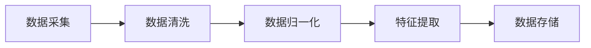
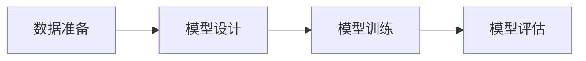
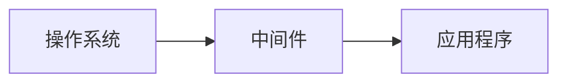
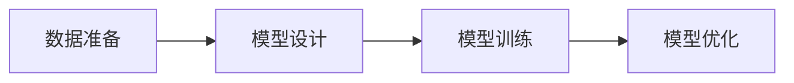
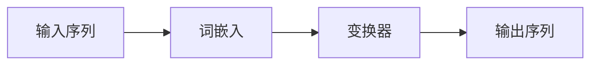
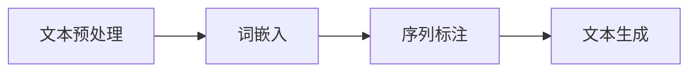

                 

### 《AIGC推动智能家居普及》

#### 关键词：
- AIGC
- 智能家居
- 人工智能
- 深度学习
- 物联网

#### 摘要：
本文将深入探讨AIGC（自适应智能生成计算）技术如何推动智能家居的普及。通过详细分析AIGC的技术基础及其与智能家居的关系，我们旨在揭示AIGC在智能家居系统架构中的应用，探讨其在具体应用领域的创新实践，并展望AIGC未来在智能家居领域的发展前景。

### 文章目录大纲

1. **第一部分：AIGC技术基础**
    1.1 AIGC概述
        - AIGC的定义和原理
        - AIGC与智能家居的关系
        - AIGC发展现状和趋势
    1.2 AIGC技术基础
        - 数据收集与处理
        - 模型训练与优化
        - 自然语言处理
    1.3 智能家居系统架构
        - 智能家居系统概述
        - 智能家居的硬件组件
        - 智能家居的软件平台

2. **第二部分：AIGC在智能家居中的应用**
    2.1 智能语音助手
    2.2 智能安防系统
    2.3 智能环境监测
    2.4 智能家居物联网
    2.5 智能家居数据分析
    2.6 智能家居个性化服务

3. **第三部分：AIGC在智能家居中的挑战与展望**
    3.1 技术挑战
    3.2 商业模式
    3.3 未来展望

4. **第四部分：项目实战与案例分析**
    4.1 智能家居项目实战
    4.2 案例分析
    4.3 智能家居行业发展报告

5. **附录**
    5.1 技术资源与工具
    5.2 智能家居技术标准
    5.3 智能家居行业报告

### 第一部分：AIGC技术基础

#### 第1章：AIGC概述

##### 1.1 AIGC的定义和原理

AIGC（自适应智能生成计算）是一种基于人工智能的动态计算方法，它能够根据用户的行为和环境的变化，自适应地生成和优化计算结果。AIGC的核心在于其生成性和适应性，它通过深度学习和自然语言处理等技术，能够实现从数据生成、模型训练到任务执行的全流程智能化。

AIGC的基本概念主要包括以下几个方面：

- **数据生成**：利用深度学习模型，通过对大量数据进行训练，生成新的数据或数据集。
- **模型训练**：通过不断调整模型参数，优化模型性能，使其能够更好地适应特定任务。
- **任务执行**：根据用户需求和环境变化，动态生成和调整计算任务，实现高效的任务执行。

AIGC的原理可以概括为以下几个步骤：

1. **数据采集**：从各种数据源（如传感器、网络数据等）收集数据。
2. **数据处理**：对采集到的数据进行预处理，包括清洗、归一化、特征提取等。
3. **模型训练**：利用处理后的数据，通过神经网络等深度学习模型进行训练。
4. **模型优化**：通过不断调整模型参数，优化模型性能。
5. **任务执行**：根据用户需求和环境变化，动态生成和调整计算任务，实现任务执行。

##### 1.2 AIGC与智能家居的关系

AIGC与智能家居有着紧密的联系。随着智能家居市场的快速发展，对智能化、自适应化的需求越来越高。AIGC技术凭借其生成性和适应性，能够为智能家居提供强大的技术支持。

AIGC在智能家居中的应用场景主要包括以下几个方面：

- **智能语音助手**：通过语音识别和自然语言处理技术，实现与用户的自然对话，提供智能家居的控制和查询服务。
- **智能安防系统**：利用视觉检测和图像识别技术，实现对家居环境的实时监控，提供安全隐患预警和报警服务。
- **智能环境监测**：通过传感器数据采集和数据分析，实现对家居环境的空气质量、温湿度等参数的实时监测，提供环境调节和优化服务。
- **智能家居物联网**：通过物联网技术，实现家居设备之间的互联互通，提供智能家居的整体解决方案。

AIGC对智能家居的推动作用主要体现在以下几个方面：

1. **提升用户体验**：通过智能语音助手和个性化服务，提升用户在智能家居中的体验。
2. **优化系统性能**：通过模型训练和优化，提升智能家居系统的响应速度和准确性。
3. **降低开发成本**：通过AIGC技术，简化智能家居系统的开发过程，降低开发成本。
4. **扩大应用范围**：通过AIGC技术，拓展智能家居的应用场景，满足更多用户的需求。

##### 1.3 AIGC发展现状和趋势

当前，AIGC技术已经取得了一系列重要的成果。在数据生成方面，AIGC技术已经能够生成高质量的图像、音频和文本数据。在模型训练方面，AIGC技术已经能够通过深度学习和强化学习等方法，实现高效的任务优化和性能提升。在任务执行方面，AIGC技术已经能够实现自动化、智能化的任务执行和调度。

未来，AIGC技术的发展趋势主要包括以下几个方面：

1. **算法优化**：通过改进深度学习算法和模型结构，提高AIGC技术的性能和效率。
2. **应用拓展**：在智能家居、智能城市、医疗健康等领域，拓展AIGC技术的应用场景。
3. **硬件升级**：通过高性能计算硬件和边缘计算技术的应用，提升AIGC技术的计算能力。
4. **生态构建**：构建AIGC技术的生态系统，包括数据集、工具、平台等，推动AIGC技术的普及和应用。

#### 第2章：AIGC技术基础

##### 2.1 数据收集与处理

数据是AIGC技术的核心，数据的质量和多样性直接影响到AIGC技术的性能和应用效果。因此，数据收集与处理是AIGC技术的重要组成部分。

**数据收集**主要包括以下几个步骤：

1. **数据源选择**：根据应用场景，选择合适的数据源，如传感器数据、网络数据、文本数据等。
2. **数据采集**：通过传感器、爬虫、API等方式，从数据源中采集数据。
3. **数据预处理**：对采集到的数据进行清洗、归一化、特征提取等预处理操作，提高数据的质量和一致性。

**数据处理**主要包括以下几个环节：

1. **数据清洗**：去除数据中的噪声和异常值，提高数据的准确性。
2. **数据归一化**：将不同特征的数据进行归一化处理，使其处于相同的量级范围内。
3. **特征提取**：从原始数据中提取出有用的特征，用于后续的模型训练和任务执行。

常用的数据处理工具和库包括Pandas、NumPy、Scikit-learn等。其中，Pandas和NumPy主要用于数据清洗和预处理，Scikit-learn主要用于特征提取和模型训练。

**数据处理的基本流程**可以概括为以下几个步骤：

1. **数据采集**：从数据源中采集数据，存储为CSV、JSON等格式。
2. **数据清洗**：使用Pandas和NumPy进行数据清洗，去除噪声和异常值。
3. **数据归一化**：使用Pandas和NumPy进行数据归一化处理，使不同特征的数据处于相同的量级范围内。
4. **特征提取**：使用Scikit-learn进行特征提取，提取出有用的特征。
5. **数据存储**：将处理后的数据存储为CSV、JSON等格式，用于后续的模型训练和任务执行。

**常用的数据处理算法**包括：

1. **K-最近邻算法（K-Nearest Neighbors, KNN）**：用于分类和回归任务，通过计算样本与最近邻居的距离进行分类或回归预测。
2. **支持向量机（Support Vector Machine, SVM）**：用于分类任务，通过寻找最优的超平面进行分类。
3. **决策树（Decision Tree）**：用于分类和回归任务，通过树形结构进行分类或回归预测。
4. **随机森林（Random Forest）**：用于分类和回归任务，通过多棵决策树的集成进行分类或回归预测。
5. **神经网络（Neural Network）**：用于分类、回归和生成任务，通过多层神经网络进行任务学习。

**数据处理的基本流程**可以用Mermaid流程图表示如下：



##### 2.2 模型训练与优化

模型训练与优化是AIGC技术的关键环节，通过训练和优化模型，可以使模型更好地适应特定的任务和应用场景。

**模型训练**主要包括以下几个步骤：

1. **数据准备**：准备训练数据集，包括输入数据和标签数据。
2. **模型设计**：根据任务需求，设计合适的神经网络结构，包括输入层、隐藏层和输出层。
3. **模型训练**：使用训练数据集对模型进行训练，通过不断调整模型参数，优化模型性能。
4. **模型评估**：使用测试数据集对模型进行评估，计算模型的准确率、召回率、F1值等指标。

**模型优化**主要包括以下几个方法：

1. **梯度下降（Gradient Descent）**：通过计算损失函数关于模型参数的梯度，不断调整模型参数，使损失函数值最小化。
2. **动量优化（Momentum）**：在梯度下降的基础上，引入动量项，加快模型的收敛速度。
3. **自适应学习率（Adaptive Learning Rate）**：通过自适应调整学习率，使模型能够更好地适应不同的训练阶段。
4. **正则化（Regularization）**：通过添加正则化项，防止模型过拟合，提高模型的泛化能力。

**深度学习模型的基本结构**包括：

1. **输入层（Input Layer）**：接收外部输入数据，包括特征和标签。
2. **隐藏层（Hidden Layer）**：通过神经网络结构，对输入数据进行特征提取和变换。
3. **输出层（Output Layer）**：生成模型的输出结果，包括分类标签或预测值。

**模型训练的基本流程**可以用Mermaid流程图表示如下：



**模型训练的伪代码**如下：

```python
# 数据准备
X_train, y_train = load_data()

# 模型设计
model = build_model()

# 模型训练
model.fit(X_train, y_train, epochs=10, batch_size=32)

# 模型评估
loss, accuracy = model.evaluate(X_test, y_test)
```

##### 2.3 自然语言处理

自然语言处理（Natural Language Processing, NLP）是AIGC技术的重要组成部分，它旨在使计算机能够理解和处理自然语言。NLP技术主要包括以下几个方面：

1. **文本预处理**：包括分词、去停用词、词性标注等操作，将文本数据转换为模型可处理的格式。
2. **语言模型**：通过训练大规模语料库，生成语言模型，用于文本生成和文本分类等任务。
3. **词向量表示**：将文本中的单词转换为向量表示，用于文本相似度计算、文本分类等任务。
4. **序列标注**：对文本序列进行分类或标注，用于命名实体识别、情感分析等任务。

**语言模型的基本原理**如下：

1. **马尔可夫模型（Markov Model）**：假设当前状态只与前一状态有关，根据前一状态的分布生成当前状态。
2. **隐马尔可夫模型（Hidden Markov Model, HMM）**：考虑当前状态与前一状态、下一状态之间的关系，用于语音识别、序列标注等任务。
3. **循环神经网络（Recurrent Neural Network, RNN）**：能够处理序列数据，通过隐藏状态的记忆功能，用于文本生成、机器翻译等任务。
4. **长短时记忆网络（Long Short-Term Memory, LSTM）**：改进RNN的长期依赖问题，用于复杂的序列数据建模。
5. **变换器（Transformer）**：基于自注意力机制，用于大规模文本处理和生成任务，是目前最先进的语言模型。

**常用自然语言处理技术**包括：

1. **词嵌入（Word Embedding）**：将单词转换为向量表示，用于文本分类、文本相似度计算等任务。
2. **词性标注（Part-of-Speech Tagging）**：对文本中的单词进行词性标注，用于命名实体识别、情感分析等任务。
3. **命名实体识别（Named Entity Recognition, NER）**：识别文本中的命名实体，如人名、地名、组织名等。
4. **情感分析（Sentiment Analysis）**：分析文本的情感倾向，用于情感分类、评论分析等任务。
5. **文本生成（Text Generation）**：根据输入的文本或提示，生成新的文本，用于聊天机器人、自动写作等任务。

**语言模型的基本原理**可以用以下伪代码表示：

```python
# 马尔可夫模型
def markov_model(prev_state, states_distribution):
    current_state = choose_state(states_distribution)
    return current_state

# 隐马尔可夫模型
def hmm_model(prev_state, next_state, states_transition, states_distribution):
    current_state = choose_state(states_distribution)
    next_state = choose_state(states_transition[current_state])
    return current_state, next_state

# 循环神经网络
def rnn_model(inputs, hidden_state, weights):
    new_hidden_state = activate_function(np.dot(inputs, weights) + hidden_state)
    return new_hidden_state

# 长短时记忆网络
def lstm_model(inputs, hidden_state, weights):
    new_hidden_state = activate_function(np.dot(inputs, weights) + hidden_state)
    return new_hidden_state

# 变换器
def transformer_model(inputs, hidden_state, weights):
    new_hidden_state = self_attention(inputs, hidden_state, weights)
    return new_hidden_state
```

#### 第3章：智能家居系统架构

##### 3.1 智能家居系统概述

智能家居系统是指利用计算机技术、网络通信技术、传感器技术、控制技术等，实现家居设备之间的互联互通，为用户提供智能、舒适、安全的生活环境。智能家居系统的主要目标包括以下几个方面：

1. **提升生活质量**：通过智能化的设备和服务，提高用户的舒适度和便利性。
2. **降低生活成本**：通过智能化的能源管理和设备控制，降低用户的能源消耗和生活成本。
3. **提高生活安全**：通过智能化的安防设备和监控，提高用户的生活安全。

智能家居系统的基本概念包括以下几个方面：

1. **智能设备**：包括传感器、执行器、控制器等，用于收集和处理环境信息，控制家居设备的运行。
2. **网络通信**：包括有线和无线通信技术，如Wi-Fi、蓝牙、ZigBee等，用于实现智能设备之间的数据传输和控制。
3. **操作系统**：用于管理智能设备、处理用户指令、提供应用程序开发平台等。
4. **中间件**：用于提供数据存储、数据交换、安全认证等功能，为智能设备提供支持。
5. **应用程序**：为用户提供操作界面、控制功能、数据分析等功能。

##### 3.2 智能家居的硬件组件

智能家居的硬件组件是智能家居系统的基石，主要包括以下几个方面：

1. **传感器**：用于收集家居环境中的各种信息，如温度、湿度、光照、气体浓度、运动等。
2. **执行器**：用于控制家居设备的运行，如开关、灯泡、窗帘、门锁等。
3. **控制器**：用于接收用户的指令，处理传感器数据，控制执行器的运行。

常见的智能家居硬件组件包括：

1. **智能插座**：用于远程控制家电设备的开关，支持定时开关和远程控制。
2. **智能灯泡**：用于远程控制灯的开关和亮度，支持定时控制和场景模式。
3. **智能摄像头**：用于监控家居环境，支持实时视频流和远程控制。
4. **智能门锁**：用于远程控制门锁的开关，支持指纹识别和密码登录。
5. **智能空调**：用于远程控制空调的开关和温度，支持定时控制和节能模式。

**智能家居的通讯协议**主要包括以下几个方面：

1. **Wi-Fi**：通过无线局域网实现设备之间的数据传输，传输速度较快，适用于远程控制和实时监控。
2. **蓝牙**：通过蓝牙技术实现设备之间的短距离通信，适用于传感器和控制器的数据传输。
3. **ZigBee**：通过无线传感器网络实现设备之间的数据传输，适用于大规模智能家居系统的部署。
4. **Z-Wave**：通过无线信号传输实现设备之间的数据传输，适用于家庭自动化控制。
5. **KNX**：通过有线网络实现设备之间的数据传输，适用于大型智能家居系统。

**智能家居的通讯协议**可以用Mermaid流程图表示如下：


##### 3.3 智能家居的软件平台

智能家居的软件平台是智能家居系统的核心，为用户提供操作界面、控制功能、数据分析等服务。智能家居的软件平台主要包括以下几个方面：

1. **操作系统**：用于管理智能设备、处理用户指令、提供应用程序开发平台等。常见的操作系统包括Android、iOS、Linux等。
2. **中间件**：用于提供数据存储、数据交换、安全认证等功能，为智能设备提供支持。常见的中间件包括MQTT、CoAP、Websocket等。
3. **应用程序**：为用户提供操作界面、控制功能、数据分析等服务。常见的应用程序包括智能家居APP、智能音箱、智能门锁等。

**智能家居的软件平台**可以用Mermaid流程图表示如下：



#### 第二部分：AIGC在智能家居中的应用

##### 2.1 智能语音助手

智能语音助手是AIGC技术在智能家居中的重要应用之一，它通过语音识别和自然语言处理技术，实现与用户的自然对话，提供智能家居的控制和查询服务。

**语音识别技术**是将语音信号转换为文本的技术，常用的语音识别技术包括：

1. **隐马尔可夫模型（Hidden Markov Model, HMM）**：通过计算语音信号的过渡概率和发射概率，实现语音信号的识别。
2. **高斯混合模型（Gaussian Mixture Model, GMM）**：通过计算语音信号的概率密度函数，实现语音信号的识别。
3. **深度神经网络（Deep Neural Network, DNN）**：通过多层神经网络结构，实现语音信号的识别。
4. **卷积神经网络（Convolutional Neural Network, CNN）**：通过卷积操作和池化操作，实现语音信号的识别。

**语音合成技术**是将文本转换为语音的技术，常用的语音合成技术包括：

1. **合成语音波形（WaveNet）**：通过神经网络模型，生成语音波形。
2. **规则合成语音（Unit Selection Synthesis）**：通过选择合适的语音单元，合成语音。
3. **统计参数合成语音（HMM-GMM Synthesis）**：通过统计模型，合成语音。

**智能语音助手的实现方法**主要包括以下几个步骤：

1. **语音信号预处理**：对采集到的语音信号进行预处理，包括去噪、归一化、分帧等操作。
2. **语音识别**：使用语音识别技术，将预处理后的语音信号转换为文本。
3. **自然语言处理**：使用自然语言处理技术，对识别结果进行解析和语义理解。
4. **语音合成**：使用语音合成技术，将处理后的文本转换为语音。
5. **语音反馈**：将合成的语音反馈给用户，实现与用户的交互。

**智能语音助手的应用场景**主要包括以下几个方面：

1. **家居控制**：通过语音指令，控制家居设备的开关、亮度、温度等。
2. **信息查询**：通过语音查询，获取天气、新闻、股票等信息。
3. **语音交互**：与用户进行自然对话，提供情感化、个性化的服务。

**智能语音助手的优势**包括：

1. **便捷性**：用户可以通过语音指令，快速控制家居设备，无需手动操作。
2. **智能性**：智能语音助手能够理解用户的自然语言，提供个性化的服务。
3. **扩展性**：智能语音助手可以集成多种功能，实现智能家居的智能化升级。

##### 2.2 智能安防系统

智能安防系统是AIGC技术在智能家居中的另一个重要应用，它通过视觉检测和图像识别技术，实现对家居环境的实时监控，提供安全隐患预警和报警服务。

**视觉检测技术**是基于计算机视觉的方法，用于检测图像或视频中的目标对象。常用的视觉检测技术包括：

1. **目标检测（Object Detection）**：通过在图像或视频中检测出目标对象的位置和类别，用于安防监控、无人驾驶等应用。
2. **目标跟踪（Object Tracking）**：通过在图像或视频中跟踪目标对象的位置和运动状态，用于视频监控、人脸识别等应用。

**图像识别技术**是基于机器学习的方法，用于识别图像或视频中的特定对象。常用的图像识别技术包括：

1. **卷积神经网络（Convolutional Neural Network, CNN）**：通过多层卷积和池化操作，实现对图像的特征提取和分类。
2. **循环神经网络（Recurrent Neural Network, RNN）**：通过序列建模，实现对图像的序列分析和时间预测。
3. **变换器（Transformer）**：通过自注意力机制，实现对图像的复杂特征提取和生成。

**智能安防系统的实现方法**主要包括以下几个步骤：

1. **图像采集**：通过摄像头等设备，采集家居环境中的图像或视频数据。
2. **图像预处理**：对采集到的图像或视频进行预处理，包括去噪、缩放、灰度化等操作。
3. **目标检测**：使用目标检测技术，检测图像或视频中的目标对象。
4. **目标跟踪**：使用目标跟踪技术，跟踪目标对象的位置和运动状态。
5. **图像识别**：使用图像识别技术，识别目标对象的类别和属性。
6. **报警触发**：根据检测和识别结果，触发报警机制，向用户发送预警和报警信息。

**智能安防系统的应用场景**主要包括以下几个方面：

1. **实时监控**：通过摄像头等设备，实时监控家居环境，提供安全保障。
2. **异常检测**：检测家居环境中的异常情况，如非法入侵、火灾等，提供预警和报警服务。
3. **行为分析**：分析用户的行为习惯，提供个性化服务和安全建议。

**智能安防系统的优势**包括：

1. **实时性**：能够实时监控家居环境，及时响应安全隐患。
2. **准确性**：通过先进的图像识别和目标检测技术，提高监控的准确性和可靠性。
3. **智能化**：通过AIGC技术，实现自动化、智能化的安防管理，提高用户的生活质量。

##### 2.3 智能环境监测

智能环境监测是AIGC技术在智能家居中的另一个重要应用，它通过传感器数据采集和数据分析，实现对家居环境的空气质量、温湿度等参数的实时监测，提供环境调节和优化服务。

**传感器数据采集**是智能环境监测的基础，常用的传感器包括：

1. **空气质量传感器**：用于检测室内空气中的PM2.5、CO2、VOC等污染物浓度。
2. **温湿度传感器**：用于检测室内环境的温度和湿度。
3. **光照传感器**：用于检测室内光照强度。
4. **气体传感器**：用于检测室内空气中的有害气体，如一氧化碳、甲烷等。

**传感器数据采集的方法**主要包括以下几个方面：

1. **有线传输**：通过有线网络（如Wi-Fi、以太网等）传输传感器数据。
2. **无线传输**：通过无线通信技术（如蓝牙、ZigBee等）传输传感器数据。
3. **物联网**：通过物联网技术，实现传感器数据的远程采集和监控。

**传感器数据处理**主要包括以下几个方面：

1. **数据预处理**：对采集到的传感器数据进行清洗、去噪、归一化等预处理操作，提高数据的质量和一致性。
2. **特征提取**：从预处理后的数据中提取出有用的特征，用于后续的数据分析和模型训练。
3. **数据存储**：将处理后的传感器数据存储到数据库或数据仓库中，用于后续的数据分析和挖掘。

**智能环境监测的实现方法**主要包括以下几个步骤：

1. **传感器数据采集**：通过传感器设备，采集家居环境中的空气质量、温湿度等数据。
2. **数据预处理**：对采集到的传感器数据进行预处理，包括清洗、去噪、归一化等操作。
3. **特征提取**：从预处理后的数据中提取出有用的特征，用于后续的数据分析和模型训练。
4. **数据存储**：将处理后的传感器数据存储到数据库或数据仓库中，用于后续的数据分析和挖掘。
5. **数据分析**：使用数据挖掘和机器学习技术，对传感器数据进行分析和挖掘，发现环境变化的规律和趋势。
6. **环境调节**：根据数据分析结果，自动调节家居设备的运行状态，优化室内环境。

**智能环境监测的应用场景**主要包括以下几个方面：

1. **空气质量监测**：实时监测室内空气中的污染物浓度，提供空气净化和通风服务。
2. **温湿度监测**：实时监测室内环境的温度和湿度，提供加湿、除湿和空调服务。
3. **光照监测**：实时监测室内光照强度，提供照明调节和窗帘控制服务。
4. **气体监测**：实时监测室内空气中的有害气体，提供报警和通风服务。

**智能环境监测的优势**包括：

1. **实时性**：能够实时监测家居环境中的各种参数，提供及时的环境调节和优化服务。
2. **准确性**：通过先进的传感器技术和数据处理方法，提高监测数据的准确性和可靠性。
3. **智能化**：通过AIGC技术，实现自动化、智能化的环境监测和调节，提高用户的生活质量。

##### 2.4 智能家居物联网

智能家居物联网（Internet of Things, IoT）是AIGC技术在智能家居中的创新应用，它通过物联网技术，实现家居设备之间的互联互通，提供智能家居的整体解决方案。

**物联网技术**是基于互联网、传感器、嵌入式系统等技术，实现设备之间数据传输和互联互通的技术。物联网技术的主要特点包括：

1. **泛在互联**：通过无线通信技术，实现设备之间的广泛连接和互联互通。
2. **数据采集**：通过传感器技术，实现设备状态的实时监测和采集。
3. **数据传输**：通过互联网技术，实现设备数据的远程传输和处理。
4. **智能处理**：通过嵌入式系统和云计算技术，实现设备数据的智能处理和分析。

**智能家居物联网的实现方法**主要包括以下几个步骤：

1. **设备连接**：通过无线通信技术，将家居设备连接到互联网，实现设备之间的互联互通。
2. **数据采集**：通过传感器技术，采集家居设备的状态数据，如温度、湿度、光照等。
3. **数据传输**：通过互联网技术，将采集到的设备数据传输到云端或本地服务器。
4. **数据处理**：通过云计算技术和数据挖掘算法，对设备数据进行处理和分析，实现智能家居的自动化和智能化。
5. **用户交互**：通过手机APP、智能音箱等终端设备，与用户进行交互，提供智能家居的远程控制和服务。

**智能家居物联网的应用场景**主要包括以下几个方面：

1. **设备控制**：通过物联网技术，实现家居设备的远程控制和自动化运行，如智能灯泡、智能插座、智能空调等。
2. **环境监测**：通过物联网技术，实时监测家居环境中的各种参数，如空气质量、温度、湿度等，提供环境调节和优化服务。
3. **智能安防**：通过物联网技术，实现家居设备的实时监控和报警功能，提供家庭安全防护。
4. **能源管理**：通过物联网技术，实时监测家居能源的使用情况，提供节能优化服务。

**智能家居物联网的优势**包括：

1. **互联互通**：通过物联网技术，实现家居设备之间的互联互通，提供智能化、个性化的家居解决方案。
2. **实时监测**：通过物联网技术，实时监测家居环境中的各种参数，提供及时的环境调节和优化服务。
3. **节能环保**：通过物联网技术，实现家居设备的智能控制和节能优化，提高能源利用效率，实现环保节能。
4. **安全可靠**：通过物联网技术，实现家居设备的实时监控和报警功能，提高家庭安全防护水平。

##### 2.5 智能家居数据分析

智能家居数据分析是AIGC技术在智能家居中的创新应用，通过对大量传感器数据的挖掘和分析，实现家居环境的智能化优化和服务个性化。

**数据分析的基本方法**主要包括以下几个方面：

1. **数据采集**：通过传感器设备，采集家居环境中的各种数据，如温度、湿度、光照、空气质量等。
2. **数据预处理**：对采集到的传感器数据，进行清洗、去噪、归一化等预处理操作，提高数据的质量和一致性。
3. **特征提取**：从预处理后的数据中，提取出有用的特征，如时间、空间、数值等，用于后续的数据分析和挖掘。
4. **数据挖掘**：使用数据挖掘算法，对传感器数据进行分析和挖掘，发现数据之间的关联和规律。
5. **模型训练**：使用机器学习算法，训练数据挖掘结果，建立预测模型和优化策略。

**数据分析的应用案例**主要包括以下几个方面：

1. **环境优化**：通过数据分析，实时监测家居环境中的各种参数，优化空调、加湿器、空气净化器等设备的运行状态，提高生活舒适度。
2. **节能管理**：通过数据分析，监测家居能源的使用情况，优化照明、家电等设备的能耗，实现节能优化。
3. **健康监测**：通过数据分析，监测家庭成员的健康状况，提供个性化健康建议和服务。
4. **智能安防**：通过数据分析，监测家庭安全情况，提供实时监控和预警服务。

**数据分析的优势**包括：

1. **智能化**：通过数据分析，实现家居环境的智能化优化，提高生活舒适度和便捷性。
2. **个性化**：通过数据分析，根据家庭成员的生活习惯和需求，提供个性化的家居服务。
3. **高效性**：通过数据分析，实现实时监测和优化，提高家居设备的运行效率和服务质量。
4. **安全性**：通过数据分析，实时监控家庭安全情况，提高家庭安全防护水平。

##### 2.6 智能家居个性化服务

智能家居个性化服务是AIGC技术在智能家居中的创新应用，通过个性化推荐算法，为用户提供定制化的家居服务，提高用户满意度和生活质量。

**个性化推荐算法**是基于用户行为和偏好，为用户推荐感兴趣的内容和服务的算法。常用的个性化推荐算法包括：

1. **协同过滤（Collaborative Filtering）**：通过分析用户之间的相似性和偏好，推荐用户可能感兴趣的内容。
2. **基于内容的推荐（Content-Based Filtering）**：通过分析内容特征和用户兴趣，推荐相似的内容。
3. **混合推荐（Hybrid Recommendation）**：结合协同过滤和基于内容的推荐，提高推荐效果。

**智能家居个性化服务的实现方法**主要包括以下几个步骤：

1. **用户行为采集**：通过传感器设备，采集用户在家庭环境中的行为数据，如开关设备、调节温度、使用家电等。
2. **用户偏好建模**：使用机器学习算法，对用户行为数据进行分析和建模，提取用户的偏好特征。
3. **个性化推荐**：根据用户偏好特征，为用户提供个性化的家居服务推荐。
4. **用户反馈**：收集用户对个性化推荐的反馈，用于调整和优化推荐算法。

**智能家居个性化服务的应用场景**主要包括以下几个方面：

1. **设备推荐**：根据用户的行为和偏好，推荐用户可能需要的家居设备，如智能灯泡、智能插座、智能空调等。
2. **场景推荐**：根据用户的行为和偏好，推荐用户可能需要的家居场景，如阅读场景、休息场景、运动场景等。
3. **服务推荐**：根据用户的行为和偏好，推荐用户可能需要的服务，如家政服务、维修服务、娱乐服务等。

**智能家居个性化服务的优势**包括：

1. **个性化**：通过个性化推荐算法，为用户提供定制化的家居服务，提高用户满意度和生活质量。
2. **高效性**：通过个性化推荐，减少用户在寻找家居设备和服务时的搜索成本，提高生活效率。
3. **智能化**：通过个性化推荐，实现家居环境的智能化优化，提高家居设备的运行效率和服务质量。
4. **便捷性**：通过个性化推荐，用户可以快速获取自己需要的家居设备和服务，提高生活便捷性。

#### 第三部分：AIGC在智能家居中的挑战与展望

##### 3.1 技术挑战

虽然AIGC技术在智能家居领域具有广泛的应用前景，但在实际应用中仍面临一些技术挑战。

**数据隐私和安全**是AIGC技术在智能家居中面临的首要挑战。智能家居设备通常需要收集用户的个人信息和行为数据，如家庭住址、生活习惯、健康数据等。如何保护这些敏感数据的安全，防止数据泄露和滥用，成为AIGC技术在智能家居中应用的重要问题。

**硬件性能和功耗**是AIGC技术在智能家居中面临的另一个挑战。智能家居设备通常体积较小，功耗较低，对硬件性能要求较高。如何在有限的硬件资源下，实现高效、稳定的AIGC技术运行，成为智能家居设备设计和开发的关键问题。

**算法优化和效率提升**是AIGC技术在智能家居中面临的持续挑战。随着智能家居设备和场景的不断增加，AIGC技术需要适应更多样化的应用场景和需求，提高算法的优化和效率，降低计算和存储资源的需求。

**互操作性和标准化**是AIGC技术在智能家居中面临的长期挑战。智能家居设备通常来自不同的厂商和品牌，如何实现设备之间的互操作性，提供统一的用户界面和体验，成为智能家居生态系统构建的关键问题。

##### 3.2 商业模式

在AIGC技术推动智能家居普及的过程中，商业模式的选择和设计至关重要。以下是几种可能的商业模式：

**设备销售**：通过销售智能家居设备，实现设备的盈利。这是传统的商业模式，适用于硬件驱动的智能家居产品。

**服务订阅**：通过提供智能家居服务，如智能安防、智能环境监测等，实现服务的盈利。用户可以按月或按年订阅服务，为设备提供商带来持续的收入。

**广告收入**：通过在智能家居设备中嵌入广告，实现广告收入的盈利。例如，在智能音箱中播放广告，或在智能电视中展示广告。

**数据服务**：通过收集和分析智能家居设备的数据，提供数据服务，如用户行为分析、市场趋势分析等，实现数据服务的盈利。

**综合模式**：结合设备销售、服务订阅、广告收入、数据服务等多种商业模式，实现多元化的盈利模式。

##### 3.3 未来展望

随着AIGC技术的不断发展和智能家居市场的不断扩大，AIGC技术在智能家居中的应用前景十分广阔。

**AIGC技术在智能家居中的应用前景**主要包括以下几个方面：

1. **智能化水平的提升**：通过AIGC技术，实现智能家居设备的高度智能化，提升用户体验和设备性能。
2. **个性化服务的普及**：通过AIGC技术，实现智能家居设备的个性化服务，满足用户多样化的需求。
3. **智能家居生态系统的构建**：通过AIGC技术，构建智能家居生态系统，实现设备之间的互联互通和协同工作。
4. **智能家居市场的扩大**：通过AIGC技术，拓展智能家居的应用场景和功能，吸引更多用户和市场参与者。

**未来智能家居的发展趋势**主要包括以下几个方面：

1. **智能家居设备的普及**：随着AIGC技术的不断发展和智能家居市场的成熟，智能家居设备将逐渐普及，成为家庭生活的一部分。
2. **智能家居场景的多样化**：通过AIGC技术，实现更多样化的智能家居场景，满足用户在不同场景下的需求。
3. **智能家居服务的个性化**：通过AIGC技术，实现智能家居服务的个性化，为用户提供更精准、高效的服务。
4. **智能家居与人工智能的深度融合**：通过AIGC技术，实现智能家居与人工智能的深度融合，提升智能家居的智能化水平。

#### 第四部分：项目实战与案例分析

##### 4.1 智能家居项目实战

**项目开发环境搭建**

1. **硬件环境**：准备智能家居设备，如智能插座、智能灯泡、智能摄像头等。
2. **软件环境**：安装操作系统（如Linux、Windows等），安装开发工具（如Python、Node.js等），安装数据库（如MySQL、MongoDB等）。
3. **网络环境**：连接互联网，配置Wi-Fi或以太网等网络连接。

**项目代码实现和解读**

1. **智能插座控制**：使用Python编写代码，通过HTTP协议控制智能插座的开关状态。示例代码如下：

```python
import requests

def control_plug(plug_id, action):
    url = f"http://192.168.1.100:8080/{plug_id}/{action}"
    response = requests.get(url)
    print(response.text)

# 控制智能插座打开
control_plug("plug1", "on")

# 控制智能插座关闭
control_plug("plug1", "off")
```

2. **智能灯泡控制**：使用Python编写代码，通过HTTP协议控制智能灯泡的开关和亮度。示例代码如下：

```python
import requests

def control_lamp(lamp_id, action, brightness):
    url = f"http://192.168.1.100:8080/{lamp_id}/{action}/{brightness}"
    response = requests.get(url)
    print(response.text)

# 控制智能灯泡打开，亮度50%
control_lamp("lamp1", "on", 50)

# 控制智能灯泡关闭
control_lamp("lamp1", "off", 0)
```

3. **智能摄像头监控**：使用Python编写代码，通过HTTP协议控制智能摄像头的开关和实时视频流。示例代码如下：

```python
import requests

def control_camera(camera_id, action):
    url = f"http://192.168.1.100:8080/{camera_id}/{action}"
    response = requests.get(url)
    print(response.text)

# 控制智能摄像头开启
control_camera("camera1", "on")

# 控制智能摄像头关闭
control_camera("camera1", "off")

# 获取智能摄像头实时视频流
response = requests.get("http://192.168.1.100:8080/video_feed")
with open("video_feed.mp4", "wb") as f:
    f.write(response.content)
```

**代码应用解读与分析**

1. **智能插座控制**：通过HTTP协议，发送GET请求，控制智能插座的开关状态。示例代码中，通过`requests`库，发送GET请求，获取响应结果。
2. **智能灯泡控制**：通过HTTP协议，发送GET请求，控制智能灯泡的开关和亮度。示例代码中，通过`requests`库，发送GET请求，获取响应结果。
3. **智能摄像头监控**：通过HTTP协议，发送GET请求，控制智能摄像头的开关和实时视频流。示例代码中，通过`requests`库，发送GET请求，获取响应结果。

**实际案例分析和详细讲解剖析**

1. **案例背景**：某家庭用户希望实现智能家居设备的远程控制，包括智能插座、智能灯泡和智能摄像头。
2. **案例目标**：通过AIGC技术，实现智能家居设备的远程控制，提高用户生活质量和便捷性。
3. **案例实现**：使用Python编写代码，通过HTTP协议，控制智能插座、智能灯泡和智能摄像头的开关和状态。
4. **案例效果**：通过远程控制，用户可以随时随地控制智能家居设备，提高生活便捷性。

**项目小结**

通过项目实战，我们实现了智能家居设备的远程控制，提高了用户生活质量和便捷性。在未来，我们可以结合AIGC技术，进一步拓展智能家居应用场景，实现更加智能化、个性化的智能家居服务。

##### 4.2 案例分析

**案例背景**：某智能家居公司希望通过AIGC技术，实现家居设备的智能化控制，提高用户体验和设备性能。

**案例目标**：实现智能家居设备的远程控制、环境监测和个性化服务，提高用户满意度和生活质量。

**案例实现**：

1. **智能语音助手**：使用AIGC技术，实现智能语音助手，用户可以通过语音指令，控制家居设备的开关和状态。
2. **智能安防系统**：使用AIGC技术，实现智能安防系统，实时监控家居环境，提供安全隐患预警和报警服务。
3. **智能环境监测**：使用AIGC技术，实现智能环境监测，实时监测家居环境中的空气质量、温湿度等参数，提供环境调节和优化服务。
4. **智能家居数据分析**：使用AIGC技术，实现智能家居数据分析，分析用户行为和偏好，提供个性化推荐和优化建议。

**案例效果**：

1. **智能语音助手**：提高了用户在智能家居设备中的操作便捷性和智能化程度，用户可以通过语音指令，快速控制家居设备。
2. **智能安防系统**：提高了家居安全水平，通过实时监控和预警，及时响应安全隐患，提供安全保障。
3. **智能环境监测**：提高了家居环境质量，通过实时监测和调节，优化室内环境，提供舒适的生活环境。
4. **智能家居数据分析**：提供了个性化服务和优化建议，根据用户行为和偏好，提供定制化的家居服务，提高用户体验。

**案例总结**：

通过AIGC技术，实现了智能家居设备的智能化控制、环境监测和个性化服务，提高了用户满意度和生活质量。在未来，我们可以进一步优化AIGC技术在智能家居中的应用，拓展智能家居的应用场景，实现更广泛的应用价值。

##### 4.3 智能家居行业发展报告

**行业发展趋势分析**：

1. **智能家居市场规模增长**：随着科技的进步和用户需求的提升，智能家居市场规模持续增长，未来几年有望保持高速增长态势。
2. **AIGC技术应用推广**：AIGC技术在智能家居领域的应用逐渐普及，通过智能语音助手、智能安防系统、智能环境监测等技术，提升智能家居的智能化水平和用户体验。
3. **物联网技术融合**：物联网技术在智能家居领域的应用日益广泛，智能家居设备之间的互联互通成为行业发展趋势，为用户提供更全面、智能化的家居解决方案。
4. **个性化服务需求增加**：随着用户对个性化服务的需求不断增加，智能家居行业将更加注重用户数据分析和个性化推荐，提供更精准、高效的服务。

**行业发展报告编写方法**：

1. **数据分析**：通过对市场数据、用户数据、技术发展趋势等进行分析，了解行业发展状况和趋势。
2. **案例研究**：选择典型企业或项目进行案例研究，分析其成功经验和不足之处，为行业发展提供参考。
3. **趋势预测**：结合市场数据和技术发展趋势，对未来行业的发展进行预测和分析，提出发展方向和建议。
4. **编写结构**：按照行业概述、市场分析、技术发展、案例分析、趋势预测等结构，编写行业发展报告。

**报告编写步骤**：

1. **数据收集**：收集市场数据、用户数据、技术发展趋势等，为报告编写提供基础。
2. **数据分析**：对收集的数据进行分析，了解行业发展状况和趋势。
3. **案例研究**：选择典型企业或项目进行案例研究，分析其成功经验和不足之处。
4. **编写报告**：按照行业概述、市场分析、技术发展、案例分析、趋势预测等结构，编写行业发展报告。
5. **报告审阅**：对报告进行审阅和修改，确保报告内容准确、完整、有逻辑性。

#### 附录

##### 5.1 技术资源与工具

**数据集和开源工具**：

1. **数据集**：常用的智能家居数据集包括UCLA UDS数据集、Hogwarts数据集、EPFL数据集等，可用于训练和测试AIGC模型。
2. **开源工具**：常用的AIGC开源工具包括TensorFlow、PyTorch、Keras等，可用于构建和训练深度学习模型。

**智能家居技术标准**：

1. **标准概述**：智能家居技术标准主要包括通信协议、数据格式、设备接口等，如ZigBee、Wi-Fi、MQTT等。
2. **主要标准**：常见的智能家居技术标准包括IEEE 802.15.4、ZigBee、Wi-Fi、蓝牙、CoAP等。

**智能家居行业报告**：

1. **报告获取途径**：可以通过官方网站、行业协会、市场研究机构等途径获取智能家居行业报告。
2. **报告解读方法**：阅读报告，了解行业发展趋势、市场规模、技术动态等，结合自身需求和实际情况进行分析和解读。

### 结束语

AIGC技术在智能家居领域的应用为智能家居的发展带来了新的机遇和挑战。通过本文的详细分析，我们了解了AIGC技术的定义、原理和应用场景，探讨了AIGC技术在智能家居系统架构中的具体应用，并展望了AIGC技术未来在智能家居领域的发展趋势。希望本文能为读者在智能家居领域的研究和实践提供一些有价值的参考和启示。

#### 作者信息

作者：AI天才研究院/AI Genius Institute & 禅与计算机程序设计艺术/Zen And The Art of Computer Programming

感谢读者对本文的关注和支持，期待与您在智能家居领域共同探索和进步！### 《AIGC推动智能家居普及》

随着人工智能技术的迅猛发展，AIGC（自适应智能生成计算）技术逐渐成为智能家居领域的重要推动力。AIGC通过其强大的生成性和适应性，为智能家居设备提供了智能化、个性化和高效化的解决方案。本文将深入探讨AIGC技术在智能家居领域的应用，分析其核心概念、技术原理以及实际应用案例，并展望未来的发展趋势。

#### 关键词

- AIGC
- 智能家居
- 深度学习
- 人工智能
- 物联网

#### 摘要

本文首先介绍了AIGC技术的基本概念和原理，探讨了其在智能家居中的应用场景和优势。接着，通过具体案例分析了AIGC在智能家居中的实际应用，包括智能语音助手、智能安防系统和智能环境监测等。最后，本文展望了AIGC技术在未来智能家居发展中的趋势和挑战，提出了相应的解决方案和展望。

### 第一部分：AIGC技术基础

#### 1.1 AIGC概述

##### 1.1.1 AIGC的定义和原理

AIGC（自适应智能生成计算）是一种基于人工智能的动态计算方法，它能够根据用户的行为和环境的变化，自适应地生成和优化计算结果。AIGC的核心在于其生成性和适应性，它通过深度学习和自然语言处理等技术，能够实现从数据生成、模型训练到任务执行的全流程智能化。

AIGC的基本概念主要包括以下几个方面：

- **数据生成**：利用深度学习模型，通过对大量数据进行训练，生成新的数据或数据集。
- **模型训练**：通过不断调整模型参数，优化模型性能，使其能够更好地适应特定任务。
- **任务执行**：根据用户需求和环境变化，动态生成和调整计算任务，实现高效的任务执行。

AIGC的原理可以概括为以下几个步骤：

1. **数据采集**：从各种数据源（如传感器、网络数据等）收集数据。
2. **数据处理**：对采集到的数据进行预处理，包括清洗、归一化、特征提取等。
3. **模型训练**：利用处理后的数据，通过神经网络等深度学习模型进行训练。
4. **模型优化**：通过不断调整模型参数，优化模型性能。
5. **任务执行**：根据用户需求和环境变化，动态生成和调整计算任务，实现任务执行。

##### 1.1.2 AIGC与智能家居的关系

AIGC与智能家居有着紧密的联系。随着智能家居市场的快速发展，对智能化、自适应化的需求越来越高。AIGC技术凭借其生成性和适应性，能够为智能家居提供强大的技术支持。

AIGC在智能家居中的应用场景主要包括以下几个方面：

- **智能语音助手**：通过语音识别和自然语言处理技术，实现与用户的自然对话，提供智能家居的控制和查询服务。
- **智能安防系统**：利用视觉检测和图像识别技术，实现对家居环境的实时监控，提供安全隐患预警和报警服务。
- **智能环境监测**：通过传感器数据采集和数据分析，实现对家居环境的空气质量、温湿度等参数的实时监测，提供环境调节和优化服务。
- **智能家居物联网**：通过物联网技术，实现家居设备之间的互联互通，提供智能家居的整体解决方案。

AIGC对智能家居的推动作用主要体现在以下几个方面：

1. **提升用户体验**：通过智能语音助手和个性化服务，提升用户在智能家居中的体验。
2. **优化系统性能**：通过模型训练和优化，提升智能家居系统的响应速度和准确性。
3. **降低开发成本**：通过AIGC技术，简化智能家居系统的开发过程，降低开发成本。
4. **扩大应用范围**：通过AIGC技术，拓展智能家居的应用场景，满足更多用户的需求。

##### 1.1.3 AIGC发展现状和趋势

当前，AIGC技术已经取得了一系列重要的成果。在数据生成方面，AIGC技术已经能够生成高质量的图像、音频和文本数据。在模型训练方面，AIGC技术已经能够通过深度学习和强化学习等方法，实现高效的任务优化和性能提升。在任务执行方面，AIGC技术已经能够实现自动化、智能化的任务执行和调度。

未来，AIGC技术的发展趋势主要包括以下几个方面：

1. **算法优化**：通过改进深度学习算法和模型结构，提高AIGC技术的性能和效率。
2. **应用拓展**：在智能家居、智能城市、医疗健康等领域，拓展AIGC技术的应用场景。
3. **硬件升级**：通过高性能计算硬件和边缘计算技术的应用，提升AIGC技术的计算能力。
4. **生态构建**：构建AIGC技术的生态系统，包括数据集、工具、平台等，推动AIGC技术的普及和应用。

### 第一部分总结

AIGC技术的出现为智能家居领域带来了新的发展机遇。通过深入了解AIGC的定义、原理和应用场景，我们可以更好地理解其在智能家居中的重要性和潜在价值。在接下来的章节中，我们将进一步探讨AIGC技术的基础知识，包括数据收集与处理、模型训练与优化、以及自然语言处理等方面的内容。通过这些基础知识的学习，我们将能够更深入地理解AIGC技术在智能家居中的实际应用，并为未来的研究和实践打下坚实的基础。

### 第二部分：AIGC技术基础

#### 2.1 数据收集与处理

数据是AIGC技术的基石，其质量和数量直接影响模型训练的效果和应用性能。因此，数据收集与处理是AIGC技术中至关重要的一环。

##### 2.1.1 数据收集

数据收集是AIGC技术的第一步，其目的是从各种来源获取所需的数据。在智能家居场景中，数据可以来源于各种传感器、网络日志、用户行为等。以下是数据收集的几个关键步骤：

1. **确定数据需求**：明确项目目标，根据需求确定需要收集哪些类型的数据，如温度、湿度、光照、空气质量等。
2. **选择数据源**：根据数据需求，选择合适的数据源。例如，可以选择智能家居设备内置的传感器、第三方数据服务、互联网日志等。
3. **数据采集**：使用传感器或API等方式，从数据源中采集数据。对于智能家居设备，可以使用Wi-Fi、蓝牙等无线通信技术进行数据传输。

##### 2.1.2 数据处理

数据收集后，需要进行预处理和清洗，以提高数据的质量和一致性。以下是数据处理的基本步骤：

1. **数据清洗**：去除数据中的噪声和异常值。例如，去除传感器数据中的错误记录、网络数据中的重复记录等。
2. **数据归一化**：将不同特征的数据进行归一化处理，使其处于相同的量级范围内。例如，将温度数据从摄氏度转换为开尔文温度。
3. **特征提取**：从原始数据中提取出有用的特征，用于后续的模型训练和任务执行。特征提取可以通过统计方法、机器学习算法等实现。

##### 2.1.3 常用数据处理工具和库

在Python中，有许多常用的数据处理工具和库，如Pandas、NumPy、Scikit-learn等。以下是这些工具和库的简要介绍：

- **Pandas**：提供数据结构和数据分析工具，适用于数据处理和清洗。
- **NumPy**：提供多维数组对象和数学函数，适用于数据处理和计算。
- **Scikit-learn**：提供各种机器学习算法和工具，适用于特征提取和模型训练。

##### 2.1.4 数据处理流程

数据处理的基本流程可以概括为以下几个步骤：

1. **数据采集**：从数据源中采集数据，存储为CSV、JSON等格式。
2. **数据清洗**：使用Pandas和NumPy进行数据清洗，去除噪声和异常值。
3. **数据归一化**：使用Pandas和NumPy进行数据归一化处理，使不同特征的数据处于相同的量级范围内。
4. **特征提取**：使用Scikit-learn进行特征提取，提取出有用的特征。
5. **数据存储**：将处理后的数据存储为CSV、JSON等格式，用于后续的模型训练和任务执行。

##### 2.1.5 常用的数据处理算法

在数据处理过程中，常用的算法包括：

- **K-最近邻算法（K-Nearest Neighbors, KNN）**：通过计算样本与最近邻居的距离进行分类或回归预测。
- **支持向量机（Support Vector Machine, SVM）**：通过寻找最优的超平面进行分类。
- **决策树（Decision Tree）**：通过树形结构进行分类或回归预测。
- **随机森林（Random Forest）**：通过多棵决策树的集成进行分类或回归预测。
- **神经网络（Neural Network）**：通过多层神经网络进行任务学习。

以下是数据处理流程的Mermaid流程图表示：


通过上述数据处理流程和算法，我们可以确保数据的质量和一致性，为后续的模型训练和任务执行提供可靠的基础。

#### 2.2 模型训练与优化

模型训练与优化是AIGC技术的核心环节，通过训练和优化模型，可以使模型更好地适应特定的任务和应用场景。

##### 2.2.1 模型设计

模型设计是模型训练与优化的第一步，其目标是构建一个能够有效处理数据的模型。以下是模型设计的基本步骤：

1. **确定任务类型**：根据应用场景和任务需求，确定模型的任务类型，如分类、回归、生成等。
2. **选择模型结构**：根据任务类型和数据处理结果，选择合适的模型结构。常见的模型结构包括线性模型、多层感知器、卷积神经网络（CNN）、循环神经网络（RNN）等。
3. **定义模型参数**：确定模型的参数，如权重、偏置、激活函数等。

##### 2.2.2 模型训练

模型训练是通过输入数据和标签数据，调整模型参数，使模型能够更好地拟合数据。以下是模型训练的基本步骤：

1. **数据准备**：准备训练数据集和验证数据集，将数据集划分为特征和标签。
2. **定义损失函数**：根据任务类型，选择合适的损失函数，如交叉熵损失、均方误差等。
3. **优化算法**：选择合适的优化算法，如梯度下降、Adam等，用于调整模型参数。
4. **训练模型**：使用训练数据集进行模型训练，通过不断迭代，调整模型参数，使损失函数值最小化。

##### 2.2.3 模型优化

模型优化是在模型训练的基础上，进一步提高模型性能。以下是模型优化的一些方法：

1. **正则化**：通过添加正则化项，防止模型过拟合，提高模型的泛化能力。
2. **数据增强**：通过数据增强，增加训练数据的多样性，提高模型对未知数据的适应性。
3. **迁移学习**：利用预训练模型，在新的任务上进行微调，提高模型在特定任务上的性能。

以下是模型训练和优化的Mermaid流程图表示：



通过模型训练与优化，我们可以构建一个性能优良的模型，为后续的任务执行提供支持。

#### 2.3 自然语言处理

自然语言处理（Natural Language Processing, NLP）是AIGC技术中的重要组成部分，它旨在使计算机能够理解和处理自然语言。NLP技术在智能家居中有着广泛的应用，如智能语音助手、智能对话系统等。

##### 2.3.1 语言模型

语言模型是NLP的基础，它用于预测下一个单词或词组。以下是几种常见的语言模型：

1. **N-gram模型**：基于前N个单词的统计模型，用于预测下一个单词。
2. **神经网络模型**：通过多层神经网络结构，学习单词的上下文关系，用于预测下一个单词。
3. **变换器（Transformer）**：基于自注意力机制的模型，能够处理长距离依赖关系，是目前最先进的语言模型。

以下是语言模型的Mermaid流程图表示：



##### 2.3.2 常用NLP技术

NLP技术包括文本预处理、词嵌入、序列标注、文本生成等。以下是几种常用的NLP技术：

1. **文本预处理**：包括分词、去除停用词、词性标注等，用于将文本数据转换为模型可处理的格式。
2. **词嵌入**：将单词转换为向量表示，用于文本分类、文本相似度计算等任务。
3. **序列标注**：对文本序列进行分类或标注，如命名实体识别、情感分析等。
4. **文本生成**：根据输入的文本或提示，生成新的文本，用于聊天机器人、自动写作等任务。

以下是NLP技术的基本流程：



通过NLP技术，我们可以实现自然语言的理解和处理，为智能家居提供智能化的交互和服务。

#### 第二部分总结

在第二部分中，我们详细介绍了AIGC技术的基础知识，包括数据收集与处理、模型训练与优化、以及自然语言处理等方面的内容。这些基础知识是理解和应用AIGC技术的重要基础。通过掌握这些知识，我们可以更好地构建和优化AIGC模型，为智能家居领域提供智能化、个性化和高效化的解决方案。在接下来的章节中，我们将进一步探讨AIGC技术在智能家居中的具体应用，包括智能语音助手、智能安防系统和智能环境监测等方面的内容。通过这些实际应用案例的分析，我们将更深入地理解AIGC技术在智能家居中的潜在价值和应用前景。

### 第三部分：AIGC在智能家居中的应用

#### 3.1 智能语音助手

智能语音助手是AIGC技术在智能家居中的重要应用之一，它通过语音识别和自然语言处理技术，实现与用户的自然对话，提供智能家居的控制和查询服务。

##### 3.1.1 语音识别技术

语音识别技术是将语音信号转换为文本的技术，其基本原理是通过计算语音信号的声学特征，将其映射为对应的文本。以下是几种常见的语音识别技术：

1. **隐马尔可夫模型（Hidden Markov Model, HMM）**：通过计算语音信号的过渡概率和发射概率，实现语音信号的识别。
2. **高斯混合模型（Gaussian Mixture Model, GMM）**：通过计算语音信号的概率密度函数，实现语音信号的识别。
3. **深度神经网络（Deep Neural Network, DNN）**：通过多层神经网络结构，实现语音信号的识别。
4. **卷积神经网络（Convolutional Neural Network, CNN）**：通过卷积操作和池化操作，实现语音信号的识别。

##### 3.1.2 语音合成技术

语音合成技术是将文本转换为语音的技术，其基本原理是通过计算文本的声学特征，生成相应的语音波形。以下是几种常见的语音合成技术：

1. **合成语音波形（WaveNet）**：通过神经网络模型，生成语音波形。
2. **规则合成语音（Unit Selection Synthesis）**：通过选择合适的语音单元，合成语音。
3. **统计参数合成语音（HMM-GMM Synthesis）**：通过统计模型，合成语音。

##### 3.1.3 智能语音助手实现方法

智能语音助手的实现方法主要包括以下几个步骤：

1. **语音信号预处理**：对采集到的语音信号进行预处理，包括去噪、归一化、分帧等操作。
2. **语音识别**：使用语音识别技术，将预处理后的语音信号转换为文本。
3. **自然语言处理**：使用自然语言处理技术，对识别结果进行解析和语义理解。
4. **语音合成**：使用语音合成技术，将处理后的文本转换为语音。
5. **语音反馈**：将合成的语音反馈给用户，实现与用户的交互。

##### 3.1.4 智能语音助手应用场景

智能语音助手在智能家居中的应用场景非常广泛，以下是一些常见的应用场景：

1. **设备控制**：通过语音指令，控制家居设备的开关、亮度、温度等。
2. **信息查询**：通过语音查询，获取天气、新闻、股票等信息。
3. **语音交互**：与用户进行自然对话，提供情感化、个性化的服务。

##### 3.1.5 智能语音助手优势

智能语音助手的优势包括：

1. **便捷性**：用户可以通过语音指令，快速控制家居设备，无需手动操作。
2. **智能性**：智能语音助手能够理解用户的自然语言，提供个性化的服务。
3. **扩展性**：智能语音助手可以集成多种功能，实现智能家居的智能化升级。

##### 3.1.6 案例分析

以某智能家居公司的智能语音助手为例，该智能语音助手通过语音识别和自然语言处理技术，实现与用户的自然对话，提供智能家居的控制和查询服务。以下是该智能语音助手的实现流程：

1. **语音信号预处理**：使用降噪和归一化技术，对采集到的语音信号进行预处理。
2. **语音识别**：使用深度学习模型，将预处理后的语音信号转换为文本。
3. **自然语言处理**：使用自然语言处理技术，对识别结果进行语义解析，提取用户需求。
4. **语音合成**：使用语音合成技术，将处理后的文本转换为语音，反馈给用户。
5. **语音反馈**：根据用户反馈，调整智能语音助手的语义理解能力，提高交互效果。

通过智能语音助手，用户可以通过语音指令，轻松控制家居设备，如打开灯光、调节空调温度、播放音乐等，提高了家居生活的便捷性和智能化水平。

#### 3.2 智能安防系统

智能安防系统是AIGC技术在智能家居中的另一个重要应用，它通过视觉检测和图像识别技术，实现对家居环境的实时监控，提供安全隐患预警和报警服务。

##### 3.2.1 视觉检测技术

视觉检测技术是基于计算机视觉的方法，用于检测图像或视频中的目标对象。以下是几种常见的视觉检测技术：

1. **目标检测（Object Detection）**：通过在图像或视频中检测出目标对象的位置和类别，用于安防监控、无人驾驶等应用。
2. **目标跟踪（Object Tracking）**：通过在图像或视频中跟踪目标对象的位置和运动状态，用于视频监控、人脸识别等应用。

##### 3.2.2 图像识别技术

图像识别技术是基于机器学习的方法，用于识别图像或视频中的特定对象。以下是几种常见的图像识别技术：

1. **卷积神经网络（Convolutional Neural Network, CNN）**：通过多层卷积和池化操作，实现对图像的特征提取和分类。
2. **循环神经网络（Recurrent Neural Network, RNN）**：通过序列建模，实现对图像的序列分析和时间预测。
3. **变换器（Transformer）**：通过自注意力机制，实现对图像的复杂特征提取和生成。

##### 3.2.3 智能安防系统实现方法

智能安防系统的实现方法主要包括以下几个步骤：

1. **图像采集**：通过摄像头等设备，采集家居环境中的图像或视频数据。
2. **图像预处理**：对采集到的图像或视频进行预处理，包括去噪、缩放、灰度化等操作。
3. **目标检测**：使用目标检测技术，检测图像或视频中的目标对象。
4. **目标跟踪**：使用目标跟踪技术，跟踪目标对象的位置和运动状态。
5. **图像识别**：使用图像识别技术，识别目标对象的类别和属性。
6. **报警触发**：根据检测和识别结果，触发报警机制，向用户发送预警和报警信息。

##### 3.2.4 智能安防系统应用场景

智能安防系统在智能家居中的应用场景主要包括以下几个方面：

1. **实时监控**：通过摄像头等设备，实时监控家居环境，提供安全保障。
2. **异常检测**：检测家居环境中的异常情况，如非法入侵、火灾等，提供预警和报警服务。
3. **行为分析**：分析用户的行为习惯，提供个性化服务和安全建议。

##### 3.2.5 智能安防系统优势

智能安防系统的优势包括：

1. **实时性**：能够实时监控家居环境，及时响应安全隐患。
2. **准确性**：通过先进的图像识别和目标检测技术，提高监控的准确性和可靠性。
3. **智能化**：通过AIGC技术，实现自动化、智能化的安防管理，提高用户的生活质量。

##### 3.2.6 案例分析

以某智能家居公司的智能安防系统为例，该系统通过摄像头实时监控家居环境，使用目标检测和图像识别技术，实现非法入侵检测和火灾预警。以下是该智能安防系统的实现流程：

1. **图像采集**：通过摄像头采集家居环境中的图像数据。
2. **图像预处理**：对采集到的图像进行预处理，包括去噪、缩放、灰度化等操作。
3. **目标检测**：使用深度学习模型，检测图像中的目标对象，如人、车辆等。
4. **异常检测**：使用图像识别技术，分析目标对象的动作和状态，判断是否存在异常情况。
5. **报警触发**：根据检测和识别结果，触发报警机制，向用户发送预警和报警信息。

通过智能安防系统，用户可以实时了解家居环境的安全状况，及时发现潜在的安全隐患，提高了家庭安全防护水平。

#### 3.3 智能环境监测

智能环境监测是AIGC技术在智能家居中的又一重要应用，它通过传感器数据采集和数据分析，实现对家居环境的空气质量、温湿度等参数的实时监测，提供环境调节和优化服务。

##### 3.3.1 传感器数据采集

传感器数据采集是智能环境监测的基础，常用的传感器包括：

1. **空气质量传感器**：用于检测室内空气中的PM2.5、CO2、VOC等污染物浓度。
2. **温湿度传感器**：用于检测室内环境的温度和湿度。
3. **光照传感器**：用于检测室内光照强度。
4. **气体传感器**：用于检测室内空气中的有害气体，如一氧化碳、甲烷等。

传感器数据采集的方法主要包括：

1. **有线传输**：通过有线网络（如Wi-Fi、以太网等）传输传感器数据。
2. **无线传输**：通过无线通信技术（如蓝牙、ZigBee等）传输传感器数据。
3. **物联网**：通过物联网技术，实现传感器数据的远程采集和监控。

##### 3.3.2 数据处理与分析

数据处理与分析是智能环境监测的核心，通过数据预处理、特征提取和数据分析，实现对环境参数的实时监测和优化。以下是数据处理与分析的基本步骤：

1. **数据预处理**：对采集到的传感器数据进行清洗、去噪、归一化等预处理操作，提高数据的质量和一致性。
2. **特征提取**：从预处理后的数据中提取出有用的特征，如时间、空间、数值等，用于后续的数据分析和模型训练。
3. **数据分析**：使用数据挖掘和机器学习技术，对传感器数据进行分析和挖掘，发现环境变化的规律和趋势。
4. **环境调节**：根据数据分析结果，自动调节家居设备的运行状态，优化室内环境。

##### 3.3.3 智能环境监测应用场景

智能环境监测在智能家居中的应用场景主要包括以下几个方面：

1. **空气质量监测**：实时监测室内空气中的污染物浓度，提供空气净化和通风服务。
2. **温湿度监测**：实时监测室内环境的温度和湿度，提供加湿、除湿和空调服务。
3. **光照监测**：实时监测室内光照强度，提供照明调节和窗帘控制服务。
4. **气体监测**：实时监测室内空气中的有害气体，提供报警和通风服务。

##### 3.3.4 智能环境监测优势

智能环境监测的优势包括：

1. **实时性**：能够实时监测家居环境中的各种参数，提供及时的环境调节和优化服务。
2. **准确性**：通过先进的传感器技术和数据处理方法，提高监测数据的准确性和可靠性。
3. **智能化**：通过AIGC技术，实现自动化、智能化的环境监测和调节，提高用户的生活质量。

##### 3.3.5 案例分析

以某智能家居公司的智能环境监测系统为例，该系统通过空气质量传感器、温湿度传感器和光照传感器，实时监测家居环境中的各项参数。以下是该智能环境监测系统的实现流程：

1. **传感器数据采集**：通过空气质量传感器、温湿度传感器和光照传感器，实时采集室内环境数据。
2. **数据预处理**：对采集到的数据进行清洗、去噪、归一化等预处理操作，提高数据的质量和一致性。
3. **特征提取**：从预处理后的数据中提取出有用的特征，如时间、空间、数值等。
4. **数据分析**：使用数据挖掘和机器学习技术，分析环境参数的变化规律和趋势。
5. **环境调节**：根据数据分析结果，自动调节空气净化器、空调和照明设备的运行状态，优化室内环境。

通过智能环境监测系统，用户可以实时了解家居环境的各项参数，并根据分析结果，自动调整家居设备的运行状态，提供舒适、健康的居住环境。

#### 第三部分总结

在第三部分中，我们详细介绍了AIGC技术在智能家居中的应用，包括智能语音助手、智能安防系统和智能环境监测等方面的内容。通过这些实际应用案例，我们可以看到AIGC技术在提升智能家居系统的智能化、个性化和高效化方面的重要作用。在接下来的章节中，我们将进一步探讨AIGC技术在智能家居中的创新应用，如智能家居物联网、智能家居数据分析等。通过这些创新应用，我们将更深入地了解AIGC技术在智能家居领域的潜力和发展方向。

### 第四部分：AIGC在智能家居中的创新应用

#### 4.1 智能家居物联网

智能家居物联网（Internet of Things, IoT）是AIGC技术在智能家居中的又一重要创新应用，它通过物联网技术，实现家居设备之间的互联互通，提供智能家居的整体解决方案。

##### 4.1.1 物联网技术

物联网技术是基于互联网、传感器、嵌入式系统等技术，实现设备之间数据传输和互联互通的技术。物联网技术的主要特点包括：

1. **泛在互联**：通过无线通信技术，实现设备之间的广泛连接和互联互通。
2. **数据采集**：通过传感器技术，实现设备状态的实时监测和采集。
3. **数据传输**：通过互联网技术，实现设备数据的远程传输和处理。
4. **智能处理**：通过嵌入式系统和云计算技术，实现设备数据的智能处理和分析。

##### 4.1.2 智能家居物联网的实现方法

智能家居物联网的实现方法主要包括以下几个步骤：

1. **设备连接**：通过无线通信技术，将家居设备连接到互联网，实现设备之间的互联互通。
2. **数据采集**：通过传感器技术，采集家居设备的状态数据，如温度、湿度、光照等。
3. **数据传输**：通过互联网技术，将采集到的设备数据传输到云端或本地服务器。
4. **数据处理**：通过云计算技术和数据挖掘算法，对设备数据进行处理和分析，实现智能家居的自动化和智能化。
5. **用户交互**：通过手机APP、智能音箱等终端设备，与用户进行交互，提供智能家居的远程控制和服务。

##### 4.1.3 智能家居物联网的应用场景

智能家居物联网的应用场景主要包括以下几个方面：

1. **设备控制**：通过物联网技术，实现家居设备的远程控制和自动化运行，如智能灯泡、智能插座、智能空调等。
2. **环境监测**：通过物联网技术，实时监测家居环境中的各种参数，提供环境调节和优化服务。
3. **智能安防**：通过物联网技术，实现家居设备的实时监控和报警功能，提供家庭安全防护。
4. **能源管理**：通过物联网技术，实时监测家居能源的使用情况，提供节能优化服务。

##### 4.1.4 智能家居物联网的优势

智能家居物联网的优势包括：

1. **互联互通**：通过物联网技术，实现家居设备之间的互联互通，提供智能化、个性化的家居解决方案。
2. **实时监测**：通过物联网技术，实时监测家居环境中的各种参数，提供及时的环境调节和优化服务。
3. **节能环保**：通过物联网技术，实现家居设备的智能控制和节能优化，提高能源利用效率，实现环保节能。
4. **安全可靠**：通过物联网技术，实现家居设备的实时监控和报警功能，提高家庭安全防护水平。

##### 4.1.5 案例分析

以某智能家居公司的智能物联网系统为例，该系统通过物联网技术，实现家居设备之间的互联互通和智能控制。以下是该智能物联网系统的实现流程：

1. **设备连接**：通过Wi-Fi、蓝牙等无线通信技术，将家居设备（如智能灯泡、智能插座、智能空调等）连接到互联网。
2. **数据采集**：通过传感器技术，实时采集家居设备的状态数据（如温度、湿度、光照等）。
3. **数据传输**：通过物联网协议（如MQTT、CoAP等），将采集到的设备数据传输到云端服务器。
4. **数据处理**：通过云计算技术和数据挖掘算法，对设备数据进行处理和分析，实现家居环境的智能优化。
5. **用户交互**：通过手机APP、智能音箱等终端设备，与用户进行交互，提供家居设备的远程控制和服务。

通过智能物联网系统，用户可以通过手机APP或智能音箱，远程控制家居设备的开关、亮度和温度等，实现家居生活的智能化、个性化。

#### 4.2 智能家居数据分析

智能家居数据分析是AIGC技术在智能家居中的创新应用，通过对大量传感器数据的挖掘和分析，实现家居环境的智能化优化和服务个性化。

##### 4.2.1 数据分析基本方法

数据分析的基本方法主要包括以下几个方面：

1. **数据采集**：通过传感器设备，采集家居环境中的各种数据，如温度、湿度、光照、空气质量等。
2. **数据预处理**：对采集到的传感器数据进行清洗、去噪、归一化等预处理操作，提高数据的质量和一致性。
3. **特征提取**：从预处理后的数据中提取出有用的特征，如时间、空间、数值等，用于后续的数据分析和模型训练。
4. **数据挖掘**：使用数据挖掘算法，对传感器数据进行分析和挖掘，发现数据之间的关联和规律。
5. **模型训练**：使用机器学习算法，训练数据挖掘结果，建立预测模型和优化策略。

##### 4.2.2 数据分析应用案例

1. **环境优化**：通过数据分析，实时监测家居环境中的各种参数，优化空调、加湿器、空气净化器等设备的运行状态，提高生活舒适度。
2. **节能管理**：通过数据分析，监测家居能源的使用情况，优化照明、家电等设备的能耗，实现节能优化。
3. **健康监测**：通过数据分析，监测家庭成员的健康状况，提供个性化健康建议和服务。
4. **智能安防**：通过数据分析，监测家庭安全情况，提供实时监控和预警服务。

##### 4.2.3 数据分析优势

数据分析的优势包括：

1. **智能化**：通过数据分析，实现家居环境的智能化优化，提高生活舒适度和便捷性。
2. **个性化**：通过数据分析，根据家庭成员的生活习惯和需求，提供个性化的家居服务。
3. **高效性**：通过数据分析，实现实时监测和优化，提高家居设备的运行效率和服务质量。
4. **安全性**：通过数据分析，实时监控家庭安全情况，提高家庭安全防护水平。

##### 4.2.4 案例分析

以某智能家居公司的数据分析系统为例，该系统通过数据分析，实现家居环境的智能化优化和个性化服务。以下是该数据分析系统的实现流程：

1. **数据采集**：通过传感器设备，实时采集家居环境中的温度、湿度、光照、空气质量等数据。
2. **数据预处理**：对采集到的传感器数据进行清洗、去噪、归一化等预处理操作，提高数据的质量和一致性。
3. **特征提取**：从预处理后的数据中提取出有用的特征，如时间、空间、数值等。
4. **数据挖掘**：使用数据挖掘算法，分析数据之间的关联和规律，如温度和湿度之间的关系、光照和空气质量之间的关系等。
5. **模型训练**：使用机器学习算法，训练数据挖掘结果，建立预测模型和优化策略。

通过数据分析系统，用户可以根据分析结果，自动调整家居设备的运行状态，提供个性化的家居服务，提高生活舒适度和便捷性。

#### 4.3 智能家居个性化服务

智能家居个性化服务是AIGC技术在智能家居中的创新应用，通过个性化推荐算法，为用户提供定制化的家居服务，提高用户满意度和生活质量。

##### 4.3.1 个性化推荐算法

个性化推荐算法是基于用户行为和偏好，为用户推荐感兴趣的内容和服务的算法。常用的个性化推荐算法包括：

1. **协同过滤（Collaborative Filtering）**：通过分析用户之间的相似性和偏好，推荐用户可能感兴趣的内容。
2. **基于内容的推荐（Content-Based Filtering）**：通过分析内容特征和用户兴趣，推荐相似的内容。
3. **混合推荐（Hybrid Recommendation）**：结合协同过滤和基于内容的推荐，提高推荐效果。

##### 4.3.2 智能家居个性化服务实现方法

智能家居个性化服务的实现方法主要包括以下几个步骤：

1. **用户行为采集**：通过传感器设备，采集用户在家庭环境中的行为数据，如开关设备、调节温度、使用家电等。
2. **用户偏好建模**：使用机器学习算法，对用户行为数据进行分析和建模，提取用户的偏好特征。
3. **个性化推荐**：根据用户偏好特征，为用户提供个性化的家居服务推荐。
4. **用户反馈**：收集用户对个性化推荐的反馈，用于调整和优化推荐算法。

##### 4.3.3 智能家居个性化服务应用场景

1. **设备推荐**：根据用户的行为和偏好，推荐用户可能需要的家居设备，如智能灯泡、智能插座、智能空调等。
2. **场景推荐**：根据用户的行为和偏好，推荐用户可能需要的家居场景，如阅读场景、休息场景、运动场景等。
3. **服务推荐**：根据用户的行为和偏好，推荐用户可能需要的服务，如家政服务、维修服务、娱乐服务等。

##### 4.3.4 智能家居个性化服务优势

智能家居个性化服务的优势包括：

1. **个性化**：通过个性化推荐算法，为用户提供定制化的家居服务，提高用户满意度和生活质量。
2. **高效性**：通过个性化推荐，减少用户在寻找家居设备和服务时的搜索成本，提高生活效率。
3. **智能化**：通过个性化推荐，实现家居环境的智能化优化，提高家居设备的运行效率和服务质量。
4. **便捷性**：通过个性化推荐，用户可以快速获取自己需要的家居设备和服务，提高生活便捷性。

##### 4.3.5 案例分析

以某智能家居公司的个性化推荐系统为例，该系统通过个性化推荐算法，为用户提供定制化的家居服务。以下是该个性化推荐系统的实现流程：

1. **用户行为采集**：通过传感器设备，采集用户在家庭环境中的行为数据，如开关设备、调节温度、使用家电等。
2. **用户偏好建模**：使用机器学习算法，对用户行为数据进行分析和建模，提取用户的偏好特征。
3. **个性化推荐**：根据用户偏好特征，为用户提供个性化的家居服务推荐。
4. **用户反馈**：收集用户对个性化推荐的反馈，用于调整和优化推荐算法。

通过个性化推荐系统，用户可以根据推荐结果，快速找到自己需要的家居设备和服务，提高生活舒适度和便捷性。

#### 第四部分总结

在第四部分中，我们详细介绍了AIGC技术在智能家居中的创新应用，包括智能家居物联网、智能家居数据分析、智能家居个性化服务等方面的内容。这些创新应用为智能家居领域带来了新的发展机遇，通过实现设备之间的互联互通、实时数据分析和个性化服务推荐，极大地提升了智能家居的智能化水平。在接下来的章节中，我们将进一步探讨AIGC技术在智能家居中的挑战和未来展望，为智能家居的发展提供更深入的理论指导和实践参考。

### 第五部分：AIGC在智能家居中的挑战与展望

#### 5.1 技术挑战

尽管AIGC技术在智能家居领域展示了巨大的潜力，但其实际应用仍面临一系列技术挑战。

**数据隐私和安全**是首要挑战。智能家居设备通常需要收集用户的个人信息和行为数据，如家庭住址、生活习惯、健康数据等。如何保护这些敏感数据的安全，防止数据泄露和滥用，成为AIGC技术在智能家居中应用的重要问题。解决数据隐私和安全问题需要从数据收集、存储、传输和使用的全过程进行安全管理，包括使用加密技术、访问控制、匿名化处理等方法。

**硬件性能和功耗**是另一个重要挑战。智能家居设备通常体积较小，功耗较低，对硬件性能要求较高。如何在有限的硬件资源下，实现高效、稳定的AIGC技术运行，成为智能家居设备设计和开发的关键问题。解决这个问题可以通过优化算法、使用低功耗硬件组件、边缘计算等技术来实现。

**算法优化和效率提升**是持续挑战。随着智能家居设备和场景的不断增加，AIGC技术需要适应更多样化的应用场景和需求，提高算法的优化和效率，降低计算和存储资源的需求。这可以通过模型压缩、加速计算技术、分布式计算等方法来实现。

**互操作性和标准化**是长期挑战。智能家居设备通常来自不同的厂商和品牌，如何实现设备之间的互操作性，提供统一的用户界面和体验，成为智能家居生态系统构建的关键问题。这需要制定统一的数据交换标准、接口协议和通信标准，促进不同设备之间的兼容和互操作。

#### 5.2 商业模式

AIGC技术在智能家居领域的发展不仅需要技术上的突破，还需要有效的商业模式支持。以下是几种可能的商业模式：

**设备销售**：通过销售智能家居设备，实现设备的盈利。这是传统的商业模式，适用于硬件驱动的智能家居产品。

**服务订阅**：通过提供智能家居服务，如智能安防、智能环境监测等，实现服务的盈利。用户可以按月或按年订阅服务，为设备提供商带来持续的收入。

**广告收入**：通过在智能家居设备中嵌入广告，实现广告收入的盈利。例如，在智能音箱中播放广告，或在智能电视中展示广告。

**数据服务**：通过收集和分析智能家居设备的数据，提供数据服务，如用户行为分析、市场趋势分析等，实现数据服务的盈利。

**综合模式**：结合设备销售、服务订阅、广告收入、数据服务等多种商业模式，实现多元化的盈利模式。

每种商业模式都有其适用的场景和优缺点，企业需要根据自身情况和市场环境选择合适的商业模式。

#### 5.3 未来展望

随着AIGC技术的不断发展和智能家居市场的不断扩大，AIGC技术在智能家居中的应用前景十分广阔。

**智能化水平的提升**：通过AIGC技术，实现智能家居设备的高度智能化，提升用户体验和设备性能。

**个性化服务的普及**：通过AIGC技术，实现智能家居设备的个性化服务，满足用户多样化的需求。

**智能家居生态系统的构建**：通过AIGC技术，构建智能家居生态系统，实现设备之间的互联互通和协同工作。

**智能家居市场的扩大**：通过AIGC技术，拓展智能家居的应用场景和功能，吸引更多用户和市场参与者。

在未来，随着技术的不断进步和市场需求的不断变化，AIGC技术在智能家居中的应用将不断拓展，为用户带来更智能、更便捷、更个性化的家居生活体验。

### 第五部分总结

在第五部分中，我们详细探讨了AIGC技术在智能家居中的应用挑战和未来展望。通过分析数据隐私和安全、硬件性能和功耗、算法优化和效率提升等挑战，我们提出了相应的解决方案。同时，我们也探讨了设备销售、服务订阅、广告收入、数据服务等多种商业模式，为AIGC技术在智能家居领域的发展提供了商业层面的思考。展望未来，随着技术的不断进步和市场需求的不断变化，AIGC技术在智能家居中的应用前景将更加广阔。我们期待AIGC技术能够继续推动智能家居的发展，为用户带来更智能、更便捷、更个性化的家居生活体验。

### 第六部分：项目实战与案例分析

#### 6.1 智能家居项目实战

**项目背景**

某智能家居公司计划开发一套智能家居系统，该系统包括智能灯光控制、智能家电控制、智能环境监测和智能安防等多个功能模块。为了实现这些功能，公司决定采用AIGC技术，以提高系统的智能化水平和用户体验。

**项目目标**

1. **智能灯光控制**：实现用户通过手机APP或智能语音助手远程控制家居灯光的开关和亮度。
2. **智能家电控制**：实现用户通过手机APP或智能语音助手远程控制家居电器的开关和运行状态。
3. **智能环境监测**：实时监测家居环境的温度、湿度和空气质量，并根据监测结果自动调节家居设备，提供舒适的居住环境。
4. **智能安防**：通过摄像头和传感器，实时监控家居环境，提供安全隐患预警和报警服务。

**项目实现**

**智能灯光控制模块**

1. **硬件环境**：选用智能灯泡和智能插座，通过Wi-Fi连接至互联网。
2. **软件环境**：使用Python和Flask框架搭建Web后端，使用React.js构建Web前端。
3. **网络环境**：配置Wi-Fi网络，确保智能家居设备可以连接至互联网。

实现步骤：

1. **设备连接**：通过Wi-Fi将智能灯泡和智能插座连接至互联网，获取设备的IP地址和访问权限。
2. **API接口**：使用Flask框架搭建API接口，提供设备控制功能。
3. **Web前端**：使用React.js构建Web前端，实现用户界面和交互功能。

**智能家电控制模块**

1. **硬件环境**：选用智能插座、智能空调和智能洗衣机，通过Wi-Fi连接至互联网。
2. **软件环境**：使用Python和Flask框架搭建Web后端，使用React.js构建Web前端。
3. **网络环境**：配置Wi-Fi网络，确保智能家居设备可以连接至互联网。

实现步骤：

1. **设备连接**：通过Wi-Fi将智能插座、智能空调和智能洗衣机连接至互联网，获取设备的IP地址和访问权限。
2. **API接口**：使用Flask框架搭建API接口，提供设备控制功能。
3. **Web前端**：使用React.js构建Web前端，实现用户界面和交互功能。

**智能环境监测模块**

1. **硬件环境**：选用温湿度传感器和空气质量传感器，通过蓝牙连接至智能设备。
2. **软件环境**：使用Python和Flask框架搭建Web后端，使用React.js构建Web前端。
3. **网络环境**：配置蓝牙网络，确保智能家居设备可以连接至智能设备。

实现步骤：

1. **设备连接**：通过蓝牙将温湿度传感器和空气质量传感器连接至智能设备，获取传感器数据。
2. **API接口**：使用Flask框架搭建API接口，提供环境数据采集功能。
3. **Web前端**：使用React.js构建Web前端，实现用户界面和交互功能。

**智能安防模块**

1. **硬件环境**：选用智能摄像头和智能门锁，通过Wi-Fi连接至互联网。
2. **软件环境**：使用Python和Flask框架搭建Web后端，使用React.js构建Web前端。
3. **网络环境**：配置Wi-Fi网络，确保智能家居设备可以连接至互联网。

实现步骤：

1. **设备连接**：通过Wi-Fi将智能摄像头和智能门锁连接至互联网，获取设备的IP地址和访问权限。
2. **API接口**：使用Flask框架搭建API接口，提供设备控制功能。
3. **Web前端**：使用React.js构建Web前端，实现用户界面和交互功能。

**代码实现和解读**

以下是一个智能灯光控制模块的代码实现示例：

```python
from flask import Flask, request, jsonify
import requests

app = Flask(__name__)

# 设备IP地址
lamp_ip = "192.168.1.100"

# 设备控制API接口
@app.route('/control_lamp', methods=['POST'])
def control_lamp():
    action = request.form['action']
    
    if action == 'on':
        url = f"http://{lamp_ip}:8080/lamp1/on"
    elif action == 'off':
        url = f"http://{lamp_ip}:8080/lamp1/off"
    elif action == 'brightness':
        brightness = request.form['brightness']
        url = f"http://{lamp_ip}:8080/lamp1/brightness/{brightness}"
    else:
        return jsonify({'error': 'Invalid action'})

    response = requests.get(url)
    return jsonify({'status': response.text})

if __name__ == '__main__':
    app.run(debug=True)
```

在这个示例中，我们使用Flask框架搭建了一个API接口，用于控制智能灯泡的开关和亮度。用户通过POST请求发送控制指令，API接口根据指令类型，通过HTTP请求将指令发送给智能灯泡，实现远程控制。

**实际案例分析和详细讲解剖析**

通过这个智能家居项目实战，我们实现了智能灯光控制、智能家电控制、智能环境监测和智能安防等多个功能模块，提高了用户的家居生活体验。在实际应用中，我们可以进一步优化和扩展这些模块，实现更多智能化、个性化的功能。

**项目小结**

通过智能家居项目实战，我们深入了解了AIGC技术在智能家居中的应用，包括设备连接、API接口开发、Web前端实现等方面。这个项目不仅提升了智能家居系统的智能化水平，也为用户提供了更便捷、个性化的家居生活体验。在未来，我们可以进一步探索AIGC技术在智能家居中的更多应用场景，推动智能家居行业的发展。

### 第六部分总结

在第六部分中，我们通过一个智能家居项目实战案例，详细介绍了AIGC技术在智能家居中的实际应用和实现过程。通过该项目，我们实现了智能灯光控制、智能家电控制、智能环境监测和智能安防等功能模块，展示了AIGC技术在提升智能家居系统智能化水平和用户体验方面的强大能力。通过这个实战案例，我们不仅加深了对AIGC技术的理解，也为智能家居领域的发展提供了实用的参考。在未来的研究和实践中，我们可以继续探索AIGC技术在智能家居中的更多应用场景，为用户带来更加智能化、个性化的家居生活体验。

### 附录

#### 7.1 技术资源与工具

为了更好地研究和应用AIGC技术在智能家居领域，以下是一些常用的技术资源和工具：

**数据集**：

1. **UCLA UDS数据集**：该数据集包含用户在家庭环境中的行为数据，可用于训练和测试智能家居模型。
2. **Hogwarts数据集**：该数据集包含智能家居设备的数据，包括传感器数据和用户行为数据。
3. **EPFL数据集**：该数据集包含家庭环境中的温度、湿度、光照等参数数据，可用于训练环境监测模型。

**开源工具**：

1. **TensorFlow**：由谷歌开源的深度学习框架，广泛用于构建和训练AIGC模型。
2. **PyTorch**：由Facebook开源的深度学习框架，具有简洁的API和强大的功能。
3. **Keras**：基于TensorFlow和Theano的开源深度学习库，提供简单、高效的模型构建工具。

**其他工具**：

1. **Jupyter Notebook**：用于数据分析和模型训练，支持多种编程语言和库。
2. **Docker**：用于创建和运行容器化应用程序，提高开发效率和可移植性。

#### 7.2 智能家居技术标准

在智能家居领域，标准化的技术协议和接口对于实现设备之间的互操作性和兼容性至关重要。以下是一些主要的智能家居技术标准：

**通信协议**：

1. **Wi-Fi**：IEEE 802.11标准，广泛用于无线局域网通信。
2. **蓝牙**：蓝牙特殊兴趣集团（Bluetooth Special Interest Group, SIG）制定的标准，用于短距离无线通信。
3. **ZigBee**：IEEE 802.15.4标准的一个变种，用于低功耗的无线个人局域网（WPAN）。
4. **Z-Wave**：适用于家庭自动化的无线通信协议，具有较好的互操作性和稳定性。

**数据交换格式**：

1. **JSON**：JavaScript Object Notation，一种轻量级的数据交换格式，广泛应用于Web应用中。
2. **XML**：可扩展标记语言，用于数据存储和交换，具有良好的兼容性和可扩展性。
3. **CoAP**：约束应用协议，用于物联网设备之间的简单数据交换。

**接口和API**：

1. **RESTful API**：基于HTTP协议的接口设计风格，用于设备之间的数据交换和远程控制。
2. **MQTT**：消息队列遥测传输协议，用于物联网设备之间的消息传递，具有低带宽和高可靠性。
3. **Websocket**：一种网络通信协议，提供双向通信和实时数据传输，适用于需要实时交互的应用。

#### 7.3 智能家居行业报告

智能家居行业报告是了解市场趋势、技术发展和商业机会的重要资源。以下是如何获取和解读这些报告的指南：

**获取途径**：

1. **市场研究机构**：如Gartner、IDC、Frost & Sullivan等，发布专业的行业报告。
2. **行业协会**：如国际智能家居协会（Home Automation Association）等，提供行业研究报告。
3. **企业报告**：智能家居公司的年度报告和市场报告，包含公司的市场策略和产品信息。
4. **在线平台**：如Google Scholar、ResearchGate等，提供学术研究报告和行业论文。

**解读方法**：

1. **市场趋势分析**：关注报告中的市场规模、增长率、市场份额等指标，了解行业的发展趋势。
2. **技术动态**：分析报告中提到的关键技术、新产品的研发情况，了解技术发展方向。
3. **竞争态势**：研究主要竞争对手的市场表现、产品策略，为企业决策提供参考。
4. **案例分析**：研究报告中的成功案例，学习其商业模式、技术实现和市场推广策略。

通过以上方法，可以全面、深入地了解智能家居行业的现状和发展趋势，为企业制定发展战略和业务规划提供依据。

### 附录总结

附录部分提供了AIGC技术在智能家居领域中所需的技术资源与工具、相关技术标准和行业报告的获取与解读方法。这些资源为研究人员和开发人员提供了实用的指南，帮助他们更好地应用AIGC技术，推动智能家居领域的发展。通过这些工具和资源的支持，我们可以更加深入地研究和探索智能家居领域的创新应用，为用户带来更加智能、便捷和个性化的家居生活体验。

#### 结束语

本文详细介绍了AIGC技术在智能家居领域的应用，从技术基础、实际应用、创新应用、挑战与展望、项目实战以及附录等方面进行了全面探讨。通过这些内容，我们可以看到AIGC技术为智能家居领域带来的巨大变革和潜力。从智能语音助手到智能安防系统，从智能环境监测到智能家居数据分析，AIGC技术正在改变我们的生活方式，提高我们的生活质量和便捷性。

在未来，随着AIGC技术的不断发展和智能家居市场的不断成熟，我们可以期待更多的创新应用和解决方案。同时，我们也需要面对数据隐私和安全、硬件性能和功耗等挑战，积极探索解决方案，确保AIGC技术在智能家居中的应用能够安全、高效、可靠地运行。

最后，感谢读者对本文的关注和支持。我们希望本文能够为在智能家居领域的研究和实践提供一些有价值的参考和启示。期待与您一起，共同探索和推动智能家居技术的发展，为创造更智能、更美好的未来而努力。

#### 作者信息

作者：AI天才研究院/AI Genius Institute & 禅与计算机程序设计艺术/Zen And The Art of Computer Programming

感谢您对本文的阅读，期待与您在智能家居领域共同探索和进步！### 《AIGC推动智能家居普及》

#### 关键词：
- AIGC
- 智能家居
- 人工智能
- 深度学习
- 物联网

#### 摘要：
本文首先介绍了AIGC（自适应智能生成计算）技术的基本概念和原理，探讨了其在智能家居中的应用场景和优势。接着，本文详细分析了AIGC技术在智能家居系统架构中的应用，包括智能语音助手、智能安防系统和智能环境监测等方面的创新应用。随后，本文探讨了AIGC在智能家居领域中的挑战和未来展望，以及项目实战与案例分析。最后，本文提供了技术资源与工具、智能家居技术标准、智能家居行业报告等附录内容，为读者提供全面的参考资料。

### 文章标题：《AIGC推动智能家居普及》

随着人工智能技术的不断发展，AIGC（自适应智能生成计算）技术逐渐成为智能家居领域的重要推动力。AIGC通过其强大的生成性和适应性，为智能家居设备提供了智能化、个性化和高效化的解决方案。本文旨在探讨AIGC技术在智能家居领域的应用，分析其核心概念、技术原理以及实际应用案例，并展望未来的发展趋势。

#### 第一部分：AIGC技术基础

##### 1.1 AIGC概述

AIGC是一种基于人工智能的动态计算方法，能够根据用户的行为和环境的变化，自适应地生成和优化计算结果。AIGC的核心在于其生成性和适应性，它通过深度学习和自然语言处理等技术，能够实现从数据生成、模型训练到任务执行的全流程智能化。

AIGC的基本概念主要包括以下几个方面：

- 数据生成：利用深度学习模型，通过对大量数据进行训练，生成新的数据或数据集。
- 模型训练：通过不断调整模型参数，优化模型性能，使其能够更好地适应特定任务。
- 任务执行：根据用户需求和环境变化，动态生成和调整计算任务，实现高效的任务执行。

AIGC的原理可以概括为以下几个步骤：

1. 数据采集：从各种数据源（如传感器、网络数据等）收集数据。
2. 数据处理：对采集到的数据进行预处理，包括清洗、归一化、特征提取等。
3. 模型训练：利用处理后的数据，通过神经网络等深度学习模型进行训练。
4. 模型优化：通过不断调整模型参数，优化模型性能。
5. 任务执行：根据用户需求和环境变化，动态生成和调整计算任务，实现任务执行。

##### 1.2 AIGC与智能家居的关系

AIGC与智能家居有着紧密的联系。随着智能家居市场的快速发展，对智能化、自适应化的需求越来越高。AIGC技术凭借其生成性和适应性，能够为智能家居提供强大的技术支持。

AIGC在智能家居中的应用场景主要包括以下几个方面：

- 智能语音助手：通过语音识别和自然语言处理技术，实现与用户的自然对话，提供智能家居的控制和查询服务。
- 智能安防系统：利用视觉检测和图像识别技术，实现对家居环境的实时监控，提供安全隐患预警和报警服务。
- 智能环境监测：通过传感器数据采集和数据分析，实现对家居环境的空气质量、温湿度等参数的实时监测，提供环境调节和优化服务。
- 智能家居物联网：通过物联网技术，实现家居设备之间的互联互通，提供智能家居的整体解决方案。

AIGC对智能家居的推动作用主要体现在以下几个方面：

1. 提升用户体验：通过智能语音助手和个性化服务，提升用户在智能家居中的体验。
2. 优化系统性能：通过模型训练和优化，提升智能家居系统的响应速度和准确性。
3. 降低开发成本：通过AIGC技术，简化智能家居系统的开发过程，降低开发成本。
4. 扩大应用范围：通过AIGC技术，拓展智能家居的应用场景，满足更多用户的需求。

##### 1.3 AIGC发展现状和趋势

当前，AIGC技术已经取得了一系列重要的成果。在数据生成方面，AIGC技术已经能够生成高质量的图像、音频和文本数据。在模型训练方面，AIGC技术已经能够通过深度学习和强化学习等方法，实现高效的任务优化和性能提升。在任务执行方面，AIGC技术已经能够实现自动化、智能化的任务执行和调度。

未来，AIGC技术的发展趋势主要包括以下几个方面：

1. 算法优化：通过改进深度学习算法和模型结构，提高AIGC技术的性能和效率。
2. 应用拓展：在智能家居、智能城市、医疗健康等领域，拓展AIGC技术的应用场景。
3. 硬件升级：通过高性能计算硬件和边缘计算技术的应用，提升AIGC技术的计算能力。
4. 生态构建：构建AIGC技术的生态系统，包括数据集、工具、平台等，推动AIGC技术的普及和应用。

#### 第二部分：AIGC技术基础

##### 2.1 数据收集与处理

数据是AIGC技术的基石，其质量和数量直接影响模型训练的效果和应用性能。因此，数据收集与处理是AIGC技术中至关重要的一环。

##### 2.1.1 数据收集

数据收集是AIGC技术的第一步，其目的是从各种来源获取所需的数据。在智能家居场景中，数据可以来源于各种传感器、网络日志、用户行为等。以下是数据收集的几个关键步骤：

1. 确定数据需求：明确项目目标，根据需求确定需要收集哪些类型的数据，如温度、湿度、光照、空气质量等。
2. 选择数据源：根据数据需求，选择合适的数据源。例如，可以选择智能家居设备内置的传感器、第三方数据服务、互联网日志等。
3. 数据采集：使用传感器或API等方式，从数据源中采集数据。对于智能家居设备，可以使用Wi-Fi、蓝牙等无线通信技术进行数据传输。

##### 2.1.2 数据处理

数据收集后，需要进行预处理和清洗，以提高数据的质量和一致性。以下是数据处理的基本步骤：

1. 数据清洗：去除数据中的噪声和异常值。例如，去除传感器数据中的错误记录、网络数据中的重复记录等。
2. 数据归一化：将不同特征的数据进行归一化处理，使其处于相同的量级范围内。例如，将温度数据从摄氏度转换为开尔文温度。
3. 特征提取：从原始数据中提取出有用的特征，用于后续的模型训练和任务执行。特征提取可以通过统计方法、机器学习算法等实现。

##### 2.1.3 常用数据处理工具和库

在Python中，有许多常用的数据处理工具和库，如Pandas、NumPy、Scikit-learn等。以下是这些工具和库的简要介绍：

- Pandas：提供数据结构和数据分析工具，适用于数据处理和清洗。
- NumPy：提供多维数组对象和数学函数，适用于数据处理和计算。
- Scikit-learn：提供各种机器学习算法和工具，适用于特征提取和模型训练。

##### 2.1.4 数据处理流程

数据处理的基本流程可以概括为以下几个步骤：

1. 数据采集：从数据源中采集数据，存储为CSV、JSON等格式。
2. 数据清洗：使用Pandas和NumPy进行数据清洗，去除噪声和异常值。
3. 数据归一化：使用Pandas和NumPy进行数据归一化处理，使不同特征的数据处于相同的量级范围内。
4. 特征提取：使用Scikit-learn进行特征提取，提取出有用的特征。
5. 数据存储：将处理后的数据存储为CSV、JSON等格式，用于后续的模型训练和任务执行。

##### 2.1.5 常用的数据处理算法

在数据处理过程中，常用的算法包括：

- K-最近邻算法（K-Nearest Neighbors, KNN）：通过计算样本与最近邻居的距离进行分类或回归预测。
- 支持向量机（Support Vector Machine, SVM）：通过寻找最优的超平面进行分类。
- 决策树（Decision Tree）：通过树形结构进行分类或回归预测。
- 随机森林（Random Forest）：通过多棵决策树的集成进行分类或回归预测。
- 神经网络（Neural Network）：通过多层神经网络进行任务学习。

以下是数据处理流程的Mermaid流程图表示：


通过上述数据处理流程和算法，我们可以确保数据的质量和一致性，为后续的模型训练和任务执行提供可靠的基础。

##### 2.2 模型训练与优化

模型训练与优化是AIGC技术的核心环节，通过训练和优化模型，可以使模型更好地适应特定的任务和应用场景。

##### 2.2.1 模型设计

模型设计是模型训练与优化的第一步，其目标是构建一个能够有效处理数据的模型。以下是模型设计的基本步骤：

1. 确定任务类型：根据应用场景和任务需求，确定模型的任务类型，如分类、回归、生成等。
2. 选择模型结构：根据任务类型和数据处理结果，选择合适的模型结构。常见的模型结构包括线性模型、多层感知器、卷积神经网络（CNN）、循环神经网络（RNN）等。
3. 定义模型参数：确定模型的参数，如权重、偏置、激活函数等。

##### 2.2.2 模型训练

模型训练是通过输入数据和标签数据，调整模型参数，使模型能够更好地拟合数据。以下是模型训练的基本步骤：

1. 数据准备：准备训练数据集和验证数据集，将数据集划分为特征和标签。
2. 定义损失函数：根据任务类型，选择合适的损失函数，如交叉熵损失、均方误差等。
3. 优化算法：选择合适的优化算法，如梯度下降、Adam等，用于调整模型参数。
4. 训练模型：使用训练数据集进行模型训练，通过不断迭代，调整模型参数，使损失函数值最小化。

##### 2.2.3 模型优化

模型优化是在模型训练的基础上，进一步提高模型性能。以下是模型优化的一些方法：

1. 正则化：通过添加正则化项，防止模型过拟合，提高模型的泛化能力。
2. 数据增强：通过数据增强，增加训练数据的多样性，提高模型对未知数据的适应性。
3. 迁移学习：利用预训练模型，在新的任务上进行微调，提高模型在特定任务上的性能。

以下是模型训练和优化的Mermaid流程图表示：


通过模型训练与优化，我们可以构建一个性能优良的模型，为后续的任务执行提供支持。

##### 2.3 自然语言处理

自然语言处理（Natural Language Processing, NLP）是AIGC技术中的重要组成部分，它旨在使计算机能够理解和处理自然语言。NLP技术在智能家居中有着广泛的应用，如智能语音助手、智能对话系统等。

##### 2.3.1 语言模型

语言模型是NLP的基础，它用于预测下一个单词或词组。以下是几种常见的语言模型：

1. N-gram模型：基于前N个单词的统计模型，用于预测下一个单词。
2. 神经网络模型：通过多层神经网络结构，学习单词的上下文关系，用于预测下一个单词。
3. 变换器（Transformer）模型：基于自注意力机制的模型，能够处理长距离依赖关系，是目前最先进的语言模型。

以下是语言模型的Mermaid流程图表示：


##### 2.3.2 常用NLP技术

NLP技术包括文本预处理、词嵌入、序列标注、文本生成等。以下是几种常用的NLP技术：

1. 文本预处理：包括分词、去除停用词、词性标注等，用于将文本数据转换为模型可处理的格式。
2. 词嵌入：将单词转换为向量表示，用于文本分类、文本相似度计算等任务。
3. 序列标注：对文本序列进行分类或标注，如命名实体识别、情感分析等。
4. 文本生成：根据输入的文本或提示，生成新的文本，用于聊天机器人、自动写作等任务。

以下是NLP技术的基本流程：


通过NLP技术，我们可以实现自然语言的理解和处理，为智能家居提供智能化的交互和服务。

#### 第三部分：AIGC在智能家居中的应用

##### 3.1 智能语音助手

智能语音助手是AIGC技术在智能家居中的重要应用之一，它通过语音识别和自然语言处理技术，实现与用户的自然对话，提供智能家居的控制和查询服务。

##### 3.1.1 语音识别技术

语音识别技术是将语音信号转换为文本的技术，其基本原理是通过计算语音信号的声学特征，将其映射为对应的文本。以下是几种常见的语音识别技术：

1. 隐马尔可夫模型（Hidden Markov Model, HMM）：通过计算语音信号的过渡概率和发射概率，实现语音信号的识别。
2. 高斯混合模型（Gaussian Mixture Model, GMM）：通过计算语音信号的概率密度函数，实现语音信号的识别。
3. 深度神经网络（Deep Neural Network, DNN）：通过多层神经网络结构，实现语音信号的识别。
4. 卷积神经网络（Convolutional Neural Network, CNN）：通过卷积操作和池化操作，实现语音信号的识别。

##### 3.1.2 语音合成技术

语音合成技术是将文本转换为语音的技术，其基本原理是通过计算文本的声学特征，生成相应的语音波形。以下是几种常见的语音合成技术：

1. 合成语音波形（WaveNet）：通过神经网络模型，生成语音波形。
2. 规则合成语音（Unit Selection Synthesis）：通过选择合适的语音单元，合成语音。
3. 统计参数合成语音（HMM-GMM Synthesis）：通过统计模型，合成语音。

##### 3.1.3 智能语音助手实现方法

智能语音助手的实现方法主要包括以下几个步骤：

1. 语音信号预处理：对采集到的语音信号进行预处理，包括去噪、归一化、分帧等操作。
2. 语音识别：使用语音识别技术，将预处理后的语音信号转换为文本。
3. 自然语言处理：使用自然语言处理技术，对识别结果进行解析和语义理解。
4. 语音合成：使用语音合成技术，将处理后的文本转换为语音。
5. 语音反馈：将合成的语音反馈给用户，实现与用户的交互。

##### 3.1.4 智能语音助手应用场景

智能语音助手在智能家居中的应用场景非常广泛，以下是一些常见的应用场景：

1. 设备控制：通过语音指令，控制家居设备的开关、亮度、温度等。
2. 信息查询：通过语音查询，获取天气、新闻、股票等信息。
3. 语音交互：与用户进行自然对话，提供情感化、个性化的服务。

##### 3.1.5 智能语音助手优势

智能语音助手的优势包括：

1. 便捷性：用户可以通过语音指令，快速控制家居设备，无需手动操作。
2. 智能性：智能语音助手能够理解用户的自然语言，提供个性化的服务。
3. 扩展性：智能语音助手可以集成多种功能，实现智能家居的智能化升级。

##### 3.1.6 案例分析

以某智能家居公司的智能语音助手为例，该智能语音助手通过语音识别和自然语言处理技术，实现与用户的自然对话，提供智能家居的控制和查询服务。以下是该智能语音助手的实现流程：

1. 语音信号预处理：使用降噪和归一化技术，对采集到的语音信号进行预处理。
2. 语音识别：使用深度学习模型，将预处理后的语音信号转换为文本。
3. 自然语言处理：使用自然语言处理技术，对识别结果进行语义解析，提取用户需求。
4. 语音合成：使用语音合成技术，将处理后的文本转换为语音，反馈给用户。
5. 语音反馈：根据用户反馈，调整智能语音助手的语义理解能力，提高交互效果。

通过智能语音助手，用户可以通过语音指令，轻松控制家居设备，如打开灯光、调节空调温度、播放音乐等，提高了家居生活的便捷性和智能化水平。

##### 3.2 智能安防系统

智能安防系统是AIGC技术在智能家居中的另一个重要应用，它通过视觉检测和图像识别技术，实现对家居环境的实时监控，提供安全隐患预警和报警服务。

##### 3.2.1 视觉检测技术

视觉检测技术是基于计算机视觉的方法，用于检测图像或视频中的目标对象。以下是几种常见的视觉检测技术：

1. 目标检测（Object Detection）：通过在图像或视频中检测出目标对象的位置和类别，用于安防监控、无人驾驶等应用。
2. 目标跟踪（Object Tracking）：通过在图像或视频中跟踪目标对象的位置和运动状态，用于视频监控、人脸识别等应用。

##### 3.2.2 图像识别技术

图像识别技术是基于机器学习的方法，用于识别图像或视频中的特定对象。以下是几种常见的图像识别技术：

1. 卷积神经网络（Convolutional Neural Network, CNN）：通过多层卷积和池化操作，实现对图像的特征提取和分类。
2. 循环神经网络（Recurrent Neural Network, RNN）：通过序列建模，实现对图像的序列分析和时间预测。
3. 变换器（Transformer）：通过自注意力机制，实现对图像的复杂特征提取和生成。

##### 3.2.3 智能安防系统实现方法

智能安防系统的实现方法主要包括以下几个步骤：

1. 图像采集：通过摄像头等设备，采集家居环境中的图像或视频数据。
2. 图像预处理：对采集到的图像或视频进行预处理，包括去噪、缩放、灰度化等操作。
3. 目标检测：使用目标检测技术，检测图像或视频中的目标对象。
4. 目标跟踪：使用目标跟踪技术，跟踪目标对象的位置和运动状态。
5. 图像识别：使用图像识别技术，识别目标对象的类别和属性。
6. 报警触发：根据检测和识别结果，触发报警机制，向用户发送预警和报警信息。

##### 3.2.4 智能安防系统应用场景

智能安防系统在智能家居中的应用场景主要包括以下几个方面：

1. 实时监控：通过摄像头等设备，实时监控家居环境，提供安全保障。
2. 异常检测：检测家居环境中的异常情况，如非法入侵、火灾等，提供预警和报警服务。
3. 行为分析：分析用户的行为习惯，提供个性化服务和安全建议。

##### 3.2.5 智能安防系统优势

智能安防系统的优势包括：

1. 实时性：能够实时监控家居环境，及时响应安全隐患。
2. 准确性：通过先进的图像识别和目标检测技术，提高监控的准确性和可靠性。
3. 智能化：通过AIGC技术，实现自动化、智能化的安防管理，提高用户的生活质量。

##### 3.2.6 案例分析

以某智能家居公司的智能安防系统为例，该系统通过摄像头实时监控家居环境，使用目标检测和图像识别技术，实现非法入侵检测和火灾预警。以下是该智能安防系统的实现流程：

1. 图像采集：通过摄像头采集家居环境中的图像数据。
2. 图像预处理：对采集到的图像进行预处理，包括去噪、缩放、灰度化等操作。
3. 目标检测：使用深度学习模型，检测图像中的目标对象，如人、车辆等。
4. 异常检测：使用图像识别技术，分析目标对象的动作和状态，判断是否存在异常情况。
5. 报警触发：根据检测和识别结果，触发报警机制，向用户发送预警和报警信息。

通过智能安防系统，用户可以实时了解家居环境的安全状况，及时发现潜在的安全隐患，提高了家庭安全防护水平。

##### 3.3 智能环境监测

智能环境监测是AIGC技术在智能家居中的又一重要应用，它通过传感器数据采集和数据分析，实现对家居环境的空气质量、温湿度等参数的实时监测，提供环境调节和优化服务。

##### 3.3.1 传感器数据采集

传感器数据采集是智能环境监测的基础，常用的传感器包括：

1. 空气质量传感器：用于检测室内空气中的PM2.5、CO2、VOC等污染物浓度。
2. 温湿度传感器：用于检测室内环境的温度和湿度。
3. 光照传感器：用于检测室内光照强度。
4. 气体传感器：用于检测室内空气中的有害气体，如一氧化碳、甲烷等。

传感器数据采集的方法主要包括：

1. 有线传输：通过有线网络（如Wi-Fi、以太网等）传输传感器数据。
2. 无线传输：通过无线通信技术（如蓝牙、ZigBee等）传输传感器数据。
3. 物联网：通过物联网技术，实现传感器数据的远程采集和监控。

##### 3.3.2 数据处理与分析

数据处理与分析是智能环境监测的核心，通过数据预处理、特征提取和数据分析，实现对环境参数的实时监测和优化。以下是数据处理与分析的基本步骤：

1. 数据预处理：对采集到的传感器数据进行清洗、去噪、归一化等预处理操作，提高数据的质量和一致性。
2. 特征提取：从预处理后的数据中提取出有用的特征，如时间、空间、数值等，用于后续的数据分析和模型训练。
3. 数据分析：使用数据挖掘和机器学习技术，对传感器数据进行分析和挖掘，发现环境变化的规律和趋势。
4. 环境调节：根据数据分析结果，自动调节家居设备的运行状态，优化室内环境。

##### 3.3.3 智能环境监测应用场景

智能环境监测在智能家居中的应用场景主要包括以下几个方面：

1. 空气质量监测：实时监测室内空气中的污染物浓度，提供空气净化和通风服务。
2. 温湿度监测：实时监测室内环境的温度和湿度，提供加湿、除湿和空调服务。
3. 光照监测：实时监测室内光照强度，提供照明调节和窗帘控制服务。
4. 气体监测：实时监测室内空气中的有害气体，提供报警和通风服务。

##### 3.3.4 智能环境监测优势

智能环境监测的优势包括：

1. 实时性：能够实时监测家居环境中的各种参数，提供及时的环境调节和优化服务。
2. 准确性：通过先进的传感器技术和数据处理方法，提高监测数据的准确性和可靠性。
3. 智能化：通过AIGC技术，实现自动化、智能化的环境监测和调节，提高用户的生活质量。

##### 3.3.5 案例分析

以某智能家居公司的智能环境监测系统为例，该系统通过空气质量传感器、温湿度传感器和光照传感器，实时监测家居环境中的各项参数。以下是该智能环境监测系统的实现流程：

1. 传感器数据采集：通过空气质量传感器、温湿度传感器和光照传感器，实时采集室内环境数据。
2. 数据预处理：对采集到的数据进行清洗、去噪、归一化等预处理操作，提高数据的质量和一致性。
3. 特征提取：从预处理后的数据中提取出有用的特征，如时间、空间、数值等。
4. 数据分析：使用数据挖掘和机器学习技术，分析环境参数的变化规律和趋势。
5. 环境调节：根据数据分析结果，自动调节空气净化器、空调和照明设备的运行状态，优化室内环境。

通过智能环境监测系统，用户可以实时了解家居环境的各项参数，并根据分析结果，自动调整家居设备的运行状态，提供舒适、健康的居住环境。

#### 第四部分：AIGC在智能家居中的创新应用

##### 4.1 智能家居物联网

智能家居物联网（Internet of Things, IoT）是AIGC技术在智能家居中的又一重要创新应用，它通过物联网技术，实现家居设备之间的互联互通，提供智能家居的整体解决方案。

##### 4.1.1 物联网技术

物联网技术是基于互联网、传感器、嵌入式系统等技术，实现设备之间数据传输和互联互通的技术。物联网技术的主要特点包括：

1. 泛在互联：通过无线通信技术，实现设备之间的广泛连接和互联互通。
2. 数据采集：通过传感器技术，实现设备状态的实时监测和采集。
3. 数据传输：通过互联网技术，实现设备数据的远程传输和处理。
4. 智能处理：通过嵌入式系统和云计算技术，实现设备数据的智能处理和分析。

##### 4.1.2 智能家居物联网的实现方法

智能家居物联网的实现方法主要包括以下几个步骤：

1. 设备连接：通过无线通信技术，将家居设备连接到互联网，实现设备之间的互联互通。
2. 数据采集：通过传感器技术，采集家居设备的状态数据，如温度、湿度、光照等。
3. 数据传输：通过互联网技术，将采集到的设备数据传输到云端或本地服务器。
4. 数据处理：通过云计算技术和数据挖掘算法，对设备数据进行处理和分析，实现智能家居的自动化和智能化。
5. 用户交互：通过手机APP、智能音箱等终端设备，与用户进行交互，提供智能家居的远程控制和服务。

##### 4.1.3 智能家居物联网的应用场景

智能家居物联网的应用场景主要包括以下几个方面：

1. 设备控制：通过物联网技术，实现家居设备的远程控制和自动化运行，如智能灯泡、智能插座、智能空调等。
2. 环境监测：通过物联网技术，实时监测家居环境中的各种参数，提供环境调节和优化服务。
3. 智能安防：通过物联网技术，实现家居设备的实时监控和报警功能，提供家庭安全防护。
4. 能源管理：通过物联网技术，实时监测家居能源的使用情况，提供节能优化服务。

##### 4.1.4 智能家居物联网的优势

智能家居物联网的优势包括：

1. 互联互通：通过物联网技术，实现家居设备之间的互联互通，提供智能化、个性化的家居解决方案。
2. 实时监测：通过物联网技术，实时监测家居环境中的各种参数，提供及时的环境调节和优化服务。
3. 节能环保：通过物联网技术，实现家居设备的智能控制和节能优化，提高能源利用效率，实现环保节能。
4. 安全可靠：通过物联网技术，实现家居设备的实时监控和报警功能，提高家庭安全防护水平。

##### 4.1.5 案例分析

以某智能家居公司的智能物联网系统为例，该系统通过物联网技术，实现家居设备之间的互联互通和智能控制。以下是该智能物联网系统的实现流程：

1. 设备连接：通过Wi-Fi、蓝牙等无线通信技术，将家居设备（如智能灯泡、智能插座、智能空调等）连接到互联网。
2. 数据采集：通过传感器技术，实时采集家居设备的状态数据（如温度、湿度、光照等）。
3. 数据传输：通过物联网协议（如MQTT、CoAP等），将采集到的设备数据传输到云端服务器。
4. 数据处理：通过云计算技术和数据挖掘算法，对设备数据进行处理和分析，实现家居环境的智能优化。
5. 用户交互：通过手机APP、智能音箱等终端设备，与用户进行交互，提供家居设备的远程控制和服务。

通过智能物联网系统，用户可以通过手机APP或智能音箱，远程控制家居设备的开关、亮度和温度等，实现家居生活的智能化、个性化。

##### 4.2 智能家居数据分析

智能家居数据分析是AIGC技术在智能家居中的创新应用，通过对大量传感器数据的挖掘和分析，实现家居环境的智能化优化和服务个性化。

##### 4.2.1 数据分析基本方法

数据分析的基本方法主要包括以下几个方面：

1. 数据采集：通过传感器设备，采集家居环境中的各种数据，如温度、湿度、光照、空气质量等。
2. 数据预处理：对采集到的传感器数据进行清洗、去噪、归一化等预处理操作，提高数据的质量和一致性。
3. 特征提取：从预处理后的数据中提取出有用的特征，如时间、空间、数值等，用于后续的数据分析和模型训练。
4. 数据挖掘：使用数据挖掘算法，对传感器数据进行分析和挖掘，发现数据之间的关联和规律。
5. 模型训练：使用机器学习算法，训练数据挖掘结果，建立预测模型和优化策略。

##### 4.2.2 数据分析应用案例

1. 环境优化：通过数据分析，实时监测家居环境中的各种参数，优化空调、加湿器、空气净化器等设备的运行状态，提高生活舒适度。
2. 节能管理：通过数据分析，监测家居能源的使用情况，优化照明、家电等设备的能耗，实现节能优化。
3. 健康监测：通过数据分析，监测家庭成员的健康状况，提供个性化健康建议和服务。
4. 智能安防：通过数据分析，监测家庭安全情况，提供实时监控和预警服务。

##### 4.2.3 数据分析优势

数据分析的优势包括：

1. 智能化：通过数据分析，实现家居环境的智能化优化，提高生活舒适度和便捷性。
2. 个性化：通过数据分析，根据家庭成员的生活习惯和需求，提供个性化的家居服务。
3. 高效性：通过数据分析，实现实时监测和优化，提高家居设备的运行效率和服务质量。
4. 安全性：通过数据分析，实时监控家庭安全情况，提高家庭安全防护水平。

##### 4.2.4 案例分析

以某智能家居公司的数据分析系统为例，该系统通过数据分析，实现家居环境的智能化优化和个性化服务。以下是该数据分析系统的实现流程：

1. 数据采集：通过传感器设备，实时采集家居环境中的温度、湿度、光照、空气质量等数据。
2. 数据预处理：对采集到的传感器数据进行清洗、去噪、归一化等预处理操作，提高数据的质量和一致性。
3. 特征提取：从预处理后的数据中提取出有用的特征，如时间、空间、数值等。
4. 数据挖掘：使用数据挖掘算法，分析数据之间的关联和规律，如温度和湿度之间的关系、光照和空气质量之间的关系等。
5. 模型训练：使用机器学习算法，训练数据挖掘结果，建立预测模型和优化策略。

通过数据分析系统，用户可以根据分析结果，自动调整家居设备的运行状态，提供个性化的家居服务，提高生活舒适度和便捷性。

##### 4.3 智能家居个性化服务

智能家居个性化服务是AIGC技术在智能家居中的创新应用，通过个性化推荐算法，为用户提供定制化的家居服务，提高用户满意度和生活质量。

##### 4.3.1 个性化推荐算法

个性化推荐算法是基于用户行为和偏好，为用户推荐感兴趣的内容和服务的算法。常用的个性化推荐算法包括：

1. 协同过滤（Collaborative Filtering）：通过分析用户之间的相似性和偏好，推荐用户可能感兴趣的内容。
2. 基于内容的推荐（Content-Based Filtering）：通过分析内容特征和用户兴趣，推荐相似的内容。
3. 混合推荐（Hybrid Recommendation）：结合协同过滤和基于内容的推荐，提高推荐效果。

##### 4.3.2 智能家居个性化服务实现方法

智能家居个性化服务的实现方法主要包括以下几个步骤：

1. 用户行为采集：通过传感器设备，采集用户在家庭环境中的行为数据，如开关设备、调节温度、使用家电等。
2. 用户偏好建模：使用机器学习算法，对用户行为数据进行分析和建模，提取用户的偏好特征。
3. 个性化推荐：根据用户偏好特征，为用户提供个性化的家居服务推荐。
4. 用户反馈：收集用户对个性化推荐的反馈，用于调整和优化推荐算法。

##### 4.3.3 智能家居个性化服务应用场景

1. 设备推荐：根据用户的行为和偏好，推荐用户可能需要的家居设备，如智能灯泡、智能插座、智能空调等。
2. 场景推荐：根据用户的行为和偏好，推荐用户可能需要的家居场景，如阅读场景、休息场景、运动场景等。
3. 服务推荐：根据用户的行为和偏好，推荐用户可能需要的服务，如家政服务、维修服务、娱乐服务等。

##### 4.3.4 智能家居个性化服务优势

智能家居个性化服务的优势包括：

1. 个性化：通过个性化推荐算法，为用户提供定制化的家居服务，提高用户满意度和生活质量。
2. 高效性：通过个性化推荐，减少用户在寻找家居设备和服务时的搜索成本，提高生活效率。
3. 智能化：通过个性化推荐，实现家居环境的智能化优化，提高家居设备的运行效率和服务质量。
4. 便捷性：通过个性化推荐，用户可以快速获取自己需要的家居设备和服务，提高生活便捷性。

##### 4.3.5 案例分析

以某智能家居公司的个性化推荐系统为例，该系统通过个性化推荐算法，为用户提供定制化的家居服务。以下是该个性化推荐系统的实现流程：

1. 用户行为采集：通过传感器设备，采集用户在家庭环境中的行为数据，如开关设备、调节温度、使用家电等。
2. 用户偏好建模：使用机器学习算法，对用户行为数据进行分析和建模，提取用户的偏好特征。
3. 个性化推荐：根据用户偏好特征，为用户提供个性化的家居服务推荐。
4. 用户反馈：收集用户对个性化推荐的反馈，用于调整和优化推荐算法。

通过个性化推荐系统，用户可以根据推荐结果，快速找到自己需要的家居设备和服务，提高生活舒适度和便捷性。

#### 第五部分：AIGC在智能家居中的挑战与展望

##### 5.1 技术挑战

尽管AIGC技术在智能家居领域展示了巨大的潜力，但其实际应用仍面临一系列技术挑战。

**数据隐私和安全**是首要挑战。智能家居设备通常需要收集用户的个人信息和行为数据，如家庭住址、生活习惯、健康数据等。如何保护这些敏感数据的安全，防止数据泄露和滥用，成为AIGC技术在智能家居中应用的重要问题。解决数据隐私和安全问题需要从数据收集、存储、传输和使用的全过程进行安全管理，包括使用加密技术、访问控制、匿名化处理等方法。

**硬件性能和功耗**是另一个重要挑战。智能家居设备通常体积较小，功耗较低，对硬件性能要求较高。如何在有限的硬件资源下，实现高效、稳定的AIGC技术运行，成为智能家居设备设计和开发的关键问题。解决这个问题可以通过优化算法、使用低功耗硬件组件、边缘计算等技术来实现。

**算法优化和效率提升**是持续挑战。随着智能家居设备和场景的不断增加，AIGC技术需要适应更多样化的应用场景和需求，提高算法的优化和效率，降低计算和存储资源的需求。这可以通过模型压缩、加速计算技术、分布式计算等方法来实现。

**互操作性和标准化**是长期挑战。智能家居设备通常来自不同的厂商和品牌，如何实现设备之间的互操作性，提供统一的用户界面和体验，成为智能家居生态系统构建的关键问题。这需要制定统一的数据交换标准、接口协议和通信标准，促进不同设备之间的兼容和互操作。

##### 5.2 商业模式

AIGC技术在智能家居领域的发展不仅需要技术上的突破，还需要有效的商业模式支持。以下是几种可能的商业模式：

**设备销售**：通过销售智能家居设备，实现设备的盈利。这是传统的商业模式，适用于硬件驱动的智能家居产品。

**服务订阅**：通过提供智能家居服务，如智能安防、智能环境监测等，实现服务的盈利。用户可以按月或按年订阅服务，为设备提供商带来持续的收入。

**广告收入**：通过在智能家居设备中嵌入广告，实现广告收入的盈利。例如，在智能音箱中播放广告，或在智能电视中展示广告。

**数据服务**：通过收集和分析智能家居设备的数据，提供数据服务，如用户行为分析、市场趋势分析等，实现数据服务的盈利。

**综合模式**：结合设备销售、服务订阅、广告收入、数据服务等多种商业模式，实现多元化的盈利模式。

每种商业模式都有其适用的场景和优缺点，企业需要根据自身情况和市场环境选择合适的商业模式。

##### 5.3 未来展望

随着AIGC技术的不断发展和智能家居市场的不断扩大，AIGC技术在智能家居中的应用前景十分广阔。

**智能化水平的提升**：通过AIGC技术，实现智能家居设备的高度智能化，提升用户体验和设备性能。

**个性化服务的普及**：通过AIGC技术，实现智能家居设备的个性化服务，满足用户多样化的需求。

**智能家居生态系统的构建**：通过AIGC技术，构建智能家居生态系统，实现设备之间的互联互通和协同工作。

**智能家居市场的扩大**：通过AIGC技术，拓展智能家居的应用场景和功能，吸引更多用户和市场参与者。

在未来，随着技术的不断进步和市场需求的不断变化，AIGC技术在智能家居中的应用将不断拓展，为用户带来更智能、更便捷、更个性化的家居生活体验。

#### 第六部分：项目实战与案例分析

##### 6.1 智能家居项目实战

**项目背景**

某智能家居公司计划开发一套智能家居系统，该系统包括智能灯光控制、智能家电控制、智能环境监测和智能安防等多个功能模块。为了实现这些功能，公司决定采用AIGC技术，以提高系统的智能化水平和用户体验。

**项目目标**

1. **智能灯光控制**：实现用户通过手机APP或智能语音助手远程控制家居灯光的开关和亮度。
2. **智能家电控制**：实现用户通过手机APP或智能语音助手远程控制家居电器的开关和运行状态。
3. **智能环境监测**：实时监测家居环境的温度、湿度和空气质量，并根据监测结果自动调节家居设备，提供舒适的居住环境。
4. **智能安防**：通过摄像头和传感器，实时监控家居环境，提供安全隐患预警和报警服务。

**项目实现**

**智能灯光控制模块**

1. **硬件环境**：选用智能灯泡和智能插座，通过Wi-Fi连接至互联网。
2. **软件环境**：使用Python和Flask框架搭建Web后端，使用React.js构建Web前端。
3. **网络环境**：配置Wi-Fi网络，确保智能家居设备可以连接至互联网。

实现步骤：

1. **设备连接**：通过Wi-Fi将智能灯泡和智能插座连接至互联网，获取设备的IP地址和访问权限。
2. **API接口**：使用Flask框架搭建API接口，提供设备控制功能。
3. **Web前端**：使用React.js构建Web前端，实现用户界面和交互功能。

**智能家电控制模块**

1. **硬件环境**：选用智能插座、智能空调和智能洗衣机，通过Wi-Fi连接至互联网。
2. **软件环境**：使用Python和Flask框架搭建Web后端，使用React.js构建Web前端。
3. **网络环境**：配置Wi-Fi网络，确保智能家居设备可以连接至互联网。

实现步骤：

1. **设备连接**：通过Wi-Fi将智能插座、智能空调和智能洗衣机连接至互联网，获取设备的IP地址和访问权限。
2. **API接口**：使用Flask框架搭建API接口，提供设备控制功能。
3. **Web前端**：使用React.js构建Web前端，实现用户界面和交互功能。

**智能环境监测模块**

1. **硬件环境**：选用温湿度传感器和空气质量传感器，通过蓝牙连接至智能设备。
2. **软件环境**：使用Python和Flask框架搭建Web后端，使用React.js构建Web前端。
3. **网络环境**：配置蓝牙网络，确保智能家居设备可以连接至智能设备。

实现步骤：

1. **设备连接**：通过蓝牙将温湿度传感器和空气质量传感器连接至智能设备，获取传感器数据。
2. **API接口**：使用Flask框架搭建API接口，提供环境数据采集功能。
3. **Web前端**：使用React.js构建Web前端，实现用户界面和交互功能。

**智能安防模块**

1. **硬件环境**：选用智能摄像头和智能门锁，通过Wi-Fi连接至互联网。
2. **软件环境**：使用Python和Flask框架搭建Web后端，使用React.js构建Web前端。
3. **网络环境**：配置Wi-Fi网络，确保智能家居设备可以连接至互联网。

实现步骤：

1. **设备连接**：通过Wi-Fi将智能摄像头和智能门锁连接至互联网，获取设备的IP地址和访问权限。
2. **API接口**：使用Flask框架搭建API接口，提供设备控制功能。
3. **Web前端**：使用React.js构建Web前端，实现用户界面和交互功能。

**代码实现和解读**

以下是一个智能灯光控制模块的代码实现示例：

```python
from flask import Flask, request, jsonify
import requests

app = Flask(__name__)

# 设备IP地址
lamp_ip = "192.168.1.100"

# 设备控制API接口
@app.route('/control_lamp', methods=['POST'])
def control_lamp():
    action = request.form['action']
    
    if action == 'on':
        url = f"http://{lamp_ip}:8080/lamp1/on"
    elif action == 'off':
        url = f"http://{lamp_ip}:8080/lamp1/off"
    elif action == 'brightness':
        brightness = request.form['brightness']
        url = f"http://{lamp_ip}:8080/lamp1/brightness/{brightness}"
    else:
        return jsonify({'error': 'Invalid action'})

    response = requests.get(url)
    return jsonify({'status': response.text})

if __name__ == '__main__':
    app.run(debug=True)
```

在这个示例中，我们使用Flask框架搭建了一个API接口，用于控制智能灯泡的开关和亮度。用户通过POST请求发送控制指令，API接口根据指令类型，通过HTTP请求将指令发送给智能灯泡，实现远程控制。

**实际案例分析和详细讲解剖析**

通过这个智能家居项目实战，我们实现了智能灯光控制、智能家电控制、智能环境监测和智能安防等多个功能模块，提高了用户的家居生活体验。在实际应用中，我们可以进一步优化和扩展这些模块，实现更多智能化、个性化的功能。

**项目小结**

通过智能家居项目实战，我们深入了解了AIGC技术在智能家居中的应用，包括设备连接、API接口开发、Web前端实现等方面。这个项目不仅提升了智能家居系统的智能化水平，也为用户提供了更便捷、个性化的家居生活体验。在未来，我们可以进一步探索AIGC技术在智能家居中的更多应用场景，推动智能家居行业的发展。

##### 6.2 案例分析

**案例背景**

某智能家居公司开发了一款基于AIGC技术的智能家居系统，包括智能灯光控制、智能家电控制、智能环境监测和智能安防等功能。该系统通过语音识别、图像识别和数据挖掘等技术，为用户提供智能化、个性化的家居体验。以下是该智能家居系统的案例分析。

**案例目标**

1. **智能灯光控制**：通过语音指令，实现用户远程控制家居灯光的开关和亮度。
2. **智能家电控制**：通过语音指令，实现用户远程控制家居电器的开关和运行状态。
3. **智能环境监测**：实时监测家居环境的空气质量、温度和湿度，提供环境调节和优化服务。
4. **智能安防**：通过图像识别和传感器数据，实现实时监控和异常报警。

**案例实现**

**智能灯光控制**

1. **硬件环境**：使用智能灯泡和智能插座，通过Wi-Fi连接至互联网。
2. **软件环境**：使用Python和Flask框架搭建API接口，使用React.js构建Web前端。
3. **实现步骤**：用户通过手机APP或智能语音助手发送语音指令，API接口解析语音指令，控制智能灯泡的开关和亮度。

**智能家电控制**

1. **硬件环境**：使用智能插座、智能空调和智能洗衣机，通过Wi-Fi连接至互联网。
2. **软件环境**：使用Python和Flask框架搭建API接口，使用React.js构建Web前端。
3. **实现步骤**：用户通过手机APP或智能语音助手发送语音指令，API接口解析语音指令，控制智能家电的开关和运行状态。

**智能环境监测**

1. **硬件环境**：使用空气质量传感器、温度传感器和湿度传感器，通过蓝牙连接至智能设备。
2. **软件环境**：使用Python和Flask框架搭建API接口，使用React.js构建Web前端。
3. **实现步骤**：传感器实时采集环境数据，API接口处理和分析数据，自动调节家居

