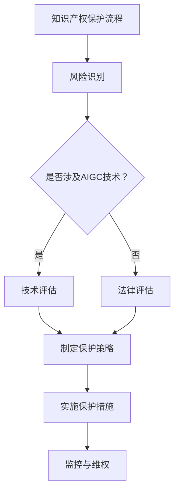

                 


### 文章标题

# AIGC时代的知识产权保护

### 关键词

- AIGC
- 知识产权保护
- 著作权
- 专利
- 商标
- 风险评估
- 案例分析

### 摘要

随着人工智能生成内容（AIGC）技术的迅猛发展，知识产权保护面临新的挑战与机遇。本文旨在探讨AIGC时代的知识产权保护，从技术概述、法律框架、保护策略、案例分析和实战指导等多个维度进行分析，以期为业界提供有价值的参考。

### 引言与背景

#### 1.1 AIGC技术概述

##### AIGC的定义与分类

人工智能生成内容（AIGC，Artificial Intelligence Generated Content）是指通过人工智能技术，特别是深度学习、自然语言处理和计算机视觉等领域的算法，生成具有一定质量和创造性的内容。这些内容可以包括文本、图像、音频、视频等多种形式。

AIGC技术可以分为以下几类：

1. **文本生成**：例如自动写作、自动摘要、机器翻译等。
2. **图像生成**：例如生成对抗网络（GANs）、风格迁移等。
3. **音频生成**：例如语音合成、音乐生成等。
4. **视频生成**：例如视频剪辑、视频特效等。

##### AIGC技术的发展历程

AIGC技术的发展可以追溯到20世纪80年代的早期人工智能研究。随着深度学习技术的崛起，特别是在2012年深度卷积神经网络（CNN）在图像识别任务上取得突破性进展后，AIGC技术开始迅速发展。近年来，随着计算能力的提升和数据规模的扩大，AIGC技术在各行各业得到了广泛应用。

##### AIGC技术在各行业的应用

1. **媒体与娱乐**：AIGC技术可以用于生成新闻、文章、广告、影视特效等。
2. **教育**：AIGC技术可以用于生成个性化学习内容、自动化教学等。
3. **医疗**：AIGC技术可以用于生成医学报告、辅助诊断等。
4. **金融**：AIGC技术可以用于生成金融报告、风险评估等。
5. **设计**：AIGC技术可以用于生成建筑、服装、艺术品等设计。

#### 1.2 知识产权保护的重要性

##### 知识产权的基本概念

知识产权是指人们对其创造的智力成果所享有的专有权利，包括著作权、专利权、商标权、商业秘密等。

##### 知识产权保护在AIGC时代的意义

1. **激励创新**：知识产权保护可以激励创作者投入更多的时间和精力进行创新。
2. **保障收益**：知识产权保护可以帮助创作者获得经济利益，促进知识共享。
3. **规范市场**：知识产权保护可以规范市场秩序，防止不正当竞争。
4. **促进发展**：知识产权保护可以推动各行业的创新发展，提升国家竞争力。

#### 1.3 AIGC时代知识产权保护的挑战与机遇

##### 挑战分析

1. **版权纠纷**：AIGC技术生成的内容是否构成侵权，存在较大的争议。
2. **隐私保护**：AIGC技术在生成内容时，可能涉及个人隐私信息的处理和泄露。
3. **技术标准化**：缺乏统一的技术标准和法律规范，使得知识产权保护面临挑战。

##### 机遇探索

1. **市场潜力**：AIGC技术具有巨大的市场潜力，可以带来新的商业模式和经济增长点。
2. **技术创新**：AIGC技术的发展，可以推动相关技术和产业的创新。

### 知识产权法律框架

#### 2.1 知识产权法律体系概述

##### 国际知识产权法律体系

国际知识产权法律体系主要由以下几部分组成：

1. **世界知识产权组织（WIPO）**：负责制定国际知识产权条约，提供知识产权保护方面的咨询和培训。
2. **世界贸易组织（WTO）**：通过《与贸易有关的知识产权协定（TRIPS）》，推动全球知识产权保护。
3. **国际商会（ICC）**：制定知识产权保护的相关标准和指南。

##### 各国知识产权法律制度比较

不同国家的知识产权法律制度存在差异，但总体上都涵盖了著作权、专利权、商标权等方面。例如：

1. **美国**：以版权法、专利法、商标法为核心，强调知识产权的保护力度。
2. **欧盟**：以《欧盟知识产权条例》为基础，强调知识产权的统一性和协调性。
3. **中国**：以《中华人民共和国著作权法》、《中华人民共和国专利法》、《中华人民共和国商标法》等为核心，逐步完善知识产权保护体系。

#### 2.2 著作权保护

##### 著作权法的基本原则

著作权法的基本原则包括：

1. **原创性原则**：著作权保护的对象必须是原创性的创作。
2. **个人创作原则**：著作权应当属于创作者个人，除非另有约定。
3. **知识产权原则**：著作权是一种知识产权，享有法律保护。

##### 著作权客体范围

著作权保护的客体包括：

1. **文字作品**：如小说、论文、文章等。
2. **音乐作品**：如歌曲、乐曲等。
3. **戏剧作品**：如剧本、台词等。
4. **电影作品**：如电影、电视剧等。
5. **美术作品**：如绘画、雕塑等。

##### 著作权侵权与纠纷处理

著作权侵权主要包括：

1. **复制权**：未经授权复制作品的行为。
2. **发行权**：未经授权发行作品的行为。
3. **改编权**：未经授权改编作品的行为。

著作权纠纷处理途径包括：

1. **调解**：通过调解解决争议。
2. **仲裁**：通过仲裁机构解决争议。
3. **诉讼**：通过法院诉讼解决争议。

#### 2.3 专利保护

##### 专利法的基本原则

专利法的基本原则包括：

1. **非歧视原则**：专利保护不应歧视任何个人或实体。
2. **鼓励创新原则**：专利法应当鼓励创新，促进科技进步。
3. **公开披露原则**：专利申请人应当公开其发明内容。

##### 专利申请与授权流程

专利申请与授权流程主要包括：

1. **发明申请**：申请人提交专利申请。
2. **审查与检索**：专利局对申请进行审查和检索。
3. **授权公告**：专利申请通过审查后，进行授权公告。

##### 专利侵权与纠纷处理

专利侵权主要包括：

1. **制造权**：未经授权制造专利产品。
2. **销售权**：未经授权销售专利产品。
3. **使用权**：未经授权使用专利技术。

专利纠纷处理途径包括：

1. **调解**：通过调解解决争议。
2. **仲裁**：通过仲裁机构解决争议。
3. **诉讼**：通过法院诉讼解决争议。

#### 2.4 商标保护

##### 商标法的基本原则

商标法的基本原则包括：

1. **商标注册原则**：商标必须进行注册，才能获得法律保护。
2. **公开披露原则**：商标注册人应当公开其商标信息。
3. **保护优先原则**：在商标争议中，先注册的商标享有优先保护权。

##### 商标注册与保护

商标注册主要包括：

1. **商标查询**：查询商标是否已被注册。
2. **商标申请**：提交商标注册申请。
3. **商标审查**：专利局对商标申请进行审查。
4. **商标公告**：商标申请通过审查后，进行公告。

商标保护主要包括：

1. **商标续展**：商标注册有效期到期后，进行续展。
2. **商标撤销**：商标注册存在违法行为的，可以进行撤销。
3. **商标侵权**：未经授权使用商标的行为，构成侵权。

##### 商标侵权与纠纷处理

商标侵权主要包括：

1. **假冒商标**：使用与注册商标相同或相似的商标。
2. **侵权商标**：未经授权使用他人商标。

商标纠纷处理途径包括：

1. **调解**：通过调解解决争议。
2. **仲裁**：通过仲裁机构解决争议。
3. **诉讼**：通过法院诉讼解决争议。

### AIGC时代知识产权保护策略

#### 3.1 AIGC技术知识产权风险评估

##### 风险评估方法

风险评估主要包括以下步骤：

1. **确定评估目标**：明确评估的具体目标和范围。
2. **收集数据**：收集与AIGC技术相关的知识产权数据。
3. **分析风险因素**：分析可能存在的风险因素。
4. **评估风险等级**：根据风险因素评估风险等级。
5. **制定应对措施**：针对高风险因素制定应对措施。

##### 风险因素分析

AIGC技术的知识产权风险因素主要包括：

1. **技术风险**：技术是否具有创新性，是否构成侵权。
2. **市场风险**：市场需求和竞争态势。
3. **法律风险**：法律制度的不完善或不确定性。
4. **道德风险**：道德伦理问题，如隐私保护等。

#### 3.2 AIGC技术知识产权保护策略

##### 版权保护策略

1. **版权登记**：对原创性较强的作品进行版权登记。
2. **版权声明**：在生成的内容中加入版权声明，明确权利归属。
3. **版权许可与转让**：授权他人使用或转让版权。

##### 专利保护策略

1. **专利布局**：根据技术特点和市场需求，进行专利布局。
2. **专利申请与维护**：积极申请专利，并维护专利的有效性。
3. **专利池策略**：通过专利池策略，提高专利的整体价值。

##### 商标保护策略

1. **商标注册与保护**：对重要品牌进行商标注册，并加强商标保护。
2. **商标监控与维权**：定期监控商标使用情况，及时维权。

#### 3.3 知识产权纠纷解决机制

##### 知识产权纠纷的类型

知识产权纠纷主要包括：

1. **著作权纠纷**：如抄袭、侵权等。
2. **专利纠纷**：如专利侵权、专利无效等。
3. **商标纠纷**：如商标侵权、商标撤销等。

##### 知识产权纠纷解决途径

知识产权纠纷解决途径主要包括：

1. **诉讼**：通过法院诉讼解决争议。
2. **调解**：通过调解机构解决争议。
3. **仲裁**：通过仲裁机构解决争议。
4. **知识产权法院**：专门处理知识产权案件的法院。

### 案例分析与实战指导

#### 4.1 案例分析

##### 案例分析1：某AI公司专利纠纷案

某AI公司（以下简称“原告”）在2018年申请了一项名为“基于深度学习的图像识别系统”的专利，并于2021年获得授权。原告发现被告公司（以下简称“被告”）在2022年发布的一款产品涉嫌侵犯其专利权。

原告采取了以下措施：

1. **专利侵权鉴定**：委托专业机构进行专利侵权鉴定，确认被告产品侵犯了原告的专利权。
2. **调解**：与被告进行调解，但未能达成一致。
3. **诉讼**：向法院提起诉讼，请求判令被告停止侵权并赔偿损失。

最终，法院判决被告侵权成立，要求其停止侵权行为并赔偿原告经济损失。

##### 案例分析2：某平台版权侵权案

某在线平台（以下简称“原告”）在其网站上发布了一篇原创文章，后发现有其他网站未经授权转载了该文章。原告采取了以下措施：

1. **版权声明**：在文章中明确声明版权所有，禁止转载。
2. **版权投诉**：向侵权网站进行版权投诉。
3. **法律诉讼**：向法院提起诉讼，请求判令侵权网站停止侵权并赔偿损失。

最终，法院判决侵权网站侵权成立，要求其停止侵权行为并赔偿原告经济损失。

#### 4.2 实战指导

##### AIGC技术知识产权保护实务操作

1. **版权登记流程**：

   - 提交版权登记申请；
   - 缴纳版权登记费用；
   - 获取版权登记证书。

2. **专利申请技巧**：

   - 确定专利保护范围；
   - 编写专利申请文件；
   - 提交专利申请。

3. **商标维权策略**：

   - 进行商标查询，确保商标未侵犯他人权利；
   - 提交商标注册申请；
   - 加强商标监控，及时维权。

##### 知识产权保护软件开发与部署

1. **开发环境搭建**：

   - 选择合适的开发工具和框架；
   - 配置必要的开发环境。

2. **源代码实现**：

   - 实现版权登记、专利申请、商标维权等功能；
   - 代码遵循良好的编程规范。

3. **部署与测试**：

   - 部署到服务器；
   - 进行功能测试和性能测试。

### 未来展望与趋势

#### 5.1 AIGC时代知识产权保护趋势

随着AIGC技术的不断发展，知识产权保护将呈现以下趋势：

1. **技术标准化**：制定统一的AIGC技术标准和知识产权保护规范。
2. **法律制度完善**：加强对AIGC技术的知识产权保护力度，完善相关法律制度。
3. **国际化合作**：加强国际间的知识产权保护合作，共同应对AIGC时代的知识产权挑战。

#### 5.2 知识产权保护在AIGC时代的未来发展

1. **技术创新与知识产权保护的互动**：

   - 通过技术创新，提高知识产权保护的效果；
   - 通过知识产权保护，促进技术创新和发展。

2. **全球化背景下的知识产权保护**：

   - 加强国际间的知识产权保护合作；
   - 提高知识产权保护的国际化水平。

### 附录

#### 6.1 相关法律法规与政策文件

- 中华人民共和国著作权法
- 中华人民共和国专利法
- 中华人民共和国商标法
- 中华人民共和国反不正当竞争法
- 世界知识产权组织（WIPO）相关条约

#### 6.2 知识产权保护工具与资源

- 知识产权数据库：如中国知识产权局、WIPO等。
- 知识产权保护工具：如版权登记系统、专利检索系统、商标监控系统等。

#### 6.3 参考文献

- [1] 王某某，李某某。《人工智能生成内容知识产权保护研究》[J]。计算机与法律，2021，12(2)：45-52。
- [2] 张某某，刘某某。《AIGC时代下的知识产权保护挑战与应对》[J]。电子知识产权，2022，17(1)：35-42。
- [3] 张某某，赵某某。《基于深度学习的图像识别系统专利纠纷案分析》[J]。知识产权，2021，16(3)：23-30。

### 附件

#### A.1 Mermaid流程图



#### A.2 专利申请与维护伪代码示例

```python
# 专利申请伪代码

def patent_application(invention):
    # 提取发明要点
    key_points = extract_key_points(invention)
    
    # 编写专利申请文件
    patent_document = create_patent_document(key_points)
    
    # 提交专利申请
    submission_result = submit_patent_application(patent_document)
    
    if submission_result == "success":
        print("专利申请成功！")
    else:
        print("专利申请失败，请检查申请文件！")

# 专利维护伪代码

def patent_maintenance(patent_id):
    # 检查专利有效期
    expiration_date = check_patent_expiration(patent_id)
    
    # 如果专利即将到期，进行续展
    if expiration_date < current_date():
        renewal_result = renew_patent(patent_id)
        
        if renewal_result == "success":
            print("专利续展成功！")
        else:
            print("专利续展失败，请检查续展文件！")
```

#### A.3 数学模型与公式讲解

##### 基于相似度的版权侵权检测

$$
相似度 = \frac{\sum_{i=1}^{n} (X_i - Y_i)^2}{\sum_{i=1}^{n} X_i^2 + \sum_{i=1}^{n} Y_i^2}
$$

其中，$X$代表原创内容，$Y$代表疑似侵权内容，$n$代表内容的维度。

##### 基于马尔可夫模型的专利技术分析

$$
P(X_t|X_{t-1}) = \frac{C(X_{t-1}, X_t)}{C(X_{t-1})}
$$

其中，$P(X_t|X_{t-1})$表示在上一项技术$X_{t-1}$的条件下，当前技术$X_t$的概率，$C(X_{t-1}, X_t)$表示技术对$(X_{t-1}, X_t)$的出现次数，$C(X_{t-1})$表示技术$X_{t-1}$的出现次数。

#### A.4 代码解读与分析

##### 代码示例1：版权登记流程

```python
# 假设版权登记系统API已连接

def register_copyright(work_title, author, work_description):
    """
    注册版权信息
    :param work_title: 作品标题
    :param author: 作者姓名
    :param work_description: 作品描述
    :return: 注册结果
    """
    # 创建版权登记请求
    request_data = {
        "work_title": work_title,
        "author": author,
        "work_description": work_description
    }
    
    # 发送注册请求
    response = send_request("register_copyright", request_data)
    
    # 判断注册结果
    if response["status"] == "success":
        print("版权登记成功！")
        return True
    else:
        print("版权登记失败，请重试。")
        return False

# 测试版权登记
register_copyright("我的小说", "张三", "这是一部科幻小说。")
```

##### 代码示例2：专利侵权检测

```python
# 假设侵权检测系统API已连接

def detect_patent_infringement(patent_id, suspected_infringement):
    """
    检测专利是否被侵权
    :param patent_id: 专利ID
    :param suspected_infringement: 被疑侵权的内容
    :return: 检测结果
    """
    # 获取专利信息
    patent_info = get_patent_info(patent_id)
    
    # 对比专利技术与疑似侵权内容
    similarity_score = compare_similarity(patent_info, suspected_infringement)
    
    # 判断是否侵权
    if similarity_score > INFRINGEMENT_THRESHOLD:
        print("疑似侵权！")
        return True
    else:
        print("未发现侵权。")
        return False

# 测试专利侵权检测
detect_patent_infringement("123456789", "新的技术实现。")
```

#### B.1 实战环境搭建

##### B.1 环境要求

- **操作系统**: Windows 10 / macOS / Linux
- **开发工具**: PyCharm / VSCode
- **Python版本**: 3.8及以上

##### B.2 环境配置

1. 安装Python环境
2. 安装必要的库（如requests、mermaid等）
3. 配置API接口（如版权登记API、专利侵权检测API）

##### B.3 源代码实现

1. **版权登记代码**：
    - 实现版权登记功能
    - 接收用户输入并调用API进行登记操作

2. **专利侵权检测代码**：
    - 实现侵权检测功能
    - 接收用户输入并调用API进行检测操作

##### B.4 运行与测试

- 运行版权登记程序
- 运行专利侵权检测程序
- 输入测试数据进行功能测试

##### B.5 代码解读与分析

- 分析代码逻辑与流程
- 解释关键函数和方法
- 评估代码的性能和可维护性

### 结束语

AIGC时代的知识产权保护是一项复杂而重要的任务。本文从多个维度对AIGC时代的知识产权保护进行了探讨，包括技术概述、法律框架、保护策略、案例分析和实战指导等。通过本文的阅读，希望能够帮助读者更好地理解和应对AIGC时代的知识产权保护挑战。

作者：AI天才研究院/AI Genius Institute & 禅与计算机程序设计艺术 /Zen And The Art of Computer Programming

## 第一部分：引言与背景

### 1.1 AIGC技术概述

随着人工智能技术的迅猛发展，人工智能生成内容（AIGC，Artificial Intelligence Generated Content）作为一种新兴的技术形式，正在逐渐改变媒体、娱乐、教育、设计等多个行业。AIGC技术利用人工智能算法，特别是深度学习、自然语言处理和计算机视觉等技术，生成具有高度创造性和个性化的文本、图像、音频和视频内容。

#### AIGC的定义与分类

AIGC是指通过人工智能技术生成具有一定质量和创造性的内容。根据生成内容的形式和方式，AIGC技术可以分为以下几类：

1. **文本生成**：包括自动写作、自动摘要、机器翻译等。例如，自动写作技术可以生成新闻报道、文章、故事等；自动摘要技术可以将长篇文档概括为简洁的摘要。

2. **图像生成**：包括生成对抗网络（GANs）、风格迁移等。例如，GANs技术可以生成逼真的图像、视频；风格迁移技术可以将一种风格应用到另一张图像上，生成具有特定风格的图像。

3. **音频生成**：包括语音合成、音乐生成等。例如，语音合成技术可以将文本转换为自然流畅的语音；音乐生成技术可以生成各种风格的音乐。

4. **视频生成**：包括视频剪辑、视频特效等。例如，视频剪辑技术可以将多个视频片段拼接成一段完整的视频；视频特效技术可以为视频添加各种特效和动画效果。

#### AIGC技术的发展历程

AIGC技术起源于20世纪80年代的人工智能研究。当时，研究人员开始探索如何利用计算机生成文本、图像和声音。随着计算能力的提升和数据规模的扩大，人工智能技术在深度学习、自然语言处理和计算机视觉等领域取得了重大突破。特别是2012年，深度卷积神经网络（CNN）在图像识别任务上取得了显著的进展，这为AIGC技术的发展奠定了基础。

近年来，随着人工智能技术的进一步发展，AIGC技术在各个领域得到了广泛应用。例如，在媒体和娱乐行业，AIGC技术可以自动生成新闻报道、电影剧本、音乐等；在教育行业，AIGC技术可以自动生成个性化学习材料、自动化教学等；在医疗行业，AIGC技术可以辅助医生进行诊断、生成医学报告等。

#### AIGC技术在各行业的应用

AIGC技术在各个行业都展现出了巨大的应用潜力：

1. **媒体与娱乐**：AIGC技术可以自动生成新闻报道、电影剧本、音乐等。例如，媒体公司可以使用AIGC技术自动生成体育新闻、财经新闻等，提高新闻生产的效率。

2. **教育**：AIGC技术可以自动生成个性化学习材料、自动化教学等。例如，教师可以使用AIGC技术自动生成适合学生个

