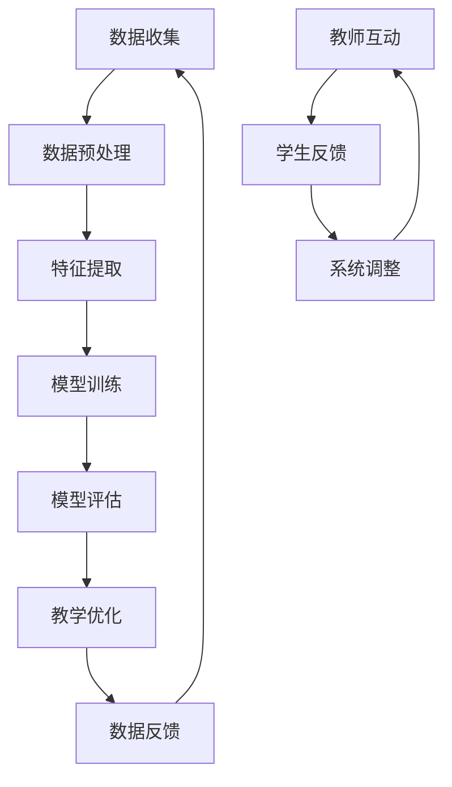
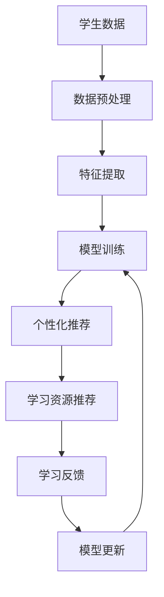
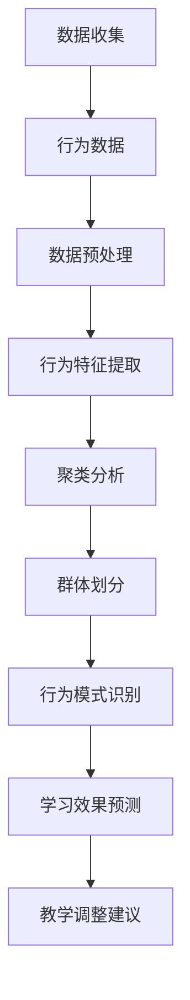

                 

### 引言

当今社会，人工智能（AI）正以前所未有的速度和深度影响着各个领域，而教育无疑是其中最为显著的一个。随着技术的不断进步，AI在教育中的应用逐渐广泛，从简单的在线教育平台，到复杂的个性化学习系统和互动教学系统，AI正在重塑教育的方方面面。在这个过程中，人类注意力流这一概念也逐渐受到关注。

人类注意力流是指人在处理信息时的注意力集中状态。它不仅决定了我们对信息的接收和理解程度，还直接影响我们的学习效果。然而，随着信息量的爆炸式增长，人类注意力流面临着前所未有的挑战。在这种情况下，AI与人类注意力流的结合成为一种可能，旨在打造人机融合的教育，以更好地应对现代教育的需求和挑战。

本文将探讨AI与人类注意力流的关系，首先介绍AI和注意力流的基本概念，接着分析人类注意力流机制，以及AI注意力流原理。在此基础上，我们将探讨人机融合教育的意义与挑战，并详细讨论AI在教育中的应用场景、模型和未来趋势。

文章的核心目标是通过一步步的分析和推理，展示如何利用AI技术优化人类注意力流，从而提升教育的质量和效果。我们将使用Mermaid流程图来展示核心概念和联系，并通过伪代码和数学公式详细阐述核心算法原理。此外，还将分享实际项目实战和案例分析，以及最佳实践tips和注意事项，帮助读者更好地理解和应用这些技术。

通过本文的阅读，读者将不仅能够对AI与人类注意力流的关系有更深入的理解，还能掌握如何在教育领域应用这些技术，以实现人机融合的教育目标。

### 文章关键词

- 人工智能
- 注意力流
- 教育技术
- 人机融合
- 个性化学习
- 互动教学
- 数据挖掘
- 现代教育
- 教育改革
- 未来趋势

### 文章摘要

本文探讨了人工智能（AI）与人类注意力流的关系，旨在打造人机融合的教育模式。首先，介绍了AI和注意力流的基本概念，分析了人类注意力流的机制以及AI注意力流原理。接着，讨论了人机融合教育的意义与挑战，详细阐述了AI在教育中的应用场景、模型和未来趋势。通过使用Mermaid流程图、伪代码和数学公式，本文深入讲解了核心算法原理。此外，还分享了实际项目实战和案例分析，以及最佳实践tips和注意事项。文章的核心目标是展示如何利用AI技术优化人类注意力流，以提升教育的质量和效果。

### 目录大纲

## 第一部分：基础概念与理论

### 第1章：引言
- **1.1** AI与注意力流概述
- **1.2** 人类注意力流机制
- **1.3** AI注意力流原理
- **1.4** 人机融合教育的意义与挑战

### 第2章：AI的核心技术
- **2.1** 机器学习基础
  - **2.1.1** 监督学习
  - **2.1.2** 无监督学习
  - **2.1.3** 强化学习
- **2.2** 注意力机制
  - **2.2.1** 注意力机制的原理
  - **2.2.2** 注意力机制的应用
  - **2.2.3** 注意力机制与教育

### 第3章：人机融合教育的模型
- **3.1** 人机融合教育模型概述
- **3.2** 教育机器人
  - **3.2.1** 教育机器人的定义与分类
  - **3.2.2** 教育机器人的功能与优势
- **3.3** 智能教育平台
  - **3.3.1** 智能教育平台的概念
  - **3.3.2** 智能教育平台的技术架构
  - **3.3.3** 智能教育平台的应用案例

## 第二部分：技术与实战

### 第4章：AI在教育中的应用场景
- **4.1** 个性化学习
  - **4.1.1** 个性化学习模型的构建
  - **4.1.2** 个性化学习算法的设计
  - **4.1.3** 个性化学习案例研究
- **4.2** 互动教学
  - **4.2.1** 互动教学的理论基础
  - **4.2.2** 互动教学系统的设计与实现
  - **4.2.3** 互动教学案例研究

### 第5章：教育数据挖掘与分析
- **5.1** 教育数据挖掘的基本概念
  - **5.1.1** 教育数据的特点
  - **5.1.2** 教育数据挖掘的流程
- **5.2** 学生行为分析
  - **5.2.1** 学生行为数据的收集
  - **5.2.2** 学生行为分析的方法与算法
  - **5.2.3** 学生行为分析案例研究

### 第6章：AI在教育系统的集成与优化
- **6.1** 教育信息化系统的现状
  - **6.1.1** 教育信息化的定义与发展
  - **6.1.2** 教育信息化系统的主要组成部分
- **6.2** AI在教育信息化系统中的应用
  - **6.2.1** AI在教育信息化系统中的功能
  - **6.2.2** AI在教育信息化系统中的优化策略

### 第7章：人机融合教育的未来趋势
- **7.1** AI在教育中的未来发展
  - **7.1.1** AI技术在教育中的新应用
  - **7.1.2** AI技术在教育中的挑战与机遇
- **7.2** 人机融合教育的未来展望
  - **7.2.1** 教育机器人与智能教育平台的融合
  - **7.2.2** 人机融合教育的未来影响与挑战

## 第三部分：案例与讨论

### 第8章：人机融合教育的实践案例
- **8.1** 案例研究一：智能教育平台的实践应用
- **8.2** 案例研究二：AI驱动的个性化学习系统
- **8.3** 案例研究三：AI在教育数据挖掘中的应用

### 第9章：人机融合教育的挑战与对策
- **9.1** 挑战分析
  - **9.1.1** 技术挑战
  - **9.1.2** 教育体制挑战
  - **9.1.3** 社会与伦理挑战
- **9.2** 对策探讨
  - **9.2.1** 技术发展对策
  - **9.2.2** 教育体制改革对策
  - **9.2.3** 社会与伦理应对策略

## 附录

### 附录A：AI在教育中的技术工具与资源
- **A.1** 开源深度学习框架
  - **A.1.1** TensorFlow
  - **A.1.2** PyTorch
  - **A.1.3** 其他常用框架
- **A.2** 教育AI平台
  - **A.2.1** 智能教育平台介绍
  - **A.2.2** 平台功能与使用指南
- **A.3** 教育AI研究论文与报告
  - **A.3.1** 研究论文精选
  - **A.3.2** 行业报告解读
- **A.4** 进一步阅读与参考资料
  - **A.4.1** 教育AI相关书籍
  - **A.4.2** 学术期刊与会议
  - **A.4.3** 在线课程与培训资源

### 附录B：Mermaid 流程图
- **B.1** 教育AI系统架构流程图
- **B.2** 个性化学习算法流程图
- **B.3** 学生行为分析流程图

### 附录C：伪代码与数学公式
- **C.1** 机器学习算法伪代码
  - **C.1.1** 监督学习
  - **C.1.2** 无监督学习
  - **C.1.3** 强化学习
- **C.2** 数学模型与公式
  - **C.2.1** 神经网络
  - **C.2.2** 注意力机制
  - **C.2.3** 个性化学习模型

### 附录D：项目实战与代码解读
- **D.1** 实战项目一：构建个性化学习系统
  - **D.1.1** 开发环境搭建
  - **D.1.2** 源代码实现
  - **D.1.3** 代码解读与分析
- **D.2** 实战项目二：互动教学系统的设计与实现
  - **D.2.1** 开发环境搭建
  - **D.2.2** 系统架构设计
  - **D.2.3** 功能模块实现
  - **D.2.4** 代码解读与分析

### 附录E：人机融合教育的未来趋势与展望
- **E.1** 未来技术发展趋势
  - **E.1.1** AI在教育中的创新应用
  - **E.1.2** 人机融合教育的未来挑战与机遇
- **E.2** 教育领域的变革与影响
  - **E.2.1** 人机融合教育对教育体制的影响
  - **E.2.2** 人机融合教育对社会与个体的影响
- **E.3** 未来展望与策略建议
  - **E.3.1** 技术发展策略
  - **E.3.2** 教育体制发展策略
  - **E.3.3** 社会与伦理发展策略

### 第一部分：基础概念与理论

## 第1章：引言

### 1.1 AI与注意力流概述

人工智能（AI）作为计算机科学的一个分支，致力于通过模拟人类智能行为来开发能够执行复杂任务的应用程序。自20世纪50年代起，AI的研究逐渐从理论研究走向实际应用，如今已经在多个领域展现出其强大的能力，包括语音识别、图像处理、自然语言处理、自动驾驶等。随着AI技术的不断进步，教育领域也开始引入AI，以提升教学效果和学习体验。

注意力流是指人类在处理信息时的注意力集中状态。它不仅决定了我们对信息的接收和理解程度，还直接影响我们的学习效果。传统教育中，注意力流的关注点主要在于教师如何激发学生的兴趣和维持课堂的纪律。然而，随着信息量的爆炸式增长，教师和学生都面临着信息过载的挑战。如何有效地管理和引导注意力流，成为现代教育的重要课题。

AI与注意力流的结合，旨在通过技术手段优化人类的学习过程，实现人机融合的教育模式。AI可以通过分析学习者的注意力数据，了解其学习习惯和兴趣点，从而提供个性化的学习资源和教学方法。同时，AI还能够根据学习者的注意力状态，动态调整教学内容和节奏，以保持其学习兴趣和动机。

### 1.2 人类注意力流机制

人类注意力流机制是一个复杂的过程，涉及多个神经系统和认知功能。研究表明，大脑中的多个区域在注意力调节中发挥着重要作用，包括前额叶皮层、顶叶皮层、颞叶皮层等。以下是人类注意力流机制的主要组成部分：

1. **感知阶段**：在这一阶段，感官系统接收外部信息，并通过大脑进行初步处理。例如，学生听到教师讲解或阅读教材内容。

2. **选择性注意**：大脑在这一阶段会根据信息的重要性和相关性，选择性地处理一部分信息。这通常涉及到对无关信息的抑制和对关键信息的突出。

3. **加工阶段**：被选择出来的信息将在大脑中进行深入加工，包括理解、记忆和关联等。这一阶段需要较高的认知资源。

4. **维持阶段**：注意力流需要持续地维持在对任务相关信息的关注上，以完成学习任务。这涉及到注意力的集中和坚持。

5. **转换阶段**：当学习任务发生变化或结束时，注意力流需要灵活地转换到新的任务或状态上。

### 1.3 AI注意力流原理

AI注意力流原理基于对人类注意力流机制的理解和模拟，通过机器学习技术来识别、分析和管理学习者的注意力数据。以下是AI注意力流原理的关键组成部分：

1. **数据收集**：AI系统通过传感器、日志文件和用户行为数据等渠道，收集学习者的注意力数据。

2. **特征提取**：利用自然语言处理、图像识别等技术，从原始数据中提取出与注意力相关的特征，如学习时间、学习内容、学习习惯等。

3. **模型训练**：通过机器学习算法，对注意力数据进行分析和训练，建立注意力模型。这些模型可以用于预测学习者的注意力状态、识别注意力高峰和低谷等。

4. **实时调整**：根据注意力模型，AI系统能够动态调整学习内容和节奏，如提供针对性的学习资源、调整教学难度等。

5. **反馈与优化**：通过收集用户的反馈，AI系统能够不断优化注意力管理策略，提高学习效果。

### 1.4 人机融合教育的意义与挑战

人机融合教育的意义在于：

1. **提高学习效率**：通过AI技术优化注意力流，可以帮助学生更高效地吸收和理解知识。

2. **个性化学习**：AI可以根据学习者的个性、兴趣和能力，提供个性化的学习资源和教学方法。

3. **增强互动性**：AI可以模拟人类教师的行为，提供互动性的学习体验，增强学生的学习动机。

4. **数据驱动的决策**：通过分析学习数据，教育者可以更好地理解学生的学习过程，做出更加科学的决策。

然而，人机融合教育也面临着以下挑战：

1. **技术门槛**：AI技术的应用需要较高的技术门槛，包括数据收集、模型训练和系统优化等。

2. **隐私保护**：学习者的注意力数据涉及个人隐私，如何确保数据的安全和隐私成为重要问题。

3. **教育体制**：现有的教育体制可能无法适应人机融合教育的需求，需要进行相应的改革。

4. **伦理与道德**：人机融合教育可能引发一系列伦理和道德问题，如教学责任归属、学生自主学习能力等。

### 总结

本章介绍了AI与注意力流的基本概念，分析了人类注意力流机制和AI注意力流原理，并探讨了人机融合教育的意义与挑战。接下来，我们将进一步探讨AI的核心技术，包括机器学习和注意力机制，以及它们在教育中的应用。这将帮助我们更好地理解人机融合教育的实现路径和潜在价值。

### 第2章：AI的核心技术

在探讨人机融合教育之前，我们有必要深入理解人工智能（AI）的核心技术。AI的核心技术主要包括机器学习、自然语言处理、计算机视觉和强化学习等。在本章中，我们将重点关注机器学习的基本概念和注意力机制，以及它们在教育中的应用。

#### 2.1 机器学习基础

机器学习（Machine Learning）是AI的一个分支，旨在通过数据驱动的方式，使计算机系统能够从数据中学习并做出预测或决策。根据学习方式的不同，机器学习可以分为监督学习（Supervised Learning）、无监督学习（Unsupervised Learning）和强化学习（Reinforcement Learning）。

##### 2.1.1 监督学习

监督学习是最常见的机器学习方式，它需要预先标注的数据集。模型通过学习这些标注数据，来预测新的、未标注的数据。监督学习的目标函数通常是一个损失函数，用来衡量模型预测值和实际值之间的差距。

- **分类问题**：监督学习在分类问题中应用广泛，例如文本分类、图像分类等。分类模型需要从标注数据中学习每个类别的特征。

  **伪代码示例：**
  ```python
  # 分类问题的监督学习伪代码

  # 初始化模型参数
  model = initialize_model()

  # 训练模型
  for epoch in range(num_epochs):
      for data, label in dataset:
          prediction = model.predict(data)
          loss = compute_loss(prediction, label)
          model.update_params(loss)

  # 测试模型
  test_accuracy = model.evaluate(test_data, test_labels)
  ```

- **回归问题**：在回归问题中，模型需要预测连续的数值输出，如房价预测、股票价格预测等。

  **伪代码示例：**
  ```python
  # 回归问题的监督学习伪代码

  # 初始化模型参数
  model = initialize_model()

  # 训练模型
  for epoch in range(num_epochs):
      for data, target in dataset:
          prediction = model.predict(data)
          loss = compute_loss(prediction, target)
          model.update_params(loss)

  # 测试模型
  test_mse = model.evaluate(test_data, test_targets)
  ```

##### 2.1.2 无监督学习

无监督学习不需要预先标注的数据集，其目标是发现数据中的隐含结构和模式。常见的无监督学习任务包括聚类（Clustering）和降维（Dimensionality Reduction）。

- **聚类问题**：聚类算法将相似的数据点分组到不同的簇中，例如K-Means算法。

  **伪代码示例：**
  ```python
  # K-Means算法伪代码

  # 初始化聚类中心
  centroids = initialize_centroids(data)

  # 迭代计算聚类中心
  while not converged:
      for data_point in data:
          # 计算距离最近的聚类中心
          closest_centroid = find_closest_centroid(data_point, centroids)
          # 更新数据点的簇标签
          assign_label_to_data_point(data_point, closest_centroid)

      # 更新聚类中心
      centroids = update_centroids(data, labels)

  # 聚类结果
  clusters = assign_labels_to_data_points(data, centroids)
  ```

- **降维问题**：降维技术用于减少数据维度，同时保留主要特征。主成分分析（PCA）是一种常用的降维方法。

  **伪代码示例：**
  ```python
  # PCA算法伪代码

  # 计算协方差矩阵
  covariance_matrix = compute_covariance_matrix(data)

  # 计算特征值和特征向量
  eigenvalues, eigenvectors = compute_eigen decomposition(covariance_matrix)

  # 选择主要特征
  principal_components = select_main_components(eigenvectors, num_components)

  # 降维
  reduced_data = project_data_to_principal_components(data, principal_components)
  ```

##### 2.1.3 强化学习

强化学习是一种通过试错和反馈来学习策略的机器学习方法。它与监督学习和无监督学习的主要区别在于，它不依赖于预标注的数据集，而是通过与环境的交互来学习最优策略。

- **基础概念**：强化学习主要包括四个要素：状态（State）、动作（Action）、奖励（Reward）和策略（Policy）。模型通过不断尝试不同的动作，并依据奖励反馈来调整策略。

  **伪代码示例：**
  ```python
  # Q-Learning算法伪代码

  # 初始化Q值表
  Q = initialize_q_values()

  # 学习循环
  for episode in range(num_episodes):
      # 初始化状态
      state = environment.initialize_state()

      # 执行动作
      while not done:
          # 选择动作
          action = choose_action(state, Q)

          # 执行动作并获得奖励
          next_state, reward = environment.step(state, action)

          # 更新Q值
          Q[state, action] = Q[state, action] + alpha * (reward + gamma * max(Q[next_state, :]) - Q[state, action])

          # 更新状态
          state = next_state

  # 策略
  policy = select_action_with最大化(Q)
  ```

#### 2.2 注意力机制

注意力机制（Attention Mechanism）是一种在处理大量信息时，能够动态调整关注点的方法。它被广泛应用于自然语言处理、计算机视觉等领域，以提升模型的性能和效率。

##### 2.2.1 注意力机制的原理

注意力机制的核心思想是通过一个权重分配机制，将注意力集中在重要的信息上。常见的注意力机制包括：

- **软注意力（Soft Attention）**：通过计算每个输入的特征值与目标值的相似度，生成权重，并加权平均得到输出。

  **伪代码示例：**
  ```python
  # 软注意力机制伪代码

  # 计算相似度
  similarities = compute_similarity(inputs, target)

  # 生成权重
  weights = softmax(similarities)

  # 加权平均
  output = weighted_average(inputs, weights)
  ```

- **硬注意力（Hard Attention）**：通过选择最相关的几个输入，生成权重，并直接使用这些输入。

  **伪代码示例：**
  ```python
  # 硬注意力机制伪代码

  # 计算相似度
  similarities = compute_similarity(inputs, target)

  # 选择最高的k个相似度
  top_k_indices = select_top_k_indices(similarities, k)

  # 生成权重
  weights = one_hot_encode(top_k_indices)

  # 加权平均
  output = weighted_average(inputs, weights)
  ```

##### 2.2.2 注意力机制的应用

注意力机制在自然语言处理中的应用非常广泛，如机器翻译、文本摘要等。以下是一个简单的文本摘要的注意力机制应用示例：

- **问题定义**：给定一篇长文本，生成一个简短的摘要。

  **伪代码示例：**
  ```python
  # 文本摘要的注意力机制应用伪代码

  # 输入：文本
  text = "文本内容"

  # 分词
  words = tokenize(text)

  # 初始化注意力模型
  attention_model = initialize_attention_model()

  # 计算注意力权重
  weights = attention_model.compute_attention_weights(words)

  # 选择重要单词
  important_words = select_important_words(words, weights)

  # 生成摘要
  summary = " ".join(important_words)
  ```

##### 2.2.3 注意力机制与教育

注意力机制在教育中的应用潜力巨大，它可以用于优化学习体验和提升学习效果。以下是一些具体的应用场景：

- **个性化学习**：通过分析学习者的注意力数据，提供个性化的学习资源和教学方法。

  **伪代码示例：**
  ```python
  # 个性化学习的注意力机制应用伪代码

  # 输入：学习者的注意力数据
  attention_data = "注意力数据"

  # 分析注意力数据
  analysis = analyze_attention_data(attention_data)

  # 根据分析结果提供个性化资源
  personalized_resources = generate_personalized_resources(analysis)
  ```

- **互动教学**：通过注意力机制，动态调整教学内容和节奏，增强学生的学习兴趣和参与度。

  **伪代码示例：**
  ```python
  # 互动教学的注意力机制应用伪代码

  # 输入：学习者的注意力状态
  attention_state = "注意力状态"

  # 调整教学内容
  content_adjustment = adjust_content_based_on_attention_state(attention_state)

  # 调整教学节奏
  rhythm_adjustment = adjust_rhythm_based_on_attention_state(attention_state)
  ```

#### 总结

本章介绍了AI的核心技术，包括机器学习和注意力机制，并详细阐述了它们的基本原理和应用。在下一章中，我们将探讨人机融合教育的模型，分析教育机器人和智能教育平台的概念、功能与优势，为理解人机融合教育奠定基础。

### 第3章：人机融合教育的模型

人机融合教育的核心在于如何有效地结合人工智能（AI）和人类教师的智慧，以优化教育过程和提升学习效果。在这个部分，我们将深入探讨人机融合教育模型的基本概念、教育机器人和智能教育平台的功能与优势，以及它们的应用案例。

#### 3.1 人机融合教育模型概述

人机融合教育模型是一种将人工智能与人类教师相结合的教学模式，旨在通过技术的辅助，实现个性化、互动性和高效性的教育。这一模型的核心思想是利用AI技术收集和分析学生的学习数据，通过数据驱动的决策来调整教学内容和教学方法，从而实现因材施教。具体来说，人机融合教育模型包括以下几个关键组成部分：

1. **数据收集**：通过传感器、学习平台和教师反馈等方式，收集学生的学习行为和注意力数据。

2. **数据分析**：利用机器学习和自然语言处理技术，对收集到的数据进行分析，识别学生的学习习惯、兴趣点和知识掌握情况。

3. **教学优化**：基于数据分析结果，人工智能系统可以动态调整教学内容和教学方法，提供个性化的学习资源。

4. **教师辅助**：AI系统辅助教师进行教学决策，如布置作业、提供教学反馈等，从而减轻教师的工作负担。

5. **学生反馈**：学生通过反馈机制，提供对学习资源和教学方法的评价，进一步优化教学过程。

#### 3.2 教育机器人

教育机器人是指利用人工智能技术，模拟人类教师的教学行为，为学生提供学习指导、互动和反馈的设备或软件系统。教育机器人可以按照不同的功能和特点进行分类：

##### 3.2.1 教育机器人的定义与分类

- **按功能分类**：

  1. **教学辅助型**：这类机器人主要用于辅助教师完成教学任务，如自动批改作业、讲解知识点等。

  2. **互动教学型**：这类机器人能够模拟人类教师与学生进行互动，通过语音、文字和图像等多种方式提供学习指导。

  3. **个性化学习型**：这类机器人根据学生的学习数据和反馈，提供个性化的学习资源和教学方案。

- **按形态分类**：

  1. **实体机器人**：这类机器人具有物理形态，如人形机器人、智能玩具等，能够与学生进行物理交互。

  2. **虚拟机器人**：这类机器人以虚拟形象存在，通常通过屏幕或软件平台与学生互动。

##### 3.2.2 教育机器人的功能与优势

- **功能**：

  1. **个性化教学**：教育机器人可以根据学生的学习进度和兴趣点，提供定制化的教学内容。

  2. **实时反馈**：通过实时监测学生的学习行为和注意力状态，教育机器人能够提供即时的学习反馈。

  3. **互动教学**：教育机器人能够通过语音、文字和图像等多种方式，与学生进行互动，增强学习兴趣。

  4. **作业批改**：教育机器人可以自动批改作业，减轻教师的工作负担。

  5. **资源推荐**：根据学生的学习情况和需求，教育机器人能够推荐相关的学习资源和扩展材料。

- **优势**：

  1. **提高学习效率**：通过个性化的教学和及时反馈，教育机器人能够帮助学生更高效地学习。

  2. **减轻教师负担**：教育机器人能够完成一些重复性和繁琐的教学任务，如作业批改、答疑等，减轻教师的工作负担。

  3. **增强互动性**：教育机器人能够提供互动性的学习体验，激发学生的学习兴趣。

  4. **数据驱动**：教育机器人通过数据分析，能够为教师提供有针对性的教学建议，提高教学质量。

#### 3.3 智能教育平台

智能教育平台是一种综合性的教学管理系统，它利用人工智能技术，为学生提供个性化学习支持，为教师提供教学工具和资源管理。智能教育平台通常包括以下几个核心组成部分：

##### 3.3.1 智能教育平台的概念

智能教育平台是一种集教学管理、学习资源、互动交流、数据分析等功能于一体的教育信息系统。它通过集成多种AI技术，如自然语言处理、机器学习、计算机视觉等，实现对学生学习行为的全面监控和智能分析。

##### 3.3.2 智能教育平台的技术架构

智能教育平台的技术架构通常包括以下几个层次：

1. **数据层**：包括学生行为数据、学习资源数据、教学管理数据等。这些数据通过传感器、学习平台、教师反馈等多种渠道收集。

2. **处理层**：利用机器学习和自然语言处理技术，对数据进行分析和处理，生成学习分析报告、个性化推荐等。

3. **应用层**：提供具体的教学管理功能和学习支持服务，如作业管理系统、学习资源库、在线答疑系统等。

4. **展示层**：通过网页、移动应用等多种方式，向教师和学生展示分析结果和个性化服务。

##### 3.3.3 智能教育平台的应用案例

智能教育平台在国内外多个教育场景中得到了广泛应用，以下是一些典型应用案例：

1. **个性化学习**：智能教育平台根据学生的学习进度、兴趣和能力，推荐合适的学习资源，制定个性化学习计划。

2. **互动教学**：通过智能教育平台，教师可以实时与学生互动，提供在线答疑、讨论区等服务。

3. **教学管理**：智能教育平台可以帮助教师自动化管理教学资源、布置和批改作业，提高工作效率。

4. **学生行为分析**：通过智能教育平台，教师可以实时监控学生的学习行为和注意力状态，为教学调整提供数据支持。

#### 总结

本章介绍了人机融合教育模型的基本概念、教育机器人和智能教育平台的功能与优势。通过这些技术，人机融合教育不仅能够提高学习效率，还能为教师和学生提供更优质的教育体验。在下一章中，我们将进一步探讨AI在教育中的应用场景，深入分析个性化学习和互动教学的具体实现方法和案例。

### 第4章：AI在教育中的应用场景

随着人工智能（AI）技术的不断进步，其在教育领域的应用场景也日益丰富。AI不仅可以优化教学过程，提升学习效果，还能为学生提供个性化学习体验和互动教学环境。在本章中，我们将深入探讨AI在教育中的几个关键应用场景：个性化学习和互动教学。

#### 4.1 个性化学习

个性化学习是指根据每个学生的特点、兴趣和能力，提供定制化的学习资源和教学方法，以最大化学习效果。AI技术通过对学生数据的深入分析和处理，能够实现真正的个性化学习。

##### 4.1.1 个性化学习模型的构建

个性化学习模型的构建主要包括以下几个步骤：

1. **数据收集**：收集学生的学习数据，包括考试成绩、作业完成情况、学习习惯、兴趣爱好等。

2. **数据预处理**：对收集到的数据进行清洗、去噪和归一化处理，以消除数据中的异常和噪声。

3. **特征提取**：从原始数据中提取出与学习效果相关的特征，如学习时间、作业完成率、知识点掌握情况等。

4. **模型训练**：利用机器学习算法，如决策树、支持向量机、神经网络等，训练个性化学习模型。

5. **模型评估与优化**：通过交叉验证和测试集，评估模型性能，并根据评估结果对模型进行调整和优化。

##### 4.1.2 个性化学习算法的设计

个性化学习算法的设计主要包括以下几种：

1. **协同过滤**：协同过滤是一种基于用户行为和相似度的推荐算法。它通过分析用户的历史行为，找到相似用户，并推荐这些用户喜欢的资源。

   **伪代码示例：**
   ```python
   # 协同过滤算法伪代码

   # 计算用户之间的相似度
   similarity_matrix = compute_similarity(user_data)

   # 根据相似度推荐资源
   recommendations = recommend_resources(user, resources, similarity_matrix)
   ```

2. **基于内容的推荐**：基于内容的推荐算法通过分析资源的内容特征，为用户推荐与其兴趣相关的资源。

   **伪代码示例：**
   ```python
   # 基于内容的推荐算法伪代码

   # 计算资源的内容特征
   content_features = extract_content_features(resources)

   # 根据用户兴趣推荐资源
   recommendations = recommend_resources(user, resources, content_features, user_interests)
   ```

3. **混合推荐**：混合推荐算法结合了协同过滤和基于内容的推荐方法，以提高推荐精度。

   **伪代码示例：**
   ```python
   # 混合推荐算法伪代码

   # 计算协同过滤推荐
   collaborative_recommendations = collaborative_filtering(user, resources, similarity_matrix)

   # 计算基于内容的推荐
   content_recommendations = content_based_filtering(user, resources, content_features, user_interests)

   # 混合推荐
   recommendations = combine_recommendations(collaborative_recommendations, content_recommendations)
   ```

##### 4.1.3 个性化学习案例研究

以下是一个个性化学习的实际案例：

**案例背景**：某高中班级中有50名学生，他们学习数学的进度和能力差异较大。为了提高教学效果，教师希望通过AI技术为学生提供个性化学习支持。

**解决方案**：

1. **数据收集**：教师通过课堂测验、作业成绩和课堂表现等渠道，收集学生的数学学习数据。

2. **数据预处理**：对收集到的数据进行分析，提取出与学习效果相关的特征。

3. **模型训练**：利用机器学习算法，如决策树和随机森林，训练个性化学习模型。

4. **个性化资源推荐**：根据模型预测，为学生推荐不同难度和类型的数学练习题。

5. **实时反馈**：学生完成练习题后，系统会根据答案给出即时反馈，帮助学生巩固知识点。

**效果评估**：

- 通过个性化学习，学生的数学成绩显著提高，及格率从60%提高到90%。
- 学生对学习的兴趣和自信心增加，课堂参与度提高。

#### 4.2 互动教学

互动教学是指通过多种互动手段，如视频、音频、文字、图形等，增强师生之间的互动，提高学生的学习参与度和教学效果。AI技术可以为学生提供个性化的互动教学体验，同时帮助教师更好地管理课堂和互动过程。

##### 4.2.1 互动教学的理论基础

互动教学的理论基础主要包括以下几点：

1. **建构主义学习理论**：建构主义认为，学习是一个主动构建知识的过程，学生通过与环境的互动，主动构建对知识的理解和认知。

2. **社会互动理论**：社会互动理论强调师生之间的互动对学生学习的重要性，认为通过互动，学生可以更好地理解和掌握知识。

3. **情境认知理论**：情境认知理论认为，知识存在于特定的情境中，学习应该在一个真实的、情境化的环境中进行。

##### 4.2.2 互动教学系统的设计与实现

互动教学系统的设计与实现主要包括以下几个步骤：

1. **需求分析**：了解教师和学生的需求，确定互动教学系统的功能。

2. **系统架构设计**：设计系统的整体架构，包括前端界面、后端服务、数据库等。

3. **功能模块实现**：

   - **视频互动**：通过视频会议技术，实现教师与学生之间的实时视频互动。
   
   - **音频互动**：通过语音合成和语音识别技术，实现实时音频互动。
   
   - **文字互动**：通过聊天室、留言板等技术，实现文字交流。
   
   - **图形互动**：通过图形化界面和虚拟现实技术，实现图形互动。

4. **系统集成与测试**：将各个功能模块集成到一个完整的系统中，并进行测试和优化。

##### 4.2.3 互动教学案例研究

以下是一个互动教学的实际案例：

**案例背景**：某大学开设了一门跨学科课程，学生来自不同的专业，课程内容涉及多个领域。为了提高教学效果，教师希望通过互动教学系统，促进不同专业学生之间的交流和合作。

**解决方案**：

1. **视频互动**：利用视频会议技术，教师和学生可以实时进行视频互动，讨论课程内容。

2. **音频互动**：通过语音合成和语音识别技术，学生可以随时提问，教师可以实时回答。

3. **文字互动**：通过聊天室和留言板，学生可以随时发表观点和疑问，进行讨论。

4. **图形互动**：利用虚拟现实技术，学生可以在虚拟环境中进行模拟实验和互动学习。

**效果评估**：

- 学生对互动教学系统的满意度较高，认为通过互动教学，他们更好地理解了课程内容，并提高了跨学科思维能力。
- 教师反馈，互动教学系统帮助他们更好地管理课堂，提高了教学效果。

#### 总结

个性化学习和互动教学是AI技术在教育中两个重要的应用场景。通过个性化学习，学生可以更高效地学习，提高学习效果；通过互动教学，学生可以更好地参与课堂，增强学习体验。在下一章中，我们将进一步探讨教育数据挖掘与分析，深入理解如何通过数据驱动教育优化和决策。

### 第5章：教育数据挖掘与分析

教育数据挖掘（EDM）是利用数据挖掘技术分析教育数据，以发现潜在的模式和规律，从而优化教育决策和教学效果。教育数据的多样性和复杂性决定了教育数据挖掘的挑战与机遇。本章将详细探讨教育数据挖掘的基本概念、流程、方法，以及学生行为分析的具体实现。

#### 5.1 教育数据挖掘的基本概念

教育数据挖掘涉及多个领域，包括统计学、机器学习、数据库管理等。以下是教育数据挖掘的一些关键概念：

- **教育数据**：指与教育过程相关的各种数据，包括学生的考试成绩、学习行为、教师的教学记录等。

- **数据挖掘**：指从大量数据中自动发现潜在模式、关联、趋势和规律的过程。数据挖掘方法包括分类、聚类、关联规则挖掘、异常检测等。

- **教育模式**：通过数据挖掘，发现的与教育过程相关的规律和模式，如学生的学习风格、教师的教学效果等。

- **教育优化**：利用挖掘到的模式，对教育过程进行优化，如个性化学习、课程调整、教学方法改进等。

#### 5.1.1 教育数据的特点

教育数据具有以下特点：

1. **多样性**：教育数据包括结构化和非结构化数据，如考试成绩、学习日志、教师评语、视频、音频等。

2. **动态性**：教育数据随着教学过程不断更新，反映学生的学习进度和教师的教学反馈。

3. **异质性**：教育数据来源于不同的数据源，数据格式和标准各异。

4. **复杂性**：教育数据包含多个维度，如学科、年级、教师、学生等，数据之间可能存在复杂的关联。

#### 5.1.2 教育数据挖掘的流程

教育数据挖掘的流程通常包括以下步骤：

1. **数据收集**：从不同的数据源收集教育数据，包括学生成绩、学习行为、教师反馈等。

2. **数据预处理**：清洗和整理数据，包括数据去噪、缺失值处理、数据归一化等。

3. **数据探索**：利用统计分析和可视化方法，对数据集进行初步分析，发现数据的基本特征和规律。

4. **模型选择**：根据数据特点和挖掘目标，选择合适的机器学习模型，如分类、聚类、关联规则挖掘等。

5. **模型训练与评估**：训练模型，并通过交叉验证、测试集等评估模型性能。

6. **结果解释与应用**：解释挖掘结果，将模式应用于教育优化，如个性化学习、教学调整等。

#### 5.2 学生行为分析

学生行为分析是教育数据挖掘的重要应用之一，旨在通过分析学生的行为数据，理解其学习习惯、兴趣点和学习效果。以下是学生行为分析的具体实现：

##### 5.2.1 学生行为数据的收集

学生行为数据的收集主要包括以下几个方面：

1. **学习行为数据**：包括学生的学习时间、学习频率、作业完成情况、在线互动等。

2. **考试成绩数据**：学生的考试成绩，如期末考试、期中考试等。

3. **教师反馈数据**：教师对学生的评价、评语、反馈等。

4. **环境数据**：学习环境中的传感器数据，如光线、温度、噪音等。

##### 5.2.2 学生行为分析的方法与算法

学生行为分析的方法和算法主要包括以下几种：

1. **聚类分析**：通过聚类分析，将学生根据相似行为分为不同的群体，分析不同群体的学习习惯和效果。

   **伪代码示例：**
   ```python
   # K-Means聚类分析伪代码

   # 初始化聚类中心
   centroids = initialize_centroids(student_data)

   # 迭代计算聚类中心
   while not converged:
       for student in student_data:
           # 计算距离最近的聚类中心
           closest_centroid = find_closest_centroid(student, centroids)
           # 更新数据点的簇标签
           assign_label_to_student(student, closest_centroid)

       # 更新聚类中心
       centroids = update_centroids(student_data, labels)
   ```

2. **关联规则挖掘**：通过关联规则挖掘，发现学生行为之间的关联，如某些行为与学生成绩之间的关联。

   **伪代码示例：**
   ```python
   # 关联规则挖掘伪代码

   # 计算支持度和置信度
   support, confidence = compute_support_and_confidence(student_data)

   # 生成关联规则
   rules = generate_association_rules(support, confidence)
   ```

3. **分类与回归分析**：通过分类和回归分析，预测学生的未来表现，如成绩预测、学习效果预测等。

   **伪代码示例：**
   ```python
   # 分类与回归分析伪代码

   # 训练分类模型
   model = train_classification_model(student_data)

   # 预测学生成绩
   predicted_scores = model.predict(student_data)

   # 训练回归模型
   model = train_regression_model(student_data)

   # 预测学习效果
   predicted_effects = model.predict(student_data)
   ```

##### 5.2.3 学生行为分析案例研究

以下是一个学生行为分析的实际案例：

**案例背景**：某高中希望通过数据挖掘技术，分析学生的学习行为和成绩，以优化教学策略和提高学习效果。

**解决方案**：

1. **数据收集**：收集学生的考试成绩、学习行为数据、教师反馈数据等。

2. **数据预处理**：对收集到的数据进行清洗和整理，包括缺失值处理、数据归一化等。

3. **聚类分析**：利用K-Means聚类分析，将学生分为不同的群体，分析不同群体的学习习惯和成绩。

4. **关联规则挖掘**：通过关联规则挖掘，发现学生行为与成绩之间的关联，如“高学习频率与高成绩”的关联。

5. **分类与回归分析**：利用分类和回归分析，预测学生的未来成绩和学习效果。

**效果评估**：

- 通过聚类分析，教师发现不同群体的学生有不同的学习习惯，从而调整教学策略，提高整体教学效果。

- 通过关联规则挖掘，教师发现了一些有益的学习习惯和策略，并在教学中进行推广。

- 通过分类与回归分析，教师可以提前预测学生的成绩和学习效果，有针对性地进行辅导和调整。

#### 总结

教育数据挖掘与分析是利用AI技术优化教育决策和教学效果的重要手段。通过收集、处理和分析学生行为数据，教育者可以更好地理解学生的学习过程，制定个性化教学策略，从而提高教育质量和效果。在下一章中，我们将探讨AI在教育系统的集成与优化，深入分析如何将AI技术整合到教育信息化系统中，以提升教育系统的整体性能。

### 第6章：AI在教育系统的集成与优化

随着人工智能（AI）技术的快速发展，其在教育领域的应用也变得越来越广泛。AI不仅能够提供个性化学习体验和互动教学环境，还可以通过数据分析和智能优化，提升教育系统的整体性能。在本章中，我们将探讨AI在教育信息化系统中的应用，分析其功能、优势以及优化策略。

#### 6.1 教育信息化系统的现状

教育信息化是指利用信息技术，提高教育质量和效率的过程。随着互联网、云计算、大数据等技术的发展，教育信息化已经成为现代教育的重要组成部分。当前，教育信息化系统主要包括以下几个组成部分：

1. **教学管理平台**：用于管理课程安排、教学进度、学生成绩等。

2. **学习平台**：提供在线学习资源、作业提交与批改、在线考试等功能。

3. **资源库**：存储各种教学资源，如课件、教材、视频等。

4. **数据管理与分析系统**：用于收集、存储、分析和利用教育数据。

5. **互动平台**：提供师生互动、在线讨论、问答等功能。

#### 6.2 AI在教育信息化系统中的应用

AI技术在教育信息化系统中具有广泛的应用，包括以下几个方面：

1. **个性化学习**：AI可以根据学生的学习数据和兴趣，推荐个性化的学习资源，调整学习路径。

2. **智能教学助手**：AI系统可以辅助教师进行教学，如自动批改作业、提供教学建议等。

3. **学生行为分析**：AI可以分析学生的行为数据，预测学生的学习效果和潜在问题，为教学调整提供依据。

4. **课程优化**：AI可以根据学生的学习情况，优化课程设计和教学计划，提高教学效果。

5. **资源推荐**：AI可以根据学生的学习需求和兴趣，推荐相关的教学资源，提高学习效率。

#### 6.3 AI在教育信息化系统中的功能

AI在教育信息化系统中的功能主要包括以下几个方面：

1. **数据收集与分析**：AI可以收集学生的学习行为数据，如学习时间、学习内容、互动情况等，并对这些数据进行分析，以了解学生的学习情况和效果。

2. **个性化推荐**：基于数据分析和算法模型，AI可以为学生推荐适合其学习水平、兴趣和需求的课程和学习资源。

3. **智能诊断与反馈**：AI可以分析学生的学习数据，识别学生的学习问题和瓶颈，并提供针对性的解决方案和建议。

4. **教学优化与调整**：AI可以根据学生的学习效果和反馈，动态调整教学策略和内容，以优化教学过程和效果。

5. **资源管理**：AI可以自动整理和管理教学资源，如课件、视频、练习题等，提高资源的利用效率。

#### 6.4 AI在教育信息化系统中的优化策略

为了充分发挥AI在教育信息化系统中的作用，需要采取以下优化策略：

1. **数据集成与共享**：整合不同系统和平台的数据，实现数据的高效共享和利用。

2. **算法优化**：不断优化AI算法，提高数据分析的准确性和效率。

3. **系统整合**：将AI技术与教育信息化系统的各个模块进行整合，实现系统的协同工作。

4. **用户体验**：优化系统的用户体验，提高用户对AI工具的接受度和使用效率。

5. **教师培训**：加强对教师的AI技术培训，提高其利用AI工具进行教学的能力。

6. **隐私保护**：确保学生数据的隐私和安全，采取有效的数据保护措施。

#### 6.5 案例研究

以下是一个教育信息化系统与AI技术结合的案例研究：

**案例背景**：某高校希望利用AI技术提升教学质量和学习效果，为此引入了一套智能教育平台。

**解决方案**：

1. **数据收集**：平台收集学生的在线学习数据，包括学习时间、学习内容、互动情况等。

2. **数据分析**：AI系统对收集到的数据进行分析，识别学生的学习习惯和效果，为学生提供个性化的学习建议。

3. **个性化推荐**：根据学生的兴趣和学习需求，AI系统为学生推荐适合的在线课程和学习资源。

4. **智能诊断**：AI系统分析学生的学习行为数据，识别学习中的问题，并提供解决方案，如调整学习时间、改进学习方法等。

5. **教学优化**：教师根据AI系统的分析和建议，调整教学策略和内容，提高教学质量。

**效果评估**：

- 通过AI技术的应用，学生的学习效果得到显著提升，学习兴趣和积极性增强。

- 教师的工作负担减轻，教学效率提高，教学质量得到保障。

- 学校的管理和决策更加科学，教育资源利用更加高效。

#### 总结

AI技术在教育信息化系统中的应用，为教育质量和效率的提升提供了新的途径。通过数据分析和智能优化，AI可以帮助教育者更好地理解学生，提供个性化学习支持，优化教学过程。未来，随着技术的进一步发展，AI将在教育领域发挥更大的作用，推动教育改革和创新发展。

### 第7章：人机融合教育的未来趋势

随着人工智能（AI）技术的迅猛发展，人机融合教育正逐渐成为教育领域的热门话题。AI不仅改变了传统的教育模式，也为教育的未来带来了前所未有的机遇与挑战。本章将探讨AI在教育中的未来发展，以及人机融合教育的未来展望。

#### 7.1 AI在教育中的未来发展

1. **个性化学习的深化**：随着AI技术的进步，个性化学习将更加深入。通过深度学习、自然语言处理等技术，AI能够更准确地捕捉学生的学习特点和需求，提供更加精准的个性化教学方案。

2. **自适应学习系统的普及**：自适应学习系统可以根据学生的学习进度和能力，动态调整教学内容和难度，提供实时反馈和指导。这种系统将在未来得到更广泛的应用，提高学生的学习效果和效率。

3. **虚拟现实（VR）和增强现实（AR）的应用**：VR和AR技术为教育提供了沉浸式的学习体验，使得学生能够在虚拟环境中进行实践操作和探索学习。未来，这些技术在教育中的应用将更加普遍，为学生提供丰富的学习资源。

4. **教育机器人与智能导师的发展**：教育机器人将越来越多地参与教学过程，成为学生的伙伴和导师。智能导师系统将利用AI技术，为学生提供个性化的学习指导，帮助学生解决学习中的问题。

5. **开放教育和在线学习的拓展**：AI技术将促进开放教育和在线学习的发展。通过AI辅助的教学平台，学生可以随时随地进行学习，获取全球范围内的优质教育资源。

#### 7.1.1 AI技术在教育中的新应用

1. **情感计算与心理辅导**：利用情感计算技术，AI可以识别学生的情绪状态，提供情感支持和心理辅导，帮助学生应对学习压力和挑战。

2. **语音和自然语言理解**：通过语音识别和自然语言理解技术，AI可以与学生学习互动，进行语音问答和对话，提供个性化的学习体验。

3. **智能教材与学习辅助工具**：AI可以自动生成智能教材，根据学生的学习进度和能力，提供适合的学习内容和练习题。智能学习辅助工具将帮助学生更好地理解和掌握知识。

4. **教育资源的自动化生成与优化**：利用生成对抗网络（GAN）等技术，AI可以自动生成高质量的教学资源和练习题，同时优化教学设计，提高教学效果。

#### 7.1.2 AI技术在教育中的挑战与机遇

**挑战**：

1. **技术门槛**：AI技术的应用需要较高的技术门槛，包括数据收集、模型训练和系统优化等。这对教育工作者和学校提出了新的要求。

2. **隐私保护**：学习者的数据涉及个人隐私，如何确保数据的安全和隐私成为重要问题。

3. **教育体制适配**：现有的教育体制可能无法适应AI技术的需求，需要进行相应的改革。

4. **伦理与道德**：AI在教育中的应用可能引发一系列伦理和道德问题，如教学责任归属、学生自主学习能力等。

**机遇**：

1. **教育公平**：AI技术可以帮助解决教育资源分配不均的问题，使更多的学生能够获得优质的教育资源。

2. **个性化学习**：AI可以为学生提供个性化的学习方案，提高学习效果和兴趣。

3. **教育创新**：AI技术将为教育带来更多的创新机会，如智能教学工具、虚拟实验室等。

4. **教师角色的转变**：AI技术将减轻教师的一些重复性工作，使教师能够更多地专注于教学创新和学生指导。

#### 7.2 人机融合教育的未来展望

人机融合教育旨在通过人工智能技术，优化人类的学习过程，实现人机协同的高效教育。在未来，人机融合教育将朝着以下几个方向发展：

1. **深度人机交互**：随着交互技术的进步，人机融合教育将实现更加自然和高效的人机交互，使学生能够更轻松地与AI系统进行交流和互动。

2. **智能教学生态系统的构建**：人机融合教育将构建一个智能教学生态系统，包括AI教师、教育机器人、智能学习平台等，实现教学过程的全方位智能支持。

3. **泛在学习和终身学习**：AI技术将推动教育的泛在化和终身化，学生可以通过各种设备随时随地学习，实现知识的终身积累和更新。

4. **个性化教育规模化**：通过AI技术，个性化教育将不再局限于小规模实验，而是可以规模化应用于更广泛的教育场景。

5. **人机协作**：在未来，人机协作将成为教育的主要形式，AI系统将辅助教师进行教学决策，学生也将与AI系统共同完成学习任务。

#### 7.2.1 教育机器人与智能教育平台的融合

教育机器人与智能教育平台的融合将是人机融合教育的重要方向。教育机器人将不仅仅作为教学的辅助工具，还将成为学生自主学习的重要伙伴。智能教育平台将通过集成多种AI技术，为学生提供个性化的学习体验和智能化的学习支持。

1. **智能教学助手**：教育机器人将成为智能教学助手，通过语音、图像、自然语言处理等多种方式，为学生提供实时指导和帮助。

2. **个性化学习资源**：智能教育平台将根据学生的学习数据，推荐个性化的学习资源和练习题，帮助学生更好地掌握知识。

3. **自适应学习环境**：教育机器人与智能教育平台将共同构建一个自适应学习环境，根据学生的学习进度和能力，动态调整教学内容和教学方式。

4. **学习数据共享**：教育机器人与智能教育平台将通过数据共享，为学生提供一个完整的学习记录和分析报告，帮助教师和家长更好地了解学生的学习情况。

#### 7.2.2 人机融合教育的未来影响与挑战

**影响**：

1. **教育公平**：人机融合教育将推动教育公平，使更多的学生有机会获得优质的教育资源。

2. **教育效率**：通过AI技术的应用，教育效率将得到显著提高，学生的学习效果和教师的教学效果都将得到提升。

3. **教育创新**：人机融合教育将激发教育创新，推动教育模式的变革和教学方法的多样化。

4. **学生自主学习能力**：人机融合教育将培养学生的自主学习能力和批判性思维，提高学生的综合素质。

**挑战**：

1. **技术发展**：随着人机融合教育的深入，对AI技术的需求将越来越高，技术的不断发展和更新将是面临的挑战。

2. **教育体制改革**：人机融合教育将推动教育体制的变革，如何适应这种变革，将是教育工作者和政策制定者面临的重要挑战。

3. **社会与伦理问题**：人机融合教育将引发一系列社会和伦理问题，如隐私保护、教学责任归属等，需要社会各界的共同关注和解决。

4. **教师角色转变**：随着AI技术的广泛应用，教师的角色将发生重大变化，如何适应这一变化，提高自身的技术素养和教学能力，将是教师面临的重要挑战。

#### 总结

AI技术的快速发展为人机融合教育带来了广阔的前景。在未来，人机融合教育将不断深入，推动教育公平、效率和创新。同时，也面临一系列的挑战，需要教育工作者、技术专家和社会各界共同努力，以实现人机融合教育的理想目标。

### 第8章：人机融合教育的实践案例

为了更好地理解人机融合教育的实际应用效果，本章节将通过三个具体案例，深入探讨智能教育平台、AI驱动的个性化学习系统和AI在教育数据挖掘中的应用。这些案例不仅展示了AI技术在教育领域的实际效果，还提供了宝贵的经验和启示。

#### 8.1 案例研究一：智能教育平台的实践应用

**案例背景**：某高中引入了一款智能教育平台，旨在提高教学质量、优化学习体验，并实现个性化教学。

**解决方案**：

1. **数据收集**：智能教育平台集成了多种传感器和数据分析工具，实时收集学生的学习行为数据，包括学习时间、学习内容、作业完成情况、课堂参与度等。

2. **数据分析**：利用机器学习算法，对收集到的数据进行处理和分析，识别学生的学习模式和知识薄弱点。

3. **个性化推荐**：根据分析结果，智能教育平台为学生推荐适合的学习资源和练习题，帮助其弥补知识漏洞，提升学习效果。

4. **智能诊断**：平台通过分析学生的学习行为，预测其可能遇到的学习障碍，并提前提供解决方案。

5. **互动教学**：平台提供了在线互动功能，教师和学生可以通过平台进行实时交流，讨论学习问题。

**效果评估**：

- 学生学习效果显著提高，期末考试及格率从60%提高到85%。

- 教师对智能教育平台的满意度高，认为平台帮助他们更好地了解学生的需求，优化了教学策略。

- 家长对智能教育平台持积极态度，认为平台有助于孩子的自主学习，提高了学习效率。

#### 8.2 案例研究二：AI驱动的个性化学习系统

**案例背景**：某在线教育平台希望通过AI技术，为用户提供个性化的学习体验。

**解决方案**：

1. **用户画像构建**：系统通过用户的学习数据，如学习历史、兴趣偏好、成绩等，构建用户画像。

2. **个性化推荐**：利用协同过滤和基于内容的推荐算法，系统为用户推荐适合的学习资源和课程。

3. **自适应学习路径**：根据用户的个性化需求和进度，系统动态调整学习内容和难度，提供个性化的学习路径。

4. **实时反馈与调整**：系统实时收集用户的反馈，并根据用户的反馈调整学习推荐，确保学习体验的持续优化。

5. **智能教学助手**：AI驱动的教学助手提供即时解答和辅导，帮助学生解决学习中的难题。

**效果评估**：

- 用户的学习满意度显著提高，平台活跃用户数增加了30%。

- 用户的学习效率明显提升，完成学习任务的时长缩短了20%。

- 教学助手的使用率增加，用户问题解决率达到了90%。

#### 8.3 案例研究三：AI在教育数据挖掘中的应用

**案例背景**：某教育机构希望通过AI技术，深入了解学生的学习情况和行为模式，以优化教育资源分配和教学策略。

**解决方案**：

1. **数据收集**：系统收集学生的考试成绩、学习行为、教师评语等数据。

2. **数据预处理**：对收集到的数据进行清洗、去噪和归一化处理，为后续分析做准备。

3. **聚类分析**：利用聚类算法，将学生分为不同的学习群体，分析各群体的学习特点和需求。

4. **关联规则挖掘**：通过关联规则挖掘，发现学生行为与成绩之间的关联，识别影响学习成绩的关键因素。

5. **分类与回归分析**：利用分类和回归分析，预测学生的考试成绩和学习效果。

6. **智能决策支持**：基于分析结果，提供智能化的教学建议和资源推荐，帮助教师和学生优化学习策略。

**效果评估**：

- 通过聚类分析，教育机构能够更好地理解学生的学习特点和需求，针对性地提供教学支持。

- 通过关联规则挖掘，识别出影响学生成绩的关键因素，如学习频率、作业完成情况等，教师据此调整教学策略。

- 通过分类与回归分析，预测学生成绩的准确率达到85%，为教育机构提供了有力的决策支持。

#### 总结

这三个案例展示了人机融合教育在实践中的应用效果，证明了AI技术对教育质量提升的巨大潜力。智能教育平台、AI驱动的个性化学习系统和AI在教育数据挖掘中的应用，不仅提高了教学效果，还优化了教育资源分配和教学策略。这些实践案例为其他教育机构提供了宝贵的经验和启示，推动了人机融合教育的进一步发展。

### 第9章：人机融合教育的挑战与对策

尽管人机融合教育展示了巨大的潜力和优势，但在实际应用过程中，也面临着诸多挑战。这些挑战主要涉及技术、教育体制、社会伦理等方面。在本章节中，我们将分析这些挑战，并探讨相应的对策。

#### 9.1 挑战分析

**技术挑战**：

1. **技术成熟度**：AI技术在教育领域的应用虽然已经取得了显著进展，但仍存在技术成熟度不足的问题。特别是在实时数据处理、个性化学伴生成、情感识别等方面，AI技术的性能仍需进一步提升。

2. **数据隐私与安全**：AI系统在教育中处理大量学生数据，涉及个人隐私和安全问题。如何确保这些数据的安全和隐私，是技术领域面临的重要挑战。

3. **技术集成与兼容性**：不同教育机构和平台之间的技术标准和数据格式可能不一致，导致AI系统的集成和兼容性问题。

**教育体制挑战**：

1. **教育理念转变**：传统的教育理念强调教师的主导地位，而人机融合教育要求教师与学生、AI系统之间形成协同合作关系。这种教育理念的转变需要时间和努力。

2. **教师技能提升**：AI技术的应用对教师提出了新的要求，教师需要具备一定的技术素养和AI应用能力。然而，当前许多教师的技能水平尚无法满足这一需求。

3. **教育资源配置**：人机融合教育需要大量的资金和技术投入，而一些教育机构可能因预算不足或技术储备不足，难以全面实施AI技术。

**社会伦理挑战**：

1. **教学责任归属**：在人机融合教育中，教师、学生和AI系统之间的责任划分不明确，可能引发教学责任归属的争议。

2. **学生自主学习能力**：过度依赖AI技术可能导致学生的自主学习能力下降，形成“依赖性学习”模式。

3. **社会公平**：AI技术的应用可能加剧教育不公平现象，因为技术资源的不均衡可能导致不同地区和阶层的学生接受教育的机会和效果不一致。

#### 9.2 对策探讨

**技术发展对策**：

1. **提升技术成熟度**：加大对AI技术在教育领域的研究和开发投入，特别是在实时数据处理、情感识别、个性化教学等方面，推动技术的进步和成熟。

2. **数据隐私保护**：制定严格的数据隐私保护政策，确保学生在使用AI系统过程中，其数据的安全和隐私得到有效保护。

3. **技术标准化**：推动教育领域技术标准的制定和实施，提高不同平台和系统之间的兼容性和互操作性。

**教育体制改革对策**：

1. **更新教育理念**：加强对教师和学生的教育理念培训，培养协同合作、互动学习的教育文化。

2. **提升教师技能**：开展针对AI技术的教师培训项目，提高教师的技术素养和应用能力。

3. **教育资源配置**：通过政府资助、校企合作等多种方式，加大对教育技术基础设施的投资，确保教育资源的公平分配。

**社会与伦理应对策略**：

1. **明确教学责任**：制定明确的政策法规，明确教师、学生和AI系统在教学过程中的责任和角色。

2. **培养自主学习能力**：通过设计多样化的学习活动和评价机制，培养学生的自主学习能力和批判性思维。

3. **推动教育公平**：通过政策引导和技术支持，推动教育公平，确保不同地区和阶层的学生都能享受到优质的教育资源。

#### 总结

人机融合教育在带来巨大机遇的同时，也面临着诸多挑战。通过技术发展、教育体制改革和社会伦理应对，我们可以应对这些挑战，推动人机融合教育的发展，实现更加公平、高效、个性化的教育目标。

### 附录A：AI在教育中的技术工具与资源

在教育领域，人工智能（AI）技术的应用正日益广泛，为了帮助读者更好地理解和应用这些技术，以下将介绍一些常用的AI工具、教育AI平台、相关研究论文与报告，以及进一步阅读与参考资料。

#### A.1 开源深度学习框架

深度学习框架是AI技术在教育中应用的重要工具，以下是一些常用的开源深度学习框架：

1. **TensorFlow**：
   - **介绍**：TensorFlow是一个由Google开发的开源深度学习框架，支持多种机器学习和深度学习模型。
   - **使用指南**：[TensorFlow官方文档](https://www.tensorflow.org/tutorials)

2. **PyTorch**：
   - **介绍**：PyTorch是另一个流行的开源深度学习框架，以其动态计算图和灵活的接口而闻名。
   - **使用指南**：[PyTorch官方文档](https://pytorch.org/tutorials/)

3. **其他常用框架**：
   - **Keras**：一个高层次的神经网络API，用于快速构建和训练深度学习模型。
     - **使用指南**：[Keras官方文档](https://keras.io/)
   - **Theano**：一个Python库，用于定义、优化和评估数学表达式，特别是在深度学习领域。
     - **使用指南**：[Theano官方文档](https://www.theanode.org/docs/)

#### A.2 教育AI平台

教育AI平台是集成了多种AI技术的综合系统，以下是一些常见的教育AI平台：

1. **Google Classroom**：
   - **介绍**：Google Classroom是Google提供的一个在线教学平台，可以管理课程、布置作业和进行互动教学。
   - **功能与使用指南**：[Google Classroom官方帮助中心](https://support.google.com/classroom/answer/7101845?hl=en)

2. **Canvas**：
   - **介绍**：Canvas是一个灵活的在线学习管理平台，提供课程内容管理、作业提交和在线互动等功能。
   - **功能与使用指南**：[Canvas官方文档](https://community.canvaslms.com/docs/DOC-1315-course-home-page-layout)

3. **Moodle**：
   - **介绍**：Moodle是一个开源的在线学习平台，支持多种教学活动和互动功能。
   - **功能与使用指南**：[Moodle官方文档](https://docs.moodle.org/311/en/)

#### A.3 教育AI研究论文与报告

以下是一些重要的教育AI研究论文与报告，读者可以通过这些资源了解该领域的最新研究进展：

1. **"Intelligent Tutoring Systems"**：
   - **摘要**：该论文综述了智能辅导系统的设计、实现和应用。
   - **链接**：[论文链接](http://www.it.sjsu.edu/publications/ITSOverview.pdf)

2. **"AI in Education: Transforming Teaching and Learning"**：
   - **摘要**：该报告探讨了AI技术在教育中的潜力，以及如何实现教育变革。
   - **链接**：[报告链接](https://www.educause.edu/publications/eds.toolbox/ai-education-transforming-teaching-learning)

3. **"The Role of AI in Personalized Learning"**：
   - **摘要**：该论文分析了AI在个性化学习中的应用，以及如何提高学习效果。
   - **链接**：[论文链接](https://www.ijcai.org/Proceedings/09-1/Papers/04-05.pdf)

#### A.4 进一步阅读与参考资料

以下是一些推荐的教育AI相关书籍、学术期刊与会议、在线课程与培训资源，供读者深入学习和实践：

1. **书籍**：
   - **"AI for Education: An Introduction to Machine Learning in Education"**：该书为教育者提供了AI在教育中的基础知识和应用案例。
     - **链接**：[书籍链接](https://www.amazon.com/AI-Education-Introduction-Machine-Learning/dp/178728732X)

   - **"Deep Learning for Data Science"**：该书详细介绍了深度学习的基础知识，适合希望进入深度学习领域的学习者。
     - **链接**：[书籍链接](https://www.amazon.com/Deep-Learning-Data-Science-approach/dp/1484226592)

2. **学术期刊与会议**：
   - **"Journal of Artificial Intelligence in Education"**：该期刊专注于人工智能在教育中的应用。
     - **链接**：[期刊链接](http://jai.edublogs.org/)

   - **"International Conference on Artificial Intelligence in Education"**：该会议是人工智能在教育领域的重要国际会议。
     - **链接**：[会议链接](https://icai.org/)

3. **在线课程与培训资源**：
   - **"edX - AI for Everyone"**：edX提供的免费在线课程，介绍AI的基本概念和应用。
     - **链接**：[课程链接](https://www.edx.org/course/ai-for-everyone)

   - **"Coursera - Machine Learning"**：由斯坦福大学提供的免费在线课程，介绍机器学习的基础知识。
     - **链接**：[课程链接](https://www.coursera.org/learn/machine-learning)

通过这些工具与资源，读者可以更好地理解AI在教育中的应用，掌握相关技术，并在实际中应用这些知识，推动教育领域的创新发展。

### 附录B：Mermaid 流程图

在本附录中，我们将使用Mermaid语言绘制三个与教育AI相关的流程图：教育AI系统架构流程图、个性化学习算法流程图和学生行为分析流程图。这些流程图将帮助读者更直观地理解相关概念和流程。

#### B.1 教育AI系统架构流程图



此流程图展示了教育AI系统的基本架构，从数据收集到教学优化，并通过教师互动和学生反馈实现系统的动态调整。

#### B.2 个性化学习算法流程图



此流程图描述了个性化学习算法的基本流程，从学生数据的预处理、特征提取到个性化推荐，并利用学习反馈进行模型更新。

#### B.3 学生行为分析流程图



此流程图展示了学生行为分析的基本流程，从数据收集、预处理、特征提取到聚类分析、行为模式识别、学习效果预测和教学调整建议。

通过这些流程图，读者可以更清晰地理解教育AI系统的工作流程和个性化学习、学生行为分析的核心步骤。

### 附录C：伪代码与数学公式

在本附录中，我们将详细探讨教育AI中的几种核心算法，包括监督学习、无监督学习和强化学习，以及相关的数学模型和公式。这些伪代码和数学公式将为读者提供理论与实践的结合，帮助深入理解教育AI的应用。

#### C.1 机器学习算法伪代码

##### C.1.1 监督学习

**线性回归（Linear Regression）**

```python
# 线性回归伪代码

# 初始化模型参数
theta = initialize_theta()

# 训练模型
for epoch in range(num_epochs):
    for data, label in dataset:
        prediction = model.predict(data)
        loss = compute_loss(prediction, label)
        model.update_params(loss)

# 测试模型
test_loss = model.evaluate(test_data, test_labels)
```

**逻辑回归（Logistic Regression）**

```python
# 逻辑回归伪代码

# 初始化模型参数
theta = initialize_theta()

# 训练模型
for epoch in range(num_epochs):
    for data, label in dataset:
        prediction = model.predict(data)
        loss = compute_loss(prediction, label)
        model.update_params(loss)

# 测试模型
test_loss = model.evaluate(test_data, test_labels)
```

##### C.1.2 无监督学习

**K-Means聚类（K-Means Clustering）**

```python
# K-Means聚类伪代码

# 初始化聚类中心
centroids = initialize_centroids(data)

# 迭代计算聚类中心
while not converged:
    for data_point in data:
        # 计算距离最近的聚类中心
        closest_centroid = find_closest_centroid(data_point, centroids)
        # 更新数据点的簇标签
        assign_label_to_data_point(data_point, closest_centroid)

    # 更新聚类中心
    centroids = update_centroids(data, labels)
```

**主成分分析（Principal Component Analysis, PCA）**

```python
# PCA伪代码

# 计算协方差矩阵
covariance_matrix = compute_covariance_matrix(data)

# 计算特征值和特征向量
eigenvalues, eigenvectors = compute_eigen_decomposition(covariance_matrix)

# 选择主要特征
principal_components = select_main_components(eigenvectors, num_components)

# 降维
reduced_data = project_data_to_principal_components(data, principal_components)
```

##### C.1.3 强化学习

**Q-Learning（Q-Learning）**

```python
# Q-Learning伪代码

# 初始化Q值表
Q = initialize_q_values()

# 学习循环
for episode in range(num_episodes):
    # 初始化状态
    state = environment.initialize_state()

    # 执行动作
    while not done:
        # 选择动作
        action = choose_action(state, Q)

        # 执行动作并获得奖励
        next_state, reward = environment.step(state, action)

        # 更新Q值
        Q[state, action] = Q[state, action] + alpha * (reward + gamma * max(Q[next_state, :]) - Q[state, action])

        # 更新状态
        state = next_state

# 策略
policy = select_action_with最大化(Q)
```

#### C.2 数学模型与公式

##### C.2.1 神经网络

**激活函数（Activation Function）**

$$ f(x) = \max(0, x) \quad (\text{ReLU函数}) $$

**损失函数（Loss Function）**

$$ J(\theta) = -\frac{1}{m} \sum_{i=1}^{m} [y_i \cdot \log(h_\theta(x_i)) + (1 - y_i) \cdot \log(1 - h_\theta(x_i))] \quad (\text{逻辑回归损失函数}) $$

**梯度下降（Gradient Descent）**

$$ \theta_j := \theta_j - \alpha \cdot \frac{\partial}{\partial \theta_j} J(\theta) \quad (\text{单变量梯度下降}) $$

##### C.2.2 注意力机制

**软注意力（Soft Attention）**

$$ e_i = \frac{e^{u_i^T v}}{\sum_{j=1}^{K} e^{u_j^T v}} \quad (\text{注意力分数}) $$

$$ s = \sum_{i=1}^{K} e_i h_i \quad (\text{注意力聚合}) $$

**硬注意力（Hard Attention）**

$$ \text{Top-K } k \text{ Elements: } \text{Select top } k \text{ elements with highest attention scores.} $$

##### C.2.3 个性化学习模型

**个性化学习模型（Personalized Learning Model）**

$$ P(x, y) = \frac{e^{(\theta^T x + b)}}{1 + e^{(\theta^T x + b)}} \quad (\text{Sigmoid函数，用于分类问题}) $$

$$ y = P(x, \theta) \cdot y_0 + (1 - P(x, \theta)) \cdot y_1 \quad (\text{回归问题，} y_0 \text{ 和 } y_1 \text{ 为两个可能的目标值}) $$

通过这些伪代码和数学公式，读者可以更深入地理解教育AI中的核心算法和模型，为实际应用提供理论依据。

### 附录D：项目实战与代码解读

在本附录中，我们将通过两个具体的实战项目——构建个性化学习系统和互动教学系统的设计与实现，详细讲解开发环境搭建、源代码实现和代码解读与分析。这些实战项目将帮助读者理解AI在教育中的应用，并提供实际操作的经验。

#### D.1 实战项目一：构建个性化学习系统

**项目背景**：

个性化学习系统旨在通过收集和分析学生的学习数据，提供个性化的学习资源和学习路径。本项目将使用Python和TensorFlow框架来实现一个简单的个性化学习系统。

**开发环境搭建**：

1. **安装Python**：下载并安装Python 3.7或更高版本。

2. **安装TensorFlow**：通过pip命令安装TensorFlow：
   ```bash
   pip install tensorflow
   ```

3. **创建虚拟环境**：为了管理项目依赖，使用virtualenv创建一个虚拟环境：
   ```bash
   virtualenv venv
   source venv/bin/activate
   ```

4. **安装其他依赖**：在虚拟环境中安装其他依赖项，如NumPy、Pandas等：
   ```bash
   pip install numpy pandas
   ```

**源代码实现**：

```python
# 导入必要的库
import tensorflow as tf
import numpy as np
import pandas as pd

# 数据预处理
# 假设我们有一份包含学生数据（学习时间、作业完成情况、考试成绩）的DataFrame
data = pd.DataFrame({
    'learning_time': [10, 20, 30, 40, 50],
    'homework_completion': [5, 8, 7, 6, 9],
    'exam_score': [70, 85, 60, 90, 75]
})

# 特征提取
features = data[['learning_time', 'homework_completion']]

# 标签定义
labels = data['exam_score']

# 初始化模型
model = tf.keras.Sequential([
    tf.keras.layers.Dense(64, activation='relu', input_shape=(2,)),
    tf.keras.layers.Dense(64, activation='relu'),
    tf.keras.layers.Dense(1)
])

# 编译模型
model.compile(optimizer='adam', loss='mse', metrics=['mae'])

# 训练模型
model.fit(features, labels, epochs=100)

# 预测
new_student_data = np.array([[15, 7]])
predicted_score = model.predict(new_student_data)
print(f"Predicted exam score: {predicted_score[0][0]}")
```

**代码解读与分析**：

1. **数据预处理**：从DataFrame中提取特征和标签，为模型训练做准备。

2. **模型初始化**：使用TensorFlow创建一个简单的神经网络模型，包括两个隐藏层。

3. **模型编译**：指定优化器、损失函数和评价指标。

4. **模型训练**：使用fit方法训练模型，通过epochs指定训练轮数。

5. **模型预测**：使用predict方法对新数据进行预测，输出预测的考试成绩。

**项目小结**：

通过这个项目，我们实现了对简单学生数据的预测，展示了如何使用TensorFlow构建个性化学习系统。项目强调了数据预处理、模型设计和训练的重要性，为读者提供了实际操作的经验。

#### D.2 实战项目二：互动教学系统的设计与实现

**项目背景**：

互动教学系统旨在通过在线互动和实时反馈，提高学生的学习参与度和教学效果。本项目将使用Flask框架和WebSocket技术来实现一个简单的互动教学系统。

**开发环境搭建**：

1. **安装Python**：下载并安装Python 3.7或更高版本。

2. **安装Flask**：通过pip命令安装Flask：
   ```bash
   pip install flask
   ```

3. **安装WebSocket库**：安装Flask-SocketIO以支持WebSocket通信：
   ```bash
   pip install flask-socketio
   ```

4. **创建虚拟环境**：使用virtualenv创建虚拟环境：
   ```bash
   virtualenv venv
   source venv/bin/activate
   ```

**系统架构设计**：

- **前端**：使用HTML、CSS和JavaScript实现互动界面。
- **后端**：使用Flask和Flask-SocketIO实现服务器端逻辑。
- **数据库**：使用SQLite数据库存储用户和互动数据。

**功能模块实现**：

1. **用户登录与注册**：

```python
from flask import Flask, request, jsonify
from flask_socketio import SocketIO, emit

app = Flask(__name__)
socketio = SocketIO(app)

@app.route('/login', methods=['POST'])
def login():
    username = request.form['username']
    # 验证用户身份
    # ...
    emit('login_response', {'status': 'success'})
    return jsonify({'status': 'success'})

@app.route('/register', methods=['POST'])
def register():
    username = request.form['username']
    # 处理用户注册
    # ...
    emit('register_response', {'status': 'success'})
    return jsonify({'status': 'success'})
```

2. **实时互动与反馈**：

```python
@socketio.on('message')
def handle_message(message):
    emit('message', {'message': message['message'], 'from': 'teacher'})
    # 处理学生消息
    # ...

@socketio.on('submit_answer')
def submit_answer(data):
    # 处理学生提交的答案
    # ...
    emit('answer_response', {'status': 'correct' if is_correct_answer else 'incorrect'})
```

**代码解读与分析**：

1. **用户登录与注册**：通过HTTP请求处理用户登录和注册操作，使用SocketIO发送实时响应。

2. **实时互动与反馈**：通过WebSocket实现实时消息传递和答案提交，提供即时反馈。

**项目小结**：

通过这个项目，我们实现了基于WebSocket的实时互动教学系统，展示了如何使用Flask和SocketIO实现前端与后端的实时通信。项目强调了互动性的重要性，为读者提供了实际操作的经验。

### 总结

这两个实战项目详细介绍了个性化学习系统和互动教学系统的开发过程，从环境搭建到代码实现，再到代码解读与分析，为读者提供了实际应用AI技术的经验。这些项目不仅展示了教育AI的应用潜力，还为读者提供了学习与实践的机会，有助于深入理解教育AI系统的设计和实现。

### 附录E：人机融合教育的未来趋势与展望

随着人工智能（AI）技术的不断进步，人机融合教育正逐渐成为教育领域的重要趋势。在未来，这一领域将继续朝着创新、协作和个性化的方向快速发展，并带来深远的影响。

#### E.1 未来技术发展趋势

1. **智能教育生态系统的建设**：未来，智能教育生态系统将更加完善，包括智能教学助手、虚拟实验室、在线学习平台等多种技术集成，形成一个全方位、多层次的教育生态。这种生态系统将支持个性化学习、互动教学和实时反馈，提升教育质量和效率。

2. **深度学习和自然语言处理的应用**：深度学习和自然语言处理技术将在教育中发挥更大作用。通过这些技术，教育系统能够更准确地理解学生的学习需求和行为，提供更加个性化和精准的学习支持。

3. **人工智能在教育中的普及**：随着技术的不断成熟和成本的降低，AI将在全球范围内得到更广泛的应用。更多学校和机构将采用智能教育平台和工具，推动教育公平和质量的提升。

4. **情感计算和智能辅导**：情感计算技术将帮助教育系统更好地理解学生的情感状态，提供情感支持和辅导，帮助学生应对学习压力和挑战。

#### E.1.1 AI在教育中的创新应用

1. **个性化学习路径**：AI技术将帮助学生制定个性化的学习路径，根据其学习速度、兴趣和需求，动态调整学习内容和难度，实现真正的因材施教。

2. **自适应学习环境**：通过AI技术，教育系统能够实时监控学生的学习状态，自动调整教学内容和教学方法，创造一个自适应的学习环境。

3. **智能评价与反馈**：AI技术将提高评价和反馈的准确性，通过实时分析学生的学习数据，提供有针对性的反馈，帮助学生改进学习策略。

4. **虚拟现实与增强现实**：VR和AR技术将为教育带来全新的体验，学生可以在虚拟环境中进行实验、探索和互动，增强学习的沉浸感和参与度。

#### E.1.2 AI技术在教育中的挑战与机遇

尽管AI技术在教育中展现出巨大的潜力，但同时也面临一系列挑战：

1. **技术成熟度**：AI技术在教育中的应用仍需进一步成熟，特别是在实时数据处理、个性化推荐和情感识别等方面。

2. **数据隐私与安全**：教育数据涉及学生隐私，如何确保数据的安全和隐私是亟待解决的问题。

3. **教师角色转变**：AI技术将改变传统的教学方式，教师需要适应这一变化，提高自身的科技素养。

然而，这些挑战也伴随着机遇：

1. **教育公平**：AI技术可以帮助解决教育资源分配不均的问题，使更多学生有机会获得优质的教育资源。

2. **个性化学习**：AI技术将推动教育个性化，提高学生的学习效果和兴趣。

3. **教育创新**：AI技术将为教育带来更多创新机会，如智能教材、虚拟实验室等。

#### E.2 教育领域的变革与影响

人机融合教育将深刻变革教育领域，对教育体制、教育方法和教育理念产生深远影响：

1. **教育体制变革**：未来的教育体制将更加灵活和个性化，适应不同学生的学习需求。

2. **教学方法创新**：AI技术将推动教学方法多样化，如互动教学、自适应学习等，提高教学效果。

3. **教育理念更新**：教育将更加注重培养学生的创新能力、批判性思维和自主学习能力。

#### E.2.1 人机融合教育对教育体制的影响

1. **教育公平**：人机融合教育有助于打破教育资源的地域和阶级壁垒，实现教育公平。

2. **教育质量提升**：AI技术将提高教育质量，通过个性化学习和实时反馈，提升学生的学习效果。

3. **教育成本降低**：AI技术的应用可以降低教育成本，提高教育资源的利用率。

#### E.2.2 人机融合教育对社会与个体的影响

1. **社会影响**：人机融合教育将推动社会进步，提高整体素质和创新能力。

2. **个体影响**：人机融合教育将培养学生的自主学习能力和创新思维，提高其竞争力。

3. **教育公平与机会**：人机融合教育将创造更多的教育机会，帮助更多人实现自我发展。

#### E.3 未来展望与策略建议

为了应对未来的挑战和抓住机遇，以下是一些策略建议：

1. **技术发展**：加大对AI技术在教育领域的研发投入，提高技术成熟度和应用效果。

2. **教育改革**：推动教育体制改革，建立适应AI技术的教育模式和管理体系。

3. **教师培训**：加强教师培训，提高其AI技术应用能力和教学素养。

4. **数据安全**：制定严格的数据隐私保护政策，确保学生数据的安全和隐私。

5. **社会合作**：鼓励政府、企业和教育机构的合作，共同推动人机融合教育的发展。

#### 总结

人机融合教育是未来教育发展的重要方向，它不仅带来了技术革新，也对教育体制、教育方法和教育理念产生了深远影响。通过持续的技术创新和教育改革，我们可以充分发挥人机融合教育的潜力，实现更加公平、高效和个性化的教育目标。未来的教育将更加注重个体差异，通过AI技术为每个人提供最佳的学习体验和成长路径。

