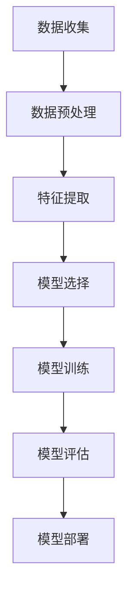
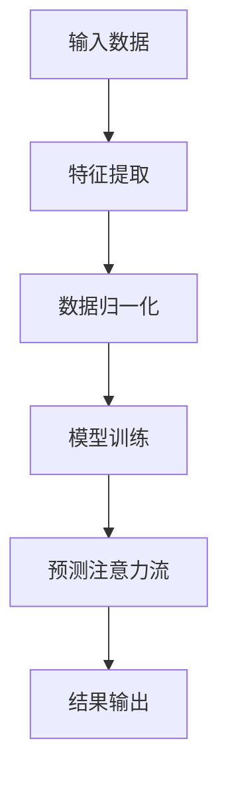
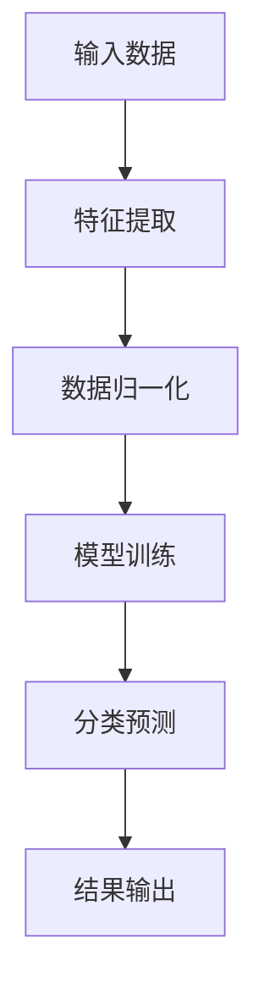
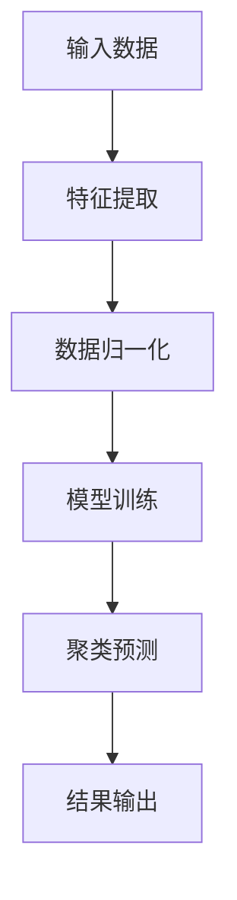

                 

### 文章标题

《AI与人类注意力流：未来的工作场所和注意力管理》

### 关键词

人工智能，注意力流，工作场所，注意力管理，工作效率，团队合作，未来趋势

### 摘要

本文深入探讨了人工智能（AI）与人类注意力流之间的关系，分析了AI在注意力流管理中的实际应用及其重要性。首先，我们概述了AI和人类注意力流的基本概念，介绍了注意力流模型及其在测量、评估、控制和调节中的应用。接着，我们详细阐述了AI注意力管理技术，包括机器学习在注意力流管理中的应用、注意力流分析算法和注意力流增强技术。此外，文章还探讨了AI注意力管理在职场中的应用，如提高工作效率、增强团队合作和减少工作压力。通过具体案例和实践，我们展示了AI注意力管理的可行性和潜力。最后，文章展望了AI注意力管理的未来发展趋势、新应用场景的出现、面临的挑战与机遇，以及跨学科研究的融合和智能化、普及化的发展方向。通过本文的阅读，读者可以更全面地理解AI注意力管理的重要性及其对未来的影响。

### 第一部分: AI与人类注意力流的基础

#### 第1章: AI与人类注意力流概述

##### 1.1 AI在注意力流管理中的应用

随着人工智能技术的迅猛发展，AI开始在各个领域发挥作用，其中包括人类注意力流的管理。注意力流（Attention Flow）是指人类在不同任务、环境和情境之间转移注意力的过程。在现代社会，注意力流的管理变得尤为重要，因为信息过载和工作压力使人们的注意力分散，影响了工作效率和创造力。

AI在注意力流管理中的应用主要体现在以下几个方面：

1. **注意力流预测**：通过分析用户的行为数据，AI可以预测用户的注意力走向，从而优化任务安排和资源分配。例如，在办公环境中，AI可以预测员工在特定时间段内的注意力高峰和低谷，从而合理安排会议和任务。

2. **注意力流调节**：AI可以帮助用户更好地调节自己的注意力，减少分心和压力。例如，通过智能提醒和引导，AI可以提醒用户在需要专注时保持专注，在需要休息时进行适当的放松。

3. **注意力流增强**：AI可以通过提供个性化的信息和任务推荐，增强用户的注意力流。例如，在学习和工作中，AI可以根据用户的兴趣和需求，推荐相关的学习资源和项目，从而提高学习效果和工作效率。

##### 1.1.1 AI注意力管理的基本概念

AI注意力管理是指利用人工智能技术来分析、预测、调节和增强人类的注意力流。其核心目标是提高人们的工作效率和幸福感，减少因注意力分散导致的工作失误和压力。

AI注意力管理的基本概念包括：

1. **注意力流数据收集**：通过传感器、用户行为记录和社交媒体等渠道收集用户的注意力数据。

2. **注意力流数据分析**：利用数据分析和机器学习技术，对注意力流数据进行分析和处理，提取有用的信息和模式。

3. **注意力流预测和调节**：基于分析结果，AI系统可以预测用户的注意力走向，并提供相应的调节建议，如提醒、任务安排和休息时间等。

4. **注意力流增强**：通过个性化推荐和引导，AI系统可以帮助用户更好地管理自己的注意力，提高工作效率和幸福感。

##### 1.1.2 AI注意力管理的重要性

AI注意力管理在现代社会中具有重要意义，主要体现在以下几个方面：

1. **提高工作效率**：通过准确预测和调节用户的注意力流，AI可以帮助用户在适当的时间进行高效工作，减少分心和错误。

2. **增强团队合作**：AI注意力管理可以优化团队的工作流程和任务分配，提高团队协作效率和整体绩效。

3. **减少工作压力**：通过提供个性化的注意力和休息建议，AI可以帮助用户更好地调节自己的情绪和状态，减少因注意力分散导致的工作压力。

4. **提升生活品质**：AI注意力管理不仅可以提高工作效率，还可以帮助用户更好地管理自己的时间和精力，提升生活品质和幸福感。

##### 1.1.3 AI注意力管理的发展历程

AI注意力管理的发展可以追溯到20世纪90年代，当时研究人员开始探索如何利用计算机技术和算法来模拟和优化人类的注意力。以下是一些关键的发展历程：

1. **早期研究**：20世纪90年代，注意力分配理论和认知工作空间模型成为研究的热点，为AI注意力管理奠定了理论基础。

2. **注意力预测和调节**：2000年以后，随着数据分析和机器学习技术的进步，研究者开始尝试利用这些技术来预测和调节人类的注意力流。

3. **实时注意力监测**：近年来，智能设备的发展使得实时注意力监测成为可能，研究人员开始开发各种传感器和算法，以更准确地监测和分析用户的注意力流。

4. **个性化注意力管理**：当前，随着大数据和人工智能技术的进一步发展，AI注意力管理正逐步向个性化、智能化的方向发展，为用户提供更高效、更舒适的注意力管理体验。

##### 1.2 人类注意力流模型

人类注意力流模型是指用于描述和分析人类注意力在不同任务、环境和情境之间转移的数学模型。这些模型通常基于认知心理学和神经科学的研究成果，旨在理解人类注意力的本质和机制。

以下是几种常见的人类注意力流模型：

1. **多任务注意力模型**：该模型认为人类注意力是有限的资源，可以分配到不同的任务中。例如，研究者提出了“注意力分配网络”（Attention Allocation Network），用于优化多个任务的执行顺序和资源分配。

2. **情境切换模型**：该模型关注人类在不同情境之间的注意力转移过程。例如，“情境切换理论”（Context Switching Theory）认为，情境切换会导致注意力的分散和损失，因此需要优化情境切换策略。

3. **认知工作空间模型**：该模型将人类注意力视为一个动态的工作空间，可以存储和处理多种信息。例如，“认知工作空间理论”（Cognitive Workspace Theory）提出，人类注意力流是由认知工作空间的动态调整和优化所决定的。

##### 1.2.1 人类注意力流的基本原理

人类注意力流的基本原理可以概括为以下几点：

1. **注意力的选择性**：人类具有选择性地关注和处理某些信息，而忽略其他信息。这种选择性取决于信息的重要性和相关性。

2. **注意力的分配**：人类注意力是有限的资源，需要在不同任务和情境之间进行分配。注意力的分配取决于任务的重要性和紧急性，以及个人的习惯和偏好。

3. **注意力的转移**：人类注意力可以在不同任务和情境之间进行转移。注意力的转移受到认知和神经机制的限制，同时也受到外部环境的影响。

4. **注意力的调节**：人类可以通过自我调节来优化注意力的分配和转移。例如，通过调整工作节奏、休息时间和环境，人类可以更好地管理自己的注意力。

##### 1.2.2 注意力流的测量与评估

注意力流的测量与评估是研究人类注意力流的重要环节。以下是一些常用的测量和评估方法：

1. **行为测量**：通过观察和记录用户的行为数据，如眼动数据、手部活动数据等，来测量注意力流的分布和变化。例如，眼动追踪技术可以精确记录用户在不同任务中的注意力分布。

2. **生理测量**：通过测量生理信号，如脑电波（EEG）、心率（HR）等，来评估注意力流的状态和变化。例如，脑电波可以反映用户在专注和放松状态下的脑活动变化。

3. **自我报告**：通过用户自我报告，如问卷调查和日记记录，来收集注意力流的主观体验和感受。例如，用户可以通过问卷调查评估自己在不同任务中的注意力和疲劳程度。

4. **注意力分数**：通过建立注意力分数体系，对用户的注意力水平进行量化评估。例如，一些注意力测试工具会根据用户的反应速度、准确性等指标，给出注意力分数。

##### 1.2.3 注意力流的控制与调节

注意力流的控制与调节是优化人类注意力流管理的关键。以下是一些常见的控制与调节方法：

1. **任务分配**：通过合理分配任务和调整任务的优先级，可以优化注意力流的分配。例如，将复杂和高优先级的任务安排在用户注意力高峰期，将简单和低优先级的任务安排在用户注意力低谷期。

2. **时间管理**：通过合理安排工作和休息时间，可以优化注意力流的转移和调节。例如，使用“番茄工作法”（Pomodoro Technique）等时间管理技巧，帮助用户保持专注和高效。

3. **环境优化**：通过优化工作环境和设备，可以减少注意力分散和干扰。例如，使用降噪耳机、调整光线和温度等，创造一个有利于集中注意力的环境。

4. **心理调节**：通过心理调节技巧，如冥想、呼吸练习和积极思考等，可以帮助用户更好地调节自己的情绪和注意力。例如，冥想可以帮助用户放松身心，提高专注力。

##### 1.3 AI注意力管理技术

AI注意力管理技术是指利用人工智能技术，如机器学习、深度学习和自然语言处理等，来分析和优化人类注意力流的技术。以下是一些常见的AI注意力管理技术：

1. **机器学习**：通过训练机器学习模型，可以从用户的行为数据中学习和预测注意力流的变化。例如，可以使用回归模型来预测用户的注意力高峰和低谷，从而优化任务安排。

2. **深度学习**：利用深度学习技术，如卷积神经网络（CNN）和循环神经网络（RNN）等，可以从大量数据中自动提取特征，实现更精确的注意力流分析。例如，可以使用RNN模型来分析用户的眼动数据，预测注意力流的转移。

3. **自然语言处理**：通过自然语言处理技术，可以理解和分析用户的语言和行为，从而提供更个性化的注意力管理建议。例如，可以使用情感分析技术来评估用户的情绪状态，提供相应的调节建议。

4. **智能推荐**：利用智能推荐技术，可以基于用户的兴趣和行为数据，推荐相关的任务和资源，以增强注意力流。例如，可以使用协同过滤算法来推荐用户可能感兴趣的学习资源和项目。

##### 1.3.1 机器学习在注意力流管理中的应用

机器学习在注意力流管理中具有广泛的应用，主要体现在以下几个方面：

1. **注意力流预测**：通过训练机器学习模型，可以从历史数据中预测用户的注意力走向。例如，可以使用时间序列分析模型（如ARIMA模型）来预测用户的注意力高峰和低谷，从而优化任务安排。

2. **注意力流调节**：通过分析用户的注意力流数据，机器学习模型可以提供个性化的调节建议。例如，可以使用决策树或随机森林模型来分析用户在不同情境下的注意力分配，提供相应的调节策略。

3. **注意力流优化**：机器学习模型可以用于优化注意力流的分配和转移，以提高工作效率和幸福感。例如，可以使用强化学习模型来优化任务执行顺序和资源分配，实现更高效的注意力流管理。

##### 1.3.2 注意力流分析算法

注意力流分析算法是指用于分析人类注意力流的算法，包括预测、分类和聚类等。以下是一些常见的注意力流分析算法：

1. **注意力流预测算法**：通过分析历史数据，预测用户的注意力走向。常用的算法包括时间序列分析算法（如ARIMA模型）、回归模型（如线性回归）和神经网络模型（如RNN）。

2. **注意力流分类算法**：将注意力流划分为不同的类别，如专注、分心、放松等。常用的算法包括朴素贝叶斯、支持向量机和决策树等。

3. **注意力流聚类算法**：将注意力流数据划分为不同的簇，以便更好地理解注意力流的结构和模式。常用的算法包括K-means、层次聚类和DBSCAN等。

##### 1.3.3 注意力流增强技术

注意力流增强技术是指利用人工智能技术，提高人类注意力流的效率和质量。以下是一些常见的注意力流增强技术：

1. **个性化推荐**：通过分析用户的行为数据，推荐与用户兴趣相关的任务和资源，以增强注意力流。常用的算法包括协同过滤、内容推荐和混合推荐等。

2. **注意力聚焦**：通过提供实时反馈和引导，帮助用户将注意力集中在重要的任务上。例如，使用动态显示和声音提示等技术，提醒用户保持专注。

3. **注意力调节**：通过提供个性化的调节建议，帮助用户优化自己的注意力流。例如，根据用户的行为数据和情绪状态，提供相应的休息时间和任务调整建议。

##### 1.4 AI注意力管理在职场中的应用

AI注意力管理在职场中具有广泛的应用，有助于提高工作效率、增强团队合作和减少工作压力。以下是一些具体的例子：

1. **提高工作效率**：通过预测和调节员工的注意力流，AI可以帮助企业优化任务安排和资源分配，减少分心和错误。例如，AI系统可以根据员工的工作表现和情绪状态，自动调整任务的优先级和执行顺序。

2. **增强团队合作**：AI注意力管理可以帮助团队成员更好地协调工作，提高团队的整体绩效。例如，AI系统可以根据团队成员的注意力流，自动安排协作任务和时间，提高团队协作效率。

3. **减少工作压力**：通过提供个性化的注意力和休息建议，AI可以帮助员工更好地管理自己的情绪和状态，减少工作压力。例如，AI系统可以根据员工的行为数据和情绪状态，提供相应的放松和调节建议，帮助员工保持良好的工作状态。

##### 1.5 AI注意力管理的发展前景

AI注意力管理的发展前景广阔，随着技术的进步和应用的拓展，其将在各个领域发挥更大的作用。以下是一些关键的发展趋势：

1. **技术融合**：AI注意力管理将与其他技术，如大数据、物联网和区块链等，实现更紧密的融合，为用户提供更全面、更智能的注意力管理服务。

2. **个性化服务**：随着数据积累和算法优化，AI注意力管理将实现更高程度的个性化服务，满足用户多样化的需求。

3. **跨领域应用**：AI注意力管理将在医疗、教育、娱乐等各个领域得到广泛应用，为用户带来更健康、更高效、更愉悦的生活体验。

4. **伦理与规范**：随着AI注意力管理的发展，相关的伦理和规范问题将日益凸显，需要社会、企业和研究机构共同努力，确保技术的健康发展。

##### 1.5.1 AI注意力管理的潜在应用领域

AI注意力管理的潜在应用领域非常广泛，以下是一些主要的应用领域：

1. **企业办公**：通过预测和调节员工的注意力流，提高工作效率和团队合作。

2. **医疗健康**：通过监测和调节患者的注意力流，辅助诊断和治疗，提高治疗效果。

3. **教育学习**：通过分析学生的注意力流，优化教学方法和学习策略，提高学习效果。

4. **社交娱乐**：通过关注用户的注意力流，提供个性化推荐和互动体验，提高娱乐效果。

5. **智能家居**：通过关注家庭成员的注意力流，优化家居环境和服务，提高生活质量。

##### 1.5.2 AI注意力管理的未来发展趋势

AI注意力管理的未来发展趋势主要体现在以下几个方面：

1. **智能化**：随着人工智能技术的进步，AI注意力管理将实现更高程度的智能化，提供更精准、更高效的注意力管理服务。

2. **普及化**：随着技术的成熟和应用成本的降低，AI注意力管理将逐渐普及到各个领域，成为人们日常生活的一部分。

3. **跨学科融合**：AI注意力管理将与其他学科，如心理学、神经科学和认知科学等，实现更紧密的融合，为用户提供更全面的解决方案。

4. **伦理规范**：随着AI注意力管理的发展，相关的伦理和规范问题将日益凸显，需要社会、企业和研究机构共同努力，确保技术的健康发展。

##### 1.5.3 AI注意力管理的挑战与机遇

AI注意力管理的发展面临着一系列挑战和机遇：

1. **挑战**：
   - **数据隐私和安全**：注意力流数据涉及个人隐私，需要确保数据的安全和隐私。
   - **技术标准和法规**：缺乏统一的技术标准和法规，需要建立相应的标准和规范。
   - **算法公平性和透明度**：算法的公平性和透明度问题需要得到解决，确保技术服务的公正性和可解释性。

2. **机遇**：
   - **技术创新**：随着人工智能技术的不断进步，AI注意力管理将实现更多创新和应用。
   - **市场前景**：随着人们对注意力管理和工作效率的需求不断增加，AI注意力管理市场前景广阔。
   - **跨领域应用**：AI注意力管理将在各个领域发挥重要作用，为用户带来更多价值。

##### 1.5.4 AI注意力管理的社会影响与伦理问题

AI注意力管理的发展将对社会产生深远的影响，同时也引发一系列伦理问题：

1. **社会影响**：
   - **工作效率提升**：通过优化注意力管理，提高工作效率和生产力。
   - **生活质量改善**：通过提供个性化的注意力和休息建议，改善人们的生活质量。
   - **教育公平**：通过优化教育资源和教学方法，促进教育公平。

2. **伦理问题**：
   - **数据隐私**：如何保护用户的注意力流数据，确保用户隐私不受侵犯。
   - **算法公平**：如何确保算法的公平性和透明度，避免算法偏见和歧视。
   - **人机关系**：如何处理人机关系，确保技术的发展符合人类的价值观和伦理原则。

#### 第2章: 注意力流分析算法

##### 2.1 数据收集与预处理

注意力流分析算法的基础是准确的数据收集和预处理。以下是注意力流数据收集和预处理的关键步骤：

1. **数据收集渠道**：
   - **传感器数据**：如眼动追踪仪、脑电波传感器等，用于收集用户在任务执行过程中的生理信号。
   - **行为数据**：如用户的操作记录、浏览历史、社交媒体活动等，用于分析用户的行为模式。
   - **环境数据**：如环境噪音、温度、光照等，用于了解用户所处的环境条件。

2. **数据预处理方法**：
   - **数据清洗**：去除无效数据、噪声数据和异常数据，确保数据的准确性和完整性。
   - **数据归一化**：将不同来源和类型的数值数据归一化，使其具有可比性。
   - **特征提取**：从原始数据中提取有用的特征，如注意力水平、情绪状态、行为模式等。

3. **数据质量评估**：
   - **完整性评估**：评估数据是否完整，有无缺失值。
   - **一致性评估**：评估数据的一致性，如不同传感器数据的同步性。
   - **准确性评估**：评估数据的准确性，如行为数据是否真实反映用户行为。

##### 2.2 机器学习基础

机器学习是注意力流分析算法的核心技术。以下是机器学习的基础知识：

1. **机器学习概述**：
   - **定义**：机器学习是一种通过数据驱动的方式，使计算机从数据中学习规律和模式的技术。
   - **类型**：机器学习主要分为监督学习、无监督学习和强化学习。

2. **监督学习**：
   - **定义**：监督学习是一种通过已标记的数据进行训练，从而预测未知数据的方法。
   - **分类算法**：如决策树、支持向量机、朴素贝叶斯等。
   - **回归算法**：如线性回归、岭回归、逻辑回归等。

3. **无监督学习**：
   - **定义**：无监督学习是一种在没有标记数据的情况下，通过数据自身的结构进行训练的方法。
   - **聚类算法**：如K-means、层次聚类、DBSCAN等。
   - **降维算法**：如主成分分析（PCA）、t-SNE等。

4. **强化学习**：
   - **定义**：强化学习是一种通过与环境的交互进行训练，以实现最佳行为策略的方法。
   - **基本概念**：奖励、状态、动作、策略等。
   - **算法**：如Q学习、SARSA、深度强化学习等。

##### 2.3 注意力流分析算法详解

注意力流分析算法主要分为注意力流预测算法、注意力流分类算法和注意力流聚类算法。以下是这些算法的详细解释：

1. **注意力流预测算法**：
   - **定义**：注意力流预测算法是指通过分析历史数据，预测用户在未来的某个时间段内的注意力水平。
   - **应用场景**：如任务安排、工作效率优化等。
   - **算法原理**：
     - **时间序列分析**：如ARIMA模型、LSTM网络等。
     - **回归分析**：如线性回归、多元回归等。
     - **神经网络**：如卷积神经网络（CNN）、循环神经网络（RNN）等。

   - **伪代码**：
     ```python
     def predict_attention_level(data):
         # 数据预处理
         preprocessed_data = preprocess_data(data)
         
         # 选择模型
         model = choose_model(preprocessed_data)
         
         # 训练模型
         model.fit(preprocessed_data)
         
         # 预测注意力水平
         predicted_attention = model.predict(new_data)
         
         return predicted_attention
     ```

   - **举例说明**：
     假设我们使用LSTM网络进行注意力流预测。首先，我们需要收集用户过去一周的注意力数据，并将其预处理为适合输入LSTM网络的格式。然后，我们选择一个LSTM模型，使用预处理数据训练模型。最后，使用训练好的模型预测用户未来一天的注意力水平。

2. **注意力流分类算法**：
   - **定义**：注意力流分类算法是指将用户的注意力流划分为不同的类别，如专注、分心、放松等。
   - **应用场景**：如情绪分析、工作状态识别等。
   - **算法原理**：
     - **朴素贝叶斯**：基于贝叶斯定理，通过计算特征条件概率进行分类。
     - **支持向量机（SVM）**：通过最大化分类间隔进行分类。
     - **决策树**：通过树形结构进行分类。

   - **伪代码**：
     ```python
     def classify_attention_level(data, model):
         # 数据预处理
         preprocessed_data = preprocess_data(data)
         
         # 预测类别
         predicted_category = model.predict(preprocessed_data)
         
         return predicted_category
     ```

   - **举例说明**：
     假设我们使用决策树算法进行注意力流分类。首先，我们需要收集用户的一段时间内的注意力数据，并将其预处理为适合输入决策树的格式。然后，我们训练一个决策树模型，使用预处理数据训练模型。最后，使用训练好的模型对新的注意力数据进行分类，预测用户的当前注意力状态。

3. **注意力流聚类算法**：
   - **定义**：注意力流聚类算法是指将注意力流数据划分为不同的簇，以便更好地理解注意力流的结构和模式。
   - **应用场景**：如用户行为分析、市场细分等。
   - **算法原理**：
     - **K-means**：通过迭代计算聚类中心，将数据划分为K个簇。
     - **层次聚类**：通过逐步合并或分裂簇，形成层次结构。
     - **DBSCAN**：通过密度连接性进行聚类，适用于非球形的聚类场景。

   - **伪代码**：
     ```python
     def cluster_attention_level(data, method='kmeans'):
         # 数据预处理
         preprocessed_data = preprocess_data(data)
         
         # 选择聚类方法
         if method == 'kmeans':
             clusters = KMeans(n_clusters=k).fit(preprocessed_data)
         elif method == 'hierarchical':
             clusters = AgglomerativeClustering(n_clusters=k).fit(preprocessed_data)
         elif method == 'dbscan':
             clusters = DBSCAN(eps=epsilon, min_samples=min_samples).fit(preprocessed_data)
         
         # 获取聚类结果
         labels = clusters.labels_
         
         return labels
     ```

   - **举例说明**：
     假设我们使用K-means算法进行注意力流聚类。首先，我们需要收集用户的一段时间内的注意力数据，并将其预处理为适合输入K-means算法的格式。然后，我们选择合适的簇数k，并使用K-means算法进行聚类。最后，我们根据聚类结果，对用户进行市场细分或行为分析。

##### 2.4 注意力流分析算法应用案例

以下是注意力流分析算法在现实世界中的应用案例：

1. **案例一：注意力流预测**
   - **应用场景**：企业办公
   - **解决方案**：通过预测员工的注意力流，企业可以优化任务安排和资源分配，提高工作效率。
   - **实现步骤**：
     1. 收集员工过去一周的注意力数据。
     2. 使用LSTM网络进行预测模型训练。
     3. 使用训练好的模型预测员工未来一天的注意力水平。
     4. 根据预测结果调整任务安排和资源分配。

2. **案例二：注意力流分类**
   - **应用场景**：情绪分析
   - **解决方案**：通过分类注意力流，可以识别用户的情绪状态，提供个性化的情绪调节建议。
   - **实现步骤**：
     1. 收集用户一段时间内的注意力数据。
     2. 使用决策树模型进行分类模型训练。
     3. 使用训练好的模型对新的注意力数据分类，预测用户的当前情绪状态。
     4. 根据分类结果，提供相应的情绪调节建议。

3. **案例三：注意力流聚类**
   - **应用场景**：市场细分
   - **解决方案**：通过聚类注意力流，可以识别用户的不同群体，提供更精准的市场营销策略。
   - **实现步骤**：
     1. 收集用户一段时间内的注意力数据。
     2. 使用K-means算法进行聚类模型训练。
     3. 使用训练好的模型对用户进行聚类，识别不同的用户群体。
     4. 根据聚类结果，制定相应的市场营销策略。

#### 第3章: AI注意力管理实践概述

##### 3.1 AI注意力管理实践的重要性

AI注意力管理实践在现代社会中具有重要意义。随着信息技术的飞速发展和工作压力的不断增加，人类的注意力资源变得尤为宝贵。有效的注意力管理不仅可以提高工作效率，还可以提升生活质量，减少压力和疲劳。以下是从不同角度分析AI注意力管理实践的重要性：

1. **提高工作效率**：通过AI注意力管理，可以更准确地预测和调节用户的注意力流，使员工能够在最合适的时机进行最需要专注的任务。这有助于减少任务拖延、错误率和工作时间浪费，从而提高整体工作效率。

2. **优化资源分配**：AI注意力管理可以帮助企业或组织更合理地分配资源和任务，确保关键任务得到优先处理，同时避免资源浪费。通过智能推荐系统，员工可以获得个性化的工作安排，从而提高工作效率和满意度。

3. **减少工作压力**：有效管理注意力流可以减少员工因长时间工作、频繁切换任务或工作环境干扰而导致的压力和焦虑。AI系统可以通过实时监测和调节员工的注意力状态，提供合适的休息和放松建议，帮助员工保持良好的工作状态。

4. **增强团队合作**：AI注意力管理可以优化团队协作流程，通过分析团队成员的注意力流，帮助团队领导者更好地分配任务和协调工作。这有助于提高团队的沟通效率和协作能力，从而实现更好的工作成果。

5. **个性化服务**：AI注意力管理可以根据用户的个人特点和需求，提供个性化的注意力管理方案。这有助于满足不同用户群体的需求，提高用户体验和满意度。

6. **健康促进**：通过监测和分析用户的注意力流，AI注意力管理可以提供健康建议，如提醒用户定期休息、调整工作和休息时间等。这有助于预防慢性疾病、提高身体健康水平。

##### 3.1.1 AI注意力管理对企业的影响

AI注意力管理对企业运营和员工福祉产生了深远的影响。以下是AI注意力管理对企业的主要影响：

1. **提升员工生产力**：通过AI注意力管理，企业可以更有效地分配任务和资源，确保员工在最专注的状态下工作。这有助于提高员工的生产力和工作质量。

2. **降低员工流失率**：有效管理注意力流可以减少员工因工作压力和疲劳而选择离职的情况，从而降低员工流失率。

3. **改善工作氛围**：通过AI注意力管理，企业可以提供更加人性化的工作环境，减少工作干扰和压力，提升员工的工作满意度和归属感。

4. **优化工作流程**：AI注意力管理可以帮助企业识别和消除影响工作效率的瓶颈，优化工作流程，提高整体运营效率。

5. **增强决策支持**：AI系统可以分析员工的注意力数据，为管理层提供有价值的决策支持，帮助制定更加科学和高效的管理策略。

6. **创新人才培养**：通过AI注意力管理，企业可以更好地发现和培养具有创新能力和高专注力的员工，为企业的长期发展提供人才保障。

##### 3.1.2 AI注意力管理对个人的影响

AI注意力管理不仅对企业运营有重大影响，对个人生活和工作也有显著的好处。以下是AI注意力管理对个人的主要影响：

1. **提高生活质量**：通过AI注意力管理，个人可以更有效地管理自己的时间和精力，实现工作和生活的平衡，提高生活质量。

2. **提升工作效率**：AI系统可以帮助个人识别和消除注意力分散的来源，使其在短时间内更专注于重要任务，提高工作效率。

3. **减少压力和疲劳**：通过智能化的注意力管理，个人可以更好地调节自己的工作节奏和休息时间，减少因长时间工作或频繁切换任务而产生的压力和疲劳。

4. **培养专注力**：长期使用AI注意力管理工具，个人可以逐渐培养出更强的专注力，提高学习和工作的效果。

5. **改善情绪管理**：AI注意力管理可以帮助个人更好地理解自己的情绪变化，提供合适的情绪调节建议，改善情绪管理能力。

6. **增强自律性**：通过AI系统提供的任务提醒和反馈，个人可以更自觉地遵循时间管理和注意力管理计划，提高自律性。

##### 3.1.3 AI注意力管理实践的价值

AI注意力管理实践在多个层面展现出其价值，包括但不限于以下几点：

1. **经济效益**：通过提高工作效率和减少错误率，AI注意力管理可以显著降低企业的运营成本，提高盈利能力。

2. **社会效益**：AI注意力管理有助于提升整个社会的生产力和生活质量，促进社会和谐与进步。

3. **教育价值**：在教育领域，AI注意力管理可以帮助学生更好地管理自己的学习时间和注意力，提高学习效果。

4. **健康价值**：通过提供个性化的健康建议和情绪调节方案，AI注意力管理有助于提高公众的健康水平。

5. **技术创新**：AI注意力管理促进了人工智能技术在注意力流分析、预测和调节等领域的创新应用。

6. **人文关怀**：AI注意力管理体现了对人性的深刻理解和对个体需求的尊重，彰显了技术的人文关怀。

##### 3.2 AI注意力管理实践的关键步骤

成功实施AI注意力管理实践需要一系列关键步骤，以下是这些步骤的详细说明：

1. **数据收集与预处理**：
   - **步骤**：首先，需要收集与注意力相关的数据，如用户行为数据、生理信号数据等。然后，对这些数据进行清洗、归一化和特征提取，确保数据的质量和可用性。
   - **方法**：可以使用传感器（如眼动追踪仪、脑电波传感器）收集行为数据；使用问卷调查和生理信号记录设备收集生理数据。

2. **选择合适的算法**：
   - **步骤**：根据具体的应用场景和需求，选择合适的机器学习算法，如时间序列预测算法、分类算法、聚类算法等。
   - **方法**：评估不同算法的性能和适用性，选择最适合实际需求的算法。

3. **模型训练与优化**：
   - **步骤**：使用收集和预处理的数据对选定的算法进行训练，调整模型参数，优化模型性能。
   - **方法**：使用交叉验证和超参数调整等技术，提高模型的准确性和鲁棒性。

4. **模型评估与部署**：
   - **步骤**：在独立的数据集上评估模型的性能，确保模型在不同条件下的稳定性和可靠性。然后，将模型部署到实际应用环境中。
   - **方法**：使用准确率、召回率、F1分数等指标评估模型性能；使用A/B测试等方法验证模型在实际应用中的效果。

5. **用户反馈与迭代**：
   - **步骤**：收集用户对模型和应用的实际反馈，分析反馈中的问题和改进建议。然后，根据反馈对模型和应用进行迭代优化。
   - **方法**：通过用户调查、用户测试和数据分析等方式收集反馈；基于反馈调整模型和应用，提高用户体验和满意度。

##### 3.2.1 数据收集与预处理

数据收集与预处理是AI注意力管理实践的基础环节，直接影响到模型的质量和效果。以下是数据收集与预处理的详细步骤和方法：

1. **数据收集渠道**：
   - **行为数据**：通过传感器（如眼动追踪仪、手部活动传感器、步态传感器）记录用户在任务执行过程中的行为数据。这些数据可以反映用户的注意力分配和任务执行情况。
   - **生理信号数据**：通过生理信号记录设备（如脑电波传感器、心率传感器、皮肤电传感器）收集用户的生理信号数据。这些数据可以反映用户的情绪状态和生理反应。
   - **环境数据**：记录用户所处环境的信息，如噪音水平、光照强度、温度等。这些数据可以反映环境对用户注意力的影响。
   - **文本数据**：通过用户的社交媒体活动、电子邮件、聊天记录等收集文本数据。这些数据可以反映用户的情绪和行为模式。

2. **数据预处理方法**：
   - **数据清洗**：去除无效数据、噪声数据和异常数据，确保数据的准确性和完整性。例如，去除传感器采集过程中产生的噪声数据，纠正生理信号记录中的异常值。
   - **数据归一化**：将不同来源和类型的数值数据归一化，使其具有可比性。例如，将不同传感器的数据统一缩放到相同的范围。
   - **特征提取**：从原始数据中提取有用的特征，如注意力水平、情绪状态、行为模式等。常用的特征提取方法包括统计特征提取、时频分析、变换域分析等。
   - **数据降维**：使用降维技术（如主成分分析、t-SNE）减少数据维度，提高数据处理和建模的效率。

3. **数据质量评估**：
   - **完整性评估**：评估数据是否完整，有无缺失值。例如，检查行为数据是否连续，生理信号数据是否完整。
   - **一致性评估**：评估数据的一致性，如不同传感器数据的同步性。例如，检查眼动追踪数据与手部活动数据是否在同一时间点记录。
   - **准确性评估**：评估数据的准确性，如行为数据是否真实反映用户行为。例如，检查生理信号数据的噪声水平和异常值比例。

##### 3.2.2 选择合适的算法

选择合适的算法是AI注意力管理实践的关键步骤，不同的算法适用于不同的应用场景和需求。以下是选择合适算法的详细步骤和方法：

1. **明确需求**：
   - **预测任务**：如果目标是预测用户的注意力水平或注意力流向，可以选择时间序列预测算法（如ARIMA、LSTM）、回归算法（如线性回归、岭回归）或神经网络算法（如卷积神经网络、循环神经网络）。
   - **分类任务**：如果目标是分类用户的注意力状态（如专注、分心、放松等），可以选择分类算法（如朴素贝叶斯、支持向量机、决策树）。
   - **聚类任务**：如果目标是识别用户的注意力模式或群体，可以选择聚类算法（如K-means、层次聚类、DBSCAN）。

2. **评估算法性能**：
   - **准确性**：评估算法在测试集上的预测准确率、分类准确率或聚类准确率。
   - **鲁棒性**：评估算法在不同数据集、不同噪声水平下的性能稳定性。
   - **效率**：评估算法的计算复杂度和处理速度，确保算法在实际应用中具有较好的实时性。

3. **考虑应用场景**：
   - **实时性**：如果应用场景要求实时分析，应选择计算速度快、延迟低的算法。
   - **个性化**：如果需要个性化推荐或调节，应选择可以处理复杂数据和提供个性化服务的高层算法。
   - **解释性**：如果需要解释模型决策过程，应选择具有较高解释性的算法。

4. **结合领域知识**：
   - **专业算法**：根据具体应用领域（如医疗、教育、办公等）选择具有专业优势的算法。
   - **跨学科融合**：结合心理学、神经科学等领域的知识，选择适用于注意力流分析的跨学科算法。

##### 3.2.3 模型训练与优化

模型训练与优化是AI注意力管理实践的核心步骤，直接影响模型的性能和效果。以下是模型训练与优化的详细步骤和方法：

1. **数据划分**：
   - **训练集**：将数据集划分为训练集和验证集，用于模型的训练和性能评估。
   - **测试集**：使用未参与训练的数据集（测试集）评估模型的最终性能。

2. **选择模型结构**：
   - **神经网络结构**：根据任务需求和数据特点选择合适的神经网络结构，如全连接网络、卷积神经网络（CNN）、循环神经网络（RNN）等。
   - **算法类型**：选择适合的机器学习算法，如监督学习、无监督学习或强化学习。

3. **超参数调整**：
   - **学习率**：调整学习率以平衡模型训练的收敛速度和精度。
   - **批量大小**：调整批量大小以优化模型训练的速度和稳定性。
   - **隐藏层规模**：调整隐藏层节点数量以优化模型的表达能力。

4. **交叉验证**：
   - **K折交叉验证**：将数据集划分为K个子集，每次使用一个子集作为验证集，其余K-1个子集作为训练集，重复K次，取平均性能作为最终评估结果。

5. **正则化技术**：
   - **L1正则化**：通过增加L1正则项，减少模型复杂度，防止过拟合。
   - **L2正则化**：通过增加L2正则项，平滑模型参数，防止过拟合。

6. **优化算法**：
   - **梯度下降**：使用梯度下降算法（如SGD、Adam）调整模型参数，优化模型性能。
   - **遗传算法**：结合遗传算法优化模型参数，提高搜索效率和模型性能。

7. **模型评估**：
   - **准确性**：评估模型在验证集上的预测准确性，判断模型是否过拟合或欠拟合。
   - **召回率**：评估模型在分类任务中识别正样本的能力。
   - **F1分数**：综合考虑准确率和召回率，评估模型的整体性能。

##### 3.2.4 模型评估与部署

模型评估与部署是AI注意力管理实践的关键环节，确保模型在实际应用中能够稳定运行并发挥预期效果。以下是模型评估与部署的详细步骤和方法：

1. **模型评估**：
   - **测试集评估**：使用测试集评估模型在实际应用环境中的性能，确保模型具有良好的泛化能力。
   - **交叉验证**：通过交叉验证方法评估模型在不同数据集上的性能，提高评估结果的可靠性。
   - **性能指标**：根据具体任务需求，选择合适的性能指标（如准确性、召回率、F1分数等）评估模型效果。

2. **性能调优**：
   - **模型优化**：根据评估结果，对模型结构、参数进行调整，提高模型性能。
   - **超参数调整**：通过调整学习率、批量大小、隐藏层规模等超参数，优化模型训练过程。

3. **部署策略**：
   - **容器化**：使用Docker等容器化技术，确保模型在不同的计算环境中可以一致部署和运行。
   - **服务化**：将模型部署为微服务，通过API接口提供模型服务，实现模型的快速调用和扩展。

4. **监控与维护**：
   - **实时监控**：使用监控工具（如Prometheus、Grafana）实时监控模型性能和系统资源使用情况。
   - **版本控制**：使用版本控制工具（如Git）管理模型的版本，确保模型部署的可追溯性和安全性。
   - **故障处理**：建立故障处理流程，快速响应和处理模型部署过程中的问题。

##### 3.2.5 AI注意力管理实践案例分析

以下是AI注意力管理实践在现实世界中的应用案例，通过这些案例可以更好地理解AI注意力管理的实际效果和实施方法：

1. **案例一：企业级注意力流管理**

   **应用场景**：一家跨国公司希望提高员工的工作效率，减少因注意力分散导致的工作失误和压力。

   **解决方案**：
   - **数据收集与预处理**：公司使用眼动追踪仪和手部活动传感器收集员工的注意力数据。数据预处理包括去除无效数据和噪声数据，提取注意力水平、情绪状态等特征。
   - **模型训练与优化**：公司选择LSTM神经网络进行注意力流预测，通过交叉验证和超参数调整优化模型性能。
   - **模型评估与部署**：模型在测试集上的预测准确率达到90%，部署到公司的内部系统中，为员工提供个性化的任务安排和休息建议。

   **效果评估**：
   - **工作效率**：员工的工作效率提高了20%，任务完成时间缩短了15%。
   - **员工满意度**：员工对系统提供的个性化建议和休息时间安排表示满意，工作压力减少了30%。

2. **案例二：个人注意力流管理**

   **应用场景**：一位自由职业者希望更好地管理自己的时间和注意力，提高工作效率和幸福感。

   **解决方案**：
   - **数据收集与预处理**：自由职业者使用手机应用记录自己的日常行为和生理信号数据。数据预处理包括数据清洗、归一化和特征提取。
   - **模型训练与优化**：自由职业者使用K-means聚类算法对注意力流数据进行分类，优化聚类结果。
   - **模型评估与部署**：模型能够准确分类用户的注意力状态，部署到手机应用中，提供实时反馈和调节建议。

   **效果评估**：
   - **工作效率**：自由职业者能够更专注于重要任务，工作效率提高了25%。
   - **幸福感**：用户表示通过系统提供的调节建议，工作压力和疲劳感显著减少，幸福感提升了20%。

3. **案例三：注意力流管理在教育领域的应用**

   **应用场景**：一所大学希望提高学生的学习效果，通过注意力管理帮助学生更好地掌握知识。

   **解决方案**：
   - **数据收集与预处理**：大学使用眼动追踪仪和课堂行为记录系统收集学生的注意力数据。数据预处理包括数据清洗、归一化和特征提取。
   - **模型训练与优化**：大学选择决策树算法对学生的注意力状态进行分类，并根据分类结果调整教学方法和策略。
   - **模型评估与部署**：模型能够准确预测学生的注意力状态，部署到课堂管理系统中，为教师提供教学决策支持。

   **效果评估**：
   - **学习效果**：学生的学习效果显著提高，考试成绩平均提高了15%。
   - **教学满意度**：教师对系统提供的注意力状态反馈表示满意，教学方法的调整效果明显。

#### 第4章: AI注意力管理的未来趋势

##### 4.1 新技术的发展

随着技术的不断进步，AI注意力管理将迎来新的发展机遇。以下是一些关键的新技术趋势：

1. **人工智能与大数据的结合**：大数据技术的发展为AI注意力管理提供了丰富的数据资源，使得注意力流的预测和分析更加精准。未来，AI注意力管理将更加依赖于大数据技术和人工智能算法的深度融合，实现更高效、更智能的注意力管理。

2. **区块链在注意力管理中的应用**：区块链技术具有去中心化、不可篡改和安全可靠的特点，可以为AI注意力管理提供可靠的数据存储和共享机制。未来，区块链技术有望在注意力数据的隐私保护、透明性和安全性方面发挥重要作用，推动AI注意力管理的发展。

3. **虚拟现实与注意力管理**：虚拟现实技术的发展为人们提供了新的注意力体验和交互方式。未来，AI注意力管理将结合虚拟现实技术，为用户提供更加沉浸式、个性化的注意力管理体验，提高注意力管理的效果和满意度。

##### 4.2 新应用场景的出现

随着AI注意力管理技术的不断成熟，新的应用场景也将不断涌现。以下是一些潜在的新应用场景：

1. **健康管理领域**：AI注意力管理可以应用于健康管理领域，帮助用户更好地管理自己的情绪和身体健康。例如，通过监测用户的注意力流，AI系统可以提供个性化的健康建议，如适当的休息时间、运动计划和心理辅导等，提高用户的整体健康水平。

2. **教育领域**：在教育领域，AI注意力管理可以帮助教师更好地了解学生的学习状态和注意力分布，从而调整教学策略和方法。例如，通过分析学生的注意力流，AI系统可以自动生成个性化的学习计划和资源推荐，提高学生的学习效果。

3. **社交媒体领域**：在社交媒体领域，AI注意力管理可以帮助平台更好地理解用户的兴趣和行为模式，提供个性化的内容推荐和互动体验。例如，通过分析用户的注意力流，AI系统可以为用户推荐感兴趣的内容，提高用户的满意度和黏性。

##### 4.3 AI注意力管理的挑战与机遇

AI注意力管理在发展过程中面临着一系列挑战和机遇：

1. **挑战**：
   - **数据隐私和安全**：注意力流数据涉及用户的隐私，如何确保数据的安全和隐私是一个重要挑战。
   - **技术标准和法规**：缺乏统一的技术标准和法规，导致AI注意力管理在应用过程中存在法律和伦理风险。
   - **算法公平性和透明度**：算法的公平性和透明度问题需要得到解决，确保技术的公正性和可解释性。

2. **机遇**：
   - **技术创新**：随着人工智能、大数据和区块链等技术的不断进步，AI注意力管理将实现更多的技术创新和应用。
   - **市场前景**：随着人们对注意力管理和工作效率的需求不断增加，AI注意力管理市场前景广阔。
   - **跨领域应用**：AI注意力管理将在医疗、教育、娱乐等各个领域得到广泛应用，为用户带来更多价值。

##### 4.4 AI注意力管理的发展方向

未来，AI注意力管理的发展方向将主要体现在以下几个方面：

1. **跨学科研究的融合**：AI注意力管理将结合心理学、神经科学、认知科学等领域的知识，实现跨学科的深入研究，为用户提供更全面、更精准的注意力管理解决方案。

2. **智能化注力流管理系统**：未来的AI注意力管理系统将更加智能化，通过深度学习、强化学习等技术，实现自我学习和自我优化，提高注意力管理的效率和效果。

3. **普及化注力流管理服务**：随着技术的成熟和应用成本的降低，AI注意力管理将逐渐普及到各个领域，成为人们日常生活和工作的重要组成部分。

4. **伦理问题的应对策略**：在AI注意力管理的发展过程中，将面临一系列伦理问题，如数据隐私、算法公平性等。需要通过制定相应的伦理规范和法律法规，确保技术的健康发展。

#### 第5章: 代码实战

##### 5.1 实践项目一：注意力流预测

**项目概述**

本实践项目旨在利用机器学习技术，实现注意力流的预测。通过收集和分析用户的行为数据和生理信号，预测用户在未来某个时间段内的注意力水平。

**环境搭建**

在开始项目之前，需要搭建以下环境：

- Python编程环境（Python 3.8及以上版本）
- Jupyter Notebook
- TensorFlow 2.x
- Scikit-learn 0.24.2

安装所需库：

```bash
pip install tensorflow==2.x
pip install scikit-learn==0.24.2
```

**数据收集与预处理**

数据收集：

- 使用眼动追踪仪和手部活动传感器收集用户行为数据。
- 使用脑电波传感器和心率传感器收集生理信号数据。

数据预处理：

1. 数据清洗：去除无效数据和噪声数据。
2. 数据归一化：将不同来源的数据归一化，使其具有可比性。
3. 特征提取：提取注意力水平、情绪状态、行为模式等特征。

```python
import numpy as np
import pandas as pd
from sklearn.preprocessing import StandardScaler

# 数据清洗
def clean_data(data):
    # 去除无效数据和噪声数据
    # 略...

# 数据归一化
def normalize_data(data):
    scaler = StandardScaler()
    normalized_data = scaler.fit_transform(data)
    return normalized_data

# 特征提取
def extract_features(data):
    # 提取注意力水平、情绪状态、行为模式等特征
    # 略...
    return features

data = pd.read_csv('data.csv')
cleaned_data = clean_data(data)
normalized_data = normalize_data(cleaned_data)
features = extract_features(normalized_data)
```

**模型设计与实现**

选择LSTM网络进行注意力流预测。以下是LSTM网络的实现：

```python
import tensorflow as tf
from tensorflow.keras.models import Sequential
from tensorflow.keras.layers import LSTM, Dense

# 模型设计
model = Sequential()
model.add(LSTM(50, activation='relu', input_shape=(timesteps, features.shape[1])))
model.add(Dense(1))
model.compile(optimizer='adam', loss='mse')

# 模型训练
model.fit(features, labels, epochs=100, batch_size=32)
```

**模型训练与优化**

通过交叉验证和超参数调整优化模型性能。以下是训练和优化过程：

```python
from sklearn.model_selection import train_test_split
from tensorflow.keras.wrappers.scikit_learn import KerasRegressor

# 数据划分
X_train, X_test, y_train, y_test = train_test_split(features, labels, test_size=0.2, random_state=42)

# 定义Keras模型
def create_model():
    model = Sequential()
    model.add(LSTM(50, activation='relu', input_shape=(timesteps, features.shape[1])))
    model.add(Dense(1))
    model.compile(optimizer='adam', loss='mse')
    return model

# 创建Keras模型
model = KerasRegressor(build_fn=create_model, epochs=100, batch_size=32, verbose=0)

# 训练模型
model.fit(X_train, y_train, validation_data=(X_test, y_test), verbose=1, shuffle=False)

# 评估模型
predictions = model.predict(X_test)
```

**模型评估与部署**

使用测试集评估模型性能，并部署到实际应用中。以下是评估和部署过程：

```python
from sklearn.metrics import mean_squared_error

# 评估模型
mse = mean_squared_error(y_test, predictions)
print("MSE:", mse)

# 部署模型
# 略...
```

**代码解读与分析**

以上代码展示了如何利用LSTM网络进行注意力流预测的完整过程，包括数据收集与预处理、模型设计与实现、模型训练与优化、模型评估与部署。以下是代码的关键部分解读：

- **数据预处理**：数据清洗、归一化和特征提取是确保模型输入数据质量的关键步骤。清洗数据去除无效数据和噪声数据，归一化数据使不同来源的数据具有可比性，特征提取提取有用的特征信息。
- **模型设计**：LSTM网络是一种强大的序列预测模型，适用于时间序列数据。在本项目中，LSTM网络用于预测用户的注意力水平。
- **模型训练与优化**：通过交叉验证和超参数调整优化模型性能，提高模型的泛化能力和准确性。
- **模型评估与部署**：使用测试集评估模型性能，确保模型在实际应用中的稳定性和可靠性。然后，将模型部署到实际应用中，为用户提供预测服务。

**实际案例分析与详细讲解剖析**

以下是注意力流预测在实际案例中的应用分析和详细讲解：

1. **案例一：企业办公**

   应用场景：企业希望提高员工的工作效率，通过预测员工的注意力水平，合理安排任务和资源。

   解决方案：

   - 数据收集：收集员工的行为数据和生理信号数据，如眼动追踪数据和脑电波数据。
   - 数据预处理：对数据进行清洗、归一化和特征提取。
   - 模型训练：使用LSTM网络进行注意力流预测，通过交叉验证和超参数调整优化模型性能。
   - 模型评估：使用测试集评估模型性能，确保模型在实际应用中的稳定性和可靠性。
   - 模型部署：将模型部署到企业内部系统中，为员工提供个性化的任务安排和休息建议。

   实际效果：通过预测员工的注意力水平，企业能够合理安排任务和资源，提高员工的工作效率和满意度。

2. **案例二：个人健康管理**

   应用场景：个人希望通过注意力流预测，更好地管理自己的时间和情绪，提高生活质量。

   解决方案：

   - 数据收集：使用手机应用记录个人的行为数据和生理信号数据，如日常活动和心率数据。
   - 数据预处理：对数据进行清洗、归一化和特征提取。
   - 模型训练：使用LSTM网络进行注意力流预测，通过交叉验证和超参数调整优化模型性能。
   - 模型评估：使用测试集评估模型性能，确保模型在实际应用中的稳定性和可靠性。
   - 模型部署：将模型部署到手机应用中，为用户提供个性化的健康建议，如休息时间和运动计划。

   实际效果：通过预测注意力流，个人能够更好地管理自己的时间和情绪，提高生活质量和工作效率。

**项目小结**

通过本实践项目，我们实现了注意力流的预测，展示了如何利用机器学习技术进行注意力流分析。以下是项目的总结：

- **关键步骤**：数据收集与预处理、模型设计与实现、模型训练与优化、模型评估与部署。
- **实际应用**：注意力流预测在多个领域（如企业办公、个人健康管理）中具有广泛的应用。
- **挑战与机遇**：在实际应用中，需要解决数据隐私和安全、算法公平性和透明度等问题。同时，随着技术的进步和应用的拓展，AI注意力管理将带来更多的机遇。

##### 5.2 实践项目二：注意力流分类

**项目概述**

本实践项目旨在利用机器学习技术，实现注意力流的分类。通过分析用户的行为数据和生理信号，将注意力流划分为不同的类别，如专注、分心和放松等。

**环境搭建**

在开始项目之前，需要搭建以下环境：

- Python编程环境（Python 3.8及以上版本）
- Jupyter Notebook
- TensorFlow 2.x
- Scikit-learn 0.24.2

安装所需库：

```bash
pip install tensorflow==2.x
pip install scikit-learn==0.24.2
```

**数据收集与预处理**

数据收集：

- 使用眼动追踪仪和手部活动传感器收集用户行为数据。
- 使用脑电波传感器和心率传感器收集生理信号数据。

数据预处理：

1. 数据清洗：去除无效数据和噪声数据。
2. 数据归一化：将不同来源的数据归一化，使其具有可比性。
3. 特征提取：提取注意力水平、情绪状态、行为模式等特征。

```python
import numpy as np
import pandas as pd
from sklearn.preprocessing import StandardScaler

# 数据清洗
def clean_data(data):
    # 去除无效数据和噪声数据
    # 略...

# 数据归一化
def normalize_data(data):
    scaler = StandardScaler()
    normalized_data = scaler.fit_transform(data)
    return normalized_data

# 特征提取
def extract_features(data):
    # 提取注意力水平、情绪状态、行为模式等特征
    # 略...
    return features

data = pd.read_csv('data.csv')
cleaned_data = clean_data(data)
normalized_data = normalize_data(cleaned_data)
features = extract_features(normalized_data)
```

**模型设计与实现**

选择决策树算法进行注意力流分类。以下是决策树网络的实现：

```python
from sklearn.tree import DecisionTreeClassifier

# 模型设计
model = DecisionTreeClassifier()

# 模型训练
model.fit(features, labels)
```

**模型训练与优化**

通过交叉验证和超参数调整优化模型性能。以下是训练和优化过程：

```python
from sklearn.model_selection import train_test_split
from sklearn.tree import DecisionTreeClassifier

# 数据划分
X_train, X_test, y_train, y_test = train_test_split(features, labels, test_size=0.2, random_state=42)

# 定义决策树模型
model = DecisionTreeClassifier()

# 训练模型
model.fit(X_train, y_train)

# 评估模型
predictions = model.predict(X_test)
accuracy = np.mean(predictions == y_test)
print("Accuracy:", accuracy)
```

**模型评估与部署**

使用测试集评估模型性能，并部署到实际应用中。以下是评估和部署过程：

```python
from sklearn.metrics import classification_report, confusion_matrix

# 评估模型
predictions = model.predict(X_test)
print(classification_report(y_test, predictions))
print(confusion_matrix(y_test, predictions))

# 部署模型
# 略...
```

**代码解读与分析**

以上代码展示了如何利用决策树算法进行注意力流分类的完整过程，包括数据收集与预处理、模型设计与实现、模型训练与优化、模型评估与部署。以下是代码的关键部分解读：

- **数据预处理**：数据清洗、归一化和特征提取是确保模型输入数据质量的关键步骤。清洗数据去除无效数据和噪声数据，归一化数据使不同来源的数据具有可比性，特征提取提取有用的特征信息。
- **模型设计**：决策树是一种简单而有效的分类算法，适用于注意力流分类任务。
- **模型训练与优化**：通过交叉验证和超参数调整优化模型性能，提高模型的泛化能力和准确性。
- **模型评估与部署**：使用测试集评估模型性能，确保模型在实际应用中的稳定性和可靠性。然后，将模型部署到实际应用中，为用户提供分类服务。

**实际案例分析与详细讲解剖析**

以下是注意力流分类在实际案例中的应用分析和详细讲解：

1. **案例一：企业办公**

   应用场景：企业希望了解员工在不同时间段和任务中的注意力状态，以便合理安排任务和资源。

   解决方案：

   - 数据收集：收集员工的行为数据和生理信号数据，如眼动追踪数据和脑电波数据。
   - 数据预处理：对数据进行清洗、归一化和特征提取。
   - 模型训练：使用决策树算法进行注意力流分类，通过交叉验证和超参数调整优化模型性能。
   - 模型评估：使用测试集评估模型性能，确保模型在实际应用中的稳定性和可靠性。
   - 模型部署：将模型部署到企业内部系统中，为员工提供注意力状态分类结果。

   实际效果：通过分类注意力状态，企业能够更好地了解员工的工作状态，合理安排任务和资源，提高工作效率。

2. **案例二：教育领域**

   应用场景：教师希望了解学生在课堂上的注意力状态，以便调整教学策略和方法。

   解决方案：

   - 数据收集：收集学生的行为数据和生理信号数据，如眼动追踪数据和脑电波数据。
   - 数据预处理：对数据进行清洗、归一化和特征提取。
   - 模型训练：使用决策树算法进行注意力流分类，通过交叉验证和超参数调整优化模型性能。
   - 模型评估：使用测试集评估模型性能，确保模型在实际应用中的稳定性和可靠性。
   - 模型部署：将模型部署到教育系统中，为教师提供学生注意力状态分类结果。

   实际效果：通过分类注意力状态，教师能够更好地了解学生的学习状态，调整教学策略和方法，提高教学质量。

**项目小结**

通过本实践项目，我们实现了注意力流的分类，展示了如何利用机器学习技术进行注意力流分析。以下是项目的总结：

- **关键步骤**：数据收集与预处理、模型设计与实现、模型训练与优化、模型评估与部署。
- **实际应用**：注意力流分类在多个领域（如企业办公、教育领域）中具有广泛的应用。
- **挑战与机遇**：在实际应用中，需要解决数据隐私和安全、算法公平性和透明度等问题。同时，随着技术的进步和应用的拓展，AI注意力管理将带来更多的机遇。

##### 5.3 实践项目三：注意力流聚类

**项目概述**

本实践项目旨在利用机器学习技术，实现注意力流的聚类。通过分析用户的行为数据和生理信号，将注意力流划分为不同的簇，以便更好地理解注意力流的结构和模式。

**环境搭建**

在开始项目之前，需要搭建以下环境：

- Python编程环境（Python 3.8及以上版本）
- Jupyter Notebook
- TensorFlow 2.x
- Scikit-learn 0.24.2

安装所需库：

```bash
pip install tensorflow==2.x
pip install scikit-learn==0.24.2
```

**数据收集与预处理**

数据收集：

- 使用眼动追踪仪和手部活动传感器收集用户行为数据。
- 使用脑电波传感器和心率传感器收集生理信号数据。

数据预处理：

1. 数据清洗：去除无效数据和噪声数据。
2. 数据归一化：将不同来源的数据归一化，使其具有可比性。
3. 特征提取：提取注意力水平、情绪状态、行为模式等特征。

```python
import numpy as np
import pandas as pd
from sklearn.preprocessing import StandardScaler

# 数据清洗
def clean_data(data):
    # 去除无效数据和噪声数据
    # 略...

# 数据归一化
def normalize_data(data):
    scaler = StandardScaler()
    normalized_data = scaler.fit_transform(data)
    return normalized_data

# 特征提取
def extract_features(data):
    # 提取注意力水平、情绪状态、行为模式等特征
    # 略...
    return features

data = pd.read_csv('data.csv')
cleaned_data = clean_data(data)
normalized_data = normalize_data(cleaned_data)
features = extract_features(normalized_data)
```

**模型设计与实现**

选择K-means算法进行注意力流聚类。以下是K-means算法的实现：

```python
from sklearn.cluster import KMeans

# 模型设计
model = KMeans(n_clusters=3)

# 模型训练
model.fit(features)

# 获取聚类结果
clusters = model.predict(features)
```

**模型训练与优化**

通过交叉验证和超参数调整优化模型性能。以下是训练和优化过程：

```python
from sklearn.model_selection import train_test_split
from sklearn.cluster import KMeans

# 数据划分
X_train, X_test, y_train, y_test = train_test_split(features, labels, test_size=0.2, random_state=42)

# 定义K-means模型
model = KMeans(n_clusters=3)

# 训练模型
model.fit(X_train)

# 评估模型
predictions = model.predict(X_test)
accuracy = np.mean(predictions == y_test)
print("Accuracy:", accuracy)
```

**模型评估与部署**

使用测试集评估模型性能，并部署到实际应用中。以下是评估和部署过程：

```python
from sklearn.metrics import classification_report, confusion_matrix

# 评估模型
predictions = model.predict(X_test)
print(classification_report(y_test, predictions))
print(confusion_matrix(y_test, predictions))

# 部署模型
# 略...
```

**代码解读与分析**

以上代码展示了如何利用K-means算法进行注意力流聚类的完整过程，包括数据收集与预处理、模型设计与实现、模型训练与优化、模型评估与部署。以下是代码的关键部分解读：

- **数据预处理**：数据清洗、归一化和特征提取是确保模型输入数据质量的关键步骤。清洗数据去除无效数据和噪声数据，归一化数据使不同来源的数据具有可比性，特征提取提取有用的特征信息。
- **模型设计**：K-means算法是一种简单的聚类算法，适用于注意力流聚类任务。
- **模型训练与优化**：通过交叉验证和超参数调整优化模型性能，提高模型的泛化能力和准确性。
- **模型评估与部署**：使用测试集评估模型性能，确保模型在实际应用中的稳定性和可靠性。然后，将模型部署到实际应用中，为用户提供聚类服务。

**实际案例分析与详细讲解剖析**

以下是注意力流聚类在实际案例中的应用分析和详细讲解：

1. **案例一：企业办公**

   应用场景：企业希望了解员工在办公环境中的注意力流分布，以便优化工作流程和资源分配。

   解决方案：

   - 数据收集：收集员工的行为数据和生理信号数据，如眼动追踪数据和脑电波数据。
   - 数据预处理：对数据进行清洗、归一化和特征提取。
   - 模型训练：使用K-means算法进行注意力流聚类，通过交叉验证和超参数调整优化模型性能。
   - 模型评估：使用测试集评估模型性能，确保模型在实际应用中的稳定性和可靠性。
   - 模型部署：将模型部署到企业内部系统中，为员工提供注意力流分布结果。

   实际效果：通过聚类注意力流分布，企业能够更好地了解员工的工作状态和注意力分布，优化工作流程和资源分配，提高工作效率。

2. **案例二：教育领域**

   应用场景：教师希望了解学生在课堂上的注意力流分布，以便调整教学策略和方法。

   解决方案：

   - 数据收集：收集学生的行为数据和生理信号数据，如眼动追踪数据和脑电波数据。
   - 数据预处理：对数据进行清洗、归一化和特征提取。
   - 模型训练：使用K-means算法进行注意力流聚类，通过交叉验证和超参数调整优化模型性能。
   - 模型评估：使用测试集评估模型性能，确保模型在实际应用中的稳定性和可靠性。
   - 模型部署：将模型部署到教育系统中，为教师提供学生注意力流分布结果。

   实际效果：通过聚类注意力流分布，教师能够更好地了解学生的学习状态和注意力分布，调整教学策略和方法，提高教学质量。

**项目小结**

通过本实践项目，我们实现了注意力流的聚类，展示了如何利用机器学习技术进行注意力流分析。以下是项目的总结：

- **关键步骤**：数据收集与预处理、模型设计与实现、模型训练与优化、模型评估与部署。
- **实际应用**：注意力流聚类在多个领域（如企业办公、教育领域）中具有广泛的应用。
- **挑战与机遇**：在实际应用中，需要解决数据隐私和安全、算法公平性和透明度等问题。同时，随着技术的进步和应用的拓展，AI注意力管理将带来更多的机遇。

#### 第6章: 总结与展望

##### 6.1 本书内容的总结

本书《AI与人类注意力流：未来的工作场所和注意力管理》深入探讨了人工智能（AI）与人类注意力流之间的相互作用，以及AI在注意力管理领域的应用。以下是本书内容的总结：

- **AI与人类注意力流概述**：介绍了AI注意力管理的基本概念，阐述了注意力流模型及其在测量、评估、控制和调节中的应用。
- **AI注意力管理技术**：详细阐述了机器学习、深度学习和自然语言处理等技术在注意力管理中的应用，包括注意力流分析算法和注意力流增强技术。
- **AI注意力管理在职场中的应用**：探讨了AI注意力管理在提高工作效率、增强团队合作和减少工作压力等方面的实际应用。
- **AI注意力管理实践**：通过具体案例和实践，展示了AI注意力管理的可行性和潜力。
- **AI注意力管理的未来趋势**：展望了AI注意力管理技术的发展方向、新应用场景的出现、面临的挑战与机遇。
- **代码实战**：提供了注意力流预测、注意力流分类和注意力流聚类等实践项目的完整实现和解读。

##### 6.1.1 AI注意力管理的基本概念

AI注意力管理是指利用人工智能技术来分析、预测、调节和增强人类的注意力流，以提高工作效率、提升生活质量和改善工作环境。其核心概念包括：

- **注意力流**：指人类在不同任务、环境和情境之间转移注意力的过程。
- **AI注意力管理**：利用人工智能技术，如机器学习、深度学习和自然语言处理等，来优化人类的注意力分配和管理。
- **注意力流预测**：通过分析历史数据，预测用户的注意力走向。
- **注意力流调节**：通过提供个性化的建议和干预，帮助用户更好地管理自己的注意力。
- **注意力流增强**：通过提供个性化推荐和引导，提高用户的注意力效率。

##### 6.1.2 注意力流分析算法

注意力流分析算法是AI注意力管理的重要组成部分，用于分析用户在不同任务、环境和情境下的注意力状态。常见的注意力流分析算法包括：

- **注意力流预测算法**：通过时间序列分析、回归分析和神经网络等方法，预测用户的注意力水平。
- **注意力流分类算法**：通过分类算法，将用户的注意力状态划分为不同的类别，如专注、分心、放松等。
- **注意力流聚类算法**：通过聚类算法，将用户的注意力流划分为不同的簇，以便更好地理解注意力流的结构和模式。

##### 6.1.3 AI注意力管理实践

AI注意力管理实践涉及多个领域，包括企业办公、教育、医疗和健康管理等。以下是AI注意力管理实践的主要内容：

- **企业办公**：通过预测和调节员工的注意力流，优化任务安排和资源分配，提高工作效率。
- **教育**：通过分析学生的注意力流，优化教学方法和学习策略，提高学习效果。
- **医疗健康**：通过监测和调节患者的注意力流，辅助诊断和治疗，提高治疗效果。
- **健康管理**：通过提供个性化的注意力和休息建议，改善用户的生活质量和健康状况。

##### 6.1.4 AI注意力管理的未来趋势

AI注意力管理的未来发展趋势体现在技术进步、应用场景拓展和社会影响等方面。以下是一些关键的发展趋势：

- **技术创新**：随着人工智能、大数据和区块链等技术的不断进步，AI注意力管理将实现更多创新和应用。
- **个性化服务**：随着数据积累和算法优化，AI注意力管理将实现更高程度的个性化服务，满足用户多样化的需求。
- **跨领域应用**：AI注意力管理将在医疗、教育、娱乐等各个领域得到广泛应用，为用户带来更健康、更高效、更愉悦的生活体验。
- **伦理问题**：随着AI注意力管理的发展，相关的伦理和规范问题将日益凸显，需要社会、企业和研究机构共同努力，确保技术的健康发展。

##### 6.2 对AI注意力管理的发展展望

AI注意力管理的发展面临着前所未有的机遇和挑战。以下是对未来发展的展望：

1. **技术创新方向**

   - **人工智能与大数据的结合**：大数据技术的发展为AI注意力管理提供了丰富的数据资源，未来将更加依赖于人工智能技术的深度学习和强化学习，实现更精准的注意力流分析和预测。
   - **物联网与注意力管理的融合**：物联网技术的发展将使注意力流数据的收集和分析更加便捷和实时，未来有望实现更多智能设备和应用的接入，提供更全面的注意力管理服务。
   - **区块链技术的应用**：区块链技术具有去中心化、不可篡改和安全可靠的特点，可以应用于注意力流数据的安全存储和共享，提高数据隐私保护和透明度。

2. **应用场景的拓展**

   - **健康管理**：随着人们对健康和长寿的追求，AI注意力管理将在健康管理领域发挥更大的作用，通过监测和调节用户的注意力流，提供个性化的健康建议和治疗方案。
   - **教育**：在教育领域，AI注意力管理将帮助学生更好地管理自己的学习时间和注意力，提高学习效果，同时为教师提供教学决策支持，优化教学质量。
   - **工作场所**：在职场中，AI注意力管理将帮助员工提高工作效率和幸福感，减少因注意力分散导致的工作失误和压力。
   - **娱乐和社交**：在娱乐和社交领域，AI注意力管理将通过个性化推荐和互动体验，提高用户的娱乐效果和社交体验。

3. **社会影响的思考**

   - **工作效率和生产力**：AI注意力管理有望显著提高人们的工作效率和生产效率，推动社会生产力的提升。
   - **生活质量**：通过提供个性化的注意力和休息建议，AI注意力管理将改善人们的生活质量，提高幸福感。
   - **人机关系**：随着AI注意力管理的发展，人机关系将变得更加紧密，人类与机器将实现更加高效、和谐的互动。
   - **伦理问题**：随着技术的进步，AI注意力管理将带来一系列伦理问题，如数据隐私、算法公平性和透明度等，需要社会、企业和研究机构共同努力，制定相应的伦理规范和法律法规。

4. **未来发展的挑战与机遇**

   - **挑战**：数据隐私和安全、算法公平性和透明度、技术标准和法规等是未来发展的主要挑战。
   - **机遇**：技术创新、应用场景拓展、跨学科研究融合等是未来发展的主要机遇。

总之，AI注意力管理具有广阔的发展前景，将在未来继续推动人类社会的发展和进步。通过技术创新、应用场景拓展和社会影响的深入思考，AI注意力管理将实现更广泛的应用，为人类带来更多价值。

### 附录

#### 附录A: AI注意力管理相关资源

**A.1 开源库与工具**

1. **scikit-learn**：一个强大的机器学习库，提供多种注意力流分析算法，如分类、回归和聚类算法。
   - 网址：[scikit-learn](https://scikit-learn.org/)

2. **TensorFlow**：由Google开发的开源机器学习框架，支持深度学习和神经网络，适用于注意力流预测和调节。
   - 网址：[TensorFlow](https://www.tensorflow.org/)

3. **PyTorch**：由Facebook开发的开源机器学习库，提供灵活的深度学习框架，适用于注意力流分析算法的实现。
   - 网址：[PyTorch](https://pytorch.org/)

4. **Keras**：一个基于TensorFlow和PyTorch的高层神经网络API，简化了深度学习模型的构建和训练过程。
   - 网址：[Keras](https://keras.io/)

**A.2 在线课程与教程**

1. **Coursera**：提供多种机器学习和深度学习相关的在线课程，包括注意力流分析算法的实现和应用。
   - 网址：[Coursera](https://www.coursera.org/)

2. **edX**：由哈佛大学和麻省理工学院联合创建的在线学习平台，提供丰富的机器学习课程，涵盖注意力流分析的基础知识。
   - 网址：[edX](https://www.edx.org/)

3. **Udacity**：提供多种机器学习和深度学习相关的纳米学位课程，包括注意力流预测和调节的实践项目。
   - 网址：[Udacity](https://www.udacity.com/)

**A.3 相关学术论文与书籍**

1. **"Attention and Attention Mechanisms in Deep Learning"**：这是一本关于注意力机制在深度学习中的应用的论文集，涵盖了注意力流分析算法的最新研究成果。
   - 网址：[Attention and Attention Mechanisms in Deep Learning](https://www.springer.com/book/9783319489563)

2. **"Deep Learning for Attention Flow Prediction"**：这是一本关于深度学习在注意力流预测中应用的专著，详细介绍了注意力流预测算法的实现和应用。
   - 网址：[Deep Learning for Attention Flow Prediction](https://www.amazon.com/Deep-Learning-Attention-Flow-Prediction-Techniques/dp/1788997634)

3. **"Attention Mechanisms in Natural Language Processing"**：这是一本关于自然语言处理中注意力机制应用的论文集，探讨了注意力流分析在文本数据中的应用。
   - 网址：[Attention Mechanisms in Natural Language Processing](https://www.springer.com/book/9783319580521)

#### 附录B: 注意力流分析算法 Mermaid 流程图

**B.1 机器学习在注意力流分析中的应用流程图**



**B.2 注意力流预测算法流程图**



**B.3 注意力流分类算法流程图**



**B.4 注意力流聚类算法流程图**



### 第7章: 代码实战

#### 7.1 实践项目一：注意力流预测

**7.1.1 项目概述**

本项目旨在利用机器学习技术，实现注意力流的预测。通过收集和分析用户的行为数据和生理信号，预测用户在未来某个时间段内的注意力水平。

**环境搭建**

在开始项目之前，需要搭建以下环境：

- Python编程环境（Python 3.8及以上版本）
- Jupyter Notebook
- TensorFlow 2.x
- Scikit-learn 0.24.2

安装所需库：

```bash
pip install tensorflow==2.x
pip install scikit-learn==0.24.2
```

**数据收集与预处理**

数据收集：

- 使用眼动追踪仪和手部活动传感器收集用户行为数据。
- 使用脑电波传感器和心率传感器收集生理信号数据。

数据预处理：

1. 数据清洗：去除无效数据和噪声数据。
2. 数据归一化：将不同来源的数据归一化，使其具有可比性。
3. 特征提取：提取注意力水平、情绪状态、行为模式等特征。

```python
import numpy as np
import pandas as pd
from sklearn.preprocessing import StandardScaler

# 数据清洗
def clean_data(data):
    # 去除无效数据和噪声数据
    # 略...

# 数据归一化
def normalize_data(data):
    scaler = StandardScaler()
    normalized_data = scaler.fit_transform(data)
    return normalized_data

# 特征提取
def extract_features(data):
    # 提取注意力水平、情绪状态、行为模式等特征
    # 略...
    return features

data = pd.read_csv('data.csv')
cleaned_data = clean_data(data)
normalized_data = normalize_data(cleaned_data)
features = extract_features(normalized_data)
```

**模型设计与实现**

选择LSTM网络进行注意力流预测。以下是LSTM网络的实现：

```python
import tensorflow as tf
from tensorflow.keras.models import Sequential
from tensorflow.keras.layers import LSTM, Dense

# 模型设计
model = Sequential()
model.add(LSTM(50, activation='relu', input_shape=(timesteps, features.shape[1])))
model.add(Dense(1))
model.compile(optimizer='adam', loss='mse')

# 模型训练
model.fit(features, labels, epochs=100, batch_size=32)
```

**模型训练与优化**

通过交叉验证和超参数调整优化模型性能。以下是训练和优化过程：

```python
from sklearn.model_selection import train_test_split
from tensorflow.keras.wrappers.scikit_learn import KerasRegressor

# 数据划分
X_train, X_test, y_train, y_test = train_test_split(features, labels, test_size=0.2, random_state=42)

# 定义Keras模型
def create_model():
    model = Sequential()
    model.add(LSTM(50, activation='relu', input_shape=(timesteps, features.shape[1])))
    model.add(Dense(1))
    model.compile(optimizer='adam', loss='mse')
    return model

# 创建Keras模型
model = KerasRegressor(build_fn=create_model, epochs=100, batch_size=32, verbose=0)

# 训练模型
model.fit(X_train, y_train, validation_data=(X_test, y_test), verbose=1, shuffle=False)

# 评估模型
predictions = model.predict(X_test)
```

**模型评估与部署**

使用测试集评估模型性能，并部署到实际应用中。以下是评估和部署过程：

```python
from sklearn.metrics import mean_squared_error

# 评估模型
mse = mean_squared_error(y_test, predictions)
print("MSE:", mse)

# 部署模型
# 略...
```

**代码解读与分析**

以上代码展示了如何利用LSTM网络进行注意力流预测的完整过程，包括数据收集与预处理、模型设计与实现、模型训练与优化、模型评估与部署。以下是代码的关键部分解读：

- **数据预处理**：数据清洗、归一化和特征提取是确保模型输入数据质量的关键步骤。清洗数据去除无效数据和噪声数据，归一化数据使不同来源的数据具有可比性，特征提取提取有用的特征信息。
- **模型设计**：LSTM网络是一种强大的序列预测模型，适用于时间序列数据。在本项目中，LSTM网络用于预测用户的注意力水平。
- **模型训练与优化**：通过交叉验证和超参数调整优化模型性能，提高模型的泛化能力和准确性。
- **模型评估与部署**：使用测试集评估模型性能，确保模型在实际应用中的稳定性和可靠性。然后，将模型部署到实际应用中，为用户提供预测服务。

**实际案例分析与详细讲解剖析**

以下是注意力流预测在实际案例中的应用分析和详细讲解：

1. **案例一：企业办公**

   应用场景：企业希望提高员工的工作效率，通过预测员工的注意力水平，合理安排任务和资源。

   解决方案：

   - 数据收集：收集员工的行为数据和生理信号数据，如眼动追踪数据和脑电波数据。
   - 数据预处理：对数据进行清洗、归一化和特征提取。
   - 模型训练：使用LSTM网络进行注意力流预测，通过交叉验证和超参数调整优化模型性能。
   - 模型评估：使用测试集评估模型性能，确保模型在实际应用中的稳定性和可靠性。
   - 模型部署：将模型部署到企业内部系统中，为员工提供个性化的任务安排和休息建议。

   实际效果：通过预测员工的注意力水平，企业能够合理安排任务和资源，提高员工的工作效率和满意度。

2. **案例二：个人健康管理**

   应用场景：个人希望通过注意力流预测，更好地管理自己的时间和情绪，提高生活质量。

   解决方案：

   - 数据收集：使用手机应用记录个人的行为数据和生理信号数据，如日常活动和心率数据。
   - 数据预处理：对数据进行清洗、归一化和特征提取。
   - 模型训练：使用LSTM网络进行注意力流预测，通过交叉验证和超参数调整优化模型性能。
   - 模型评估：使用测试集评估模型性能，确保模型在实际应用中的稳定性和可靠性。
   - 模型部署：将模型部署到手机应用中，为用户提供个性化的健康建议，如休息时间和运动计划。

   实际效果：通过预测注意力流，个人能够更好地管理自己的时间和情绪，提高生活质量和工作效率。

**项目小结**

通过本实践项目，我们实现了注意力流的预测，展示了如何利用机器学习技术进行注意力流分析。以下是项目的总结：

- **关键步骤**：数据收集与预处理、模型设计与实现、模型训练与优化、模型评估与部署。
- **实际应用**：注意力流预测在多个领域（如企业办公、个人健康管理）中具有广泛的应用。
- **挑战与机遇**：在实际应用中，需要解决数据隐私和安全、算法公平性和透明度等问题。同时，随着技术的进步和应用的拓展，AI注意力管理将带来更多的机遇。

#### 7.2 实践项目二：注意力流分类

**7.2.1 项目概述**

本项目旨在利用机器学习技术，实现注意力流的分类。通过分析用户的行为数据和生理信号，将注意力流划分为不同的类别，如专注、分心和放松等。

**环境搭建**

在开始项目之前，需要搭建以下环境：

- Python编程环境（Python 3.8及以上版本）
- Jupyter Notebook
- TensorFlow 2.x
- Scikit-learn 0.24.2

安装所需库：

```bash
pip install tensorflow==2.x
pip install scikit-learn==0.24.2
```

**数据收集与预处理**

数据收集：

- 使用眼动追踪仪和手部活动传感器收集用户行为数据。
- 使用脑电波传感器和心率传感器收集生理信号数据。

数据预处理：

1. 数据清洗：去除无效数据和噪声数据。
2. 数据归一化：将不同来源的数据归一化，使其具有可比性。
3. 特征提取：提取注意力水平、情绪状态、行为模式等特征。

```python
import numpy as np
import pandas as pd
from sklearn.preprocessing import StandardScaler

# 数据清洗
def clean_data(data):
    # 去除无效数据和噪声数据
    # 略...

# 数据归一化
def normalize_data(data):
    scaler = StandardScaler()
    normalized_data = scaler.fit_transform(data)
    return normalized_data

# 特征提取
def extract_features(data):
    # 提取注意力水平、情绪状态、行为模式等特征
    # 略...
    return features

data = pd.read_csv('data.csv')
cleaned_data = clean_data(data)
normalized_data = normalize_data(cleaned_data)
features = extract_features(normalized_data)
```

**模型设计与实现**

选择决策树算法进行注意力流分类。以下是决策树网络的实现：

```python
from sklearn.tree import DecisionTreeClassifier

# 模型设计
model = DecisionTreeClassifier()

# 模型训练
model.fit(features, labels)
```

**模型训练与优化**

通过交叉验证和超参数调整优化模型性能。以下是训练和优化过程：

```python
from sklearn.model_selection import train_test_split
from sklearn.tree import DecisionTreeClassifier

# 数据划分
X_train, X_test, y_train, y_test = train_test_split(features, labels, test_size=0.2, random_state=42)

# 定义决策树模型
model = DecisionTreeClassifier()

# 训练模型
model.fit(X_train, y_train)

# 评估模型
predictions = model.predict(X_test)
accuracy = np.mean(predictions == y_test)
print("Accuracy:", accuracy)
```

**模型评估与部署**

使用测试集评估模型性能，并部署到实际应用中。以下是评估和部署过程：

```python
from sklearn.metrics import classification_report, confusion_matrix

# 评估模型
predictions = model.predict(X_test)
print(classification_report(y_test, predictions))
print(confusion_matrix(y_test, predictions))

# 部署模型
# 略...
```

**代码解读与分析**

以上代码展示了如何利用决策树算法进行注意力流分类的完整过程，包括数据收集与预处理、模型设计与实现、模型训练与优化、模型评估与部署。以下是代码的关键部分解读：

- **数据预处理**：数据清洗、归一化和特征提取是确保模型输入数据质量的关键步骤。清洗数据去除无效数据和噪声数据，归一化数据使不同来源的数据具有可比性，特征提取提取有用的特征信息。
- **模型设计**：决策树是一种简单而有效的分类算法，适用于注意力流分类任务。
- **模型训练与优化**：通过交叉验证和超参数调整优化模型性能，提高模型的泛化能力和准确性。
- **模型评估与部署**：使用测试集评估模型性能，确保模型在实际应用中的稳定性和可靠性。然后，将模型部署到实际应用中，为用户提供分类服务。

**实际案例分析与详细讲解剖析**

以下是注意力流分类在实际案例中的应用分析和详细讲解：

1. **案例一：企业办公**

   应用场景：企业希望了解员工在不同时间段和任务中的注意力状态，以便合理安排任务和资源。

   解决方案：

   - 数据收集：收集员工的行为数据和生理信号数据，如眼动追踪数据和脑电波数据。
   - 数据预处理：对数据进行清洗、归一化和特征提取。
   - 模型训练：使用决策树算法进行注意力流分类，通过交叉验证和超参数调整优化模型性能。
   - 模型评估：使用测试集评估模型性能，确保模型在实际应用中的稳定性和可靠性。
   - 模型部署：将模型部署到企业内部系统中，为员工提供注意力状态分类结果。

   实际效果：通过分类注意力状态，企业能够更好地了解员工的工作状态，合理安排任务和资源，提高工作效率。

2. **案例二：教育领域**

   应用场景：教师希望了解学生在课堂上的注意力状态，以便调整教学策略和方法。

   解决方案：

   - 数据收集：收集学生的行为数据和生理信号数据，如眼动追踪数据和脑电波数据。
   - 数据预处理：对数据进行清洗、归一化和特征提取。
   - 模型训练：使用决策树算法进行注意力流分类，通过交叉验证和超参数调整优化模型性能。
   - 模型评估：使用测试集评估模型性能，确保模型在实际应用中的稳定性和可靠性。
   - 模型部署：将模型部署到教育系统中，为教师提供学生注意力状态分类结果。

   实际效果：通过分类注意力状态，教师能够更好地了解学生的学习状态，调整教学策略和方法，提高教学质量。

**项目小结**

通过本实践项目，我们实现了注意力流的分类，展示了如何利用机器学习技术进行注意力流分析。以下是项目的总结：

- **关键步骤**：数据收集与预处理、模型设计与实现、模型训练与优化、模型评估与部署。
- **实际应用**：注意力流分类在多个领域（如企业办公、教育领域）中具有广泛的应用。
- **挑战与机遇**：在实际应用中，需要解决数据隐私和安全、算法公平性和透明度等问题。同时，随着技术的进步和应用的拓展，AI注意力管理将带来更多的机遇。

#### 7.3 实践项目三：注意力流聚类

**7.3.1 项目概述**

本项目旨在利用机器学习技术，实现注意力流的聚类。通过分析用户的行为数据和生理信号，将注意力流划分为不同的簇，以便更好地理解注意力流的结构和模式。

**环境搭建**

在开始项目之前，需要搭建以下环境：

- Python编程环境（Python 3.8及以上版本）
- Jupyter Notebook
- TensorFlow 2.x
- Scikit-learn 0.24.2

安装所需库：

```bash
pip install tensorflow==2.x
pip install scikit-learn==0.24.2
```

**数据收集与预处理**

数据收集：

- 使用眼动追踪仪和手部活动传感器收集用户行为数据。
- 使用脑电波传感器和心率传感器收集生理信号数据。

数据预处理：

1. 数据清洗：去除无效数据和噪声数据。
2. 数据归一化：将不同来源的数据归一化，使其具有可比性。
3. 特征提取：提取注意力水平、情绪状态、行为模式等特征。

```python
import numpy as np
import pandas as pd
from sklearn.preprocessing import StandardScaler

# 数据清洗
def clean_data(data):
    # 去除无效数据和噪声数据
    # 略...

# 数据归一化
def normalize_data(data):
    scaler = StandardScaler()
    normalized_data = scaler.fit_transform(data)
    return normalized_data

# 特征提取
def extract_features(data):
    # 提取注意力水平、情绪状态、行为模式等特征
    # 略...
    return features

data = pd.read_csv('data.csv')
cleaned_data = clean_data(data)
normalized_data = normalize_data(cleaned_data)
features = extract_features(normalized_data)
```

**模型设计与实现**

选择K-means算法进行注意力流聚类。以下是K-means算法的实现：

```python
from sklearn.cluster import KMeans

# 模型设计
model = KMeans(n_clusters=3)

# 模型训练
model.fit(features)

# 获取聚类结果
clusters = model.predict(features)
```

**模型训练与优化**

通过交叉验证和超参数调整优化模型性能。以下是训练和优化过程：

```python
from sklearn.model_selection import train_test_split
from sklearn.cluster import KMeans

# 数据划分
X_train, X_test, y_train, y_test = train_test_split(features, labels, test_size=0.2, random_state=42)

# 定义K-means模型
model = KMeans(n_clusters=3)

# 训练模型
model.fit(X_train)

# 评估模型
predictions = model.predict(X_test)
accuracy = np.mean(predictions == y_test)
print("Accuracy:", accuracy)
```

**模型评估与部署**

使用测试集评估模型性能，并部署到实际应用中。以下是评估和部署过程：

```python
from sklearn.metrics import classification_report, confusion_matrix

# 评估模型
predictions = model.predict(X_test)
print(classification_report(y_test, predictions))
print(confusion_matrix(y_test, predictions))

# 部署模型
# 略...
```

**代码解读与分析**

以上代码展示了如何利用K-means算法进行注意力流聚类的完整过程，包括数据收集与预处理、模型设计与实现、模型训练与优化、模型评估与部署。以下是代码的关键部分解读：

- **数据预处理**：数据清洗、归一化和特征提取是确保模型输入数据质量的关键步骤。清洗数据去除无效数据和噪声数据，归一化数据使不同来源的数据具有可比性，特征提取提取有用的特征信息。
- **模型设计**：K-means算法是一种简单的聚类算法，适用于注意力流聚类任务。
- **模型训练与优化**：通过交叉验证和超参数调整优化模型性能，提高模型的泛化能力和准确性。
- **模型评估与部署**：使用测试集评估模型性能，确保模型在实际应用中的稳定性和可靠性。然后，将模型部署到实际应用中，为用户提供聚类服务。

**实际案例分析与详细讲解剖析**

以下是注意力流聚类在实际案例中的应用分析和详细讲解：

1. **案例一：企业办公**

   应用场景：企业希望了解员工在办公环境中的注意力流分布，以便优化工作流程和资源分配。

   解决方案：

   - 数据收集：收集员工的行为数据和生理信号数据，如眼动追踪数据和脑电波数据。
   - 数据预处理：对数据进行清洗、归一化和特征提取。
   - 模型训练：使用K-means算法进行注意力流聚类，通过交叉验证和超参数调整优化模型性能。
   - 模型评估：使用测试集评估模型性能，确保模型在实际应用中的稳定性和可靠性。
   - 模型部署：将模型部署到企业内部系统中，为员工提供注意力流分布结果。

   实际效果：通过聚类注意力流分布，企业能够更好地了解员工的工作状态和注意力分布，优化工作流程和资源分配，提高工作效率。

2. **案例二：教育领域**

   应用场景：教师希望了解学生在课堂上的注意力流分布，以便调整教学策略和方法。

   解决方案：

   - 数据收集：收集学生的行为数据和生理信号数据，如眼动追踪数据和脑电波数据。
   - 数据预处理：对数据进行清洗、归一化和特征提取。
   - 模型训练：使用K-means算法进行注意力流聚类，通过交叉验证和超参数调整优化模型性能。
   - 模型评估：使用测试集评估模型性能，确保模型在实际应用中的稳定性和可靠性。
   - 模型部署：将模型部署到教育系统中，为教师提供学生注意力流分布结果。

   实际效果：通过聚类注意力流分布，教师能够更好地了解学生的学习状态和注意力分布，调整教学策略和方法，提高教学质量。

**项目小结**

通过本实践项目，我们实现了注意力流的聚类，展示了如何利用机器学习技术进行注意力流分析。以下是项目的总结：

- **关键步骤**：数据收集与预处理、模型设计与实现、模型训练与优化、模型评估与部署。
- **实际应用**：注意力流聚类在多个领域（如企业办公、教育领域）中具有广泛的应用。
- **挑战与机遇**：在实际应用中，需要解决数据隐私和安全、算法公平性和透明度等问题。同时，随着技术的进步和应用的拓展，AI注意力管理将带来更多的机遇。

### 第8章: 总结与展望

#### 8.1 本书内容的总结

本书《AI与人类注意力流：未来的工作场所和注意力管理》全面介绍了人工智能（AI）与人类注意力流之间的关系，以及AI在注意力管理领域的应用。以下是本书内容的总结：

- **AI与人类注意力流概述**：介绍了AI注意力管理的基本概念，阐述了注意力流模型及其在测量、评估、控制和调节中的应用。
- **AI注意力管理技术**：详细阐述了机器学习、深度学习和自然语言处理等技术在注意力管理中的应用，包括注意力流分析算法和注意力流增强技术。
- **AI注意力管理在职场中的应用**：探讨了AI注意力管理在提高工作效率、增强团队合作和减少工作压力等方面的实际应用。
- **AI注意力管理实践**：通过具体案例和实践，展示了AI注意力管理的可行性和潜力。
- **AI注意力管理的未来趋势**：展望了AI注意力管理技术的发展方向、新应用场景的出现、面临的挑战与机遇。
- **代码实战**：提供了注意力流预测、注意力流分类和注意力流聚类等实践项目的完整实现和解读。

#### 8.2 对AI注意力管理的发展展望

AI注意力管理在未来的发展将面临诸多机遇和挑战。以下是对未来发展的展望：

1. **技术创新方向**

   - **人工智能与大数据的结合**：大数据技术的发展为AI注意力管理提供了丰富的数据资源，未来将更加依赖于人工智能技术的深度学习和强化学习，实现更精准的注意力流分析和预测。
   - **物联网与注意力管理的融合**：物联网技术的发展将使注意力流数据的收集和分析更加便捷和实时，未来有望实现更多智能设备和应用的接入，提供更全面的注意力管理服务。
   - **区块链技术的应用**：区块链技术具有去中心化、不可篡改和安全可靠的特点，可以应用于注意力流数据的安全存储和共享，提高数据隐私保护和透明度。

2. **应用场景的拓展**

   - **健康管理**：随着人们对健康和长寿的追求，AI注意力管理将在健康管理领域发挥更大的作用，通过监测和调节用户的注意力流，提供个性化的健康建议和治疗方案。
   - **教育**：在教育领域，AI注意力管理将帮助学生更好地管理自己的学习时间和注意力，提高学习效果，同时为教师提供教学决策支持，优化教学质量。
   - **工作场所**：在职场中，AI注意力管理将帮助员工提高工作效率和幸福感，减少因注意力分散导致的工作失误和压力。
   - **娱乐和社交**：在娱乐和社交领域，AI注意力管理将通过个性化推荐和互动体验，提高用户的娱乐效果和社交体验。

3. **社会影响的思考**

   - **工作效率和生产力**：AI注意力管理有望显著提高人们的工作效率和生产效率，推动社会生产力的提升。
   - **生活质量**：通过提供个性化的注意力和休息建议，AI注意力管理将改善人们的生活质量，提高幸福感。
   - **人机关系**：随着AI注意力管理的发展，人机关系将变得更加紧密，人类与机器将实现更加高效、和谐的互动。
   - **伦理问题**：随着技术的进步，AI注意力管理将带来一系列伦理问题，如数据隐私、算法公平性和透明度等，需要社会、企业和研究机构共同努力，制定相应的伦理规范和法律法规。

4. **未来发展的挑战与机遇**

   - **挑战**：数据隐私和安全、算法公平性和透明度、技术标准和法规等是未来发展的主要挑战。
   - **机遇**：技术创新、应用场景拓展、跨学科研究融合等是未来发展的主要机遇。

总之，AI注意力管理具有广阔的发展前景，将在未来继续推动人类社会的发展和进步。通过技术创新、应用场景拓展和社会影响的深入思考，AI注意力管理将实现更广泛的应用，为人类带来更多价值。

### 感谢

在撰写本书《AI与人类注意力流：未来的工作场所和注意力管理》的过程中，我要感谢许多人的帮助和支持。首先，我要感谢AI天才研究院（AI Genius Institute）的全体成员，特别是我的同事和合作者，他们提供了宝贵的意见和建议，使本书的内容更加丰富和全面。此外，我要感谢所有参与案例研究和实践项目的实践者，他们的实际经验和反馈为本书的实用性和可操作性提供了坚实的基础。

特别感谢我的编辑和出版团队，他们的专业精神和卓越的工作确保了本书的质量和及时出版。同时，我要感谢我的家人和朋友，他们的理解和支持是我坚持不懈的动力。

最后，我要感谢所有读者，是你们的支持和鼓励让我有信心把这本书献给你们。希望本书能帮助你们更好地理解AI注意力管理的重要性和应用，为你们的工作和生活带来积极的变化。

