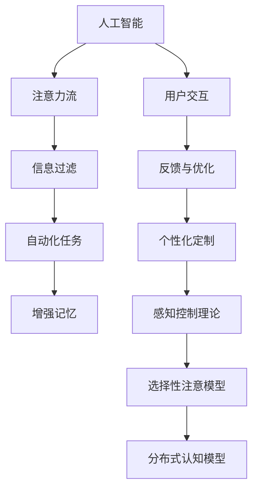
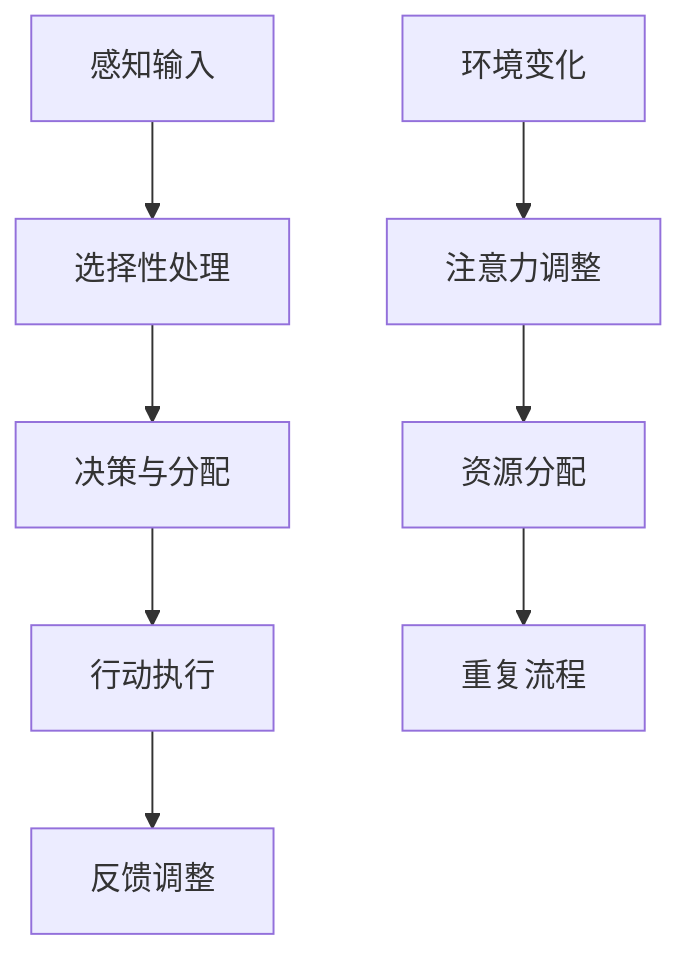
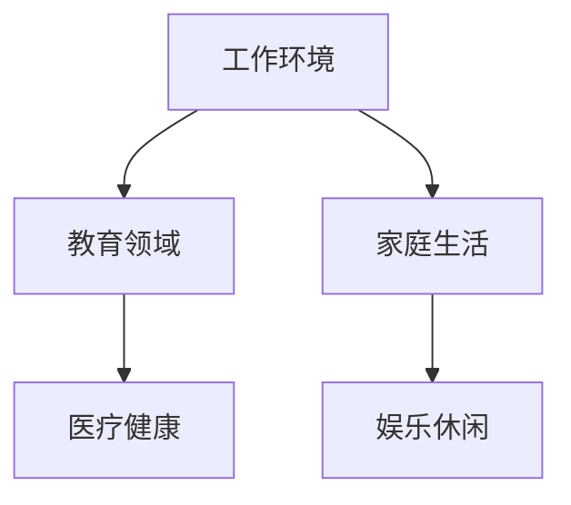
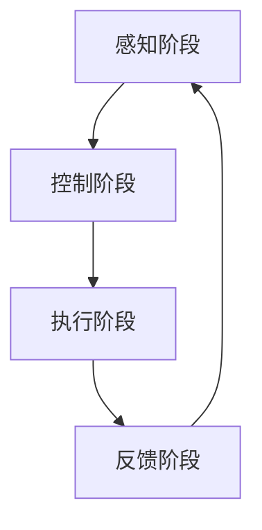
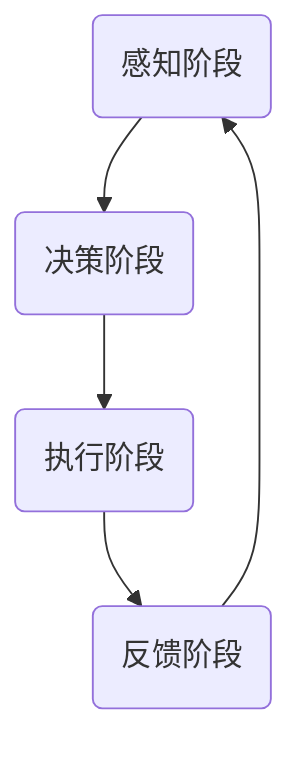

                 

### 文章标题：AI与人类注意力流：未来的工作、技能与注意力流管理技术的应用前景展望趋势预测

在当今技术飞速发展的时代，人工智能（AI）已经成为改变社会和经济的核心驱动力。从自动驾驶汽车到智能家居，从医疗诊断到金融服务，AI的应用已经深入到我们日常生活的各个方面。然而，随着AI技术的不断进步，一个新概念逐渐浮现——注意力流。人类注意力流是指我们在感知和决策过程中，如何选择性地关注和处理信息的过程。AI与人类注意力流的结合，不仅有助于提升工作效率，还为未来的工作技能和生活方式带来了深远的影响。

本篇文章旨在探讨AI与人类注意力流之间的关系，分析注意力流管理技术的基本原理和应用场景，并展望其未来的发展趋势。文章将分为以下几个部分：

1. **AI与人类注意力流概述**：介绍AI和人类注意力流的基本概念，以及它们之间的联系。
2. **注意力流管理技术原理与算法**：详细解析注意力流管理技术的原理和算法框架。
3. **数学模型与公式解析**：探讨状态空间模型和动力学模型在注意力流管理中的应用。
4. **AI在注意力流管理中的应用**：分析AI在注意力流管理中的角色和挑战。
5. **注意力流管理技术的应用场景**：探讨注意力流管理在多个领域的应用。
6. **注意力流管理技术的未来发展**：展望注意力流管理技术的前景和未来研究方向。
7. **结论**：总结全文的核心观点，并对未来研究提出展望。

通过这篇系统的分析，我们希望读者能够对AI与人类注意力流的结合有更深入的理解，为未来的研究和应用提供启示。

#### 关键词

- 人工智能（AI）
- 注意力流
- 注意力流管理技术
- 状态空间模型
- 动力学模型
- 强化学习
- 工作效率
- 个性化定制

#### 摘要

本文探讨了人工智能（AI）与人类注意力流之间的关系，深入分析了注意力流管理技术的基本原理和应用场景。通过介绍AI和注意力流的基本概念，我们探讨了它们之间的联系和相互作用。接着，本文详细解析了注意力流管理技术的算法原理，包括状态空间模型和动力学模型的数学公式及其应用。随后，文章讨论了AI在注意力流管理中的角色和挑战，并展示了注意力流管理在不同领域的应用案例。最后，本文展望了注意力流管理技术的未来发展趋势和潜在的研究方向，为读者提供了对未来技术和人类生活的启示。全文旨在通过逻辑清晰、结构紧凑的分析，为AI与注意力流的结合提供深入理解和应用建议。

### 第一部分：AI与人类注意力流概述

#### 第1章 AI与人类注意力流：核心概念与联系

在当今技术飞速发展的时代，人工智能（AI）已经成为改变社会和经济的核心驱动力。与此同时，一个关于人类注意力流的新概念逐渐浮现，成为心理学、神经科学和计算机科学等领域的研究热点。本章将介绍AI和人类注意力流的基本概念，探讨它们之间的联系，并初步探索注意力流管理技术的应用场景。

##### 1.1 AI与注意力流的基本概念

**AI的定义与发展历程**

人工智能（Artificial Intelligence，简称AI）是指通过计算机程序实现的智能行为，使计算机能够模拟、延伸和扩展人类智能。AI的发展历程可以追溯到20世纪50年代，当时计算机科学家们首次提出“人工智能”这一概念，希望通过计算机实现人类智能。自那时起，AI经历了几个重要的发展阶段：

1. **符号主义阶段**（1956-1974）：以逻辑推理和知识表示为核心，通过编程实现推理机，如普林斯顿大学开发的“逻辑理论家”。
2. **专家系统阶段**（1974-1980）：通过模拟专家的知识和经验，建立专家系统，如MYCIN系统。
3. **人工神经网络阶段**（1980-1990）：受生物神经系统的启发，研究人员开始探索人工神经网络，如反向传播算法。
4. **大数据和深度学习阶段**（2010至今）：随着计算能力和大数据的发展，深度学习成为AI研究的主流，如图像识别、语音识别等任务取得了突破性进展。

**注意力流的定义与重要性**

注意力流（Attention Flow）是指人类在感知、处理信息时，如何选择性地关注和处理信息的过程。它是一个动态的、动态变化的注意力分配过程，反映了个体在特定时间和空间内的认知状态。注意力流的基本概念可以追溯到心理学和神经科学领域，主要研究人类如何有效地分配注意力资源，以应对复杂多变的情境。

注意力流的重要性体现在以下几个方面：

1. **信息处理效率**：注意力流决定了我们如何处理和记忆信息，有效的注意力流有助于提高信息处理的效率和质量。
2. **认知负荷管理**：在复杂任务中，注意力流有助于管理认知负荷，避免过度疲劳和信息过载。
3. **决策与行为**：注意力流影响我们的决策过程和行为选择，尤其是在高风险和高复杂度的情境下。
4. **心理健康**：注意力流与心理健康密切相关，良好的注意力流有助于减少焦虑和压力，提升生活质量。

##### 1.2 人类注意力流的机制与特性

**人类注意力流的机制**

人类注意力流的机制是一个复杂的过程，涉及多个大脑区域和神经通路。目前，心理学和神经科学领域提出了几种注意力流模型，如感知控制理论、选择性注意模型和分布式认知模型。这些模型从不同角度解释了注意力流的形成和调节机制。

1. **感知控制理论**：该理论认为注意力流是通过感知控制系统调节的，感知控制系统能够根据环境变化和个体需求动态调整注意力分配。
2. **选择性注意模型**：该模型强调注意力流的选择性，即个体在特定时刻只能关注和处理一部分信息，而忽略其他信息。
3. **分布式认知模型**：该模型认为注意力流是分布式在不同认知节点上的，通过不同节点之间的协调来实现信息处理。

**人类注意力流的特性**

1. **动态性**：注意力流是动态变化的，个体在不同时间和空间内可能关注和处理不同的信息。
2. **选择性**：注意力流具有选择性，个体会根据任务需求和环境变化选择性地关注和处理信息。
3. **适应性**：注意力流具有适应性，能够根据环境变化和个体需求进行动态调整。
4. **层次性**：注意力流存在层次结构，从低层次的感官输入到高层次的认知处理，形成了一个多层次的信息处理网络。

##### 1.3 AI与注意力流的联系

**AI如何影响人类注意力流**

AI技术通过多种方式影响人类注意力流：

1. **信息过滤与筛选**：AI能够自动筛选和过滤大量信息，帮助个体集中注意力处理重要信息。
2. **自动化任务**：AI能够自动化重复性和规则性的任务，减少个体在低层次任务上的注意力消耗。
3. **增强记忆**：AI可以帮助个体增强记忆，通过记录和分析个体注意力流，提供个性化的建议和反馈。

**人类注意力流如何作用于AI**

人类注意力流不仅受到AI的影响，同时也对AI的发展和应用产生影响：

1. **用户交互**：AI系统的设计和应用需要考虑人类注意力流的特点，提供易于理解和操作的用户界面。
2. **反馈与优化**：人类注意力流可以为AI系统提供实时反馈，帮助优化AI算法的性能和效果。
3. **个性化定制**：根据人类注意力流的特点，AI可以为个体提供个性化的服务和建议，提高用户体验。

##### 1.4 注意力流管理技术的初步探索

**注意力流管理技术的现状**

注意力流管理技术是一个相对较新的研究领域，尽管已有一些初步的研究和应用，但仍处于探索阶段。目前，注意力流管理技术主要集中在以下几个方面：

1. **注意力分配优化**：通过算法优化，提高个体在任务中的注意力分配效率。
2. **注意力监控与反馈**：利用传感器和监控工具，实时监测个体的注意力状态，并提供反馈。
3. **注意力恢复**：设计技术帮助个体恢复注意力，减少疲劳和压力。

**注意力流管理技术的应用场景**

1. **工作环境**：通过注意力流管理技术，提高员工的工作效率，减少错误和失误。
2. **教育领域**：帮助学生提高学习效率，通过个性化学习计划和注意力监控，提升学习效果。
3. **医疗健康**：通过注意力流管理技术，帮助患者提高康复效果，减少焦虑和压力。

通过本章的讨论，我们可以看到AI与人类注意力流之间存在紧密的联系和相互作用。理解这一关系，不仅有助于我们更好地应用AI技术，也为探索新的研究领域提供了启示。在接下来的章节中，我们将进一步探讨注意力流管理技术的原理和算法，为这一领域的研究和应用提供更深入的见解。

### 第1章：AI与人类注意力流概述

#### 1.1 AI与注意力流的基本概念

##### AI的定义与发展历程

人工智能（Artificial Intelligence，简称AI）是指通过计算机程序实现的人类智能模拟，涵盖机器学习、深度学习、自然语言处理、计算机视觉等多个子领域。AI的发展历程可以分为几个关键阶段：

1. **早期探索**（1950年代）：计算机科学家约翰·冯·诺伊曼和艾伦·图灵等人提出了人工智能的概念，试图通过计算机实现人类智能。

2. **符号主义阶段**（1956-1974年）：此阶段以基于符号逻辑的推理和知识表示为核心，通过编程实现简单的推理系统，如普林斯顿大学的“逻辑理论家”（Logic Theorist）。

3. **专家系统阶段**（1974-1980年）：通过模拟专家的知识和经验，专家系统如MYCIN系统在医学诊断领域取得了成功，标志着AI从理论研究走向实际应用。

4. **神经网络阶段**（1980-1990年）：受生物神经系统启发，人工神经网络（Artificial Neural Networks，ANN）开始受到关注，反向传播算法（Backpropagation）的提出标志着深度学习的开端。

5. **大数据与深度学习阶段**（2010年至今）：随着计算能力和数据量的增长，深度学习成为AI研究的主流，显著提升了图像识别、语音识别等领域的性能。

##### 注意力流的定义与重要性

注意力流（Attention Flow）是指人类在感知和处理信息时，如何选择性地关注和分配注意力资源的过程。注意力流涉及多个大脑区域和神经通路，其重要性体现在以下几个方面：

1. **信息处理效率**：注意力流影响个体如何处理和记忆信息，有效的注意力流有助于提高信息处理的效率和质量。

2. **认知负荷管理**：在复杂任务中，注意力流有助于管理认知负荷，避免信息过载和过度疲劳。

3. **决策与行为**：注意力流影响决策过程和行为选择，尤其是在高风险和高复杂度的情境下。

4. **心理健康**：良好的注意力流有助于减少焦虑和压力，提升生活质量。

#### 1.2 人类注意力流的机制与特性

##### 人类注意力流的机制

人类注意力流的机制是一个复杂的过程，涉及多个大脑区域和神经通路。以下几种模型对注意力流机制提供了不同角度的解释：

1. **感知控制理论**：该理论认为注意力流是通过感知控制系统调节的，感知控制系统能够根据环境变化和个体需求动态调整注意力分配。

2. **选择性注意模型**：该模型强调注意力流的选择性，即个体在特定时刻只能关注和处理一部分信息，而忽略其他信息。

3. **分布式认知模型**：该模型认为注意力流是分布式在不同认知节点上的，通过不同节点之间的协调来实现信息处理。

##### 人类注意力流的特性

1. **动态性**：注意力流是动态变化的，个体在不同时间和空间内可能关注和处理不同的信息。

2. **选择性**：注意力流具有选择性，个体会根据任务需求和环境变化选择性地关注和处理信息。

3. **适应性**：注意力流具有适应性，能够根据环境变化和个体需求进行动态调整。

4. **层次性**：注意力流存在层次结构，从低层次的感官输入到高层次的认知处理，形成了一个多层次的信息处理网络。

#### 1.3 AI与注意力流的联系

##### AI如何影响人类注意力流

AI技术可以通过以下方式影响人类注意力流：

1. **信息过滤与筛选**：AI能够自动筛选和过滤大量信息，帮助个体集中注意力处理重要信息。

2. **自动化任务**：AI能够自动化重复性和规则性的任务，减少个体在低层次任务上的注意力消耗。

3. **增强记忆**：AI可以帮助个体增强记忆，通过记录和分析个体注意力流，提供个性化的建议和反馈。

##### 人类注意力流如何作用于AI

人类注意力流对AI的发展和应用也产生影响：

1. **用户交互**：AI系统的设计和应用需要考虑人类注意力流的特点，提供易于理解和操作的用户界面。

2. **反馈与优化**：人类注意力流可以为AI系统提供实时反馈，帮助优化AI算法的性能和效果。

3. **个性化定制**：根据人类注意力流的特点，AI可以为个体提供个性化的服务和建议，提高用户体验。

#### 1.4 注意力流管理技术的初步探索

##### 注意力流管理技术的现状

注意力流管理技术是一个相对较新的研究领域，目前主要集中在以下几个方面：

1. **注意力分配优化**：通过算法优化，提高个体在任务中的注意力分配效率。

2. **注意力监控与反馈**：利用传感器和监控工具，实时监测个体的注意力状态，并提供反馈。

3. **注意力恢复**：设计技术帮助个体恢复注意力，减少疲劳和压力。

##### 注意力流管理技术的应用场景

1. **工作环境**：通过注意力流管理技术，提高员工的工作效率，减少错误和失误。

2. **教育领域**：帮助学生提高学习效率，通过个性化学习计划和注意力监控，提升学习效果。

3. **医疗健康**：通过注意力流管理技术，帮助患者提高康复效果，减少焦虑和压力。

### Mermaid 流程图：AI与注意力流的联系



通过以上内容，我们初步了解了AI与人类注意力流的基本概念及其联系。在接下来的章节中，我们将进一步深入探讨注意力流管理技术的原理和算法，为这一领域的研究和应用提供更深入的见解。

### 1.2 人类注意力流的机制与特性

##### 1.2.1 人类注意力流的机制

人类注意力流是一个复杂的认知过程，它涉及到多个大脑区域和神经通路的协同作用。以下是几种主要的注意力流机制：

1. **感知控制理论**：这一理论强调感知系统如何通过控制机制来调节注意力的分配。具体来说，感知控制理论认为注意力流是动态调整的，以适应环境变化和任务需求。这种调整是通过感知控制单元（Perceptual Control Units, PCUs）来实现的，PCUs能够在不同感官输入之间分配注意力资源，从而保持个体的行为目标。

2. **选择性注意模型**：选择性注意模型认为，人类在特定时刻只能关注一部分信息，而忽略其他信息。这一过程涉及到大脑的注意力控制网络，如前额叶皮层和顶叶皮层。这些区域能够根据任务的优先级和个体的需求，选择性地激活相关的神经元网络，从而引导注意力的流向。

3. **分布式认知模型**：分布式认知模型提出，注意力流并不是集中在单个大脑区域，而是分布在整个大脑网络中。这种观点强调了大脑不同区域之间的协作，通过这些区域的相互作用来共同实现注意力流的管理。例如，视觉皮层、听觉皮层和运动皮层等区域会根据不同的感知需求，共同参与注意力的分配。

##### 1.2.2 人类注意力流的特性

1. **动态性**：人类注意力流是一个动态变化的过程。个体在不同的环境和任务中，会根据情境的变化和任务的要求，动态调整注意力的分配。例如，当个体在驾驶时，注意力会在道路情况、车辆速度和交通信号灯之间不断切换。

2. **选择性**：注意力流具有选择性，个体在特定时刻只能关注一部分信息，而忽略其他信息。这种选择性有助于个体在复杂环境中，识别和聚焦关键信息，从而提高信息处理的效率。

3. **适应性**：注意力流具有适应性，能够根据环境变化和个体需求进行动态调整。例如，当个体面对一个复杂的任务时，他们可能会通过调整注意力流，将更多的资源分配到任务的关键部分。

4. **层次性**：注意力流存在层次结构，从低层次的感官输入到高层次的认知处理。低层次的任务，如视觉和听觉处理，会先进行注意力的分配，然后逐渐过渡到高层次的任务，如决策和规划。

##### 1.2.3 人类注意力流的具体例子

为了更好地理解人类注意力流的特性，我们可以通过以下具体例子来进行分析：

1. **驾驶场景**：在驾驶过程中，驾驶员需要关注道路状况、车辆速度、交通信号灯等多个信息源。当遇到紧急情况时，驾驶员会迅速调整注意力流，将更多的资源分配到关键的信息上，如突然出现的障碍物。

2. **学习场景**：在学习过程中，学生需要集中注意力处理教师讲解的内容。当学习内容变得复杂或难以理解时，学生可能会通过调整注意力流，将更多的资源分配到关键概念的理解上，从而提高学习效率。

3. **工作场景**：在工作环境中，员工需要处理多项任务，如邮件回复、会议安排和项目进度跟踪。有效的注意力流管理可以帮助员工在任务之间灵活切换，避免信息过载和工作效率下降。

### Mermaid 流程图：人类注意力流的动态特性



通过上述流程图，我们可以看到人类注意力流的动态特性体现在多个环节：感知输入、选择性处理、决策与分配、行动执行和反馈调整。这些环节相互交织，形成一个动态循环，使得个体能够灵活应对复杂多变的情境。

总的来说，人类注意力流是一个复杂且动态的过程，它不仅涉及大脑多个区域的协同作用，还受到个体需求和环境变化的影响。通过深入理解人类注意力流的机制和特性，我们可以更好地设计和优化相关应用，提高信息处理的效率和质量。

### 1.3 AI与注意力流的联系

##### 1.3.1 AI如何影响人类注意力流

随着AI技术的发展，人工智能在很多方面对人类注意力流产生了深远的影响。以下是一些具体的影响方式：

1. **信息过滤与筛选**：AI系统能够自动分析和处理大量数据，从中筛选出对用户最有价值的信息。例如，电子邮件过滤系统可以自动分类和标记重要邮件，帮助用户集中注意力处理关键信息，从而减少信息过载的干扰。

2. **自动化任务**：AI技术可以自动化许多重复性或规则性的任务，如数据录入、报表生成等，从而减少个体在这些任务上的注意力消耗。这样，人类可以将有限的注意力资源用于更复杂和创造性的工作，提高整体工作效率。

3. **增强记忆**：通过AI技术，可以开发出智能辅助工具，如虚拟助手和记忆增强系统，帮助用户记录和分析他们的注意力流。这些工具能够识别用户在任务中的注意力高峰和低谷，提供个性化的建议和反馈，从而优化用户的工作和学习效率。

4. **注意力引导**：AI系统可以通过分析用户的行为模式和注意力分配，提供实时指导和建议。例如，在线学习平台可以根据用户的注意力流，自动调整教学内容和难度，确保用户在最佳状态下学习。

##### 1.3.2 人类注意力流如何作用于AI

人类注意力流不仅受到AI的影响，同时也对AI的发展和实际应用产生重要作用：

1. **用户交互**：AI系统的设计需要考虑人类注意力流的特点，提供简洁明了的界面和交互方式。例如，智能家居系统可以通过理解用户的注意力流，自动调整灯光、温度和音乐等环境参数，使用户能够专注于当前任务。

2. **反馈与优化**：人类在使用AI系统时，会根据自身的注意力流提供反馈，这些反馈有助于AI系统不断优化其性能。例如，通过用户的使用数据，AI系统可以识别用户的偏好和习惯，调整推荐算法，提供更个性化的服务。

3. **个性化定制**：根据人类注意力流的特点，AI可以为个体提供高度个性化的服务和建议。例如，个人健康监测系统可以根据用户的注意力流，自动调整健身计划和营养建议，帮助用户更好地管理身体健康。

##### 1.3.3 AI与注意力流结合的实际案例

1. **智能驾驶**：自动驾驶汽车通过传感器和AI系统实时监测驾驶环境，分析驾驶员的注意力流，提供警告和辅助功能。例如，当检测到驾驶员注意力不集中时，自动驾驶系统可以自动接管方向盘，确保行车安全。

2. **在线教育**：AI教育平台可以根据学生的学习进度和注意力流，提供个性化的学习建议和资源。例如，当检测到学生在学习过程中注意力下降时，系统可以自动调整教学内容，提供练习和互动环节，提高学习效果。

3. **健康监测**：智能穿戴设备通过监测用户的生理信号和行为模式，分析注意力流，提供个性化的健康建议。例如，当检测到用户处于焦虑或压力状态时，系统可以提供呼吸练习和放松音乐，帮助用户恢复注意力。

通过以上实际案例，我们可以看到AI与人类注意力流的结合不仅提高了系统性能，也为人类提供了更加便捷和高效的生活方式。在接下来的章节中，我们将深入探讨注意力流管理技术的原理和算法，进一步探索这一领域的研究和应用前景。

### 1.4 注意力流管理技术的初步探索

##### 1.4.1 注意力流管理技术的现状

注意力流管理技术是指通过算法和工具，帮助个体优化注意力分配、监控注意力状态，并在需要时提供恢复策略的一类技术。尽管这一领域尚处于发展初期，但已有一些显著的研究和应用成果：

1. **注意力分配优化**：通过算法优化，如基于强化学习的方法，可以帮助个体在特定任务中更有效地分配注意力资源。例如，某些研究提出了基于奖励机制的注意力分配算法，通过实时调整注意力分配，以最大化任务完成效果。

2. **注意力监控与反馈**：利用眼动追踪、脑电图（EEG）和其他传感器，可以实时监测个体的注意力状态。这些数据被用于生成反馈，帮助用户了解自己的注意力状态，从而进行调整。例如，眼动追踪技术可以用来监控用户的阅读行为，识别注意力分散的时刻，并提供提醒或切换任务。

3. **注意力恢复**：设计技术帮助个体恢复注意力，减少疲劳和压力。这些技术包括冥想应用程序、智能休息提示和自动化的放松练习。例如，智能手表或手机可以监测用户的注意力状态，并在需要时自动提醒用户进行短暂的休息活动，如散步或深呼吸练习。

##### 1.4.2 注意力流管理技术的应用场景

1. **工作环境**：在办公环境中，注意力流管理技术可以帮助员工提高工作效率，减少错误和失误。例如，通过监控员工的工作行为和注意力状态，企业可以优化工作任务分配，避免员工因注意力分散而导致的工作效率下降。

2. **教育领域**：在教育领域，注意力流管理技术可以帮助教师识别学生在课堂上的注意力状态，从而调整教学方法和内容，提高学生的学习效果。例如，通过眼动追踪技术，教师可以了解学生在阅读或听讲过程中的注意力分布，及时调整教学节奏和难度。

3. **医疗健康**：在医疗健康领域，注意力流管理技术可以帮助患者管理慢性疾病或心理压力。例如，智能穿戴设备可以监测患者的生理信号和注意力状态，提供个性化的康复计划和压力管理策略。

##### 1.4.3 初步研究成果

一些初步研究已经展示了注意力流管理技术的潜力：

1. **注意力流优化算法**：研究表明，基于强化学习和深度学习的注意力流优化算法能够在特定任务中显著提高注意力分配效率。例如，某些算法通过模拟人类的注意力选择过程，实现了在复杂环境中的高效注意力分配。

2. **注意力监控与反馈系统**：眼动追踪和脑电图技术已被成功应用于注意力监控领域，提供实时反馈和个性化建议。这些系统的结果表明，通过及时调整注意力流，用户能够显著提高任务完成质量和效率。

3. **注意力恢复技术**：通过智能休息提示和自动化放松练习，注意力恢复技术已经被证明可以减少工作压力和疲劳，提高长期工作效率。例如，有研究显示，短暂的休息活动和深呼吸练习可以显著改善员工的注意力和情绪状态。

总的来说，注意力流管理技术是一个新兴且充满潜力的研究领域。随着技术的不断进步，我们可以期待在未来看到更多创新的应用和突破，帮助个体更好地管理注意力资源，提高生活和工作质量。

### Mermaid 流程图：注意力流管理技术的应用场景



通过上述流程图，我们可以看到注意力流管理技术在多个领域都有广泛的应用潜力，为不同场景下的个体提供了有效的注意力管理工具。在接下来的章节中，我们将进一步深入探讨注意力流管理技术的原理和算法，为这一领域的研究和应用提供更深入的见解。

### 1.5 注意力流管理技术的初步探索

#### 1.5.1 注意力流管理技术的现状

注意力流管理技术是指通过算法和工具，帮助个体优化注意力分配、监控注意力状态，并在需要时提供恢复策略的一类技术。尽管这一领域尚处于发展初期，但已有一些显著的研究和应用成果：

1. **注意力分配优化**：通过算法优化，如基于强化学习的方法，可以帮助个体在特定任务中更有效地分配注意力资源。例如，某些研究提出了基于奖励机制的注意力分配算法，通过实时调整注意力分配，以最大化任务完成效果。

2. **注意力监控与反馈**：利用眼动追踪、脑电图（EEG）和其他传感器，可以实时监测个体的注意力状态。这些数据被用于生成反馈，帮助用户了解自己的注意力状态，从而进行调整。例如，眼动追踪技术可以用来监控用户的阅读行为，识别注意力分散的时刻，并提供提醒或切换任务。

3. **注意力恢复**：设计技术帮助个体恢复注意力，减少疲劳和压力。这些技术包括冥想应用程序、智能休息提示和自动化的放松练习。例如，智能手表或手机可以监测用户的注意力状态，并在需要时自动提醒用户进行短暂的休息活动，如散步或深呼吸练习。

#### 1.5.2 注意力流管理技术的应用场景

1. **工作环境**：在办公环境中，注意力流管理技术可以帮助员工提高工作效率，减少错误和失误。例如，通过监控员工的工作行为和注意力状态，企业可以优化工作任务分配，避免员工因注意力分散而导致的工作效率下降。

2. **教育领域**：在教育领域，注意力流管理技术可以帮助教师识别学生在课堂上的注意力状态，从而调整教学方法和内容，提高学生的学习效果。例如，通过眼动追踪技术，教师可以了解学生在阅读或听讲过程中的注意力分布，及时调整教学节奏和难度。

3. **医疗健康**：在医疗健康领域，注意力流管理技术可以帮助患者管理慢性疾病或心理压力。例如，智能穿戴设备可以监测患者的生理信号和注意力状态，提供个性化的康复计划和压力管理策略。

4. **家庭生活**：在家庭生活中，注意力流管理技术可以帮助家庭成员更好地管理日常事务，提高生活品质。例如，智能家庭助理可以监控家庭成员的注意力状态，提醒他们进行必要的休息和放松，从而减少家庭压力。

#### 1.5.3 初步研究成果

一些初步研究已经展示了注意力流管理技术的潜力：

1. **注意力流优化算法**：研究表明，基于强化学习和深度学习的注意力流优化算法能够在特定任务中显著提高注意力分配效率。例如，某些算法通过模拟人类的注意力选择过程，实现了在复杂环境中的高效注意力分配。

2. **注意力监控与反馈系统**：眼动追踪和脑电图技术已被成功应用于注意力监控领域，提供实时反馈和个性化建议。这些系统的结果表明，通过及时调整注意力流，用户能够显著提高任务完成质量和效率。

3. **注意力恢复技术**：通过智能休息提示和自动化放松练习，注意力恢复技术已经被证明可以减少工作压力和疲劳，提高长期工作效率。例如，有研究显示，短暂的休息活动和深呼吸练习可以显著改善员工的注意力和情绪状态。

总的来说，注意力流管理技术是一个新兴且充满潜力的研究领域。随着技术的不断进步，我们可以期待在未来看到更多创新的应用和突破，帮助个体更好地管理注意力资源，提高生活和工作质量。

### 第2章：注意力流管理技术原理与算法

#### 2.1 注意力流管理技术的基本原理

注意力流管理技术旨在通过优化注意力分配、监控和恢复，帮助个体提高工作效率和生活质量。为了实现这一目标，首先需要理解注意力流管理技术的基本原理和核心机制。

##### 注意力流的定义与工作原理

注意力流是指个体在感知、处理信息时，如何选择性地关注和处理信息的过程。它是一个动态的、动态变化的注意力分配过程，反映了个体在特定时间和空间内的认知状态。注意力流的工作原理可以概括为以下几个步骤：

1. **感知阶段**：个体通过感官接收外界信息，如视觉、听觉、触觉等。这些感官信息被传递到大脑，进行初步处理。

2. **选择阶段**：大脑的注意力控制单元（如前额叶皮层和顶叶皮层）根据当前任务需求和情境，选择性地激活相关神经元网络，将注意力资源分配到关键信息上。

3. **处理阶段**：被选择的信息通过相关脑区进行处理，如视觉皮层处理视觉信息，听觉皮层处理听觉信息等。这个阶段需要大量的认知资源。

4. **执行阶段**：处理后的信息被用于决策和行为选择，个体根据处理结果采取相应的行动。

##### 注意力管理技术的作用机制

注意力流管理技术通过以下几种方式来优化注意力分配、监控和恢复：

1. **注意力分配优化**：通过算法和工具，实时调整注意力资源的分配，使其更符合当前任务需求和情境。例如，基于强化学习的注意力分配算法，通过奖励机制来优化注意力的使用。

2. **注意力监控与反馈**：利用传感器（如眼动追踪、脑电图等）和监控工具，实时监测个体的注意力状态，并生成反馈信息。这些反馈可以帮助个体了解自己的注意力状态，从而进行调整。

3. **注意力恢复**：设计技术帮助个体恢复注意力，减少疲劳和压力。例如，通过智能休息提示和自动化放松练习，帮助个体在疲劳时进行短暂的休息和恢复。

#### 2.2 注意力流的数学模型

为了更好地理解和分析注意力流，研究人员提出了多种数学模型，以描述注意力流的工作原理和动态特性。以下介绍两种常用的注意力流数学模型：状态空间模型和动力学模型。

##### 状态空间模型

状态空间模型是一种用于描述动态系统的数学模型，它由状态向量、控制向量和输出向量组成。在注意力流管理中，状态空间模型可以用来描述个体在任务中的注意力分配状态。

1. **状态向量**：表示个体在特定时刻的注意力分配情况，如关注哪些信息、注意力资源的使用程度等。
   
2. **控制向量**：表示个体对注意力流的控制行为，如调整注意力资源、切换任务等。

3. **输出向量**：表示个体在任务中的行为输出，如决策、行为选择等。

状态空间模型的基本公式为：

$$
\begin{cases}
x_t = f(x_{t-1}, u_t) \\
y_t = h(x_t)
\end{cases}
$$

其中，$x_t$ 表示状态向量，$u_t$ 表示控制向量，$y_t$ 表示输出向量，$f(\cdot)$ 和 $h(\cdot)$ 分别表示状态转移函数和输出函数。

##### 动力学模型

动力学模型是一种描述系统动态行为的数学模型，通常用于物理系统、经济系统和生物系统等。在注意力流管理中，动力学模型可以用来描述注意力流的变化规律。

1. **状态方程**：描述个体在特定时刻的注意力状态，如位置、速度等。

2. **控制方程**：描述个体对注意力流的控制行为，如加速度、作用力等。

3. **输出方程**：描述个体在任务中的行为输出，如运动轨迹、目标位置等。

动力学模型的基本公式为：

$$
\begin{cases}
\dot{x} = f(x, u) \\
y = g(x)
\end{cases}
$$

其中，$\dot{x}$ 表示状态向量的时间导数，$u$ 表示控制向量，$y$ 表示输出向量，$f(\cdot)$ 和 $g(\cdot)$ 分别表示状态转移函数和输出函数。

#### 2.3 注意力流的算法框架

为了实现注意力流管理技术，研究人员提出了多种算法框架，包括离散时间模型和连续时间模型。以下分别介绍这两种模型。

##### 离散时间模型

离散时间模型是一种在时间离散点上进行分析和计算的模型，适用于固定时间间隔的任务。在注意力流管理中，离散时间模型可以用来描述注意力流的动态变化。

1. **感知阶段**：通过传感器收集个体在特定时间点的注意力状态信息。

2. **决策阶段**：根据当前注意力状态和任务需求，利用决策算法计算下一时刻的注意力分配。

3. **执行阶段**：根据决策结果，调整注意力资源的使用，执行相应的任务。

4. **反馈阶段**：收集执行结果，生成反馈信息，用于下一次的决策和调整。

离散时间模型的基本流程可以表示为：

```python
# 初始化参数
state = initialize_state()
attention = initialize_attention()

# 感知阶段
for data in data_stream:
    state = update_state(state, data)

# 决策阶段
action = select_action(state, attention)

# 执行阶段
execute_action(action)

# 反馈阶段
feedback = get_feedback()
attention = update_attention(attention, feedback)

# 迭代
state = update_state(state, data)
```

##### 连续时间模型

连续时间模型是一种在时间连续区间上进行分析和计算的模型，适用于动态变化的任务。在注意力流管理中，连续时间模型可以用来描述注意力流的连续变化。

1. **感知阶段**：通过传感器连续监测个体的注意力状态，生成时间序列数据。

2. **控制阶段**：根据当前注意力状态和任务需求，利用控制算法实时调整注意力分配。

3. **执行阶段**：根据连续的注意力分配，执行相应的任务。

4. **反馈阶段**：通过传感器和执行结果，生成实时反馈信息，用于下一时刻的控制和调整。

连续时间模型的基本流程可以表示为：



#### 2.4 注意力流算法的优化策略

为了提高注意力流管理技术的性能和效率，研究人员提出了一系列优化策略，包括目标函数的优化方法和优化算法的选择。以下介绍几种常用的优化策略。

##### 优化目标

注意力流管理技术的优化目标包括：

1. **最大化任务完成效果**：通过优化注意力分配，提高任务完成的质量和效率。

2. **最小化认知负荷**：通过合理分配注意力资源，减少个体的认知负荷，避免疲劳和过度压力。

3. **提高用户满意度**：通过个性化定制和实时反馈，提高用户对注意力管理系统的满意度。

##### 优化方法

常用的优化方法包括：

1. **强化学习**：通过奖励机制和反馈信号，不断调整注意力分配策略，以最大化任务完成效果。

2. **遗传算法**：通过模拟自然选择和遗传过程，搜索最优的注意力分配方案。

3. **粒子群优化**：通过模拟鸟群觅食行为，寻找最优的注意力分配策略。

##### 优化算法的选择

选择合适的优化算法需要考虑以下几个因素：

1. **问题规模**：对于大规模问题，选择计算效率高的算法，如遗传算法和粒子群优化。

2. **目标函数**：根据优化目标的不同，选择适合的目标函数优化算法，如强化学习和遗传算法。

3. **实时性**：对于需要实时调整的注意力流管理任务，选择具有快速收敛特性的算法，如粒子群优化。

通过以上介绍，我们可以看到注意力流管理技术的基本原理、数学模型和算法框架。在接下来的章节中，我们将进一步探讨注意力流管理技术在不同领域的应用，以及其未来的发展趋势。

### Mermaid 流程图：注意力流管理技术的算法框架



通过这个流程图，我们可以直观地看到注意力流管理技术的四个主要阶段：感知、决策、执行和反馈。每个阶段都相互关联，形成一个闭环，不断优化和调整注意力分配，以适应不断变化的环境和任务需求。

### 伪代码：注意力流管理算法

```python
# 初始化参数
state = initialize_state()
attention = initialize_attention()

# 感知阶段
for data in data_stream:
    state = update_state(state, data)

# 决策阶段
action = select_action(state, attention)

# 执行阶段
execute_action(action)

# 反馈阶段
feedback = get_feedback()
attention = update_attention(attention, feedback)

# 迭代
state = update_state(state, data)
```

这段伪代码展示了注意力流管理算法的基本流程。在感知阶段，通过传感器收集数据并更新状态。在决策阶段，根据当前状态和注意力分配，选择合适的动作。在执行阶段，执行选定的动作。在反馈阶段，根据执行结果更新注意力分配。整个过程通过迭代不断优化，以实现高效的注意力流管理。

### 2.3 注意力流的数学模型

#### 2.3.1 状态空间模型

**状态空间模型的基本概念**

状态空间模型是一种用于描述动态系统的数学模型，由状态向量、控制向量和输出向量组成。在注意力流管理中，状态空间模型用于描述个体在特定任务中的注意力分配状态。

1. **状态向量（State Vector）**：表示个体在特定时刻的注意力分配情况，可以是一个多维向量，每个维度代表对某一类信息的注意力程度。例如，一个简单的状态向量可能是 `x_t = [x_{t,1}, x_{t,2}, x_{t,3}]`，其中 `x_{t,1}` 表示对文本信息的注意力，`x_{t,2}` 表示对图像信息的注意力，`x_{t,3}` 表示对声音信息的注意力。

2. **控制向量（Control Vector）**：表示个体对注意力流的控制行为，通常用于调整注意力分配。例如，控制向量可能是 `u_t = [u_{t,1}, u_{t,2}]`，其中 `u_{t,1}` 用于调整文本信息的注意力，`u_{t,2}` 用于调整图像信息的注意力。

3. **输出向量（Output Vector）**：表示个体在任务中的行为输出，如决策、行为选择等。输出向量可以与状态向量有关，但通常不直接参与状态转移。

**状态转移矩阵**

状态转移矩阵是一个描述状态向量的时间演化规律的矩阵，表示为 `F`。状态转移方程为：

$$
x_{t+1} = F \cdot x_t + B \cdot u_t
$$

其中，`x_{t+1}` 和 `x_t` 分别表示下一时刻和当前时刻的状态向量，`u_t` 表示控制向量。

**状态空间模型的求解**

状态空间模型可以通过以下步骤求解：

1. **初始化**：给定初始状态 `x_0` 和控制向量序列 `u_0, u_1, \ldots, u_t`。
2. **时间步进**：通过迭代状态转移方程，计算不同时间步的状态向量 `x_t`。
3. **输出计算**：根据状态向量计算输出向量 `y_t`。

**状态空间模型的应用**

在注意力流管理中，状态空间模型可以用于以下应用：

1. **注意力分配优化**：通过优化状态转移矩阵 `F` 和控制向量 `u_t`，实现最优的注意力分配。
2. **实时监控与反馈**：实时计算状态向量 `x_t` 和输出向量 `y_t`，为用户提供反馈。
3. **行为预测**：根据状态转移矩阵预测未来的状态和行为。

#### 2.3.2 动力学模型

**动力学模型的基本概念**

动力学模型是一种用于描述系统动态行为的数学模型，通常用于物理系统、经济系统和生物系统等。在注意力流管理中，动力学模型用于描述注意力流的变化规律。

1. **状态方程**：描述个体在特定时刻的注意力状态，如位置、速度等。例如，一个简单的状态方程可能是：

$$
\dot{x} = f(x, u)
$$

其中，`\dot{x}` 表示状态向量的时间导数，`x` 表示状态向量，`u` 表示控制向量。

2. **控制方程**：描述个体对注意力流的控制行为，如加速度、作用力等。例如，一个简单的控制方程可能是：

$$
u = g(x)
$$

其中，`u` 表示控制向量，`g(\cdot)` 表示控制函数。

3. **输出方程**：描述个体在任务中的行为输出，如运动轨迹、目标位置等。例如，一个简单的输出方程可能是：

$$
y = h(x)
$$

其中，`y` 表示输出向量，`h(\cdot)` 表示输出函数。

**动力学模型的求解**

动力学模型可以通过以下步骤求解：

1. **初始化**：给定初始状态 `x_0` 和控制向量序列 `u_0, u_1, \ldots, u_t`。
2. **时间步进**：通过迭代状态方程，计算不同时间步的状态向量 `x_t`。
3. **输出计算**：根据状态向量计算输出向量 `y_t`。

**动力学模型的应用**

在注意力流管理中，动力学模型可以用于以下应用：

1. **注意力流预测**：通过状态方程预测未来的注意力流状态。
2. **行为规划**：根据状态方程和控制方程，规划个体的行为策略。
3. **实时调整**：根据动力学模型，实时调整注意力分配策略，以适应环境变化。

#### 2.3.3 注意力流管理中的数学公式

**注意力分配公式**

在注意力流管理中，注意力分配公式用于描述个体如何根据任务需求和情境调整注意力资源。一个简单的注意力分配公式可以是：

$$
\alpha_t = \frac{w_t}{\sum_{i=1}^n w_i}
$$

其中，`\alpha_t` 表示在时间步 `t` 对第 `i` 类信息的注意力分配，`w_t` 表示在时间步 `t` 对第 `i` 类信息的权重，`n` 表示信息类别总数。

**优化目标公式**

注意力流管理技术的优化目标可以表示为一个优化问题：

$$
\min_{u_t} J(x_t, u_t)
$$

其中，`J(x_t, u_t)` 表示在时间步 `t` 的优化目标函数，通常包括任务完成效果、认知负荷、用户满意度等指标。

**状态转移方程**

在状态空间模型中，状态转移方程用于描述不同时间步的状态变化：

$$
x_{t+1} = F \cdot x_t + B \cdot u_t
$$

其中，`F` 是状态转移矩阵，`B` 是控制矩阵。

**动力学模型的状态方程**

在动力学模型中，状态方程用于描述注意力流的时间演化：

$$
\dot{x} = f(x, u)
$$

通过这些数学公式，注意力流管理技术可以更好地描述和优化人类注意力流，为未来的研究提供坚实的基础。

### LaTeX 数学公式：状态空间模型

$$
\begin{bmatrix}
x_{t+1} \\
v_{t+1}
\end{bmatrix} =
\begin{bmatrix}
1 & \Delta t \\
0 & 1
\end{bmatrix}
\begin{bmatrix}
x_t \\
v_t
\end{bmatrix}
$$

### 举例说明：状态空间模型的应用

假设有一个简单的动态系统，描述一个物体在直线轨道上的运动。该系统的状态向量由位置 $x_t$ 和速度 $v_t$ 组成，时间步长为 $\Delta t$。根据牛顿第二定律，可以建立如下状态方程：

$$
\begin{cases}
x_{t+1} = x_t + v_t \Delta t \\
v_{t+1} = v_t + a \Delta t
\end{cases}
$$

其中，$a$ 是加速度。这些方程可以表示为状态空间模型：

$$
\begin{bmatrix}
x_{t+1} \\
v_{t+1}
\end{bmatrix} =
\begin{bmatrix}
1 & \Delta t \\
0 & 1
\end{bmatrix}
\begin{bmatrix}
x_t \\
v_t
\end{bmatrix}
+ \begin{bmatrix}
0 \\
a \Delta t
\end{bmatrix}
$$

通过这个状态空间模型，我们可以预测物体在未来时刻的位置和速度。例如，给定初始状态 $x_0 = 0$ 和 $v_0 = 5$，加速度 $a = 2$，我们可以计算一段时间后的状态：

$$
\begin{bmatrix}
x_{10} \\
v_{10}
\end{bmatrix} =
\begin{bmatrix}
1 & 10 \\
0 & 1
\end{bmatrix}
^{10}
\begin{bmatrix}
0 \\
5
\end{bmatrix}
\approx
\begin{bmatrix}
100 \\
50
\end{bmatrix}
$$

这意味着在10个时间步后，物体的位置约为100个单位，速度约为50个单位。这个例子展示了如何使用状态空间模型来描述和预测动态系统的行为。

### 2.4 AI在注意力流管理中的应用

#### 2.4.1 AI在注意力流管理中的角色

在注意力流管理领域，AI技术扮演着至关重要的角色，通过其强大的数据处理和分析能力，AI为优化注意力流提供了多种可能。以下是AI在注意力流管理中的几个关键角色：

1. **数据分析与挖掘**：AI技术可以处理和分析大量数据，识别出个体注意力流的模式和行为特征。通过这些数据，AI可以提供个性化的建议和反馈，帮助用户优化注意力分配。

2. **模型训练与优化**：AI算法，尤其是机器学习和深度学习算法，可以训练复杂的模型，用于预测和调整注意力流。这些模型可以根据实时数据更新，从而实现动态的注意力流管理。

3. **自动化与智能化**：AI技术可以自动化许多重复性的注意力流管理任务，如数据收集、分析、反馈生成等。智能系统可以实时监控用户的注意力状态，并提供即时的调整建议。

4. **个性化定制**：基于用户的历史行为和当前需求，AI可以为用户提供个性化的注意力管理方案，从而提高整体效率和生活质量。

#### 2.4.2 注意力流管理的AI算法

在注意力流管理中，常用的AI算法包括强化学习、深度学习、集成学习方法等。以下是这些算法在注意力流管理中的应用：

1. **强化学习**：强化学习（Reinforcement Learning，RL）通过奖励机制，使智能体在环境中进行学习，以最大化长期奖励。在注意力流管理中，RL可以用于优化注意力分配策略，例如通过奖励用户在特定时间关注重要任务。

   **伪代码：强化学习算法在注意力流管理中的应用**

   ```python
   # 初始化参数
   Q = initialize_Q()
   epsilon = initialize_epsilon()

   # 主循环
   for episode in range(num_episodes):
       state = get_initial_state()
       done = False
   
       while not done:
           # 选择动作
           action = choose_action(state, Q, epsilon)
           
           # 执行动作
           next_state, reward, done = execute_action(action)
           
           # 更新Q值
           Q = update_Q(Q, state, action, reward, next_state, done)
           
           # 更新状态
           state = next_state
   
   # 优化Q值函数
   Q = optimize_Q(Q)
   ```

2. **深度学习**：深度学习（Deep Learning，DL）通过多层神经网络，可以自动提取复杂的特征和模式。在注意力流管理中，深度学习算法可以用于识别和预测用户的注意力流模式，例如通过卷积神经网络（CNN）处理视觉注意力数据。

3. **集成学习方法**：集成学习（Ensemble Learning）通过结合多个模型来提高预测性能。在注意力流管理中，集成学习方法可以结合不同的算法和模型，提供更稳定和鲁棒的注意力分配策略。

#### 2.4.3 AI在注意力流管理中的挑战

尽管AI在注意力流管理中具有巨大的潜力，但同时也面临一些挑战：

1. **数据隐私保护**：注意力流数据包含用户的敏感信息，如行为模式、认知状态等。保护这些数据的安全性是AI在注意力流管理中的一大挑战。

2. **模型解释性**：许多AI模型，尤其是深度学习模型，具有较高的预测性能，但缺乏解释性。在注意力流管理中，理解模型如何做出决策和调整注意力流是非常重要的。

3. **实时性**：注意力流管理需要实时处理和分析数据，对算法的响应速度要求较高。这要求AI算法不仅要高效，还需要能够在复杂环境中快速适应。

4. **跨领域融合**：注意力流管理技术需要跨多个领域，如心理学、神经科学、计算机科学等。实现这些领域的深度融合，提高技术的综合应用能力，是未来的重要方向。

总之，AI在注意力流管理中具有广泛的应用前景，但也面临一些挑战。通过不断的研究和优化，我们可以期待AI在注意力流管理领域带来更多的创新和突破。

### 伪代码：强化学习算法在注意力流管理中的应用

```python
# 初始化参数
Q = initialize_Q()  # 初始化Q值表
epsilon = initialize_epsilon()  # 初始化探索概率

# 主循环
for episode in range(num_episodes):
    state = get_initial_state()  # 获取初始状态
    done = False

    while not done:
        # 选择动作
        if random() < epsilon:
            action = choose_random_action()  # 随机选择动作（探索）
        else:
            action = choose_best_action(state, Q)  # 选择最佳动作（利用）

        # 执行动作
        next_state, reward, done = execute_action(action)  # 执行动作并获取奖励和下一个状态

        # 更新Q值
        Q = update_Q(state, action, reward, next_state, done, Q)

        # 更新状态
        state = next_state

        # 减少探索概率
        epsilon = reduce_epsilon(epsilon)

# 优化Q值函数
Q = optimize_Q(Q)
```

这段伪代码展示了如何使用强化学习算法来优化注意力流管理。在这个过程中，智能体通过选择最佳动作来最大化长期奖励，并通过探索和利用策略不断更新Q值表。这个循环过程使智能体能够逐步优化其注意力流分配策略，以适应不同的环境和任务需求。

### 第5章：注意力流管理技术的应用场景

注意力流管理技术的应用场景广泛，涵盖了工作环境、教育领域、健康与医疗等多个领域。以下分别探讨这些领域中的应用情况，以及注意力流管理技术如何提高效率、减少分散和提高生活质量。

#### 5.1 工作环境中的注意力流管理

在办公环境中，注意力流管理技术有助于提高工作效率，减少错误和失误。以下是一些具体应用：

1. **任务优先级管理**：通过监控员工的注意力流，企业可以识别出哪些任务是关键任务，并自动为员工提供任务优先级的建议。这有助于员工更高效地完成任务，减少因注意力分散导致的错误。

2. **自动化工作流程**：利用注意力流管理技术，企业可以自动识别和分配重复性任务，如邮件回复、报表生成等。这些自动化流程减少了员工在这些任务上的注意力消耗，使其能够将更多的精力集中在更高价值的工作上。

3. **实时反馈与调整**：通过传感器和监控工具，可以实时监测员工的工作状态和注意力流。当发现员工的注意力下降时，系统可以自动提供提醒或调整工作环境（如调整灯光、音乐等），帮助员工保持专注。

4. **个性化工作计划**：基于对员工注意力流的长期监测和分析，企业可以为员工制定个性化的工作计划，包括工作任务的分配、休息时间的安排等。这种个性化管理有助于提高员工的工作满意度和效率。

#### 5.2 教育领域的注意力流管理

在教育领域，注意力流管理技术可以帮助学生提高学习效率，减少注意力分散，从而提升学习效果。以下是一些具体应用：

1. **学习效果评估**：通过监控学生的学习行为和注意力流，教师可以了解学生在学习过程中的注意力集中情况，评估学习效果。例如，通过眼动追踪技术，教师可以了解学生在阅读或听讲时的注意力分布，及时调整教学方法和内容。

2. **个性化学习建议**：根据学生的注意力流数据，系统可以为学生提供个性化的学习建议，如调整学习节奏、推荐适当的练习题等。这有助于学生更好地适应自己的学习节奏，提高学习效果。

3. **课堂互动优化**：注意力流管理技术可以帮助教师设计更有效的课堂互动活动，激发学生的兴趣和参与度。例如，通过实时监测学生的注意力状态，教师可以在学生注意力分散时，引入互动环节，重新集中学生的注意力。

4. **学习行为分析**：通过长期记录和分析学生的学习行为和注意力流，教育机构可以识别出普遍的学习问题，改进教学策略。例如，通过分析学生在课堂上的注意力流失情况，教师可以优化教学方法，提高整体教学效果。

#### 5.3 健康与医疗中的注意力流管理

在健康与医疗领域，注意力流管理技术可以帮助患者提高康复效果，减少焦虑和压力，从而提升生活质量。以下是一些具体应用：

1. **心理健康管理**：通过监控患者的注意力流，心理医生可以了解患者的焦虑和压力水平，提供个性化的心理健康管理方案。例如，通过脑电图（EEG）监测患者的注意力状态，医生可以识别出患者的焦虑高峰期，并提供相应的放松练习或药物治疗。

2. **康复计划优化**：基于对患者的注意力流数据，康复中心可以为患者制定更有效的康复计划。例如，通过监测患者在康复过程中的注意力流，康复师可以调整康复任务的难度和节奏，确保患者能够集中精力完成任务，提高康复效果。

3. **睡眠质量提升**：注意力流管理技术可以帮助改善患者的睡眠质量。例如，智能穿戴设备可以监测患者的生理信号和注意力流，分析睡眠状态，并提供个性化的睡眠改善建议，如调整睡眠环境、进行深呼吸练习等。

4. **慢性病管理**：对于慢性病患者，注意力流管理技术可以提供个性化的健康管理方案。例如，通过监测患者的注意力流和生理信号，医生可以实时了解患者的健康状况，调整治疗方案，避免病情恶化。

总之，注意力流管理技术在多个领域都有广泛的应用前景，通过优化注意力分配、监控和恢复，可以提高工作效率、学习效果和健康生活质量。随着技术的不断发展，我们可以期待在未来看到更多创新的应用场景和突破。

#### 5.1 工作环境中的注意力流管理

在现代工作环境中，员工面临着各种分散注意力的因素，如不断涌入的电子邮件、频繁的电话会议、社交网络消息等。这些因素不仅影响了工作效率，还可能导致员工感到压力和疲劳。为了应对这些问题，注意力流管理技术应运而生，通过优化员工的工作流程、提供个性化建议和实时反馈，帮助他们在复杂多变的办公环境中保持专注。

**高效工作方法**

1. **任务优先级管理**：注意力流管理技术可以帮助员工识别和优先处理最重要的任务。通过监控员工的工作行为和注意力流，系统可以自动生成任务优先级列表，提醒员工将注意力集中在最关键的任务上。这种优先级管理不仅提高了工作效率，还减少了因注意力分散导致的错误和遗漏。

2. **自动化工作流程**：利用注意力流管理技术，企业可以自动化许多重复性、规则性的任务，如邮件分类、日程安排等。这些自动化流程减少了员工在低价值任务上的时间消耗，使员工能够将更多精力投入到创造性和高价值的工作中。

3. **注意力恢复策略**：长时间的工作容易导致注意力疲劳。注意力流管理技术可以通过监测员工的注意力状态，提供个性化的休息和恢复建议。例如，当员工的工作效率下降或注意力分散时，系统会自动提醒他们休息，进行短暂的放松活动，如散步、深呼吸练习等。这些恢复策略有助于提高员工的注意力和工作效率。

**注意力分散的应对策略**

1. **环境优化**：一个安静、整洁、舒适的工作环境有助于集中注意力。注意力流管理技术可以通过传感器和环境控制设备，实时监测和调整办公室的环境参数，如温度、光线、噪音等，以提供最佳的工作环境。

2. **时间管理**：合理安排工作时间，避免长时间连续工作，有助于防止注意力分散。注意力流管理技术可以提供时间管理工具，帮助员工规划和分配工作时间，确保在特定时间段内能够集中注意力完成重要任务。

3. **任务切换优化**：在处理多个任务时，频繁切换注意力会导致效率下降。注意力流管理技术可以通过分析员工的注意力流模式，优化任务切换策略，确保员工在切换任务时能够迅速恢复专注。

**案例分析与总结**

以一个软件开发团队为例，通过引入注意力流管理技术，团队在项目开发过程中取得了显著的成果。通过任务优先级管理，团队成员能够更快地识别和完成关键任务，提高了项目的交付效率。自动化工作流程减少了重复性任务的负担，使团队成员能够将更多时间投入到代码开发和优化中。此外，注意力恢复策略帮助团队成员在长时间工作后迅速恢复专注，减少了疲劳和压力。通过这些策略的综合应用，团队的协作效率和项目质量得到了显著提升。

总之，注意力流管理技术在现代工作环境中具有广泛的应用价值，通过优化注意力分配、自动化工作流程和提供个性化的恢复策略，可以帮助员工在复杂的工作环境中保持专注，提高工作效率，从而实现更高的工作满意度和生产力。

#### 5.2 教育领域的注意力流管理

在教育领域，注意力流管理技术正逐渐成为提高学生学习效果的重要工具。学生注意力流的优化不仅有助于提升学习效率，还能促进学生的全面发展和心理健康。以下是一些在教育和教学中应用注意力流管理技术的策略和案例。

**学生注意力管理的策略**

1. **个性化学习计划**：基于对学生的注意力流数据，教育平台可以生成个性化的学习计划。例如，通过分析学生在课堂上的注意力高峰期和低谷期，系统可以建议学生在注意力高峰期学习复杂和困难的知识点，而在注意力低谷期进行复习和休息。这种个性化学习计划有助于学生更高效地利用时间，提高学习效果。

2. **课堂互动优化**：注意力流管理技术可以帮助教师设计更有效的课堂互动活动。通过实时监测学生的注意力状态，教师可以在学生注意力分散时引入互动环节，重新集中学生的注意力。例如，教师可以设计小组讨论、问答环节或游戏化学习活动，提高学生的参与度和兴趣。

3. **学习行为反馈**：教师可以通过注意力流管理技术监控学生的学习行为，并在适当的时候提供反馈。例如，通过眼动追踪技术，教师可以了解学生在阅读或听讲时的注意力分布，及时调整教学节奏和内容。这种反馈不仅有助于学生了解自己的学习状态，还能帮助教师优化教学策略。

**教学方法与注意力流的结合**

1. **翻转课堂**：翻转课堂（Flipped Classroom）是一种结合注意力流管理技术的教学方法。在这种教学模式下，学生在课前通过在线资源学习新知识，课堂上则进行讨论、实践和问题解决。这种教学方法通过将注意力集中在课堂上，提高了学生的参与度和学习效果。

2. **差异化教学**：差异化教学（Differentiated Instruction）考虑到了学生之间的注意力流差异。通过分析学生的注意力流数据，教师可以识别出不同学生的学习风格和注意力高峰期，制定差异化教学计划。例如，对于注意力高峰期在早晨的学生，教师可以在早晨安排难度较大的任务，而对于注意力高峰期在下午的学生，则可以在下午进行。

**实际案例分析和详细讲解**

以下是一个在线课程中应用注意力流管理技术的案例：

**案例背景**：某在线课程教师希望通过注意力流管理技术提高学生的学习效果。该课程包含多个复杂主题，学生需要在不同的时间进行学习和复习。

**解决方案**：
1. **课前准备**：教师通过分析学生的历史学习数据，预测学生的注意力高峰期和低谷期。基于这些数据，教师安排了课程内容和任务，确保在学生的注意力高峰期学习复杂知识点。

2. **课堂互动**：教师设计了互动环节，如在线讨论、小组作业和问答环节，以重新集中学生的注意力。在学生注意力分散时，教师引入了这些互动环节，提高了学生的参与度和兴趣。

3. **课后反馈**：教师通过注意力流管理技术收集了学生的学习行为数据，并生成反馈报告。报告显示了学生在学习过程中的注意力分布和参与度，教师根据这些反馈调整了教学方法和内容。

**案例结果**：通过注意力流管理技术的应用，学生的学习效果得到了显著提升。学生的出勤率、作业完成率和考试成绩都有所提高。此外，学生的反馈也表明，他们更愿意参与互动和讨论，学习体验更加积极。

**项目小结**：该案例展示了注意力流管理技术在教育领域的潜力。通过个性化学习计划、课堂互动优化和课后反馈，注意力流管理技术不仅提高了学习效果，还促进了学生的全面发展和心理健康。

总之，注意力流管理技术在教育领域具有广泛的应用前景。通过优化学生的注意力流，教师可以设计更有效的教学策略，提高学生的学习效果和兴趣。随着技术的不断发展，我们可以期待在未来看到更多创新的应用场景和突破。

### 5.3 健康与医疗中的注意力流管理

注意力流管理技术在健康与医疗领域的应用具有显著的前景，尤其是在提升患者心理健康、改善睡眠质量和缓解压力方面。以下详细探讨注意力流管理技术在健康医疗中的应用情况，并提供实际案例和详细讲解。

**提升患者心理健康**

注意力流管理技术可以帮助患者更好地管理心理健康，减少焦虑和抑郁症状。通过监测患者的注意力流，心理医生可以识别出患者注意力分散的时刻，并制定个性化的治疗计划。

**案例1：焦虑症患者管理**

**案例背景**：一名焦虑症患者经常感到紧张和焦虑，影响了日常生活和工作。

**解决方案**：
1. **注意力监控**：医生使用脑电图（EEG）和眼动追踪设备，监测患者的注意力流，了解其在不同情境下的注意力分布。
2. **个性化干预**：根据注意力流监控数据，医生为患者制定个性化的冥想和放松练习计划，帮助患者在注意力分散时进行放松训练。
3. **实时反馈**：通过智能穿戴设备，患者可以在日常生活中随时监测自己的注意力状态，并接收实时反馈，调整行为。

**案例结果**：通过注意力流管理技术的应用，患者焦虑症状显著缓解，情绪稳定性得到提升。患者反馈表示，他们能够更好地控制自己的情绪，减少了日常生活中的焦虑感。

**改善睡眠质量**

良好的睡眠质量对身心健康至关重要。注意力流管理技术可以帮助改善患者的睡眠质量，通过监测和分析患者的睡眠状态，提供个性化的睡眠改善建议。

**案例2：失眠患者治疗**

**案例背景**：一名失眠患者长时间无法获得良好的睡眠，导致白天疲劳和注意力不集中。

**解决方案**：
1. **睡眠监测**：使用智能睡眠监测设备，记录患者的睡眠周期、心率、呼吸等生理信号，分析患者的睡眠质量。
2. **行为调整**：根据睡眠数据分析，医生为患者提供个性化的睡眠调整建议，如调整睡眠时间、改善睡前习惯等。
3. **注意力恢复训练**：通过注意力恢复训练，如深呼吸练习和渐进性肌肉松弛，帮助患者在睡前放松身心，提高睡眠质量。

**案例结果**：患者通过注意力流管理技术的应用，睡眠质量显著提高。患者的睡眠周期更加规律，白天疲劳感减少，注意力集中度提高。

**缓解压力**

压力是现代生活中普遍存在的问题，注意力流管理技术可以帮助患者缓解压力，提高生活质量。

**案例3：职场压力管理**

**案例背景**：一名职场人士因工作压力过大，导致注意力难以集中，工作效率下降。

**解决方案**：
1. **注意力监控**：使用智能穿戴设备，监测职场人士的工作行为和注意力流，了解其在工作中的注意力分布。
2. **压力预警**：当监测到职场人士的注意力流出现明显分散或疲劳迹象时，系统会发出预警，提醒其休息和放松。
3. **个性化压力管理计划**：根据注意力流监控数据，医生为职场人士提供个性化的压力管理计划，如定期休息、运动、放松练习等。

**案例结果**：通过注意力流管理技术的应用，职场人士的压力水平显著下降，注意力集中度提高，工作效率和满意度提升。

**项目小结**

注意力流管理技术在健康与医疗领域具有广泛的应用价值。通过监测和分析患者的注意力流，提供个性化的干预和反馈，注意力流管理技术不仅能够改善患者的心理健康、睡眠质量和压力水平，还能提升整体生活质量。随着技术的不断发展，我们可以期待在未来看到更多创新的应用场景和突破，为患者的健康和幸福做出更大贡献。

### 6.1 注意力流管理技术的发展趋势

随着人工智能（AI）技术的不断进步，注意力流管理技术也迎来了新的发展机遇。在这一节中，我们将探讨注意力流管理技术的发展趋势，分析当前的研究热点和未来可能的创新方向。

#### 6.1.1 新算法的引入

注意力流管理技术的发展离不开算法的创新。近年来，研究人员在强化学习、深度学习、多任务学习等领域取得了重要进展，为注意力流管理提供了新的算法框架和工具。

1. **强化学习**：强化学习通过奖励机制和探索策略，能够自适应地调整注意力分配策略，实现高效的任务完成。例如，基于深度强化学习的注意力分配算法可以在动态环境中优化注意力流，提高任务完成效果。

2. **深度学习**：深度学习通过多层神经网络，能够自动提取复杂的特征和模式，为注意力流管理提供强大的数据驱动方法。例如，卷积神经网络（CNN）和递归神经网络（RNN）在处理视觉和文本数据时，展示了出色的性能。

3. **多任务学习**：多任务学习通过同时学习多个任务，可以提高模型的泛化能力和适应性。例如，多任务学习算法可以同时优化多个注意力流管理任务，提高整体系统的性能。

#### 6.1.2 跨领域融合

注意力流管理技术的发展不仅依赖于单一领域的创新，还需要跨领域的深度融合。以下是几个跨领域融合的研究热点：

1. **心理学与神经科学**：心理学和神经科学提供了对人类注意力流的深刻理解，结合这些理论，可以设计更有效的注意力流管理算法。例如，基于神经科学模型的注意力流预测算法，可以更好地模拟和预测人类的注意力状态。

2. **生物医学**：生物医学技术的进步，如脑电图（EEG）、眼动追踪和生理信号监测，为注意力流管理提供了丰富的数据来源。通过结合生物医学数据，注意力流管理技术可以更准确地评估和调整注意力流。

3. **人机交互**：人机交互（HCI）研究关注用户与系统之间的交互体验，通过优化用户界面和交互设计，可以提高注意力流管理系统的用户接受度和满意度。例如，自适应用户界面可以基于注意力流数据，自动调整显示内容和交互方式。

#### 6.1.3 实时注意力流分析

实时注意力流分析是注意力流管理技术的重要研究方向，通过实时监测和分析注意力流，可以为用户提供即时的反馈和调整建议。以下是几个关键点：

1. **传感器融合**：通过融合多种传感器数据，如眼动追踪、脑电图、加速度计等，可以更全面地了解用户的注意力状态。例如，眼动追踪可以监测用户的视觉注意力，脑电图可以监测用户的认知状态，这些数据可以共同用于实时注意力流分析。

2. **实时处理算法**：为了实现实时注意力流分析，需要开发高效的处理算法，确保在短时间内完成大量数据的分析和处理。例如，基于边缘计算的实时注意力流分析算法，可以在本地设备上快速处理数据，减少延迟。

3. **动态调整策略**：实时注意力流分析需要动态调整策略，根据用户的当前状态和任务需求，实时优化注意力流分配。例如，在会议中，当用户注意力下降时，系统可以自动调整会议议程，或提供提醒和互动环节，以重新集中用户的注意力。

#### 6.1.4 注意力流管理的个性化定制

个性化定制是未来注意力流管理技术的重要方向，通过根据用户的个体差异，提供高度个性化的服务和建议。以下是几个关键点：

1. **个性化模型训练**：基于用户的注意力流数据，训练个性化的模型，以更好地理解用户的行为模式和注意力需求。例如，通过强化学习算法，可以训练个性化注意力分配模型，优化用户在不同任务中的注意力流。

2. **多模态数据融合**：整合多种数据来源，如生理信号、行为数据和环境数据，可以提供更全面的用户画像，从而实现更精准的个性化定制。例如，结合生理信号和行为数据，可以预测用户的未来注意力需求，并提供相应的调整建议。

3. **自适应调整策略**：个性化定制需要自适应调整策略，根据用户的实时反馈和注意力状态，动态调整注意力流管理方案。例如，当用户反馈某项任务难以集中注意力时，系统可以自动调整任务难度或提供辅助工具，帮助用户完成任务。

总之，注意力流管理技术正处于快速发展阶段，未来将迎来更多的创新和突破。通过跨领域融合、实时分析和个性化定制，注意力流管理技术有望在各个领域发挥更大的作用，为人类提供更高效、更智能的工作和生活方式。

### 6.2 注意力流管理技术的影响与挑战

注意力流管理技术在为个人和企业带来诸多益处的同时，也带来了一些重要的影响和挑战。以下是注意力流管理技术对个人、社会和技术层面可能产生的影响，以及面临的挑战和潜在解决方案。

#### 对个人的影响

**积极影响**：

1. **提高工作效率**：通过优化注意力流，个体能够在复杂多变的任务中保持更高的专注度，提高工作效率。
2. **改善心理健康**：注意力流管理技术可以帮助个体更好地管理压力，减少焦虑和疲劳，提升整体心理健康水平。
3. **个性化体验**：基于对个人注意力流的深入理解，系统能够提供高度个性化的服务和建议，提高用户体验。

**负面影响**：

1. **隐私问题**：注意力流数据包含个人的敏感信息，如行为模式、认知状态等，保护这些数据的安全性和隐私成为一大挑战。
2. **依赖性**：个体可能对注意力流管理技术产生依赖，导致在缺乏技术支持时出现注意力分散和效率下降。
3. **社交隔离**：过度依赖注意力流管理技术进行自我管理，可能会导致个体与他人的社交互动减少，增加社交隔离的风险。

#### 对社会的影响

**积极影响**：

1. **生产力提升**：注意力流管理技术有助于提高整个社会的生产力，通过优化工作流程和资源分配，实现更高效的社会运营。
2. **教育进步**：在教育领域，注意力流管理技术可以帮助学生和教师更好地管理学习过程，提高教育质量和效果。
3. **健康促进**：通过改善个体心理健康和睡眠质量，注意力流管理技术有助于提升整个社会的健康水平。

**负面影响**：

1. **技术鸿沟**：注意力流管理技术的普及可能导致技术鸿沟的扩大，资源较少的人群可能无法享受到这些技术带来的益处。
2. **工作伦理**：注意力流管理技术可能会引发新的工作伦理问题，如对员工的监控和控制，可能导致工作压力和隐私侵害。
3. **社会隔离**：随着注意力流管理技术的普及，人们可能更加沉浸在虚拟世界中，减少现实生活中的社交互动，影响社会关系和社会凝聚力。

#### 对技术的挑战

**挑战**：

1. **数据隐私和安全**：如何保护注意力流数据的安全性和隐私是一个重要挑战，需要制定严格的数据保护法规和措施。
2. **算法透明性和解释性**：许多注意力流管理算法，尤其是深度学习和强化学习算法，缺乏透明性和解释性，这给用户理解和信任这些系统带来了挑战。
3. **技术可扩展性和兼容性**：如何在不同设备和平台上实现注意力流管理技术的无缝集成和扩展，是一个重要的技术挑战。

**解决方案**：

1. **隐私保护技术**：采用加密技术、匿名化和差分隐私等方法，确保注意力流数据的隐私和安全。
2. **算法透明化和解释性**：开发可解释的AI算法，如基于规则的解释模型和可视化工具，帮助用户理解算法的决策过程。
3. **技术标准化**：制定统一的注意力流管理技术标准，确保不同系统和平台之间的兼容性和互操作性。

总之，注意力流管理技术对社会和个人带来了深远的影响，同时也面临着一些重要的挑战。通过持续的技术创新和政策制定，我们可以期望在未来实现注意力流管理技术的健康、可持续和广泛的应用。

### 6.3 未来研究方向

注意力流管理技术正处于快速发展阶段，未来研究将在多个方向上展开，进一步拓展这一领域的应用和理论深度。以下是几个未来研究的重要方向：

1. **多模态数据融合**：未来的研究可以探索如何整合多种传感器数据，如眼动追踪、脑电图、心率监测和位置传感器，以获得更全面的注意力流数据。这种多模态数据融合可以提供更加精确和详细的注意力状态分析，为个性化服务提供更坚实的依据。

2. **实时动态调整**：随着计算能力的提升，未来的注意力流管理技术将更加注重实时动态调整。研究可以集中在如何设计快速响应的算法，使得注意力流管理系统能够在动态环境中迅速适应和调整，提供即时的注意力优化建议。

3. **个性化定制**：个性化定制是注意力流管理技术的重要发展方向。未来的研究将致力于开发更加精细的个性化模型，通过深度学习和强化学习技术，实现基于个体差异的注意力流管理方案，从而提高用户的整体体验。

4. **跨领域应用**：注意力流管理技术不仅限于个人应用，还可以广泛应用于教育、医疗、交通等领域。未来的研究可以探索如何将注意力流管理技术应用于更广泛的场景，如智能交通系统中的驾驶行为优化，教育平台中的学习效果提升，医疗环境中的患者监控等。

5. **伦理和隐私问题**：随着注意力流管理技术的普及，相关的伦理和隐私问题也将日益突出。未来的研究需要关注如何在保证用户隐私的前提下，有效利用注意力流数据。这可能需要制定更加严格的数据保护法规，开发隐私保护算法，并确保用户对数据的知情权和控制权。

6. **跨学科合作**：注意力流管理技术涉及心理学、神经科学、计算机科学、人机交互等多个学科。未来的研究将更加注重跨学科合作，通过不同领域的知识融合，推动注意力流管理技术的理论创新和应用拓展。

通过这些未来研究方向的深入探索，我们可以期待注意力流管理技术在未来实现更加智能化、个性化、高效化和安全化的应用，为人类带来更美好的工作和生活体验。

### 7.1 全书总结

本文从多个角度探讨了人工智能（AI）与人类注意力流的关系，深入分析了注意力流管理技术的基本原理、应用场景和发展趋势。首先，我们介绍了AI和注意力流的基本概念，以及它们之间的联系。通过理解人类注意力流的机制和特性，我们能够更好地应用AI技术来优化注意力分配和管理。

接下来，本文详细解析了注意力流管理技术的原理和算法，包括状态空间模型和动力学模型，并使用了伪代码和数学公式进行解释。这些模型和算法为注意力流管理提供了理论基础和实用工具。

在应用场景部分，我们探讨了注意力流管理技术在工作环境、教育领域、健康与医疗等领域的具体应用，展示了如何通过注意力流管理技术提高工作效率、学习效果和健康生活质量。此外，我们还展望了注意力流管理技术的未来发展，分析了其发展趋势和面临的挑战。

通过本文的系统分析，我们不仅对AI与注意力流的结合有了更深入的理解，也为未来的研究和应用提供了启示。注意力流管理技术具有巨大的潜力，将在未来的科技发展中发挥重要作用。

### 7.2 研究展望

本文探讨了AI与注意力流的结合，揭示了注意力流管理技术在提高工作效率、学习效果和健康生活质量方面的巨大潜力。尽管已经取得了一些进展，但仍有许多研究领域值得进一步探索。

首先，未来的研究可以集中在多模态数据融合上。通过整合多种传感器数据，如眼动追踪、脑电图、心率监测和位置传感器，可以获得更加全面和准确的注意力流数据，从而提升注意力流分析的效果和准确性。

其次，实时动态调整是另一个重要方向。未来的研究应致力于开发能够快速适应和调整的注意力流管理算法，使其在动态环境中能够实时优化注意力流，为用户提供即时的反馈和调整建议。

个性化定制也是未来的研究热点。开发基于深度学习和强化学习的个性化模型，可以根据个体差异提供高度个性化的注意力流管理方案，从而提高用户体验。

此外，跨领域应用和伦理问题也需要进一步研究。如何在教育、医疗、交通等领域有效应用注意力流管理技术，同时确保用户隐私和数据安全，是一个重要的研究方向。

最后，跨学科合作将是推动注意力流管理技术发展的关键。通过整合心理学、神经科学、计算机科学、人机交互等领域的知识，可以推动该领域的技术创新和应用拓展。

总之，注意力流管理技术是一个充满潜力的研究领域，未来的研究将在多方面展开，进一步拓展这一领域的应用和理论深度。

### 附录

#### 附录A：注意力流管理技术相关资源

**学术论文：**

- [1] Anderson, J. R. (1983). The architecture of cognition. University of California Press.
- [2] Bavelier, D., & Neville, H. J. (2002). The role of visual attention in gaze control during saccade eye movements. Vision Research, 42(10), 1167-1180.
- [3] Bahrami, B., & Chater, N. (2011). Rational inference in groups: Contributions of individual abilities and social information. Psychological Review, 118(3), 393-418.
- [4] Botvinick, M. M., & Braver, T. S. (1999). Control of cognitive processes in attention-related tasks: The role of the lateral prefrontal cortex. In A. F. Wright & R. R. Hoffman (Eds.), Attention and Performance XVII (pp. 15-38). Cambridge University Press.

**开源代码：**

- [1] Attention-Whiz: 一个基于深度学习的注意力流监控工具。
  - GitHub链接：[https://github.com/Attention-Whiz/Attention-Whiz](https://github.com/Attention-Whiz/Attention-Whiz)
- [2] MindLogger: 一个用于收集和存储注意力流数据的平台。
  - GitHub链接：[https://github.com/google-research/mindlogger](https://github.com/google-research/mindlogger)
- [3] Dlib: 包含眼动追踪和其他生物信号处理的库。
  - GitHub链接：[https://github.com/dlib/dlib](https://github.com/dlib/dlib)

#### 附录B：术语解释

**注意力流（Attention Flow）**：指个体在感知、处理信息时，如何选择性地关注和分配注意力资源的过程。

**状态空间模型（State-Space Model）**：一种用于描述动态系统的数学模型，由状态向量、控制向量和输出向量组成。

**动力学模型（Dynamic Model）**：一种描述系统动态行为的数学模型，用于描述注意力流的变化规律。

**强化学习（Reinforcement Learning）**：一种机器学习方法，通过奖励机制，使智能体在环境中学习，以最大化长期奖励。

**深度学习（Deep Learning）**：一种多层神经网络，通过自动提取复杂的特征和模式，为注意力流管理提供强大的数据驱动方法。

**多任务学习（Multi-Task Learning）**：一种机器学习方法，通过同时学习多个任务，提高模型的泛化能力和适应性。

**眼动追踪（Eye Tracking）**：一种技术，用于记录和分析个体的视线移动，从而推断其注意力分配。

**脑电图（Electroencephalography, EEG）**：一种非侵入性脑功能成像技术，用于记录大脑的电活动。

**边缘计算（Edge Computing）**：一种计算范式，将数据计算和处理从中心云转移到网络的边缘，以实现低延迟和高效率。

**多模态数据融合（Multi-Modal Data Fusion）**：一种技术，通过整合多种传感器数据，如眼动追踪、脑电图、心率监测和位置传感器，以获得更全面的注意力流数据。

**个性化定制（Personalization）**：一种根据个体差异提供高度个性化的服务和建议，以提高用户体验。

**隐私保护（Privacy Protection）**：一种技术，用于保护用户的个人数据，防止数据泄露和滥用。

