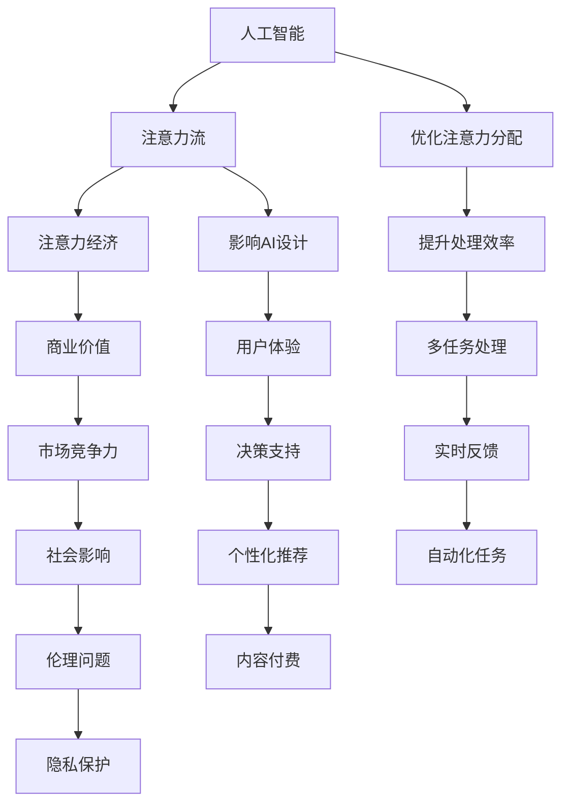

                 

### 文章标题

《AI与人类注意力流：未来的工作、技能与注意力经济的未来展望》

### 关键词

人工智能、注意力流、注意力经济、工作、技能、未来展望

### 摘要

本文将深入探讨人工智能（AI）与人类注意力流之间的关系，以及这一关系对未来工作、技能发展和注意力经济的影响。首先，我们将介绍AI和注意力流的基本概念，并探讨它们之间的联系。接着，我们会回顾AI和注意力流的历史发展，分析它们在当前数字化时代的演变。文章还将探讨AI在注意力流管理中的应用，以及注意力经济在AI和注意力流中的作用。此外，本文还将探讨AI和注意力流在未来的工作环境、教育培训和社会影响等方面的应用和影响。最后，我们将总结核心观点，并对未来展望进行讨论。

## 《AI与人类注意力流：未来的工作、技能与注意力经济的未来展望》目录大纲

### 第一部分：AI与人类注意力流的概述

#### 第1章：AI与人类注意力流的基本概念

##### 1.1 AI与注意力流的概念解释

- AI的定义：人工智能（Artificial Intelligence，AI）是指由人制造出来的系统所表现出的智能行为。
- 注意力流的概念：注意力流是一种心理学理论，描述了人类在接收和处理信息时的动态注意力分配过程。

##### 1.2 AI与注意力流的联系

- AI技术如何影响注意力流：AI技术可以模拟和增强人类注意力流的分配，提高信息处理的效率和效果。
- 注意力流如何影响AI：注意力流的理论可以指导AI系统设计，使其更好地适应人类的行为模式。

##### 1.3 注意力经济的概念

- 注意力经济的定义：注意力经济是指基于人类注意力的价值交换体系。
- 注意力经济的重要性：在数字化时代，注意力成为了一种稀缺资源，对个人和企业都具有重要意义。

### 第2章：AI与人类注意力流的历史发展

##### 2.1 人工智能的发展历程

- AI的起源与发展：从20世纪50年代的早期AI研究到21世纪的深度学习革命。
- 关键里程碑：人工智能历史上的关键里程碑和重要事件。

##### 2.2 注意力流理论的发展

- 心理学研究：注意力流理论的发展与心理学研究的历史背景。
- 关键理论：注意力分配、认知负荷、多任务处理等关键理论的发展。

##### 2.3 注意力经济的历史演变

- 注意力经济的兴起：随着互联网和数字化技术的发展，注意力经济如何演变和发展。

### 第二部分：AI与人类注意力流的应用场景

#### 第3章：AI在注意力流管理中的应用

##### 3.1 注意力流管理的概念

- 注意力流管理的重要性：如何通过管理注意力流来提高工作和生活质量。

##### 3.2 AI技术在注意力流管理中的应用

- AI工具：介绍用于注意力流管理的AI工具，如时间管理应用、注意力追踪工具等。
- 应用案例：分享AI在注意力流管理中的实际应用案例。

##### 3.3 注意力流管理的最佳实践

- 个人层面：如何通过个人策略来管理注意力流。
- 组织层面：如何通过组织策略来管理注意力流。

#### 第4章：AI与注意力经济

##### 4.1 注意力经济的构成要素

- 注意力的价值：分析注意力的价值如何转化为经济收益。
- 注意力的市场：讨论注意力市场如何运作。

##### 4.2 AI与注意力经济的互动

- AI如何促进注意力经济：讨论AI技术在注意力经济中的作用。
- 注意力经济如何影响AI：分析注意力经济如何影响AI系统的设计和运营。

##### 4.3 注意力经济的挑战与机遇

- 挑战：注意力经济面临的伦理、隐私和社会挑战。
- 机遇：注意力经济带来的新商业机会和创新空间。

#### 第5章：AI与注意力流在未来的工作中的应用

##### 5.1 未来工作环境的变迁

- 远程工作：远程工作对注意力流的影响。
- 数字化工作流程：数字化工作流程如何改变注意力流的分配。

##### 5.2 AI辅助注意力管理

- AI工具：介绍AI如何辅助个人和组织进行注意力管理。
- 应用案例：分享AI在注意力管理中的实际应用案例。

##### 5.3 注意力流与职业发展

- 技能提升：如何通过管理注意力流来提升个人技能。
- 职业规划：注意力流管理如何影响职业规划和职业发展。

#### 第6章：AI与注意力流在教育培训中的应用

##### 6.1 教育培训中的注意力问题

- 注意力缺失：分析学生注意力缺失的原因。
- 注意力提升：讨论如何通过技术手段提升学生的注意力。

##### 6.2 AI在教育中的角色

- 个性化学习：AI如何实现个性化学习。
- 教育资源的优化：AI如何优化教育资源分配。

##### 6.3 注意力流与学习效果

- 注意力管理策略：如何通过管理注意力流来提高学习效果。

#### 第7章：AI与注意力流的社会影响与伦理问题

##### 7.1 社会影响

- 社会分层：注意力经济如何导致社会分层。
- 数字鸿沟：分析数字鸿沟如何影响注意力分配。

##### 7.2 伦理问题

- 隐私保护：讨论AI在注意力经济中如何处理用户隐私。
- 伦理决策：分析AI系统在注意力分配中的伦理决策。

##### 7.3 未来展望

- 趋势预测：预测AI与注意力流在未来社会中的发展趋势。
- 应对策略：讨论如何应对AI与注意力流带来的社会挑战。

### 第8章：结论与未来展望

##### 8.1 总结

- 核心观点：总结本书的核心观点和发现。
- 关键意义：讨论AI与注意力流研究对社会的关键意义。

##### 8.2 未来展望

- 研究趋势：预测未来AI与注意力流研究的方向和趋势。
- 应用前景：探讨AI与注意力流在各个领域的应用前景。

### 附录

##### 附录A：AI与注意力流相关资源

- **参考文献**：列出本书引用的参考文献。
- **在线资源**：推荐与AI与注意力流相关的在线资源和进一步学习资料。

## 第一部分：AI与人类注意力流的概述

### 第1章：AI与人类注意力流的基本概念

#### 1.1 AI与注意力流的概念解释

##### 1.1.1 AI的定义

人工智能（Artificial Intelligence，AI）是指由人制造出来的系统所表现出的智能行为。这个定义涵盖了从简单的自动化任务到复杂的决策支持系统等各种应用。AI的核心目标是使计算机系统能够执行通常需要人类智能才能完成的任务，如语音识别、图像识别、自然语言处理、机器学习等。

在技术层面上，AI系统通常包括以下几个关键组件：

- **数据收集**：通过传感器、网络或其他数据源收集大量的数据。
- **数据处理**：使用数据清洗和预处理技术，确保数据的质量和一致性。
- **算法设计**：设计和实现能够模拟人类智能的算法，如神经网络、决策树、支持向量机等。
- **模型训练**：通过训练数据来调整和优化算法参数，使模型能够准确预测或分类新数据。
- **系统集成**：将AI模型集成到现有的软件或硬件系统中，以实现特定的应用。

##### 1.1.2 注意力流的概念

注意力流是一种心理学理论，描述了人类在接收和处理信息时的动态注意力分配过程。注意力流的核心观点是，人类的注意力资源是有限的，人们需要在不同的任务和环境之间分配这些有限的资源。注意力流理论提供了对注意力分配、认知负荷、多任务处理等概念的深入理解。

在心理学研究中，注意力流通常包括以下几个关键要素：

- **分配**：注意力资源在不同任务和活动之间的分配。
- **持续**：注意力在特定任务上的持续时间和稳定性。
- **选择**：在多个刺激中，选择哪些刺激进入意识，哪些被忽略。
- **切换**：在不同任务之间的注意力转移和切换。

##### 1.1.3 注意力流的机制

注意力流的机制可以分为以下几个方面：

- **集中注意力**：将注意力集中在特定的任务或目标上，以减少干扰。
- **分散注意力**：将注意力分散到多个任务或目标上，以实现多任务处理。
- **过滤机制**：通过认知过滤机制，将无关或干扰信息排除在外，以保持注意力的集中。
- **分配策略**：根据任务的重要性和难度，调整注意力资源的分配策略。

#### 1.2 AI与注意力流的联系

##### 1.2.1 AI技术如何影响注意力流

AI技术可以模拟和增强人类注意力流的分配，从而提高信息处理的效率和效果。具体来说，AI技术可以通过以下方式影响注意力流：

- **自动化任务**：通过自动化重复性任务，减少人类在低价值任务上的注意力消耗，使人们能够将注意力集中在更高价值的任务上。
- **个性化推荐**：基于用户的兴趣和行为模式，提供个性化的推荐服务，减少用户在信息筛选上的注意力消耗。
- **实时反馈**：通过实时分析数据并提供即时反馈，帮助用户快速调整注意力分配，提高任务完成的效率。
- **智能助手**：利用自然语言处理和语音识别技术，提供智能助手服务，帮助用户管理和分配注意力资源。

##### 1.2.2 注意力流如何影响AI

注意力流的理论可以指导AI系统设计，使其更好地适应人类的行为模式。具体来说，注意力流对AI系统设计的影响包括：

- **用户体验**：设计AI系统时，要考虑用户在注意力分配上的需求，提供直观、易用的界面和交互方式，以提高用户体验。
- **任务调度**：通过分析用户的注意力流模式，AI系统可以优化任务调度，确保在用户注意力最集中的时候分配最关键的任务。
- **多任务处理**：利用注意力流理论，AI系统可以设计出更加智能的多任务处理算法，提高系统的响应速度和处理效率。
- **决策支持**：AI系统可以通过模拟用户的注意力流模式，提供更准确的决策支持，帮助用户在复杂情境中做出最优选择。

#### 1.3 注意力经济的概念

##### 1.3.1 注意力经济的定义

注意力经济是指基于人类注意力的价值交换体系。在数字化时代，注意力成为了一种稀缺资源，个人和企业在获取注意力方面投入了大量的资源。注意力经济关注的是如何通过优化注意力分配和利用，实现经济收益的最大化。

注意力经济的关键要素包括：

- **注意力源**：提供注意力资源的人或实体，如用户、消费者、观众等。
- **注意力需求**：需要注意力资源的人或实体，如广告主、品牌商、内容创作者等。
- **注意力交换**：通过广告、内容付费、赞助等形式，实现注意力资源的交换和转化。

##### 1.3.2 注意力经济的重要性

在数字化时代，注意力经济的重要性体现在以下几个方面：

- **商业价值**：注意力资源的获取和转化，是许多在线服务和商业模式的核心，如社交媒体、广告、电商等。
- **市场竞争力**：在注意力经济中，拥有更多注意力资源的企业和品牌，具有更强的市场影响力和竞争力。
- **用户价值**：通过优化注意力分配和利用，用户可以更高效地获取信息和娱乐，提高生活质量。
- **社会影响**：注意力经济的影响不仅局限于商业领域，还涉及社会、文化、政治等多个方面，如数字鸿沟、隐私保护、伦理问题等。

#### 1.4 AI与注意力流的关系架构

为了更好地理解AI与注意力流之间的关系，我们可以使用Mermaid流程图来展示它们之间的核心概念和联系。

在这个流程图中，我们可以看到AI与注意力流之间的互动关系。AI技术通过优化注意力分配和利用，不仅提升了信息处理的效率，还影响了AI系统的设计和用户体验。同时，注意力经济在商业和社会层面具有重要意义，但也带来了新的挑战和伦理问题。

### 第2章：AI与人类注意力流的历史发展

#### 2.1 人工智能的发展历程

##### 2.1.1 AI的起源与发展

人工智能（AI）的概念可以追溯到20世纪中叶。1950年，英国数学家和逻辑学家艾伦·图灵提出了“图灵测试”，这是对人工智能能力的一种早期评估标准。1956年，在达特茅斯会议（Dartmouth Conference）上，约翰·麦卡锡（John McCarthy）等人首次提出了“人工智能”这一术语，并明确了其研究目标。

在早期阶段，AI主要集中在符号逻辑、问题解决和搜索算法上。1956年至1974年，这一时期被称为“AI的春天”。然而，由于算法复杂度和计算资源的限制，早期AI系统在处理复杂任务时遇到了诸多困难。

1974年至1980年，AI进入了一个相对低潮的时期，被称为“AI的冬天”。这一时期，AI研究受到质疑和批评，许多研究项目被迫中止。然而，这个时期也为AI的下一个发展阶段积累了宝贵的经验和教训。

1980年代，专家系统（Expert Systems）成为AI研究的热点。专家系统利用知识表示和推理技术，模拟人类专家的决策过程。这一时期，AI开始逐渐应用于实际领域，如医疗诊断、金融分析等。

1990年代，随着计算能力的提升和互联网的发展，机器学习和深度学习开始崭露头角。机器学习通过训练模型来模拟人类学习过程，深度学习则利用多层神经网络进行数据处理和模式识别。这一时期，AI在图像识别、语音识别、自然语言处理等领域取得了显著进展。

进入21世纪，AI技术迅速发展，应用领域不断拓展。从自动驾驶、智能助手到医疗诊断、金融风控，AI已经深入到我们生活的各个方面。同时，AI也开始应用于社会、经济、政治等更广泛的领域。

##### 2.1.2 关键里程碑

人工智能的发展历程中，有许多关键里程碑事件：

- **1956年**：达特茅斯会议，人工智能这一术语首次被提出。
- **1965年**：爱德华·阿瑟·李·波比克（Edward A. Feigenbaum）等人开发出第一个专家系统Dendral。
- **1981年**：约翰·霍普金斯大学的Claude Shannon和Walter Freeman III开发了第一个神经网络模型。
- **1986年**：Geoffrey Hinton、David E. Rumelhart和RobertMcClelland发表了关于反向传播算法的论文，推动了深度学习的发展。
- **2006年**：Jürgen Schmidhuber提出了深度置信网络（DBN），进一步推动了深度学习的发展。
- **2012年**：AlexNet在ImageNet大赛中取得重大突破，深度学习开始广泛应用。
- **2016年**：AlphaGo击败人类围棋冠军，标志着AI在复杂任务上的能力大幅提升。

##### 2.1.3 当前AI技术的发展趋势

当前，人工智能技术正朝着以下几个方向发展：

- **自动化与智能化**：AI技术正在逐渐替代人类完成重复性、低价值的任务，提高生产效率和准确性。
- **多模态融合**：通过结合多种数据源（如图像、文本、声音等），AI系统能够更全面地理解和处理复杂问题。
- **自适应与自学习**：AI系统可以通过不断学习和适应，提高在动态环境下的决策能力和鲁棒性。
- **泛化能力**：通过改进算法和数据集，AI系统正在逐步提高在未知任务上的泛化能力。
- **人机协作**：AI与人类协作正在成为新的趋势，通过人机协同，可以发挥各自的优势，提高整体效能。

#### 2.2 注意力流理论的发展

##### 2.2.1 心理学研究背景

注意力流理论的发展与心理学研究有着密切的联系。在心理学领域，注意力一直是研究的热点问题。20世纪50年代，乔治·米勒（George A. Miller）提出了“认知容量有限”的观点，认为人类的注意力资源是有限的。这一观点为后来的注意力研究奠定了基础。

随着认知科学和神经科学的发展，注意力流理论逐渐形成。20世纪80年代，心理学家迈克尔·瑞安（Michael I. Posner）提出了“焦点注意力”和“分配注意力”的概念，进一步丰富了注意力研究的理论体系。

##### 2.2.2 关键理论

在注意力流理论中，有几个关键理论对理解和应用注意力流具有重要意义：

- **注意力分配理论**：这一理论认为，人类的注意力资源在不同任务和刺激之间的分配是动态的，并且受到任务难度、注意力资源限制等因素的影响。
- **认知负荷理论**：认知负荷理论关注的是，在执行任务时，注意力的分配如何影响认知负荷，从而影响任务完成的质量和效率。
- **多任务处理理论**：多任务处理理论研究了人类在同时处理多个任务时的注意力分配策略，以及如何优化这些策略以提高任务完成的效率。
- **注意选择理论**：注意选择理论关注的是，在多个刺激中，人类如何选择哪些信息进入意识，哪些被忽略。

##### 2.2.3 注意力流的研究进展

近年来，注意力流理论在心理学、认知科学、计算机科学等领域取得了显著进展。以下是一些研究进展：

- **注意力追踪技术**：通过眼动仪、脑电图等设备，研究人员可以实时监测人类的注意力流，了解注意力在任务执行过程中的动态变化。
- **注意力模型构建**：利用机器学习和深度学习技术，研究人员可以构建出更准确、更高效的注意力模型，用于预测和分析注意力流。
- **注意力优化算法**：在计算机科学领域，研究人员正在开发各种优化算法，以帮助系统更好地分配和利用注意力资源，提高任务处理的效率。
- **注意力增强技术**：通过脑机接口、虚拟现实等新技术，研究人员正在探索如何增强人类的注意力流，提高学习、工作等活动的效果。

#### 2.3 注意力经济的历史演变

##### 2.3.1 注意力经济的兴起

注意力经济这一概念最早由经济学家威廉·格雷厄姆·夏普（William H. Sharpe）于20世纪60年代提出。夏普认为，注意力是一种稀缺资源，可以作为一种经济资产进行交换和交易。

随着互联网和数字化技术的发展，注意力经济逐渐兴起。互联网为人们提供了大量信息和娱乐内容，同时也为企业提供了吸引注意力的新途径。社交媒体、广告、游戏等商业模式，都离不开对注意力的争夺和利用。

##### 2.3.2 注意力市场的发展

注意力市场是一个新兴的市场领域，它关注的是如何通过交换和转化注意力资源，实现经济收益的最大化。以下是注意力市场发展的几个关键方面：

- **注意力采集**：企业通过广告、内容推荐、游戏化等方式，吸引和采集用户的注意力资源。
- **注意力分析**：利用大数据和机器学习技术，企业可以分析用户的注意力流模式，了解用户的行为和兴趣，从而提供更个性化的服务和推荐。
- **注意力交易**：注意力资源可以通过广告投放、内容付费、赞助等形式，实现交易和转化，为企业带来经济收益。
- **注意力价值评估**：注意力资源的价值取决于其质量和数量，企业需要评估和管理注意力资源，以提高经济效益。

##### 2.3.3 注意力经济的影响

注意力经济的兴起，对个人、企业和社会都产生了深远的影响：

- **个人影响**：在注意力经济中，个人需要更好地管理自己的注意力资源，以提高学习和工作效率，同时保护自己的隐私和安全。
- **企业影响**：企业需要通过创新和优化，提高对注意力资源的获取和利用效率，以增强市场竞争力。
- **社会影响**：注意力经济可能导致社会分层，财富和资源的分配可能更加不均衡。同时，注意力经济也带来了新的伦理和隐私问题，需要社会各界的关注和解决。

### 第二部分：AI与人类注意力流的应用场景

#### 第3章：AI在注意力流管理中的应用

##### 3.1 注意力流管理的概念

注意力流管理是指通过科学的方法和工具，对人类在接收和处理信息时的注意力资源进行有效管理和调控的过程。注意力流管理的重要性体现在以下几个方面：

- **提高工作效率**：有效的注意力流管理可以帮助人们更好地集中注意力，减少干扰，从而提高工作效率。
- **优化生活质量**：通过管理注意力流，人们可以更好地平衡工作与生活，提高生活质量和幸福感。
- **促进学习效果**：在学习和教育领域，注意力流管理可以帮助学生更好地集中注意力，提高学习效果。

##### 3.2 AI技术在注意力流管理中的应用

AI技术在注意力流管理中发挥着重要作用。以下是一些AI技术在注意力流管理中的应用：

- **注意力追踪工具**：通过眼动仪、脑电图等设备，AI系统可以实时监测用户的注意力流，识别注意力集中的时间和任务，并提供相应的反馈和建议。

- **时间管理应用**：AI助手可以根据用户的注意力流模式，自动调整任务的优先级和时间安排，帮助用户更高效地完成工作。

- **注意力优化算法**：AI系统可以通过机器学习算法，分析用户的注意力流数据，自动优化注意力分配策略，提高任务完成效率。

- **个性化推荐系统**：AI系统可以根据用户的注意力流模式，提供个性化的内容和活动推荐，减少用户在信息筛选上的注意力消耗。

##### 3.3 注意力流管理的最佳实践

为了有效管理注意力流，以下是一些最佳实践：

- **设定明确的任务目标**：在开始工作或学习之前，明确任务的目标和重要性，有助于集中注意力。

- **避免多任务处理**：多任务处理会分散注意力，降低工作效率。尽量集中精力完成一项任务，再进行下一项。

- **定期休息和放松**：长时间的工作或学习会导致注意力疲劳，定期休息和放松有助于恢复注意力。

- **优化工作环境**：保持工作环境的整洁和舒适，减少干扰因素，有助于提高注意力集中程度。

- **使用AI工具**：利用AI助手和注意力追踪工具，可以帮助用户更好地管理注意力流，提高工作和学习效率。

### 第4章：AI与注意力经济

##### 4.1 注意力经济的构成要素

注意力经济是一种基于人类注意力的价值交换体系。在这个体系中，注意力被视为一种稀缺资源，个人和企业在获取和利用注意力方面投入了大量的资源。注意力经济的构成要素主要包括以下几个方面：

- **注意力源**：注意力源是指提供注意力资源的人或实体。在注意力经济中，注意力源通常包括用户、消费者、观众等。注意力源的特点是注意力资源有限，难以重复获取。

- **注意力需求**：注意力需求是指需要注意力资源的人或实体。注意力需求通常来自于广告主、品牌商、内容创作者等，他们希望通过吸引和获取注意力来实现商业目的。

- **注意力交换**：注意力交换是指通过广告、内容付费、赞助等形式，实现注意力资源的交换和转化。在注意力经济中，注意力需求方通过提供有价值的内容、服务或产品，吸引注意力源的关注，从而实现注意力资源的交换。

- **注意力转化**：注意力转化是指将注意力资源转化为经济收益的过程。在注意力经济中，注意力转化主要通过广告收入、付费订阅、赞助费等方式实现。注意力转化效率的高低，直接影响到个人和企业的发展。

##### 4.2 AI与注意力经济的互动

AI与注意力经济之间的互动关系体现在以下几个方面：

- **促进注意力采集**：AI技术可以帮助企业更高效地采集注意力。例如，通过大数据分析、机器学习等技术，企业可以了解用户的行为和兴趣，从而提供个性化的内容和服务，提高注意力采集的效率。

- **优化注意力分配**：AI技术可以帮助用户更科学地管理注意力资源。例如，通过注意力追踪工具和优化算法，用户可以实时了解自己的注意力分布情况，并据此调整任务和时间安排，提高注意力利用效率。

- **提升注意力价值**：AI技术可以帮助企业提升注意力的价值。例如，通过智能推荐系统、内容分析技术等，企业可以更精准地匹配用户和内容，提高用户的参与度和满意度，从而提升注意力的价值。

- **创新商业模式**：AI技术为注意力经济带来了新的商业模式。例如，通过广告投放优化、内容付费平台等，企业可以更灵活地实现注意力转化，提高经济效益。

##### 4.3 注意力经济的挑战与机遇

注意力经济在带来巨大机遇的同时，也面临着一些挑战：

- **隐私保护**：在注意力经济中，用户注意力数据的重要性不言而喻。然而，这些数据也可能带来隐私泄露的风险。如何在利用用户数据的同时，保护用户的隐私，是注意力经济需要解决的重要问题。

- **伦理问题**：注意力经济的商业模式可能引发一些伦理问题。例如，注意力资源的不公平分配可能导致社会分层，某些用户可能因为缺乏注意力资源而处于劣势地位。

- **技术依赖**：随着AI技术的发展，企业和个人可能越来越依赖AI技术进行注意力管理和分配。然而，技术的不稳定性和不可预测性，也可能给企业和个人带来风险。

- **用户行为**：注意力经济可能会改变用户的行为模式。例如，用户可能因为追求短期满足，而忽视长期价值。如何引导用户形成健康的注意力消费习惯，是注意力经济需要关注的领域。

- **监管政策**：注意力经济的发展需要相应的监管政策。如何制定合理的政策，既保护用户权益，又促进市场健康发展，是政策制定者需要考虑的问题。

然而，总体而言，注意力经济为企业和个人带来了巨大的机遇：

- **商业创新**：注意力经济催生了许多新的商业机会，如广告、内容付费、个性化推荐等。企业可以通过创新商业模式，实现商业价值的提升。

- **市场竞争力**：在注意力经济中，拥有更多注意力资源的企业，具有更强的市场竞争力。通过优化注意力管理和分配，企业可以提升品牌影响力，增强市场地位。

- **用户体验**：注意力经济可以提供更个性化、更优质的服务和体验。通过分析用户注意力数据，企业可以更准确地满足用户需求，提高用户满意度。

- **社会发展**：注意力经济的发展，有助于推动社会进步。例如，通过提供高质量的内容和知识，注意力经济可以促进教育、文化、科技等领域的繁荣。

总之，注意力经济在带来挑战的同时，也为企业和个人带来了巨大的机遇。通过合理利用注意力资源，企业可以创造更多价值，用户可以享受更优质的服务，社会可以迈向更加繁荣的未来。

#### 第5章：AI与注意力流在未来的工作中的应用

##### 5.1 未来工作环境的变迁

随着人工智能（AI）技术的发展和普及，未来的工作环境将发生深刻的变化。远程工作和数字化工作流程将成为主流，对注意力流产生重要影响。

**远程工作**：远程工作的普及使得人们可以在任何地点进行工作，不再受限于办公场所。这为员工提供了更大的灵活性，但也带来了一些挑战。远程工作容易受到家庭、社交和其他干扰的影响，员工需要更好地管理自己的注意力流，以确保工作效率。

**数字化工作流程**：数字化工作流程的引入，使得工作流程更加高效和自动化。通过AI技术，企业可以实现自动化任务处理、实时数据分析和智能决策。这些变化要求员工具备更强的注意力分配和管理能力，以适应快速变化的工作环境。

**远程工作对注意力流的影响**：

- **注意力分散**：远程工作可能导致注意力分散，家庭环境、社交活动等干扰因素增加，影响工作效率。
- **注意力集中**：远程工作也提供了更多专注的机会，员工可以在家中创造一个更专注的工作环境，减少干扰。
- **灵活的时间管理**：远程工作使得员工可以更灵活地安排工作时间，根据个人生物钟和工作需求，调整注意力分配。

**数字化工作流程对注意力流的影响**：

- **自动化任务**：AI技术可以自动化重复性任务，减少员工在低价值任务上的注意力消耗，使员工将注意力集中在更高价值的任务上。
- **实时反馈**：AI系统可以实时分析数据并提供反馈，帮助员工快速调整注意力分配，提高任务完成的效率。
- **任务优先级**：AI系统可以根据任务的重要性和紧急程度，自动调整任务的优先级，帮助员工更高效地管理注意力流。

##### 5.2 AI辅助注意力管理

AI技术在注意力管理中发挥着重要作用，可以提供多种工具和方法，帮助员工更好地管理自己的注意力流。

**注意力追踪工具**：通过眼动仪、脑电图等设备，AI系统可以实时监测员工的注意力流，识别注意力集中的时间和任务，并提供相应的反馈和建议。这些工具可以帮助员工了解自己的注意力分布情况，发现注意力分散的原因，并采取相应的调整措施。

**时间管理应用**：AI助手可以根据员工的注意力流模式，自动调整任务的优先级和时间安排，帮助员工更高效地完成工作。例如，AI助手可以在员工注意力最集中的时候安排最重要的任务，在注意力分散时安排相对简单的任务。

**注意力优化算法**：AI系统可以通过机器学习算法，分析员工的注意力流数据，自动优化注意力分配策略，提高任务完成效率。这些算法可以根据员工的生物节律、工作习惯和任务特点，动态调整注意力分配，确保员工在不同任务和时间段内都能保持高效率。

**个性化推荐系统**：AI系统可以根据员工的注意力流模式，提供个性化的内容和活动推荐，减少员工在信息筛选上的注意力消耗。例如，AI助手可以推荐与员工兴趣相关的学习资源、新闻资讯等，帮助员工更有效地利用注意力资源。

##### 5.3 注意力流与职业发展

注意力流管理不仅影响员工的工作效率和生活质量，还对其职业发展产生深远影响。

**技能提升**：通过有效管理注意力流，员工可以更专注于提升自己的专业技能。例如，员工可以在注意力集中的时间段内进行深入的学习和研究，提高自己的专业知识和能力。

**职业规划**：注意力流管理有助于员工更清晰地规划自己的职业发展路径。通过了解自己的注意力分布和偏好，员工可以更准确地选择适合自己的职业方向，制定有针对性的职业规划。

**工作满意度**：有效管理注意力流可以提高员工的工作满意度。当员工能够合理分配注意力资源，集中精力完成重要任务时，他们会感到更有成就感，从而提高工作满意度。

**工作效率**：注意力流管理有助于提高员工的工作效率。通过优化注意力分配，员工可以更高效地完成工作任务，减少时间和资源的浪费。

**创新和创造力**：在注意力集中的时间段内，员工更容易产生创新思维和创意。有效管理注意力流可以为员工创造更多的创新机会，提升企业的创新能力和竞争力。

总之，注意力流管理对员工的职业发展具有重要意义。通过科学地管理注意力流，员工可以提升自己的专业技能、工作效率和工作满意度，实现职业发展的目标。

### 第6章：AI与注意力流在教育培训中的应用

#### 6.1 教育培训中的注意力问题

在教育培训领域，注意力问题一直是教师和学生关注的重点。注意力缺失、注意力分散、注意力难以持久等问题，严重影响着教学效果和学习成果。以下是教育培训中注意力问题的几个关键方面：

##### 6.1.1 注意力缺失

注意力缺失是指学生在学习过程中无法集中注意力，容易被外界干扰所分散。注意力缺失可能导致学生无法有效地理解和掌握知识，从而影响学习效果。以下是一些导致注意力缺失的原因：

- **课程内容枯燥**：一些课程内容较为枯燥，缺乏趣味性和吸引力，容易导致学生注意力分散。
- **教学方法不当**：教师的教学方法不当，如使用单一的教学方式、缺乏互动和参与，可能导致学生缺乏学习兴趣，注意力难以集中。
- **学生情绪问题**：学生的情绪问题，如焦虑、压力等，也可能导致注意力缺失。
- **环境干扰**：学习环境中的噪音、光线、设备干扰等，都可能影响学生的注意力集中。

##### 6.1.2 注意力分散

注意力分散是指学生在学习过程中，由于外界干扰或内部心理因素，导致注意力无法集中。注意力分散可能导致学生无法专注于学习任务，影响学习效果。以下是一些导致注意力分散的原因：

- **多任务处理**：学生在学习过程中，尝试同时处理多个任务，如浏览社交媒体、处理电子邮件等，容易导致注意力分散。
- **课堂参与度低**：学生在课堂上缺乏参与感，容易导致注意力分散。例如，一些学生可能在课堂上发呆、做其他事情，而不是专注于听课。
- **家庭环境因素**：家庭环境中的噪音、家庭矛盾等，也可能导致学生在学习过程中注意力分散。
- **个人心理因素**：学生的个人心理因素，如焦虑、无聊、厌学等，也可能导致注意力分散。

##### 6.1.3 注意力难以持久

注意力难以持久是指学生在学习过程中，难以长时间保持注意力集中。注意力难以持久可能导致学生无法有效地完成学习任务，影响学习效果。以下是一些导致注意力难以持久的原因：

- **学习任务难度**：一些学习任务难度较大，学生需要付出更多努力才能理解和掌握，容易导致注意力难以持久。
- **缺乏兴趣**：学生对学习内容缺乏兴趣，容易导致注意力难以持久。
- **教学方法**：教师的教学方法不当，如缺乏互动和参与，可能使学生在学习过程中感到无聊，注意力难以持久。
- **生理因素**：学生的生理因素，如睡眠不足、饮食不当等，也可能导致注意力难以持久。

#### 6.2 AI在教育中的角色

人工智能（AI）技术在教育培训中扮演着越来越重要的角色，通过智能分析、个性化推荐和自适应学习等手段，AI可以有效提升学生的学习效果和注意力管理。

##### 6.2.1 个性化学习

个性化学习是指根据学生的兴趣、能力和学习进度，提供个性化的教学资源和学习路径。AI技术可以通过分析学生的学习行为、知识水平和兴趣偏好，为学生提供个性化的学习方案。

- **学习路径推荐**：AI系统可以根据学生的学习历史和偏好，推荐最适合的学习路径。例如，对于某些难以理解的概念，AI系统可以推荐相关的视频、练习题和讲解，帮助学生更好地理解和掌握。
- **学习资源推荐**：AI系统可以根据学生的学习进度和知识点掌握情况，推荐相关的学习资源，如教材、参考书、在线课程等，帮助学生更全面地学习。
- **个性化作业**：AI系统可以根据学生的学习情况，生成个性化的作业，提高作业的针对性和有效性。

##### 6.2.2 自适应学习

自适应学习是指根据学生的实时学习反馈，动态调整教学策略和学习内容。AI技术可以通过分析学生的学习行为和反馈，实现教学策略和学习内容的自适应调整。

- **学习难度调整**：AI系统可以根据学生的学习进度和知识点掌握情况，自动调整学习难度。例如，对于某些知识点，如果学生掌握较好，AI系统可以降低难度，使学生有更多时间学习其他知识点；如果学生掌握较差，AI系统可以增加练习和复习，帮助学生更好地掌握。
- **学习内容调整**：AI系统可以根据学生的学习反馈，动态调整学习内容。例如，如果学生在某个知识点上花费时间较多，AI系统可以增加相关的练习和讲解，帮助学生更好地理解和掌握。
- **学习进度调整**：AI系统可以根据学生的学习进度和学习效果，动态调整学习计划和时间安排。例如，如果学生提前完成了一个学习任务，AI系统可以提前安排下一个任务，使学生保持学习的连贯性和节奏。

##### 6.2.3 智能分析

智能分析是指利用AI技术对学生的学习行为、知识水平和学习效果进行深入分析，提供科学的指导和建议。AI技术可以通过大数据分析和机器学习算法，实现以下功能：

- **学习效果评估**：AI系统可以对学生的学习效果进行实时评估，分析学生在各个知识点上的掌握情况，提供针对性的改进建议。
- **学习行为分析**：AI系统可以分析学生的学习行为，如学习时间、学习频率、学习方式等，发现学生的学习习惯和偏好，提供个性化的学习建议。
- **学习预测**：AI系统可以根据学生的学习历史和行为数据，预测学生在未来的学习过程中可能遇到的问题和挑战，提前进行干预和指导。

#### 6.3 注意力流与学习效果

注意力流对学习效果有着重要的影响。通过有效管理注意力流，可以显著提升学习效果。以下是一些通过管理注意力流来提升学习效果的方法：

##### 6.3.1 注意力管理策略

- **设定学习目标**：在学习开始前，设定明确的学习目标，有助于集中注意力，提高学习效率。
- **合理安排学习时间**：合理安排学习时间，避免长时间连续学习，适当休息和放松，有助于保持注意力集中。
- **避免多任务处理**：在学习过程中，尽量避免同时处理多个任务，以免分散注意力。
- **创造良好的学习环境**：创造一个安静、舒适、无干扰的学习环境，有助于提高注意力集中程度。

##### 6.3.2 互动式学习

互动式学习是指通过师生互动、生生互动等方式，激发学生的学习兴趣和参与度。互动式学习可以有效提升学生的注意力，提高学习效果。

- **课堂互动**：教师可以通过提问、讨论、演示等方式，激发学生的兴趣和参与度，提高课堂的互动性和生动性。
- **小组合作**：通过小组合作学习，学生可以相互交流、分享学习心得，提高学习效果。
- **实践应用**：将理论知识与实际应用相结合，通过实践操作，提高学生的动手能力和实际应用能力。

##### 6.3.3 技术辅助学习

利用AI技术，可以提供个性化、自适应的学习资源，帮助学生更高效地管理注意力流，提高学习效果。

- **智能推荐系统**：通过AI技术，可以为学生推荐最适合的学习资源，提高学习的针对性和效果。
- **注意力追踪工具**：通过AI技术，可以实时监测学生的注意力流，提供注意力管理建议，帮助学生保持注意力集中。
- **学习反馈系统**：通过AI技术，可以实时分析学生的学习行为和反馈，提供针对性的学习指导和建议，帮助学生更好地掌握知识。

总之，通过科学地管理注意力流，可以显著提升学习效果。AI技术在教育培训中的应用，为注意力管理提供了新的工具和方法，有助于学生更高效地学习，实现学习目标。

#### 第7章：AI与注意力流的社会影响与伦理问题

##### 7.1 社会影响

AI与注意力流在现代社会中产生了深远的影响，这些影响不仅体现在个人层面，也对社会结构、经济和文化等多个方面产生了重大影响。

**社会分层**：在注意力经济中，注意力资源的分配不均可能导致社会分层。那些拥有更多时间和资源来培养注意力技能的人，可能在职业、教育和社会地位上处于优势地位。而那些缺乏这些资源的人，可能面临注意力稀缺的困境，从而在社会中处于劣势地位。这种不平等可能导致社会分裂和不稳定。

**数字鸿沟**：数字鸿沟是指不同社会群体在获取和使用数字技术和信息资源方面的差异。在注意力经济中，数字鸿沟可能加剧，因为那些拥有先进技术和高效网络连接的人能够更容易地吸引和保持注意力。这可能导致富裕地区和贫困地区、发达国家和不发达国家之间的发展差距进一步扩大。

**文化冲突**：随着AI和注意力流技术的普及，人们的生活方式和文化价值观也发生了变化。例如，社交媒体和即时通讯工具的兴起，改变了人们的沟通方式和社交习惯。这可能引发文化冲突，尤其是在传统文化和价值观念与现代科技生活方式之间的冲突。

##### 7.2 伦理问题

AI与注意力流在应用过程中，也引发了诸多伦理问题，需要我们深入探讨和解决。

**隐私保护**：在注意力经济中，个人注意力数据被视为宝贵的资源。然而，这些数据的收集、存储和使用可能侵犯用户的隐私权。如何保护用户隐私，防止数据被滥用，是一个重要的伦理问题。

**算法偏见**：AI系统在处理注意力数据时，可能会基于历史数据中的偏见，导致不公平的结果。例如，个性化推荐系统可能倾向于向某些用户推荐特定的内容，从而加剧信息茧房效应，限制用户的视野和认知。

**伦理决策**：在AI系统中，特别是在那些涉及人类健康、安全和道德决策的系统中，如何确保AI能够做出符合伦理标准的决策，是一个重大挑战。例如，自动驾驶汽车在遇到紧急情况时，如何平衡不同个体的利益和生命价值。

**责任归属**：当AI系统造成损害或错误时，如何确定责任归属，是一个复杂的伦理和法律问题。是开发者、运营者，还是最终用户需要承担责任？这需要明确的法律和伦理框架来指导。

##### 7.3 未来展望

展望未来，AI与注意力流将继续深刻影响社会。以下是一些可能的趋势和展望：

**社会融合**：随着技术的发展，社会可能采取更多措施来减少注意力资源的分配不均，促进社会融合。例如，通过公共教育和数字技能培训，提高所有人的注意力管理和利用能力。

**数字素养**：提升公众的数字素养，成为未来社会的关键任务。教育系统将更加重视数字技能的培养，帮助人们更好地适应和利用AI和注意力流技术。

**伦理规范**：未来需要建立更加完善的伦理规范和法律框架，指导AI和注意力流技术的应用，确保其符合社会道德和法律标准。

**技术进步**：AI和注意力流技术将继续进步，提供更先进、更智能的解决方案，但同时也需要关注其对社会和伦理的潜在影响。

总之，AI与注意力流在现代社会中具有深远的影响，需要我们关注其社会和伦理问题，并积极应对未来的挑战。

### 第8章：结论与未来展望

#### 8.1 总结

本文深入探讨了人工智能（AI）与人类注意力流之间的关系，以及这一关系对未来工作、技能发展和注意力经济的影响。通过分析AI和注意力流的基本概念、历史发展、应用场景以及社会影响和伦理问题，我们得出了以下核心观点：

- **AI与注意力流密切相关**：AI技术可以通过模拟和增强人类注意力流，提高信息处理的效率和效果。同时，注意力流的理论可以指导AI系统设计，使其更好地适应人类的行为模式。
- **注意力经济的重要性**：在数字化时代，注意力成为了一种稀缺资源，对个人和企业都具有重要意义。通过优化注意力分配和利用，可以实现经济收益的最大化。
- **AI与注意力流的应用场景**：AI技术在注意力流管理中发挥着重要作用，可以帮助用户更好地管理注意力资源，提高工作效率和生活质量。在教育培训、未来工作和社会影响等领域，AI与注意力流的应用前景广阔。
- **社会和伦理问题**：随着AI和注意力流技术的发展，社会和伦理问题日益凸显，如隐私保护、算法偏见和责任归属等。未来需要建立更加完善的伦理规范和法律框架，确保技术应用的正当性和合理性。

#### 8.2 未来展望

展望未来，AI与注意力流将继续深刻影响社会。以下是一些可能的趋势和展望：

**技术进步**：AI和注意力流技术将继续进步，提供更先进、更智能的解决方案。例如，通过结合大数据、机器学习和神经科学，可以开发出更精准的注意力追踪和管理工具。

**个性化服务**：随着对注意力流的理解加深，个性化服务将成为主流。AI系统将能够根据用户的注意力流模式，提供个性化的推荐、培训和娱乐内容，满足用户多样化的需求。

**社会融合**：通过提升公众的数字素养和注意力管理能力，社会将更加融合。教育系统、企业和社会组织将采取措施，减少注意力资源的不平等分配，促进社会公平。

**伦理规范**：未来需要建立更加完善的伦理规范和法律框架，指导AI和注意力流技术的应用。这包括保护用户隐私、防止算法偏见和确保技术决策的透明性和可解释性。

**多领域融合**：AI与注意力流技术将在更多领域得到应用，如健康医疗、城市管理、艺术创作等。通过跨学科合作，可以开发出更多创新的应用场景，推动社会的全面进步。

总之，AI与注意力流在未来将发挥更加重要的作用。通过合理利用和规范管理这些技术，我们可以实现更高效、更公平和更可持续的社会发展。未来，我们需要共同努力，迎接这一挑战，创造一个更加美好的未来。

### 附录A：AI与注意力流相关资源

#### 参考文献

1. Turing, A. (1950). Computing Machinery and Intelligence.
2. Posner, M. I. (1980). Orienting of Attention.
3. Miller, G. A. (1956). The Magical Number Seven, Plus or Minus Two: Some Limits on Our Capacity for Processing Information.
4. Hinton, G. E., Osindero, S., & Teh, Y. W. (2006). A fast learning algorithm for deep belief nets.
5. Schmidhuber, J. (2006). Deep Learning in Neural Networks: An Overview.

#### 在线资源

- **AI与注意力流研究论文**：[arXiv.org](https://arxiv.org/)
- **AI与注意力流技术博客**：[Medium](https://medium.com/topic/artificial-intelligence/)
- **AI与注意力流在线课程**：[Coursera](https://www.coursera.org/courses?query=artificial%20intelligence)、[edX](https://www.edx.org/)
- **AI与注意力流研究报告**：[IEEE Xplore](https://ieeexplore.ieee.org/)、[ACM Digital Library](https://dl.acm.org/)、[ScienceDirect](https://www.sciencedirect.com/)
- **AI与注意力流会议和研讨会**：[NeurIPS](https://neurips.cc/)、[ICML](https://icml.cc/)、[CVPR](https://cvpr.org/)、[ICLR](https://iclr.cc/)、[CHI](https://chi2024.acm.org/)
- **AI与注意力流行业资讯**：[TechCrunch](https://techcrunch.com/)、[The Verge](https://www.theverge.com/)、[Wired](https://www.wired.com/)

通过这些资源，读者可以深入了解AI与注意力流的研究进展、技术应用和未来趋势，进一步拓展自己的知识领域。

