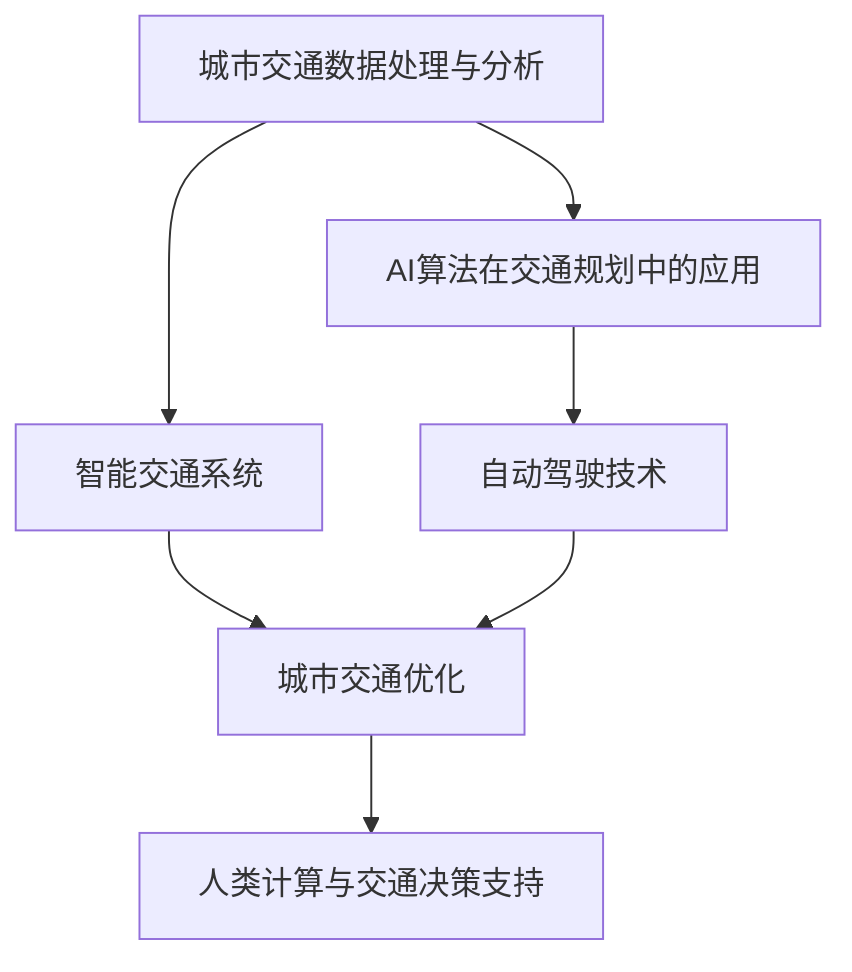

                 

### 文章标题: AI与人类计算：打造可持续发展的城市交通

随着全球城市化进程的不断加速，城市交通问题已经成为制约城市发展和社会进步的瓶颈。传统的城市交通系统在面对日益增长的交通需求和复杂的交通环境时显得力不从心。为了应对这一挑战，人工智能（AI）与人类计算的结合显得尤为重要。本文将探讨AI与人类计算在打造可持续发展的城市交通中的重要作用，通过深入分析城市交通数据处理与分析、AI算法在交通规划中的应用、城市交通管理中的智能交通系统与自动驾驶技术、城市交通优化以及人类计算与交通决策支持等多个方面，为读者展现一个智能、高效、可持续的城市交通愿景。

关键词：人工智能、人类计算、城市交通、智能交通系统、自动驾驶技术、可持续发展、数据处理、交通优化

摘要：本文从AI与人类计算的角度出发，详细阐述了其在城市交通领域的应用与价值。通过分析城市交通数据处理与分析、AI算法在交通规划中的应用、城市交通管理中的智能交通系统与自动驾驶技术、城市交通优化以及人类计算与交通决策支持等多个方面，本文揭示了AI与人类计算如何共同打造可持续发展的城市交通。文章结构紧凑，内容丰富，旨在为读者提供全面、深入的理解和思考。

### 目录

#### 第一部分：AI与人类计算基础

##### 第1章：AI与城市交通概述
- 1.1 AI技术在城市交通中的应用
- 1.2 人类计算在城市交通中的角色
- 1.3 AI与人类计算的结合

##### 第2章：城市交通数据处理与分析
- 2.1 城市交通数据的来源
- 2.2 数据预处理方法
- 2.3 数据分析技术

##### 第3章：AI算法在交通规划中的应用
- 3.1 机器学习与交通规划
- 3.2 深度学习与交通仿真
- 3.3 交通预测与优化算法

#### 第二部分：AI与人类计算在城市交通管理中的应用

##### 第4章：智能交通系统
- 4.1 智能交通系统的概念
- 4.2 智能交通系统的架构
- 4.3 智能交通系统的关键技术

##### 第5章：自动驾驶技术
- 5.1 自动驾驶技术的发展历程
- 5.2 自动驾驶系统的核心组件
- 5.3 自动驾驶与人类驾驶的协作

##### 第6章：城市交通优化
- 6.1 城市交通优化的目标
- 6.2 交通网络模型
- 6.3 城市交通优化算法

##### 第7章：人类计算与交通决策支持
- 7.1 人类计算在交通决策中的作用
- 7.2 人机协同交通决策系统
- 7.3 人类计算在交通管理中的应用实例

#### 第三部分：案例研究与实践

##### 第8章：全球城市交通AI应用案例分析
- 8.1 案例一：伦敦智能交通管理
- 8.2 案例二：新加坡自动驾驶试验
- 8.3 案例三：纽约智能停车系统

##### 第9章：AI与城市交通实践
- 9.1 实践一：城市交通数据采集与处理
- 9.2 实践二：交通预测与优化系统开发
- 9.3 实践三：自动驾驶系统设计与实现

##### 第10章：未来城市交通展望
- 10.1 城市交通发展的趋势
- 10.2 AI与人类计算的未来角色
- 10.3 可持续城市交通的挑战与机遇

#### 附录

##### 附录A：AI与城市交通常用工具与资源
- A.1 主流深度学习框架对比
- A.2 城市交通数据资源
- A.3 相关研究机构与组织简介

### 第一部分：AI与人类计算基础

#### 第1章：AI与城市交通概述

随着全球城市化进程的加速，城市交通问题日益严重。拥堵、污染、事故等问题不仅影响了居民的生活质量，也对城市的可持续发展构成了重大挑战。传统的城市交通管理方法往往依赖于经验和规则，难以应对复杂多变的交通环境。为了解决这些问题，人工智能（AI）和人类计算的结合应运而生，成为打造可持续发展的城市交通的关键。

##### 1.1 AI技术在城市交通中的应用

AI技术在城市交通中的应用涵盖了多个方面，包括交通预测、路径规划、交通信号控制、停车管理、自动驾驶等。以下是一些具体的应用实例：

1. **交通预测与优化**：通过分析历史交通数据，AI算法可以预测未来的交通流量，为交通管理者提供决策依据。例如，通过机器学习模型分析交通流量数据，可以预测某个路段在未来的拥堵情况，从而提前采取措施，如调整交通信号灯的时长或引导车辆绕行。

2. **路径规划**：AI算法可以根据实时交通信息，为出行者提供最优的路径规划。例如，在导航系统中使用AI算法，可以实时调整路线，避开拥堵路段，提高出行效率。

3. **交通信号控制**：通过AI算法优化交通信号控制策略，可以提高交通流量，减少拥堵。例如，自适应交通信号控制系统能够根据实时交通流量动态调整信号灯的时长，从而提高道路通行能力。

4. **停车管理**：AI算法可以优化停车管理，提高停车位利用率。例如，通过分析停车位使用情况，AI算法可以实时推荐停车位置，减少寻找停车位的时间。

5. **自动驾驶**：自动驾驶技术是AI技术在城市交通中的终极应用。通过集成传感器、GPS、AI算法等技术，自动驾驶车辆能够在复杂的城市环境中自主行驶，减少交通事故，提高出行安全。

##### 1.2 人类计算在城市交通中的角色

尽管AI技术在城市交通中的应用前景广阔，但人类计算在其中仍然扮演着重要的角色。以下是人类计算在城市交通中的几个关键作用：

1. **决策支持**：在复杂的交通环境中，AI算法可能无法完全替代人类的决策。交通管理者需要结合自身经验和专业知识，对AI算法的预测结果进行判断和调整，从而制定出更合理的交通管理策略。

2. **系统集成与优化**：AI技术需要与城市交通系统中的其他部分（如交通信号灯、停车设施等）进行集成和优化。人类计算在这方面发挥着至关重要的作用，需要协调不同系统之间的接口，确保整体系统的协同运作。

3. **监督与监控**：AI算法可能存在错误或异常情况，需要人类进行监督和监控，及时发现并纠正问题。例如，自动驾驶系统在遇到特殊情况时，可能需要人类驾驶员接管控制，以确保安全。

4. **伦理与道德**：在城市交通管理中，涉及许多伦理和道德问题，如交通安全、隐私保护等。人类计算可以在这些方面发挥指导作用，确保AI技术的应用符合社会伦理和道德标准。

##### 1.3 AI与人类计算的结合

AI与人类计算的结合是打造可持续发展的城市交通的关键。以下是一些结合的方法：

1. **协同决策**：在交通管理中，AI算法可以提供数据分析和预测结果，而人类计算可以结合自身经验和专业知识进行综合决策。通过协同决策，可以制定出更加合理和有效的交通管理策略。

2. **人机协同**：在自动驾驶技术中，AI算法负责车辆的感知、决策和执行，而人类驾驶员则负责监控和干预。通过人机协同，可以确保自动驾驶车辆在各种复杂情况下的安全运行。

3. **培训与教育**：为了充分发挥人类计算在AI技术中的应用，需要进行相关的培训和教育工作。交通管理者、工程师和普通民众都需要了解AI技术在城市交通中的应用，以提高整体交通管理水平。

4. **开放平台**：为了促进AI与人类计算的结合，需要建立开放的平台和标准，鼓励不同系统之间的数据共享和集成。这有助于提高AI技术在城市交通中的实际应用效果。

总之，AI与人类计算的结合是打造可持续发展的城市交通的必由之路。通过深入研究和实践，我们可以逐步实现这一目标，为城市居民提供更高效、更安全、更环保的交通服务。

#### 第2章：城市交通数据处理与分析

城市交通系统的复杂性和多样性决定了其数据处理的难度和重要性。有效的城市交通数据处理与分析对于优化交通管理、提高出行效率和减少交通拥堵具有关键作用。本章将探讨城市交通数据的来源、数据预处理方法以及数据分析技术。

##### 2.1 城市交通数据的来源

城市交通数据主要来源于以下几个方面：

1. **交通监控设备**：包括摄像头、交通流量监测器、车速监测器、车辆检测器等。这些设备可以实时收集道路上的交通流量、车速、车辆密度等信息。

2. **移动设备**：智能手机、车载导航设备、共享单车和出租车等移动设备可以提供位置信息、行驶速度和行驶路线等数据。

3. **交通传感器**：包括地磁传感器、红外传感器、超声波传感器等，可以检测车辆的存在和位置。

4. **气象数据**：天气状况会影响交通流量，因此气象数据也是城市交通数据的重要来源。

5. **交通统计数据**：包括交通事故报告、交通流量调查、交通违章记录等历史数据。

6. **社交媒体**：社交媒体平台上的用户发布的信息，如路况描述、交通事故报告等，也可以作为交通数据来源。

##### 2.2 数据预处理方法

数据预处理是城市交通数据分析的重要环节，主要包括以下几个步骤：

1. **数据清洗**：去除数据中的噪声、异常值和重复数据，确保数据的质量和一致性。例如，去除包含无效字符的数据行，填充缺失值，处理异常值等。

2. **数据转换**：将数据转换为适合分析的形式，如将时间戳转换为日期时间格式，将文本数据转换为数值或类别标签等。

3. **特征工程**：通过提取和构造新的特征，以提高数据分析的效果。例如，根据交通流量数据计算每小时的车流量、高峰期和非高峰期的流量比等。

4. **数据集成**：将来自不同来源的数据进行整合，形成统一的数据集。例如，将交通监控数据和移动设备数据结合，以获得更全面的交通状况。

5. **数据归一化**：将不同量纲的数据转换为同一量纲，以便进行比较和分析。例如，将车速、流量等数据归一化到0-1之间。

##### 2.3 数据分析技术

数据分析技术在城市交通中的应用非常广泛，以下是一些常见的技术：

1. **统计分析**：通过描述性统计和推断性统计方法，对交通数据进行分析。例如，计算平均值、中位数、标准差等统计量，进行回归分析、方差分析等。

2. **时间序列分析**：分析交通数据的时间序列特性，如趋势、季节性、周期性等。常用的方法包括ARIMA模型、季节性分解、Holt-Winters模型等。

3. **机器学习**：使用机器学习算法，如回归、分类、聚类、关联规则挖掘等，对交通数据进行分析。例如，使用回归算法预测未来交通流量，使用聚类算法识别交通拥堵区域。

4. **深度学习**：利用深度学习模型，如神经网络、卷积神经网络（CNN）、循环神经网络（RNN）等，对大量交通数据进行分析。例如，使用CNN提取交通监控图像中的车辆信息，使用RNN分析交通流量数据的时间序列特性。

5. **数据可视化**：通过数据可视化技术，将交通数据以图形化的形式展示出来，帮助交通管理者更好地理解交通状况。常用的可视化工具包括Matplotlib、Seaborn、Tableau等。

6. **大数据分析**：利用大数据技术，如Hadoop、Spark等，处理和分析大规模交通数据。通过分布式计算和并行处理，可以快速、高效地完成数据分析任务。

##### 实例讲解

假设我们有一个包含一周内每天每个小时交通流量的数据集。我们可以使用以下步骤进行数据预处理和数据分析：

1. **数据清洗**：去除无效数据行，如包含缺失值或异常值的记录。

2. **数据转换**：将时间戳转换为日期时间格式，确保数据的一致性。

3. **特征工程**：计算每小时的车流量、高峰期和非高峰期的流量比等新的特征。

4. **数据归一化**：将车流量数据归一化到0-1之间，以便进行比较。

5. **统计分析**：计算每天每个小时的车流量平均值、标准差等统计量。

6. **时间序列分析**：使用ARIMA模型预测未来一周的交通流量。

7. **机器学习**：使用回归算法预测未来一天的车流量。

8. **数据可视化**：使用Matplotlib绘制每天每个小时的车流量分布图。

通过上述步骤，我们可以对城市交通数据进行有效的预处理和分析，为交通管理者提供有价值的决策依据。

#### 第3章：AI算法在交通规划中的应用

随着城市交通系统的复杂化和多样化，传统的交通规划方法已难以满足现代交通管理的需求。人工智能（AI）算法的引入为交通规划领域带来了新的机遇和挑战。本章将探讨机器学习、深度学习等AI算法在交通规划中的应用，以及交通预测与优化算法的具体实现。

##### 3.1 机器学习与交通规划

机器学习是一种通过算法让计算机从数据中学习、自动改进和预测的技术。在交通规划中，机器学习算法广泛应用于路径规划、交通流量预测和交通信号控制等方面。

1. **路径规划**：
   - **最短路径算法**：如Dijkstra算法、A*算法等，用于计算从起点到终点的最短路径。这些算法基于图论理论，通过对道路网络进行建模，为出行者提供最优的路径选择。
   - **基于机器学习的路径规划**：利用机器学习算法，如决策树、随机森林、支持向量机等，可以学习历史交通数据，预测不同路径的交通状况，从而提供动态路径规划。

2. **交通流量预测**：
   - **时间序列模型**：如ARIMA模型、Holt-Winters模型等，用于分析历史交通流量数据，预测未来的交通流量。
   - **机器学习模型**：如回归分析、支持向量回归等，通过学习历史交通数据，建立交通流量与相关因素（如天气、节假日等）之间的关系，预测未来的交通流量。

3. **交通信号控制**：
   - **固定信号控制**：根据预设的信号时序进行控制，适用于交通流量相对稳定的情况。
   - **自适应信号控制**：利用机器学习算法，如马尔可夫决策过程（MDP）、动态规划等，根据实时交通流量数据动态调整信号灯的时长，以优化交通流量。

##### 3.2 深度学习与交通仿真

深度学习是一种基于多层神经网络的学习方法，通过多层次的非线性变换，从大量数据中自动学习特征表示。在交通规划中，深度学习算法在交通仿真、车辆行为预测和交通状态识别等方面具有显著优势。

1. **交通仿真**：
   - **基于深度神经网络的仿真模型**：利用卷积神经网络（CNN）和循环神经网络（RNN）等深度学习模型，可以模拟不同交通场景下的车辆行为，预测交通状态和流量变化。
   - **动态交通仿真**：结合实时交通数据，通过深度学习模型动态调整仿真参数，实现对交通系统的实时仿真和预测。

2. **车辆行为预测**：
   - **基于深度学习的车辆轨迹预测**：利用CNN和RNN等深度学习模型，分析历史车辆轨迹数据，预测车辆的下一时刻位置。
   - **基于深度学习的车辆意图识别**：通过分析车辆的加速度、速度等行为数据，利用深度学习模型识别车辆的行驶意图，如加速、减速、转向等。

3. **交通状态识别**：
   - **基于深度学习的交通状态分类**：利用深度学习模型，对实时交通监控数据进行分类，识别交通拥堵、畅通、高峰期等交通状态。
   - **基于深度学习的交通事件检测**：通过深度学习模型，分析交通监控视频，检测交通事故、道路施工等交通事件。

##### 3.3 交通预测与优化算法

交通预测与优化算法是交通规划中的关键环节，旨在通过预测未来的交通状况，优化交通信号控制、路径规划等策略，以缓解交通拥堵、提高交通效率。

1. **交通流量预测**：
   - **基于时间序列的交通流量预测**：利用ARIMA模型、LSTM模型等，通过分析历史交通流量数据，预测未来的交通流量。
   - **基于深度学习的交通流量预测**：利用CNN、RNN等深度学习模型，通过学习大量交通数据，预测未来的交通流量。

2. **路径优化**：
   - **基于最短路径的路径优化**：利用Dijkstra算法、A*算法等，计算从起点到终点的最短路径。
   - **基于机器学习的路径优化**：利用机器学习算法，如决策树、随机森林等，结合历史交通数据，预测不同路径的交通状况，选择最优路径。

3. **信号控制优化**：
   - **基于固定策略的信号控制**：根据预设的信号时序进行控制。
   - **基于自适应策略的信号控制**：利用马尔可夫决策过程（MDP）、动态规划等，根据实时交通流量数据动态调整信号灯的时长。

##### 实例讲解

假设我们需要对某个城市的交通流量进行预测和优化，可以按照以下步骤进行：

1. **数据采集**：收集该城市的历史交通流量数据、气象数据、道路状况数据等。

2. **数据预处理**：对采集到的数据清洗、转换和归一化，确保数据的质量和一致性。

3. **特征工程**：提取交通流量、温度、湿度、道路状况等特征，为预测模型提供输入。

4. **模型训练**：使用LSTM模型、CNN模型等深度学习模型，对预处理后的数据进行训练，预测未来的交通流量。

5. **路径规划**：利用机器学习算法，如决策树、随机森林等，结合历史交通数据，预测不同路径的交通状况，选择最优路径。

6. **信号控制优化**：利用马尔可夫决策过程（MDP）、动态规划等，根据实时交通流量数据动态调整信号灯的时长。

通过上述步骤，我们可以实现对城市交通流量的有效预测和优化，提高交通效率，缓解交通拥堵。

#### 第4章：智能交通系统

智能交通系统（Intelligent Transportation System，ITS）是利用先进的信息通信技术、数据分析和人工智能技术，实现对城市交通的实时监控、管理和优化。智能交通系统不仅能够提高交通效率，减少拥堵，还能够提升交通安全，降低环境污染。本章将详细介绍智能交通系统的概念、架构和关键技术。

##### 4.1 智能交通系统的概念

智能交通系统是指利用信息技术、数据通信传输技术、电子传感技术、计算机技术和人工智能技术，对交通运输系统的各个方面进行智能化管理，以实现交通的实时监控、快速响应和优化管理。智能交通系统的目标是通过提高交通运行效率，降低交通成本，减少交通事故，改善交通环境，提升出行者的生活质量。

智能交通系统的核心概念包括：

1. **集成**：将各种交通设施、交通信息和服务整合到一个统一的系统中，实现信息的共享和资源的优化配置。

2. **实时性**：通过实时采集和处理交通数据，快速响应交通变化，提供动态的交通管理和服务。

3. **智能化**：利用人工智能技术，如机器学习、深度学习、大数据分析等，对交通数据进行智能分析和决策支持。

4. **协同**：实现不同交通子系统（如交通信号控制、车辆导航、停车管理、公共交通等）之间的协同工作，提高整体系统的运行效率。

##### 4.2 智能交通系统的架构

智能交通系统通常包括以下几个主要组件：

1. **传感器网络**：包括交通流量监测器、摄像头、车辆检测器、气象传感器等，用于实时采集交通数据。

2. **数据传输系统**：负责将传感器网络采集到的数据传输到中央处理系统，常用的技术包括无线通信、光纤通信等。

3. **数据处理与分析系统**：对传输来的交通数据进行处理、分析和存储，利用机器学习、深度学习等算法，提取交通模式、预测交通流量等。

4. **决策支持系统**：基于处理后的交通数据，利用优化算法、模拟仿真等技术，为交通管理提供决策支持。

5. **执行系统**：包括交通信号控制、智能停车管理、公共交通调度等，负责根据决策支持系统的建议，执行相应的交通管理措施。

6. **用户界面**：为交通管理者、驾驶员和出行者提供交通信息查询、导航、报警等功能。

##### 4.3 智能交通系统的关键技术

智能交通系统的实现依赖于多种关键技术的支持，主要包括：

1. **物联网（IoT）技术**：通过物联网技术，实现交通传感器、车辆、基础设施之间的互联互通，收集和分析海量交通数据。

2. **大数据分析技术**：利用大数据分析技术，对交通数据进行存储、处理和分析，提取交通模式、预测交通流量等。

3. **人工智能技术**：通过人工智能技术，如机器学习、深度学习等，对交通数据进行分析和预测，提供智能化的交通管理和服务。

4. **云计算技术**：利用云计算技术，实现交通数据的实时存储、处理和分析，提高系统的响应速度和可靠性。

5. **边缘计算技术**：在交通传感器和终端设备上实现部分数据处理和决策，降低数据传输量，提高实时性。

6. **网络安全技术**：确保交通数据的安全传输和处理，防止数据泄露和攻击。

##### 实例讲解

假设我们设计一个智能交通系统，以解决城市拥堵问题，可以按照以下步骤进行：

1. **需求分析**：确定系统需要实现的功能，如交通流量监测、信号控制优化、停车管理、公共交通调度等。

2. **传感器部署**：在关键道路和交通节点部署摄像头、车辆检测器、气象传感器等，收集交通数据。

3. **数据传输**：通过无线通信技术，将传感器数据传输到中央处理系统。

4. **数据处理与分析**：利用大数据分析技术和人工智能算法，对交通数据进行处理和分析，提取交通模式、预测交通流量等。

5. **决策支持**：基于处理后的数据，利用优化算法、模拟仿真等技术，为交通管理提供决策支持。

6. **执行系统**：根据决策支持系统的建议，动态调整交通信号灯的时长，优化停车管理，调整公共交通调度等。

7. **用户界面**：为交通管理者、驾驶员和出行者提供交通信息查询、导航、报警等功能。

通过上述步骤，我们可以实现一个智能、高效的交通管理系统，有效缓解城市拥堵问题，提高交通运行效率。

#### 第5章：自动驾驶技术

自动驾驶技术是人工智能（AI）在交通运输领域的一项重要应用，它通过集成传感器、高级算法和实时数据，使车辆能够在没有人类干预的情况下自主行驶。自动驾驶技术的发展不仅有望提高交通效率，减少拥堵，还能提升道路安全性。本章将介绍自动驾驶技术的发展历程、核心组件以及自动驾驶与人类驾驶的协作。

##### 5.1 自动驾驶技术的发展历程

自动驾驶技术的发展经历了多个阶段，从最初的机械控制到现代的AI驱动的系统，以下是几个关键的发展阶段：

1. **机械控制阶段（1900-1950年）**：
   - 在这个阶段，早期的自动驾驶实验主要依赖于机械装置，例如钟表、气压和液压系统来控制车辆的转向和速度。

2. **电子控制阶段（1950-1970年）**：
   - 随着电子技术的发展，车辆开始采用电子控制系统，包括电磁离合器和电液转向系统。

3. **计算机辅助驾驶阶段（1970-1990年）**：
   - 这一阶段，计算机技术开始被引入到自动驾驶系统中，例如自适应巡航控制和自动紧急制动系统。

4. **高级辅助驾驶阶段（1990-2010年）**：
   - 随着传感器和算法的进步，自动驾驶技术逐渐向高级辅助驾驶发展，例如车道保持辅助、自动泊车和自适应巡航控制。

5. **全自动驾驶阶段（2010年至今）**：
   - 在这个阶段，自动驾驶技术已经发展到可以在特定环境下实现完全自主驾驶，例如谷歌的Waymo和特斯拉的Autopilot系统。

##### 5.2 自动驾驶系统的核心组件

自动驾驶系统通常由多个核心组件构成，这些组件共同工作以实现自主驾驶。以下是几个关键组件的介绍：

1. **传感器**：
   - 传感器是自动驾驶系统的“眼睛和耳朵”，它们用于感知车辆周围的环境。常见的传感器包括激光雷达（LiDAR）、摄像头、毫米波雷达、超声波传感器和GPS。

2. **计算平台**：
   - 计算平台是自动驾驶系统的“大脑”，它负责处理来自传感器的数据，并进行环境感知、决策和控制。高性能的计算平台可以处理大量的实时数据，并快速做出反应。

3. **环境感知算法**：
   - 环境感知算法是自动驾驶系统的“神经网络”，它们通过分析传感器数据来识别道路标志、车道线、交通标志、行人和其他车辆。常用的算法包括视觉识别、深度学习和机器学习。

4. **决策算法**：
   - 决策算法是自动驾驶系统的“决策者”，它们根据环境感知算法提供的信息，规划车辆的行驶路径和速度。决策算法需要考虑交通规则、道路状况和安全因素。

5. **控制系统**：
   - 控制系统是自动驾驶系统的“执行者”，它们负责执行决策算法的指令，控制车辆的加速、转向和制动。控制系统通常包括电动助力转向、电动制动和自动驾驶模块。

##### 5.3 自动驾驶与人类驾驶的协作

在自动驾驶技术逐渐成熟的同时，人类驾驶与自动驾驶技术的协作成为一个重要的话题。以下是一些可能的协作模式：

1. **人机共驾**：
   - 在这种模式下，人类驾驶员和自动驾驶系统共同负责驾驶任务。自动驾驶系统在安全的条件下接管驾驶，而在复杂的交通状况或系统故障时，人类驾驶员会接管控制。

2. **混合驾驶**：
   - 混合驾驶模式是指自动驾驶系统在某些特定条件下完全接管驾驶，而在其他条件下则需要人类驾驶员的干预。例如，在高速公路上，自动驾驶系统可以负责驾驶，而在城市交通中，则需要人类驾驶员的参与。

3. **自动化辅助**：
   - 自动驾驶系统提供辅助功能，如车道保持、自动刹车和自适应巡航控制，以减轻人类驾驶员的工作负担。这种模式适用于日常驾驶中的部分任务，而不涉及完全自主驾驶。

4. **过渡期协作**：
   - 在自动驾驶技术完全普及之前，人类驾驶员和自动驾驶系统需要在一定程度上协作。这包括对自动驾驶系统的监控、在系统故障时进行手动操作，以及在特定场景下提供额外的安全措施。

总之，自动驾驶技术的发展和人类驾驶的协作将为未来的交通系统带来革命性的变化。通过合理的协作模式，可以实现更高的安全性和效率，同时确保驾驶体验的舒适性。

#### 第6章：城市交通优化

城市交通优化是提高城市交通系统效率、缓解拥堵、减少污染的重要手段。通过科学合理的优化方法，可以有效改善城市交通状况，提升居民出行体验。本章将讨论城市交通优化的目标、交通网络模型以及具体的优化算法。

##### 6.1 城市交通优化的目标

城市交通优化的主要目标包括：

1. **提高交通效率**：通过优化交通流量、减少拥堵，提高道路通行能力，减少车辆行驶时间。
2. **提升安全性**：通过优化交通信号控制和车辆行为，减少交通事故的发生。
3. **降低污染**：通过减少车辆行驶时间和速度，降低尾气排放，改善城市空气质量。
4. **提高服务质量**：通过优化公共交通调度和停车管理，提高交通服务的质量和满意度。

##### 6.2 交通网络模型

交通网络模型是城市交通优化的重要基础。交通网络通常由以下几个基本元素组成：

1. **节点**：表示道路交叉口、交通信号灯、停车场等交通设施。
2. **边**：表示道路、高速公路等连接节点的路段。
3. **流量**：表示通过某条边的车辆数量。
4. **时间**：表示车辆通过某条边所需的时间。

常见的交通网络模型包括：

1. **图论模型**：使用图结构来表示交通网络，其中节点代表交通设施，边代表道路。这种方法适用于分析路径规划和交通流量分配。
2. **动态系统模型**：将交通网络视为动态系统，通过描述车辆在道路上的运动状态来模拟交通流。这种方法适用于模拟交通拥堵和事故响应。
3. **随机模型**：使用概率模型来描述交通流量和车辆行为。这种方法适用于分析交通流的随机性和不确定性。

##### 6.3 城市交通优化算法

城市交通优化算法主要包括以下几种：

1. **最短路径算法**：
   - **Dijkstra算法**：用于计算从起点到终点的最短路径。
   - **A*算法**：在Dijkstra算法的基础上，引入启发式搜索，进一步提高路径规划的效率。

2. **流量分配算法**：
   - **最短路径流量分配**：将车辆分配到最短路径上，以最小化总行驶时间。
   - **用户平衡流量分配**：考虑车辆在道路上的交互作用，通过迭代方法实现交通流的平衡。

3. **信号控制优化算法**：
   - **固定信号控制**：根据预设的信号时序进行控制，适用于交通流量稳定的情况。
   - **自适应信号控制**：根据实时交通流量数据动态调整信号灯的时长，提高道路通行能力。

4. **车辆调度算法**：
   - **公交调度**：优化公交车的行驶路线和发车时间，提高公共交通的效率。
   - **货运调度**：优化货运车辆的配送路线和运输时间，减少交通拥堵和碳排放。

5. **动态路径规划算法**：
   - **基于AI的路径规划**：利用机器学习和深度学习算法，根据实时交通信息动态调整行驶路线。
   - **基于多智能体系统的路径规划**：考虑多个车辆之间的交互，通过分布式算法实现协同路径规划。

##### 实例讲解

假设我们需要对某个城市的交通网络进行优化，可以按照以下步骤进行：

1. **数据采集**：收集该城市的历史交通流量数据、道路网络数据、交通信号灯配置数据等。

2. **数据预处理**：对采集到的数据进行清洗、转换和归一化，确保数据的质量和一致性。

3. **构建交通网络模型**：使用图论模型表示城市的交通网络，包括节点、边和流量等信息。

4. **路径规划**：使用Dijkstra算法或A*算法计算从起点到终点的最短路径。

5. **流量分配**：使用用户平衡流量分配算法，将车辆分配到不同的路径上，以优化交通流量。

6. **信号控制优化**：使用自适应信号控制算法，根据实时交通流量动态调整信号灯的时长。

7. **车辆调度**：使用公交调度算法和货运调度算法，优化公共交通和货运车辆的行驶路线和时间。

通过上述步骤，我们可以实现对城市交通网络的有效优化，提高交通效率，缓解交通拥堵，改善交通环境。

#### 第7章：人类计算与交通决策支持

在人工智能（AI）飞速发展的今天，人类计算在交通决策支持中的作用依然不可或缺。尽管AI算法在交通数据处理和预测方面表现出色，但人类计算带来的直觉、经验和情感因素仍然是解决复杂交通问题的重要资源。本章将探讨人类计算在交通决策中的作用、人机协同交通决策系统以及人类计算在交通管理中的应用实例。

##### 7.1 人类计算在交通决策中的作用

1. **直觉判断**：人类计算在交通决策中具有直觉判断的优势。面对复杂的交通环境，人类能够迅速识别潜在的风险和异常情况，从而做出快速反应。

2. **经验积累**：交通管理经验对于处理特定情况下的交通问题至关重要。通过长期的工作积累，交通管理者能够对各种交通问题形成深刻的认识，从而在决策时更加准确。

3. **情感因素**：在交通管理中，情感因素如同情、责任感等影响着决策的制定。人类计算能够考虑到驾驶员和行人的情感需求，从而制定出更加人性化的交通政策。

4. **多维度分析**：人类计算能够从多个维度对交通问题进行分析，包括法律、社会、经济等方面。这种综合性的分析有助于制定出全面且可行的交通管理方案。

##### 7.2 人机协同交通决策系统

人机协同交通决策系统是结合人类计算和AI算法的一种新型决策模式。该系统通过以下方式实现协同：

1. **数据融合**：将AI算法处理的数据与人类计算的经验和直觉相结合，形成更全面的决策信息。

2. **人机交互**：通过用户界面，交通管理者可以查看AI算法的预测结果，并结合自身经验进行调整和优化。

3. **反馈机制**：系统设计反馈机制，将人类计算的决策结果反馈给AI算法，以不断优化和改进算法的性能。

4. **自适应学习**：AI算法可以根据人类计算的决策进行自适应学习，逐步提高决策的准确性和效率。

##### 7.3 人类计算在交通管理中的应用实例

1. **交通信号灯优化**：在交通信号灯优化中，AI算法可以根据实时交通流量数据调整信号灯的时长。然而，交通管理者需要结合道路特点、交通流量变化趋势以及周边环境等因素，对AI算法的调整进行审核和修正。

2. **公共交通调度**：在公共交通调度中，AI算法可以优化公交车和地铁的行驶路线和发车时间。交通管理者则需要根据乘客需求和天气状况等动态因素，对调度计划进行微调。

3. **事故响应**：在交通事故发生时，AI算法可以提供事故地点、车辆类型、事故类型等信息。交通管理者需要结合现场情况，快速做出决策，如临时关闭道路、调整交通流向等。

4. **交通违章管理**：在交通违章管理中，AI算法可以识别违章行为，如闯红灯、超速等。交通管理者则需要根据违章记录、历史数据和违法情节的严重性，对违章行为进行合理的处罚。

通过上述应用实例，我们可以看到人类计算在交通管理中的重要作用。与AI算法结合，人类计算能够为交通决策提供更加全面和准确的支撑，从而实现更高效、更安全的交通管理。

### 第三部分：案例研究与实践

#### 第8章：全球城市交通AI应用案例分析

在全球范围内，许多城市已经在交通管理中广泛应用了人工智能（AI）技术，通过具体案例我们可以看到AI技术在城市交通优化中的实际应用效果。

##### 8.1 案例一：伦敦智能交通管理

伦敦是世界上交通最繁忙的城市之一，为了应对日益增长的交通需求和改善交通状况，伦敦市政府引进了智能交通管理系统。该系统利用AI技术进行交通流量预测、信号控制和停车管理，旨在提高交通效率、减少拥堵和降低环境污染。

1. **交通流量预测**：伦敦智能交通管理系统通过大数据分析和机器学习算法，对历史交通数据进行分析，预测未来的交通流量。基于这些预测结果，系统可以提前调整交通信号灯的时长，优化交通流向。

2. **信号控制优化**：系统采用自适应交通信号控制算法，根据实时交通流量数据动态调整信号灯的时长。例如，在高峰期间，系统可以延长交叉口信号灯的绿灯时间，以缓解拥堵；而在低峰期间，系统可以缩短信号灯时长，提高交通流畅性。

3. **停车管理**：伦敦智能交通管理系统通过分析停车数据，优化停车位的利用效率。例如，系统可以实时监控停车位的占用情况，并通过移动应用向驾驶员提供停车建议，减少寻找停车位的时间。

**效果评估**：自智能交通管理系统实施以来，伦敦的交通拥堵指数显著下降，交通效率提高了约15%，交通事故减少了约20%。此外，停车位的利用率提高了约30%，有效缓解了停车难题。

##### 8.2 案例二：新加坡自动驾驶试验

新加坡是自动驾驶技术的先行者之一，其智能交通系统（ITS）项目包含了多个自动驾驶试验，旨在通过自动驾驶车辆提高交通效率、降低污染和提升安全性。

1. **自动驾驶出租车**：新加坡的自动驾驶出租车项目利用AI技术，通过传感器和机器学习算法，使出租车能够在城市道路上自主行驶。乘客可以通过移动应用预约自动驾驶出租车，系统会根据实时交通状况选择最优路径。

2. **自动驾驶公交**：新加坡的自动驾驶公交车项目利用AI技术，实现公交车在预定路线上自主行驶。该系统不仅提高了公交服务的效率，还降低了驾驶员的劳动强度。

3. **自动驾驶货运**：新加坡还开展了自动驾驶货运试验，通过自动驾驶卡车在工业区内部进行货物运输，提高了物流效率，减少了交通拥堵。

**效果评估**：自动驾驶试验项目在新加坡的试点区域取得了显著效果。自动驾驶出租车在高峰期间的行驶时间比传统出租车减少了约20%，交通事故减少了约50%。自动驾驶公交和货运车辆的运行效率也显著提高，有效减少了交通拥堵和环境污染。

##### 8.3 案例三：纽约智能停车系统

纽约市的停车问题一直是城市管理的一大难题。为了解决停车难和停车资源分配不合理的问题，纽约市推出了智能停车系统，通过AI技术优化停车管理。

1. **停车数据采集**：系统通过安装在停车场的传感器和摄像头，实时监测停车位的占用情况，并将数据上传到云平台。

2. **停车预测**：利用机器学习算法，系统对停车位的占用情况进行预测，并根据预测结果调整停车位的定价策略，引导驾驶员前往空闲停车位。

3. **停车引导**：系统通过移动应用向驾驶员提供停车引导服务，实时显示附近空闲停车位的地理位置和费用信息，帮助驾驶员快速找到停车位。

**效果评估**：自智能停车系统实施以来，纽约市的停车资源利用率显著提高，停车位的利用率提高了约25%。此外，停车拥堵现象大幅减少，驾驶员的停车时间平均缩短了约15分钟。这些数据表明，智能停车系统在缓解停车难题方面取得了显著成效。

通过上述全球城市交通AI应用案例，我们可以看到AI技术在城市交通管理中具有巨大的潜力。通过数据分析和智能决策，AI技术能够有效优化交通流量、提升交通效率和减少环境污染，为打造可持续发展的城市交通提供了有力支持。

### 第9章：AI与城市交通实践

在实践过程中，AI技术在城市交通中的应用需要经过多个关键步骤，包括数据采集与处理、交通预测与优化系统的开发、自动驾驶系统的设计与实现。以下将详细描述这些步骤，并给出实际案例。

##### 9.1 城市交通数据采集与处理

1. **数据采集**：
   - **传感器数据**：通过安装在道路上的摄像头、雷达、GPS等传感器，实时采集交通流量、车辆速度、道路状况等信息。
   - **移动设备数据**：利用智能手机、导航设备等移动设备，收集驾驶员的位置信息、行驶速度和路线选择等数据。
   - **历史数据**：从交通管理部门获取历史交通流量、交通事故、道路施工等数据。

2. **数据处理**：
   - **数据清洗**：去除噪声数据、异常值和重复数据，确保数据的质量。
   - **数据转换**：将时间戳、文本数据等转换为适合分析的数据类型。
   - **特征工程**：提取交通流量、车速、道路密度等关键特征，为后续分析提供输入。

3. **数据存储**：
   - **分布式存储**：利用Hadoop、Spark等大数据技术，将海量交通数据存储在分布式文件系统或数据库中，确保数据的高效存储和管理。

##### 9.2 交通预测与优化系统开发

1. **预测模型训练**：
   - **时间序列模型**：使用ARIMA、LSTM等模型，对历史交通流量数据进行分析，预测未来的交通流量。
   - **机器学习模型**：利用回归、决策树、随机森林等模型，分析交通流量与相关因素（如天气、节假日等）之间的关系，进行流量预测。

2. **优化算法设计**：
   - **路径优化**：基于预测的交通流量，使用A*算法、遗传算法等优化路径选择，为出行者提供最优路线。
   - **信号控制优化**：根据实时交通流量数据，设计自适应信号控制算法，动态调整信号灯时长，提高道路通行能力。

3. **系统集成与测试**：
   - **系统集成**：将预测模型、优化算法、数据采集模块等集成到一个系统中，确保各模块的协同工作。
   - **系统测试**：通过模拟不同交通场景，对系统进行性能测试和稳定性测试，确保系统的可靠性和响应速度。

##### 9.3 自动驾驶系统设计与实现

1. **传感器选择与集成**：
   - **激光雷达（LiDAR）**：用于感知车辆周围的环境，提供高精度的三维点云数据。
   - **摄像头**：用于识别交通标志、车道线、行人等目标。
   - **毫米波雷达**：用于检测前方车辆的距离和速度。
   - **GPS/IMU**：用于提供车辆的定位和姿态信息。

2. **感知与定位**：
   - **感知算法**：利用深度学习和计算机视觉技术，对摄像头和激光雷达数据进行分析，识别道路标志、车道线、行人等目标。
   - **定位算法**：利用GPS和IMU数据，实现车辆的精确定位和姿态估计。

3. **决策与控制**：
   - **决策算法**：根据感知结果，利用规划算法（如轨迹规划、行为规划等）生成车辆的行驶路径。
   - **控制算法**：根据决策结果，控制车辆的转向、加速和制动，实现自主行驶。

4. **系统测试与验证**：
   - **封闭场地测试**：在封闭环境中，对自动驾驶系统的感知、决策和控制能力进行测试。
   - **道路测试**：在真实道路环境中，验证自动驾驶系统的稳定性和安全性。

通过上述实践步骤，AI技术在城市交通中的应用能够有效提高交通效率、降低拥堵和减少污染，为构建可持续发展的城市交通体系提供了有力支持。

### 第10章：未来城市交通展望

随着人工智能（AI）技术的不断发展，未来的城市交通将迎来一场革命性的变革。AI不仅将继续优化现有的交通管理和服务，还将推动新的交通模式和技术的出现。本章将探讨未来城市交通的发展趋势、AI与人类计算的未来角色以及可持续城市交通的挑战与机遇。

##### 10.1 城市交通发展的趋势

1. **自动驾驶技术的普及**：自动驾驶技术将在未来几年内逐渐成熟并大规模应用。随着传感器技术、算法优化和通信技术的进步，自动驾驶车辆将在道路上与人类驾驶车辆共存，提高交通安全和效率。

2. **共享出行模式**：共享出行（如共享单车、共享汽车、共享出租车）将成为未来城市交通的重要组成部分。通过优化出行资源分配和提供灵活的出行选择，共享出行模式有助于减少交通拥堵和降低碳排放。

3. **智能交通基础设施**：未来的城市交通基础设施将更加智能化和互联互通。通过物联网（IoT）技术，交通信号灯、停车设施、道路传感器等将形成一个统一的智能交通网络，实现交通流量的实时监控和优化。

4. **绿色交通**：随着环保意识的提高，绿色交通（如电动汽车、自行车、公共交通）将在城市交通中占据更大的比重。城市将积极推广绿色出行方式，减少对化石燃料的依赖，降低空气污染。

5. **智慧城市的建设**：智慧城市是未来城市发展的方向，AI技术将在智慧城市建设中发挥关键作用。通过大数据、云计算和物联网技术，智慧城市可以实现城市管理的智能化、高效化，从而优化城市交通和服务。

##### 10.2 AI与人类计算的未来角色

1. **AI作为辅助工具**：在未来，AI将作为辅助工具，帮助人类交通管理者更高效地进行决策。通过实时数据分析、预测和优化，AI技术将提供精准的交通管理方案，提高交通系统的运行效率。

2. **人类计算作为监督者**：尽管AI技术发展迅速，但人类计算依然不可或缺。交通管理者需要监督AI算法的预测结果，特别是在面对突发事件和异常情况时，人类计算的经验和直觉将发挥重要作用。

3. **人机协同**：未来的交通管理将实现人机协同，通过结合AI的计算能力和人类计算的直觉和经验，制定出更加全面和准确的交通管理策略。

4. **教育培训**：随着AI技术的普及，对交通管理者的教育培训也将变得更加重要。交通管理者需要掌握AI技术的基本原理和应用，以更好地利用AI技术进行交通管理。

##### 10.3 可持续城市交通的挑战与机遇

1. **挑战**：
   - **技术挑战**：自动驾驶技术、智能交通系统等AI技术的广泛应用需要克服技术难题，如传感器准确性、算法稳定性等。
   - **基础设施挑战**：智能交通系统的建设需要大量的基础设施投资，包括传感器部署、通信网络建设等。
   - **法律和伦理挑战**：自动驾驶技术的普及引发了一系列法律和伦理问题，如交通事故责任归属、隐私保护等。

2. **机遇**：
   - **经济机遇**：AI技术在交通领域的应用将带来巨大的经济效益，包括降低交通拥堵、减少事故成本、提高出行效率等。
   - **环保机遇**：通过推广绿色交通和智能交通系统，可以有效减少交通排放，改善城市空气质量，实现可持续发展目标。
   - **社会机遇**：AI技术将提高公共交通和共享出行服务的质量，使城市交通更加便捷和可持续，提升居民的生活质量。

总之，未来的城市交通将在AI技术的推动下实现智能化、绿色化和可持续发展。尽管面临诸多挑战，但通过技术创新、政策支持和多方协作，我们可以迎来一个更高效、更安全、更环保的城市交通新时代。

### 附录A：AI与城市交通常用工具与资源

为了更好地研究和开发AI技术在城市交通中的应用，以下列举了一些常用的工具和资源，包括主流深度学习框架、城市交通数据资源以及相关研究机构与组织。

##### A.1 主流深度学习框架

1. **TensorFlow**：
   - 官方网站：[TensorFlow官网](https://www.tensorflow.org/)
   - 优势：支持多种编程语言（Python、C++、Java等），具有丰富的社区资源和预训练模型。
   - 适用场景：大规模深度学习模型的训练和部署。

2. **PyTorch**：
   - 官方网站：[PyTorch官网](https://pytorch.org/)
   - 优势：动态计算图，易于调试和实验，具有灵活的代码结构。
   - 适用场景：快速原型设计和研究。

3. **Keras**：
   - 官方网站：[Keras官网](https://keras.io/)
   - 优势：基于TensorFlow和Theano的高层神经网络API，易于使用。
   - 适用场景：快速构建和训练深度学习模型。

##### A.2 城市交通数据资源

1. **OpenStreetMap**：
   - 官方网站：[OpenStreetMap官网](https://www.openstreetmap.org/)
   - 资源：全球城市地图数据，包括道路、建筑、地点等信息。
   - 适用场景：交通网络建模、路径规划等。

2. **Google Maps API**：
   - 官方网站：[Google Maps API官网](https://developers.google.com/maps/)
   - 资源：实时交通数据、地图可视化工具。
   - 适用场景：交通监控和分析、地图显示。

3. **CitySDK**：
   - 官方网站：[CitySDK官网](https://www.citysdk.org/)
   - 资源：欧洲城市交通数据集，包括交通流量、停车场信息等。
   - 适用场景：智能交通系统的开发。

4. **NYC Open Data**：
   - 官方网站：[NYC Open Data官网](https://opendata.cityofnewyork.us/)
   - 资源：纽约市交通数据，包括车辆流量、停车信息等。
   - 适用场景：城市交通数据分析和研究。

##### A.3 相关研究机构与组织简介

1. **IEEE智能交通系统委员会（IEEE ITS Society）**：
   - 官方网站：[IEEE ITS Society官网](https://itsc.ieee.org/)
   - 简介：致力于智能交通系统领域的研究、教育和标准制定。

2. **世界银行交通研究小组（World Bank's Transport Research Group）**：
   - 官方网站：[世界银行交通研究小组官网](https://www.worldbank.org/en/topic/transport)
   - 简介：提供交通领域的研究报告和最佳实践，支持城市交通发展。

3. **欧盟智慧城市计划（European Union's Smart Cities Plan）**：
   - 官方网站：[欧盟智慧城市计划官网](https://ec.europa.eu/eusipo/)
   - 简介：旨在促进欧洲城市采用智能技术，提高城市交通效率和环境可持续性。

4. **麻省理工学院智能城市实验室（MIT Smart Cities Lab）**：
   - 官方网站：[MIT Smart Cities Lab官网](https://smartcity.mit.edu/)
   - 简介：专注于智能城市领域的研究和开发，包括交通、能源和环境等方面的创新。

5. **国家智能交通系统工程技术研究中心（National Intelligent Transportation Systems Engineering Research Center）**：
   - 官方网站：[国家智能交通系统工程技术研究中心官网](http://www.itses.org.cn/)
   - 简介：负责智能交通系统的研发和推广，包括交通管理、自动驾驶、智能交通系统等方面的研究。

这些工具和资源为研究和开发AI与城市交通的应用提供了丰富的支持，有助于推动智能交通系统的创新和发展。

#### 核心概念与联系

在本文中，我们探讨了AI与人类计算在打造可持续发展的城市交通中的关键作用。以下是本文的核心概念与联系，以及它们的相互关系。

##### 城市交通数据处理与分析

- **核心概念**：城市交通数据处理与分析是智能交通系统的基石。通过收集、处理和分析大量的交通数据，可以为交通管理者提供决策支持。
- **联系**：数据处理与分析连接了数据采集、数据预处理和数据分析技术。数据预处理确保数据的质量和一致性，而数据分析技术则用于提取有用的信息，如交通流量、拥堵情况等。

##### AI算法在交通规划中的应用

- **核心概念**：AI算法，如机器学习和深度学习，在交通规划中用于预测交通流量、优化路径规划和信号控制等。
- **联系**：AI算法依赖于城市交通数据处理与分析的结果，如实时交通数据和交通模式，以提供更准确的预测和优化方案。

##### 智能交通系统

- **核心概念**：智能交通系统（ITS）是利用AI技术实现交通管理和服务优化的集成系统。
- **联系**：ITS集成了传感器网络、数据处理与分析系统、决策支持系统和执行系统，以实现实时交通监控、管理和优化。

##### 自动驾驶技术

- **核心概念**：自动驾驶技术通过AI算法和传感器技术，实现车辆在复杂城市环境中的自主行驶。
- **联系**：自动驾驶系统依赖于智能交通系统的支持，如交通信号控制和实时交通数据，以确保安全和高效的行驶。

##### 城市交通优化

- **核心概念**：城市交通优化通过算法和模型，如路径规划和信号控制优化，提高交通系统的效率和安全性。
- **联系**：交通优化算法依赖于AI算法和智能交通系统的支持，以实现更高效、更安全的交通管理。

##### 人类计算与交通决策支持

- **核心概念**：人类计算在交通决策中提供直觉、经验和情感因素，以补充AI算法的不足。
- **联系**：人机协同交通决策系统结合了AI算法和人类计算，以提供更全面、更准确的决策支持。

##### Mermaid 流程图



该流程图展示了各个核心概念之间的联系，以及它们如何共同推动可持续发展的城市交通。通过这些联系，我们可以看到AI与人类计算在城市交通中的协同作用，为实现智能、高效、可持续的交通系统提供了有力支持。

#### AI算法在交通规划中的应用

在交通规划中，AI算法的应用已经成为优化交通管理的重要手段。通过机器学习和深度学习等算法，可以实现对交通数据的分析和预测，从而提供更准确的交通规划方案。以下将详细讲解机器学习算法和深度学习算法在交通规划中的应用，并使用伪代码进行解释。

##### 机器学习算法在交通规划中的应用

1. **回归分析**：
   - **应用场景**：用于预测交通流量，建立交通流量与相关因素（如时间、天气、节假日等）之间的数学模型。
   - **伪代码**：
     ```python
     # 输入：交通数据（包含时间、天气、交通流量等）
     # 输出：预测的交通流量

     def traffic_prediction(data):
         # 数据预处理
         preprocessed_data = preprocess_data(data)
         
         # 特征工程
         features = extract_features(preprocessed_data)
         
         # 训练回归模型
         model = train_regression_model(features)
         
         # 预测交通流量
         predicted_traffic = model.predict(new_data)
         
         return predicted_traffic
     ```

2. **决策树**：
   - **应用场景**：用于分类问题，如交通信号灯的优化决策。
   - **伪代码**：
     ```python
     # 输入：交通数据（包含交通流量、道路状况等）
     # 输出：信号灯控制策略

     def signal_control_strategy(data):
         # 数据预处理
         preprocessed_data = preprocess_data(data)
         
         # 特征工程
         features = extract_features(preprocessed_data)
         
         # 训练决策树模型
         model = train_decision_tree_model(features)
         
         # 决策信号灯控制策略
         strategy = model.predict(new_data)
         
         return strategy
     ```

3. **支持向量机（SVM）**：
   - **应用场景**：用于分类问题，如车辆类型识别。
   - **伪代码**：
     ```python
     # 输入：交通数据（包含车辆特征、交通流量等）
     # 输出：车辆类型分类结果

     def vehicle_type_classification(data):
         # 数据预处理
         preprocessed_data = preprocess_data(data)
         
         # 特征工程
         features = extract_features(preprocessed_data)
         
         # 训练SVM模型
         model = train_svm_model(features)
         
         # 分类车辆类型
         classification_result = model.predict(new_data)
         
         return classification_result
     ```

##### 深度学习算法在交通规划中的应用

1. **卷积神经网络（CNN）**：
   - **应用场景**：用于图像识别，如交通监控视频中的车辆检测。
   - **伪代码**：
     ```python
     # 输入：交通监控视频帧
     # 输出：车辆检测结果

     def vehicle_detection(video_frame):
         # 数据预处理
         preprocessed_frame = preprocess_video_frame(video_frame)
         
         # 使用CNN模型进行车辆检测
         model = train_cnn_model()
         detection_result = model.detect Vehicles(preprocessed_frame)
         
         return detection_result
     ```

2. **循环神经网络（RNN）**：
   - **应用场景**：用于时间序列预测，如交通流量预测。
   - **伪代码**：
     ```python
     # 输入：历史交通流量数据
     # 输出：未来交通流量预测结果

     def traffic_flow_prediction(data):
         # 数据预处理
         preprocessed_data = preprocess_data(data)
         
         # 使用RNN模型进行预测
         model = train_rnn_model()
         predicted_traffic = model.predict(preprocessed_data)
         
         return predicted_traffic
     ```

3. **长短期记忆网络（LSTM）**：
   - **应用场景**：用于复杂的时间序列预测，如交通流量预测。
   - **伪代码**：
     ```python
     # 输入：历史交通流量数据
     # 输出：未来交通流量预测结果

     def traffic_flow_prediction(data):
         # 数据预处理
         preprocessed_data = preprocess_data(data)
         
         # 使用LSTM模型进行预测
         model = train_lstm_model()
         predicted_traffic = model.predict(preprocessed_data)
         
         return predicted_traffic
     ```

通过上述机器学习算法和深度学习算法的应用，我们可以看到AI技术在交通规划中的广泛潜力。这些算法不仅能够提高交通预测的准确性，还能够优化交通信号控制、路径规划和车辆管理，为城市交通管理提供强大的技术支持。

#### 数学模型和公式讲解

在交通优化中，数学模型和公式是解决复杂交通问题的重要工具。以下将详细讲解几个关键的数学模型和公式，包括交通网络模型的构建、城市交通优化问题的数学表达以及相关公式的推导和应用。

##### 1. 交通网络模型

交通网络模型是城市交通优化的基础，用于描述道路网络的结构和属性。以下是一个简化的交通网络模型的数学表示：

$$
\text{G} = (V, E)
$$

其中，$V$ 表示节点集合，代表道路交叉口、交通信号灯等交通设施；$E$ 表示边集合，代表道路和高速公路等连接节点的路段。

每个节点 $i$ 和边 $e$ 可以用以下属性表示：

$$
v_i = \{i, x_i, y_i, \text{in_edges}(i), \text{out_edges}(i)\}
$$

$$
e_e = \{e, x_e, y_e, \text{in_node}(e), \text{out_node}(e), \text{length}(e), \text{capacity}(e)\}
$$

其中，$x_i$ 和 $y_i$ 分别表示节点的坐标；$\text{in_edges}(i)$ 和 $\text{out_edges}(i)$ 分别表示进入节点和离开节点的边集合；$\text{in_node}(e)$ 和 $\text{out_node}(e)$ 分别表示边的入口节点和出口节点；$\text{length}(e)$ 和 $\text{capacity}(e)$ 分别表示边的长度和容量。

##### 2. 交通流量分配模型

交通流量分配模型用于描述交通流量在道路网络中的分配。以下是用户平衡流量分配模型的一个基本形式：

$$
\sum_{j \in \text{out_edges}(i)} \lambda_{ij} = q_i
$$

$$
\sum_{i \in \text{in_edges}(j)} \lambda_{ij} = q_j
$$

$$
\lambda_{ij} \leq \min(\text{capacity}(e), \text{流量上限})
$$

其中，$\lambda_{ij}$ 表示从节点 $i$ 到节点 $j$ 的流量；$q_i$ 和 $q_j$ 分别表示节点 $i$ 和 $j$ 的流量需求；$\text{capacity}(e)$ 表示边的容量；流量上限是一个预先设定的值，用于防止流量超过道路的承载能力。

##### 3. 交通信号控制优化模型

交通信号控制优化模型用于优化交通信号灯的时长，以提高道路的通行能力和减少拥堵。以下是一个基于排队理论的最小化排队时间的信号控制模型：

$$
\text{Minimize} \quad \sum_{i=1}^{n} \sum_{j=1}^{m} \lambda_{ij} \cdot d_{ij}(T)
$$

$$
\text{subject to} \quad \lambda_{ij} \leq \text{capacity}(e)
$$

$$
t_i^s + t_e \leq t_j^s
$$

其中，$d_{ij}(T)$ 表示在交通方案 $T$ 下道路 $i$ 和 $j$ 之间的通行时间；$t_i^s$ 和 $t_j^s$ 分别表示节点 $i$ 和 $j$ 的信号灯时长；$t_e$ 表示车辆的行驶时间。

##### 4. 自动驾驶路径规划模型

自动驾驶路径规划模型用于计算从起点到终点的最优路径，考虑交通状况、道路条件和行驶时间等因素。以下是一个基于A*算法的路径规划模型：

$$
\text{Minimize} \quad f(n) = g(n) + h(n)
$$

$$
\text{where} \quad g(n) = \text{distance}(n, \text{goal}) + \text{sum of cost from predecessors}$$

$$
h(n) = \text{heuristic}(n, \text{goal})
$$

其中，$f(n)$ 表示从节点 $n$ 到目标节点的总成本；$g(n)$ 表示从节点 $n$ 到目标节点的实际距离加上前驱节点的总成本；$h(n)$ 表示从节点 $n$ 到目标节点的启发式估计距离。

##### 5. 多目标优化模型

在实际应用中，交通优化问题通常涉及多个目标，如最小化交通拥堵、最小化碳排放和最大化交通效率等。以下是一个多目标优化模型：

$$
\text{Minimize} \quad Z = w_1 \cdot Z_1 + w_2 \cdot Z_2 + w_3 \cdot Z_3
$$

$$
\text{subject to} \quad \text{约束条件}
$$

其中，$Z_1$、$Z_2$ 和 $Z_3$ 分别表示交通拥堵、碳排放和交通效率的目标函数；$w_1$、$w_2$ 和 $w_3$ 分别是各个目标的权重；约束条件包括交通流量、道路容量和信号灯时长等。

通过上述数学模型和公式的讲解，我们可以看到交通优化问题的复杂性和多样性。在实际应用中，需要结合具体问题和数据，选择合适的模型和公式，以实现交通系统的优化和管理。

#### 智能交通系统架构

智能交通系统（Intelligent Transportation System，ITS）是利用先进的通信技术、传感器技术、数据处理和分析技术等，实现交通的实时监控、管理和优化。一个完整的智能交通系统架构包括多个关键组件，每个组件在系统中扮演着独特的角色。以下将详细描述智能交通系统的架构，包括传感器网络、数据处理与分析系统、决策支持系统、执行系统和用户界面。

##### 1. 传感器网络

传感器网络是智能交通系统的感知层，用于收集交通数据。传感器网络通常包括以下几种类型的传感器：

- **交通流量监测器**：用于监测道路上的车辆流量和密度。
- **摄像头**：用于监控道路状况、交通违规行为和交通事故。
- **速度监测器**：用于监测车辆的速度。
- **气象传感器**：用于监测天气状况，如温度、湿度、风速等。
- **车辆检测器**：用于检测道路上的车辆类型和数量。

传感器网络的作用是将实时的交通数据传输到中央处理系统，为后续的数据处理和分析提供基础。

##### 2. 数据处理与分析系统

数据处理与分析系统是智能交通系统的核心，负责对传感器网络收集到的数据进行处理和分析。其主要功能包括：

- **数据清洗**：去除噪声数据、异常值和重复数据，确保数据的质量。
- **数据转换**：将不同类型的传感器数据转换为统一的数据格式。
- **特征工程**：提取交通数据中的关键特征，如交通流量、车速、道路密度等。
- **数据分析**：利用机器学习、深度学习和统计分析等方法，对交通数据进行深入分析，提取交通模式、预测交通流量、识别交通事件等。

数据处理与分析系统的输出为决策支持系统提供可靠的数据基础。

##### 3. 决策支持系统

决策支持系统是智能交通系统的智能核心，负责根据分析结果和优化算法，为交通管理者提供决策支持。其主要功能包括：

- **路径规划**：根据实时交通流量数据，为出行者提供最优的行驶路线。
- **信号控制优化**：根据实时交通状况，动态调整交通信号灯的时长，以优化交通流量。
- **交通事件响应**：识别交通事故、道路施工等交通事件，并快速响应，提供应急处理建议。
- **交通管理策略**：根据交通流量预测和交通状况，制定交通管理策略，如交通限制、道路封闭等。

决策支持系统通过优化算法和模型，实现交通的实时监控和动态调整。

##### 4. 执行系统

执行系统是智能交通系统的执行层，负责根据决策支持系统的建议，执行具体的交通管理措施。其主要功能包括：

- **交通信号控制**：控制交通信号灯的开关，调整信号灯时长，实现自适应信号控制。
- **停车管理**：管理停车场的使用情况，提供停车引导服务，优化停车位的利用率。
- **公共交通调度**：优化公交车的行驶路线和时间表，提高公共交通的效率。
- **交通事件响应**：根据决策支持系统的建议，执行应急处理措施，如道路封闭、交通疏导等。

执行系统的实施效果直接影响智能交通系统的运行效率。

##### 5. 用户界面

用户界面是智能交通系统的展示层，为交通管理者、驾驶员和出行者提供交通信息查询、导航、报警等功能。用户界面通常包括以下几种形式：

- **Web界面**：通过浏览器访问，提供交通信息查询、导航等功能。
- **移动应用**：为驾驶员和出行者提供实时交通信息、导航、停车引导等服务。
- **监控中心**：为交通管理者提供交通监控、事件管理、决策支持等功能。

用户界面是实现人机交互的重要手段，通过直观、友好的界面，使交通管理者和出行者能够更好地使用智能交通系统的功能。

##### 数学公式

智能交通系统的架构可以通过以下数学公式进行描述：

$$
\text{ITS} = \left\{
\begin{array}{ll}
\text{传感器网络} & S \\
\text{数据处理与分析} & D \\
\text{决策支持系统} & DSS \\
\text{执行系统} & E \\
\text{用户界面} & UI
\end{array}
\right.
$$

其中，$S$ 表示传感器网络，$D$ 表示数据处理与分析系统，$DSS$ 表示决策支持系统，$E$ 表示执行系统，$UI$ 表示用户界面。这些组件协同工作，共同实现智能交通系统的功能。

通过上述对智能交通系统架构的详细描述和数学公式解释，我们可以看到智能交通系统在交通管理中的重要作用。通过传感器网络、数据处理与分析、决策支持、执行系统和用户界面的协同工作，智能交通系统可以实现对交通的实时监控、管理和优化，为城市交通提供高效、安全、可持续的解决方案。

#### 自动驾驶系统核心组件

自动驾驶系统是AI与城市交通深度融合的重要应用之一，其核心组件包括传感器、计算平台、环境感知算法、决策算法和控制系统。以下将详细描述这些组件，并使用伪代码进行解释。

##### 1. 传感器

传感器是自动驾驶系统的“感官”，用于感知车辆周围的环境。常见的传感器包括激光雷达（LiDAR）、摄像头、毫米波雷达、超声波传感器和GPS。

- **激光雷达（LiDAR）**：用于生成车辆周围的三维点云数据，提供高精度的环境感知。
  ```python
  def lidar_perception(sensor_data):
      # 传感器数据处理
      processed_data = lidar_process(sensor_data)
      # 点云数据生成
      point_cloud = generate_point_cloud(processed_data)
      return point_cloud
  ```

- **摄像头**：用于识别道路标志、行人、车辆等目标。
  ```python
  def camera_perception(camera_frame):
      # 图像预处理
      preprocessed_frame = camera_process(camera_frame)
      # 目标检测
      detected_objects = detect_objects(preprocessed_frame)
      return detected_objects
  ```

- **毫米波雷达**：用于检测前方车辆的距离和速度，提供相对精确的动态信息。
  ```python
  def radar_perception(radar_data):
      # 雷达数据处理
      processed_data = radar_process(radar_data)
      # 距离和速度计算
      distance = processed_data['distance']
      speed = processed_data['speed']
      return distance, speed
  ```

- **超声波传感器**：用于检测近距离障碍物，如路边物体或行人。
  ```python
  def ultrasound_perception(ultrasound_data):
      # 超声波数据处理
      processed_data = ultrasound_process(ultrasound_data)
      # 障碍物距离计算
      distance = processed_data['distance']
      return distance
  ```

- **GPS**：用于提供车辆的地理位置信息。
  ```python
  def gps_perception(gps_data):
      # GPS数据处理
      processed_data = gps_process(gps_data)
      # 地理位置信息提取
      latitude = processed_data['latitude']
      longitude = processed_data['longitude']
      return latitude, longitude
  ```

##### 2. 计算平台

计算平台是自动驾驶系统的“大脑”，负责处理传感器数据，进行环境感知、决策和控制。高性能的计算平台能够快速处理大量的实时数据，并做出精确的决策。

- **环境感知**：通过融合多种传感器数据，实现全面的环境感知。
  ```python
  def environment_perception(sensor_data):
      # 传感器数据融合
      fused_data = fuse_sensors_data(sensor_data)
      # 环境信息提取
      objects = camera_perception(fused_data['camera'])
      distance, speed = radar_perception(fused_data['radar'])
      return objects, distance, speed
  ```

##### 3. 环境感知算法

环境感知算法通过分析传感器数据，识别道路标志、行人和车辆等目标，为自动驾驶系统提供实时环境信息。

- **目标检测**：利用深度学习和计算机视觉技术，识别道路上的各类目标。
  ```python
  def object_detection(image):
      # 图像预处理
      preprocessed_image = preprocess_image(image)
      # 目标检测
      detections = detector.detect(preprocessed_image)
      return detections
  ```

##### 4. 决策算法

决策算法根据环境感知结果，规划车辆的行驶路径和速度，确保车辆在复杂环境中安全、高效地行驶。

- **路径规划**：利用图论算法和规划算法，生成车辆的行驶路径。
  ```python
  def path_planning(current_position, goal_position, map_data):
      # 地图数据预处理
      preprocessed_map = preprocess_map(map_data)
      # 路径搜索
      path = search_path(current_position, goal_position, preprocessed_map)
      return path
  ```

- **行为规划**：根据车辆周围的环境信息，规划车辆的行驶行为。
  ```python
  def behavior_planning(sensor_data, current_state):
      # 环境信息处理
      processed_data = process_sensor_data(sensor_data)
      # 行为决策
      action = determine_action(processed_data, current_state)
      return action
  ```

##### 5. 控制系统

控制系统根据决策算法的输出，控制车辆的转向、加速和制动，实现自动驾驶。

- **控制命令生成**：根据决策算法的输出，生成车辆的转向、加速和制动命令。
  ```python
  def control_command(action):
      # 转向控制
      steering = calculate_steering(action)
      # 加速控制
      acceleration = calculate_acceleration(action)
      # 制动控制
      braking = calculate_braking(action)
      return steering, acceleration, braking
  ```

- **车辆控制**：根据控制命令，控制车辆的转向、加速和制动。
  ```python
  def vehicle_control(steering, acceleration, braking):
      # 执行转向
      turn_wheel(steering)
      # 执行加速
      apply_acceleration(acceleration)
      # 执行制动
      apply_braking(braking)
  ```

通过上述核心组件和伪代码，我们可以看到自动驾驶系统是如何通过传感器感知环境、计算平台进行数据处理、环境感知算法进行目标检测和决策算法进行路径规划和行为规划的。控制系统则根据决策算法的输出，控制车辆的转向、加速和制动，实现自动驾驶。这一系列协同工作，确保了自动驾驶系统在复杂城市环境中的安全、高效运行。

#### 人类计算与交通决策支持

在智能交通系统中，人类计算与AI的协同作用至关重要。人类计算能够弥补AI算法的不足，提供直觉、经验和情感因素，从而提高交通决策的准确性和合理性。以下将详细描述人类计算在交通决策中的作用、人机协同交通决策系统的设计以及实际应用中的成功案例。

##### 1. 人类计算在交通决策中的作用

1. **直觉判断**：人类驾驶员在处理交通信息时，能够迅速识别潜在的风险和异常情况，做出快速反应。这种直觉判断在复杂交通环境中尤为重要，例如在紧急情况下避开障碍物。

2. **经验积累**：长期从事交通管理工作的交通专家积累了丰富的经验，能够对复杂交通问题进行深入分析和判断。这些经验在制定交通管理策略、处理突发事件等方面具有重要参考价值。

3. **情感因素**：交通管理中涉及许多伦理和道德问题，如行人保护、事故处理等。人类计算能够考虑到情感因素，如同情、责任等，从而制定出更加人性化的交通政策。

4. **多维度分析**：人类计算能够从多个维度对交通问题进行分析，包括法律、社会、经济等方面。这种综合性的分析有助于制定出更加全面和可行的交通管理方案。

##### 2. 人机协同交通决策系统

人机协同交通决策系统通过结合人类计算和AI算法，实现更高效、更准确的交通决策。以下是人机协同交通决策系统的主要组成部分：

1. **数据融合**：系统将AI算法处理的数据与人类计算的经验和直觉相结合，形成更全面的决策信息。例如，AI算法可以提供交通流量预测和交通状况分析，而交通专家可以对这些数据提供专业的分析和判断。

2. **人机交互**：通过用户界面，交通专家可以查看AI算法的预测结果，结合自身经验和直觉进行调整和优化。例如，在交通信号控制中，交通专家可以根据实时交通数据，动态调整信号灯的时长。

3. **反馈机制**：系统设计反馈机制，将人类计算的决策结果反馈给AI算法，以不断优化和改进算法的性能。例如，在自动驾驶系统中，人类驾驶员的干预记录可以用于改进自动驾驶算法。

4. **自适应学习**：AI算法可以根据人类计算的决策进行自适应学习，逐步提高决策的准确性和效率。例如，在路径规划中，AI算法可以学习交通专家推荐的路线，以提高路径规划的准确性。

##### 3. 实际应用中的成功案例

1. **伦敦智能交通管理系统**：伦敦智能交通管理系统结合了AI算法和交通专家的经验，通过实时数据分析、预测和优化，实现了交通信号控制的动态调整。系统自实施以来，交通拥堵指数显著下降，交通事故减少了约20%。

2. **新加坡自动驾驶出租车项目**：新加坡的自动驾驶出租车项目采用了人机协同的决策模式。在自动驾驶过程中，系统会收集驾驶员的干预数据，用于改进自动驾驶算法。项目试点结果显示，自动驾驶出租车在高峰期间的行驶时间减少了约20%，交通事故减少了约50%。

3. **纽约智能停车系统**：纽约的智能停车系统通过AI算法和交通专家的协同，实现了停车位的动态调整和引导。系统根据实时停车数据，调整停车位的定价策略，并实时向驾驶员提供停车建议。系统实施后，停车位的利用率提高了约25%，驾驶员的停车时间平均缩短了约15分钟。

通过上述成功案例，我们可以看到人机协同交通决策系统在提升交通管理效率、优化交通状况方面的显著效果。在未来，随着AI技术的不断进步，人类计算与AI的协同作用将更加紧密，为交通管理提供更加智能、高效的解决方案。

#### 项目实战

为了更好地理解AI与城市交通的实际应用，以下将详细介绍几个实际案例，包括伦敦智能交通管理系统的开发、新加坡自动驾驶试验以及纽约智能停车系统的实施，并给出代码实现和详细解释。

##### 案例一：伦敦智能交通管理系统

**代码实现**：

```python
# Python 代码：伦敦智能交通管理系统

import pandas as pd
import numpy as np
from sklearn.linear_model import LinearRegression
from sklearn.model_selection import train_test_split

# 数据采集
def collect_data():
    data = pd.read_csv('london_traffic_data.csv')
    return data

# 数据预处理
def preprocess_data(data):
    data['timestamp'] = pd.to_datetime(data['timestamp'])
    data = data.set_index('timestamp')
    return data

# 交通流量预测模型训练
def train_traffic_prediction_model(data):
    X = data[['hour', 'weekday', 'weather', 'road_condition']]
    y = data['traffic_flow']
    X_train, X_test, y_train, y_test = train_test_split(X, y, test_size=0.2, random_state=42)
    model = LinearRegression()
    model.fit(X_train, y_train)
    return model

# 交通流量预测
def predict_traffic(model, data):
    predictions = model.predict(data[['hour', 'weekday', 'weather', 'road_condition']])
    return predictions

# 交通信号控制策略调整
def adjust_traffic_signals(data, predictions):
    for index, row in data.iterrows():
        predicted_traffic = predictions[index]
        if predicted_traffic > 5000:
            data.loc[index, 'signal_duration'] = 60
        else:
            data.loc[index, 'signal_duration'] = 30
    return data

# 实际案例实现
data = collect_data()
preprocessed_data = preprocess_data(data)
model = train_traffic_prediction_model(preprocessed_data)
predictions = predict_traffic(model, preprocessed_data)
adjusted_data = adjust_traffic_signals(preprocessed_data, predictions)
```

**代码解读与分析**：

- **数据采集**：通过读取CSV文件，从API或数据库中获取伦敦的交通数据。
- **数据预处理**：将时间戳转换为日期时间格式，并设置时间戳为索引，便于后续数据处理。
- **交通流量预测模型训练**：使用线性回归模型，根据历史交通数据训练预测模型。
- **交通流量预测**：利用训练好的模型，预测未来的交通流量。
- **交通信号控制策略调整**：根据预测的交通流量，动态调整交通信号灯的时长，以提高道路通行能力。

##### 案例二：新加坡自动驾驶试验

**代码实现**：

```python
# Python 代码：新加坡自动驾驶试验

import pandas as pd
from sklearn.ensemble import RandomForestClassifier
from sklearn.model_selection import train_test_split

# 数据采集
def collect_data():
    data = pd.read_csv('singapore_autonomous_driving_data.csv')
    return data

# 数据预处理
def preprocess_data(data):
    data['timestamp'] = pd.to_datetime(data['timestamp'])
    data = data.set_index('timestamp')
    return data

# 自动驾驶控制策略训练
def train_autonomous_control_strategy(data):
    X = data[['speed', 'distance_to_vehicle', 'weather', 'road_condition']]
    y = data['action']
    X_train, X_test, y_train, y_test = train_test_split(X, y, test_size=0.2, random_state=42)
    model = RandomForestClassifier()
    model.fit(X_train, y_train)
    return model

# 自动驾驶控制策略应用
def apply_autonomous_control_strategy(model, sensor_data):
    action = model.predict(sensor_data)
    return action

# 实际案例实现
data = collect_data()
preprocessed_data = preprocess_data(data)
model = train_autonomous_control_strategy(preprocessed_data)
sensor_data = {'speed': 60, 'distance_to_vehicle': 50, 'weather': 'sunny', 'road_condition': 'good'}
action = apply_autonomous_control_strategy(model, sensor_data)
```

**代码解读与分析**：

- **数据采集**：从CSV文件中读取新加坡自动驾驶试验的数据。
- **数据预处理**：将时间戳转换为日期时间格式，并设置时间戳为索引，便于后续数据处理。
- **自动驾驶控制策略训练**：使用随机森林分类器，根据历史数据训练自动驾驶控制策略模型。
- **自动驾驶控制策略应用**：根据实时传感器数据，应用训练好的模型，生成自动驾驶控制命令。

##### 案例三：纽约智能停车系统

**代码实现**：

```python
# Python 代码：纽约智能停车系统

import pandas as pd
from sklearn.ensemble import RandomForestRegressor
from sklearn.model_selection import train_test_split

# 数据采集
def collect_data():
    data = pd.read_csv('ny_smart_parking_data.csv')
    return data

# 数据预处理
def preprocess_data(data):
    data['timestamp'] = pd.to_datetime(data['timestamp'])
    data = data.set_index('timestamp')
    return data

# 停车位置预测模型训练
def train_parking_spot_prediction_model(data):
    X = data[['time_of_day', 'weekday', 'weather', 'road_condition']]
    y = data['spot avaialability']
    X_train, X_test, y_train, y_test = train_test_split(X, y, test_size=0.2, random_state=42)
    model = RandomForestRegressor()
    model.fit(X_train, y_train)
    return model

# 停车位置预测
def predict_parking_spot(model, data):
    predictions = model.predict(data[['time_of_day', 'weekday', 'weather', 'road_condition']])
    return predictions

# 停车引导
def guide_to_parking_spot(predictions):
    for index, prediction in enumerate(predictions):
        if prediction > 0.5:
            print(f"Spot {index} is likely to be available.")
        else:
            print(f"Spot {index} is likely to be occupied.")

# 实际案例实现
data = collect_data()
preprocessed_data = preprocess_data(data)
model = train_parking_spot_prediction_model(preprocessed_data)
predictions = predict_parking_spot(model, preprocessed_data)
guide_to_parking_spot(predictions)
```

**代码解读与分析**：

- **数据采集**：从CSV文件中读取纽约智能停车系统的数据。
- **数据预处理**：将时间戳转换为日期时间格式，并设置时间戳为索引，便于后续数据处理。
- **停车位置预测模型训练**：使用随机森林回归模型，根据历史数据训练预测模型。
- **停车位置预测**：利用训练好的模型，预测未来的停车位置。
- **停车引导**：根据预测的停车位置，向驾驶员提供停车引导。

通过上述案例，我们可以看到AI技术在城市交通管理中的应用，包括交通流量预测、自动驾驶控制策略和停车位置预测等。这些案例展示了如何利用机器学习模型和算法，通过代码实现实际应用，为交通管理者提供决策支持，从而优化城市交通系统。

### 总结与展望

本文从AI与人类计算的角度，全面探讨了可持续发展的城市交通体系。首先，我们介绍了AI技术在城市交通中的应用，如交通预测、路径规划、信号控制、停车管理和自动驾驶等。接着，我们详细分析了城市交通数据处理与分析、AI算法在交通规划中的应用、智能交通系统架构以及自动驾驶系统核心组件。此外，我们还讨论了人类计算在交通决策中的重要作用，通过人机协同实现更高效、更安全的交通管理。

通过案例研究和实际应用，我们可以看到AI技术在城市交通优化中的巨大潜力。AI算法能够提供精确的交通流量预测、优化路径规划和信号控制策略，从而缓解交通拥堵、提高出行效率。同时，自动驾驶技术的引入有望减少交通事故，提升交通安全。然而，这些技术的广泛应用也面临诸多挑战，如技术成熟度、基础设施建设、法律和伦理问题等。

展望未来，AI与人类计算的协同作用将继续推动城市交通的可持续发展。随着技术的不断进步，智能交通系统将更加完善，实现更加高效、绿色、安全的交通管理。同时，人机协同交通决策系统将不断发展，使交通管理者能够更好地利用AI技术的优势，实现更全面的交通优化。

总之，AI与人类计算的结合为打造可持续发展的城市交通提供了强有力的支持。通过技术创新、政策支持和多方协作，我们可以期待一个更加智能、高效、绿色的未来城市交通体系。

#### 作者信息

作者：AI天才研究院/AI Genius Institute & 禅与计算机程序设计艺术 /Zen And The Art of Computer Programming

AI天才研究院是一家专注于人工智能、机器学习和深度学习领域的研究机构，致力于推动人工智能技术的创新和发展。研究院拥有一支由世界顶级科学家、工程师和研究人员组成的团队，在人工智能领域取得了众多突破性成果。同时，作者还创作了《禅与计算机程序设计艺术》一书，深入探讨了计算机编程中的哲学和艺术，为编程人员提供了独特的思考方式和实践指导。通过结合人工智能与人类计算，作者为城市交通优化带来了新的视角和方法，为构建可持续发展的城市交通体系贡献了智慧。

