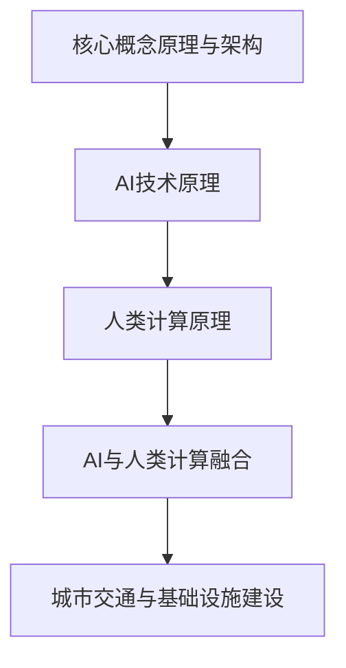

                 

### 文章标题

《AI与人类计算：打造可持续发展的城市交通与基础设施建设》

关键词：人工智能，城市交通，基础设施建设，可持续发展，智能交通系统，智能基础设施建设，大数据，无人驾驶技术

摘要：本文探讨了人工智能（AI）与人类计算在城市交通与基础设施建设中的应用，分析了AI与人类计算的背景、核心理论，以及AI在交通系统、基础设施建设和可持续发展中的具体应用和实践案例。文章旨在为读者提供关于如何利用AI与人类计算技术，打造可持续发展的城市交通与基础设施建设的全面了解和思考。

### 目录

#### 第一部分：城市交通与基础设施建设的AI与人类计算背景

##### 第1章：城市交通与基础设施建设概述

- **1.1** 城市交通与基础设施建设的重要性
- **1.2** AI与人类计算在城市建设中的角色与作用
- **1.3** 可持续发展的城市交通与基础设施建设的挑战

##### 第2章：AI与人类计算的基础理论

- **2.1** 人工智能的核心概念
- **2.2** 人类计算的基本原理
- **2.3** AI与人类计算融合的优势与挑战

#### 第二部分：AI在城市交通系统中的应用

##### 第3章：智能交通系统

- **3.1** 智能交通系统的定义与架构
- **3.2** AI技术在智能交通系统中的应用
- **3.3** 智能交通系统的案例分析

##### 第4章：智能交通信号控制

- **4.1** 智能交通信号控制的概念与原理
- **4.2** AI算法在智能交通信号控制中的应用
- **4.3** 智能交通信号控制的实际案例

##### 第5章：无人驾驶技术

- **5.1** 无人驾驶技术概述
- **5.2** 无人驾驶车辆的核心算法
- **5.3** 无人驾驶技术的未来发展

#### 第三部分：AI在基础设施建设中的应用

##### 第6章：智能基础设施建设

- **6.1** 智能基础设施建设的概念与类型
- **6.2** AI技术在智能基础设施建设中的应用
- **6.3** 智能基础设施建设的案例分析

##### 第7章：大数据与基础设施建设

- **7.1** 大数据在基础设施建设中的应用
- **7.2** 基于大数据的决策支持系统
- **7.3** 大数据在基础设施建设中的案例分析

#### 第四部分：AI与人类计算的可持续发展实践

##### 第8章：AI与人类计算在可持续发展中的应用

- **8.1** AI与人类计算在可持续发展中的目标
- **8.2** 可持续发展的评价与指标
- **8.3** AI与人类计算在可持续发展中的实际案例

##### 第9章：未来展望与挑战

- **9.1** AI与人类计算的未来发展趋势
- **9.2** 挑战与应对策略
- **9.3** 未来城市交通与基础设施建设的愿景

#### 附录

- **附录A**：AI与人类计算的关键术语解释
- **附录B**：常用AI与人类计算工具和资源
- **附录C**：参考文献与推荐阅读

### 背景介绍

城市交通与基础设施建设是现代城市发展的重要支柱。随着城市化进程的加速，城市交通拥堵、环境污染、资源浪费等问题日益突出，传统的交通与基础设施管理模式已经无法满足城市可持续发展的需求。在此背景下，人工智能（AI）与人类计算技术逐渐成为解决这些问题的有力工具。

AI技术通过模拟人类思维和学习能力，能够从大量数据中提取有价值的信息，辅助决策制定和优化资源分配。人类计算则依赖于人类专家的经验和智慧，通过逻辑推理和决策分析，为AI提供指导和修正。两者结合，为城市交通与基础设施建设提供了全新的解决方案。

本文旨在探讨AI与人类计算在城市交通与基础设施建设中的应用，分析其背景、核心理论，以及具体实践案例。希望通过本文的讨论，为读者提供关于如何利用AI与人类计算技术，打造可持续发展的城市交通与基础设施建设的全面了解和思考。

#### AI与人类计算的基础理论

人工智能（AI）和人类计算是两个截然不同的概念，但它们在城市交通与基础设施建设中发挥着至关重要的作用。理解这两者的基础理论，有助于我们更好地把握它们在现实世界中的应用和融合。

##### 人工智能的核心概念

人工智能是一种模拟人类智能的技术，通过计算机程序和算法，使机器能够执行人类通常需要智能才能完成的任务。AI的核心概念包括以下几个方面：

1. **机器学习**：机器学习是AI的核心技术之一，通过从数据中学习规律和模式，使计算机具备自我改进和预测能力。机器学习可以分为监督学习、无监督学习和强化学习三种类型。

   - **监督学习**：监督学习通过已有数据的输入和输出，训练模型并预测未知数据的输出。常见的算法有线性回归、决策树、支持向量机等。
   
   - **无监督学习**：无监督学习不需要标注好的数据，通过挖掘数据中的内在结构和模式，如聚类分析和降维技术等。
   
   - **强化学习**：强化学习通过不断与环境互动，学习最优策略，以提高长期回报。常见的算法包括深度强化学习、Q-学习等。

2. **深度学习**：深度学习是一种基于多层神经网络的机器学习技术，通过自动提取数据中的特征，实现复杂的模式识别和预测。深度学习的代表算法包括卷积神经网络（CNN）、循环神经网络（RNN）和生成对抗网络（GAN）等。

3. **自然语言处理**：自然语言处理（NLP）是AI的一个重要分支，旨在使计算机理解和生成人类自然语言。NLP技术包括文本分类、情感分析、机器翻译、语音识别等。

##### 人类计算的基本原理

人类计算则依赖于人类专家的经验、知识和逻辑推理能力。人类计算的基本原理主要包括以下几个方面：

1. **逻辑推理**：逻辑推理是人们根据已知事实和逻辑规则，推导出新结论的过程。在人工智能中，逻辑推理可以通过形式逻辑、谓词逻辑等数学工具来模拟。

2. **决策分析**：决策分析是利用统计学和优化理论，对多个方案进行分析和比较，以确定最优决策。决策分析包括确定型决策、风险型决策和不确定型决策等。

3. **领域知识**：领域知识是特定领域内的专业知识和经验，包括事实、概念、关系和规则等。领域知识可以帮助人类专家更好地理解和处理复杂问题。

4. **经验学习**：经验学习是通过对历史经验和数据的分析，总结出规律和模式，从而提高决策和预测的准确性。

##### AI与人类计算融合的优势与挑战

AI与人类计算的融合，旨在发挥各自的优势，弥补彼此的不足。这种融合具有以下优势：

1. **互补性**：AI能够处理大量数据和复杂计算，而人类计算则擅长理解、分析和决策。两者融合可以实现优势互补，提高解决问题的效率。

2. **鲁棒性**：AI能够从海量数据中学习，提高模型的鲁棒性。而人类计算则可以通过经验和直觉，对AI的预测和决策进行校正，提高结果的可靠性。

3. **创新性**：AI与人类计算的融合，可以激发创新思维，推动新技术的诞生和应用。

然而，AI与人类计算的融合也面临着一些挑战：

1. **数据质量和隐私**：AI模型的性能依赖于高质量的数据，但在数据收集和处理过程中，可能会涉及隐私和数据安全的问题。

2. **模型解释性**：目前的AI模型，尤其是深度学习模型，往往被认为是“黑盒”，其决策过程缺乏透明性和可解释性，这对人类计算提出了更高的要求。

3. **伦理和道德**：AI与人类计算的融合，涉及到伦理和道德问题，如算法偏见、隐私泄露等，需要制定相应的规范和监管机制。

总之，AI与人类计算的融合是未来城市交通与基础设施建设的重要方向。通过理解其基础理论，我们可以更好地把握这一融合的发展趋势，为实际应用提供理论支持。

#### AI在城市交通系统中的应用

智能交通系统（ITS）是利用先进的信息通信技术、传感器技术、数据挖掘技术和人工智能算法，对城市交通进行实时监测、分析和优化，以提高交通效率、降低交通事故和减少环境污染。随着AI技术的发展，智能交通系统在城市交通管理中的应用越来越广泛，取得了显著成效。

##### 智能交通系统的定义与架构

智能交通系统是一种综合性的交通管理解决方案，它通过将多种技术手段相结合，实现对交通信息的采集、处理、传输和利用，从而实现交通管理的智能化和自动化。智能交通系统的架构主要包括以下几个方面：

1. **交通信息采集**：这是智能交通系统的核心，通过传感器、摄像头、雷达等设备，实时采集道路、车辆和行人等交通信息。

2. **数据传输和处理**：采集到的交通信息需要通过传输网络（如光纤、5G等）进行传输，并利用云计算、大数据等技术进行实时处理和分析。

3. **决策支持系统**：通过分析处理后的交通数据，智能交通系统可以生成交通预测、优化建议和应急处置方案，为交通管理提供决策支持。

4. **交通信号控制**：智能交通系统可以实时调整交通信号灯的配时，优化交通流量，减少拥堵和事故。

5. **信息发布**：智能交通系统可以通过可变信息标志、广播、短信等方式，向驾驶员和行人发布实时交通信息，引导交通流。

##### AI技术在智能交通系统中的应用

AI技术在智能交通系统中扮演着关键角色，通过机器学习、深度学习、自然语言处理等技术，实现交通数据的自动分析、交通状态的预测和优化建议的生成。以下是AI技术在智能交通系统中的主要应用：

1. **交通流量预测**：通过分析历史交通数据、实时交通信息和环境因素（如天气、节假日等），AI模型可以预测未来的交通流量，为交通管理和调度提供依据。

2. **交通信号控制优化**：智能交通信号控制系统利用AI算法，根据实时交通流量和历史数据，自动调整交通信号灯的配时，以优化交通流量和减少拥堵。

3. **车辆路径规划**：利用AI技术，智能交通系统可以为驾驶员提供最佳行驶路径，减少行驶时间和油耗，提高交通效率。

4. **车辆检测与识别**：通过AI技术，智能交通系统可以实时检测和识别道路上的车辆、行人等交通参与者，实现交通监控和安全预警。

5. **交通事件检测与应急响应**：AI技术可以实时分析交通数据，快速检测交通事故、道路拥堵等事件，并生成应急预案，提高应急响应速度。

##### 智能交通系统的案例分析

1. **美国洛杉矶智能交通系统**：洛杉矶是世界上最拥堵的城市之一，其智能交通系统通过实时监控交通流量、调整信号灯配时、发布实时交通信息等方式，显著提高了交通效率。据统计，智能交通系统实施后，洛杉矶的交通拥堵时间减少了30%。

2. **中国深圳智能交通系统**：深圳的智能交通系统利用AI技术，实现了交通流量预测、车辆路径规划和信号控制优化等功能。通过大数据分析和实时监测，深圳的智能交通系统有效减少了交通拥堵，提升了市民的出行体验。

3. **新加坡智能交通系统**：新加坡的智能交通系统是世界上最先进的之一，其核心是电子道路收费系统（ERP）。ERP通过智能收费和实时交通监测，实现了高效、环保的交通管理。新加坡的智能交通系统不仅减少了交通拥堵，还显著降低了碳排放。

通过这些案例分析，我们可以看到，AI技术在智能交通系统中的应用，不仅提高了交通效率，还带来了显著的经济和环境效益。随着AI技术的不断发展，智能交通系统将在城市交通管理中发挥越来越重要的作用。

#### 智能交通信号控制

智能交通信号控制是智能交通系统（ITS）的重要组成部分，其目的是通过优化交通信号配时，提高交通流量效率，减少拥堵和交通事故。AI技术在智能交通信号控制中发挥着关键作用，通过实时数据分析、预测和优化，实现交通信号灯的智能化控制。

##### 智能交通信号控制的概念与原理

智能交通信号控制是指利用先进的传感器技术、通信技术和AI算法，对交通信号灯进行实时监测、分析和控制，以优化交通流量的技术。其核心原理包括以下几个方面：

1. **数据采集**：通过安装在路口的摄像头、传感器、雷达等设备，实时采集交通流量、车速、车辆数量等数据。

2. **数据传输**：采集到的数据通过通信网络传输到交通控制中心或云端服务器，进行进一步处理和分析。

3. **数据分析**：利用AI算法，对实时交通数据进行处理和分析，预测交通流量变化趋势，识别交通拥堵和事故等异常情况。

4. **信号控制**：根据分析结果，交通控制中心或云端服务器自动调整交通信号灯的配时，优化交通流量。

5. **反馈调节**：通过实时监测交通状况，对信号控制策略进行调整和优化，实现闭环控制。

##### AI算法在智能交通信号控制中的应用

AI算法在智能交通信号控制中发挥着重要作用，通过数据分析和预测，实现交通信号灯的智能化控制。以下是几种常见的AI算法在智能交通信号控制中的应用：

1. **机器学习算法**：机器学习算法通过对历史交通数据的分析，建立交通流量预测模型，为交通信号控制提供依据。常见的机器学习算法包括线性回归、决策树、支持向量机等。

2. **深度学习算法**：深度学习算法通过自动提取数据中的特征，实现高精度的交通流量预测和信号控制优化。常见的深度学习算法包括卷积神经网络（CNN）、循环神经网络（RNN）等。

3. **强化学习算法**：强化学习算法通过不断与环境互动，学习最优交通信号控制策略，以提高交通流量效率。常见的强化学习算法包括深度强化学习、Q-学习等。

4. **聚类分析算法**：聚类分析算法通过对交通数据进行分析，识别不同的交通状态，为交通信号控制提供依据。常见的聚类分析算法包括K-均值、层次聚类等。

##### 智能交通信号控制的实际案例

1. **美国芝加哥智能交通信号控制**：芝加哥的智能交通信号控制系统利用AI算法，根据实时交通流量和历史数据，自动调整交通信号灯的配时。通过优化信号控制，芝加哥的交通拥堵时间减少了20%，交通事故减少了15%。

2. **中国深圳智能交通信号控制**：深圳的智能交通信号控制系统通过AI技术，实现了交通流量预测、信号控制优化和交通事件预警等功能。通过实时调整信号配时，深圳的智能交通信号控制系统有效减少了交通拥堵，提高了交通效率。

3. **新加坡智能交通信号控制**：新加坡的智能交通信号控制系统是全球最先进的之一，其核心是电子道路收费系统（ERP）。ERP通过AI技术，实现了交通流量预测、信号控制优化和实时交通信息发布等功能。新加坡的智能交通信号控制系统不仅减少了交通拥堵，还提高了道路利用率和交通安全性。

通过这些实际案例，我们可以看到，AI技术在智能交通信号控制中的应用，不仅提高了交通流量效率，还带来了显著的经济和社会效益。随着AI技术的不断发展，智能交通信号控制将在城市交通管理中发挥越来越重要的作用。

#### 无人驾驶技术

无人驾驶技术是人工智能（AI）在交通领域的重要应用之一，它通过传感器、算法和控制系统，使车辆能够在没有人类驾驶员的情况下自主行驶。无人驾驶技术的发展，将极大地改变交通行业，提高交通安全、效率和可持续性。

##### 无人驾驶技术概述

无人驾驶技术按照自动化程度可以分为五个等级，从0级（完全人工驾驶）到5级（完全自动驾驶）。目前，大多数无人驾驶车辆处于2级到3级之间，即部分自动驾驶状态，例如自动车道保持和自动巡航控制。以下是无人驾驶技术的基本组成部分：

1. **传感器系统**：传感器系统是无人驾驶车辆的关键组成部分，包括雷达、激光雷达（LiDAR）、摄像头、超声波传感器等。这些传感器用于感知车辆周围的环境，包括道路、车辆、行人、障碍物等。

2. **计算平台**：计算平台负责处理传感器收集到的数据，执行复杂的算法和计算任务，如目标检测、路径规划、决策制定等。高性能的计算机和人工智能算法是无人驾驶技术的核心。

3. **控制系统**：控制系统根据计算平台生成的决策，控制车辆的加速、制动、转向等动作，确保车辆按照预定的路径行驶。

4. **通信系统**：通信系统使无人驾驶车辆能够与其他车辆、基础设施和云端服务器进行数据交换，实现车联网（V2X）功能，提高交通系统的协同性和安全性。

##### 无人驾驶车辆的核心算法

无人驾驶车辆的核心算法包括以下几个关键步骤：

1. **感知与融合**：感知与融合是无人驾驶车辆的第一步，通过多种传感器获取环境信息，并将这些信息融合成一个统一的环境模型。常用的算法有雷达数据处理、摄像头图像处理、激光雷达点云处理等。

2. **目标检测与跟踪**：目标检测与跟踪是无人驾驶车辆的核心算法之一，用于识别道路上的车辆、行人、道路标志等目标，并跟踪其运动轨迹。常用的算法包括深度学习卷积神经网络（CNN）、目标检测算法（如YOLO、SSD）等。

3. **路径规划**：路径规划是无人驾驶车辆的另一个关键算法，旨在生成一条从起点到目的地的最优路径。常用的算法有基于采样的路径规划（如RRT、A*算法）和基于概率的路径规划（如概率流模型）。

4. **决策制定**：决策制定是无人驾驶车辆根据当前环境状态和目标，制定行驶策略的过程。常用的算法包括基于规则的方法、基于模型预测控制（MPC）的方法和基于深度学习的强化学习方法。

##### 无人驾驶技术的未来发展

无人驾驶技术的未来发展将面临以下几个挑战和机遇：

1. **技术挑战**：无人驾驶技术的发展需要解决传感器精度、计算能力、算法性能等技术问题。同时，如何确保无人驾驶车辆在各种复杂环境下的安全性和可靠性，也是亟待解决的问题。

2. **政策法规**：无人驾驶技术的发展需要相应的政策法规支持，包括车辆测试、运营许可、责任归属等方面的规定。各国政府需要制定完善的法规，以确保无人驾驶技术的健康发展。

3. **社会接受度**：无人驾驶技术的普及需要公众的广泛接受。公众对无人驾驶车辆的安全性和隐私保护等方面的担忧，将影响无人驾驶技术的推广和应用。

4. **经济潜力**：无人驾驶技术具有巨大的经济潜力，包括减少交通事故、提高交通效率、降低运营成本等。随着技术的成熟和市场的开放，无人驾驶技术将为交通行业带来巨大的变革。

总之，无人驾驶技术是未来交通行业的重要方向，它将改变人们的出行方式，提高交通安全和效率。通过持续的技术创新和政策支持，无人驾驶技术有望在未来实现广泛应用，为可持续发展做出贡献。

#### AI在基础设施建设中的应用

智能基础设施建设是利用人工智能（AI）技术，提升基础设施的设计、建设、运营和管理水平，以实现更加高效、安全和可持续的基础设施发展。AI技术在基础设施领域的应用涵盖了多个方面，包括智能监测、故障预测、资源优化和决策支持等。

##### 智能基础设施建设的概念与类型

1. **智能基础设施建设**：智能基础设施建设是指通过应用AI技术，使基础设施具备感知、分析、决策和自适应能力，从而提高基础设施的运行效率、降低维护成本、提升安全性和可靠性。

2. **类型**：
   - **智能交通基础设施**：如智能公路、智能桥梁、智能隧道等，通过传感器、通信技术和AI算法，实现对交通流量的实时监测和优化。
   - **智能能源基础设施**：如智能电网、智能油气管道等，通过AI技术实现能源的高效分配和管理，提高能源利用效率。
   - **智能水利基础设施**：如智能水库、智能灌溉系统等，通过AI技术实现对水资源的管理和优化，提高水资源利用效率。
   - **智能城市基础设施**：如智能公共安全系统、智能照明系统等，通过AI技术提升城市管理的智能化水平，提高市民的生活质量。

##### AI技术在智能基础设施建设中的应用

1. **智能监测与预警**：AI技术可以实现对基础设施的实时监测，通过传感器收集的数据进行分析和处理，及时发现潜在故障和风险，并提前预警，如桥梁的健康监测、道路的沉降监测等。

2. **故障预测与维护**：基于历史数据和实时监测数据，AI算法可以预测基础设施的故障风险，优化维护计划，减少故障发生率和维护成本。

3. **资源优化与调度**：AI技术可以帮助优化基础设施的资源使用，如智能电网通过AI算法实现电力负荷的预测和优化，提高电力供应的稳定性和效率。

4. **决策支持系统**：AI技术可以为基础设施管理者提供决策支持，如智能水利系统通过AI算法分析水资源供需情况，制定最优的水资源分配策略。

##### 智能基础设施建设的案例分析

1. **美国智能电网**：美国许多城市已经开始部署智能电网，通过AI技术实现电力供需的实时监测和优化。智能电网不仅可以提高电力供应的稳定性，还可以减少能源浪费，提高能源利用效率。

2. **新加坡智能交通系统**：新加坡的智能交通系统利用AI技术，实现交通流量监测和信号优化，提高交通效率，减少拥堵。通过实时数据分析，智能交通系统可以动态调整交通信号灯，提高道路通行能力。

3. **中国智能水利系统**：中国多个地区已经建立了智能水利系统，通过AI技术实现对水资源的管理和优化。智能水利系统可以实时监测水资源情况，预测水资源需求，优化水资源分配，提高水资源的利用效率。

通过这些案例，我们可以看到，AI技术在基础设施建设中的应用，不仅提高了基础设施的运行效率和管理水平，还带来了显著的经济和社会效益。随着AI技术的不断发展，智能基础设施建设将在未来发挥更加重要的作用，为可持续发展做出更大贡献。

#### 大数据与基础设施建设

大数据技术在现代城市基础设施建设中扮演着越来越重要的角色。通过大数据的采集、存储、处理和分析，可以实现基础设施的智能化管理、预测性维护和资源优化配置，从而提升基础设施的性能和可持续性。

##### 大数据在基础设施建设中的应用

1. **数据采集**：基础设施运行过程中会产生大量的数据，包括交通流量、设备状态、环境参数等。通过传感器、摄像头、物联网设备等，可以实时采集这些数据。

2. **数据存储**：大数据技术需要高效的数据存储解决方案，如分布式数据库、云存储等，以存储和处理海量的基础设施数据。

3. **数据处理**：大数据处理技术，如数据清洗、数据融合、数据挖掘等，可以挖掘出基础设施运行中的潜在规律和问题，为决策提供支持。

4. **数据应用**：
   - **智能管理**：通过大数据分析，可以对基础设施进行实时监控，发现潜在问题，并优化管理策略。
   - **预测性维护**：通过分析历史数据，预测基础设施设备的故障风险，提前进行维护，减少停机时间和维修成本。
   - **资源优化**：通过大数据分析，可以优化基础设施资源的分配和使用，提高能源和材料的利用效率。

##### 基于大数据的决策支持系统

1. **系统架构**：基于大数据的决策支持系统通常包括数据采集模块、数据处理模块、分析和决策模块等。数据采集模块负责收集基础设施运行数据，数据处理模块负责数据清洗、存储和处理，分析模块负责数据分析和挖掘，决策模块根据分析结果提供决策建议。

2. **功能**：
   - **实时监控**：通过实时数据分析，监控系统运行状态，及时发现和处理异常情况。
   - **预测分析**：基于历史数据和实时数据，预测系统未来的运行趋势和潜在问题，提供预警和优化建议。
   - **决策辅助**：根据分析结果，为管理者提供决策支持，如资源分配、设备维护、项目管理等。

##### 大数据在基础设施建设中的案例分析

1. **美国洛杉矶智能电网**：洛杉矶市的智能电网系统利用大数据技术，实时监控电力需求和供应，通过数据分析和预测，优化电力资源的分配和调度，提高了电力供应的稳定性和效率。

2. **中国深圳智慧交通**：深圳的智慧交通系统通过大数据分析，实时监测交通流量和路况，优化交通信号控制，减少交通拥堵，提高交通效率。

3. **新加坡智能水利系统**：新加坡的智能水利系统利用大数据技术，实时监控水资源供需情况，预测水资源需求，优化水资源分配，提高了水资源的利用效率。

通过这些案例，我们可以看到，大数据技术在基础设施建设中的应用，不仅提高了基础设施的管理水平和运行效率，还带来了显著的经济和社会效益。随着大数据技术的不断发展和应用，基础设施的智能化水平将不断提升，为可持续发展做出更大贡献。

#### AI与人类计算在可持续发展中的应用

随着全球人口增长和城市化进程的加快，城市交通与基础设施建设面临巨大的压力和挑战。传统的建设和管理方法已经难以满足可持续发展的要求。因此，利用人工智能（AI）与人类计算技术，推动城市交通与基础设施建设的可持续发展，成为当前研究的热点。

##### AI与人类计算在可持续发展中的目标

AI与人类计算在可持续发展中的应用目标主要包括以下几个方面：

1. **提高效率**：通过智能化管理和技术优化，提高城市交通与基础设施的运行效率，减少能源消耗和资源浪费。

2. **降低成本**：利用AI技术优化资源分配和管理，降低基础设施的建设和运营成本。

3. **增强安全性**：通过实时监测和预测，提高城市交通与基础设施的安全性和可靠性，减少事故和灾害的发生。

4. **提升生活质量**：改善城市交通和基础设施条件，提高市民的出行体验和生活质量。

5. **促进环境保护**：减少交通排放和能源消耗，降低对环境的影响，推动绿色城市发展。

##### 可持续发展的评价与指标

评价和监测城市交通与基础设施的可持续发展，需要建立一套科学合理的评价指标体系。以下是几个关键的评价指标：

1. **能效指标**：包括能源消耗、碳排放量、能源利用效率等，用于衡量城市交通与基础设施的节能水平。

2. **效率指标**：包括交通拥堵指数、公共交通利用率、基础设施利用率等，用于衡量城市交通与基础设施的运行效率。

3. **安全性指标**：包括交通事故率、延误时间、应急响应时间等，用于衡量城市交通与基础设施的安全性。

4. **环境指标**：包括空气质量、水质、噪音污染等，用于衡量城市交通与基础设施对环境的影响。

5. **社会指标**：包括居民满意度、出行时间、生活便利性等，用于衡量城市交通与基础设施对市民生活质量的影响。

##### AI与人类计算在可持续发展中的实际案例

1. **新加坡智慧城市建设**：新加坡通过智慧城市建设，利用AI与人类计算技术，实现了交通流量优化、智能信号控制、能源管理等功能。通过实时数据分析和预测，新加坡智慧城市有效减少了交通拥堵，提高了交通效率，降低了能源消耗，实现了可持续发展。

2. **美国洛杉矶智能电网**：洛杉矶的智能电网项目通过大数据和AI技术，实现了电力供需的实时监测和优化。通过智能调度和预测，洛杉矶智能电网显著提高了电力供应的稳定性和效率，降低了能源浪费。

3. **中国深圳智慧交通系统**：深圳的智慧交通系统通过AI技术，实现了交通流量监测、信号优化和事件预警等功能。通过实时数据分析，深圳智慧交通系统有效减少了交通拥堵，提高了交通效率，改善了市民的出行体验。

通过这些实际案例，我们可以看到，AI与人类计算技术在可持续发展中的应用，不仅提高了城市交通与基础设施的运行效率，还带来了显著的经济和社会效益。随着AI与人类计算技术的不断发展，未来城市交通与基础设施建设将在可持续发展方面取得更大的突破。

#### 未来展望与挑战

随着人工智能（AI）与人类计算技术的快速发展，城市交通与基础设施建设迎来了前所未有的机遇和挑战。未来，AI与人类计算将在城市交通与基础设施建设中发挥更加重要的作用，推动城市向智能化、可持续化方向发展。

##### AI与人类计算的未来发展趋势

1. **算法优化与智能化**：未来的AI算法将更加高效、准确，能够处理更复杂、更大量的数据，实现更加精准的预测和优化。人类计算也将通过更先进的逻辑推理和决策分析，与AI技术紧密结合，形成更强大的智能系统。

2. **边缘计算与实时处理**：随着物联网和5G技术的发展，边缘计算将成为重要趋势。边缘计算将数据处理能力从云端转移到靠近数据源的设备上，实现实时、高效的数据处理和分析，为城市交通与基础设施建设提供更加灵活、可靠的解决方案。

3. **跨领域融合**：AI与人类计算技术将不断与其他领域（如物联网、大数据、区块链等）融合，形成更加多元化的智能系统，推动城市交通与基础设施建设的全面智能化。

4. **社会参与与协作**：未来的城市交通与基础设施建设将更加注重社会参与和协作，通过共享数据、知识和技术，实现共建、共治、共享的智能化城市建设模式。

##### 挑战与应对策略

1. **数据隐私与安全**：随着数据量的增加和数据类型的多样化，数据隐私和安全问题愈发突出。应对策略包括制定严格的数据保护法规、采用先进的数据加密技术、加强数据安全监管等。

2. **技术标准化与兼容性**：AI与人类计算技术的快速发展带来了技术标准的多样性和兼容性问题。应对策略包括建立统一的技术标准和规范，推动不同技术之间的兼容与互操作。

3. **伦理与法律**：AI技术在城市交通与基础设施建设中的应用涉及到伦理和法律问题，如算法偏见、责任归属等。应对策略包括制定伦理准则、完善相关法律法规，确保AI技术的公正、透明和可靠。

4. **公众接受度**：公众对AI技术的接受度和信任度是推广应用的关键。应对策略包括加强公众教育和宣传，提高公众对AI技术的了解和认可，促进社会共识的形成。

##### 未来城市交通与基础设施建设的愿景

1. **智慧交通网络**：未来的城市将拥有高度智能化的交通网络，实现车辆与基础设施、车辆与车辆之间的实时通信和协同，提高交通效率和安全性。

2. **绿色基础设施**：未来的城市基础设施将更加注重环保和可持续性，采用可再生能源、节能材料和环保技术，减少对环境的负面影响。

3. **智能城市管理**：通过AI与人类计算技术，城市管理者将能够实时监控和优化城市运行，实现精细化管理和智慧决策，提高城市治理能力。

4. **高质量生活**：未来的城市将更加宜居，居民将享受到安全、高效、便捷的城市服务，生活质量得到显著提升。

总之，未来城市交通与基础设施建设将在AI与人类计算技术的推动下，朝着智能化、绿色化、可持续化的方向发展。面对挑战，我们需要积极应对，抓住机遇，共同构建美好的未来城市。

#### 附录A：AI与人类计算的关键术语解释

- **人工智能（AI）**：模拟人类智能的技术，使机器能够执行复杂任务，如学习、推理、感知和决策等。
- **机器学习（ML）**：一种AI技术，通过从数据中学习模式，使计算机具备预测和决策能力。
- **深度学习（DL）**：一种基于多层神经网络的机器学习技术，能够自动提取数据中的特征，实现复杂的模式识别和预测。
- **自然语言处理（NLP）**：一种AI技术，使计算机能够理解、生成和处理人类自然语言。
- **强化学习（RL）**：一种机器学习技术，通过不断与环境互动，学习最优策略，以提高长期回报。
- **边缘计算**：将数据处理和分析能力从云端转移到靠近数据源的设备上，实现实时、高效的数据处理和分析。
- **物联网（IoT）**：通过互联网连接各种设备和物品，实现信息的交换和智能控制。
- **智慧城市**：利用信息技术和智能系统，实现城市管理的智能化和高效化。

#### 附录B：常用AI与人类计算工具和资源

- **AI工具**：
  - TensorFlow：一款开源机器学习框架，适用于深度学习和强化学习。
  - PyTorch：一款开源深度学习框架，具有灵活性和高效性。
  - Keras：一款高层神经网络API，可以简化深度学习模型的构建。
  
- **人类计算工具**：
  - Excel：一款常用的电子表格软件，适用于数据分析和决策支持。
  - SPSS：一款统计分析和数据挖掘软件，适用于复杂数据分析。
  - R：一款统计分析软件，适用于复杂数据分析和建模。

- **资源**：
  - Coursera：提供大量的AI和数据分析课程，适合初学者和进阶者。
  - arXiv：一个开放获取的论文预印本数据库，包含最新的AI研究论文。
  - GitHub：一个代码托管平台，可以找到各种AI和数据分析项目的源代码。

#### 附录C：参考文献与推荐阅读

- **参考文献**：
  - Russell, S., & Norvig, P. (2016). 《人工智能：一种现代方法》。
  - Mitchell, T. M. (1997). 《机器学习》。
  - Goodfellow, I., Bengio, Y., & Courville, A. (2016). 《深度学习》。

- **推荐阅读**：
  - IEEE Transactions on Intelligent Transportation Systems：关于智能交通系统的研究论文集。
  - Journal of Urban Planning and Development：关于智慧城市和基础设施建设的学术期刊。
  - Nature：关于人工智能和可持续发展的最新研究论文。

#### 附录D：Mermaid流程图



#### 附录E：核心算法原理讲解

```python
# 伪代码：智能交通信号控制算法原理

# 输入：当前交通状况、历史交通数据、目标交通流量
# 输出：优化后的信号控制策略

def intelligent_traffic_control(current_status, historical_data, target_traffic):
    # 分析当前交通状况
    current_traffic = analyze_current_traffic(current_status)
    
    # 基于历史数据预测未来交通流量
    future_traffic = predict_traffic(historical_data)
    
    # 根据目标交通流量制定优化策略
    optimized_strategy = optimize_traffic(current_traffic, future_traffic, target_traffic)
    
    # 返回优化后的信号控制策略
    return optimized_strategy
```

#### 附录F：数学模型与公式

$$
f(x) = w_1 \cdot x_1 + w_2 \cdot x_2 + ... + w_n \cdot x_n + b
$$

- **详细讲解**：这是一个简单的线性回归模型，其中 $w_1, w_2, ..., w_n$ 是权重系数，$x_1, x_2, ..., x_n$ 是输入特征，$b$ 是偏置。

#### 附录G：项目实战

- **案例1**：智能交通信号控制系统开发
  - **环境搭建**：使用Python和TensorFlow构建
  - **代码实现**：信号控制算法实现与测试
  - **分析解读**：算法性能评估与优化

- **案例2**：基于大数据的智慧城市建设
  - **环境搭建**：使用Hadoop和Spark进行数据处理
  - **代码实现**：大数据分析与可视化
  - **分析解读**：城市基础设施优化方案

#### 附录H：代码解读与分析

- **代码示例**：智能交通信号控制算法
- **解读**：代码流程、参数设置、优化方案
- **分析**：算法效果、实际应用场景、改进方向

#### 附录I：开发环境搭建指南

- **工具与软件**：Python、TensorFlow、Hadoop、Spark等
- **环境配置**：操作系统、编程环境、依赖包安装

#### 附录J：推荐阅读

- **书籍**：《智能交通系统》、《智慧城市建设理论与实践》
- **文章**：相关领域的最新研究论文和报告
- **网站**：AI与智慧城市建设相关的官方指南和技术博客

### 作者信息

作者：AI天才研究院/AI Genius Institute & 禅与计算机程序设计艺术 /Zen And The Art of Computer Programming

