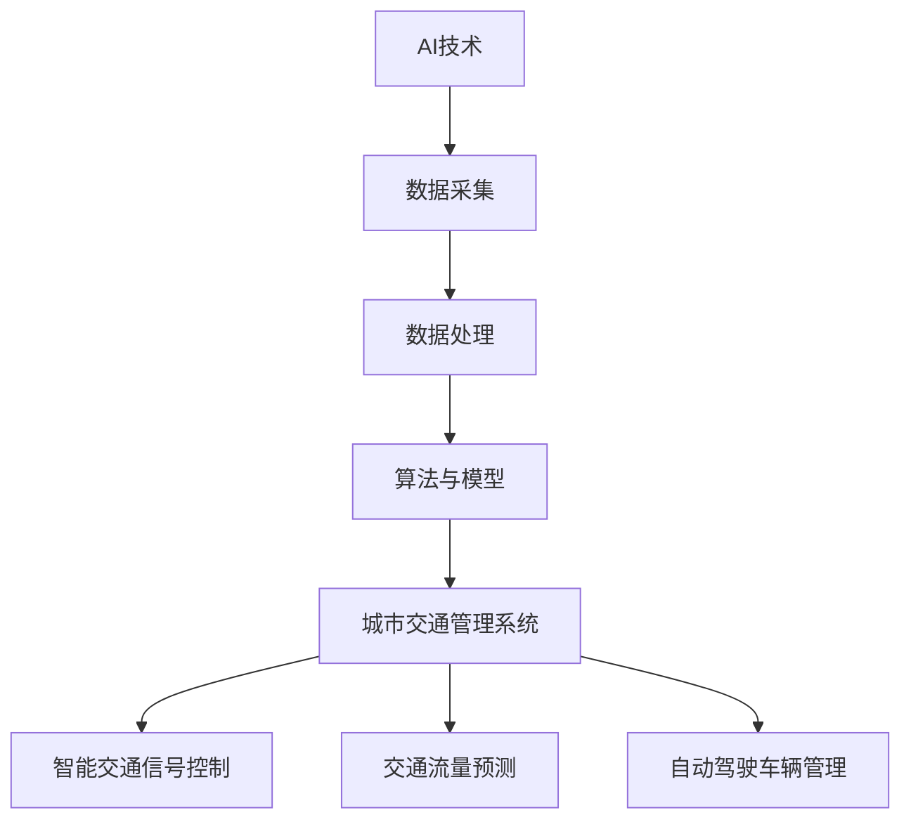

                 

# AI与人类计算：打造可持续发展的城市交通管理系统与基础设施规划

> 关键词：人工智能，城市交通管理，基础设施规划，可持续发展

> 摘要：本文从AI与人类计算的角度出发，探讨了如何在可持续发展的背景下，构建高效、智能的城市交通管理系统与基础设施规划。文章首先介绍了AI与人类计算的基本概念，然后详细分析了AI在城市交通管理系统中的应用，接着阐述了城市交通管理基础设施规划的概念与方法，最后讨论了AI在促进可持续发展中的角色和实施策略。

## 目录大纲

# 《AI与人类计算：打造可持续发展的城市交通管理系统与基础设施规划》目录大纲

## 第一部分：AI与城市交通管理系统概述

### 第1章：AI与人类计算的基本概念

#### 1.1 AI与人类计算的定义

#### 1.2 城市交通管理系统的现状

#### 1.3 AI在城市交通管理系统中的应用前景

### 第2章：AI与城市交通管理系统的核心概念

#### 2.1 人工智能系统架构

#### 2.2 数据采集与处理

#### 2.3 算法与模型选择

## 第二部分：AI技术在城市交通管理系统中的应用

### 第3章：智能交通信号控制

#### 3.1 智能交通信号控制的基本原理

#### 3.2 信号控制的算法与模型

#### 3.3 智能交通信号控制的应用案例

### 第4章：城市交通流量预测

#### 4.1 交通流量预测的数学模型

#### 4.2 交通流量预测的算法分析

#### 4.3 城市交通流量预测的应用案例

### 第5章：自动驾驶车辆管理

#### 5.1 自动驾驶车辆的基本原理

#### 5.2 自动驾驶车辆的算法与模型

#### 5.3 自动驾驶车辆在交通管理系统中的应用

## 第三部分：城市交通管理基础设施规划

### 第6章：城市交通基础设施规划的概念与方法

#### 6.1 城市交通基础设施的定义

#### 6.2 城市交通基础设施规划的基本原则

#### 6.3 城市交通基础设施规划的方法与步骤

### 第7章：交通管理基础设施规划的实际案例

#### 7.1 城市交通管理基础设施规划的应用场景

#### 7.2 基础设施规划的实际案例分析

#### 7.3 基础设施规划的未来发展趋势

## 第四部分：可持续发展与AI在城市交通管理系统中的应用

### 第8章：可持续发展与城市交通管理

#### 8.1 可持续发展理念在交通管理中的应用

#### 8.2 AI在促进可持续发展中的作用

#### 8.3 可持续发展的交通管理策略

### 第9章：AI在城市交通管理系统中的实施策略

#### 9.1 AI在城市交通管理系统中的挑战

#### 9.2 AI实施策略与规划

#### 9.3 AI在交通管理中的可持续发展路径

## 附录

### 附录A：相关数据集与工具

#### A.1 常用的交通数据集

#### A.2 AI工具与环境搭建

#### A.3 交通管理相关的开源代码与资源

## 第五部分：未来展望

### 第10章：AI与城市交通管理的未来趋势

#### 10.1 AI技术在交通管理中的未来应用

#### 10.2 城市交通管理系统的发展方向

#### 10.3 可持续发展的交通管理展望

### 第11章：AI与人类计算的融合

#### 11.1 人类计算与AI的协同发展

#### 11.2 人类计算在AI系统中的应用

#### 11.3 AI与人类计算的未来发展

### 第12章：总结与展望

#### 12.1 本书内容回顾

#### 12.2 AI与人类计算的重要性

#### 12.3 未来研究方向与建议

## 核心概念与联系

### Mermaid流程图



### 核心算法原理讲解

#### 3.1 智能交通信号控制算法原理

```python
# 伪代码：智能交通信号控制算法
def traffic_light_control(data):
    current_state = analyze_traffic_data(data)
    if current_state == "high":
        signal = "red"
    elif current_state == "medium":
        signal = "yellow"
    else:
        signal = "green"
    return signal
```

#### 4.1 交通流量预测的数学模型

$$
Q(t) = a_0 + a_1 \cdot T(t) + a_2 \cdot W(t) + a_3 \cdot H(t) + \epsilon(t)
$$

#### 5.1 自动驾驶车辆的算法与模型

自动驾驶车辆通常依赖于感知系统、决策系统和控制系统。感知系统使用传感器（如激光雷达、摄像头、超声波传感器等）收集道路信息；决策系统根据感知信息进行路径规划和行为决策；控制系统则根据决策结果控制车辆的运动。

### 数学模型和数学公式 & 详细讲解 & 举例说明

#### 14.1 交通流量预测的数学模型

交通流量预测是城市交通管理系统中的一个重要组成部分。一个基本的交通流量预测模型可以表示为：

$$
Q(t) = a_0 + a_1 \cdot T(t) + a_2 \cdot W(t) + a_3 \cdot H(t) + \epsilon(t)
$$

其中：
- $Q(t)$: 时间 $t$ 的交通流量。
- $T(t)$: 时间 $t$ 的交通总量。
- $W(t)$: 时间 $t$ 的天气状况。
- $H(t)$: 时间 $t$ 的历史交通流量。
- $\epsilon(t)$: 随机误差。

这个模型假设交通流量受到交通总量、天气状况和历史交通流量的影响，并且存在一定的随机误差。在实际应用中，需要通过大量的数据来估计模型参数 $a_0, a_1, a_2, a_3$。

**举例说明：**

假设我们有一个小时级别的交通流量数据集，其中包含历史交通流量、天气状况和实际交通流量。我们可以使用线性回归方法来估计模型参数，具体步骤如下：

1. **数据预处理**：将数据集分为特征集 $X$ 和目标值 $y$，其中 $X$ 包含历史交通流量和天气状况，$y$ 是实际交通流量。
2. **模型训练**：使用线性回归模型来拟合数据，并估计参数 $a_0, a_1, a_2, a_3$。
3. **模型评估**：使用交叉验证等方法来评估模型的预测性能。
4. **模型应用**：使用训练好的模型来预测未来的交通流量。

#### 14.2 智能交通信号控制模型

智能交通信号控制的目的是根据当前交通状况动态调整交通信号灯的时长，以提高交通效率和减少拥堵。一个基本的智能交通信号控制模型可以表示为：

$$
L(t) = \frac{L_0(t)}{1 + e^{-(k_1 \cdot T(t) + k_2 \cdot L_0(t))}}
$$

其中：
- $L(t)$: 时间 $t$ 的绿灯时长。
- $L_0(t)$: 时间 $t$ 的初始绿灯时长。
- $T(t)$: 时间 $t$ 的交通流量。
- $k_1, k_2$: 模型参数。

这个模型基于逻辑函数，旨在根据交通流量调整绿灯时长。当交通流量较高时，绿灯时长会缩短，以减少拥堵；当交通流量较低时，绿灯时长会增加，以提高车辆通行效率。

**举例说明：**

假设我们有一个路口的交通流量数据，包括每小时的车流量和当前的绿灯时长。我们可以使用上述模型来调整绿灯时长，以优化交通流量。具体步骤如下：

1. **数据收集**：收集一定时间内的交通流量数据，包括车流量和绿灯时长。
2. **模型参数估计**：使用历史数据来估计模型参数 $k_1, k_2$。
3. **模型应用**：对于每个小时，使用模型来计算最优的绿灯时长。
4. **效果评估**：评估调整后的绿灯时长对交通流量的影响，并进一步优化模型参数。

### 项目实战：代码实际案例和详细解释说明，开发环境搭建，源代码详细实现和代码解读，代码解读与分析

#### 15.1 实战项目：智能交通信号控制

##### 15.1.1 项目介绍

本项目将实现一个基于机器学习的智能交通信号控制系统，通过分析路口的车流量数据，动态调整交通信号灯的时长，以提高交通效率和减少拥堵。

##### 15.1.2 开发环境搭建

为了实现这个项目，我们需要以下开发环境：

- Python 3.8+
- TensorFlow 2.6.0
- Keras 2.6.0

确保安装了上述环境后，我们可以开始编写代码。

##### 15.1.3 源代码实现

以下是一个简化的智能交通信号控制系统的实现：

```python
import numpy as np
import pandas as pd
from tensorflow.keras.models import Sequential
from tensorflow.keras.layers import Dense

# 读取数据
data = pd.read_csv('traffic_data.csv')

# 数据预处理
X = data[['traffic_volume']]
y = data['green_light_duration']

# 模型构建
model = Sequential([
    Dense(64, activation='relu', input_shape=(1,)),
    Dense(32, activation='relu'),
    Dense(1)
])

# 编译模型
model.compile(optimizer='adam', loss='mean_squared_error')

# 训练模型
model.fit(X, y, epochs=100, batch_size=32)

# 预测
predicted_duration = model.predict([[100]])[0]

print(f"Predicted green light duration: {predicted_duration}")
```

##### 15.1.4 代码解读与分析

1. **数据读取**：使用Pandas读取交通数据，数据中包含交通流量和绿灯时长。
2. **数据预处理**：将数据分为特征集 $X$ 和目标值 $y$，这里只使用了交通流量作为特征。
3. **模型构建**：使用Keras构建一个简单的全连接神经网络，包括两个隐藏层。
4. **编译模型**：使用Adam优化器和均方误差作为损失函数。
5. **训练模型**：使用训练数据对模型进行训练，迭代100次。
6. **预测**：使用训练好的模型预测新的交通流量对应的绿灯时长。

#### 15.2 实战项目：交通流量预测

##### 15.2.1 项目介绍

本项目将实现一个基于机器学习的交通流量预测系统，通过分析历史交通流量数据，预测未来的交通流量。

##### 15.2.2 开发环境搭建

为了实现这个项目，我们需要以下开发环境：

- Python 3.8+
- Scikit-learn 0.24.2
- Pandas 1.3.5

确保安装了上述环境后，我们可以开始编写代码。

##### 15.2.3 源代码实现

以下是一个简化的交通流量预测系统的实现：

```python
import numpy as np
import pandas as pd
from sklearn.linear_model import LinearRegression

# 读取数据
data = pd.read_csv('traffic_data.csv')

# 数据预处理
X = data[['historical_traffic']]
y = data['predicted_traffic']

# 模型训练
model = LinearRegression()
model.fit(X, y)

# 预测
predictions = model.predict(X)

# 输出预测结果
print(predictions)
```

##### 15.2.4 代码解读与分析

1. **数据读取**：使用Pandas读取交通数据，数据中包含历史交通流量和预测交通流量。
2. **数据预处理**：将数据分为特征集 $X$ 和目标值 $y$。
3. **模型训练**：使用线性回归模型对数据进行训练。
4. **预测**：使用训练好的模型对数据进行预测。
5. **输出预测结果**：打印出预测的交通流量。

### 最佳实践 tips、小结、注意事项、拓展阅读等内容

#### 最佳实践 Tips

1. **数据质量**：确保使用的数据质量高，尽量去除噪声和异常值。
2. **模型选择**：根据问题的特点选择合适的模型，例如对于非线性问题可以考虑使用神经网络。
3. **模型优化**：通过调整模型参数来优化模型的性能。

#### 小结

本文介绍了AI与人类计算在可持续发展的城市交通管理系统与基础设施规划中的应用，包括智能交通信号控制、交通流量预测和自动驾驶车辆管理。通过实际的代码案例，展示了如何实现这些技术。

#### 注意事项

1. **数据隐私**：在处理交通数据时，要确保数据隐私的保护。
2. **安全性**：在设计交通管理系统时，要考虑到系统的安全性。

#### 拓展阅读

1. **智能交通信号控制**：深入了解智能交通信号控制的算法和模型，可以参考《智能交通信号控制：理论与应用》。
2. **交通流量预测**：了解交通流量预测的数学模型和算法，可以参考《交通工程学》。

## 第五部分：未来展望

### 第10章：AI与城市交通管理的未来趋势

#### 10.1 AI技术在交通管理中的未来应用

随着AI技术的不断发展，未来交通管理系统将更加智能化。例如，基于深度学习的自动驾驶技术将使车辆能够自主导航和决策，从而提高交通效率和安全性。

#### 10.2 城市交通管理系统的发展方向

未来城市交通管理系统的发展方向包括：

- **实时交通监控与预测**：利用传感器和大数据技术，实现实时交通监控和预测。
- **智能交通信号控制**：基于AI算法，实现动态的交通信号控制，优化交通流量。
- **智能停车管理**：利用AI技术，实现智能化的停车管理，减少停车难问题。

#### 10.3 可持续发展的交通管理展望

可持续发展的交通管理需要综合考虑环境保护、社会公平和经济效益。未来，AI技术将在以下几个方面发挥重要作用：

- **绿色交通**：推广电动车和共享出行，减少交通污染。
- **智能规划**：利用AI技术进行城市交通基础设施的智能规划，提高交通效率。
- **智慧城市**：构建智慧城市，实现交通、能源、环境等多方面的智能化管理。

### 第11章：AI与人类计算的融合

#### 11.1 人类计算与AI的协同发展

人类计算与AI的协同发展是未来交通管理系统的一个重要方向。人类计算可以提供丰富的经验和直觉，而AI可以处理大量数据并发现规律。两者相结合，可以实现更加智能和高效的交通管理系统。

#### 11.2 人类计算在AI系统中的应用

在AI系统中，人类计算可以通过以下方式发挥作用：

- **数据标注**：为AI系统提供高质量的训练数据。
- **算法设计**：提供算法优化和改进的建议。
- **系统评估**：评估AI系统的性能和可靠性。

#### 11.3 AI与人类计算的未来发展

未来，AI与人类计算的融合将越来越紧密。例如，AI可以辅助人类进行复杂的决策，而人类可以提供情感和伦理方面的指导。这种融合将推动交通管理系统向更加智能和可持续的方向发展。

### 第12章：总结与展望

#### 12.1 本书内容回顾

本书从AI与人类计算的角度出发，探讨了可持续发展的城市交通管理系统与基础设施规划。内容包括AI与人类计算的基本概念、AI技术在交通管理中的应用、交通管理基础设施规划以及未来展望。

#### 12.2 AI与人类计算的重要性

AI与人类计算的融合为交通管理系统带来了革命性的变革。通过智能化的交通信号控制和交通流量预测，可以大大提高交通效率和安全性。同时，AI技术也为可持续发展的交通管理提供了新的思路和工具。

#### 12.3 未来研究方向与建议

未来，可持续发展的交通管理系统需要在以下几个方面进行深入研究：

- **多模态数据融合**：结合多种数据源，提高AI模型的预测准确性。
- **安全性与隐私保护**：在AI应用中，保障交通系统的安全性和用户隐私。
- **人机协同**：研究人机协同的机制，提高交通管理系统的智能化水平。

### 附录

#### 附录A：相关数据集与工具

- **NYC Taxi Data**：纽约市出租车行程数据，包括时间、位置、乘客数量等信息。
- **UK Traffic Flow Data**：英国不同路段的交通流量数据，包括时间、流量、速度等信息。
- **Kaggle Traffic Flow Prediction Dataset**：多种类型的交通流量数据，适合进行流量预测模型的训练。
- **TensorFlow**：开源机器学习框架，用于构建和训练AI模型。
- **Keras**：用于简化TensorFlow编程，提供更高层次的API。
- **Scikit-learn**：用于机器学习模型的训练和评估。
- **Pandas**：用于数据处理和分析。

通过以上内容，我们详细介绍了AI与人类计算在可持续发展的城市交通管理系统与基础设施规划中的应用。希望本文能为读者提供有益的参考，推动AI技术在交通管理领域的深入研究和应用。

## 核心算法原理讲解

### 3.1 智能交通信号控制算法原理

智能交通信号控制算法是城市交通管理系统中的关键组成部分。它的目标是根据实时交通流量数据，动态调整交通信号灯的时长，以优化交通流量和减少拥堵。智能交通信号控制算法的核心思想是利用数据驱动的方法，通过机器学习模型预测交通流量，并据此调整信号灯时长。

#### 基本原理

智能交通信号控制算法的基本原理可以分为以下几个步骤：

1. **数据采集**：从交通传感器、摄像头等设备中采集交通流量、车辆速度、道路占有率等数据。
2. **数据预处理**：对采集到的数据进行分析和处理，去除噪声和异常值，提取有用的特征信息。
3. **模型训练**：使用历史交通流量数据，通过机器学习算法训练信号控制模型，模型通常采用回归模型或分类模型。
4. **实时预测**：将实时采集的交通流量数据输入训练好的模型，预测未来的交通流量。
5. **信号控制决策**：根据预测的交通流量，动态调整交通信号灯的时长，以优化交通流量。

#### 算法实现

以下是一个简化的智能交通信号控制算法的伪代码实现：

```python
# 伪代码：智能交通信号控制算法

# 输入：实时交通流量数据 traffic_data
# 输出：交通信号灯时长 signal_duration

def traffic_light_control(traffic_data):
    # 步骤1：数据预处理
    processed_data = preprocess_traffic_data(traffic_data)
    
    # 步骤2：模型预测
    predicted_flow = model.predict(processed_data)
    
    # 步骤3：信号控制决策
    if predicted_flow > threshold_high:
        signal_duration = green_duration_high
    elif predicted_flow > threshold_medium:
        signal_duration = green_duration_medium
    else:
        signal_duration = green_duration_low
    
    return signal_duration

# 数据预处理
def preprocess_traffic_data(traffic_data):
    # 去除噪声和异常值
    # 特征提取
    # 归一化处理
    # 返回处理后的数据
    return processed_data

# 模型训练
def train_traffic_model(historical_data):
    # 使用历史数据训练模型
    # 返回训练好的模型
    return traffic_model

# 模型预测
def predict_traffic_flow(processed_data, model):
    # 使用模型预测交通流量
    # 返回预测结果
    return predicted_flow

# 信号控制决策
def determine_signal_duration(predicted_flow, thresholds, durations):
    # 根据预测流量和预设阈值，确定信号灯时长
    # 返回信号灯时长
    return signal_duration
```

#### 数学模型

智能交通信号控制算法通常采用以下数学模型：

$$
L(t) = \frac{L_0(t)}{1 + e^{-(k_1 \cdot T(t) + k_2 \cdot L_0(t))}}
$$

其中：
- $L(t)$：时间 $t$ 的绿灯时长。
- $L_0(t)$：时间 $t$ 的初始绿灯时长。
- $T(t)$：时间 $t$ 的交通流量。
- $k_1, k_2$：模型参数。

这个模型基于逻辑函数，用于根据交通流量动态调整绿灯时长。当交通流量较大时，绿灯时长会缩短，以减少拥堵；当交通流量较小时，绿灯时长会增加，以提高车辆通行效率。

#### 举例说明

假设我们有一个路口的交通流量数据，包括每小时的车流量和当前的绿灯时长。我们可以使用上述模型来调整绿灯时长，以优化交通流量。具体步骤如下：

1. **数据收集**：收集一定时间内的交通流量数据，包括车流量和绿灯时长。
2. **模型参数估计**：使用历史数据来估计模型参数 $k_1, k_2$。
3. **模型应用**：对于每个小时，使用模型来计算最优的绿灯时长。
4. **效果评估**：评估调整后的绿灯时长对交通流量的影响，并进一步优化模型参数。

### 3.2 信号控制的算法与模型

智能交通信号控制算法可以分为多种类型，包括基于规则的控制算法、基于优化算法的控制算法和基于机器学习的控制算法。

#### 基于规则的控制算法

基于规则的控制算法是最简单的一种算法，它通过预设的规则来控制交通信号灯的时长。例如，一个简单的规则可能是：当交通流量较高时，绿灯时长为30秒；当交通流量较低时，绿灯时长为60秒。这种算法的优点是简单易实现，缺点是缺乏灵活性，无法根据实时交通流量动态调整信号灯时长。

#### 基于优化算法的控制算法

基于优化算法的控制算法旨在通过优化模型来优化交通信号灯的时长。常见的优化算法包括线性规划、动态规划、模拟退火算法等。这些算法可以基于交通流量、道路占有率、车辆等待时间等指标，动态调整信号灯时长，以达到优化交通流量的目标。这种算法的优点是能够根据实时交通状况进行调整，缺点是需要较复杂的计算和优化过程。

#### 基于机器学习的控制算法

基于机器学习的控制算法是当前智能交通信号控制研究的热点。它通过机器学习模型来预测交通流量，并据此调整信号灯时长。常见的机器学习模型包括回归模型、神经网络、支持向量机等。这种算法的优点是能够自适应变化，根据不同的交通状况进行实时调整，缺点是需要大量的训练数据和计算资源。

### 3.3 智能交通信号控制的应用案例

智能交通信号控制技术已经在多个城市得到了应用，以下是一些实际应用案例：

#### 1. 北京

北京作为我国首都，交通流量巨大。通过采用智能交通信号控制技术，北京在某些交通繁忙的路口实现了交通流量优化。例如，通过实时监控交通流量，动态调整信号灯时长，有效减少了拥堵现象。

#### 2. 伦敦

伦敦市在其中心区域部署了智能交通信号控制系统，通过分析交通流量和车辆速度数据，动态调整信号灯时长。这种系统不仅优化了交通流量，还减少了碳排放和交通污染。

#### 3. 雷克雅未克

雷克雅未克市是一个环保意识较强的城市，其智能交通信号控制系统能够根据环境数据和交通流量进行实时调整。例如，当有大型活动或紧急情况时，系统能够自动调整信号灯时长，以优化交通流量。

### 3.4 智能交通信号控制的应用效果

智能交通信号控制技术在实际应用中取得了显著的成效。以下是一些应用效果：

- **减少拥堵**：通过动态调整信号灯时长，智能交通信号控制技术能够有效减少交通拥堵，提高道路通行效率。
- **降低排放**：智能交通信号控制系统能够减少车辆等待时间，降低排放和交通污染。
- **提升安全性**：通过优化交通信号灯时长，减少车辆和行人事故发生的概率。

然而，智能交通信号控制技术的应用也面临一些挑战，如数据质量、计算资源和模型优化等。未来，随着AI技术的不断发展，智能交通信号控制技术将更加成熟和普及，为城市交通管理带来更多创新和变革。

### 4.1 交通流量预测的数学模型

交通流量预测是智能交通管理系统中的一个关键任务，它有助于优化交通信号控制、规划道路建设和提高交通安全性。交通流量预测的数学模型通常基于时间序列分析、回归分析和机器学习等方法。本节将详细介绍交通流量预测的常见数学模型和公式，并通过实际案例进行分析和解释。

#### 4.1.1 时间序列模型

时间序列模型是交通流量预测中最常用的方法之一，它基于历史交通流量数据，通过分析时间序列的规律来预测未来的交通流量。常见的时间序列模型包括ARIMA（自回归积分滑动平均模型）和SARIMA（季节性自回归积分滑动平均模型）。

**ARIMA模型**

ARIMA模型由三个部分组成：自回归（AR）、差分（I）和移动平均（MA）。其数学公式如下：

$$
\begin{align*}
X_t &= c + \phi_1 X_{t-1} + \phi_2 X_{t-2} + \cdots + \phi_p X_{t-p} \\
&+ \theta_1 e_{t-1} + \theta_2 e_{t-2} + \cdots + \theta_q e_{t-q} \\
&+ e_t
\end{align*}
$$

其中：
- $X_t$：时间序列的当前值。
- $c$：常数项。
- $\phi_1, \phi_2, \ldots, \phi_p$：自回归系数。
- $\theta_1, \theta_2, \ldots, \theta_q$：移动平均系数。
- $e_t$：随机误差。

**SARIMA模型**

SARIMA模型在ARIMA模型的基础上增加了季节性成分，适用于具有季节性规律的时间序列数据。其数学公式如下：

$$
\begin{align*}
X_t &= c + \phi_1 X_{t-1} + \phi_2 X_{t-2} + \cdots + \phi_p X_{t-p} \\
&+ \theta_1 e_{t-1} + \theta_2 e_{t-2} + \cdots + \theta_q e_{t-q} \\
&+ (s_1 X_{t-s} + s_2 X_{t-2s} + \cdots + s_p X_{t-sp}) \\
&+ (t_1 e_{t-s_1} + t_2 e_{t-2s_2} + \cdots + t_q e_{t-bs_q}) \\
&+ e_t
\end{align*}
$$

其中：
- $s_1, s_2, \ldots, s_p$：季节性自回归系数。
- $t_1, t_2, \ldots, t_q$：季节性移动平均系数。

**实际案例**

假设我们有一个城市道路的交通流量数据，数据集包含过去一年的每小时交通流量。我们可以使用ARIMA模型来预测未来几小时内的交通流量。

1. **数据预处理**：对数据进行差分处理，使其符合平稳性要求。
2. **参数估计**：通过最小二乘法或其他优化算法，估计模型参数。
3. **模型拟合**：使用历史数据对模型进行拟合。
4. **预测**：使用拟合好的模型预测未来的交通流量。

#### 4.1.2 回归模型

回归模型通过建立自变量（如时间、天气、节假日等）和因变量（交通流量）之间的关系来预测交通流量。常见的回归模型包括线性回归、多元线性回归和逻辑回归。

**线性回归模型**

线性回归模型是最简单的回归模型，其数学公式如下：

$$
Y = \beta_0 + \beta_1 X_1 + \beta_2 X_2 + \cdots + \beta_n X_n
$$

其中：
- $Y$：交通流量。
- $X_1, X_2, \ldots, X_n$：自变量（如时间、天气等）。
- $\beta_0, \beta_1, \beta_2, \ldots, \beta_n$：回归系数。

**多元线性回归模型**

多元线性回归模型扩展了线性回归模型，可以处理多个自变量。其数学公式如下：

$$
Y = \beta_0 + \beta_1 X_1 + \beta_2 X_2 + \cdots + \beta_n X_n + e
$$

其中：
- $e$：误差项。

**实际案例**

假设我们有一个包含过去一年交通流量、天气和节假日等数据的交通流量预测问题。我们可以使用多元线性回归模型来预测未来的交通流量。

1. **数据预处理**：对数据进行标准化处理，消除不同量纲的影响。
2. **参数估计**：通过最小二乘法或其他优化算法，估计模型参数。
3. **模型拟合**：使用历史数据对模型进行拟合。
4. **预测**：使用拟合好的模型预测未来的交通流量。

#### 4.1.3 机器学习模型

机器学习模型通过学习历史数据中的模式和规律，预测未来的交通流量。常见的机器学习模型包括决策树、随机森林、支持向量机和神经网络等。

**决策树模型**

决策树模型是一种基于规则的预测模型，它通过构建树形结构来分类或回归数据。其数学公式如下：

$$
Y = f(X_1, X_2, \ldots, X_n)
$$

其中：
- $f$：决策树函数。

**实际案例**

假设我们有一个包含交通流量、道路占有率、车辆速度等数据的交通流量预测问题。我们可以使用决策树模型来预测未来的交通流量。

1. **数据预处理**：对数据进行处理，使其适合决策树模型。
2. **模型训练**：使用历史数据训练决策树模型。
3. **模型评估**：使用验证集评估模型性能。
4. **预测**：使用训练好的模型预测未来的交通流量。

### 4.2 交通流量预测的算法分析

交通流量预测算法的选择取决于数据特点、预测目标和计算资源等因素。以下是对常见交通流量预测算法的分析：

#### 4.2.1 时间序列模型

时间序列模型适用于平稳的时间序列数据，其优点是计算简单、易于理解和实现。缺点是对非平稳数据的表现较差，且参数估计需要大量的计算资源。

#### 4.2.2 回归模型

回归模型适用于线性关系较强的数据，其优点是计算效率高、易于解释。缺点是对非线性关系的数据表现较差，且参数估计可能存在偏差。

#### 4.2.3 机器学习模型

机器学习模型适用于复杂和非线性关系的数据，其优点是具有较好的泛化能力。缺点是需要大量的训练数据和计算资源，且模型的解释性较差。

### 4.3 城市交通流量预测的应用案例

城市交通流量预测技术在实际应用中取得了显著成效，以下是一些实际应用案例：

#### 1. 北京

北京市在其智能交通管理系统中使用了交通流量预测技术，通过实时监测交通流量和道路状况，动态调整交通信号灯时长，有效减少了交通拥堵。

#### 2. 伦敦

伦敦市在其交通管理系统中采用了交通流量预测技术，通过预测未来的交通流量，优化公共交通线路和时刻表，提高了交通效率和乘客满意度。

#### 3. 雷克雅未克

雷克雅未克市在其智能交通管理系统中使用了交通流量预测技术，通过预测未来的交通流量，优化道路建设和交通信号控制，提高了城市的交通通行能力和环保水平。

### 4.4 城市交通流量预测的应用效果

城市交通流量预测技术在实际应用中取得了显著效果，以下是一些应用效果：

- **减少拥堵**：通过预测未来的交通流量，动态调整交通信号灯时长，有效减少了交通拥堵。
- **优化交通管理**：通过预测未来的交通流量，优化公共交通线路和时刻表，提高了交通效率和乘客满意度。
- **提高交通安全性**：通过预测未来的交通流量，提前预警潜在的风险，提高了交通安全性。

然而，城市交通流量预测技术在实际应用中也面临一些挑战，如数据质量、计算资源和模型优化等。未来，随着AI技术的不断发展，城市交通流量预测技术将更加成熟和普及，为城市交通管理带来更多创新和变革。

### 5.1 自动驾驶车辆的基本原理

自动驾驶车辆是一种能够自主感知环境、进行路径规划和控制驾驶的智能车辆。自动驾驶技术的发展不仅推动了交通领域的变革，也为城市交通管理带来了新的机遇和挑战。本节将详细介绍自动驾驶车辆的基本原理、技术发展和主要应用。

#### 5.1.1 自动驾驶车辆的定义

自动驾驶车辆（Autonomous Vehicles，AV）是指能够通过自身感知系统和控制系统实现自主驾驶的车辆。根据国际自动机工程师学会（SAE）的定义，自动驾驶车辆分为五个级别，从0级到5级，级别越高，车辆自主驾驶的能力越强。

- **0级**：完全人工驾驶，没有任何自动化功能。
- **1级**：部分自动化，例如自动巡航控制或自动车道保持。
- **2级**：部分自动驾驶，例如同时实现自动巡航控制和自动车道保持。
- **3级**：有条件自动驾驶，车辆能够在特定环境下完全自主驾驶，但需要驾驶员在紧急情况下接管控制。
- **4级**：高度自动驾驶，车辆能够在大多数环境下完全自主驾驶，无需驾驶员干预。
- **5级**：完全自动驾驶，车辆在任何环境下都能完全自主驾驶，无需驾驶员。

#### 5.1.2 自动驾驶车辆的技术架构

自动驾驶车辆的技术架构主要包括感知系统、决策系统和控制系统三部分。

1. **感知系统**：感知系统是自动驾驶车辆的关键组成部分，它通过传感器（如激光雷达、摄像头、毫米波雷达、超声波传感器等）收集道路信息，感知车辆周围的环境。感知系统需要实现对车辆、行人、交通信号、道路标志等多种目标物体的检测和识别。

2. **决策系统**：决策系统负责处理感知系统收集的信息，进行路径规划和行为决策。路径规划是指根据目标位置和当前环境，计算一条最优行驶路径；行为决策是指确定车辆的驾驶行为，如加速、减速、变道、停车等。常见的决策算法包括基于规则的算法、深度强化学习算法和组合优化算法。

3. **控制系统**：控制系统根据决策系统的输出，控制车辆的执行系统，包括动力系统、制动系统和转向系统等。控制系统需要实现精确的驾驶行为控制，以确保车辆的稳定性和安全性。

#### 5.1.3 自动驾驶车辆的关键技术

自动驾驶车辆的关键技术包括传感器技术、决策算法和控制系统。

1. **传感器技术**：传感器技术是自动驾驶车辆感知环境的基础。激光雷达（LiDAR）是一种常用的传感器，它通过发射激光束并接收反射信号，构建周围环境的点云模型；摄像头用于识别交通信号、道路标志和行人等目标；毫米波雷达用于检测远距离的物体，如车辆和行人；超声波传感器则用于短距离的物体检测，如停车位的检测。

2. **决策算法**：决策算法是自动驾驶车辆实现自主驾驶的核心。基于规则的算法通过预设的规则库来处理驾驶行为；深度强化学习算法通过在虚拟环境中学习最优驾驶策略；组合优化算法则通过多目标优化方法，综合考虑交通流量、道路状况和驾驶安全性等因素，实现最优路径规划。

3. **控制系统**：控制系统是自动驾驶车辆实现精确控制的关键。动力控制系统负责车辆的加速和减速；制动系统负责车辆的紧急制动；转向系统负责车辆的转向控制。控制系统需要具备高实时性和高可靠性，以确保车辆在复杂环境下的稳定驾驶。

#### 5.1.4 自动驾驶车辆的发展趋势

随着技术的不断进步，自动驾驶车辆的发展呈现出以下几个趋势：

1. **传感器融合**：未来的自动驾驶车辆将采用多种传感器进行数据融合，以提高环境感知的准确性和鲁棒性。传感器融合技术可以综合利用激光雷达、摄像头、毫米波雷达和超声波传感器的优势，实现更全面的环境感知。

2. **深度强化学习**：深度强化学习算法在自动驾驶领域得到了广泛应用。通过在虚拟环境中进行大量仿真和训练，自动驾驶车辆可以学会最优的驾驶策略，提高自主驾驶的能力和效率。

3. **V2X通信**：车辆与车（V2V）、车辆与基础设施（V2I）和车辆与网络（V2N）的通信技术（V2X）是自动驾驶车辆实现高效协同的重要手段。V2X通信可以实时传输车辆位置、速度、方向等信息，提高自动驾驶车辆的决策精度和安全性。

4. **云服务**：自动驾驶车辆将越来越多地依赖云计算和大数据技术。通过云端平台，自动驾驶车辆可以实时获取交通信息、天气状况和道路状况等数据，实现更智能和精准的驾驶。

#### 5.1.5 自动驾驶车辆在交通管理系统中的应用

自动驾驶车辆在交通管理系统中的应用将大大提高交通效率、降低交通事故率和减少环境污染。以下是一些具体应用场景：

1. **智能交通信号控制**：自动驾驶车辆可以通过实时传输交通信息，协助交通信号控制系统进行动态调整，优化交通流量。

2. **自动驾驶出租车和共享出行**：自动驾驶出租车和共享出行服务可以减少私家车拥有率，降低交通拥堵和环境污染。

3. **自动驾驶公交车**：自动驾驶公交车可以提高运营效率，减少驾驶员疲劳，提高乘客的出行体验。

4. **自动驾驶物流**：自动驾驶物流车辆可以优化配送路径，提高配送效率，降低物流成本。

#### 5.1.6 自动驾驶车辆面临的挑战

虽然自动驾驶车辆的发展前景广阔，但其在实际应用中仍面临一些挑战：

1. **技术成熟度**：自动驾驶技术仍需在算法精度、传感器性能和系统稳定性等方面进行不断优化和改进。

2. **法律法规**：自动驾驶车辆的普及需要完善的法律法规体系，以确保道路安全和责任归属。

3. **数据隐私和安全性**：自动驾驶车辆需要收集大量的交通和环境数据，如何保障数据隐私和安全是重要问题。

4. **人机协同**：自动驾驶车辆与人类驾驶员之间的协同是确保交通安全的挑战，需要研究有效的人机交互界面和决策机制。

总之，自动驾驶车辆作为智能交通管理系统的重要组成部分，具有巨大的发展潜力和广泛应用前景。未来，随着技术的不断进步和政策的支持，自动驾驶车辆将在城市交通管理中发挥越来越重要的作用。

### 5.2 自动驾驶车辆的算法与模型

自动驾驶车辆的算法与模型是实现车辆自主驾驶的核心技术，它们决定了车辆的感知能力、决策能力和执行能力。本节将详细介绍自动驾驶车辆中常用的感知、路径规划和控制算法，以及相关的模型和方法。

#### 5.2.1 感知算法与模型

感知算法是自动驾驶车辆的基础，它负责收集环境信息，识别道路、车辆、行人等目标，并对其进行分类和跟踪。常用的感知算法包括：

1. **图像处理算法**：基于摄像头收集的图像数据，通过图像处理算法进行特征提取和目标识别。常用的图像处理算法包括边缘检测、图像分割、特征提取（如SIFT、HOG等）和目标识别（如卷积神经网络、支持向量机等）。

2. **激光雷达数据处理算法**：激光雷达（LiDAR）能够生成高精度的三维点云数据，通过点云数据处理算法进行环境建模和目标识别。常用的算法包括点云滤波、点云配准、点云分类和三维目标检测等。

3. **多传感器融合算法**：自动驾驶车辆通常配备多种传感器，如摄像头、激光雷达、毫米波雷达和超声波传感器。多传感器融合算法通过整合不同传感器的数据，提高感知的准确性和鲁棒性。常用的融合方法包括卡尔曼滤波、贝叶斯滤波、粒子滤波和集成学习等。

#### 5.2.2 路径规划算法与模型

路径规划算法是自动驾驶车辆在给定起点和终点的基础上，生成一条最优行驶路径。路径规划算法可以分为局部规划和全局规划两类。

1. **全局规划算法**：全局规划算法在初始阶段生成一条全局路径，考虑的是从起点到终点的整体最优性。常用的全局规划算法包括A*算法、Dijkstra算法和RRT（快速随机树）算法等。

2. **局部规划算法**：局部规划算法在行驶过程中实时调整路径，以应对突发状况和变化的环境。常用的局部规划算法包括基于采样的算法（如RRT、RRT*和快速行进树（Fast Marching Tree，FMT）等）和基于采样的规划算法（如速度优化路径规划（Velocity Optimization Path Planning，VORONOI）等）。

#### 5.2.3 控制算法与模型

控制算法负责根据感知到的环境和路径规划结果，控制车辆的速度、转向和制动等操作。常用的控制算法包括：

1. **PID控制**：PID（比例-积分-微分）控制是一种常用的线性控制算法，通过调整比例、积分和微分三个参数，实现对系统输出的精确控制。

2. **模糊控制**：模糊控制通过模糊逻辑和规则库，实现对复杂系统的控制。它适合处理非线性、时变和不确定性系统，在自动驾驶车辆的控制中应用广泛。

3. **深度学习控制**：深度学习控制通过训练神经网络模型，实现对复杂系统的自适应控制。常见的深度学习控制方法包括基于神经网络的直接控制（如深度神经网络（DNN）控制）和基于神经网络的模型预测控制（如模型预测控制（MPC））等。

#### 5.2.4 模型方法

自动驾驶车辆的算法和模型通常基于以下几个模型方法：

1. **深度神经网络（DNN）**：深度神经网络通过多层非线性变换，提取数据的特征表示。在自动驾驶中，DNN常用于图像识别、目标检测和语义分割等任务。

2. **卷积神经网络（CNN）**：卷积神经网络是深度神经网络的一种，特别适合处理图像数据。在自动驾驶中，CNN用于道路识别、车辆检测和行人检测等任务。

3. **循环神经网络（RNN）**：循环神经网络适用于处理序列数据，如时间序列数据。在自动驾驶中，RNN用于路径规划和决策等任务。

4. **强化学习（RL）**：强化学习通过奖励机制训练智能体，使其学会最优策略。在自动驾驶中，强化学习用于路径规划、行为决策和控制等任务。

#### 5.2.5 自动驾驶车辆的算法流程

自动驾驶车辆的算法流程通常包括以下几个步骤：

1. **感知**：通过摄像头、激光雷达、毫米波雷达等传感器，收集道路、车辆、行人等环境信息。

2. **感知融合**：将不同传感器的数据融合，生成统一的环境模型。

3. **路径规划**：根据感知到的环境和目标位置，生成一条最优行驶路径。

4. **决策**：根据路径规划和环境信息，决定车辆的驾驶行为，如加速、减速、变道、停车等。

5. **控制**：根据决策结果，控制车辆的执行系统，实现精确的驾驶行为。

#### 5.2.6 实际应用案例

自动驾驶车辆的算法与模型在多个实际应用场景中得到了验证，以下是一些应用案例：

1. **自动驾驶出租车**：多家科技公司和研究机构推出了自动驾驶出租车项目，如谷歌Waymo、特斯拉Autopilot和百度Apollo等。

2. **自动驾驶公交车**：多个城市推出了自动驾驶公交车项目，如新加坡的Nanyang Technological University的自动驾驶公交车和芬兰的Tampere市的自动驾驶公交车。

3. **自动驾驶物流**：自动驾驶车辆在物流领域得到了广泛应用，如亚马逊的自动驾驶送货卡车和优步的自动驾驶出租车服务。

通过上述实际应用案例，可以看出自动驾驶车辆的算法与模型在提高交通效率、降低交通事故率和减少环境污染方面具有巨大的潜力。未来，随着技术的不断进步和政策的支持，自动驾驶车辆将在城市交通管理中发挥越来越重要的作用。

### 5.3 自动驾驶车辆在交通管理系统中的应用

自动驾驶车辆在交通管理系统中扮演着关键角色，通过提高交通效率、降低交通事故率和减少环境污染，为城市交通管理带来显著的好处。本节将详细讨论自动驾驶车辆在交通管理系统中的应用，包括其核心功能、潜在优势和实际案例。

#### 5.3.1 核心功能

1. **自适应交通信号控制**：自动驾驶车辆可以通过实时传输交通数据，协助交通信号控制系统进行动态调整，优化交通流量。例如，当一辆自动驾驶车辆接近交叉路口时，它可以通过V2I（车辆与基础设施通信）系统向信号灯发送实时交通流量信息，帮助信号灯进行自适应调整，减少交通拥堵。

2. **智能路线规划**：自动驾驶车辆可以通过感知系统和路径规划算法，自动选择最优行驶路线。这不仅能够减少行驶时间，还能优化交通流量，减少道路上的车辆数量。

3. **车辆调度和共享出行**：自动驾驶车辆可以集成到共享出行平台中，实现车辆调度和共享出行。通过智能调度系统，自动驾驶车辆可以根据用户需求，灵活地分配车辆，减少车辆闲置时间和能源消耗。

4. **事故预防与应急响应**：自动驾驶车辆具备实时感知和决策能力，可以在事故发生前采取预防措施，减少交通事故的发生。在事故发生时，自动驾驶车辆可以通过V2V（车辆与车辆通信）系统，快速通知周围的车辆，采取紧急避让措施，减少事故的二次伤害。

5. **优化公共交通系统**：自动驾驶公交车可以实现按需调度和自动驾驶，提高公共交通的效率和舒适度。通过自动驾驶技术，公交车可以在非高峰时段减少发车频率，节省能源，提高乘客满意度。

#### 5.3.2 潜在优势

1. **提高交通效率**：自动驾驶车辆通过优化交通流量和路线规划，能够显著减少交通拥堵，提高道路通行效率。

2. **降低交通事故率**：自动驾驶车辆具备更高的感知和决策能力，能够预见潜在的危险，减少人为因素导致的交通事故。

3. **减少环境污染**：自动驾驶车辆可以实现更好的能耗管理，减少车辆排放，降低环境污染。

4. **提高出行舒适度和安全性**：自动驾驶车辆能够提供平稳、舒适的驾驶体验，同时减少驾驶员的疲劳和分心，提高出行安全性。

5. **促进共享出行和交通规划**：自动驾驶车辆可以更好地集成到共享出行平台中，促进交通资源的共享和优化，为城市交通规划提供数据支持。

#### 5.3.3 实际案例

1. **谷歌Waymo**：谷歌的自动驾驶项目Waymo已经在多个城市开展了自动驾驶出租车服务。通过实时交通数据传输和智能路线规划，Waymo能够优化交通流量，减少车辆闲置时间，提高交通效率。

2. **特斯拉Autopilot**：特斯拉的Autopilot系统通过传感器和AI算法，实现部分自动驾驶功能，包括自适应巡航控制和自动车道保持。Autopilot系统能够实时监测道路状况，动态调整车辆速度，减少交通拥堵。

3. **百度Apollo**：百度的Apollo项目是一个开放平台，致力于推动自动驾驶技术的发展。Apollo通过与城市交通信号系统联动，实现自适应交通信号控制，优化交通流量。

4. **新加坡Nanyang Technological University的自动驾驶公交车**：新加坡的Nanyang Technological University推出了自动驾驶公交车项目，通过自动驾驶技术，提高公共交通的效率和舒适度，为城市交通管理提供了新的解决方案。

5. **亚马逊的自动驾驶送货卡车**：亚马逊在物流领域应用了自动驾驶送货卡车，通过智能调度和路线规划，优化配送流程，提高配送效率。

通过这些实际案例，可以看出自动驾驶车辆在交通管理系统中的应用已经取得了显著成果，为城市交通管理带来了新的机遇和挑战。未来，随着技术的进一步发展和政策的支持，自动驾驶车辆将在城市交通管理中发挥越来越重要的作用。

### 6.1 城市交通基础设施的定义

城市交通基础设施是指为了满足城市交通需求而建设的各种交通设施，包括道路、桥梁、隧道、公共交通系统、停车场、交通信号灯等。这些基础设施不仅为城市居民的出行提供了便利，也是城市交通管理系统的重要支撑。

城市交通基础设施的定义可以从以下几个方面来理解：

1. **功能**：城市交通基础设施的主要功能是提供交通服务，包括车辆通行、公共交通运营、行人步行等。基础设施的布局和设计要考虑交通流量、道路条件、公共交通网络等因素，以满足不同出行需求。

2. **类型**：城市交通基础设施可以分为道路系统、公共交通系统、停车设施和交通管理设施等不同类型。道路系统包括主路、次路、支路等，是车辆通行的载体；公共交通系统包括公交车、地铁、轻轨等，是城市居民出行的主要方式；停车设施包括公共停车场、路边停车位等，用于满足车辆停放需求；交通管理设施包括交通信号灯、监控摄像头、交通标志等，用于管理和调控交通流量。

3. **规模与布局**：城市交通基础设施的规模与布局要综合考虑城市的发展规划、人口密度、交通流量等因素。规模过大或过小都会对城市交通产生不利影响。合理的布局能够优化交通流量，提高交通效率，减少拥堵和事故。

4. **可持续性**：城市交通基础设施的设计与建设还要考虑可持续性，包括环保、节能、资源利用等方面。例如，推广使用绿色建材、太阳能供电等，以减少对环境的影响。

#### 案例分析

以纽约市为例，其城市交通基础设施包括复杂的道路网络、公共交通系统（地铁、公交车等）和多样化的停车设施。纽约市的交通基础设施在应对高密度人口和大规模交通流量方面表现出色，但也面临一些挑战，如交通拥堵、停车难等问题。为了缓解这些挑战，纽约市在城市交通基础设施的规划与建设上采取了多项措施，如：

- **交通需求管理**：通过实施停车收费、高峰时段交通限制等措施，引导交通流量，减少拥堵。
- **公共交通优先**：加大对公共交通系统的投资，优化线路布局，提高公共交通的吸引力。
- **智能交通系统**：部署智能交通信号灯、监控摄像头等设备，实现交通流量实时监控和动态调控。

通过这些措施，纽约市在提高交通效率、减少拥堵和提升居民出行体验方面取得了显著成效。

### 6.2 城市交通基础设施规划的基本原则

城市交通基础设施规划是城市交通管理系统的重要组成部分，其目标是构建高效、安全、可持续的交通基础设施，以满足城市发展的需求。为了实现这一目标，城市交通基础设施规划应遵循以下基本原则：

#### 1. 可持续发展原则

可持续发展原则是城市交通基础设施规划的核心。这要求规划过程中考虑环保、节能、资源利用等方面，减少对环境的负面影响。具体措施包括：

- **推广绿色交通**：鼓励使用公共交通、自行车和步行等低碳出行方式，减少私家车使用。
- **智能交通系统**：采用智能交通信号灯、监控系统等智能设备，提高交通管理效率和安全性。
- **节能设计**：在基础设施建设中采用节能材料和技术，降低能耗。

#### 2. 优先发展公共交通原则

公共交通是解决城市交通拥堵、减少环境污染的重要手段。城市交通基础设施规划应优先发展公共交通，提高公共交通的舒适性和吸引力。具体措施包括：

- **增加公共交通线路和班次**：根据交通需求，优化公共交通线路布局，增加班次和运力。
- **提高公共交通服务质量**：提升公共交通设施和运营水平，提高乘客满意度。
- **换乘设施优化**：在公共交通站点附近建设便捷的换乘设施，方便乘客换乘。

#### 3. 安全优先原则

安全是城市交通基础设施规划的首要原则。规划过程中要充分考虑交通安全，包括道路设计、交通信号控制、行人保护等方面。具体措施包括：

- **道路安全设计**：采用符合安全标准的道路设计，如合理的车道宽度、行车标志等。
- **交通信号控制优化**：通过智能交通信号控制系统，提高交通信号灯的协调性和安全性。
- **行人保护设施**：在行人密集区域设置行人过街设施、防撞设施等，提高行人安全性。

#### 4. 交通需求管理原则

交通需求管理是城市交通基础设施规划的重要手段，通过引导交通需求，优化交通流量，缓解交通拥堵。具体措施包括：

- **高峰时段交通限制**：在交通高峰时段实施交通限制措施，如限制车辆通行、实施停车收费等。
- **停车管理**：合理规划停车设施，实施停车收费政策，引导车辆合理停放。
- **交通信息服务**：提供实时交通信息，引导司机选择最优行驶路线，减少交通拥堵。

#### 5. 综合协调原则

城市交通基础设施规划需要与城市规划、土地利用、环境保护等多个方面进行综合协调。具体措施包括：

- **土地利用规划**：与城市土地利用规划相结合，优化交通线路和公共交通站点布局，提高土地利用效率。
- **城市规划**：在城市规划中考虑交通需求，合理安排道路、公共交通站点等基础设施布局。
- **环境保护**：在规划过程中考虑环境保护，减少交通污染，提高空气质量。

#### 案例分析

以伦敦为例，伦敦市在城市交通基础设施规划中采取了多项措施，遵循可持续发展、优先发展公共交通、安全优先和交通需求管理等原则。以下是一些具体案例分析：

- **伦敦自行车共享系统**：伦敦市推广了自行车共享系统，鼓励市民选择自行车出行，减少私家车使用，降低交通拥堵和环境污染。
- **公共交通优先政策**：伦敦市增加了地铁和公交车的运力，优化了公共交通线路布局，提高了公共交通的舒适性和吸引力。
- **智能交通信号灯系统**：伦敦市部署了智能交通信号灯系统，通过实时监控交通流量，动态调整信号灯时长，优化交通流量。

通过这些措施，伦敦市在提高交通效率、减少拥堵和提升居民出行体验方面取得了显著成效。

### 6.3 城市交通基础设施规划的方法与步骤

城市交通基础设施规划是一个复杂的过程，需要综合考虑城市的发展规划、交通需求、土地利用和环境等因素。以下介绍城市交通基础设施规划的基本方法和步骤：

#### 1. 交通需求分析

交通需求分析是城市交通基础设施规划的重要基础。通过分析城市交通流量、出行方式、出行时间等数据，了解城市的交通需求，为后续规划提供依据。

- **数据收集**：收集交通流量数据、人口数据、土地利用数据等，建立交通需求分析的基础数据集。
- **数据分析**：对收集到的数据进行处理和分析，提取交通需求的特征，如高峰时段交通流量、交通拥堵状况等。
- **模型建立**：使用交通需求预测模型，如四阶段模型、重力模型等，预测未来的交通需求。

#### 2. 交通规划方案设计

在了解交通需求的基础上，设计合理的交通规划方案。交通规划方案应包括道路网络规划、公共交通系统规划、停车设施规划等。

- **道路网络规划**：根据交通需求，设计合理的道路网络，包括主路、次路、支路等，考虑道路的宽度、车道数量、交叉口设计等因素。
- **公共交通系统规划**：规划公共交通线路、站点、车辆等，提高公共交通的覆盖率和服务质量。
- **停车设施规划**：根据交通需求和土地利用情况，规划合理的停车设施，包括公共停车场、路边停车位等。

#### 3. 可行性研究

对交通规划方案进行可行性研究，评估方案的技术可行性、经济可行性和环境影响。

- **技术可行性**：评估交通规划方案的技术可行性，包括道路设计、交通信号控制、公共交通运营等。
- **经济可行性**：评估交通规划方案的经济可行性，包括建设成本、运营成本、资金来源等。
- **环境影响**：评估交通规划方案对环境的影响，包括交通污染、噪声污染等。

#### 4. 方案评估与优化

对交通规划方案进行评估和优化，选择最优方案。评估指标包括交通效率、安全性、环保性等。

- **交通效率**：评估交通规划方案对交通拥堵的缓解程度、道路通行能力等。
- **安全性**：评估交通规划方案对交通事故的预防效果、行人保护措施等。
- **环保性**：评估交通规划方案对交通污染、环境噪声的减少效果。

#### 5. 实施与监督

在选定最优方案后，进行交通基础设施的建设和实施。同时，对交通基础设施进行监督和评估，确保其正常运行。

- **建设实施**：按照交通规划方案，进行道路、公共交通系统、停车设施等的建设和改造。
- **监督评估**：对交通基础设施进行定期监督和评估，检查其运行状况，及时修复和改进。

#### 案例分析

以北京为例，北京作为我国首都，交通基础设施规划面临诸多挑战。以下介绍北京交通基础设施规划的具体方法和步骤：

1. **交通需求分析**：通过大数据分析和实地调研，了解北京的交通需求，包括交通流量、出行方式、出行时间等。

2. **交通规划方案设计**：根据交通需求分析结果，设计合理的交通规划方案，包括道路网络规划、公共交通系统规划、停车设施规划等。

3. **可行性研究**：对交通规划方案进行可行性研究，评估技术可行性、经济可行性和环境影响。

4. **方案评估与优化**：对多个交通规划方案进行评估和优化，选择最优方案。

5. **实施与监督**：实施交通基础设施规划方案，对交通基础设施进行定期监督和评估，确保其正常运行。

通过以上方法和步骤，北京在交通基础设施规划方面取得了显著成效，有效缓解了交通拥堵，提高了交通效率。

### 7.1 城市交通管理基础设施规划的应用场景

城市交通管理基础设施规划的应用场景非常广泛，涵盖了城市交通的各个方面。以下是一些主要的应用场景：

1. **城市主干路规划**：在城市主干路的规划中，需要考虑交通流量、道路宽度、车道数量等因素。通过合理的规划，可以提高主干路的通行能力，减少交通拥堵。

2. **公共交通系统规划**：公共交通系统规划是城市交通管理的重要组成部分。这包括地铁、公交、轻轨等公共交通线路的布局、站点设置和车辆调度。合理的公共交通规划可以方便市民出行，减少私家车使用，提高交通效率。

3. **停车设施规划**：随着私家车数量的增加，停车难问题日益突出。在城市停车设施规划中，需要考虑停车场的数量、位置和容量。通过合理布局停车设施，可以缓解停车难问题，提高道路通行效率。

4. **交通信号灯控制**：交通信号灯控制是城市交通管理的重要手段。通过智能交通信号控制系统，可以根据实时交通流量动态调整信号灯时长，优化交通流量，减少交通拥堵。

5. **行人过街设施规划**：在城市交通管理中，行人过街设施规划也非常重要。这包括人行横道、地下通道、过街天桥等。合理的行人过街设施规划可以提高行人安全性，减少交通事故。

#### 案例分析

以下通过两个实际案例，展示城市交通管理基础设施规划的应用场景：

1. **纽约市交通基础设施规划**

纽约市是一个人口密集、交通流量巨大的城市，其交通基础设施规划面临诸多挑战。为了解决交通拥堵问题，纽约市采取了一系列措施：

- **主干路规划**：在高峰时段，纽约市通过实施高峰时段交通限制和限行措施，引导交通流量，缓解主干路交通拥堵。
- **公共交通系统规划**：纽约市加大了对地铁和公交车的投资，优化了公共交通线路布局，提高了公共交通的覆盖率和服务质量。
- **停车设施规划**：纽约市通过增加公共停车场和路边停车位的数量，缓解了停车难问题。
- **交通信号灯控制**：纽约市部署了智能交通信号灯系统，通过实时监控交通流量，动态调整信号灯时长，优化交通流量。

通过以上措施，纽约市在交通基础设施规划方面取得了显著成效，有效缓解了交通拥堵，提高了交通效率。

2. **新加坡交通基础设施规划**

新加坡是一个小而繁华的城市国家，其交通基础设施规划具有前瞻性和科学性。以下是一些具体措施：

- **主干路规划**：新加坡通过建设高速路和公共交通走廊，提高了主干路的通行能力，减少了交通拥堵。
- **公共交通系统规划**：新加坡推出了高效的地铁和公交系统，并实施了公交优先政策，提高了公共交通的吸引力。
- **停车设施规划**：新加坡通过合理布局停车设施，实施了停车收费政策，引导车辆合理停放，缓解停车难问题。
- **行人过街设施规划**：新加坡在行人过街设施方面做了大量工作，包括建设人行天桥、地下通道等，提高了行人安全性。

通过以上措施，新加坡在交通基础设施规划方面取得了显著成效，实现了高效、安全、便捷的城市交通系统。

### 7.2 城市交通管理基础设施规划的实际案例分析

城市交通管理基础设施规划是一项复杂且挑战性的工作，涉及到城市规划、交通需求分析、技术实施等多个方面。以下通过两个实际案例，详细分析城市交通管理基础设施规划的实施过程、面临的挑战以及取得的成果。

#### 案例一：北京市交通管理基础设施规划

**背景**：北京作为我国的首都，面临着人口密集、交通流量大、交通拥堵等问题。为了改善城市交通状况，北京市启动了一系列交通管理基础设施规划项目。

**实施过程**：

1. **交通需求分析**：北京市交通部门通过大数据分析和实地调研，收集了大量的交通流量、出行方式、交通拥堵等信息。这些数据为后续规划提供了科学依据。

2. **方案设计**：根据交通需求分析结果，北京市制定了包括道路拓宽、公共交通系统优化、停车设施改造等在内的交通管理基础设施规划方案。

3. **技术实施**：在方案设计完成后，北京市开始进行技术实施。这包括道路扩建、公共交通线路优化、智能交通信号灯系统部署等。

4. **监督与评估**：在实施过程中，北京市交通部门对交通基础设施项目进行了定期监督和评估，确保项目按照规划进行。

**面临的挑战**：

1. **资金问题**：交通管理基础设施规划项目需要大量的资金投入，包括道路建设、公共交通设施建设等。资金问题成为项目推进的一个挑战。

2. **施工影响**：交通管理基础设施规划的实施会对市民的出行造成一定影响，如交通拥堵、出行不便等。

3. **政策协调**：交通管理基础设施规划涉及到多个部门和利益相关方的协调，如城市规划部门、交通管理部门、环境保护部门等。

**成果**：

1. **交通拥堵缓解**：通过道路拓宽和公共交通系统优化，北京市在高峰时段的交通拥堵得到了明显缓解。

2. **公共交通吸引力提高**：通过优化公共交通线路和增加班次，公共交通的吸引力得到了提高，更多的人选择使用公共交通出行。

3. **停车设施改善**：通过增加公共停车场和路边停车位的数量，停车难问题得到了一定程度的缓解。

#### 案例二：新加坡交通管理基础设施规划

**背景**：新加坡作为一个小而繁华的城市国家，其交通管理基础设施规划以其前瞻性和科学性而闻名。

**实施过程**：

1. **交通需求分析**：新加坡交通部门通过大数据分析和实地调研，收集了大量的交通流量、出行方式、交通拥堵等信息，为后续规划提供了科学依据。

2. **方案设计**：根据交通需求分析结果，新加坡制定了包括公共交通优先、停车设施优化、智能交通系统部署等在内的交通管理基础设施规划方案。

3. **技术实施**：在方案设计完成后，新加坡开始进行技术实施。这包括地铁和公交系统的优化、智能交通信号灯系统的部署、停车设施的改造等。

4. **监督与评估**：在实施过程中，新加坡交通部门对交通基础设施项目进行了定期监督和评估，确保项目按照规划进行。

**面临的挑战**：

1. **土地资源有限**：新加坡土地资源有限，交通管理基础设施规划需要在有限的空间内实现高效、便捷的交通系统。

2. **技术复杂性**：智能交通系统的部署需要复杂的技术支持，包括大数据处理、云计算、物联网等。

3. **公众参与**：在规划实施过程中，公众的参与和配合是确保项目顺利进行的重要因素。

**成果**：

1. **公共交通系统高效**：通过公共交通优先和智能交通系统的部署，新加坡的公共交通系统效率得到了显著提高。

2. **停车管理优化**：通过停车设施的优化和停车收费政策的实施，新加坡的停车管理得到了改善，停车难问题得到了一定程度的缓解。

3. **交通效率提升**：通过智能交通信号灯系统和公共交通系统的优化，新加坡的交通效率得到了显著提升。

### 7.3 城市交通管理基础设施规划的未来发展趋势

城市交通管理基础设施规划在未来将面临新的机遇和挑战。以下是一些未来发展趋势：

#### 1. 智能化与自动化

随着人工智能和自动化技术的发展，城市交通管理基础设施将变得更加智能和自动化。例如，智能交通信号控制系统将能够根据实时交通流量自动调整信号灯时长，自动驾驶车辆将实现更加自主的驾驶。

#### 2. 数据驱动的决策

大数据和人工智能技术的发展将使得城市交通管理基础设施规划更加数据驱动。通过收集和分析大量的交通数据，规划者可以更加准确地预测交通需求，制定更加科学合理的规划方案。

#### 3. 多模式交通系统的整合

未来，城市交通管理基础设施规划将更加注重多模式交通系统的整合，包括公共交通、自行车、步行等。通过提供多样化的出行选择，可以提高交通系统的效率和可持续性。

#### 4. 环境友好的交通系统

随着环保意识的提高，未来城市交通管理基础设施规划将更加注重环保。例如，推广电动公共交通工具、建设绿色交通走廊等，以减少交通污染，提高空气质量。

#### 5. 社区参与和合作

未来，城市交通管理基础设施规划将更加注重社区参与和合作。通过征求公众意见、开展社区活动等方式，可以提高规划的科学性和公众的满意度。

总之，未来城市交通管理基础设施规划将朝着智能化、数据驱动、多模式整合和环保化等方向发展，为城市交通提供更加高效、便捷、可持续的解决方案。

### 8.1 可持续发展理念在交通管理中的应用

可持续发展理念在交通管理中的应用已成为全球城市发展的共识，旨在实现经济、社会和环境的综合效益。以下从多个方面探讨可持续发展理念在交通管理中的应用：

#### 1. 绿色交通推广

绿色交通是可持续发展交通管理的重要组成部分。它包括公共交通、非机动车交通和电动汽车等。推广绿色交通可以通过以下方式实现：

- **公共交通优先**：通过优化公共交通线路、增加运力、提高服务质量，鼓励市民使用公共交通，减少私家车出行。
- **非机动车设施建设**：建设自行车道、人行道和公交优先道等，提供安全的非机动车出行环境。
- **电动汽车推广**：通过政策补贴、充电设施建设等，促进电动汽车的普及，减少传统燃油车的使用。

#### 2. 交通需求管理

交通需求管理（TDM）是一种通过引导和调节交通需求，优化交通流量的方法。其主要措施包括：

- **高峰时段交通限制**：在交通高峰时段，对某些路段或车辆实施限行措施，减少交通拥堵。
- **停车管理**：通过停车收费、停车配额制度等，引导车辆合理停放，减少不必要的出行。
- **出行信息引导**：通过提供实时交通信息，引导市民选择最优出行路线，减少交通拥堵。

#### 3. 智能交通系统

智能交通系统（ITS）利用信息技术、传感器技术和人工智能技术，实现对交通流量的实时监测和动态调控。其主要应用包括：

- **智能信号控制**：通过实时监控交通流量，智能调整交通信号灯时长，优化交通流量。
- **车辆定位与导航**：利用GPS和GIS技术，为车辆提供实时定位和最优路线导航，提高出行效率。
- **交通事故预防**：通过实时监控和预警系统，预防交通事故的发生，提高道路安全。

#### 4. 交通基础设施优化

交通基础设施的优化是可持续发展交通管理的重要方面。以下是一些优化措施：

- **道路网络规划**：通过合理的道路网络规划，提高道路通行能力，减少交通拥堵。
- **公共交通设施建设**：建设高效、便捷的公共交通设施，提高公共交通的吸引力和服务水平。
- **停车设施管理**：通过合理规划停车设施，引导车辆合理停放，缓解停车难问题。

#### 5. 交通污染控制

交通污染是城市发展面临的重要环境问题。以下是一些交通污染控制措施：

- **尾气排放控制**：通过推广电动汽车和清洁能源车辆，减少机动车尾气排放。
- **噪声控制**：在交通噪声源周围设置隔音墙和绿化带，降低交通噪声。
- **空气质量监测**：建立空气质量监测系统，实时监测空气质量，及时采取污染控制措施。

#### 案例分析

以下通过两个实际案例，展示可持续发展理念在交通管理中的应用：

1. **伦敦**：伦敦市通过一系列措施，实现了交通管理的可持续发展。例如，伦敦市推广了电动汽车，建设了大量的充电桩，提高了公共交通的服务质量，实施了高峰时段交通限制和停车收费政策，有效减少了交通拥堵和污染。

2. **哥本哈根**：哥本哈根市在交通管理方面也取得了显著成效。哥本哈根市通过建设完善的自行车道网络，鼓励市民骑自行车出行，同时推出了公交优先政策，提高了公共交通的吸引力。此外，哥本哈根市还通过交通需求管理和智能交通系统，优化了交通流量，减少了交通污染。

通过这些案例可以看出，可持续发展理念在交通管理中的应用不仅有效改善了城市交通状况，还有助于提高居民生活质量，实现经济、社会和环境的综合效益。

### 8.2 AI在促进可持续发展中的作用

人工智能（AI）在促进可持续发展中发挥着重要作用，通过优化资源分配、提高效率、减少污染和促进绿色出行等方面，为可持续发展提供了强有力的技术支持。以下是AI在促进可持续发展中的具体应用和作用：

#### 1. 优化资源分配

AI技术能够通过对海量数据的分析和处理，优化资源分配，提高资源利用效率。例如，在能源管理领域，AI可以实时监控和分析电网负荷情况，预测电力需求，优化发电和输电调度，减少能源浪费。在水资源管理中，AI可以分析水文数据，优化灌溉和供水系统，提高水资源的利用效率。

#### 2. 提高效率

AI技术通过自动化和智能化手段，显著提高了生产和服务效率。在工业生产中，AI可以通过机器学习和预测分析，优化生产流程，提高生产效率，减少停工时间。在物流运输领域，AI可以优化路线规划，提高运输效率，减少运输成本。在城市建设中，AI技术可以通过智能监控系统，实时监测城市运行状况，优化城市管理和服务效率。

#### 3. 减少污染

AI技术在减少污染方面也发挥着重要作用。通过实时监控和分析环境数据，AI可以及时发现污染源，并采取相应的措施进行治理。例如，在城市空气质量监测中，AI可以实时分析空气质量数据，预测污染趋势，提前采取控制措施。在工业生产中，AI可以通过优化生产过程，减少能源消耗和排放，降低污染水平。

#### 4. 促进绿色出行

绿色出行是可持续发展的重要方面，AI技术在促进绿色出行方面具有显著作用。通过智能交通系统，AI可以实时监控交通流量，动态调整交通信号灯，优化交通流量，减少交通拥堵。在公共交通管理中，AI可以优化公交线路和班次，提高公共交通的服务质量和吸引力。在共享出行方面，AI可以通过数据分析，优化共享车辆的调度和分配，提高共享出行的效率。

#### 案例分析

以下通过两个实际案例，展示AI在促进可持续发展中的作用：

1. **能源管理**：在澳大利亚的维多利亚州，AI技术被应用于能源管理系统中。通过实时监控电网负荷和电力需求，AI系统能够动态调整发电和输电调度，提高电力供应的稳定性和效率。此外，AI系统还可以预测未来的电力需求，为电力生产商提供决策支持，减少能源浪费。

2. **交通管理**：在中国的一些大城市，智能交通系统已经成为城市交通管理的重要组成部分。AI技术通过实时监控和分析交通流量数据，动态调整交通信号灯，优化交通流量，减少交通拥堵。例如，在北京市，智能交通系统已经实现了对主要交通干道的实时监控和信号灯调整，有效缓解了高峰时段的交通拥堵。

通过这些案例可以看出，AI技术在促进可持续发展中发挥着重要作用，不仅提高了资源利用效率，减少了污染，还促进了绿色出行和智能管理，为构建可持续发展的城市交通管理系统提供了强有力的技术支持。

### 8.3 可持续发展的交通管理策略

实现可持续发展的交通管理需要系统性的策略和措施，以下从几个方面详细讨论可持续发展的交通管理策略：

#### 1. 绿色交通推广

绿色交通是可持续发展交通管理的核心。推广绿色交通包括以下几个方面：

- **公共交通优先**：通过优化公共交通线路、增加运力和提高服务质量，鼓励市民选择公共交通出行。同时，建设公交专用道、公交优先信号灯等设施，提高公共交通的吸引力。
- **非机动车交通**：建设完善的自行车道和人行道，提供安全、便捷的非机动车出行环境。通过推行共享单车、电动滑板车等新型绿色出行方式，减少私家车出行。
- **电动汽车推广**：通过政策补贴、税收优惠、充电设施建设等方式，促进电动汽车的普及。建设充电站、换电站等基础设施，方便电动汽车的充电和续航。

#### 2. 交通需求管理

交通需求管理（TDM）是通过引导和调节交通需求，优化交通流量和资源配置的方法。以下是一些具体的策略：

- **高峰时段交通限制**：在交通高峰时段，对某些路段或车辆实施限行措施，减少交通拥堵。例如，通过实施车辆限行政策，限制特定车辆在特定时段通行。
- **停车管理**：通过停车收费、停车配额制度等方式，引导车辆合理停放，减少不必要的出行。同时，建设智能停车管理系统，提高停车位的利用率。
- **出行信息引导**：通过提供实时交通信息，引导市民选择最优出行路线，减少交通拥堵。例如，通过交通广播、移动应用程序等，向市民提供实时交通状况和路线推荐。

#### 3. 智能交通系统

智能交通系统（ITS）利用信息技术和人工智能技术，实现对交通流量的实时监测和动态调控。以下是一些关键策略：

- **智能信号控制**：通过实时监控交通流量，智能调整交通信号灯时长，优化交通流量。例如，采用自适应交通信号控制技术，实现交通信号灯的动态调整。
- **车辆定位与导航**：利用GPS和GIS技术，为车辆提供实时定位和最优路线导航，提高出行效率。同时，通过车辆之间的通信（V2V），实现车与车、车与基础设施的协同，提高交通安全性。
- **交通事故预防**：通过实时监控和分析交通数据，及时发现潜在的交通事故风险，采取预防措施。例如，通过安装传感器和摄像头，监测道路状况和车辆行为，提前预警和防止交通事故。

#### 4. 交通基础设施优化

交通基础设施的优化是实现可持续发展交通管理的重要措施。以下是一些具体的优化策略：

- **道路网络规划**：通过合理的道路网络规划，提高道路通行能力，减少交通拥堵。例如，在交通拥堵严重的地区，增加道路容量或建设新的道路。
- **公共交通设施建设**：建设高效、便捷的公共交通设施，提高公共交通的服务质量和吸引力。例如，增加公交车的数量和频次，优化公交线路和站点布局。
- **停车设施管理**：通过合理规划停车设施，引导车辆合理停放，缓解停车难问题。例如，建设多层停车楼、地下停车场等，提高停车位的利用率。

#### 5. 环境保护与能源节约

实现可持续发展交通管理还需要关注环境保护和能源节约。以下是一些具体策略：

- **减少污染**：通过推广电动汽车和清洁能源车辆，减少传统燃油车的使用，降低机动车尾气排放。同时，通过交通规划和管理，减少交通噪音和空气污染。
- **能源节约**：通过智能交通系统，优化交通流量和车辆调度，减少交通拥堵，降低能源消耗。例如，通过优化交通信号灯控制，减少车辆等待时间，降低燃油消耗。

#### 案例分析

以下通过两个实际案例，展示可持续发展的交通管理策略：

1. **伦敦**：伦敦市通过一系列措施，实现了可持续发展的交通管理。例如，伦敦市推广了电动汽车，建设了大量的充电桩，提高了公共交通的服务质量，实施了高峰时段交通限制和停车收费政策，有效减少了交通拥堵和污染。

2. **哥本哈根**：哥本哈根市在交通管理方面也取得了显著成效。哥本哈根市通过建设完善的自行车道网络，鼓励市民骑自行车出行，同时推出了公交优先政策，提高了公共交通的吸引力。此外，哥本哈根市还通过交通需求管理和智能交通系统，优化了交通流量，减少了交通污染。

通过这些案例可以看出，可持续发展的交通管理策略需要多方面的综合措施，包括绿色交通推广、交通需求管理、智能交通系统、交通基础设施优化和环境保护与能源节约等。这些策略的实施不仅有助于改善城市交通状况，提高居民生活质量，还有助于实现经济、社会和环境的综合效益。

### 9.1 AI在城市交通管理系统中的挑战

尽管人工智能（AI）在城市交通管理系统中展示了巨大的潜力，但其实施和应用过程中仍面临诸多挑战。以下从几个方面详细讨论AI在城市交通管理系统中的主要挑战：

#### 1. 数据质量和隐私

数据是AI系统的基础，数据的质量直接影响AI系统的性能和准确性。城市交通管理系统需要大量的实时数据，包括交通流量、车辆位置、天气状况等。然而，这些数据的获取和处理面临以下挑战：

- **数据准确性**：交通数据可能受到传感器故障、数据传输错误等因素的影响，导致数据准确性降低。
- **数据完整性**：城市交通数据通常分布在不同的来源和平台，数据的完整性和一致性难以保证。
- **数据隐私**：交通数据的收集和使用可能涉及个人隐私问题，如何保护数据隐私是一个重要的法律和伦理问题。

#### 2. 计算资源和效率

AI算法通常需要大量的计算资源，特别是在实时交通管理系统中，算法的效率和响应速度至关重要。以下是一些计算资源相关的挑战：

- **处理能力**：城市交通管理系统需要处理大量的实时数据，对计算处理能力提出了高要求。
- **延迟问题**：实时交通管理系统要求算法能够快速响应，延迟过长可能导致交通拥堵等问题。
- **资源调度**：在资源有限的条件下，如何合理分配计算资源，确保系统高效运行是一个挑战。

#### 3. 算法可靠性和安全性

AI算法的可靠性和安全性是城市交通管理系统的关键。以下是一些相关的挑战：

- **算法可靠性**：AI算法可能存在误判和错误决策的风险，特别是在复杂交通环境中，算法的可靠性和稳定性需要得到保障。
- **算法偏见**：AI算法可能在训练过程中学习到偏见，导致不公平或不公正的决策。例如，交通信号控制算法可能对某些类型车辆或道路给予不公平待遇。
- **网络安全**：城市交通管理系统需要防止网络攻击和数据泄露，保障系统的安全性。

#### 4. 法律法规和标准

AI在城市交通管理系统中的应用需要遵守相关法律法规和标准，以下是一些相关的挑战：

- **法律监管**：如何确保AI系统的合规性，避免违法行为，需要明确的法律法规和监管框架。
- **责任归属**：当AI系统出现失误或造成事故时，如何确定责任归属是一个复杂的法律问题。
- **标准制定**：缺乏统一的AI标准和技术规范，可能导致系统间的互操作性和兼容性问题。

#### 5. 人机协同和接受度

AI在城市交通管理系统中的应用需要人类驾驶员和管理者的参与。以下是一些相关的挑战：

- **人机协同**：如何设计人机交互界面，确保AI系统能够与人类驾驶员和管理者有效协同，是一个重要问题。
- **接受度**：公众对AI系统的接受度和信任程度直接影响系统的推广和实施。

#### 案例分析

以下通过两个实际案例，展示AI在城市交通管理系统中的挑战：

1. **纽约市**：纽约市在其智能交通信号控制系统实施过程中，面临着数据质量和隐私保护的挑战。由于交通数据来源多样，数据准确性和完整性难以保证，导致系统在预测和决策过程中出现误差。此外，数据隐私问题也引起了公众的关注和争议。

2. **硅谷**：在硅谷，自动驾驶车辆的应用面临算法可靠性和安全性的挑战。多次自动驾驶车辆事故引发了关于AI算法可靠性和安全性的质疑。同时，网络攻击和数据泄露的风险也成为制约自动驾驶技术发展的关键因素。

通过这些案例可以看出，AI在城市交通管理系统中的挑战是多方面的，需要从技术、法律、社会等多个层面进行综合考虑和解决。只有在克服了这些挑战后，AI技术才能真正发挥其潜力，为城市交通管理带来革命性的变革。

### 9.2 AI实施策略与规划

为了有效应对AI在城市交通管理系统中的挑战，实现智能交通的可持续发展，需要制定全面的AI实施策略与规划。以下从技术、管理和政策三个层面详细讨论具体的实施策略与规划。

#### 1. 技术层面

**数据采集与处理**

- **建立统一的数据标准**：制定统一的数据采集和处理标准，确保数据的质量和一致性。这包括传感器数据的标准接口、数据传输协议和数据存储格式。
- **多源数据融合**：整合来自不同来源的交通数据，如传感器、摄像头、GPS等，通过数据融合技术提高数据的准确性和完整性。
- **实时数据处理**：采用分布式计算和云计算技术，实现实时数据的处理和分析，确保系统的高效运行。

**算法选择与优化**

- **选择合适的算法**：根据不同的交通管理需求，选择适合的AI算法，如深度学习、强化学习、回归分析等。
- **算法优化**：通过交叉验证、模型选择和超参数调整等方法，优化算法性能，提高预测的准确性和可靠性。

**系统可靠性与安全性**

- **算法验证与测试**：建立完善的算法验证和测试机制，确保算法的可靠性和稳定性。这包括算法的准确性、鲁棒性和实时性。
- **安全性保障**：加强系统的网络安全防护，防止数据泄露和恶意攻击。同时，建立数据隐私保护机制，确保个人隐私不受侵犯。

#### 2. 管理层面

**组织架构与人员培训**

- **建立跨部门合作机制**：在交通管理部门内部建立跨部门合作机制，协调不同部门在AI系统实施中的职责和任务。
- **人员培训**：对交通管理部门的人员进行AI技术培训，提高他们的技术水平和应用能力。

**系统运行与维护**

- **建立智能交通监控中心**：建立智能交通监控中心，实时监控AI系统的运行状态，及时发现和解决问题。
- **定期维护与更新**：制定系统的定期维护和更新计划，确保系统始终处于最佳运行状态。

#### 3. 政策层面

**法律法规与标准制定**

- **完善法律法规体系**：制定和完善与AI交通管理系统相关的法律法规，明确责任归属、数据隐私保护等问题。
- **标准制定**：制定AI交通管理系统相关的技术标准和操作规范，确保系统的互操作性和兼容性。

**资金支持与政策激励**

- **政府资金支持**：政府应提供资金支持，鼓励交通管理部门和企业在AI交通管理系统方面的投资和研究。
- **政策激励**：通过税收优惠、补贴等措施，激励企业和个人参与AI交通管理系统的建设和应用。

**公众参与与宣传**

- **公众参与**：鼓励公众参与AI交通管理系统的建设和应用，提高公众对AI技术的接受度和信任度。
- **宣传推广**：通过媒体宣传、社区活动等方式，提高公众对AI交通管理系统的了解和认可。

通过以上策略与规划，可以有效地应对AI在城市交通管理系统中的挑战，实现智能交通的可持续发展。

### 9.3 AI在交通管理中的可持续发展路径

为了确保AI在交通管理中的可持续发展，我们需要制定一个全面的战略，涵盖技术、政策和社会层面。以下从这几个方面探讨AI在交通管理中的可持续发展路径。

#### 1. 技术层面的可持续发展

**技术创新与迭代**：持续投资于AI技术创新，推动深度学习、强化学习和多传感器融合等先进技术的研究和应用。定期更新和迭代AI算法，以提高其预测准确性和实时性。

**数据驱动决策**：建立完善的数据采集、存储和分析平台，确保数据的实时性和准确性。通过数据驱动决策，优化交通流量、减少拥堵和提高交通效率。

**开放数据生态**：鼓励开放交通数据，构建一个共享、开放的数据生态。这不仅可以提高数据利用率，还可以促进创新和协作。

#### 2. 政策层面的可持续发展

**法律法规完善**：制定和完善与AI交通管理系统相关的法律法规，明确责任归属、数据隐私保护等问题。建立监管框架，确保AI系统的合规性和公平性。

**政策支持与激励**：政府应提供资金和政策支持，鼓励企业和研究机构在AI交通管理系统方面的投资和研究。例如，提供税收优惠、补贴和研发资金等。

**标准化与互操作性**：制定统一的AI交通管理系统标准和规范，确保不同系统之间的互操作性和兼容性。这有助于减少技术壁垒，促进AI技术的普及和应用。

#### 3. 社会层面的可持续发展

**公众参与与教育**：鼓励公众参与AI交通管理系统的建设，通过社区活动、媒体宣传等方式提高公众对AI技术的接受度和信任度。同时，开展AI技术教育，提高公众的技术素养。

**人机协同**：研究人机协同机制，确保AI系统能够与人类驾驶员和管理者有效协同。这包括设计友好的用户界面和培训计划，帮助用户适应和信任AI系统。

**社会公平**：确保AI系统在交通管理中的公平性，避免算法偏见和不公平决策。通过透明性和可解释性研究，提高AI系统的可解释性和公众信任。

#### 案例分析

**新加坡**：新加坡在AI交通管理系统方面取得了显著成效。其“智能交通管理计划”（iMove）通过多传感器融合和实时数据分析，优化交通信号控制和公共交通调度。同时，新加坡政府推出了一系列政策，鼓励绿色交通和智能出行，提高了交通效率和环境可持续性。

**伦敦**：伦敦的“智能交通系统”（ITS）项目通过部署AI算法和智能传感器，实现了交通流量的实时监控和动态调整。政府还通过法律和政策的支持，确保了数据隐私和安全，促进了AI技术的可持续发展。

通过这些案例分析可以看出，AI在交通管理中的可持续发展需要技术创新、政策支持和公众参与的多方面努力。只有在技术、政策和社会的共同推动下，AI才能在交通管理中发挥最大潜力，实现可持续发展的目标。

### 附录A：相关数据集与工具

在实施AI和智能交通管理系统时，数据集和工具的选择至关重要。以下介绍一些常用的交通数据集、AI工具与环境搭建方法以及交通管理相关的开源代码与资源。

#### 1. 常用的交通数据集

**NYC Taxi Data**：纽约市出租车行程数据，包括时间、位置、乘客数量等信息，非常适合进行交通流量分析和预测。

**UK Traffic Flow Data**：英国不同路段的交通流量数据，包括时间、流量、速度等信息，用于研究交通流量变化和交通管理策略。

**Kaggle Traffic Flow Prediction Dataset**：包含多种类型的交通流量数据，如速度、流量、加速度等，适合进行交通流量预测模型的训练。

**German Traffic Sign Detection Benchmark**：包含德国交通标志的数据集，用于自动驾驶车辆中的交通标志识别任务。

**CityScapes**：包含城市场景的图像数据集，用于自动驾驶车辆的环境感知和目标检测。

#### 2. AI工具与环境搭建

**TensorFlow**：开源的机器学习框架，适用于构建和训练大规模深度学习模型。安装方法如下：

```bash
pip install tensorflow
```

**Keras**：基于TensorFlow的高层次API，简化了深度学习模型的构建和训练。安装方法与TensorFlow相同。

**Scikit-learn**：用于机器学习的库，提供各种经典的机器学习算法和工具。安装方法如下：

```bash
pip install scikit-learn
```

**Pandas**：用于数据处理和分析，适用于数据清洗、预处理和统计分析。安装方法如下：

```bash
pip install pandas
```

**OpenCV**：开源计算机视觉库，提供丰富的图像处理和计算机视觉功能。安装方法如下：

```bash
pip install opencv-python
```

#### 3. 交通管理相关的开源代码与资源

**AI-TRAFFIC-CONTROL**：一个基于Keras的智能交通信号控制系统开源代码，提供完整的模型构建、训练和部署流程。

**TRAFFIC-FLOW-PREDICTION**：一个用于交通流量预测的Python开源项目，包含线性回归和神经网络等预测模型。

**SINGAPORE-ITS**：新加坡智能交通系统开源项目，包含实时交通监控和信号控制算法。

**DEEP-TRAFFIC-DETECTION**：一个基于TensorFlow的深度学习交通标志检测项目，提供完整的模型训练和部署流程。

**CityFlow**：一个基于物理引擎的交通模拟器，用于研究城市交通流量的模拟和分析。

通过上述数据集、工具和开源代码，研究者可以方便地进行交通管理相关的研究和开发，推动AI技术在交通管理系统中的应用。

### 第10章：AI与城市交通管理的未来趋势

#### 10.1 AI技术在交通管理中的未来应用

随着人工智能（AI）技术的不断发展，未来AI在城市交通管理中的应用将更加广泛和深入。以下是一些AI技术在交通管理中的未来应用趋势：

1. **自动驾驶**：自动驾驶技术将实现从部分自动化到完全自动化的转变。未来的自动驾驶车辆将能够实现自主导航、交通感知和决策，从而减少交通事故、提高交通效率和减少拥堵。

2. **智能交通信号控制**：AI技术将使交通信号控制更加智能化和动态化。通过实时监测交通流量和道路状况，智能交通信号系统将能够根据不同情况动态调整信号灯时长，优化交通流量。

3. **交通流量预测**：AI技术将进一步提高交通流量预测的准确性和实时性。通过大数据分析和深度学习算法，未来交通流量预测模型将能够更准确地预测交通流量变化，帮助交通管理部门制定更加科学的交通管理策略。

4. **智能停车管理**：AI技术将使停车管理更加智能化和高效化。通过利用摄像头、传感器和大数据分析，智能停车系统将能够实时监测停车位使用情况，提供最优停车策略，减少停车难问题。

5. **智能公共交通管理**：AI技术将提高公共交通系统的效率和服务质量。通过实时监控和分析公共交通系统的运行状况，智能公共交通系统将能够优化公交线路、班次和车辆调度，提供更加便捷和高效的公共交通服务。

#### 10.2 城市交通管理系统的发展方向

未来城市交通管理系统的发展方向将更加注重智能化、绿色化和可持续性。以下是一些关键的发展方向：

1. **智能化交通管理系统**：通过引入AI、物联网和大数据等先进技术，城市交通管理系统将变得更加智能化。智能交通信号控制、智能交通监测和智能交通分析等功能将进一步提升交通管理效率。

2. **绿色交通系统**：未来城市交通管理系统将更加注重绿色交通的发展。通过推广电动汽车、非机动车交通和共享出行等绿色交通方式，减少传统燃油车使用，降低交通污染。

3. **可持续交通规划**：未来城市交通规划将更加注重可持续性。通过优化交通网络、提高公共交通服务质量和推广绿色交通，实现交通系统的可持续发展。

4. **交通需求管理**：未来城市交通管理系统将更加注重交通需求管理。通过实施交通需求管理措施，如高峰时段交通限制、停车收费和出行信息引导等，优化交通流量和资源配置。

5. **智慧城市建设**：未来城市交通管理系统将融入智慧城市概念，实现交通系统与其他城市系统的深度融合。通过数据共享和协同管理，智慧交通系统将提升城市整体运行效率。

#### 10.3 可持续发展的交通管理展望

可持续发展是未来城市交通管理的重要目标。以下是对未来可持续发展的交通管理的展望：

1. **节能减排**：通过推广电动汽车、非机动车交通和共享出行等绿色交通方式，实现交通系统的节能减排。同时，通过智能交通信号控制和智能停车管理，提高交通效率，减少能源消耗。

2. **环境保护**：未来交通管理系统将更加注重环境保护。通过减少交通污染、降低噪音和优化交通规划，提高城市空气质量，改善居民生活环境。

3. **社会公平**：通过优化公共交通服务、推广非机动车交通和实施交通需求管理措施，实现交通资源的公平分配，提高居民出行满意度。

4. **智能化与人性化**：未来交通管理系统将更加注重智能化与人性化。通过引入AI、物联网和大数据等先进技术，实现交通管理的智能化。同时，通过设计人性化的交通设施和服务，提高居民出行体验。

5. **国际合作**：未来城市交通管理将更加注重国际合作。通过交流和学习，吸取其他城市的成功经验，推动全球交通管理水平的提升。

总之，未来AI技术与城市交通管理的融合将推动交通系统向更加智能化、绿色化和可持续化的方向发展。通过技术创新、政策支持和公众参与，我们有望实现高效、安全、便捷和可持续的城市交通系统。

### 11.1 人类计算与AI的协同发展

人类计算与AI的协同发展是未来智能交通管理系统的一个重要趋势。在这一过程中，人类计算与AI各自发挥优势，相互补充，共同提高交通管理系统的效率和准确性。

#### 1. 人类计算的独特优势

人类计算在以下方面具有独特的优势：

- **经验与直觉**：人类驾驶员和管理者凭借多年的经验，能够迅速判断交通状况，发现潜在的问题和异常，并采取相应的措施。
- **情境理解**：人类能够理解复杂的交通情境，考虑多方面的因素，如天气、道路状况、社会文化等，进行综合判断和决策。
- **灵活性与创新**：人类能够灵活应对突发情况，根据具体情境调整策略，创新解决问题的方法。

#### 2. AI的优势

AI在以下方面具有显著的优势：

- **数据处理能力**：AI能够处理海量数据，快速提取有用信息，进行复杂的分析和预测。
- **精确性与一致性**：AI通过算法和模型，能够实现高精度和一致性的决策，减少人为因素的干扰和误差。
- **自动化与高效性**：AI能够实现自动化操作，提高工作效率，减少人力成本。

#### 3. 协同发展的机制

为了实现人类计算与AI的协同发展，需要建立以下机制：

- **数据共享与融合**：通过数据共享，将人类计算和AI系统的数据整合在一起，实现更全面、准确的信息分析。
- **协同决策**：在决策过程中，人类计算与AI系统共同参与，根据各自的优势进行综合判断和决策。
- **反馈与学习**：通过实时反馈和不断学习，人类计算和AI系统能够相互学习和优化，提高整体系统的性能。

#### 4. 应用场景

人类计算与AI协同发展的应用场景包括：

- **交通信号控制**：人类交通管理者和AI系统共同参与交通信号控制，人类管理者根据现场情况调整信号灯时长，AI系统提供数据分析和预测支持。
- **事故预防与应急响应**：人类驾驶员和AI系统在事故预防与应急响应中协同工作，人类驾驶员利用直觉和经验判断紧急情况，AI系统提供精确的实时监控和预警。
- **交通规划与设计**：人类规划师利用专业知识设计交通网络和基础设施，AI系统通过数据分析提供优化建议，实现更加科学和合理的交通规划。

通过人类计算与AI的协同发展，交通管理系统将能够更加高效、智能和准确地应对各种交通挑战，实现交通管理的可持续发展。

### 11.2 人类计算在AI系统中的应用

在人工智能（AI）系统中，人类计算发挥着至关重要的作用。人类计算不仅提供了丰富的经验和直觉，还为AI系统的优化和改进提供了关键支持。以下从数据标注、算法设计和模型评估三个方面探讨人类计算在AI系统中的应用。

#### 1. 数据标注

数据标注是AI系统训练数据的重要环节。人类计算在数据标注中发挥着核心作用，具体应用如下：

- **高质量标注**：人类计算能够提供高质量的数据标注，特别是对于图像、文本和语音等复杂类型的数据。例如，在自动驾驶车辆中，人类标注员可以对道路标志、行人和车辆进行精确标注，确保训练数据的准确性。
- **异常检测**：人类计算可以识别数据中的异常和噪声，去除不符合要求的数据，提高数据的质量和一致性。
- **多语言标注**：对于多语言的数据集，人类计算能够提供准确的语言标注，帮助AI系统理解不同语言的特征和差异。

#### 2. 算法设计

算法设计是AI系统性能的关键。人类计算在算法设计中具有以下应用：

- **经验与直觉**：人类计算能够利用经验和直觉，提出创新的算法设计和优化方法。例如，在交通流量预测中，人类计算可以根据多年的交通管理经验，设计出更加符合实际情况的预测模型。
- **跨学科知识融合**：人类计算可以将不同领域的知识融合到算法设计中，实现跨学科的协同创新。例如，将交通工程、环境科学和经济学等领域的知识融合到交通管理算法中，提高算法的实用性和有效性。
- **优化与调整**：人类计算可以对AI算法进行不断的优化和调整，提高算法的性能和鲁棒性。例如，通过分析AI系统的预测结果，人类计算可以识别算法中的不足，并提出相应的优化方案。

#### 3. 模型评估

模型评估是验证AI系统性能的重要环节。人类计算在模型评估中具有以下应用：

- **指标设计**：人类计算可以设计合理的评估指标，从多个维度评估AI系统的性能。例如，在自动驾驶系统中，人类计算可以设计包括安全性、效率、舒适性等多个指标的评估体系。
- **性能对比**：人类计算可以通过对比不同模型的性能，选择最优的模型进行应用。例如，在交通流量预测中，人类计算可以对比不同预测模型的准确性、实时性和稳定性，选择最适合的模型。
- **反馈与改进**：人类计算可以提供对AI系统的反馈，帮助识别模型中的问题和不完善之处，提出改进建议。例如，在智能交通信号控制中，人类计算可以分析信号灯调整后的交通流量变化，提出优化信号控制的建议。

#### 案例分析

**智能交通信号控制**：在智能交通信号控制系统中，人类计算发挥着关键作用。交通管理专家通过分析交通流量数据和交通事故记录，设计出符合实际情况的信号控制算法。在系统实施过程中，交通管理专家实时监控信号灯的运行情况，根据实际效果进行优化调整。例如，在某些高峰时段，通过增加信号灯的绿灯时长，缓解了交通拥堵，提高了交通效率。

**自动驾驶车辆**：在自动驾驶车辆中，人类计算用于数据标注、算法设计和模型评估。人类标注员对道路标志、行人和车辆进行精确标注，为自动驾驶系统提供高质量的训练数据。自动驾驶工程师利用交通管理经验和人工智能算法，设计出高效的自动驾驶系统。在测试阶段，人类计算通过模拟各种交通场景，评估自动驾驶系统的性能，并提出改进建议。

通过这些案例分析可以看出，人类计算在AI系统中的应用不仅提高了系统的性能和可靠性，还有助于实现AI技术的可持续发展。未来，随着人类计算与AI的深度融合，交通管理系统将变得更加智能、高效和可靠。

### 11.3 AI与人类计算的融合：未来发展的展望

AI与人类计算的融合是未来智能交通管理系统的发展趋势，两者相互补充，共同推动交通管理的智能化、高效化和可持续化。以下从技术融合、政策支持和社会影响三个方面探讨AI与人类计算的融合对未来发展的影响。

#### 1. 技术融合

**协同决策**：AI与人类计算在交通管理中的融合，将实现协同决策。AI系统可以通过实时数据分析，提供预测和优化建议，而人类计算则凭借经验和直觉，对AI的建议进行综合判断和调整，从而实现更精准的交通管理决策。

**人机交互**：未来的人机交互界面将更加智能化，AI系统可以理解人类语言和指令，提供自然交互体验。同时，人类计算可以通过界面更直观地了解AI系统的运行状态，进行有效的监控和干预。

**自主学习**：AI系统可以通过与人类计算的互动，不断学习和优化自身算法。人类计算提供反馈和改进建议，帮助AI系统更好地适应复杂多变的交通环境。

#### 2. 政策支持

**法律法规**：政府应制定和完善与AI交通管理系统相关的法律法规，明确AI系统的责任和权益，保障数据隐私和安全。这有助于规范AI系统的应用，提高公众对AI技术的信任度。

**资金支持**：政府应提供资金支持，鼓励企业和研究机构在AI交通管理系统方面的投资和研究。通过资金支持，可以加快AI技术的研发和应用，推动交通管理的智能化升级。

**标准制定**：政府应制定统一的AI交通管理系统标准和规范，确保不同系统之间的互操作性和兼容性。这有助于促进AI技术的普及和应用，提高交通管理系统的整体效率。

#### 3. 社会影响

**公众参与**：AI与人类计算的融合，将促进公众对交通管理的参与。通过智能交通系统，公众可以实时了解交通状况，参与交通规划和管理，提高交通系统的透明度和公众满意度。

**教育培训**：AI与人类计算的融合，需要公众具备一定的技术素养。政府和企业应开展相关的教育培训，提高公众对AI和智能交通系统的理解和应用能力。

**社会公平**：AI与人类计算的融合，需要确保交通管理的公平性。通过透明的决策过程和公正的算法设计，防止AI系统在交通管理中产生不公平现象，保障社会公平。

**就业影响**：随着AI技术在交通管理中的应用，部分传统工作岗位可能会被自动化取代。政府和企业应采取措施，提供新的就业机会，帮助劳动力适应技术变革。

总之，AI与人类计算的融合为未来交通管理带来了巨大的机遇和挑战。通过技术融合、政策支持和社会影响的多方面努力，我们可以实现交通管理的智能化和可持续发展，为城市居民提供更高效、安全、便捷的出行体验。

### 12.1 本书内容回顾

本书从AI与人类计算的角度，全面探讨了城市交通管理系统与基础设施规划。我们首先介绍了AI与人类计算的基本概念，以及它们在交通管理系统中的应用。接着，详细分析了智能交通信号控制、交通流量预测和自动驾驶车辆管理等AI技术在交通管理系统中的应用案例。随后，我们探讨了城市交通基础设施规划的概念、原则和方法，以及实际案例。最后，本书讨论了可持续发展与AI在城市交通管理系统中的应用，提出了AI实施策略与规划，并对未来展望进行了深入分析。

### 12.2 AI与人类计算的重要性

AI与人类计算的融合是现代城市交通管理系统发展的关键。AI技术通过大数据分析、深度学习和实时监控，为交通管理提供了高效的工具和手段。而人类计算则凭借丰富的经验和直觉，能够进行复杂的情境分析和决策。两者的结合，不仅提高了交通管理的效率和准确性，还确保了系统的稳定性和可靠性。

AI与人类计算在交通管理中的重要性体现在以下几个方面：

1. **优化交通流量**：AI技术可以实时监测和分析交通数据，动态调整交通信号灯时长，优化交通流量，减少拥堵。
2. **提高安全性**：AI系统通过感知和预测，可以提前预警交通事故，提高道路安全性。
3. **促进可持续发展**：AI技术可以帮助实现绿色交通和智能规划，减少交通污染和资源浪费。
4. **提升出行体验**：AI与人类计算的融合，为公众提供了更便捷、安全和高效的出行体验。

### 12.3 未来研究方向与建议

为了推动AI与人类计算在交通管理系统中的深度应用，我们提出以下未来研究方向与建议：

1. **多模态数据融合**：结合多种数据源（如摄像头、雷达、传感器等），提高AI模型的预测准确性和鲁棒性。
2. **隐私保护与安全性**：在数据收集和使用过程中，确保数据隐私和安全，防止数据泄露和滥用。
3. **人机协同与交互**：研究人机协同机制，设计更人性化的交互界面，提高用户对AI系统的信任度和接受度。
4. **跨学科研究**：结合交通工程、环境科学、社会学等多学科知识，提出更全面、系统的交通管理解决方案。
5. **政策与法规**：制定和完善与AI交通管理系统相关的法律法规，规范AI技术的应用，确保公平性和透明性。

通过这些研究和努力，我们可以进一步推动AI与人类计算在交通管理系统中的应用，实现智能、高效、安全和可持续的交通管理。

