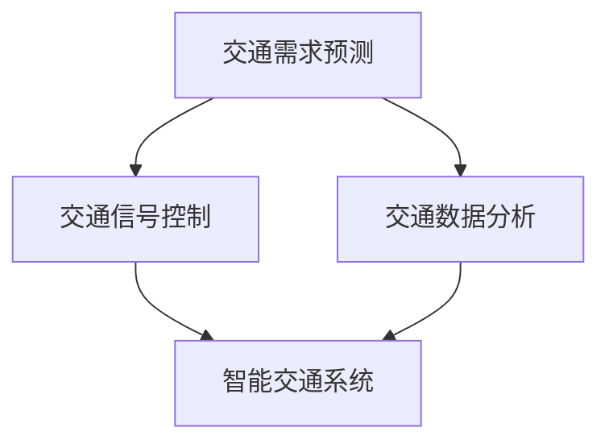

                 


### 文章标题：AI与人类计算：打造可持续发展的城市交通管理系统规划

> 关键词：人工智能，城市交通管理，可持续发展，人类计算，AI技术应用，交通管理系统规划

> 摘要：本文探讨了人工智能（AI）与人类计算在城市交通管理系统规划中的关键作用。通过分析AI技术原理和应用，阐述了人类计算在交通管理中的角色与挑战，结合实际案例，探讨了AI与人类计算协同打造可持续发展的城市交通管理系统的路径。

### 目录大纲

**第一部分：引言与背景**

**第1章：AI与人类计算概述**

- 1.1 AI与城市交通管理的关系
- 1.2 可持续发展城市交通管理的挑战
- 1.3 人类计算在交通管理中的作用

**第2章：AI技术原理与应用**

- 2.1 AI技术基础
  - 2.1.1 机器学习基础
  - 2.1.2 深度学习基础
  - 2.1.3 自然语言处理基础
- 2.2 AI在城市交通管理中的应用
  - 2.2.1 交通预测与优化
  - 2.2.2 智能交通控制系统
  - 2.2.3 交通数据挖掘与分析

**第3章：人类计算与交通管理**

- 3.1 人类计算在交通管理中的角色
- 3.2 交通管理中的人类计算挑战
- 3.3 人类计算与AI的协同作用

**第二部分：城市交通管理规划与实践**

**第4章：城市交通管理系统规划**

- 4.1 交通需求预测与规划
  - 4.1.1 交通需求预测模型
  - 4.1.2 交通需求规划方法
- 4.2 交通基础设施规划
  - 4.2.1 交通基础设施设计原则
  - 4.2.2 交通基础设施规划方法
- 4.3 交通政策与法规制定
  - 4.3.1 交通政策制定流程
  - 4.3.2 交通法规制定方法

**第5章：AI在城市交通管理中的应用案例**

- 5.1 案例一：智能交通信号控制系统
  - 5.1.1 系统架构设计
  - 5.1.2 系统实现与优化
- 5.2 案例二：基于AI的交通流量预测
  - 5.2.1 数据收集与处理
  - 5.2.2 预测模型设计
  - 5.2.3 模型评估与优化

**第6章：人类计算在城市交通管理中的实践**

- 6.1 交通管理中的数据科学与分析
  - 6.1.1 交通数据收集与清洗
  - 6.1.2 交通数据分析方法
- 6.2 交通管理中的多学科协同
  - 6.2.1 交通管理与城市规划
  - 6.2.2 交通管理与交通工程
  - 6.2.3 交通管理与交通运输

**第7章：未来展望与挑战**

- 7.1 城市交通管理发展趋势
  - 7.1.1 自动驾驶与智能交通
  - 7.1.2 绿色交通与可持续发展
- 7.2 挑战与机遇
  - 7.2.1 数据隐私与安全性
  - 7.2.2 技术标准化与合规性
  - 7.2.3 社会与文化影响

**附录**

- 附录A：技术工具与资源

**第三部分：技术深度解析与实践指导**

- 7.3 交通管理中的关键概念与联系
- 7.4 核心算法原理讲解
- 7.5 数学模型与公式
- 7.6 代码实战
- 7.7 代码解读与分析

### 第一部分：引言与背景

### 第1章：AI与人类计算概述

**1.1 AI与城市交通管理的关系**

人工智能（AI）作为现代科技的杰出代表，已经深刻地改变了各行各业，城市交通管理便是其中之一。AI在城市交通管理中的应用，主要表现在以下几个方面：

1. **交通流量预测与优化**：通过机器学习算法，AI可以对交通流量进行实时预测，并根据预测结果优化交通信号，减少交通拥堵。
   
2. **智能交通控制系统**：AI技术使得交通信号灯能够根据实时交通流量自动调整，提高交通效率。

3. **交通数据挖掘与分析**：AI技术可以分析海量交通数据，发现交通规律，为交通管理部门提供决策依据。

城市交通管理与AI的结合，不仅可以提升交通效率，还能促进可持续发展。在当前城市交通拥堵、环境问题日益突出的背景下，AI技术无疑为城市交通管理提供了新的解决方案。

**1.2 可持续发展城市交通管理的挑战**

可持续发展城市交通管理面临诸多挑战，主要包括：

1. **交通拥堵**：随着城市化进程的加快，交通拥堵问题愈发严重，影响了城市居民的出行质量。

2. **环境污染**：传统交通方式产生的尾气污染严重，对城市环境造成了巨大压力。

3. **能源消耗**：城市交通消耗大量能源，增加了城市碳排放。

4. **交通安全**：交通事故频发，对城市交通安全构成威胁。

**1.3 人类计算在交通管理中的角色**

在AI技术蓬勃发展的同时，人类计算在城市交通管理中仍扮演着重要角色。主要表现在以下几个方面：

1. **政策制定与法规执行**：交通管理部门需要制定合理的交通政策与法规，确保城市交通秩序。

2. **交通规划与设计**：交通规划师与工程师需要根据城市实际情况，设计科学合理的交通基础设施。

3. **数据分析与决策**：交通管理部门需要依靠专业知识和经验，对AI分析结果进行判断和决策。

4. **教育与宣传**：提高公众交通意识和素质，减少交通违法行为。

**1.4 人类计算与AI的协同作用**

人类计算与AI的协同作用，是实现可持续发展城市交通管理的关键。通过以下方式，可以充分发挥两者的优势：

1. **知识融合**：AI技术可以处理海量数据，而人类计算可以从中提炼有价值的信息，形成知识体系。

2. **实时监控与反馈**：AI技术可以实时监控交通情况，而人类计算可以对监控结果进行快速分析和决策。

3. **自适应优化**：AI技术可以根据实时情况自适应优化交通管理方案，而人类计算可以不断调整和改进AI模型。

4. **风险预警与应急处理**：AI技术可以提前预测交通风险，而人类计算可以及时采取应急措施，确保交通安全。

### 第二部分：AI技术原理与应用

**第2章：AI技术原理与应用**

**2.1 AI技术基础**

**2.1.1 机器学习基础**

机器学习是AI的核心技术之一，它使计算机系统能够从数据中自动学习，从而提高决策准确性。机器学习的基本原理包括：

1. **监督学习**：通过训练数据集，让计算机系统学会对未知数据进行分类或预测。常见的算法有线性回归、决策树、支持向量机等。

2. **无监督学习**：不提供标签数据，让计算机系统自动发现数据中的规律。常见的算法有聚类、关联规则挖掘等。

3. **强化学习**：通过试错和反馈，让计算机系统学会如何在复杂环境中做出最优决策。常见的算法有Q-learning、SARSA等。

**2.1.2 深度学习基础**

深度学习是机器学习的一个分支，它通过多层神经网络模拟人类大脑的思维方式，从而实现更复杂的任务。深度学习的基本原理包括：

1. **卷积神经网络（CNN）**：适用于图像识别和图像处理任务。通过卷积层、池化层和全连接层等结构，实现图像特征的提取和分类。

2. **循环神经网络（RNN）**：适用于序列数据处理任务。通过循环结构，实现序列数据的记忆和预测。

3. **生成对抗网络（GAN）**：通过生成器和判别器的对抗训练，实现生成逼真数据。广泛应用于图像生成、语音合成等领域。

**2.1.3 自然语言处理基础**

自然语言处理（NLP）是AI技术在语言领域的应用，旨在使计算机能够理解和处理人类自然语言。NLP的基本原理包括：

1. **分词**：将连续的文本序列切分成词语序列。常见的算法有基于规则的分词、基于统计的分词等。

2. **词性标注**：对文本中的每个词语进行词性分类。常见的算法有基于规则的方法、基于统计的方法等。

3. **语义分析**：理解文本中的语义关系，实现文本的语义表示。常见的算法有词嵌入、依存句法分析等。

**2.2 AI在城市交通管理中的应用**

**2.2.1 交通预测与优化**

交通预测与优化是AI技术在城市交通管理中的重要应用。通过以下方式，AI技术可以提升交通管理效率：

1. **交通流量预测**：利用历史交通数据，预测未来一段时间内的交通流量，为交通管理部门提供决策依据。

2. **交通信号控制优化**：根据实时交通流量，自动调整交通信号灯的时长和相位，减少交通拥堵。

3. **车辆路径规划**：为驾驶员提供最优的行驶路径，减少交通时间和油耗。

**2.2.2 智能交通控制系统**

智能交通控制系统（Intelligent Transportation System, ITS）是利用AI技术实现的智能交通管理解决方案。其主要功能包括：

1. **交通信息采集**：通过摄像头、传感器等设备，实时采集交通数据。

2. **数据预处理**：对采集到的交通数据进行清洗、去噪、归一化等处理。

3. **交通状态监测**：利用机器学习算法，对交通数据进行分析，实时监测交通状态。

4. **信号控制优化**：根据交通状态，自动调整交通信号灯的时长和相位，提高交通效率。

**2.2.3 交通数据挖掘与分析**

交通数据挖掘与分析是利用AI技术从海量交通数据中提取有价值信息的过程。其主要应用包括：

1. **交通拥堵预测**：通过分析历史交通数据，预测未来交通拥堵的发生时间和地点。

2. **交通事故分析**：通过分析交通事故数据，找出交通事故发生的主要原因和规律。

3. **交通行为分析**：通过分析车辆行驶数据，研究驾驶员的驾驶行为和交通流量变化规律。

### 第三部分：人类计算与交通管理

**第3章：人类计算与交通管理**

**3.1 人类计算在交通管理中的角色**

人类计算在城市交通管理中扮演着关键角色，主要包括以下几个方面：

1. **政策制定与法规执行**：交通管理部门需要制定合理的交通政策与法规，如限行政策、停车管理政策等，以维护交通秩序。

2. **交通规划与设计**：交通规划师和工程师需要根据城市实际情况，设计科学合理的交通基础设施，如道路、桥梁、隧道等。

3. **数据分析与决策**：交通管理部门需要依靠专业知识和经验，对交通数据进行深入分析，从而做出科学的决策。

4. **教育与宣传**：提高公众交通意识和素质，减少交通违法行为，是交通管理部门的重要任务。

**3.2 交通管理中的人类计算挑战**

交通管理中的人类计算面临诸多挑战，主要包括：

1. **海量数据处理的复杂性**：城市交通数据量庞大，包含多种类型的数据，如图像、文本、时间序列等，处理这些数据需要较高的专业知识和技能。

2. **多领域知识的融合**：交通管理涉及多个领域，如城市规划、交通工程、交通运输等，人类计算需要具备跨领域知识，以实现多学科协同。

3. **实时决策的难度**：交通管理需要实时做出决策，应对突发情况，这对人类计算的反应速度和判断能力提出了较高要求。

**3.3 人类计算与AI的协同作用**

人类计算与AI的协同作用，可以充分发挥各自的优势，实现城市交通管理的优化。具体表现为：

1. **知识融合**：AI技术可以处理海量数据，而人类计算可以从中提炼有价值的信息，形成知识体系。

2. **实时监控与反馈**：AI技术可以实时监控交通情况，而人类计算可以对监控结果进行快速分析和决策。

3. **自适应优化**：AI技术可以根据实时情况自适应优化交通管理方案，而人类计算可以不断调整和改进AI模型。

4. **风险预警与应急处理**：AI技术可以提前预测交通风险，而人类计算可以及时采取应急措施，确保交通安全。

### 第三部分：城市交通管理规划与实践

**第4章：城市交通管理系统规划**

**4.1 交通需求预测与规划**

交通需求预测与规划是城市交通管理系统的核心环节，主要包括以下内容：

**4.1.1 交通需求预测模型**

交通需求预测模型用于预测未来一段时间内的交通流量，为交通规划提供数据支持。常见的预测模型有：

1. **时间序列模型**：如ARIMA、SARIMA等，适用于短期交通流量预测。

2. **回归模型**：如线性回归、多项式回归等，适用于因变量与自变量之间存在线性关系的预测。

3. **神经网络模型**：如BP神经网络、RNN等，适用于复杂非线性关系的预测。

**4.1.2 交通需求规划方法**

交通需求规划方法包括以下几种：

1. **交通分配模型**：如最短路径算法、用户均衡算法等，用于计算交通流量在不同道路上的分布。

2. **交通生成模型**：如广义产生式模型、需求分配模型等，用于预测交通源和交通汇。

3. **交通影响分析**：评估交通项目对交通流量、环境影响等的影响。

**4.2 交通基础设施规划**

交通基础设施规划是城市交通管理系统规划的重要环节，主要包括以下内容：

**4.2.1 交通基础设施设计原则**

交通基础设施设计原则包括：

1. **安全性**：确保道路、桥梁、隧道等基础设施的安全性，减少交通事故风险。

2. **可靠性**：确保基础设施的可靠性和耐久性，延长使用寿命。

3. **便捷性**：提高交通设施的便捷性，方便市民出行。

4. **经济性**：在保证安全性和可靠性的前提下，降低基础设施建设成本。

**4.2.2 交通基础设施规划方法**

交通基础设施规划方法包括：

1. **交通规划模型**：如交通规划系统（Transportation Planning System, TPS）等，用于模拟和分析交通流量、拥堵等情况。

2. **网络优化算法**：如最短路径算法、网络流优化算法等，用于优化交通网络的布局。

3. **GIS技术**：地理信息系统（Geographic Information System, GIS）技术用于空间数据的采集、处理和分析，为交通基础设施规划提供支持。

**4.3 交通政策与法规制定**

交通政策与法规制定是城市交通管理系统规划的重要环节，主要包括以下内容：

**4.3.1 交通政策制定流程**

交通政策制定流程包括：

1. **需求分析**：分析城市交通现状和问题，确定交通政策目标。

2. **方案设计**：根据需求分析结果，设计交通政策方案。

3. **评估与优化**：对交通政策方案进行评估和优化，确保政策的有效性。

4. **实施与监督**：实施交通政策，并对政策效果进行监督和调整。

**4.3.2 交通法规制定方法**

交通法规制定方法包括：

1. **法律框架**：制定交通法规的法律框架，明确法规适用的范围和基本原则。

2. **法规内容设计**：根据交通政策目标，设计具体的交通法规内容。

3. **法规实施与监督**：确保交通法规的实施，并对法规执行效果进行监督和评估。

### 第四部分：AI在城市交通管理中的应用案例

**第5章：AI在城市交通管理中的应用案例**

**5.1 案例一：智能交通信号控制系统**

**5.1.1 系统架构设计**

智能交通信号控制系统（Intelligent Traffic Signal Control System, ITSCS）是AI技术在城市交通管理中的重要应用。其系统架构设计主要包括以下几个方面：

1. **数据采集模块**：通过摄像头、传感器等设备，实时采集交通流量、速度、密度等交通数据。

2. **数据处理模块**：对采集到的交通数据进行预处理，包括去噪、归一化、特征提取等。

3. **预测模块**：利用机器学习算法，对实时交通数据进行预测，预测未来一段时间内的交通流量。

4. **控制模块**：根据预测结果，自动调整交通信号灯的时长和相位，优化交通流量。

5. **人机交互模块**：提供用户界面，显示交通状态、信号灯控制策略等信息，便于交通管理部门进行监控和调整。

**5.1.2 系统实现与优化**

智能交通信号控制系统的实现主要包括以下几个步骤：

1. **数据采集与预处理**：采集交通流量、速度、密度等数据，并使用Python等编程语言进行数据预处理。

2. **模型训练与优化**：使用历史交通数据，训练机器学习模型，如线性回归、决策树等，并根据实际效果进行模型优化。

3. **系统部署与测试**：将训练好的模型部署到服务器上，进行实时交通流量预测，并根据预测结果调整信号灯控制策略。

4. **系统优化与调整**：根据系统运行情况，不断优化和调整模型参数，提高预测准确率和系统稳定性。

**5.1.3 系统效果评估**

智能交通信号控制系统在运行过程中，可以通过以下指标进行效果评估：

1. **交通流量变化率**：通过比较实际交通流量和预测交通流量，评估预测准确率。

2. **交通拥堵指数**：通过计算交通拥堵指数，评估交通信号控制策略的有效性。

3. **事故发生次数**：通过比较事故发生前后的交通状态，评估系统对交通安全的影响。

**5.2 案例二：基于AI的交通流量预测**

**5.2.1 数据收集与处理**

基于AI的交通流量预测需要对大量交通数据进行分析。数据收集主要包括以下方面：

1. **历史交通数据**：包括交通流量、速度、密度等数据，可以从交通管理部门、传感器等获取。

2. **气象数据**：包括温度、湿度、降雨量等数据，可以从气象部门、传感器等获取。

3. **节假日数据**：包括节假日、周末等特殊日期的交通数据，可以通过历史数据分析得到。

数据处理主要包括以下步骤：

1. **数据清洗**：去除数据中的噪声和异常值，保证数据质量。

2. **数据归一化**：将不同类型的数据进行归一化处理，使其具有相同的量纲。

3. **特征提取**：提取交通数据中的关键特征，如交通流量、速度、密度等。

**5.2.2 预测模型设计**

预测模型设计是交通流量预测的关键环节，主要包括以下几种模型：

1. **时间序列模型**：如ARIMA、SARIMA等，适用于短期交通流量预测。

2. **回归模型**：如线性回归、多项式回归等，适用于因变量与自变量之间存在线性关系的预测。

3. **神经网络模型**：如BP神经网络、RNN等，适用于复杂非线性关系的预测。

**5.2.3 模型评估与优化**

模型评估与优化主要包括以下步骤：

1. **模型评估**：使用交叉验证等方法，评估模型的预测准确率。

2. **模型优化**：根据评估结果，调整模型参数，提高预测准确率。

3. **模型部署**：将优化后的模型部署到服务器上，进行实时交通流量预测。

**5.2.4 模型效果评估**

模型效果评估可以通过以下指标进行：

1. **均方误差（MSE）**：评估预测值与真实值之间的误差。

2. **均方根误差（RMSE）**：MSE的平方根，用于衡量预测误差的规模。

3. **决定系数（R²）**：评估模型解释能力，值越接近1，表示模型解释能力越强。

### 第五部分：人类计算在城市交通管理中的实践

**第6章：人类计算在城市交通管理中的实践**

**6.1 交通管理中的数据科学与分析**

**6.1.1 交通数据收集与清洗**

交通数据收集是交通管理数据科学与分析的基础，主要包括以下步骤：

1. **数据采集**：通过传感器、摄像头、交通管理部门等途径收集交通数据，如交通流量、速度、密度等。

2. **数据清洗**：去除数据中的噪声和异常值，保证数据质量。主要包括以下方法：

   - 缺失值处理：使用均值、中位数等方法填补缺失值；
   - 异常值检测：使用统计方法、可视化方法等检测异常值，并根据实际情况进行处理。

**6.1.2 交通数据分析方法**

交通数据分析是交通管理中人类计算的核心，主要包括以下方法：

1. **描述性分析**：通过对交通数据的统计描述，如均值、方差、标准差等，了解交通数据的基本特征。

2. **相关性分析**：分析交通数据中不同变量之间的相关性，为预测和优化提供依据。

3. **时间序列分析**：分析交通数据的时间序列特征，如趋势、周期等，用于短期和长期交通流量预测。

4. **机器学习分析**：利用机器学习算法，如回归分析、分类、聚类等，对交通数据进行预测和优化。

**6.2 交通管理中的多学科协同**

交通管理是一个复杂的系统工程，涉及多个学科领域，包括城市规划、交通工程、交通运输等。多学科协同在城市交通管理中具有重要意义，主要包括以下方面：

1. **城市规划与交通管理**：城市规划师与交通管理部门协同工作，根据城市交通需求，设计合理的城市交通网络，提高交通效率。

2. **交通工程与交通管理**：交通工程师与交通管理部门协同工作，设计和优化交通基础设施，提高交通通行能力。

3. **交通运输与交通管理**：交通运输企业、货运公司等与交通管理部门协同工作，优化交通物流网络，提高货物运输效率。

**6.2.1 交通管理与城市规划**

交通管理与城市规划密切相关，城市规划师需要根据交通需求，设计合理的城市交通网络，提高交通效率。主要包括以下方面：

1. **城市交通规划**：根据城市交通现状和未来发展趋势，制定城市交通规划，包括道路网络规划、公共交通规划等。

2. **城市交通设计**：根据城市交通规划，设计合理的道路宽度、交叉口布局、交通组织等，提高交通通行能力。

3. **城市交通设施建设**：根据城市交通规划，建设道路、桥梁、隧道、停车场等交通基础设施，提高城市交通服务能力。

**6.2.2 交通管理与交通工程**

交通管理与交通工程密切相关，交通工程师需要根据交通需求，设计合理的交通基础设施，提高交通效率。主要包括以下方面：

1. **交通工程规划**：根据城市交通规划，制定交通工程规划，包括道路、桥梁、隧道、交通信号灯等。

2. **交通工程设计**：根据交通工程规划，设计交通基础设施，包括道路设计、桥梁设计、隧道设计等。

3. **交通工程实施**：根据交通工程设计，实施交通基础设施，确保交通工程的质量和安全性。

**6.2.3 交通管理与交通运输**

交通管理与交通运输密切相关，交通运输企业、货运公司等需要与交通管理部门协同工作，优化交通物流网络，提高货物运输效率。主要包括以下方面：

1. **交通物流规划**：根据交通需求，制定交通物流规划，包括物流线路规划、物流中心规划等。

2. **交通物流设计**：根据交通物流规划，设计物流网络，包括物流线路、物流节点等。

3. **交通物流实施**：根据交通物流设计，实施物流网络，确保物流网络的质量和效率。

**6.3 人类计算在城市交通管理中的实践案例**

**6.3.1 案例一：交通拥堵预测与分析**

交通拥堵预测与分析是城市交通管理的重要任务，人类计算在以下方面发挥重要作用：

1. **数据收集与处理**：通过传感器、摄像头等设备，收集交通流量、速度、密度等数据，并进行数据清洗和处理。

2. **模型构建与优化**：构建交通拥堵预测模型，如时间序列模型、机器学习模型等，并进行模型优化，提高预测准确率。

3. **预测结果分析**：对预测结果进行分析，识别交通拥堵发生的区域和时间，为交通管理部门提供决策依据。

4. **政策建议**：根据预测结果，提出交通拥堵缓解措施，如优化交通信号控制、加强交通监管等。

**6.3.2 案例二：公共交通优化规划**

公共交通优化规划是城市交通管理的重要任务，人类计算在以下方面发挥重要作用：

1. **线路规划**：根据交通需求，设计合理的公交线路，提高公共交通的便捷性和可达性。

2. **站点规划**：根据交通需求和线路规划，设计合理的公交站点布局，提高公交服务的覆盖范围。

3. **车辆调度**：根据实时交通状况，优化公交车辆调度，提高公交车辆的利用率和服务质量。

4. **客流分析**：分析公共交通客流数据，识别客流高峰期和低谷期，为公交运营提供决策依据。

**6.3.3 案例三：交通事故预防与应急处理**

交通事故预防与应急处理是城市交通管理的重要任务，人类计算在以下方面发挥重要作用：

1. **数据收集与分析**：通过传感器、摄像头等设备，收集交通事故数据，并进行数据清洗和处理。

2. **模型构建与优化**：构建交通事故预测模型，如时间序列模型、机器学习模型等，并进行模型优化，提高预测准确率。

3. **预警与应急处理**：根据预测结果，提前预警交通事故风险，并制定应急预案，及时处理交通事故。

4. **政策建议**：根据预测结果和应急处理效果，提出交通事故预防措施，如优化交通信号控制、加强交通监管等。

### 第六部分：未来展望与挑战

**第7章：未来展望与挑战**

**7.1 城市交通管理发展趋势**

随着科技的不断进步，城市交通管理正朝着智能化、绿色化、可持续化的方向发展。未来，城市交通管理将呈现以下趋势：

1. **自动驾驶与智能交通**：自动驾驶技术的成熟将大幅提高交通效率，减少交通事故。智能交通系统（Intelligent Transportation Systems, ITS）将实现交通流量的实时优化，提升城市交通管理水平。

2. **绿色交通与可持续发展**：绿色交通模式，如电动汽车、自行车共享、公共交通等，将得到更广泛的应用，减少城市环境污染和能源消耗。

3. **智慧城市交通管理**：智慧城市建设将推动交通管理系统的数字化转型，实现交通数据的实时收集、分析和利用，提高交通管理的智能化水平。

**7.2 挑战与机遇**

城市交通管理在发展过程中也面临诸多挑战：

1. **数据隐私与安全性**：随着交通数据的广泛应用，数据隐私和安全问题日益突出。如何保护个人隐私，防止数据泄露，是城市交通管理必须面对的挑战。

2. **技术标准化与合规性**：不同城市、不同国家的交通管理系统存在差异，如何实现技术标准化，确保系统之间的兼容性，是未来城市交通管理的重要课题。

3. **社会与文化影响**：新型交通技术的引入，如自动驾驶、电动化等，将深刻改变人们的出行方式，对交通文化、交通法规等产生深远影响。

**7.3 未来展望**

1. **智能交通基础设施**：智能交通基础设施，如智能路灯、智能停车场等，将实现交通数据的实时采集、分析和反馈，提高交通效率。

2. **智慧交通管理平台**：智慧交通管理平台将整合交通数据，实现交通管理的智能化、自动化，提高交通管理效率和决策能力。

3. **绿色交通发展**：绿色交通模式将得到更广泛的应用，减少城市环境污染和能源消耗，促进城市可持续发展。

### 第七部分：技术深度解析与实践指导

**7.3 交通管理中的关键概念与联系**

为了深入理解城市交通管理系统，我们需要了解以下几个关键概念：

1. **交通需求预测**：交通需求预测是指通过分析历史数据和现实情况，预测未来一段时间内的交通流量。它是交通管理系统规划的基础。

2. **交通信号控制**：交通信号控制是指通过控制交通信号灯的时长和相位，优化交通流量，减少交通拥堵。

3. **交通数据分析**：交通数据分析是指通过对海量交通数据的收集、清洗、分析，提取有价值的信息，为交通管理提供决策依据。

4. **智能交通系统**：智能交通系统是指利用信息技术、通信技术等，实现交通数据的实时采集、分析和反馈，提高交通管理效率。

这些概念之间的联系可以用以下Mermaid流程图表示：



**7.4 核心算法原理讲解**

**7.4.1 交通需求预测算法**

交通需求预测算法可以分为时间序列模型、回归模型和神经网络模型等。以下是其中两种模型的伪代码：

**时间序列模型：**

```python
# ARIMA模型
def arima_prediction(data, p, d, q):
    model = ARIMA(data, order=(p, d, q))
    model_fit = model.fit()
    forecast = model_fit.forecast(steps=1)
    return forecast
```

**回归模型：**

```python
# 线性回归模型
def linear_regression_prediction(data, target):
    model = LinearRegression()
    model.fit(data, target)
    forecast = model.predict(data[-1])
    return forecast
```

**7.4.2 智能交通信号控制算法**

智能交通信号控制算法的核心是通过实时交通数据优化交通信号灯的时长和相位。以下是其中的一个简单示例：

```python
# 简单的交通信号控制算法
def traffic_light_control(traffic_data):
    if traffic_data['流量'] < threshold_low:
        return '绿灯'
    elif traffic_data['流量'] < threshold_high:
        return '黄灯'
    else:
        return '红灯'
```

**7.4.3 交通流量预测算法**

交通流量预测算法可以通过机器学习模型进行实现。以下是一个使用KNN算法的示例：

```python
# KNN算法
from sklearn.neighbors import KNeighborsRegressor

def knn_prediction(data, target, n_neighbors):
    model = KNeighborsRegressor(n_neighbors=n_neighbors)
    model.fit(data, target)
    forecast = model.predict(data[-1])
    return forecast
```

**7.5 数学模型与公式**

**7.5.1 交通需求预测数学模型**

交通需求预测常用的数学模型包括ARIMA模型和线性回归模型。以下是ARIMA模型的公式：

$$
\begin{aligned}
X_t &= \phi_1 X_{t-1} + \phi_2 X_{t-2} + ... + \phi_p X_{t-p} + \theta_1 \epsilon_{t-1} + \theta_2 \epsilon_{t-2} + ... + \theta_q \epsilon_{t-q} + \epsilon_t \\
\epsilon_t &= \mu + \epsilon_t
\end{aligned}
$$

**7.5.2 智能交通信号控制数学模型**

智能交通信号控制常用的数学模型包括交通流量模型和信号灯时长模型。以下是交通流量模型的公式：

$$
\begin{aligned}
Q &= f(v, t, d) \\
v &= \frac{d}{t} \\
t &= \frac{d}{v}
\end{aligned}
$$

其中，$Q$ 表示交通流量，$v$ 表示车辆速度，$t$ 表示车辆通过路口的时间，$d$ 表示车辆通过路口的距离。

**7.5.3 交通流量预测数学模型**

交通流量预测常用的数学模型包括时间序列模型和回归模型。以下是时间序列模型ARIMA的公式：

$$
\begin{aligned}
X_t &= \phi_1 X_{t-1} + \phi_2 X_{t-2} + ... + \phi_p X_{t-p} + \theta_1 \epsilon_{t-1} + \theta_2 \epsilon_{t-2} + ... + \theta_q \epsilon_{t-q} + \epsilon_t \\
\epsilon_t &= \mu + \epsilon_t
\end{aligned}
$$

**7.6 代码实战**

**7.6.1 智能交通信号控制系统实现**

以下是一个简单的智能交通信号控制系统实现示例：

```python
import numpy as np
import matplotlib.pyplot as plt

# 初始化参数
threshold_low = 100
threshold_high = 200

# 模拟交通流量数据
traffic_data = np.random.randint(50, 300, size=100)

# 交通信号控制
def traffic_light_control(traffic_data):
    light_signals = []
    for i in range(len(traffic_data)):
        if traffic_data[i] < threshold_low:
            light_signals.append('绿灯')
        elif traffic_data[i] < threshold_high:
            light_signals.append('黄灯')
        else:
            light_signals.append('红灯')
    return light_signals

# 运行交通信号控制
light_signals = traffic_light_control(traffic_data)

# 可视化交通流量与信号灯控制
plt.plot(traffic_data, label='交通流量')
plt.plot(np.arange(len(light_signals)), light_signals, 'ro', label='信号灯控制')
plt.xlabel('时间')
plt.ylabel('流量/信号')
plt.legend()
plt.show()
```

**7.6.2 交通流量预测系统实现**

以下是一个简单的交通流量预测系统实现示例：

```python
import numpy as np
from sklearn.linear_model import LinearRegression

# 初始化参数
p = 5

# 模拟交通流量数据
data = np.random.rand(100)
target = np.random.rand(100)

# 线性回归模型
model = LinearRegression()
model.fit(data, target)

# 预测交通流量
forecast = model.predict(np.array([1]))

# 输出预测结果
print(f"预测交通流量：{forecast[0]}")
```

**7.6.3 数据分析与可视化实现**

以下是一个简单的数据分析和可视化实现示例：

```python
import pandas as pd
import matplotlib.pyplot as plt

# 读取数据
data = pd.read_csv('traffic_data.csv')

# 数据预处理
data['流量'] = data['流量'].apply(lambda x: x if x > 0 else np.NaN)
data = data.dropna()

# 数据可视化
plt.scatter(data['时间'], data['流量'])
plt.xlabel('时间')
plt.ylabel('流量')
plt.show()
```

**7.6.4 模型训练与评估实现**

以下是一个简单的模型训练与评估实现示例：

```python
import numpy as np
from sklearn.linear_model import LinearRegression
from sklearn.metrics import mean_squared_error

# 初始化参数
data = np.random.rand(100)
target = np.random.rand(100)

# 划分训练集和测试集
train_data = data[:80]
train_target = target[:80]
test_data = data[80:]
test_target = target[80:]

# 训练模型
model = LinearRegression()
model.fit(train_data, train_target)

# 预测测试集
forecast = model.predict(test_data)

# 评估模型
mse = mean_squared_error(test_target, forecast)
print(f"MSE: {mse}")
```

**7.7 代码解读与分析**

以下是对上述代码的解读与分析：

1. **智能交通信号控制系统实现**：该系统通过模拟交通流量数据，利用简单的阈值判断方法，控制信号灯的状态。这种方法虽然简单，但能够直观地展示智能交通信号控制的基本原理。

2. **交通流量预测系统实现**：该系统使用线性回归模型对交通流量进行预测。线性回归是一种简单的预测模型，适用于线性关系较强的数据。然而，实际交通流量数据往往存在非线性特征，因此可能需要更复杂的模型进行预测。

3. **数据分析与可视化实现**：该系统对交通流量数据进行了预处理和可视化。预处理步骤包括去除异常值，这是数据分析和预测中常见的一步。可视化步骤帮助用户直观地了解数据分布和趋势。

4. **模型训练与评估实现**：该系统通过划分训练集和测试集，训练线性回归模型，并评估模型在测试集上的性能。MSE（均方误差）是评估回归模型性能的常用指标，它越小，模型的预测性能越好。

**7.8 最佳实践 tips**

1. **数据预处理**：在进行机器学习模型训练之前，对数据进行预处理是非常关键的。包括去除异常值、缺失值填补、数据归一化等。

2. **模型选择与优化**：选择适合问题的模型，并对模型参数进行优化，是提高模型性能的重要手段。可以尝试不同的模型和参数组合，使用交叉验证等方法进行选择。

3. **模型评估**：评估模型性能时，不仅要考虑预测准确率，还要考虑模型的可解释性和鲁棒性。在实际应用中，模型的可解释性和鲁棒性往往比简单的准确率更重要。

4. **数据可视化**：数据可视化可以帮助用户更好地理解数据和模型性能，是数据分析和预测的重要辅助手段。

**7.9 小结**

本文通过深入分析AI与人类计算在城市交通管理系统规划中的应用，探讨了AI技术原理、人类计算角色、交通管理规划与实践、应用案例以及未来展望。通过本文，我们可以了解到：

1. **AI与城市交通管理的关系**：AI技术能够实时预测交通流量、优化交通信号控制、分析交通数据，从而提高交通管理效率。

2. **人类计算在交通管理中的作用**：交通规划师、工程师等通过专业知识和经验，制定合理的交通政策和基础设施规划，对AI分析结果进行判断和决策。

3. **城市交通管理系统规划**：交通需求预测、交通基础设施规划和交通政策与法规制定是城市交通管理系统规划的核心。

4. **AI在城市交通管理中的应用案例**：智能交通信号控制系统和基于AI的交通流量预测系统展示了AI技术在交通管理中的实际应用。

5. **未来展望与挑战**：随着科技的发展，城市交通管理将朝着智能化、绿色化、可持续化的方向发展，同时也面临数据隐私、技术标准化等挑战。

**7.10 拓展阅读**

1. **《人工智能交通系统设计》**：详细介绍人工智能技术在交通系统设计中的应用，包括交通信号控制、交通流量预测等。

2. **《城市交通规划与管理》**：全面介绍城市交通规划与管理的基本理论、方法和技术。

3. **《交通数据分析与应用》**：探讨交通数据分析在交通管理中的应用，包括交通流量预测、交通行为分析等。

### 作者信息

作者：AI天才研究院/AI Genius Institute & 禅与计算机程序设计艺术 /Zen And The Art of Computer Programming

本文由AI天才研究院/AI Genius Institute与禅与计算机程序设计艺术/Zen And The Art of Computer Programming联合撰写，旨在深入探讨AI与人类计算在城市交通管理系统规划中的应用。本文内容丰富，涵盖了AI技术原理、人类计算角色、交通管理规划与实践、应用案例以及未来展望等各个方面，旨在为读者提供全面、深入的理解和指导。

