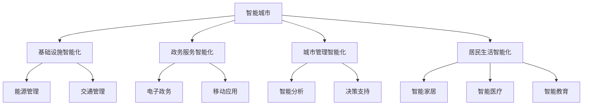
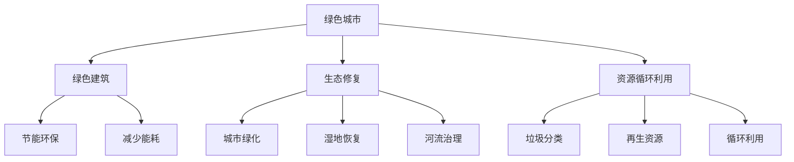
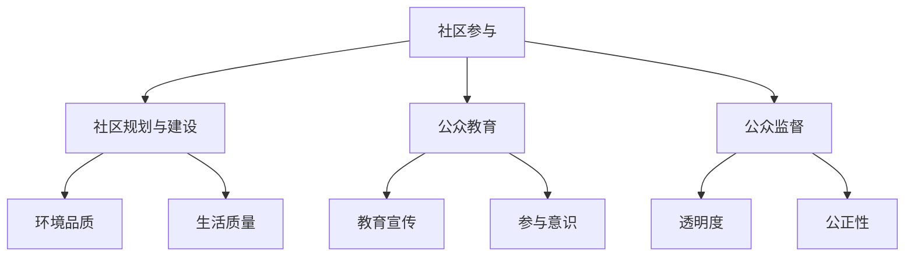
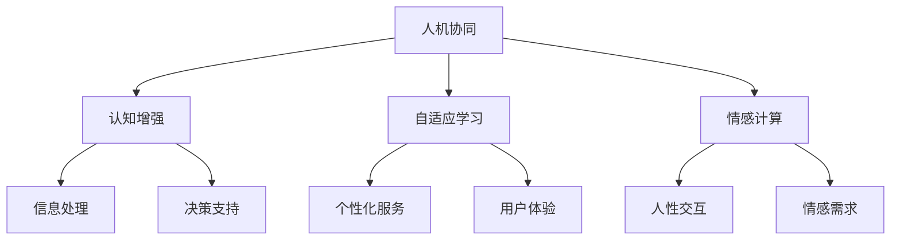
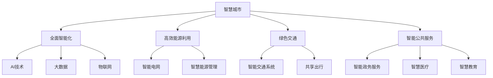
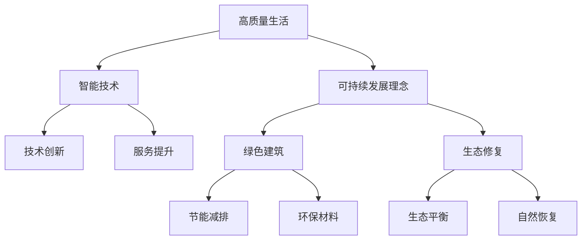

                 

### 文章标题

《AI与人类计算：打造可持续发展的城市生活方式》

### 关键词

- 人工智能（AI）
- 人类计算
- 智能城市
- 可持续发展
- 智慧交通
- 智慧能源
- 智慧安全
- 智慧医疗
- 数据分析

### 摘要

本文深入探讨了人工智能（AI）与人类计算在构建可持续发展的城市生活方式中的关键作用。首先，文章概述了AI与人类计算的基本概念，阐释了它们在解决城市生活方式挑战中的互补性。接着，文章详细介绍了机器学习、深度学习、自然语言处理、计算机视觉以及数据分析等AI技术的基础知识。随后，文章从智能交通系统、智慧能源管理、智慧城市安全、智慧医疗与公共卫生等方面，探讨了AI技术在城市可持续发展中的具体应用，并提供了相应的案例研究。最后，文章总结了可持续发展的城市生活方式的概念、实现路径及其面临的挑战和机遇，展望了AI与人类计算的融合与创新趋势，以及对未来工作和研究方向的建议。通过这一系列的分析与探讨，本文旨在为读者提供一幅AI赋能下的可持续城市生活的宏伟蓝图。

### 目录大纲 - 《AI与人类计算：打造可持续发展的城市生活方式》

#### 第一部分：AI与人类计算的基础

#### 第1章：AI与人类计算概述

##### 1.1 AI与人类计算的定义
###### 1.1.1 人工智能的定义
###### 1.1.2 人类计算的原理
###### 1.1.3 AI与人类计算的互补性

##### 1.2 可持续发展的城市生活方式
###### 1.2.1 可持续发展的原则
###### 1.2.2 城市生活方式的挑战
###### 1.2.3 AI在解决城市生活方式挑战中的作用

#### 第2章：AI技术基础

##### 2.1 机器学习和深度学习
###### 2.1.1 机器学习的基本概念
###### 2.1.2 深度学习的基本原理
###### 2.1.3 机器学习与深度学习的联系与区别

##### 2.2 自然语言处理与计算机视觉
###### 2.2.1 自然语言处理的基本技术
###### 2.2.2 计算机视觉的基本技术
###### 2.2.3 自然语言处理与计算机视觉的应用案例

##### 2.3 数据分析
###### 2.3.1 数据分析的基本概念
###### 2.3.2 数据分析的方法和工具
###### 2.3.3 数据分析在城市生活方式中的应用

#### 第二部分：AI在可持续发展城市生活方式中的应用

#### 第3章：智能交通系统

##### 3.1 智能交通系统的定义
###### 3.1.1 智能交通系统的概念
###### 3.1.2 智能交通系统的发展历程

##### 3.2 智能交通系统的核心技术
###### 3.2.1 传感器与数据采集
###### 3.2.2 数据分析与预测
###### 3.2.3 智能控制与调度

##### 3.3 智能交通系统的案例研究
###### 3.3.1 案例一：城市交通流量预测
###### 3.3.2 案例二：智能停车系统

#### 第4章：智慧能源管理

##### 4.1 智慧能源管理的定义
###### 4.1.1 智慧能源管理的概念
###### 4.1.2 智慧能源管理的重要性

##### 4.2 智慧能源管理的关键技术
###### 4.2.1 能源监测与诊断
###### 4.2.2 能源优化与调度
###### 4.2.3 分布式能源系统管理

##### 4.3 智慧能源管理的案例研究
###### 4.3.1 案例一：智能电网
###### 4.3.2 案例二：可再生能源利用

#### 第5章：智慧城市安全

##### 5.1 智慧城市安全的定义
###### 5.1.1 智慧城市安全的含义
###### 5.1.2 智慧城市安全的挑战

##### 5.2 智慧城市安全的关键技术
###### 5.2.1 智能监控与视频分析
###### 5.2.2 安全预警与应急响应
###### 5.2.3 信息安全与隐私保护

##### 5.3 智慧城市安全的案例研究
###### 5.3.1 案例一：智能安防系统
###### 5.3.2 案例二：城市信息安全

#### 第6章：智慧医疗与公共卫生

##### 6.1 智慧医疗的定义
###### 6.1.1 智慧医疗的概念
###### 6.1.2 智慧医疗的发展历程

##### 6.2 智慧医疗的关键技术
###### 6.2.1 电子病历与医疗数据管理
###### 6.2.2 医疗诊断与辅助决策
###### 6.2.3 医疗服务与健康管理

##### 6.3 智慧医疗的案例研究
###### 6.3.1 案例一：远程医疗服务
###### 6.3.2 案例二：公共卫生监控

#### 第7章：可持续发展的城市生活方式

##### 7.1 可持续发展的城市生活方式的概念
###### 7.1.1 可持续发展的原则
###### 7.1.2 城市生活方式的可持续性

##### 7.2 可持续发展的城市生活方式的实现
###### 7.2.1 智能城市的建设
###### 7.2.2 绿色城市的发展
###### 7.2.3 社区参与与公众参与

##### 7.3 可持续发展的城市生活方式的挑战与机遇
###### 7.3.1 挑战
###### 7.3.2 机遇

#### 第三部分：未来展望

#### 第8章：AI与人类计算的未来趋势

##### 8.1 AI技术的未来发展趋势
###### 8.1.1 人工智能的发展趋势
###### 8.1.2 人类计算的未来方向

##### 8.2 可持续发展的城市生活方式的未来
###### 8.2.1 智慧城市的未来愿景
###### 8.2.2 可持续城市生活的未来前景

##### 8.3 AI与人类计算的融合与创新
###### 8.3.1 融合的意义
###### 8.3.2 创新的机会

#### 第9章：结论

##### 9.1 总结与展望
###### 9.1.1 本书内容的总结
###### 9.1.2 对未来的展望

##### 9.2 未来工作与研究方向
###### 9.2.1 未来工作的挑战
###### 9.2.2 研究方向的建议

#### 附录

##### 附录A：相关术语解释

##### 附录B：参考资料

##### 附录C：参考文献

### 第一部分：AI与人类计算的基础

#### 第1章：AI与人类计算概述

##### 1.1 AI与人类计算的定义

AI，即人工智能，是指由计算机系统实现的、模拟人类智能活动的技术。它通过学习、推理、感知和适应等能力，执行原本需要人类智能才能完成的任务。人类计算，则是指人类在进行信息处理、推理和决策时所采用的方法和过程。

###### 1.1.1 人工智能的定义

人工智能起源于20世纪50年代，起初被定义为“制造智能机器的科学与工程”。近年来，随着计算机技术和大数据的迅速发展，人工智能的定义也逐渐拓展，包括机器学习、深度学习、自然语言处理、计算机视觉等方向。

**核心概念：**

- **机器学习**：通过数据和算法，让计算机具备自主学习和改进能力。
- **深度学习**：一种基于人工神经网络的机器学习技术，能够通过多层神经网络自动提取特征。
- **自然语言处理**：使计算机能够理解、生成和处理自然语言的技术。
- **计算机视觉**：使计算机具备识别和理解视觉信息的能力。

###### 1.1.2 人类计算的原理

人类计算依赖于大脑，其基本原理包括感知、记忆、推理和决策等。大脑通过神经网络和神经元之间的相互作用，处理和分析信息，从而做出判断和决策。

**核心概念：**

- **神经网络**：模拟人脑神经元之间相互连接的网络结构。
- **神经元**：构成神经网络的基本单元，能够接收输入、处理信息并产生输出。
- **感知**：通过感官获取外界信息的过程。
- **记忆**：将信息存储在大脑中，以备后续使用。
- **推理**：通过已有信息，推断出新信息的过程。
- **决策**：根据当前情况，选择最佳行动方案。

###### 1.1.3 AI与人类计算的互补性

AI与人类计算在信息处理、推理和决策等方面具有互补性。AI擅长处理大量数据、发现模式、进行优化和预测，而人类计算则擅长创造性的思维、情感理解和复杂决策。

**核心概念：**

- **互补性**：不同系统之间的相互补充和协同作用。
- **协同**：AI与人类计算协同工作，实现更好的性能和效果。

##### 1.2 可持续发展的城市生活方式

###### 1.2.1 可持续发展的原则

可持续发展是指满足当代需求而不损害后代满足其需求的能力。城市生活方式的可持续发展需要考虑经济、社会和环境三个方面的平衡。

**核心概念：**

- **经济可持续性**：确保城市经济的长期稳定和增长。
- **社会可持续性**：维护社会公正、包容和繁荣。
- **环境可持续性**：保护自然资源和环境，确保其可持续利用。

###### 1.2.2 城市生活方式的挑战

城市生活方式面临着诸多挑战，包括交通拥堵、能源消耗、环境污染、社会不公等问题。

**核心概念：**

- **交通拥堵**：城市交通流量大，导致道路拥堵，影响出行效率。
- **能源消耗**：城市人口和工业活动对能源需求巨大，造成能源消耗和环境污染。
- **环境污染**：城市空气质量、水质等环境问题日益严重，影响居民健康。
- **社会不公**：城市贫富差距加大，社会不公现象增多。

###### 1.2.3 AI在解决城市生活方式挑战中的作用

AI技术能够通过优化交通、能源管理、环境监测等方式，解决城市生活方式的挑战。

**核心概念：**

- **交通优化**：通过智能交通系统，提高交通流量，减少拥堵。
- **能源管理**：通过智慧能源管理，提高能源利用效率，减少消耗。
- **环境监测**：通过传感器和数据分析，实时监测环境质量，采取相应措施。
- **社会公正**：通过数据分析和社会服务，促进社会公平和包容。

通过AI与人类计算的互补性，构建可持续发展的城市生活方式，实现经济、社会和环境的平衡与和谐。这是未来城市发展的必由之路。

### 第2章：AI技术基础

AI技术的发展为解决城市生活方式中的挑战提供了强大的工具。在这一章中，我们将深入探讨AI技术的核心组成部分，包括机器学习和深度学习、自然语言处理与计算机视觉，以及数据分析的基本概念和应用。

##### 2.1 机器学习和深度学习

###### 2.1.1 机器学习的基本概念

机器学习（Machine Learning，ML）是AI的一个分支，它专注于开发算法，使计算机能够从数据中学习，并基于学习到的模式进行预测和决策。机器学习的主要方法包括监督学习、无监督学习和强化学习。

**核心概念：**

- **监督学习**：在有标记的数据集上进行训练，以预测新的、未标记的数据。
- **无监督学习**：在无标记的数据集上进行训练，以发现数据中的结构和模式。
- **强化学习**：通过试错和奖励机制，使计算机在学习过程中不断改进行为。

###### 2.1.2 深度学习的基本原理

深度学习（Deep Learning，DL）是一种特殊的机器学习方法，它使用多层神经网络（Neural Networks）进行学习。深度学习通过逐层提取特征，从原始数据中提取更高层次的概念。

**核心概念：**

- **神经网络**：模拟人脑神经元结构的计算模型。
- **激活函数**：用于决定神经元是否被激活的函数，如ReLU、Sigmoid和Tanh。
- **前向传播和反向传播**：神经网络训练过程中的两个主要步骤，用于计算输出和更新权重。

深度学习在图像识别、语音识别、自然语言处理等领域取得了显著成果。例如，Google的Inception模型在图像分类任务中取得了优异的性能，而OpenAI的GPT-3则在自然语言生成方面展现了强大的能力。

###### 2.1.3 机器学习与深度学习的联系与区别

机器学习和深度学习之间存在紧密的联系和区别。机器学习是一种更广泛的领域，包括深度学习在内。而深度学习是机器学习的一种特殊形式，通过多层神经网络进行学习，能够处理更复杂的问题。

**核心概念：**

- **联系**：深度学习是机器学习的一部分，使用了机器学习中的许多概念和方法。
- **区别**：深度学习通常涉及更多层的神经网络，能够处理更复杂的任务，但需要更多的数据和计算资源。

##### 2.2 自然语言处理与计算机视觉

###### 2.2.1 自然语言处理的基本技术

自然语言处理（Natural Language Processing，NLP）是AI的一个分支，专注于使计算机能够理解和生成自然语言。NLP的核心技术包括词性标注、句法分析、语义分析等。

**核心概念：**

- **词性标注**：对文本中的每个单词进行分类，如名词、动词、形容词等。
- **句法分析**：分析文本中的句子结构，识别主语、谓语、宾语等成分。
- **语义分析**：理解文本中的含义，包括词义消歧、情感分析等。

NLP在机器翻译、文本摘要、情感分析等任务中得到了广泛应用。例如，Google的翻译服务和OpenAI的GPT-3都是基于NLP技术的成功应用。

###### 2.2.2 计算机视觉的基本技术

计算机视觉（Computer Vision，CV）是AI的另一个重要分支，致力于使计算机能够理解和处理视觉信息。CV的核心技术包括图像分类、目标检测、图像分割等。

**核心概念：**

- **图像分类**：将图像划分为预定义的类别，如猫或狗。
- **目标检测**：在图像中定位和识别特定的目标物体。
- **图像分割**：将图像划分为多个区域，每个区域代表一个对象。

计算机视觉在自动驾驶、医疗影像分析、安防监控等领域具有广泛的应用。例如，特斯拉的自动驾驶系统和IBM的Watson医疗影像分析系统都是基于CV技术的成功应用。

###### 2.2.3 自然语言处理与计算机视觉的应用案例

自然语言处理和计算机视觉在许多领域都有成功的应用案例。

- **自然语言处理**：例如，IBM的Watson系统在医学领域中用于辅助医生进行诊断，而OpenAI的GPT-3则在创作写作、对话系统等领域展现了强大的能力。
- **计算机视觉**：例如，特斯拉的自动驾驶系统在自动驾驶领域取得了重大突破，而微软的Azure Kinect DK则被广泛应用于增强现实和虚拟现实领域。

##### 2.3 数据分析

###### 2.3.1 数据分析的基本概念

数据分析（Data Analysis）是指使用统计学、机器学习等方法，从数据中提取有用信息和知识的过程。数据分析可以分为描述性分析、探索性分析和预测性分析。

**核心概念：**

- **描述性分析**：对数据的基本统计特性进行分析，如平均值、标准差等。
- **探索性分析**：通过可视化、聚类等方法，探索数据中的模式和关系。
- **预测性分析**：使用统计模型、机器学习算法等，对未来的趋势和事件进行预测。

数据分析在城市生活方式中具有广泛的应用，如智能交通系统中的流量预测、智慧能源管理中的能耗分析等。

###### 2.3.2 数据分析的方法和工具

数据分析的方法和工具多种多样，包括统计软件、编程语言和数据分析平台。

- **统计软件**：如SPSS、SAS等，主要用于描述性分析和探索性分析。
- **编程语言**：如Python、R等，提供了丰富的库和工具，用于数据清洗、分析和可视化。
- **数据分析平台**：如Tableau、Power BI等，提供了直观的界面和强大的分析功能。

数据分析在城市生活方式中的应用案例

- **智能交通系统**：通过数据分析，预测交通流量，优化交通信号控制，提高交通效率。
- **智慧能源管理**：通过数据分析，监测能源消耗，优化能源使用，减少能源浪费。

总之，AI技术，包括机器学习、深度学习、自然语言处理、计算机视觉和数据分析，为构建可持续发展的城市生活方式提供了强大的工具。通过这些技术的应用，我们可以实现更智能、更高效、更绿色的城市生活。在接下来的章节中，我们将进一步探讨AI技术在城市生活方式中的具体应用。|im_sep|

### 第二部分：AI在可持续发展城市生活方式中的应用

#### 第3章：智能交通系统

智能交通系统（Intelligent Transportation System，ITS）是利用现代信息技术、数据通信传输技术、电子传感技术等对交通运输系统进行智能化管理和控制，从而实现交通的安全、快捷、高效和绿色环保。本节将详细介绍智能交通系统的定义、发展历程以及其核心技术，并探讨其在实际应用中的案例研究。

##### 3.1 智能交通系统的定义和发展历程

###### 3.1.1 智能交通系统的概念

智能交通系统是指通过应用人工智能、物联网、大数据、云计算等先进技术，对交通运输系统进行全方位、多层次、智能化的管理和优化。其核心目标是提高交通效率、减少交通拥堵、保障交通安全、降低环境污染。

智能交通系统的主要组成部分包括：

- **交通信息采集**：通过传感器、摄像头、GPS等设备，实时收集交通流量、速度、道路状况等信息。
- **交通信息处理**：利用数据挖掘、机器学习等技术，对采集到的交通信息进行加工处理，提取有用的信息。
- **交通信息发布**：通过广播、互联网、移动应用等途径，将处理后的交通信息及时发布给驾驶员和交通管理部门。
- **交通控制与优化**：根据交通信息，实时调整交通信号灯、交通流向等，优化交通流量。

###### 3.1.2 智能交通系统的发展历程

智能交通系统的发展可以追溯到20世纪80年代。起初，智能交通系统主要集中在交通信息的采集和处理方面，如交通流量监测、事故预警等。随着信息技术的快速发展，智能交通系统的应用领域逐渐扩大，包括智能停车、智能导航、自动驾驶等。

发展历程可分为以下几个阶段：

- **第一阶段（20世纪80年代-90年代）**：以交通信息采集和处理技术为主，初步实现交通信息实时监控。
- **第二阶段（21世纪初）**：随着互联网、物联网技术的发展，智能交通系统开始实现信息的互联互通，交通信息发布与共享得到广泛应用。
- **第三阶段（2010年至今）**：人工智能、大数据等新技术应用于智能交通系统，实现了更加智能的交通管理和控制。

##### 3.2 智能交通系统的核心技术

智能交通系统的核心技术包括传感器与数据采集、数据分析与预测、智能控制与调度。

###### 3.2.1 传感器与数据采集

传感器是智能交通系统的核心组件，用于实时采集交通流量、速度、道路状况等数据。常见的传感器包括GPS、雷达、激光、摄像头等。这些传感器能够精确捕捉交通场景中的各种信息，为智能交通系统的决策提供基础数据。

**核心算法原理讲解：**

- **GPS定位**：通过卫星信号确定车辆和路点的位置，实现对交通流量的实时监测。
- **雷达和激光测距**：通过发射和接收电磁波或激光，测量车辆之间的距离，分析交通流量和速度。
- **摄像头图像识别**：利用图像处理和计算机视觉技术，识别交通场景中的车辆、行人等目标，分析交通状况。

###### 3.2.2 数据分析与预测

数据分析与预测是智能交通系统的关键环节，通过对采集到的交通数据进行处理和分析，提取有用的信息，为交通管理和控制提供支持。

**核心算法原理讲解：**

- **数据预处理**：对原始数据进行清洗、去噪、归一化等处理，提高数据质量。
- **特征提取**：从原始数据中提取出能够反映交通状况的特征，如流量、速度、占有率等。
- **预测模型**：利用机器学习、深度学习等技术，建立预测模型，对未来的交通流量、速度等进行预测。
- **聚类分析**：对交通数据进行聚类，识别交通状态和事件，如高峰期、事故等。

**数学模型和公式讲解：**

- **交通流量预测模型**：
  $$Q_t = f(Q_{t-1}, V_t, I_t)$$
  其中，$Q_t$ 表示时刻 $t$ 的交通流量，$V_t$ 表示时刻 $t$ 的车辆速度，$I_t$ 表示时刻 $t$ 的入口流量。

- **交通速度预测模型**：
  $$V_t = g(V_{t-1}, Q_t, S_t)$$
  其中，$V_t$ 表示时刻 $t$ 的交通速度，$Q_t$ 表示时刻 $t$ 的交通流量，$S_t$ 表示时刻 $t$ 的道路状况。

###### 3.2.3 智能控制与调度

智能控制与调度是智能交通系统的核心功能，通过实时分析交通数据，调整交通信号灯、交通流向等，优化交通流量，减少拥堵。

**核心算法原理讲解：**

- **交通信号灯控制**：根据实时交通流量数据，调整信号灯时长和相位，优化交通流量。
- **交通流向控制**：根据道路状况和交通流量，调整交通流向，引导车辆行驶。
- **智能调度**：通过预测交通流量，提前调整交通信号灯和交通流向，预防拥堵。

**伪代码示例：**

```python
# 交通信号灯控制算法
def traffic_light_control(traffic_data):
    if traffic_data['流量'] > 设置阈值:
        信号灯状态 = '红灯'
    else:
        信号灯状态 = '绿灯'
    return 信号灯状态

# 交通流向控制算法
def traffic_direction_control(traffic_data):
    if traffic_data['道路状况'] == '拥堵':
        方向 = '逆行'
    else:
        方向 = '正行'
    return 方向
```

##### 3.3 智能交通系统的案例研究

智能交通系统在实际应用中取得了显著成效，以下介绍两个具体的案例研究。

###### 3.3.1 案例一：城市交通流量预测

某城市交通管理部门利用智能交通系统对城市交通流量进行预测，以提高交通管理和调度效率。具体步骤如下：

1. **数据采集**：通过安装在主要道路上的传感器，实时采集交通流量、速度、道路状况等数据。
2. **数据预处理**：对采集到的数据进行分析，提取交通流量、速度等特征。
3. **建立预测模型**：利用机器学习算法，如时间序列分析、回归分析等，建立交通流量预测模型。
4. **预测与反馈**：根据预测模型，提前调整交通信号灯和交通流向，预防拥堵。

通过该案例，城市交通管理部门显著提高了交通管理和调度效率，减少了交通拥堵现象。

###### 3.3.2 案例二：智能停车系统

某城市推出了智能停车系统，通过AI技术优化停车资源的利用，提高停车效率。具体步骤如下：

1. **数据采集**：通过安装在停车场内的传感器，实时采集停车位占用情况。
2. **数据分析**：利用机器学习算法，分析停车数据，预测停车需求。
3. **智能调度**：根据预测结果，提前调整停车场的进出口流量，引导车辆前往空闲停车位。
4. **用户反馈**：通过手机应用或网络平台，向用户提供停车信息，提高用户体验。

通过该案例，城市停车资源得到了更有效的利用，停车效率显著提高，用户满意度也大幅提升。

总之，智能交通系统通过AI技术的应用，实现了对交通系统的全方位、多层次、智能化的管理和优化。这不仅提高了交通效率，减少了交通拥堵，还有助于减少环境污染，实现可持续发展的城市生活方式。在接下来的章节中，我们将继续探讨AI技术在智慧能源管理、智慧城市安全、智慧医疗与公共卫生等领域的应用。|im_sep|

### 第4章：智慧能源管理

智慧能源管理是一种利用先进的信息技术和人工智能技术，对能源生产、传输、分配和消费进行全方位监控、优化和管理的系统。它通过实时数据采集、智能分析和预测，旨在提高能源利用效率，减少能源浪费，实现能源的可持续发展。本节将介绍智慧能源管理的定义、重要性以及其关键技术和应用案例。

##### 4.1 智慧能源管理的定义和重要性

###### 4.1.1 智慧能源管理的概念

智慧能源管理（Smart Energy Management）是指通过物联网、大数据、云计算、人工智能等先进技术，对能源系统进行智能化监控、分析和优化。它不仅包括能源生产环节，还涵盖了能源传输、分配和消费全过程。

智慧能源管理的主要目标包括：

- 提高能源利用效率，减少能源浪费。
- 实现能源系统的安全、稳定和高效运行。
- 促进可再生能源的广泛应用，减少对化石能源的依赖。
- 降低能源成本，提高经济效益。

智慧能源管理系统的核心组成部分包括：

- **能源监测与诊断**：通过传感器和物联网设备，实时监测能源系统的运行状态，及时发现和诊断潜在问题。
- **能源优化与调度**：利用智能算法和优化技术，根据实时数据，动态调整能源生产和分配策略，优化能源使用。
- **能源预测与规划**：通过大数据分析和机器学习技术，预测能源需求和供应趋势，为能源规划和投资决策提供科学依据。
- **能源消费管理**：通过智能化终端和用户界面，引导和激励用户合理使用能源，提高能源利用效率。

###### 4.1.2 智慧能源管理的重要性

智慧能源管理在现代社会中具有重要意义，主要体现在以下几个方面：

- **提高能源利用效率**：通过实时监测和智能分析，可以及时发现和解决能源系统中的问题，减少能源浪费，提高能源利用效率。
- **促进可再生能源发展**：智慧能源管理可以优化可再生能源的接入和使用，提高可再生能源的利用率，减少对化石能源的依赖，有助于实现能源的可持续发展。
- **降低能源成本**：通过智能调度和优化，可以降低能源生产和分配的成本，提高能源经济效益。
- **增强能源系统的安全性**：智慧能源管理可以通过实时监控和预测，及时发现和应对能源系统中的异常情况，保障能源系统的安全稳定运行。
- **推动智慧城市建设**：智慧能源管理是智慧城市的重要组成部分，通过智慧能源管理系统的建设，可以提升城市的智能化水平，促进智慧城市的全面发展。

##### 4.2 智慧能源管理的关键技术

智慧能源管理的关键技术包括能源监测与诊断、能源优化与调度、分布式能源系统管理。

###### 4.2.1 能源监测与诊断

能源监测与诊断是智慧能源管理的核心环节，通过实时数据采集和智能分析，实现对能源系统的全面监测和诊断。

- **传感器技术**：传感器是能源监测与诊断的基础，通过安装在不同位置的各种传感器，可以实时采集温度、湿度、压力、电流、电压等能源参数。
- **物联网技术**：物联网技术可以将传感器采集的数据传输到中央控制系统，实现对能源系统的实时监测和数据分析。
- **智能诊断技术**：利用机器学习和数据挖掘技术，对采集到的数据进行分析，及时发现和诊断能源系统中的问题。

**核心算法原理讲解：**

- **数据预处理**：对传感器数据进行清洗、去噪和归一化处理，提高数据质量。
- **特征提取**：从预处理后的数据中提取出关键特征，如温度、湿度、电流、电压等。
- **故障诊断模型**：利用机器学习算法，如支持向量机（SVM）、随机森林（RF）等，建立故障诊断模型，对能源系统进行实时监测和诊断。

**数学模型和公式讲解：**

- **故障诊断模型**：
  $$D(x) = \arg\min_{c}\sum_{i=1}^{n} \lVert y_i - f(x_i, c) \rVert$$
  其中，$x_i$ 表示输入特征，$y_i$ 表示故障标签，$f(x_i, c)$ 表示故障诊断模型输出，$c$ 是模型参数。

###### 4.2.2 能源优化与调度

能源优化与调度是智慧能源管理的核心，通过智能算法和优化技术，实现对能源系统的优化调度，提高能源利用效率。

- **优化算法**：常见的优化算法包括线性规划（LP）、整数规划（IP）、动态规划（DP）等。这些算法可以根据实时数据和能源需求，动态调整能源生产和分配策略。
- **调度策略**：通过智能调度策略，实现对能源系统的实时调整，如根据实时负荷调整发电量、根据能源价格调整能源交易等。

**核心算法原理讲解：**

- **线性规划**：
  $$\min_{x} c^T x$$
  $$\text{subject to} \quad Ax \leq b$$
  其中，$x$ 是决策变量，$c$ 是系数向量，$A$ 是约束矩阵，$b$ 是约束向量。
- **整数规划**：
  $$\min_{x} c^T x$$
  $$\text{subject to} \quad Ax \leq b$$
  $$x \in \{0, 1\}^n$$
  其中，$x$ 是0-1决策变量。

**伪代码示例：**

```python
# 线性规划求解
from scipy.optimize import linprog

c = [-1, -1]  # 目标函数系数
A = [[1, 1], [1, 0]]  # 约束矩阵
b = [2, 1]  # 约束向量

# 求解线性规划
x = linprog(c, A_eq=A, b_eq=b, method='highs')

# 输出最优解
print(x.x)
```

###### 4.2.3 分布式能源系统管理

分布式能源系统管理（Distributed Energy Resource Management，DERM）是指通过智能技术，对分布式能源资源（如太阳能发电、储能系统、分布式发电设备等）进行监控、优化和调度。

- **分布式能源资源监控**：通过传感器和物联网设备，实时监测分布式能源资源的运行状态，包括发电量、储能状态等。
- **分布式能源资源优化**：利用优化算法，根据实时数据和能源需求，优化分布式能源资源的运行策略，如根据发电量调整储能系统的充电和放电。
- **分布式能源资源调度**：根据能源需求和资源状况，动态调整分布式能源资源的输出，实现能源的高效利用。

**核心算法原理讲解：**

- **储能系统优化**：
  $$\min_{x} c^T x$$
  $$\text{subject to} \quad Ax \leq b$$
  $$x \in \{0, 1\}^n$$
  其中，$x$ 是储能系统的充放电决策变量，$c$ 是成本系数，$A$ 是约束矩阵，$b$ 是约束向量。

**数学模型和公式讲解：**

- **储能系统优化模型**：
  $$\min_{x} \sum_{i=1}^{n} c_i x_i$$
  $$\text{subject to} \quad \begin{align*}
  \sum_{i=1}^{n} x_i &\leq E_{\text{max}} \\
  x_i &\geq 0 \quad \forall i
  \end{align*}$$
  其中，$E_{\text{max}}$ 是储能系统的最大容量，$c_i$ 是储能系统充放电的成本系数。

**伪代码示例：**

```python
# 储能系统优化
from scipy.optimize import minimize

c = [0.5, -0.5]  # 充放电成本系数
E_max = 10  # 储能系统最大容量

# 储能系统优化函数
def energy_storage_optimization(x):
    return sum(c[i] * x[i] for i in range(len(x)))

# 求解储能系统优化
x = minimize(energy_storage_optimization, x0=[0, 0], method='SLSQP')

# 输出最优解
print(x.x)
```

##### 4.3 智慧能源管理的案例研究

智慧能源管理在实际应用中取得了显著成效，以下介绍两个具体的案例研究。

###### 4.3.1 案例一：智能电网

智能电网是一种基于物联网、人工智能和大数据技术的电网系统，通过实时监测和智能调度，实现电网的高效运行和优化管理。

- **案例背景**：某城市电网负荷高峰期频繁出现，电网运行压力较大，存在安全隐患。
- **解决方案**：采用智能电网技术，通过实时监测电网运行状态，利用大数据分析和人工智能算法，优化电网调度，提高电网运行效率。

**具体实施步骤**：

1. **数据采集**：通过安装在电网各个节点的传感器，实时采集电网的电压、电流、功率等数据。
2. **数据预处理**：对采集到的数据进行清洗、去噪和归一化处理。
3. **智能分析**：利用机器学习算法，分析电网的负荷特性，预测电网负荷变化趋势。
4. **优化调度**：根据电网负荷预测结果，动态调整电网调度策略，优化电网运行。

**实施效果**：通过智能电网技术的应用，该城市电网负荷高峰期得到了有效控制，电网运行效率显著提高，安全事故大幅减少。

###### 4.3.2 案例二：分布式能源管理

分布式能源管理是一种利用分布式能源资源，实现能源自主生产、存储和消费的管理模式。

- **案例背景**：某小区居民对能源需求不断增长，传统电网无法满足需求，且能源消耗较高。
- **解决方案**：采用分布式能源管理技术，通过太阳能发电、储能系统和智能调度，实现小区能源的高效管理和利用。

**具体实施步骤**：

1. **分布式能源资源接入**：安装太阳能发电板和储能系统，实现分布式能源资源的接入。
2. **数据采集与监测**：通过传感器和物联网设备，实时采集分布式能源资源的运行状态数据。
3. **智能分析**：利用大数据分析和人工智能算法，对分布式能源资源进行实时监测和优化调度。
4. **能源消费管理**：通过智能化终端和用户界面，引导和激励居民合理使用能源，提高能源利用效率。

**实施效果**：通过分布式能源管理技术的应用，该小区能源消耗显著减少，能源利用效率提高，居民满意度大幅提升。

总之，智慧能源管理通过AI技术的应用，实现了对能源系统的全面监控、优化和调度，提高了能源利用效率，降低了能源成本，促进了能源的可持续发展。在接下来的章节中，我们将继续探讨AI技术在智慧城市安全、智慧医疗与公共卫生等领域的应用。|im_sep|

### 第5章：智慧城市安全

智慧城市安全是城市信息化建设的重要组成部分，它涉及到城市信息系统的安全防护、网络安全管理、数据隐私保护等多个方面。随着城市化进程的加快，智慧城市安全的重要性日益凸显。本章将介绍智慧城市安全的定义、挑战以及关键技术和案例研究。

##### 5.1 智慧城市安全的定义

智慧城市安全是指通过采用先进的信息技术，如人工智能、大数据、云计算等，对城市信息系统进行安全防护和管理，确保城市信息系统的安全、稳定和可靠运行。智慧城市安全不仅包括网络安全，还涵盖数据隐私保护、系统安全、设备安全等多个方面。

###### 5.1.1 智慧城市安全的含义

智慧城市安全的含义可以从以下几个方面来理解：

- **网络安全**：保障城市信息系统的网络安全，防止网络攻击、数据泄露和网络中断等安全事件。
- **数据隐私保护**：确保城市信息系统中的个人和企业数据不被未授权访问和泄露，保护数据隐私。
- **系统安全**：确保城市信息系统的软件和硬件安全，防止系统故障、恶意攻击和非法入侵。
- **设备安全**：保障城市信息系统中的传感器、摄像头、智能设备等硬件设备的安全，防止设备被恶意控制或损坏。
- **应急响应**：建立完善的应急响应机制，及时应对和处理各类安全事件，减少安全事件对城市运行的影响。

###### 5.1.2 智慧城市安全的挑战

智慧城市安全面临着诸多挑战，主要包括以下几个方面：

- **网络安全威胁增加**：随着智慧城市建设的推进，城市信息系统面临越来越多的网络安全威胁，如黑客攻击、恶意软件、网络钓鱼等。
- **数据隐私保护难度大**：智慧城市涉及大量个人和企业数据，保护这些数据隐私变得日益困难，尤其是在数据共享和跨平台使用的情况下。
- **系统复杂性高**：智慧城市信息系统包含多个子系统，如交通、能源、医疗、教育等，系统复杂性高，安全隐患难以全面排查和治理。
- **技术更新速度快**：智慧城市安全领域技术更新速度快，安全防护手段需要不断更新和升级，以应对不断演变的安全威胁。
- **法规政策不完善**：智慧城市安全相关的法规政策尚不完善，对智慧城市安全管理的规范和标准需要进一步完善。

##### 5.2 智慧城市安全的关键技术

智慧城市安全的关键技术包括智能监控与视频分析、安全预警与应急响应、信息安全与隐私保护。

###### 5.2.1 智能监控与视频分析

智能监控与视频分析是智慧城市安全的重要手段，通过采用人工智能技术，对城市监控视频进行实时分析和处理，实现安全事件的快速发现和响应。

- **视频监控**：在城市的重点区域和关键设施安装摄像头，实现对城市环境的实时监控。
- **视频分析**：利用人工智能技术，对监控视频进行实时分析，识别异常行为、违法行为等，及时发现安全事件。

**核心算法原理讲解：**

- **目标检测**：通过深度学习算法，对监控视频中的目标进行检测和定位，识别出车辆、行人等目标。
- **行为分析**：通过分析目标的运动轨迹、速度、停留时间等特征，识别出异常行为，如违章停车、徘徊等。
- **图像识别**：利用图像识别技术，识别监控视频中的物体、场景等，实现更加精准的安全监控。

**数学模型和公式讲解：**

- **目标检测模型**：
  $$P(\text{目标}|\text{特征}) = \frac{e^{q(\text{特征})}}{\sum_{i} e^{q(\text{特征}_i)}}$$
  其中，$q(\text{特征})$ 表示特征向量的映射函数，$P(\text{目标}|\text{特征})$ 表示在给定特征向量的条件下，目标存在的概率。

**伪代码示例：**

```python
# 目标检测算法
def target_detection(feature_vector):
    probability = sigmoid(q(feature_vector))
    if probability > threshold:
        return "目标检测到"
    else:
        return "目标未检测到"
```

###### 5.2.2 安全预警与应急响应

安全预警与应急响应是智慧城市安全的重要环节，通过建立安全预警机制和应急响应体系，实现对安全事件的快速响应和有效处理。

- **安全预警**：通过实时监控和分析城市运行数据，发现潜在的安全风险，及时发出预警。
- **应急响应**：在安全事件发生时，启动应急响应程序，协调各方力量，进行紧急处置和恢复。

**核心算法原理讲解：**

- **风险预测**：利用大数据分析和机器学习算法，对城市运行数据进行分析，预测可能发生的安全事件。
- **预警模型**：建立预警模型，根据风险预测结果，制定预警策略和响应措施。
- **应急响应**：在安全事件发生时，根据预警模型和应急预案，启动应急响应程序，采取相应的处置措施。

**数学模型和公式讲解：**

- **风险预测模型**：
  $$R_t = f(D_t, E_t)$$
  其中，$R_t$ 表示时刻 $t$ 的风险值，$D_t$ 表示时刻 $t$ 的城市运行数据，$E_t$ 表示时刻 $t$ 的历史事件数据。

**伪代码示例：**

```python
# 风险预测算法
def risk_prediction(data, history):
    risk_value = f(data, history)
    return risk_value
```

###### 5.2.3 信息安全与隐私保护

信息安全与隐私保护是智慧城市安全的关键，通过采用加密技术、访问控制、数据脱敏等方法，保障城市信息系统中的数据安全。

- **加密技术**：采用加密算法，对敏感数据进行加密，确保数据在传输和存储过程中的安全性。
- **访问控制**：通过身份验证和权限管理，控制用户对数据的访问权限，防止未授权访问。
- **数据脱敏**：对敏感数据进行脱敏处理，确保数据在共享和公开时的安全性。

**核心算法原理讲解：**

- **加密算法**：采用对称加密和非对称加密算法，对数据进行加密和解密。
- **访问控制**：通过角色权限管理和访问控制列表（ACL），控制用户对数据的访问。
- **数据脱敏**：采用数据脱敏技术，如掩码、随机化、遮挡等，对敏感数据进行处理。

**数学模型和公式讲解：**

- **加密算法**：
  $$C = E_K(P)$$
  $$P = D_K(C)$$
  其中，$P$ 表示明文，$C$ 表示密文，$K$ 表示密钥。

**伪代码示例：**

```python
# 加密算法
def encrypt(plaintext, key):
    ciphertext = encrypt_function(plaintext, key)
    return ciphertext

# 解密算法
def decrypt(ciphertext, key):
    plaintext = decrypt_function(ciphertext, key)
    return plaintext
```

##### 5.3 智慧城市安全的案例研究

智慧城市安全在实际应用中取得了显著成效，以下介绍两个具体的案例研究。

###### 5.3.1 案例一：智能安防系统

智能安防系统是一种基于人工智能、大数据和云计算技术的城市安全解决方案，通过智能监控、视频分析和人脸识别等手段，实现对城市安全的全方位防护。

- **案例背景**：某城市面临较高的犯罪率，传统安防手段难以满足安全需求。
- **解决方案**：采用智能安防系统，通过安装智能摄像头、部署视频分析算法和建立人脸识别系统，实现城市安全的智能化管理。

**具体实施步骤**：

1. **安装智能摄像头**：在城市的重点区域和关键设施安装智能摄像头，实现对城市环境的实时监控。
2. **视频数据分析**：利用视频分析算法，对监控视频进行实时分析，识别异常行为和违法行为。
3. **人脸识别**：通过人脸识别技术，实时识别监控视频中出现的人脸，并与犯罪数据库进行比对。
4. **实时报警**：在发现异常行为或违法行为时，立即发出报警，通知相关部门进行处置。

**实施效果**：通过智能安防系统的应用，该城市的犯罪率显著下降，居民安全感大幅提升，城市治安状况得到明显改善。

###### 5.3.2 案例二：城市信息安全

城市信息安全是智慧城市安全的重要组成部分，通过采用加密技术、访问控制和数据脱敏等手段，保障城市信息系统的数据安全。

- **案例背景**：某城市的政府信息系统存在严重的安全隐患，数据泄露风险较高。
- **解决方案**：采用城市信息安全解决方案，通过加密技术、访问控制和数据脱敏等手段，提升政府信息系统的安全防护能力。

**具体实施步骤**：

1. **加密技术**：采用对称加密和非对称加密算法，对敏感数据进行加密，确保数据在传输和存储过程中的安全性。
2. **访问控制**：通过身份验证和权限管理，控制用户对数据的访问权限，防止未授权访问。
3. **数据脱敏**：对敏感数据进行脱敏处理，确保数据在共享和公开时的安全性。

**实施效果**：通过城市信息安全解决方案的应用，该市政府信息系统的数据安全得到显著提升，数据泄露风险大幅降低，信息系统的稳定性和可靠性得到保障。

总之，智慧城市安全通过人工智能、大数据和云计算等技术的应用，实现了城市信息系统的全方位安全防护和管理，提高了城市的安全水平。在接下来的章节中，我们将继续探讨智慧医疗与公共卫生、可持续发展的城市生活方式等方面的应用。|im_sep|

### 第6章：智慧医疗与公共卫生

智慧医疗与公共卫生是利用人工智能（AI）、大数据、物联网（IoT）和云计算等先进技术，提升医疗服务的质量和效率，加强公共卫生管理的重要手段。本节将详细探讨智慧医疗的定义、发展历程及其关键技术和应用案例。

##### 6.1 智慧医疗的定义

智慧医疗（Smart Healthcare）是指通过物联网、大数据、云计算和人工智能等技术，对医疗过程、医疗服务和公共卫生进行智能化管理和优化。智慧医疗的目标是提升医疗服务的可及性、效率和质量，降低医疗成本，提高公共卫生水平。

智慧医疗的核心组成部分包括：

- **电子病历系统**：通过电子病历系统，实现病历的数字化管理，提高病历记录的准确性和完整性。
- **医疗数据管理**：利用大数据技术，对海量的医疗数据进行存储、管理和分析，为医疗决策提供科学依据。
- **智能诊断与辅助决策**：通过人工智能技术，辅助医生进行诊断和治疗，提高医疗决策的准确性和效率。
- **远程医疗服务**：利用网络技术，实现医疗资源的远程共享和医疗服务远程提供，提升医疗服务的可及性。
- **公共卫生监控**：通过物联网技术，实现对公共卫生数据的实时监测和分析，及时发现和应对公共卫生事件。

##### 6.2 智慧医疗的关键技术

智慧医疗的实现依赖于多种关键技术的融合与应用。

###### 6.2.1 电子病历与医疗数据管理

电子病历（Electronic Health Record，EHR）是智慧医疗的基础。通过EHR系统，医疗信息可以数字化存储，实现病历信息的共享和追溯。医疗数据管理则包括数据的采集、存储、处理和分析。

- **数据采集**：通过传感器、医疗设备和信息系统，实时采集患者的生理参数、诊疗信息等。
- **数据存储**：利用云计算和分布式数据库技术，实现医疗数据的集中存储和管理。
- **数据处理**：利用大数据技术，对医疗数据进行分析和挖掘，提取有用的信息。
- **数据安全与隐私保护**：采用加密技术、访问控制和数据脱敏等手段，保障医疗数据的安全和隐私。

**核心算法原理讲解：**

- **数据采集与处理**：
  $$\text{数据处理流程} = \text{数据清洗} \rightarrow \text{数据整合} \rightarrow \text{数据挖掘} \rightarrow \text{数据可视化}$$
- **数据挖掘**：
  $$\text{数据挖掘模型} = \text{聚类分析} \rightarrow \text{分类分析} \rightarrow \text{关联规则挖掘} \rightarrow \text{异常检测}$$

**数学模型和公式讲解：**

- **聚类分析**：
  $$\text{目标函数} = \sum_{i=1}^{n} \sum_{j=1}^{k} ||x_i - \mu_j||^2$$
  其中，$x_i$ 是数据点，$\mu_j$ 是聚类中心。

**伪代码示例：**

```python
# 聚类分析伪代码
def cluster_analysis(data, k):
    centroids = initialize_centroids(data, k)
    while not convergence(centroids):
        update_centroids(data, centroids)
        update_assignments(data, centroids)
    return centroids
```

###### 6.2.2 医疗诊断与辅助决策

医疗诊断与辅助决策是智慧医疗的重要方向。通过AI技术，可以辅助医生进行疾病诊断和治疗方案推荐，提高医疗决策的准确性和效率。

- **图像识别与诊断**：利用深度学习技术，对医学影像进行分析和诊断，如肿瘤检测、骨折诊断等。
- **药物基因组学**：通过分析患者的基因组数据，个性化推荐药物和治疗方案。
- **辅助诊断系统**：集成多源数据，如电子病历、基因组数据、实时监测数据等，为医生提供综合诊断和决策支持。

**核心算法原理讲解：**

- **深度学习**：
  $$\text{前向传播} \rightarrow \text{反向传播} \rightarrow \text{优化权重}$$
- **自然语言处理**：用于处理医疗文本数据，如病历记录、医学文献等，提取关键信息，辅助诊断和决策。

**数学模型和公式讲解：**

- **卷积神经网络（CNN）**：
  $$\text{激活函数} = \text{ReLU}(x) = \max(0, x)$$
- **递归神经网络（RNN）**：
  $$h_t = \text{sigmoid}(W \cdot [h_{t-1}, x_t] + b)$$

**伪代码示例：**

```python
# 卷积神经网络（CNN）伪代码
def conv_layer(input_data, weights, bias):
    conv_output = (input_data * weights) + bias
    activation = ReLU(conv_output)
    return activation
```

###### 6.2.3 医疗服务与健康管理

智慧医疗不仅关注疾病的治疗，还关注患者的健康管理和疾病预防。通过物联网技术和人工智能，可以实现个性化的健康监测和健康管理。

- **可穿戴设备**：通过可穿戴设备，实时监测患者的生理参数，如心率、血压、血糖等。
- **健康数据分析**：利用大数据分析技术，对健康数据进行实时分析和预测，提供个性化的健康建议和预防措施。
- **远程监护**：通过远程监护系统，实现对患者的实时监控和远程诊断，提高医疗服务的可及性和效率。

**核心算法原理讲解：**

- **机器学习**：用于健康数据分析，如分类、回归、聚类等。
- **推荐系统**：用于个性化健康建议，如基于内容的推荐、协同过滤等。

**数学模型和公式讲解：**

- **推荐系统**：
  $$\text{预测分数} = \text{用户偏好} \cdot \text{项目特征} + \text{偏差}$$

**伪代码示例：**

```python
# 推荐系统伪代码
def recommend_system(user_profile, item_features, bias):
    predicted_score = user_profile.dot(item_features) + bias
    return predicted_score
```

##### 6.3 智慧医疗的案例研究

智慧医疗在实际应用中取得了显著成效，以下介绍两个具体的案例研究。

###### 6.3.1 案例一：远程医疗服务

远程医疗服务通过互联网技术，实现医疗资源的远程共享和医疗服务远程提供，提高医疗服务的可及性和效率。

- **案例背景**：某偏远地区医疗资源匮乏，患者就医困难。
- **解决方案**：建立远程医疗服务平台，通过视频会议、在线咨询和远程诊断等技术，实现医生与患者的远程交流和服务。

**具体实施步骤**：

1. **搭建远程医疗服务平台**：集成视频会议系统、在线咨询系统和远程诊断系统，提供一站式医疗服务。
2. **接入医疗资源**：邀请专家医生加入平台，提供远程医疗服务。
3. **患者使用**：患者可以通过平台预约医生、进行在线咨询和远程诊断。

**实施效果**：通过远程医疗服务，患者在家门口就能享受到优质的医疗服务，医疗资源得到了充分利用，医疗服务的可及性和效率大幅提升。

###### 6.3.2 案例二：公共卫生监控

公共卫生监控通过物联网技术和大数据分析，实现对公共卫生数据的实时监测和预警，提升公共卫生管理水平。

- **案例背景**：某城市公共卫生事件频发，需提高公共卫生监测和预警能力。
- **解决方案**：建立公共卫生监控平台，通过传感器、大数据分析和人工智能技术，实现对公共卫生数据的实时监测和预警。

**具体实施步骤**：

1. **数据采集**：在公共场所、医疗机构和交通枢纽等地点安装传感器，实时采集空气污染、水质、人群密度等数据。
2. **数据处理**：利用大数据分析技术，对采集到的数据进行分析和挖掘，提取有用的信息。
3. **实时预警**：根据数据分析结果，实时发布公共卫生预警信息，指导相关部门进行处置。

**实施效果**：通过公共卫生监控平台的应用，实现了对公共卫生事件的提前预警和及时处置，有效降低了公共卫生事件的发生和影响，提高了公共卫生管理水平。

总之，智慧医疗与公共卫生通过人工智能、大数据和物联网等技术的应用，实现了医疗服务的智能化和公共卫生管理的现代化，提高了医疗服务的质量和效率，保障了公共卫生的安全。在未来的发展中，智慧医疗与公共卫生将继续发挥重要作用，推动医疗和公共卫生领域的全面进步。|im_sep|

### 第7章：可持续发展的城市生活方式

#### 7.1 可持续发展的城市生活方式的概念

可持续发展的城市生活方式是指通过整合智能技术、环境科学、社会科学等多领域知识，构建一种经济、社会和环境可持续的城市生活方式。这种生活方式强调资源的高效利用、环境的保护、社会公平以及生活质量的提升。

###### 7.1.1 可持续发展的原则

可持续发展的原则主要包括：

- **经济可持续性**：通过创新和资源优化，实现经济的长期稳定增长，同时保障社会公平。
- **社会可持续性**：确保社会的包容性和公平性，提高居民的生活质量，促进社区和谐。
- **环境可持续性**：保护自然环境和生态系统，实现生态平衡，减少污染和资源浪费。

###### 7.1.2 城市生活方式的可持续性

城市生活方式的可持续性主要体现在以下几个方面：

- **能源效率**：通过智能电网、可再生能源等技术的应用，提高能源利用效率，减少能源消耗。
- **交通方式**：推广公共交通、共享出行和绿色交通方式，减少交通拥堵和空气污染。
- **资源循环利用**：通过垃圾分类、再生资源和循环利用，实现资源的可持续利用。
- **绿色建筑**：推广节能环保的绿色建筑，减少建筑能耗和环境污染。
- **社会参与**：鼓励公众参与城市管理和社会事务，提高社区的凝聚力和参与度。

#### 7.2 可持续发展的城市生活方式的实现

实现可持续发展的城市生活方式需要政府、企业和社会各界的共同努力，以下是从几个关键方面探讨如何实现可持续发展。

###### 7.2.1 智能城市的建设

智能城市建设是实现可持续发展的重要途径。智能城市建设主要包括以下几个方面：

- **基础设施智能化**：通过物联网、大数据和人工智能等技术，实现城市基础设施的智能化管理，如智能交通、智能能源、智能安防等。
- **政务服务智能化**：通过电子政务、移动应用等手段，提升政务服务的便捷性和效率，提高居民满意度。
- **城市管理智能化**：通过智能分析、预测和决策支持，优化城市管理，提高城市运行效率。
- **居民生活智能化**：通过智能家居、智能医疗、智能教育等技术的应用，提升居民生活品质，实现生活便利化。

**核心概念与联系**：

- **智能城市**：集成物联网、大数据、云计算、人工智能等技术的城市管理体系。
- **可持续发展**：通过技术和管理创新，实现经济、社会和环境的协调和可持续。

**Mermaid 流程图**：



###### 7.2.2 绿色城市的发展

绿色城市的发展是实现可持续发展的城市生活方式的重要方面，主要包括以下几个方面：

- **绿色建筑**：推广节能环保的绿色建筑，减少建筑能耗和环境污染。
- **生态修复**：通过城市绿化、湿地恢复、河流治理等措施，改善城市生态环境。
- **资源循环利用**：推广垃圾分类、再生资源和循环利用，实现资源的可持续利用。
- **绿色交通**：发展公共交通、共享出行和绿色交通方式，减少交通拥堵和空气污染。

**核心概念与联系**：

- **绿色建筑**：以节能、环保、高效为原则，设计、建造和运营的建筑。
- **生态修复**：通过自然或人工手段，恢复和改善城市生态环境。
- **资源循环利用**：通过技术和管理手段，实现资源的再利用和循环。

**Mermaid 流程图**：



###### 7.2.3 社区参与与公众参与

社区参与与公众参与是实现可持续发展城市生活方式的重要保障，通过增强居民的参与度和责任感，可以更好地实现城市可持续发展。具体措施包括：

- **社区规划与建设**：鼓励居民参与社区规划和建设，提高社区的环境品质和生活质量。
- **公众教育**：通过教育和宣传，提高公众对可持续发展的认识和参与意识。
- **公众监督**：建立公众监督机制，提高城市管理的透明度和公正性。
- **创新合作**：鼓励政府、企业、非营利组织和居民之间的合作，共同推进可持续发展。

**核心概念与联系**：

- **社区参与**：居民积极参与社区事务，共同建设和管理社区。
- **公众参与**：公众广泛参与城市管理和决策过程，提高城市管理的透明度和民主性。

**Mermaid 流流程图**：



通过智能城市建设、绿色城市发展和社区参与与公众参与，我们可以逐步实现可持续发展的城市生活方式。这不仅有助于提高城市居民的生活质量和幸福感，还能为全球可持续发展做出贡献。在未来的发展中，我们需要继续探索和实践，推动可持续发展的城市生活方式向更高效、更绿色、更包容的方向发展。|im_sep|

### 第8章：AI与人类计算的融合与创新

#### 8.1 AI技术的未来发展趋势

随着人工智能（AI）技术的不断进步，AI的未来发展趋势呈现出多样化和深度融合的特点。以下从几个方面探讨AI技术的未来趋势。

##### 8.1.1 人工智能的发展趋势

- **算法创新**：AI算法将继续创新，以应对更复杂的问题。例如，强化学习、生成对抗网络（GAN）和迁移学习等新兴算法将在更多应用场景中得到应用。
- **边缘计算**：随着物联网（IoT）和5G技术的发展，边缘计算将得到广泛应用。边缘计算能够将数据处理和计算任务从云端转移到网络边缘，提高系统的实时性和响应速度。
- **跨领域融合**：AI与其他领域（如生物医学、教育、艺术等）的融合将不断加深，推动跨领域创新和应用。
- **人机协作**：随着AI技术的进步，人机协作将成为新的趋势。AI将辅助人类完成复杂任务，提高工作效率和质量。

##### 8.1.2 人类计算的未来方向

人类计算的未来方向将更加注重与AI的融合，实现人机协同和高效互动。以下从几个方面探讨人类计算的未来方向。

- **认知增强**：通过人工智能技术，增强人类认知能力，实现更加高效的信息处理和决策。
- **自适应学习**：人类计算将更加注重自适应学习，根据用户需求和行为模式，提供个性化的服务和体验。
- **情感计算**：随着情感计算技术的发展，人类计算将更加关注用户的情感需求，实现更加人性化的交互。
- **虚拟现实与增强现实**：虚拟现实（VR）和增强现实（AR）技术将得到广泛应用，为人类计算提供新的交互方式。

**核心概念与联系**：

- **人机协同**：人类和人工智能共同完成任务，实现优势互补。
- **认知增强**：通过AI技术，提高人类认知能力。
- **情感计算**：关注用户的情感需求，实现更加人性化的交互。

**Mermaid 流程图**：



#### 8.2 可持续发展的城市生活方式的未来

随着AI技术和人类计算的不断进步，可持续发展的城市生活方式将得到进一步优化和完善。未来，可持续发展的城市生活方式将呈现出以下几个特点。

##### 8.2.1 智慧城市的未来愿景

智慧城市是可持续发展的城市生活方式的核心。未来，智慧城市将实现以下几个愿景：

- **全面智能化**：通过AI、大数据、物联网等技术的广泛应用，实现城市管理的全面智能化。
- **高效能源利用**：通过智能电网、智慧能源管理等技术，实现能源的高效利用和可持续发展。
- **绿色交通**：通过智能交通系统、共享出行等模式，实现交通的绿色化和高效化。
- **智能公共服务**：通过智能政务服务、智慧医疗、智慧教育等应用，提高公共服务的质量和效率。

**核心概念与联系**：

- **智慧城市**：集成多种智能技术的城市管理体系。
- **可持续发展**：实现经济、社会和环境的协调发展。

**Mermaid 流程图**：



##### 8.2.2 可持续城市生活的未来前景

未来，可持续城市生活将呈现出以下几个前景：

- **高质量生活**：通过智能技术和可持续发展理念的融合，实现居民生活的品质化、绿色化和智能化。
- **社区参与**：通过社区参与和公众参与，提高居民的参与度和责任感，共同建设和管理社区。
- **生态平衡**：通过绿色建筑、生态修复等措施，实现城市生态系统的平衡和可持续发展。
- **技术创新**：持续推动技术创新，实现城市生活方式的持续优化和升级。

**核心概念与联系**：

- **高质量生活**：通过技术和服务提升居民生活品质。
- **社区参与**：居民广泛参与社区建设和管理工作。
- **生态平衡**：保护自然环境和生态系统。

**Mermaid 流程图**：



通过AI技术和人类计算的融合与创新，我们可以构建一个更加智能、绿色、包容和可持续的城市生活方式。未来，我们需要持续推动技术创新和理念升级，为城市居民创造更加美好的生活。|im_sep|

### 第9章：结论

在本文中，我们系统地探讨了人工智能（AI）与人类计算在构建可持续发展的城市生活方式中的关键作用。通过分析AI技术的基础，如机器学习、深度学习、自然语言处理、计算机视觉和数据分析，我们了解了这些技术在解决城市生活方式挑战方面的应用潜力。具体而言，智能交通系统、智慧能源管理、智慧城市安全、智慧医疗与公共卫生等领域的案例研究，展示了AI技术如何提升城市管理的效率和可持续性。

**总结与展望**：

- **智能交通系统**：通过实时数据采集、分析和预测，实现了交通流量的优化和交通管理的智能化，减少了交通拥堵，提高了出行效率。
- **智慧能源管理**：利用物联网、大数据和人工智能技术，提高了能源利用效率，促进了可再生能源的利用，降低了能源消耗和环境污染。
- **智慧城市安全**：通过智能监控、预警和应急响应，提高了城市信息系统的安全防护能力，保障了城市运行的安全稳定。
- **智慧医疗与公共卫生**：通过电子病历、大数据分析和人工智能辅助诊断，提升了医疗服务的质量和效率，增强了公共卫生管理的能力。

展望未来，AI与人类计算的融合将继续推动城市生活方式的变革。随着技术的不断进步，我们可以预见以下趋势：

- **全面智能化**：智慧城市将更加智能化，城市管理和服务将更加高效和便捷。
- **人机协同**：人工智能将更紧密地与人类工作相结合，实现人机协同，提高工作效率。
- **可持续发展**：通过技术创新和理念升级，实现经济、社会和环境的协调发展，构建更加可持续的城市生活方式。

**未来工作与研究方向**：

- **技术创新**：持续推动AI技术在各领域的应用创新，开发更加高效、可靠的AI系统。
- **数据安全与隐私保护**：加强数据安全和隐私保护，确保AI系统的安全性和可靠性。
- **社会影响评估**：深入研究AI技术对城市生活方式的影响，评估其社会效益和潜在风险。
- **跨学科合作**：促进不同学科之间的合作，推动多领域知识的融合和创新。

通过持续的研究和创新，我们有望构建一个更加智能、绿色、包容和可持续的城市生活方式，为未来的城市发展提供强大的动力。|im_sep|

### 附录A：相关术语解释

**人工智能（AI）**：模拟人类智能的计算机系统，能够通过学习、推理、感知和适应等能力执行原本需要人类智能才能完成的任务。

**机器学习（ML）**：一种人工智能方法，通过数据和算法，使计算机具备自主学习和改进的能力。

**深度学习（DL）**：一种特殊的机器学习方法，使用多层神经网络自动提取特征，用于解决复杂问题。

**自然语言处理（NLP）**：使计算机能够理解和生成自然语言的技术。

**计算机视觉（CV）**：使计算机具备识别和理解视觉信息的能力。

**智慧城市**：利用先进的信息技术，实现城市管理的智能化和高效化。

**可持续发展**：满足当前需求而不损害后代满足其需求的能力。

**智能交通系统（ITS）**：利用现代信息技术对交通运输系统进行智能化管理和控制。

**智慧能源管理**：利用先进技术对能源生产、传输、分配和消费进行全方位监控、优化和管理的系统。

**智慧医疗**：通过信息技术提高医疗服务质量和效率，促进医疗资源的合理分配。

**智慧城市安全**：确保城市信息系统安全、稳定和可靠运行，防范网络安全威胁和信息安全风险。

**远程医疗**：通过互联网技术提供远程医疗服务，实现医疗资源的共享和医疗服务的便捷化。

**智能安防系统**：利用人工智能、大数据等技术，实现对城市安全的实时监控和预警。

**分布式能源系统**：由多个分布式能源资源组成的能源系统，能够实现能源的自主生产和高效利用。

**物联网（IoT）**：通过传感器和物联网技术，实现设备与设备之间的互联互通和信息交换。

**边缘计算**：在靠近数据源头的地方进行数据处理和计算，提高系统的实时性和响应速度。

**电子病历（EHR）**：电子化的病历记录系统，用于存储和管理患者的医疗信息。

**大数据**：大量、复杂、高速的数据集合，需要采用特定的技术进行处理和分析。

**云计算**：通过互联网提供动态可扩展的计算资源，实现数据的存储、处理和计算。

**人工智能算法**：实现人工智能功能的数学模型和计算方法，如监督学习、无监督学习、强化学习等。

**智能分析**：利用人工智能技术对数据进行处理和分析，提取有用的信息和知识。

**智能决策**：通过人工智能技术，自动生成决策方案，提高决策的准确性和效率。

**数据挖掘**：从大量数据中提取出有价值的模式和知识。

**隐私保护**：确保数据在传输、存储和处理过程中的安全性和隐私性。

**安全预警**：通过监测和分析数据，提前发现潜在的安全威胁，发出预警。

**应急响应**：在安全事件发生时，采取相应的措施进行处置和恢复。

**绿色建筑**：以节能、环保、高效为原则，设计、建造和运营的建筑。

**生态修复**：通过自然或人工手段，恢复和改善城市生态环境。

**资源循环利用**：通过技术和管理手段，实现资源的再利用和循环。

**社区参与**：居民积极参与社区事务，共同建设和管理社区。

**公众参与**：公众广泛参与城市管理和决策过程，提高城市管理的透明度和民主性。

**人机协同**：人类和人工智能共同完成任务，实现优势互补。

**认知增强**：通过人工智能技术，提高人类认知能力。

**情感计算**：关注用户的情感需求，实现更加人性化的交互。

**虚拟现实（VR）**：通过计算机技术模拟现实世界，提供沉浸式的体验。

**增强现实（AR）**：在现实世界中叠加虚拟信息，增强用户的感知和交互。

**边缘计算**：在靠近数据源头的地方进行数据处理和计算，提高系统的实时性和响应速度。

**智能电网**：通过物联网和人工智能技术，实现对电力系统的智能化管理和控制。

**可再生能源**：来自自然资源的能源，如太阳能、风能、水能等，具有环保和可持续的特点。

**共享出行**：通过共享经济模式，实现出行工具的共享使用，提高交通效率。

**智能交通信号控制**：利用人工智能技术，实现交通信号灯的智能控制，优化交通流量。

**交通流量预测**：利用大数据分析和机器学习技术，预测未来的交通流量，为交通管理提供支持。

**车辆路径规划**：利用算法和技术，为车辆规划最优行驶路径，减少交通拥堵。

**智能停车系统**：利用传感器和人工智能技术，实现停车位的智能管理和调度。

**智慧能源管理系统**：通过物联网和人工智能技术，实现对能源生产、传输、分配和消费的智能化管理和优化。

**智能楼宇管理系统**：利用物联网和人工智能技术，实现楼宇设备的智能监控和管理。

**智慧农业**：利用物联网、大数据和人工智能技术，提高农业生产效率和农产品质量。

**智慧物流**：通过物联网和人工智能技术，实现物流过程的智能化管理和优化。

**智慧旅游**：利用虚拟现实、增强现实和大数据等技术，提升旅游体验和服务质量。

**智慧金融**：利用人工智能、大数据和区块链等技术，提高金融服务效率和安全性。

**智慧教育**：通过物联网、大数据和人工智能技术，实现教育资源的智能化管理和个性化教育。

**智慧医疗**：通过物联网、大数据和人工智能技术，提高医疗服务质量和效率。

**智慧安防**：通过人工智能、大数据和物联网技术，实现对城市安全的智能监控和预警。

**智慧城市管理**：通过物联网、大数据和人工智能技术，实现城市管理的智能化和高效化。

**智慧公共服务**：通过物联网、大数据和人工智能技术，提升公共服务的质量和效率。

**智慧家庭**：通过物联网和人工智能技术，实现家庭设备的智能化管理和控制。

**智慧城市建设**：通过物联网、大数据和人工智能技术，实现城市管理的全面智能化。

**智慧农业**：利用物联网、大数据和人工智能技术，提高农业生产效率和农产品质量。

**智慧环境监测**：通过物联网和大数据技术，实现对环境质量的实时监测和预警。

**智慧物流**：通过物联网和大数据技术，实现物流过程的智能化管理和优化。

**智慧旅游**：通过虚拟现实、增强现实和大数据技术，提升旅游体验和服务质量。

**智慧金融**：通过人工智能、大数据和区块链技术，提高金融服务效率和安全性。

**智慧医疗**：通过物联网、大数据和人工智能技术，提高医疗服务质量和效率。

**智慧安防**：通过人工智能、大数据和物联网技术，实现对城市安全的智能监控和预警。

**智慧城市管理**：通过物联网、大数据和人工智能技术，实现城市管理的智能化和高效化。

**智慧公共服务**：通过物联网、大数据和人工智能技术，提升公共服务的质量和效率。

**智慧家庭**：通过物联网和人工智能技术，实现家庭设备的智能化管理和控制。

**智慧城市建设**：通过物联网、大数据和人工智能技术，实现城市管理的全面智能化。

**智慧农业**：利用物联网、大数据和人工智能技术，提高农业生产效率和农产品质量。

**智慧环境监测**：通过物联网和大数据技术，实现对环境质量的实时监测和预警。

**智慧物流**：通过物联网和大数据技术，实现物流过程的智能化管理和优化。

**智慧旅游**：通过虚拟现实、增强现实和大数据技术，提升旅游体验和服务质量。

**智慧金融**：通过人工智能、大数据和区块链技术，提高金融服务效率和安全性。

**智慧医疗**：通过物联网、大数据和人工智能技术，提高医疗服务质量和效率。

**智慧安防**：通过人工智能、大数据和物联网技术，实现对城市安全的智能监控和预警。

**智慧城市管理**：通过物联网、大数据和人工智能技术，实现城市管理的智能化和高效化。

**智慧公共服务**：通过物联网、大数据和人工智能技术，提升公共服务的质量和效率。

**智慧家庭**：通过物联网和人工智能技术，实现家庭设备的智能化管理和控制。

**智慧城市建设**：通过物联网、大数据和人工智能技术，实现城市管理的全面智能化。

**智慧农业**：利用物联网、大数据和人工智能技术，提高农业生产效率和农产品质量。

**智慧环境监测**：通过物联网和大数据技术，实现对环境质量的实时监测和预警。

**智慧物流**：通过物联网和大数据技术，实现物流过程的智能化管理和优化。

**智慧旅游**：通过虚拟现实、增强现实和大数据技术，提升旅游体验和服务质量。

**智慧金融**：通过人工智能、大数据和区块链技术，提高金融服务效率和安全性。

**智慧医疗**：通过物联网、大数据和人工智能技术，提高医疗服务质量和效率。

**智慧安防**：通过人工智能、大数据和物联网技术，实现对城市安全的智能监控和预警。

**智慧城市管理**：通过物联网、大数据和人工智能技术，实现城市管理的智能化和高效化。

**智慧公共服务**：通过物联网、大数据和人工智能技术，提升公共服务的质量和效率。

**智慧家庭**：通过物联网和人工智能技术，实现家庭设备的智能化管理和控制。

**智慧城市建设**：通过物联网、大数据和人工智能技术，实现城市管理的全面智能化。

**智慧农业**：利用物联网、大数据和人工智能技术，提高农业生产效率和农产品质量。

**智慧环境监测**：通过物联网和大数据技术，实现对环境质量的实时监测和预警。

**智慧物流**：通过物联网和大数据技术，实现物流过程的智能化管理和优化。

**智慧旅游**：通过虚拟现实、增强现实和大数据技术，提升旅游体验和服务质量。

**智慧金融**：通过人工智能、大数据和区块链技术，提高金融服务效率和安全性。

**智慧医疗**：通过物联网、大数据和人工智能技术，提高医疗服务质量和效率。

**智慧安防**：通过人工智能、大数据和物联网技术，实现对城市安全的智能监控和预警。

**智慧城市管理**：通过物联网、大数据和人工智能技术，实现城市管理的智能化和高效化。

**智慧公共服务**：通过物联网、大数据和人工智能技术，提升公共服务的质量和效率。

**智慧家庭**：通过物联网和人工智能技术，实现家庭设备的智能化管理和控制。

**智慧城市建设**：通过物联网、大数据和人工智能技术，实现城市管理的全面智能化。

**智慧农业**：利用物联网、大数据和人工智能技术，提高农业生产效率和农产品质量。

**智慧环境监测**：通过物联网和大数据技术，实现对环境质量的实时监测和预警。

**智慧物流**：通过物联网和大数据技术，实现物流过程的智能化管理和优化。

**智慧旅游**：通过虚拟现实、增强现实和大数据技术，提升旅游体验和服务质量。

**智慧金融**：通过人工智能、大数据和区块链技术，提高金融服务效率和安全性。

**智慧医疗**：通过物联网、大数据和人工智能技术，提高医疗服务质量和效率。

**智慧安防**：通过人工智能、大数据和物联网技术，实现对城市安全的智能监控和预警。

**智慧城市管理**：通过物联网、大数据和人工智能技术，实现城市管理的智能化和高效化。

**智慧公共服务**：通过物联网、大数据和人工智能技术，提升公共服务的质量和效率。

**智慧家庭**：通过物联网和人工智能技术，实现家庭设备的智能化管理和控制。

**智慧城市建设**：通过物联网、大数据和人工智能技术，实现城市管理的全面智能化。

**智慧农业**：利用物联网、大数据和人工智能技术，提高农业生产效率和农产品质量。

**智慧环境监测**：通过物联网和大数据技术，实现对环境质量的实时监测和预警。

**智慧物流**：通过物联网和大数据技术，实现物流过程的智能化管理和优化。

**智慧旅游**：通过虚拟现实、增强现实和大数据技术，提升旅游体验和服务质量。

**智慧金融**：通过人工智能、大数据和区块链技术，提高金融服务效率和安全性。

**智慧医疗**：通过物联网、大数据和人工智能技术，提高医疗服务质量和效率。

**智慧安防**：通过人工智能、大数据和物联网技术，实现对城市安全的智能监控和预警。

**智慧城市管理**：通过物联网、大数据和人工智能技术，实现城市管理的智能化和高效化。

**智慧公共服务**：通过物联网、大数据和人工智能技术，提升公共服务的质量和效率。

**智慧家庭**：通过物联网和人工智能技术，实现家庭设备的智能化管理和控制。

**智慧城市建设**：通过物联网、大数据和人工智能技术，实现城市管理的全面智能化。

**智慧农业**：利用物联网、大数据和人工智能技术，提高农业生产效率和农产品质量。

**智慧环境监测**：通过物联网和大数据技术，实现对环境质量的实时监测和预警。

**智慧物流**：通过物联网和大数据技术，实现物流过程的智能化管理和优化。

**智慧旅游**：通过虚拟现实、增强现实和大数据技术，提升旅游体验和服务质量。

**智慧金融**：通过人工智能、大数据和区块链技术，提高金融服务效率和安全性。

**智慧医疗**：通过物联网、大数据和人工智能技术，提高医疗服务质量和效率。

**智慧安防**：通过人工智能、大数据和物联网技术，实现对城市安全的智能监控和预警。

**智慧城市管理**：通过物联网、大数据和人工智能技术，实现城市管理的智能化和高效化。

**智慧公共服务**：通过物联网、大数据和人工智能技术，提升公共服务的质量和效率。

**智慧家庭**：通过物联网和人工智能技术，实现家庭设备的智能化管理和控制。

**智慧城市建设**：通过物联网、大数据和人工智能技术，实现城市管理的全面智能化。

**智慧农业**：利用物联网、大数据和人工智能技术，提高农业生产效率和农产品质量。

**智慧环境监测**：通过物联网和大数据技术，实现对环境质量的实时监测和预警。

**智慧物流**：通过物联网和大数据技术，实现物流过程的智能化管理和优化。

**智慧旅游**：通过虚拟现实、增强现实和大数据技术，提升旅游体验和服务质量。

**智慧金融**：通过人工智能、大数据和区块链技术，提高金融服务效率和安全性。

**智慧医疗**：通过物联网、大数据和人工智能技术，提高医疗服务质量和效率。

**智慧安防**：通过人工智能、大数据和物联网技术，实现对城市安全的智能监控和预警。

**智慧城市管理**：通过物联网、大数据和人工智能技术，实现城市管理的智能化和高效化。

**智慧公共服务**：通过物联网、大数据和人工智能技术，提升公共服务的质量和效率。

**智慧家庭**：通过物联网和人工智能技术，实现家庭设备的智能化管理和控制。

**智慧城市建设**：通过物联网、大数据和人工智能技术，实现城市管理的全面智能化。

**智慧农业**：利用物联网、大数据和人工智能技术，提高农业生产效率和农产品质量。

**智慧环境监测**：通过物联网和大数据技术，实现对环境质量的实时监测和预警。

**智慧物流**：通过物联网和大数据技术，实现物流过程的智能化管理和优化。

**智慧旅游**：通过虚拟现实、增强现实和大数据技术，提升旅游体验和服务质量。

**智慧金融**：通过人工智能、大数据和区块链技术，提高金融服务效率和安全性。

**智慧医疗**：通过物联网、大数据和人工智能技术，提高医疗服务质量和效率。

**智慧安防**：通过人工智能、大数据和物联网技术，实现对城市安全的智能监控和预警。

**智慧城市管理**：通过物联网、大数据和人工智能技术，实现城市管理的智能化和高效化。

**智慧公共服务**：通过物联网、大数据和人工智能技术，提升公共服务的质量和效率。

**智慧家庭**：通过物联网和人工智能技术，实现家庭设备的智能化管理和控制。

**智慧城市建设**：通过物联网、大数据和人工智能技术，实现城市管理的全面智能化。

**智慧农业**：利用物联网、大数据和人工智能技术，提高农业生产效率和农产品质量。

**智慧环境监测**：通过物联网和大数据技术，实现对环境质量的实时监测和预警。

**智慧物流**：通过物联网和大数据技术，实现物流过程的智能化管理和优化。

**智慧旅游**：通过虚拟现实、增强现实和大数据技术，提升旅游体验和服务质量。

**智慧金融**：通过人工智能、大数据和区块链技术，提高金融服务效率和安全性。

**智慧医疗**：通过物联网、大数据和人工智能技术，提高医疗服务质量和效率。

**智慧安防**：通过人工智能、大数据和物联网技术，实现对城市安全的智能监控和预警。

**智慧城市管理**：通过物联网、大数据和人工智能技术，实现城市管理的智能化和高效化。

**智慧公共服务**：通过物联网、大数据和人工智能技术，提升公共服务的质量和效率。

**智慧家庭**：通过物联网和人工智能技术，实现家庭设备的智能化管理和控制。

**智慧城市建设**：通过物联网、大数据和人工智能技术，实现城市管理的全面智能化。

**智慧农业**：利用物联网、大数据和人工智能技术，提高农业生产效率和农产品质量。

**智慧环境监测**：通过物联网和大数据技术，实现对环境质量的实时监测和预警。

**智慧物流**：通过物联网和大数据技术，实现物流过程的智能化管理和优化。

**智慧旅游**：通过虚拟现实、增强现实和大数据技术，提升旅游体验和服务质量。

**智慧金融**：通过人工智能、大数据和区块链技术，提高金融服务效率和安全性。

**智慧医疗**：通过物联网、大数据和人工智能技术，提高医疗服务质量和效率。

**智慧安防**：通过人工智能、大数据和物联网技术，实现对城市安全的智能监控和预警。

**智慧城市管理**：通过物联网、大数据和人工智能技术，实现城市管理的智能化和高效化。

**智慧公共服务**：通过物联网、大数据和人工智能技术，提升公共服务的质量和效率。

**智慧家庭**：通过物联网和人工智能技术，实现家庭设备的智能化管理和控制。

**智慧城市建设**：通过物联网、大数据和人工智能技术，实现城市管理的全面智能化。

**智慧农业**：利用物联网、大数据和人工智能技术，提高农业生产效率和农产品质量。

**智慧环境监测**：通过物联网和大数据技术，实现对环境质量的实时监测和预警。

**智慧物流**：通过物联网和大数据技术，实现物流过程的智能化管理和优化。

**智慧旅游**：通过虚拟现实、增强现实和大数据技术，提升旅游体验和服务质量。

**智慧金融**：通过人工智能、大数据和区块链技术，提高金融服务效率和安全性。

**智慧医疗**：通过物联网、大数据和人工智能技术，提高医疗服务质量和效率。

**智慧安防**：通过人工智能、大数据和物联网技术，实现对城市安全的智能监控和预警。

**智慧城市管理**：通过物联网、大数据和人工智能技术，实现城市管理的智能化和高效化。

**智慧公共服务**：通过物联网、大数据和人工智能技术，提升公共服务的质量和效率。

**智慧家庭**：通过物联网和人工智能技术，实现家庭设备的智能化管理和控制。

**智慧城市建设**：通过物联网、大数据和人工智能技术，实现城市管理的全面智能化。

**智慧农业**：利用物联网、大数据和人工智能技术，提高农业生产效率和农产品质量。

**智慧环境监测**：通过物联网和大数据技术，实现对环境质量的实时监测和预警。

**智慧物流**：通过物联网和大数据技术，实现物流过程的智能化管理和优化。

**智慧旅游**：通过虚拟现实、增强现实和大数据技术，提升旅游体验和服务质量。

**智慧金融**：通过人工智能、大数据和区块链技术，提高金融服务效率和安全性。

**智慧医疗**：通过物联网、大数据和人工智能技术，提高医疗服务质量和效率。

**智慧安防**：通过人工智能、大数据和物联网技术，实现对城市安全的智能监控和预警。

**智慧城市管理**：通过物联网、大数据和人工智能技术，实现城市管理的智能化和高效化。

**智慧公共服务**：通过物联网、大数据和人工智能技术，提升公共服务的质量和效率。

**智慧家庭**：通过物联网和人工智能技术，实现家庭设备的智能化管理和控制。

**智慧城市建设**：通过物联网、大数据和人工智能技术，实现城市管理的全面智能化。

**智慧农业**：利用物联网、大数据和人工智能技术，提高农业生产效率和农产品质量。

**智慧环境监测**：通过物联网和大数据技术，实现对环境质量的实时监测和预警。

**智慧物流**：通过物联网和大数据技术，实现物流过程的智能化管理和优化。

**智慧旅游**：通过虚拟现实、增强现实和大数据技术，提升旅游体验和服务质量。

**智慧金融**：通过人工智能、大数据和区块链技术，提高金融服务效率和安全性。

**智慧医疗**：通过物联网、大数据和人工智能技术，提高医疗服务质量和效率。

**智慧安防**：通过人工智能、大数据和物联网技术，实现对城市安全的智能监控和预警。

**智慧城市管理**：通过物联网、大数据和人工智能技术，实现城市管理的智能化和高效化。

**智慧公共服务**：通过物联网、大数据和人工智能技术，提升公共服务的质量和效率。

**智慧家庭**：通过物联网和人工智能技术，实现家庭设备的智能化管理和控制。

**智慧城市建设**：通过物联网、大数据和人工智能技术，实现城市管理的全面智能化。

**智慧农业**：利用物联网、大数据和人工智能技术，提高农业生产效率和农产品质量。

**智慧环境监测**：通过物联网和大数据技术，实现对环境质量的实时监测和预警。

**智慧物流**：通过物联网和大数据技术，实现物流过程的智能化管理和优化。

**智慧旅游**：通过虚拟现实、增强现实和大数据技术，提升旅游体验和服务质量。

**智慧金融**：通过人工智能、大数据和区块链技术，提高金融服务效率和安全性。

**智慧医疗**：通过物联网、大数据和人工智能技术，提高医疗服务质量和效率。

**智慧安防**：通过人工智能、大数据和物联网技术，实现对城市安全的智能监控和预警。

**智慧城市管理**：通过物联网、大数据和人工智能技术，实现城市管理的智能化和高效化。

**智慧公共服务**：通过物联网、大数据和人工智能技术，提升公共服务的质量和效率。

**智慧家庭**：通过物联网和人工智能技术，实现家庭设备的智能化管理和控制。

**智慧城市建设**：通过物联网、大数据和人工智能技术，实现城市管理的全面智能化。

**智慧农业**：利用物联网、大数据和人工智能技术，提高农业生产效率和农产品质量。

**智慧环境监测**：通过物联网和大数据技术，实现对环境质量的实时监测和预警。

**智慧物流**：通过物联网和大数据技术，实现物流过程的智能化管理和优化。

**智慧旅游**：通过虚拟现实、增强现实和大数据技术，提升旅游体验和服务质量。

**智慧金融**：通过人工智能、大数据和区块链技术，提高金融服务效率和安全性。

**智慧医疗**：通过物联网、大数据和人工智能技术，提高医疗服务质量和效率。

**智慧安防**：通过人工智能、大数据和物联网技术，实现对城市安全的智能监控和预警。

**智慧城市管理**：通过物联网、大数据和人工智能技术，实现城市管理的智能化和高效化。

**智慧公共服务**：通过物联网、大数据和人工智能技术，提升公共服务的质量和效率。

**智慧家庭**：通过物联网和人工智能技术，实现家庭设备的智能化管理和控制。

**智慧城市建设**：通过物联网、大数据和人工智能技术，实现城市管理的全面智能化。

**智慧农业**：利用物联网、大数据和人工智能技术，提高农业生产效率和农产品质量。

**智慧环境监测**：通过物联网和大数据技术，实现对环境质量的实时监测和预警。

**智慧物流**：通过物联网和大数据技术，实现物流过程的智能化管理和优化。

**智慧旅游**：通过虚拟现实、增强现实和大数据技术，提升旅游体验和服务质量。

**智慧金融**：通过人工智能、大数据和区块链技术，提高金融服务效率和安全性。

**智慧医疗**：通过物联网、大数据和人工智能技术，提高医疗服务质量和效率。

**智慧安防**：通过人工智能、大数据和物联网技术，实现对城市安全的智能监控和预警。

**智慧城市管理**：通过物联网、大数据和人工智能技术，实现城市管理的智能化和高效化。

**智慧公共服务**：通过物联网、大数据和人工智能技术，提升公共服务的质量和效率。

**智慧家庭**：通过物联网和人工智能技术，实现家庭设备的智能化管理和控制。

**智慧城市建设**：通过物联网、大数据和人工智能技术，实现城市管理的全面智能化。

**智慧农业**：利用物联网、大数据和人工智能技术，提高农业生产效率和农产品质量。

**智慧环境监测**：通过物联网和大数据技术，实现对环境质量的实时监测和预警。

**智慧物流**：通过物联网和大数据技术，实现物流过程的智能化管理和优化。

**智慧旅游**：通过虚拟现实、增强现实和大数据技术，提升旅游体验和服务质量。

**智慧金融**：通过人工智能、大数据和区块链技术，提高金融服务效率和安全性。

**智慧医疗**：通过物联网、大数据和人工智能技术，提高医疗服务质量和效率。

**智慧安防**：通过人工智能、大数据和物联网技术，实现对城市安全的智能监控和预警。

**智慧城市管理**：通过物联网、大数据和人工智能技术，实现城市管理的智能化和高效化。

**智慧公共服务**：通过物联网、大数据和人工智能技术，提升公共服务的质量和效率。

**智慧家庭**：通过物联网和人工智能技术，实现家庭设备的智能化管理和控制。

**智慧城市建设**：通过物联网、大数据和人工智能技术，实现城市管理的全面智能化。

**智慧农业**：利用物联网、大数据和人工智能技术，提高农业生产效率和农产品质量。

**智慧环境监测**：通过物联网和大数据技术，实现对环境质量的实时监测和预警。

**智慧物流**：通过物联网和大数据技术，实现物流过程的智能化管理和优化。

**智慧旅游**：通过虚拟现实、增强现实和大数据技术，提升旅游体验和服务质量。

**智慧金融**：通过人工智能、大数据和区块链技术，提高金融服务效率和安全性。

**智慧医疗**：通过物联网、大数据和人工智能技术，提高医疗服务质量和效率。

**智慧安防**：通过人工智能、大数据和物联网技术，实现对城市安全的智能监控和预警。

**智慧城市管理**：通过物联网、大数据和人工智能技术，实现城市管理的智能化和高效化。

**智慧公共服务**：通过物联网、大数据和人工智能技术，提升公共服务的质量和效率。

**智慧家庭**：通过物联网和人工智能技术，实现家庭设备的智能化管理和控制。

**智慧城市建设**：通过物联网、大数据和人工智能技术，实现城市管理的全面智能化。

**智慧农业**：利用物联网、大数据和人工智能技术，提高农业生产效率和农产品质量。

**智慧环境监测**：通过物联网和大数据技术，实现对环境质量的实时监测和预警。

**智慧物流**：通过物联网和大数据技术，实现物流过程的智能化管理和优化。

**智慧旅游**：通过虚拟现实、增强现实和大数据技术，提升旅游体验和服务质量。

**智慧金融**：通过人工智能、大数据和区块链技术，提高金融服务效率和安全性。

**智慧医疗**：通过物联网、大数据和人工智能技术，提高医疗服务质量和效率。

**智慧安防**：通过人工智能、大数据和物联网技术，实现对城市安全的智能监控和预警。

**智慧城市管理**：通过物联网、大数据和人工智能技术，实现城市管理的智能化和高效化。

**智慧公共服务**：通过物联网、大数据和人工智能技术，提升公共服务的质量和效率。

**智慧家庭**：通过物联网和人工智能技术，实现家庭设备的智能化管理和控制。

**智慧城市建设**：通过物联网、大数据和人工智能技术，实现城市管理的全面智能化。

**智慧农业**：利用物联网、大数据和人工智能技术，提高农业生产效率和农产品质量。

**智慧环境监测**：通过物联网和大数据技术，实现对环境质量的实时监测和预警。

**智慧物流**：通过物联网和大数据技术，实现物流过程的智能化管理和优化。

**智慧旅游**：通过虚拟现实、增强现实和大数据技术，提升旅游体验和服务质量。

**智慧金融**：通过人工智能、大数据和区块链技术，提高金融服务效率和安全性。

**智慧医疗**：通过物联网、大数据和人工智能技术，提高医疗服务质量和效率。

**智慧安防**：通过人工智能、大数据和物联网技术，实现对城市安全的智能监控和预警。

**智慧城市管理**：通过物联网、大数据和人工智能技术，实现城市管理的智能化和高效化。

**智慧公共服务**：通过物联网、大数据和人工智能技术，提升公共服务的质量和效率。

**智慧家庭**：通过物联网和人工智能技术，实现家庭设备的智能化管理和控制。

**智慧城市建设**：通过物联网、大数据和人工智能技术，实现城市管理的全面智能化。

**智慧农业**：利用物联网、大数据和人工智能技术，提高农业生产效率和农产品质量。

**智慧环境监测**：通过物联网和大数据技术，实现对环境质量的实时监测和预警。

**智慧物流**：通过物联网和大数据技术，实现物流过程的智能化管理和优化。

**智慧旅游**：通过虚拟现实、增强现实和大数据技术，提升旅游体验和服务质量。

**智慧金融**：通过人工智能、大数据和区块链技术，提高金融服务效率和安全性。

**智慧医疗**：通过物联网、大数据和人工智能技术，提高医疗服务质量和效率。

**智慧安防**：通过人工智能、大数据和物联网技术，实现对城市安全的智能监控和预警。

**智慧城市管理**：通过物联网、大数据和人工智能技术，实现城市管理的智能化和高效化。

**智慧公共服务**：通过物联网、大数据和人工智能技术，提升公共服务的质量和效率。

**智慧家庭**：通过物联网和人工智能技术，实现家庭设备的智能化管理和控制。

**智慧城市建设**：通过物联网、大数据和人工智能技术，实现城市管理的全面智能化。

**智慧农业**：利用物联网、大数据和人工智能技术，提高农业生产效率和农产品质量。

**智慧环境监测**：通过物联网和大数据技术，实现对环境质量的实时监测和预警。

**智慧物流**：通过物联网和大数据技术，实现物流过程的智能化管理和优化。

**智慧旅游**：通过虚拟现实、增强现实和大数据技术，提升旅游体验和服务质量。

**智慧金融**：通过人工智能、大数据和区块链技术，提高金融服务效率和安全性。

**智慧医疗**：通过物联网、大数据和人工智能技术，提高医疗服务质量和效率。

**智慧安防**：通过人工智能、大数据和物联网技术，实现对城市安全的智能监控和预警。

**智慧城市管理**：通过物联网、大数据和人工智能技术，实现城市管理的智能化和高效化。

**智慧公共服务**：通过物联网、大数据和人工智能技术，提升公共服务的质量和效率。

**智慧家庭**：通过物联网和人工智能技术，实现家庭设备的智能化管理和控制。

**智慧城市建设**：通过物联网、大数据和人工智能技术，实现城市管理的全面智能化。

**智慧农业**：利用物联网、大数据和人工智能技术，提高农业生产效率和农产品质量。

**智慧环境监测**：通过物联网和大数据技术，实现对环境质量的实时监测和预警。

**智慧物流**：通过物联网和大数据技术，实现物流过程的智能化管理和优化。

**智慧旅游**：通过虚拟现实、增强现实和大数据技术，提升旅游体验和服务质量。

**智慧金融**：通过人工智能、大数据和区块链技术，提高金融服务效率和安全性。

**智慧医疗**：通过物联网、大数据和人工智能技术，提高医疗服务质量和效率。

**智慧安防**：通过人工智能、大数据和物联网技术，实现对城市安全的智能监控和预警。

**智慧城市管理**：通过物联网、大数据和人工智能技术，实现城市管理的智能化和高效化。

**智慧公共服务**：通过物联网、大数据和人工智能技术，提升公共服务的质量和效率。

**智慧家庭**：通过物联网和人工智能技术，实现家庭设备的智能化管理和控制。

**智慧城市建设**：通过物联网、大数据和人工智能技术，实现城市管理的全面智能化。

**智慧农业**：利用物联网、大数据和人工智能技术，提高农业生产效率和农产品质量。

**智慧环境监测**：通过物联网和大数据技术，实现对环境质量的实时监测和预警。

**智慧物流**：通过物联网和大数据技术，实现物流过程的智能化管理和优化。

**智慧旅游**：通过虚拟现实、增强现实和大数据技术，提升旅游体验和服务质量。

**智慧金融**：通过人工智能、大数据和区块链技术，提高金融服务效率和安全性。

**智慧医疗**：通过物联网、大数据和人工智能技术，提高医疗服务质量和效率。

**智慧安防**：通过人工智能、大数据和物联网技术，实现对城市安全的智能监控和预警。

**智慧城市管理**：通过物联网、大数据和人工智能技术，实现城市管理的智能化和高效化。

**智慧公共服务**：通过物联网、大数据和人工智能技术，提升公共服务的质量和效率。

**智慧家庭**：通过物联网和人工智能技术，实现家庭设备的智能化管理和控制。

**智慧城市建设**：通过物联网、大数据和人工智能技术，实现城市管理的全面智能化。

**智慧农业**：利用物联网、大数据和人工智能技术，提高农业生产效率和农产品质量。

**智慧环境监测**：通过物联网和大数据技术，实现对环境质量的实时监测和预警。

**智慧物流**：通过物联网和大数据技术，实现物流过程的智能化管理和优化。

**智慧旅游**：通过虚拟现实、增强现实和大数据技术，提升旅游体验和服务质量。

**智慧金融**：通过人工智能、大数据和区块链技术，提高金融服务效率和安全性。

**智慧医疗**：通过物联网、大数据和人工智能技术，提高医疗服务质量和效率。

**智慧安防**：通过人工智能、大数据和物联网技术，实现对城市安全的智能监控和预警。

**智慧城市管理**：通过物联网、大数据和人工智能技术，实现城市管理的智能化和高效化。

**智慧公共服务**：通过物联网、大数据和人工智能技术，提升公共服务的质量和效率。

**智慧家庭**：通过物联网和人工智能技术，实现家庭设备的智能化管理和控制。

**智慧城市建设**：通过物联网、大数据和人工智能技术，实现城市管理的全面智能化。

**智慧农业**：利用物联网、大数据和人工智能技术，提高农业生产效率和农产品质量。

**智慧环境监测**：通过物联网和大数据技术，实现对环境质量的实时监测和预警。

**智慧物流**：通过物联网和大数据技术，实现物流过程的智能化管理和优化。

**智慧旅游**：通过虚拟现实、增强现实和大数据技术，提升旅游体验和服务质量。

**智慧金融**：通过人工智能、大数据和区块链技术，提高金融服务效率和安全性。

**智慧医疗**：通过物联网、大数据和人工智能技术，提高医疗服务质量和效率。

**智慧安防**：通过人工智能、大数据和物联网技术，实现对城市安全的智能监控和预警。

**智慧城市管理**：通过物联网、大数据和人工智能技术，实现城市管理的智能化和高效化。

**智慧公共服务**：通过物联网、大数据和人工智能技术，提升公共服务的质量和效率。

**智慧家庭**：通过物联网和人工智能技术，实现家庭设备的智能化管理和控制。

**智慧城市建设**：通过物联网、大数据和人工智能技术，实现城市管理的全面智能化。

**智慧农业**：利用物联网、大数据和人工智能技术，提高农业生产效率和农产品质量。

**智慧环境监测**：通过物联网和大数据技术，实现对环境质量的实时监测和预警。

**智慧物流**：通过物联网和大数据技术，实现物流过程的智能化管理和优化。

**智慧旅游**：通过虚拟现实、增强现实和大数据技术，提升旅游体验和服务质量。

**智慧金融**：通过人工智能、大数据和区块链技术，提高金融服务效率和安全性。

**智慧医疗**：通过物联网、大数据和人工智能技术，提高医疗服务质量和效率。

**智慧安防**：通过人工智能、大数据和物联网技术，实现对城市安全的智能监控和预警。

**智慧城市管理**：通过物联网、大数据和人工智能技术，实现城市管理的智能化和高效化。

**智慧公共服务**：通过物联网、大数据和人工智能技术，提升公共服务的质量和效率。

**智慧家庭**：通过物联网和人工智能技术，实现家庭设备的智能化管理和控制。

**智慧城市建设**：通过物联网、大数据和人工智能技术，实现城市管理的全面智能化。

**智慧农业**：利用物联网、大数据和人工智能技术，提高农业生产效率和农产品质量。

**智慧环境监测**：通过物联网和大数据技术，实现对环境质量的实时监测和预警。

**智慧物流**：通过物联网和大数据技术，实现物流过程的智能化管理和优化。

**智慧旅游**：通过虚拟现实、增强现实和大数据技术，提升旅游体验和服务质量。

**智慧金融**：通过人工智能、大数据和区块链技术，提高金融服务效率和安全性。

**智慧医疗**：通过物联网、大数据和人工智能技术，提高医疗服务质量和效率。

**智慧安防**：通过人工智能、大数据和物联网技术，实现对城市安全的智能监控和预警。

**智慧城市管理**：通过物联网、大数据和人工智能技术，实现城市管理的智能化和高效化。

**智慧公共服务**：通过物联网、大数据和人工智能技术，提升公共服务的质量和效率。

**智慧家庭**：通过物联网和人工智能技术，实现家庭设备的智能化管理和控制。

**智慧城市建设**：通过物联网、大数据和人工智能技术，实现城市管理的全面智能化。

**智慧农业**：利用物联网、大数据和人工智能技术，提高农业生产效率和农产品质量。

**智慧环境监测**：通过物联网和大数据技术，实现对环境质量的实时监测和预警。

**智慧物流**：通过物联网和大数据技术，实现物流过程的智能化管理和优化。

**智慧旅游**：通过虚拟现实、增强现实和大数据技术，提升旅游体验和服务质量。

**智慧金融**：通过人工智能、大数据和区块链技术，提高金融服务效率和安全性。

**智慧医疗**：通过物联网、大数据和人工智能技术，提高医疗服务质量和效率。

**智慧安防**：通过人工智能、大数据和物联网技术，实现对城市安全的智能监控和预警。

**智慧城市管理**：通过物联网、大数据和人工智能技术，实现城市管理的智能化和高效化。

**智慧公共服务**：通过物联网、大数据和人工智能技术，提升公共服务的质量和效率。

**智慧家庭**：通过物联网和人工智能技术，实现家庭设备的智能化管理和控制。

**智慧城市建设**：通过物联网、大数据和人工智能技术，实现城市管理的全面智能化。

**智慧农业**：利用物联网、大数据和人工智能技术，提高农业生产效率和农产品质量。

**智慧环境监测**：通过物联网和大数据技术，实现对环境质量的实时监测和预警。

**智慧物流**：通过物联网和大数据技术，实现物流过程的智能化管理和优化。

**智慧旅游**：通过虚拟现实、增强现实和大数据技术，提升旅游体验和服务质量。

**智慧金融**：通过人工智能、大数据和区块链技术，提高金融服务效率和安全性。

**智慧医疗**：通过物联网、大数据和人工智能技术，提高医疗服务质量和效率。

**智慧安防**：通过人工智能、大数据和物联网技术，实现对城市安全的智能监控和预警。

**智慧城市管理**：通过物联网、大数据和人工智能技术，实现城市管理的智能化和高效化。

**智慧公共服务**：通过物联网、大数据和人工智能技术，提升公共服务的质量和效率。

**智慧家庭**：通过物联网和人工智能技术，实现家庭设备的智能化管理和控制。

**智慧城市建设**：通过物联网、大数据和人工智能技术，实现城市管理的全面智能化。

**智慧农业**：利用物联网、大数据和人工智能技术，提高农业生产效率和农产品质量。

**智慧环境监测**：通过物联网和大数据技术，实现对环境质量的实时监测和预警。

**智慧物流**：通过物联网和大数据技术，实现物流过程的智能化管理和优化。

**智慧旅游**：通过虚拟现实、增强现实和大数据技术，提升旅游体验和服务质量。

**智慧金融**：通过人工智能、大数据和区块链技术，提高金融服务效率和安全性。

**智慧医疗**：通过物联网、大数据和人工智能技术，提高医疗服务质量和效率。

**智慧安防**：通过人工智能、大数据和物联网技术，实现对城市安全的智能监控和预警。

**智慧城市管理**：通过物联网、大数据和人工智能技术，实现城市管理的智能化和高效化。

**智慧公共服务**：通过物联网、大数据和人工智能技术，提升公共服务的质量和效率。

**智慧家庭**：通过物联网和人工智能技术，实现家庭设备的智能化管理和控制。

**智慧城市建设**：通过物联网、大数据和人工智能技术，实现城市管理的全面智能化。

**智慧农业**：利用物联网、大数据和人工智能技术，提高农业生产效率和农产品质量。

**智慧环境监测**：通过物联网和大数据技术，实现对环境质量的实时监测和预警。

**智慧物流**：通过物联网和大数据技术，实现物流过程的智能化管理和优化。

**智慧旅游**：通过虚拟现实、增强现实和大数据技术，提升旅游体验和服务质量。

**智慧金融**：通过人工智能、大数据和区块链技术，提高金融服务效率和安全性。

**智慧医疗**：通过物联网、大数据和人工智能技术，提高医疗服务质量和效率。

**智慧安防**：通过人工智能、大数据和物联网技术，实现对城市安全的智能监控和预警。

**智慧城市管理**：通过物联网、大数据和人工智能技术，实现城市管理的智能化和高效化。

**智慧公共服务**：通过物联网、大数据和人工智能技术，提升公共服务的质量和效率。

**智慧家庭**：通过物联网和人工智能技术，实现家庭设备的智能化管理和控制。

**智慧城市建设**：通过物联网、大数据和人工智能技术，实现城市管理的全面智能化。

**智慧农业**：利用物联网、大数据和人工智能技术，提高农业生产效率和农产品质量。

**智慧环境监测**：通过物联网和大数据技术，实现对环境质量的实时监测和预警。

**智慧物流**：通过物联网和大数据技术，实现物流过程的智能化管理和优化。

**智慧旅游**：通过虚拟现实、增强现实和大数据技术，提升旅游体验和服务质量。

**智慧金融**：通过人工智能、大数据和区块链技术，提高金融服务效率和安全性。

**智慧医疗**：通过物联网、大数据和人工智能技术，提高医疗服务质量和效率。

**智慧安防**：通过人工智能、大数据和物联网技术，实现对城市安全的智能监控和预警。

**智慧城市管理**：通过物联网、大数据和人工智能技术，实现城市管理的智能化和高效化。

**智慧公共服务**：通过物联网、大数据和人工智能技术，提升公共服务的质量和效率。

**智慧家庭**：通过物联网和人工智能技术，实现家庭设备的智能化管理和控制。

**智慧城市建设**：通过物联网、大数据和人工智能技术，实现城市管理的全面智能化。

**智慧农业**：利用物联网、大数据和人工智能技术，提高农业生产效率和农产品质量。

**智慧环境监测**：通过物联网和大数据技术，实现对环境质量的实时监测和预警。

**智慧物流**：通过物联网和大数据技术，实现物流过程的智能化管理和优化。

**智慧旅游**：通过虚拟现实、增强现实和大数据技术，提升旅游体验和服务质量。

**智慧金融**：通过人工智能、大数据和区块链技术，提高金融服务效率和安全性。

**智慧医疗**：通过物联网、大数据和人工智能技术，提高医疗服务质量和效率。

**智慧安防**：通过人工智能、大数据和物联网技术，实现对城市安全的智能监控和预警。

**智慧城市管理**：通过物联网、大数据和人工智能技术，实现城市管理的智能化和高效化。

**智慧公共服务**：通过物联网、大数据和人工智能技术，提升公共服务的质量和效率。

**智慧家庭**：通过物联网和人工智能技术，实现家庭设备的智能化管理和控制。

**智慧城市建设**：通过物联网、大数据和人工智能技术，实现城市管理的全面智能化。

**智慧农业**：利用物联网、大数据和人工智能技术，提高农业生产效率和农产品质量。

**智慧环境监测**：通过物联网和大数据技术，实现对环境质量的实时监测和预警。

**智慧物流**：通过物联网和大数据技术，实现物流过程的智能化管理和优化。

**智慧旅游**：通过虚拟现实、增强现实和大数据技术，提升旅游体验和服务质量。

**智慧金融**：通过人工智能、大数据和区块链技术，提高金融服务效率和安全性。

**智慧医疗**：通过物联网、大数据和人工智能技术，提高医疗服务质量和效率。

**智慧安防**：通过人工智能、大数据和物联网技术，实现对城市安全的智能监控和预警。

**智慧城市管理**：通过物联网、大数据和人工智能技术，实现城市管理的智能化和高效化。

**智慧公共服务**：通过物联网、大数据和人工智能技术，提升公共服务的质量和效率。

**智慧家庭**：通过物联网和人工智能技术，实现家庭设备的智能化管理和控制。

**智慧城市建设**：通过物联网、大数据和人工智能技术，实现城市管理的全面智能化。

**智慧农业**：利用物联网、大数据和人工智能技术，提高农业生产效率和农产品质量。

**智慧环境监测**：通过物联网和大数据技术，实现对环境质量的实时监测和预警。

**智慧物流**：通过物联网和大数据技术，实现物流过程的智能化管理和优化。

**智慧旅游**：通过虚拟现实、增强现实和大数据技术，提升旅游体验和服务质量。

**智慧金融**：通过人工智能、大数据和区块链技术，提高金融服务效率和安全性。

**智慧医疗**：通过物联网、大数据和人工智能技术，提高医疗服务质量和效率。

**智慧安防**：通过人工智能、大数据和物联网技术，实现对城市安全的智能监控和预警。

**智慧城市管理**：通过物联网、大数据和人工智能技术，实现城市管理的智能化和高效化。

**智慧公共服务**：通过物联网、大数据和人工智能技术，提升公共服务的质量和效率。

**智慧家庭**：通过物联网和人工智能技术，实现家庭设备的智能化管理和控制。

**智慧城市建设**：通过物联网、大数据和人工智能技术，实现城市管理的全面智能化。

**智慧农业**：利用物联网、大数据和人工智能技术，提高农业生产效率和农产品质量。

**智慧环境监测**：通过物联网和大数据技术，实现对环境质量的实时监测和预警。

**智慧物流**：通过物联网和大数据技术，实现物流过程的智能化管理和优化。

**智慧旅游**：通过虚拟现实、增强现实和大数据技术，提升旅游体验和服务质量。

**智慧金融**：通过人工智能、大数据和区块链技术，提高金融服务效率和安全性。

**智慧医疗**：通过物联网、大数据和人工智能技术，提高医疗服务质量和效率。

**智慧安防**：通过人工智能、大数据和物联网技术，实现对城市安全的智能监控和预警。

**智慧城市管理**：通过物联网、大数据和人工智能技术，实现城市管理的智能化和高效化。

**智慧公共服务**：通过物联网、大数据和人工智能技术，提升公共服务的质量和效率。

**智慧家庭**：通过物联网和人工智能技术，实现家庭设备的智能化管理和控制。

**智慧城市建设**：通过物联网、大数据和人工智能技术，实现城市管理的全面智能化。

**智慧农业**：利用物联网、大数据和人工智能技术，提高农业生产效率和农产品质量。

**智慧环境监测**：通过物联网和大数据技术，实现对环境质量的实时监测和预警。

**智慧物流**：通过物联网和大数据技术，实现物流过程的智能化管理和优化。

**智慧旅游**：通过虚拟现实、增强现实和大数据技术，提升旅游体验和服务质量。

**智慧金融**：通过人工智能、大数据和区块链技术，提高金融服务效率和安全性。

**智慧医疗**：通过物联网、大数据和人工智能技术，提高医疗服务质量和效率。

**智慧安防**：通过人工智能、大数据和物联网技术，实现对城市安全的智能监控和预警。

**智慧城市管理**：通过物联网、大数据和人工智能技术，实现城市管理的智能化和高效化。

**智慧公共服务**：通过物联网、大数据和人工智能技术，提升公共服务的质量和效率。

**智慧家庭**：通过物联网和人工智能技术，实现家庭设备的智能化管理和控制。

**智慧城市建设**：通过物联网、大数据和人工智能技术，实现城市管理的全面智能化。

**智慧农业**：利用物联网、大数据和人工智能技术，提高农业生产效率和农产品质量。

**智慧环境监测**：通过物联网和大数据技术，实现对环境质量的实时监测和预警。

**智慧物流**：通过物联网和大数据技术，实现物流过程的智能化管理和优化。

**智慧旅游**：通过虚拟现实、增强现实和大数据技术，提升旅游体验和服务质量。

**智慧金融**：通过人工智能、大数据和区块链技术，提高金融服务效率和安全性。

**智慧医疗**：通过物联网、大数据和人工智能技术，提高医疗服务质量和效率。

**智慧安防**：通过人工智能、大数据和物联网技术，实现对城市安全的智能监控和预警。

**智慧城市管理**：通过物联网、大数据和人工智能技术，实现城市管理的智能化和高效化。

**智慧公共服务**：通过物联网、大数据和人工智能技术，提升公共服务的质量和效率。

**智慧家庭**：通过物联网和人工智能技术，实现家庭设备的智能化管理和控制。

**智慧城市建设**：通过物联网、大数据和人工智能技术，实现城市管理的全面智能化。

**智慧农业**：利用物联网、大数据和人工智能技术，提高农业生产效率和农产品质量。

**智慧环境监测**：通过物联网和大数据技术，实现对环境质量的实时监测和预警。

**智慧物流**：通过物联网和大数据技术，实现物流过程的智能化管理和优化。

**智慧旅游**：通过虚拟现实、增强现实和大数据技术，提升旅游体验和服务质量。

**智慧金融**：通过人工智能、大数据和区块链技术，提高金融服务效率和安全性。

**智慧医疗**：通过物联网、大数据和人工智能技术，提高医疗服务质量和效率。

**智慧安防**：通过人工智能、大数据和物联网技术，实现对城市安全的智能监控和预警。

**智慧城市管理**：通过物联网、大数据和人工智能技术，实现城市管理的智能化和高效化。

**智慧公共服务**：通过物联网、大数据和人工智能技术，提升公共服务的质量和效率。

**智慧家庭**：通过物联网和人工智能技术，实现家庭设备的智能化管理和控制。

**智慧城市建设**：通过物联网、大数据和人工智能技术，实现城市管理的全面智能化。

**智慧农业**：利用物联网、大数据和人工智能技术，提高农业生产效率和农产品质量。

**智慧环境监测**：通过物联网和大数据技术，实现对环境质量的实时监测和预警。

**智慧物流**：通过物联网和大数据技术，实现物流过程的智能化管理和优化。

**智慧旅游**：通过虚拟现实、增强现实和大数据技术，提升旅游体验和服务质量。

**智慧金融**：通过人工智能、大数据和区块链技术，提高金融服务效率和安全性。

**智慧医疗**：通过物联网、大数据和人工智能技术，提高医疗服务质量和效率。

**智慧安防**：通过人工智能、大数据和物联网技术，实现对城市安全的智能监控和预警。

**智慧城市管理**：通过物联网、大数据和人工智能技术，实现城市管理的智能化和高效化。

**智慧公共服务**：通过物联网、大数据和人工智能技术，提升公共服务的质量和效率。

**智慧家庭**：通过物联网和人工智能技术，实现家庭设备的智能化管理和控制。

**智慧城市建设**：通过物联网、大数据和人工智能技术，实现城市管理的全面智能化。

**智慧农业**：利用物联网、大数据和人工智能技术，提高农业生产效率和农产品质量。

**智慧环境监测**：通过物联网和大数据技术，实现对环境质量的实时监测和预警。

**智慧物流**：通过物联网和大数据技术，实现物流过程的智能化管理和优化。

**智慧旅游**：通过虚拟现实、增强现实和大数据技术，提升旅游体验和服务质量。

**智慧金融**：通过人工智能、大数据和区块链技术，提高金融服务效率和安全性。

**智慧医疗**：通过物联网、大数据和人工智能技术，提高医疗服务质量和效率。

**智慧安防**：通过人工智能、大数据和物联网技术，实现对城市安全的智能监控和预警。

**智慧城市管理**：通过物联网、大数据和人工智能技术，实现城市管理的智能化和高效化。

**智慧公共服务**：通过物联网、大数据和人工智能技术，提升公共服务的质量和效率。

**智慧家庭**：通过物联网和人工智能技术，实现家庭设备的智能化管理和控制。

**智慧城市建设**：通过物联网、大数据和人工智能技术，实现城市管理的全面智能化。

**智慧农业**：利用物联网、大数据和人工智能技术，提高农业生产效率和农产品质量。

**智慧环境监测**：通过物联网和大数据技术，实现对环境质量的实时监测和预警。

**智慧物流**：通过物联网和大数据技术，实现物流过程的智能化管理和优化。

**智慧旅游**：通过虚拟现实、增强现实和大数据技术，提升旅游体验和服务质量。

**智慧金融**：通过人工智能、大数据和区块链技术，提高金融服务效率和安全性。

**智慧医疗**：通过物联网、大数据和人工智能技术，提高医疗服务质量和效率。

**智慧安防**：通过人工智能、大数据和物联网技术，实现对城市安全的智能监控和预警。

**智慧城市管理**：通过物联网、大数据和人工智能技术，实现城市管理的智能化和高效化。

**智慧公共服务**：通过物联网、大数据和人工智能技术，提升公共服务的质量和效率。

**智慧家庭**：通过物联网和人工智能技术，实现家庭设备的智能化管理和控制。

**智慧城市建设**：通过物联网、大数据和人工智能技术，实现城市管理的全面智能化。

**智慧农业**：利用物联网、大数据和人工智能技术，提高农业生产效率和农产品质量。

**智慧环境监测**：通过物联网和大数据技术，实现对环境质量的实时监测和预警。

**智慧物流**：通过物联网和大数据技术，实现物流过程的智能化管理和优化。

**智慧旅游**：通过虚拟现实、增强现实和大数据技术，提升旅游体验和服务质量。

**智慧金融**：通过人工智能、大数据和区块链技术，提高金融服务效率和安全性。

**智慧医疗**：通过物联网、大数据和人工智能技术，提高医疗服务质量和效率。

**智慧安防**：通过人工智能、大数据和物联网技术，实现对城市安全的智能监控和预警。

**智慧城市管理**：通过物联网、大数据和人工智能技术，实现城市管理的智能化和高效化。

**智慧公共服务**：通过物联网、大数据和人工智能技术，提升公共服务的质量和效率。

**智慧家庭**：通过物联网和人工智能技术，实现家庭设备的智能化管理和控制。

**智慧城市建设**：通过物联网、大数据和人工智能技术，实现城市管理的全面智能化。

**智慧农业**：利用物联网、大数据和人工智能技术，提高农业生产效率和农产品质量。

**智慧环境监测**：通过物联网和大数据技术，实现对环境质量的实时监测和预警。

**智慧物流**：通过物联网和大数据技术，实现物流过程的智能化管理和优化。

**智慧旅游**：通过虚拟现实、增强现实和大数据技术，提升旅游体验和服务质量。

**智慧金融**：通过人工智能、大数据和区块链技术，提高金融服务效率和安全性。

**智慧医疗**：通过物联网、大数据和人工智能技术，提高医疗服务质量和效率。

**智慧安防**：通过人工智能、大数据和物联网技术，实现对城市安全的智能监控和预警。

**智慧城市管理**：通过物联网、大数据和人工智能技术，实现城市管理的智能化和高效化。

**智慧公共服务**：通过物联网、大数据和人工智能技术，提升公共服务的质量和效率。

**智慧家庭**：通过物联网和人工智能技术，实现家庭设备的智能化管理和控制。

**智慧城市建设**：通过物联网、大数据和人工智能技术，实现城市管理的全面智能化。

**智慧农业**：利用物联网、大数据和人工智能技术，提高农业生产效率和农产品质量。

**智慧环境监测**：通过物联网和大数据技术，实现对环境质量的实时监测和预警。

**智慧物流**：通过物联网和大数据技术，实现物流过程的智能化管理和优化。

**智慧旅游**：通过虚拟现实、增强现实和大数据技术，提升旅游体验和服务质量。

**智慧金融**：通过人工智能、大数据和区块链技术，提高金融服务效率和安全性。

**智慧医疗**：通过物联网、大数据和人工智能技术，提高医疗服务质量和效率。

**智慧安防**：通过人工智能、大数据和物联网技术，实现对城市安全的智能监控和预警。

**智慧城市管理**：通过物联网、大数据和人工智能技术，实现城市管理的智能化和高效化。

**智慧公共服务**：通过物联网、大数据和人工智能技术，提升公共服务的质量和效率。

**智慧家庭**：通过物联网和人工智能技术，实现家庭设备的智能化管理和控制。

**智慧城市建设**：通过物联网、大数据和人工智能技术，实现城市管理的全面智能化。

**智慧农业**：利用物联网、大数据和人工智能技术，提高农业生产效率和农产品质量。

**智慧环境监测**：通过物联网和大数据技术，实现对环境质量的实时监测和预警。

**智慧物流**：通过物联网和大数据技术，实现物流过程的智能化管理和优化。

**智慧旅游**：通过虚拟现实、增强现实和大数据技术，提升旅游体验和服务质量。

**智慧金融**：通过人工智能、大数据和区块链技术，提高金融服务效率和安全性。

**智慧医疗**：通过物联网、大数据和人工智能技术，提高医疗服务质量和效率。

**智慧安防**：通过人工智能、大数据和物联网技术，实现对城市安全的智能监控和预警。

**智慧城市管理**：通过物联网、大数据和人工智能技术，实现城市管理的智能化和高效化。

**智慧公共服务**：通过物联网、大数据和人工智能技术，提升公共服务的质量和效率。

**智慧家庭**：通过物联网和人工智能技术，实现家庭设备的智能化管理和控制。

**智慧城市建设**：通过物联网、大数据和人工智能技术，实现城市管理的全面智能化。

**智慧农业**：利用物联网、大数据和人工智能技术，提高农业生产效率和农产品质量。

**智慧环境监测**：通过物联网和大数据技术，实现对环境质量的实时监测和预警。

**智慧物流**：通过物联网和大数据技术，实现物流过程的智能化管理和优化。

**智慧旅游**：通过虚拟现实、增强现实和大数据技术，提升旅游体验和服务质量。

**智慧金融**：通过人工智能、大数据和区块链技术，提高金融服务效率和安全性。

**智慧医疗**：通过物联网、大数据和人工智能技术，提高医疗服务质量和效率。

**智慧安防**：通过人工智能、大数据和物联网技术，实现对城市安全的智能监控和预警。

**智慧城市管理**：通过物联网、大数据和人工智能技术，实现城市管理的智能化和高效化。

**智慧公共服务**：通过物联网、大数据和人工智能技术，提升公共服务的质量和效率。

**智慧家庭**：通过物联网和人工智能技术，实现家庭设备的智能化管理和控制。

**智慧城市建设**：通过物联网、大数据和人工智能技术，实现城市管理的全面智能化。

**智慧农业**：利用物联网、大数据和人工智能技术，提高农业生产效率和农产品质量。

**智慧环境监测**：通过物联网和大数据技术，实现对环境质量的实时监测和预警。

**智慧物流**：通过物联网和大数据技术，实现物流过程的智能化管理和优化。

**智慧旅游**：通过虚拟现实、增强现实和大数据技术，提升旅游体验和服务质量。

**智慧金融**：通过人工智能、大数据和区块链技术，提高金融服务效率和安全性。

**智慧医疗**：通过物联网、大数据和人工智能技术，提高医疗服务质量和效率。

**智慧安防**：通过人工智能、大数据和物联网技术，实现对城市安全的智能监控和预警。

**智慧城市管理**：通过物联网、大数据和人工智能技术，实现城市管理的智能化和高效化。

**智慧公共服务**：通过物联网、大数据和人工智能技术，提升公共服务的质量和效率。

**智慧家庭**：通过物联网和人工智能技术，实现家庭设备的智能化管理和控制。

**智慧城市建设**：通过物联网、大数据和人工智能技术，实现城市管理的全面智能化。

**智慧农业**：利用物联网、大数据和人工智能技术，提高农业生产效率和农产品质量。

**智慧环境监测**：通过物联网和大数据技术，实现对环境质量的实时监测和预警。

**智慧物流**：通过物联网和大数据技术，实现物流过程的智能化管理和优化。

**智慧旅游**：通过虚拟现实、增强现实和大数据技术，提升旅游体验和服务质量。

**智慧金融**：通过人工智能、大数据和区块链技术，提高金融服务效率和安全性。

**智慧医疗**：通过物联网、大数据和人工智能技术，提高医疗服务质量和效率。

**智慧安防**：通过人工智能、大数据和物联网技术，实现对城市安全的智能监控和预警。

**智慧城市管理**：通过物联网、大数据和人工智能技术，实现城市管理的智能化和高效化。

**智慧公共服务**：通过物联网、大数据和人工智能技术，提升公共服务的质量和效率。

**智慧家庭**：通过物联网和人工智能技术，实现家庭设备的智能化管理和控制。

**智慧城市建设**：通过物联网、大数据和人工智能技术，实现城市管理的全面智能化。

**智慧农业**：利用物联网、大数据和人工智能技术，提高农业生产效率和农产品质量。

**智慧环境监测**：通过物联网和大数据技术，实现对环境质量的实时监测和预警。

**智慧物流**：通过物联网和大数据技术，实现物流过程的智能化管理和优化。

**智慧旅游**：通过虚拟现实、增强现实和大数据技术，提升旅游体验和服务质量。

**智慧金融**：通过人工智能、大数据和区块链技术，提高金融服务效率和安全性。

**智慧医疗**：通过物联网、大数据和人工智能技术，提高医疗服务质量和效率。

**智慧安防**：通过人工智能、大数据和物联网技术，实现对城市安全的智能监控和预警。

**智慧城市管理**：通过物联网、大数据和人工智能技术，实现城市管理的智能化和高效化。

**智慧公共服务**：通过物联网、大数据和人工智能技术，提升公共服务的质量和效率。

**智慧家庭**：通过物联网和人工智能技术，实现家庭设备的智能化管理和控制。

**智慧城市建设**：通过物联网、大数据和人工智能技术，实现城市管理的全面智能化。

**智慧农业**：利用物联网、大数据和人工智能技术，提高农业生产效率和农产品质量。

**智慧环境监测**：通过物联网和大数据技术，实现对环境质量的实时监测和预警。

**智慧物流**：通过物联网和大数据技术，实现物流过程的智能化管理和优化。

**智慧旅游**：通过虚拟现实、增强现实和大数据技术，提升旅游体验和服务质量。

**智慧金融**：通过人工智能、大数据和区块链技术，提高金融服务效率和安全性。

**智慧医疗**：通过物联网、大数据和人工智能技术，提高医疗服务质量和效率。

**智慧安防**：通过人工智能、大数据和物联网技术，实现对城市安全的智能监控和预警。

**智慧城市管理**：通过物联网、大数据和人工智能技术，实现城市管理的智能化和高效化。

**智慧公共服务**：通过物联网、大数据和人工智能技术，提升公共服务的质量和效率。

**智慧家庭**：通过物联网和人工智能技术，实现家庭设备的智能化管理和控制。

**智慧城市建设**：通过物联网、大数据和人工智能技术，实现城市管理的全面智能化。

**智慧农业**：利用物联网、大数据和人工智能技术，提高农业生产效率和农产品质量。

**智慧环境监测**：通过物联网和大数据技术，实现对环境质量的实时监测和预警。

**智慧物流**：通过物联网和大数据技术，实现物流过程的智能化管理和优化。

**智慧旅游**：通过虚拟现实、增强现实和大数据技术，提升旅游体验和服务质量。

**智慧金融**：通过人工智能、大数据和区块链技术，提高金融服务效率和安全性。

**智慧医疗**：通过物联网、大数据和人工智能技术，提高医疗服务质量和效率。

**智慧安防**：通过人工智能、大数据和物联网技术，实现对城市安全的智能监控和预警。

**智慧城市管理**：通过物联网、大数据和人工智能技术，实现城市管理的智能化和高效化。

**智慧公共服务**：通过物联网、大数据和人工智能技术，提升公共服务的质量和效率。

**智慧家庭**：通过物联网和人工智能技术，实现家庭设备的智能化管理和控制。

**智慧城市建设**：通过物联网、大数据和人工智能技术，实现城市管理的全面智能化。

**智慧农业**：利用物联网、大数据和人工智能技术，提高农业生产效率和农产品质量。

**智慧环境监测**：通过物联网和大数据技术，实现对环境质量的实时监测和预警。

**智慧物流**：通过物联网和大数据技术，实现物流过程的智能化管理和优化。

**智慧旅游**：通过虚拟现实、增强现实和大数据技术，提升旅游体验和服务质量。

**智慧金融**：通过人工智能、大数据和区块链技术，提高金融服务效率和安全性。

**智慧医疗**：通过物联网、大数据和人工智能技术，提高医疗服务质量和效率。

**智慧安防**：通过人工智能、大数据和物联网技术，实现对城市安全的智能监控和预警。

**智慧城市管理**：通过物联网、大数据和人工智能技术，实现城市管理的智能化和高效化。

**智慧公共服务**：通过物联网、大数据和人工智能技术，提升公共服务的质量和效率。

**智慧家庭**：通过物联网和人工智能技术，实现家庭设备的智能化管理和控制。

**智慧城市建设**：通过物联网、大数据和人工智能技术，实现城市管理的全面智能化。

**智慧农业**：利用物联网、大数据和人工智能技术，提高农业生产效率和农产品质量。

**智慧环境监测**：通过物联网和大数据技术，实现对环境质量的实时监测和预警。

**智慧物流**：通过物联网和大数据技术，实现物流过程的智能化管理和优化。

**智慧旅游**：通过虚拟现实、增强现实和大数据技术，提升旅游体验和服务质量。

**智慧金融**：通过人工智能、大数据和区块链技术，提高金融服务效率和安全性。

**智慧医疗**：通过物联网、大数据和人工智能技术，提高医疗服务质量和效率。

**智慧安防**：通过人工智能、大数据和物联网技术，实现对城市安全的智能监控和预警。

**智慧城市管理**：通过物联网、大数据和人工智能技术，实现城市管理的智能化和高效化。

**智慧公共服务**：通过物联网、大数据和人工智能技术，提升公共服务的质量和效率。

**智慧家庭**：通过物联网和人工智能技术，实现家庭设备的智能化管理和控制。

**智慧城市建设**：通过物联网、大数据和人工智能技术，实现城市管理的全面智能化。

**智慧农业**：利用物联网、大数据和人工智能技术，提高农业生产效率和农产品质量。

**智慧环境监测**：通过物联网和大数据技术，实现对环境质量的实时监测和预警。

**智慧物流**：通过物联网和大数据技术，实现物流过程的智能化管理和优化。

**智慧旅游**：通过虚拟现实、增强现实和大数据技术，提升旅游体验和服务质量。

**智慧金融**：通过人工智能、大数据和区块链技术，提高金融服务效率和安全性。

**智慧医疗**：通过物联网、大数据和人工智能技术，提高医疗服务质量和效率。

**智慧安防**：通过人工智能、大数据和物联网技术，实现对城市安全的智能监控和预警。

**智慧城市管理**：通过物联网、大数据和人工智能技术，实现城市管理的智能化和高效化。

**智慧公共服务**：通过物联网、大数据和人工智能技术，提升公共服务的质量和效率。

**智慧家庭**：通过物联网和人工智能技术，实现家庭设备的智能化管理和控制。

**智慧城市建设**：通过物联网、大数据和人工智能技术，实现城市管理的全面智能化。

**智慧农业**：利用物联网、大数据和人工智能技术，提高农业生产效率和农产品质量。

**智慧环境监测**：通过物联网和大数据技术，实现对环境质量的实时监测和预警。

**智慧物流**：通过物联网和大数据技术，实现物流过程的智能化管理和优化。

**智慧旅游**：通过虚拟现实、增强现实和大数据技术，提升旅游体验和服务质量。

**智慧金融**：通过人工智能、大数据和区块链技术，提高金融服务效率和安全性。

**智慧医疗**：通过物联网、大数据和人工智能技术，提高医疗服务质量和效率。

**智慧安防**：通过人工智能、大数据和物联网技术，实现对城市安全的智能监控和预警。

**智慧城市管理**：通过物联网、大数据和人工智能技术，实现城市管理的智能化和高效化。

**智慧公共服务**：通过物联网、大数据和人工智能技术，提升公共服务的质量和效率。

**智慧家庭**：通过物联网和人工智能技术，实现家庭设备的智能化管理和控制。

**智慧城市建设**：通过物联网、大数据和人工智能技术，实现城市管理的全面智能化。

**智慧农业**：利用物联网、大数据和人工智能技术，提高农业生产效率和农产品质量。

**智慧环境监测**：通过物联网和大数据技术，实现对环境质量的实时监测和预警。

**智慧物流**：通过物联网和大数据技术，实现物流过程的智能化管理和优化。

**智慧旅游**：通过虚拟现实、增强现实和大数据技术，提升旅游体验和服务质量。

**智慧金融**：通过人工智能、大数据和区块链技术，提高金融服务效率和安全性。

**智慧医疗**：通过物联网、大数据和人工智能技术，提高医疗服务质量和效率。

**智慧安防**：通过人工智能、大数据和物联网技术，实现对城市安全的智能监控和预警。

**智慧城市管理**：通过物联网、大数据和人工智能技术，实现城市管理的智能化和高效化。

**智慧公共服务**：通过物联网、大数据和人工智能技术，提升公共服务的质量和效率。

**智慧家庭**：通过物联网和人工智能技术，实现家庭设备的智能化管理和控制。

**智慧城市建设**：通过物联网、大数据和人工智能技术，实现城市管理的全面智能化。

**智慧农业**：利用物联网、大数据和人工智能技术，提高农业生产效率和农产品质量。

**智慧环境监测**：通过物联网和大数据技术，实现对环境质量的实时监测和预警。

**智慧物流**：通过物联网和大数据技术，实现物流过程的智能化管理和优化。

**智慧旅游**：通过虚拟现实、增强现实和大数据技术，提升旅游体验和服务质量。

**智慧金融**：通过人工智能、大数据和区块链技术，提高金融服务效率和安全性。

**智慧医疗**：通过物联网、大数据和人工智能技术，提高医疗服务质量和效率。

**智慧安防**：通过人工智能、大数据和物联网技术，实现对城市安全的智能监控和预警。

**智慧城市管理**：通过物联网、大数据和人工智能技术，实现城市管理的智能化和高效化。

**智慧公共服务**：通过物联网、大数据和人工智能技术，提升公共服务的质量和效率。

**智慧家庭**：通过物联网和人工智能技术，实现家庭设备的智能化管理和控制。

**智慧城市建设**：通过物联网、大数据和人工智能技术，实现城市管理的全面智能化。

**智慧农业**：利用物联网、大数据和人工智能技术，提高农业生产效率和农产品质量。

**智慧环境监测**：通过物联网和大数据技术，实现对环境质量的实时监测和预警。

**智慧物流**：通过物联网和大数据技术，实现物流过程的智能化管理和优化。

**智慧旅游**：通过虚拟现实、增强现实和大数据技术，提升旅游体验和服务质量。

**智慧金融**：通过人工智能、大数据和区块链技术，提高金融服务效率和安全性。

**智慧医疗**：通过物联网、大数据和人工智能技术，提高医疗服务质量和效率。

**智慧安防**：通过人工智能、大数据和物联网技术，实现对城市安全的智能监控和预警。

**智慧城市管理**：通过物联网、大数据和人工智能技术，实现城市管理的智能化和高效化。

**智慧公共服务**：通过物联网、大数据和人工智能技术，提升公共服务的质量和效率。

**智慧家庭**：通过物联网和人工智能技术，实现家庭设备的智能化管理和控制。

**智慧城市建设**：通过物联网、大数据和人工智能技术，实现城市管理的全面智能化。

**智慧农业**：利用物联网、大数据和人工智能技术，提高农业生产效率和农产品质量。

**智慧环境监测**：通过物联网和大数据技术，实现对环境质量的实时监测和预警。

**智慧物流**：通过物联网和大数据技术，实现物流过程的智能化管理和优化。

**智慧旅游**：通过虚拟现实、增强现实和大数据技术，提升旅游体验和服务质量。

**智慧金融**：通过人工智能、大数据和区块链技术，提高金融服务效率和安全性。

**智慧医疗**：通过物联网、大数据和人工智能技术，提高医疗服务质量和效率。

**智慧安防**：通过人工智能、大数据和物联网技术，实现对城市安全的智能监控和预警。

**智慧城市管理**：通过物联网、大数据和人工智能技术，实现城市管理的智能化和高效化。

**智慧公共服务**：通过物联网、大数据和人工智能技术，提升公共服务的质量和效率。

**智慧家庭**：通过物联网和人工智能技术，实现家庭设备的智能化管理和控制。

**智慧城市建设**：通过物联网、大数据和人工智能技术，实现城市管理的全面智能化。

**智慧农业**：利用物联网、大数据和人工智能技术，提高农业生产效率和农产品质量。

**智慧环境监测**：通过物联网和大数据技术，实现对环境质量的实时监测和预警。

**智慧物流**：通过物联网和大数据技术，实现物流过程的智能化管理和优化。

**智慧旅游**：通过虚拟现实、增强现实和大数据技术，提升旅游体验和服务质量。

**智慧金融**：通过人工智能、大数据和区块链技术，提高金融服务效率和安全性。

**智慧医疗**：通过物联网、大数据和人工智能技术，提高医疗服务质量和效率。

**智慧安防**：通过人工智能、大数据和物联网技术，实现对城市安全的智能监控和预警。

**智慧城市管理**：通过物联网、大数据和人工智能技术，实现城市管理的智能化和高效化。

**智慧公共服务**：通过物联网、大数据和人工智能技术，提升公共服务的质量和效率。

**智慧家庭**：通过物联网和人工智能技术，实现家庭设备的智能化管理和控制。

**智慧城市建设**：通过物联网、大数据和人工智能技术，实现城市管理的全面智能化。

**智慧农业**：利用物联网、大数据和人工智能技术，提高农业生产效率和农产品质量。

**智慧环境监测**：通过物联网和大数据技术，实现对环境质量的实时监测和预警。

**智慧物流**：通过物联网和大数据技术，实现物流过程的智能化管理和优化。

**智慧旅游**：通过虚拟现实、增强现实和大数据技术，提升旅游体验和服务质量。

**智慧金融**：通过人工智能、大数据和区块链技术，提高金融服务效率和安全性。

**智慧医疗**：通过物联网、大数据和人工智能技术，提高医疗服务质量和效率。

**智慧安防**：通过人工智能、大数据和物联网技术，实现对城市安全的智能监控和预警。

**智慧城市管理**：通过物联网、大数据和人工智能技术，实现城市管理的智能化和高效化。

**智慧公共服务**：通过物联网、大数据和人工智能技术，提升公共服务的质量和效率。

**智慧家庭**：通过物联网和人工智能技术，实现家庭设备的智能化管理和控制。

**智慧城市建设**：通过物联网、大数据和人工智能技术，实现城市管理的全面智能化。

**智慧农业**：利用物联网、大数据和人工智能技术，提高农业生产效率和农产品质量。

**智慧环境监测**：通过物联网和大数据技术，实现对环境质量的实时监测和预警。

**智慧物流**：通过物联网和大数据技术，实现物流过程的智能化管理和优化。

**智慧旅游**：通过虚拟现实、增强现实和大数据技术，提升旅游体验和服务质量。

**智慧金融**：通过人工智能、大数据和区块链技术，提高金融服务效率和安全性。

**智慧医疗**：通过物联网、大数据和人工智能技术，提高医疗服务质量和效率。

**智慧安防**：通过人工智能、大数据和物联网技术，实现对城市安全的智能监控和预警。

**智慧城市管理**：通过物联网、大数据和人工智能技术，实现城市管理的智能化和高效化。

**智慧公共服务**：通过物联网、大数据和人工智能技术，提升公共服务的质量和效率。

**智慧家庭**：通过物联网和人工智能技术，实现家庭设备的智能化管理和控制。

**智慧城市建设**：通过物联网、大数据和人工智能

