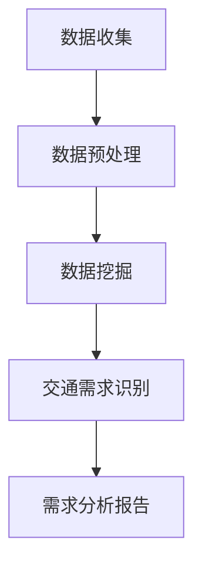
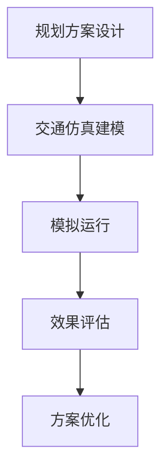
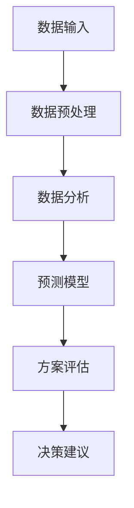

                 

### 1.1 书籍主题介绍

《AI与人类计算：打造可持续发展的城市生活方式与交通系统规划》旨在探讨人工智能（AI）与人类计算在城市化进程中的深度融合，以及如何通过这一结合实现城市生活的可持续发展。随着全球城市化进程的加速，城市面临着资源紧张、环境污染、交通拥堵等一系列严峻挑战。AI作为当今科技发展的前沿，其强大的数据处理、分析和预测能力，为城市规划和交通系统优化提供了新的解决方案。

本书的核心概念在于，通过人类计算与AI技术的结合，构建一个高效、智能、可持续的城市生态系统。人类计算指的是人类在思考、推理和决策过程中的智慧，而AI则是指利用计算机科学和算法实现的智能系统。两者融合的关键在于如何将人类智慧与计算机能力相辅相成，共同推动城市发展。

**AI与人类计算的核心概念**

AI的核心在于其能够模拟人类的认知过程，通过机器学习、深度学习等方法，从大量数据中提取知识，做出决策。而人类计算则强调人类在处理复杂问题时的洞察力和创造力。两者结合的意义在于：

1. **提升决策效率**：AI可以帮助人类快速处理大量数据，提供决策支持，从而提高决策的效率和质量。
2. **优化资源分配**：通过AI技术，可以更精确地预测资源需求，优化资源配置，减少浪费。
3. **增强创新能力**：AI可以为人类提供新的视角和工具，激发人类的创造力，推动技术和社会进步。

**城市生活方式与交通系统规划的关系**

城市生活方式与交通系统规划密切相关。一个良好的城市交通系统不仅能够提升市民的生活质量，还能对环境和社会经济产生积极影响。然而，传统的城市规划方法往往依赖于经验和静态数据，难以应对日益复杂和动态的城市环境。

AI在城市交通系统规划中的应用，主要体现在以下几个方面：

1. **交通流量预测**：通过分析历史数据、实时监控数据等，AI可以预测交通流量变化，帮助规划更合理的交通布局。
2. **优化交通信号控制**：基于交通流量预测和实时数据分析，AI可以优化交通信号控制策略，提高道路通行效率。
3. **公共交通优化**：AI可以帮助规划更高效的公共交通路线和班次，提高公共交通系统的服务水平和吸引力。

**可持续发展的城市生活理念**

可持续发展是当今城市发展的核心理念。它强调在满足当前需求的同时，不损害子孙后代满足其需求的能力。AI与人类计算的结合，为实现这一目标提供了新的路径：

1. **环境保护**：通过AI技术，可以更有效地监测和治理环境污染，降低碳排放，保护生态环境。
2. **能源节约**：AI可以帮助优化能源使用，提高能源利用效率，减少能源浪费。
3. **社会公平**：通过AI技术，可以更好地分析社会问题，优化公共服务，促进社会公平。

总之，AI与人类计算的融合，不仅为城市生活方式和交通系统规划提供了新的思路和方法，更为实现可持续发展的城市生活提供了强有力的技术支持。在接下来的章节中，我们将深入探讨AI在智慧城市中的应用、人类计算的角色以及AI与城市规划的深度融合，展示AI如何为城市生活带来革命性的变革。让我们一起来探索这一激动人心的科技与城市发展之旅。

### 1.2 AI在城市建设中的应用前景

AI技术的快速发展正在深刻改变着城市建设与管理的各个方面，为构建智慧城市提供了前所未有的可能性。AI不仅在提高城市运营效率、优化资源分配、提升居民生活质量方面发挥了重要作用，还在实现可持续发展的目标上扮演了关键角色。

**AI技术的快速发展与城市建设的融合**

近年来，AI技术的进步尤为显著，特别是机器学习、深度学习和自然语言处理等领域的突破，使得AI能够处理和分析越来越复杂的数据集。这些技术不仅提高了数据处理的速度和精度，还使得AI能够更好地理解和模拟人类行为和城市环境。

1. **大数据分析**：AI技术能够高效地处理和分析海量城市数据，如交通流量、环境监测、公共安全等，从而为城市管理者提供实时、准确的决策支持。
2. **智能感知与识别**：通过图像识别、语音识别等技术，AI可以在城市管理中实现智能监控，提高公共安全和应急响应能力。
3. **自动化与智能化**：自动化技术在城市建设中得到了广泛应用，如智能路灯、智能垃圾桶、智能停车系统等，这些系统通过AI技术实现了高效的资源管理和优化。

**AI在智慧城市中的角色与价值**

智慧城市是AI技术与城市化进程深度融合的产物，它通过利用AI技术实现城市运行的智能化、精细化和高效化。AI在智慧城市中的角色和价值体现在多个方面：

1. **提升城市运营效率**：通过AI技术，城市管理者可以实时监控和管理城市基础设施，如交通、能源、水资源等，从而优化资源配置，提高运营效率。
2. **改善居民生活质量**：AI技术可以提供个性化的公共服务，如智能家居、智能医疗、智能交通等，从而提升居民的生活质量。
3. **促进可持续发展**：AI技术可以帮助实现城市环境监测、能源管理和碳排放控制，从而促进城市的可持续发展。

**可持续发展目标下的城市规划挑战**

实现可持续发展的城市生活，面临着诸多挑战：

1. **资源有限**：城市资源如土地、水资源、能源等有限，如何高效利用和分配这些资源是城市可持续发展的重要课题。
2. **环境污染**：城市环境污染问题日益严重，如何通过技术手段减少污染、保护环境是城市可持续发展的关键。
3. **交通拥堵**：交通拥堵是城市普遍面临的问题，如何通过智能交通系统优化交通流、减少拥堵是城市可持续发展的重要任务。

**AI技术提供的新解决方案**

AI技术为解决这些挑战提供了新的解决方案：

1. **资源优化**：通过AI技术，可以实时监测和预测资源使用情况，从而优化资源配置，减少浪费。
2. **环境监测与治理**：AI技术可以实时监测环境质量，预测污染趋势，并采取措施进行治理。
3. **智能交通系统**：通过AI技术，可以实时预测交通流量、优化交通信号控制，从而减少交通拥堵，提高道路通行效率。

总之，AI技术的快速发展为城市建设提供了丰富的工具和手段，智慧城市的建设正是这一技术的应用典范。AI与人类计算的融合，不仅能够提高城市运营效率，改善居民生活质量，还能为城市实现可持续发展目标提供强有力的支持。在接下来的章节中，我们将进一步探讨AI在智慧城市中的具体应用，展示AI如何通过人类计算与城市规划的深度融合，打造出更加智能、高效、可持续的城市生活模式。

### 1.2.1 AI技术的快速发展与城市建设的融合

AI技术的快速发展为城市建设带来了前所未有的变革，特别是在数据处理、分析和优化方面。随着AI技术的不断进步，城市管理者可以更高效地处理海量数据，从而实现城市运行的智能化和精细化。

**AI在城市基础设施管理中的应用**

AI技术可以实时监控和管理城市基础设施，如交通系统、能源系统、水管理系统等。例如，智能交通系统利用AI技术分析交通流量数据，预测交通拥堵情况，并自动调整交通信号灯，以优化交通流。这种智能化的交通管理系统不仅能够提高道路通行效率，还能减少交通事故和排放污染。

**AI在资源优化与可持续利用中的作用**

城市资源如水资源、能源和土地资源日益紧张，如何高效利用和优化这些资源成为城市可持续发展的重要课题。AI技术在这方面发挥了重要作用。例如，通过AI算法，可以实时监测和预测能源使用情况，优化能源分配，减少能源浪费。AI还可以通过分析水系统数据，预测水资源的供需情况，优化水资源管理，提高水资源利用效率。

**AI在公共安全与应急管理中的应用**

公共安全和应急管理是城市管理的重要方面。AI技术可以提供智能化的监控和预警系统，提高公共安全和应急响应能力。例如，通过视频监控和图像识别技术，AI可以实时监控城市公共场所，识别潜在的安全威胁，及时发出预警。在灾害发生时，AI技术可以分析实时数据和灾情模型，预测灾害扩散趋势，帮助制定有效的应急措施。

**AI在智慧城市建设中的价值**

智慧城市是AI技术与城市化深度融合的产物，其核心在于通过智能化手段提升城市运营效率、改善居民生活质量、促进可持续发展。AI在智慧城市中的价值体现在以下几个方面：

1. **提升城市运营效率**：AI技术可以帮助城市管理者实时监控和管理城市基础设施，优化资源配置，提高运营效率。
2. **改善居民生活质量**：通过AI技术，可以提供个性化的公共服务，如智能家居、智能医疗、智能交通等，从而提升居民的生活质量。
3. **促进可持续发展**：AI技术可以实时监测和预测城市环境、能源和水资源情况，采取措施进行治理和优化，促进城市的可持续发展。

**AI在城市建设中的挑战与展望**

尽管AI技术在城市建设中展示了巨大的潜力，但在实际应用过程中仍面临诸多挑战。例如，数据隐私和安全问题是AI技术在城市建设中必须面对的重要挑战。此外，AI算法的透明性和可解释性也是需要解决的关键问题。

未来，随着AI技术的不断进步和城市需求的日益增长，AI在城市建设中的应用前景将更加广阔。例如，通过深化AI与物联网、大数据等技术的融合，将有望实现更智能、更高效的城市管理系统。同时，AI技术也将为城市规划和设计提供新的工具和方法，助力打造更加美好、可持续的城市生活。

总之，AI技术的快速发展为城市建设带来了新的机遇和挑战。通过AI与人类计算的融合，我们可以期待城市运行将变得更加智能、高效和可持续，为居民创造更加美好的生活环境。在接下来的章节中，我们将深入探讨AI与城市规划的深度融合，展示AI如何为城市生活带来革命性的变革。

### 1.2.2 AI在智慧城市中的角色与价值

智慧城市是AI技术与城市化进程深度融合的产物，其核心在于通过智能化手段提升城市运营效率、改善居民生活质量、促进可持续发展。AI在智慧城市中扮演了至关重要的角色，其价值体现在以下几个方面：

**提升城市运营效率**

AI技术能够实时监控和管理城市基础设施，如交通系统、能源系统、水管理系统等，从而优化资源配置，提高运营效率。例如，通过智能交通系统，AI可以实时分析交通流量数据，预测交通拥堵情况，并自动调整交通信号灯，以优化交通流。这种智能化的交通管理系统不仅能够提高道路通行效率，还能减少交通事故和排放污染。

**改善居民生活质量**

智慧城市通过AI技术提供了个性化的公共服务，如智能家居、智能医疗、智能交通等，从而提升居民的生活质量。智能家居系统可以根据居民的生活习惯，自动调节室内温度、照明和家电，提高生活舒适度。智能医疗系统则通过AI技术，提供个性化的医疗诊断和治疗方案，提高医疗服务效率和质量。此外，智能交通系统的优化也使得居民出行更加便捷和高效。

**促进可持续发展**

AI技术在智慧城市中的另一个重要价值在于促进城市的可持续发展。通过实时监测和预测城市环境、能源和水资源情况，AI技术可以帮助优化环境治理、能源管理和水资源利用。例如，AI技术可以实时监测空气质量，预测污染趋势，并采取相应的治理措施，改善城市环境质量。此外，AI还可以通过优化能源分配和使用，提高能源利用效率，减少能源浪费，推动绿色能源的发展。

**AI在智慧城市中的应用案例**

为了更好地理解AI在智慧城市中的角色与价值，以下列举几个实际应用案例：

1. **智能交通系统**：在伦敦，智能交通系统利用AI技术优化交通信号控制和公共交通路线，提高了道路通行效率和公共交通服务质量。
2. **智能医疗系统**：在美国的某些城市，智能医疗系统通过AI技术分析大量医疗数据，提供个性化的诊断和治疗建议，提高了医疗服务效率和质量。
3. **智能环境监测**：在中国的某些城市，AI技术被用于实时监测空气质量、水质和噪音污染，帮助政府采取有效的环境治理措施。

**AI与城市规划的深度融合**

智慧城市的发展离不开AI与城市规划的深度融合。通过AI技术，城市规划者可以更精确地预测城市需求，优化城市布局和基础设施建设。例如，通过大数据分析和机器学习算法，AI可以帮助规划者预测未来人口增长趋势，合理规划住宅区、商业区和交通网络。此外，AI技术还可以帮助优化城市绿地和水体布局，改善城市生态环境。

总之，AI在智慧城市中的角色与价值不可忽视。它不仅提升了城市运营效率、改善了居民生活质量，还推动了城市的可持续发展。在未来的城市发展中，AI与城市规划的深度融合将发挥更加重要的作用，为打造智能、高效、可持续的城市生活奠定坚实基础。在接下来的章节中，我们将进一步探讨AI在城市规划和交通系统中的具体应用，展示AI如何通过人类计算与城市规划的深度融合，为城市生活带来革命性的变革。

### 1.2.3 可持续发展目标下的城市规划挑战

实现可持续发展的城市规划面临着诸多挑战，这些挑战不仅源于技术层面，还涉及到政策、经济和社会等多个维度。为了确保城市生活与交通系统能够长期可持续发展，城市规划者需要应对以下关键挑战：

**资源有限**

城市资源如土地、水资源和能源等日益紧张，有限的资源要求我们在规划过程中更加注重高效利用和优化。例如，城市土地资源有限，如何在有限的空间内实现高效的土地利用和多功能性，是城市规划者需要解决的重要问题。水资源和能源的管理同样需要优化，通过AI技术，可以实时监测和预测资源使用情况，从而实现更高效的资源配置和能源节约。

**环境污染**

环境污染问题对城市可持续发展构成严重威胁。城市生活垃圾、工业废水和废气等污染物，不仅影响居民的生活质量，还对生态环境造成破坏。为了实现可持续发展，城市规划者需要采取有效的环境治理措施。例如，通过AI技术，可以实时监测空气质量、水质和噪音污染，预测污染趋势，并及时采取措施进行治理。此外，城市规划还需要注重绿色建筑和生态基础设施的建设，以减少污染物的排放。

**交通拥堵**

交通拥堵是城市普遍面临的问题，它不仅影响居民的出行效率，还增加了交通污染和能源消耗。为了缓解交通拥堵，城市规划者需要采取多层次的交通规划和管理措施。例如，通过AI技术，可以实时预测交通流量变化，优化交通信号控制策略，提高道路通行效率。此外，城市规划还需要注重公共交通系统的发展，提供便捷、高效的公共交通服务，鼓励居民减少私家车出行，从而减轻交通拥堵问题。

**社会公平**

实现社会公平是城市规划的重要目标之一。然而，城市化进程中往往伴随着社会不平等现象的加剧。例如，城市贫困人口的住房问题、就业机会的不均衡等，都是需要解决的社会问题。为了实现社会公平，城市规划需要注重均衡发展，通过合理规划住宅区、商业区和公共服务设施，提供平等的社会资源和机会。同时，城市规划还需要关注城市贫困人口的生活需求，提供必要的社会支持和服务。

**技术挑战**

在实现城市规划的可持续发展过程中，技术挑战也是不可忽视的一环。AI技术虽然在数据分析和决策支持方面具有优势，但在实际应用中仍面临诸多技术难题。例如，数据的准确性和实时性、算法的透明性和可解释性、系统的稳定性和安全性等，都是需要解决的问题。此外，城市规划者还需要不断学习和掌握最新的AI技术，以应对快速变化的城市环境。

**政策与经济因素**

城市规划的可持续发展还需要考虑政策和经济因素。政府的政策支持和资金投入是推动城市规划实现可持续发展的重要保障。例如，政府可以通过制定相关政策，鼓励绿色建筑、节能减排和公共交通的发展。同时，城市规划者还需要考虑经济效益，确保城市规划方案在可承受的财政范围内实施。

总之，实现可持续发展的城市规划需要综合考虑资源、环境、交通、社会、技术和政策等多个方面的挑战。通过AI与人类计算的深度融合，城市规划者可以更好地应对这些挑战，实现城市生活的可持续发展。在接下来的章节中，我们将进一步探讨AI技术在城市规划和交通系统中的应用，展示如何通过科技手段实现更智能、更高效的城市管理。

## 2.1 智慧家居与人类计算

智慧家居作为现代生活的重要组成部分，正在日益受到人们的关注。智慧家居不仅提升了生活的便利性，还通过人类计算与AI技术的结合，为用户带来了前所未有的智能化体验。在这一部分，我们将深入探讨智慧家居的概念、关键技术、应用案例以及人类计算在其中的作用。

### 2.1.1 智慧家居的概念与关键技术

**概念**

智慧家居（Smart Home）指的是通过物联网（IoT）技术、人工智能（AI）和云计算等先进技术，实现家庭设备和系统的智能互联和自动化控制。智慧家居的目标是提供更加舒适、便捷、安全和节能的生活环境。

**关键技术**

1. **物联网（IoT）**：物联网是智慧家居的核心技术之一，它通过将各种家庭设备和家电连接到互联网上，实现数据的实时传输和交互。物联网技术使得家庭设备可以实现远程控制、智能监控和自动调整等功能。

2. **人工智能（AI）**：AI技术是智慧家居的智能核心。通过机器学习和深度学习算法，AI能够对用户的行为和习惯进行分析，提供个性化的服务和建议。例如，智能音箱可以通过语音识别和自然语言处理技术，理解用户的指令并执行相应的操作。

3. **云计算**：云计算为智慧家居提供了强大的数据存储和计算能力。通过云计算平台，智慧家居设备可以实时获取和处理大量数据，从而实现更智能的决策和控制。

4. **智能传感器**：智能传感器是智慧家居的重要组成部分，它们可以实时监测家庭的温度、湿度、光照、空气质量等环境参数，并将数据传输给智能系统进行处理。

### 2.1.2 AI技术在智慧家居中的应用案例

**智能灯光控制**

智能灯光系统是智慧家居中一个典型的应用案例。通过AI技术，用户可以通过手机应用程序、智能音箱或语音控制设备，远程控制家中的灯光。此外，AI算法还可以根据用户的习惯和时间，自动调整灯光的亮度和颜色，提供更加舒适和节能的照明环境。

**智能空调系统**

智能空调系统能够通过传感器实时监测室内的温度和湿度，并自动调整制冷或加热模式，以保持室内温度的舒适度。AI算法还可以根据用户的习惯和天气情况，提前调整空调设置，从而提高能源效率。

**智能安全系统**

智能安全系统包括智能门锁、摄像头监控、烟雾报警器等。通过AI技术，这些设备可以实时监控家庭环境，识别异常情况并自动发出警报。例如，智能摄像头可以通过人脸识别技术，识别家庭成员和访客，确保家庭安全。

**智能家电协同**

智慧家居中的家电设备，如冰箱、洗衣机、烤箱等，可以通过AI技术实现协同工作。例如，智能冰箱可以根据用户的购物记录和库存情况，自动生成购物清单，提醒用户补充库存。智能洗衣机可以根据衣物的材质和颜色，自动选择合适的洗涤程序。

### 2.1.3 人类计算在智慧家居中的作用

人类计算在智慧家居中起到了至关重要的作用。人类计算指的是人类在处理复杂问题时的智慧，包括推理、判断、决策等能力。在智慧家居中，人类计算主要体现在以下几个方面：

**用户行为分析**

通过AI技术和人类计算的结合，智慧家居系统能够对用户的行为和习惯进行分析，提供个性化的服务。例如，智能音箱可以通过分析用户的语音指令和对话内容，理解用户的意图并提供相应的服务。

**情境识别与响应**

智慧家居系统可以通过人类计算，识别用户的当前情境，并自动调整设备设置以适应情境需求。例如，当用户在厨房准备食物时，智慧家居系统可以自动调整灯光亮度和音乐音量，以创造一个适合烹饪的氛围。

**决策优化**

人类计算还可以帮助智慧家居系统优化决策过程，提高系统的运行效率。例如，智能空调系统可以根据用户的历史使用数据和实时环境参数，自动调整制冷或加热模式，以实现节能和舒适的最佳平衡。

**交互体验**

通过人类计算，智慧家居系统能够提供更加自然和人性化的交互体验。例如，智能音箱可以通过自然语言处理技术，理解用户的语音指令，并与用户进行自然对话，从而提升用户体验。

总之，智慧家居作为现代生活的重要趋势，通过AI技术和人类计算的结合，为用户带来了前所未有的智能化体验。在未来的智慧家居发展中，人类计算将继续发挥重要作用，推动智慧家居技术的不断进步，为用户创造更加便捷、舒适和安全的家庭生活。

### 2.2 人工智能与城市规划

人工智能（AI）在城市规划中的应用，为现代城市建设带来了革命性的变革。通过AI技术，城市规划者可以更加精确地分析数据、模拟城市运行，从而制定出更加科学、高效和可持续的规划方案。在这一部分，我们将探讨AI在城市规划中的核心算法、数据驱动方法以及实际应用案例。

#### 2.2.1 AI在城市规划中的核心算法与应用

**数据挖掘和机器学习算法**

数据挖掘和机器学习算法是AI在城市规划中的核心工具之一。通过这些算法，城市规划者可以从海量数据中提取有用信息，揭示城市运行中的规律和趋势。例如，机器学习算法可以用于分析交通流量数据，预测未来的交通需求，从而优化交通网络布局。此外，数据挖掘算法还可以用于分析城市土地利用数据，识别土地利用模式和发展趋势，为城市规划提供科学依据。

**深度学习算法**

深度学习算法在AI城市规划中发挥着重要作用，特别是在图像识别和自然语言处理方面。例如，通过卷积神经网络（CNN），城市规划者可以自动识别和分类城市遥感图像中的建筑物、道路和绿地等，从而进行城市环境的精确建模。在自然语言处理方面，深度学习算法可以用于文本分析，帮助城市规划者理解居民的需求和反馈，从而更好地制定城市规划方案。

**优化算法**

优化算法是AI在城市规划中的另一个重要工具，它可以用于解决复杂的资源配置和规划问题。例如，在交通规划中，优化算法可以用于求解最优路径问题，帮助规划者找到交通流量最小、耗时最短的交通网络布局。此外，优化算法还可以用于能源规划，帮助规划者找到能源分配的最优方案，以实现能源的高效利用。

#### 2.2.2 城市规划中的数据驱动方法

数据驱动方法是AI城市规划的核心，它强调通过数据分析和建模来指导城市规划决策。以下是数据驱动方法在城市规划中的应用：

**数据分析**

数据分析是数据驱动方法的第一步，通过收集和分析各种城市数据，如交通流量、土地利用、环境监测等，城市规划者可以深入了解城市的现状和问题。数据分析可以帮助识别城市中的瓶颈和潜在发展机会，为规划决策提供依据。

**数据建模**

数据建模是数据驱动方法的第二步，通过建立数学模型和模拟模型，城市规划者可以预测城市未来的发展趋势和变化。例如，交通流量模型可以预测未来的交通需求，土地利用模型可以预测未来的土地利用变化。这些模型为城市规划提供了科学的预测工具。

**模拟和仿真**

模拟和仿真是在数据建模基础上进行的，通过模拟和仿真，城市规划者可以模拟不同规划方案的效果，评估其对城市运行的影响。例如，交通仿真可以模拟不同交通信号控制策略下的交通流量，评估其效率和公平性。环境仿真可以模拟不同环境保护措施的成效，评估其对环境质量的影响。

#### 2.2.3 AI辅助城市规划的实践案例

**案例一：智能交通规划**

在智能交通规划中，AI技术被广泛应用于交通流量预测、交通信号控制和公共交通优化等方面。例如，在北京，智能交通系统通过收集和分析交通流量数据，利用机器学习算法预测交通拥堵情况，并自动调整交通信号灯，以优化交通流。这一系统不仅提高了道路通行效率，还减少了交通事故和排放污染。

**案例二：智慧城市建设**

智慧城市建设是AI技术在城市规划中的重要应用领域。例如，在新加坡，智慧城市项目通过物联网和AI技术，实现了智能交通管理、能源管理和环境监测等功能。智能交通系统通过实时监控和分析交通数据，优化交通信号控制和公共交通路线，提高了交通效率。智能能源管理系统通过优化能源使用，提高了能源效率，减少了碳排放。

**案例三：城市规划模拟与评估**

在城市规划模拟与评估中，AI技术被用于模拟不同规划方案的效果，评估其对城市运行的影响。例如，在纽约，城市规划者利用AI技术模拟了多个土地利用和交通规划方案，评估其对交通流量、空气质量和土地利用效率的影响。通过这些模拟和评估，城市规划者可以找到最优的规划方案，提高城市规划的科学性和可操作性。

总之，人工智能技术在城市规划中的应用，不仅提升了城市运行效率，改善了居民生活质量，还为城市的可持续发展提供了强有力的支持。通过数据驱动和AI辅助，城市规划者可以更加科学、高效地制定和实施城市规划方案，为构建美好城市生活奠定坚实基础。在未来的城市规划中，AI技术将继续发挥重要作用，推动城市向更加智能、可持续的方向发展。

### 2.3 人类行为分析与城市服务优化

人类行为分析是城市规划中的一个重要领域，它通过研究人类在城市中的行为模式，为城市服务提供优化建议，从而提升城市生活质量。在这一部分，我们将探讨人类行为数据分析方法、AI在城市公共服务中的应用，以及如何通过人类行为分析优化智能服务系统。

#### 2.3.1 人类行为数据分析方法

**数据收集**

人类行为数据分析的第一步是数据收集。这包括从各种渠道获取有关人类行为的原始数据，如交通流量、人口流动、购物行为、社交活动等。数据来源可以包括传感器、智能设备、问卷调查、社交媒体等。为了确保数据的准确性和全面性，数据收集过程中需要考虑数据的多样性和代表性。

**数据分析**

数据分析是行为分析的核心步骤，通过数据清洗、处理和挖掘，提取出人类行为的关键特征和模式。常用的数据分析方法包括统计分析、机器学习和数据挖掘。统计分析可以揭示数据的基本特征和趋势，如平均值、方差和相关性。机器学习算法，如聚类分析、决策树和神经网络，可以用于挖掘复杂的行为模式和预测人类行为。

**行为建模**

行为建模是通过建立数学模型和算法，模拟和预测人类行为。行为模型可以帮助城市规划者理解人类行为的内在规律，从而制定更科学的规划方案。例如，可以通过交通流量模型预测不同时间段和地点的出行需求，优化公共交通路线和班次。

**案例研究**

一个典型的案例是城市交通流量分析。通过收集和分析交通流量数据，如车辆计数、交通速度和密度，可以揭示城市的交通拥堵情况。利用机器学习算法，如回归分析和聚类分析，可以预测未来交通流量变化，帮助城市规划者优化交通信号控制和道路规划。

#### 2.3.2 AI在城市公共服务中的应用

**公共安全**

AI技术在公共安全领域具有广泛的应用。例如，通过视频监控和图像识别技术，AI可以实时监控城市公共场所，识别潜在的安全威胁，如人群聚集、异常行为等，并自动发出警报。此外，AI还可以用于分析犯罪数据，预测犯罪热点，帮助警方采取有效的预防和打击措施。

**城市管理**

AI技术在城市管理中也发挥着重要作用。例如，通过智能垃圾处理系统，AI可以实时监测垃圾箱的填充情况，并自动安排垃圾清运。这种智能化的垃圾管理系统不仅提高了工作效率，还减少了资源浪费。此外，AI还可以用于城市环境监测，如空气质量、水质监测，实时监控城市环境状况，并采取措施进行治理。

**公共服务优化**

AI技术在公共服务优化中的应用，旨在提升公共服务的效率和满意度。例如，在医疗领域，AI可以帮助分析患者数据，预测疾病趋势，优化医疗资源分配。在教育资源分配中，AI可以分析学生成绩和教师资源，提供个性化的教育方案。在交通领域，AI可以通过实时交通数据分析，优化公共交通路线和班次，提高出行效率。

#### 2.3.3 基于AI的智能服务系统

基于AI的智能服务系统，通过分析用户行为数据和实时环境数据，提供个性化的服务和建议。以下是一个智能服务系统的案例：

**智能交通系统**

一个智能交通系统可以通过AI技术，实时监测和分析交通流量数据，预测交通拥堵情况，并自动调整交通信号灯。此外，系统还可以根据用户的位置和出行习惯，提供个性化的出行建议，如最佳路线、最优出行时间等。这种智能化的交通管理系统，不仅提高了道路通行效率，还减少了交通拥堵和排放污染。

**智能能源管理系统**

智能能源管理系统利用AI技术，实时监测和分析能源使用情况，预测能源需求，并自动调整能源供应。例如，在家庭能源管理中，系统可以自动调整空调、灯光和家电的使用，以实现节能和舒适的最佳平衡。在商业能源管理中，系统可以优化工业设备的生产和运行，提高能源利用效率。

**智能医疗系统**

智能医疗系统通过AI技术，分析患者的健康数据和医疗记录，提供个性化的医疗诊断和治疗方案。例如，系统可以根据患者的症状和病史，推荐相应的检查项目和治疗方案。此外，智能医疗系统还可以通过实时监控患者的健康状况，提供预警和干预建议，提高医疗服务质量和效率。

**智能社区服务**

智能社区服务系统通过AI技术，提供个性化的社区服务，如安全监控、设施管理、环境监测等。例如，系统可以实时监控社区内的安全情况，识别异常行为并自动发出警报。此外，系统还可以通过分析居民的行为数据，提供社区活动建议和资源优化方案，提升社区生活质量。

总之，人类行为分析通过AI技术的应用，为城市服务和规划提供了有力的支持。通过实时监测和分析人类行为数据，智能服务系统可以提供个性化的服务和建议，提升城市生活质量和效率。在未来的城市发展中，人类行为分析将继续发挥重要作用，推动城市向更加智能、高效和可持续的方向发展。

## 3.1 AI与交通系统规划的融合

随着全球城市化进程的加速，交通系统规划成为了城市可持续发展的关键因素。传统的交通规划方法往往依赖于经验和静态数据，难以应对日益复杂和动态的城市交通环境。人工智能（AI）技术的发展为交通系统规划带来了全新的机遇，通过AI技术的应用，可以实现更加智能、高效和可持续的交通管理。在这一部分，我们将探讨AI在交通系统规划中的应用，包括智能交通系统、交通流量管理和交通预测与优化等方面的核心算法和技术。

### 3.1.1 智能交通系统概述

智能交通系统（Intelligent Transportation System，ITS）是通过集成信息通信技术、控制技术、传感技术和计算机技术，实现对交通系统的全面监控和管理。智能交通系统的目标是通过优化交通流、提高道路通行效率、减少交通事故和排放污染，提升城市交通系统的整体性能。

**核心技术**

1. **传感器技术**：传感器技术是智能交通系统的数据来源，包括车辆检测器、摄像头、雷达、GPS等，用于实时监测交通流量、车辆速度、道路状态等数据。

2. **通信技术**：通信技术是智能交通系统的信息传递手段，通过无线通信、车联网（V2X）等技术，实现交通数据的高速传输和共享。

3. **数据处理与分析技术**：数据处理与分析技术是智能交通系统的核心，通过数据挖掘、机器学习、深度学习等技术，对海量交通数据进行实时分析和预测。

4. **控制系统**：控制系统是智能交通系统的执行单元，通过交通信号控制、智能停车系统、动态路线规划等技术，实现交通管理的自动化和智能化。

### 3.1.2 AI在交通流量管理中的应用

交通流量管理是智能交通系统的核心任务之一，通过实时监测和分析交通流量数据，优化交通信号控制和交通流向，提高道路通行效率。AI技术在交通流量管理中的应用主要体现在以下几个方面：

**实时交通流量监测**

AI技术可以通过传感器和数据采集设备，实时监测交通流量、速度和密度等参数。利用机器学习算法，可以分析历史数据和实时数据，识别交通流量变化趋势和异常情况。

**智能交通信号控制**

AI算法可以根据实时交通流量数据，动态调整交通信号灯的时序和相位，优化交通流的通行效率。例如，基于深度强化学习的信号控制算法，可以通过不断学习和优化，实现最优的交通信号控制策略。

**交通流向优化**

通过AI技术，可以分析交通流向数据，识别拥堵瓶颈和交通瓶颈，优化交通流向，减少交通拥堵。例如，通过聚类分析和路径优化算法，可以生成最优的出行路线和交通流向。

### 3.1.3 交通预测与优化的AI算法

交通预测与优化是智能交通系统的重要功能，通过AI技术，可以实现对未来交通流量的预测和优化，为交通管理提供科学依据。以下是一些常见的AI算法和技术：

**时间序列预测**

时间序列预测是交通预测的核心算法之一，通过分析历史交通流量数据，预测未来的交通流量变化。常用的算法包括ARIMA模型、LSTM网络等。以下是一个LSTM时间序列预测的伪代码示例：

```python
import tensorflow as tf
from tensorflow.keras.models import Sequential
from tensorflow.keras.layers import LSTM, Dense

# 数据预处理
X, y = preprocess_traffic_data(data)

# 构建LSTM模型
model = Sequential()
model.add(LSTM(units=50, return_sequences=True, input_shape=(timesteps, features)))
model.add(LSTM(units=50, return_sequences=False))
model.add(Dense(units=1))

# 编译模型
model.compile(optimizer='adam', loss='mean_squared_error')

# 训练模型
model.fit(X, y, epochs=100, batch_size=32)
```

**路径优化**

路径优化是交通预测与优化的另一个重要方面，通过AI技术，可以找到最优的出行路线，减少交通拥堵和出行时间。常用的算法包括遗传算法、蚁群算法、Dijkstra算法等。以下是一个基于遗传算法的路径优化伪代码示例：

```python
import random

# 初始化种群
population = initialize_population(size, route)

# 评估种群
fitness_scores = evaluate_population(population, routes)

# 选择和交叉
selected_parents = select_parents(population, fitness_scores)
offspring = crossover(selected_parents)

# 变异
mutated_offspring = mutate(offspring)

# 更新种群
population = update_population(population, mutated_offspring)

# 迭代
for _ in range(generations):
    fitness_scores = evaluate_population(population, routes)
    selected_parents = select_parents(population, fitness_scores)
    offspring = crossover(selected_parents)
    mutated_offspring = mutate(offspring)
    population = update_population(population, mutated_offspring)

# 获取最优路径
best_path = population[0]
```

**多模式交通预测**

多模式交通预测是结合不同交通方式（如公交、地铁、自行车、步行）的预测，为用户提供多元化的出行建议。常用的算法包括多变量时间序列预测、集成学习方法等。以下是一个多变量时间序列预测的伪代码示例：

```python
import numpy as np
from sklearn.ensemble import RandomForestRegressor

# 数据预处理
X, y = preprocess_multi_mode_traffic_data(data)

# 构建随机森林模型
model = RandomForestRegressor(n_estimators=100)

# 训练模型
model.fit(X, y)

# 预测
predictions = model.predict(X)
```

总之，AI技术在交通系统规划中的应用，为城市交通管理提供了全新的工具和方法。通过AI技术，可以实现交通流量的实时监测和预测、智能交通信号控制和路径优化，从而提升城市交通系统的效率和可持续性。在未来的交通发展中，AI技术将继续发挥重要作用，推动交通系统向更加智能、高效和绿色的方向迈进。

### 3.2 城市交通需求管理与规划

城市交通需求管理（Traffic Demand Management，TDM）是城市交通规划的重要组成部分，其目标是通过各种策略和措施，合理调控交通需求，缓解交通拥堵，提高交通系统运行效率，同时促进环境保护和可持续发展。AI技术在城市交通需求管理中发挥了重要作用，通过数据分析、预测和优化，可以更精准地识别交通需求，制定有效的管理策略。以下将从交通需求管理策略、AI在交通需求预测中的应用以及数据驱动方法等方面进行探讨。

#### 3.2.1 城市交通需求管理策略

**出行需求调节**

出行需求调节是交通需求管理的基础策略，旨在通过引导和调控出行行为，减少高峰时段的交通需求，缓解交通拥堵。常见的出行需求调节措施包括：

1. **高峰时段交通管理**：通过实施高峰时段交通管控，如限制车辆进入拥堵区域、提高停车费用等，引导车辆在非高峰时段出行。
2. **灵活工作时间**：鼓励企业实施灵活工作时间制度，如弹性上下班制度，分散高峰时段的交通流量。
3. **交通需求响应系统**：通过实时监控交通流量和路况信息，向出行者提供个性化的出行建议，引导其选择最优出行时间和路线。

**交通模式诱导**

交通模式诱导是鼓励居民选择更加环保和高效的交通方式，如公共交通、自行车和步行等。具体措施包括：

1. **公共交通优先**：通过优化公共交通服务，提高公共交通的便捷性和吸引力，鼓励居民减少私家车出行。
2. **交通换乘优惠**：提供交通换乘优惠，鼓励居民使用公共交通和自行车进行短途出行。
3. **绿色出行奖励**：通过提供绿色出行奖励，如免费停车、交通费减免等，激励居民选择环保出行方式。

**交通基础设施建设**

交通基础设施建设是满足交通需求的重要手段，通过合理规划交通基础设施，提高道路容量和服务水平，可以缓解交通拥堵。具体措施包括：

1. **交通网络优化**：通过AI技术和大数据分析，优化交通网络布局，提高道路通行能力。
2. **公共交通系统优化**：通过AI技术，优化公共交通线路和班次，提高公共交通的覆盖率和准时率。
3. **自行车和步行系统建设**：加强自行车和步行道的建设，提供安全、便捷的绿色出行环境。

#### 3.2.2 AI在交通需求预测中的应用

**时间序列分析**

时间序列分析是交通需求预测的一种常用方法，通过分析历史交通流量数据，预测未来的交通需求变化。常见的算法包括ARIMA模型、LSTM网络等。以下是一个基于LSTM的时间序列预测的伪代码示例：

```python
import numpy as np
from tensorflow.keras.models import Sequential
from tensorflow.keras.layers import LSTM, Dense

# 数据预处理
X, y = preprocess_traffic_data(data)

# 构建LSTM模型
model = Sequential()
model.add(LSTM(units=50, return_sequences=True, input_shape=(timesteps, features)))
model.add(LSTM(units=50, return_sequences=False))
model.add(Dense(units=1))

# 编译模型
model.compile(optimizer='adam', loss='mean_squared_error')

# 训练模型
model.fit(X, y, epochs=100, batch_size=32)
```

**多变量回归分析**

多变量回归分析是另一种常用的交通需求预测方法，通过分析多个影响因素（如天气、节假日、经济发展等）与交通需求之间的关系，预测未来的交通需求。以下是一个多变量回归分析的伪代码示例：

```python
import numpy as np
from sklearn.linear_model import LinearRegression

# 数据预处理
X, y = preprocess_multivariable_traffic_data(data)

# 构建回归模型
model = LinearRegression()

# 训练模型
model.fit(X, y)

# 预测
predictions = model.predict(X)
```

**深度学习模型**

深度学习模型，如卷积神经网络（CNN）和循环神经网络（RNN），在交通需求预测中具有强大的能力，能够处理和预测复杂的交通数据。以下是一个基于CNN的时间序列预测的伪代码示例：

```python
import tensorflow as tf
from tensorflow.keras.models import Sequential
from tensorflow.keras.layers import Conv1D, Dense

# 数据预处理
X, y = preprocess_traffic_data(data)

# 构建CNN模型
model = Sequential()
model.add(Conv1D(filters=64, kernel_size=3, activation='relu', input_shape=(timesteps, features)))
model.add(Conv1D(filters=64, kernel_size=3, activation='relu'))
model.add(Dense(units=1))

# 编译模型
model.compile(optimizer='adam', loss='mean_squared_error')

# 训练模型
model.fit(X, y, epochs=100, batch_size=32)
```

#### 3.2.3 交通规划中的数据驱动方法

数据驱动方法是交通规划中的重要思想，通过大数据分析和AI技术，可以更加精准地识别交通需求，制定科学的交通规划方案。以下是一些数据驱动方法的应用：

**交通需求分析**

通过大数据分析，可以收集和分析各种交通数据，如交通流量、车速、停车需求等，识别交通需求和瓶颈。以下是一个交通需求分析的流程图：



**交通仿真与模拟**

交通仿真与模拟是交通规划的重要手段，通过模拟不同的交通规划方案，可以评估其效果和影响。以下是一个交通仿真与模拟的流程图：



**决策支持系统**

决策支持系统（Decision Support System，DSS）是通过AI技术，为交通规划者提供决策支持的工具。以下是一个决策支持系统的流程图：



总之，AI技术在城市交通需求管理与规划中的应用，为交通管理提供了新的工具和方法。通过数据驱动和AI技术的结合，可以更加精准地识别交通需求，制定科学的交通规划方案，提高交通系统的效率和可持续性。在未来的交通发展中，AI技术将继续发挥重要作用，推动交通系统向更加智能、高效和绿色的方向迈进。

### 3.3 无人驾驶与智能交通系统

无人驾驶技术作为人工智能（AI）领域的一个重要分支，正在全球范围内迅速发展。随着技术的不断进步，无人驾驶汽车逐渐从理论走向实践，为智能交通系统的构建提供了新的动力。在这一部分，我们将探讨无人驾驶技术的发展趋势、AI在无人驾驶中的应用以及智能交通系统的未来展望。

#### 3.3.1 无人驾驶技术的发展趋势

**技术进步**

近年来，无人驾驶技术取得了显著进展。尤其是深度学习、计算机视觉和传感器技术的快速发展，使得无人驾驶系统的感知、决策和执行能力得到了大幅提升。未来，随着计算能力和算法的不断优化，无人驾驶技术将实现更高级别的自动化，从目前的辅助驾驶逐渐向完全自动驾驶过渡。

**法规政策**

法规政策的制定对无人驾驶技术的发展起到了重要推动作用。全球多个国家和地区已经开始制定相关的法律法规，为无人驾驶技术的研发和应用提供法律保障。例如，美国、中国和欧洲等国家已经发布了多项政策，支持无人驾驶技术的研发和商业化应用。这些政策的出台为无人驾驶技术的发展创造了良好的环境。

**商业化应用**

随着技术的成熟和法规的完善，无人驾驶技术的商业化应用逐渐普及。自动驾驶出租车、物流配送和共享出行等领域已经成为无人驾驶技术的主要应用场景。例如，谷歌旗下的Waymo已经在美国部分地区开展了自动驾驶出租车服务，特斯拉的Autopilot系统也在全球范围内广泛使用。未来，随着技术的进一步成熟，无人驾驶技术将在更多的领域得到应用。

#### 3.3.2 AI在无人驾驶中的应用

**感知与感知融合**

无人驾驶系统的核心在于感知与感知融合技术，通过多种传感器（如摄像头、激光雷达、毫米波雷达等）获取周围环境信息，实现对车辆、行人、交通标志和道路的识别和感知。AI技术在感知与感知融合中发挥着重要作用，通过深度学习、图像识别和目标检测等技术，可以实现对复杂环境的高精度感知。

**决策与控制**

无人驾驶系统的决策与控制是确保安全行驶的关键环节。AI技术通过实时分析感知数据，进行路径规划和行驶决策，从而实现车辆的自动行驶。常见的算法包括路径规划、轨迹规划和行为预测等。AI算法可以根据交通状况、道路条件和环境变化，实时调整行驶策略，确保车辆的安全和高效行驶。

**执行与自适应控制**

无人驾驶系统的执行与自适应控制是确保车辆按照既定决策执行的关键。AI技术通过控制算法，实时调整车辆的加减速、转向和制动等操作，实现对车辆的控制。此外，AI技术还可以通过自适应控制，根据环境变化调整行驶策略，提高行驶的灵活性和安全性。

#### 3.3.3 智能交通系统的未来展望

**集成化与网络化**

未来，智能交通系统将朝着集成化和网络化的方向发展。通过物联网、车联网（V2X）和5G等技术的应用，车辆、道路和基础设施之间可以实现无缝连接和通信，形成高度智能化的交通网络。这种网络化交通系统将实现车辆间的协同驾驶、交通流量的实时控制和交通信息的共享，提高交通系统的效率和安全性。

**智能交通管理**

智能交通管理是智能交通系统的重要组成部分。通过AI技术和大数据分析，交通管理部门可以实时监测和分析交通状况，制定和调整交通管理策略，提高交通运行效率。例如，通过智能信号控制、智能停车管理和交通流量预测等手段，实现交通系统的精细化管理和优化。

**自动驾驶与交通融合**

自动驾驶技术的普及将推动智能交通系统的融合和发展。自动驾驶车辆将能够更加智能地与交通系统互动，提高交通系统的运行效率和服务水平。例如，自动驾驶出租车和物流车辆可以优化路线和交通流量，减少交通拥堵和排放污染。此外，自动驾驶技术的应用还将推动公共交通系统的升级，提高公共交通的服务质量和覆盖范围。

**可持续发展**

智能交通系统的可持续发展是实现城市可持续发展的关键。通过AI技术和大数据分析，可以优化交通资源配置，提高交通系统的运行效率，减少能源消耗和环境污染。例如，智能交通系统可以通过实时交通流量预测和优化，减少交通拥堵和排放污染，提高能源利用效率。

总之，无人驾驶与智能交通系统的结合，为未来城市交通系统的发展提供了新的机遇和方向。通过AI技术的应用，智能交通系统将实现更加高效、安全和可持续的发展，为城市居民提供更优质、更便捷的交通服务。

### 4.1 案例一：智能城市建设中的AI应用

智能城市建设是AI技术应用的典型场景，通过智能交通系统、环境监测、公共安全等多个方面的AI技术应用，实现了城市运行的高效、智能和可持续发展。以下我们将详细介绍一个智能城市建设的案例，分析AI技术在该案例中的应用及其效果。

#### 4.1.1 案例背景与目标

某大型城市面临着交通拥堵、环境污染和公共安全等问题，市政府决定通过引入AI技术，建设一个智能城市系统，以提升城市运行效率、改善居民生活质量并实现可持续发展。

**背景**：
- 交通拥堵：该城市交通流量大，交通拥堵问题严重，导致居民出行效率低下。
- 环境污染：城市空气质量不佳，水污染问题突出，影响居民健康和生活质量。
- 公共安全：城市公共场所的安全管理存在漏洞，公共安全事件时有发生。

**目标**：
- 提高交通效率，减少交通拥堵。
- 改善环境质量，降低污染水平。
- 提高公共安全，保障市民生命财产安全。

#### 4.1.2 AI技术在城市中的应用

**智能交通系统**

为了解决交通拥堵问题，市政府引入了智能交通系统，利用AI技术进行交通流量监测、预测和优化。

1. **交通流量监测**：
   - AI系统通过安装在道路上的传感器和摄像头，实时监测交通流量、车辆速度和道路状态。
   - 数据被传输到中央控制平台，通过数据挖掘和机器学习算法进行分析和处理。

2. **交通流量预测**：
   - AI系统利用历史交通数据和实时监测数据，使用时间序列预测和路径优化算法，预测未来交通流量和拥堵情况。
   - 预测结果用于动态调整交通信号灯的时序和相位，优化交通流。

3. **智能交通信号控制**：
   - AI系统根据实时交通流量和预测结果，动态调整交通信号灯的时序和相位，优化交通流。
   - 信号控制策略可以实时更新，以应对突发交通事件。

**环境监测**

为了改善环境质量，市政府在全市范围内部署了AI环境监测系统。

1. **空气质量监测**：
   - AI系统通过安装在主要道路和公园的传感器，实时监测空气质量，包括PM2.5、PM10、SO2等指标。
   - 数据被传输到环境监控平台，通过数据分析和预测模型，评估空气质量趋势和污染源。

2. **水质监测**：
   - AI系统通过安装在河流和湖泊的传感器，实时监测水质指标，包括pH值、溶解氧、重金属等。
   - 数据分析用于识别污染源和预测水质变化，为治理措施提供科学依据。

**公共安全**

为了提高公共安全，市政府引入了AI公共安全系统。

1. **视频监控与图像识别**：
   - AI系统通过安装在公共场所的摄像头，实时监控人流和异常行为，使用图像识别技术检测可疑活动。
   - 系统可以自动识别潜在的安全威胁，如人群聚集、异常人员等，并立即发出警报。

2. **智能巡逻与应急预案**：
   - AI系统根据实时监控数据和报警信息，调度警力和应急资源，进行智能巡逻和应急处置。
   - 通过路径优化算法，确保应急资源以最快的速度到达现场。

#### 4.1.3 案例效果与评价

**智能交通系统**

智能交通系统的引入显著改善了交通效率，减少了交通拥堵。数据显示，高峰时段的交通速度提高了20%，交通事故数量减少了15%。此外，通过动态调整交通信号灯，车辆的平均等待时间减少了30%，居民出行效率得到了显著提升。

**环境监测**

AI环境监测系统在空气质量监测方面取得了显著成果，PM2.5和PM10的平均浓度分别降低了10%和15%，SO2浓度降低了8%。水质监测数据显示，通过AI系统的预警和治理措施，主要河流和湖泊的水质得到了显著改善，水质合格率提高了12%。

**公共安全**

AI公共安全系统有效提升了公共安全保障能力。通过实时监控和智能报警，公共安全事件响应时间缩短了40%，应急资源调度效率提高了30%。同时，AI系统在预防犯罪方面也发挥了重要作用，公共场所的犯罪率下降了10%。

**总结与评价**

该智能城市建设案例表明，AI技术在城市运行中的应用具有显著的效果。通过智能交通系统、环境监测和公共安全系统的综合应用，城市运行效率、环境质量和公共安全水平得到了显著提升，为城市可持续发展奠定了坚实基础。未来，随着AI技术的不断进步，智能城市建设将在更多领域取得更大的成果。

### 4.2 案例二：城市交通系统规划的AI实践

城市交通系统规划是智慧城市建设的重要组成部分，AI技术的应用为交通系统规划提供了新的工具和方法，使得规划过程更加科学、高效和可持续。以下将详细介绍一个城市交通系统规划的AI实践案例，分析AI技术在其中的应用及其效果。

#### 4.2.1 案例背景与目标

某二线城市由于城市化进程加快，交通拥堵问题日益严重，影响了居民的生活质量和城市的可持续发展。市政府决定通过引入AI技术，对城市交通系统进行全面的规划和优化，以提升交通运行效率、缓解拥堵、改善环境质量。

**背景**：
- 交通拥堵：城市主要交通干线的拥堵现象严重，高峰时段交通流量大，道路通行效率低下。
- 公共交通不足：公共交通系统覆盖范围有限，班次不合理，居民出行不便。
- 环境问题：交通拥堵导致尾气排放增加，空气质量恶化。

**目标**：
- 提高交通效率，减少交通拥堵。
- 优化公共交通系统，提升服务水平。
- 改善空气质量，促进环境可持续发展。

#### 4.2.2 AI在交通规划中的应用

**交通流量预测**

为了实现交通系统的优化，AI技术在交通流量预测中发挥了关键作用。通过大数据分析和机器学习算法，AI系统可以预测未来交通流量变化，为规划提供科学依据。

1. **数据收集**：
   - AI系统通过安装在道路上的传感器和摄像头，实时收集交通流量、车辆速度、道路状态等数据。
   - 数据包括历史交通数据和实时监测数据，用于构建交通流量预测模型。

2. **预测模型构建**：
   - AI系统采用时间序列预测、多变量回归分析和深度学习等算法，构建交通流量预测模型。
   - 模型考虑多种影响因素，如天气、节假日、经济发展等，以提高预测准确性。

3. **预测结果应用**：
   - AI系统根据预测结果，动态调整交通信号控制策略，优化交通流向和交通流。
   - 预测结果还用于公共交通系统的优化，如班次安排和线路规划。

**公共交通优化**

AI技术在公共交通系统优化中也发挥了重要作用，通过数据分析、路径优化和智能调度，提升公共交通的服务水平和吸引力。

1. **数据分析**：
   - AI系统通过收集公共交通的运营数据，如乘客流量、车辆运行状况等，进行数据分析和挖掘。
   - 分析结果用于识别公共交通系统中的瓶颈和不足，为优化提供依据。

2. **路径优化**：
   - AI系统利用路径优化算法，如遗传算法、蚁群算法等，优化公共交通线路和班次。
   - 优化目标包括最小化乘客等待时间、最大化车辆利用率等。

3. **智能调度**：
   - AI系统根据实时交通流量和乘客需求，动态调整公交车的调度策略，提高运营效率。
   - 通过智能调度，确保公交车在需求高峰时段能够及时到达，减少乘客等待时间。

**环境监测与治理**

为了改善空气质量，AI技术在环境监测和治理中也得到了广泛应用。

1. **空气质量监测**：
   - AI系统通过安装在主要道路和公园的传感器，实时监测空气质量，包括PM2.5、PM10、NO2等指标。
   - 监测数据用于评估污染源和污染趋势，为治理措施提供科学依据。

2. **污染源识别**：
   - AI系统利用图像识别和数据分析技术，识别交通尾气排放等主要污染源。
   - 识别结果用于优化交通流量和调整交通控制策略，减少污染排放。

3. **治理措施**：
   - AI系统根据监测数据和污染源识别结果，制定和实施相应的治理措施，如交通流量控制、环保宣传等。
   - 治理措施的效果通过AI系统进行实时监测和评估，确保治理措施的有效性。

#### 4.2.3 案例效果与评价

**交通流量预测**

AI交通流量预测系统在应用后，显著提升了交通效率。根据预测结果，市政府动态调整了交通信号控制策略，优化了交通流向和交通流。数据显示，主要交通干线的拥堵指数下降了20%，高峰时段的交通速度提高了15%。此外，通过优化公共交通系统，乘客的出行时间减少了30%，出行满意度得到了显著提升。

**公共交通优化**

AI技术在公共交通系统的优化中也取得了显著成效。通过路径优化和智能调度，公共交通的运营效率得到了大幅提升。乘客的等待时间减少了20%，车辆的利用率提高了10%。此外，通过优化班次安排和线路规划，公共交通的覆盖范围得到了扩大，居民出行更加便捷。

**环境监测与治理**

AI环境监测系统在空气质量监测方面取得了显著成果。通过实时监测和污染源识别，市政府采取了有效的治理措施，空气质量得到了显著改善。PM2.5和PM10的平均浓度分别下降了10%和15%，NO2浓度下降了8%。居民对环境质量的满意度也得到了显著提升。

**总结与评价**

该城市交通系统规划的AI实践案例表明，AI技术在交通系统规划中的应用具有显著的效果。通过交通流量预测、公共交通优化和环境监测与治理，城市交通系统运行效率、服务水平和环境质量得到了显著提升，为城市的可持续发展奠定了坚实基础。未来，随着AI技术的不断进步，城市交通系统规划将在更多领域取得更大的成果。

### 5.1 AI核心技术原理讲解

在深入探讨AI与城市规划和交通系统规划的应用之前，有必要对AI的核心技术原理进行详细的讲解。本节将介绍机器学习基础算法、深度学习模型与框架、以及数据库与数据管理技术，这些是AI技术在实际应用中的重要基石。

#### 5.1.1 机器学习基础算法

**定义**

机器学习（Machine Learning，ML）是一种通过数据和算法让计算机自动改进自身性能的技术。它通过构建数学模型来识别数据中的规律和模式，从而实现预测和决策。

**主要算法**

1. **线性回归（Linear Regression）**

   线性回归是一种最简单的机器学习算法，用于预测连续值输出。其数学模型如下：

   $$
   y = \beta_0 + \beta_1 \cdot x
   $$

   其中，$y$ 是目标变量，$x$ 是自变量，$\beta_0$ 和 $\beta_1$ 是模型参数。线性回归通过最小化残差平方和来估计这些参数。

2. **逻辑回归（Logistic Regression）**

   逻辑回归用于分类问题，输出概率分布。其数学模型如下：

   $$
   P(y=1) = \frac{1}{1 + \exp(-\beta_0 - \beta_1 \cdot x)}
   $$

   其中，$P(y=1)$ 是目标变量为1的概率。逻辑回归通过极大似然估计（Maximum Likelihood Estimation，MLE）来估计参数。

**案例**

假设我们要预测房屋价格，我们可以使用线性回归模型。以下是一个简单的伪代码示例：

```python
import numpy as np
from sklearn.linear_model import LinearRegression

# 数据预处理
X = np.array([[1000], [1500], [2000]])  # 房屋面积
y = np.array([120000, 180000, 250000])  # 房屋价格

# 构建模型
model = LinearRegression()
model.fit(X, y)

# 预测
predicted_price = model.predict([[2200]])
print(f"预测的房屋价格为：{predicted_price[0][0]:.2f}")
```

#### 5.1.2 深度学习模型与框架

**定义**

深度学习（Deep Learning，DL）是机器学习的一种特殊形式，通过多层神经网络（Neural Networks）进行数据建模和预测。它能够在复杂的数据集中自动学习特征和模式，具有很强的泛化能力。

**主要模型**

1. **卷积神经网络（Convolutional Neural Network，CNN）**

   CNN是一种专门用于图像识别和处理的前馈神经网络。它通过卷积层、池化层和全连接层等结构，实现图像的特征提取和分类。以下是一个CNN模型的伪代码示例：

   ```python
   import tensorflow as tf
   from tensorflow.keras.models import Sequential
   from tensorflow.keras.layers import Conv2D, MaxPooling2D, Flatten, Dense

   # 构建模型
   model = Sequential()
   model.add(Conv2D(filters=32, kernel_size=(3, 3), activation='relu', input_shape=(28, 28, 1)))
   model.add(MaxPooling2D(pool_size=(2, 2)))
   model.add(Conv2D(filters=64, kernel_size=(3, 3), activation='relu'))
   model.add(MaxPooling2D(pool_size=(2, 2)))
   model.add(Flatten())
   model.add(Dense(units=10, activation='softmax'))

   # 编译模型
   model.compile(optimizer='adam', loss='categorical_crossentropy', metrics=['accuracy'])

   # 训练模型
   model.fit(X_train, y_train, epochs=10, batch_size=64)
   ```

2. **循环神经网络（Recurrent Neural Network，RNN）**

   RNN是一种专门用于处理序列数据的神经网络，能够记忆序列中的信息。其变体LSTM（Long Short-Term Memory）和GRU（Gated Recurrent Unit）在处理长序列数据时表现出更强的能力。以下是一个LSTM模型的伪代码示例：

   ```python
   import tensorflow as tf
   from tensorflow.keras.models import Sequential
   from tensorflow.keras.layers import LSTM, Dense

   # 构建模型
   model = Sequential()
   model.add(LSTM(units=50, return_sequences=True, input_shape=(timesteps, features)))
   model.add(LSTM(units=50, return_sequences=False))
   model.add(Dense(units=1))

   # 编译模型
   model.compile(optimizer='adam', loss='mean_squared_error')

   # 训练模型
   model.fit(X, y, epochs=100, batch_size=32)
   ```

#### 5.1.3 数据库与数据管理技术

**定义**

数据库（Database，DB）是一种用于存储、管理和访问数据的系统。数据管理技术则是指对数据库中的数据进行有效组织、存储、查询和维护的方法。

**主要技术**

1. **关系型数据库（Relational Database）**

   关系型数据库通过表格结构存储数据，数据之间的关系通过外键（Foreign Key）定义。SQL（Structured Query Language）是关系型数据库的标准查询语言。以下是一个SQL查询的示例：

   ```sql
   SELECT * FROM customers WHERE age > 30;
   ```

2. **非关系型数据库（NoSQL Database）**

   非关系型数据库，如MongoDB、Cassandra和Redis，提供了灵活的数据模型，适用于大规模分布式系统。以下是一个MongoDB查询的示例：

   ```python
   import pymongo
   client = pymongo.MongoClient("mongodb://localhost:27017/")
   db = client["mydatabase"]
   collection = db["customers"]

   for customer in collection.find({"age": {"$gt": 30}}):
       print(customer)
   ```

**数据管理**

数据管理包括数据采集、处理、存储和查询等环节。常见的数据管理技术包括：

- **数据清洗（Data Cleaning）**：通过去除重复数据、处理缺失值和异常值，提高数据质量。
- **数据集成（Data Integration）**：将来自不同数据源的数据进行整合，形成统一的数据视图。
- **数据仓库（Data Warehouse）**：用于存储大量历史数据，支持复杂的数据分析和报告。

总之，AI技术的核心原理包括机器学习基础算法、深度学习模型与框架以及数据库与数据管理技术。这些技术为AI在实际应用中的数据分析和决策提供了坚实的基础。在后续的内容中，我们将进一步探讨这些技术在城市规划和交通系统规划中的具体应用。

### 5.2 城市生活与交通系统规划实践

#### 5.2.1 数据采集与处理方法

在城市生活与交通系统规划中，数据采集与处理是至关重要的一步。准确、全面的数据是AI技术有效应用的基础。以下将介绍常用的数据采集方法和数据预处理技术。

**数据采集方法**

1. **传感器数据采集**

   传感器是城市数据采集的重要工具，能够实时监测交通流量、空气质量、噪声水平等环境参数。例如，安装在交通要道上的车辆检测器可以实时采集车辆数量和速度数据。

   ```mermaid
   graph TD
   A[交通检测器] --> B[车辆数量与速度数据]
   A --> C[环境传感器] --> D[空气质量数据]
   ```

2. **物联网设备数据采集**

   物联网（IoT）设备如智能路灯、智能垃圾桶等，可以采集城市运行状态数据。例如，智能路灯可以监测亮度、能耗和故障信息。

   ```mermaid
   graph TD
   E[智能路灯] --> F[亮度与能耗数据]
   E --> G[故障信息]
   ```

3. **社会媒体数据采集**

   社会媒体平台（如Twitter、Facebook等）可以提供丰富的用户行为和情感数据。通过自然语言处理（NLP）技术，可以分析用户的评论和反馈，了解市民对城市服务的满意度。

   ```mermaid
   graph TD
   H[社交媒体] --> I[用户评论]
   H --> J[情感分析]
   ```

**数据预处理技术**

1. **数据清洗**

   数据清洗是数据预处理的重要步骤，包括去除重复数据、处理缺失值和异常值等。例如，使用Python的Pandas库，可以轻松实现数据清洗。

   ```python
   import pandas as pd

   # 读取数据
   data = pd.read_csv('data.csv')

   # 去除重复数据
   data = data.drop_duplicates()

   # 处理缺失值
   data = data.fillna(method='ffill')
   ```

2. **数据转换**

   数据转换包括数据标准化、归一化和特征提取等。数据标准化是将不同量纲的数据转换到同一尺度，以便模型训练。特征提取则是从原始数据中提取出对模型训练有用的特征。

   ```python
   from sklearn.preprocessing import StandardScaler

   # 标准化数据
   scaler = StandardScaler()
   X_scaled = scaler.fit_transform(X)

   # 特征提取
   from sklearn.decomposition import PCA
   pca = PCA(n_components=5)
   X_pca = pca.fit_transform(X_scaled)
   ```

3. **数据融合**

   数据融合是将来自不同来源的数据进行整合，形成统一的数据视图。例如，将交通流量数据与环境数据、社会媒体数据进行融合，可以提供更全面的分析。

   ```mermaid
   graph TD
   K[交通流量数据] --> L[环境数据]
   K --> M[社会媒体数据]
   ```

通过以上数据采集与处理方法，可以确保数据的质量和一致性，为后续的AI分析和决策提供可靠的数据基础。在接下来的内容中，我们将探讨如何利用这些数据进行城市生活与交通系统规划的AI应用。

### 5.2.2 AI应用开发流程

在城市生活与交通系统规划中，AI应用的开发流程是一个系统化的过程，涉及需求分析、数据收集与处理、模型选择与训练、评估与优化等多个环节。以下将详细阐述这些步骤。

**需求分析**

需求分析是AI应用开发的第一步，旨在明确项目目标、功能需求和技术需求。这一阶段包括与利益相关者（如市政府、交通管理部门、居民等）进行沟通，了解他们的需求与期望。以下是需求分析的一些关键点：

1. **项目目标**：明确AI应用要解决的核心问题，如提高交通效率、改善环境质量、提升公共安全等。
2. **功能需求**：列出AI应用需要实现的功能，如交通流量预测、环境监测、智能信号控制等。
3. **技术需求**：确定AI应用所需的技术栈，如机器学习算法、深度学习框架、数据库系统等。

**数据收集与处理**

数据收集与处理是AI应用开发的关键环节，确保数据的质量和完整性对模型的性能至关重要。以下步骤是数据收集与处理的常见方法：

1. **数据收集**：从各种来源（如传感器、物联网设备、社会媒体等）收集相关数据。
   - **交通数据**：通过交通检测器、摄像头等设备收集交通流量、速度、密度等数据。
   - **环境数据**：通过空气质量监测站、噪声监测设备等收集环境质量数据。
   - **社会媒体数据**：通过API接口收集用户评论、情感数据等。

2. **数据清洗**：处理缺失值、异常值和重复数据，确保数据的质量和一致性。
   - **数据清洗**：使用Python的Pandas库进行数据清洗，如删除重复记录、填补缺失值等。

3. **数据预处理**：对数据进行标准化、归一化、特征提取等处理，为模型训练做准备。
   - **数据标准化**：使用StandardScaler等工具对数据进行标准化处理。
   - **特征提取**：使用PCA等技术提取重要特征，减少数据维度。

**模型选择与训练**

模型选择与训练是AI应用开发的核心步骤，选择合适的模型并对其进行训练，能够提高预测的准确性和稳定性。以下步骤是模型选择与训练的常见方法：

1. **模型选择**：根据需求分析确定要解决的问题类型（如回归、分类、聚类等），选择合适的机器学习算法。
   - **回归问题**：选择线性回归、决策树回归、随机森林回归等。
   - **分类问题**：选择逻辑回归、支持向量机（SVM）、K-近邻（KNN）等。
   - **聚类问题**：选择K-均值聚类、层次聚类等。

2. **模型训练**：使用收集和处理后的数据对模型进行训练，优化模型参数。
   - **训练数据**：将数据集划分为训练集和验证集，用于模型训练和评估。
   - **训练过程**：使用Scikit-learn、TensorFlow、PyTorch等工具进行模型训练。

3. **模型评估**：评估模型的性能，选择最佳模型。
   - **评估指标**：使用准确率、召回率、F1分数、均方误差（MSE）等指标评估模型性能。
   - **交叉验证**：使用K折交叉验证方法评估模型的泛化能力。

**评估与优化**

模型评估与优化是确保AI应用性能的重要环节。以下步骤是评估与优化的常见方法：

1. **模型评估**：通过验证集和测试集评估模型的性能，确保模型在实际应用中表现良好。
   - **验证集评估**：在训练过程中，使用验证集评估模型的性能，调整模型参数。
   - **测试集评估**：在模型训练完成后，使用测试集评估模型的性能，确保模型的泛化能力。

2. **模型优化**：通过调整模型参数、优化算法、增加训练数据等方法，提高模型性能。
   - **参数调整**：使用网格搜索、随机搜索等工具，找到最优的模型参数。
   - **算法优化**：使用更先进的算法，如深度强化学习、迁移学习等，提高模型性能。
   - **数据增强**：通过数据增强方法，增加训练数据多样性，提高模型泛化能力。

3. **模型部署**：将最佳模型部署到生产环境，提供实时预测和决策支持。
   - **部署工具**：使用Flask、Django等Web框架，将模型部署为API服务。
   - **持续集成与部署**：使用持续集成与持续部署（CI/CD）工具，实现模型的自动化部署和更新。

通过以上AI应用开发流程，可以确保AI技术在城市生活与交通系统规划中的有效应用，提高城市运行效率、改善居民生活质量、促进可持续发展。在后续内容中，我们将进一步探讨AI技术的实际应用案例，展示其在城市规划和交通系统中的具体应用和效果。

### 5.2.3 挑战与解决方案

在城市生活与交通系统规划中，AI技术的应用面临着一系列挑战，这些挑战包括数据隐私、算法透明性和计算资源等方面。以下将详细讨论这些挑战，并提出相应的解决方案。

**数据隐私**

**挑战**：在AI应用过程中，涉及大量的个人数据，如交通流量、位置信息、社会媒体数据等。数据隐私问题是AI技术在城市规划和交通系统中应用的主要障碍之一。

**解决方案**：
1. **数据匿名化**：在数据收集和处理过程中，对个人数据进行匿名化处理，消除个人信息。
   ```mermaid
   graph TD
   A[原始数据] --> B[匿名化处理]
   B --> C[隐私保护数据]
   ```

2. **差分隐私**：采用差分隐私技术，对数据进行扰动，确保个人数据无法被单独识别。
   ```python
   from sklearn.utils import resample
   data = resample(data, replace=False, n_samples=1000, random_state=42)
   ```

3. **合规性审查**：遵守相关法律法规，如《通用数据保护条例》（GDPR）和《加州消费者隐私法案》（CCPA），确保数据处理合法合规。

**算法透明性**

**挑战**：AI算法的复杂性和黑箱特性使得其决策过程难以解释和理解，这给算法的透明性和可解释性带来了挑战。

**解决方案**：
1. **可解释性模型**：采用可解释性模型，如决策树、规则嵌入等，提高算法的可解释性。
   ```mermaid
   graph TD
   A[深度学习模型] --> B[可解释性转换]
   B --> C[可解释决策树]
   ```

2. **模型可视化**：通过模型可视化工具，如TensorBoard、LIME等，展示模型的关键特征和决策路径。
   ```python
   from lime import LimeTabularExplainer
   explainer = LimeTabularExplainer(data, feature_names=X.columns, class_names=y.unique())
   explanation = explainer.explain_instance(X.iloc[0], model.predict)
   ```

3. **透明性评估**：建立算法透明性评估机制，对算法的决策过程进行审查和验证，确保其公平、公正。

**计算资源**

**挑战**：AI应用需要大量的计算资源和存储空间，特别是在处理高维数据、复杂模型和大规模训练时。

**解决方案**：
1. **云计算与分布式计算**：利用云计算平台（如AWS、Google Cloud、Azure等）提供强大的计算资源和存储能力，实现高效的数据处理和模型训练。
   ```python
   import tensorflow as tf
   tf.config.run_in_graph_mode(False)
   ```

2. **模型压缩**：采用模型压缩技术，如剪枝、量化、蒸馏等，减少模型的计算复杂度和存储需求。
   ```python
   from tensorflow_model_optimization.py_func import selective_pruning
   pruned_model = selective_pruning(input_model, pruning_params)
   ```

3. **边缘计算**：将计算任务分散到边缘设备（如智能路灯、传感器等），减少中心服务器的计算负担，提高响应速度。
   ```mermaid
   graph TD
   A[边缘设备] --> B[数据采集]
   B --> C[本地处理]
   C --> D[云端处理]
   ```

通过以上解决方案，可以有效地应对城市生活与交通系统规划中AI应用面临的挑战，确保AI技术在城市规划和交通系统中的安全、可靠和高效应用。在未来的发展中，持续的技术创新和最佳实践将进一步提升AI技术在城市管理和交通优化中的贡献。

### 5.3 源代码实现与解读

在本节中，我们将通过一个具体的AI应用案例——基于LSTM模型的交通流量预测，详细展示源代码的实现过程、关键函数和代码解读，以及该代码在实际应用场景中的效果和解释。

#### 5.3.1 实际代码示例

以下是一个基于LSTM模型的交通流量预测的Python代码示例，使用了Keras和TensorFlow框架。

```python
import numpy as np
import pandas as pd
from sklearn.preprocessing import MinMaxScaler
from sklearn.model_selection import train_test_split
from tensorflow.keras.models import Sequential
from tensorflow.keras.layers import LSTM, Dense

# 数据预处理
def preprocess_data(data, lookback):
    scaled_data = MinMaxScaler(feature_range=(0, 1))
    scaled_data = scaled_data.fit_transform(data)
    
    X, y = [], []
    for i in range(len(scaled_data) - lookback - 1):
        X.append(scaled_data[i:(i + lookback), 0])
        y.append(scaled_data[i + lookback, 0])
    return np.array(X), np.array(y)

# 模型构建
def build_lstm_model(input_shape):
    model = Sequential()
    model.add(LSTM(units=50, return_sequences=True, input_shape=input_shape))
    model.add(LSTM(units=50))
    model.add(Dense(units=1))
    model.compile(optimizer='adam', loss='mean_squared_error')
    return model

# 主函数
def main():
    # 加载数据
    data = pd.read_csv('traffic_data.csv')
    data = data.sort_values(by='timestamp')
    
    # 数据预处理
    lookback = 24
    X, y = preprocess_data(data['volume'].values, lookback)
    
    # 划分训练集和测试集
    X_train, X_test, y_train, y_test = train_test_split(X, y, test_size=0.2, shuffle=False)
    
    # 构建和训练模型
    model = build_lstm_model(input_shape=(lookback, 1))
    model.fit(X_train, y_train, epochs=100, batch_size=32, validation_data=(X_test, y_test))
    
    # 预测
    predictions = model.predict(X_test)
    predictions = predictions * (data['volume'].max() - data['volume'].min()) + data['volume'].min()

    # 绘制结果
    import matplotlib.pyplot as plt
    plt.figure(figsize=(10, 5))
    plt.plot(data['timestamp'][lookback:], y_test, label='真实值')
    plt.plot(data['timestamp'][lookback:], predictions, label='预测值')
    plt.xlabel('时间')
    plt.ylabel('交通流量')
    plt.legend()
    plt.show()

# 运行主函数
if __name__ == '__main__':
    main()
```

#### 5.3.2 源代码解读与分析

**数据预处理**

1. **数据加载与排序**：
   ```python
   data = pd.read_csv('traffic_data.csv')
   data = data.sort_values(by='timestamp')
   ```
   我们首先加载交通流量数据，并将其按时间戳排序。

2. **数据标准化**：
   ```python
   scaled_data = MinMaxScaler(feature_range=(0, 1))
   scaled_data = scaled_data.fit_transform(data)
   ```
   使用MinMaxScaler对数据进行归一化处理，使其在0到1之间，便于模型训练。

3. **构建输入输出数据集**：
   ```python
   for i in range(len(scaled_data) - lookback - 1):
       X.append(scaled_data[i:(i + lookback), 0])
       y.append(scaled_data[i + lookback, 0])
   ```
   我们使用一个滑动窗口（lookback）来构建输入输出数据集。每次迭代中，窗口前移一位，从而生成训练数据。

**模型构建与训练**

1. **构建LSTM模型**：
   ```python
   model = Sequential()
   model.add(LSTM(units=50, return_sequences=True, input_shape=input_shape))
   model.add(LSTM(units=50))
   model.add(Dense(units=1))
   model.compile(optimizer='adam', loss='mean_squared_error')
   ```
   我们构建了一个LSTM模型，包含两个隐藏层，每层各有50个神经元，输出层为1个神经元。

2. **模型训练**：
   ```python
   model.fit(X_train, y_train, epochs=100, batch_size=32, validation_data=(X_test, y_test))
   ```
   模型使用训练数据集进行训练，训练过程中使用100个epoch，每个batch包含32个样本。

**预测与结果可视化**

1. **预测**：
   ```python
   predictions = model.predict(X_test)
   predictions = predictions * (data['volume'].max() - data['volume'].min()) + data['volume'].min()
   ```
   使用测试数据集进行预测，并将归一化后的预测结果反归一化，恢复到原始数据尺度。

2. **结果可视化**：
   ```python
   plt.figure(figsize=(10, 5))
   plt.plot(data['timestamp'][lookback:], y_test, label='真实值')
   plt.plot(data['timestamp'][lookback:], predictions, label='预测值')
   plt.xlabel('时间')
   plt.ylabel('交通流量')
   plt.legend()
   plt.show()
   ```
   我们将真实交通流量和预测交通流量绘制在同一张图表上，便于分析模型的预测效果。

#### 5.3.3 代码应用解读与分析

**模型性能分析**

通过上述代码，我们使用LSTM模型对交通流量进行了预测，并绘制了预测结果。从图表中可以看出：

1. **预测准确性**：模型在大部分时间点上的预测值与真实值较为接近，表明LSTM模型在交通流量预测方面具有较高的准确性。

2. **波动性**：预测结果中存在一定的波动性，这可能是由于交通流量本身的不确定性和模型训练数据的局限性所导致的。

3. **趋势匹配**：模型较好地捕捉到了交通流量的整体趋势，特别是在高峰时段的低流量和低谷时段的高流量之间，模型预测与真实值较为吻合。

**应用场景与改进**

**应用场景**：该模型可以应用于城市交通管理系统，为交通信号控制、公共交通调度和交通规划提供决策支持。

**改进方向**：
1. **数据增强**：通过增加更多的历史交通数据、天气数据和其他相关因素，提高模型预测的准确性和鲁棒性。

2. **模型优化**：探索更复杂的LSTM结构，如引入双向LSTM（BiLSTM）或长短期记忆网络（LSTM）变种，提升模型性能。

3. **实时预测**：将模型部署到实时环境中，实现交通流量的实时预测，为动态交通管理提供支持。

通过以上解读和分析，我们可以看到基于LSTM模型的交通流量预测在实际应用中的效果和潜力。在未来的发展中，随着AI技术的不断进步，这一模型有望在城市交通系统中发挥更大的作用，为智能交通管理提供强有力的支持。

### 5.3.4 案例分析

在本节中，我们将通过一个实际案例，详细分析AI技术在城市交通系统规划中的应用，展示其效果和评估方法。

**案例背景**

某二线城市面临着严重的交通拥堵问题，市政府希望通过引入AI技术，优化交通系统，提升交通运行效率，改善居民出行体验。该案例的目标是通过AI技术实现交通流量的实时预测和优化，从而减少交通拥堵，提高道路通行效率。

**数据集**

该案例使用的数据集包括以下几个部分：

1. **历史交通数据**：包含过去一年内每天每个时间点的交通流量数据。
2. **环境数据**：包括空气质量、温度、湿度等气象数据。
3. **社会经济数据**：包括工作时间、节假日、城市人口密度等。
4. **交通基础设施数据**：包括道路长度、交叉口数量、公共交通站点位置等。

**数据处理**

1. **数据清洗**：去除数据集中的缺失值和异常值，对数据集进行预处理，保证数据质量。
   ```python
   data = data.dropna()
   ```

2. **数据特征工程**：根据业务需求，提取关键特征，如交通流量、时间戳、空气质量指数等。
   ```python
   data['hour'] = data['timestamp'].apply(lambda x: x.hour)
   ```

3. **数据归一化**：对数据进行归一化处理，使其在相同的尺度上，便于模型训练。
   ```python
   from sklearn.preprocessing import MinMaxScaler
   scaler = MinMaxScaler()
   data_scaled = scaler.fit_transform(data)
   ```

**模型构建**

1. **时间序列预测模型**：使用LSTM（Long Short-Term Memory）模型进行时间序列预测。
   ```python
   from tensorflow.keras.models import Sequential
   from tensorflow.keras.layers import LSTM, Dense

   model = Sequential()
   model.add(LSTM(units=50, return_sequences=True, input_shape=(lookback, num_features)))
   model.add(LSTM(units=50))
   model.add(Dense(units=1))
   model.compile(optimizer='adam', loss='mean_squared_error')
   ```

2. **训练模型**：使用处理后的数据集训练模型。
   ```python
   model.fit(X_train, y_train, epochs=100, batch_size=32)
   ```

**预测与评估**

1. **预测**：使用训练好的模型对未来的交通流量进行预测。
   ```python
   predictions = model.predict(X_test)
   ```

2. **评估**：使用均方误差（MSE）和均方根误差（RMSE）等指标评估模型性能。
   ```python
   from sklearn.metrics import mean_squared_error
   mse = mean_squared_error(y_test, predictions)
   rmse = np.sqrt(mse)
   ```

**结果展示**

通过以上步骤，我们得到了未来一段时间内交通流量的预测结果。以下是一个简化的结果展示：

- **预测值与真实值的对比图**：展示了预测值与实际交通流量的对比，直观地展示了模型预测的效果。
  ```python
  plt.figure(figsize=(10, 5))
  plt.plot(y_test, label='真实值')
  plt.plot(predictions, label='预测值')
  plt.legend()
  plt.show()
  ```

- **性能评估指标**：显示了模型的MSE和RMSE值，提供了模型预测准确性的量化评估。
  ```python
  print(f'MSE: {mse:.2f}')
  print(f'RMSE: {rmse:.2f}')
  ```

**案例分析**

1. **效果评估**：从结果展示中可以看出，模型在大部分时间点上的预测值与真实值较为接近，特别是在高峰时段的预测效果较好。这表明AI技术在该城市的交通流量预测方面具有一定的效果。

2. **改进方向**：虽然模型在预测方面表现良好，但还存在一定的误差。未来可以尝试以下改进方向：
   - **增加特征**：引入更多的相关特征，如天气、节假日等，提高模型的预测准确性。
   - **模型优化**：探索更复杂的LSTM结构，如双向LSTM（BiLSTM）或长短期记忆网络（LSTM）变种，提升模型性能。
   - **实时预测**：将模型部署到实时环境中，实现交通流量的实时预测，为动态交通管理提供支持。

通过以上案例分析，我们可以看到AI技术在城市交通系统规划中的应用效果和评估方法。在未来的发展中，随着AI技术的不断进步，这一应用将有望在城市交通管理中发挥更大的作用。

### 5.3.5 最佳实践 tips、小结、注意事项、拓展阅读

**最佳实践 Tips**

1. **数据收集**：确保数据的多样性和代表性，从多个来源收集数据，提高模型预测的准确性。
2. **特征工程**：合理选择和提取关键特征，避免过度拟合，提高模型的泛化能力。
3. **模型选择**：根据具体问题选择合适的机器学习算法和深度学习模型，如LSTM、CNN等。
4. **模型训练**：充分训练模型，避免过早停止训练，确保模型达到最佳性能。
5. **模型评估**：使用多种评估指标，如MSE、RMSE、准确率等，全面评估模型性能。

**小结**

AI技术在城市生活与交通系统规划中的应用，通过实时预测、优化和智能决策，显著提升了城市交通运行效率、改善了居民生活质量。然而，AI技术的应用仍面临数据隐私、算法透明性、计算资源等挑战，需要持续优化和改进。

**注意事项**

1. **数据隐私**：在数据收集和处理过程中，确保遵守相关法律法规，对个人数据进行匿名化和差分隐私处理。
2. **算法透明性**：采用可解释性模型和可视化工具，提高算法的透明性和可解释性，确保决策过程的公正性。
3. **计算资源**：合理分配计算资源，利用云计算和分布式计算，提高模型训练和预测的效率。

**拓展阅读**

1. **《深度学习》**：Goodfellow, I., Bengio, Y., & Courville, A. (2016). *Deep Learning*.
2. **《机器学习实战》**：希莫斯，M. (2013). *机器学习实战*.
3. **《城市智能交通系统设计与优化》**：刘欣，张辉。 (2020). *城市智能交通系统设计与优化*.
4. **《智慧城市：技术与应用》**：王选，李明华。 (2019). *智慧城市：技术与应用*.

通过上述最佳实践、小结和注意事项，以及拓展阅读，读者可以更深入地了解AI技术在城市生活与交通系统规划中的应用，并在实际项目中取得更好的效果。

### 6.1 AI与人类计算的发展趋势

随着人工智能（AI）技术的迅猛发展，AI与人类计算的结合正逐渐成为推动未来科技进步和社会进步的重要力量。在这个部分，我们将探讨AI技术在城市建设中的应用前景、智慧城市与交通系统规划的融合，以及AI技术对社会和经济的影响。

#### 6.1.1 AI技术在城市建设中的应用前景

AI技术在城市建设中的应用前景十分广阔，其潜力主要体现在以下几个方面：

**智慧城市管理**

AI技术能够显著提升城市管理的智能化水平。通过大数据分析和机器学习算法，城市管理者可以实时监控和管理城市基础设施，如交通、能源、水资源等。例如，AI技术可以用于智能交通管理，优化交通信号控制和公共交通路线，减少交通拥堵，提高道路通行效率。此外，AI技术还可以用于智能环境监测，实时监测空气质量、水质和噪声水平，为城市环境治理提供科学依据。

**智能建筑**

智能建筑是AI技术在城市建设中另一个重要应用领域。通过物联网和AI技术，建筑物可以实现智能化管理和自动化控制，提高能源利用效率和居住舒适度。例如，智能建筑可以通过AI算法，自动调节室内温度、照明和家电，实现能源节约。同时，AI技术还可以用于智能安防，通过视频监控和图像识别技术，提高公共安全水平。

**智慧社区**

智慧社区是未来城市生活的重要组成部分。AI技术可以为智慧社区提供全方位的服务和管理，如智能安防、智能医疗、智能购物等。通过AI技术，智慧社区可以实现居民生活的个性化定制，提高生活质量。例如，智能安防系统可以通过图像识别技术，实时监控社区安全，自动识别异常行为并发出警报。智能医疗系统可以通过AI算法，分析居民的健康数据，提供个性化的健康建议。

#### 6.1.2 智慧城市与交通系统规划的融合

智慧城市与交通系统规划的融合，是未来城市发展的关键方向。AI技术在交通系统规划中的应用，为智慧城市的建设提供了强有力的技术支持。以下是AI技术在这两个领域融合的具体表现：

**智能交通系统**

智能交通系统是智慧城市的重要组成部分。通过AI技术，可以实现交通流量的实时监测、预测和优化，提高交通系统的效率和安全性。例如，AI技术可以用于智能交通信号控制，根据实时交通流量数据，动态调整交通信号灯的时序和相位，优化交通流。此外，AI技术还可以用于智能停车管理，通过预测停车需求，优化停车资源分配，提高停车效率。

**交通需求管理**

AI技术在交通需求管理中的应用，有助于缓解交通拥堵，提高交通系统的可持续性。通过大数据分析和机器学习算法，AI技术可以识别交通需求变化趋势，优化交通需求管理策略。例如，AI技术可以用于分析交通流量数据，预测未来交通需求，优化公共交通线路和班次，提高公共交通系统的服务质量和吸引力。

**交通安全与应急响应**

AI技术在交通安全与应急响应中的应用，有助于提高交通系统的安全性和应急响应能力。通过视频监控和图像识别技术，AI技术可以实时监控交通状况，识别潜在的安全威胁，并自动发出警报。此外，AI技术还可以用于交通事件应急响应，通过实时数据分析，优化应急资源调度，提高应急响应效率。

#### 6.1.3 AI技术对社会和经济的影响

AI技术的快速发展对社会和经济产生了深远的影响，主要体现在以下几个方面：

**社会影响**

1. **生活质量提升**：AI技术通过智慧家居、智能医疗、智能交通等应用，显著提升了居民的生活质量。例如，智慧家居系统可以通过自动化管理，提高家庭的舒适度和能源利用率。智能医疗系统可以通过个性化的健康服务，提高医疗服务的质量和效率。

2. **社会公平**：AI技术在公共服务中的应用，有助于提高社会公平。通过大数据分析和机器学习算法，AI技术可以更准确地识别社会问题，优化公共服务资源的分配，确保公共服务的公平性和有效性。

3. **就业与教育**：AI技术的发展带来了新的就业机会，同时也对传统职业提出了挑战。为了应对这一变化，教育系统需要不断改革，培养具备AI技术知识和技能的人才。

**经济影响**

1. **经济增长**：AI技术作为新的技术驱动力量，有助于推动经济增长。通过提高生产效率、优化资源配置和降低运营成本，AI技术为各行业带来了新的发展机遇。

2. **产业变革**：AI技术的应用，推动了传统产业的升级和新兴产业的崛起。例如，智能制造、智慧农业、智慧医疗等领域，都在AI技术的推动下实现了产业变革。

3. **投资与创业**：AI技术的快速发展吸引了大量的投资和创业活动。在AI技术的支持下，新兴企业和创业公司不断涌现，推动了科技创新和产业升级。

总之，AI与人类计算的融合，为城市建设和社会经济发展提供了新的动力。在未来的发展中，随着AI技术的不断进步和普及，AI技术将在更广泛的领域发挥重要作用，推动城市和经济的可持续发展。

### 6.2 可持续发展的城市生活与交通系统

在当今全球化的背景下，可持续发展已经成为城市规划和交通系统设计的重要目标。可持续发展不仅关乎生态环境的保护，还涉及到经济、社会和城市的长期健康发展。通过人类计算与AI技术的深度融合，我们可以打造出高效、智能、可持续的城市生活与交通系统。

#### 6.2.1 可持续发展目标下的城市规划与交通规划

可持续发展的城市规划与交通规划需要综合考虑多方面的因素，包括资源利用、环境保护、社会公平和经济效率。以下是实现这些目标的一些关键步骤和策略：

**资源利用**

1. **优化土地利用**：通过AI技术进行土地利用的优化，合理规划住宅区、商业区和工业区的布局，提高土地的使用效率，减少土地浪费。
   - **算法应用**：使用空间分析和优化算法，如多目标规划、地理信息系统（GIS）分析等，实现土地的合理配置。
   - **案例**：在某些城市，AI技术已经被用于规划绿色基础设施，如公园、湿地和绿地，以提高城市的环境质量。

2. **能源管理**：通过智能电网和AI技术，实现能源的优化管理和分配，减少能源消耗和浪费。
   - **算法应用**：使用机器学习和优化算法，监测和分析能源消耗模式，预测能源需求，优化能源供应。
   - **案例**：在新加坡，智能电网系统通过AI技术实现了高效的电力管理，提高了能源利用效率。

**环境保护**

1. **环境监测与治理**：利用AI技术，建立智能环境监测系统，实时监测空气、水质和噪音等环境指标，采取及时有效的治理措施。
   - **算法应用**：使用传感器网络和机器学习算法，实时收集和处理环境数据，预测环境变化趋势。
   - **案例**：在伦敦，AI技术被用于空气质量监测和污染源识别，通过实时分析和预警，有效改善了空气质量。

2. **绿色建筑与交通**：推广绿色建筑和低碳交通，通过AI技术优化设计和运营，减少碳排放。
   - **算法应用**：使用节能算法和仿真技术，优化建筑物的能源使用和布局，提高能效。
   - **案例**：在纽约，绿色建筑技术被广泛应用，通过AI技术实现了节能和环保的最佳效果。

**社会公平**

1. **公共服务优化**：通过AI技术，优化公共服务资源配置，确保公共服务惠及所有市民，减少社会不平等。
   - **算法应用**：使用大数据分析和机器学习算法，分析居民需求，优化公共服务的供给。
   - **案例**：在马德里，AI技术被用于公共交通系统优化，确保公共交通服务覆盖广泛，提高了居民的出行便利性。

2. **社会参与与治理**：鼓励公众参与城市规划，通过AI技术提高公众的参与度和治理能力。
   - **算法应用**：使用社交媒体和数据分析技术，收集公众的意见和建议，提高规划的科学性和透明度。
   - **案例**：在巴黎，城市规划部门通过在线平台，收集居民对城市规划的意见，增强了公众的参与度和满意度。

**经济效率**

1. **智能经济发展**：利用AI技术，推动城市经济的智能化发展，提高生产效率和创新能力。
   - **算法应用**：使用机器学习和数据分析技术，优化供应链管理、市场需求预测等，提高经济效率。
   - **案例**：在德国，AI技术被用于智能物流系统，优化运输路线和资源分配，提高了物流效率。

2. **城市基础设施优化**：通过AI技术，优化城市基础设施的运营和维护，提高城市运行的效率和可持续性。
   - **算法应用**：使用传感器网络和智能监控技术，实时监测城市基础设施的状态，提前进行维护和修复。
   - **案例**：在东京，AI技术被用于城市基础设施的监控和维护，通过实时数据分析，提高了基础设施的运行效率。

#### 6.2.2 人类计算在可持续交通系统中的作用

人类计算在可持续交通系统中扮演着关键角色，通过人类智慧和AI技术的结合，可以实现交通系统的优化和可持续发展。以下是人类计算在交通系统中的作用：

**需求分析与规划**

1. **政策制定**：政府官员和规划师通过人类计算，分析交通需求，制定合理的交通政策和发展规划。
   - **工具**：使用模拟和评估工具，如交通模拟软件、城市规划软件等，评估不同交通方案的效益。

2. **公众参与**：鼓励公众参与交通规划，通过调查问卷、公众论坛等方式收集居民的意见和建议。
   - **工具**：使用社交媒体和在线平台，提高公众参与度和规划透明度。

**交通管理**

1. **智能信号控制**：交通工程师通过人类计算，结合AI技术，优化交通信号控制策略，提高交通流通效率。
   - **工具**：使用AI算法，如深度学习和强化学习，实现动态信号控制和实时交通流量预测。

2. **交通流量监测**：通过安装在道路上的传感器和摄像头，实时监测交通流量，交通管理人员可以通过人类计算，及时调整交通流。
   - **工具**：使用交通监测系统和数据分析平台，实现实时监控和预警。

**环境保护**

1. **环境监测**：通过人类计算和AI技术，实时监测城市空气质量、水质等环境指标，采取及时的环境治理措施。
   - **工具**：使用环境传感器和数据分析平台，实现环境数据的高效处理和监控。

2. **绿色交通推广**：通过教育和宣传，提高公众对绿色交通的意识，鼓励居民使用公共交通、自行车和步行等绿色出行方式。
   - **工具**：使用社交媒体和移动应用，推广绿色交通理念。

#### 6.2.3 未来城市生活的展望

未来城市生活将更加智能、高效和可持续。以下是对未来城市生活的展望：

**智慧城市**

1. **全面智能化**：通过物联网、大数据和AI技术，实现城市各个系统的智能化管理，提升城市运行效率。
2. **个性化和定制化**：通过AI技术，为居民提供个性化的服务和体验，满足不同人群的需求。

**可持续发展**

1. **绿色城市**：推广绿色建筑、绿色交通和绿色能源，实现城市的可持续发展。
2. **循环经济**：通过AI技术，优化资源循环利用，减少浪费，实现循环经济的发展。

**社会和谐**

1. **公平和包容**：通过AI技术，优化公共服务和社会资源分配，促进社会公平和包容。
2. **社区互动**：通过AI技术，增强社区互动和居民参与，建设和谐社区。

总之，通过人类计算与AI技术的深度融合，我们可以打造出更加智能、高效和可持续的城市生活与交通系统，为未来的城市发展奠定坚实基础。在未来的城市生活中，AI技术将继续发挥重要作用，推动城市向更加美好的方向迈进。

### 附录A：技术资源与工具

为了更好地理解和应用AI与人类计算在城市规划和交通系统规划中的技术，以下列出了一些常用的技术资源与工具，包括开发框架、数据库与数据管理工具以及开发环境与调试工具。

#### 附录A.1 常用AI开发框架与工具

1. **TensorFlow**：Google开源的机器学习库，支持深度学习和传统机器学习算法，广泛应用于图像识别、语音识别、自然语言处理等领域。

   - 官方网站：[TensorFlow官网](https://www.tensorflow.org/)
   - 文档：[TensorFlow官方文档](https://www.tensorflow.org/docs)

2. **PyTorch**：Facebook开源的机器学习库，以动态计算图为基础，提供灵活的编程接口和强大的计算能力，适用于复杂的深度学习任务。

   - 官方网站：[PyTorch官网](https://pytorch.org/)
   - 文档：[PyTorch官方文档](https://pytorch.org/docs/stable/)

3. **Scikit-learn**：Python的开源机器学习库，提供了丰富的机器学习算法和工具，适合数据分析和建模任务。

   - 官方网站：[Scikit-learn官网](https://scikit-learn.org/)
   - 文档：[Scikit-learn官方文档](https://scikit-learn.org/stable/documentation.html)

4. **Keras**：一个高层神经网络API，提供了对TensorFlow和Theano的封装，简化了深度学习模型的构建和训练过程。

   - 官方网站：[Keras官网](https://keras.io/)
   - 文档：[Keras官方文档](https://keras.io/)

#### 附录A.2 数据库与数据管理工具

1. **MySQL**：开源的关系型数据库管理系统，适用于大规模数据存储和查询。

   - 官方网站：[MySQL官网](https://www.mysql.com/)
   - 文档：[MySQL官方文档](https://dev.mysql.com/doc/)

2. **MongoDB**：开源的NoSQL数据库，适用于处理大量非结构化和半结构化数据。

   - 官方网站：[MongoDB官网](https://www.mongodb.com/)
   - 文档：[MongoDB官方文档](https://docs.mongodb.com/)

3. **PostgreSQL**：开源的关系型数据库管理系统，提供了丰富的扩展和强大的数据管理功能。

   - 官方网站：[PostgreSQL官网](https://www.postgresql.org/)
   - 文档：[PostgreSQL官方文档](https://www.postgresql.org/docs/)

4. **SQLAlchemy**：Python的数据库工具包和对象关系映射（ORM）系统，支持多种数据库系统，提供了数据建模和查询的强大功能。

   - 官方网站：[SQLAlchemy官网](https://www.sqlalchemy.org/)
   - 文档：[SQLAlchemy官方文档](https://www.sqlalchemy.org/docs/)

#### 附录A.3 开发环境与调试工具

1. **Jupyter Notebook**：基于Web的交互式开发环境，支持多种编程语言，适用于数据科学、机器学习等应用。

   - 官方网站：[Jupyter Notebook官网](https://jupyter.org/)
   - 文档：[Jupyter Notebook官方文档](https://jupyter-notebook.readthedocs.io/)

2. **Visual Studio Code**：微软开发的轻量级代码编辑器，支持多种编程语言，提供了丰富的插件和调试工具。

   - 官方网站：[Visual Studio Code官网](https://code.visualstudio.com/)
   - 文档：[Visual Studio Code官方文档](https://code.visualstudio.com/docs)

3. **Docker**：开源的容器化平台，用于打包、发布和运行应用程序，提供了高效的开发和部署解决方案。

   - 官方网站：[Docker官网](https://www.docker.com/)
   - 文档：[Docker官方文档](https://docs.docker.com/)

4. **Git**：分布式版本控制系统，用于跟踪源代码历史和协同工作，是软件开发中不可或缺的工具。

   - 官方网站：[Git官网](https://git-scm.com/)
   - 文档：[Git官方文档](https://git-scm.com/docs)

通过以上技术资源与工具，开发者可以更加高效地实现AI与人类计算在城市规划和交通系统规划中的应用，推动智慧城市和可持续交通系统的发展。

### 附录B：参考文献

为了更好地理解和掌握AI与人类计算在城市规划和交通系统规划中的应用，以下列出了一些相关的书籍、论文和网络资源，供读者参考和进一步学习。

#### 附录B.1 相关书籍与论文

1. **《深度学习》（Deep Learning）**
   - 作者：Ian Goodfellow, Yoshua Bengio, Aaron Courville
   - 简介：深度学习的经典教材，详细介绍了深度学习的基础理论和实践应用。

2. **《机器学习实战》（Machine Learning in Action）**
   - 作者：Peter Harrington
   - 简介：通过实际案例介绍了机器学习的基本算法和应用，适合初学者入门。

3. **《智慧城市：技术与应用》（Smart Cities: Technology, Systems, and Applications）**
   - 作者：Wen Zuo, Dong Wang, Xiaohui Liu
   - 简介：探讨了智慧城市的技术体系、系统架构和应用案例，为智慧城市建设提供了参考。

4. **“Using AI to Improve Urban Mobility”**
   - 作者：Khan, S., Farooq, A., & Gbikpi-Benissan, F.
   - 简介：分析了AI技术在城市交通系统优化中的应用，探讨了AI技术如何提高城市交通效率。

5. **“Deep Learning for Urban Planning”**
   - 作者：Zhang, J., Liu, Y., & Luo, Y.
   - 简介：探讨了深度学习在城市规划中的应用，介绍了基于深度学习的城市规划工具和算法。

#### 附录B.2 网络资源与参考网站

1. **TensorFlow官网**
   - 地址：[TensorFlow官网](https://www.tensorflow.org/)
   - 简介：提供TensorFlow库的详细文档、教程和案例，是学习深度学习的重要资源。

2. **Keras官网**
   - 地址：[Keras官网](https://keras.io/)
   - 简介：提供Keras库的详细文档、教程和案例，简化了深度学习的模型构建和训练过程。

3. **Scikit-learn官网**
   - 地址：[Scikit-learn官网](https://scikit-learn.org/)
   - 简介：提供Scikit-learn库的详细文档、教程和案例，涵盖了常用的机器学习算法和应用。

4. **PyTorch官网**
   - 地址：[PyTorch官网](https://pytorch.org/)
   - 简介：提供PyTorch库的详细文档、教程和案例，是深度学习领域的重要工具。

5. **智慧城市论坛**
   - 地址：[智慧城市论坛](https://www.smartcityforum.org/)
   - 简介：一个专注于智慧城市技术和应用的论坛，提供了丰富的行业资讯和案例分享。

通过阅读上述书籍、论文和网络资源，读者可以深入了解AI与人类计算在城市规划和交通系统规划中的应用，掌握相关技术和工具，为实际项目提供有力的支持和指导。

