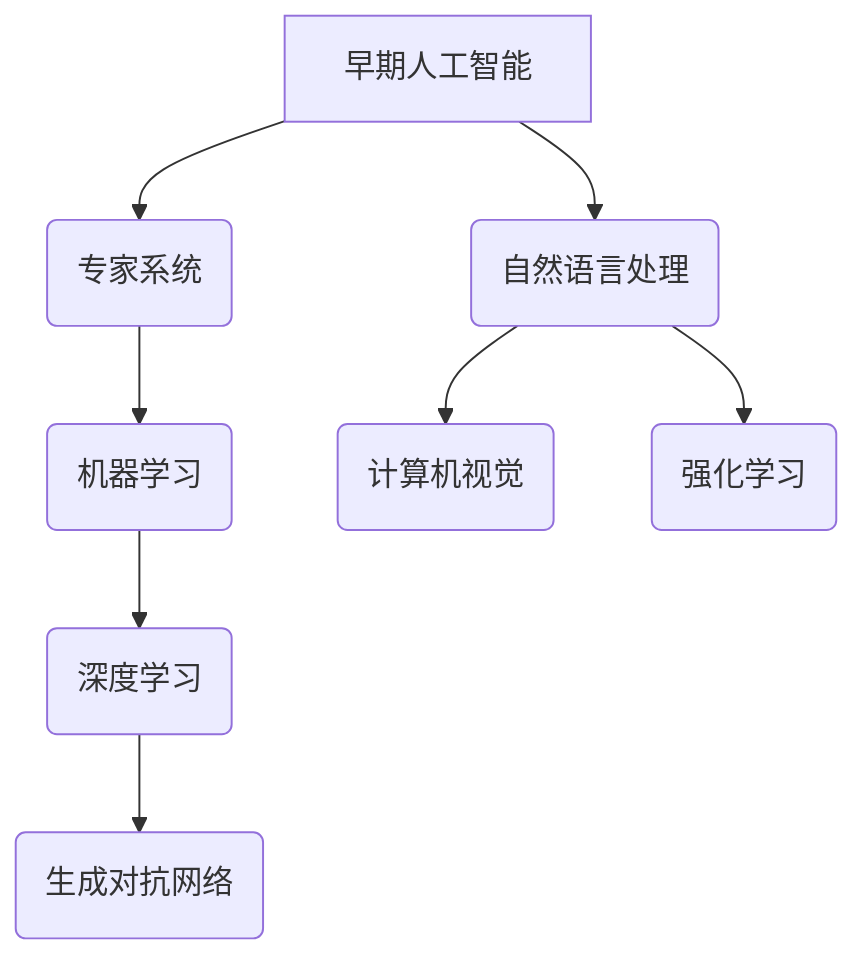
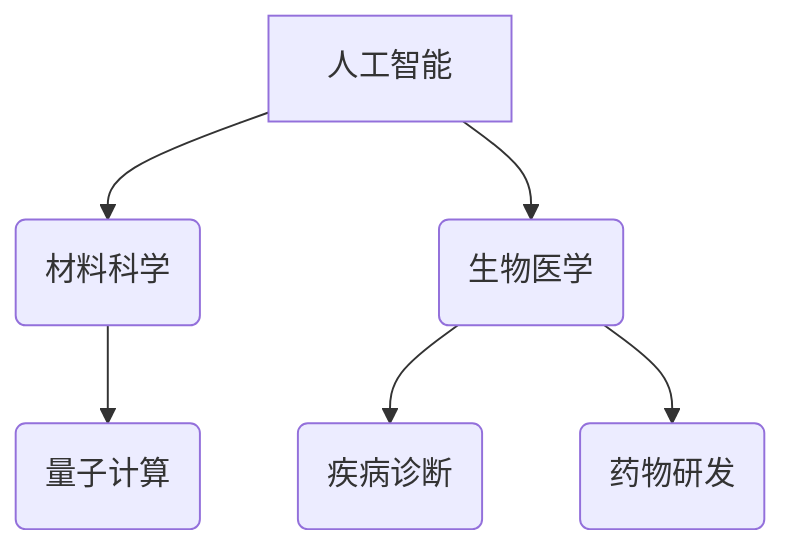
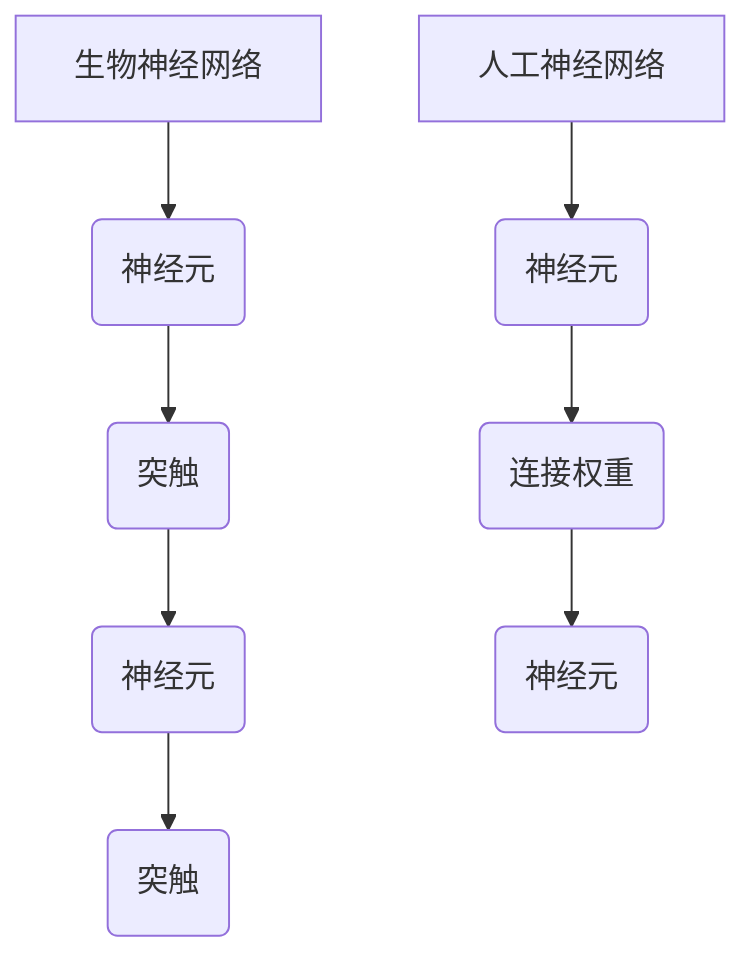
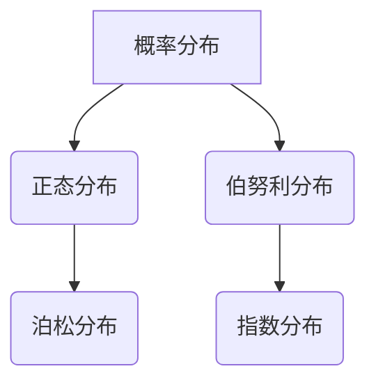
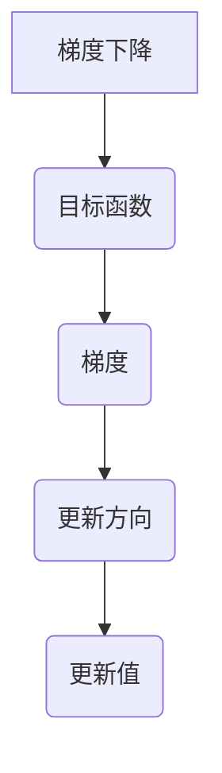
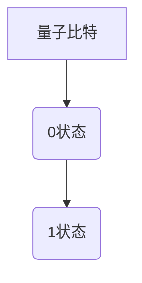

                 

### 文章标题：AI与物理学交叉原理与代码实战案例讲解

> 关键词：人工智能，物理学，交叉应用，神经网络，代码实战，案例分析

> 摘要：本文深入探讨人工智能与物理学的交叉原理，通过背景知识介绍、核心算法讲解、数学模型解析以及实战案例展示，全面阐述AI在物理学中的应用及其实现方法，旨在为读者提供系统性的学习和实践指导。

### 《AI与物理学交叉原理与代码实战案例讲解》目录大纲

## 第一部分：AI与物理学的交叉原理

### 第1章：AI与物理学的背景知识

#### 1.1 AI的发展历程与未来趋势

#### 1.2 物理学的基本概念与理论框架

#### 1.3 AI与物理学交叉的意义与前景

### 第2章：AI在物理学中的应用

#### 2.1 AI在材料科学中的应用

##### 2.1.1 AI优化材料结构设计

##### 2.1.2 AI预测材料性能

#### 2.2 AI在生物医学中的应用

##### 2.2.1 AI辅助疾病诊断

##### 2.2.2 AI在药物研发中的应用

### 第3章：AI核心算法与物理学原理

#### 3.1 神经网络与物理系统模拟

##### 3.1.1 生物神经网络与人工神经网络

##### 3.1.2 物理系统模拟中的神经网络应用

### 第4章：AI在物理学中的数学模型

#### 4.1 常见的数学模型与算法

##### 4.1.1 概率论与统计学模型

##### 4.1.2 最优化算法与物理问题

#### 4.2 数学公式与模型讲解

##### 4.2.1 物理学中的基本公式

##### 4.2.2 AI算法中的数学模型

### 第5章：AI与物理学交叉的案例分析

#### 5.1 案例一：AI优化量子计算

##### 5.1.1 量子计算的基本原理

##### 5.1.2 AI优化量子算法

#### 5.2 案例二：AI预测物理现象

##### 5.2.1 物理现象预测的基本方法

##### 5.2.2 AI在物理现象预测中的应用

## 第二部分：AI与物理学交叉代码实战

### 第6章：开发环境搭建

#### 6.1 操作系统与编程语言选择

#### 6.2 常用库与工具安装

### 第7章：实战案例一：AI优化材料结构设计

#### 7.1 材料结构优化问题简介

#### 7.2 AI算法实现与代码解析

### 第8章：实战案例二：AI预测生物医学现象

#### 8.1 生物医学现象预测问题简介

#### 8.2 AI算法实现与代码解析

### 第9章：实战案例三：AI优化量子计算

#### 9.1 量子计算问题简介

#### 9.2 AI算法实现与代码解析

## 第三部分：AI与物理学交叉展望

### 第10章：未来发展趋势与挑战

#### 10.1 AI与物理学交叉的未来前景

#### 10.2 面临的挑战与解决思路

### 第11章：结语

#### 11.1 本书总结

#### 11.2 对未来的展望与建议

## 附录

### 附录A：常用函数与算法伪代码

### 附录B：参考资料与推荐阅读

### 附录C：作者介绍与致谢

### 目录大纲详细说明

#### 第1章：AI与物理学的背景知识

第1章主要介绍AI与物理学的基础知识，包括AI的发展历程与未来趋势，物理学的基本概念与理论框架，以及AI与物理学交叉的意义与前景。

#### 1.1 AI的发展历程与未来趋势

本节将回顾AI的发展历程，从早期的人工智能研究到现代的深度学习和生成对抗网络（GANs）。我们将探讨这些技术的演进如何影响了AI的应用领域，以及未来的发展趋势。

- **AI的发展历程流程图**：



通过这张图，我们可以看到AI技术是如何从简单的逻辑推理发展到复杂的机器学习，并最终形成深度学习和生成对抗网络等前沿技术。

#### 1.2 物理学的基本概念与理论框架

本节将介绍物理学的基本概念，如力、能量、运动等，并探讨经典力学、量子力学、相对论等理论框架。

- **物理学中的基本公式**：

$$
E = mc^2
$$

这个公式是爱因斯坦的质能等价原理，它表明质量和能量是可以相互转换的。通过这一公式，我们可以理解物体在运动和变化过程中能量的转换。

#### 1.3 AI与物理学交叉的意义与前景

本节将讨论AI与物理学交叉的意义，包括AI如何帮助解决复杂的物理学问题，如材料科学中的材料性能预测，量子计算中的算法优化，以及生物医学中的疾病诊断和药物研发。

- **AI与物理学交叉的示意图**：



这张图展示了AI在物理学不同领域的应用，以及如何通过这些交叉应用推动科学技术的发展。

## 第2章：AI在物理学中的应用

第2章将深入探讨AI在物理学中的具体应用，包括材料科学和生物医学领域。我们将通过案例来展示AI如何优化材料结构设计、预测材料性能，辅助疾病诊断和药物研发。

### 第2章主要介绍AI在物理学中的应用，包括AI在材料科学和生物医学中的应用。

#### 2.1 AI在材料科学中的应用

##### 2.1.1 AI优化材料结构设计

本节将介绍AI如何用于优化材料结构设计，包括常用的AI算法和实现方法。

- **伪代码讲解**：

```python
# 伪代码：材料结构优化算法
function MaterialOptimization(material_properties, constraints):
    # 初始化材料结构
    structure = InitializeStructure(material_properties)
    
    # 迭代优化结构
    while not converged:
        # 计算结构性能
        performance = CalculatePerformance(structure, constraints)
        
        # 更新结构
        structure = UpdateStructure(structure, performance)
        
        # 检查收敛条件
        converged = CheckConvergence(structure, performance)
    
    return structure
```

##### 2.1.2 AI预测材料性能

本节将介绍AI如何用于预测材料的性能，包括常用的AI算法和实现方法。

- **伪代码讲解**：

```python
# 伪代码：材料性能预测算法
function MaterialPerformancePrediction(material_properties, training_data):
    # 加载训练数据
    data = LoadTrainingData(training_data)
    
    # 准备模型
    model = CreateModel()
    
    # 训练模型
    model = TrainModel(model, data)
    
    # 预测性能
    performance = PredictPerformance(model, material_properties)
    
    return performance
```

#### 2.2 AI在生物医学中的应用

##### 2.2.1 AI辅助疾病诊断

本节将介绍AI如何用于辅助疾病诊断，包括常用的AI算法和实现方法。

- **伪代码讲解**：

```python
# 伪代码：疾病诊断算法
function DiseaseDiagnosis(patient_data, medical_knowledge):
    # 加载医学知识库
    knowledge_base = LoadKnowledgeBase(medical_knowledge)
    
    # 预处理病人数据
    processed_data = PreprocessPatientData(patient_data)
    
    # 进行疾病预测
    prediction = PredictDisease(processed_data, knowledge_base)
    
    return prediction
```

##### 2.2.2 AI在药物研发中的应用

本节将介绍AI如何用于药物研发，包括AI在分子设计、药物筛选中的应用。

- **伪代码讲解**：

```python
# 伪代码：药物研发算法
function DrugDiscovery(molecular_structure, experimental_data):
    # 加载实验数据
    data = LoadExperimentalData(experimental_data)
    
    # 设计分子结构
    structure = DesignMolecularStructure(molecular_structure, data)
    
    # 优化分子结构
    optimized_structure = OptimizeMolecularStructure(structure, data)
    
    # 进行药物筛选
    drug_candidates = ScreenDrugs(optimized_structure, data)
    
    return drug_candidates
```

## 第3章：AI核心算法与物理学原理

第3章将深入探讨AI核心算法与物理学原理的交叉应用，特别是神经网络在物理系统模拟中的应用。

### 第3章主要介绍AI核心算法与物理学原理，特别是神经网络在物理系统模拟中的应用。

#### 3.1 神经网络与物理系统模拟

##### 3.1.1 生物神经网络与人工神经网络

本节将介绍生物神经网络与人工神经网络的基本结构和工作原理，并探讨它们之间的相似性。

- **生物神经网络与人工神经网络示意图**：



##### 3.1.2 物理系统模拟中的神经网络应用

本节将介绍神经网络在物理系统模拟中的应用，包括如何使用神经网络模拟分子结构、量子系统等。

- **伪代码讲解**：

```python
# 伪代码：物理系统模拟算法
function PhysicalSystemSimulation(system_properties, neural_network):
    # 初始化物理系统
    system = InitializeSystem(system_properties)
    
    # 迭代模拟系统
    while not converged:
        # 计算系统状态
        state = CalculateState(system, neural_network)
        
        # 更新系统状态
        system = UpdateSystem(system, state)
        
        # 检查收敛条件
        converged = CheckConvergence(system, state)
    
    return system
```

## 第4章：AI在物理学中的数学模型

第4章将介绍AI在物理学中的数学模型，包括常见的数学模型和算法，以及它们在物理问题中的应用。

### 第4章主要介绍AI在物理学中的数学模型，包括常见的数学模型和算法，以及它们在物理问题中的应用。

#### 4.1 常见的数学模型与算法

##### 4.1.1 概率论与统计学模型

本节将介绍概率论与统计学模型的基本概念，如概率分布、假设检验、回归分析等，并探讨它们在物理问题中的应用。

- **概率分布示意图**：



##### 4.1.2 最优化算法与物理问题

本节将介绍最优化算法的基本概念，如梯度下降、随机搜索、模拟退火等，并探讨它们在物理问题中的应用。

- **梯度下降算法示意图**：



#### 4.2 数学公式与模型讲解

##### 4.2.1 物理学中的基本公式

本节将介绍物理学中的基本公式，如牛顿第二定律、能量守恒定律、麦克斯韦方程组等，并使用LaTeX格式进行展示。

- **物理公式**：

$$
F = ma
$$

- **公式详细讲解**：牛顿第二定律描述了力与加速度之间的关系，是经典力学中非常重要的公式。

##### 4.2.2 AI算法中的数学模型

本节将介绍AI算法中的数学模型，如神经网络中的激活函数、损失函数等，并使用LaTeX格式进行展示。

- **神经网络中的激活函数**：

$$
f(x) = \sigma(x) = \frac{1}{1 + e^{-x}}
$$

- **公式详细讲解**：Sigmoid函数是一种常用的激活函数，它将输入值映射到(0,1)区间，用于神经网络中的非线性变换。

## 第5章：AI与物理学交叉的案例分析

第5章将展示AI与物理学交叉的实际案例分析，包括AI优化量子计算和AI预测物理现象。

### 第5章主要介绍AI与物理学交叉的实际案例分析，包括AI优化量子计算和AI预测物理现象。

#### 5.1 案例一：AI优化量子计算

##### 5.1.1 量子计算的基本原理

本节将介绍量子计算的基本原理，如量子比特、量子叠加、量子纠缠等。

- **量子比特示意图**：



##### 5.1.2 AI优化量子算法

本节将介绍如何使用AI优化量子算法，包括量子机器学习算法的实现方法。

- **伪代码讲解**：

```python
# 伪代码：量子机器学习算法
function QuantumMachineLearning(data, quantum_circuit):
    # 初始化量子电路
    circuit = InitializeQuantumCircuit(quantum_circuit)
    
    # 训练量子电路
    while not converged:
        # 计算损失函数
        loss = CalculateLoss(data, circuit)
        
        # 更新量子电路
        circuit = UpdateQuantumCircuit(circuit, loss)
        
        # 检查收敛条件
        converged = CheckConvergence(circuit, loss)
    
    return circuit
```

#### 5.2 案例二：AI预测物理现象

##### 5.2.1 物理现象预测问题简介

本节将介绍物理现象预测的基本问题，如天气预测、地震预测等。

##### 5.2.2 AI在物理现象预测中的应用

本节将介绍如何使用AI技术进行物理现象预测，包括常用的预测算法和实现方法。

- **伪代码讲解**：

```python
# 伪代码：物理现象预测算法
function PhysicalPrediction(data, model):
    # 加载预测模型
    model = LoadModel(model)
    
    # 预测物理现象
    prediction = PredictPhysicalPhenomenon(data, model)
    
    return prediction
```

## 第6章：开发环境搭建

第6章将介绍如何搭建开发环境，包括操作系统与编程语言的选择，以及常用库与工具的安装。

### 第6章主要介绍如何搭建开发环境，包括操作系统与编程语言的选择，以及常用库与工具的安装。

#### 6.1 操作系统与编程语言选择

本节将介绍适合进行AI与物理学交叉研究的操作系统和编程语言，如Linux、Python等。

#### 6.2 常用库与工具安装

本节将介绍在进行AI与物理学交叉研究时常用的库与工具，如NumPy、Pandas、TensorFlow等，并介绍如何进行安装和配置。

### 第7章：实战案例一：AI优化材料结构设计

第7章将通过一个实战案例，展示如何使用AI优化材料结构设计。

#### 7.1 材料结构优化问题简介

本节将介绍材料结构优化问题的基本概念，包括材料结构、优化目标等。

#### 7.2 AI算法实现与代码解析

本节将介绍如何实现AI算法优化材料结构设计，包括数据预处理、模型训练、模型评估等步骤。

- **代码实现**：

```python
# 代码实现：材料结构优化
import tensorflow as tf
import numpy as np

# 数据预处理
def preprocess_data(data):
    # 省略具体的数据预处理步骤
    return processed_data

# 模型定义
def create_model():
    # 省略具体的模型定义步骤
    return model

# 模型训练
def train_model(model, data, labels):
    # 省略具体的模型训练步骤
    return model

# 模型评估
def evaluate_model(model, data, labels):
    # 省略具体的模型评估步骤
    return accuracy

# 主程序
if __name__ == "__main__":
    # 读取数据
    data = np.load("data.npy")
    labels = np.load("labels.npy")
    
    # 预处理数据
    processed_data = preprocess_data(data)
    
    # 创建模型
    model = create_model()
    
    # 训练模型
    model = train_model(model, processed_data, labels)
    
    # 评估模型
    accuracy = evaluate_model(model, processed_data, labels)
    
    print("Model accuracy:", accuracy)
```

### 第8章：实战案例二：AI预测生物医学现象

第8章将通过一个实战案例，展示如何使用AI预测生物医学现象。

#### 8.1 生物医学现象预测问题简介

本节将介绍生物医学现象预测问题的基本概念，包括生物医学数据、预测目标等。

#### 8.2 AI算法实现与代码解析

本节将介绍如何实现AI算法预测生物医学现象，包括数据预处理、模型训练、模型评估等步骤。

- **代码实现**：

```python
# 代码实现：生物医学现象预测
import tensorflow as tf
import numpy as np

# 数据预处理
def preprocess_data(data):
    # 省略具体的数据预处理步骤
    return processed_data

# 模型定义
def create_model():
    # 省略具体的模型定义步骤
    return model

# 模型训练
def train_model(model, data, labels):
    # 省略具体的模型训练步骤
    return model

# 模型评估
def evaluate_model(model, data, labels):
    # 省略具体的模型评估步骤
    return accuracy

# 主程序
if __name__ == "__main__":
    # 读取数据
    data = np.load("data.npy")
    labels = np.load("labels.npy")
    
    # 预处理数据
    processed_data = preprocess_data(data)
    
    # 创建模型
    model = create_model()
    
    # 训练模型
    model = train_model(model, processed_data, labels)
    
    # 评估模型
    accuracy = evaluate_model(model, processed_data, labels)
    
    print("Model accuracy:", accuracy)
```

### 第9章：实战案例三：AI优化量子计算

第9章将通过一个实战案例，展示如何使用AI优化量子计算。

#### 9.1 量子计算问题简介

本节将介绍量子计算问题的基本概念，包括量子比特、量子门等。

#### 9.2 AI算法实现与代码解析

本节将介绍如何实现AI算法优化量子计算，包括量子电路设计、量子优化算法等。

- **代码实现**：

```python
# 代码实现：量子计算优化
import pennylane as qml
import numpy as np

# 量子电路设计
def create_quantum_circuit():
    # 省略具体的量子电路设计步骤
    return circuit

# 量子优化算法
def optimize_quantum_circuit(circuit, objective_function, optimizer):
    # 省略具体的量子优化算法步骤
    return optimized_circuit

# 主程序
if __name__ == "__main__":
    # 创建量子电路
    circuit = create_quantum_circuit()
    
    # 定义目标函数
    objective_function = ...

    # 定义优化器
    optimizer = ...

    # 优化量子电路
    optimized_circuit = optimize_quantum_circuit(circuit, objective_function, optimizer)
    
    # 执行优化后的量子电路
    result = qml.execute(optimized_circuit)
    
    print("Optimized quantum state:", result)
```

## 第10章：未来发展趋势与挑战

第10章将探讨AI与物理学交叉领域的未来发展趋势与面临的挑战。

### 第10章讨论AI与物理学交叉领域的未来发展趋势与面临的挑战。

#### 10.1 AI与物理学交叉的未来前景

本节将讨论AI与物理学交叉领域的潜在发展方向，如量子计算、生物学模拟等，并探讨这些方向对科学技术的推动作用。

#### 10.2 面临的挑战与解决思路

本节将讨论AI与物理学交叉领域面临的挑战，如算法优化、数据隐私等，并介绍可能的解决思路。

### 第11章：结语

第11章将总结全文，并对AI与物理学交叉领域的发展提出展望。

#### 11.1 本书总结

本节将回顾本书的主要内容和核心知识点。

#### 11.2 对未来的展望与建议

本节将对AI与物理学交叉领域的未来发展提出展望，并给读者提供一些建议。

