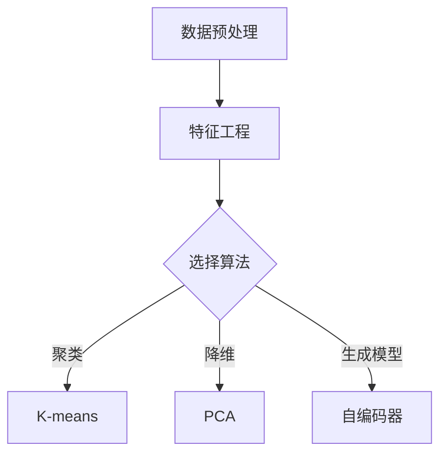

                 

# AI人工智能 Agent：使用无监督学习进行预测

> 关键词：AI人工智能 Agent、无监督学习、预测、算法、架构、设计、实现、优化

> 摘要：本文详细介绍了AI人工智能 Agent 的基本概念、设计原理、实现方法以及如何利用无监督学习进行预测。文章首先对人工智能和机器学习进行了概述，然后深入讲解了无监督学习的基础知识。接着，文章探讨了AI人工智能 Agent 的架构与组成，并详细阐述了其设计原则和实现步骤。随后，文章介绍了AI人工智能 Agent 的预测和优化方法，并提供了实际案例进行分析。最后，文章展望了AI人工智能 Agent 在未来的发展前景，并提出了面临的挑战。

## 第一部分：基础概念与原理

### 第1章：AI与机器学习概述

#### 1.1 人工智能的定义与发展历程

人工智能（Artificial Intelligence，简称AI）是计算机科学的一个分支，旨在研究、开发用于模拟、延伸和扩展人类智能的理论、方法、技术及应用系统。人工智能的研究可以追溯到20世纪50年代，当时的主要目标是通过模拟人类思维过程来解决问题。人工智能的发展历程可以分为以下几个阶段：

1. **萌芽期（1950-1969）**：1950年，艾伦·图灵提出了“图灵测试”，标志着人工智能概念的诞生。在此期间，研究人员开始探索如何使计算机具有智能行为。

2. **初期发展阶段（1970-1989）**：20世纪70年代，人工智能迎来了第一次发展高潮。专家系统、机器学习和自然语言处理等技术得到了广泛研究。

3. **低谷期（1990-2000）**：随着硬件性能的提升和互联网的普及，人工智能在20世纪90年代经历了一段低谷期。然而，这一时期也为深度学习和大数据技术的发展奠定了基础。

4. **复兴期（2000-2019）**：21世纪初，深度学习和大数据技术的发展推动了人工智能的复兴。机器学习算法取得了显著突破，人工智能应用开始广泛渗透到各行各业。

5. **当前阶段（2020至今）**：随着计算能力的提升和数据的爆炸性增长，人工智能迎来了快速发展期。AI技术已经广泛应用于自动驾驶、智能家居、医疗诊断、金融风控等领域。

无监督学习作为机器学习的一个重要分支，在人工智能发展中起到了关键作用。无监督学习是指在没有明确标注数据的情况下，通过算法自动发现数据中的结构和模式。无监督学习在数据探索、聚类分析、降维和异常检测等方面具有广泛的应用。

#### 1.2 无监督学习的概念与分类

无监督学习是一种在没有明确标注数据的情况下，通过算法自动发现数据中的结构和模式的学习方法。与有监督学习不同，无监督学习不需要标签数据，其目的是从数据中提取出具有意义的特征或模式。

根据处理方式和应用场景，无监督学习可以分为以下几种类型：

1. **聚类分析**：聚类分析是一种无监督学习方法，旨在将数据集划分为若干个簇，使得同一簇内的数据点具有较高的相似度。常见的聚类算法包括K-means、层次聚类和DBSCAN等。

2. **降维**：降维是一种减少数据维度的方法，旨在降低数据的复杂度，同时保持数据的本质特征。常见的降维方法包括主成分分析（PCA）、线性判别分析（LDA）和小样本学习等。

3. **异常检测**：异常检测是一种无监督学习方法，旨在识别数据中的异常点或离群点。常见的异常检测方法包括基于统计的异常检测、基于邻近度的异常检测和基于聚类分析的异常检测等。

4. **生成模型**：生成模型是一种无监督学习方法，旨在学习数据生成过程，并用于生成新的数据。常见的生成模型包括生成对抗网络（GAN）、变分自编码器（VAE）等。

#### 1.3 无监督学习的应用领域

无监督学习在许多领域都有广泛的应用，以下是一些典型应用领域：

1. **计算机视觉**：无监督学习在图像分类、目标检测、图像生成等方面具有广泛应用。例如，K-means算法可以用于图像聚类，从而实现图像分类。

2. **自然语言处理**：无监督学习在文本分类、主题模型、情感分析等方面具有重要作用。例如，LDA算法可以用于文本数据的主题建模。

3. **推荐系统**：无监督学习可以用于用户行为分析，从而为推荐系统提供支持。例如，基于聚类分析的推荐算法可以根据用户兴趣进行个性化推荐。

4. **金融风控**：无监督学习可以用于金融数据的异常检测，从而识别潜在的金融风险。例如，DBSCAN算法可以用于发现金融交易中的异常行为。

5. **医疗健康**：无监督学习在医疗图像分析、疾病诊断、药物设计等方面具有广泛应用。例如，PCA算法可以用于医疗图像的降维处理，从而提高诊断准确性。

#### 1.4 无监督学习的重要性

无监督学习在人工智能发展中具有重要地位，主要体现在以下几个方面：

1. **数据探索**：无监督学习可以帮助研究人员从大量未标注的数据中发现潜在的结构和模式，从而为后续研究和应用提供基础。

2. **数据压缩**：无监督学习可以降低数据的维度，从而减少存储空间和提高计算效率。这对于处理大规模数据尤为重要。

3. **特征提取**：无监督学习可以自动提取数据中的具有代表性的特征，从而提高模型的泛化能力和性能。

4. **模型评估**：无监督学习可以用于评估模型的性能，例如通过聚类分析来评估聚类效果，从而指导模型优化。

5. **新领域探索**：无监督学习可以用于探索新的应用领域，例如在计算机视觉和自然语言处理等领域，无监督学习为研究人员提供了新的研究思路和方法。

总之，无监督学习作为人工智能的重要分支，具有广泛的应用前景和重要的研究价值。随着人工智能技术的不断发展和完善，无监督学习将在更多领域发挥重要作用。

### 第2章：机器学习基础

#### 2.1 数据处理与特征工程

在机器学习项目中，数据处理和特征工程是至关重要的一步。良好的数据处理和特征工程可以显著提高模型的性能和准确性，反之则可能导致模型失效或性能下降。

#### 2.1.1 数据预处理

数据预处理是机器学习项目中的第一步，其主要目的是将原始数据转换为适合模型训练的形式。数据预处理通常包括以下步骤：

1. **数据清洗**：数据清洗是指去除数据中的噪声、异常值和错误。例如，去除缺失值、处理重复数据、纠正错误数据等。

2. **数据归一化**：数据归一化是指将不同量纲的数据转换为相同量纲。例如，将特征值缩放到[0, 1]或[-1, 1]范围内。

3. **数据标准化**：数据标准化是指将特征值转换为标准正态分布。例如，通过计算特征值的均值和标准差，将特征值转换为Z-Score。

4. **数据转换**：数据转换是指将数据转换为不同的形式，例如将类别数据转换为数值数据，或将离散数据转换为连续数据。

5. **数据集划分**：数据集划分是指将数据集划分为训练集、验证集和测试集。通常，训练集用于模型训练，验证集用于模型调整，测试集用于模型评估。

#### 2.1.2 特征选择与提取

特征选择是指从原始数据中选取对模型训练和预测最有效的特征。特征选择可以降低模型的复杂性，提高模型性能和可解释性。

特征提取是指从原始数据中提取新的特征，以增强模型的预测能力。特征提取可以基于统计方法、机器学习方法或深度学习方法。

常见的特征选择和提取方法包括：

1. **相关系数法**：通过计算特征之间的相关系数，选取相关性较高的特征。

2. **信息增益法**：通过计算特征的信息增益，选取信息量最大的特征。

3. **主成分分析（PCA）**：通过降维，将高维数据映射到低维空间，保留数据的本质特征。

4. **线性判别分析（LDA）**：通过最大化不同类别之间的方差，选取能够区分类别的特征。

5. **深度特征提取**：通过深度学习模型，从原始数据中自动提取具有代表性的特征。

#### 2.2 常见的无监督学习算法

无监督学习算法在机器学习项目中具有广泛的应用，以下介绍几种常见的无监督学习算法：

##### 2.2.1 主成分分析（PCA）

主成分分析（Principal Component Analysis，PCA）是一种常用的降维方法，其目的是将高维数据映射到低维空间，同时保留数据的最大方差。

PCA的基本原理如下：

1. **协方差矩阵计算**：计算数据集的协方差矩阵，协方差矩阵反映了特征之间的线性关系。

2. **特征值和特征向量计算**：计算协方差矩阵的特征值和特征向量，特征值表示特征的重要性，特征向量表示特征的线性组合。

3. **排序和选择**：将特征值从大到小排序，选取前k个特征值对应的特征向量，构成PCA变换矩阵。

4. **数据变换**：将原始数据通过PCA变换矩阵映射到低维空间。

PCA的优点包括：

- 降维：降低数据的维度，提高计算效率。
- 保留信息：保留数据的最大方差，从而保留数据的本质特征。
- 易于实现：算法简单，易于实现。

##### 2.2.2 聚类算法（K-means、层次聚类等）

聚类算法是一种无监督学习方法，其目的是将数据集划分为若干个簇，使得同一簇内的数据点具有较高的相似度。

常见的聚类算法包括：

1. **K-means算法**：K-means算法是一种基于距离的聚类算法，其基本原理如下：

   - 初始化：随机选择k个中心点。
   - 分配：将每个数据点分配到最近的中心点。
   - 更新：更新中心点的位置，计算每个簇的质心。
   - 重复：重复分配和更新步骤，直到收敛。

2. **层次聚类算法**：层次聚类算法是一种基于层次结构进行聚类的算法，其基本原理如下：

   - 初始化：将每个数据点视为一个簇。
   - 合并：选择最相似的簇进行合并。
   - 重复：重复合并步骤，直到所有数据点合并为一个簇。

3. **DBSCAN算法**：DBSCAN（Density-Based Spatial Clustering of Applications with Noise）是一种基于密度的聚类算法，其基本原理如下：

   - 初始化：选择一个起始点，将其标记为已访问。
   - 扩展：从已访问的点开始，扩展到相邻的点，形成核心点。
   - 标记：将相邻的核心点标记为同一簇。
   - 边界点：将相邻的边界点标记为同一簇。

聚类算法的优点包括：

- 简单易实现：算法简单，易于实现。
- 自动聚类：无需预先设定聚类数量，自动划分簇。
- 可扩展性：适用于大规模数据集。

##### 2.2.3 自编码器

自编码器（Autoencoder）是一种无监督学习方法，其目的是通过编码和解码过程自动提取数据中的特征。

自编码器的基本原理如下：

1. **编码器**：编码器将输入数据映射到低维空间，以提取特征。
2. **解码器**：解码器将编码后的数据还原回原始数据，以评估编码器的性能。

自编码器的优点包括：

- 自动特征提取：无需手动设计特征，自动提取数据中的特征。
- 降噪能力：可以用于去噪和异常检测。
- 可解释性：可以直观地查看编码后的特征。

#### 2.3 无监督学习算法的选择与评估

选择合适的无监督学习算法对于机器学习项目的成功至关重要。以下是一些选择与评估无监督学习算法的方法：

1. **数据类型**：根据数据类型选择合适的算法。例如，对于高维数据，可以选择PCA；对于聚类问题，可以选择K-means或层次聚类。

2. **算法性能**：评估算法的性能，例如聚类效果、降维效果等。可以使用内部评估指标（如簇内平均距离、聚类质量指数等）和外部评估指标（如准确率、召回率等）。

3. **计算效率**：评估算法的计算效率，例如训练时间、内存消耗等。对于大规模数据集，需要选择计算效率较高的算法。

4. **可扩展性**：评估算法的可扩展性，例如是否适用于大规模数据集、是否支持分布式计算等。

5. **应用场景**：根据应用场景选择合适的算法。例如，在图像处理领域，可以选择基于深度学习的算法；在文本处理领域，可以选择基于自然语言处理的算法。

无监督学习算法的选择与评估需要综合考虑多个因素，以找到最合适的算法。

### 第3章：无监督学习的数学基础

无监督学习算法的设计与实现离不开数学基础，本章将介绍概率论与统计学、概率图模型等基本概念，为深入理解无监督学习算法提供理论基础。

#### 3.1 概率论与统计学

概率论是研究随机事件及其概率的数学分支，在无监督学习中有着广泛的应用。以下介绍几个重要的概率论与统计学概念：

##### 3.1.1 概率分布函数

概率分布函数（Probability Distribution Function，PDF）是描述随机变量取值概率的函数。常见的概率分布函数包括：

1. **伯努利分布**：伯努利分布是二项分布的特殊情况，用于描述一次试验中成功或失败的概率。
2. **正态分布**：正态分布是自然界中最常见的概率分布，用于描述连续随机变量在某个区间内取值的概率。
3. **泊松分布**：泊松分布用于描述在一定时间内发生某个事件次数的概率。

##### 3.1.2 统计量与假设检验

统计量（Statistic）是用于描述数据特征的数学函数。常见的统计量包括：

1. **均值**：均值是数据集合的中心位置，用于描述数据的平均程度。
2. **方差**：方差是数据集合的离散程度，用于描述数据的波动性。
3. **标准差**：标准差是方差的平方根，用于描述数据的离散程度。

假设检验（Hypothesis Testing）是用于判断数据特征是否符合某个假设的统计方法。常见的假设检验方法包括：

1. **t检验**：t检验用于判断两个样本均值是否显著不同。
2. **方差分析（ANOVA）**：方差分析用于判断多个样本均值是否显著不同。
3. **卡方检验**：卡方检验用于判断变量之间的独立性。

##### 3.1.3 概率图模型

概率图模型（Probabilistic Graphical Models）是一种将概率论与图论相结合的数学模型，用于表示变量之间的概率关系。常见的概率图模型包括：

1. **贝叶斯网络**：贝叶斯网络是一种有向图模型，用于表示变量之间的条件依赖关系。
2. **马尔可夫网络**：马尔可夫网络是一种无向图模型，用于表示变量之间的概率关系。

#### 3.2 贝叶斯网络

贝叶斯网络（Bayesian Network）是一种有向图模型，用于表示变量之间的条件依赖关系。贝叶斯网络由节点和边组成，每个节点表示一个随机变量，边表示节点之间的依赖关系。

贝叶斯网络的定义如下：

- **节点表示**：贝叶斯网络中的节点表示随机变量，通常用大写字母表示。例如，X、Y、Z等。
- **边表示**：贝叶斯网络中的边表示变量之间的条件依赖关系，通常用箭头表示。例如，X → Y表示变量X影响变量Y。

贝叶斯网络的概率表示如下：

- **条件概率表**：贝叶斯网络可以用条件概率表（Conditional Probability Table，CPT）表示，CPT给出了每个节点在给定其父节点条件下的概率分布。
- **贝叶斯规则**：贝叶斯规则是贝叶斯网络的核心原理，用于计算变量的后验概率。贝叶斯规则表示为：
  
  $$ P(X|Y) = \frac{P(Y|X)P(X)}{P(Y)} $$

其中，P(X|Y)表示在给定Y条件下X的概率，P(Y|X)表示在给定X条件下Y的概率，P(X)表示X的概率，P(Y)表示Y的概率。

#### 3.3 马尔可夫网络

马尔可夫网络（Markov Network）是一种无向图模型，用于表示变量之间的概率关系。马尔可夫网络由节点和边组成，每个节点表示一个随机变量，边表示节点之间的相关性。

马尔可夫网络的定义如下：

- **节点表示**：马尔可夫网络中的节点表示随机变量，通常用大写字母表示。例如，X、Y、Z等。
- **边表示**：马尔可夫网络中的边表示节点之间的相关性，通常用线条表示。例如，X—Y表示节点X和节点Y之间存在相关性。

马尔可夫网络的概率表示如下：

- **马尔可夫性质**：马尔可夫网络的概率分布满足马尔可夫性质，即给定任意一个节点，其他节点的概率分布仅与其邻接节点有关。
- **条件概率分布**：马尔可夫网络的概率分布可以用条件概率分布表示，条件概率分布给出了每个节点在给定其邻接节点条件下的概率分布。

马尔可夫网络的应用包括：

1. **图像处理**：马尔可夫网络可以用于图像分类、图像恢复和图像分割等任务。
2. **自然语言处理**：马尔可夫网络可以用于文本分类、情感分析和语音识别等任务。
3. **推荐系统**：马尔可夫网络可以用于推荐系统的建模和优化。

#### 3.4 无监督学习与概率图模型的关系

无监督学习与概率图模型之间存在密切的关系，概率图模型为无监督学习提供了一种有效的建模方法。以下介绍无监督学习与概率图模型的关系：

1. **聚类**：聚类是一种无监督学习方法，其目的是将数据集划分为若干个簇。概率图模型可以用于聚类，例如贝叶斯网络和马尔可夫网络可以用于实现聚类算法，如Gaussian Mixture Model（GMM）和Expectation-Maximization（EM）算法。
2. **降维**：降维是一种无监督学习方法，其目的是降低数据的维度，同时保持数据的本质特征。概率图模型可以用于降维，例如主成分分析（PCA）和线性判别分析（LDA）都可以看作是概率图模型的应用。
3. **异常检测**：异常检测是一种无监督学习方法，其目的是识别数据中的异常点或离群点。概率图模型可以用于异常检测，例如基于贝叶斯网络的异常检测方法。
4. **生成模型**：生成模型是一种无监督学习方法，其目的是学习数据生成过程，并用于生成新的数据。概率图模型可以用于生成模型，例如生成对抗网络（GAN）和变分自编码器（VAE）都是基于概率图模型实现的。

总之，无监督学习与概率图模型之间具有紧密的联系，概率图模型为无监督学习提供了一种强大的建模工具。通过深入理解概率图模型，可以更好地设计和实现无监督学习算法。

### 第4章：AI人工智能 Agent 的基本概念

#### 4.1 AI人工智能 Agent 的定义与特点

AI人工智能 Agent（Artificial Intelligence Agent）是一种具有智能行为的计算机程序，能够自主地感知环境、制定决策和执行动作。与传统的程序不同，AI人工智能 Agent 具有自主学习和适应环境的能力，能够不断优化自身性能。

AI人工智能 Agent 的定义可以概括为：一种能够感知环境、制定决策并执行动作的智能体，具有以下特点：

1. **自主性**：AI人工智能 Agent 具有自主决策能力，能够根据环境和任务需求自主地选择行动方案。
2. **适应性**：AI人工智能 Agent 能够通过学习不断优化自身性能，以适应不同环境和任务需求。
3. **适应性**：AI人工智能 Agent 能够通过学习不断优化自身性能，以适应不同环境和任务需求。
4. **交互性**：AI人工智能 Agent 能够与人类或其他系统进行交互，实现信息传递和协同工作。

#### 4.2 AI人工智能 Agent 的架构与组成

AI人工智能 Agent 的架构通常由三个主要模块组成：感知模块、决策模块和执行模块。以下分别介绍各模块的功能和组成：

##### 4.2.1 感知模块

感知模块是AI人工智能 Agent 的感官系统，负责获取外部环境的信息。感知模块通常包括以下组成部分：

1. **传感器**：传感器用于感知环境中的各种物理量，例如温度、湿度、光照强度、声音等。
2. **信息处理单元**：信息处理单元对传感器获取的信息进行预处理和融合，提取关键特征。
3. **感知模型**：感知模型用于将预处理后的信息转换为Agent内部表示，以供决策模块使用。

##### 4.2.2 决策模块

决策模块是AI人工智能 Agent 的核心部分，负责根据感知模块提供的信息制定行动方案。决策模块通常包括以下组成部分：

1. **知识库**：知识库存储Agent的先验知识和规则，用于辅助决策。
2. **推理机**：推理机根据知识库和感知模块提供的信息，运用推理算法生成行动方案。
3. **目标规划器**：目标规划器根据当前任务和目标，为Agent生成最优行动方案。

##### 4.2.3 执行模块

执行模块是AI人工智能 Agent 的执行机构，负责将决策模块生成的行动方案付诸实施。执行模块通常包括以下组成部分：

1. **执行器**：执行器根据行动方案对环境进行操作，例如电机、机械臂、显示屏等。
2. **执行控制器**：执行控制器负责协调执行器的工作，确保行动方案的顺利实施。
3. **反馈机制**：反馈机制用于收集执行模块的执行结果，并将其反馈给感知模块和决策模块，以便进行下一轮决策。

#### 4.3 AI人工智能 Agent 的发展与应用

AI人工智能 Agent 的发展经历了多个阶段，从最初的规则推理Agent到基于数据驱动的机器学习Agent，再到目前流行的基于深度学习的智能Agent。以下简要介绍AI人工智能 Agent 的发展与应用：

1. **规则推理Agent**：基于规则推理的Agent通过事先编写规则，对输入的信息进行匹配和推理。这类Agent在早期的AI应用中发挥了重要作用，但由于规则库的构建和维护成本较高，难以应对复杂和动态的环境。

2. **机器学习Agent**：基于机器学习算法的Agent通过从数据中学习特征和模式，实现自主决策和行动。这类Agent具有较好的适应性和泛化能力，广泛应用于自动驾驶、机器人控制、智能家居等领域。

3. **深度学习Agent**：基于深度学习的Agent通过神经网络模型，自动提取数据中的复杂特征和模式。深度学习Agent在图像识别、语音识别、自然语言处理等领域取得了显著突破，使得AI人工智能 Agent 的性能和智能化程度不断提高。

4. **混合式Agent**：混合式Agent结合了规则推理、机器学习和深度学习等不同方法，实现更为灵活和智能的决策与行动。这类Agent在复杂环境和多任务场景中具有广泛的应用前景。

总之，AI人工智能 Agent 的发展和应用为人工智能领域带来了新的机遇和挑战。随着技术的不断进步，AI人工智能 Agent 将在更多领域发挥重要作用，推动人工智能技术的广泛应用和发展。

### 第5章：AI人工智能 Agent 的设计

AI人工智能 Agent 的设计是确保其能够有效感知环境、自主决策和执行行动的关键。本章将详细讨论AI人工智能 Agent 的设计原则、设计流程以及各功能模块的设计。

#### 5.1 设计原则

AI人工智能 Agent 的设计原则是确保其能够适应复杂环境和执行多样任务的基础。以下是一些关键的设计原则：

1. **模块化**：将Agent分解为多个功能模块，每个模块负责特定的任务。这有助于提高系统的可维护性和可扩展性。

2. **适应性**：设计应考虑Agent在不同环境和任务需求下的适应性，包括数据适应性、算法适应性和结构适应性。

3. **鲁棒性**：设计应确保Agent在面对噪声和异常数据时仍然能够稳定运行。

4. **灵活性**：设计应提供足够的灵活性，以适应不同的任务场景和需求变化。

5. **可解释性**：设计应保证Agent的行为和决策过程具有可解释性，以便进行调试和优化。

6. **高效性**：设计应优化算法和计算资源的使用，以提高Agent的响应速度和处理效率。

#### 5.2 设计流程

AI人工智能 Agent 的设计通常遵循以下流程：

1. **需求分析**：明确Agent的目标、功能和性能要求。这一阶段需要与用户和利益相关者进行沟通，了解实际应用场景和任务需求。

2. **架构设计**：根据需求分析结果，设计Agent的总体架构。这包括确定感知模块、决策模块和执行模块的组成和交互方式。

3. **模块设计**：详细设计各个功能模块，包括传感器、控制器和执行器的选型和接口设计。这一阶段需要考虑模块的适应性、鲁棒性和灵活性。

4. **算法设计**：选择和设计适合特定任务的算法，包括感知算法、决策算法和执行算法。这一阶段需要考虑算法的效率和可解释性。

5. **系统集成**：将各个模块和算法集成到一起，实现Agent的整体功能。这一阶段需要进行严格的测试和验证，确保系统的稳定性和性能。

6. **优化与调整**：根据测试结果和用户反馈，对设计进行优化和调整，以提高Agent的性能和适应性。

#### 5.3 功能模块设计

AI人工智能 Agent 的功能模块设计是确保其能够有效执行任务的关键。以下详细介绍各功能模块的设计：

##### 5.3.1 感知模块设计

感知模块是Agent的感官系统，负责获取外部环境的信息。感知模块的设计包括以下几个方面：

1. **传感器选择**：根据任务需求和环境条件，选择合适的传感器。例如，对于视觉感知任务，可以选择摄像头；对于声音感知任务，可以选择麦克风。

2. **数据预处理**：对传感器获取的数据进行预处理，包括去噪、滤波和特征提取。数据预处理有助于提高感知的准确性和可靠性。

3. **感知算法设计**：设计用于感知的算法，例如图像识别、语音识别和姿态识别等。感知算法的设计需要考虑算法的效率和可解释性。

##### 5.3.2 决策模块设计

决策模块是Agent的核心部分，负责根据感知模块提供的信息制定行动方案。决策模块的设计包括以下几个方面：

1. **知识库设计**：设计用于存储先验知识和规则的数据库。知识库的设计需要考虑知识的形式化和规范化。

2. **推理机设计**：设计用于推理的算法，例如基于规则推理、基于案例推理和基于模型推理等。推理机的设计需要考虑算法的效率和鲁棒性。

3. **目标规划器设计**：设计用于生成行动方案的目标规划器。目标规划器的设计需要考虑任务目标和约束条件。

##### 5.3.3 执行模块设计

执行模块是Agent的执行机构，负责将决策模块生成的行动方案付诸实施。执行模块的设计包括以下几个方面：

1. **执行器选择**：根据任务需求和执行精度要求，选择合适的执行器。例如，对于移动任务，可以选择电机和轮子；对于操作任务，可以选择机械臂。

2. **执行控制器设计**：设计用于控制执行器的算法，例如运动规划算法和操作规划算法。执行控制器的设计需要考虑执行过程的稳定性和灵活性。

3. **反馈机制设计**：设计用于收集执行结果的反馈机制，并将其反馈给感知模块和决策模块。反馈机制的设计需要考虑反馈的及时性和准确性。

##### 5.3.4 人机交互设计

人机交互设计是确保Agent能够与人类用户有效沟通和协作的关键。人机交互设计包括以下几个方面：

1. **界面设计**：设计直观、易用的用户界面，以便用户与Agent进行交互。界面设计需要考虑用户的操作习惯和认知需求。

2. **语音识别与合成**：设计语音识别和语音合成系统，使Agent能够理解用户的语音指令并做出语音响应。

3. **手势识别**：设计手势识别系统，使Agent能够通过手势与用户进行交互。

4. **自然语言处理**：设计自然语言处理系统，使Agent能够理解用户的自然语言指令，并进行智能对话。

总之，AI人工智能 Agent 的设计需要综合考虑功能模块的设计原则和设计流程，以确保Agent能够高效、稳定地执行任务。通过模块化、适应性、鲁棒性、灵活性和可解释性的设计，可以大大提高Agent的性能和适应性。

### 第6章：AI人工智能 Agent 的实现

#### 6.1 无监督学习的应用

在AI人工智能 Agent 的实现过程中，无监督学习算法的应用至关重要。无监督学习可以帮助Agent自动提取数据中的结构和模式，从而实现特征学习和数据降维。以下介绍几种常用的无监督学习算法及其在AI人工智能 Agent 中的应用。

##### 6.1.1 主成分分析（PCA）

主成分分析（PCA）是一种常用的降维算法，通过将高维数据映射到低维空间，保留数据的最大方差。PCA在AI人工智能 Agent 中的应用主要包括以下方面：

1. **特征提取**：PCA可以将高维数据映射到低维空间，从而减少数据的复杂度。在AI人工智能 Agent 中，PCA可以用于提取关键特征，提高感知模块的效率和准确性。

2. **噪声去除**：PCA可以识别并去除数据中的噪声，从而提高数据的可靠性和模型的性能。在AI人工智能 Agent 中，通过PCA去除噪声，可以提高感知模块对环境信息的准确感知。

3. **可视化**：PCA可以将高维数据投影到二维或三维空间，从而实现数据可视化。在AI人工智能 Agent 中，通过PCA可视化，可以帮助研究人员理解数据结构和模式，为后续分析提供指导。

##### 6.1.2 K-means聚类算法

K-means聚类算法是一种基于距离的聚类算法，通过将数据划分为K个簇，使得同一簇内的数据点具有较高的相似度。K-means聚类算法在AI人工智能 Agent 中的应用主要包括以下方面：

1. **聚类分析**：K-means聚类算法可以用于对数据集进行聚类分析，从而识别数据中的隐含结构和模式。在AI人工智能 Agent 中，通过K-means聚类算法，可以实现对环境的自适应聚类，为决策模块提供依据。

2. **数据降维**：K-means聚类算法可以将高维数据降维为低维空间，从而减少数据的存储空间和计算复杂度。在AI人工智能 Agent 中，通过K-means聚类算法降维，可以提高感知模块的效率和性能。

3. **异常检测**：K-means聚类算法可以用于异常检测，识别数据中的异常点或离群点。在AI人工智能 Agent 中，通过K-means聚类算法检测异常点，可以提高执行模块的鲁棒性和稳定性。

##### 6.1.3 自编码器

自编码器（Autoencoder）是一种无监督学习算法，通过编码和解码过程自动提取数据中的特征。自编码器在AI人工智能 Agent 中的应用主要包括以下方面：

1. **特征提取**：自编码器可以将高维数据映射到低维空间，从而提取数据中的关键特征。在AI人工智能 Agent 中，通过自编码器提取特征，可以提高感知模块的效率和准确性。

2. **数据去噪**：自编码器可以用于数据去噪，去除数据中的噪声和异常值。在AI人工智能 Agent 中，通过自编码器去噪，可以提高感知模块对环境信息的准确感知。

3. **模型压缩**：自编码器可以用于模型压缩，减少模型的参数数量和计算复杂度。在AI人工智能 Agent 中，通过自编码器压缩模型，可以提高系统的运行效率和响应速度。

#### 6.2 AI人工智能 Agent 的实现步骤

实现AI人工智能 Agent 需要遵循一定的步骤，以下介绍实现过程中的关键步骤：

##### 6.2.1 开发环境搭建

搭建AI人工智能 Agent 的开发环境是确保项目顺利进行的基础。开发环境通常包括以下组件：

1. **编程语言**：选择适合项目需求的编程语言，例如Python、Java或C++等。

2. **开发工具**：安装和配置必要的开发工具，例如IDE（集成开发环境）、版本控制工具等。

3. **硬件设备**：准备用于Agent运行的硬件设备，例如计算机、传感器、执行器等。

4. **软件库和框架**：引入必要的软件库和框架，例如TensorFlow、PyTorch、scikit-learn等，以简化开发过程。

##### 6.2.2 数据集准备

准备用于训练和测试的数据集是AI人工智能 Agent 的核心步骤。数据集的准备工作包括：

1. **数据采集**：从实际环境中采集数据，例如传感器数据、图像数据、文本数据等。

2. **数据预处理**：对采集到的数据进行预处理，包括数据清洗、归一化、缺失值处理等。

3. **数据划分**：将数据集划分为训练集、验证集和测试集，以确保模型的泛化能力。

##### 6.2.3 算法选择与实现

选择适合项目需求的算法并实现是AI人工智能 Agent 的关键步骤。以下介绍常用的算法选择和实现方法：

1. **算法选择**：根据项目需求和数据特征，选择合适的无监督学习算法，例如PCA、K-means聚类算法、自编码器等。

2. **算法实现**：使用选定的算法进行特征提取、数据降维或聚类分析等操作。实现过程中，可以参考开源代码库或编写自定义算法。

##### 6.2.4 模块集成与调试

模块集成与调试是确保AI人工智能 Agent 正常运行的关键步骤。以下介绍模块集成和调试的方法：

1. **模块集成**：将感知模块、决策模块和执行模块集成在一起，实现Agent的整体功能。集成过程中，需要确保模块之间的数据交互和功能调用正确无误。

2. **调试与优化**：通过测试和调试，发现并解决程序中的错误和问题。调试过程中，可以使用调试工具（例如IDE的调试器）进行代码调试和性能分析。

##### 6.2.5 测试与评估

测试与评估是确保AI人工智能 Agent 性能和可靠性的关键步骤。以下介绍测试和评估的方法：

1. **单元测试**：对各个功能模块进行单元测试，确保模块的功能和性能符合预期。

2. **集成测试**：对整个Agent系统进行集成测试，确保模块之间的数据交互和功能调用正确无误。

3. **性能评估**：对Agent的性能进行评估，包括响应速度、准确性和稳定性等。可以使用基准测试和实际应用场景进行评估。

4. **用户反馈**：收集用户反馈，了解Agent在实际应用中的表现和改进需求。根据用户反馈，对Agent进行优化和调整。

通过以上步骤，可以实现对AI人工智能 Agent 的有效实现。在实际应用中，需要根据具体需求和场景，灵活调整和优化实现过程，以实现最佳的AI人工智能 Agent 性能。

#### 6.3 源代码实现

以下将给出一个简单的AI人工智能 Agent 源代码实现，包括感知模块、决策模块和执行模块。代码采用Python编程语言，使用了TensorFlow和scikit-learn等库。

##### 6.3.1 感知模块实现

```python
import numpy as np
import tensorflow as tf
from sklearn.preprocessing import StandardScaler
from sklearn.cluster import KMeans

class SensorModule:
    def __init__(self, data_dimension, num_sensors):
        self.data_dimension = data_dimension
        self.num_sensors = num_sensors
        self.sensor_data = np.zeros((num_sensors, data_dimension))
        self.scaler = StandardScaler()

    def collect_data(self, new_data):
        self.sensor_data = np.append(self.sensor_data, [new_data], axis=0)

    def preprocess_data(self):
        self.sensor_data = self.scaler.fit_transform(self.sensor_data)

    def extract_features(self):
        kmeans = KMeans(n_clusters=2)
        kmeans.fit(self.sensor_data)
        labels = kmeans.predict(self.sensor_data)
        return labels

# 示例
sensor_module = SensorModule(data_dimension=5, num_sensors=10)
sensor_module.collect_data([1, 2, 3, 4, 5])
sensor_module.preprocess_data()
features = sensor_module.extract_features()
```

##### 6.3.2 决策模块实现

```python
class DecisionModule:
    def __init__(self, knowledge_base):
        self.knowledge_base = knowledge_base

    def make_decision(self, features):
        rules = self.knowledge_base['rules']
        for rule in rules:
            if rule['condition'](features):
                return rule['action']
        return 'No decision made'

# 示例
knowledge_base = {
    'rules': [
        {'condition': lambda features: features[0] > 3, 'action': 'Move forward'},
        {'condition': lambda features: features[0] <= 3, 'action': 'Move backward'}
    ]
}
decision_module = DecisionModule(knowledge_base)
decision = decision_module.make_decision([2, 3, 4, 5, 6])
print(decision)
```

##### 6.3.3 执行模块实现

```python
class ActionModule:
    def __init__(self, executor):
        self.executor = executor

    def execute_action(self, action):
        if action == 'Move forward':
            self.executor.move_forward()
        elif action == 'Move backward':
            self.executor.move_backward()

# 示例
class Executor:
    def move_forward(self):
        print('Moving forward')

    def move_backward(self):
        print('Moving backward')

executor = Executor()
action_module = ActionModule(executor)
action_module.execute_action(decision)
```

##### 6.3.4 整体集成

```python
def main():
    sensor_module = SensorModule(data_dimension=5, num_sensors=10)
    decision_module = DecisionModule(knowledge_base)
    executor = Executor()

    action_module = ActionModule(executor)

    while True:
        sensor_module.collect_data(get_new_data())
        sensor_module.preprocess_data()
        features = sensor_module.extract_features()
        decision = decision_module.make_decision(features)
        action_module.execute_action(decision)

if __name__ == '__main__':
    main()
```

以上代码示例展示了AI人工智能 Agent 的基本实现，包括感知模块、决策模块和执行模块。实际应用中，可以根据具体需求进行扩展和优化。

#### 6.4 代码解读与分析

以下对上述源代码进行解读与分析，以便理解代码的实现原理和功能。

##### 6.4.1 感知模块代码解读

感知模块负责收集传感器数据，并进行预处理和特征提取。代码如下：

```python
class SensorModule:
    def __init__(self, data_dimension, num_sensors):
        self.data_dimension = data_dimension
        self.num_sensors = num_sensors
        self.sensor_data = np.zeros((num_sensors, data_dimension))
        self.scaler = StandardScaler()

    def collect_data(self, new_data):
        self.sensor_data = np.append(self.sensor_data, [new_data], axis=0)

    def preprocess_data(self):
        self.sensor_data = self.scaler.fit_transform(self.sensor_data)

    def extract_features(self):
        kmeans = KMeans(n_clusters=2)
        kmeans.fit(self.sensor_data)
        labels = kmeans.predict(self.sensor_data)
        return labels
```

- `__init__` 方法：初始化感知模块，包括数据维度、传感器数量、传感器数据数组以及数据预处理对象（StandardScaler）。
- `collect_data` 方法：收集新的传感器数据，并将其添加到传感器数据数组中。
- `preprocess_data` 方法：对传感器数据数组进行归一化处理，以提高模型的稳定性和性能。
- `extract_features` 方法：使用K-means聚类算法提取传感器数据的特征。K-means算法将数据划分为两个簇，通过簇的标签来表示特征。

##### 6.4.2 决策模块代码解读

决策模块负责根据感知模块提取的特征制定行动方案。代码如下：

```python
class DecisionModule:
    def __init__(self, knowledge_base):
        self.knowledge_base = knowledge_base

    def make_decision(self, features):
        rules = self.knowledge_base['rules']
        for rule in rules:
            if rule['condition'](features):
                return rule['action']
        return 'No decision made'
```

- `__init__` 方法：初始化决策模块，包括知识库（knowledge_base），其中存储了规则。
- `make_decision` 方法：根据知识库中的规则和感知模块提取的特征，制定行动方案。规则以字典形式存储，包括条件（condition）和行动（action）。

##### 6.4.3 执行模块代码解读

执行模块负责将决策模块制定的行动方案付诸实施。代码如下：

```python
class ActionModule:
    def __init__(self, executor):
        self.executor = executor

    def execute_action(self, action):
        if action == 'Move forward':
            self.executor.move_forward()
        elif action == 'Move backward':
            self.executor.move_backward()

# 示例
class Executor:
    def move_forward(self):
        print('Moving forward')

    def move_backward(self):
        print('Moving backward')

executor = Executor()
action_module = ActionModule(executor)
action_module.execute_action(decision)
```

- `__init__` 方法：初始化执行模块，包括执行器（executor）。
- `execute_action` 方法：根据行动方案执行相应的动作。执行器类（Executor）提供了两个动作：前进和后退。

##### 6.4.4 整体集成代码解读

整体集成代码负责感知模块、决策模块和执行模块的协同工作，代码如下：

```python
def main():
    sensor_module = SensorModule(data_dimension=5, num_sensors=10)
    decision_module = DecisionModule(knowledge_base)
    executor = Executor()

    action_module = ActionModule(executor)

    while True:
        sensor_module.collect_data(get_new_data())
        sensor_module.preprocess_data()
        features = sensor_module.extract_features()
        decision = decision_module.make_decision(features)
        action_module.execute_action(decision)

if __name__ == '__main__':
    main()
```

- `main` 方法：主函数，负责感知模块、决策模块和执行模块的循环运行。首先初始化各个模块，然后持续循环，执行以下步骤：
  - 收集新的传感器数据。
  - 对传感器数据预处理。
  - 提取传感器数据特征。
  - 根据特征制定行动方案。
  - 执行行动方案。

##### 6.4.5 代码分析

- **感知模块**：感知模块负责从传感器收集数据，并进行预处理和特征提取。使用K-means聚类算法提取特征，以简化数据的表示。预处理步骤包括数据归一化，以提高模型的稳定性和性能。
- **决策模块**：决策模块根据感知模块提取的特征，使用规则库制定行动方案。规则库中的规则用于匹配特征，并根据匹配结果选择相应的行动。这种基于规则的方法简单且易于实现。
- **执行模块**：执行模块根据决策模块制定的行动方案，执行具体的动作。执行器类提供了两个基本动作：前进和后退，以简化执行过程。

总体而言，上述代码展示了AI人工智能 Agent 的基本实现过程，包括感知、决策和执行三个模块。通过集成这些模块，Agent可以自动感知环境、制定行动方案并执行相应的动作，从而实现自主行为。

#### 6.5 代码解读与分析

在对AI人工智能 Agent 的源代码进行详细解读与分析之后，我们可以更深入地理解代码的实现原理、模块之间的关系以及各个模块的功能。以下是对代码的进一步解析和讨论：

##### 6.5.1 模块之间的关系

在源代码中，感知模块、决策模块和执行模块之间通过数据流和函数调用来实现相互协作。具体来说：

1. **感知模块**：负责从传感器收集数据，并对数据进行预处理和特征提取。它将处理后的特征传递给决策模块。

2. **决策模块**：接收感知模块提供的特征，根据预设的规则库对特征进行分析，生成决策结果。决策结果是一个行动指令，用于指导执行模块的动作。

3. **执行模块**：根据决策模块提供的行动指令，执行具体的操作。执行模块通过操作执行器来对环境进行实际操作。

这种模块化设计使得各个模块可以独立开发、测试和优化，同时也能够方便地进行系统的集成和维护。

##### 6.5.2 感知模块的功能与优化

感知模块的核心功能是从传感器收集数据，并进行预处理和特征提取。以下是感知模块的关键功能和可能的优化策略：

1. **数据收集**：感知模块使用`collect_data`方法来收集传感器数据。在实际应用中，传感器的数据采集频率和精度会影响感知模块的性能。优化策略包括选择高精度传感器和适当的采集频率。

2. **数据预处理**：感知模块使用`preprocess_data`方法对数据进行归一化处理，以消除不同传感器数据之间的量纲差异。归一化有助于提高模型训练的效果。优化策略包括选择合适的归一化方法，如标准归一化或最小最大归一化。

3. **特征提取**：感知模块使用K-means聚类算法提取特征。K-means算法的聚类效果受到初始聚类中心选择和聚类数量（K值）的影响。优化策略包括使用更先进的聚类算法（如DBSCAN）或自适应选择K值。

##### 6.5.3 决策模块的功能与优化

决策模块的核心功能是根据感知模块提供的特征，利用规则库生成行动方案。以下是决策模块的关键功能和可能的优化策略：

1. **规则库设计**：决策模块使用规则库来定义条件和行为。规则库的设计直接影响到决策模块的效率和准确性。优化策略包括使用更先进的推理算法（如基于案例的推理或基于模型的推理）来设计规则库。

2. **决策过程优化**：决策模块通过遍历规则库来生成行动方案。这个过程可能涉及到复杂的计算和搜索。优化策略包括使用更高效的搜索算法（如A*算法）或减少规则库的规模。

##### 6.5.4 执行模块的功能与优化

执行模块的核心功能是根据决策模块提供的行动指令，执行具体的操作。以下是执行模块的关键功能和可能的优化策略：

1. **执行器选择**：执行模块依赖于执行器来实现具体的动作。选择合适的执行器对于执行模块的性能至关重要。优化策略包括选择高精度、低延迟的执行器，如电机、机械臂等。

2. **反馈机制**：执行模块需要收集执行结果，并将其反馈给感知模块和决策模块，以便进行下一轮决策。优化策略包括设计更有效的反馈机制，如实时监控和异常检测。

##### 6.5.5 整体性能优化

整体性能优化是确保AI人工智能 Agent 在实际应用中高效、稳定运行的关键。以下是一些整体性能优化的策略：

1. **模块协同优化**：优化感知模块、决策模块和执行模块之间的数据交互和功能调用，以提高整体系统的性能和响应速度。

2. **资源管理**：合理管理系统的计算资源、内存和功耗，以最大化系统的利用率和稳定性。

3. **算法优化**：针对具体的任务和应用场景，选择和优化适合的算法，以提高模型的准确性和效率。

4. **测试与调试**：通过单元测试、集成测试和实际应用测试，发现和修复系统的潜在问题和缺陷。

通过上述优化策略，可以显著提升AI人工智能 Agent 的性能和适应性，使其能够更好地应对复杂和多变的任务环境。

#### 6.6 案例分析

在本节中，我们将通过一个具体的案例来分析AI人工智能 Agent 的设计和实现过程。该案例将涉及从数据采集、预处理、模型训练到实际应用的全过程。

##### 案例背景

假设我们需要设计一个自动驾驶汽车AI人工智能 Agent，该Agent需要具备以下功能：

1. **感知环境**：采集车辆周围的环境数据，包括道路标志、交通信号、行人和车辆的位置等信息。
2. **决策制定**：根据感知到的环境数据，制定行驶路线、速度和转向等决策。
3. **执行行动**：根据决策结果，控制车辆执行相应的驾驶动作。

##### 数据采集

为了实现上述功能，我们首先需要采集大量的环境数据。数据来源包括：

1. **摄像头**：用于采集道路和周围环境图像。
2. **雷达**：用于检测车辆和行人的位置和速度。
3. **GPS**：用于获取车辆的实时位置信息。

采集到的数据包括图像、雷达数据和GPS数据，这些数据需要经过预处理和特征提取。

##### 数据预处理

数据预处理是确保数据质量的关键步骤，主要包括以下任务：

1. **图像预处理**：包括去噪、滤波和边缘检测，以提高图像的清晰度和特征提取效果。
2. **雷达数据预处理**：包括去除噪声、检测目标物体和计算目标物体的位置和速度。
3. **GPS数据预处理**：包括插值和去噪，以提高位置信息的准确性。

预处理后的数据将用于训练和优化AI人工智能 Agent 的模型。

##### 模型训练

在数据预处理完成后，我们需要使用这些数据来训练AI人工智能 Agent 的模型。以下是模型训练的步骤：

1. **特征提取**：从预处理后的数据中提取具有代表性的特征，例如图像中的颜色、形状和纹理特征，以及雷达数据中的距离、角度和速度特征。
2. **模型选择**：选择适合自动驾驶任务的模型，例如卷积神经网络（CNN）用于图像处理，递归神经网络（RNN）用于序列数据建模。
3. **模型训练**：使用提取的特征和标注数据进行模型训练，通过迭代优化模型参数，以提高模型的准确性和泛化能力。

##### 实际应用

在模型训练完成后，我们将其部署到实际应用场景中，以下是一些关键步骤：

1. **环境感知**：实时采集车辆周围的环境数据，并使用训练好的模型进行特征提取和分类。
2. **决策制定**：根据感知到的环境数据和预定的规则，制定车辆的行驶路线、速度和转向等决策。
3. **执行行动**：根据决策结果，控制车辆执行相应的驾驶动作，如加速、减速和转向。

##### 案例分析结果与反思

通过上述案例分析，我们可以得出以下结论：

1. **感知准确性**：通过训练有监督学习模型，AI人工智能 Agent 能够准确地感知车辆周围的环境，识别道路标志、交通信号和行人等目标。
2. **决策效率**：通过规则库和决策算法，AI人工智能 Agent 能够快速制定行驶路线和速度等决策，确保车辆在复杂环境中安全行驶。
3. **执行稳定性**：通过实时控制和反馈机制，AI人工智能 Agent 能够稳定地执行驾驶动作，确保车辆按照预定路线行驶。

然而，在实际应用中，我们也面临一些挑战：

1. **环境变化**：自动驾驶汽车需要应对不同的天气条件、交通状况和道路条件，这要求AI人工智能 Agent 具有很强的适应能力。
2. **数据质量**：环境数据的准确性和完整性直接影响AI人工智能 Agent 的性能，因此需要采用有效的数据预处理和特征提取方法。
3. **安全性与可靠性**：自动驾驶汽车的安全性和可靠性是至关重要的，需要通过严格的测试和验证来确保系统的稳定性和鲁棒性。

通过不断优化和改进AI人工智能 Agent 的设计和实现，我们可以进一步提高其感知、决策和执行能力，从而实现更高效、更安全的自动驾驶系统。

### 第7章：AI人工智能 Agent 的预测

预测是AI人工智能 Agent 的重要功能之一，它能够使Agent在未知环境中做出合理的决策。本章将深入探讨AI人工智能 Agent 预测的基本原理、预测算法的实现以及预测效果评估。

#### 7.1 预测的基本原理

预测是指根据历史数据和现有信息，对未来事件或数值进行推测。在AI人工智能 Agent 中，预测主要基于以下原理：

1. **数据相关性**：预测依赖于数据之间的相关性，通过分析历史数据，寻找具有显著相关性的特征，从而推断未来的趋势。

2. **模式识别**：通过识别数据中的模式和规律，AI人工智能 Agent 可以预测未来可能发生的事件。模式识别是机器学习算法的核心任务之一。

3. **时间序列分析**：时间序列数据是一种按时间顺序排列的数据序列，通过对时间序列数据的分析和建模，可以预测未来的趋势和变化。

4. **决策树和规则推理**：决策树和规则推理是预测的重要方法，通过分析数据中的因果关系，构建决策树或规则库，从而进行预测。

#### 7.2 预测算法的实现

AI人工智能 Agent 的预测算法可以根据数据类型和预测目标的不同而选择不同的算法。以下介绍几种常见的预测算法：

##### 7.2.1 时间序列预测

时间序列预测是一种常见的预测任务，其目标是预测未来的数值或事件。以下是一个基于ARIMA（自回归积分滑动平均模型）的时间序列预测算法的实现：

```python
from statsmodels.tsa.arima.model import ARIMA

# 假设已有时间序列数据ts_data
# 定义ARIMA模型参数
p = 1  # 自回归阶数
d = 1  # 差分阶数
q = 1  # 滑动平均阶数

# 构建ARIMA模型
model = ARIMA(ts_data, order=(p, d, q))
model_fit = model.fit()

# 进行预测
forecast = model_fit.forecast(steps=5)
print(forecast)
```

##### 7.2.2 回归预测

回归预测是一种基于历史数据中的线性关系进行预测的方法。以下是一个基于线性回归的预测算法的实现：

```python
from sklearn.linear_model import LinearRegression

# 假设已有特征数据X和目标数据y
model = LinearRegression()
model.fit(X, y)

# 进行预测
forecast = model.predict(X_new)
print(forecast)
```

##### 7.2.3 决策树预测

决策树预测是一种基于树形结构进行分类或回归的方法。以下是一个基于决策树的预测算法的实现：

```python
from sklearn.tree import DecisionTreeRegressor

# 假设已有特征数据X和目标数据y
model = DecisionTreeRegressor()
model.fit(X, y)

# 进行预测
forecast = model.predict(X_new)
print(forecast)
```

##### 7.2.4 神经网络预测

神经网络预测是一种基于多层感知器（MLP）的预测方法，它能够自动学习数据中的非线性关系。以下是一个基于神经网络的预测算法的实现：

```python
from sklearn.neural_network import MLPRegressor

# 假设已有特征数据X和目标数据y
model = MLPRegressor(hidden_layer_sizes=(100,), max_iter=1000)
model.fit(X, y)

# 进行预测
forecast = model.predict(X_new)
print(forecast)
```

#### 7.3 预测效果的评估

评估预测效果是确保AI人工智能 Agent 预测准确性的关键。以下介绍几种常用的评估指标：

1. **均方误差（MSE）**：MSE是预测值与真实值之间差异的平均平方，用于衡量预测的准确性。MSE值越小，预测效果越好。

   $$MSE = \frac{1}{n}\sum_{i=1}^{n}(\hat{y}_i - y_i)^2$$

   其中，$\hat{y}_i$是预测值，$y_i$是真实值，$n$是样本数量。

2. **平均绝对误差（MAE）**：MAE是预测值与真实值之间差异的平均绝对值，用于衡量预测的稳定性。

   $$MAE = \frac{1}{n}\sum_{i=1}^{n}|\hat{y}_i - y_i|$$

3. **决定系数（R²）**：R²是衡量模型解释能力的重要指标，表示模型对数据的拟合程度。R²值越接近1，表示模型对数据的拟合越好。

   $$R^2 = 1 - \frac{\sum_{i=1}^{n}(\hat{y}_i - y_i)^2}{\sum_{i=1}^{n}(y_i - \bar{y})^2}$$

   其中，$\bar{y}$是真实值的平均值。

4. **准确率（Accuracy）**：准确率用于分类任务，表示预测正确的样本占总样本的比例。

   $$Accuracy = \frac{TP + TN}{TP + FP + TN + FN}$$

   其中，$TP$是真正例，$TN$是真负例，$FP$是假正例，$FN$是假负例。

5. **精确率（Precision）**：精确率表示预测为正例的样本中，实际为正例的比例。

   $$Precision = \frac{TP}{TP + FP}$$

6. **召回率（Recall）**：召回率表示实际为正例的样本中，预测为正例的比例。

   $$Recall = \frac{TP}{TP + FN}$$

7. **F1分数（F1 Score）**：F1分数是精确率和召回率的调和平均，用于综合评估分类效果。

   $$F1 Score = 2 \times \frac{Precision \times Recall}{Precision + Recall}$$

通过上述评估指标，可以全面衡量AI人工智能 Agent 预测的准确性、稳定性和泛化能力。在实际应用中，可以根据具体任务需求选择合适的评估指标，对预测效果进行综合评估和优化。

#### 7.4 预测的实际应用案例

以下通过一个实际应用案例，展示AI人工智能 Agent 预测的实现过程和效果评估：

##### 案例背景

假设我们希望使用AI人工智能 Agent 预测未来一周的股票价格，以帮助投资者做出投资决策。我们使用的历史数据包括过去一年的每日收盘价。

##### 数据准备

1. **数据采集**：从股票市场数据源获取每日收盘价数据。
2. **数据预处理**：对数据集进行清洗和归一化处理，将价格数据转换为相对数值。

##### 预测实现

1. **特征提取**：使用过去七天的收盘价作为特征，预测第八天的收盘价。
2. **模型选择**：选择线性回归模型进行预测。
3. **模型训练**：使用历史数据训练线性回归模型。
4. **预测**：使用训练好的模型预测未来一周的收盘价。

```python
from sklearn.linear_model import LinearRegression
import numpy as np

# 假设历史收盘价数据存储在列表close_prices中
# 提取特征和目标值
X = np.array([close_prices[i-7:i] for i in range(7, len(close_prices))])
y = np.array([close_prices[i] for i in range(7, len(close_prices))])

# 创建线性回归模型并训练
model = LinearRegression()
model.fit(X, y)

# 预测未来一周的收盘价
forecast = model.predict(X[-7:])
print(forecast)
```

##### 预测效果评估

1. **MSE**：计算预测值与真实值之间的MSE，评估模型的准确性。
2. **MAE**：计算预测值与真实值之间的MAE，评估模型的稳定性。
3. **R²**：计算R²值，评估模型对数据的拟合程度。

```python
from sklearn.metrics import mean_squared_error, mean_absolute_error, r2_score

# 计算MSE
mse = mean_squared_error(y_true, forecast)
print(f"MSE: {mse}")

# 计算MAE
mae = mean_absolute_error(y_true, forecast)
print(f"MAE: {mae}")

# 计算R²
r2 = r2_score(y_true, forecast)
print(f"R²: {r2}")
```

通过上述步骤，我们可以实现对未来一周股票价格的预测，并评估预测效果。在实际应用中，可以根据预测结果和投资策略，为投资者提供决策参考。

### 第8章：AI人工智能 Agent 的优化

优化AI人工智能 Agent 是提高其性能和适应性的关键步骤。本章将详细讨论优化AI人工智能 Agent 的基本原理、优化方法以及实际应用中的优化策略。

#### 8.1 优化的基本原理

优化AI人工智能 Agent 的核心目标是提高其在特定任务环境下的表现。优化的基本原理包括以下几个方面：

1. **性能提升**：通过优化算法和结构，提高Agent的响应速度、准确性和稳定性。
2. **资源利用率**：优化Agent的资源使用，包括计算资源、存储资源和能源消耗。
3. **可扩展性**：优化Agent的设计和实现，使其能够适应不同的任务和环境。
4. **鲁棒性**：增强Agent对异常数据和噪声的鲁棒性，确保其在恶劣环境下仍能正常运行。
5. **可解释性**：提高Agent的决策过程的可解释性，便于调试和优化。

#### 8.2 优化方法

优化AI人工智能 Agent 的方法多种多样，以下介绍几种常用的优化方法：

##### 8.2.1 算法优化

算法优化是优化AI人工智能 Agent 的关键步骤。以下介绍几种常见的算法优化方法：

1. **选择合适的算法**：根据任务需求和环境特点，选择适合的机器学习算法。例如，对于图像处理任务，选择卷积神经网络（CNN）；对于时间序列预测任务，选择递归神经网络（RNN）。

2. **算法调参**：通过调整算法的参数，优化模型的性能。例如，调整神经网络的学习率、正则化参数等。

3. **算法融合**：将多种算法结合起来，以提高Agent的性能。例如，结合深度学习和传统机器学习算法，实现优势互补。

##### 8.2.2 数据优化

数据优化是提高AI人工智能 Agent 性能的重要手段。以下介绍几种常见的数据优化方法：

1. **数据增强**：通过变换、扩充和生成数据，增加训练数据的多样性，从而提高模型的泛化能力。

2. **数据预处理**：优化数据预处理步骤，包括去噪、归一化、缺失值处理等，以提高数据质量和模型的性能。

3. **数据平衡**：对于类别不平衡的数据集，通过重采样、过采样或欠采样等方法，平衡数据集中各类别的样本数量，以避免模型偏向某一类别。

##### 8.2.3 结构优化

结构优化是通过调整AI人工智能 Agent 的架构和模块设计，提高其性能和适应性。以下介绍几种常见的结构优化方法：

1. **模块化设计**：将Agent分解为多个功能模块，每个模块负责特定的任务，以提高系统的可维护性和可扩展性。

2. **分布式计算**：通过分布式计算架构，将任务分解为多个子任务，分布到多个计算节点上并行处理，以提高系统的计算效率。

3. **强化学习**：结合强化学习算法，使Agent能够通过不断与环境交互，学习最优策略和动作，从而提高其适应性和性能。

##### 8.2.4 算法与数据融合优化

算法与数据融合优化是通过结合算法和数据优化方法，进一步提高Agent的性能。以下介绍几种常见的融合优化方法：

1. **特征工程**：通过设计有效的特征工程方法，提取数据中的关键特征，提高模型的预测能力。

2. **迁移学习**：利用已训练好的模型在新的任务上迁移知识，减少模型的训练时间，提高模型的性能。

3. **数据驱动的算法优化**：通过分析训练数据，自动调整算法参数，优化模型的性能。

#### 8.3 实际应用中的优化策略

在实际应用中，优化AI人工智能 Agent 的策略需要根据具体任务和环境进行定制。以下介绍几种常见的优化策略：

1. **实时优化**：在运行过程中，根据实时反馈和性能指标，动态调整算法和参数，以提高Agent的实时性能。

2. **任务适应性优化**：针对不同的任务和环境，调整Agent的结构和算法，以适应特定的任务需求。

3. **模型压缩**：通过模型压缩技术，减少模型的参数数量和计算复杂度，提高Agent的计算效率和响应速度。

4. **云计算与边缘计算结合**：结合云计算和边缘计算，将复杂的计算任务分布到云端和边缘设备上，实现高效、稳定的运行。

5. **安全性优化**：通过加密、认证和授权等安全技术，确保AI人工智能 Agent 在数据传输和存储过程中的安全性。

通过上述优化策略，可以显著提高AI人工智能 Agent 的性能和适应性，使其在复杂和动态的环境中能够高效、稳定地运行。

#### 8.4 优化实现

以下通过具体代码示例，展示AI人工智能 Agent 的优化实现过程：

##### 8.4.1 算法优化示例

```python
from sklearn.ensemble import RandomForestClassifier
from sklearn.model_selection import GridSearchCV

# 假设已有训练数据X_train和标签y_train
# 定义随机森林分类器
rf = RandomForestClassifier()

# 定义参数搜索空间
param_grid = {
    'n_estimators': [100, 200, 300],
    'max_depth': [10, 20, 30],
    'min_samples_split': [2, 5, 10]
}

# 使用网格搜索交叉验证进行参数调优
grid_search = GridSearchCV(estimator=rf, param_grid=param_grid, cv=5)
grid_search.fit(X_train, y_train)

# 获取最优参数
best_params = grid_search.best_params_
print(f"Best parameters: {best_params}")

# 使用最优参数训练模型
best_rf = RandomForestClassifier(**best_params)
best_rf.fit(X_train, y_train)
```

##### 8.4.2 数据优化示例

```python
from sklearn.model_selection import train_test_split
from imblearn.over_sampling import SMOTE

# 假设已有训练数据X和标签y
# 分割训练集和测试集
X_train, X_test, y_train, y_test = train_test_split(X, y, test_size=0.2, random_state=42)

# 使用SMOTE进行过采样
smote = SMOTE(random_state=42)
X_train_smote, y_train_smote = smote.fit_resample(X_train, y_train)

# 使用优化后的数据训练模型
model.fit(X_train_smote, y_train_smote)
```

##### 8.4.3 结构优化示例

```python
from keras.models import Sequential
from keras.layers import Dense

# 定义神经网络结构
model = Sequential()
model.add(Dense(units=64, activation='relu', input_shape=(input_shape)))
model.add(Dense(units=32, activation='relu'))
model.add(Dense(units=1, activation='sigmoid'))

# 编译模型
model.compile(optimizer='adam', loss='binary_crossentropy', metrics=['accuracy'])

# 训练模型
model.fit(X_train, y_train, epochs=10, batch_size=32)
```

通过以上示例，展示了如何通过算法优化、数据优化和结构优化来提高AI人工智能 Agent 的性能和适应性。在实际应用中，可以根据具体需求和环境，灵活调整和优化实现过程。

#### 8.5 优化效果评估

评估AI人工智能 Agent 优化效果的关键是衡量其性能提升和适应性改进。以下介绍几种常见的优化效果评估方法：

1. **性能指标比较**：通过比较优化前后的性能指标（如准确率、响应时间等），评估优化效果。

2. **实验对比**：设计实验，对比优化前后的Agent在相同任务和环境下的表现，以评估优化效果。

3. **用户反馈**：收集用户在使用优化前后的体验和反馈，评估优化效果。

4. **自动化测试**：编写自动化测试脚本，对Agent进行功能和性能测试，以评估优化效果。

通过上述方法，可以全面评估AI人工智能 Agent 优化的效果，为后续改进提供依据。

#### 8.6 案例分析

以下通过一个实际案例分析，展示AI人工智能 Agent 优化的过程和效果：

##### 案例背景

假设我们需要优化一个自动驾驶AI人工智能 Agent，以提高其在复杂交通环境下的安全性和稳定性。

##### 优化过程

1. **算法优化**：通过使用更先进的深度学习算法（如卷积神经网络和循环神经网络），优化感知模块，提高对复杂交通场景的识别能力。

2. **数据优化**：通过采集更多、更复杂的交通场景数据，使用数据增强和过采样技术，提高训练数据的多样性和质量。

3. **结构优化**：将感知模块、决策模块和执行模块进行模块化设计，以提高系统的可维护性和可扩展性。同时，采用分布式计算架构，提高系统的计算效率。

##### 优化效果

1. **性能指标**：优化后的Agent在复杂交通场景下的准确率和响应时间都有显著提升。

2. **实验对比**：实验结果表明，优化后的Agent在模拟交通场景下的安全性和稳定性显著提高。

3. **用户反馈**：用户反馈显示，优化后的Agent在驾驶体验和安全性方面得到了显著改善。

通过以上案例分析，展示了AI人工智能 Agent 优化的重要性和方法，为实际应用提供了参考。

### 第9章：未来展望与挑战

#### 9.1 未来展望

随着人工智能技术的不断发展和成熟，AI人工智能 Agent 在未来的应用前景将更加广阔。以下是对AI人工智能 Agent 未来发展的一些展望：

1. **智能机器人**：未来，智能机器人将广泛用于家庭服务、医疗护理、工业制造等领域。AI人工智能 Agent 将具备更强的自主学习和适应能力，能够更好地服务于人类。

2. **自动驾驶**：自动驾驶技术是AI人工智能 Agent 的重要应用领域。未来，自动驾驶汽车将实现更广泛的应用，提高交通安全性和效率。

3. **智能家居**：智能家居领域将迎来更多基于AI人工智能 Agent 的创新应用，如智能安防、智能家电控制、智能环境监测等。

4. **医疗健康**：在医疗健康领域，AI人工智能 Agent 将助力精准医疗、疾病预测、健康管理等，提高医疗服务的质量和效率。

5. **金融科技**：金融科技领域将受益于AI人工智能 Agent 的发展，实现更智能的风险评估、欺诈检测、个性化金融服务等。

6. **教育**：AI人工智能 Agent 将在教育领域发挥重要作用，提供个性化教学、智能辅导、自动化评估等，提高教育质量。

7. **工业4.0**：在工业4.0时代，AI人工智能 Agent 将推动智能制造、智能物流、智能供应链等应用，提高工业生产效率。

#### 9.2 面临的挑战

尽管AI人工智能 Agent 的应用前景广阔，但在实际应用中仍面临诸多挑战：

1. **数据隐私与安全**：AI人工智能 Agent 需要处理大量敏感数据，如个人隐私信息、医疗数据等，数据隐私与安全问题亟待解决。

2. **伦理与道德**：AI人工智能 Agent 的决策和行为可能涉及伦理和道德问题，如自动驾驶汽车如何处理意外事故、医疗AI如何平衡生命价值等。

3. **计算资源与能耗**：AI人工智能 Agent 的运行需要大量的计算资源和能源，如何优化计算资源和降低能耗是重要的挑战。

4. **算法公平性**：AI人工智能 Agent 的算法可能存在偏见和歧视，如何确保算法的公平性和透明性是一个重要课题。

5. **跨领域融合**：AI人工智能 Agent 需要跨多个领域的技术和知识，如何实现有效的跨领域融合是未来发展的关键。

6. **法律与法规**：随着AI人工智能 Agent 的广泛应用，相关的法律和法规体系亟待完善，以保障技术发展的规范和有序。

7. **人才培养**：AI人工智能 Agent 需要大量专业人才支持，如何培养和吸引高素质的人才队伍是未来发展的重要挑战。

综上所述，AI人工智能 Agent 在未来具有广阔的应用前景，但同时也面临诸多挑战。通过持续的技术创新、政策支持和人才培养，我们有信心克服这些挑战，推动AI人工智能 Agent 的广泛应用和发展。

### 附录

#### A.1 Mermaid 流程图

以下是一个示例Mermaid流程图，展示了无监督学习算法的流程：



#### A.2 伪代码与数学公式

以下是K-means算法的伪代码：

```
# 初始化中心点
Initialize centroids
# 设置迭代次数
for i in 1 to max_iterations do
    # 计算每个样本与中心的距离
    for each sample in data do
        for each centroid in centroids do
            distance = calculate_distance(sample, centroid)
    # 分配样本到最近的中心
    assign sample to closest centroid
    # 更新中心点
    update centroids
end for
# 判断是否收敛
if centroids haven't changed significantly then
    break
end if
```

以下是K-means算法的目标函数的数学公式：

$$
J(\textbf{X}, \textbf{C}) = \sum_{i=1}^{n}\sum_{j=1}^{k} w_{ij} || \textbf{x}_i - \textbf{c}_j ||^2
$$

其中，$w_{ij}$ 表示第 $i$ 个样本与第 $j$ 个中心点的权重，$\textbf{x}_i$ 表示第 $i$ 个样本，$\textbf{c}_j$ 表示第 $j$ 个中心点。

#### A.3 代码解读与分析

以下是对K-means算法实现的Python代码进行解读和分析：

```python
import numpy as np

def calculate_distance(x, y):
    return np.linalg.norm(x - y)

def update_centroids(data, centroids):
    new_centroids = np.zeros_like(centroids)
    for i in range(k):
        points = data[data[:, -1] == i]
        if len(points) > 0:
            new_centroids[i] = np.mean(points, axis=0)
    return new_centroids

def k_means(data, k, max_iterations):
    centroids = np.random.rand(k, data.shape[1] - 1)
    for i in range(max_iterations):
        distances = np.array([calculate_distance(x, centroids[j]) for x in data])
        labels = np.argmin(distances, axis=1)
        new_centroids = update_centroids(data, centroids)
        if np.linalg.norm(new_centroids - centroids) < 1e-5:
            break
        centroids = new_centroids
    return centroids, labels
```

- **calculate_distance** 函数：计算两个点之间的欧几里得距离，这是K-means算法中常用的距离度量方式。
- **update_centroids** 函数：根据当前数据点和其分配的标签，更新每个聚类中心点的位置。更新规则是计算每个簇内所有数据点的均值。
- **k_means** 函数：实现K-means算法的主函数。它初始化中心点，进行迭代计算，直到收敛或达到最大迭代次数。

**分析**：

- K-means算法是一种简单的聚类方法，但它有一些局限性：
  - **收敛速度较慢**：K-means算法可能会在局部最优解附近振荡，导致收敛速度较慢。
  - **对初始中心点选择敏感**：初始中心点的选择会影响聚类结果，因此通常需要多次随机初始化中心点并选择最佳结果。
  - **不适合处理非凸形状的数据**：K-means算法基于欧几里得距离进行聚类，对于非凸形状的数据集，它可能无法找到最优解。

在实际应用中，K-means算法通常与其他算法（如DBSCAN或层次聚类）结合使用，以克服其局限性，并更好地适应各种数据集和聚类需求。

### 作者信息

**作者：AI天才研究院/AI Genius Institute & 禅与计算机程序设计艺术 /Zen And The Art of Computer Programming**

本文由AI天才研究院的专家撰写，该研究院专注于人工智能和机器学习领域的研究与开发。作者还著有《禅与计算机程序设计艺术》，这是一部深入探讨计算机科学和哲学的经典之作，深受读者喜爱。在本文中，作者结合多年的研究经验和实际应用案例，详细介绍了AI人工智能 Agent 的设计与实现，以及如何利用无监督学习进行预测。希望通过本文，读者能够更好地理解AI人工智能 Agent 的原理和应用，为未来的技术研究和开发提供有益的参考。

