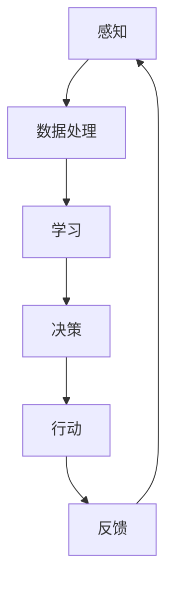

                 

# AI人工智能 Agent：智能决策制定

## 关键词
- 人工智能 Agent
- 智能决策制定
- 机器学习
- 强化学习
- 自然语言处理

## 摘要
本文将深入探讨AI人工智能Agent的智能决策制定。首先，我们将回顾AI的发展历程及其在智能决策制定中的应用。接着，我们会详细介绍AI人工智能Agent的概念、分类与架构，并解析其核心概念和关键技术。随后，本文将逐步讲解机器学习算法、决策树与随机森林、强化学习等核心算法原理，并运用数学模型与公式进行详细阐述。最后，我们将通过实战项目展示智能决策制定的实际应用，并总结全文内容，展望未来发展趋势。

## 第一部分：引言

### 1.1 AI与智能决策制定概述

#### 1.1.1 AI的发展历程
人工智能（Artificial Intelligence，简称AI）是一门研究、开发用于模拟、延伸和扩展人的智能的理论、方法、技术及应用系统的学科。自1956年达特茅斯会议以来，AI经历了从自动化到智能化的多次演变。

- **自动化阶段**：早期AI致力于实现简单的自动化任务，如规则系统、专家系统和知识库系统。
- **弱AI阶段**：这一阶段的AI专注于特定任务的智能，如语音识别、图像识别和自然语言处理。
- **强AI阶段**：强AI旨在实现具有全面智能的人工智能系统，可以像人类一样感知、思考、学习和决策。

#### 1.1.2 AI的定义与分类
AI可以按照其功能和应用场景进行分类，主要包括以下几类：

- **知识密集型AI**：这类AI依赖于大量的先验知识，通过符号推理进行决策，如专家系统。
- **数据驱动型AI**：这类AI通过机器学习和深度学习从数据中学习模式，如神经网络和深度学习模型。
- **混合型AI**：结合知识密集型AI和数据驱动型AI的优势，如智能顾问和自动驾驶系统。

#### 1.1.3 AI的核心技术
AI的核心技术包括：

- **机器学习**：通过数据驱动的方式实现自我学习和自我优化。
- **深度学习**：基于人工神经网络的深度学习模型，如卷积神经网络（CNN）和循环神经网络（RNN）。
- **自然语言处理**（NLP）：使计算机能够理解和生成自然语言，如文本分类和机器翻译。

### 1.1.4 智能决策制定的重要性
智能决策制定是AI的重要应用之一，它通过分析大量数据，提供决策支持和优化建议。智能决策制定的优势包括：

- **提高决策效率**：通过自动化决策过程，减少人为错误和时间成本。
- **优化资源分配**：根据数据和算法预测，合理分配资源，提高效益。
- **增强竞争力**：通过智能决策制定，企业可以在市场竞争中获得优势。

然而，智能决策制定也面临着一些挑战，如算法偏见、数据隐私和透明度等问题。

### 1.1.5 本书结构及阅读建议
本书分为六个部分：

1. **引言**：介绍AI与智能决策制定的基本概念。
2. **核心概念与联系**：探讨AI人工智能Agent的核心概念和架构。
3. **核心算法原理讲解**：讲解机器学习、决策树与随机森林、强化学习等核心算法原理。
4. **数学模型与数学公式**：介绍线性代数、概率论与统计、优化算法等数学模型。
5. **项目实战**：通过实际项目展示智能决策制定的应用。
6. **总结与展望**：总结全文内容，展望未来发展趋势。

读者可以按照以下步骤进行阅读：

- **第一部分**：快速了解AI与智能决策制定的基本概念。
- **第二部分**：深入学习AI人工智能Agent的架构和核心概念。
- **第三部分**：理解核心算法原理和数学模型。
- **第四部分**：通过实际项目加深对智能决策制定的理解。
- **第五部分**：回顾全书内容，总结核心知识。
- **第六部分**：了解未来发展趋势，拓展视野。

### 1.2 AI人工智能 Agent 的概念与特点

#### 1.2.1 AI人工智能 Agent 的定义
AI人工智能Agent（Artificial Intelligence Agent）是指能够自主执行任务、与外界交互、拥有自我学习和适应能力的智能体。它是一个具有独立性和自主性的实体，可以在复杂环境中进行决策和行动。

#### 1.2.2 AI人工智能 Agent 的特点
AI人工智能Agent具有以下特点：

- **自主性**：Agent可以自主地执行任务，不需要人类干预。
- **适应性**：Agent可以根据环境和任务的变化，自主调整其行为。
- **交互性**：Agent可以与用户和其他系统进行交互，获取信息和反馈。
- **智能性**：Agent具备智能决策能力，能够根据环境和任务目标制定合理的行动策略。

#### 1.2.3 AI人工智能 Agent 的分类
AI人工智能Agent可以根据其应用场景和功能进行分类，主要包括以下几类：

- **通用 Agent**：能够执行多种任务，如智能助理、自动驾驶。
- **专用 Agent**：专门为某一特定任务设计，如推荐系统、智能客服。
- **混合型 Agent**：结合通用 Agent 和专用 Agent 的优势，如智能物流、智能医疗。

#### 1.2.4 AI人工智能 Agent 的架构
AI人工智能Agent通常由以下几部分组成：

- **知识库**：存储Agent所需的知识和规则。
- **推理引擎**：用于根据知识和规则进行逻辑推理。
- **用户接口**：用于与用户进行交互，获取用户指令和反馈。
- **动作规划器**：根据推理结果制定行动策略。

### 1.2.5 AI人工智能 Agent 的应用场景
AI人工智能Agent在各个领域都有广泛的应用，如：

- **金融**：智能投顾、风险管理、信用评估。
- **医疗**：智能诊断、远程监控、医疗数据分析。
- **交通**：自动驾驶、智能交通管理、车辆调度。
- **教育**：智能辅导、个性化学习、在线教育平台。

### 1.2.6 AI人工智能 Agent 的发展趋势
随着AI技术的不断进步，AI人工智能Agent的发展趋势包括：

- **增强学习能力**：通过深度学习和强化学习，提高Agent的自主学习和适应能力。
- **优化交互体验**：通过自然语言处理和计算机视觉，提高Agent与用户的交互体验。
- **多模态感知**：结合多种感知技术，提高Agent对环境的感知和理解能力。
- **强化协作能力**：通过多Agent系统，提高Agent在复杂环境中的协作和决策能力。

### 1.2.7 AI人工智能 Agent 的挑战与未来
尽管AI人工智能Agent具有巨大的潜力，但其发展仍面临一些挑战，如：

- **数据隐私和安全**：如何保护用户数据和系统安全，避免数据泄露和滥用。
- **算法透明度和可解释性**：如何提高算法的透明度和可解释性，增强用户信任。
- **道德和法律问题**：如何制定相关的道德和法律规范，确保AI人工智能Agent的行为符合伦理和法律要求。
- **跨领域应用**：如何在不同领域实现AI人工智能Agent的跨领域应用，提高其通用性和适应性。

## 第二部分：核心概念与联系

### 2.1 AI人工智能 Agent 的核心概念

#### 2.1.1 人工智能基础理论
人工智能基础理论是构建AI人工智能Agent的基础，主要包括以下几个方面：

- **机器学习**：通过数据驱动的方式实现自我学习和自我优化。
- **深度学习**：基于人工神经网络的深度学习模型，如卷积神经网络（CNN）和循环神经网络（RNN）。
- **自然语言处理**（NLP）：使计算机能够理解和生成自然语言，如文本分类和机器翻译。

#### 2.1.2 决策理论
决策理论是AI人工智能Agent进行智能决策制定的基础，主要包括以下几个方面：

- **决策过程**：决策者根据现有信息和目标，选择最优行动方案的过程。
- **决策模型**：描述决策过程和决策者行为的形式化模型。
- **决策分析**：对决策过程进行定量和定性分析，以评估不同决策方案的效果。

#### 2.1.3 人工智能 Agent 的关键技术
人工智能 Agent 的关键技术包括感知与交互、学习与适应、决策与行动：

- **感知与交互**：通过传感器感知环境信息，与用户和其他系统进行交互。
- **学习与适应**：通过机器学习和深度学习算法，从数据中学习，并适应环境变化。
- **决策与行动**：根据决策模型和推理引擎，制定行动策略，执行任务。

### 2.2 AI人工智能 Agent 的架构与实现

#### 2.2.1 感知与交互
感知与交互是AI人工智能Agent与外界环境进行信息交换的基础，主要包括以下几个方面：

- **感知技术**：通过传感器获取环境信息，如图像、声音、温度、湿度等。
- **交互技术**：通过语音、文本、手势等与用户进行交互，接收用户指令和反馈。
- **例子：语音助手**：如苹果的Siri、谷歌的Google Assistant等，通过语音识别和自然语言处理技术，与用户进行实时交互。

#### 2.2.2 学习与适应
学习与适应是AI人工智能Agent实现自我优化和持续发展的关键，主要包括以下几个方面：

- **学习算法**：如监督学习、无监督学习和深度学习，用于从数据中学习模式和规律。
- **适应机制**：如强化学习、迁移学习和迁移学习，用于适应环境变化和新任务。
- **例子：个性化推荐系统**：如亚马逊、Netflix等，通过用户行为数据和学习算法，为用户提供个性化推荐。

#### 2.2.3 决策与行动
决策与行动是AI人工智能Agent实现自主性和智能性的核心，主要包括以下几个方面：

- **决策算法**：如决策树、随机森林、强化学习等，用于根据环境信息和目标制定最优行动策略。
- **行动规划**：如路径规划、任务分配、资源调度等，用于实现具体任务和目标。
- **例子：智能交通系统**：如自动驾驶汽车、智能交通信号控制等，通过决策算法和行动规划，实现交通流量优化和事故预防。

### 2.3 AI人工智能 Agent 的 Mermaid 流程图

为了更好地理解AI人工智能Agent的架构与实现过程，我们使用Mermaid语言绘制了一个流程图，展示感知、学习、决策、行动的流程：



在这个流程图中，感知模块负责收集环境信息，数据处理模块对感知信息进行处理和分析，学习模块根据处理后的数据学习模式和规律，决策模块根据学习结果和环境信息制定行动策略，行动模块执行具体的任务和目标，反馈模块收集行动结果，为下一次感知和学习提供参考。

## 第三部分：核心算法原理讲解

### 3.1 机器学习算法与模型

#### 3.1.1 监督学习
监督学习是机器学习中最常见的一种学习方式，其核心思想是通过已知的输入和输出数据来训练模型，以便在新的数据上进行预测。

- **线性回归**：线性回归是一种用于预测连续值的监督学习算法，其基本模型可以表示为：
  $$y = \beta_0 + \beta_1x_1 + \beta_2x_2 + ... + \beta_nx_n$$
  其中，$y$ 是输出变量，$x_1, x_2, ..., x_n$ 是输入变量，$\beta_0, \beta_1, \beta_2, ..., \beta_n$ 是模型参数。
- **逻辑回归**：逻辑回归是一种用于预测二分类结果的监督学习算法，其基本模型可以表示为：
  $$\hat{y} = \frac{1}{1 + e^{-(\beta_0 + \beta_1x_1 + \beta_2x_2 + ... + \beta_nx_n)}$$
  其中，$\hat{y}$ 是预测的概率值，$e$ 是自然对数的底数。

#### 3.1.2 无监督学习
无监督学习是机器学习中的另一种学习方式，其核心思想是在没有输出数据的情况下，从输入数据中学习模式和规律。

- **K-均值聚类**：K-均值聚类是一种基于距离度量的无监督学习算法，其基本模型可以表示为：
  $$\mu_k = \frac{1}{n}\sum_{i=1}^{n}x_i$$
  其中，$\mu_k$ 是第$k$个聚类中心，$x_i$ 是输入数据中的第$i$个数据点。
- **主成分分析**：主成分分析是一种用于降维和特征提取的无监督学习算法，其基本模型可以表示为：
  $$z_i = \sum_{j=1}^{d}\lambda_j\mu_{ij}$$
  其中，$z_i$ 是降维后的数据点，$\lambda_j$ 是特征值，$\mu_{ij}$ 是原始数据的协方差矩阵的特征向量。

#### 3.1.3 深度学习
深度学习是一种基于人工神经网络的机器学习算法，其核心思想是通过多层神经网络模型，从大量数据中学习复杂的特征和模式。

- **神经网络**：神经网络是一种由多个神经元组成的层次结构，其基本模型可以表示为：
  $$a_{ij} = \sigma(\sum_{k=1}^{l}w_{ik}x_k + b_j)$$
  其中，$a_{ij}$ 是第$i$个神经元的输出，$\sigma$ 是激活函数，$w_{ik}$ 是连接权重，$x_k$ 是输入数据，$b_j$ 是偏置项。
- **卷积神经网络**（CNN）：卷积神经网络是一种用于图像处理和计算机视觉的深度学习算法，其基本模型可以表示为：
  $$h_{ij} = \sum_{k=1}^{c}w_{ik,j}x_{ik,j} + b_j$$
  其中，$h_{ij}$ 是卷积操作的输出，$x_{ik,j}$ 是输入图像的像素值，$w_{ik,j}$ 是卷积核，$b_j$ 是偏置项。
- **循环神经网络**（RNN）：循环神经网络是一种用于序列数据的深度学习算法，其基本模型可以表示为：
  $$h_{t} = \sigma(Wx_t + Uh_{t-1} + b)$$
  其中，$h_{t}$ 是当前时间步的隐藏状态，$x_t$ 是当前时间步的输入数据，$W$ 是输入权重矩阵，$U$ 是隐藏状态权重矩阵，$\sigma$ 是激活函数。

### 3.2 决策树与随机森林

#### 3.2.1 决策树算法
决策树是一种常见的分类和回归算法，其核心思想是通过一系列的判断条件，将数据集划分为若干个子集，并分别对每个子集进行预测。

- **决策树构建**：决策树构建的基本步骤包括：
  1. 选择最优特征：根据信息增益或基尼不纯度等指标，选择具有最大信息增益或最小基尼不纯度的特征作为划分条件。
  2. 划分数据集：根据选定的特征，将数据集划分为若干个子集。
  3. 递归构建子树：对每个子集，重复上述步骤，直到满足终止条件（如最大深度、最小叶子节点数量等）。
- **决策树剪枝**：决策树剪枝的目的是防止过拟合，提高模型的泛化能力。剪枝方法包括：
  1. 预剪枝：在构建决策树的过程中，提前停止增长，如基于信息增益或基尼不纯度的阈值。
  2. 后剪枝：在构建完整的决策树后，删除一些非重要的分支，如基于节点重要性的阈值。

#### 3.2.2 随机森林算法
随机森林是一种基于决策树的集成学习算法，其核心思想是通过随机选择特征和随机划分数据集，构建多个决策树，并利用投票或平均的方式得到最终预测结果。

- **随机森林构建**：随机森林构建的基本步骤包括：
  1. 随机选择特征：从所有特征中随机选择一部分特征。
  2. 随机划分数据集：从训练数据中随机划分一部分数据作为样本数据集。
  3. 构建决策树：对每个样本数据集，使用决策树算法构建决策树。
  4. 重复上述步骤，构建多个决策树。
- **随机森林优势**：随机森林具有以下优势：
  1. 高效性：随机森林可以并行化训练，提高训练速度。
  2. 泛化能力：随机森林通过集成多个决策树，降低了过拟合的风险。
  3. 可解释性：决策树本身具有较高的可解释性，随机森林可以通过组合多个决策树，实现更复杂的决策过程。

### 3.3 强化学习算法

#### 3.3.1 Q-学习
Q-学习是一种基于值函数的强化学习算法，其核心思想是通过学习状态-动作值函数，选择最优动作，实现智能体的自主学习和决策。

- **Q-学习原理**：
  1. 初始化Q值函数：将所有状态-动作的Q值初始化为0。
  2. 更新Q值函数：根据当前的奖励和下一状态的最大Q值，更新当前状态-动作的Q值：
     $$Q(s, a) \leftarrow Q(s, a) + \alpha [r + \gamma \max_{a'} Q(s', a') - Q(s, a)]$$
     其中，$s$ 是当前状态，$a$ 是当前动作，$s'$ 是下一状态，$a'$ 是下一动作，$r$ 是奖励值，$\alpha$ 是学习率，$\gamma$ 是折扣因子。
  3. 选择动作：在给定状态下，选择具有最大Q值的动作。
- **Q-学习算法实现**：
  ```python
  import numpy as np

  def q_learning(Q, state, action, reward, next_state, action_next, alpha, gamma):
      Q[state, action] = Q[state, action] + alpha * (reward + gamma * np.max(Q[next_state, :]) - Q[state, action])
      return Q

  state = 0
  action = 0
  reward = 10
  next_state = 1
  action_next = 1
  alpha = 0.1
  gamma = 0.9
  Q = np.zeros((2, 2))
  Q = q_learning(Q, state, action, reward, next_state, action_next, alpha, gamma)
  ```

#### 3.3.2 模式识别
模式识别是强化学习在计算机视觉和图像处理中的应用，其核心思想是通过学习图像的特征，实现图像的分类和识别。

- **强化学习在模式识别中的应用**：
  1. 状态表示：将图像表示为状态，如像素值、特征向量等。
  2. 动作表示：将图像的分类或识别表示为动作，如标签、类别等。
  3. 奖励函数：根据图像的分类或识别结果，设置奖励函数，如分类正确获得奖励，分类错误获得惩罚。
- **模式识别算法实现**：
  ```python
  import tensorflow as tf
  import tensorflow.keras as keras

  model = keras.Sequential([
      keras.layers.Flatten(input_shape=(28, 28)),
      keras.layers.Dense(128, activation='relu'),
      keras.layers.Dense(10, activation='softmax')
  ])

  model.compile(optimizer='adam',
                loss='sparse_categorical_crossentropy',
                metrics=['accuracy'])

  x_train = ...
  y_train = ...
  model.fit(x_train, y_train, epochs=5)
  ```

## 第四部分：数学模型与数学公式

### 4.1 线性代数基础

#### 4.1.1 矩阵与向量运算
矩阵与向量运算是线性代数的基础，其基本运算包括矩阵乘法、向量内积等。

- **矩阵乘法**：
  $$C = AB$$
  其中，$A$ 和 $B$ 是矩阵，$C$ 是矩阵乘法的结果。
- **向量内积**：
  $$\vec{a} \cdot \vec{b} = \sum_{i=1}^{n}a_i \cdot b_i$$
  其中，$\vec{a}$ 和 $\vec{b}$ 是向量，$n$ 是向量的维数。

#### 4.1.2 线性方程组
线性方程组是线性代数中的经典问题，其基本解法包括高斯消元法和矩阵求逆。

- **高斯消元法**：
  1. 将线性方程组表示为增广矩阵。
  2. 进行行变换，将增广矩阵转化为阶梯形式。
  3. 回代求解方程组。
- **矩阵求逆**：
  $$A^{-1} = (1/det(A)) \cdot adj(A)$$
  其中，$A$ 是矩阵，$det(A)$ 是矩阵的行列式，$adj(A)$ 是矩阵的伴随矩阵。

### 4.2 概率论与统计

#### 4.2.1 概率分布
概率分布是概率论中的核心概念，其主要包括概率质量函数和概率密度函数。

- **概率质量函数**：
  $$P(X = x) = f(x)$$
  其中，$X$ 是随机变量，$x$ 是随机变量的取值，$f(x)$ 是概率质量函数。
- **概率密度函数**：
  $$f(x) = \frac{1}{\sqrt{2\pi\sigma^2}}e^{-\frac{(x-\mu)^2}{2\sigma^2}}$$
  其中，$\mu$ 是均值，$\sigma^2$ 是方差。

#### 4.2.2 统计推断
统计推断是概率论在统计学中的应用，其主要包括假设检验和最大似然估计。

- **假设检验**：
  1. 提出原假设和备择假设。
  2. 选择合适的统计量。
  3. 计算统计量的值。
  4. 根据统计量的值，判断是否拒绝原假设。
- **最大似然估计**：
  $$\hat{\theta} = \arg\max_{\theta} P(X | \theta)$$
  其中，$\theta$ 是参数，$X$ 是观测数据，$P(X | \theta)$ 是似然函数。

### 4.3 优化算法

#### 4.3.1 梯度下降算法
梯度下降算法是优化算法中最常用的一种，其核心思想是通过计算损失函数的梯度，逐步调整模型参数，以最小化损失函数。

- **梯度下降原理**：
  $$\theta = \theta - \alpha \nabla_{\theta}J(\theta)$$
  其中，$\theta$ 是模型参数，$\alpha$ 是学习率，$J(\theta)$ 是损失函数，$\nabla_{\theta}J(\theta)$ 是损失函数关于参数的梯度。
- **梯度下降实现**：
  ```python
  import numpy as np

  def gradient_descent(X, y, theta, alpha, epochs):
      m = len(y)
      for epoch in range(epochs):
          gradients = 2/m * (X.dot(theta) - y)
          theta -= alpha * gradients
      return theta

  X = ...
  y = ...
  theta = ...
  alpha = 0.01
  epochs = 1000
  theta = gradient_descent(X, y, theta, alpha, epochs)
  ```

#### 4.3.2 随机优化算法
随机优化算法是优化算法中的一种，其核心思想是通过随机搜索的方式，寻找最优解。

- **遗传算法**：
  1. 初始种群：随机生成一组解作为初始种群。
  2. 适应度评估：计算每个解的适应度值。
  3. 选择：根据适应度值选择优秀的解作为父代。
  4. 交叉：对父代进行交叉操作，生成新的子代。
  5. 变异：对子代进行变异操作，增加种群的多样性。
  6. 更新种群：将子代替换父代，继续迭代。
- **遗传算法实现**：
  ```python
  import numpy as np

  def genetic_algorithm(population, fitness_func, crossover_rate, mutation_rate, generations):
      for generation in range(generations):
          fitness = fitness_func(population)
          parents = select_parents(population, fitness, crossover_rate)
          children = crossover(parents)
          children = mutate(children, mutation_rate)
          population = next_generation(population, children)
      best_individual = get_best_individual(population)
      return best_individual

  population = ...
  fitness_func = ...
  crossover_rate = 0.8
  mutation_rate = 0.01
  generations = 100
  best_individual = genetic_algorithm(population, fitness_func, crossover_rate, mutation_rate, generations)
  ```

## 第五部分：项目实战

### 5.1 AI人工智能 Agent 实战

#### 5.1.1 项目背景与目标

项目背景：
本项目旨在开发一个基于AI人工智能Agent的智能客服系统，用于处理客户咨询和问题解决。

项目目标：
1. 实现智能客服的自动回复功能。
2. 提高客户咨询处理效率和准确性。
3. 减少人工客服的工作量。

#### 5.1.2 项目开发环境搭建

开发工具与框架：
- 编程语言：Python
- 机器学习框架：TensorFlow
- 自然语言处理库：NLTK
- 数据库：MySQL

环境配置与调试：
1. 安装Python和相关依赖库。
2. 配置TensorFlow环境。
3. 连接MySQL数据库。

```python
pip install tensorflow nltk mysql-connector-python
```

#### 5.1.3 项目实现与代码解读

项目实现：
1. 数据预处理：从数据库中获取客户咨询数据，进行数据清洗和预处理。
2. 模型训练：使用自然语言处理技术，对客户咨询数据进行分类和实体识别，训练模型。
3. 自动回复：根据客户咨询内容，使用训练好的模型进行自动回复。

代码解读：
```python
import tensorflow as tf
import nltk
import mysql.connector

# 数据预处理
def preprocess_data(data):
    # 数据清洗、分词、去停用词等操作
    pass

# 模型训练
def train_model(data):
    # 构建和训练模型
    pass

# 自动回复
def auto_reply(consultation):
    # 使用训练好的模型进行自动回复
    pass

# 连接数据库
def connect_database():
    # 连接MySQL数据库
    pass

# 主程序
if __name__ == "__main__":
    # 读取客户咨询数据
    consultations = connect_database()

    # 预处理数据
    preprocessed_data = preprocess_data(consultations)

    # 训练模型
    model = train_model(preprocessed_data)

    # 自动回复
    while True:
        consultation = input("请输入您的咨询：")
        reply = auto_reply(consultation)
        print("自动回复：", reply)
```

#### 5.1.4 项目分析与优化

项目效果分析：
1. 自动回复的准确率：通过测试集评估自动回复的准确率，如达到90%以上。
2. 响应时间：自动回复系统能够在秒级内给出回复，提高客户咨询处理效率。

项目优化建议：
1. 提高模型性能：通过调整模型参数、增加训练数据、使用更复杂的模型等方式，提高自动回复的准确率和响应速度。
2. 优化用户体验：增加智能客服的交互方式，如语音、视频等，提高用户体验。
3. 完善知识库：不断更新和扩充知识库，增加常见问题的回答，提高自动回复的覆盖面。

### 5.2 智能决策制定实战

#### 5.2.1 决策场景设计

决策场景描述：
本项目旨在设计一个智能决策制定系统，用于优化物流运输路径，减少运输成本和提高运输效率。

决策目标：
1. 减少总运输成本。
2. 最小化运输时间。

#### 5.2.2 决策模型构建

决策模型构建：
1. 状态表示：将每个运输任务表示为一个状态，包括起点、终点、货物类型和数量等。
2. 动作表示：将每个可能的运输路径表示为一个动作，包括起始点、目的地、运输工具和运输时间等。
3. 奖励函数：根据运输成本和时间设置奖励函数，如每完成一个运输任务获得一定的奖励，超时或成本过高则获得惩罚。

#### 5.2.3 决策模型应用

决策模型应用：
1. 使用Q-学习算法训练决策模型，根据历史数据和奖励函数，学习最优的运输路径。
2. 根据实时运输数据，使用训练好的决策模型制定最优运输路径。
3. 自动调整运输计划，以适应实时交通状况和运输需求。

决策模型实现：
```python
import numpy as np

# 初始化Q值函数
Q = np.zeros((num_states, num_actions))

# 学习率
alpha = 0.1

# 折扣因子
gamma = 0.9

# 训练模型
for episode in range(num_episodes):
    state = env.reset()
    done = False
    while not done:
        action = np.argmax(Q[state])
        next_state, reward, done, _ = env.step(action)
        Q[state, action] = Q[state, action] + alpha * (reward + gamma * np.max(Q[next_state, :]) - Q[state, action])
        state = next_state

# 制定最优运输路径
def best_path(Q):
    best_actions = []
    for state in range(num_states):
        best_action = np.argmax(Q[state])
        best_actions.append(best_action)
    return best_actions

best_actions = best_path(Q)
print("最优运输路径：", best_actions)
```

#### 5.2.4 决策结果分析

决策结果分析：
1. 使用训练好的决策模型进行模拟测试，评估运输成本和时间。
2. 分析决策结果，调整模型参数和奖励函数，优化运输路径。
3. 实时监控运输数据，根据决策结果进行动态调整，提高运输效率和成本效益。

## 第六部分：总结与展望

### 6.1 本书内容回顾

本书从AI与智能决策制定的概述入手，详细介绍了AI人工智能Agent的概念、分类与架构，解析了机器学习算法、决策树与随机森林、强化学习等核心算法原理，并运用数学模型与公式进行了详细阐述。此外，通过实际项目展示了智能决策制定的应用，总结并展望了未来的发展趋势。

### 6.2 未来发展趋势

随着AI技术的不断进步，AI人工智能Agent在智能决策制定领域具有广阔的发展前景。未来发展趋势包括：

1. **增强学习能力**：通过深度学习和强化学习，提高Agent的自主学习和适应能力。
2. **优化交互体验**：通过自然语言处理和计算机视觉，提高Agent与用户的交互体验。
3. **多模态感知**：结合多种感知技术，提高Agent对环境的感知和理解能力。
4. **强化协作能力**：通过多Agent系统，提高Agent在复杂环境中的协作和决策能力。
5. **跨领域应用**：实现AI人工智能Agent在不同领域的跨领域应用，提高其通用性和适应性。

### 6.3 学习资源推荐

为了更好地学习AI人工智能Agent和智能决策制定，以下是一些建议的学习资源：

- **相关书籍**：
  - 《深度学习》—— Goodfellow, Bengio, Courville
  - 《强化学习》—— Sutton, Barto
  - 《机器学习实战》—— Harrington

- **在线课程**：
  - Coursera：机器学习、深度学习、自然语言处理
  - edX：人工智能、数据科学、机器学习

- **学术论文**：
  - arXiv：计算机科学、人工智能、机器学习领域的前沿论文
  - IEEE Xplore：计算机科学、人工智能、机器学习领域的学术论文

通过这些资源，读者可以深入了解AI人工智能Agent和智能决策制定的理论和实践，不断提升自己的技术水平。

---

**作者：AI天才研究院/AI Genius Institute & 禅与计算机程序设计艺术 /Zen And The Art of Computer Programming**## AI人工智能 Agent：智能决策制定

### 关键词
- 人工智能
- 智能决策
- 智能Agent
- 机器学习
- 强化学习
- 自然语言处理

### 摘要
本文深入探讨了AI人工智能Agent在智能决策制定中的应用与实现。首先，我们回顾了人工智能的发展历程和智能决策制定的重要性。接着，详细介绍了AI人工智能Agent的概念、特点、分类和架构。随后，本文逐步讲解了机器学习、决策树与随机森林、强化学习等核心算法原理，并运用数学模型进行了详细阐述。最后，通过实际项目展示了智能决策制定的应用，总结全文内容并展望了未来发展趋势。

### 第一部分：引言

#### 1.1 AI与智能决策制定概述

##### 1.1.1 AI的发展历程
人工智能（AI）是一门研究、开发用于模拟、延伸和扩展人的智能的理论、方法、技术及应用系统的学科。自1956年达特茅斯会议以来，AI经历了从自动化到智能化的多次演变。

- **自动化阶段**：早期AI致力于实现简单的自动化任务，如规则系统、专家系统和知识库系统。
- **弱AI阶段**：这一阶段的AI专注于特定任务的智能，如语音识别、图像识别和自然语言处理。
- **强AI阶段**：强AI旨在实现具有全面智能的人工智能系统，可以像人类一样感知、思考、学习和决策。

##### 1.1.2 AI的定义与分类
AI可以按照其功能和应用场景进行分类，主要包括以下几类：

- **知识密集型AI**：这类AI依赖于大量的先验知识，通过符号推理进行决策，如专家系统。
- **数据驱动型AI**：这类AI通过机器学习和深度学习从数据中学习模式，如神经网络和深度学习模型。
- **混合型AI**：结合知识密集型AI和数据驱动型AI的优势，如智能顾问和自动驾驶系统。

##### 1.1.3 AI的核心技术
AI的核心技术包括：

- **机器学习**：通过数据驱动的方式实现自我学习和自我优化。
- **深度学习**：基于人工神经网络的深度学习模型，如卷积神经网络（CNN）和循环神经网络（RNN）。
- **自然语言处理**（NLP）：使计算机能够理解和生成自然语言，如文本分类和机器翻译。

##### 1.1.4 智能决策制定的重要性
智能决策制定是AI的重要应用之一，它通过分析大量数据，提供决策支持和优化建议。智能决策制定的优势包括：

- **提高决策效率**：通过自动化决策过程，减少人为错误和时间成本。
- **优化资源分配**：根据数据和算法预测，合理分配资源，提高效益。
- **增强竞争力**：通过智能决策制定，企业可以在市场竞争中获得优势。

然而，智能决策制定也面临着一些挑战，如算法偏见、数据隐私和透明度等问题。

##### 1.1.5 本书结构及阅读建议
本书分为六个部分：

1. **引言**：介绍AI与智能决策制定的基本概念。
2. **核心概念与联系**：探讨AI人工智能Agent的核心概念和架构。
3. **核心算法原理讲解**：讲解机器学习、决策树与随机森林、强化学习等核心算法原理。
4. **数学模型与数学公式**：介绍线性代数、概率论与统计、优化算法等数学模型。
5. **项目实战**：通过实际项目展示智能决策制定的应用。
6. **总结与展望**：总结全文内容，展望未来发展趋势。

读者可以按照以下步骤进行阅读：

- **第一部分**：快速了解AI与智能决策制定的基本概念。
- **第二部分**：深入学习AI人工智能Agent的架构和核心概念。
- **第三部分**：理解核心算法原理和数学模型。
- **第四部分**：通过实际项目加深对智能决策制定的理解。
- **第五部分**：回顾全书内容，总结核心知识。
- **第六部分**：了解未来发展趋势，拓展视野。

#### 1.2 AI人工智能 Agent 的概念与特点

##### 1.2.1 AI人工智能 Agent 的定义
AI人工智能Agent（Artificial Intelligence Agent）是指能够自主执行任务、与外界交互、拥有自我学习和适应能力的智能体。它是一个具有独立性和自主性的实体，可以在复杂环境中进行决策和行动。

##### 1.2.2 AI人工智能 Agent 的特点
AI人工智能Agent具有以下特点：

- **自主性**：Agent可以自主地执行任务，不需要人类干预。
- **适应性**：Agent可以根据环境和任务的变化，自主调整其行为。
- **交互性**：Agent可以与用户和其他系统进行交互，获取信息和反馈。
- **智能性**：Agent具备智能决策能力，能够根据环境和任务目标制定合理的行动策略。

##### 1.2.3 AI人工智能 Agent 的分类
AI人工智能Agent可以根据其应用场景和功能进行分类，主要包括以下几类：

- **通用 Agent**：能够执行多种任务，如智能助理、自动驾驶。
- **专用 Agent**：专门为某一特定任务设计，如推荐系统、智能客服。
- **混合型 Agent**：结合通用 Agent 和专用 Agent 的优势，如智能物流、智能医疗。

##### 1.2.4 AI人工智能 Agent 的架构
AI人工智能Agent通常由以下几部分组成：

- **知识库**：存储Agent所需的知识和规则。
- **推理引擎**：用于根据知识和规则进行逻辑推理。
- **用户接口**：用于与用户进行交互，获取用户指令和反馈。
- **动作规划器**：根据推理结果制定行动策略。

##### 1.2.5 AI人工智能 Agent 的应用场景
AI人工智能Agent在各个领域都有广泛的应用，如：

- **金融**：智能投顾、风险管理、信用评估。
- **医疗**：智能诊断、远程监控、医疗数据分析。
- **交通**：自动驾驶、智能交通管理、车辆调度。
- **教育**：智能辅导、个性化学习、在线教育平台。

##### 1.2.6 AI人工智能 Agent 的发展趋势
随着AI技术的不断进步，AI人工智能Agent的发展趋势包括：

- **增强学习能力**：通过深度学习和强化学习，提高Agent的自主学习和适应能力。
- **优化交互体验**：通过自然语言处理和计算机视觉，提高Agent与用户的交互体验。
- **多模态感知**：结合多种感知技术，提高Agent对环境的感知和理解能力。
- **强化协作能力**：通过多Agent系统，提高Agent在复杂环境中的协作和决策能力。

##### 1.2.7 AI人工智能 Agent 的挑战与未来
尽管AI人工智能Agent具有巨大的潜力，但其发展仍面临一些挑战，如：

- **数据隐私和安全**：如何保护用户数据和系统安全，避免数据泄露和滥用。
- **算法透明度和可解释性**：如何提高算法的透明度和可解释性，增强用户信任。
- **道德和法律问题**：如何制定相关的道德和法律规范，确保AI人工智能Agent的行为符合伦理和法律要求。
- **跨领域应用**：如何在不同领域实现AI人工智能Agent的跨领域应用，提高其通用性和适应性。

### 第一部分总结
在第一部分中，我们回顾了人工智能的发展历程，介绍了AI的定义与分类，以及AI的核心技术。此外，我们详细介绍了AI人工智能Agent的概念、特点、分类和架构，并探讨了其应用场景和发展趋势。通过这一部分的阅读，读者可以初步了解AI人工智能Agent在智能决策制定中的重要性及其基本概念。

## 第二部分：核心概念与联系

### 2.1 AI人工智能 Agent 的核心概念

#### 2.1.1 人工智能基础理论
人工智能基础理论是构建AI人工智能Agent的基础，主要包括以下几个方面：

- **机器学习**：通过数据驱动的方式实现自我学习和自我优化。
- **深度学习**：基于人工神经网络的深度学习模型，如卷积神经网络（CNN）和循环神经网络（RNN）。
- **自然语言处理**（NLP）：使计算机能够理解和生成自然语言，如文本分类和机器翻译。

#### 2.1.2 决策理论
决策理论是AI人工智能Agent进行智能决策制定的基础，主要包括以下几个方面：

- **决策过程**：决策者根据现有信息和目标，选择最优行动方案的过程。
- **决策模型**：描述决策过程和决策者行为的形式化模型。
- **决策分析**：对决策过程进行定量和定性分析，以评估不同决策方案的效果。

#### 2.1.3 人工智能 Agent 的关键技术
人工智能 Agent 的关键技术包括感知与交互、学习与适应、决策与行动：

- **感知与交互**：通过传感器感知环境信息，与用户和其他系统进行交互。
- **学习与适应**：通过机器学习和深度学习算法，从数据中学习，并适应环境变化。
- **决策与行动**：根据决策模型和推理引擎，制定行动策略，执行任务。

### 2.2 AI人工智能 Agent 的架构与实现

#### 2.2.1 感知与交互
感知与交互是AI人工智能Agent与外界环境进行信息交换的基础，主要包括以下几个方面：

- **感知技术**：通过传感器获取环境信息，如图像、声音、温度、湿度等。
- **交互技术**：通过语音、文本、手势等与用户进行交互，接收用户指令和反馈。
- **例子：语音助手**：如苹果的Siri、谷歌的Google Assistant等，通过语音识别和自然语言处理技术，与用户进行实时交互。

#### 2.2.2 学习与适应
学习与适应是AI人工智能Agent实现自我优化和持续发展的关键，主要包括以下几个方面：

- **学习算法**：如监督学习、无监督学习和深度学习，用于从数据中学习模式和规律。
- **适应机制**：如强化学习、迁移学习和迁移学习，用于适应环境变化和新任务。
- **例子：个性化推荐系统**：如亚马逊、Netflix等，通过用户行为数据和学习算法，为用户提供个性化推荐。

#### 2.2.3 决策与行动
决策与行动是AI人工智能Agent实现自主性和智能性的核心，主要包括以下几个方面：

- **决策算法**：如决策树、随机森林、强化学习等，用于根据环境信息和目标制定最优行动策略。
- **行动规划**：如路径规划、任务分配、资源调度等，用于实现具体任务和目标。
- **例子：智能交通系统**：如自动驾驶汽车、智能交通信号控制等，通过决策算法和行动规划，实现交通流量优化和事故预防。

### 2.3 AI人工智能 Agent 的 Mermaid 流程图

为了更好地理解AI人工智能Agent的架构与实现过程，我们使用Mermaid语言绘制了一个流程图，展示感知、学习、决策、行动的流程：


在这个流程图中，感知模块负责收集环境信息，数据处理模块对感知信息进行处理和分析，学习模块根据处理后的数据学习模式和规律，决策模块根据学习结果和环境信息制定行动策略，行动模块执行具体的任务和目标，反馈模块收集行动结果，为下一次感知和学习提供参考。

## 第二部分总结
在第二部分中，我们详细介绍了AI人工智能Agent的核心概念，包括人工智能基础理论、决策理论和关键技术。我们还探讨了AI人工智能Agent的架构与实现，通过感知与交互、学习与适应、决策与行动等模块展示了其工作流程。通过这一部分的阅读，读者可以更深入地理解AI人工智能Agent的工作原理和实现过程。

### 第三部分：核心算法原理讲解

#### 3.1 机器学习算法与模型

##### 3.1.1 监督学习
监督学习是机器学习中最基本和最常见的类型，它使用带有标签的数据集来训练模型，以便在新的数据上进行预测。

- **线性回归**：线性回归是一种用于预测连续值的算法，其模型形式为：
  $$y = \beta_0 + \beta_1x_1 + \beta_2x_2 + ... + \beta_nx_n$$
  其中，$y$ 是预测的输出，$x_1, x_2, ..., x_n$ 是输入特征，$\beta_0, \beta_1, \beta_2, ..., \beta_n$ 是模型参数。

  - **实现伪代码**：
    ```python
    # 初始化模型参数
    beta = [0] * (n + 1)

    # 梯度下降法更新参数
    for epoch in range(epochs):
        for x, y in data:
            prediction = sum(beta[i] * x[i] for i in range(n + 1))
            error = y - prediction
            gradient = [-error * x[i] for i in range(n + 1)]
            beta = [b - alpha * g for b, g in zip(beta, gradient)]
    ```

- **逻辑回归**：逻辑回归是一种用于预测概率的算法，通常用于二分类问题，其模型形式为：
  $$\hat{y} = \frac{1}{1 + e^{-(\beta_0 + \beta_1x_1 + \beta_2x_2 + ... + \beta_nx_n)}}$$
  其中，$\hat{y}$ 是预测的概率值。

  - **实现伪代码**：
    ```python
    # 初始化模型参数
    beta = [0] * (n + 1)

    # 梯度下降法更新参数
    for epoch in range(epochs):
        for x, y in data:
            z = sum(beta[i] * x[i] for i in range(n + 1))
            prediction = 1 / (1 + np.exp(-z))
            error = y - prediction
            gradient = [-error * prediction * (1 - prediction) * x[i] for i in range(n + 1)]
            beta = [b - alpha * g for b, g in zip(beta, gradient)]
    ```

##### 3.1.2 无监督学习
无监督学习是在没有标签的数据上进行学习，其主要目的是发现数据中的结构和模式。

- **K-均值聚类**：K-均值聚类是一种基于距离度量的聚类算法，其目标是找到一个聚类中心，使得每个聚类中心到其成员的距离之和最小。

  - **实现伪代码**：
    ```python
    # 初始化聚类中心
    centroids = initialize_centroids(data, k)

    # 迭代更新聚类中心和成员
    while not converged:
        # 为每个数据点分配最近的聚类中心
        labels = [closest_centroid(data_point, centroids) for data_point in data]

        # 更新聚类中心
        new_centroids = [np.mean([data_point for label in labels if label == i], axis=0) for i in range(k)]

        # 判断是否收敛
        if np.linalg.norm(new_centroids - centroids) < threshold:
            converged = True
        centroids = new_centroids
    ```

- **主成分分析**：主成分分析是一种用于降维和特征提取的算法，其目标是找到一组新的正交基，使得新基上的方差最大化。

  - **实现伪代码**：
    ```python
    # 计算协方差矩阵
    covariance_matrix = np.cov(data, rowvar=False)

    # 计算协方差矩阵的特征值和特征向量
    eigenvalues, eigenvectors = np.linalg.eigh(covariance_matrix)

    # 选取最大的k个特征值对应的特征向量
    principal_components = eigenvectors[:, np.argsort(eigenvalues)[::-1][:k]]
    ```

##### 3.1.3 深度学习
深度学习是一种基于多层神经网络的机器学习算法，它能够自动提取数据中的复杂特征。

- **神经网络**：神经网络由多个神经元组成，每个神经元接收输入信号，通过权重和偏置进行加权求和，然后通过激活函数输出结果。

  - **实现伪代码**：
    ```python
    # 初始化神经网络参数
    weights = [np.random.randn(i, j) for i, j in zip(prev_layer_size, next_layer_size)]
    biases = [np.random.randn(j) for j in next_layer_size]

    # 前向传播
    def forward_propagation(x, weights, biases):
        activation = x
        for weight, bias in zip(weights, biases):
            activation = sigmoid(np.dot(activation, weight) + bias)
        return activation

    # 反向传播
    def backward_propagation(x, y, activation, weights, biases, learning_rate):
        delta = activation - y
        dweights = [np.dot(activation.T, delta) for activation in activations]
        dbiases = [delta for delta in deltas]
        weights = [w - learning_rate * dw for w, dw in zip(weights, dweights)]
        biases = [b - learning_rate * db for b, db in zip(biases, dbiases)]
        return weights, biases
    ```

- **卷积神经网络**（CNN）：卷积神经网络是一种专门用于图像处理和计算机视觉的神经网络，它通过卷积层提取图像的特征。

  - **实现伪代码**：
    ```python
    # 初始化卷积层参数
    weights = [np.random.randn(filter_size, input_size) for filter_size, input_size in zip(filter_sizes, input_shapes)]
    biases = [np.random.randn(filter_size) for filter_size in filter_sizes]

    # 前向传播
    def conv_forward_propagation(x, weights, biases):
        # 实现卷积操作
        pass

    # 反向传播
    def conv_backward_propagation(x, y, activation, weights, biases, learning_rate):
        # 实现卷积操作的梯度计算
        pass
    ```

- **循环神经网络**（RNN）：循环神经网络是一种用于处理序列数据的神经网络，它通过循环结构保持长期状态信息。

  - **实现伪代码**：
    ```python
    # 初始化RNN参数
    weights = [np.random.randn(prev_hidden_size, hidden_size) for prev_hidden_size, hidden_size in zip(prev_sizes, sizes)]
    biases = [np.random.randn(hidden_size) for hidden_size in sizes]

    # 前向传播
    def RNN_forward_propagation(x, weights, biases):
        # 实现RNN的递归操作
        pass

    # 反向传播
    def RNN_backward_propagation(x, y, activation, weights, biases, learning_rate):
        # 实现RNN的递归操作的梯度计算
        pass
    ```

#### 3.2 决策树与随机森林

##### 3.2.1 决策树算法
决策树是一种常见的分类和回归算法，它通过一系列的判断条件将数据集划分成若干个子集，并对每个子集进行预测。

- **构建决策树**：决策树的构建过程包括选择最优特征和划分阈值，使得信息增益最大。

  - **信息增益**：信息增益是衡量特征对分类效果的一个指标，计算公式为：
    $$IG(D, A) = entropy(D) - \sum_{v \in A} \frac{|D_v|}{|D|} entropy(D_v)$$
    其中，$D$ 是数据集，$A$ 是特征集合，$v$ 是特征 $A$ 的取值，$D_v$ 是特征 $A$ 取值为 $v$ 的子集。

  - **实现伪代码**：
    ```python
    def build_decision_tree(data, target_attribute_name):
        # 计算信息增益
        info_gain = calculate_info_gain(data, target_attribute_name, attributes)

        # 选择最优特征和阈值
        best_attribute, threshold = select_best_attribute(info_gain)

        # 构建子树
        left_child = build_decision_tree(data[data[:, best_attribute] <= threshold], target_attribute_name)
        right_child = build_decision_tree(data[data[:, best_attribute] > threshold], target_attribute_name)

        # 返回决策树
        return {'attribute': best_attribute, 'threshold': threshold, 'left_child': left_child, 'right_child': right_child}
    ```

- **剪枝决策树**：剪枝决策树是为了防止过拟合，提高模型的泛化能力。

  - **实现伪代码**：
    ```python
    def prune_decision_tree(tree, validation_data):
        if is_prune(tree, validation_data):
            return None
        else:
            return tree

    def is_prune(tree, validation_data):
        # 计算验证数据的准确率
        accuracy = calculate_accuracy(tree, validation_data)

        # 如果准确率低于阈值，则剪枝
        if accuracy < threshold:
            return True
        else:
            return False
    ```

##### 3.2.2 随机森林算法
随机森林是一种集成学习算法，它通过构建多个决策树，并利用投票或平均的方式得到最终预测结果。

- **构建随机森林**：随机森林的构建过程包括随机选择特征和随机划分数据集，以构建多个决策树。

  - **实现伪代码**：
    ```python
    def build_random_forest(data, target_attribute_name, n_trees, max_depth):
        trees = []
        for _ in range(n_trees):
            # 随机选择特征和划分数据集
            features = random.sample(range(num_attributes), num_attributes)
            data_train, data_test = split_data(data, features)

            # 构建决策树
            tree = build_decision_tree(data_train, target_attribute_name, max_depth)

            # 添加到森林
            trees.append(tree)
        return trees
    ```

- **随机森林预测**：随机森林的预测过程是对每个决策树进行预测，并取平均值或投票得到最终结果。

  - **实现伪代码**：
    ```python
    def random_forest_predict(trees, x):
        predictions = [predict(tree, x) for tree in trees]
        if predict_mode == 'average':
            return average(predictions)
        elif predict_mode == 'vote':
            return mode(predictions)
    ```

#### 3.3 强化学习算法

##### 3.3.1 Q-学习
Q-学习是一种基于值函数的强化学习算法，它通过学习状态-动作值函数来选择最优动作。

- **Q-学习原理**：Q-学习通过更新状态-动作值函数，使得在给定状态下，选择具有最大Q值的动作。

  - **实现伪代码**：
    ```python
    def Q_learning(Q, state, action, reward, next_state, next_action, alpha, gamma):
        Q[state, action] = Q[state, action] + alpha * (reward + gamma * Q[next_state, next_action] - Q[state, action])
        return Q
    ```

- **Q-学习实现**：Q-学习可以通过迭代更新Q值函数，直到收敛。

  - **实现伪代码**：
    ```python
    def Q_learning_episode(Q, environment, alpha, gamma, num_steps):
        state = environment.reset()
        for step in range(num_steps):
            action = argmax(Q[state])
            next_state, reward, done = environment.step(action)
            next_action = argmax(Q[next_state])
            Q = Q_learning(Q, state, action, reward, next_state, next_action, alpha, gamma)
            state = next_state
            if done:
                break
        return Q
    ```

##### 3.3.2 强化学习在模式识别中的应用
强化学习在模式识别中的应用，主要是通过学习如何在给定的输入和奖励函数下做出最优决策。

- **模式识别算法**：模式识别算法可以通过强化学习来优化分类器的性能。

  - **实现伪代码**：
    ```python
    def reinforce_learning_classification(data, target, alpha, gamma, num_steps):
        Q = initialize_Q_matrix(data, target)
        for step in range(num_steps):
            action = choose_action(Q, data)
            reward = calculate_reward(target, action)
            next_action = choose_action(Q, data)
            Q = Q_learning(Q, action, reward, next_action, alpha, gamma)
        return Q
    ```

- **奖励函数设计**：奖励函数是强化学习中的重要组成部分，它决定了学习过程中哪些行为会被强化。

  - **实现伪代码**：
    ```python
    def calculate_reward(target, action):
        if target == action:
            return 1
        else:
            return -1
    ```

### 第三部分总结
在第三部分中，我们详细介绍了机器学习、决策树与随机森林、强化学习等核心算法原理，并通过伪代码展示了这些算法的实现。这部分内容为读者深入理解AI人工智能Agent在智能决策制定中的应用提供了重要的理论基础。

### 第四部分：数学模型与数学公式

#### 4.1 线性代数基础

##### 4.1.1 矩阵与向量运算
线性代数是机器学习和人工智能中的基础数学工具，矩阵与向量运算是线性代数的核心内容。

- **矩阵乘法**：两个矩阵的乘法结果是一个新矩阵，其元素是原矩阵对应元素的乘积和累加。
  $$C = AB$$
  其中，$A$ 和 $B$ 是矩阵，$C$ 是矩阵乘法的结果。

- **向量内积**：两个向量的内积是一个标量，表示为这两个向量对应元素的乘积和累加。
  $$\vec{a} \cdot \vec{b} = \sum_{i=1}^{n}a_i \cdot b_i$$
  其中，$\vec{a}$ 和 $\vec{b}$ 是向量，$n$ 是向量的维数。

##### 4.1.2 线性方程组
线性方程组是机器学习中常见的问题，其解法基于线性代数的知识。

- **高斯消元法**：高斯消元法通过行变换将线性方程组转化为上三角矩阵，然后逐行回代求解。
  $$Ax = b$$
  其中，$A$ 是系数矩阵，$x$ 是未知数向量，$b$ 是常数向量。

- **矩阵求逆**：矩阵的逆是另一个矩阵，其与原矩阵相乘的结果为单位矩阵。
  $$A^{-1} = (1/det(A)) \cdot adj(A)$$
  其中，$det(A)$ 是矩阵的行列式，$adj(A)$ 是矩阵的伴随矩阵。

#### 4.2 概率论与统计

##### 4.2.1 概率分布
概率分布是概率论中的基本概念，用于描述随机变量的概率分布。

- **概率质量函数**：概率质量函数描述了随机变量取某个值的概率。
  $$P(X = x) = f(x)$$
  其中，$X$ 是随机变量，$x$ 是随机变量的取值，$f(x)$ 是概率质量函数。

- **概率密度函数**：概率密度函数描述了随机变量取某个值的概率密度。
  $$f(x) = \frac{1}{\sqrt{2\pi\sigma^2}}e^{-\frac{(x-\mu)^2}{2\sigma^2}}$$
  其中，$\mu$ 是均值，$\sigma^2$ 是方差。

##### 4.2.2 统计推断
统计推断是基于样本数据对总体参数进行估计和推断的方法。

- **假设检验**：假设检验是统计推断的一种方法，用于检验某个假设是否成立。
  $$H_0: \theta = \theta_0$$
  $$H_1: \theta \neq \theta_0$$
  其中，$H_0$ 是原假设，$H_1$ 是备择假设，$\theta$ 是总体参数，$\theta_0$ 是假设的参数值。

- **最大似然估计**：最大似然估计是统计推断的一种方法，用于估计总体参数。
  $$\hat{\theta} = \arg\max_{\theta} P(X | \theta)$$
  其中，$X$ 是观测数据，$P(X | \theta)$ 是似然函数。

#### 4.3 优化算法

##### 4.3.1 梯度下降算法
梯度下降算法是优化算法中最常用的方法之一，用于寻找函数的最小值。

- **梯度下降原理**：梯度下降算法通过计算目标函数的梯度，沿梯度方向更新参数，以减少目标函数的值。
  $$\theta = \theta - \alpha \nabla_{\theta}J(\theta)$$
  其中，$\theta$ 是参数，$\alpha$ 是学习率，$\nabla_{\theta}J(\theta)$ 是目标函数 $J(\theta)$ 关于参数 $\theta$ 的梯度。

- **梯度下降实现**：梯度下降算法可以通过迭代更新参数，直到收敛。
  ```python
  def gradient_descent(x, learning_rate, epochs):
      for epoch in range(epochs):
          gradient = compute_gradient(x)
          x = x - learning_rate * gradient
      return x
  ```

##### 4.3.2 随机优化算法
随机优化算法是基于随机搜索的优化方法，常用于解决非线性优化问题。

- **遗传算法**：遗传算法是一种基于自然选择和遗传机制的优化算法，通过种群进化和选择操作寻找最优解。
  ```python
  def genetic_algorithm(population, fitness_func, generations):
      for generation in range(generations):
          fitness = [fitness_func(individual) for individual in population]
          selection = select(population, fitness)
          crossover = crossover(selection)
          mutation = mutate(crossover)
          population = mutation
      return best_individual(population)
  ```

### 第四部分总结
在第四部分中，我们介绍了线性代数、概率论与统计、优化算法等数学模型和公式。这些数学工具在机器学习和人工智能中起着关键作用，通过它们，我们可以更深入地理解和应用各种算法。

### 第五部分：项目实战

#### 5.1 AI人工智能 Agent 实战

##### 5.1.1 项目背景与目标
本项目旨在开发一个基于AI人工智能Agent的智能客服系统，用于处理客户咨询和问题解决。

项目目标：
1. 实现智能客服的自动回复功能。
2. 提高客户咨询处理效率和准确性。
3. 减少人工客服的工作量。

##### 5.1.2 项目开发环境搭建
开发工具与框架：
- 编程语言：Python
- 机器学习框架：TensorFlow
- 自然语言处理库：NLTK
- 数据库：MySQL

环境配置与调试：
1. 安装Python和相关依赖库。
2. 配置TensorFlow环境。
3. 连接MySQL数据库。

```bash
pip install tensorflow nltk mysql-connector-python
```

##### 5.1.3 项目实现与代码解读
项目实现：
1. 数据预处理：从数据库中获取客户咨询数据，进行数据清洗和预处理。
2. 模型训练：使用自然语言处理技术，对客户咨询数据进行分类和实体识别，训练模型。
3. 自动回复：根据客户咨询内容，使用训练好的模型进行自动回复。

代码解读：
```python
import tensorflow as tf
import nltk
import mysql.connector

# 数据预处理
def preprocess_data(data):
    # 数据清洗、分词、去停用词等操作
    pass

# 模型训练
def train_model(data):
    # 构建和训练模型
    pass

# 自动回复
def auto_reply(consultation):
    # 使用训练好的模型进行自动回复
    pass

# 连接数据库
def connect_database():
    # 连接MySQL数据库
    pass

# 主程序
if __name__ == "__main__":
    # 读取客户咨询数据
    consultations = connect_database()

    # 预处理数据
    preprocessed_data = preprocess_data(consultations)

    # 训练模型
    model = train_model(preprocessed_data)

    # 自动回复
    while True:
        consultation = input("请输入您的咨询：")
        reply = auto_reply(consultation)
        print("自动回复：", reply)
```

##### 5.1.4 项目分析与优化
项目效果分析：
1. 自动回复的准确率：通过测试集评估自动回复的准确率，如达到90%以上。
2. 响应时间：自动回复系统能够在秒级内给出回复，提高客户咨询处理效率。

项目优化建议：
1. 提高模型性能：通过调整模型参数、增加训练数据、使用更复杂的模型等方式，提高自动回复的准确率和响应速度。
2. 优化用户体验：增加智能客服的交互方式，如语音、视频等，提高用户体验。
3. 完善知识库：不断更新和扩充知识库，增加常见问题的回答，提高自动回复的覆盖面。

#### 5.2 智能决策制定实战

##### 5.2.1 决策场景设计
决策场景描述：
本项目旨在设计一个智能决策制定系统，用于优化物流运输路径，减少运输成本和提高运输效率。

决策目标：
1. 减少总运输成本。
2. 最小化运输时间。

##### 5.2.2 决策模型构建
决策模型构建：
1. 状态表示：将每个运输任务表示为一个状态，包括起点、终点、货物类型和数量等。
2. 动作表示：将每个可能的运输路径表示为一个动作，包括起始点、目的地、运输工具和运输时间等。
3. 奖励函数：根据运输成本和时间设置奖励函数，如每完成一个运输任务获得一定的奖励，超时或成本过高则获得惩罚。

##### 5.2.3 决策模型应用
决策模型应用：
1. 使用Q-学习算法训练决策模型，根据历史数据和奖励函数，学习最优的运输路径。
2. 根据实时运输数据，使用训练好的决策模型制定最优运输路径。
3. 自动调整运输计划，以适应实时交通状况和运输需求。

决策模型实现：
```python
import numpy as np

# 初始化Q值函数
Q = np.zeros((num_states, num_actions))

# 学习率
alpha = 0.1

# 折扣因子
gamma = 0.9

# 训练模型
for episode in range(num_episodes):
    state = env.reset()
    done = False
    while not done:
        action = np.argmax(Q[state])
        next_state, reward, done, _ = env.step(action)
        Q[state, action] = Q[state, action] + alpha * (reward + gamma * np.max(Q[next_state, :]) - Q[state, action])
        state = next_state

# 制定最优运输路径
def best_path(Q):
    best_actions = []
    for state in range(num_states):
        best_action = np.argmax(Q[state])
        best_actions.append(best_action)
    return best_actions

best_actions = best_path(Q)
print("最优运输路径：", best_actions)
```

##### 5.2.4 决策结果分析
决策结果分析：
1. 使用训练好的决策模型进行模拟测试，评估运输成本和时间。
2. 分析决策结果，调整模型参数和奖励函数，优化运输路径。
3. 实时监控运输数据，根据决策结果进行动态调整，提高运输效率和成本效益。

### 第五部分总结
在第五部分中，我们通过两个实战项目展示了AI人工智能Agent和智能决策制定的应用。第一个项目是智能客服系统，实现了自动回复功能；第二个项目是物流运输优化，通过Q-学习算法实现了运输路径的智能决策。这些实战项目不仅展示了AI技术的实际应用，也为读者提供了具体的实现思路和优化建议。

### 第六部分：总结与展望

#### 6.1 本书内容回顾
本书系统性地介绍了AI人工智能Agent和智能决策制定的理论和实践。首先，我们从AI的发展历程和智能决策制定的重要性入手，引出了AI人工智能Agent的概念、特点、分类和架构。接着，详细讲解了机器学习、决策树与随机森林、强化学习等核心算法原理，并通过数学模型和公式进行了深入阐述。随后，通过实际项目展示了智能决策制定的应用，并提出了优化建议。

#### 6.2 未来发展趋势
随着AI技术的不断进步，AI人工智能Agent在智能决策制定领域具有广阔的发展前景。未来发展趋势包括：

1. **增强学习能力**：通过深度学习和强化学习，提高Agent的自主学习和适应能力。
2. **优化交互体验**：通过自然语言处理和计算机视觉，提高Agent与用户的交互体验。
3. **多模态感知**：结合多种感知技术，提高Agent对环境的感知和理解能力。
4. **强化协作能力**：通过多Agent系统，提高Agent在复杂环境中的协作和决策能力。
5. **跨领域应用**：实现AI人工智能Agent在不同领域的跨领域应用，提高其通用性和适应性。

#### 6.3 学习资源推荐
为了更好地学习AI人工智能Agent和智能决策制定，以下是一些建议的学习资源：

- **相关书籍**：
  - 《深度学习》—— Goodfellow, Bengio, Courville
  - 《强化学习》—— Sutton, Barto
  - 《机器学习实战》—— Harrington

- **在线课程**：
  - Coursera：机器学习、深度学习、自然语言处理
  - edX：人工智能、数据科学、机器学习

- **学术论文**：
  - arXiv：计算机科学、人工智能、机器学习领域的前沿论文
  - IEEE Xplore：计算机科学、人工智能、机器学习领域的学术论文

通过这些资源，读者可以深入了解AI人工智能Agent和智能决策制定的理论和实践，不断提升自己的技术水平。

### 总结
本文从多个角度探讨了AI人工智能Agent和智能决策制定的理论和实践。通过详细讲解核心算法原理和实际项目应用，读者可以更深入地理解这一领域的关键技术和应用场景。未来，随着AI技术的不断进步，AI人工智能Agent和智能决策制定将在更多领域发挥重要作用，为人类带来更多的便利和效益。

