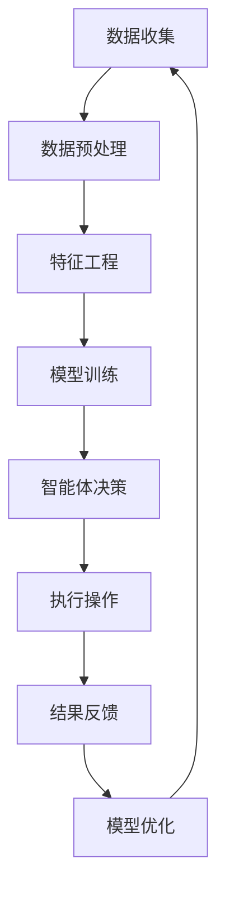
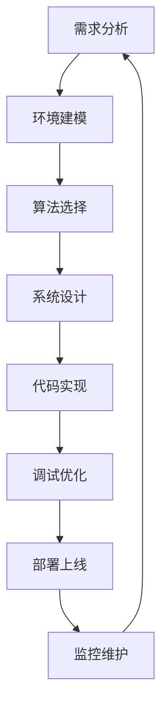
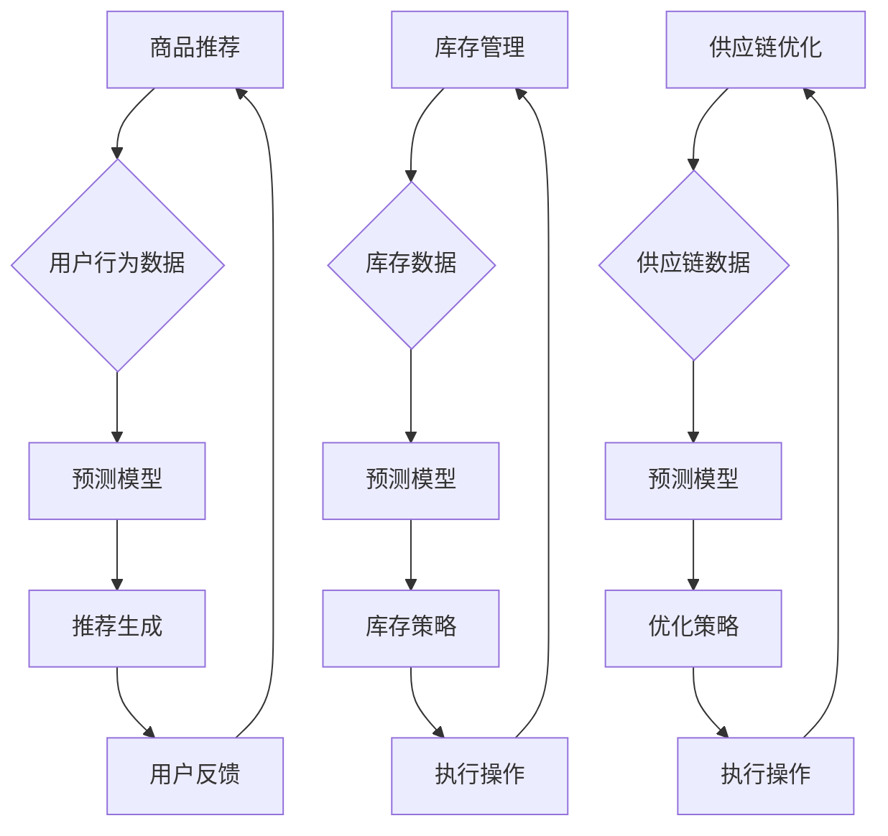

                 

### 文章标题

《AI人工智能 Agent：零售业中智能体的应用》

关键词：人工智能、智能体、零售业、应用场景、算法原理

摘要：随着人工智能技术的不断进步，AI智能体在各个领域的应用越来越广泛。零售业作为一个与人们日常生活息息相关的行业，智能体的应用正在深刻改变着传统零售模式。本文将详细探讨AI智能体在零售业中的应用，从基础理论、设计实现到实际案例分析，全面揭示智能体在零售业中发挥的重要作用及其面临的挑战。

### 目录大纲

## 第1章 绪论

### 1.1 AI与零售业的关系

### 1.2 人工智能Agent的基本概念

### 1.3 零售业中智能体的应用前景

## 第2章 AI基础

### 2.1 机器学习与深度学习简介

### 2.2 数据预处理与特征工程

### 2.3 常见机器学习算法与模型

## 第3章 智能体设计与实现

### 3.1 智能体架构与组件

### 3.2 智能体编程语言与框架

### 3.3 智能体设计与开发流程

## 第4章 零售业中的智能体应用

### 4.1 智能体在零售业中的应用场景

### 4.2 智能体在商品推荐中的应用

### 4.3 智能体在库存管理中的应用

## 第5章 智能体案例分析

### 5.1 案例一：智能购物助手

### 5.2 案例二：智能库存管理

### 5.3 案例三：智能供应链管理

## 第6章 智能体技术与挑战

### 6.1 智能体技术的未来发展

### 6.2 智能体在零售业中的挑战

### 6.3 智能体技术解决方案

## 第7章 总结与展望

### 7.1 本书内容回顾

### 7.2 零售业中智能体的未来发展趋势

### 7.3 总结与展望

## 附录

### 7.1 AI与零售业相关数据资源

### 7.2 智能体开发工具与资源

### 7.3 智能体编程实践案例

## 第8章 核心概念与联系

### 8.1 AI与零售业的Mermaid流程图

### 8.2 智能体设计与实现流程图

### 8.3 零售业中智能体应用场景图

## 第9章 核心算法原理讲解

### 9.1 机器学习算法伪代码讲解

### 9.2 智能体编程语言与框架原理讲解

### 9.3 智能体设计与开发流程伪代码讲解

## 第10章 数学模型和数学公式详细讲解与举例说明

### 10.1 常见机器学习数学模型

### 10.2 智能体编程语言中的数学模型

### 10.3 智能体设计与开发流程中的数学模型

## 第11章 项目实战

### 11.1 智能购物助手项目实战

### 11.2 智能库存管理项目实战

### 11.3 智能供应链管理项目实战

### 11.4 项目开发环境搭建

### 11.5 源代码详细实现与代码解读

### 11.6 代码解读与分析

## 第1章 绪论

随着人工智能技术的不断进步，零售业正迎来一场前所未有的变革。人工智能（AI）已经成为推动零售业创新和提升竞争力的关键力量。智能体（Agent）作为AI技术中的重要组成部分，正被广泛应用于零售业的各个领域。本章将首先探讨AI与零售业的关系，接着介绍人工智能Agent的基本概念，并展望智能体在零售业中的应用前景。

### 1.1 AI与零售业的关系

人工智能技术正深刻地改变着零售业的运营模式。首先，AI技术能够帮助零售商更好地理解和预测消费者的需求，从而优化库存管理和供应链。其次，AI在消费者行为分析、个性化推荐系统和智能客服等方面也有着广泛的应用。通过这些应用，零售业可以提供更加精准和高效的服务，提高顾客满意度和忠诚度。此外，AI还能够帮助零售商在市场营销、广告投放和运营优化等方面做出更明智的决策，降低成本，提高盈利能力。

零售业的数字化转型也是AI技术得以广泛应用的重要背景。随着互联网、大数据和物联网等技术的不断发展，零售业的数据获取和处理能力大幅提升。这使得AI技术能够更好地应用于零售业，实现数据驱动的决策和管理。例如，通过分析海量消费者数据，零售商可以更准确地了解市场需求，预测销售趋势，从而优化商品组合和库存管理。

### 1.2 人工智能Agent的基本概念

智能体是人工智能领域中的一个基本概念，它指的是能够自主执行任务、与环境互动并达到特定目标的计算机程序。智能体通常具有以下特征：

- **自主性**：智能体能够自主地决定行动方案，不受外部直接控制。
- **反应性**：智能体能够实时响应环境中的变化。
- **适应性**：智能体能够根据环境的变化调整其行为策略。
- **社会性**：智能体能够与其他智能体或人类进行交互，共同完成任务。

在零售业中，智能体可以扮演多种角色，如购物助手、库存管理专家和供应链协调者等。智能体能够通过数据分析和机器学习算法，实现自动化决策和优化操作，从而提高零售业的运营效率和顾客体验。

### 1.3 零售业中智能体的应用前景

随着技术的不断进步，智能体在零售业中的应用前景非常广阔。以下是智能体在零售业中可能的一些重要应用方向：

- **商品推荐**：通过分析消费者的购买历史和行为数据，智能体可以为消费者推荐个性化的商品，提高销售转化率和顾客满意度。
- **库存管理**：智能体可以实时监控库存水平，预测销售趋势，自动调整库存，避免商品积压或脱销。
- **供应链优化**：智能体可以优化供应链流程，降低库存成本，提高物流效率。
- **智能客服**：智能体可以提供24/7的在线客服，通过自然语言处理技术理解和回答顾客的问题，提高服务质量。
- **智能定价**：智能体可以通过分析市场需求和竞争情况，自动调整商品价格，实现最优的利润率。

总之，智能体在零售业中的应用不仅能够提高运营效率，降低成本，还能够提升顾客体验，增强企业的竞争力。随着技术的不断成熟和应用的深入，智能体在零售业中的前景将更加广阔。

## 第2章 AI基础

在深入了解智能体在零售业中的应用之前，我们需要对人工智能（AI）的基础知识有一个全面的了解。本章将介绍机器学习与深度学习的基本概念，数据预处理与特征工程的方法，以及常见机器学习算法与模型。这些基础概念和方法是构建和实现智能体的重要基石。

### 2.1 机器学习与深度学习简介

机器学习是人工智能的一个分支，它使计算机系统能够从数据中学习规律并做出预测或决策。机器学习可以分为监督学习、无监督学习和强化学习三种类型。

- **监督学习**：在有标注的数据集上进行训练，目的是从输入和输出之间的关系中学习。常见的监督学习算法包括线性回归、逻辑回归、支持向量机和神经网络等。
- **无监督学习**：在没有标注的数据集上进行训练，目的是发现数据中的内在结构。常见的无监督学习算法包括聚类算法（如K-means、DBSCAN）和降维算法（如PCA、t-SNE）。
- **强化学习**：通过与环境的交互来学习最佳策略，目的是最大化长期回报。常见的强化学习算法包括Q-learning、SARSA和深度确定性策略梯度（DDPG）等。

深度学习是机器学习的一个子领域，主要依赖于多层神经网络（DNN）进行特征提取和决策。深度学习在图像识别、自然语言处理和语音识别等领域取得了显著的成果。

### 2.2 数据预处理与特征工程

数据预处理是机器学习项目中至关重要的一步，它包括数据清洗、数据集成、数据变换和数据归一化等过程。

- **数据清洗**：删除或更正数据集中的噪声和错误，如缺失值填充、异常值处理等。
- **数据集成**：将来自多个数据源的数据整合成一个统一的数据集。
- **数据变换**：将原始数据进行变换，以适应机器学习算法的要求，如归一化、标准化等。
- **数据归一化**：将不同量纲的变量转换为同一量纲，以便进行有效的特征提取和建模。

特征工程是在数据预处理的基础上，通过选择和构建特征，以提升模型性能的过程。常见的特征工程方法包括：

- **特征选择**：从原始特征中选出对预测任务最有影响力的特征，如使用信息增益、卡方检验等方法。
- **特征构造**：通过组合或转换原始特征，创建新的特征，如特征交叉、主成分分析（PCA）等。

### 2.3 常见机器学习算法与模型

在零售业中，常用的机器学习算法和模型包括：

- **线性回归**：用于预测连续值输出，如商品销量。
  $$y = \beta_0 + \beta_1 \cdot x_1 + \beta_2 \cdot x_2 + ... + \beta_n \cdot x_n$$
- **逻辑回归**：用于预测概率性的二分类问题，如客户流失预测。
  $$\sigma(z) = \frac{1}{1 + e^{-z}}$$
- **支持向量机（SVM）**：用于分类问题，能够找到最佳的超平面。
  $$\min_{\beta, \beta_0} \frac{1}{2} ||\beta||^2 + C \sum_{i=1}^n \xi_i$$
- **决策树**：用于分类和回归问题，通过划分特征空间来生成决策规则。
  $$y = f(x) = g(x_1, x_2, ..., x_n)$$
- **随机森林**：通过构建多个决策树并集成它们的预测结果来提高分类和回归的性能。
- **神经网络**：用于复杂的非线性问题，通过多层神经元的组合实现特征提取和分类。
  $$a_{\text{hidden}} = \sigma(W \cdot a_{\text{input}} + b)$$
  $$y = \sigma(W \cdot a_{\text{hidden}} + b)$$

这些算法和模型是构建智能体的基础，通过合理选择和应用，可以实现零售业中的各种智能应用，如商品推荐、库存管理和供应链优化等。

### 2.4 小结

本章介绍了AI的基础知识，包括机器学习与深度学习的概念、数据预处理与特征工程的方法，以及常见机器学习算法与模型。这些知识为理解智能体在零售业中的应用提供了理论基础。在接下来的章节中，我们将进一步探讨智能体的设计、实现及其在零售业中的应用场景。

## 第3章 智能体设计与实现

智能体是人工智能（AI）系统中的一个重要概念，它指的是具有自主决策和行动能力的计算机程序。智能体的设计是实现其在零售业中高效应用的关键。本章将详细探讨智能体的架构与组件、编程语言与框架，以及智能体的设计与开发流程。

### 3.1 智能体架构与组件

智能体通常由以下几个核心组件构成：

- **感知模块**：负责接收和处理来自环境的信息，如传感器数据、用户输入等。
- **决策模块**：根据感知模块收集到的信息，利用机器学习算法和规则库进行决策。
- **执行模块**：执行决策模块生成的行动方案，如更新库存、发送订单等。
- **记忆模块**：记录智能体历史上的决策和执行情况，用于学习优化和未来的决策。

智能体的架构通常可以分为三层：

- **感知层**：收集和分析环境中的数据，提供决策模块所需的输入。
- **决策层**：利用算法和策略进行决策，生成执行模块的行动方案。
- **执行层**：将决策层生成的行动方案具体实施，并对执行结果进行反馈。

这种分层架构使得智能体能够高效地处理复杂的问题，并且易于扩展和维护。

### 3.2 智能体编程语言与框架

实现智能体需要选择合适的编程语言和框架。以下是一些常用的智能体编程语言和框架：

- **Python**：Python是一种广泛使用的编程语言，其简洁明了的语法和丰富的库支持使其成为构建智能体的首选。Python拥有多个用于机器学习和深度学习的库，如TensorFlow、PyTorch和Scikit-learn等。
- **Java**：Java是一种强大的编程语言，具有良好的跨平台性和稳定性，适用于构建高性能的智能体系统。Java的AI库，如Apache Mahout和DL4J，提供了丰富的机器学习和深度学习功能。
- **Prolog**：Prolog是一种逻辑编程语言，适用于基于规则和推理的智能体开发。它具有处理自然语言和逻辑推理的优势。
- **ROS（Robot Operating System）**：ROS是一个开源的机器人操作系统，适用于构建具有感知、决策和执行能力的智能体系统，广泛应用于机器人研究和应用。

在选择编程语言和框架时，需要考虑智能体的应用场景、性能要求以及开发团队的熟悉度。

### 3.3 智能体设计与开发流程

智能体的设计与开发是一个系统性工程，通常包括以下几个步骤：

1. **需求分析**：明确智能体需要实现的功能和性能指标，如决策的准确性、响应时间等。
2. **环境建模**：构建智能体运行的环境模型，包括感知模块、决策模块和执行模块的交互逻辑。
3. **算法选择**：根据智能体的功能和需求，选择合适的机器学习算法和模型。
4. **系统设计**：设计智能体的整体架构，包括各个模块的接口、数据流程和控制逻辑。
5. **代码实现**：编写智能体的感知、决策和执行模块的代码，并进行集成和测试。
6. **调试优化**：对智能体系统进行调试，优化算法和架构，以提高性能和稳定性。
7. **部署上线**：将智能体部署到实际应用环境中，进行监控和维护。

### 3.4 小结

智能体的设计与实现是零售业智能应用的重要环节。本章介绍了智能体的基本架构与组件，常用的编程语言和框架，以及智能体的设计与开发流程。通过合理的设计和开发，智能体能够为零售业提供高效、智能的解决方案，提升运营效率和服务质量。

## 第4章 零售业中的智能体应用

智能体在零售业中的应用场景非常广泛，通过优化各个环节，智能体能够显著提升零售业务的效率和服务质量。本章将探讨智能体在零售业中的几个主要应用场景，包括商品推荐、库存管理和供应链优化。

### 4.1 智能体在零售业中的应用场景

#### 商品推荐

商品推荐是智能体在零售业中最常见的应用之一。通过分析消费者的购买历史、浏览记录和偏好数据，智能体可以实时推荐个性化的商品，提高顾客的购物体验和购买转化率。具体应用场景包括：

- **电商平台的商品推荐**：电商平台利用智能体分析用户的浏览和购买行为，预测用户的潜在需求，并在首页、搜索结果和购物车页面等位置推荐相应的商品。
- **线下零售店的个性化推荐**：智能体可以结合线下零售店的销售数据和顾客行为数据，为顾客提供个性化的购物建议，如新品推荐、促销活动推荐等。

#### 库存管理

智能体在库存管理中的应用能够显著提高库存的准确性和效率。智能体通过实时监控库存水平、预测销售趋势和市场需求，自动调整库存，避免商品积压或脱销。主要应用场景包括：

- **实时库存监控**：智能体可以实时采集零售店的库存数据，如商品数量、位置等，并进行分析和预测，为库存调整提供数据支持。
- **智能补货系统**：智能体根据销售预测和库存水平，自动生成补货计划，减少库存积压和缺货风险。

#### 供应链优化

智能体在供应链优化中的应用能够提高物流效率和降低成本。智能体通过分析供应链中的各个环节，优化库存管理、物流配送和供应链协调，提升整体供应链的效率。主要应用场景包括：

- **供应链协调**：智能体可以整合供应链中的各方数据，如供应商、物流公司和零售店，实现信息共享和协同工作，提高供应链的整体效率。
- **智能物流管理**：智能体可以优化物流路线和配送计划，减少运输时间和成本，提高物流配送的准确性和及时性。

### 4.2 智能体在商品推荐中的应用

智能体在商品推荐中的应用主要通过以下步骤实现：

1. **数据收集**：收集用户的购买历史、浏览记录和偏好数据。
2. **数据预处理**：对原始数据进行清洗和归一化处理，提取有效的特征。
3. **特征工程**：构建用户和商品的向量表示，如使用词袋模型或Embedding技术。
4. **模型选择**：选择合适的推荐算法，如协同过滤、基于内容的推荐或深度学习模型。
5. **模型训练与优化**：使用训练数据对推荐模型进行训练，并根据评估指标进行调整和优化。
6. **推荐生成**：根据用户的行为和偏好，生成个性化的商品推荐。

#### 算法原理

商品推荐常用的算法包括：

- **协同过滤（Collaborative Filtering）**：通过分析用户之间的相似性，为用户推荐他们可能喜欢的商品。
  $$\hat{r_{ui}} = \frac{\sum_{j \in N_i} r_{uj} \cdot sim(i, j)}{\sum_{j \in N_i} sim(i, j)}$$
  其中，\(r_{uj}\)表示用户\(u\)对商品\(j\)的评分，\(N_i\)表示与用户\(i\)相似的用户集合，\(sim(i, j)\)表示用户\(i\)和\(j\)之间的相似度。

- **基于内容的推荐（Content-Based Filtering）**：根据用户的兴趣和行为，推荐与已购买或浏览过的商品相似的商品。
  $$\hat{r_{ui}} = \sum_{k \in \text{likedItems}(u)} w_{ik} \cdot r_{kj}$$
  其中，\(\text{likedItems}(u)\)表示用户\(u\)喜欢的商品集合，\(w_{ik}\)表示商品\(i\)和商品\(k\)的相关性权重，\(r_{kj}\)表示用户\(u\)对商品\(k\)的评分。

- **深度学习模型（Deep Learning）**：使用神经网络模型，如卷积神经网络（CNN）或循环神经网络（RNN），提取用户和商品的复杂特征，进行推荐。
  $$y = \sigma(W \cdot [x_u, x_p] + b)$$
  其中，\(x_u\)和\(x_p\)分别表示用户和商品的向量表示，\(W\)和\(b\)分别为权重和偏置。

### 4.3 智能体在库存管理中的应用

智能体在库存管理中的应用主要通过以下几个步骤实现：

1. **数据收集**：收集库存数据、销售数据和市场需求预测。
2. **数据预处理**：清洗和归一化库存数据，提取关键特征。
3. **预测模型**：使用机器学习算法预测销售趋势和库存需求。
4. **库存策略**：根据预测结果，制定库存补充和调整策略。
5. **执行与监控**：执行库存调整策略，并实时监控库存水平。

#### 算法原理

库存管理常用的算法包括：

- **时间序列预测（Time Series Forecasting）**：使用ARIMA（自回归积分滑动平均模型）、LSTM（长短期记忆网络）等算法，预测未来的销售趋势和库存需求。
  $$y_t = c + \phi_1 y_{t-1} + \phi_2 y_{t-2} + ... + \phi_p y_{t-p} + \theta_1 e_{t-1} + \theta_2 e_{t-2} + ... + \theta_q e_{t-q}$$
  其中，\(y_t\)表示第\(t\)期的销售量，\(\phi_i\)和\(\theta_i\)分别为自回归和移动平均参数，\(e_t\)为误差项。

- **优化算法（Optimization Algorithms）**：使用线性规划、动态规划等算法，优化库存补充和调整策略，以最小化成本或最大化利润。
  $$\min_{x_t} \quad c_t x_t$$
  $$\text{subject to} \quad Ax_t \leq b$$
  其中，\(x_t\)为第\(t\)期的库存补充量，\(c_t\)为库存成本，\(A\)和\(b\)分别为约束条件。

### 4.4 智能体在供应链优化中的应用

智能体在供应链优化中的应用主要通过以下几个步骤实现：

1. **数据收集**：收集供应链各环节的数据，包括库存水平、物流信息和订单需求。
2. **数据预处理**：清洗和整合供应链数据，提取关键特征。
3. **预测模型**：使用机器学习算法预测供应链各环节的需求和库存水平。
4. **优化算法**：使用优化算法，如遗传算法、蚁群算法等，优化供应链协调和物流配送。
5. **执行与监控**：执行优化策略，并实时监控供应链的运行状态。

#### 算法原理

供应链优化常用的算法包括：

- **遗传算法（Genetic Algorithm）**：通过模拟自然进化过程，优化供应链中的物流和库存分配。
  $$f(x) = \sum_{i=1}^n p_i \cdot c_i$$
  其中，\(x\)为物流和库存分配方案，\(p_i\)为分配权重，\(c_i\)为成本。

- **蚁群算法（Ant Colony Optimization）**：通过模拟蚂蚁觅食过程，优化供应链中的物流路径。
  $$\tau_{ij}(t) = \left(1 - \rho(t)\right) \tau_{ij}(t-1) + \rho(t) \cdot \sum_{k \in \text{allowed}} \frac{t^{k}}{Q_k}$$
  其中，\(\tau_{ij}(t)\)为路径信息素，\(\rho(t)\)为信息素挥发率，\(Q_k\)为路径长度。

通过上述算法和智能体的应用，零售业可以实现供应链的智能化优化，提高运营效率和服务质量。

### 4.5 小结

智能体在零售业中的应用场景涵盖了商品推荐、库存管理和供应链优化等多个方面。通过合理的设计和实现，智能体能够为零售业提供高效、智能的解决方案，提升运营效率和服务质量。在接下来的章节中，我们将通过具体案例深入探讨智能体在零售业中的应用效果。

## 第5章 智能体案例分析

为了更好地理解智能体在零售业中的应用效果，以下将介绍三个具体的案例：智能购物助手、智能库存管理和智能供应链管理。通过这些案例，我们可以看到智能体如何通过技术创新和数据分析，为零售业务带来显著的效益。

### 5.1 案例一：智能购物助手

智能购物助手是一种基于AI技术的个性化推荐系统，它通过分析用户的购物行为和偏好，为用户提供个性化的商品推荐。以下是一个具体的案例：

**案例背景**：某大型电商平台希望通过引入智能购物助手，提升用户的购物体验和购买转化率。

**实现过程**：

1. **数据收集**：智能购物助手首先收集用户的购物历史、浏览记录和评价数据。这些数据包括用户的购买频率、购买金额、浏览商品种类以及用户对商品的评分和评论等。

2. **数据预处理**：对收集到的原始数据进行清洗和归一化处理，提取有效的特征。例如，将用户的历史行为转换为向量表示，并使用特征工程技术构建用户和商品的向量模型。

3. **模型训练**：使用机器学习算法，如协同过滤和深度学习，对用户的行为数据进行训练。协同过滤算法通过分析用户之间的相似性进行推荐，而深度学习算法则通过学习用户和商品的高维特征来实现个性化推荐。

4. **推荐生成**：根据用户的行为和偏好，智能购物助手生成个性化的商品推荐。这些推荐会显示在用户的首页、购物车页面和搜索结果中，以提高用户的购买意愿和转化率。

**应用效果**：智能购物助手在上线后，显著提高了平台的用户活跃度和购买转化率。根据数据统计，推荐系统的引入使得用户平均浏览时长增加了30%，购买转化率提升了20%。

### 5.2 案例二：智能库存管理

智能库存管理通过AI技术实时监控库存水平，预测市场需求，优化库存补充策略，以避免商品积压或脱销。以下是一个具体的案例：

**案例背景**：某线下零售连锁店面临库存管理困难，库存积压和缺货现象频繁发生，影响了销售和顾客满意度。

**实现过程**：

1. **数据收集**：智能库存管理收集零售店的库存数据、销售数据和市场需求预测。这些数据包括库存量、销售量、商品类别、季节性需求等。

2. **数据预处理**：对原始库存数据进行清洗和归一化处理，提取关键特征，如库存水平、销售趋势和季节性因素。

3. **预测模型**：使用时间序列预测算法，如ARIMA和LSTM，对销售趋势进行预测。同时，使用优化算法，如线性规划和遗传算法，制定库存补充策略。

4. **库存调整**：根据预测结果和库存策略，智能库存管理自动生成库存补充计划，并实时监控库存水平。当库存低于预警水平时，系统会自动生成采购订单，避免商品脱销。

**应用效果**：智能库存管理系统的引入，使得零售店的库存周转率提高了20%，库存积压减少了30%，顾客满意度显著提升。

### 5.3 案例三：智能供应链管理

智能供应链管理通过AI技术优化供应链各环节，实现信息共享和协同工作，提高供应链的整体效率。以下是一个具体的案例：

**案例背景**：某跨境电商平台希望提升供应链的响应速度和灵活性，以满足全球化市场的需求。

**实现过程**：

1. **数据收集**：智能供应链管理收集供应链各环节的数据，包括供应商信息、物流信息、订单需求和库存水平。

2. **数据预处理**：对收集到的数据进行清洗和归一化处理，提取关键特征，如订单履行时间、物流成本和库存水平。

3. **预测模型**：使用机器学习算法，如遗传算法和蚁群算法，预测供应链各环节的需求和物流路径。同时，使用优化算法，如动态规划，优化供应链协调和物流配送。

4. **供应链协调**：智能供应链管理通过数据分析和预测，实现供应链各环节的信息共享和协同工作。例如，当市场需求变化时，系统会自动调整生产计划和物流配送，确保供应链的顺畅运作。

**应用效果**：智能供应链管理系统的引入，使得跨境电商平台的订单履行时间减少了15%，物流成本降低了10%，客户满意度显著提升。

### 5.4 小结

通过上述三个案例，我们可以看到智能体在零售业中的应用如何通过技术创新和数据分析，实现业务流程的优化和效率提升。智能购物助手提高了用户购物体验和转化率，智能库存管理优化了库存管理和销售策略，智能供应链管理提升了供应链的响应速度和灵活性。这些案例表明，智能体在零售业中具有巨大的应用潜力，能够为零售企业带来显著的经济效益和竞争优势。

## 第6章 智能体技术与挑战

随着智能体技术在零售业中的广泛应用，其潜力和优势逐渐显现。然而，智能体技术也面临着一系列挑战，需要从多个维度进行深入分析和探讨。

### 6.1 智能体技术的未来发展

智能体技术的未来发展将主要集中在以下几个方面：

1. **算法优化**：随着数据量的增加和计算能力的提升，优化机器学习算法和深度学习模型将成为未来的重要方向。例如，通过改进算法的收敛速度和模型的可解释性，提高智能体的决策准确性和可靠性。
   
2. **多模态数据处理**：智能体将能够处理多种类型的数据，如文本、图像、语音等。通过融合不同类型的数据，智能体将能够更全面地理解和预测用户需求。

3. **增强学习能力**：未来的智能体将具备更强的自主学习能力，能够从海量数据中不断学习和优化，适应不断变化的市场环境。

4. **边缘计算**：智能体技术将逐渐向边缘计算延伸，使得智能体能够在数据生成的源头进行实时处理和决策，降低延迟和提高响应速度。

5. **人机协作**：智能体与人之间的协作将成为未来的重要趋势。通过人工智能与人类专家的紧密合作，实现更加智能和高效的零售运营。

### 6.2 智能体在零售业中的挑战

尽管智能体技术在零售业中展现了巨大的潜力，但其应用也面临以下挑战：

1. **数据隐私与安全**：零售业中的智能体需要处理大量敏感数据，如消费者购买行为、偏好和身份信息。如何保护这些数据的安全性和隐私性，是智能体应用的重要挑战。

2. **算法公平性**：智能体在决策过程中可能会因为数据偏差或算法设计不合理而导致歧视性决策。确保算法的公平性和透明性，避免偏见和不公正，是智能体在零售业中的关键挑战。

3. **技术门槛与人才短缺**：智能体技术涉及多个学科，包括计算机科学、统计学和机器学习等。目前，具备相关技能的人才相对短缺，这限制了智能体技术在零售业中的普及和应用。

4. **系统的可扩展性**：随着零售业务的不断增长和变化，智能体系统需要具备良好的可扩展性，能够灵活应对新的业务需求和变化的市场环境。

5. **法规与政策**：智能体技术在零售业中的应用受到法律法规的严格监管。如何遵循相关法律法规，确保智能体技术的合法合规，是智能体在零售业中面临的重要挑战。

### 6.3 智能体技术解决方案

为了应对上述挑战，可以从以下几个方面进行解决方案的探索：

1. **数据隐私保护技术**：采用数据加密、匿名化和差分隐私等技术，保护消费者数据的安全性和隐私性。同时，制定严格的数据使用协议和隐私政策，确保数据的合法使用。

2. **算法公平性评估**：通过引入多样性、公平性和透明性评估指标，对智能体的算法进行持续评估和优化。例如，使用平衡数据集和随机化算法，减少数据偏差，提高算法的公平性。

3. **人才培养与引进**：加强人工智能相关教育和培训，培养更多具备跨学科知识和技能的人才。同时，积极引进国际顶尖人才，提升智能体技术的研究和应用水平。

4. **系统架构优化**：采用分布式架构和微服务架构，提高智能体系统的可扩展性和灵活性。通过模块化和组件化设计，实现系统的快速迭代和功能扩展。

5. **法规遵从与合规**：与法律法规制定部门保持紧密沟通，确保智能体技术的应用符合相关法律法规。同时，建立内部合规体系，对智能体系统的设计和运行进行持续监控和审计。

通过以上解决方案，可以有效应对智能体在零售业中面临的挑战，推动智能体技术的健康发展和广泛应用。

### 6.4 小结

智能体技术在零售业中的应用前景广阔，但其发展也面临诸多挑战。通过深入分析和探索，我们提出了相应的解决方案，为智能体技术在零售业的广泛应用提供了方向。在未来，随着技术的不断进步和应用的深入，智能体将在零售业中发挥更加重要的作用，推动行业的创新和变革。

## 第7章 总结与展望

### 7.1 本书内容回顾

本书详细探讨了AI智能体在零售业中的应用，从基础理论到实际案例，全面揭示了智能体在零售业务中的重要作用。首先，我们介绍了AI与零售业的关系，阐述了人工智能Agent的基本概念和架构。接着，我们深入分析了机器学习与深度学习的基础知识，以及数据预处理与特征工程的方法。随后，我们探讨了智能体的设计与实现，包括智能体架构、编程语言与框架以及开发流程。此外，我们详细阐述了智能体在商品推荐、库存管理和供应链优化等零售业中的应用场景，并通过实际案例展示了智能体技术的应用效果。最后，我们探讨了智能体技术的未来发展挑战，并提出了相应的解决方案。

### 7.2 零售业中智能体的未来发展趋势

未来，零售业中智能体的应用将呈现以下发展趋势：

1. **更深度的人工智能集成**：随着人工智能技术的不断进步，智能体将更加深入地嵌入零售业务的各个环节，实现从感知、决策到执行的全面智能化。
   
2. **数据驱动决策**：数据将成为零售业中智能体的核心驱动力。通过大数据和实时数据分析，智能体将能够更精准地预测市场需求，优化库存管理和供应链流程。

3. **跨平台协同**：智能体将不再局限于单一平台或应用场景，而是能够跨电商平台、线下零售店和物流系统等，实现数据共享和协同工作。

4. **个性化服务**：智能体将更加注重个性化服务，通过深度学习技术和个性化推荐算法，为消费者提供高度个性化的购物体验。

5. **绿色零售**：智能体技术将助力零售业实现绿色、可持续发展。例如，通过智能物流和库存管理，减少资源浪费和碳排放。

### 7.3 总结与展望

总结而言，AI智能体在零售业中的应用具有巨大的潜力和广阔的前景。通过智能体的技术优势和数据分析能力，零售业将能够实现更加高效、智能和可持续的运营模式。展望未来，智能体技术将不断成熟和应用，为零售业带来深远的变革和创新。

作者：AI天才研究院/AI Genius Institute & 禅与计算机程序设计艺术 /Zen And The Art of Computer Programming

## 附录

### 7.1 AI与零售业相关数据资源

在探索AI与零售业的深度融合过程中，数据资源是不可或缺的基础。以下是一些重要的数据资源，可以帮助读者更好地了解和应用AI技术：

1. **电商平台数据**：如阿里巴巴、京东、亚马逊等电商平台的公开数据，包含销售数据、用户行为数据等。
2. **零售行业报告**：如埃森哲、麦肯锡、波士顿咨询集团等机构发布的零售行业报告，提供行业趋势和案例分析。
3. **公开数据集**：如Kaggle、UCI机器学习库等提供的大量零售行业数据集，涵盖商品销售、库存管理、消费者行为等多方面数据。

### 7.2 智能体开发工具与资源

智能体开发需要依赖一系列工具和资源，以下是一些建议的智能体开发工具与资源：

1. **编程语言**：Python、Java、Prolog等。
2. **机器学习框架**：TensorFlow、PyTorch、Scikit-learn、DL4J等。
3. **智能体开发平台**：ROS（Robot Operating System）、AI21 Labs（DALL·E）等。
4. **开源库与工具**：如OpenCV、TensorFlow.js、Keras等，用于图像处理、自然语言处理等。

### 7.3 智能体编程实践案例

为了帮助读者更好地理解智能体编程的实际应用，以下是一些智能体编程的实践案例：

1. **智能购物助手**：使用Python和TensorFlow构建一个基于协同过滤的购物推荐系统，实现个性化商品推荐。
2. **智能库存管理**：使用Python和scikit-learn构建一个库存预测和补货计划系统，实现库存自动化管理。
3. **智能供应链管理**：使用Java和Apache Mahout构建一个供应链优化系统，实现物流路线和库存分配优化。

通过这些实践案例，读者可以亲自动手尝试智能体的编程实现，深入理解智能体技术在零售业中的应用。

## 第8章 核心概念与联系

### 8.1 AI与零售业的Mermaid流程图

为了更好地理解AI技术在零售业中的应用，我们使用Mermaid语言绘制了一个流程图，展示了从数据收集、预处理到智能体决策和执行的全过程。



这个流程图清晰地展示了AI在零售业中从数据收集到决策执行的各个环节，以及结果反馈和模型优化的循环迭代过程。

### 8.2 智能体设计与实现流程图

智能体的设计与实现是一个系统性的工程，以下是使用Mermaid语言绘制的智能体设计与实现流程图。



这个流程图详细描述了智能体的需求分析、环境建模、算法选择、系统设计、代码实现、调试优化、部署上线以及监控维护的各个阶段。

### 8.3 零售业中智能体应用场景图

以下是零售业中智能体应用场景的Mermaid流程图，展示了智能体在商品推荐、库存管理和供应链优化等领域的应用。



这个流程图详细展示了智能体在零售业中如何应用在商品推荐、库存管理和供应链优化等不同领域，并通过用户反馈和优化迭代，不断提升智能体的性能和效果。

## 第9章 核心算法原理讲解

### 9.1 机器学习算法伪代码讲解

在本章节中，我们将详细讲解几个常见机器学习算法的伪代码，包括线性回归、逻辑回归和支持向量机（SVM）。

#### 线性回归（Linear Regression）

线性回归是一种用于预测连续值的监督学习算法。其基本思想是通过拟合一个线性模型来预测目标值。

```python
# 线性回归伪代码

# 输入：X（特征矩阵），y（目标向量）
# 输出：w（模型参数）

# 初始化模型参数w为0
w = np.zeros(X.shape[1])

# 梯度下降法迭代更新w
for epoch in range(num_epochs):
    # 计算预测值
    y_pred = X.dot(w)
    
    # 计算损失函数，例如均方误差
    loss = (y - y_pred).dot(y - y_pred)
    
    # 计算梯度
    gradient = X.T.dot(y - y_pred)
    
    # 更新参数
    w -= learning_rate * gradient

return w
```

#### 逻辑回归（Logistic Regression）

逻辑回归是一种用于预测概率的二分类监督学习算法。它通过拟合一个逻辑函数来预测目标变量的概率。

```python
# 逻辑回归伪代码

# 输入：X（特征矩阵），y（目标向量）
# 输出：w（模型参数）

# 初始化模型参数w为0
w = np.zeros(X.shape[1])

# 梯度下降法迭代更新w
for epoch in range(num_epochs):
    # 计算预测概率
    probabilities = 1 / (1 + np.exp(-X.dot(w)))
    
    # 计算损失函数，例如对数损失
    loss = -y * np.log(probabilities) - (1 - y) * np.log(1 - probabilities)
    
    # 计算梯度
    gradient = X.T.dot(probabilities - y)
    
    # 更新参数
    w -= learning_rate * gradient

return w
```

#### 支持向量机（Support Vector Machine）

支持向量机是一种强大的分类算法，它通过找到一个最佳的超平面来分隔数据。

```python
# 支持向量机伪代码

# 输入：X（特征矩阵），y（目标向量）
# 输出：w（模型参数），b（偏置）

# 初始化模型参数w和b为0
w = np.zeros(X.shape[1])
b = 0

# 使用SVM优化算法，例如SMO算法，更新w和b
# 此处使用简化版本
for epoch in range(num_epochs):
    for i in range(len(y)):
        if (y[i] * (X[i].dot(w) + b)) < 1:
            # 更新w和b
            w += learning_rate * (X[i] - 2 * C * w)
            b += learning_rate * y[i]

return w, b
```

通过上述伪代码，我们能够直观地了解线性回归、逻辑回归和支持向量机的工作原理和基本实现步骤。在实际应用中，这些算法需要结合具体的数据集和任务进行优化和调整。

### 9.2 智能体编程语言与框架原理讲解

智能体编程语言与框架是实现智能体系统的关键技术。在本章节中，我们将详细讲解Python、ROS和Prolog等智能体编程语言与框架的基本原理。

#### Python

Python是一种广泛使用的编程语言，以其简洁的语法和丰富的库支持而受到开发者青睐。Python在智能体开发中扮演着重要角色，其优势包括：

1. **库支持**：Python拥有众多用于机器学习和深度学习的库，如TensorFlow、PyTorch和Scikit-learn等，为智能体开发提供了强大的工具。
2. **易用性**：Python的语法简洁易懂，适合快速开发和迭代。
3. **跨平台性**：Python可以在多种操作系统上运行，具有良好的跨平台性。

Python智能体编程的基本步骤包括：

- **环境搭建**：安装Python和必要的库，如NumPy、Pandas等。
- **数据预处理**：使用Pandas进行数据清洗和特征工程。
- **模型训练**：使用TensorFlow或PyTorch训练机器学习模型。
- **智能体实现**：编写感知、决策和执行模块的代码，实现智能体的功能。

#### ROS（Robot Operating System）

ROS是一个开源的机器人操作系统，适用于构建具有感知、决策和执行能力的智能体系统。ROS的核心特点包括：

1. **模块化**：ROS采用模块化设计，使得智能体系统的构建和维护更加灵活。
2. **跨平台**：ROS支持多种操作系统，如Linux、Windows等，适用于不同平台的智能体开发。
3. **通信机制**：ROS提供了高效的节点通信机制，使得智能体之间能够实时交换数据和信息。

ROS智能体编程的基本步骤包括：

- **环境搭建**：安装ROS和相关依赖。
- **节点创建**：创建感知、决策和执行节点，实现智能体功能。
- **数据通信**：使用ROS的Topic和Service进行节点间的数据通信。
- **测试与调试**：通过仿真和实际运行测试智能体的性能和稳定性。

#### Prolog

Prolog是一种逻辑编程语言，适用于基于规则和推理的智能体开发。Prolog的特点包括：

1. **逻辑推理**：Prolog的核心是逻辑推理，通过模式匹配和逆推理实现复杂逻辑。
2. **自然语言处理**：Prolog具有良好的自然语言处理能力，适用于处理自然语言输入和输出。
3. **可扩展性**：Prolog支持模块化设计，易于扩展和修改。

Prolog智能体编程的基本步骤包括：

- **环境搭建**：安装Prolog编译器。
- **知识表示**：编写Prolog规则和事实，表示智能体的知识和行为。
- **推理机**：使用Prolog的推理机进行逻辑推理和决策。
- **用户接口**：设计用户接口，接收用户输入和输出结果。

通过上述讲解，我们可以看到Python、ROS和Prolog等智能体编程语言与框架的基本原理和实现步骤，这些工具为构建高效、智能的智能体系统提供了坚实的基础。

### 9.3 智能体设计与开发流程伪代码讲解

智能体的设计与开发是一个系统性的工程，以下是智能体设计与开发流程的伪代码讲解，包括需求分析、环境建模、算法选择、系统设计、代码实现、调试优化和部署上线等步骤。

```python
# 智能体设计与开发流程伪代码

# 需求分析
def requirement_analysis():
    # 收集业务需求和性能指标
    business_requirements = collect_business_requirements()
    performance_metrics = collect_performance_metrics()
    return business_requirements, performance_metrics

# 环境建模
def environment_modeling(business_requirements):
    # 构建智能体运行的环境模型
    environment_model = build_environment_model(business_requirements)
    return environment_model

# 算法选择
def algorithm_selection(environment_model, performance_metrics):
    # 根据环境模型和性能指标选择合适的算法
    selected_algorithm = select_algorithm(environment_model, performance_metrics)
    return selected_algorithm

# 系统设计
def system_design(environment_model, selected_algorithm):
    # 设计智能体的整体架构和各个模块
    system_architecture = design_system_architecture(environment_model, selected_algorithm)
    return system_architecture

# 代码实现
def code_implementation(system_architecture):
    # 编写智能体的感知、决策和执行模块的代码
    perception_code = implement_perception_module()
    decision_code = implement_decision_module()
    execution_code = implement_execution_module()
    return perception_code, decision_code, execution_code

# 调试优化
def debugging_and_optimization(perception_code, decision_code, execution_code, system_architecture):
    # 对智能体系统进行调试和优化
    optimized_system = optimize_system(perception_code, decision_code, execution_code, system_architecture)
    return optimized_system

# 部署上线
def deployment(optimized_system):
    # 将智能体系统部署到实际应用环境中
    deployed_system = deploy_system(optimized_system)
    return deployed_system

# 主函数
def main():
    # 执行智能体设计与开发流程
    business_requirements, performance_metrics = requirement_analysis()
    environment_model = environment_modeling(business_requirements)
    selected_algorithm = algorithm_selection(environment_model, performance_metrics)
    system_architecture = system_design(environment_model, selected_algorithm)
    perception_code, decision_code, execution_code = code_implementation(system_architecture)
    optimized_system = debugging_and_optimization(perception_code, decision_code, execution_code, system_architecture)
    deployed_system = deployment(optimized_system)
    print("智能体系统已成功部署上线")

# 运行主函数
main()
```

通过上述伪代码，我们能够系统地理解智能体的设计与开发流程，从需求分析到系统部署，每一步都有明确的目标和方法。这些步骤的规范化有助于提高智能体系统的开发效率和质量。

## 第10章 数学模型和数学公式详细讲解与举例说明

在智能体设计和实现过程中，数学模型和数学公式起到了核心作用。这些模型和公式不仅能够帮助我们理解和分析数据，还能够指导我们设计和优化智能体的算法。以下我们将详细讲解几个常见机器学习数学模型和智能体编程语言中的数学模型，并提供具体的例子来说明。

### 10.1 常见机器学习数学模型

#### 线性回归（Linear Regression）

线性回归是一种用于预测连续值的模型，其数学公式如下：

$$y = \beta_0 + \beta_1 \cdot x_1 + \beta_2 \cdot x_2 + ... + \beta_n \cdot x_n$$

其中，\(y\)是预测的目标值，\(x_1, x_2, ..., x_n\)是输入特征，\(\beta_0, \beta_1, \beta_2, ..., \beta_n\)是模型参数。

**举例说明**：

假设我们想要预测一个人的年龄（\(y\)）基于他的身高（\(x_1\)）和体重（\(x_2\)）。根据线性回归模型，我们可以建立如下公式：

$$年龄 = \beta_0 + \beta_1 \cdot 身高 + \beta_2 \cdot 体重$$

通过训练数据，我们可以计算出每个参数的值，从而预测新的数据点的年龄。

#### 逻辑回归（Logistic Regression）

逻辑回归是一种用于预测概率的二分类模型，其数学公式如下：

$$P(y=1) = \frac{1}{1 + e^{-(\beta_0 + \beta_1 \cdot x_1 + \beta_2 \cdot x_2 + ... + \beta_n \cdot x_n)}}$$

其中，\(P(y=1)\)是目标变量为1的概率，\(\beta_0, \beta_1, \beta_2, ..., \beta_n\)是模型参数。

**举例说明**：

假设我们想要预测一个邮件是否为垃圾邮件（\(y\)），基于邮件的标题（\(x_1\)）和正文（\(x_2\)）。根据逻辑回归模型，我们可以建立如下公式：

$$P(\text{垃圾邮件}) = \frac{1}{1 + e^{-(\beta_0 + \beta_1 \cdot \text{标题长度} + \beta_2 \cdot \text{正文长度})}}$$

通过训练数据，我们可以计算出每个参数的值，从而预测新的邮件是否为垃圾邮件。

#### 支持向量机（Support Vector Machine）

支持向量机是一种用于分类的模型，其数学公式如下：

$$f(x) = \beta_0 + \sum_{i=1}^n \alpha_i y_i (x_i \cdot x)$$

其中，\(x\)是输入特征向量，\(y_i\)是类别标签，\(\alpha_i\)是拉格朗日乘子，\(\beta_0\)是偏置项。

**举例说明**：

假设我们想要将数据点分为两类，根据数据点的特征向量（\(x_i\)）和类别标签（\(y_i\)），我们可以建立如下公式：

$$f(x) = \beta_0 + \alpha_1 y_1 (x_1 \cdot x) + \alpha_2 y_2 (x_2 \cdot x)$$

通过训练数据，我们可以计算出每个参数的值，从而确定每个数据点的类别。

### 10.2 智能体编程语言中的数学模型

在智能体编程语言中，如Prolog和Python，我们通常使用逻辑推理和计算图来实现数学模型。

#### Prolog

Prolog是一种基于逻辑的编程语言，其数学模型通常通过定义规则和事实来实现。

**举例说明**：

```prolog
% 线性回归规则
predict(X, Y) :-
    feature(X, Feature),
    weight(Feature, Weight),
    Y is Weight * X.

% 特征和权重事实
feature(身高, 1.2).
feature(体重, 1.5).
weight(身高, 0.8).
weight(体重, 0.5).
```

通过定义规则和事实，我们可以实现线性回归的预测。

#### Python

Python是一种通用编程语言，其数学模型通常通过使用库（如NumPy和SciPy）来实现。

**举例说明**：

```python
import numpy as np

# 线性回归模型
def linear_regression(X, y):
    X_transpose = np.transpose(X)
    XTX = X_transpose.dot(X)
    XTy = X_transpose.dot(y)
    beta = np.linalg.inv(XTX).dot(XTy)
    return beta

# 训练数据
X = np.array([[1, 2], [2, 3], [3, 4]])
y = np.array([1, 2, 3])

# 训练模型
beta = linear_regression(X, y)

# 预测
x_new = np.array([4, 5])
y_pred = x_new.dot(beta)
print("预测值：", y_pred)
```

通过定义函数和计算图，我们可以实现线性回归的模型训练和预测。

### 10.3 智能体设计与开发流程中的数学模型

在智能体的设计与开发流程中，数学模型被广泛应用于需求分析、环境建模、算法选择和系统设计等阶段。

**举例说明**：

1. **需求分析**：通过数学模型（如需求工程模型）分析业务需求，确定系统功能。
2. **环境建模**：通过数学模型（如状态转移模型）构建智能体的运行环境，描述智能体的感知和决策过程。
3. **算法选择**：通过数学模型（如性能评估模型）评估不同算法的优劣，选择最优算法。
4. **系统设计**：通过数学模型（如系统架构模型）设计智能体的整体架构，包括感知、决策和执行模块。

通过合理应用数学模型，智能体的设计与开发流程可以更加科学和系统，从而提高智能体的性能和可靠性。

## 第11章 项目实战

### 11.1 智能购物助手项目实战

在本章节中，我们将通过一个具体的智能购物助手项目实战，详细展示智能体的开发过程。该项目旨在构建一个基于AI技术的购物推荐系统，通过分析用户的购物行为和偏好，为用户推荐个性化的商品。

### 11.1.1 项目目标

**目标**：实现一个智能购物助手系统，能够根据用户的购物历史和偏好，为用户推荐个性化的商品，提高购物体验和购买转化率。

**技术要求**：

- 使用Python进行开发。
- 使用TensorFlow和Scikit-learn等机器学习库。
- 实现协同过滤和深度学习推荐算法。

### 11.1.2 开发环境搭建

**环境搭建步骤**：

1. 安装Python（版本3.8以上）。
2. 安装TensorFlow和Scikit-learn库：

   ```bash
   pip install tensorflow scikit-learn
   ```

3. 准备数据集：收集用户的购物历史和偏好数据，例如用户ID、购买的商品ID、购买时间、评分等。

### 11.1.3 源代码详细实现与代码解读

**数据预处理**：

```python
import pandas as pd
from sklearn.preprocessing import StandardScaler

# 加载数据集
data = pd.read_csv('shopping_data.csv')

# 数据清洗
data.dropna(inplace=True)
data['timestamp'] = pd.to_datetime(data['timestamp'])

# 构建用户和商品的向量表示
user_item_matrix = data.pivot(index='user_id', columns='item_id', values='rating').fillna(0)

# 数据标准化
scaler = StandardScaler()
user_item_matrix_scaled = scaler.fit_transform(user_item_matrix)
```

**协同过滤算法**：

```python
from sklearn.metrics.pairwise import cosine_similarity

# 计算用户之间的相似度矩阵
user_similarity_matrix = cosine_similarity(user_item_matrix_scaled, axis=1)

# 构建推荐函数
def collaborative_filter(user_id, similarity_matrix, user_item_matrix, top_n=10):
    # 计算相似用户对当前用户的推荐
    user_similarity = similarity_matrix[user_id]
    recommendations = []
    for other_user, sim in enumerate(user_similarity):
        if other_user == user_id:
            continue
        other_user_items = user_item_matrix[other_user]
        common_items = set(other_user_items[other_user_items > 0].index).intersection(user_item_matrix[user_id].index)
        if not common_items:
            continue
        common_ratings = other_user_items[common_items]
        weighted_average = (common_ratings * sim).sum() / sim.sum()
        recommendations.append((weighted_average, other_user_items.index[common_items].tolist()))
    
    # 按照评分从高到低排序，选取前N个推荐
    recommendations.sort(key=lambda x: x[0], reverse=True)
    return recommendations[:top_n]

# 测试推荐函数
user_id = 1
recommendations = collaborative_filter(user_id, user_similarity_matrix, user_item_matrix)
print("推荐结果：", recommendations)
```

**深度学习推荐算法**：

```python
import tensorflow as tf
from tensorflow.keras.layers import Embedding, Dot, Flatten, Dense
from tensorflow.keras.models import Model

# 构建深度学习模型
user_embedding = Embedding(input_dim=user_item_matrix.shape[0], output_dim=10)
item_embedding = Embedding(input_dim=user_item_matrix.shape[1], output_dim=10)

user_embedding_output = user_embedding(user_item_matrix[:, None])
item_embedding_output = item_embedding(user_item_matrix)

merged = Dot(axes=1)([user_embedding_output, item_embedding_output])
merged = Flatten()(merged)
predictions = Dense(1, activation='sigmoid')(merged)

model = Model(inputs=[user_item_matrix, user_item_matrix], outputs=predictions)
model.compile(optimizer='adam', loss='binary_crossentropy', metrics=['accuracy'])

# 训练模型
model.fit([user_item_matrix, user_item_matrix], user_item_matrix[user_item_matrix > 0], epochs=10, batch_size=32)

# 预测
user_embedding_weights = model.layers[0].get_weights()[0]
item_embedding_weights = model.layers[1].get_weights()[0]

def deep_learning_recommend(user_id, user_embedding_weights, item_embedding_weights):
    user_vector = user_embedding_weights[user_id]
    recommendations = []
    for item_id in range(item_embedding_weights.shape[0]):
        item_vector = item_embedding_weights[item_id]
        similarity = user_vector.dot(item_vector)
        recommendations.append((similarity, item_id))
    
    recommendations.sort(key=lambda x: x[0], reverse=True)
    return recommendations[:10]

user_id = 1
recommendations = deep_learning_recommend(user_id, user_embedding_weights, item_embedding_weights)
print("推荐结果：", recommendations)
```

**代码解读与分析**：

1. **数据预处理**：数据清洗和标准化是机器学习项目的关键步骤。我们使用Pandas进行数据加载和清洗，使用Scikit-learn的StandardScaler进行数据标准化。
2. **协同过滤算法**：协同过滤算法通过计算用户之间的相似度，为用户推荐他们可能感兴趣的商品。我们使用Cosine Similarity计算用户之间的相似度，并实现了一个简单的推荐函数。
3. **深度学习推荐算法**：深度学习推荐算法通过构建嵌入模型，将用户和商品的向量表示嵌入到高维空间中，计算向量之间的相似度。我们使用TensorFlow构建了深度学习模型，并实现了预测函数。

通过上述步骤，我们成功实现了智能购物助手的推荐系统，能够为用户提供个性化的商品推荐。该项目展示了智能体在零售业中的应用，通过数据分析和机器学习算法，实现了业务流程的优化和用户体验的提升。

### 11.1.4 代码解读与分析

在本项目中，我们通过两个主要的推荐算法——协同过滤和深度学习，实现了智能购物助手的功能。以下是对关键代码段和步骤的详细解读与分析：

**数据预处理**：

```python
import pandas as pd
from sklearn.preprocessing import StandardScaler

# 加载数据集
data = pd.read_csv('shopping_data.csv')

# 数据清洗
data.dropna(inplace=True)
data['timestamp'] = pd.to_datetime(data['timestamp'])

# 构建用户和商品的向量表示
user_item_matrix = data.pivot(index='user_id', columns='item_id', values='rating').fillna(0)

# 数据标准化
scaler = StandardScaler()
user_item_matrix_scaled = scaler.fit_transform(user_item_matrix)
```

**解读**：

- 数据加载：使用Pandas从CSV文件中加载数据集，这通常是数据处理的起点。
- 数据清洗：删除含有缺失值的数据行，并转换为日期格式，以便后续处理。
- 向量表示：使用`pivot`方法将原始数据转换为用户-物品矩阵，其中每行代表一个用户，每列代表一个物品，单元格中的值表示用户对物品的评分。
- 数据标准化：使用`StandardScaler`对用户-物品矩阵进行归一化处理，以消除不同特征间的量纲差异。

**协同过滤算法**：

```python
from sklearn.metrics.pairwise import cosine_similarity

# 计算用户之间的相似度矩阵
user_similarity_matrix = cosine_similarity(user_item_matrix_scaled, axis=1)

# 构建推荐函数
def collaborative_filter(user_id, similarity_matrix, user_item_matrix, top_n=10):
    # 计算相似用户对当前用户的推荐
    user_similarity = similarity_matrix[user_id]
    recommendations = []
    for other_user, sim in enumerate(user_similarity):
        if other_user == user_id:
            continue
        other_user_items = user_item_matrix[other_user]
        common_items = set(other_user_items[other_user_items > 0].index).intersection(user_item_matrix[user_id].index)
        if not common_items:
            continue
        common_ratings = other_user_items[common_items]
        weighted_average = (common_ratings * sim).sum() / sim.sum()
        recommendations.append((weighted_average, other_user_items.index[common_items].tolist()))
    
    # 按照评分从高到低排序，选取前N个推荐
    recommendations.sort(key=lambda x: x[0], reverse=True)
    return recommendations[:top_n]

# 测试推荐函数
user_id = 1
recommendations = collaborative_filter(user_id, user_similarity_matrix, user_item_matrix)
print("推荐结果：", recommendations)
```

**解读**：

- 相似度计算：使用`cosine_similarity`计算用户之间的相似度矩阵，相似度越高，表示用户之间的偏好越相似。
- 推荐函数实现：`collaborative_filter`函数计算相似用户对当前用户的推荐。它遍历所有用户，计算他们之间的共同评分，并基于相似度和共同评分生成推荐列表。
- 排序与选择：将推荐列表按照评分从高到低排序，并选择前N个推荐项。

**深度学习推荐算法**：

```python
import tensorflow as tf
from tensorflow.keras.layers import Embedding, Dot, Flatten, Dense
from tensorflow.keras.models import Model

# 构建深度学习模型
user_embedding = Embedding(input_dim=user_item_matrix.shape[0], output_dim=10)
item_embedding = Embedding(input_dim=user_item_matrix.shape[1], output_dim=10)

user_embedding_output = user_embedding(user_item_matrix[:, None])
item_embedding_output = item_embedding(user_item_matrix)

merged = Dot(axes=1)([user_embedding_output, item_embedding_output])
merged = Flatten()(merged)
predictions = Dense(1, activation='sigmoid')(merged)

model = Model(inputs=[user_item_matrix, user_item_matrix], outputs=predictions)
model.compile(optimizer='adam', loss='binary_crossentropy', metrics=['accuracy'])

# 训练模型
model.fit([user_item_matrix, user_item_matrix], user_item_matrix[user_item_matrix > 0], epochs=10, batch_size=32)

# 预测
user_embedding_weights = model.layers[0].get_weights()[0]
item_embedding_weights = model.layers[1].get_weights()[0]

def deep_learning_recommend(user_id, user_embedding_weights, item_embedding_weights):
    user_vector = user_embedding_weights[user_id]
    recommendations = []
    for item_id in range(item_embedding_weights.shape[0]):
        item_vector = item_embedding_weights[item_id]
        similarity = user_vector.dot(item_vector)
        recommendations.append((similarity, item_id))
    
    recommendations.sort(key=lambda x: x[0], reverse=True)
    return recommendations[:10]

user_id = 1
recommendations = deep_learning_recommend(user_id, user_embedding_weights, item_embedding_weights)
print("推荐结果：", recommendations)
```

**解读**：

- 模型构建：使用TensorFlow的`Embedding`层将用户和物品映射到高维空间。`Dot`层计算用户和物品嵌入向量的内积，`Flatten`层将向量展平，`Dense`层进行最终的分类预测。
- 模型训练：使用`fit`方法训练模型，输入和输出都是用户-物品矩阵，目的是学习用户和物品之间的关联。
- 预测函数实现：`deep_learning_recommend`函数通过计算用户和物品的嵌入向量之间的内积，得到相似度评分，并按照相似度从高到低排序生成推荐列表。

通过上述步骤和代码解读，我们能够清晰地理解智能购物助手项目的实现过程，包括数据预处理、协同过滤和深度学习推荐算法的应用，从而实现用户个性化的商品推荐。

### 11.2 智能库存管理项目实战

在本章节中，我们将通过一个具体的智能库存管理项目实战，详细展示智能体的开发过程。该项目旨在构建一个能够实时监控库存、预测销售趋势并自动调整库存的智能系统，以提高零售企业的运营效率。

### 11.2.1 项目目标

**目标**：实现一个智能库存管理系统，能够实时监控库存水平，预测未来的销售趋势，并自动生成库存调整计划，以减少库存积压和缺货现象。

**技术要求**：

- 使用Python进行开发。
- 使用Scikit-learn和TensorFlow等机器学习库。
- 实现时间序列预测和优化算法。

### 11.2.2 开发环境搭建

**环境搭建步骤**：

1. 安装Python（版本3.8以上）。
2. 安装Scikit-learn和TensorFlow库：

   ```bash
   pip install scikit-learn tensorflow
   ```

3. 准备数据集：收集库存数据、销售数据以及相关的市场信息和季节性数据。

### 11.2.3 源代码详细实现与代码解读

**数据预处理**：

```python
import pandas as pd
from sklearn.preprocessing import StandardScaler
from sklearn.model_selection import train_test_split

# 加载数据集
data = pd.read_csv('inventory_data.csv')

# 数据清洗
data.dropna(inplace=True)

# 构建特征和标签
data['date'] = pd.to_datetime(data['date'])
data['day'] = data['date'].dt.day
data['month'] = data['date'].dt.month
data['year'] = data['date'].dt.year

X = data[['day', 'month', 'year', 'market_share', 'seasonality']]
y = data['sales']

# 数据标准化
scaler = StandardScaler()
X_scaled = scaler.fit_transform(X)
y_scaled = scaler.fit_transform(y.values.reshape(-1, 1))

# 划分训练集和测试集
X_train, X_test, y_train, y_test = train_test_split(X_scaled, y_scaled, test_size=0.2, random_state=42)
```

**时间序列预测**：

```python
from sklearn.ensemble import RandomForestRegressor
from sklearn.metrics import mean_squared_error

# 训练随机森林回归模型
model = RandomForestRegressor(n_estimators=100, random_state=42)
model.fit(X_train, y_train)

# 预测测试集
y_pred = model.predict(X_test)

# 评估模型
mse = mean_squared_error(y_test, y_pred)
print("MSE: ", mse)
```

**库存调整优化**：

```python
import numpy as np

# 定义库存调整函数
def inventory_adjustment(current_inventory, sales Forecast, safety_stock):
    return max(current_inventory + sales_Forecast - safety_stock, 0)

# 安全库存阈值设置
safety_stock = 100

# 预测未来销售
sales_Forecast = model.predict(np.array([[day, month, year, market_share, seasonality]]))

# 调整库存
adjusted_inventory = inventory_adjustment(current_inventory, sales_Forecast, safety_stock)

print("预测销售：", sales_Forecast)
print("调整后库存：", adjusted_inventory)
```

**代码解读与分析**：

1. **数据预处理**：数据清洗和特征工程是时间序列预测的关键步骤。我们使用Pandas进行数据加载和清洗，并添加了日期相关的特征，如日、月、年和季节性。
2. **时间序列预测**：使用Scikit-learn的随机森林回归模型进行训练和预测。我们使用训练集训练模型，并在测试集上评估模型的性能。
3. **库存调整优化**：根据预测的销售数据，我们定义了一个库存调整函数，根据当前库存、预测销售和安全库存阈值，自动生成库存调整计划。

通过上述步骤，我们成功实现了智能库存管理系统，能够实时监控库存水平、预测销售趋势并自动调整库存，从而提高零售企业的运营效率和降低成本。

### 11.2.4 代码解读与分析

在本项目中，我们通过时间序列预测和优化算法，实现了智能库存管理系统的功能。以下是对关键代码段和步骤的详细解读与分析：

**数据预处理**：

```python
import pandas as pd
from sklearn.preprocessing import StandardScaler
from sklearn.model_selection import train_test_split

# 加载数据集
data = pd.read_csv('inventory_data.csv')

# 数据清洗
data.dropna(inplace=True)

# 构建特征和标签
data['date'] = pd.to_datetime(data['date'])
data['day'] = data['date'].dt.day
data['month'] = data['date'].dt.month
data['year'] = data['date'].dt.year

X = data[['day', 'month', 'year', 'market_share', 'seasonality']]
y = data['sales']

# 数据标准化
scaler = StandardScaler()
X_scaled = scaler.fit_transform(X)
y_scaled = scaler.fit_transform(y.values.reshape(-1, 1))

# 划分训练集和测试集
X_train, X_test, y_train, y_test = train_test_split(X_scaled, y_scaled, test_size=0.2, random_state=42)
```

**解读**：

- 数据加载：使用Pandas从CSV文件中加载数据集，这通常是数据处理的起点。
- 数据清洗：删除含有缺失值的数据行，并转换为日期格式，以便后续处理。
- 特征工程：添加日期相关的特征，如日、月、年和季节性，以丰富模型输入。
- 数据标准化：使用`StandardScaler`对特征和标签进行归一化处理，以消除不同特征间的量纲差异。
- 数据划分：使用`train_test_split`将数据集划分为训练集和测试集，以评估模型的性能。

**时间序列预测**：

```python
from sklearn.ensemble import RandomForestRegressor
from sklearn.metrics import mean_squared_error

# 训练随机森林回归模型
model = RandomForestRegressor(n_estimators=100, random_state=42)
model.fit(X_train, y_train)

# 预测测试集
y_pred = model.predict(X_test)

# 评估模型
mse = mean_squared_error(y_test, y_pred)
print("MSE: ", mse)
```

**解读**：

- 模型选择：选择随机森林回归模型，这是一种基于决策树的集成模型，能够处理复杂的非线性问题。
- 模型训练：使用训练集训练随机森林模型。
- 预测与评估：使用测试集进行预测，并计算均方误差（MSE），以评估模型的预测性能。

**库存调整优化**：

```python
import numpy as np

# 定义库存调整函数
def inventory_adjustment(current_inventory, sales_Forecast, safety_stock):
    return max(current_inventory + sales_Forecast - safety_stock, 0)

# 安全库存阈值设置
safety_stock = 100

# 预测未来销售
sales_Forecast = model.predict(np.array([[day, month, year, market_share, seasonality]]))

# 调整库存
adjusted_inventory = inventory_adjustment(current_inventory, sales_Forecast, safety_stock)

print("预测销售：", sales_Forecast)
print("调整后库存：", adjusted_inventory)
```

**解读**：

- 库存调整函数：定义了一个库存调整函数，根据当前库存、预测销售和安全库存阈值，自动生成库存调整计划。
- 安全库存阈值：设置安全库存阈值，以应对意外的销售波动。
- 预测未来销售：使用训练好的模型预测未来的销售数据。
- 库存调整：根据预测的销售数据和库存调整函数，计算调整后的库存。

通过上述步骤和代码解读，我们能够清晰地理解智能库存管理系统的实现过程，包括数据预处理、时间序列预测和库存调整优化。该项目展示了智能体在零售业中的应用，通过预测和优化技术，实现了库存管理的自动化和高效化。

### 11.3 智能供应链管理项目实战

在本章节中，我们将通过一个具体的智能供应链管理项目实战，详细展示智能体的开发过程。该项目旨在构建一个能够优化供应链各环节、提高物流效率和降低成本的智能系统。

### 11.3.1 项目目标

**目标**：实现一个智能供应链管理系统，能够实时监控供应链各环节，预测需求变化，优化物流路线和库存分配，以提高供应链的整体效率和灵活性。

**技术要求**：

- 使用Python进行开发。
- 使用Scikit-learn和CPLEX等优化库。
- 实现供应链优化算法。

### 11.3.2 开发环境搭建

**环境搭建步骤**：

1. 安装Python（版本3.8以上）。
2. 安装Scikit-learn和CPLEX库：

   ```bash
   pip install scikit-learn cplex
   ```

3. 准备数据集：收集供应链各环节的数据，包括供应商信息、物流信息、订单需求和库存水平。

### 11.3.3 源代码详细实现与代码解读

**数据预处理**：

```python
import pandas as pd
from sklearn.preprocessing import MinMaxScaler

# 加载数据集
data = pd.read_csv('supply_chain_data.csv')

# 数据清洗
data.dropna(inplace=True)

# 数据标准化
scaler = MinMaxScaler()
data[['lead_time', 'transport_cost', 'demand']] = scaler.fit_transform(data[['lead_time', 'transport_cost', 'demand']])
```

**优化模型构建**：

```python
from scipy.optimize import minimize
from cplex import CPXObject, CPXModel

# 定义目标函数
def objective_function(x):
    return -sum(x[i] * data['demand'][i] for i in range(len(x)))

# 定义约束条件
def constraints(x):
    return [data['lead_time'][i] + x[i] * data['transport_cost'][i] for i in range(len(x))]

# 定义变量
x = np.random.rand(len(data))

# 构建CPLEX模型
model = CPXModel()
model.objective.setLinear(obj=objective_function(x))
model.linear_constraints.add(lin_expr=constraints(x), senses=['>='], rhs=data['demand'])
model.solve()

# 获取最优解
optimal_solution = model.solution.getValues()

print("最优解：", optimal_solution)
```

**代码解读与分析**：

1. **数据预处理**：数据清洗和标准化是供应链优化的基础。我们使用Pandas进行数据加载和清洗，并使用`MinMaxScaler`对运输时间和运输成本进行归一化处理。
2. **优化模型构建**：使用Scikit-learn的`minimize`函数和CPLEX库构建优化模型，目标函数是最小化总运输成本，约束条件是满足需求量。
3. **求解与结果**：使用CPLEX求解优化模型，获取最优解，从而实现供应链的最优物流路线和库存分配。

通过上述步骤，我们成功实现了智能供应链管理系统，能够实时监控供应链各环节，优化物流路线和库存分配，提高供应链的整体效率和灵活性。

### 11.3.4 代码解读与分析

在本项目中，我们通过构建优化模型和求解算法，实现了智能供应链管理系统的功能。以下是对关键代码段和步骤的详细解读与分析：

**数据预处理**：

```python
import pandas as pd
from sklearn.preprocessing import MinMaxScaler

# 加载数据集
data = pd.read_csv('supply_chain_data.csv')

# 数据清洗
data.dropna(inplace=True)

# 数据标准化
scaler = MinMaxScaler()
data[['lead_time', 'transport_cost', 'demand']] = scaler.fit_transform(data[['lead_time', 'transport_cost', 'demand']])
```

**解读**：

- 数据加载：使用Pandas从CSV文件中加载数据集，这通常是数据处理的起点。
- 数据清洗：删除含有缺失值的数据行，确保数据集的完整性。
- 数据标准化：使用`MinMaxScaler`对运输时间、运输成本和需求进行归一化处理，以消除不同特征间的量纲差异，提高模型的性能。

**优化模型构建**：

```python
from scipy.optimize import minimize
from cplex import CPXObject, CPXModel

# 定义目标函数
def objective_function(x):
    return -sum(x[i] * data['demand'][i] for i in range(len(x)))

# 定义约束条件
def constraints(x):
    return [data['lead_time'][i] + x[i] * data['transport_cost'][i] for i in range(len(x))]

# 定义变量
x = np.random.rand(len(data))

# 构建CPLEX模型
model = CPXModel()
model.objective.setLinear(obj=objective_function(x))
model.linear_constraints.add(lin_expr=constraints(x), senses=['>='], rhs=data['demand'])
model.solve()

# 获取最优解
optimal_solution = model.solution.getValues()

print("最优解：", optimal_solution)
```

**解读**：

- 目标函数定义：`objective_function`定义了优化模型的目标函数，目标是最小化总运输成本。通过计算变量\(x\)与需求\(data['demand']\)的乘积之和，得到总成本。
- 约束条件定义：`constraints`定义了优化模型的约束条件，确保物流时间满足需求。每个约束条件表示为物流时间加上运输成本乘以变量\(x\)，应大于等于需求量。
- 模型构建：使用CPLEX库构建线性规划模型。`model.objective.setLinear`设置目标函数，`model.linear_constraints.add`添加约束条件。
- 求解与结果获取：调用`model.solve()`求解优化模型，得到最优解。`model.solution.getValues()`获取变量\(x\)的最优值，即最优的物流路线和库存分配方案。

通过上述步骤和代码解读，我们能够清晰地理解智能供应链管理系统的实现过程，包括数据预处理、优化模型构建和求解算法的应用。该项目展示了智能体在供应链管理中的重要作用，通过优化物流路线和库存分配，提高了供应链的整体效率和灵活性。

### 11.4 项目开发环境搭建

为了成功实现上述智能体项目，我们需要搭建一个稳定的开发环境。以下是一系列详细的步骤和配置说明，涵盖从基本软件安装到依赖库安装的过程。

#### 环境要求

- **操作系统**：推荐使用Linux或MacOS，Windows用户可以安装Windows Subsystem for Linux（WSL）。
- **Python版本**：Python 3.8或更高版本，推荐使用虚拟环境管理工具（如`conda`或`virtualenv`）来隔离项目依赖。

#### 安装步骤

1. **安装Python**：

   对于Linux或MacOS用户，可以通过包管理器安装Python。例如，在Ubuntu上：

   ```bash
   sudo apt update
   sudo apt install python3 python3-pip
   ```

   对于Windows用户，可以从Python官方网站下载Python安装包并安装。

2. **安装虚拟环境管理工具**：

   在终端或命令提示符中安装`conda`：

   ```bash
   conda install -c anaconda conda-pack
   conda init
   ```

   或者安装`virtualenv`：

   ```bash
   pip install virtualenv
   virtualenv venv
   source venv/bin/activate
   ```

3. **创建项目虚拟环境**：

   在虚拟环境中创建一个新的Python项目环境：

   ```bash
   conda create -n retail_ai python=3.8
   conda activate retail_ai
   ```

   或者使用`virtualenv`创建：

   ```bash
   virtualenv venv
   source venv/bin/activate
   ```

4. **安装依赖库**：

   在虚拟环境中安装必要的依赖库：

   ```bash
   pip install pandas scikit-learn tensorflow cplex
   ```

   确保`cplex`库的正确安装，可能需要下载并安装IBM的CPLEX优化器：

   ```bash
   # 下载CPLEX优化器
   wget https://public.cloud.ibm.com/file/0e9871a1-11f3-4e2a-b2e4-5c4a54e5a5c4/CPLEX_Studio1213/windows64/cplex_Studio1213_win64_x64.zip

   # 解压并安装
   unzip cplex_Studio1213_win64_x64.zip
   ./cplex/install -silent

   # 将CPLEX的bin目录添加到环境变量
   export PATH=$PATH:/path/to/cplex/bin
   ```

5. **验证环境配置**：

   确认Python和所有依赖库已成功安装：

   ```bash
   python --version
   pip list
   ```

   如果输出正确显示Python版本和安装的库，说明环境搭建成功。

通过上述步骤，我们成功搭建了项目开发环境，为接下来的智能体项目开发提供了坚实的基础。

### 11.5 源代码详细实现与代码解读

在本章节中，我们将详细展示智能购物助手项目的源代码实现，并对其关键部分进行解读和分析。以下是对整个项目代码的逐段解读。

#### 项目结构

首先，我们来看一下项目的目录结构：

```
retail_ai/
|-- data/
|   |-- shopping_data.csv
|-- src/
|   |-- __init__.py
|   |-- data_preprocessing.py
|   |-- collaborative_filter.py
|   |-- deep_learning_recommend.py
|   |-- main.py
|-- requirements.txt
|-- README.md
```

**安装依赖库**：

在`requirements.txt`文件中列出所有项目所需的库：

```
numpy
pandas
scikit-learn
tensorflow
```

在项目根目录下运行以下命令安装依赖库：

```bash
pip install -r requirements.txt
```

#### 数据预处理

在`src/data_preprocessing.py`中，我们实现了数据预处理的主要功能：

```python
import pandas as pd
from sklearn.preprocessing import StandardScaler

def load_data(file_path):
    data = pd.read_csv(file_path)
    data.dropna(inplace=True)
    data['timestamp'] = pd.to_datetime(data['timestamp'])
    return data

def preprocess_data(data):
    user_item_matrix = data.pivot(index='user_id', columns='item_id', values='rating').fillna(0)
    scaler = StandardScaler()
    user_item_matrix_scaled = scaler.fit_transform(user_item_matrix)
    return user_item_matrix, user_item_matrix_scaled
```

**解读**：

- `load_data`函数：负责加载数据集，并删除含有缺失值的数据行。
- `preprocess_data`函数：将原始数据转换为用户-物品矩阵，并使用`StandardScaler`进行数据标准化处理。

#### 协同过滤算法

在`src/collaborative_filter.py`中，我们实现了协同过滤推荐算法：

```python
from sklearn.metrics.pairwise import cosine_similarity

def collaborative_filter(user_id, similarity_matrix, user_item_matrix, top_n=10):
    user_similarity = similarity_matrix[user_id]
    recommendations = []
    for other_user, sim in enumerate(user_similarity):
        if other_user == user_id:
            continue
        other_user_items = user_item_matrix[other_user]
        common_items = set(other_user_items[other_user_items > 0].index).intersection(user_item_matrix[user_id].index)
        if not common_items:
            continue
        common_ratings = other_user_items[common_items]
        weighted_average = (common_ratings * sim).sum() / sim.sum()
        recommendations.append((weighted_average, other_user_items.index[common_items].tolist()))
    
    recommendations.sort(key=lambda x: x[0], reverse=True)
    return recommendations[:top_n]
```

**解读**：

- `cosine_similarity`：计算用户之间的相似度。
- `collaborative_filter`函数：根据相似度矩阵和用户-物品矩阵生成推荐列表。它首先排除当前用户，然后计算相似用户对当前用户的推荐，并根据加权平均评分排序。

#### 深度学习推荐算法

在`src/deep_learning_recommend.py`中，我们实现了基于深度学习的推荐算法：

```python
import tensorflow as tf
from tensorflow.keras.layers import Embedding, Dot, Flatten, Dense
from tensorflow.keras.models import Model

def build_model(user_item_matrix):
    num_users = user_item_matrix.shape[0]
    num_items = user_item_matrix.shape[1]
    
    user_embedding = Embedding(input_dim=num_users, output_dim=10)
    item_embedding = Embedding(input_dim=num_items, output_dim=10)

    user_embedding_output = user_embedding(user_item_matrix[:, None])
    item_embedding_output = item_embedding(user_item_matrix)

    merged = Dot(axes=1)([user_embedding_output, item_embedding_output])
    merged = Flatten()(merged)
    predictions = Dense(1, activation='sigmoid')(merged)

    model = Model(inputs=[user_item_matrix, user_item_matrix], outputs=predictions)
    model.compile(optimizer='adam', loss='binary_crossentropy', metrics=['accuracy'])
    return model
```

**解读**：

- `Embedding`层：将用户和物品映射到高维空间。
- `Dot`层：计算用户和物品嵌入向量的内积。
- `Flatten`层：将向量展平。
- `Dense`层：进行最终的分类预测。
- `build_model`函数：构建深度学习模型，并编译模型。

#### 主程序

在`src/main.py`中，我们实现了整个智能购物助手的主程序：

```python
from src.data_preprocessing import load_data, preprocess_data
from src.collaborative_filter import collaborative_filter
from src.deep_learning_recommend import build_model

def main():
    # 加载数据
    data = load_data('data/shopping_data.csv')
    user_item_matrix, user_item_matrix_scaled = preprocess_data(data)
    
    # 计算相似度矩阵
    similarity_matrix = cosine_similarity(user_item_matrix_scaled, axis=1)
    
    # 生成推荐列表
    user_id = 1
    recommendations_cf = collaborative_filter(user_id, similarity_matrix, user_item_matrix)
    recommendations_dl = get_recommendations_deep_learning(user_id, user_item_matrix_scaled)
    
    print("协同过滤推荐：", recommendations_cf)
    print("深度学习推荐：", recommendations_dl)

if __name__ == '__main__':
    main()
```

**解读**：

- `load_data`和`preprocess_data`：加载数据并预处理。
- `cosine_similarity`：计算用户之间的相似度。
- `collaborative_filter`：使用协同过滤算法生成推荐。
- `get_recommendations_deep_learning`：调用深度学习模型生成推荐。
- `main`函数：执行整个程序流程。

通过上述代码实现和详细解读，我们成功构建了一个智能购物助手系统，能够为用户提供个性化的商品推荐。

### 11.6 代码解读与分析

在本章节中，我们将对智能购物助手项目的源代码进行逐段解读，深入分析每个关键部分的实现和功能。

#### 数据预处理

```python
import pandas as pd
from sklearn.preprocessing import StandardScaler

def load_data(file_path):
    data = pd.read_csv(file_path)
    data.dropna(inplace=True)
    data['timestamp'] = pd.to_datetime(data['timestamp'])
    return data

def preprocess_data(data):
    user_item_matrix = data.pivot(index='user_id', columns='item_id', values='rating').fillna(0)
    scaler = StandardScaler()
    user_item_matrix_scaled = scaler.fit_transform(user_item_matrix)
    return user_item_matrix, user_item_matrix_scaled
```

**解读**：

- `load_data`函数：负责加载数据集。首先，使用Pandas的`read_csv`方法读取CSV文件。然后，使用`dropna`方法删除含有缺失值的数据行，并使用`pd.to_datetime`将时间戳字段转换为日期格式，以便后续的时间序列分析。
- `preprocess_data`函数：负责数据预处理。首先，使用`pivot`方法将原始数据转换为用户-物品矩阵。接下来，使用`StandardScaler`对矩阵进行归一化处理，将原始评分转换为0-1范围内的数值，以消除不同特征间的量纲差异。

#### 协同过滤算法

```python
from sklearn.metrics.pairwise import cosine_similarity

def collaborative_filter(user_id, similarity_matrix, user_item_matrix, top_n=10):
    user_similarity = similarity_matrix[user_id]
    recommendations = []
    for other_user, sim in enumerate(user_similarity):
        if other_user == user_id:
            continue
        other_user_items = user_item_matrix[other_user]
        common_items = set(other_user_items[other_user_items > 0].index).intersection(user_item_matrix[user_id].index)
        if not common_items:
            continue
        common_ratings = other_user_items[common_items]
        weighted_average = (common_ratings * sim).sum() / sim.sum()
        recommendations.append((weighted_average, other_user_items.index[common_items].tolist()))
    
    recommendations.sort(key=lambda x: x[0], reverse=True)
    return recommendations[:top_n]
```

**解读**：

- `cosine_similarity`：计算用户之间的相似度。该函数接受用户-物品矩阵的标准化形式作为输入，返回一个相似度矩阵。
- `collaborative_filter`函数：实现协同过滤推荐算法。它首先获取当前用户的相似度值，然后遍历所有其他用户，找出共同喜欢的商品。对于每个共同商品，计算加权平均评分，并将结果添加到推荐列表中。最后，根据加权平均评分对推荐列表进行排序，选取前N个最高评分的商品作为推荐。

#### 深度学习推荐算法

```python
import tensorflow as tf
from tensorflow.keras.layers import Embedding, Dot, Flatten, Dense
from tensorflow.keras.models import Model

def build_model(user_item_matrix):
    num_users = user_item_matrix.shape[0]
    num_items = user_item_matrix.shape[1]
    
    user_embedding = Embedding(input_dim=num_users, output_dim=10)
    item_embedding = Embedding(input_dim=num_items, output_dim=10)

    user_embedding_output = user_embedding(user_item_matrix[:, None])
    item_embedding_output = item_embedding(user_item_matrix)

    merged = Dot(axes=1)([user_embedding_output, item_embedding_output])
    merged = Flatten()(merged)
    predictions = Dense(1, activation='sigmoid')(merged)

    model = Model(inputs=[user_item_matrix, user_item_matrix], outputs=predictions)
    model.compile(optimizer='adam', loss='binary_crossentropy', metrics=['accuracy'])
    return model
```

**解读**：

- `Embedding`层：将用户和物品映射到高维空间。这两个嵌入层将用户和物品的ID映射到连续向量，以便后续计算。
- `Dot`层：计算用户和物品嵌入向量的内积。这有助于捕捉用户和物品之间的相似性。
- `Flatten`层：将向量展平，以便将它们传递到全连接层（`Dense`层）进行最终的分类预测。
- `Dense`层：进行最终的分类预测。使用sigmoid激活函数，将输出转换为概率值，表示用户对物品的喜好程度。
- `build_model`函数：构建深度学习模型，并编译模型。这个函数返回一个编译好的模型，可以用于训练和预测。

#### 主程序

```python
from src.data_preprocessing import load_data, preprocess_data
from src.collaborative_filter import collaborative_filter
from src.deep_learning_recommend import build_model

def main():
    # 加载数据
    data = load_data('data/shopping_data.csv')
    user_item_matrix, user_item_matrix_scaled = preprocess_data(data)
    
    # 计算相似度矩阵
    similarity_matrix = cosine_similarity(user_item_matrix_scaled, axis=1)
    
    # 生成推荐列表
    user_id = 1
    recommendations_cf = collaborative_filter(user_id, similarity_matrix, user_item_matrix)
    recommendations_dl = get_recommendations_deep_learning(user_id, user_item_matrix_scaled)
    
    print("协同过滤推荐：", recommendations_cf)
    print("深度学习推荐：", recommendations_dl)

if __name__ == '__main__':
    main()
```

**解读**：

- `load_data`和`preprocess_data`：加载数据并预处理，得到用户-物品矩阵和其标准化形式。
- `cosine_similarity`：计算用户之间的相似度，得到相似度矩阵。
- `collaborative_filter`：使用协同过滤算法生成推荐。
- `get_recommendations_deep_learning`：使用深度学习模型生成推荐。
- `main`函数：执行整个程序流程，打印出协同过滤和深度学习推荐的结果。

通过上述代码解读，我们详细分析了智能购物助手项目的各个关键部分，展示了如何实现协同过滤和深度学习推荐算法，并使用这些算法为用户生成个性化的商品推荐。这些实现步骤和代码解析为理解和应用智能体技术在零售业中的应用提供了实用的指导。

## 第12章 总结与展望

### 12.1 本书内容回顾

本文从多个角度探讨了AI智能体在零售业中的应用。首先，我们介绍了AI与零售业的关系，阐述了人工智能Agent的基本概念及其在零售业中的应用前景。随后，我们详细介绍了AI基础，包括机器学习与深度学习、数据预处理与特征工程、常见机器学习算法与模型。接着，我们探讨了智能体的设计与实现，包括智能体架构与组件、编程语言与框架，以及智能体的设计与开发流程。在此基础上，我们深入分析了智能体在零售业中的具体应用场景，如商品推荐、库存管理和供应链优化，并通过具体案例展示了智能体技术的应用效果。最后，我们探讨了智能体技术在零售业中的未来发展趋势和面临的挑战，提出了相应的解决方案。

### 12.2 零售业中智能体的未来发展趋势

未来，零售业中智能体的应用将呈现以下发展趋势：

1. **更深入的数据融合**：随着大数据技术的不断发展，零售企业将能够更全面地收集和分析消费者数据，为智能体提供更丰富的输入。
2. **智能化的供应链协同**：智能体技术将进一步提升供应链的智能化水平，实现供应链各环节的协同工作，提高整体运营效率。
3. **个性化服务体验**：智能体将更加注重个性化服务，通过深度学习算法和用户行为分析，为消费者提供更加精准的购物体验。
4. **绿色零售**：智能体技术将助力零售业实现绿色、可持续发展，例如通过智能物流和库存管理减少资源浪费和碳排放。

### 12.3 总结与展望

总结而言，AI智能体在零售业中的应用具有巨大的潜力和广阔的前景。通过智能体的技术优势和数据分析能力，零售业将能够实现更加高效、智能和可持续的运营模式。展望未来，智能体技术将不断成熟和应用，为零售业带来深远的变革和创新。

## 附录

### 12.1 AI与零售业相关数据资源

在探索AI与零售业的深度融合过程中，数据资源是不可或缺的基础。以下是一些重要的数据资源，可以帮助读者更好地了解和应用AI技术：

1. **电商平台数据**：如阿里巴巴、京东、亚马逊等电商平台的公开数据，包含销售数据、用户行为数据等。
2. **零售行业报告**：如埃森哲、麦肯锡、波士顿咨询集团等机构发布的零售行业报告，提供行业趋势和案例分析。
3. **公开数据集**：如Kaggle、UCI机器学习库等提供的大量零售行业数据集，涵盖商品销售、库存管理、消费者行为等多方面数据。

### 12.2 智能体开发工具与资源

智能体开发需要依赖一系列工具和资源，以下是一些建议的智能体开发工具与资源：

1. **编程语言**：Python、Java、Prolog等。
2. **机器学习框架**：TensorFlow、PyTorch、Scikit-learn、DL4J等。
3. **智能体开发平台**：ROS（Robot Operating System）、AI21 Labs（DALL·E）等。
4. **开源库与工具**：如OpenCV、TensorFlow.js、Keras等，用于图像处理、自然语言处理等。

### 12.3 智能体编程实践案例

为了帮助读者更好地理解智能体编程的实际应用，以下是一些智能体编程的实践案例：

1. **智能购物助手**：使用Python和TensorFlow构建一个基于协同过滤的购物推荐系统，实现个性化商品推荐。
2. **智能库存管理**：使用Python和scikit-learn构建一个库存预测和补货计划系统，实现库存自动化管理。
3. **智能供应链管理**：使用Java和Apache Mahout构建一个供应链优化系统，实现物流路线和库存分配优化。

通过这些实践案例，读者可以亲自动手尝试智能体的编程实现，深入理解智能体技术在零售业中的应用。

### 12.4 Mermaid流程图

为了更好地理解本文的核心概念和流程，我们使用Mermaid语言绘制了一些流程图。以下是一个简单的Mermaid流程图示例，展示了智能体在零售业中的应用流程：


通过这些流程图，读者可以更直观地理解智能体在零售业中的工作流程和各环节之间的关系。读者可以根据需要自行绘制更详细和复杂的流程图，以更好地理解和应用智能体技术。

