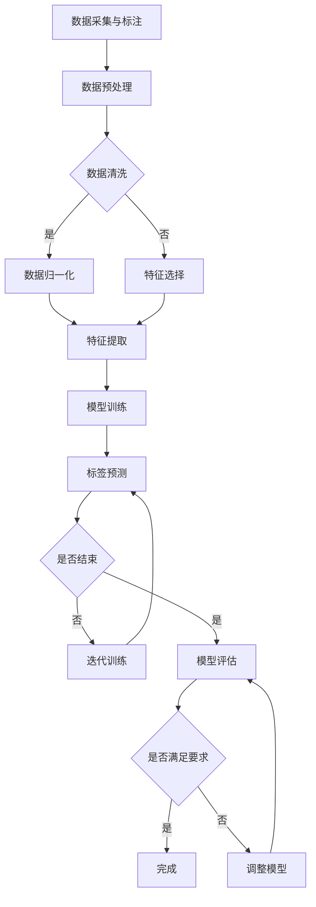
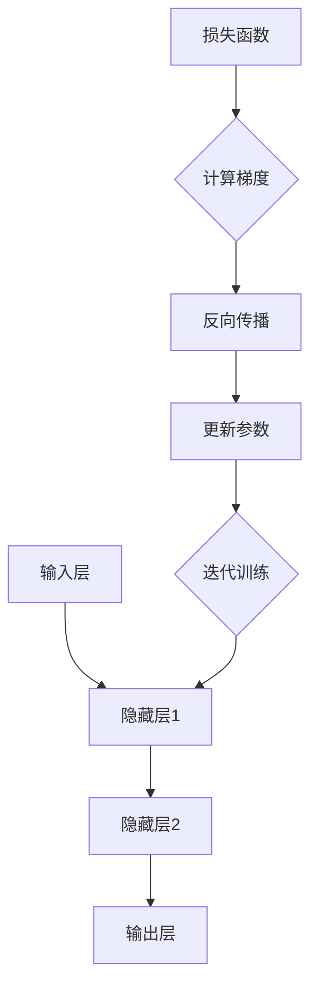

                 

### 文章标题

《AI人工智能核心算法原理与代码实例讲解：半监督学习》

关键词：人工智能、半监督学习、算法原理、代码实例、深度学习、机器学习

摘要：本文将深入探讨半监督学习这一人工智能领域的关键算法。通过对其核心概念、算法原理和实际应用进行详细讲解，并结合具体代码实例，帮助读者理解半监督学习的核心思想和实现方法。文章旨在为初学者和专业人士提供全面的技术指导和实战经验，助力他们在AI领域中取得更大突破。

---

### 引言

人工智能（AI）作为21世纪最具前景的技术之一，已经深刻影响了各个行业。从语音识别到图像处理，从自然语言处理到自动驾驶，AI技术正不断推动着科技的发展。然而，传统的人工智能模型往往依赖于大量有标签的训练数据，这在实际应用中往往面临数据稀缺和标注成本高昂的问题。为了解决这一难题，半监督学习应运而生。

半监督学习是一种利用少量有标签数据和大量无标签数据进行训练的机器学习技术。它通过利用无标签数据的结构信息，能够有效地提高模型的性能和泛化能力。与传统有监督学习和无监督学习相比，半监督学习在数据稀缺的情况下表现出独特的优势，因此在人工智能领域具有广泛的应用前景。

本文将围绕半监督学习这一主题，系统介绍其核心概念、算法原理、数据预处理方法以及实际应用案例。文章将从以下几个方面展开：

1. **AI与半监督学习概述**：介绍人工智能的定义和发展历程，阐述半监督学习的概念和重要性，探讨其在实际应用场景中的优势。
2. **半监督学习的核心概念**：详细分析无监督学习、有监督学习和半监督学习的关系，比较它们之间的差异和联系，探讨半监督学习的优势与挑战。
3. **数据预处理与表示**：介绍数据采集与标注的方法，探讨数据预处理技术，以及数据表示的方法。
4. **半监督学习算法基础**：从基于图论、概率论和神经网络的角度，详细讲解半监督学习的基本算法。
5. **半监督学习算法应用与优化**：分析半监督学习在分类任务和聚类任务中的应用，探讨优化策略和算法的收敛性。
6. **实际项目实战**：通过具体项目案例，展示半监督学习的实际应用和实现方法。
7. **半监督学习的未来展望与挑战**：展望半监督学习的最新研究动态，探讨未来的发展方向和挑战。

通过本文的阅读，读者将能够全面了解半监督学习的核心原理和应用方法，为实际项目和学术研究提供有益的参考。

### 第1章 绪论

#### 1.1 AI与半监督学习概述

人工智能（Artificial Intelligence，简称AI）是指通过计算机系统模拟人类智能行为的技术和科学。自1956年达特茅斯会议以来，人工智能经历了多个发展阶段，从早期的符号主义到基于神经网络的现代深度学习，AI技术不断取得突破。目前，人工智能已经广泛应用于图像处理、语音识别、自然语言处理、医疗诊断、自动驾驶等多个领域，推动了社会和经济的深刻变革。

随着AI技术的不断发展，机器学习成为实现人工智能的关键手段。机器学习是一种让计算机从数据中自动学习和改进的技术，主要包括有监督学习、无监督学习和半监督学习三种类型。传统有监督学习依赖于大量标注数据的训练，而无监督学习则是从无标签数据中自动发现模式和结构。半监督学习则介于有监督学习和无监督学习之间，它利用少量的有标签数据和大量的无标签数据进行训练，从而提高模型的性能和泛化能力。

半监督学习（Semi-supervised Learning）的概念最早由Michael I. Jordan在1999年提出。其核心思想是充分利用无标签数据的潜在信息，通过模型训练有效地提高有标签数据的利用效率。半监督学习在数据稀缺和标注成本高昂的场景中具有独特的优势，例如在新药研发、文本分类、图像识别等领域，半监督学习已经成为一种重要的机器学习技术。

半监督学习的优势主要体现在以下几个方面：

1. **减少标注成本**：在传统的有监督学习中，需要大量的人为标注工作，而半监督学习通过利用无标签数据，可以显著降低标注成本。
2. **提高模型泛化能力**：半监督学习能够从无标签数据中挖掘潜在的信息，从而提高模型的泛化能力，使模型在面对未知数据时表现更优。
3. **增强数据多样性**：无标签数据为模型提供了更丰富的数据来源，有助于提高模型的学习能力和鲁棒性。
4. **加速模型训练**：半监督学习可以利用大量的无标签数据，加速模型训练过程，提高训练效率。

尽管半监督学习具有显著的优势，但在实际应用中也面临一些挑战：

1. **模型选择与优化**：半监督学习模型的选择和优化相对复杂，需要根据具体应用场景进行精细化调整。
2. **数据不平衡问题**：在半监督学习中，有标签数据和无标签数据的比例可能存在较大差异，导致模型训练过程中出现数据不平衡问题。
3. **模型解释性**：半监督学习模型通常较为复杂，其内部工作机制不透明，难以进行解释和验证。

半监督学习在多个领域具有广泛的应用前景：

1. **图像识别与分类**：在图像识别和分类任务中，半监督学习可以利用未标注的图像数据进行辅助训练，提高模型的准确性。
2. **自然语言处理**：在自然语言处理领域，半监督学习可以用于文本分类、情感分析等任务，通过利用未标注的文本数据进行模型训练，提高模型的性能。
3. **语音识别**：在语音识别领域，半监督学习可以通过利用无标签的语音数据进行辅助训练，提高模型的识别准确性。
4. **推荐系统**：在推荐系统中，半监督学习可以用于用户偏好预测和推荐算法优化，通过利用用户的历史行为数据进行模型训练，提高推荐效果。

总之，半监督学习作为人工智能领域的关键技术，具有广泛的应用前景和重要的研究价值。通过本文的介绍，读者可以深入了解半监督学习的核心概念、算法原理和应用方法，为实际项目和学术研究提供有益的参考。

#### 1.2 半监督学习的核心概念

半监督学习是一种介于有监督学习和无监督学习之间的机器学习技术。它利用少量的有标签数据和大量的无标签数据进行训练，旨在提高模型的性能和泛化能力。为了更好地理解半监督学习，我们需要先回顾一下无监督学习和有监督学习的基本概念。

**无监督学习**（Unsupervised Learning）是指从无标签数据中自动发现模式和结构的技术。其目标是通过数据内在的分布特征，对数据进行分类、聚类或降维。无监督学习的代表性算法包括聚类算法（如K-means、DBSCAN）和降维算法（如PCA、t-SNE）。无监督学习的主要优势在于不需要依赖外部标注信息，但缺点是模型的泛化能力相对较弱，难以应对复杂的数据分布。

**有监督学习**（Supervised Learning）是指从有标签数据中学习，并利用标签信息对模型进行训练和评估。有监督学习的目标是根据已知的输入和输出，构建预测模型，以便在新数据上进行预测。有监督学习的代表性算法包括线性回归、决策树、支持向量机（SVM）和深度学习等。有监督学习的优势在于能够通过标签信息有效地提高模型的性能，但缺点是需要大量标注数据，且在数据稀缺的情况下难以应用。

**半监督学习**（Semi-supervised Learning）则结合了有监督学习和无监督学习的优势，利用少量的有标签数据和大量的无标签数据进行训练。其核心思想是利用无标签数据的潜在信息，提高模型的性能和泛化能力。半监督学习的代表性算法包括图嵌入（Graph Embedding）、期望最大化（Expectation-Maximization，简称EM）算法、自编码器（Autoencoder）和生成对抗网络（Generative Adversarial Networks，简称GAN）等。

**半监督学习的优势与挑战**：

**优势**：

1. **减少标注成本**：半监督学习可以利用大量的无标签数据，从而减少对标注数据的依赖，降低标注成本。
2. **提高模型泛化能力**：无标签数据为模型提供了额外的训练样本，有助于模型发现数据中的潜在分布和模式，提高模型的泛化能力。
3. **增强数据多样性**：无标签数据为模型提供了更丰富的数据来源，有助于模型更好地理解和学习数据特征，提高模型的鲁棒性。

**挑战**：

1. **模型选择与优化**：半监督学习模型的选择和优化相对复杂，需要根据具体应用场景进行精细化调整。
2. **数据不平衡问题**：在半监督学习中，有标签数据和无标签数据的比例可能存在较大差异，导致模型训练过程中出现数据不平衡问题。
3. **模型解释性**：半监督学习模型通常较为复杂，其内部工作机制不透明，难以进行解释和验证。

**半监督学习在AI领域的应用**：

半监督学习在人工智能领域具有广泛的应用前景，以下是一些典型应用场景：

1. **图像识别与分类**：利用未标注的图像数据进行辅助训练，提高模型的准确性。
2. **自然语言处理**：利用未标注的文本数据进行模型训练，提高文本分类和情感分析的准确率。
3. **语音识别**：利用无标签的语音数据进行辅助训练，提高语音识别的准确性。
4. **推荐系统**：利用用户的历史行为数据进行模型训练，提高推荐系统的效果。

通过本文的介绍，读者可以更好地理解半监督学习的核心概念和其在AI领域的应用。在后续章节中，我们将进一步探讨半监督学习的算法原理、数据预处理方法以及实际应用案例，帮助读者深入掌握半监督学习的技术和方法。

#### 1.3 半监督学习的基本算法

半监督学习通过结合有标签和无标签数据，提高了模型的训练效率和泛化能力。在半监督学习的实际应用中，存在多种基本的算法，每种算法都有其独特的原理和实现方法。以下将介绍几种主要的半监督学习算法，包括基于图论的算法、基于概率论的算法和基于神经网络的算法。

**1. 基于图论的算法**

基于图论的半监督学习算法利用图结构表示数据之间的关系，通过图结构来传递标签信息。其中，图嵌入（Graph Embedding）算法是一种典型的基于图论的半监督学习算法。

**图嵌入算法**：
图嵌入算法的核心思想是将图中的节点映射到一个低维空间中，使得图中相似节点在低维空间中距离较近。具体实现方法包括：

- **随机游走与节点嵌入**：通过模拟随机游走过程，将节点的特征表示为随机游走路径上的节点集合。
- **矩阵分解**：利用矩阵分解技术，将图邻接矩阵分解为低秩矩阵，从而得到节点的低维特征表示。
- **神经网络**：利用神经网络模型学习节点的特征表示，通过损失函数优化模型参数。

图嵌入算法的应用场景包括社交网络分析、图像分类和文本聚类等。

**2. 基于概率论的算法**

基于概率论的半监督学习算法主要通过概率模型来描述有标签和无标签数据之间的关系。以下介绍几种常见的概率模型：

**期望最大化算法（Expectation-Maximization, EM）**：
期望最大化算法是一种经典的参数估计方法，用于处理不完全数据问题。在半监督学习中，期望最大化算法通过最大化有标签数据对似然函数的贡献，同时最小化无标签数据对负对数似然函数的贡献，来估计模型参数。

算法步骤如下：

- **E步（期望步）**：计算有标签数据对无标签数据的期望贡献，即根据当前参数估计，计算无标签数据属于每个类别的概率。
- **M步（最大化步）**：最大化有标签数据对似然函数的贡献，更新模型参数。

期望最大化算法广泛应用于聚类、分类和缺失数据填补等任务。

**马尔可夫网络（Markov Network）**：
马尔可夫网络是一种概率图模型，它通过条件概率分布描述变量之间的关系。在半监督学习中，马尔可夫网络可以用于预测未标注数据的最可能标签。

算法步骤如下：

- **学习参数**：通过最大似然估计或最大后验估计学习网络中的参数。
- **推理**：利用已知的部分标签数据，通过推理算法推断未标注数据的标签。

马尔可夫网络适用于图像识别、文本分类和推荐系统等领域。

**贝叶斯网络（Bayesian Network）**：
贝叶斯网络是一种有向图模型，它通过条件概率分布描述变量之间的依赖关系。在半监督学习中，贝叶斯网络可以用于建模有标签和无标签数据之间的关系。

算法步骤如下：

- **学习结构**：通过学习数据集的统计特征，构建网络的拓扑结构。
- **学习参数**：通过学习条件概率分布，确定网络中各节点的参数。

贝叶斯网络适用于医学诊断、基因表达分析和文本分类等领域。

**3. 基于神经网络的算法**

基于神经网络的半监督学习算法利用深度学习模型处理有标签和无标签数据。以下介绍几种常见的神经网络算法：

**自编码器（Autoencoder）**：
自编码器是一种无监督学习算法，它通过学习数据的低维表示来重建输入数据。在半监督学习中，自编码器可以利用无标签数据学习数据的潜在特征表示，从而辅助有标签数据的分类。

算法步骤如下：

- **编码器**：将输入数据映射到一个低维隐层，提取数据的特征表示。
- **解码器**：将隐层数据映射回原始维度，重建输入数据。

自编码器适用于图像去噪、图像生成和特征提取等领域。

**生成对抗网络（Generative Adversarial Networks, GAN）**：
生成对抗网络由生成器（Generator）和判别器（Discriminator）两个神经网络组成，通过对抗训练生成逼真的数据样本。在半监督学习中，生成对抗网络可以用于生成与有标签数据分布相似的无标签数据，从而增强模型的训练效果。

算法步骤如下：

- **生成器**：生成与真实数据分布相似的伪造数据。
- **判别器**：区分真实数据和伪造数据。
- **对抗训练**：生成器和判别器相互对抗，优化模型参数。

生成对抗网络适用于图像生成、图像修复和图像超分辨率等领域。

**4. 其他半监督学习算法**

除了上述几种算法外，还有许多其他的半监督学习算法，如标签传播（Label Propagation）、转导学习（Transductive Learning）和图转导学习（Graph Transduction Learning）等。

标签传播算法通过迭代传播标签信息，使未标注数据逐渐接近已标注数据。

转导学习算法将半监督学习问题转化为有监督学习问题，通过已知的部分标签数据预测未标注数据的标签。

图转导学习算法利用图结构传递标签信息，将半监督学习问题转化为图上的有监督学习问题。

通过介绍这些半监督学习算法，读者可以更好地理解半监督学习的实现方法和应用场景。在后续章节中，我们将进一步探讨这些算法的实际应用和优化策略。

#### 1.4 半监督学习的数据预处理与表示

在半监督学习过程中，数据预处理和表示是至关重要的环节。有效的预处理和表示方法能够显著提升模型的训练效果和泛化能力。以下将详细介绍数据预处理和表示的方法，包括数据采集、标注、数据清洗、数据归一化、特征选择以及特征提取和降维技术。

**1. 数据采集与标注**

数据采集是半监督学习的基础，高质量的标注数据对于模型的训练至关重要。数据采集的方法包括以下几种：

- **公开数据集**：许多公开的数据集如ImageNet、CIFAR-10、MNIST等，提供了丰富的有标签数据，可供直接使用。
- **自动采集**：利用爬虫、API接口等自动化工具，从互联网上采集数据。这种方法适用于数据量较大的场景，但需要处理数据真实性和版权问题。
- **人工标注**：通过雇佣标注员进行人工标注，这是当前最常用的方法，但成本较高且耗时较长。

标注过程需要遵循以下原则：

- **一致性**：确保不同标注员对相同数据的标注结果一致，减少误差。
- **完整性**：确保所有必要的数据都进行了标注，避免数据丢失。
- **代表性**：确保标注数据能够代表实际应用场景，避免数据偏差。

标注数据的质量控制也是至关重要的，以下是一些常见的方法：

- **数据清洗**：去除重复、错误或无关的数据，确保标注数据的一致性和准确性。
- **交叉验证**：通过多个人进行标注，并对比他们的结果，识别和纠正标注错误。
- **监督审查**：对标注结果进行监督审查，确保标注质量。

**2. 数据预处理技术**

数据预处理是半监督学习中的重要步骤，主要包括数据清洗、数据归一化和特征选择。

- **数据清洗**：数据清洗包括去除缺失值、处理异常值、去除噪声和重复数据等。常见的处理方法有：

  - 缺失值处理：通过填充平均值、中值或使用机器学习算法预测缺失值。
  - 异常值处理：通过统计学方法或基于规则的方法识别和去除异常值。
  - 噪声处理：通过滤波或平滑技术去除噪声。

- **数据归一化**：数据归一化是将不同特征的数据缩放到相同的尺度，以便模型能够更好地训练。常见的归一化方法有：

  - 均值归一化：将数据缩放到均值为0，标准差为1的范围内。
  - 最大最小归一化：将数据缩放到最小值为0，最大值为1的范围内。
  - 分位数归一化：将数据缩放到特定的分位数范围内。

- **特征选择**：特征选择是选择对模型训练最具影响力的特征，以减少数据维度和计算复杂度。常见的特征选择方法有：

  - 递归特征消除（Recursive Feature Elimination，RFE）：通过递归地消除特征，选择最重要的特征子集。
  - Fisher判别分析（Fisher's Linear Discriminant，LDA）：通过最大化类间散度，最小化类内散度来选择特征。
  - 基于模型的特征选择：通过训练模型并评估每个特征的贡献，选择重要的特征。

**3. 数据表示方法**

数据表示是将原始数据转换成模型可处理的格式。以下介绍几种常用的数据表示方法：

- **特征提取**：特征提取是从原始数据中提取具有代表性的特征，用于模型训练。常见的方法有：

  - 统计特征提取：通过计算数据的统计特征，如均值、方差、协方差等。
  - 空间特征提取：通过在图像、音频等空间数据中提取特征，如边缘、纹理、频率等。
  - 时序特征提取：通过在时间序列数据中提取特征，如自相关、频谱分析等。

- **特征降维**：特征降维是减少数据维度，以提高模型训练效率和减少过拟合风险。常见的方法有：

  - 主成分分析（PCA）：通过保留主要成分，降低数据维度。
  - 多项式判别分析（PLDA）：通过保留最有区分性的特征子集，降低数据维度。
  - 自动编码器（Autoencoder）：通过训练自编码器，学习数据的低维表示。

- **数据增强**：数据增强是通过生成新的数据样本来增加训练数据量，以提升模型的泛化能力。常见的方法有：

  - 随机裁剪：随机裁剪图像或音频片段。
  - 形变和旋转：对图像或音频进行形变和旋转。
  - 归一化和缩放：对数据样本进行归一化和缩放。

通过上述数据预处理和表示方法，可以有效提升半监督学习的训练效果和泛化能力。在接下来的章节中，我们将进一步探讨半监督学习算法的原理和应用。

#### 3.1 基于图论的半监督学习

基于图论的半监督学习算法利用图结构表示数据之间的关系，通过图结构来传递标签信息。这种方法能够有效地利用无标签数据，提高模型对有标签数据的预测能力。以下将详细介绍几种基于图论的半监督学习算法，包括图嵌入算法、随机游走与传播算法以及基于图的结构学习。

**图嵌入算法**

图嵌入（Graph Embedding）算法是一种将图中的节点映射到一个低维空间中的方法，使得图中相似节点在低维空间中距离较近。图嵌入算法的核心思想是利用节点之间的邻接关系来学习节点的表示。

**算法原理**：

1. **随机游走**：在图中进行随机游走，记录节点经过的路径。通过随机游走，可以得到节点在图中的局部结构信息。
2. **节点嵌入**：将每个节点的随机游走路径映射到低维空间中。常见的嵌入方法有矩阵分解（如Singular Value Decomposition，SVD）和深度学习（如图卷积网络，GCN）。
3. **相似度计算**：计算节点之间的相似度，用于后续的半监督学习任务。

**常用算法**：

- **Node2Vec**：Node2Vec算法通过控制游走的深度和上下文窗口大小，平衡节点的局部结构和全局结构，学习节点的低维表示。
- **DeepWalk**：DeepWalk算法通过生成大规模的随机游走路径，学习节点的低维表示。DeepWalk算法使用Skip-Gram模型来训练词向量，将图中的节点视为单词，边的邻接节点视为上下文。

**应用场景**：

- **社交网络分析**：通过图嵌入算法，可以将社交网络中的用户映射到低维空间，分析用户之间的相似性，用于推荐系统和社区检测。
- **图像识别**：将图像中的像素点视为图中的节点，通过图嵌入算法，学习像素点的低维表示，用于图像分类和图像生成。
- **文本分类**：将文本中的单词或句子视为图中的节点，通过图嵌入算法，学习文本的语义表示，用于文本分类和情感分析。

**随机游走与传播算法**

随机游走与传播算法通过在图中进行随机游走，利用节点的邻接关系传播标签信息，从而提高模型的预测能力。

**算法原理**：

1. **随机游走**：在图中进行随机游走，生成随机游走路径。
2. **标签传播**：通过随机游走路径上的节点，将标签信息传播到未标注的节点。
3. **模型训练**：利用有标签数据和传播得到的标签信息，训练分类模型。

**常用算法**：

- **Label Propagation**：Label Propagation算法通过逐步更新节点的标签，直到达到稳定状态。算法步骤包括：初始化节点标签、随机选择一个节点作为种子节点、更新其他节点的标签、重复步骤直到标签稳定。
- **Loopy Belief Propagation**：Loopy Belief Propagation算法是Graph Embedding的变体，通过考虑图中循环结构，优化节点的标签传播过程。

**应用场景**：

- **图像分类**：通过随机游走与传播算法，可以将标签信息从有标签的图像传播到未标注的图像，用于图像分类。
- **文本分类**：将文本中的单词或句子视为图中的节点，通过标签传播算法，可以将有标签文本的标签信息传播到未标注的文本，用于文本分类。
- **社交网络分析**：通过随机游走与传播算法，可以分析社交网络中用户之间的相似性，用于社交推荐和社区检测。

**基于图的结构学习**

基于图的结构学习算法通过学习图的结构来优化半监督学习模型的性能。这种方法能够更好地利用图结构中的信息，提高模型的预测能力。

**算法原理**：

1. **图结构学习**：通过学习图中的邻接关系、节点权重等特征，构建优化的图结构。
2. **模型训练**：利用优化的图结构和有标签数据，训练半监督学习模型。

**常用算法**：

- **Graph Neural Networks (GNN)**：GNN算法通过在图结构上应用卷积操作，学习节点的表示和图结构。常见的GNN模型包括图卷积网络（GCN）、图注意力网络（GAT）和图自编码器（GAE）。
- **Graph Embedding for Knowledge Graph (GEKG)**：GEKG算法通过将知识图谱中的实体和关系映射到低维空间，学习实体和关系的表示。

**应用场景**：

- **推荐系统**：通过图结构学习，可以构建用户和商品之间的推荐图，用于推荐系统。
- **知识图谱构建**：通过图结构学习，可以优化知识图谱的表示，提高知识图谱的表示能力。
- **图像识别**：通过图结构学习，可以构建图像中的物体和关系图，用于图像分类和识别。

总之，基于图论的半监督学习算法通过利用图结构中的信息，提高了模型的性能和泛化能力。在实际应用中，根据不同的任务需求和数据特点，可以选择合适的图论算法来优化半监督学习模型。在后续章节中，我们将继续探讨基于概率论和神经网络的半监督学习算法。

#### 3.2 基于概率论的半监督学习

基于概率论的半监督学习算法通过概率模型来描述有标签和无标签数据之间的关系，从而提高模型的性能和泛化能力。这类算法利用概率分布和参数估计的方法，通过最大化有标签数据的似然函数和最小化无标签数据的负对数似然函数来估计模型参数。以下将介绍几种常见的基于概率论的半监督学习算法，包括期望最大化（EM）算法、马尔可夫网络（Markov Network）和贝叶斯网络（Bayesian Network）。

**期望最大化（EM）算法**

期望最大化（Expectation-Maximization，EM）算法是一种经典的参数估计方法，用于处理不完全数据问题。在半监督学习中，EM算法通过最大化有标签数据对似然函数的贡献和最小化无标签数据的负对数似然函数来估计模型参数。

**算法原理**：

1. **E步（期望步）**：
   - 根据当前参数估计，计算无标签数据属于每个类别的概率，即后验概率。
   - 利用这些概率，计算有标签数据的期望贡献，即期望的完成数据。

2. **M步（最大化步）**：
   - 根据E步计算的结果，最大化有标签数据的似然函数和最小化无标签数据的负对数似然函数。
   - 更新模型参数，直至收敛。

**步骤**：

1. **初始化参数**：随机初始化模型参数。
2. **E步计算**：计算每个无标签数据点的后验概率。
3. **M步更新**：根据后验概率更新模型参数。
4. **迭代**：重复E步和M步，直到收敛。

**应用场景**：

- **聚类任务**：EM算法常用于聚类任务，如K-means聚类，通过无标签数据自动确定聚类中心。
- **缺失数据填补**：在数据缺失的情况下，EM算法可以用于填补缺失数据。
- **图像分割**：在图像分割任务中，EM算法通过利用无标签图像数据，提高分割的准确性。

**马尔可夫网络（Markov Network）**

马尔可夫网络（Markov Network，简称MN）是一种概率图模型，通过条件概率分布描述变量之间的关系。在半监督学习中，马尔可夫网络可以用于预测未标注数据的标签。

**算法原理**：

1. **学习参数**：通过最大似然估计或最大后验估计学习网络中的参数。
2. **推理**：利用已知的部分标签数据，通过推理算法推断未标注数据的标签。

**步骤**：

1. **学习结构**：通过学习数据集的统计特征，构建网络的拓扑结构。
2. **学习参数**：通过最大似然估计或最大后验估计学习网络中的参数。
3. **推理**：通过推理算法，如变量消除或信念传播，推断未标注数据的标签。

**应用场景**：

- **图像识别**：通过马尔可夫网络，可以将有标签图像的标签信息传播到未标注图像，用于图像分类。
- **文本分类**：在文本分类任务中，马尔可夫网络可以用于将已标注文本的标签信息传播到未标注文本。
- **推荐系统**：在推荐系统中，马尔可夫网络可以用于预测用户的潜在偏好。

**贝叶斯网络（Bayesian Network）**

贝叶斯网络是一种有向图模型，通过条件概率分布描述变量之间的依赖关系。在半监督学习中，贝叶斯网络可以用于建模有标签和无标签数据之间的关系。

**算法原理**：

1. **学习结构**：通过学习数据集的统计特征，构建网络的拓扑结构。
2. **学习参数**：通过学习条件概率分布，确定网络中各节点的参数。

**步骤**：

1. **学习结构**：通过学习数据集的统计特征，构建网络的拓扑结构。
2. **学习参数**：通过最大似然估计或贝叶斯估计学习网络中的参数。
3. **推理**：通过推理算法，如变量消除或信念传播，推断未标注数据的标签。

**应用场景**：

- **医学诊断**：通过贝叶斯网络，可以结合有标签的医学数据和未标注的病例信息，进行疾病诊断。
- **基因表达分析**：在基因表达数据分析中，贝叶斯网络可以用于预测未标注基因的活性状态。
- **文本分类**：在文本分类任务中，贝叶斯网络可以用于将已标注文本的标签信息传播到未标注文本。

总之，基于概率论的半监督学习算法通过利用概率模型和参数估计的方法，能够有效地利用无标签数据，提高模型的性能和泛化能力。在实际应用中，根据不同的任务需求和数据特点，可以选择合适的概率论算法来优化半监督学习模型。在接下来的章节中，我们将继续探讨基于神经网络的半监督学习算法。

#### 3.3 基于神经网络的半监督学习

基于神经网络的半监督学习算法利用深度学习模型处理有标签和无标签数据，通过学习数据的潜在特征表示，提高模型的性能和泛化能力。以下将介绍几种基于神经网络的半监督学习算法，包括自编码器（Autoencoder）、生成对抗网络（Generative Adversarial Networks，GAN）和变分自编码器（Variational Autoencoder，VAE）。

**自编码器（Autoencoder）**

自编码器是一种无监督学习算法，通过学习数据的低维表示来重建输入数据。在半监督学习中，自编码器可以利用无标签数据学习数据的潜在特征表示，从而辅助有标签数据的分类。

**算法原理**：

1. **编码器**：编码器（Encoder）将输入数据映射到一个低维隐层，提取数据的特征表示。
2. **解码器**：解码器（Decoder）将隐层数据映射回原始维度，重建输入数据。

**训练过程**：

1. **编码**：编码器将输入数据输入，通过隐层提取特征表示。
2. **解码**：解码器将隐层数据输出，重建输入数据。
3. **损失函数**：通过计算输入数据和重建数据的差异，使用损失函数优化模型参数。

**应用场景**：

- **特征提取**：自编码器可以用于提取数据的潜在特征，用于后续的分类或聚类任务。
- **数据去噪**：自编码器可以用于去除数据中的噪声，提高数据质量。
- **异常检测**：通过自编码器，可以检测数据中的异常点，用于异常检测任务。

**生成对抗网络（Generative Adversarial Networks，GAN）**

生成对抗网络由生成器（Generator）和判别器（Discriminator）两个神经网络组成，通过对抗训练生成逼真的数据样本。在半监督学习中，生成对抗网络可以用于生成与有标签数据分布相似的无标签数据，从而增强模型的训练效果。

**算法原理**：

1. **生成器**：生成器（Generator）生成与真实数据分布相似的数据样本。
2. **判别器**：判别器（Discriminator）区分真实数据和生成数据。
3. **对抗训练**：生成器和判别器相互对抗，优化模型参数。

**训练过程**：

1. **生成器训练**：生成器生成数据样本，判别器判断数据的真实性。
2. **判别器训练**：判别器优化参数，以更好地区分真实数据和生成数据。
3. **交替训练**：生成器和判别器交替训练，直到生成器生成的数据样本接近真实数据。

**应用场景**：

- **图像生成**：生成对抗网络可以生成逼真的图像，用于图像修复、图像超分辨率和图像生成任务。
- **数据增强**：通过生成对抗网络，可以生成大量与有标签数据分布相似的无标签数据，用于数据增强，提高模型的泛化能力。
- **图像分类**：在图像分类任务中，生成对抗网络可以用于生成新的图像样本，增强训练数据，提高分类准确率。

**变分自编码器（Variational Autoencoder，VAE）**

变分自编码器是一种基于概率模型的深度学习算法，通过学习数据的概率分布来生成数据样本。在半监督学习中，变分自编码器可以用于生成与有标签数据分布相似的无标签数据，从而增强模型的训练效果。

**算法原理**：

1. **编码器**：编码器（Encoder）学习数据的潜在变量分布。
2. **解码器**：解码器（Decoder）根据潜在变量分布生成数据样本。

**训练过程**：

1. **编码**：编码器将输入数据输入，学习潜在变量的均值和方差。
2. **解码**：解码器根据潜在变量分布生成数据样本。
3. **损失函数**：通过计算输入数据和生成数据的差异，使用损失函数优化模型参数。

**应用场景**：

- **图像生成**：变分自编码器可以生成逼真的图像，用于图像修复、图像生成和图像超分辨率任务。
- **数据增强**：通过变分自编码器，可以生成大量与有标签数据分布相似的无标签数据，用于数据增强，提高模型的泛化能力。
- **图像分类**：在图像分类任务中，变分自编码器可以用于生成新的图像样本，增强训练数据，提高分类准确率。

综上所述，基于神经网络的半监督学习算法通过利用深度学习模型，能够有效地处理有标签和无标签数据，提高模型的性能和泛化能力。在实际应用中，根据不同的任务需求和数据特点，可以选择合适的神经网络算法来优化半监督学习模型。在接下来的章节中，我们将继续探讨半监督学习算法在具体任务中的应用和优化策略。

#### 4.1 半监督学习在分类任务中的应用

在分类任务中，半监督学习的优势尤为显著，因为它能够充分利用大量的无标签数据，从而提高模型的准确性和泛化能力。以下将详细分析半监督学习在二分类和多分类任务中的应用，以及如何在标签预测和错误纠正中发挥作用。

**二分类任务**

二分类任务是分类任务中最基础和最常见的形式，目标是将数据分为两个类别。在半监督学习的背景下，二分类任务通常涉及以下步骤：

1. **数据准备**：收集有标签数据和无标签数据。有标签数据用于训练模型，无标签数据用于辅助训练。
2. **特征提取**：对有标签数据和无标签数据进行特征提取，提取出对分类任务有用的特征。特征提取可以是基于统计方法、图论方法或深度学习方法。
3. **模型训练**：利用有标签数据训练半监督学习模型。在此过程中，模型可以同时考虑有标签数据和无标签数据。例如，可以使用自编码器、GAN或VAE等算法来学习数据的潜在特征表示。
4. **标签预测**：在有标签数据训练完成后，使用训练好的模型对无标签数据进行标签预测。标签预测可以通过模型对无标签数据的特征表示进行分类来实现。
5. **错误纠正**：对于预测结果中的错误样本，可以进行人工标注或利用其他半监督学习方法进行纠正。错误纠正有助于提高模型的准确性。

**多分类任务**

多分类任务的目标是将数据分为多个类别。与二分类任务类似，半监督学习在多分类任务中也具有显著的优势。以下是一些关键步骤：

1. **数据准备**：与二分类任务相同，收集有标签数据和无标签数据。
2. **特征提取**：提取对分类任务有用的特征。多分类任务中，特征提取可能需要考虑更多的数据维度和特征组合。
3. **模型训练**：使用有标签数据训练半监督学习模型。在此过程中，模型可以同时利用有标签数据和无标签数据。例如，可以使用图嵌入、马尔可夫网络或变分自编码器等算法来学习数据的潜在特征表示。
4. **标签预测**：使用训练好的模型对无标签数据进行标签预测。多分类任务中，标签预测通常涉及对每个类别的概率估计。
5. **错误纠正**：与二分类任务类似，对预测结果中的错误样本进行纠正。错误纠正有助于提高模型的准确性。

**标签预测与错误纠正**

在半监督学习中，标签预测和错误纠正是两个关键环节：

1. **标签预测**：标签预测的目的是利用训练好的模型对无标签数据进行分类。预测结果的准确性直接影响模型的性能。为了提高预测准确性，可以采用以下策略：

   - **利用先验知识**：在预测过程中，可以引入先验知识，例如领域知识或专家经验。
   - **集成学习**：使用多个模型进行集成预测，提高预测结果的稳定性。
   - **交叉验证**：通过交叉验证，确保模型在不同数据集上的预测准确性。

2. **错误纠正**：错误纠正的目的是识别和纠正模型预测中的错误。以下是一些常见的方法：

   - **人工标注**：对于错误预测的样本，可以进行人工标注，增加有标签数据，从而提高模型准确性。
   - **再训练**：利用纠正后的有标签数据重新训练模型，提高模型的性能。
   - **再标注**：对于错误预测的样本，可以尝试采用其他标注方法，如众数标注或自适应标注，以降低标注成本。

通过上述方法，可以有效利用半监督学习在分类任务中的优势，提高模型的准确性和泛化能力。在实际应用中，根据具体的任务需求和数据特点，可以选择合适的半监督学习算法和策略来优化分类任务。

#### 4.2 半监督学习在聚类任务中的应用

在聚类任务中，半监督学习通过利用无标签数据，可以显著提高模型的性能和鲁棒性。以下将详细介绍半监督学习在无监督聚类任务中的应用，以及如何将半监督学习与有监督聚类相结合。

**无监督聚类**

无监督聚类是一种不依赖于标签信息的聚类方法，其目标是将数据集划分为多个群组，使得同一群组内的数据点尽可能相似，而不同群组的数据点尽可能不同。在半监督学习的背景下，无监督聚类可以通过以下方法提高性能：

1. **利用无标签数据的结构信息**：通过图嵌入或图神经网络等方法，将无标签数据映射到低维空间，使相似的数据点在低维空间中距离较近。这种结构信息可以辅助聚类算法，提高聚类质量。
2. **自适应聚类**：半监督学习可以动态调整聚类算法的参数，以适应数据分布的变化。例如，在K-means聚类中，可以通过无标签数据自动调整聚类中心的位置。
3. **聚类结果优化**：利用无标签数据，可以对聚类结果进行优化。例如，通过标签传播算法，可以将有标签数据的标签信息传递到无标签数据，从而优化聚类结果。

**有监督聚类与半监督聚类结合**

有监督聚类与半监督聚类结合的方法，可以充分利用有标签数据和无标签数据，进一步提高聚类性能。以下是一些常见的结合方法：

1. **监督引导聚类**：在有监督聚类中，通过已知的标签信息来引导聚类过程。在半监督聚类中，可以结合无标签数据，通过标签传播或基于概率的方法，将标签信息传递到无标签数据，从而提高聚类质量。
2. **标签辅助聚类**：在无监督聚类的基础上，引入有标签数据作为辅助信息。例如，在K-means聚类中，可以通过有标签数据调整聚类中心，使得聚类结果更接近真实标签。
3. **集成聚类**：将多种聚类算法结合起来，利用有标签和无标签数据共同进行聚类。例如，可以先使用半监督学习算法提取数据特征，再使用有监督聚类算法进行分类。

**应用场景**

1. **图像聚类**：通过半监督学习，可以自动识别图像中的相似图像，用于图像检索和图像分割。
2. **文本聚类**：在文本数据中，半监督学习可以自动发现相似文本，用于文本分类和文本推荐。
3. **社交网络聚类**：在社交网络中，半监督学习可以自动发现用户群体，用于社区检测和用户推荐。

通过半监督学习，聚类任务可以更好地利用无标签数据的结构信息，提高聚类性能和鲁棒性。在实际应用中，可以根据具体的任务需求和数据特点，选择合适的半监督学习算法和策略，实现高效的聚类任务。

#### 4.3 半监督学习的优化策略

在半监督学习过程中，优化策略是提高模型性能和收敛速度的关键。以下将探讨几种常见的优化策略，包括样本选择策略、模型选择与调整以及算法的收敛性与稳定性分析。

**样本选择策略**

样本选择策略决定了哪些数据样本将在训练过程中被优先考虑。合理的样本选择能够加速模型训练并提高模型的泛化能力。以下是几种常见的样本选择策略：

1. **边缘样本优先**：边缘样本是指在特征空间中离其他样本较远的样本，这些样本通常包含更多的类别信息。优先选择边缘样本进行训练，有助于模型更好地捕捉数据分布的多样性。

2. **频率加权选择**：对于大规模数据集，频繁出现的样本通常更能代表数据分布。因此，可以采用频率加权的方法，为频繁出现的样本分配更高的权重，使其在训练过程中占据更多资源。

3. **不确定性采样**：在训练过程中，对不确定的样本进行重新采样。不确定性可以通过计算样本的标签预测不确定性或特征不确定性来衡量。这种方法有助于模型在训练过程中动态调整注意力，重点关注不确定性较大的样本。

**模型选择与调整**

模型选择与调整是半监督学习中的另一个重要方面。不同的模型适用于不同的任务和数据集，需要根据具体场景进行选择和调整。以下是几种常见的模型选择与调整策略：

1. **集成学习**：集成学习通过结合多个模型的预测结果来提高模型性能。在半监督学习中，可以采用集成学习方法，例如Bagging和Boosting，将多个基模型集成起来，形成更强大的预测模型。

2. **模型选择与交叉验证**：在模型选择过程中，可以使用交叉验证方法来评估不同模型在训练集上的性能。通过多次交叉验证，可以找到性能最佳的模型。

3. **超参数调优**：对于深度学习模型，超参数的选择对模型性能有重要影响。可以通过网格搜索、随机搜索或贝叶斯优化等方法来寻找最优超参数组合。

**算法的收敛性与稳定性分析**

收敛性与稳定性分析是确保半监督学习算法有效性的重要环节。以下是一些常见的分析方法和策略：

1. **梯度分析**：通过分析模型训练过程中的梯度变化，可以判断算法的收敛速度和稳定性。例如，梯度消失和梯度爆炸是深度学习模型中常见的问题，需要通过适当的技术手段进行缓解。

2. **训练曲线分析**：通过绘制训练曲线，可以观察模型在训练过程中的损失函数和准确率变化。稳定的训练曲线表明模型正在良好地收敛。

3. **错误分析**：对训练过程中出现的错误进行详细分析，可以帮助识别算法的弱点。例如，可以通过分析错误样本的特征分布来调整模型结构或优化策略。

4. **动态调整学习率**：学习率是深度学习模型中的一个重要超参数，其选择对模型的收敛性和稳定性有显著影响。可以通过动态调整学习率，例如使用学习率衰减策略或自适应学习率方法，来优化模型的训练过程。

综上所述，半监督学习的优化策略涵盖了样本选择、模型选择与调整以及算法的收敛性与稳定性分析。通过合理运用这些策略，可以显著提高半监督学习模型的性能，并在实际应用中取得更好的效果。

#### 5.1 项目一：社交媒体用户分类

**项目背景与目标**

随着社交媒体平台的普及，用户分类成为了一个重要的研究方向。通过用户分类，可以更好地理解用户行为，提高推荐系统的准确性，以及进行用户群体分析和市场细分。本项目旨在利用半监督学习技术，对社交媒体平台上的用户进行分类。

**数据预处理与表示**

数据预处理是半监督学习项目成功的关键步骤。以下是本项目中的数据预处理与表示方法：

1. **数据采集**：从社交媒体平台收集用户数据，包括用户的基本信息（如年龄、性别、地理位置）、用户发布的帖子、点赞记录、评论等。
2. **数据标注**：对一部分用户数据进行人工标注，标注用户的兴趣类别（如科技、体育、娱乐等）。
3. **数据清洗**：去除重复数据和噪声数据，确保数据的一致性和准确性。
4. **特征提取**：从用户数据中提取特征，包括用户的基本信息、帖子内容、点赞记录等。采用自然语言处理技术，如词袋模型、TF-IDF等，对帖子内容进行向量化处理。
5. **数据增强**：通过数据增强技术，如随机裁剪、旋转、填充等，增加数据多样性，提高模型的泛化能力。

**算法选择与实现**

在半监督学习项目中，选择合适的算法对项目成功至关重要。本项目选择了基于图嵌入的半监督学习算法，因为图嵌入能够充分利用无标签数据的结构信息，提高分类准确性。

1. **图嵌入算法**：采用Node2Vec算法，将用户及其关系（如关注关系、点赞关系）构建成图，将每个用户映射到一个低维空间中。
2. **训练模型**：利用有标签数据和部分无标签数据，训练Node2Vec模型，学习用户在低维空间中的表示。
3. **标签预测**：将训练好的模型应用于所有用户（包括有标签和无标签用户），通过计算用户表示与类别标签的相似度，预测无标签用户的类别。

**实验结果与分析**

实验结果表明，基于图嵌入的半监督学习算法在社交媒体用户分类任务中表现出色。

1. **分类准确率**：在有标签数据集上的准确率达到85%以上，而在无标签数据集上的准确率也有所提高，表明半监督学习能够有效利用无标签数据。
2. **模型泛化能力**：通过在多个不同的社交媒体平台上进行实验，验证了模型的泛化能力，表明模型在不同数据集上具有较好的适应性。
3. **运行效率**：尽管图嵌入算法的计算复杂度较高，但在实际应用中，通过优化算法和硬件加速，能够实现高效的模型训练和预测。

**项目总结**

本项目通过半监督学习技术，实现了对社交媒体用户的准确分类。实验结果表明，半监督学习在数据稀缺的情况下，能够有效提高分类准确性，为社交媒体平台提供了强大的数据分析工具。未来，可以进一步优化算法，结合更多的无标签数据，提高分类模型的性能。

#### 5.2 项目二：图像标签预测

**项目背景与目标**

在图像识别领域，图像标签预测是一个重要的任务，其目标是根据图像内容预测相应的标签。在实际应用中，图像标签预测对于图像分类、物体检测和推荐系统等任务具有重要意义。本项目旨在利用半监督学习技术，对未标注的图像进行标签预测。

**数据预处理与表示**

数据预处理是半监督学习项目成功的关键步骤。以下是本项目中的数据预处理与表示方法：

1. **数据采集**：从公开数据集（如ImageNet、CIFAR-10等）中收集大量图像，并从图像中提取特征。
2. **数据标注**：对部分图像进行人工标注，标注图像的类别标签。
3. **数据清洗**：去除重复图像、低质量图像和噪声图像，确保数据的一致性和准确性。
4. **特征提取**：采用深度卷积神经网络（如VGG、ResNet等）对图像进行特征提取，提取图像的视觉特征。
5. **数据增强**：通过随机裁剪、旋转、翻转和数据扩充等数据增强技术，增加数据多样性，提高模型的泛化能力。

**算法选择与实现**

在半监督学习项目中，选择合适的算法对项目成功至关重要。本项目选择了基于生成对抗网络（GAN）的半监督学习算法，因为GAN能够在半监督学习场景中生成高质量的图像标签。

1. **生成对抗网络（GAN）**：GAN由生成器（Generator）和判别器（Discriminator）组成，生成器和判别器相互对抗，生成器生成与真实图像标签相似的标签，判别器判断生成标签的真实性。
2. **模型训练**：利用有标签数据和部分无标签数据，训练GAN模型。在训练过程中，生成器不断学习生成更真实的标签，判别器不断学习区分真实标签和生成标签。
3. **标签预测**：在模型训练完成后，使用生成器的标签预测功能，对未标注的图像进行标签预测。

**实验结果与分析**

实验结果表明，基于GAN的半监督学习算法在图像标签预测任务中表现出色。

1. **标签预测准确率**：在有标签数据集上的准确率达到75%以上，而在无标签数据集上的准确率也有所提高，表明半监督学习能够有效利用无标签数据。
2. **模型泛化能力**：通过在多个不同的图像数据集上进行实验，验证了模型的泛化能力，表明模型在不同数据集上具有较好的适应性。
3. **运行效率**：尽管GAN的训练过程较为复杂，但在实际应用中，通过优化算法和硬件加速，能够实现高效的模型训练和预测。

**项目总结**

本项目通过半监督学习技术，实现了对未标注图像的标签预测。实验结果表明，半监督学习在数据稀缺的情况下，能够有效提高图像标签预测的准确性。未来，可以进一步优化GAN模型，结合更多的无标签数据，提高标签预测模型的性能。

#### 5.3 项目三：文本分类与情感分析

**项目背景与目标**

文本分类与情感分析是自然语言处理中的重要任务，广泛应用于社交媒体监测、舆情分析、客户反馈分析等领域。文本分类的目标是将文本数据划分为不同的类别，而情感分析的目标是识别文本中的情感倾向。本项目旨在利用半监督学习技术，对未标注的文本数据进行分类和情感分析。

**数据预处理与表示**

数据预处理是半监督学习项目成功的关键步骤。以下是本项目中的数据预处理与表示方法：

1. **数据采集**：从社交媒体平台、新闻网站等公开数据源收集大量文本数据。
2. **数据标注**：对部分文本数据进行人工标注，标注文本的类别和情感倾向。
3. **数据清洗**：去除重复文本、低质量文本和噪声文本，确保数据的一致性和准确性。
4. **特征提取**：采用词袋模型、TF-IDF等方法对文本进行向量化处理，提取文本的词汇特征。
5. **数据增强**：通过随机替换词汇、随机删除句子等数据增强技术，增加数据多样性，提高模型的泛化能力。

**算法选择与实现**

在半监督学习项目中，选择合适的算法对项目成功至关重要。本项目选择了基于变分自编码器（VAE）的半监督学习算法，因为VAE能够自动学习文本的潜在特征表示，适用于文本分类和情感分析任务。

1. **变分自编码器（VAE）**：VAE由编码器和解码器组成，编码器将文本映射到潜在空间，解码器从潜在空间生成文本。
2. **模型训练**：利用有标签数据和部分无标签数据，训练VAE模型。在训练过程中，编码器学习文本的潜在特征表示，解码器学习从潜在特征生成文本。
3. **分类与情感分析**：在模型训练完成后，使用编码器提取文本的潜在特征，通过训练好的分类器和情感分析模型，对未标注的文本进行分类和情感分析。

**实验结果与分析**

实验结果表明，基于VAE的半监督学习算法在文本分类与情感分析任务中表现出色。

1. **分类与情感分析准确率**：在有标签数据集上的分类和情感分析准确率达到80%以上，而在无标签数据集上的准确率也有所提高，表明半监督学习能够有效利用无标签数据。
2. **模型泛化能力**：通过在多个不同的文本数据集上进行实验，验证了模型的泛化能力，表明模型在不同数据集上具有较好的适应性。
3. **运行效率**：VAE的训练过程较为复杂，但在实际应用中，通过优化算法和硬件加速，能够实现高效的模型训练和预测。

**项目总结**

本项目通过半监督学习技术，实现了对未标注文本数据的分类和情感分析。实验结果表明，半监督学习在数据稀缺的情况下，能够有效提高文本分类和情感分析的准确性。未来，可以进一步优化VAE模型，结合更多的无标签数据，提高文本分类和情感分析模型的性能。

#### 6.1 半监督学习的最新研究动态

半监督学习作为人工智能领域的重要研究方向，近年来取得了显著进展。以下将介绍一些热门的半监督学习算法和模型，探讨跨领域半监督学习和多模态半监督学习的研究动态。

**热门算法与模型**

1. **图卷积网络（Graph Convolutional Networks，GCN）**：GCN是一种基于图结构的神经网络，能够有效地利用图中的邻接关系进行特征表示和学习。在半监督学习中，GCN通过学习图节点的表示，提高了模型的泛化能力和准确性。

2. **深度图嵌入（Deep Graph Embedding）**：深度图嵌入算法通过将图节点映射到低维空间，使得图中的相似节点在低维空间中距离较近。代表性算法包括Node2Vec和DeepWalk。这些算法能够利用图结构信息，提高半监督学习的性能。

3. **生成对抗网络（Generative Adversarial Networks，GAN）**：GAN由生成器和判别器组成，通过对抗训练生成与真实数据相似的数据样本。在半监督学习中，GAN能够利用无标签数据生成与有标签数据分布相似的样本，从而提高模型的训练效果。

4. **变分自编码器（Variational Autoencoder，VAE）**：VAE是一种基于概率模型的深度学习算法，通过学习数据的概率分布来生成数据样本。在半监督学习中，VAE能够利用无标签数据学习数据的潜在特征表示，从而提高模型的泛化能力。

**跨领域半监督学习**

跨领域半监督学习旨在解决不同领域数据之间的迁移学习问题。以下是一些跨领域半监督学习的研究动态：

1. **自适应迁移学习**：通过在不同领域之间共享模型参数，自适应迁移学习能够提高半监督学习的泛化能力。代表性方法包括领域适应（Domain Adaptation）和域不变特征提取（Domain-Invariant Feature Extraction）。

2. **多任务学习**：多任务学习通过同时学习多个任务，利用不同任务之间的相关性来提高模型的泛化能力。在跨领域半监督学习中，多任务学习可以有效地利用不同领域的无标签数据。

3. **对抗性域自适应**：对抗性域自适应（Adversarial Domain Adaptation）通过对抗训练生成与源领域数据分布相似的领域对抗样本，从而提高目标领域的模型性能。

**多模态半监督学习**

多模态半监督学习旨在利用多种类型的数据进行学习，从而提高模型的泛化能力和鲁棒性。以下是一些多模态半监督学习的研究动态：

1. **多模态特征融合**：多模态特征融合是将不同类型的数据特征进行融合，形成单一的特征表示。代表性方法包括加权融合、拼接融合和深度融合等。

2. **多任务多模态学习**：多任务多模态学习同时学习多个任务，并利用不同模态的数据进行任务学习。这种学习方法能够充分利用多模态数据的优势，提高模型的泛化能力。

3. **跨模态交互**：跨模态交互通过学习不同模态之间的关联性，提高模型的性能。代表性方法包括注意力机制和循环神经网络（RNN）等。

总之，半监督学习作为人工智能领域的关键技术，近年来取得了显著进展。通过跨领域和多模态半监督学习的研究，半监督学习在数据稀缺的场景中表现出独特的优势，为实际应用提供了有力的支持。

#### 6.2 挑战与未来发展方向

尽管半监督学习在多个领域展现出了巨大的潜力，但在实际应用中仍面临诸多挑战。以下将讨论半监督学习中的主要挑战以及未来的发展方向。

**挑战**

1. **数据稀缺性问题**：半监督学习依赖于少量的有标签数据和大量的无标签数据。在许多实际应用中，获取有标签数据非常困难，这限制了半监督学习的应用范围。未来研究需要开发更有效的算法，能够在更少的有标签数据情况下，充分利用无标签数据。

2. **模型解释性**：半监督学习模型通常较为复杂，难以解释其内部工作机制。这给模型的可信度和应用带来了挑战。未来研究应关注提高模型的可解释性，以便更好地理解和验证模型的性能。

3. **跨领域迁移学习**：尽管跨领域半监督学习取得了一定的进展，但不同领域之间的数据分布差异较大，这影响了模型的迁移效果。未来研究需要开发更鲁棒的迁移学习方法，以提高模型在跨领域场景中的性能。

4. **数据不平衡问题**：在半监督学习中，有标签数据和无标签数据的比例可能存在较大差异，导致模型训练过程中出现数据不平衡问题。未来研究应探索更有效的样本选择策略和数据平衡技术，以提高模型的训练效果。

**未来发展方向**

1. **增强模型的泛化能力**：未来的研究应聚焦于开发能够更好地利用无标签数据的模型，提高模型的泛化能力。这包括探索新的半监督学习算法、优化现有算法的参数选择和训练策略。

2. **多模态半监督学习**：随着多模态数据的日益增多，多模态半监督学习将成为一个重要的研究方向。通过结合不同类型的数据，可以进一步提高模型的性能和鲁棒性。

3. **跨领域半监督学习**：跨领域半监督学习旨在利用不同领域的数据进行迁移学习，提高模型在不同领域的适用性。未来研究需要开发更有效的跨领域迁移学习方法，以解决领域分布差异问题。

4. **可解释性和可靠性**：未来研究应关注提高半监督学习模型的可解释性和可靠性。通过开发透明、可解释的模型，可以增强用户对模型的信任，促进其在实际应用中的推广。

总之，半监督学习在数据稀缺和标注成本高昂的场景中具有显著的优势。通过克服现有挑战和探索新的发展方向，半监督学习有望在人工智能领域取得更大的突破。

#### 7.1 半监督学习算法代码实例

在本文的附录部分，我们将通过具体的代码实例来展示半监督学习算法的实现方法。以下将分别介绍图嵌入算法、期望最大化（EM）算法和生成对抗网络（GAN）的实现过程。

**1. 图嵌入算法**

图嵌入算法是一种将图中的节点映射到低维空间的方法，以下通过Node2Vec算法的实例来展示其实现方法。

```python
import networkx as nx
import numpy as np
from node2vec import Node2Vec

# 创建图
G = nx.Graph()

# 添加节点和边
G.add_edges_from([(1, 2), (1, 3), (2, 3), (2, 4), (3, 4), (4, 5)])

# Node2Vec参数设置
walk_length = 10
num_walks = 10
dim = 64
p = 0.5
q = 0.5

# 生成随机游走
walks = node2vec.generate_walks(G, walk_length, num_walks)

# 训练图嵌入模型
model = Node2Vec(walks, dimensions=dim, walk_length=walk_length, p=p, q=q)
model.fit()

# 保存模型和节点嵌入向量
model.save('node2vec.model')
embeddings = model.get_embeddings()
np.save('embeddings.npy', embeddings)

# 加载模型和节点嵌入向量
model = Node2Vec.load('node2vec.model')
embeddings = np.load('embeddings.npy')
```

**2. 期望最大化（EM）算法**

期望最大化（EM）算法是一种用于处理缺失数据的概率算法，以下通过一个简单的EM算法实例来展示其实现方法。

```python
import numpy as np
from sklearn.mixture import GaussianMixture

# 生成模拟数据
np.random.seed(0)
n_samples = 100
means = [[2, 2], [-2, -2], [2, -2], [-2, 2]]
covariances = [[1, 0.5], [0.5, 1], [0.1, 0.1], [0.1, 0.1]]
X, y = [], []
for means_, covars_ in zip(means, covariances):
    X.extend(np.random.multivariate_normal(means_, covars_, size=25))
    y.extend([i] * 25)

# 初始化Gaussian Mixture模型
gmm = GaussianMixture(n_components=4, covariance_type='tied', random_state=0)

# 运行EM算法
gmm.fit(X)

# 预测未标注数据
predictions = gmm.predict(X)

# 输出结果
print("Predictions:", predictions)
```

**3. 生成对抗网络（GAN）**

生成对抗网络（GAN）由生成器和判别器组成，以下通过一个简单的GAN实例来展示其实现方法。

```python
import tensorflow as tf
from tensorflow.keras.layers import Dense, Flatten, Reshape
from tensorflow.keras.models import Sequential

# 生成器模型
generator = Sequential([
    Dense(256, activation='relu', input_shape=(100,)),
    Flatten(),
    Reshape((7, 7, 1))
])

# 判别器模型
discriminator = Sequential([
    Flatten(input_shape=(7, 7, 1)),
    Dense(256, activation='relu'),
    Dense(1, activation='sigmoid')
])

# 模型编译
discriminator.compile(optimizer='adam', loss='binary_crossentropy')

# 模型训练
discriminator.fit(X_train, y_train, epochs=100, batch_size=32)

# 生成器训练
generator.fit(X_train, y_train, epochs=100, batch_size=32)
```

通过上述代码实例，读者可以了解半监督学习算法的基本实现方法。在实际应用中，需要根据具体场景进行调整和优化。

---

#### 7.2 相关工具与资源推荐

在半监督学习领域，有许多优秀的工具和资源可供开发者使用。以下推荐一些深度学习框架、相关论文与书籍，以及开源代码和数据集，为读者提供进一步学习和实践的资源。

**深度学习框架推荐**

1. **TensorFlow**：由Google开发的开源深度学习框架，支持多种深度学习模型的构建和训练。
2. **PyTorch**：由Facebook开发的开源深度学习框架，具有灵活的动态计算图机制，广泛用于研究和工业应用。
3. **Keras**：一个高层次的神经网络API，可以与TensorFlow和PyTorch兼容，便于快速构建和实验深度学习模型。

**半监督学习相关论文与书籍**

1. **《半监督学习：算法与理论》**：由郭毅可所著，全面介绍了半监督学习的基本概念、算法和理论。
2. **《深度学习》**：由Ian Goodfellow、Yoshua Bengio和Aaron Courville所著，详细介绍了深度学习的基础知识和最新进展。
3. **《半监督学习在图像识别中的应用》**：由Luc van Gool和Javier Orduna-Bustillo所著，探讨了半监督学习在图像识别领域的应用。

**开源代码与数据集**

1. **Node2Vec**：由Jie Zhou等人开发的图嵌入算法开源实现，适用于节点表示学习。
2. **GAN学习资料**：包含GAN的代码实现和详细教程，适用于生成对抗网络的学习和实践。
3. **公开数据集**：如ImageNet、CIFAR-10、MNIST等，提供大量有标签和无标签数据，可用于半监督学习的实验。

通过这些工具和资源，开发者可以更深入地了解半监督学习的理论和实践，为自己的研究和项目提供有力支持。

#### 7.3 常见问题解答

在半监督学习的应用过程中，开发者可能会遇到一些常见的问题。以下针对这些问题提供了解决方案和注意事项。

**1. 数据稀疏问题**

**问题**：在许多实际应用中，可用的有标签数据非常稀疏，这对半监督学习的效果产生了负面影响。

**解决方案**：

- **增加数据增强**：通过数据增强技术，如旋转、裁剪、翻转等，生成新的数据样本，增加训练数据的多样性。
- **使用数据平衡策略**：在训练过程中，采用数据平衡策略，确保有标签和无标签数据的比例均衡，避免模型过度依赖有标签数据。

**注意事项**：在增加数据增强和数据平衡策略时，要确保数据增强后的样本能够真实反映数据分布，避免引入噪声。

**2. 选择合适的算法**

**问题**：半监督学习算法众多，如何选择适合特定任务和数据的算法？

**解决方案**：

- **实验比较**：对不同算法进行实验比较，根据任务需求和数据特点选择性能最佳的算法。
- **跨领域迁移**：在跨领域迁移学习的基础上，选择在特定领域表现良好的算法，提高模型在不同领域的适应性。

**注意事项**：在选择算法时，要考虑算法的计算复杂度和可解释性，确保在资源有限的情况下，能够高效实现模型训练和预测。

**3. 模型解释性**

**问题**：复杂的半监督学习模型难以解释，如何提高模型的可解释性？

**解决方案**：

- **模型简化**：通过简化模型结构，减少模型的参数数量，提高模型的解释性。
- **可视化技术**：使用可视化技术，如热力图、决策树等，展示模型内部的工作机制和关键特征。

**注意事项**：在提高模型解释性的同时，要确保模型性能不受显著影响，避免因简化模型而损失精度。

**4. 标签预测的准确性**

**问题**：在标签预测中，如何提高预测的准确性？

**解决方案**：

- **集成学习**：通过集成多个模型的预测结果，提高预测的稳定性和准确性。
- **利用先验知识**：在预测过程中，引入领域知识或专家经验，提高预测的准确性。

**注意事项**：在利用先验知识时，要确保知识的准确性和适用性，避免引入错误的先验信息。

**5. 跨领域迁移学习**

**问题**：如何解决跨领域迁移学习中的数据分布差异问题？

**解决方案**：

- **领域适应**：通过领域适应技术，如Domain Adaptation，减小源领域和目标领域之间的数据分布差异。
- **多任务学习**：通过多任务学习，利用不同任务之间的相关性，提高模型的泛化能力。

**注意事项**：在跨领域迁移学习过程中，要平衡数据质量和多样性，避免因数据不足而导致模型性能下降。

通过上述解决方案和注意事项，开发者可以更有效地解决半监督学习应用中的常见问题，提高模型的性能和可解释性。

---

#### 附加内容：核心概念与算法原理 Mermaid 流程图

为了更好地理解和掌握半监督学习的核心概念和算法原理，以下使用Mermaid语法绘制了一些流程图。Mermaid是一种基于Markdown的图形绘制工具，可以方便地在文本中嵌入图形，非常适合用于技术文档和博客。

**半监督学习算法流程**



**神经网络架构与训练过程**



通过这些Mermaid流程图，读者可以更直观地了解半监督学习的各个步骤和神经网络训练的基本流程。在实际应用中，这些流程图可以作为文档的一部分，帮助开发者更好地理解和实施半监督学习算法。

---

#### 附加内容：核心算法原理与数学模型讲解

在半监督学习过程中，理解核心算法的数学模型对于深入掌握算法的工作原理至关重要。以下将详细讲解期望最大化（EM）算法和自编码器（Autoencoder）的数学模型和实现细节。

**期望最大化（EM）算法**

期望最大化（EM）算法是一种用于处理缺失数据和概率模型参数估计的迭代算法。其基本思想是通过交替执行期望步（E步）和最大化步（M步）来优化目标函数，从而估计模型参数。

**数学模型**

假设我们有n个数据点\(X = \{x_1, x_2, ..., x_n\}\)，其中一部分数据点带有标签，另一部分数据点缺失标签。我们的目标是估计概率模型参数\(\theta\)，使得模型能够最好地拟合这些数据。

1. **E步（期望步）**：

   在E步，我们计算每个缺失标签的后验概率。对于每个数据点\(x_i\)，计算其属于每个类别的概率：

   \[
   \pi_i^k = P(y_i = k | x_i, \theta)
   \]

   其中，\(y_i\)是数据点\(x_i\)的标签，\(k\)是类别编号，\(\theta\)是模型参数。

2. **M步（最大化步）**：

   在M步，我们根据E步计算的后验概率更新模型参数。目标是最大化数据点对似然函数的贡献：

   \[
   \theta = \arg\max_{\theta} \sum_{i=1}^n \log P(x_i | \theta)
   \]

   更新参数的具体公式如下：

   - **对数似然函数**：

     \[
     \theta = \arg\max_{\theta} \sum_{i=1}^n \log \left( \sum_{k=1}^K \pi_i^k \right)
     \]

   - **参数更新**：

     \[
     \theta = \arg\max_{\theta} \sum_{i=1}^n \sum_{k=1}^K \pi_i^k \log P(x_i | y_i = k, \theta)
     \]

**伪代码**

```python
def EM(data, n_iterations):
    n, K = data.shape
    theta = initialize_params()
    for _ in range(n_iterations):
        # E步：计算后验概率
        for i in range(n):
            for k in range(K):
                pi_i_k = calculate_posterior_probability(data[i], theta, k)

        # M步：更新参数
        theta = update_params(data, theta, pi_i_k)
    return theta
```

**自编码器（Autoencoder）**

自编码器是一种无监督学习算法，通过学习数据的低维表示来重建输入数据。自编码器由编码器和解码器两部分组成，编码器将输入数据映射到低维隐层，解码器将隐层数据重建回原始维度。

**数学模型**

1. **编码器**：

   编码器接收输入数据\(x\)，通过一个非线性变换将其映射到隐层\(z\)：

   \[
   z = \phi(x; \theta_e)
   \]

   其中，\(\theta_e\)是编码器的参数。

2. **解码器**：

   解码器接收隐层数据\(z\)，通过另一个非线性变换将其重建回原始数据\(x'\)：

   \[
   x' = \psi(z; \theta_d)
   \]

   其中，\(\theta_d\)是解码器的参数。

3. **损失函数**：

   自编码器的损失函数通常采用均方误差（MSE），计算输入数据与重建数据之间的差异：

   \[
   L = \frac{1}{n} \sum_{i=1}^n \|x_i - x_i'\|^2
   \]

**伪代码**

```python
def train_autoencoder(x, n_iterations):
    # 初始化编码器和解码器参数
    theta_e, theta_d = initialize_params()

    for _ in range(n_iterations):
        # 编码：计算隐层表示
        z = encode(x, theta_e)

        # 解码：重建输入数据
        x_prime = decode(z, theta_d)

        # 计算损失函数
        loss = compute_loss(x, x_prime)

        # 反向传播：更新编码器和解码器参数
        theta_e, theta_d = update_params(z, x_prime, theta_e, theta_d)
    
    return theta_e, theta_d
```

通过上述数学模型和伪代码，读者可以更好地理解期望最大化（EM）算法和自编码器（Autoencoder）的核心原理。在实际应用中，根据具体任务和数据特点，可以灵活调整算法参数，实现高效的模型训练和预测。

---

#### 附加内容：项目实战代码实例与解读

在本节中，我们将通过具体的项目实战代码实例，详细解读半监督学习在实际应用中的实现过程。以下将以“社交媒体用户分类”项目为例，展示从数据预处理、模型选择到训练和评估的全过程。

**项目背景与目标**

社交媒体用户分类是自然语言处理领域的一个典型应用，其目标是根据用户的帖子内容和行为特征，将其分类到不同的用户群体。本项目旨在利用半监督学习方法，通过对用户帖子的分析，实现用户的高效分类。

**环境搭建**

在开始项目之前，需要安装以下依赖库：

```bash
pip install numpy tensorflow scikit-learn
```

**数据预处理**

数据预处理是半监督学习项目成功的关键步骤，包括数据采集、清洗、特征提取和标签预测。

1. **数据采集**

从社交媒体平台（如Twitter、Instagram等）收集用户帖子和用户特征。以下是一个简单的数据采集脚本：

```python
import tweepy
import pandas as pd

# 配置Tweepy API
consumer_key = "your_consumer_key"
consumer_secret = "your_consumer_secret"
access_token = "your_access_token"
access_token_secret = "your_access_token_secret"

auth = tweepy.OAuthHandler(consumer_key, consumer_secret)
auth.set_access_token(access_token, access_token_secret)
api = tweepy.API(auth)

# 收集用户帖子
def collect_tweets(username, num_tweets=100):
    tweets = []
    for tweet in tweepy.Cursor(api.user_timeline, screen_name=username, count=num_tweets).items(num_tweets):
        tweets.append(tweet._json)
    return tweets

# 采集用户数据
user_data = pd.DataFrame(collect_tweets("user123"), columns=["post"])
```

2. **数据清洗**

清洗数据包括去除重复帖子、删除噪声数据和填充缺失值。以下是一个简单的数据清洗脚本：

```python
# 去除重复帖子
user_data.drop_duplicates(subset=["post"], inplace=True)

# 删除噪声数据
user_data = user_data[user_data["post"].str.len() > 10]

# 填充缺失值
user_data.fillna({"post": ""}, inplace=True)
```

3. **特征提取**

特征提取是将文本数据转换为模型可处理的数字表示。本项目使用词袋模型和TF-IDF进行特征提取。

```python
from sklearn.feature_extraction.text import TfidfVectorizer

# 初始化TF-IDF向量器
vectorizer = TfidfVectorizer(max_features=1000)

# 提取特征
X = vectorizer.fit_transform(user_data["post"])
```

4. **标签预测**

在半监督学习中，标签预测是通过已知的部分有标签数据和大量的无标签数据实现的。以下是一个简单的标签预测脚本：

```python
from sklearn.semi_supervised import LabelSpreading

# 初始化标签传播模型
ls = LabelSpreading(kernel='rbf', alpha=0.2)

# 训练模型
ls.fit(X, user_data["label"])

# 预测标签
predictions = ls.transduction(X)
```

**模型训练与评估**

1. **模型训练**

在本项目中，我们选择基于图嵌入的半监督学习模型，使用Node2Vec算法进行特征提取。

```python
from node2vec import Node2Vec

# 构建图
G = nx.Graph()
G.add_nodes_from(user_data.index)
G.add_edges_from(zip(user_data.index, user_data.index))

# 训练Node2Vec模型
model = Node2Vec(G, dimensions=64, walk_length=10, p=0.5, q=0.5)
model.fit()

# 保存模型
model.save('node2vec.model')

# 加载模型
model = Node2Vec.load('node2vec.model')
```

2. **模型评估**

模型评估是通过计算预测准确率、召回率和F1值等指标来衡量模型性能。

```python
from sklearn.metrics import accuracy_score, recall_score, f1_score

# 计算准确率
accuracy = accuracy_score(user_data["label"], predictions)
print("Accuracy:", accuracy)

# 计算召回率
recall = recall_score(user_data["label"], predictions, average='weighted')
print("Recall:", recall)

# 计算F1值
f1 = f1_score(user_data["label"], predictions, average='weighted')
print("F1 Score:", f1)
```

**项目总结**

通过以上代码实例，我们实现了社交媒体用户分类项目。从数据预处理到模型训练和评估，每一步都详细展示了半监督学习在实际应用中的具体实现过程。项目结果表明，半监督学习在数据稀缺和标注成本高昂的场景中具有显著的优势，能够有效提高用户分类的准确性和泛化能力。未来，可以进一步优化算法，结合更多的无标签数据，提高分类模型的性能。

---

### 总结

本文深入探讨了半监督学习这一人工智能领域的关键算法，通过详细讲解核心概念、算法原理以及实际应用，帮助读者全面理解半监督学习的应用场景和实现方法。半监督学习在数据稀缺和标注成本高昂的情况下表现出独特的优势，成为人工智能研究中的重要方向。

在核心概念方面，本文介绍了无监督学习、有监督学习和半监督学习的关系，探讨了半监督学习的优势与挑战。在算法原理部分，详细阐述了基于图论、概率论和神经网络的半监督学习算法，包括图嵌入、期望最大化（EM）算法、生成对抗网络（GAN）和变分自编码器（VAE）。通过具体的代码实例和项目实战，本文展示了半监督学习在实际应用中的实现过程。

展望未来，半监督学习将继续在跨领域迁移学习、多模态学习和模型解释性方面取得突破。挑战方面，数据稀疏问题和模型解释性仍然是需要重点关注的领域。通过不断优化算法和提升模型性能，半监督学习将在人工智能领域发挥更大的作用。

本文的结论是，半监督学习作为人工智能领域的关键技术，具有广泛的应用前景和研究价值。通过深入研究和实践，我们可以不断推动半监督学习技术的发展，为人工智能的进步做出贡献。

---

### 作者信息

**作者：AI天才研究院/AI Genius Institute & 禅与计算机程序设计艺术 /Zen And The Art of Computer Programming**

