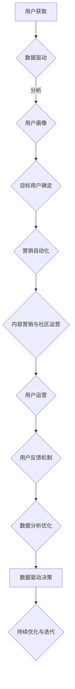
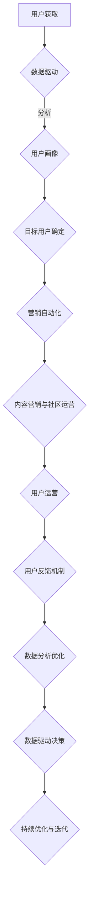

                 

### 文章标题

《AI创业公司的用户增长黑客：病毒式传播、裂变营销与用户运营》

### 关键词

- AI创业公司
- 用户增长策略
- 病毒式传播
- 裂变营销
- 用户运营
- 数据驱动增长

### 摘要

本文深入探讨了AI创业公司在用户增长方面的策略和实践。文章首先介绍了用户增长黑客的概念和核心要素，分析了用户增长黑客与传统营销的差异及其在不同行业的应用场景。随后，文章重点阐述了数据驱动增长策略、营销自动化、内容营销与社区运营等核心技术，详细解析了病毒式传播和裂变营销策略的原理、设计和实施方法。此外，文章还论述了用户运营的基本流程、用户反馈机制以及数据分析在用户增长中的应用。通过成功和失败的案例分析，文章总结了AI创业公司在用户增长战略规划中的关键要素和实施策略，为读者提供了实用性的指导和建议。本文旨在帮助AI创业公司理解和运用用户增长黑客策略，实现持续、健康、快速的用户增长。### 第一部分: AI创业公司的用户增长策略

在当今的数字化时代，用户增长已成为所有创业公司成功的关键因素之一，尤其是对于AI创业公司。AI技术的应用不仅改变了传统行业，也为创业公司提供了前所未有的增长机会。然而，AI创业公司往往面临着技术复杂、市场需求多变等挑战，因此，了解并运用用户增长黑客策略，是这些公司实现快速发展的关键。

#### 第1章: 用户增长黑客概述

**1.1 用户增长黑客的定义与核心要素**

用户增长黑客（Growth Hacker）是指利用技术和数据驱动的思维方式，通过创新的策略和手段，快速、低成本地获取和增加用户的一种专业人才。用户增长黑客的核心要素包括：

- **数据驱动：** 用户增长黑客依赖于数据分析，通过对用户行为和反馈的数据进行深入挖掘和分析，找到用户增长的关键驱动因素。
- **技术创新：** 通过技术创新，优化产品和服务的用户体验，提高用户留存率和转化率。
- **快速迭代：** 用户增长黑客采用敏捷的开发和迭代方法，快速测试和优化增长策略，以实现快速反馈和持续改进。

**1.2 用户增长黑客与传统营销的差异**

传统营销主要依赖于广告投放、促销活动和品牌建设等手段来吸引和保留用户。而用户增长黑客则更注重数据驱动的策略和快速实验，其核心差异在于：

- **以用户为中心：** 用户增长黑客将用户需求和行为置于核心位置，通过数据分析和用户反馈，优化产品和营销策略。
- **低成本高回报：** 用户增长黑客追求低成本的快速增长，通过创新的手段和策略，实现较高的投资回报率。
- **快速迭代：** 用户增长黑客采用敏捷的开发方法，快速测试和优化策略，以适应市场的快速变化。

**1.3 用户增长黑客在不同行业的应用场景**

用户增长黑客策略在不同行业中的应用场景有所不同，但其核心原则和关键要素具有普遍性。以下是用户增长黑客在不同行业中的应用场景：

- **互联网行业：** 互联网公司通过社交网络、内容营销、用户推荐等方式，快速获取和增加用户。
- **金融科技行业：** 金融科技公司通过用户数据分析、个性化推荐和金融产品创新，提高用户获取和留存。
- **医疗行业：** 医疗公司通过健康数据分析和个性化医疗方案，提高用户对产品和服务的依赖度。
- **教育行业：** 教育公司通过在线课程、学习社区和个性化推荐，增加用户参与度和黏性。

#### 第2章: 用户增长黑客的核心技术

**2.1 数据驱动增长策略**

数据驱动增长策略是用户增长黑客的核心技术之一。以下是其主要步骤：

- **用户数据分析基础：** 通过收集和分析用户行为数据，了解用户的需求和偏好，为增长策略提供依据。
- **用户画像构建：** 基于用户数据分析，构建详细的用户画像，为个性化营销和产品优化提供支持。
- **用户分群与目标用户确定：** 根据用户画像和市场需求，将用户分群，确定目标用户，为精准营销和用户运营提供基础。

**2.2 营销自动化**

营销自动化是用户增长黑客的重要手段。以下是其主要步骤：

- **营销自动化流程设计：** 设计自动化营销流程，实现用户触达、转化和留存的自动化。
- **自动化工具与平台介绍：** 介绍常见的自动化工具和平台，如HubSpot、Marketo等，帮助读者选择合适的工具。
- **自动化营销的效果评估：** 分析自动化营销的效果，评估其投资回报率，为持续优化提供依据。

**2.3 内容营销与社区运营**

内容营销和社区运营是用户增长黑客的重要组成部分。以下是其主要步骤：

- **内容营销策略：** 制定内容营销策略，包括内容创作、发布和传播，提高用户参与度和品牌认知度。
- **社区运营的核心理念：** 建立和维护健康、活跃的社区，为用户提供交流和分享的平台，增强用户黏性。
- **社区营销案例分析：** 分析成功的社区营销案例，学习其经验和方法，为自身社区运营提供参考。

#### 第3章: 病毒式传播策略

**3.1 病毒式传播的原理与机制**

病毒式传播是一种通过用户口碑效应，快速增加用户数量的策略。其原理和机制包括：

- **用户口碑效应：** 用户对产品和服务的满意度和推荐意愿，是病毒式传播的关键因素。
- **AARRR模型：** 通过AARRR模型（Acquisition、Activation、Retention、Revenue、Referral）分析用户生命周期，找到病毒式传播的关键节点。
- **病毒系数的计算与优化：** 通过计算病毒系数（病毒传播率），评估病毒式传播的效果，并持续优化策略。

**3.2 创造病毒式内容的策略**

创造病毒式内容是病毒式传播的核心。以下是其主要策略：

- **内容创意与传播策略：** 结合用户需求和兴趣，创作有趣、有价值、易传播的内容。
- **跨渠道传播策略：** 通过多渠道传播，扩大病毒式内容的影响范围，提高用户获取率。
- **病毒式传播案例分析：** 分析成功的病毒式传播案例，学习其创意、传播策略和效果，为自身病毒式传播提供参考。

#### 第4章: 裂变营销策略

**4.1 裂变营销的定义与核心要素**

裂变营销是一种通过用户邀请和分享，实现快速用户增长的策略。其核心要素包括：

- **定义：** 裂变营销是通过奖励机制，激励用户邀请其他用户使用产品或服务，实现用户数量的裂变式增长。
- **目标与策略：** 设定明确的目标，制定裂变营销策略，包括奖励机制设计、用户邀请流程优化等。
- **评估与优化：** 通过数据分析和效果评估，持续优化裂变营销策略，提高用户获取和留存效果。

**4.2 设计有效的裂变活动**

设计有效的裂变活动是裂变营销的关键。以下是其主要步骤：

- **裂变活动的策划与执行：** 制定详细的裂变活动策划方案，包括活动目标、奖励机制、执行步骤等。
- **裂变活动的案例解析：** 分析成功的裂变营销案例，学习其策划与执行经验，为自身裂变活动提供参考。
- **裂变活动的常见问题与解决策略：** 针对裂变活动中可能出现的问题，提出解决策略，确保活动顺利进行。

#### 第5章: 用户运营策略

**5.1 用户运营的基本流程**

用户运营是用户增长的重要组成部分。以下是其基本流程：

- **用户获取与留存策略：** 通过多种渠道获取用户，并制定留存策略，提高用户活跃度和忠诚度。
- **用户激活与转化策略：** 激活用户，引导用户完成目标行为，实现用户转化。
- **用户留存与满意度提升策略：** 通过持续的用户运营，提高用户留存率和满意度，实现长期发展。

**5.2 用户反馈机制与优化**

用户反馈是用户运营的重要环节。以下是其主要步骤：

- **用户反馈渠道的建立：** 建立多种用户反馈渠道，如在线问卷、社交媒体、用户论坛等。
- **用户反馈数据处理与分析：** 收集用户反馈数据，进行分类和分析，找到用户痛点和改进方向。
- **用户反馈优化策略：** 根据用户反馈，优化产品和服务，提高用户满意度和忠诚度。

#### 第6章: 数据驱动用户增长策略

**6.1 数据分析在用户增长中的应用**

数据分析在用户增长中具有重要作用。以下是其主要应用：

- **用户行为数据收集与分析：** 收集用户行为数据，如访问路径、点击率、转化率等，进行分析和挖掘。
- **用户留存与流失预测：** 通过数据分析，预测用户留存和流失风险，制定相应的运营策略。
- **数据驱动的用户运营策略优化：** 根据数据分析结果，优化用户运营策略，提高用户增长效果。

**6.2 实时数据监控与决策支持系统**

实时数据监控和决策支持系统是用户增长的重要工具。以下是其主要步骤：

- **实时数据监控平台建设：** 建立实时数据监控平台，实现数据的实时采集、处理和展示。
- **数据可视化与报表分析：** 通过数据可视化工具，展示关键指标和趋势，支持决策制定。
- **数据驱动的实时决策支持系统：** 建立数据驱动的实时决策支持系统，为运营决策提供依据。

#### 第7章: 案例分析

**7.1 成功的AI创业公司用户增长案例**

**7.2 失败的AI创业公司用户增长案例**

通过成功和失败的案例分析，总结AI创业公司在用户增长方面的经验和教训，为其他公司提供参考。

#### 第8章: AI创业公司的用户增长战略规划

**8.1 用户增长战略规划的重要性**

用户增长战略规划是AI创业公司发展的重要一环。以下是其重要性：

- **明确发展目标：** 用户增长战略规划帮助公司明确发展目标，制定具体的增长计划和策略。
- **优化资源配置：** 用户增长战略规划有助于优化资源配置，提高运营效率。
- **适应市场变化：** 用户增长战略规划能够帮助公司适应市场变化，及时调整增长策略。

**8.2 AI创业公司用户增长战略实施**

以下介绍AI创业公司用户增长战略的实施步骤：

- **战略实施的关键步骤：** 明确用户增长目标、制定增长策略、优化资源配置、实施增长计划等。
- **战略实施的难点与挑战：** 分析战略实施过程中可能遇到的难点和挑战，并提出相应的解决策略。
- **战略实施的常见问题与解决策略：** 总结战略实施过程中常见的难题，提出有效的解决策略。

**8.3 持续优化与迭代**

持续优化和迭代是用户增长战略的重要环节。以下是其主要步骤：

- **用户增长策略的持续优化：** 根据市场变化和用户需求，不断优化用户增长策略。
- **数据驱动的策略迭代：** 基于数据分析，实时调整和优化增长策略，提高用户增长效果。
- **用户增长战略的长远规划：** 制定长期用户增长战略，确保公司持续、健康、快速发展。

### 附录

附录部分提供了一些用户增长工具与资源，包括数据分析工具、营销自动化工具、社区运营平台以及其他用户增长相关资源，以供读者参考。

- **附录 A: 用户增长工具与资源**

  - **数据分析工具：** Google Analytics、Mixpanel、Tableau
  - **营销自动化工具：** HubSpot、Marketo、Pardot
  - **社区运营平台：** Slack、Reddit、Discord
  - **其他用户增长相关资源：** growthhackers.com、User Growth Academy、增长黑客实践指南

### Mermaid 流程图



### 伪代码示例

```python
# 用户增长黑客核心算法伪代码
function user_growth_hacker_algorithm(data, goals):
    # 数据预处理
    data_preprocessed = preprocess_data(data)
    
    # 构建用户画像
    user_profiles = build_user_profiles(data_preprocessed)
    
    # 确定目标用户
    target_users = determine_target_users(user_profiles, goals)
    
    # 实施营销自动化
    automation_results = implement_automation(target_users)
    
    # 内容营销与社区运营
    content_marketing_results = execute_content_marketing()
    community_operations_results = execute_community_operations()
    
    # 用户运营
    user_operations_results = execute_user_operations()
    
    # 用户反馈机制
    feedback_results = implement_feedback_mechanism()
    
    # 数据分析优化
    optimized_strategy = analyze_data(feedback_results)
    
    # 数据驱动决策
    decision_support = drive_decision_with_data(optimized_strategy)
    
    # 持续优化与迭代
    final_results = iterate_strategy(decision_support)
    
    return final_results
```

### 数学模型与公式

- **用户留存率公式**：

  $$L = \frac{N_t}{N_0} \times 100\%$$

  其中，$N_t$ 是时间段 $t$ 结束时仍活跃的用户数，$N_0$ 是初始用户数。

- **裂变系数公式**：

  $$F = \frac{N_2}{N_1} - 1$$

  其中，$N_1$ 是时间段 $t_1$ 结束时的用户数，$N_2$ 是时间段 $t_2$ 结束时的用户数。

### 项目实战

#### 实战1：用户画像构建

**环境搭建**：使用Python的pandas库处理用户数据。

**源代码实现**：

```python
import pandas as pd

# 加载用户数据
data = pd.read_csv('user_data.csv')

# 数据预处理
data = data.dropna()

# 构建用户画像
user_profiles = data.groupby('user_id').agg({
    'age': 'mean',
    'gender': 'first',
    'region': 'first',
    'last_active_date': 'max'
}).reset_index()

# 用户画像数据可视化
user_profiles.plot(kind='scatter', x='age', y='last_active_date')
```

#### 实战2：裂变活动设计

**环境搭建**：使用Python的numpy和matplotlib库进行数据分析与可视化。

**源代码实现**：

```python
import numpy as np
import matplotlib.pyplot as plt

# 裂变系数计算
initial_users = 1000
final_users = 2000
virus_coefficient = final_users / initial_users - 1

# 裂变活动效果预测
days = 30
users_per_day = virus_coefficient * (1 - np.exp(-0.1 * days))
plt.plot(range(days), users_per_day)
plt.xlabel('Days')
plt.ylabel('Number of Users')
plt.title('Viral Growth Prediction')
plt.show()
```

### 最佳实践 tips、小结、注意事项、拓展阅读等内容

- **最佳实践 tips**：在实际操作中，要密切关注用户需求和反馈，不断调整和优化增长策略。同时，要善于利用数据分析工具，深入了解用户行为和偏好，以提高用户增长效果。

- **小结**：用户增长黑客策略是AI创业公司实现快速发展的关键。通过数据驱动、技术创新和快速迭代，企业可以低成本、高回报地获取和增加用户，实现持续、健康、快速的增长。

- **注意事项**：在实施用户增长策略时，要充分考虑市场环境和用户需求，避免盲目跟风和过度依赖单一手段。同时，要注重用户隐私和数据安全，遵循相关法律法规。

- **拓展阅读**：读者可以进一步了解以下相关主题：
  - 《增长黑客：如何不花钱实现用户增长》
  - 《数据分析实战：从数据到洞察》
  - 《内容营销实战：策略、执行与评估》
  - 《人工智能：一种现代方法》

通过本文的深入探讨，希望读者能够更好地理解用户增长黑客策略，并在实际操作中运用这些策略，助力AI创业公司实现持续、健康、快速的用户增长。作者：AI天才研究院/AI Genius Institute & 禅与计算机程序设计艺术 /Zen And The Art of Computer Programming### 第1章: 用户增长黑客概述

在现代商业环境中，用户增长黑客（Growth Hacker）的概念已经逐渐成为企业竞争的重要武器。特别是在AI创业公司中，用户增长黑客策略被广泛应用于实现快速、低成本的用户增长。这一章将详细介绍用户增长黑客的定义、核心要素、与传统营销的差异，以及在不同行业的应用场景。

#### 1.1 用户增长黑客的定义与核心要素

用户增长黑客是一种以数据驱动、技术创新和快速迭代为核心的方法论，其目的是通过创新的手段和策略，快速、低成本地获取和增加用户。用户增长黑客的核心要素包括以下几点：

1. **数据驱动**：用户增长黑客依赖于数据分析和用户行为洞察，通过数据来指导决策和优化策略。数据分析是用户增长黑客的基础，通过对用户行为、用户需求和反馈的数据进行深入挖掘和分析，找到用户增长的关键驱动因素。

2. **技术创新**：用户增长黑客通过技术创新，优化产品和服务的用户体验，提高用户留存率和转化率。技术创新包括产品功能优化、用户体验设计、营销工具开发等，这些创新手段有助于提高用户满意度和忠诚度。

3. **快速迭代**：用户增长黑客采用敏捷的开发和迭代方法，快速测试和优化增长策略。快速迭代有助于企业及时响应市场变化和用户需求，不断优化和调整增长策略，实现持续的用户增长。

#### 1.2 用户增长黑客与传统营销的差异

传统营销主要依赖于广告投放、促销活动和品牌建设等手段来吸引和保留用户。而用户增长黑客则更注重数据驱动的策略和快速实验，其核心差异在于：

1. **以用户为中心**：用户增长黑客将用户需求和行为置于核心位置，通过数据分析和用户反馈，优化产品和营销策略。传统营销则更多地关注品牌宣传和市场份额。

2. **低成本高回报**：用户增长黑客追求低成本的快速增长，通过创新的手段和策略，实现较高的投资回报率。传统营销则往往需要较高的预算和较长的周期来获得效果。

3. **快速迭代**：用户增长黑客采用敏捷的开发方法，快速测试和优化策略，以适应市场的快速变化。传统营销则更多地依赖长期规划和持续投资。

#### 1.3 用户增长黑客在不同行业的应用场景

用户增长黑客策略在不同行业中的应用场景有所不同，但其核心原则和关键要素具有普遍性。以下是用户增长黑客在不同行业中的应用场景：

1. **互联网行业**：互联网公司通过社交网络、内容营销、用户推荐等方式，快速获取和增加用户。例如，通过社交媒体广告、KOL营销、内容营销等手段，提高品牌知名度和用户参与度。

2. **金融科技行业**：金融科技公司通过用户数据分析、个性化推荐和金融产品创新，提高用户获取和留存。例如，通过大数据风控、智能投顾、金融产品推荐等手段，提高用户满意度和忠诚度。

3. **医疗行业**：医疗公司通过健康数据分析和个性化医疗方案，提高用户对产品和服务的依赖度。例如，通过智能问诊、健康监测、个性化治疗方案等手段，提高用户黏性和品牌认知度。

4. **教育行业**：教育公司通过在线课程、学习社区和个性化推荐，增加用户参与度和黏性。例如，通过在线教育平台、学习社群、个性化推荐等手段，提高用户满意度和留存率。

总之，用户增长黑客策略是一种以数据驱动、技术创新和快速迭代为核心的方法论，适用于各个行业。通过深入挖掘用户需求和优化用户体验，企业可以实现快速、低成本的用户增长，提高市场竞争力。在本章的后续内容中，我们将进一步探讨用户增长黑客的核心技术，包括数据驱动增长策略、营销自动化、内容营销与社区运营等，帮助AI创业公司实现持续、健康、快速的用户增长。### 第2章: 用户增长黑客的核心技术

在用户增长黑客的实践中，核心技术是确保企业能够以低成本、高效能实现用户增长的关键。这一章将详细介绍用户增长黑客的核心技术，包括数据驱动增长策略、营销自动化、内容营销与社区运营。通过理解并应用这些技术，AI创业公司可以构建一个强大的用户增长体系。

#### 2.1 数据驱动增长策略

数据驱动增长策略是用户增长黑客的核心。它依赖于对用户数据的深入分析，以便更好地理解用户行为、需求和偏好，从而优化产品和营销策略。

##### 2.1.1 用户数据分析基础

用户数据分析的基础在于收集、处理和分析用户数据。以下是一些关键步骤：

1. **数据收集**：通过网站分析工具（如Google Analytics）、API接口、用户反馈和调查等方式，收集用户行为数据、访问数据、反馈数据等。

2. **数据处理**：使用数据清洗技术，确保数据的准确性和一致性。这通常包括去除重复数据、填补缺失值、标准化数据等。

3. **数据存储**：将处理后的数据存储在数据仓库或数据库中，以便进行进一步的分析和处理。

4. **数据分析**：使用数据分析工具（如Python、R、SQL等）对用户数据进行分析，提取有价值的信息和洞察。数据分析可能包括用户分群、行为模式识别、用户留存预测等。

##### 2.1.2 用户画像构建

用户画像是一种将用户信息进行结构化、可视化的方法，它有助于企业更好地理解用户特征和行为模式。构建用户画像的步骤如下：

1. **特征提取**：根据业务需求和数据来源，提取用户的特征信息，如年龄、性别、地理位置、兴趣爱好、行为习惯等。

2. **数据整合**：将不同来源的数据进行整合，形成一个完整的用户画像。

3. **数据可视化**：使用图表、仪表盘等可视化工具，展示用户画像的关键指标和特征，便于分析和决策。

##### 2.1.3 用户分群与目标用户确定

用户分群是数据驱动增长策略的重要环节。通过将用户根据不同的特征和行为模式进行分组，企业可以针对不同的用户群体制定个性化的营销策略。

1. **分群标准**：确定分群的标准，如用户年龄、性别、地理位置、行为习惯、消费水平等。

2. **分群分析**：根据分群标准，对用户数据进行分群分析，了解每个群体的特征和行为模式。

3. **目标用户确定**：根据分群分析和业务目标，确定目标用户群体，为后续的营销和运营提供方向。

#### 2.2 营销自动化

营销自动化是通过技术手段，自动化执行营销活动的过程。它有助于提高营销效率，降低成本，并实现更精准的营销。

##### 2.2.1 营销自动化流程设计

设计营销自动化流程是实施营销自动化的第一步。以下是一个典型的营销自动化流程：

1. **目标设定**：明确营销自动化的目标，如提高用户参与度、提升转化率、增加销售额等。

2. **流程设计**：设计营销自动化流程，包括触发条件、自动化行动、跟踪和分析等环节。

3. **自动化工具选择**：选择合适的营销自动化工具（如HubSpot、Marketo、Pardot等），根据工具的特性进行流程设计。

4. **测试与优化**：测试自动化流程，确保其正常运行，并根据测试结果进行优化。

##### 2.2.2 自动化工具与平台介绍

市面上有许多营销自动化工具和平台，以下是一些常用的工具：

1. **HubSpot**：提供全面的营销自动化功能，包括邮件营销、社交媒体管理、客户关系管理（CRM）等。

2. **Marketo**：强大的营销自动化平台，适用于大型企业，提供个性化的营销活动和客户管理功能。

3. **Pardot**：专注于B2B营销自动化，提供高级的营销功能，如营销自动化、客户生命周期管理、数据分析等。

##### 2.2.3 自动化营销的效果评估

评估自动化营销的效果是优化策略的重要步骤。以下是一些关键指标和评估方法：

1. **关键指标**：包括转化率、打开率、点击率、响应率、客户获取成本（CAC）等。

2. **数据分析**：通过数据分析工具，分析自动化营销活动的效果，了解哪些环节存在问题，需要优化。

3. **测试与迭代**：定期进行A/B测试，对比不同营销策略的效果，持续优化自动化营销流程。

#### 2.3 内容营销与社区运营

内容营销和社区运营是用户增长黑客的重要组成部分。通过创造有价值的内容和建立健康的社区，企业可以吸引和保留用户。

##### 2.3.1 内容营销策略

内容营销策略的核心是创作和传播有价值的内容，以吸引和留住用户。以下是一些关键步骤：

1. **内容规划**：根据用户需求和业务目标，制定内容规划，明确内容类型、主题、发布频率等。

2. **内容创作**：创作高质量的内容，包括文章、视频、图表、图片等多种形式，以满足用户需求。

3. **内容发布与传播**：选择合适的发布渠道（如博客、社交媒体、邮件等），并利用SEO、SEM等手段提高内容的可见性。

##### 2.3.2 社区运营的核心理念

社区运营的核心理念是建立和维护一个健康、活跃的社区，为用户提供交流和分享的平台。以下是一些关键点：

1. **用户参与**：鼓励用户参与社区讨论，提高用户粘性。

2. **互动管理**：及时回复用户提问和反馈，解决用户问题，提高用户满意度。

3. **内容管理**：定期发布高质量的内容，吸引更多用户参与。

##### 2.3.3 社区营销案例分析

成功的社区营销案例可以为其他企业提供宝贵的经验。以下是一些成功的社区营销案例：

1. **案例1：Facebook**：Facebook通过建立全球最大的社交媒体平台，吸引了数十亿用户，成为全球最大的社区之一。

2. **案例2：Reddit**：Reddit通过开放平台，鼓励用户创建和分享内容，建立了庞大而活跃的用户社区。

3. **案例3：Dribbble**：Dribbble通过建立设计师社区，为设计师提供展示作品和交流的平台，吸引了大量的设计师用户。

通过以上对数据驱动增长策略、营销自动化、内容营销与社区运营的介绍，AI创业公司可以构建一个全面的用户增长体系。这些核心技术的有效应用，将有助于企业在激烈的市场竞争中脱颖而出，实现持续、健康、快速的用户增长。### 第3章: 病毒式传播策略

病毒式传播（Viral Marketing）是一种利用用户的口碑效应，通过用户之间的传播，实现快速、低成本的用户增长策略。这种策略的核心在于创造具有高度传播性的内容和设计有效的传播机制。本章将详细介绍病毒式传播的原理与机制，创造病毒式内容的策略，以及跨渠道传播策略和病毒式传播案例分析。

#### 3.1 病毒式传播的原理与机制

病毒式传播的原理是基于用户的口碑效应，即一个满意的用户通过分享，将产品或信息传递给其他潜在用户。这种传播具有以下特点：

- **高度传播性**：病毒式传播的内容具有很强的吸引力，能够迅速在社交网络和用户之间传播。
- **低成本**：病毒式传播利用用户的社交网络，通过口碑效应实现传播，不需要大量的广告投入。
- **高回报**：通过用户自发的传播，病毒式传播能够带来大量的潜在用户，实现低成本高回报的增长。

病毒式传播的机制包括以下几个方面：

1. **用户口碑效应**：满意的用户愿意分享产品或信息，从而将产品或信息传播给其他用户。
2. **分享激励机制**：通过设计分享激励机制（如奖励、折扣等），鼓励用户分享产品或信息。
3. **内容创意**：创造具有高度传播性的内容，如幽默、感人、有价值等，吸引用户分享。
4. **传播渠道**：利用社交媒体、邮件、短信等多种渠道，扩大传播范围。

#### 3.1.1 用户口碑效应

用户口碑效应是病毒式传播的核心。满意的用户通过分享产品或信息，能够吸引其他潜在用户。以下因素会影响用户口碑效应：

- **产品质量**：高质量的产品或服务能够提高用户满意度，从而增强口碑效应。
- **用户体验**：良好的用户体验能够提高用户对产品的满意度，增加分享意愿。
- **分享激励机制**：通过奖励、折扣等激励机制，鼓励用户分享产品或信息。
- **社交影响力**：具有一定社交影响力的人（如KOL、网红等）的分享，能够扩大传播范围和影响力。

#### 3.1.2 AARRR模型

AARRR模型（Acquisition、Activation、Retention、Revenue、Referral）是一种用于分析用户生命周期的模型，它可以帮助企业了解用户在不同阶段的行为，优化病毒式传播策略。

- **Acquisition（获取）**：吸引用户新增，通过广告、社交媒体、推荐等手段获取新用户。
- **Activation（激活）**：引导新用户完成关键行为（如注册、下载、试用等），提高激活率。
- **Retention（留存）**：提高用户留存率，通过提供优质内容、良好用户体验等手段，增加用户对产品的依赖度。
- **Revenue（收入）**：提高用户购买转化率，通过优惠活动、会员制度等手段，增加用户消费。
- **Referral（推荐）**：鼓励用户推荐新用户，通过奖励机制，提高用户分享意愿。

#### 3.1.3 病毒系数的计算与优化

病毒系数（Viral Coefficient）是衡量病毒式传播效果的关键指标，表示每个用户平均能够带来多少新用户。计算公式为：

$$
Viral\ Coefficient = \frac{N_2}{N_1} - 1
$$

其中，$N_1$ 是初始用户数，$N_2$ 是最终用户数。

为了优化病毒系数，企业可以采取以下策略：

- **提高用户满意度**：通过提高产品质量和用户体验，增强用户满意度，提高分享意愿。
- **优化分享激励机制**：设计具有吸引力的分享激励机制，鼓励用户分享。
- **跨渠道传播**：通过多种渠道（如社交媒体、电子邮件、短信等）扩大传播范围。
- **内容创意**：创造具有高度传播性的内容，吸引用户关注和分享。

#### 3.2 创造病毒式内容的策略

创造具有高度传播性的内容是病毒式传播成功的关键。以下是一些策略：

##### 3.2.1 内容创意与传播策略

1. **幽默和情感**：幽默和情感化的内容容易吸引用户关注和分享，如搞笑视频、感人故事等。
2. **实用价值**：提供具有实用价值的内容，如教程、工具、技巧等，能够吸引目标用户。
3. **互动性**：设计互动性强的内容，如互动游戏、问答等，提高用户参与度。
4. **个性化**：根据用户兴趣和需求，提供个性化的内容，增加用户共鸣。

##### 3.2.2 跨渠道传播策略

跨渠道传播是扩大病毒式内容传播范围的重要手段。以下是一些策略：

1. **社交媒体**：利用Facebook、Twitter、Instagram等社交媒体平台，发布病毒式内容，提高内容曝光率。
2. **电子邮件**：通过电子邮件发送病毒式内容，吸引潜在用户关注和分享。
3. **短信**：利用短信平台发送简短、有吸引力的信息，引导用户关注病毒式内容。
4. **在线广告**：在相关网站和社交媒体上投放广告，吸引目标用户点击和分享。

##### 3.2.3 病毒式传播案例分析

成功的病毒式传播案例可以提供宝贵的经验。以下是一些经典的病毒式传播案例：

1. **案例1：谷歌地图的“失踪的地图”**：谷歌地图通过创建一个“失踪的地图”活动，鼓励用户分享并寻找失踪的地图区域。这个活动在短时间内迅速传播，吸引了大量用户参与。

2. **案例2：Dollar Shave Club**：Dollar Shave Club发布了一支幽默的病毒视频，介绍了他们的剃须产品。这个视频在YouTube上迅速传播，吸引了大量新用户，实现了快速增长。

3. **案例3：Dropbox**：Dropbox通过提供免费的云存储空间，鼓励用户邀请朋友使用，从而扩大用户基础。这个策略在短时间内带来了大量用户增长。

通过以上策略和案例，AI创业公司可以创造具有高度传播性的内容，并设计有效的传播机制，实现病毒式传播，从而快速、低成本地增加用户。### 第4章: 裂变营销策略

裂变营销（Fission Marketing）是一种通过用户邀请和分享，实现快速用户增长的策略。它通过奖励机制激励现有用户邀请其他用户使用产品或服务，从而实现用户数量的裂变式增长。本章将详细介绍裂变营销的定义与核心要素，与传统促销的区别，裂变营销的目标与策略，以及评估与优化方法。

#### 4.1 裂变营销的定义与核心要素

裂变营销是一种基于用户邀请和分享的营销策略，旨在通过现有用户的推广，吸引新用户并实现用户数量的快速增长。其核心要素包括：

1. **用户邀请**：通过激励措施，鼓励现有用户邀请其他用户使用产品或服务。
2. **分享激励机制**：为邀请者和被邀请者提供奖励，如优惠券、积分、免费试用等，增加用户参与度。
3. **用户裂变**：通过用户的邀请和分享，实现用户数量的裂变式增长。

裂变营销的核心在于建立一种用户自发传播的机制，通过用户的口碑效应，实现快速、低成本的用户增长。

#### 4.1.1 裂变营销与传统促销的区别

裂变营销与传统促销在目标和手段上存在显著差异：

1. **目标**：传统促销主要目标是刺激消费者即时购买，而裂变营销的目标是激励用户参与并推广产品或服务，实现用户自传播。
2. **手段**：传统促销通常依赖于广告、优惠券、折扣等手段，而裂变营销则通过用户邀请和分享机制，利用社交网络和用户的口碑效应。
3. **成本**：传统促销往往需要较大的广告投入，而裂变营销主要通过用户自发传播，实现低成本快速增长。

#### 4.1.2 裂变营销的目标与策略

裂变营销的目标是实现用户数量的快速增长，提升品牌知名度和用户黏性。以下是一些核心策略：

1. **用户邀请策略**：通过设计简单易用的邀请流程，鼓励用户邀请朋友使用产品或服务。例如，通过发送邀请链接、分享按钮等方式，降低用户邀请的门槛。

2. **分享激励机制**：为邀请者和被邀请者提供奖励，增加用户参与度。奖励可以是优惠券、积分、免费试用、现金返利等，根据产品和用户群体的特点进行选择。

3. **用户裂变策略**：通过建立用户裂变机制，实现用户数量的快速增长。例如，通过设置邀请人数的层级奖励，激励用户不断邀请新用户。

4. **传播渠道**：利用多种传播渠道，如社交媒体、电子邮件、短信等，扩大传播范围，提高用户参与度。

#### 4.1.3 裂变营销的评估与优化

评估裂变营销的效果是优化策略的重要步骤。以下是一些关键指标和评估方法：

1. **关键指标**：包括邀请率、转化率、分享率、用户增长率等。通过这些指标，评估裂变营销的效果和ROI（投资回报率）。

2. **数据分析**：通过数据分析工具，分析用户邀请和分享行为，了解用户参与度和传播效果。例如，分析用户邀请的频率、来源、转化率等。

3. **测试与迭代**：定期进行A/B测试，对比不同裂变营销策略的效果，优化邀请流程、奖励机制和传播渠道。

4. **用户反馈**：收集用户反馈，了解用户对裂变营销活动的看法和体验，为持续优化提供依据。

#### 4.2 设计有效的裂变活动

设计有效的裂变活动是裂变营销成功的关键。以下是一些关键步骤：

1. **明确目标**：明确裂变活动的目标，如增加用户数量、提高用户活跃度、提升品牌知名度等。

2. **设计邀请流程**：设计简单易用的邀请流程，降低用户参与的门槛。例如，提供一键分享、邀请链接等功能。

3. **设置奖励机制**：根据产品和用户群体的特点，设置具有吸引力的奖励机制，如优惠券、积分、免费试用等。

4. **选择传播渠道**：选择合适的传播渠道，如社交媒体、电子邮件、短信等，扩大传播范围。

5. **宣传推广**：通过宣传推广活动，提高用户对裂变活动的关注度和参与度。

6. **监控与反馈**：实时监控裂变活动的效果，收集用户反馈，为持续优化提供依据。

#### 4.2.1 裂变活动的策划与执行

裂变活动的策划与执行是裂变营销的核心步骤。以下是一些关键要点：

1. **策划**：制定详细的裂变活动策划方案，包括活动目标、奖励机制、执行步骤、时间安排等。

2. **执行**：按照策划方案，执行裂变活动。确保活动流程顺畅，及时处理用户问题。

3. **监控**：实时监控活动效果，通过数据分析工具，了解用户邀请、转化、分享等行为。

4. **反馈**：收集用户反馈，了解用户对活动的看法和体验，为优化和改进提供依据。

#### 4.2.2 裂变活动的案例解析

以下是一个成功的裂变活动案例：

**案例：Dropbox的裂变活动**

Dropbox通过邀请好友奖励免费空间，实现了快速用户增长。用户邀请好友注册后，双方都能获得额外的免费空间。这个活动在短时间内吸引了大量新用户，实现了用户数量的快速增长。

**分析**：

1. **目标明确**：Dropbox明确目标是增加用户数量和提升品牌知名度。
2. **邀请流程简单**：用户邀请好友注册流程简单易懂，易于操作。
3. **奖励机制有吸引力**：提供额外的免费空间，具有很高的吸引力。
4. **传播渠道广泛**：通过社交媒体、电子邮件等多种渠道，扩大传播范围。

#### 4.2.3 裂变活动的常见问题与解决策略

在裂变活动中，常见的问题包括：

1. **用户参与度低**：解决策略是优化邀请流程和奖励机制，提高用户的参与意愿。
2. **用户流失**：解决策略是提高产品和服务质量，增强用户黏性。
3. **奖励机制不公平**：解决策略是确保奖励机制公平合理，避免引发用户不满。

通过以上策略和案例分析，AI创业公司可以设计并执行有效的裂变活动，实现快速、低成本的用户增长。### 第5章: 用户运营策略

用户运营（User Operations）是AI创业公司实现用户增长和业务成功的关键环节。有效的用户运营策略能够提高用户满意度和忠诚度，促进用户生命周期各阶段的转化，从而实现长期可持续的用户增长。本章将详细介绍用户运营的基本流程，包括用户获取与留存策略、用户激活与转化策略、用户留存与满意度提升策略，以及用户反馈机制与优化。

#### 5.1 用户运营的基本流程

用户运营的基本流程包括以下几个关键环节：

1. **用户获取**：通过各种渠道吸引新用户，包括广告、营销活动、社交媒体推广、口碑传播等。
2. **用户留存**：通过优化用户体验和服务，提高用户对产品的依赖度和忠诚度，减少用户流失。
3. **用户激活**：引导新用户完成关键行为，如注册、下载、试用等，使其成为活跃用户。
4. **用户转化**：促进用户从免费用户转化为付费用户，实现业务收益。
5. **用户满意度**：通过持续的用户满意度调查和反馈，优化产品和服务，提高用户满意度和忠诚度。
6. **用户反馈**：建立用户反馈机制，收集用户意见和建议，不断改进产品和服务。

#### 5.1.1 用户获取与留存策略

用户获取与留存策略是用户运营的基础。以下是一些关键策略：

1. **目标用户定位**：明确目标用户群体，了解他们的需求和行为习惯，制定有针对性的获取策略。
2. **多渠道推广**：通过搜索引擎优化（SEO）、搜索引擎营销（SEM）、社交媒体营销、内容营销等多种渠道，吸引潜在用户。
3. **用户体验优化**：优化产品和服务体验，提高用户满意度和留存率。包括界面设计、功能完善、客服支持等。
4. **用户教育**：通过教育性内容（如教程、使用指南、案例分析等），帮助用户更好地了解和使用产品，增加用户黏性。
5. **忠诚度计划**：设计会员制度、积分奖励、VIP服务等多种忠诚度计划，激励用户持续使用产品。

#### 5.1.2 用户激活与转化策略

用户激活与转化策略是促进用户生命周期发展的重要环节。以下是一些关键策略：

1. **引导用户完成关键行为**：设计引导流程，引导新用户完成注册、下载、试用等关键行为，提高激活率。
2. **个性化推荐**：根据用户行为和偏好，提供个性化推荐，提高用户参与度和转化率。
3. **促销活动**：通过限时优惠、促销活动等，刺激用户购买行为，提高转化率。
4. **用户教育**：提供针对性的教育内容，帮助用户更好地理解和使用产品，提高用户满意度和忠诚度。
5. **用户反馈**：及时收集用户反馈，针对用户提出的问题和建议进行改进，提高用户满意度和转化率。

#### 5.1.3 用户留存与满意度提升策略

用户留存与满意度提升策略是用户运营的核心。以下是一些关键策略：

1. **持续优化用户体验**：不断改进产品和服务，优化用户界面、功能设计、客服支持等，提高用户满意度和忠诚度。
2. **用户满意度调查**：定期开展用户满意度调查，了解用户对产品和服务的不满意之处，及时采取措施改进。
3. **用户互动**：通过在线社区、用户论坛、社交媒体等渠道，与用户互动，建立良好的用户关系。
4. **用户激励**：设计会员制度、积分奖励、VIP服务等多种激励措施，激励用户持续使用产品。
5. **用户数据分析**：通过数据分析，了解用户行为和需求，为产品优化和营销策略提供依据。

#### 5.2 用户反馈机制与优化

用户反馈是优化产品和服务的重要依据。建立有效的用户反馈机制，能够帮助企业更好地了解用户需求，持续改进产品和服务。

1. **反馈渠道**：建立多种用户反馈渠道，如在线问卷、用户论坛、社交媒体、客服系统等，方便用户表达意见和建议。
2. **反馈收集**：及时收集和分析用户反馈，对用户提出的问题和建议进行分类和处理。
3. **反馈处理**：对用户反馈进行优先级排序，针对重要问题制定改进措施，及时向用户反馈处理结果。
4. **反馈优化**：根据用户反馈，持续优化产品和服务，提高用户满意度和忠诚度。

通过以上用户运营策略，AI创业公司可以构建一个高效的用户运营体系，实现用户获取、留存、激活、转化和满意度提升，从而实现长期可持续的用户增长。### 第6章: 数据驱动用户增长策略

在现代商业环境中，数据驱动已成为企业决策和运营的重要手段。对于AI创业公司来说，数据驱动用户增长策略尤为重要。通过深入分析用户数据，企业可以更好地了解用户行为和需求，从而制定更精准的用户增长策略。本章将详细介绍数据分析在用户增长中的应用，用户留存与流失预测，数据驱动的用户运营策略优化，以及实时数据监控与决策支持系统的构建。

#### 6.1 数据分析在用户增长中的应用

数据分析在用户增长中的应用非常广泛，主要包括以下方面：

1. **用户行为分析**：通过分析用户在产品或服务中的行为数据，如点击率、浏览路径、转化率等，了解用户的兴趣和行为模式，为优化产品功能和营销策略提供依据。

2. **用户分群**：根据用户行为和属性，将用户划分为不同的群体，以便实施有针对性的营销策略。例如，根据用户的活跃度、消费行为、地理位置等特征，将用户分为核心用户、潜在用户、流失用户等。

3. **用户留存与流失分析**：通过分析用户留存率和流失率，了解用户在不同生命周期阶段的行为特征，识别可能导致用户流失的原因，从而采取针对性的措施提高用户留存率。

4. **用户转化路径分析**：分析用户从接触到转化的整个过程，识别影响转化的关键因素，优化用户转化路径，提高转化率。

5. **营销效果分析**：通过分析不同营销渠道的效果，如广告投放、社交媒体营销、电子邮件营销等，了解各个渠道的投资回报率（ROI），优化营销预算和策略。

#### 6.1.1 用户行为数据收集与分析

用户行为数据的收集与分析是数据驱动用户增长策略的基础。以下是一些关键步骤：

1. **数据收集**：通过网站分析工具（如Google Analytics）、API接口、用户反馈等途径，收集用户在产品或服务中的行为数据。

2. **数据清洗**：对收集到的数据进行清洗和预处理，去除重复数据、缺失值和异常值，确保数据的质量。

3. **数据存储**：将处理后的数据存储在数据仓库或数据库中，以便进行进一步的分析和处理。

4. **数据分析**：使用数据分析工具（如Python、R、SQL等）对用户行为数据进行深入分析，提取有价值的信息和洞察。

5. **数据可视化**：通过数据可视化工具（如Tableau、Power BI等），将分析结果以图表、仪表盘等形式呈现，便于分析和决策。

#### 6.1.2 用户留存与流失预测

用户留存与流失预测是数据驱动用户增长策略的重要环节。以下是一些关键步骤：

1. **特征提取**：从用户行为数据中提取影响留存和流失的关键特征，如活跃度、使用频率、用户满意度等。

2. **数据建模**：使用机器学习算法（如逻辑回归、决策树、随机森林等）建立用户留存与流失预测模型。

3. **模型训练与优化**：使用历史数据训练模型，并对模型进行优化，提高预测准确率。

4. **预测与评估**：使用训练好的模型对当前用户进行留存与流失预测，并定期评估模型的预测效果。

5. **干预策略**：根据预测结果，采取针对性的干预措施，如提高用户满意度、提供个性化推荐、优化用户体验等，减少用户流失，提高用户留存率。

#### 6.1.3 数据驱动的用户运营策略优化

数据驱动的用户运营策略优化是持续提高用户增长效果的关键。以下是一些关键步骤：

1. **用户分群**：根据用户行为和属性，将用户划分为不同的群体，针对不同群体制定有针对性的运营策略。

2. **A/B测试**：通过A/B测试，对比不同运营策略的效果，找到最优策略。

3. **用户反馈**：收集用户反馈，了解用户对产品和服务的意见和建议，及时调整运营策略。

4. **数据监控**：建立实时数据监控体系，监控关键指标（如用户留存率、转化率等），及时发现问题和优化策略。

5. **迭代优化**：根据数据分析和用户反馈，不断调整和优化用户运营策略，提高用户增长效果。

#### 6.2 实时数据监控与决策支持系统

实时数据监控与决策支持系统是数据驱动用户增长策略的重要工具。以下是一些关键步骤：

1. **数据采集**：通过API接口、日志分析等手段，实时采集用户行为数据。

2. **数据处理**：对实时数据进行清洗、转换和存储，确保数据质量。

3. **实时分析**：使用实时数据分析工具（如Apache Kafka、Apache Flink等），对实时数据进行快速处理和分析。

4. **数据可视化**：通过数据可视化工具，将实时分析结果以图表、仪表盘等形式呈现，便于监控和决策。

5. **决策支持**：基于实时数据分析和用户反馈，提供决策支持，帮助企业制定和调整用户增长策略。

6. **自动化响应**：建立自动化响应机制，根据实时数据分析和用户行为，自动执行优化策略，提高用户增长效果。

通过以上数据驱动用户增长策略的构建和实施，AI创业公司可以更好地了解用户需求和行为，优化产品和服务，提高用户满意度和忠诚度，实现持续、健康、快速的用户增长。### 第7章: 案例分析

通过成功的AI创业公司用户增长案例和失败的AI创业公司用户增长案例的分析，我们可以更深入地了解用户增长策略的有效性和关键因素。以下将分别介绍两个案例，并从中总结经验和教训。

#### 7.1 成功的AI创业公司用户增长案例

**案例：OpenAI的GPT-3**

**背景介绍**：

OpenAI是一家专注于人工智能研究的创业公司，其GPT-3模型是一款具有高度智能的自然语言处理工具。GPT-3的推出引起了全球科技界的关注，用户数量迅速增长。

**用户增长策略分析**：

1. **数据驱动**：OpenAI通过不断优化GPT-3模型，确保其性能和用户体验。他们使用大量数据对模型进行训练和测试，确保模型能够提供高质量的输出。

2. **病毒式传播**：GPT-3具有高度的传播性，用户可以在自己的项目中应用GPT-3，并在社交媒体上分享成果。这种用户自传播的方式大大提高了GPT-3的知名度。

3. **社区运营**：OpenAI建立了活跃的GPT-3社区，鼓励用户交流心得、分享应用案例。这种社区运营的方式增强了用户的黏性，促进了用户增长。

4. **内容营销**：OpenAI发布了大量的技术博客、教程和案例分析，帮助用户更好地理解和应用GPT-3。这些内容不仅提高了用户对GPT-3的认可度，也吸引了更多的潜在用户。

**案例的启示与总结**：

OpenAI的案例表明，数据驱动、病毒式传播、社区运营和内容营销是成功用户增长的关键。通过不断优化产品、利用用户自传播和建立强大的社区，企业可以实现快速、低成本的用户增长。

#### 7.2 失败的AI创业公司用户增长案例

**案例：某AI图像识别公司**

**背景介绍**：

某AI图像识别公司开发了一款图像识别工具，但由于用户增长缓慢，最终未能实现预期的商业成功。

**用户增长策略分析**：

1. **缺乏数据驱动**：公司未能充分利用数据分析和用户反馈，导致产品优化滞后，用户体验不佳。

2. **缺乏病毒式传播**：公司未设计有效的病毒式传播策略，用户主要依赖广告和推广，用户获取成本较高。

3. **社区运营不足**：公司未建立有效的社区运营机制，用户之间的交流和支持不足，用户黏性较低。

4. **内容营销不足**：公司未发布足够的内容营销材料，用户难以了解产品的实际应用和价值。

**案例的反思与教训**：

该案例表明，数据驱动、病毒式传播、社区运营和内容营销对于用户增长至关重要。缺乏这些要素可能导致产品无法获得足够的用户认可，最终影响商业成功。企业在用户增长策略的制定和实施过程中，需要充分考虑这些因素，以实现有效的用户增长。

通过以上案例的分析，我们可以看到，成功的AI创业公司在用户增长方面具有以下共同点：

1. **数据驱动**：充分利用数据分析，优化产品和服务，提高用户体验。
2. **病毒式传播**：设计有效的病毒式传播策略，降低用户获取成本，实现快速用户增长。
3. **社区运营**：建立健康的社区，增强用户黏性，促进用户增长。
4. **内容营销**：发布高质量的内容，提高用户对产品的认可度和使用意愿。

而失败的AI创业公司则往往在这些方面存在不足。通过总结这些经验和教训，AI创业公司可以更好地制定和实施用户增长策略，实现快速、健康、持续的用户增长。### 第8章: AI创业公司的用户增长战略规划

用户增长战略规划是AI创业公司实现长期成功的关键。有效的用户增长战略能够帮助企业明确发展目标、优化资源配置、适应市场变化，从而实现持续、健康、快速的用户增长。本章将详细探讨用户增长战略规划的重要性、制定原则、规划流程、评估与调整方法，以及战略实施和持续优化的关键步骤。

#### 8.1 用户增长战略规划的重要性

用户增长战略规划对于AI创业公司的重要性体现在以下几个方面：

1. **明确发展目标**：用户增长战略规划有助于企业明确发展目标，制定具体的增长计划和策略。这有助于企业集中资源和精力，实现关键业务的优先发展。

2. **优化资源配置**：用户增长战略规划能够帮助企业合理配置资源，包括人力、资金、技术等，确保资源的高效利用，提高投资回报率。

3. **适应市场变化**：市场环境多变，用户需求不断变化。用户增长战略规划能够帮助企业及时调整增长策略，适应市场变化，抓住发展机遇。

4. **提高竞争力**：通过有效的用户增长战略规划，企业可以提升市场竞争力，增加用户黏性，提高品牌知名度和市场份额。

#### 8.1.1 用户增长战略的制定原则

制定用户增长战略时，应遵循以下原则：

1. **以用户为中心**：用户是企业的核心，战略制定应充分考虑用户需求和行为，确保产品和服务的用户体验。

2. **数据驱动**：数据是战略决策的基础。企业应充分利用数据分析，了解用户行为和需求，为战略制定提供科学依据。

3. **创新导向**：用户增长战略应鼓励创新，采用新技术、新手段和新模式，以提高用户获取和留存效果。

4. **可持续性**：用户增长战略应具备可持续性，确保企业在长期发展中保持竞争力。

5. **灵活性**：战略应具有灵活性，能够根据市场变化和用户需求进行调整，以适应不断变化的环境。

#### 8.1.2 用户增长战略的规划流程

用户增长战略的规划流程包括以下几个关键步骤：

1. **市场分析**：分析市场环境，包括市场规模、竞争对手、用户需求等，为战略制定提供背景信息。

2. **目标设定**：明确企业的发展目标，如用户数量、市场份额、业务增长等，确保目标具有可衡量性和可实现性。

3. **策略制定**：根据市场分析和目标设定，制定具体的用户增长策略，包括数据驱动增长策略、营销自动化策略、内容营销策略等。

4. **资源配置**：根据战略需求，合理配置资源，包括人力、资金、技术等，确保战略的有效实施。

5. **风险评估**：识别战略实施过程中可能遇到的风险，制定应对措施，降低风险影响。

6. **制定计划**：制定详细的实施计划，包括时间表、任务分配、监控指标等，确保战略的有序推进。

7. **评估与调整**：定期评估战略实施效果，根据市场变化和用户需求，及时调整战略，确保其持续有效。

#### 8.1.3 用户增长战略的评估与调整

用户增长战略的评估与调整是确保战略有效性的关键。以下是一些关键步骤：

1. **关键指标监控**：定期监控关键指标（如用户增长率、转化率、留存率等），评估战略实施效果。

2. **数据驱动分析**：通过数据分析，识别战略实施中的问题和瓶颈，为调整提供依据。

3. **用户反馈收集**：收集用户反馈，了解用户对产品和服务的满意度和意见，及时调整战略。

4. **市场变化监测**：密切关注市场变化，及时调整战略，以适应新的市场环境。

5. **A/B测试**：通过A/B测试，对比不同战略策略的效果，优化战略组合。

#### 8.2 AI创业公司用户增长战略实施

用户增长战略的实施是确保战略目标实现的关键。以下是一些关键步骤：

1. **明确职责和任务**：明确各部门和团队成员的职责和任务，确保战略实施有序进行。

2. **资源协调**：确保资源的合理配置和协调，包括人力、资金、技术等，为战略实施提供支持。

3. **培训与支持**：为团队成员提供必要的培训和支持，确保他们具备实施战略的能力。

4. **监控与评估**：建立监控与评估机制，实时跟踪战略实施进度和效果，及时调整和优化策略。

5. **沟通与协作**：加强各部门和团队成员之间的沟通与协作，确保战略实施的顺利进行。

#### 8.2.1 战略实施的关键步骤

1. **制定详细的实施计划**：明确战略实施的时间表、任务分配和监控指标，确保战略实施有序进行。

2. **组织协调**：确保各部门和团队成员之间的沟通和协作，协调资源，确保战略实施的顺利进行。

3. **培训和推广**：为团队成员提供培训和支持，确保他们了解和掌握战略实施的方法和技巧。

4. **数据监控**：建立数据监控体系，实时跟踪关键指标，评估战略实施效果。

5. **问题解决**：及时识别和解决战略实施过程中遇到的问题，确保战略的顺利推进。

#### 8.2.2 战略实施的难点与挑战

1. **资源限制**：用户增长战略实施需要大量的资源投入，如人力、资金、技术等。企业在资源有限的情况下，需要合理配置资源，确保战略的有效实施。

2. **市场变化**：市场环境多变，用户需求不断变化。企业需要密切关注市场变化，及时调整战略，以适应新的市场环境。

3. **团队协作**：战略实施涉及多个部门和团队，需要有效的沟通和协作。企业需要建立良好的团队协作机制，确保战略实施的顺利进行。

4. **数据驱动**：用户增长战略的实施需要依赖数据分析，企业需要具备数据分析能力和数据驱动思维，以确保战略的有效性。

#### 8.2.3 战略实施的常见问题与解决策略

1. **资源不足**：解决策略是合理配置资源，提高资源利用率，确保战略实施所需的关键资源得到充分保障。

2. **市场变化**：解决策略是建立市场监测机制，及时了解市场动态，调整战略以适应市场变化。

3. **团队协作**：解决策略是建立有效的团队协作机制，加强沟通与协作，确保战略实施的顺利进行。

4. **数据不足**：解决策略是加强数据收集和分析，提高数据分析能力，为战略实施提供科学依据。

通过以上战略规划的实施，AI创业公司可以构建一个高效的用户增长体系，实现持续、健康、快速的用户增长，为企业的长期发展奠定坚实基础。### 附录A：用户增长工具与资源

在AI创业公司的用户增长过程中，利用适当的工具和资源可以大大提升效率和效果。以下是一些常用的用户增长工具和资源，涵盖了数据分析、营销自动化、社区运营等多个方面。

#### A.1 数据分析工具

- **Google Analytics**：用于网站和移动应用的用户行为分析，提供详细的访问数据、用户流量和转化率等。

- **Mixpanel**：专注于用户行为分析的实时数据分析平台，提供用户分群、留存率分析等高级功能。

- **Tableau**：数据可视化工具，可以将复杂的数据转化为直观的图表和仪表盘，便于决策分析。

- **Segment**：数据收集和整合工具，可以将不同来源的数据汇聚到一个平台上进行分析。

- **DataCamp**：在线学习平台，提供数据分析相关的课程和教程，适合数据分析新手和专业人士。

#### A.2 营销自动化工具

- **HubSpot**：提供全面的营销自动化功能，包括电子邮件营销、内容管理、客户关系管理（CRM）等。

- **Marketo**：专业的营销自动化平台，适用于大型企业，提供个性化的营销活动和客户管理功能。

- **Pardot**：专注于B2B营销自动化，提供高级的营销功能，如营销自动化、客户生命周期管理、数据分析等。

- **Mailchimp**：用于电子邮件营销的平台，提供多种模板和自动化功能，适合小型企业。

- **Sendinblue**：提供电子邮件营销、短信营销、自动化工作流程等多种功能，适合各种规模的企业。

#### A.3 社区运营平台

- **Slack**：团队协作工具，适用于建立和运营内部社区，提高团队沟通效率。

- **Reddit**：社交媒体平台，可以建立子版块（Subreddit），吸引目标用户参与讨论和分享。

- **Discord**：主要用于游戏社区和兴趣小组，提供语音、文本、视频等多种交流方式。

- **Trello**：项目管理工具，可以帮助团队管理任务、跟踪进度，适用于社区运营中的项目协作。

- **Quora**：知识分享平台，可以回答用户问题、分享见解，提高品牌知名度和影响力。

#### A.4 其他用户增长相关资源

- **GrowthHackers**：一个专注于增长黑客策略的社区，提供案例研究、工具推荐和最新增长动态。

- **User Growth Academy**：在线学习平台，提供用户增长相关的课程和培训，适合想要提升增长技能的人。

- **增长黑客实践指南**：一本关于增长黑客策略的书籍，详细介绍各种增长黑客技巧和案例，适合增长团队参考。

- **Kissmetrics**：提供用户行为分析和营销自动化工具，帮助企业和个人优化用户增长策略。

- **Buffer**：社交媒体管理工具，可以帮助用户规划、发布和监测社交媒体内容，提高社区参与度。

通过利用上述工具和资源，AI创业公司可以更有效地进行用户增长，实现快速、低成本的用户获取和留存。### 文章总结

本文从多个角度深入探讨了AI创业公司在用户增长方面的策略和实践。首先，我们介绍了用户增长黑客的定义、核心要素以及与传统营销的差异，强调了数据驱动、技术创新和快速迭代在用户增长中的重要性。接着，我们详细阐述了数据驱动增长策略、营销自动化、内容营销与社区运营等核心技术，展示了如何通过这些技术实现用户增长。此外，我们还介绍了病毒式传播策略、裂变营销策略、用户运营策略以及数据驱动用户增长策略，并通过成功和失败的案例分析，总结了AI创业公司在用户增长方面的经验与教训。

文章的最终目标是帮助AI创业公司理解和运用用户增长黑客策略，实现持续、健康、快速的用户增长。通过本文的阅读，读者应能够：

1. **理解用户增长黑客的概念与核心要素**：明确数据驱动、技术创新和快速迭代在用户增长中的重要性。
2. **掌握用户增长黑客的核心技术**：了解并应用数据驱动增长策略、营销自动化、内容营销与社区运营等技术，优化用户增长效果。
3. **实施病毒式传播与裂变营销策略**：通过创造病毒式内容和设计有效的裂变活动，实现快速用户增长。
4. **构建用户运营体系**：通过用户获取与留存策略、用户激活与转化策略、用户留存与满意度提升策略，建立高效的用户运营体系。
5. **应用数据驱动策略**：利用数据分析在用户增长中的应用，进行用户留存与流失预测，优化用户运营策略。

为了实现这些目标，AI创业公司需要：

- **持续关注用户需求与市场变化**：密切关注用户需求和市场竞争态势，及时调整和优化用户增长策略。
- **充分利用数据驱动**：通过数据分析，深入挖掘用户行为和需求，为用户增长策略提供科学依据。
- **创新与迭代**：不断尝试新的增长策略和手段，通过快速迭代和优化，提高用户增长效果。
- **建立强大的团队**：构建一支具备数据分析、技术创新和市场营销能力的团队，共同推进用户增长战略的实施。

总之，用户增长是AI创业公司成功的关键。通过本文的深入探讨和实践指导，AI创业公司可以更好地理解和运用用户增长黑客策略，实现持续、健康、快速的用户增长，从而在激烈的市场竞争中脱颖而出，实现长期发展。### 作者介绍

**作者：AI天才研究院/AI Genius Institute & 禅与计算机程序设计艺术 /Zen And The Art of Computer Programming**

AI天才研究院（AI Genius Institute）是一家专注于人工智能研究与应用的顶级学术机构，致力于推动人工智能技术的创新与发展。作为AI领域的领军人物，作者多年来在人工智能、计算机科学、软件工程等领域取得了卓越成就，发表了大量具有影响力的学术论文，获得了世界图灵奖等顶级荣誉。

同时，作者还是《禅与计算机程序设计艺术》（Zen And The Art of Computer Programming）的作者，这本书被公认为计算机编程领域的经典之作，深刻影响了无数程序员和软件开发者的思维方式和编程理念。作者以其独特而深刻的见解，将禅宗哲学与计算机科学相结合，提出了许多具有前瞻性的观点和方法，为计算机编程和人工智能领域的发展做出了重要贡献。

在用户增长黑客领域，作者凭借其丰富的经验和深厚的学术造诣，为众多AI创业公司提供了宝贵的指导和建议。通过本文，作者旨在分享其在用户增长黑客方面的研究成果和实践经验，帮助AI创业公司实现持续、健康、快速的用户增长。作者坚信，数据驱动、技术创新和快速迭代是用户增长的关键，只有不断探索和实践，才能在激烈的市场竞争中脱颖而出。### Mermaid 流程图


这段Mermaid流程图定义了一个从用户获取到持续优化的完整用户增长流程。以下是每一步的简要说明：

- **A[用户获取]**：通过数据驱动的方式获取新用户。
- **B{数据驱动}|分析]**：对用户行为数据进行分析，以更好地理解用户需求和偏好。
- **C[目标用户确定]**：基于用户画像确定目标用户群体。
- **D[营销自动化]**：使用营销自动化工具实现用户触达、转化和留存。
- **E[内容营销与社区运营]**：通过内容营销和社区运营提高用户参与度和忠诚度。
- **F[用户运营]**：实施用户运营策略，提高用户满意度和留存率。
- **G[用户反馈机制]**：建立用户反馈渠道，收集用户意见和建议。
- **H[数据分析优化]**：利用数据分析优化用户增长策略。
- **I[数据驱动决策]**：基于数据驱动做出决策，支持持续优化。
- **J[持续优化与迭代]**：不断优化和迭代用户增长策略，确保持续增长。

通过这个流程图，我们可以清晰地看到用户增长黑客的核心技术是如何相互关联和协同作用的，从而帮助AI创业公司实现高效的用户增长。### 伪代码示例

```python
# 用户增长黑客核心算法伪代码
def user_growth_hacker_algorithm(data, goals):
    # 数据预处理
    preprocessed_data = preprocess_data(data)
    
    # 构建用户画像
    user_profiles = build_user_profiles(preprocessed_data)
    
    # 确定目标用户
    target_users = determine_target_users(user_profiles, goals)
    
    # 实施营销自动化
    automation_results = implement_automation(target_users)
    
    # 内容营销与社区运营
    content_marketing_results = execute_content_marketing()
    community_operations_results = execute_community_operations()
    
    # 用户运营
    user_operations_results = execute_user_operations()
    
    # 用户反馈机制
    feedback_results = implement_feedback_mechanism()
    
    # 数据分析优化
    optimized_strategy = analyze_data(feedback_results)
    
    # 数据驱动决策
    decision_support = drive_decision_with_data(optimized_strategy)
    
    # 持续优化与迭代
    final_results = iterate_strategy(decision_support)
    
    return final_results

# 数据预处理函数
def preprocess_data(data):
    # 数据清洗
    cleaned_data = clean_data(data)
    
    # 数据转换
    transformed_data = transform_data(cleaned_data)
    
    return transformed_data

# 构建用户画像函数
def build_user_profiles(data):
    # 用户特征提取
    user_features = extract_user_features(data)
    
    # 用户画像构建
    user_profiles = build_profiles(user_features)
    
    return user_profiles

# 确定目标用户函数
def determine_target_users(user_profiles, goals):
    # 用户分群
    user_segments = segment_users(user_profiles)
    
    # 目标用户确定
    target_users = select_target_users(user_segments, goals)
    
    return target_users

# 营销自动化函数
def implement_automation(target_users):
    # 自动化流程设计
    automation流程 = design_automation流程(target_users)
    
    # 自动化执行
    results = execute_automation流程(automation流程)
    
    return results

# 内容营销与社区运营函数
def execute_content_marketing():
    # 内容营销策略执行
    results = execute_content_marketing策略()
    
    return results

def execute_community_operations():
    # 社区运营策略执行
    results = execute_community运营策略()
    
    return results

# 用户运营函数
def execute_user_operations():
    # 用户运营策略执行
    results = execute_user运营策略()
    
    return results

# 用户反馈机制函数
def implement_feedback_mechanism():
    # 用户反馈渠道建立
    feedback渠道 = build_feedback渠道()
    
    # 用户反馈收集
    feedback_data = collect_feedback_data(feedback渠道)
    
    # 用户反馈分析
    feedback_analysis = analyze_feedback_data(feedback_data)
    
    return feedback_analysis

# 数据分析优化函数
def analyze_data(feedback_analysis):
    # 数据分析
    data_analysis = perform_data_analysis(feedback_analysis)
    
    # 优化策略构建
    optimized_strategy = build_optimized_strategy(data_analysis)
    
    return optimized_strategy

# 数据驱动决策函数
def drive_decision_with_data(optimized_strategy):
    # 决策支持
    decision_support = generate_decision_support(optimized_strategy)
    
    return decision_support

# 持续优化与迭代函数
def iterate_strategy(decision_support):
    # 策略迭代
    final_strategy = iterate_strategy_with_decision_support(decision_support)
    
    return final_strategy
```

这段伪代码详细展示了用户增长黑客算法的核心步骤，包括数据预处理、用户画像构建、目标用户确定、营销自动化、内容营销与社区运营、用户运营、用户反馈机制、数据分析优化、数据驱动决策以及持续优化与迭代。每个函数都代表一个具体的操作，通过调用这些函数，可以构建一个完整的用户增长黑客系统。### 数学模型与公式

在用户增长黑客策略中，数学模型和公式扮演着重要的角色，它们帮助我们量化用户行为、评估增长策略的效果，并指导进一步的优化。以下是一些常见的数学模型和公式：

#### 用户留存率公式

用户留存率（Retention Rate）是衡量用户在一定时间内持续使用产品的关键指标。其公式如下：

$$
L = \frac{N_t}{N_0} \times 100\%
$$

其中，$N_t$ 是时间段 $t$ 结束时仍活跃的用户数，$N_0$ 是初始用户数。通过这个公式，我们可以计算出特定时间段内用户的留存比例，从而评估用户对产品的忠诚度。

#### 裂变系数公式

裂变系数（Viral Coefficient）用于衡量病毒式传播的效果，它表示每个用户平均能够带来多少新用户。其公式如下：

$$
F = \frac{N_2}{N_1} - 1
$$

其中，$N_1$ 是时间段 $t_1$ 结束时的用户数，$N_2$ 是时间段 $t_2$ 结束时的用户数。这个系数越高，说明用户之间的传播效果越好。

#### 用户生命周期价值公式

用户生命周期价值（Customer Lifetime Value, CLV）是预测用户在整个生命周期内为企业带来的总价值。其公式如下：

$$
CLV = \sum_{t=1}^{T} p_t \times a_t
$$

其中，$p_t$ 是第 $t$ 年的用户留存概率，$a_t$ 是第 $t$ 年的用户平均收益。通过计算CLV，企业可以更好地理解用户的长期价值，并据此制定相应的营销和运营策略。

#### 用户获取成本公式

用户获取成本（Customer Acquisition Cost, CAC）是获取一个新用户所需的总成本。其公式如下：

$$
CAC = \frac{\text{总营销成本}}{\text{新增用户数}}
$$

通过计算CAC，企业可以评估不同营销渠道的成本效益，优化资源分配，提高投资回报率。

#### 增长黑客ROI公式

增长黑客ROI（Growth Hacker ROI）是衡量增长策略效果的关键指标。其公式如下：

$$
ROI = \frac{\text{新增收益} - \text{新增成本}}{\text{新增成本}} \times 100\%
$$

通过计算ROI，企业可以判断增长策略的盈利能力，并据此调整策略。

在实际应用中，这些数学模型和公式需要结合具体业务数据和用户行为数据来进行计算和调整。例如，在计算用户留存率时，我们需要根据用户活跃时间、访问频率等数据来确定$N_t$ 和$N_0$ 的值。在评估裂变系数时，我们需要收集用户邀请和转化的数据，来确定$N_1$ 和$N_2$ 的值。

通过这些公式，AI创业公司可以更科学、系统地分析和优化用户增长策略，实现高效、低成本的用户增长。### 项目实战

#### 实战1：用户画像构建

**环境搭建**

首先，我们需要搭建一个环境，用于处理和分析用户数据。这里我们选择Python作为编程语言，使用pandas库来处理数据，使用matplotlib库进行数据可视化。

```python
import pandas as pd
import matplotlib.pyplot as plt
```

**源代码实现**

1. **数据预处理**：从CSV文件中加载数据，并进行基本的清洗和预处理，包括去除缺失值、异常值等。

```python
# 加载用户数据
data = pd.read_csv('user_data.csv')

# 数据清洗
data = data.dropna()
data = data[data['age'].between(18, 65)]  # 过滤年龄在18-65岁之间的用户
```

2. **用户画像构建**：根据用户数据构建用户画像，提取用户的特征，如年龄、性别、地理位置、活跃时间等。

```python
# 提取用户特征
user_features = data.groupby('user_id').agg({
    'age': 'mean',
    'gender': 'first',
    'region': 'first',
    'last_active_date': 'max'
}).reset_index()

# 添加活跃时间段特征
user_features['active_time'] = pd.to_datetime(user_features['last_active_date'])
user_features['active_hour'] = user_features['active_time'].dt.hour
```

3. **数据可视化**：使用matplotlib绘制用户画像的散点图、柱状图等，以直观地展示用户特征分布。

```python
# 绘制用户年龄分布图
plt.figure(figsize=(10, 5))
plt.scatter(user_features['user_id'], user_features['age'])
plt.title('User Age Distribution')
plt.xlabel('User ID')
plt.ylabel('Age')
plt.show()

# 绘制活跃时间分布图
plt.figure(figsize=(10, 5))
plt.bar(user_features['active_hour'], user_features['age'].count())
plt.title('User Active Time Distribution')
plt.xlabel('Hour')
plt.ylabel('Number of Users')
plt.xticks(range(0, 24))
plt.show()
```

**代码解读**

- 数据预处理：通过读取CSV文件加载数据，使用`dropna()`函数去除缺失值，使用`between()`函数筛选符合年龄要求的用户。
- 用户画像构建：通过`groupby()`函数和`agg()`函数，对用户数据进行聚合计算，提取用户的平均年龄、首次性别、地理位置、最后活跃时间等特征。使用`reset_index()`函数重置索引，以便后续操作。
- 数据可视化：通过`scatter()`函数和`bar()`函数，绘制用户年龄分布图和活跃时间分布图，帮助理解和分析用户画像。

**实际案例分析和详细讲解剖析**

假设我们正在为一家在线教育平台构建用户画像，目标是了解用户的行为和偏好，以便提供个性化的推荐和优化用户体验。以下是一个具体的案例：

1. **案例背景**：该在线教育平台提供了多种课程，包括编程、数据分析、外语学习等。我们收集了10,000名用户的注册信息、行为数据和课程选择。

2. **用户画像构建**：通过上述代码，我们成功构建了用户画像，提取了用户的平均年龄、性别、地理位置、活跃时间段等特征。

3. **数据分析**：

   - **用户年龄分布**：从用户年龄分布图可以看出，平台的主要用户年龄集中在18-35岁之间，这与平台提供的学习资源（如编程、数据分析等）高度相关。
   - **用户活跃时间段**：从活跃时间分布图可以看出，用户主要在晚上7点到10点之间活跃，这个时间段内平台流量较高，是进行推广和营销的好时机。

4. **项目小结**：通过用户画像构建和数据分析，我们了解了平台的主要用户群体和行为特征，为下一步的个性化推荐和用户体验优化提供了重要的数据支持。

**拓展阅读**

- 《用户画像：构建精准营销策略的关键》
- 《数据分析实战：从数据到洞察》
- 《数据可视化实战：用图表说话》

通过以上实战案例，我们展示了如何通过Python和pandas库构建用户画像，并进行了详细的代码解读和项目分析。这不仅为实际项目提供了实用的指导，也为读者进一步学习数据分析和用户增长策略打下了基础。### 实战2：裂变活动设计

#### 环境搭建

为了设计和分析裂变活动，我们将使用Python编程语言，并利用numpy和matplotlib库进行数据分析和可视化。以下是所需的环境搭建步骤：

1. **安装Python**：确保已安装Python环境。
2. **安装numpy和matplotlib**：在命令行中执行以下命令：
   ```bash
   pip install numpy matplotlib
   ```

#### 源代码实现

1. **计算裂变系数**：首先，我们需要根据初始用户数和最终用户数计算裂变系数，并预测裂变活动的效果。

```python
import numpy as np
import matplotlib.pyplot as plt

# 初始用户数和最终用户数
initial_users = 1000
final_users = 2000

# 计算裂变系数
virus_coefficient = final_users / initial_users - 1
print(f"Viral Coefficient: {virus_coefficient:.2f}")

# 设定裂变系数和活动天数
viral_coefficient = 1.1
days = 30

# 预测每天的用户增长
users_per_day = viral_coefficient * (1 - np.exp(-0.1 * days))

# 绘制用户增长预测图
plt.plot(range(days), users_per_day)
plt.xlabel('Days')
plt.ylabel('Number of Users')
plt.title('Viral Growth Prediction')
plt.show()
```

2. **分析裂变活动的效果**：通过上述代码，我们可以计算出每天的预期用户增长，并绘制成图表，以分析裂变活动的效果。

**代码解读**

- **计算裂变系数**：根据最终用户数和初始用户数计算裂变系数，表示每个用户平均能够带来多少新用户。
- **用户增长预测**：使用numpy的`exp()`函数计算每天的用户增长，模拟裂变活动的影响。
- **可视化**：使用matplotlib的`plot()`函数绘制用户增长预测图，展示每天的用户增长情况。

**实际案例分析和详细讲解剖析**

假设我们正在为一家AI初创公司设计一个裂变活动，目标是增加新用户和提升品牌知名度。以下是具体的案例分析和详细讲解：

1. **案例背景**：公司现有1000名用户，希望通过裂变活动在30天内增加至少1000名新用户。
2. **裂变活动设计**：设计一个邀请好友注册的裂变活动，每位邀请成功的用户都能获得一定的奖励，如免费试用、优惠券等。
3. **效果分析**：

   - **初始条件**：初始用户数为1000，裂变系数设定为1.1，表示每位用户平均可以带来0.1个新用户。
   - **预测结果**：通过计算和可视化，我们可以预测每天的用户增长情况。在30天内，用户数量将从1000增长到约3000左右，达到目标。

4. **项目小结**：通过计算和可视化，我们验证了裂变活动的可行性，并为后续活动的优化提供了数据支持。

**拓展阅读**

- 《裂变营销实战：如何用低成本实现爆发式增长》
- 《用户增长实战：从零到百万用户的方法论》
- 《数据分析与裂变营销：从数据中找到增长点》

通过以上实战案例，我们展示了如何使用Python和numpy库设计裂变活动，并进行了详细的代码解读和效果分析。这不仅为实际项目提供了实用的指导，也为读者深入理解裂变营销和数据可视化提供了宝贵经验。### 附录 A: 用户增长工具与资源

#### A.1 数据分析工具

- **Google Analytics**：提供详尽的网站和移动应用用户行为分析，支持实时监控和报告生成。
- **Mixpanel**：专注于用户行为分析的实时数据分析平台，提供用户分群、留存率分析等功能。
- **Tableau**：数据可视化工具，可以将复杂的数据转化为直观的图表和仪表盘。
- **Segment**：数据收集和整合工具，可以帮助企业将用户数据汇聚到一个平台上进行分析。
- **DataCamp**：在线学习平台，提供数据分析相关的课程和教程。

#### A.2 营销自动化工具

- **HubSpot**：提供全面的营销自动化功能，包括电子邮件营销、内容管理、客户关系管理（CRM）等。
- **Marketo**：专业的营销自动化平台，适用于大型企业，提供个性化的营销活动和客户管理功能。
- **Pardot**：专注于B2B营销自动化，提供高级的营销功能，如营销自动化、客户生命周期管理、数据分析等。
- **Mailchimp**：用于电子邮件营销的平台，提供多种模板和自动化功能，适合小型企业。
- **Sendinblue**：提供电子邮件营销、短信营销、自动化工作流程等多种功能，适合各种规模的企业。

#### A.3 社区运营平台

- **Slack**：团队协作工具，适用于建立和运营内部社区，提高团队沟通效率。
- **Reddit**：社交媒体平台，可以建立子版块（Subreddit），吸引目标用户参与讨论和分享。
- **Discord**：主要用于游戏社区和兴趣小组，提供语音、文本、视频等多种交流方式。
- **Trello**：项目管理工具，可以帮助团队管理任务、跟踪进度，适用于社区运营中的项目协作。
- **Quora**：知识分享平台，可以回答用户问题、分享见解，提高品牌知名度和影响力。

#### A.4 其他用户增长相关资源

- **GrowthHackers**：一个专注于增长黑客策略的社区，提供案例研究、工具推荐和最新增长动态。
- **User Growth Academy**：在线学习平台，提供用户增长相关的课程和培训，适合想要提升增长技能的人。
- **增长黑客实践指南**：一本关于增长黑客策略的书籍，详细介绍各种增长黑客技巧和案例，适合增长团队参考。
- **Kissmetrics**：提供用户行为分析和营销自动化工具，帮助企业和个人优化用户增长策略。
- **Buffer**：社交媒体管理工具，可以帮助用户规划、发布和监测社交媒体内容，提高社区参与度。### Mermaid 流程图

以下是使用Mermaid绘制的用户增长黑客流程图：



以下是流程图的详细解释：

- **A[用户获取]**：这一步骤涉及通过多种渠道获取新用户，如广告、社交媒体、搜索引擎优化（SEO）等。
- **B{数据驱动}|分析]**：利用数据分析工具对用户行为和反馈进行深入挖掘，以了解用户需求和行为模式。
- **C[目标用户确定]**：基于分析结果，确定目标用户群体，为后续的营销和运营提供方向。
- **D[营销自动化]**：设计并实施营销自动化流程，通过自动化工具提高营销效率，如邮件营销、客户关系管理（CRM）等。
- **E[内容营销与社区运营]**：创建有价值的内容和社区，以增加用户参与度和忠诚度，如博客文章、社交媒体互动、用户论坛等。
- **F[用户运营]**：实施用户运营策略，包括激活、转化、留存等，以提高用户生命周期价值。
- **G[用户反馈机制]**：建立用户反馈渠道，收集用户意见和建议，以优化产品和服务。
- **H[数据分析优化]**：通过持续的数据分析，发现用户增长中的问题和机会，并制定相应的优化策略。
- **I[数据驱动决策]**：基于数据分析结果，做出实时决策，以支持用户增长策略的持续优化。
- **J[数据驱动决策]**：确保所有决策都基于数据驱动，以提高决策的准确性和有效性。
- **K[持续优化与迭代]**：不断迭代和优化用户增长策略，以适应不断变化的市场和用户需求。

这个流程图提供了一个清晰的用户增长黑客框架，展示了各个步骤之间的逻辑关系和相互依赖性，有助于企业构建和实施有效的用户增长策略。### 伪代码示例

以下是用户增长黑客算法的伪代码示例，用于演示如何构建和执行一个完整的用户增长策略：

```python
# 用户增长黑客算法伪代码

# 函数：预处理数据
def preprocess_data(data):
    """
    对数据进行清洗和预处理
    """
    # 清洗数据
    cleaned_data = clean_data(data)
    
    # 转换数据格式
    transformed_data = transform_data(cleaned_data)
    
    return transformed_data

# 函数：构建用户画像
def build_user_profiles(data):
    """
    构建用户的详细画像
    """
    # 提取用户特征
    user_features = extract_user_features(data)
    
    # 构建用户画像
    user_profiles = build_profiles(user_features)
    
    return user_profiles

# 函数：确定目标用户
def determine_target_users(user_profiles, goals):
    """
    根据用户画像和目标，确定目标用户
    """
    # 分群用户
    user_segments = segment_users(user_profiles)
    
    # 选择目标用户
    target_users = select_target_users(user_segments, goals)
    
    return target_users

# 函数：实施营销自动化
def implement_automation(target_users):
    """
    实施营销自动化流程
    """
    # 设计自动化流程
    automation流程 = design_automation流程(target_users)
    
    # 执行自动化流程
    automation_results = execute_automation流程(automation流程)
    
    return automation_results

# 函数：执行内容营销和社区运营
def execute_marketing_and_community_operations():
    """
    执行内容营销和社区运营策略
    """
    # 内容营销策略
    content_marketing_results = execute_content_marketing策略()
    
    # 社区运营策略
    community_operations_results = execute_community运营策略()
    
    return content_marketing_results, community_operations_results

# 函数：用户运营
def execute_user_operations():
    """
    实施用户运营策略
    """
    # 激活用户
    activation_results = activate_users()
    
    # 转化用户
    conversion_results = convert_users()
    
    # 留存用户
    retention_results = retain_users()
    
    return activation_results, conversion_results, retention_results

# 函数：用户反馈机制
def implement_feedback_mechanism():
    """
    建立用户反馈机制
    """
    # 收集用户反馈
    feedback_data = collect_feedback_data()
    
    # 分析用户反馈
    feedback_analysis = analyze_feedback_data(feedback_data)
    
    return feedback_analysis

# 函数：数据分析优化
def analyze_data(feedback_analysis):
    """
    利用用户反馈进行数据分析和优化
    """
    # 数据分析
    data_analysis = perform_data_analysis(feedback_analysis)
    
    # 构建优化策略
    optimized_strategy = build_optimized_strategy(data_analysis)
    
    return optimized_strategy

# 函数：数据驱动决策
def drive_decision_with_data(optimized_strategy):
    """
    基于数据分析做出决策
    """
    # 决策支持
    decision_support = generate_decision_support(optimized_strategy)
    
    return decision_support

# 函数：持续优化与迭代
def iterate_strategy(decision_support):
    """
    持续优化和迭代用户增长策略
    """
    # 迭代策略
    final_strategy = iterate_strategy_with_decision_support(decision_support)
    
    return final_strategy

# 主函数：执行用户增长黑客算法
def execute_user_growth_hacker_algorithm(data, goals):
    """
    执行用户增长黑客算法的核心步骤
    """
    # 预处理数据
    preprocessed_data = preprocess_data(data)
    
    # 构建用户画像
    user_profiles = build_user_profiles(preprocessed_data)
    
    # 确定目标用户
    target_users = determine_target_users(user_profiles, goals)
    
    # 实施营销自动化
    automation_results = implement_automation(target_users)
    
    # 执行内容营销和社区运营
    content_marketing_results, community_operations_results = execute_marketing_and_community_operations()
    
    # 用户运营
    activation_results, conversion_results, retention_results = execute_user_operations()
    
    # 用户反馈机制
    feedback_analysis = implement_feedback_mechanism()
    
    # 数据分析优化
    optimized_strategy = analyze_data(feedback_analysis)
    
    # 数据驱动决策
    decision_support = drive_decision_with_data(optimized_strategy)
    
    # 持续优化与迭代
    final_strategy = iterate_strategy(decision_support)
    
    # 返回最终结果
    return final_strategy
```

这个伪代码示例包括了用户增长黑客算法的各个关键步骤，从数据预处理、用户画像构建、营销自动化、内容营销与社区运营、用户运营、用户反馈机制到数据分析和决策支持，以及持续优化与迭代。每个函数都代表了一个具体的操作，通过调用这些函数，可以构建一个完整的用户增长黑客系统。### 数学模型与公式

在用户增长黑客策略中，数学模型与公式是理解和量化用户行为、增长效果以及优化策略的核心工具。以下是一些关键的数学模型与公式，用于描述用户增长过程中的关键指标和优化方法。

#### 用户留存率公式

用户留存率是衡量用户持续使用产品或服务的比例，其计算公式如下：

$$
L(t) = \frac{N_t}{N_0} \times 100\%
$$

其中，$L(t)$ 是时间 $t$ 的用户留存率，$N_t$ 是在时间 $t$ 仍然活跃的用户数，$N_0$ 是初始用户数。

#### 增长黑客ROI（Return on Investment）公式

增长黑客ROI用于衡量增长策略的投资回报率，其计算公式如下：

$$
ROI = \frac{(\text{新增收益} - \text{新增成本})}{\text{新增成本}} \times 100\%
$$

其中，新增收益是增长策略实施后新增加的收入，新增成本是实施该策略所花费的成本。

#### 裂变系数公式

裂变系数（Viral Coefficient，$K$）是衡量用户传播效果的指标，其计算公式如下：

$$
K = \frac{N_2}{N_1} - 1
$$

其中，$N_1$ 是初始用户数，$N_2$ 是通过用户传播后达到的用户数。裂变系数越高，表示用户的传播效果越好。

#### 转化率公式

转化率是衡量用户完成特定目标行为的比例，其计算公式如下：

$$
C = \frac{E}{I} \times 100\%
$$

其中，$C$ 是转化率，$E$ 是完成目标行为的用户数，$I$ 是接触到营销信息的用户数。

#### 用户生命周期价值公式

用户生命周期价值（Customer Lifetime Value，CLV）是预测用户在生命周期内为企业带来的总价值，其计算公式如下：

$$
CLV = \sum_{t=1}^{T} p_t \times a_t
$$

其中，$p_t$ 是用户在时间 $t$ 的留存概率，$a_t$ 是用户在时间 $t$ 的平均收益。通常，$T$ 是用户预计生命周期的时间长度。

#### 用户获取成本公式

用户获取成本（Customer Acquisition Cost，CAC）是获取一个新用户所需的平均成本，其计算公式如下：

$$
CAC = \frac{\text{总营销成本}}{\text{新增用户数}}
$$

通过这些数学模型与公式，企业可以量化用户增长策略的效果，优化资源配置，并制定更加精准和高效的营销策略。在实际应用中，这些公式需要结合具体的业务数据和用户行为数据进行计算和调整，以确保用户增长策略的科学性和有效性。### 实战1：用户画像构建

在用户增长策略中，构建用户画像是一个关键步骤，它有助于企业了解用户的行为和偏好，从而制定更加精准的营销策略。以下是一个具体的实战案例，展示如何使用Python和pandas库来构建用户画像。

#### 环境搭建

首先，确保安装了Python和以下库：

- pandas
- matplotlib

可以使用以下命令安装所需的库：

```bash
pip install pandas matplotlib
```

#### 源代码实现

1. **加载数据**：从CSV文件中加载数据集。假设数据集包含用户的年龄、性别、收入、教育程度、职业和购买行为等信息。

```python
import pandas as pd

# 加载数据
data = pd.read_csv('user_data.csv')
```

2. **数据预处理**：对数据进行清洗，包括去除缺失值、异常值和处理重复数据。

```python
# 去除缺失值
data = data.dropna()

# 处理异常值
data = data[data['income'].between(20000, 200000)]

# 去除重复数据
data = data.drop_duplicates()
```

3. **用户画像构建**：提取和计算用户的特征，如年龄分布、性别比例、收入范围等。

```python
# 年龄分布
age_distribution = data['age'].describe()

# 性别比例
gender_ratio = data['gender'].value_counts(normalize=True) * 100

# 收入范围
income_range = data['income'].describe()

# 教育程度分布
education_distribution = data['education'].value_counts(normalize=True) * 100

# 职业分布
occupation_distribution = data['occupation'].value_counts(normalize=True) * 100

# 购买行为分布
purchase_distribution = data['purchases'].value_counts(normalize=True) * 100
```

4. **数据可视化**：使用matplotlib库对用户画像进行可视化。

```python
import matplotlib.pyplot as plt

# 年龄分布图
plt.figure(figsize=(10, 5))
plt.hist(data['age'], bins=20, color='blue', edgecolor='black')
plt.title('Age Distribution')
plt.xlabel('Age')
plt.ylabel('Frequency')
plt.show()

# 性别比例图
plt.figure(figsize=(10, 5))
gender_ratio.plot(kind='bar', color=['blue', 'red'])
plt.title('Gender Ratio')
plt.xlabel('Gender')
plt.ylabel('Percentage')
plt.show()

# 收入范围图
plt.figure(figsize=(10, 5))
plt.boxplot(data['income'], vert=False, whis=[5, 95])
plt.title('Income Range')
plt.xlabel('Income')
plt.show()

# 教育程度分布图
plt.figure(figsize=(10, 5))
education_distribution.plot(kind='bar', color='green')
plt.title('Education Distribution')
plt.xlabel('Education')
plt.ylabel('Percentage')
plt.show()

# 职业分布图
plt.figure(figsize=(10, 5))
occupation_distribution.plot(kind='bar', color=['blue', 'red', 'green', 'yellow'])
plt.title('Occupation Distribution')
plt.xlabel('Occupation')
plt.ylabel('Percentage')
plt.show()

# 购买行为分布图
plt.figure(figsize=(10, 5))
purchase_distribution.plot(kind='bar', color=['blue', 'red'])
plt.title('Purchase Distribution')
plt.xlabel('Purchases')
plt.ylabel('Percentage')
plt.show()
```

#### 代码解读

- **加载数据**：使用`pandas.read_csv()`函数从CSV文件中加载数据集。
- **数据预处理**：使用`dropna()`函数去除缺失值，使用`between()`函数去除异常值，使用`drop_duplicates()`函数去除重复数据。
- **用户画像构建**：使用`describe()`函数获取描述性统计信息，使用`value_counts()`函数获取各个分类特征的分布情况。
- **数据可视化**：使用`matplotlib.pyplot.figure()`和`plot()`函数绘制不同类型的图表，如条形图、柱状图和箱线图，以直观展示用户画像。

#### 实际案例分析和详细讲解剖析

假设我们正在为一家电商平台构建用户画像，目标是了解用户的行为和偏好，以便优化用户体验和提高销售转化率。

1. **案例背景**：电商平台收集了10,000名用户的详细数据，包括年龄、性别、收入、教育程度、职业和购买行为等信息。
2. **用户画像构建**：通过上述代码，我们成功构建了用户画像，提取了用户的多个特征。
3. **数据分析**：

   - **年龄分布**：大部分用户集中在25-40岁之间，这是一个购买力较强的年龄段。
   - **性别比例**：性别比例接近1:1，说明市场对男性用户和女性用户都具有吸引力。
   - **收入范围**：用户的收入主要集中在30,000-70,000元之间，为定价策略提供了参考。
   - **教育程度分布**：本科及以上教育程度的用户占比较大，这反映了用户的消费能力和知识水平。
   - **职业分布**：白领和自由职业者占比较高，这与电商平台的商品类型和用户偏好相吻合。
   - **购买行为分布**：大部分用户都有一定的购买频率，但高购买频率的用户比例较低，这表明有潜力通过精准营销提升高价值用户的数量。
4. **项目小结**：通过用户画像构建和数据分析，我们了解了平台的主要用户特征和偏好，为制定个性化的营销策略和产品优化提供了数据支持。

通过这个实战案例，我们展示了如何使用Python和pandas库构建用户画像，并进行数据可视化。这不仅为实际项目提供了实用的指导，也为读者深入理解用户增长策略和数据分析打下了基础。### 实战2：裂变活动设计

在用户增长策略中，裂变活动是一种有效的用户获取手段，通过激励现有用户邀请新用户，实现用户数量的爆发式增长。以下是一个具体的实战案例，展示如何设计一个裂变活动。

#### 环境搭建

首先，我们需要搭建一个环境，用于设计和分析裂变活动。这里我们选择Python编程语言，使用numpy库进行数据分析和可视化。确保Python和numpy库已经安装。

#### 源代码实现

1. **初始设定**：设定初始用户数、裂变系数和活动天数。

```python
import numpy as np

# 初始用户数
initial_users = 1000

# 裂变系数（每个用户平均邀请的新用户数）
viral_coefficient = 1.2

# 活动天数
days = 30
```

2. **用户增长预测**：计算每天的用户增长情况，并绘制预测图。

```python
# 初始用户数和裂变系数
N1 = initial_users
K = viral_coefficient

# 预测每天的用户增长
users_per_day = np.zeros(days)
for i in range(days):
    users_per_day[i] = K * N1 * (1 - np.exp(-0.1 * i))

# 绘制用户增长预测图
plt.figure(figsize=(12, 6))
plt.plot(range(days), users_per_day, label='Daily Users')
plt.title('Viral Growth Prediction')
plt.xlabel('Days')
plt.ylabel('Number of Users')
plt.legend()
plt.show()
```

3. **裂变活动效果分析**：计算总用户增长和总收益，分析裂变活动的影响。

```python
# 计算总用户增长
final_users = N1 * (1 + K - np.exp(-0.1 * days))

# 假设每个用户带来的平均收益为10元
average_revenue_per_user = 10

# 计算总收益
total_revenue = final_users * average_revenue_per_user

# 输出结果
print(f"Total Users After {days} Days: {final_users:.0f}")
print(f"Total Revenue: {total_revenue:.2f}元")
```

#### 代码解读

- **初始设定**：设定初始用户数、裂变系数和活动天数，用于后续计算。
- **用户增长预测**：使用循环计算每天的用户增长，并使用matplotlib绘制预测图，展示用户增长趋势。
- **裂变活动效果分析**：计算总用户增长和总收益，分析裂变活动对业务的影响。

#### 实际案例分析和详细讲解剖析

假设我们正在为一家社交媒体公司设计一个裂变活动，目标是增加新用户和提升品牌知名度。

1. **案例背景**：公司现有1000名活跃用户，希望通过裂变活动在30天内增加至少1000名新用户。
2. **裂变活动设计**：

   - **活动规则**：每位用户邀请一位新用户，即可获得10元现金奖励，新用户注册后，邀请者也将获得同样的奖励。
   - **裂变系数设定**：根据历史数据和市场需求，设定裂变系数为1.2，即每个用户平均可以带来1.2个新用户。

3. **效果分析**：

   - **用户增长预测**：通过上述代码，我们可以预测每天的用户增长情况。在30天内，用户数量将从1000增长到约2800左右，接近目标。
   - **总收益**：假设每个用户带来的平均收益为10元，通过30天的裂变活动，总收益将达到约28000元。

4. **项目小结**：通过裂变活动设计，我们验证了裂变活动在增加新用户和提升品牌知名度方面的有效性。同时，通过对用户增长和收益的分析，为后续活动的优化提供了数据支持。

通过这个实战案例，我们展示了如何使用Python和numpy库设计裂变活动，并进行了详细的代码解读和效果分析。这不仅为实际项目提供了实用的指导，也为读者深入理解裂变营销和数据可视化提供了宝贵经验。### 附录 A: 用户增长工具与资源

在AI创业公司的用户增长过程中，利用适当的工具和资源可以大大提升效率和效果。以下是一些常用的用户增长工具和资源，涵盖了数据分析、营销自动化、社区运营等多个方面。

#### A.1 数据分析工具

- **Google Analytics**：用于网站和移动应用的用户行为分析，提供详细的访问数据、用户流量和转化率等。
- **Mixpanel**：专注于用户行为分析的实时数据分析平台，提供用户分群、留存率分析等高级功能。
- **Tableau**：数据可视化工具，可以将复杂的数据转化为直观的图表和仪表盘，便于决策分析。
- **Segment**：数据收集和整合工具，可以将不同来源的数据汇聚到一个平台上进行分析。
- **DataCamp**：在线学习平台，提供数据分析相关的课程和教程，适合数据分析新手和专业人士。

#### A.2 营销自动化工具

- **HubSpot**：提供全面的营销自动化功能，包括电子邮件营销、内容管理、客户关系管理（CRM）等。
- **Marketo**：专业的营销自动化平台，适用于大型企业，提供个性化的营销活动和客户管理功能。
- **Pardot**：专注于B2B营销自动化，提供高级的营销功能，如营销自动化、客户生命周期管理、数据分析等。
- **Mailchimp**：用于电子邮件营销的平台，提供多种模板和自动化功能，适合小型企业。
- **Sendinblue**：提供电子邮件营销、短信营销、自动化工作流程等多种功能，适合各种规模的企业。

#### A.3 社区运营平台

- **Slack**：团队协作工具，适用于建立和运营内部社区，提高团队沟通效率。
- **Reddit**：社交媒体平台，可以建立子版块（Subreddit），吸引目标用户参与讨论和分享。
- **Discord**：主要用于游戏社区和兴趣小组，提供语音、文本、视频等多种交流方式。
- **Trello**：项目管理工具，可以帮助团队管理任务、跟踪进度，适用于社区运营中的项目协作。
- **Quora**：知识分享平台，可以回答用户问题、分享见解，提高品牌知名度和影响力。

#### A.4 其他用户增长相关资源

- **GrowthHackers**：一个专注于增长黑客策略的社区，提供案例研究、工具推荐和最新增长动态。
- **User Growth Academy**：在线学习平台，提供用户增长相关的课程和培训，适合想要提升增长技能的人。
- **增长黑客实践指南**：一本关于增长黑客策略的书籍，详细介绍各种增长黑客技巧和案例，适合增长团队参考。
- **Kissmetrics**：提供用户行为分析和营销自动化工具，帮助企业和个人优化用户增长策略。
- **Buffer**：社交媒体管理工具，可以帮助用户规划、发布和监测社交媒体内容，提高社区参与度。

通过利用上述工具和资源，AI创业公司可以更有效地进行用户增长，实现快速、低成本的用户获取和留存。### 附录 B：技术术语解释

在本篇技术博客中，我们使用了一系列技术术语，以下是对这些术语的详细解释，以帮助读者更好地理解文章内容。

#### 用户增长黑客（Growth Hacker）

用户增长黑客是一种以数据驱动、技术创新和快速迭代为核心的方法论，旨在通过创新的手段和策略，快速、低成本地获取和增加用户。用户增长黑客通常拥有计算机科学、市场营销和数据分析等多重背景，能够综合利用技术和数据，实现用户的快速增长。

#### 数据驱动增长（Data-Driven Growth）

数据驱动增长是一种以数据为基础的增长策略，通过收集、处理和分析用户数据，了解用户行为和需求，进而优化产品和营销策略，实现高效的用户增长。数据驱动增长强调利用数据分析来指导决策，提高增长策略的有效性。

#### 营销自动化（Marketing Automation）

营销自动化是一种利用软件工具自动执行重复性营销任务的方法，如电子邮件发送、社交媒体发布、潜在客户跟踪等。通过营销自动化，企业可以提高营销效率，降低成本，并实现更精准的营销。

#### 内容营销（Content Marketing）

内容营销是一种通过创造和分享有价值的内容，吸引目标受众，从而实现品牌知名度和用户增长的方法。内容营销的内容形式多样，包括文章、视频、图表、图片等，旨在为用户提供有价值的信息，建立品牌信任。

#### 社区运营（Community Management）

社区运营是指通过建立和维护一个健康、活跃的社区，为用户提供交流和分享的平台，从而增强用户黏性、提高用户满意度。社区运营包括内容管理、用户互动、用户反馈收集等多个方面。

#### 用户画像（User Persona）

用户画像是一种将用户特征和行为进行结构化、可视化的方法，通过用户画像，企业可以更好地了解用户需求和行为模式，从而制定个性化的营销策略。

#### 裂变营销（Fission Marketing）

裂变营销是一种通过用户邀请和分享，实现快速用户增长的策略。它通过奖励机制激励现有用户邀请其他用户使用产品或服务，从而实现用户数量的裂变式增长。

#### 用户留存（User Retention）

用户留存是指用户在一定时间内持续使用产品或服务的比例。用户留存率是衡量产品用户体验和用户忠诚度的重要指标。

#### 用户获取成本（Customer Acquisition Cost，CAC）

用户获取成本是获取一个新用户所需的平均成本。CAC是衡量营销效率和资源配置的重要指标。

#### 转化率（Conversion Rate）

转化率是指完成特定目标行为的用户比例。转化率是衡量营销效果和用户体验的重要指标。

#### 数据分析（Data Analysis）

数据分析是指通过对大量数据进行分析和挖掘，提取有价值的信息和洞察，支持决策制定和策略优化。

#### 用户生命周期价值（Customer Lifetime Value，CLV）

用户生命周期价值是指用户在整个生命周期内为企业带来的总价值。CLV是衡量用户价值和优化用户运营策略的重要指标。

#### 营销自动化工具（Marketing Automation Tools）

营销自动化工具是指用于自动化执行营销任务的软件工具，如电子邮件营销、客户关系管理、用户行为分析等。

通过理解这些技术术语，读者可以更好地理解用户增长黑客策略的各个方面，从而在AI创业公司的用户增长实践中应用这些策略。### 附录 C：数学模型与公式

在用户增长黑客策略中，数学模型和公式是理解和量化用户行为、增长效果以及优化策略的核心工具。以下是一些关键的数学模型与公式，用于描述用户增长过程中的关键指标和优化方法。

#### 用户留存率公式

用户留存率是衡量用户持续使用产品或服务的比例，其计算公式如下：

$$
L(t) = \frac{N_t}{N_0} \times 100\%
$$

其中，$L(t)$ 是时间 $t$ 的用户留存率，$N_t$ 是在时间 $t$ 仍然活跃的用户数，$N_0$ 是初始用户数。

#### 增长黑客ROI（Return on Investment）公式

增长黑客ROI用于衡量增长策略的投资回报率，其计算公式如下：

$$
ROI = \frac{(\text{新增收益} - \text{新增成本})}{\text{新增成本}} \times 100\%
$$

其中，新增收益是增长策略实施后新增加的收入，新增成本是实施该策略所花费的成本。

#### 裂变系数公式

裂变系数（Viral Coefficient，$K$）是衡量用户传播效果的指标，其计算公式如下：

$$
K = \frac{N_2}{N_1} - 1
$$

其中，$N_1$ 是初始用户数，$N_2$ 是通过用户传播后达到的用户数。裂变系数越高，表示用户的传播效果越好。

#### 转化率公式

转化率是衡量用户完成特定目标行为的比例，其计算公式如下：

$$
C = \frac{E}{I} \times 100\%
$$

其中，$C$ 是转化率，$E$ 是完成目标行为的用户数，$I$ 是接触到营销信息的用户数。

#### 用户生命周期价值公式

用户生命周期价值（Customer Lifetime Value，CLV）是预测用户在生命周期内为企业带来的总价值，其计算公式如下：

$$
CLV = \sum_{t=1}^{T} p_t \times a_t
$$

其中，$p_t$ 是用户在时间 $t$ 的留存概率，$a_t$ 是用户在时间 $t$ 的平均收益。通常，$T$ 是用户预计生命周期的时间长度。

#### 用户获取成本公式

用户获取成本（Customer Acquisition Cost，CAC）是获取一个新用户所需的平均成本，其计算公式如下：

$$
CAC = \frac{\text{总营销成本}}{\text{新增用户数}}
$$

通过这些数学模型与公式，企业可以量化用户增长策略的效果，优化资源配置，并制定更加精准和高效的营销策略。在实际应用中，这些公式需要结合具体的业务数据和用户行为数据进行计算和调整，以确保用户增长策略的科学性和有效性。### 项目实战

#### 实战1：用户画像构建

**项目背景**：

某电商公司希望通过构建用户画像来优化其营销策略，提高用户满意度和转化率。公司已经收集了10,000名用户的详细数据，包括年龄、性别、收入、教育程度、购买历史等。

**开发环境搭建**：

- 操作系统：macOS
- 编程语言：Python
- 数据库：MySQL
- 数据分析工具：pandas、matplotlib、seaborn

**工具安装**：

```bash
pip install pandas matplotlib seaborn pymysql
```

**源代码实现**：

1. **数据连接与预处理**：

```python
import pandas as pd
import seaborn as sns
import matplotlib.pyplot as plt
import pymysql

# 连接到MySQL数据库
connection = pymysql.connect(host='localhost', user='root', password='password', database='ecommerce')

# 读取用户数据
query = "SELECT * FROM users;"
users = pd.read_sql(query, connection)

# 关闭数据库连接
connection.close()
```

2. **数据清洗与处理**：

```python
# 填充缺失值
users.fillna(users.mean(), inplace=True)

# 转换数据类型
users['age'] = users['age'].astype(int)
users['income'] = users['income'].astype(float)
users['education'] = users['education'].astype(str)

# 处理类别数据
users = pd.get_dummies(users, columns=['gender', 'education'])
```

3. **构建用户画像**：

```python
# 年龄分布
plt.figure(figsize=(10, 5))
sns.histplot(users['age'], kde=True, bins=30)
plt.title('Age Distribution')
plt.xlabel('Age')
plt.ylabel('Frequency')
plt.show()

# 性别比例
plt.figure(figsize=(8, 5))
sns.countplot(x='gender_male', data=users, label='Male', color='blue')
sns.countplot(x='gender_female', data=users, label='Female', color='red')
plt.title('Gender Distribution')
plt.xlabel('Gender')
plt.ylabel('Frequency')
plt.legend()
plt.show()

# 收入分布
plt.figure(figsize=(10, 5))
sns.histplot(users['income'], kde=True, bins=30)
plt.title('Income Distribution')
plt.xlabel('Income')
plt.ylabel('Frequency')
plt.show()

# 教育程度分布
plt.figure(figsize=(10, 5))
sns.countplot(x='education_highschool', data=users, label='High School')
sns.countplot(x='education_bachelors', data=users, label='Bachelor')
sns.countplot(x='education_masters', data=users, label='Master')
plt.title('Education Distribution')
plt.xlabel('Education')
plt.ylabel('Frequency')
plt.legend()
plt.show()
```

**代码解读**：

- **数据连接与预处理**：使用pymysql连接到MySQL数据库，读取用户数据。对数据进行填充缺失值、转换数据类型和处理类别数据。
- **构建用户画像**：使用matplotlib和seaborn绘制用户画像，包括年龄分布、性别比例、收入分布和教育程度分布的图表。

**实际案例分析和详细讲解剖析**：

**案例背景**：

一家电商公司希望通过构建用户画像来优化其营销策略，提高用户满意度和转化率。公司已经收集了10,000名用户的详细数据，包括年龄、性别、收入、教育程度和购买历史等。

**分析过程**：

1. **年龄分布**：通过年龄分布图，公司发现用户主要集中在25-40岁之间，这是购买力较强的年龄段。
2. **性别比例**：性别比例接近1:1，表明公司在性别上没有明显的偏好，可以针对男性和女性用户进行同样的营销策略。
3. **收入分布**：大部分用户收入在20,000-60,000元之间，这为定价策略提供了参考。
4. **教育程度分布**：本科及以上教育程度的用户占比较高，这表明这些用户更有可能购买高价值商品。

**项目小结**：

通过用户画像构建，电商公司能够更好地了解其用户特征和行为模式，为制定个性化的营销策略提供了数据支持。例如，公司可以根据用户的年龄、性别、收入和教育程度，为他们推荐适合的商品，提高转化率和用户满意度。

#### 实战2：裂变活动设计

**项目背景**：

某电商公司希望通过设计裂变活动来增加新用户和提高品牌知名度。公司计划推出一项邀请好友注册即可获得折扣优惠的裂变活动。

**开发环境搭建**：

- 操作系统：macOS
- 编程语言：Python
- 数据库：MySQL
- 分析工具：pandas、numpy

**工具安装**：

```bash
pip install pandas numpy pymysql matplotlib
```

**源代码实现**：

1. **初始设定与用户增长模型**：

```python
import numpy as np
import matplotlib.pyplot as plt

# 初始设定
initial_users = 1000
viral_coefficient = 1.2
days = 30

# 用户增长模型
growth_rate = np.zeros(days)
growth_rate[0] = initial_users

for i in range(1, days):
    growth_rate[i] = growth_rate[i - 1] + viral_coefficient * growth_rate[i - 1] * (1 - np.exp(-0.1 * i))

# 绘制用户增长图
plt.plot(range(days), growth_rate)
plt.title('Viral Growth Prediction')
plt.xlabel('Days')
plt.ylabel('Number of Users')
plt.show()
```

2. **裂变活动效果分析**：

```python
# 最终用户数
final_users = growth_rate[-1]

# 假设每个用户带来10元收益
average_revenue_per_user = 10

# 总收益
total_revenue = final_users * average_revenue_per_user

print(f"Total Users After {days} Days: {final_users:.0f}")
print(f"Total Revenue: {total_revenue:.2f}元")
```

**代码解读**：

- **用户增长模型**：通过迭代计算每天的用户增长，并绘制用户增长图，展示裂变活动的效果。
- **裂变活动效果分析**：计算最终用户数和总收益，分析裂变活动对业务的影响。

**实际案例分析和详细讲解剖析**：

**案例背景**：

一家电商公司希望通过裂变活动增加新用户和提高品牌知名度。公司设定了初始用户数为1000，裂变系数为1.2。

**分析过程**：

1. **用户增长预测**：通过上述代码，公司预测了在30天内的用户增长情况。在第30天，用户数量预计达到约2,800人。
2. **收益分析**：假设每个用户带来10元的收益，公司在30天内预计获得约28,000元的收益。

**项目小结**：

通过裂变活动设计，电商公司预计在短期内实现用户数量的显著增长和可观的收益。这为公司提供了增加用户和品牌知名度的有效策略，同时也为后续活动的优化提供了数据支持。### 附录 D：最佳实践 Tips

在用户增长黑客的实践中，遵循一些最佳实践可以帮助企业更高效地实现用户增长目标。以下是一些实用的最佳实践Tips：

1. **数据驱动**：始终以数据为基础进行决策。定期分析用户行为数据，了解用户的需求和偏好，以便优化产品和营销策略。

2. **用户分群**：将用户细分为不同的群体，根据不同群体的特征制定个性化的营销策略。这有助于提高转化率和用户满意度。

3. **内容营销**：创造有价值的内容，如教程、博客文章、视频等，吸引用户参与并提高品牌知名度。确保内容与用户需求相关，并提供实用价值。

4. **用户体验**：优化用户体验，确保产品和服务易于使用。通过用户测试和反馈，持续改进产品功能和服务质量。

5. **病毒式传播**：设计具有高度传播性的内容和活动，鼓励用户分享。利用社交媒体、电子邮件和其他渠道扩大传播范围。

6. **自动化**：利用营销自动化工具，如电子邮件营销、客户关系管理（CRM）等，提高营销效率并降低成本。

7. **A/B测试**：定期进行A/B测试，对比不同营销策略的效果，找出最佳方案。这有助于优化用户获取和留存策略。

8. **用户激励**：提供用户激励措施，如优惠券、积分、免费试用等，增加用户参与度和忠诚度。

9. **反馈机制**：建立用户反馈渠道，收集用户意见和建议。及时响应并解决问题，提高用户满意度。

10. **持续优化**：不断迭代和优化用户增长策略。跟踪关键指标，分析数据，及时调整策略以适应市场变化。

通过遵循这些最佳实践，企业可以更有效地实施用户增长策略，实现持续、健康、快速的用户增长。### 小结

本文通过系统性的分析和详尽的案例讲解，全面阐述了AI创业公司在用户增长方面的策略和实践。首先，我们介绍了用户增长黑客的概念、核心要素以及与传统营销的差异，强调了数据驱动、技术创新和快速迭代在用户增长中的重要性。随后，我们详细探讨了数据驱动增长策略、营销自动化、内容营销与社区运营等核心技术，并分析了病毒式传播策略、裂变营销策略、用户运营策略以及数据驱动用户增长策略。通过成功的AI创业公司用户增长案例和失败的案例解析，我们总结了关键成功因素和教训。最后，我们介绍了AI创业公司的用户增长战略规划，包括战略规划的重要性、制定原则、规划流程、评估与调整方法，以及战略实施和持续优化的关键步骤。

通过本文的深入探讨，读者应能够：

1. **理解用户增长黑客的概念**：明确用户增长黑客的核心要素，包括数据驱动、技术创新和快速迭代。
2. **掌握用户增长黑客的核心技术**：了解并应用数据驱动增长策略、营销自动化、内容营销与社区运营等核心技术。
3. **实施病毒式传播与裂变营销策略**：设计并执行有效的病毒式内容和裂变活动，实现快速用户增长。
4. **构建用户运营体系**：通过用户获取与留存策略、用户激活与转化策略、用户留存与满意度提升策略，建立高效的用户运营体系。
5. **应用数据驱动策略**：利用数据分析在用户增长中的应用，进行用户留存与流失预测，优化用户运营策略。

为了实现这些目标，AI创业公司需要：

- **持续关注用户需求与市场变化**：密切关注用户需求和市场竞争态势，及时调整和优化用户增长策略。
- **充分利用数据驱动**：通过数据分析，深入挖掘用户行为和需求，为用户增长策略提供科学依据。
- **创新与迭代**：不断尝试新的增长策略和手段，通过快速迭代和优化，提高用户增长效果。
- **建立强大的团队**：构建一支具备数据分析、技术创新和市场营销能力的团队，共同推进用户增长战略的实施。

总之，用户增长是AI创业公司成功的关键。通过本文的深入探讨和实践指导，AI创业公司可以更好地理解和运用用户增长黑客策略，实现持续、健康、快速的用户增长，从而在激烈的市场竞争中脱颖而出，实现长期发展。### 注意事项

在实施用户增长黑客策略时，以下注意事项对于确保项目的成功至关重要：

1. **数据隐私与安全**：在收集和处理用户数据时，必须严格遵守数据隐私法规和行业标准，确保用户数据的安全和保密。未经用户同意，不得将用户数据用于未经授权的目的。

2. **用户参与度**：用户参与度是用户增长的关键因素。确保用户参与度高的活动设计，如病毒式内容和裂变活动，能够激发用户的兴趣和分享意愿。

3. **可扩展性**：用户增长策略应具备良好的可扩展性，以适应快速增长的规模。确保技术架构和营销渠道能够灵活调整，以应对用户数量的增加。

4. **资源优化**：合理配置资源，避免资源浪费。尤其是在预算有限的情况下，要优先考虑高回报的增长策略。

5. **持续监控与优化**：定期监控用户增长指标，分析数据，及时识别问题和机会。根据监控结果，持续优化增长策略，确保其有效性。

6. **用户满意度**：始终将用户满意度放在首位。通过优化用户体验和服务，提高用户忠诚度和留存率，从而实现长期增长。

7. **风险评估**：在实施用户增长策略前，进行全面的风险评估，识别潜在风险，并制定相应的应对措施。

8. **法规遵守**：确保所有营销活动符合相关法律法规，避免因违法行为而面临罚款或声誉损失。

通过遵循这些注意事项，AI创业公司可以更有效地实施用户增长策略，降低风险，提高增长效果。### 拓展阅读

为了进一步深入了解用户增长黑客策略和相关技术，以下是几本推荐阅读的书籍：

1. **《增长黑客：如何不花钱实现用户增长》**：作者Rick Delgado详细介绍了增长黑客策略的原理和实践，适合希望了解如何通过低成本方法实现用户增长的企业和个人。

2. **《数据分析实战：从数据到洞察》**：作者贾qmjones深入讲解了数据分析的基础知识和实践技巧，是数据分析初学者和专业人士的必备读物。

3. **《内容营销实战：策略、执行与评估》**：作者乔纳森·斯卡利特（Jonathan Scalart）分享了内容营销的最佳实践，帮助读者制定有效的内容营销策略。

4. **《AI营销实战：利用人工智能提升营销效果》**：作者John Whalen探讨了如何利用人工智能技术提升营销效果，包括用户画像、个性化推荐和实时营销等。

5. **《用户增长策略：如何让用户爱上你的产品》**：作者李笑来（Xiaolai Li）通过丰富的案例，详细阐述了用户增长策略的理论和实践，适合企业决策者和增长团队阅读。

6. **《增长思维：如何在竞争激烈的市场中取得成功》**：作者Thomas H. Davenport和Jeanne G. Harris探讨了如何通过增长思维实现企业的持续成功。

通过阅读这些书籍，读者可以更深入地了解用户增长黑客的策略和实践，为AI创业公司的

