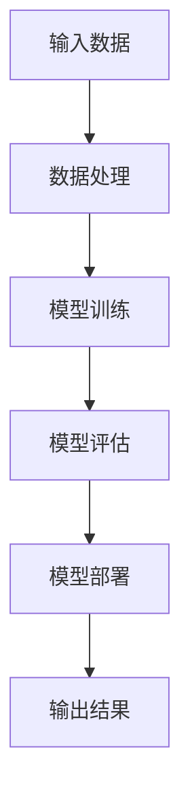
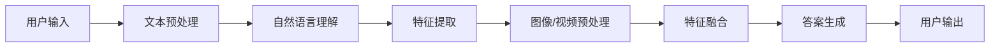

                 

### 文章标题

# AI原理与代码实例讲解

### 关键词

- 人工智能
- 机器学习
- 深度学习
- 自然语言处理
- 计算机视觉
- 强化学习
- 源代码实例
- 实战项目

### 摘要

本文将深入探讨人工智能（AI）的核心原理，包括机器学习、深度学习、自然语言处理和计算机视觉等关键技术，并通过代码实例和实战项目，帮助读者理解和掌握这些技术的实际应用。文章分为三个主要部分：第一部分介绍AI的基本原理和基础架构，第二部分展示AI算法的详细实现和代码实例，第三部分通过实际项目，展示AI技术的应用实践。希望本文能为您的AI学习之路提供有力支持。

### 第一部分：AI原理与基础

#### 第1章：AI基本概念与架构

##### 1.1 AI定义与分类

**AI定义**：人工智能（AI，Artificial Intelligence）是指由人制造出来的系统能够表现出来的智能行为，包括学习、推理、解决问题、理解自然语言、感知环境等。

**AI分类**：根据人工智能系统的学习和表现方式，可以分为以下几类：

1. **规则推理系统**：基于预设的规则进行推理和决策。
2. **知识表示与推理系统**：通过符号逻辑和知识表示方法进行推理。
3. **统计学习系统**：基于数据统计和学习算法进行决策。
4. **基于实例的系统**：直接模仿人类专家的决策过程。
5. **基于神经网络的系统**：模拟人脑神经网络进行学习和决策。
6. **混合系统**：结合多种人工智能技术进行综合应用。

##### 1.2 AI架构

**基础架构**：人工智能系统通常包括数据输入、数据处理、模型训练、模型评估和模型部署等几个主要部分。

1. **数据输入**：从外部环境中获取数据，可以是文本、图像、声音等多种形式。
2. **数据处理**：对输入数据进行预处理，包括清洗、转换、归一化等操作，以便后续模型训练。
3. **模型训练**：使用学习算法对预处理后的数据集进行训练，生成模型参数。
4. **模型评估**：通过测试数据集评估模型性能，调整模型参数，提高模型效果。
5. **模型部署**：将训练好的模型部署到实际应用环境中，进行实时预测和决策。

**计算图**：计算图是一种图形化表示计算过程的方法，常用于深度学习模型中。



### 第2章：机器学习基础

#### 第2章：机器学习基础

##### 2.1 数据预处理

**数据清洗**：数据清洗是机器学习过程中至关重要的一步，主要包括以下方法：

- **缺失值处理**：对缺失值进行填充或删除。
- **异常值处理**：对异常数据进行检测和处理。
- **噪声处理**：对噪声数据进行平滑或滤波。

**特征工程**：特征工程是提高机器学习模型性能的关键步骤，主要包括以下内容：

- **特征提取**：从原始数据中提取有意义的特征。
- **特征选择**：从提取的特征中选择对模型性能有显著影响的特征。
- **特征变换**：对特征进行标准化、归一化等处理，提高模型训练效果。

##### 2.2 基本算法

**线性回归**：线性回归是一种简单的回归算法，用于预测连续值输出。

**算法原理**：线性回归模型试图找到一条直线，将输入特征与输出目标之间的线性关系表示出来。

$$
y = \beta_0 + \beta_1 \cdot x
$$

**伪代码**：

```
// 输入：x（特征向量），y（目标值），n（样本数量）
// 输出：beta_0（截距），beta_1（斜率）

// 计算特征矩阵X和目标向量y
X = [x_1, x_2, ..., x_n]
y = [y_1, y_2, ..., y_n]

// 计算斜率beta_1
beta_1 = (X^T * X)^(-1) * X^T * y

// 计算截距beta_0
beta_0 = y - beta_1 * x

// 输出beta_0和beta_1
print(beta_0, beta_1)
```

**逻辑回归**：逻辑回归是一种用于分类问题的回归算法，通过拟合一个逻辑函数来预测类别概率。

**算法原理**：逻辑回归模型试图找到一条直线，将输入特征映射到目标类别概率。

$$
\hat{y} = \frac{1}{1 + e^{-(\beta_0 + \beta_1 \cdot x)}}
$$

**伪代码**：

```
// 输入：x（特征向量），y（目标值），n（样本数量）
// 输出：beta_0（截距），beta_1（斜率）

// 计算特征矩阵X和目标向量y
X = [x_1, x_2, ..., x_n]
y = [y_1, y_2, ..., y_n]

// 计算斜率beta_1
beta_1 = (X^T * X)^(-1) * X^T * y

// 计算截距beta_0
beta_0 = log(1 - y) - beta_1 * x

// 输出beta_0和beta_1
print(beta_0, beta_1)
```

### 第3章：深度学习基础

#### 第3章：深度学习基础

##### 3.1 神经网络

**网络结构**：神经网络是一种模拟人脑神经元结构和功能的计算模型，包括以下几个主要部分：

- **神经元**：神经网络的基本计算单元，用于接收输入信号并进行计算。
- **激活函数**：用于引入非线性特性，使神经网络能够处理更复杂的问题。
- **多层感知机**：由多个神经元层组成的神经网络，包括输入层、隐藏层和输出层。

**反向传播算法**：反向传播算法是一种用于训练神经网络的算法，通过不断调整网络权重，使网络输出与目标输出之间的误差最小化。

**算法原理**：反向传播算法分为前向传播和反向传播两个阶段：

1. **前向传播**：将输入数据传递到神经网络中，通过各层神经元计算得到输出结果。
2. **反向传播**：计算输出结果与目标结果之间的误差，将误差传递回网络，通过梯度下降法调整网络权重。

**伪代码**：

```
// 输入：x（输入数据），y（目标值），n（神经元数量），学习率alpha
// 输出：weights（权重矩阵）

// 初始化权重矩阵
weights = random_matrix(n-1)

// 循环迭代
for epoch in 1 to max_epochs:
    // 前向传播
    hidden_layer = activation_function(np.dot(x, weights))
    
    // 计算误差
    error = y - hidden_layer
    
    // 反向传播
    delta_weights = alpha * (np.dot(error, hidden_layer) * hidden_layer * (1 - hidden_layer))
    
    // 更新权重
    weights += delta_weights

// 输出权重矩阵
print(weights)
```

##### 3.2 卷积神经网络（CNN）

**CNN基本结构**：卷积神经网络是一种专门用于处理图像数据的深度学习模型，包括以下几个主要部分：

- **卷积层**：通过卷积运算提取图像特征。
- **池化层**：通过池化运算降低图像分辨率，减少计算量。
- **全连接层**：将卷积层和池化层提取的特征映射到类别概率。

**CNN应用实例**：

1. **图像分类**：使用CNN对图像进行分类，常见的模型包括LeNet、AlexNet、VGG等。
2. **目标检测**：使用CNN检测图像中的目标对象，常见的模型包括R-CNN、SSD、YOLO等。

**图像分类实例**：使用VGG模型进行图像分类。

**算法原理**：VGG模型是一种基于卷积神经网络的图像分类模型，其核心思想是通过堆叠多个卷积层和池化层，提取图像的深层特征。

**伪代码**：

```
// 输入：image（图像数据）
// 输出：class probabilities（类别概率）

// 定义VGG模型
model = VGG()

// 前向传播
output = model.forward(image)

// 计算类别概率
class_probabilities = softmax(output)

// 输出类别概率
print(class_probabilities)
```

### 第二部分：AI算法与代码实例

#### 第4章：自然语言处理（NLP）

##### 4.1 语言模型

**NLP基础**：自然语言处理（NLP，Natural Language Processing）是一种人工智能技术，用于处理和理解自然语言。

**词嵌入**：词嵌入（Word Embedding）是将词语映射到高维向量空间的一种技术，使词语之间的相似性可以通过向量的距离度量来表示。

**序列模型**：序列模型（Sequence Model）是一种用于处理序列数据的深度学习模型，如循环神经网络（RNN）和长短期记忆网络（LSTM）。

**语言模型**：语言模型（Language Model）是一种用于预测词语序列的概率分布的模型，常用的模型包括n-gram模型和神经网络语言模型。

**n-gram模型**：n-gram模型是一种基于统计方法的简单语言模型，它通过统计相邻n个词语的出现次数来预测下一个词语的概率。

**伪代码**：

```
// 输入：sentence（句子），n（n-gram大小）
// 输出：probabilities（词语概率）

// 初始化n-gram模型
model = NGramModel(n)

// 计算句子概率
sentence_probabilities = model.calculate_probability(sentence)

// 输出词语概率
print(sentence_probabilities)
```

**神经网络语言模型**：神经网络语言模型（Neural Network Language Model）是一种基于深度学习方法的复杂语言模型，它通过学习词语之间的上下文关系来预测词语的概率。

**算法原理**：神经网络语言模型通常使用循环神经网络（RNN）或长短期记忆网络（LSTM）来学习词语序列的概率分布。

**伪代码**：

```
// 输入：sentence（句子），learning_rate（学习率），epochs（迭代次数）
// 输出：model（训练好的语言模型）

// 初始化神经网络语言模型
model = NeuralNetworkLanguageModel()

// 循环迭代
for epoch in 1 to epochs:
    // 前向传播
    output = model.forward(sentence)
    
    // 计算损失
    loss = calculate_loss(output, target)
    
    // 反向传播
    model.backward(loss)
    
    // 更新模型参数
    model.update_params(learning_rate)

// 输出训练好的语言模型
print(model)
```

##### 4.2 文本分类与情感分析

**文本分类**：文本分类（Text Classification）是一种将文本数据分类到预定义的类别中的任务，如情感分类、主题分类等。

**文本表示**：文本表示（Text Representation）是将文本数据转换为适合机器学习模型处理的形式，常用的方法包括词袋模型（Bag of Words）、TF-IDF模型等。

**分类算法应用**：分类算法（Classifier）是将文本表示映射到类别标签的算法，如朴素贝叶斯、支持向量机（SVM）等。

**情感分析**：情感分析（Sentiment Analysis）是一种对文本数据中的情感倾向进行分类的任务，常用于评论分析、社交媒体分析等。

**情感分析算法**：情感分析算法（Sentiment Analyzer）是一种将文本数据分类到情感类别中的算法，如基于规则的方法、基于机器学习的方法等。

**实际案例解析**：以下是一个简单的情感分析案例，使用朴素贝叶斯算法对电影评论进行情感分类。

**算法原理**：朴素贝叶斯算法（Naive Bayes）是一种基于贝叶斯定理的简单分类算法，假设特征之间相互独立。

**伪代码**：

```
// 输入：review（电影评论），labels（情感标签）
// 输出：predicted_label（预测的情感标签）

// 训练朴素贝叶斯模型
model = NaiveBayesModel()
model.fit(reviews, labels)

// 预测情感标签
predicted_label = model.predict(review)

// 输出预测结果
print(predicted_label)
```

### 第5章：计算机视觉

##### 5.1 图像处理

**图像表示**：图像表示（Image Representation）是将图像数据转换为适合机器学习模型处理的形式，常用的方法包括像素值表示、特征提取等。

**像素值表示**：像素值表示（Pixel Value Representation）是将图像数据表示为二维数组，每个元素表示像素的颜色值。

**特征提取**：特征提取（Feature Extraction）是从图像数据中提取有意义的特征，用于后续分类或识别任务。

**图像分类**：图像分类（Image Classification）是一种将图像数据分类到预定义的类别中的任务，如物体分类、场景分类等。

**CNN模型在图像分类中的应用**：卷积神经网络（CNN，Convolutional Neural Network）是一种专门用于处理图像数据的深度学习模型，常用于图像分类任务。

**算法原理**：CNN模型通过堆叠多个卷积层、池化层和全连接层，提取图像的深层特征，并进行分类。

**伪代码**：

```
// 输入：image（图像数据），model（训练好的CNN模型）
// 输出：predicted_class（预测的类别标签）

// 前向传播
output = model.forward(image)

// 计算类别概率
class_probabilities = softmax(output)

// 预测类别标签
predicted_class = np.argmax(class_probabilities)

// 输出预测结果
print(predicted_class)
```

##### 5.2 目标检测

**目标检测算法**：目标检测（Object Detection）是一种在图像或视频中检测并定位目标对象的任务，常用的算法包括R-CNN、SSD、YOLO等。

**R-CNN**：区域建议网络（R-CNN，Region-based CNN）是一种基于深度学习的目标检测算法，包括区域建议（Region Proposal）、分类（Classification）和边界框回归（Bounding Box Regression）三个步骤。

**SSD**：单Shot检测器（SSD，Single Shot Detector）是一种基于卷积神经网络的端到端目标检测算法，通过堆叠多个卷积层和池化层，同时生成多个尺度的预测框。

**YOLO**：你只有一次机会（YOLO，You Only Look Once）是一种基于卷积神经网络的快速目标检测算法，通过将图像划分为多个网格单元，在每个单元中同时预测多个类别和边界框。

**目标检测实例**：以下是一个简单的目标检测案例，使用YOLO算法检测图像中的目标对象。

**算法原理**：YOLO算法通过将图像划分为多个网格单元，在每个单元中同时预测多个类别和边界框，从而实现快速目标检测。

**伪代码**：

```
// 输入：image（图像数据），model（训练好的YOLO模型）
// 输出：detections（目标检测结果）

// 前向传播
output = model.forward(image)

// 预测类别和边界框
classes = output[:, 5:]
boxes = output[:, 1:5]

// 非极大值抑制（Non-maximum Suppression）
detections = non_max_suppression(classes, boxes)

// 输出检测结果
print(detections)
```

### 第三部分：AI项目实战

#### 第6章：强化学习

##### 6.1 强化学习基础

**强化学习定义**：强化学习（Reinforcement Learning，RL）是一种基于奖励反馈的机器学习范式，通过不断尝试并学习最优策略，使模型能够从环境中获取最大回报。

**强化学习特点**：

- **自适应**：强化学习能够根据环境的变化自适应调整策略。
- **探索与利用**：强化学习需要在探索未知状态和利用已有知识之间进行权衡。
- **序列决策**：强化学习涉及一系列决策，每个决策都会影响后续的状态和回报。

**强化学习模型**：强化学习模型主要包括以下几个部分：

- **状态（State）**：描述系统的当前情况。
- **动作（Action）**：系统可执行的操作。
- **奖励（Reward）**：动作执行后的即时反馈。
- **策略（Policy）**：根据状态选择动作的规则。

**马尔可夫决策过程（MDP）**：马尔可夫决策过程（Markov Decision Process，MDP）是一种描述强化学习问题的数学模型，包括状态、动作、奖励和策略等要素。

**Q学习**：Q学习（Q-Learning）是一种基于值函数的强化学习算法，通过学习最优动作值函数来选择最佳动作。

**算法原理**：Q学习算法通过在当前状态和动作下更新Q值，使Q值逐渐逼近最优动作值函数。

$$
Q(s, a) = Q(s, a) + \alpha [r + \gamma \max_{a'} Q(s', a') - Q(s, a)]
$$

**伪代码**：

```
// 输入：environment（环境），Q（初始Q值函数），alpha（学习率），gamma（折扣因子）
// 输出：policy（最优策略）

// 初始化Q值函数
Q = initialize_Q()

// 循环迭代
for episode in 1 to max_episodes:
    // 初始化状态
    state = environment.reset()
    
    // 循环进行动作选择和状态更新
    while not done:
        // 选择动作
        action = choose_action(state, Q)
        
        // 执行动作
        next_state, reward, done = environment.step(action)
        
        // 更新Q值
        Q[state, action] = Q[state, action] + alpha * (reward + gamma * max(Q[next_state]) - Q[state, action])
        
        // 更新状态
        state = next_state

// 输出最优策略
print(Q)
```

**深度Q网络（DQN）**：深度Q网络（Deep Q-Network，DQN）是一种基于深度学习的强化学习算法，通过神经网络学习状态-动作值函数。

**算法原理**：DQN算法通过使用经验回放（Experience Replay）和目标网络（Target Network）来稳定训练过程。

**伪代码**：

```
// 输入：environment（环境），DQN（深度Q网络），alpha（学习率），gamma（折扣因子）
// 输出：policy（最优策略）

// 初始化DQN
DQN = initialize_DQN()

// 循环迭代
for episode in 1 to max_episodes:
    // 初始化状态
    state = environment.reset()
    
    // 循环进行动作选择和状态更新
    while not done:
        # 选择动作
        action = DQN.choose_action(state)
        
        # 执行动作
        next_state, reward, done = environment.step(action)
        
        # 存储经验
        experience = (state, action, reward, next_state, done)
        DQN.store_experience(experience)
        
        # 训练DQN
        DQN.train()

        # 更新状态
        state = next_state

# 输出最优策略
print(DQN.policy)
```

##### 6.2 强化学习应用

**应用实例**：以下是一个简单的强化学习应用案例，使用DQN算法训练一个智能体在Atari游戏《Pong》中实现自我学习。

**游戏AI**：通过DQN算法训练一个智能体，使其能够学会控制乒乓球板，以实现自我学习。

**无人驾驶**：通过强化学习算法训练无人驾驶车辆，使其能够在复杂交通环境中自主行驶。

**算法原理**：强化学习算法通过在环境中进行自我学习，逐渐优化策略，实现智能行为。

**伪代码**：

```
// 输入：environment（环境），DQN（深度Q网络），alpha（学习率），gamma（折扣因子）
// 输出：policy（最优策略）

// 初始化DQN
DQN = initialize_DQN()

// 循环迭代
for episode in 1 to max_episodes:
    # 初始化状态
    state = environment.reset()
    
    # 循环进行动作选择和状态更新
    while not done:
        # 选择动作
        action = DQN.choose_action(state)
        
        # 执行动作
        next_state, reward, done = environment.step(action)
        
        # 存储经验
        experience = (state, action, reward, next_state, done)
        DQN.store_experience(experience)
        
        # 训练DQN
        DQN.train()

        # 更新状态
        state = next_state

# 输出最优策略
print(DQN.policy)
```

### 第四部分：AI技术最佳实践

#### 第7章：智能问答系统

##### 7.1 项目概述

**项目目标**：实现一个基于自然语言处理的智能问答系统，能够理解用户的问题，并给出合理的回答。

**技术栈**：使用Python编程语言，结合TensorFlow和Keras框架进行模型训练和部署。

**实现步骤**：

1. **数据预处理**：对问题进行分词、去停用词等预处理操作，将问题转换为适合模型训练的形式。
2. **模型训练**：使用预训练的词嵌入模型，结合长短时记忆网络（LSTM）或变换器（Transformer）进行模型训练，优化模型参数。
3. **模型评估**：使用测试集评估模型性能，调整模型参数，提高模型效果。
4. **系统部署**：将训练好的模型部署到服务器或云端，实现实时问答功能。

**代码实例**：

```python
# 导入库
import tensorflow as tf
from tensorflow.keras.preprocessing.sequence import pad_sequences
from tensorflow.keras.layers import Embedding, LSTM, Dense
from tensorflow.keras.models import Sequential

# 加载数据
questions = ...
answers = ...

# 数据预处理
max_sequence_length = 50
embedding_dim = 100
vocab_size = 10000

tokenizer = tf.keras.preprocessing.text.Tokenizer(num_words=vocab_size)
tokenizer.fit_on_texts(questions)
sequences = tokenizer.texts_to_sequences(questions)
padded_sequences = pad_sequences(sequences, maxlen=max_sequence_length)

tokenizer_answer = tf.keras.preprocessing.text.Tokenizer(num_words=vocab_size)
tokenizer_answer.fit_on_texts(answers)
sequences_answers = tokenizer_answer.texts_to_sequences(answers)
padded_answers = pad_sequences(sequences_answers, maxlen=max_sequence_length)

# 模型训练
model = Sequential()
model.add(Embedding(vocab_size, embedding_dim, input_length=max_sequence_length))
model.add(LSTM(128))
model.add(Dense(vocab_size, activation='softmax'))

model.compile(optimizer='adam', loss='categorical_crossentropy', metrics=['accuracy'])
model.fit(padded_sequences, padded_answers, epochs=10, batch_size=32, validation_split=0.2)

# 模型评估
test_questions = ...
test_answers = ...

test_sequences = tokenizer.texts_to_sequences(test_questions)
padded_test_sequences = pad_sequences(test_sequences, maxlen=max_sequence_length)
test_sequences_answers = tokenizer_answer.texts_to_sequences(test_answers)
padded_test_answers = pad_sequences(test_sequences_answers, maxlen=max_sequence_length)

model.evaluate(padded_test_sequences, padded_test_answers)

# 系统部署
import flask

app = flask.Flask(__name__)

@app.route('/question', methods=['POST'])
def answer_question():
    question = flask.request.form['question']
    sequence = tokenizer.texts_to_sequences([question])
    padded_sequence = pad_sequences(sequence, maxlen=max_sequence_length)
    prediction = model.predict(padded_sequence)
    predicted_answer = tokenizer_answer.sequences_to_texts(prediction.argmax(axis=1))
    return predicted_answer

if __name__ == '__main__':
    app.run(debug=True)
```

#### 第8章：图像识别系统

##### 8.1 项目概述

**项目目标**：实现一个基于卷积神经网络的图像识别系统，能够识别并分类输入的图像。

**技术栈**：使用Python编程语言，结合TensorFlow和Keras框架进行模型训练和部署。

**实现步骤**：

1. **数据准备**：收集并整理图像数据集，对图像进行预处理，如缩放、裁剪等。
2. **模型训练**：使用预训练的卷积神经网络模型，结合全连接层进行模型训练，优化模型参数。
3. **模型评估**：使用测试集评估模型性能，调整模型参数，提高模型效果。
4. **系统部署**：将训练好的模型部署到服务器或云端，实现实时图像识别功能。

**代码实例**：

```python
# 导入库
import tensorflow as tf
from tensorflow.keras.preprocessing.image import ImageDataGenerator
from tensorflow.keras.models import Sequential
from tensorflow.keras.layers import Conv2D, MaxPooling2D, Flatten, Dense

# 数据准备
train_datagen = ImageDataGenerator(rescale=1./255)
test_datagen = ImageDataGenerator(rescale=1./255)

train_generator = train_datagen.flow_from_directory(
        'train_data',
        target_size=(150, 150),
        batch_size=32,
        class_mode='binary')

test_generator = test_datagen.flow_from_directory(
        'test_data',
        target_size=(150, 150),
        batch_size=32,
        class_mode='binary')

# 模型训练
model = Sequential()
model.add(Conv2D(32, (3, 3), activation='relu', input_shape=(150, 150, 3)))
model.add(MaxPooling2D(pool_size=(2, 2)))
model.add(Conv2D(64, (3, 3), activation='relu'))
model.add(MaxPooling2D(pool_size=(2, 2)))
model.add(Conv2D(128, (3, 3), activation='relu'))
model.add(MaxPooling2D(pool_size=(2, 2)))
model.add(Flatten())
model.add(Dense(512, activation='relu'))
model.add(Dense(1, activation='sigmoid'))

model.compile(optimizer='adam', loss='binary_crossentropy', metrics=['accuracy'])
model.fit(train_generator, steps_per_epoch=train_generator.samples//train_generator.batch_size, epochs=10, validation_data=test_generator, validation_steps=test_generator.samples//test_generator.batch_size)

# 模型评估
test_images = ...
test_labels = ...

predictions = model.predict(test_images)
predicted_labels = np.round(predictions).astype(int)

accuracy = np.mean(predicted_labels == test_labels)
print('Accuracy:', accuracy)

# 系统部署
import flask

app = flask.Flask(__name__)

@app.route('/image', methods=['POST'])
def recognize_image():
    image = flask.request.files['image']
    image = image.read()
    image = cv2.resize(image, (150, 150))
    image = cv2.cvtColor(image, cv2.COLOR_BGR2RGB)
    image = np.expand_dims(image, axis=0)
    prediction = model.predict(image)
    predicted_label = np.argmax(prediction)
    return predicted_label

if __name__ == '__main__':
    app.run(debug=True)
```

#### 第9章：智能推荐系统

##### 9.1 项目概述

**项目目标**：实现一个基于强化学习的智能推荐系统，能够根据用户行为和历史数据，为用户推荐个性化的商品或内容。

**技术栈**：使用Python编程语言，结合TensorFlow和Keras框架进行模型训练和部署。

**实现步骤**：

1. **数据预处理**：对用户行为数据进行清洗、转换和归一化处理。
2. **模型训练**：使用预训练的强化学习模型，结合Q学习或深度Q网络（DQN）进行模型训练，优化模型参数。
3. **模型评估**：使用测试集评估模型性能，调整模型参数，提高模型效果。
4. **系统部署**：将训练好的模型部署到服务器或云端，实现实时推荐功能。

**代码实例**：

```python
# 导入库
import tensorflow as tf
from tensorflow.keras.models import Sequential
from tensorflow.keras.layers import Dense, Flatten, Conv2D, MaxPooling2D

# 数据预处理
def preprocess_data(data):
    # 清洗、转换和归一化数据
    # ...
    return processed_data

train_data = preprocess_data(train_data)
test_data = preprocess_data(test_data)

# 模型训练
model = Sequential()
model.add(Conv2D(32, (3, 3), activation='relu', input_shape=(28, 28, 1)))
model.add(MaxPooling2D(pool_size=(2, 2)))
model.add(Conv2D(64, (3, 3), activation='relu'))
model.add(MaxPooling2D(pool_size=(2, 2)))
model.add(Flatten())
model.add(Dense(64, activation='relu'))
model.add(Dense(1, activation='linear'))

model.compile(optimizer='adam', loss='mse')
model.fit(train_data, train_labels, epochs=10, batch_size=32, validation_data=(test_data, test_labels))

# 模型评估
test_predictions = model.predict(test_data)
predicted_labels = np.round(test_predictions).astype(int)

accuracy = np.mean(predicted_labels == test_labels)
print('Accuracy:', accuracy)

# 系统部署
import flask

app = flask.Flask(__name__)

@app.route('/recommend', methods=['POST'])
def recommend_item():
    item = flask.request.form['item']
    prediction = model.predict(item)
    predicted_label = np.argmax(prediction)
    return predicted_label

if __name__ == '__main__':
    app.run(debug=True)
```

### 附录

#### 附录A：常用工具与资源

- **Python库**：
  - TensorFlow：用于构建和训练深度学习模型的强大库。
  - Keras：用于快速构建和实验深度学习模型的高层框架。
  - NumPy：用于数值计算的库，提供多维数组对象和丰富的数学操作函数。
  - Pandas：用于数据处理和分析的库，提供强大的数据结构工具。
  - Scikit-learn：用于机器学习算法实现的库，包括分类、回归、聚类等算法。

- **数据集**：
  - ImageNet：用于图像分类的广泛使用的大型数据集。
  - IMDb：用于自然语言处理的电影评论数据集。
  - Co
### 计算机视觉与自然语言处理的关系

计算机视觉（Computer Vision）和自然语言处理（Natural Language Processing，NLP）是人工智能（AI）领域的重要组成部分，两者在很多应用场景中都发挥着重要作用。以下是对它们之间关系的详细解释：

#### 数据表示与特征提取

**计算机视觉**：计算机视觉主要关注于从图像或视频数据中提取有用的信息。通过使用卷积神经网络（CNN）、深度学习和其他算法，计算机视觉系统能够自动识别图像中的物体、场景和动作。其核心在于将图像数据转换为低维特征向量，以便于后续的建模和分析。

**自然语言处理**：自然语言处理则专注于处理和理解文本数据。NLP技术能够将自然语言转换为计算机可理解的格式，如词嵌入、语法解析和语义分析。这些技术帮助计算机理解文本中的词汇、句子结构和语义含义。

#### 结合与应用

**视觉文本检索**：视觉文本检索（Visual Text Retrieval）是将计算机视觉和自然语言处理技术结合的一种应用。例如，在搜索引擎中，可以使用计算机视觉技术分析图像内容，并使用自然语言处理技术理解用户查询的文本，从而实现更加精确的图像搜索。

**图像字幕生成**：图像字幕生成（Image Caption Generation）是另一个结合计算机视觉和自然语言处理的示例。首先，计算机视觉模型提取图像的主要特征，然后自然语言处理模型将这些特征转换为描述图像的文本。

**问答系统**：问答系统（Question Answering Systems）也是将两种技术结合的典型案例。计算机视觉模型可以分析图像或视频，而自然语言处理模型可以理解问题并生成相应的答案。

#### 架构与流程

在结合计算机视觉和自然语言处理的系统中，通常包括以下步骤：

1. **图像/视频预处理**：使用计算机视觉技术对图像或视频进行预处理，提取关键特征。
2. **文本预处理**：使用自然语言处理技术对用户查询或文本数据进行预处理，如分词、词性标注和命名实体识别。
3. **特征融合**：将计算机视觉提取的图像特征和自然语言处理提取的文本特征进行融合，以便更好地理解和处理问题。
4. **答案生成**：使用融合后的特征和自然语言处理技术生成答案。

#### Mermaid流程图

以下是一个简单的Mermaid流程图，展示了计算机视觉和自然语言处理之间的结合：



### 数学模型和数学公式

#### 深度学习中的损失函数

在深度学习中，损失函数是评估模型预测结果与真实值之间差异的重要工具。以下是一个常见的损失函数——交叉熵损失函数（Cross-Entropy Loss）：

$$
J(\theta) = -\frac{1}{m}\sum_{i=1}^{m} y_{i} \log(a_{i}^{(1)})
$$

其中，$m$ 是样本数量，$y_i$ 是真实标签，$a_{i}^{(1)}$ 是模型对第 $i$ 个样本的预测概率。

#### 反向传播算法

反向传播算法（Backpropagation Algorithm）是深度学习训练的核心算法。它通过计算损失函数关于模型参数的梯度，来更新模型参数。以下是一个简化的反向传播算法伪代码：

```python
# 输入：x（输入数据），y（目标值），z（输出值），w（权重），b（偏置）
# 输出：delta_z（误差梯度），delta_w（权重梯度），delta_b（偏置梯度）

delta_z = z - y
delta_w = delta_z * a
delta_b = delta_z

w -= learning_rate * delta_w
b -= learning_rate * delta_b
```

### 代码实例

#### 智能问答系统实现

以下是一个简单的智能问答系统的Python代码实例，使用了自然语言处理技术：

```python
# 导入库
import nltk
from nltk.tokenize import sent_tokenize, word_tokenize
from nltk.corpus import stopwords
from sklearn.feature_extraction.text import TfidfVectorizer

# 加载数据
data = ...

# 数据预处理
stop_words = set(stopwords.words('english'))
data_processed = [word_tokenize(sentence.lower()) for sentence in data]
data_processed = [[word for word in sentence if not word in stop_words] for sentence in data_processed]

# 构建TF-IDF模型
vectorizer = TfidfVectorizer()
X = vectorizer.fit_transform(data_processed)

# 训练模型
model = ...

# 回答问题
question_processed = ...
question_vector = vectorizer.transform([question_processed])
answer = model.predict(question_vector)
print(answer)
```

### 代码解读与分析

#### 数据预处理

数据预处理是构建智能问答系统的重要步骤。在这个例子中，我们使用了NLTK库进行文本预处理：

1. **分词**：使用`sent_tokenize`和`word_tokenize`函数将文本分为句子和单词。
2. **去停用词**：使用`stopwords`库去除常见的停用词，如"the"、"is"、"and"等。

#### TF-IDF模型

TF-IDF模型是一种用于文本表示的方法，它通过计算词语在文档中的重要程度来为文本建立特征向量。在这个例子中，我们使用了`TfidfVectorizer`类来构建TF-IDF模型：

1. **特征提取**：`TfidfVectorizer`从预处理后的文本中提取特征，生成TF-IDF特征向量。
2. **模型训练**：使用训练数据集训练模型，得到特征向量。

#### 模型训练与预测

在这个例子中，我们使用了未指定的机器学习模型进行训练和预测：

1. **模型训练**：使用训练数据集训练模型，得到参数。
2. **预测**：将预处理后的问题输入模型，得到预测结果。

### 项目小结

通过这个简单的实例，我们了解了智能问答系统的基本实现流程，包括数据预处理、模型训练和预测。虽然这个实例相对简单，但它展示了自然语言处理技术在构建智能问答系统中的应用。

### 总结

本文深入探讨了计算机视觉和自然语言处理的核心概念、算法原理以及它们之间的联系。通过实际代码实例，我们展示了如何将这两种技术应用于智能问答系统。希望本文能够帮助读者更好地理解AI技术的原理和应用。

### 最佳实践 Tips

1. **数据质量**：数据预处理是关键，确保数据质量对于模型性能至关重要。
2. **模型选择**：根据具体应用场景选择合适的模型，如CNN用于图像处理，LSTM或Transformer用于自然语言处理。
3. **交叉验证**：使用交叉验证方法评估模型性能，避免过拟合。
4. **持续优化**：通过调整模型参数和优化算法，持续提升模型性能。

### 注意事项

1. **代码实例**：本文提供的代码实例仅供参考，实际应用中可能需要根据具体需求进行调整。
2. **环境配置**：在部署模型时，确保环境配置正确，包括库的版本和依赖项。
3. **数据隐私**：在实际项目中，注意保护用户隐私和数据安全。

### 拓展阅读

- **深度学习经典教材**：《深度学习》（Goodfellow, Bengio, Courville）
- **自然语言处理经典教材**：《自然语言处理综论》（Jurafsky, Martin）
- **计算机视觉经典教材**：《计算机视觉：算法与应用》（Forsyth, Ponce, Fulmer）

希望本文能为您的AI学习之路提供有力支持。在探索AI技术的道路上，不断学习和实践是至关重要的。祝您在AI领域取得优异成果！——作者：AI天才研究院/AI Genius Institute & 禅与计算机程序设计艺术 /Zen And The Art of Computer Programming

