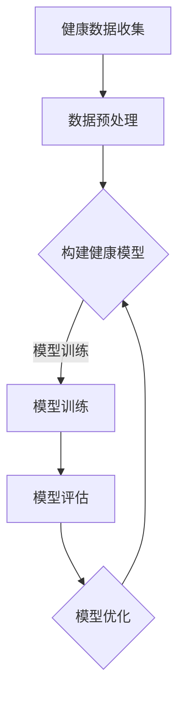

                 


### 《AI在个性化健康建议中的应用：预防疾病》

#### 关键词：
- 人工智能
- 个性化健康建议
- 预防疾病
- 深度学习
- 机器学习
- 数据隐私

#### 摘要：
本文探讨了人工智能（AI）在个性化健康建议中的应用，特别是其在预防疾病方面的作用。文章首先介绍了AI在个性化健康建议中的应用背景和重要性，接着阐述了个性化健康建议的概念和预防疾病的重要性。然后，文章详细讲解了AI技术基础，包括机器学习和深度学习。随后，文章重点介绍了个性化健康建议的核心算法，包括数据收集与预处理、个性化健康模型构建、模型训练与优化等。接着，文章通过三个案例分析，展示了AI在个性化心脏病、癌症和糖尿病预防中的应用。最后，文章讨论了个性化健康建议面临的挑战和未来发展，并提供了一些最佳实践和拓展阅读建议。

---

### 《AI在个性化健康建议中的应用：预防疾病》目录大纲

#### 第一部分：AI与个性化健康建议概述

#### 1.1 AI在个性化健康建议中的应用
##### 1.1.1 AI在健康领域的发展历程
##### 1.1.2 AI与个性化健康建议的关联
##### 1.1.3 个性化健康建议的优势与挑战

#### 1.2 预防疾病的重要性
##### 1.2.1 疾病预防的意义
##### 1.2.2 预防疾病的主要手段
##### 1.2.3 个性化预防策略的必要性

#### 第二部分：个性化健康建议的AI技术基础

#### 2.1 人工智能概述
##### 2.1.1 人工智能的定义
##### 2.1.2 人工智能的发展历程
##### 2.1.3 人工智能的应用领域

#### 2.2 机器学习基础
##### 2.2.1 机器学习的基本概念
##### 2.2.2 常见的机器学习算法
##### 2.2.3 机器学习在健康领域的应用

#### 2.3 深度学习技术
##### 2.3.1 深度学习的原理
##### 2.3.2 常见的深度学习模型
##### 2.3.3 深度学习在健康领域的应用

#### 第三部分：个性化健康建议的核心算法

#### 3.1 数据收集与预处理
##### 3.1.1 个性化健康数据类型
##### 3.1.2 数据收集方法
##### 3.1.3 数据预处理流程

#### 3.2 个性化健康模型构建
##### 3.2.1 个性化健康模型的需求
##### 3.2.2 常见的个性化健康模型
##### 3.2.3 个性化健康模型的构建流程

#### 3.3 模型训练与优化
##### 3.3.1 模型训练的基本流程
##### 3.3.2 模型优化的方法
##### 3.3.3 模型评估与选择

#### 第四部分：个性化健康建议的案例分析

#### 4.1 案例一：基于AI的个性化心脏病预防
##### 4.1.1 案例背景
##### 4.1.2 模型构建
##### 4.1.3 实际应用效果

#### 4.2 案例二：基于AI的个性化癌症预防
##### 4.2.1 案例背景
##### 4.2.2 模型构建
##### 4.2.3 实际应用效果

#### 4.3 案例三：基于AI的个性化糖尿病预防
##### 4.3.1 案例背景
##### 4.3.2 模型构建
##### 4.3.3 实际应用效果

#### 第五部分：个性化健康建议的挑战与未来

#### 5.1 个性化健康建议的挑战
##### 5.1.1 数据隐私问题
##### 5.1.2 模型解释性问题
##### 5.1.3 法律与伦理问题

#### 5.2 个性化健康建议的未来发展
##### 5.2.1 技术发展趋势
##### 5.2.2 行业前景
##### 5.2.3 未来研究方向

#### 附录

#### 附录A：AI健康应用开发工具与资源
##### A.1 常用AI开发框架
##### A.2 常用健康数据集

#### 附录B：推荐阅读资料
##### B.1 相关书籍
##### B.2 研究论文
##### B.3 在线课程

#### # Mermaid 流�程图


#### # 个性化健康模型构建伪代码
```python
def build_health_model(data):
    # 数据预处理
    preprocessed_data = preprocess_data(data)

    # 构建模型
    model = create_model(preprocessed_data)

    # 模型训练
    train_model(model, preprocessed_data)

    # 模型评估
    evaluate_model(model)

    # 模型优化
    optimize_model(model)

    return model
```

#### # 数学模型和数学公式
$$
y = \sigma(W \cdot x + b)
$$
其中，$y$ 是模型的输出，$\sigma$ 是 sigmoid 函数，$W$ 是权重矩阵，$x$ 是输入特征，$b$ 是偏置项。

---

接下来，我们将逐一展开每个部分的内容，进行详细的分析和讲解。请继续关注。

