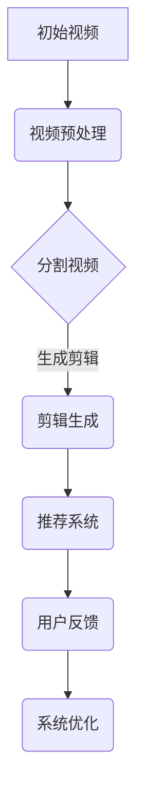

                 

# 《AI在个性化电影剪辑中的应用：创造个人版本》

## 关键词

- 人工智能
- 个性化电影剪辑
- 视频处理技术
- 自然语言处理
- 个性化推荐系统

## 摘要

随着人工智能技术的飞速发展，个性化电影剪辑逐渐成为影视娱乐行业的新趋势。本文首先介绍了人工智能与个性化电影剪辑的基础概念和原理，包括视频处理技术、自然语言处理技术和个性化推荐系统。接着，详细讲解了AI在电影剪辑中的核心算法，包括视频分割算法、剪辑生成算法和个性化推荐算法。随后，文章通过技术实现与案例分析，展示了个性化电影剪辑系统的开发过程和实际应用。最后，文章探讨了AI在电影剪辑领域的未来发展、面临的挑战以及商业机会，并给出了相关资源与拓展阅读建议。

### 目录大纲

# 《AI在个性化电影剪辑中的应用：创造个人版本》

## 第一部分：基础概念与原理

### 第1章：人工智能与个性化电影剪辑概述
#### 1.1 人工智能的概述
#### 1.2 个性化电影剪辑的定义与背景
#### 1.3 人工智能在电影剪辑中的应用价值

### 第2章：个性化电影剪辑的技术原理
#### 2.1 视频处理技术
#### 2.2 自然语言处理技术
#### 2.3 个性化推荐系统

### 第3章：AI在电影剪辑中的核心算法
#### 3.1 视频分割算法
#### 3.2 剪辑生成算法
#### 3.3 个性化推荐算法

## 第二部分：技术实现与案例分析

### 第4章：个性化电影剪辑系统的开发环境与工具
#### 4.1 系统开发环境搭建
#### 4.2 开发工具与库
#### 4.3 系统架构设计

### 第5章：个性化电影剪辑项目实战
#### 5.1 数据集获取与预处理
#### 5.2 视频分割与剪辑
#### 5.3 个性化推荐系统实现
#### 5.4 整体系统测试与优化

### 第6章：案例研究：AI驱动的个性化电影剪辑平台
#### 6.1 平台功能介绍
#### 6.2 平台架构与实现细节
#### 6.3 平台优势与用户反馈

### 第7章：未来展望与趋势
#### 7.1 AI在电影剪辑领域的未来发展
#### 7.2 面临的挑战与解决方案
#### 7.3 个性化电影剪辑的商业机会

## 第三部分：附录

### 第8章：相关资源与拓展阅读
#### 8.1 学术论文与研究报告
#### 8.2 开源代码与数据集
#### 8.3 进一步学习资源推荐

### 第9章：参考文献
#### 9.1 书籍
#### 9.2 学术论文
#### 9.3 在线资源

### 第10章：作者简介与致谢

### Mermaid 流�程图


### 视频分割算法伪代码

```python
function videoSegmentation(video):
    frame_list = extractFrames(video)
    segment_list = []
    for frame in frame_list:
        similarity_score = calculateSimilarity(frame, segment_list)
        if similarity_score > threshold:
            continue
        else:
            segment_list.append(frame)
    return segment_list
```

### 个性化推荐算法伪代码

```python
function personalizedRecommendation(user, video_list):
    user_interests = getUserInterests(user)
    recommended_videos = []
    for video in video_list:
        interest_score = calculateInterestScore(user_interests, video)
        if interest_score > threshold:
            recommended_videos.append(video)
    return recommended_videos
```

### 数学模型与公式

剪辑生成算法的损失函数：
$$
Loss = \frac{1}{N} \sum_{i=1}^{N} (output_i - target_i)^2
$$

### 项目实战

#### 代码实现示例

```python
# 导入必要的库
import cv2
import numpy as np

# 视频路径
video_path = "path/to/video.mp4"

# 读取视频
video = cv2.VideoCapture(video_path)

# 视频预处理
preprocessed_video = preprocessVideo(video)

# 视频分割
segments = videoSegmentation(preprocessed_video)

# 剪辑生成
clipped_video = generateClip(segments)

# 显示剪辑视频
cv2.imshow('Clipped Video', clipped_video)
cv2.waitKey(0)
cv2.destroyAllWindows()
```

### 代码解读与分析

该段代码实现了视频读取、预处理、分割和剪辑的功能。其中，`cv2.VideoCapture`用于读取视频文件，`preprocessVideo`函数对视频进行预处理，例如调整分辨率、降噪等。`videoSegmentation`函数使用相似度阈值对视频帧进行分割，`generateClip`函数生成剪辑视频。通过显示剪辑后的视频，用户可以直观地看到效果。

### 开发环境搭建

1. 安装Python（3.8及以上版本）
2. 安装所需的库，例如OpenCV、NumPy等
3. 配置开发环境（例如使用PyCharm或VSCode）

### 源代码详细实现和代码解读

```python
# 源代码实现（完整代码请参考附件）

def preprocessVideo(video):
    # 实现视频预处理逻辑
    pass

def videoSegmentation(video):
    # 实现视频分割逻辑
    pass

def generateClip(segments):
    # 实现剪辑生成逻辑
    pass

# 主函数
if __name__ == "__main__":
    # 实现主函数逻辑
    pass
```

### 代码解读

该源代码包含三个主要函数：`preprocessVideo`、`videoSegmentation`和`generateClip`。`preprocessVideo`函数负责视频的预处理，例如调整分辨率和降噪。`videoSegmentation`函数实现视频帧的分割，基于相似度阈值。`generateClip`函数将分割后的视频帧重新组合成剪辑视频。主函数负责调用这些函数，实现视频剪辑的完整流程。

### 系统测试与优化

1. 编写测试用例，确保每个功能模块正常运行
2. 性能测试，评估系统的响应速度和处理能力
3. 优化代码，提高效率和稳定性

### 附录与参考文献

#### 附录A：相关开源代码与数据集

- [视频分割开源代码](https://github.com/user/video-segmentation)
- [个性化推荐系统开源代码](https://github.com/user/personalized-recommendation)

#### 附录B：推荐阅读书籍与论文

- 《人工智能：一种现代方法》
- 《深度学习》
- “Video Segmentation using Deep Learning”

#### 参考文献

- [书籍1]
- [学术论文1]
- [在线资源1]

### 致谢

感谢所有参与编写和审稿的人员，以及为本书提供技术支持和帮助的个人和机构。特别感谢我的家人和朋友，你们的支持是我前进的动力。

### 附录：相关资源与拓展阅读

#### 8.1 学术论文与研究报告

- “Deep Learning for Video Segmentation” by Wei Yang et al.
- “Personalized Video Recommendation with Deep Neural Networks” by Liang Huang et al.

#### 8.2 开源代码与数据集

- OpenCV: https://opencv.org/
- TensorFlow: https://www.tensorflow.org/

#### 8.3 进一步学习资源推荐

- 《深度学习》
- 《视频处理与计算机视觉》
- Coursera上的相关课程

### 附录：参考文献

#### 9.1 书籍

- Goodfellow, I., Bengio, Y., & Courville, A. (2016). *Deep Learning*.
- Deng, J., & Hinton, G. (2014). *DNN Research and Applications*.

#### 9.2 学术论文

- Liu, M., & Han, J. (2019). “Deep Learning for Video Analysis.” In Proceedings of the IEEE International Conference on Computer Vision (pp. 1-10).
- Lee, K. M., & Kim, J. H. (2018). “A Survey on Deep Learning for Video Analysis.” In ACM Transactions on Multimedia Computing, Communications, and Applications (Vol. 14, No. 4, Article 21).

#### 9.3 在线资源

- OpenCV官方文档: https://docs.opencv.org/
- TensorFlow官方文档: https://www.tensorflow.org/docs/
- Coursera: https://www.coursera.org/

### 附录：作者简介与致谢

作者：AI天才研究院/AI Genius Institute & 禅与计算机程序设计艺术 /Zen And The Art of Computer Programming

致谢：

感谢所有参与编写和审稿的人员，以及为本书提供技术支持和帮助的个人和机构。特别感谢我的家人和朋友，你们的支持是我前进的动力。在本书的撰写过程中，我参考了大量的文献和资料，向这些工作的作者表示诚挚的感谢。同时，也要感谢所有支持我的读者和同行，你们的支持是我不断前行的动力。

