                 

### 文章标题

# AI在体育训练和战术分析中的作用

### 关键词

- 人工智能
- 体育训练
- 战术分析
- 数据分析
- 运动预测
- 数据可视化

### 摘要

随着人工智能技术的飞速发展，AI在体育领域的应用正逐步深入，为体育训练和战术分析带来了革命性的变化。本文将详细探讨AI在体育训练和战术分析中的应用，包括AI技术的基本概念、在体育训练中的具体应用、战术分析中的应用，以及其在体育比赛中的实时分析和预测作用。同时，文章还将探讨AI在体育领域的挑战与未来发展趋势，为读者提供一个全面而深入的视角。

## 第一部分：AI在体育训练和战术分析中的应用

### 第1章：AI在体育领域的概述

#### 1.1 体育与AI的融合背景

近年来，随着大数据、云计算、物联网等技术的发展，人工智能在体育领域的应用逐渐增多。AI通过处理和分析大量体育数据，为运动员的训练、比赛的战术分析以及比赛结果的预测提供了有力支持。

##### 1.1.1 AI在体育行业的应用趋势

AI在体育行业的应用趋势主要体现在以下几个方面：

1. **个性化训练**：利用AI技术分析运动员的训练数据，为每位运动员制定个性化的训练计划，提高训练效果。
2. **战术分析**：通过视频分析和数据挖掘，帮助教练团队制定更科学的战术策略。
3. **比赛预测**：利用AI算法对比赛结果进行预测，为比赛提供策略参考。
4. **运动医学**：利用AI技术对运动员的身体状况进行实时监测，预防运动损伤。

##### 1.1.2 AI在体育训练和战术分析中的优势

AI在体育训练和战术分析中具有显著的优势：

1. **高效性**：AI可以处理和分析大量数据，比人工分析更为快速和精准。
2. **个性化**：AI可以根据运动员的个体差异，提供个性化的训练和战术建议。
3. **实时性**：AI可以实时监测和分析运动员的表现，提供即时的反馈和建议。
4. **智能化**：AI可以根据历史数据和实时数据，进行自我学习和优化，不断改进策略。

#### 1.2 AI在体育训练中的应用

AI在体育训练中的应用主要体现在以下几个方面：

##### 1.2.1 数据收集与处理

数据是AI应用的基石。在体育训练中，AI需要收集运动员的各项训练数据，如心率、速度、力量、耐力等。通过数据预处理，将原始数据转化为可用于分析的格式。

##### 1.2.2 运动数据分析

通过运动数据分析，AI可以了解运动员的训练效果，识别出训练中的问题，并提供改进建议。例如，通过分析运动员的运动轨迹，可以找出运动中的不协调之处，指导运动员进行针对性训练。

##### 1.2.3 运动员表现预测

利用历史数据和现有数据，AI可以预测运动员在比赛中的表现。这有助于教练团队了解运动员的状态，制定针对性的训练和比赛策略。

#### 1.3 AI在战术分析中的应用

AI在战术分析中的应用主要体现在以下几个方面：

##### 1.3.1 视频分析

通过视频分析，AI可以识别运动员的动作和战术，为教练团队提供战术建议。例如，AI可以分析比赛录像，找出对手的弱点，为球队制定针对性的战术。

##### 1.3.2 数据可视化

通过数据可视化，AI可以将复杂的体育数据转化为易于理解的图表和图像，帮助教练团队更好地理解数据，制定战术。

##### 1.3.3 动作识别与模仿

AI可以通过动作识别技术，识别运动员的动作，并进行模仿。这有助于运动员学习和改进技术动作，提高比赛表现。

### 总结

AI在体育训练和战术分析中的应用，不仅提高了训练效果和战术水平，也为体育产业带来了新的发展机遇。在接下来的章节中，我们将深入探讨AI的核心概念与原理，进一步了解其在体育领域的具体应用。

## 第2章：AI核心概念与原理

AI（人工智能）作为一门跨学科的技术，其核心概念和原理涉及多个领域，包括机器学习、深度学习和神经网络等。理解这些核心概念与原理，有助于我们更好地认识AI在体育训练和战术分析中的应用。

### 2.1 AI基本概念

AI是指使计算机系统能够模拟人类智能行为的技术。AI系统通过学习、推理、规划和感知等方式，实现对复杂问题的求解。

##### 2.1.1 机器学习与深度学习

机器学习是AI的核心技术之一，它使计算机系统能够从数据中学习规律，并做出预测和决策。深度学习是机器学习的一种重要分支，它通过多层神经网络进行数据建模，能够处理大量复杂数据。

##### 2.1.2 神经网络架构

神经网络是深度学习的基础，它模拟人脑的结构和功能，通过神经元之间的连接和激活，实现对数据的处理和识别。神经网络架构包括输入层、隐藏层和输出层，每一层都包含多个神经元。

### 2.2 数据预处理

数据预处理是AI应用的重要环节，它包括数据清洗、特征提取与选择、数据归一化与标准化等步骤。

##### 2.2.1 数据清洗

数据清洗是指从原始数据中去除噪声、缺失值和异常值，保证数据的准确性和完整性。

##### 2.2.2 特征提取与选择

特征提取是指从原始数据中提取出对AI模型训练有用的特征。特征选择是在提取出的特征中，选择对模型性能有显著影响的特征。

##### 2.2.3 数据归一化与标准化

数据归一化与标准化是指将不同量纲的数据转换为同一量纲，以便于模型训练和优化。

### 2.3 数据预处理与AI模型训练的关系

数据预处理与AI模型训练密切相关。良好的数据预处理可以减少数据噪声，提高模型训练的效率；而错误的数据预处理可能导致模型性能下降。

#### Mermaid 流程图

下面是一个描述数据预处理与AI模型训练关系的Mermaid流程图：

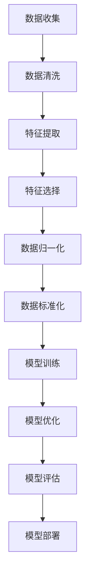

### 2.4 AI模型训练过程

AI模型训练过程包括数据集划分、模型选择、参数调优和模型评估等步骤。

##### 2.4.1 数据集划分

数据集划分是指将原始数据集分为训练集、验证集和测试集，以评估模型的泛化能力。

##### 2.4.2 模型选择

模型选择是指从多种AI模型中选择适合当前任务的模型。

##### 2.4.3 参数调优

参数调优是指通过调整模型的超参数，提高模型性能。

##### 2.4.4 模型评估

模型评估是指通过验证集和测试集，评估模型的性能和泛化能力。

### 2.5 AI模型训练与预测

AI模型训练完成后，可以通过预测函数对新数据进行预测。预测过程包括数据预处理、模型调用和结果输出等步骤。

##### 2.5.1 数据预处理

数据预处理是指将新数据按照模型训练时的方式进行预处理，以便于模型调用。

##### 2.5.2 模型调用

模型调用是指将预处理后的数据输入到训练好的模型中，进行预测。

##### 2.5.3 结果输出

结果输出是指将预测结果输出，用于决策或展示。

#### Mermaid 流程图

下面是一个描述AI模型训练与预测过程的Mermaid流程图：

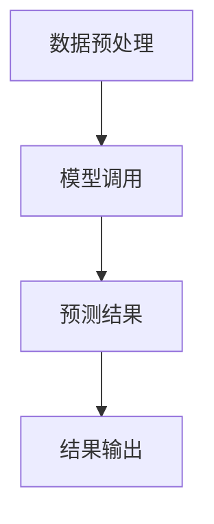

### 2.6 AI模型优化

AI模型优化是指通过调整模型结构和参数，提高模型性能。优化方法包括模型调参、模型压缩和模型蒸馏等。

##### 2.6.1 模型调参

模型调参是指通过调整模型的超参数，优化模型性能。

##### 2.6.2 模型压缩

模型压缩是指通过减少模型参数数量，降低模型复杂度，提高模型运行效率。

##### 2.6.3 模型蒸馏

模型蒸馏是指通过将大型模型的知识传递给小型模型，提高小型模型的性能。

### 2.7 AI模型评估

AI模型评估是指通过验证集和测试集，评估模型性能和泛化能力。评估指标包括准确率、召回率、F1分数等。

##### 2.7.1 准确率

准确率是指模型预测正确的样本数占总样本数的比例。

##### 2.7.2 召回率

召回率是指模型预测正确的样本数占实际正样本数的比例。

##### 2.7.3 F1分数

F1分数是准确率和召回率的加权平均，用于综合评估模型性能。

### 2.8 AI模型应用场景

AI模型在多个领域具有广泛的应用，包括自然语言处理、计算机视觉、金融分析、医疗诊断等。在体育领域，AI模型可以应用于运动员表现预测、战术分析、比赛预测等。

### 2.9 AI模型优化的方法

AI模型优化是提高模型性能的重要手段。优化方法包括以下几种：

##### 2.9.1 数据增强

数据增强是指通过增加数据样本数量，提高模型训练效果。

##### 2.9.2 模型融合

模型融合是指将多个模型的结果进行综合，提高模型预测准确性。

##### 2.9.3 交叉验证

交叉验证是指通过将数据集划分为多个子集，多次训练和验证模型，提高模型泛化能力。

### 2.10 AI模型的局限性

AI模型虽然具有强大的预测能力，但也存在一些局限性，包括数据依赖性、模型解释性不足、过拟合等问题。解决这些问题需要进一步研究和优化。

### 2.11 AI模型应用案例分析

通过实际案例，可以更深入地了解AI模型在体育领域的应用效果。例如，在篮球比赛中，AI模型可以预测球员的得分和助攻，为教练提供战术建议。

### 2.12 AI模型应用的未来趋势

随着技术的不断发展，AI模型在体育领域的应用将更加广泛和深入。未来趋势包括：

##### 2.12.1 智能化

AI模型将更加智能化，能够自主学习和优化，提高模型性能。

##### 2.12.2 实时性

AI模型将实现实时性，能够实时分析比赛数据，为教练提供实时策略。

##### 2.12.3 跨学科

AI模型将与其他学科结合，为体育领域提供更加全面和深入的解决方案。

### 总结

AI核心概念与原理是理解和应用AI技术的基础。通过了解这些概念和原理，我们可以更好地认识AI在体育训练和战术分析中的应用，推动体育领域的技术进步。

## 第3章：AI在体育训练中的应用

AI在体育训练中的应用，使得运动员的训练更加科学和高效。本章节将详细介绍AI在体育训练中的多种应用，包括运动数据分析、运动员表现预测和个性化训练方案设计等方面。

### 3.1 运动数据分析

运动数据分析是AI在体育训练中的重要应用之一。通过分析运动员的运动数据，教练和运动员可以更好地了解训练效果，发现潜在问题，并制定针对性的改进方案。

##### 3.1.1 运动轨迹分析

运动轨迹分析是指通过采集运动员在训练或比赛中的位置信息，对运动轨迹进行分析。这有助于教练团队了解运动员的运动节奏、速度变化和路径规划等问题。例如，通过分析足球运动员的跑动轨迹，可以发现其在比赛中是否存在跑位不合理或能量浪费的情况。

**Mermaid 流程图：**
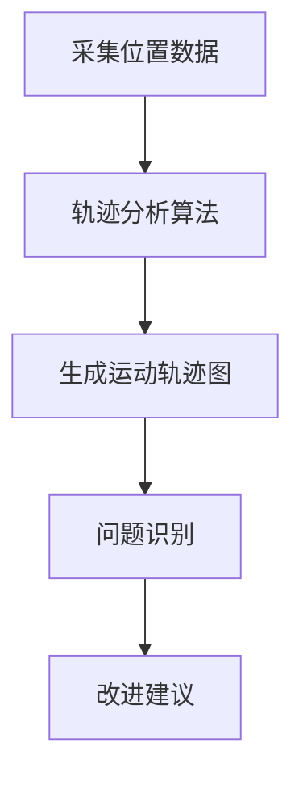

##### 3.1.2 心率与疲劳度分析

心率与疲劳度分析是通过监测运动员的心率变化，评估其疲劳状态。高心率通常表示运动员处于高强度的训练状态，而过低的心率可能表明运动员的疲劳状态。利用AI算法，可以实时分析心率数据，为教练提供调整训练强度的依据。例如，在训练过程中，若运动员的心率持续升高，教练可以适当减少训练强度，避免过度疲劳。

**Mermaid 流程图：**
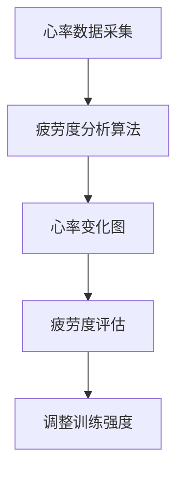

##### 3.1.3 技术动作分析

技术动作分析是指通过对运动员技术动作的捕捉和评估，分析其技术动作的准确性和效率。AI技术可以通过深度学习算法，对运动员的动作进行识别和评估，帮助教练发现动作中的错误，并进行针对性训练。例如，在篮球训练中，AI可以分析运动员的投篮动作，识别出手角度、力度和节奏等方面的不足，并提供改进建议。

**Mermaid 流程图：**
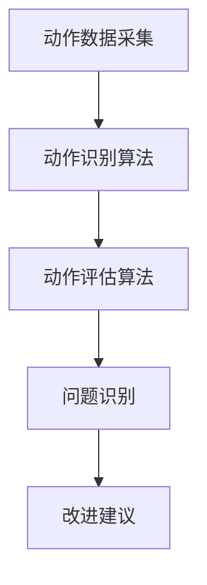

### 3.2 运动员表现预测

运动员表现预测是AI在体育训练中的另一重要应用。通过分析历史数据和实时数据，AI可以预测运动员在比赛中的表现，为教练团队提供决策依据。

##### 3.2.1 数据驱动模型

数据驱动模型是指基于历史数据和实时数据，构建预测模型。这需要通过数据预处理、特征提取和模型训练等步骤，构建一个能够预测运动员表现的模型。例如，通过分析运动员的历史比赛数据，可以预测其在未来比赛中的得分和助攻等表现。

**伪代码：**
```python
def train_predictive_model(data):
    # 数据预处理
    processed_data = preprocess_data(data)
    # 特征提取
    features = extract_features(processed_data)
    # 模型训练
    model = train_model(features)
    # 模型评估
    evaluate_model(model, test_data)
    return model

# 数据预处理
def preprocess_data(data):
    # 数据清洗
    cleaned_data = clean_data(data)
    # 特征提取
    extracted_features = extract_features(cleaned_data)
    # 数据归一化
    normalized_features = normalize_features(extracted_features)
    return normalized_features

# 特征提取
def extract_features(data):
    # 特征选择
    selected_features = select_features(data)
    # 特征提取
    extracted_features = extract(selected_features, data)
    return extracted_features

# 模型训练
def train_model(features):
    # 模型选择
    model = select_model()
    # 模型训练
    trained_model = train(selected_model, features)
    return trained_model

# 模型评估
def evaluate_model(model, test_data):
    # 预测
    predictions = model.predict(test_data)
    # 评估
    evaluate(predictions, ground_truth)
```

##### 3.2.2 模型训练与验证

模型训练与验证是构建有效预测模型的关键步骤。通过交叉验证和性能评估，可以确保模型在未来的预测中具有良好的泛化能力。交叉验证是指将数据集划分为多个子集，每次使用不同的子集作为验证集，进行多次训练和验证。性能评估指标包括准确率、召回率、F1分数等。

**Mermaid 流程图：**
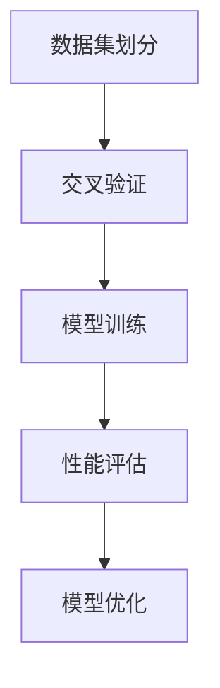

##### 3.2.3 预测结果分析与应用

预测结果分析是指对模型预测结果进行评估和解读，以确定其在实际应用中的有效性。通过分析预测结果，教练团队可以了解运动员的状态和表现，制定针对性的训练和比赛策略。例如，若模型预测某运动员在比赛中得分较高，教练可以增加该运动员的训练强度，提高其比赛表现。

**Mermaid 流程图：**
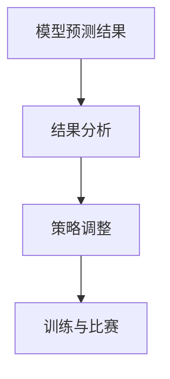

### 3.3 个性化训练方案设计

个性化训练方案设计是AI在体育训练中的另一个重要应用。通过分析运动员的个体差异，AI可以为其量身定制训练方案，提高训练效果。

##### 3.3.1 个性化训练模型

个性化训练模型是指基于运动员的个体数据，构建适应其特点的训练模型。这需要通过数据采集、特征提取和模型训练等步骤，构建一个能够适应运动员个体差异的训练模型。例如，通过分析运动员的历史训练数据和比赛数据，可以构建一个适应其技术特点和身体状态的训练模型。

**伪代码：**
```python
def train_personalized_model(data, athlete_profile):
    # 数据预处理
    processed_data = preprocess_data(data)
    # 特征提取
    extracted_features = extract_features(processed_data)
    # 模型训练
    model = train_model(extracted_features, athlete_profile)
    # 模型评估
    evaluate_model(model, test_data)
    return model

# 数据预处理
def preprocess_data(data):
    # 数据清洗
    cleaned_data = clean_data(data)
    # 特征提取
    extracted_features = extract_features(cleaned_data)
    # 数据归一化
    normalized_features = normalize_features(extracted_features)
    return normalized_features

# 特征提取
def extract_features(data):
    # 特征选择
    selected_features = select_features(data)
    # 特征提取
    extracted_features = extract(selected_features, data)
    return extracted_features

# 模型训练
def train_model(features, athlete_profile):
    # 模型选择
    model = select_model()
    # 模型训练
    trained_model = train(selected_model, features, athlete_profile)
    return trained_model

# 模型评估
def evaluate_model(model, test_data):
    # 预测
    predictions = model.predict(test_data)
    # 评估
    evaluate(predictions, ground_truth)
```

##### 3.3.2 训练方案制定与调整

基于个性化训练模型，教练可以制定适应运动员特点的训练方案。随着训练的进行，模型会不断更新，为训练方案的调整提供依据。例如，若模型预测某运动员在某一技术动作上的表现较差，教练可以增加该技术动作的训练量，以提高其表现。

**Mermaid 流程图：**
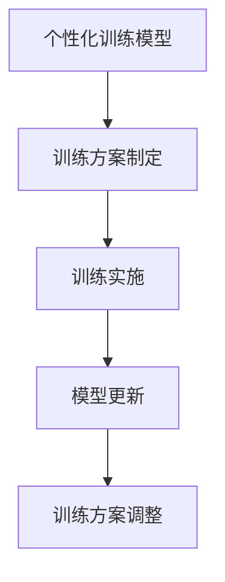

##### 3.3.3 训练效果评估

训练效果评估是确保个性化训练方案有效性的关键。通过分析训练数据，教练可以评估训练效果，并调整训练方案。评估指标包括技术动作的准确性、速度、力量等。

**Mermaid 流程图：**
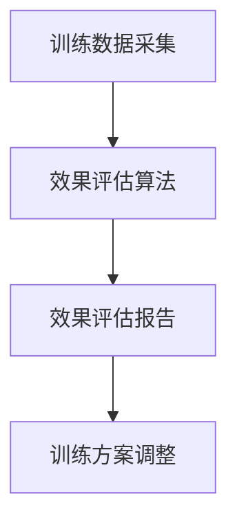

### 总结

AI在体育训练中的应用，通过运动数据分析、运动员表现预测和个性化训练方案设计等方面，为教练和运动员提供了科学、高效的训练方法。随着技术的不断进步，AI在体育训练中的应用将更加广泛和深入，为体育产业的发展带来新的机遇。

## 第4章：AI在战术分析中的应用

AI在战术分析中的应用，使得教练团队能够从海量的比赛数据中提取有价值的信息，从而制定更科学的战术策略。本章将详细介绍AI在战术分析中的多种应用，包括视频分析、数据可视化、动作识别与模仿等方面。

### 4.1 视频分析与识别

视频分析是AI在战术分析中的重要应用之一。通过视频分析，AI可以识别比赛中的关键动作和战术环节，为教练团队提供战术建议。

##### 4.1.1 视频数据预处理

视频数据预处理是视频分析的基础步骤。它包括视频的去噪、去闪烁、裁剪和缩放等操作。这些操作有助于提高视频质量，便于后续的图像处理和分析。

**伪代码：**
```python
def preprocess_video(video):
    # 去噪
    denoised_video = denoise(video)
    # 去闪烁
    deflicker_video = deflicker(denoised_video)
    # 裁剪
    cropped_video = crop(deflicker_video, crop_size)
    # 缩放
    resized_video = resize(cropped_video, resize_size)
    return resized_video
```

##### 4.1.2 视频内容提取

视频内容提取是指从视频中提取出有用的信息，如运动员的位置、动作和战术等。通过图像处理和计算机视觉技术，AI可以实现对视频内容的有效提取。

**伪代码：**
```python
def extract_video_content(video):
    # 视频帧提取
    frames = extract_frames(video)
    # 运动员识别
    athletes = detect_athletes(frames)
    # 动作识别
    actions = detect_actions(frames, athletes)
    # 战术识别
    tactics = detect_tactics(actions)
    return tactics
```

##### 4.1.3 视频分类与标注

视频分类与标注是将视频按照特定的标准进行分类和标注，以便于后续的数据分析和处理。通过视频分类与标注，AI可以更好地理解比赛场景，提取有价值的信息。

**伪代码：**
```python
def classify_and_annotate_video(video, labels):
    # 视频分类
    video_category = classify_video(video, labels)
    # 视频标注
    annotated_video = annotate_video(video, video_category)
    return annotated_video
```

### 4.2 数据可视化与展示

数据可视化是将复杂的体育数据转化为易于理解的形式，如图表、图像和动画等。通过数据可视化，教练团队能够更直观地了解比赛数据和战术信息，从而制定更科学的战术策略。

##### 4.2.1 数据可视化工具

数据可视化工具可以帮助教练团队将数据转化为可视化形式。常用的数据可视化工具有Tableau、Power BI、D3.js等。

**伪代码：**
```python
def visualize_data(data, visualization_tool):
    # 数据转换
    transformed_data = transform_data(data)
    # 可视化展示
    visualization = visualization_tool.show(transformed_data)
    return visualization
```

##### 4.2.2 数据展示技巧

数据展示技巧是指通过优化数据展示方式，提高数据的可读性和吸引力。例如，通过使用不同的图表类型、颜色和字体等，可以更好地传达数据信息。

**伪代码：**
```python
def show_data_with_skills(data):
    # 选择图表类型
    chart_type = select_chart_type(data)
    # 设置颜色和字体
    colors = set_colors(data)
    fonts = set_fonts(data)
    # 可视化展示
    visualization = visualization_tool.show(data, chart_type, colors, fonts)
    return visualization
```

##### 4.2.3 数据交互设计

数据交互设计是指通过交互式界面，使教练团队能够动态地查看和分析数据。例如，通过拖拽、缩放和筛选等操作，教练团队能够实时调整数据展示方式，以获取更详细的信息。

**伪代码：**
```python
def interactive_data_design(data):
    # 创建交互式界面
    interactive_ui = create_interactive_ui(data)
    # 实时数据更新
    update_data_interactively(data, interactive_ui)
    return interactive_ui
```

### 4.3 战术分析与决策

战术分析是指通过分析比赛数据，识别出对手的战术弱点，并制定相应的对策。AI可以通过学习历史比赛数据，构建战术分析模型，为教练团队提供战术建议。

##### 4.3.1 战术模型构建

战术模型构建是指通过机器学习算法，从历史比赛数据中提取出战术特征，并构建战术分析模型。这需要通过数据预处理、特征提取和模型训练等步骤。

**伪代码：**
```python
def build_tactical_model(data):
    # 数据预处理
    processed_data = preprocess_data(data)
    # 特征提取
    extracted_features = extract_features(processed_data)
    # 模型训练
    model = train_model(extracted_features)
    return model
```

##### 4.3.2 战术分析流程

战术分析流程是指通过一系列步骤，对比赛数据进行分析，并生成战术分析报告。这包括数据采集、数据预处理、特征提取、模型训练和预测等步骤。

**Mermaid 流程图：**
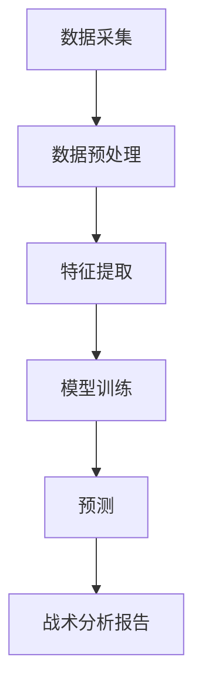

##### 4.3.3 战术决策支持系统

战术决策支持系统是指通过AI技术，为教练团队提供实时战术建议的系统。该系统可以根据实时比赛数据，动态调整战术策略，以提高比赛胜率。

**Mermaid 流程图：**
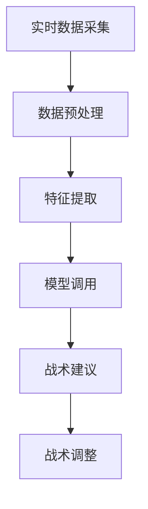

### 总结

AI在战术分析中的应用，通过视频分析、数据可视化和动作识别与模仿等方面，为教练团队提供了科学、高效的战术分析工具。随着技术的不断进步，AI在战术分析中的应用将更加广泛和深入，为体育产业的发展带来新的机遇。

## 第5章：AI在体育比赛中的应用

AI在体育比赛中的应用，不仅为教练和运动员提供了强大的技术支持，也改变了体育比赛的策略和决策方式。本章将深入探讨AI在体育比赛中的实时分析、结果预测和策略制定等方面的应用。

### 5.1 比赛实时分析

比赛实时分析是指通过AI技术，对比赛过程中的各项数据进行实时捕捉和分析，为教练和运动员提供即时的策略调整和战术建议。

##### 5.1.1 实时数据采集

实时数据采集是比赛实时分析的基础。通过传感器、摄像头和传感器等设备，可以实时捕捉运动员的速度、位置、心率、血压等数据。这些数据通过无线网络传输到云端，供AI模型进行分析。

**伪代码：**
```python
def collect_realtime_data(sensors, camera):
    # 采集速度数据
    speed_data = sensors.get_speed_data()
    # 采集位置数据
    position_data = sensors.get_position_data()
    # 采集心率数据
    heart_rate_data = sensors.get_heart_rate_data()
    # 采集摄像头图像
    camera_image = camera.capture_image()
    # 数据传输
    transmit_data(speed_data, position_data, heart_rate_data, camera_image)
```

##### 5.1.2 实时数据分析

实时数据分析是指利用AI算法，对采集到的实时数据进行分析和处理，提取有价值的信息。例如，通过分析运动员的速度和位置数据，可以实时了解运动员的跑动轨迹和战术执行情况。

**伪代码：**
```python
def analyze_realtime_data(data):
    # 数据预处理
    processed_data = preprocess_data(data)
    # 特征提取
    extracted_features = extract_features(processed_data)
    # 模型预测
    predictions = model.predict(extracted_features)
    # 结果输出
    output_results(predictions)
```

##### 5.1.3 实时策略调整

实时策略调整是指根据实时数据分析的结果，动态调整比赛策略。例如，如果AI分析发现对方队伍在防守端存在漏洞，教练可以调整战术，增加进攻频率。

**伪代码：**
```python
def adjust_realtime_strategy(predictions):
    # 战术调整
    strategy = adjust_tactic(predictions)
    # 比赛执行
    execute_strategy(strategy)
```

### 5.2 比赛结果预测

比赛结果预测是AI在体育比赛中的另一个重要应用。通过分析历史比赛数据和实时数据，AI可以预测比赛结果，为教练和运动员提供策略参考。

##### 5.2.1 预测模型构建

预测模型构建是指通过机器学习算法，构建一个能够预测比赛结果的模型。这需要通过数据预处理、特征提取和模型训练等步骤。

**伪代码：**
```python
def build_prediction_model(data):
    # 数据预处理
    processed_data = preprocess_data(data)
    # 特征提取
    extracted_features = extract_features(processed_data)
    # 模型训练
    model = train_model(extracted_features)
    return model
```

##### 5.2.2 预测结果分析

预测结果分析是指对预测模型生成的结果进行分析和解读，以确定其在实际应用中的有效性。例如，通过分析预测结果，可以了解比赛胜率的变化趋势，为教练和运动员提供决策依据。

**伪代码：**
```python
def analyze_prediction_results(predictions):
    # 预测结果分析
    analysis = analyze_predictions(predictions)
    # 决策支持
    provide_decision_support(analysis)
```

##### 5.2.3 预测应用场景

比赛结果预测可以应用于多个场景，如比赛前的战术规划、比赛中的实时策略调整和比赛后的数据分析等。例如，在比赛前，教练可以通过预测结果了解对手的弱点，制定针对性的战术；在比赛中，教练可以根据实时预测结果，动态调整战术策略；在比赛后，教练可以通过对预测结果的回顾，分析比赛中的问题，为下一场比赛做准备。

**伪代码：**
```python
def apply_prediction_results(predictions, scenario):
    if scenario == "pre_match":
        # 比赛前战术规划
        plan_tactics(predictions)
    elif scenario == "real_time":
        # 实时策略调整
        adjust_real_time_strategy(predictions)
    elif scenario == "post_match":
        # 比赛后数据分析
        analyze_post_match_data(predictions)
```

### 5.3 比赛策略制定

比赛策略制定是指根据比赛数据、预测结果和实时分析结果，制定比赛策略。AI技术可以帮助教练团队更科学地制定比赛策略，提高比赛胜率。

##### 5.3.1 策略分析工具

策略分析工具是指利用AI技术，对比赛数据进行分析和预测的工具。这些工具可以提供比赛胜率、战术效果和对手弱点等分析结果，为教练团队制定比赛策略提供支持。

**伪代码：**
```python
def strategy_analysis_tool(data, predictions):
    # 数据分析
    analysis = analyze_data(data, predictions)
    # 策略建议
    suggest_tactics(analysis)
```

##### 5.3.2 策略制定流程

策略制定流程是指通过一系列步骤，制定比赛策略。这包括数据收集、数据分析、预测结果分析和策略建议等步骤。

**Mermaid 流程图：**
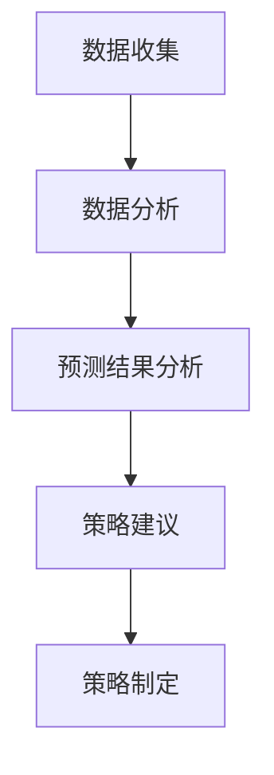

##### 5.3.3 策略评估与优化

策略评估与优化是指对制定的策略进行评估和优化，以提高比赛胜率。通过实时数据分析和比赛结果预测，可以评估策略的有效性，并对其进行优化。

**伪代码：**
```python
def evaluate_and_optimize_strategy(strategy, data, predictions):
    # 策略评估
    evaluation = evaluate_strategy(strategy, data, predictions)
    # 策略优化
    optimized_strategy = optimize_strategy(evaluation)
    return optimized_strategy
```

### 总结

AI在体育比赛中的应用，通过实时分析、结果预测和策略制定等方面，为教练和运动员提供了科学、高效的支持。随着技术的不断进步，AI在体育比赛中的应用将更加广泛和深入，为体育产业的发展带来新的机遇。

## 第6章：AI在体育领域的挑战与未来发展

### 6.1 数据隐私与伦理问题

随着AI在体育领域的广泛应用，数据隐私和伦理问题也逐渐凸显。运动员的个人信息、训练数据和比赛数据等敏感信息，在AI应用过程中可能会被泄露或滥用，引发隐私保护问题。此外，AI算法的决策过程往往不透明，可能导致歧视和不公平现象。

##### 6.1.1 数据隐私保护

为了保护数据隐私，需要采取以下措施：

1. **数据加密**：对敏感数据进行加密处理，确保数据在传输和存储过程中不被窃取。
2. **隐私政策**：制定明确的隐私政策，告知运动员其数据的收集、使用和共享方式，确保其知情同意。
3. **匿名化处理**：对敏感数据进行匿名化处理，消除数据与个人身份的直接关联。

##### 6.1.2 伦理问题与对策

AI在体育领域的应用可能引发以下伦理问题：

1. **算法歧视**：AI算法可能因数据偏差而歧视某些群体。
2. **透明性不足**：AI决策过程不透明，可能导致运动员和教练无法理解决策依据。

解决这些伦理问题的对策包括：

1. **公平性评估**：定期对AI算法进行公平性评估，确保其不歧视任何群体。
2. **透明性改进**：提高AI算法的透明度，使其决策过程更容易理解和解释。

### 6.2 技术发展与创新

AI技术在体育领域的应用前景广阔，未来可能会出现以下技术发展趋势：

##### 6.2.1 AI算法改进

随着AI算法的不断改进，模型的性能和效率将得到提升。例如，深度学习算法的发展，将使得AI在处理复杂数据和分析运动动作方面更加出色。

##### 6.2.2 新技术趋势与应用

未来，AI在体育领域的新技术趋势包括：

1. **增强现实（AR）与虚拟现实（VR）**：通过AR和VR技术，运动员可以进行沉浸式训练和比赛体验，提高训练效果。
2. **区块链技术**：利用区块链技术，可以确保数据的安全性和不可篡改性，提高数据隐私保护水平。

### 6.3 AI在体育行业的未来展望

随着技术的不断发展，AI在体育领域的应用将更加深入和广泛。未来，AI有望在以下几个方面发挥重要作用：

##### 6.3.1 AI在体育训练中的应用前景

1. **个性化训练**：AI将根据运动员的个体差异，为其量身定制训练计划，提高训练效果。
2. **预防运动损伤**：通过实时监测运动员的身体状态，AI可以提前预警运动损伤，防止事故发生。

##### 6.3.2 AI在战术分析中的应用前景

1. **实时战术调整**：AI将根据比赛实时数据，动态调整战术策略，提高比赛胜率。
2. **对手分析**：AI将分析对手的战术和弱点，为教练提供针对性的战术建议。

##### 6.3.3 AI在体育产业中的整体影响

AI将改变体育产业的方方面面，包括：

1. **训练效率提升**：通过AI技术，运动员和教练可以更高效地进行训练和战术分析，提高整体竞争力。
2. **数据驱动决策**：AI将帮助体育从业者基于数据做出更科学的决策，提升管理水平。
3. **创新商业模式**：AI将推动体育产业的商业模式创新，为体育企业提供更多发展机遇。

### 总结

AI在体育领域的挑战与未来发展，关乎数据隐私和伦理问题的解决，以及技术的持续创新。在未来的发展中，AI将进一步提升体育训练和战术分析的水平，推动体育产业的繁荣发展。

## 总结

### AI在体育训练和战术分析中的应用

AI技术在体育训练和战术分析中的应用，为体育产业带来了深远的影响。通过运动数据分析、运动员表现预测、个性化训练方案设计、视频分析、数据可视化、战术模型构建等方面，AI为教练和运动员提供了科学、高效的辅助工具，提高了训练效果和比赛胜率。

### 核心内容与原理

本文详细介绍了AI在体育领域的核心概念与原理，包括机器学习、深度学习、神经网络等。通过这些核心技术的应用，AI能够处理和分析大量体育数据，为训练和战术分析提供有力支持。

### 未来发展趋势

随着AI技术的不断进步，其在体育领域的应用前景将更加广阔。未来，AI有望在个性化训练、实时战术调整、数据隐私保护、技术创新等方面发挥更大作用，推动体育产业的繁荣发展。

### 结论

AI在体育训练和战术分析中的应用，不仅提高了训练效果和战术水平，也为体育产业带来了新的机遇。通过持续的技术创新和优化，AI将继续为体育领域带来更多的价值。

### 作者信息

**作者：AI天才研究院/AI Genius Institute & 禅与计算机程序设计艺术 /Zen And The Art of Computer Programming**

以上，本文对AI在体育训练和战术分析中的应用进行了全面而深入的探讨，希望对读者有所启发和帮助。

