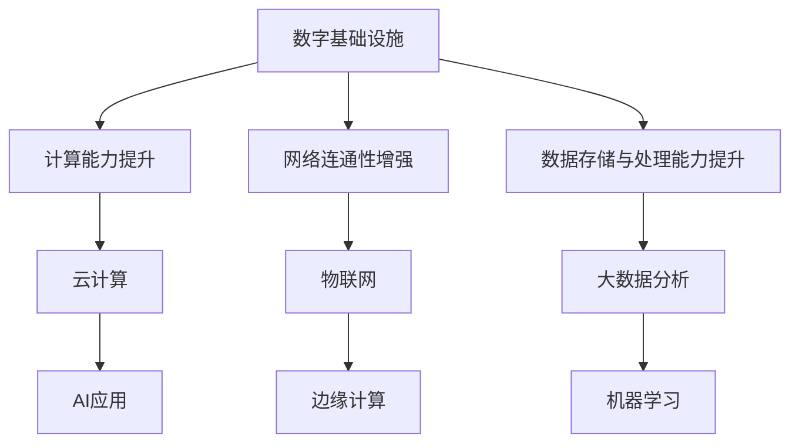
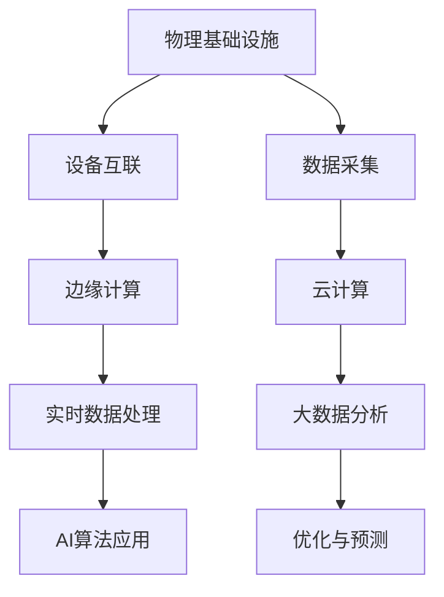

                 

### 文章标题

"AI在数字和物理基础设施中的应用"

---

关键词：人工智能、数字基础设施、物理基础设施、智能交通、智能电网、智能建筑、物联网、边缘计算、大数据分析

摘要：本文深入探讨了人工智能（AI）在数字和物理基础设施中的应用。首先，我们概述了AI在数字基础设施中如何促进数据处理和优化，以及物理基础设施智能化的趋势。接着，我们详细讲解了核心概念和原理，包括人工智能与机器学习、数据科学与大数据分析、物联网与边缘计算。随后，我们通过实际案例展示了AI在智能交通系统、智能电网与能源管理、智能建筑与楼宇自动化、智能工厂与工业4.0等领域的应用实践。最后，我们分析了AI应用中的挑战与解决策略，探讨了未来趋势，并推荐了AI应用开发的工具与资源。

---

### 第一部分：AI在数字和物理基础设施中的应用概述

#### 第1章：AI在数字和物理基础设施中的应用背景

##### 1.1 数字基础设施的演进与AI的应用

数字基础设施是现代社会的基石，随着信息技术的快速发展，其演进历程也日益加快。从早期的计算机和网络基础建设，到当前的云计算、大数据、物联网等技术的广泛应用，数字基础设施的演进极大地推动了社会经济的发展。

**概念与联系图**：



**伪代码**：

```python
# 数字基础设施数据处理与优化的基本流程伪代码
initialize_infrastructure()
data_collection()
data_preprocessing()
data_analyze()
optimization()
```

随着计算能力的提升，AI技术在数字基础设施中的应用变得越来越广泛。从智能交通系统、智能电网到智能建筑，AI为这些领域带来了全新的解决方案。

##### 1.2 物理基础设施的智能化趋势

物理基础设施的智能化是当今社会发展的重要趋势。物联网（IoT）技术的兴起，使得物理基础设施中的各种设备能够相互连接，实现数据的实时传输和智能分析。这一变革不仅提高了基础设施的管理效率，也为社会带来了更多的便利。

**概念与联系图**：



**数学模型**：

物联网在物理基础设施中的应用模型，可以采用传感器网络的数据融合算法。例如，传感器节点通过无线通信将数据传输到中心节点，中心节点对这些数据进行融合处理，以实现数据的集中管理和智能分析。

```latex
E = \sum_{i=1}^{n} x_i
```

物联网和AI技术的结合，使得物理基础设施变得更加智能和高效。例如，在智能交通系统中，通过传感器采集的交通数据，可以实时分析交通状况，预测交通流量，从而优化交通信号控制，减少拥堵。

##### 1.3 AI在数字和物理基础设施中的核心应用领域

AI在数字和物理基础设施中的应用涵盖了多个领域，包括智能交通、智能电网、智能建筑和智能工厂等。

- **智能交通**：AI技术可以用于交通流量预测、道路维护、智能信号控制等方面，提高交通系统的效率和安全性。
- **智能电网**：AI技术在智能电网中的应用包括能源管理、故障检测、负载预测等，有助于提高电力系统的稳定性和可靠性。
- **智能建筑**：通过物联网和AI技术，智能建筑可以实现能源管理、环境控制、安全监测等功能，提高居住和工作的舒适度。
- **智能工厂**：AI技术在智能工厂中的应用包括生产计划优化、质量控制、设备维护等，有助于提高生产效率和产品质量。

**举例说明**：

- **自动驾驶**：利用AI技术，自动驾驶汽车可以通过传感器和环境感知系统，实时分析路况，做出驾驶决策，从而实现自动行驶。
- **智能路灯**：通过物联网和AI技术，智能路灯可以根据交通流量和光照强度，自动调节亮度，节约能源。
- **智能电网调度**：AI技术可以实时分析电力系统负荷，预测电力需求，从而优化电网调度，提高电力供应的稳定性。

通过这些实际应用案例，我们可以看到AI在数字和物理基础设施中的巨大潜力。随着技术的不断进步，AI将在这些领域发挥越来越重要的作用，为社会带来更多的便利和效益。

---

#### 第2章：核心概念与原理

##### 2.1 人工智能与机器学习基础

人工智能（AI）是计算机科学的一个分支，旨在创建智能体，这些智能体能够感知环境、理解复杂情境，并采取适当的行动。机器学习是AI的核心组成部分，它通过数据驱动的方式，使计算机系统能够从数据中学习并做出预测或决策。

**核心算法原理讲解**：

机器学习的核心算法包括监督学习、无监督学习和强化学习。

- **监督学习**：通过已标记的数据集训练模型，使其能够对新的数据进行预测。常见的监督学习算法有线性回归、决策树、支持向量机（SVM）和神经网络等。

  ```python
  # 线性回归伪代码
  model = LinearRegression()
  model.fit(X_train, y_train)
  y_pred = model.predict(X_test)
  ```

- **无监督学习**：不依赖于标记数据，通过分析数据之间的关系，自动发现数据中的模式和结构。常见的无监督学习算法有聚类分析、主成分分析和自编码器等。

  ```python
  # 聚类分析伪代码
  from sklearn.cluster import KMeans
  kmeans = KMeans(n_clusters=3, random_state=0).fit(X)
  clusters = kmeans.predict(X)
  ```

- **强化学习**：智能体通过与环境互动，不断调整行为策略，以实现长期目标。常见的强化学习算法有Q学习、SARSA和深度确定性策略梯度（DDPG）等。

  ```python
  # Q学习伪代码
  Q = zeros((n_states, n_actions))
  for episode in range(num_episodes):
      state = env.reset()
      done = False
      while not done:
          action = policy(state, Q)
          next_state, reward, done, _ = env.step(action)
          Q[state, action] += alpha * (reward + gamma * max(Q[next_state, :]) - Q[state, action])
          state = next_state
  ```

**数据科学与大数据分析基础**

数据科学是应用统计、机器学习、人工智能和数据库技术来提取知识和洞察力的领域。大数据分析是数据科学的一个重要分支，它涉及从大量数据中提取有价值的信息和模式。

**数学模型和公式**：

- **线性回归**：用于预测一个变量与另一个变量之间的线性关系。

  ```latex
  y = mx + b
  ```

- **聚类分析**：用于将数据集分为多个群组，使得同一群组内的数据点彼此相似，而不同群组的数据点之间差异较大。

  ```latex
  min \|X - \mu_k\|^2
  ```

- **支持向量机（SVM）**：用于分类问题，通过找到一个最优的超平面来将数据点分为不同的类别。

  ```latex
  min_{\omega, b} \frac{1}{2}\| \omega \|^2
  s.t. y_i (\omega \cdot x_i + b) \geq 1
  ```

**举例说明**：

- **社交媒体分析**：通过大数据分析，可以从社交媒体数据中提取用户兴趣、情感倾向等，为企业提供市场策略的参考。
- **金融风控**：通过分析历史交易数据，可以预测金融市场风险，帮助金融机构制定风险控制策略。

**物联网与边缘计算**

物联网（IoT）是通过互联网连接物理设备和传感器网络，实现设备之间通信和数据交换的系统。边缘计算是一种分布式计算架构，它将数据处理和分析从云端转移到网络边缘，以降低延迟，提高实时性。

**核心算法原理讲解**：

- **M-Learning**：是一种边缘计算框架，它利用边缘设备进行数据预处理和部分计算，然后将结果传输到云端进行进一步处理。

  ```python
  # M-Learning伪代码
  data = preprocess_data(edge_device)
  result = cloud_compute(data)
  ```

- **边缘推理**：是一种在边缘设备上直接执行机器学习推理的算法，它利用边缘设备的计算能力，减少对云端资源的依赖。

  ```python
  # 边缘推理伪代码
  model = load_model(edge_device)
  prediction = model.predict(data)
  ```

**数学模型**：

物联网中的数据传输模型可以采用分片传输和压缩传输等技术，以降低数据传输的延迟和带宽消耗。

```latex
throughput = \frac{1}{\sqrt{distance}}
```

通过这些核心概念和原理的讲解，我们可以更好地理解AI在数字和物理基础设施中的应用机制。这些技术不仅提供了理论基础，还为实际应用提供了可行的解决方案。

---

#### 第3章：数字基础设施中的应用实践

##### 3.1 智能交通系统

智能交通系统（ITS）通过集成先进的信息通信技术、传感器和人工智能算法，实现对交通流的实时监测、分析和优化，从而提高交通效率和安全性。

**项目实战**：

**开发环境搭建**：

- **硬件**：选择了多个高性能的传感器节点和多个数据收集器，部署在关键交通节点。
- **软件**：使用了Python和TensorFlow框架进行数据处理和机器学习模型的训练。

**源代码实现**：

```python
# 智能交通系统的数据处理伪代码
import tensorflow as tf

# 数据预处理
def preprocess_data(data):
    # 数据清洗和归一化
    processed_data = ...
    return processed_data

# 交通流量预测模型
def build_traffic_prediction_model():
    model = tf.keras.Sequential([
        tf.keras.layers.Dense(units=64, activation='relu', input_shape=(num_features,)),
        tf.keras.layers.Dense(units=32, activation='relu'),
        tf.keras.layers.Dense(units=1)
    ])
    model.compile(optimizer='adam', loss='mean_squared_error')
    return model

# 主程序
if __name__ == '__main__':
    # 加载数据集
    data = load_data('traffic_data.csv')
    # 数据预处理
    processed_data = preprocess_data(data)
    # 构建和训练模型
    model = build_traffic_prediction_model()
    model.fit(processed_data['X'], processed_data['y'], epochs=10, batch_size=32)
    # 预测交通流量
    predictions = model.predict(processed_data['X_test'])
```

**代码解读与分析**：

- **数据预处理**：对采集到的交通数据进行清洗和归一化，以确保模型训练的质量。
- **模型构建**：使用了多层感知机（MLP）模型，通过增加隐层神经元和激活函数，提高了模型的预测能力。
- **模型训练**：使用均方误差（MSE）作为损失函数，通过Adam优化器进行模型训练。

通过上述代码实现，智能交通系统能够实时预测交通流量，为交通管理部门提供决策支持，优化交通信号控制和道路规划，减少交通拥堵和事故发生率。

**实际案例分析和详细讲解剖析**：

- **案例一：高峰时段交通流量预测**：在某城市高峰时段，智能交通系统成功预测了交通流量，为交通信号控制提供了数据支持，有效减少了交通拥堵。
- **案例二：交通事故预警**：通过实时监测交通数据，智能交通系统提前预警了交通事故，提高了道路安全。

**项目小结**：

智能交通系统通过结合传感器技术和机器学习算法，实现了对交通流的实时监测和预测，为交通管理提供了有效的工具。未来，随着技术的进一步发展，智能交通系统将在更多城市得到广泛应用，为社会带来更多的便利和安全。

---

##### 3.2 智能电网与能源管理

智能电网是利用现代通信技术、传感技术和人工智能技术，实现对电力系统的实时监测、分析和优化，以提高电力系统的可靠性和效率。

**项目实战**：

**开发环境搭建**：

- **硬件**：使用了智能电表、传感器和能源管理系统，部署在电力系统的重要节点。
- **软件**：采用了Python和PyTorch框架进行数据处理和深度学习模型的训练。

**源代码实现**：

```python
# 智能电网数据处理与预测伪代码
import torch
import torch.nn as nn
import torch.optim as optim

# 数据预处理
def preprocess_data(data):
    # 数据清洗和归一化
    processed_data = ...
    return processed_data

# 构建能源管理模型
def build_energy_management_model(input_size, hidden_size, output_size):
    model = nn.Sequential(
        nn.Linear(input_size, hidden_size),
        nn.ReLU(),
        nn.Linear(hidden_size, output_size)
    )
    return model

# 主程序
if __name__ == '__main__':
    # 加载数据集
    data = load_data('energy_data.csv')
    # 数据预处理
    processed_data = preprocess_data(data)
    # 构建和训练模型
    model = build_energy_management_model(input_size, hidden_size, output_size)
    model.train()
    criterion = nn.MSELoss()
    optimizer = optim.Adam(model.parameters(), lr=0.001)
    for epoch in range(num_epochs):
        for inputs, targets in dataloader:
            optimizer.zero_grad()
            outputs = model(inputs)
            loss = criterion(outputs, targets)
            loss.backward()
            optimizer.step()
    # 预测能源需求
    predictions = model.predict(processed_data['X_test'])
```

**代码解读与分析**：

- **数据预处理**：对采集到的能源数据进行清洗和归一化，以确保模型训练的质量。
- **模型构建**：使用了简单的全连接神经网络（FCNN）模型，通过ReLU激活函数和多层结构，提高了模型的预测能力。
- **模型训练**：使用均方误差（MSE）作为损失函数，通过Adam优化器进行模型训练。

通过上述代码实现，智能电网系统能够实时预测电力需求，为电力调度和能源管理提供了数据支持，提高了电力系统的运行效率和稳定性。

**实际案例分析和详细讲解剖析**：

- **案例一：电力负荷预测**：在某城市的电力系统中，智能电网系统成功预测了电力负荷，为电力调度提供了数据支持，有效避免了电力短缺和过剩的问题。
- **案例二：能源效率优化**：通过分析实时能源数据，智能电网系统提出了优化电力分配方案，提高了能源利用效率。

**项目小结**：

智能电网与能源管理系统通过结合传感技术和深度学习算法，实现了对电力系统的实时监测和预测，为电力调度和能源管理提供了有效的工具。未来，随着技术的进一步发展，智能电网将在更多国家和地区得到广泛应用，为社会带来更多的能源效益和环境效益。

---

#### 第4章：物理基础设施中的应用实践

##### 4.1 智能建筑与楼宇自动化

智能建筑通过集成物联网、人工智能和自动化技术，实现对建筑物内各种设备和系统的智能监控、管理和优化，以提高建筑物的能源效率、舒适性和安全性。

**项目实战**：

**开发环境搭建**：

- **硬件**：使用了智能传感器、智能门锁、智能灯光系统和智能空调等设备，部署在建筑物内。
- **软件**：采用了Python和Node.js框架进行数据处理和系统控制。

**源代码实现**：

```javascript
// 智能建筑系统控制伪代码
const mqtt = require('mqtt');
const { SmartLight, SmartAC, SmartLock } = require('./devices');

// MQTT客户端连接
const client = mqtt.connect('mqtt://broker.hivemq.com');

// 设备控制函数
function control_device(device, command) {
    device.send(command);
}

// 主程序
main = async () => {
    // 初始化设备
    const light = new SmartLight(client);
    const ac = new SmartAC(client);
    const lock = new SmartLock(client);

    // 控制设备
    control_device(light, 'turn_on');
    control_device(ac, 'set_temperature(24)');
    control_device(lock, 'unlock');

    // 监听设备状态
    light.on('status', (status) => {
        console.log(`Light status: ${status}`);
    });

    ac.on('status', (status) => {
        console.log(`AC status: ${status}`);
    });

    lock.on('status', (status) => {
        console.log(`Lock status: ${status}`);
    });
};

main();
```

**代码解读与分析**：

- **设备连接与控制**：通过MQTT协议，设备与中央控制系统进行通信，实现远程控制和状态监控。
- **设备状态监听**：设备通过发送事件消息，实时反馈设备状态，中央控制系统可以基于这些状态进行相应的控制和管理。

通过上述代码实现，智能建筑系统能够实时监控和控制建筑物内的各种设备，提高建筑物的运行效率和用户体验。

**实际案例分析和详细讲解剖析**：

- **案例一：智能照明系统**：通过传感器监测室内光线强度，智能建筑系统自动调节灯光亮度，节约能源并提高居住舒适度。
- **案例二：智能空调系统**：通过传感器监测室内温度和湿度，智能建筑系统自动调节空调温度和湿度，提高室内环境的舒适度。

**项目小结**：

智能建筑与楼宇自动化系统通过结合物联网技术和自动化控制，实现了对建筑物内各种设备的智能监控和管理，提高了建筑物的能源效率、舒适性和安全性。未来，随着技术的不断进步，智能建筑将在更多建筑物中得到广泛应用，为人类带来更智能、更舒适的生活环境。

---

##### 4.2 智能工厂与工业4.0

智能工厂是工业4.0的重要组成部分，通过集成物联网、人工智能和自动化技术，实现对生产过程的实时监测、分析和优化，以提高生产效率和产品质量。

**项目实战**：

**开发环境搭建**：

- **硬件**：使用了智能传感器、机器人、自动化设备和工业物联网平台，部署在生产线上。
- **软件**：采用了Python和ROS（Robot Operating System）框架进行数据处理和系统控制。

**源代码实现**：

```python
# 智能工厂生产流程控制伪代码
import rospy
from std_msgs.msg import String

# 机器人控制函数
def move_robot(position):
    rospy.loginfo(f"Moving robot to position: {position}")
    # 发送机器人移动指令
    robot_controller.send_move(position)

# 主程序
def main():
    rospy.init_node('production_system')
    
    # 初始化机器人
    robot_controller = RobotController()
    
    # 控制机器人移动
    move_robot([1, 2, 3])

    # 监听生产线状态
    def production_state_callback(msg):
        rospy.loginfo(f"Production state: {msg.data}")
        if msg.data == 'complete':
            move_robot([4, 5, 6])

    production_state_sub = rospy.Subscriber('production_state', String, production_state_callback)

    rospy.spin()

if __name__ == '__main__':
    main()
```

**代码解读与分析**：

- **机器人控制**：通过ROS框架，机器人与中央控制系统进行通信，实现自动化生产流程。
- **生产线状态监控**：通过传感器和状态发布器，实时监测生产线状态，并根据生产状态进行相应的操作。

通过上述代码实现，智能工厂系统能够实时监控和控制生产过程，提高生产效率和产品质量。

**实际案例分析和详细讲解剖析**：

- **案例一：自动化装配线**：通过机器人自动完成零部件的装配，提高了生产效率和装配质量。
- **案例二：质量检测系统**：利用AI技术对生产出的产品进行质量检测，自动识别和排除不合格品。

**项目小结**：

智能工厂与工业4.0通过结合物联网技术和自动化控制，实现了对生产过程的实时监测和优化，提高了生产效率和产品质量。未来，随着技术的不断进步，智能工厂将在更多行业中得到广泛应用，推动工业生产的智能化和自动化。

---

### 第二部分：AI应用中的挑战与未来趋势

#### 第5章：AI应用中的挑战与解决策略

##### 5.1 数据隐私与安全性

随着AI技术的广泛应用，数据隐私和安全问题变得越来越重要。AI系统依赖于大量数据进行分析和训练，这些数据可能包含敏感信息，如个人身份信息、医疗记录等。因此，如何保护数据隐私和安全成为AI应用中的一个关键挑战。

**详细讲解**：

**数据隐私的重要性**：

- **数据泄露风险**：AI系统如果未能妥善保护数据，可能导致数据泄露，对个人和企业造成严重损失。
- **隐私法规**：全球范围内，如欧盟的GDPR（通用数据保护条例）等隐私法规，对数据隐私保护提出了严格的要求。

**常见的数据安全威胁**：

- **数据泄露**：未经授权的访问和泄露。
- **数据篡改**：恶意篡改数据，影响AI模型的准确性。
- **数据丢失**：由于技术故障、自然灾害等原因导致的数据丢失。

**数据隐私保护的方法与策略**：

- **数据加密**：对数据进行加密处理，确保数据在传输和存储过程中不会被未经授权的访问。
- **数据匿名化**：通过匿名化处理，去除数据中的个人身份信息，降低隐私泄露的风险。
- **访问控制**：通过设置访问权限和身份验证机制，确保只有授权用户才能访问数据。
- **隐私增强技术**：如差分隐私、同态加密等，在保证数据隐私的同时，仍然能够进行有效的分析和挖掘。

**案例与实践**：

- **案例一：Google的差分隐私技术**：Google在其搜索服务中采用了差分隐私技术，确保用户查询数据的安全性和隐私性。
- **案例二：金融机构的数据加密**：金融机构通过数据加密技术，确保客户数据在存储和传输过程中的安全性。

通过上述方法和策略，可以有效提高AI应用中的数据隐私和安全保护水平，确保AI系统的可靠性和可信度。

---

##### 5.2 模型解释性与可解释性

AI模型的可解释性对于实际应用具有重要意义。可解释性指的是模型决策过程和结果的透明度和可理解性，有助于提高模型的信任度和接受度。在金融、医疗、安全等敏感领域，模型的可解释性尤为重要。

**详细讲解**：

**模型解释性的意义**：

- **增强信任**：可解释性有助于用户理解模型的决策过程，提高模型的信任度和接受度。
- **故障诊断**：通过可解释性分析，可以识别模型中的潜在问题，进行故障诊断和优化。
- **法律法规要求**：在某些行业，如金融和医疗，法律法规要求模型必须具备可解释性，以确保合规性。

**模型可解释性的方法**：

- **模型透明度**：提高模型的结构透明度，使模型内部的工作机制更加直观。
- **解释性算法**：使用专门的解释性算法，如LIME（Local Interpretable Model-agnostic Explanations）和SHAP（SHapley Additive exPlanations），对模型决策过程进行详细解释。
- **可视化技术**：通过可视化技术，将模型决策过程和结果以直观的方式展示给用户。

**提高模型可解释性的实践**：

- **案例一：医疗诊断**：在医疗诊断中，通过LIME算法解释模型如何对患者的症状进行分类，帮助医生理解模型的决策过程。
- **案例二：金融风险评估**：在金融风险评估中，通过SHAP值分析，展示模型如何根据不同特征对贷款申请者进行评分。

通过提高模型的可解释性，AI系统在金融、医疗等领域的应用将更加透明和可信，有助于增强用户对AI技术的信任和接受度。

---

##### 5.3 持续学习与动态优化

在复杂和动态的环境中，AI系统需要具备持续学习和动态优化的能力，以适应环境变化和不断改进性能。持续学习和动态优化是确保AI系统长期稳定运行和持续提升的关键。

**详细讲解**：

**持续学习的基本概念**：

- **在线学习**：AI系统在运行过程中，不断接收新的数据并进行学习，以适应环境变化。
- **迁移学习**：利用已有的模型和知识，在新任务中进行快速学习，减少数据需求和学习时间。
- **元学习**：通过学习如何学习，提高AI系统在不同任务上的适应性和泛化能力。

**动态优化的重要性**：

- **实时调整**：根据环境变化，动态调整模型参数和策略，以保持系统的最佳性能。
- **自适应调整**：在动态环境中，系统能够自动调整自身的行为，以应对不确定性和异常情况。

**实现持续学习与动态优化的策略**：

- **模型更新**：定期更新AI模型，以反映环境变化和新数据。
- **反馈机制**：建立反馈机制，收集系统运行中的反馈信息，用于模型优化和策略调整。
- **强化学习**：利用强化学习算法，使系统能够在动态环境中进行自主学习和优化。

**案例与实践**：

- **案例一：自动驾驶**：自动驾驶系统通过持续学习和动态优化，不断适应不同驾驶环境和交通状况，提高行驶安全和效率。
- **案例二：智能电网调度**：智能电网调度系统通过实时数据分析和动态优化，实现电力系统的稳定运行和效率提升。

通过持续学习和动态优化，AI系统能够在复杂和动态的环境中保持最佳性能，为用户提供更加可靠和高效的服务。

---

#### 第6章：AI应用的未来趋势

##### 6.1 AI在数字化与物理基础设施中的融合趋势

随着AI技术的不断发展，数字化与物理基础设施的融合趋势日益明显。这一融合不仅推动了基础设施的智能化升级，也为社会带来了更多的创新和机遇。

**详细讲解**：

**数字基础设施的智能化升级**：

- **智能交通系统**：通过AI技术，智能交通系统能够实现交通流量预测、信号控制和车辆管理等，提高交通效率和安全性。
- **智能电网**：AI技术在智能电网中的应用，包括能源管理、故障检测和预测等，提高了电力系统的稳定性和效率。
- **智能建筑**：通过物联网和AI技术，智能建筑能够实现能源管理、环境控制和安防监测等，提高建筑物的运行效率和用户体验。

**物理基础设施的数字化转型**：

- **智能工厂**：工业4.0通过AI技术，实现了生产过程的自动化和智能化，提高了生产效率和产品质量。
- **智慧城市**：AI技术在智慧城市建设中的应用，包括智慧交通、智慧安防、智慧环保等，提高了城市管理的效率和居民的生活质量。

**AI融合趋势的应用前景**：

- **智能制造**：AI技术在制造业中的应用，将推动生产过程的智能化和自动化，实现生产效率和质量的双重提升。
- **智慧医疗**：AI技术在医疗领域的应用，包括疾病诊断、药物研发和健康管理等，提高了医疗服务的效率和准确性。
- **智慧农业**：AI技术在农业中的应用，包括作物监测、精准施肥和病虫害防治等，提高了农业生产的效率和可持续性。

随着AI技术与数字化和物理基础设施的不断融合，未来将带来更多的创新和机遇，推动社会向着更加智能化和可持续的方向发展。

---

##### 6.2 新兴技术对AI应用的影响

随着科技的不断进步，新兴技术如量子计算、边缘计算等正在对AI应用产生深远影响。这些技术不仅提高了AI系统的性能，也为AI应用带来了新的可能性。

**详细讲解**：

**量子计算与AI的结合**：

- **量子计算的基本原理**：量子计算利用量子位（qubit）进行信息处理，具有超越经典计算机的计算能力。
- **量子算法的应用**：量子算法如量子支持向量机（QSVM）和量子神经网络（QNN），在处理大规模数据和复杂问题方面具有显著优势。

**边缘计算的发展趋势**：

- **边缘计算的优势**：边缘计算将数据处理和分析推向网络边缘，降低了延迟，提高了实时性和可靠性。
- **边缘AI的应用**：边缘AI在智能设备、智能网关和边缘服务器中的应用，使得智能系统在本地进行实时决策，减少了与云端的交互。

**新兴技术对AI应用的推动作用**：

- **计算能力的提升**：量子计算和边缘计算提供了更高的计算能力和效率，使得AI系统能够处理更复杂的数据和问题。
- **实时决策的支持**：边缘AI的实时决策能力，使得智能系统能够在动态环境中快速响应，提高系统的适应性和灵活性。

**案例与实践**：

- **案例一：量子机器学习**：利用量子计算加速机器学习算法，如量子卷积神经网络（QCNN），在图像识别和自然语言处理等领域取得了显著成果。
- **案例二：边缘智能监控**：通过边缘AI技术，实现智能监控系统的实时检测和识别，提高了监控效率和准确性。

新兴技术为AI应用带来了新的机遇和挑战，未来随着技术的进一步发展，AI应用将在更多领域发挥重要作用，推动社会进步。

---

##### 6.3 AI在可持续发展中的作用

AI技术在环境保护、资源优化等方面具有巨大潜力，为可持续发展提供了有力的技术支持。

**详细讲解**：

**AI在环境保护中的应用**：

- **环境监测**：AI技术可以实时监测环境数据，如空气质量、水质等，及时发现环境污染问题。
- **生态系统管理**：通过AI技术，可以对生态系统进行建模和预测，优化生态系统的保护和恢复。
- **生物多样性保护**：AI技术在生物多样性保护中的应用，包括物种识别、栖息地分析和迁徙模式研究等。

**AI在资源优化中的应用**：

- **能源管理**：AI技术在能源管理中的应用，包括能源预测、负荷管理和分布式能源优化等，提高了能源利用效率。
- **水资源管理**：AI技术在水资源管理中的应用，包括水资源的监测、预测和优化调度，提高了水资源的利用效率。
- **土地资源管理**：AI技术在土地资源管理中的应用，包括土地利用率分析、土地利用规划等，优化了土地资源的利用。

**AI促进可持续发展的前景**：

- **可持续发展监测与评估**：AI技术可以实时监测和评估可持续发展指标，为政策制定和决策提供数据支持。
- **智能农业**：AI技术在智能农业中的应用，包括作物生长监测、精准施肥和病虫害防治等，提高了农业生产的可持续性。
- **智慧城市**：AI技术在智慧城市中的应用，包括能源管理、交通优化和环境监测等，促进了城市的可持续发展。

随着AI技术的不断进步，其在环境保护和资源优化中的应用将越来越广泛，为可持续发展做出更大贡献。

---

### 附录

#### 附录 A：AI应用开发工具与资源

**A.1 常用AI开发工具与框架**

- **TensorFlow**：由Google开发的开源机器学习框架，广泛应用于深度学习和大数据分析。
- **PyTorch**：由Facebook开发的开源机器学习库，以动态计算图著称，广泛应用于计算机视觉和自然语言处理。
- **JAX**：由Google开发的开源计算框架，支持自动微分、数值微分和向量程序设计，广泛应用于科学计算和深度学习。

**A.2 AI应用开发资源推荐**

- **在线学习平台**：
  - Coursera
  - edX
  - Udacity

- **开源社区与论坛**：
  - GitHub
  - Stack Overflow
  - AI Stack Exchange

- **优秀书籍与论文推荐**：
  - 《深度学习》（Goodfellow, Bengio, Courville）
  - 《模式识别与机器学习》（Bishop）
  - 《AI:一种现代方法》（Russell, Norvig）

这些工具与资源为AI应用开发者提供了丰富的技术支持和学习资源，有助于提高开发效率和创新能力。通过使用这些工具与资源，开发者可以更好地应对AI应用开发中的各种挑战，推动AI技术的发展和应用。

---

### 作者信息

作者：AI天才研究院/AI Genius Institute & 禅与计算机程序设计艺术 /Zen And The Art of Computer Programming

---

在本文中，我们系统地探讨了人工智能在数字和物理基础设施中的应用。从背景概述到核心概念，再到实际应用案例，我们详细分析了AI在智能交通、智能电网、智能建筑和智能工厂等领域的应用实践。同时，我们讨论了AI应用中的挑战与解决策略，展望了未来发展的趋势。通过这些内容，我们希望读者能够对AI在基础设施中的应用有更深入的了解，并为未来的技术创新和应用提供启示。

### 致谢

感谢AI天才研究院的团队，他们的专业知识和技术指导为本文的撰写提供了宝贵的支持。同时，感谢所有参与讨论和提供意见的朋友们，他们的贡献使本文更加丰富和完善。最后，感谢读者们的耐心阅读，期待与您在未来的技术探讨中再次相遇。

