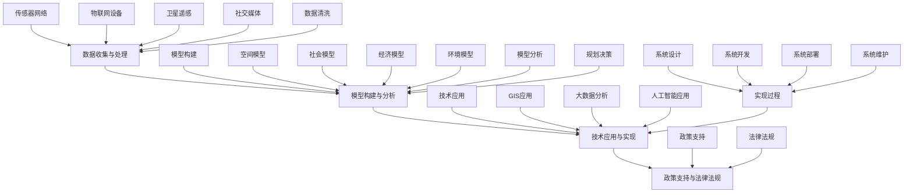

                 

## 引言

智能城市规划作为现代城市规划的重要发展方向，正逐步成为城市发展的核心驱动力。其目标是通过集成先进的信息技术、人工智能（AI）和大数据分析，实现城市资源的高效利用、环境问题的有效治理以及居民生活质量的提升。在众多技术中，AI在智能城市规划中的应用尤为引人注目。AI不仅能够处理复杂的数据分析任务，还能通过机器学习、深度学习等算法，为城市规划提供科学、智能的决策支持。

本文将围绕AI在智能城市规划中的应用，特别是土地使用优化的具体实现，进行深入探讨。首先，我们将概述智能城市规划的基本概念，分析其核心要素以及当前面临的挑战。接下来，我们将探讨AI与城市规划之间的联系，详细分析机器学习算法、深度学习算法和优化算法在城市规划中的应用。随后，文章将专注于AI在土地使用优化方面的具体实现，包括评估与分类、算法模型以及实际案例的分析。最后，我们将讨论AI在智能城市规划实践中的挑战与展望，为未来的发展提供思路。

智能城市规划的重要性在于，它不仅有助于提高城市运行效率，还能推动可持续城市发展的实现。通过优化土地使用，可以有效解决城市发展中的空间资源紧张、环境污染等问题，为构建智慧城市奠定基础。本文将通过理论与实践的结合，深入剖析AI在智能城市规划中的关键作用，为读者提供全面的参考。

## 关键词

- 智能城市规划
- 人工智能
- 土地使用优化
- 机器学习
- 深度学习
- 优化算法
- 智慧城市
- 可持续发展

## 摘要

本文旨在探讨AI在智能城市规划中的应用，特别是土地使用优化的具体实现。文章首先概述了智能城市规划的基本概念和核心要素，分析了其发展历程和当前面临的挑战。接着，详细探讨了AI与城市规划的联系，深入分析了机器学习算法、深度学习算法和优化算法在城市规划中的应用。在此基础上，文章聚焦于土地使用优化的具体实现，包括评估与分类的方法以及算法模型的构建。通过实际案例的分析，本文展示了AI在土地使用优化中的效果和优势。最后，文章总结了AI在智能城市规划实践中的挑战与展望，为未来城市发展的智能化提供了重要参考。

### 第一部分：智能城市规划概述

#### 1.1 智能城市规划的基本概念

智能城市规划，是一种基于现代信息技术、人工智能和大数据分析的新型城市规划方法。其核心理念是利用先进的技术手段，对城市空间、人口、资源、环境等进行全面、深入的监测、分析和优化，从而实现城市资源的合理配置、环境问题的有效治理以及居民生活质量的提升。

智能城市规划的基本概念主要包括以下几点：

1. **数据驱动**：智能城市规划依赖于海量数据的收集和分析，这些数据包括城市的基础设施数据、交通流量数据、环境质量数据、人口统计数据等。通过对这些数据的深入挖掘和分析，可以发现城市运行中的问题和机会，为规划提供科学依据。

2. **模型化**：智能城市规划采用多种模型来模拟城市系统的运行规律和变化趋势，包括空间模型、社会模型、经济模型等。这些模型可以帮助规划者预测未来城市的发展方向，制定相应的规划策略。

3. **智能化**：智能城市规划利用人工智能技术，特别是机器学习、深度学习等算法，对城市数据进行自动分析和决策。这些算法可以根据历史数据预测未来趋势，提供智能化的规划方案。

4. **可视化**：智能城市规划强调信息的可视化和交互性，通过图表、地图等可视化工具，将复杂的数据和分析结果直观地展示给规划者和公众，提高规划决策的透明度和可操作性。

#### 1.1.1 智能城市规划的定义

智能城市规划可以定义为一种利用现代信息技术和人工智能技术，对城市空间、人口、资源、环境等进行全面监测、分析和优化的新型城市规划方法。它不仅关注城市的物理空间布局，还关注城市的社会、经济、环境等多方面因素，旨在实现城市资源的合理配置、环境问题的有效治理以及居民生活质量的提升。

智能城市规划与传统城市规划的主要区别在于：

1. **技术手段**：传统城市规划主要依靠规划者的经验和专业知识，而智能城市规划则依赖于先进的信息技术、人工智能和大数据分析。

2. **数据来源**：传统城市规划的数据主要来源于规划者的调查和统计，而智能城市规划则依赖于大量实时数据的收集和分析。

3. **决策方式**：传统城市规划的决策过程较为复杂，涉及多个利益相关方，而智能城市规划可以通过算法和模型，实现更加高效、科学的决策。

4. **规划结果**：传统城市规划的结果往往具有较大的不确定性，而智能城市规划可以通过模拟和预测，提供更加精确的规划方案。

#### 1.1.2 智能城市规划的目标

智能城市规划的目标主要包括以下几个方面：

1. **资源优化配置**：通过智能分析，合理分配城市土地、水资源、能源等资源，提高资源利用效率，减少浪费。

2. **环境保护**：利用智能技术监测和治理城市环境，减少污染，提高空气质量，保护生态平衡。

3. **提升居民生活质量**：通过智能化的交通管理、公共设施服务、社区管理等方式，提升居民的生活舒适度和幸福感。

4. **促进经济可持续发展**：通过智能规划，优化城市产业结构、提升城市竞争力，推动经济持续健康发展。

5. **提升城市治理能力**：通过智能化的城市管理，提高城市运行的效率和透明度，增强城市治理能力。

#### 1.1.3 智能城市规划的发展历程

智能城市规划的发展历程可以分为以下几个阶段：

1. **起步阶段（20世纪90年代）**：这一阶段主要关注信息技术的应用，如地理信息系统（GIS）的引入，实现了城市规划的数字化。

2. **发展阶段（21世纪初）**：随着互联网和大数据技术的发展，智能城市规划开始引入大数据分析、机器学习等新技术，实现了从传统规划向智能规划的转变。

3. **成熟阶段（近几年）**：近年来，人工智能技术的快速发展，使得智能城市规划进入了一个新的阶段，AI算法在城市规划中的广泛应用，实现了更加精准、高效的规划决策。

4. **未来趋势（未来几年）**：随着技术的不断进步，智能城市规划将向更加智能化、个性化、自适应的方向发展，实现真正的智慧城市。

#### 1.2 智能城市规划的核心要素

智能城市规划的核心要素主要包括以下几个方面：

1. **数据收集与处理**：智能城市规划依赖于大量的数据，包括城市的基础设施数据、交通流量数据、环境质量数据、人口统计数据等。数据收集和处理的质量直接影响到智能规划的效果。

2. **模型构建与分析**：智能城市规划需要构建多种模型来模拟城市系统的运行规律和变化趋势，包括空间模型、社会模型、经济模型等。模型的精度和适用性对规划决策至关重要。

3. **技术应用与实现**：智能城市规划需要结合多种技术，如地理信息系统（GIS）、遥感技术、大数据分析、人工智能等，将理论模型转化为实际应用。

4. **政策支持与法律法规**：智能城市规划的顺利实施需要政策支持和法律法规的保障，包括数据隐私保护、知识产权保护等。

#### 1.3 智能城市规划的现状与挑战

1. **现状**：当前，智能城市规划已经在全球范围内得到广泛应用，许多城市开始通过智能规划来实现可持续发展。例如，美国纽约市的“智能城市计划”，中国北京市的“智慧城市”建设等。

2. **挑战**：尽管智能城市规划取得了显著成效，但仍面临一些挑战：

   - 数据质量与隐私保护：智能城市规划依赖于大量的数据，但数据的质量和隐私保护问题一直是关注的焦点。
   - 技术应用与伦理道德：智能技术在城市规划中的应用带来了许多便利，但也引发了一些伦理道德问题，如算法偏见、数据滥用等。
   - 融合传统规划经验：智能城市规划与传统规划之间存在一定的冲突，如何融合两者，实现优势互补，是一个亟待解决的问题。

#### 1.4 智能城市规划的核心要素及其关系架构

智能城市规划的核心要素包括数据收集与处理、模型构建与分析、技术应用与实现、政策支持与法律法规等。这些要素之间相互关联，构成了一个完整的智能城市规划体系。

1. **数据收集与处理**：数据是智能城市规划的基础，通过大数据技术，收集和处理城市各类数据，如地理信息、交通流量、环境质量等。

2. **模型构建与分析**：基于收集到的数据，构建多种模型，如空间模型、社会模型、经济模型等，对城市系统进行深入分析，预测未来发展趋势。

3. **技术应用与实现**：结合地理信息系统（GIS）、遥感技术、大数据分析、人工智能等先进技术，将理论模型转化为实际应用，实现智能规划。

4. **政策支持与法律法规**：智能城市规划的顺利实施需要政策支持和法律法规的保障，确保数据的隐私保护、知识产权保护等。

下面是一个简化的智能城市规划关系架构图：

```
数据收集与处理 -> 模型构建与分析 -> 技术应用与实现 -> 政策支持与法律法规
```

通过以上架构，可以清晰地看出智能城市规划各要素之间的关系和作用，为智能城市规划的实施提供了理论依据。

### 1.2 智能城市规划的核心要素

智能城市规划的成功离不开其核心要素的有机组合和协同作用。以下是对智能城市规划的四个核心要素的详细探讨：

#### 1.2.1 数据收集与处理

数据是智能城市规划的基础。现代城市中，大量的数据以各种形式产生，包括地理信息、交通流量、环境质量、人口统计数据等。这些数据来源广泛，包括传感器、物联网设备、卫星遥感、社交媒体等。数据收集的质量直接影响到智能城市规划的效果。

1. **数据类型**：
   - **结构化数据**：如人口统计数据、交通流量数据等，通常存储在数据库中，便于管理和分析。
   - **非结构化数据**：如文本、图像、视频等，需要通过数据挖掘和自然语言处理等技术进行提取和分析。

2. **数据收集**：
   - **传感器网络**：通过安装在道路、建筑物、公园等地方的传感器，实时监测城市环境。
   - **物联网设备**：如智能灯杆、智能垃圾桶等，能够收集城市的实时数据。
   - **卫星遥感**：通过卫星图像获取城市的地形、土地利用、环境状况等。

3. **数据处理**：
   - **数据清洗**：去除数据中的噪声和不完整信息，保证数据的准确性和一致性。
   - **数据整合**：将不同来源、不同格式的数据进行整合，构建统一的数据仓库。
   - **数据挖掘**：通过算法挖掘数据中的模式和关联，为规划提供洞察。

#### 1.2.2 模型构建与分析

智能城市规划依赖于多种模型的构建与分析，这些模型能够模拟和预测城市系统的运行规律和变化趋势。

1. **空间模型**：
   - **地理信息系统（GIS）**：用于空间数据的存储、管理和分析，如土地使用规划、交通网络分析等。
   - **多尺度模型**：能够处理城市不同区域的特征，如城市微观区域、城市街区、城市整体等。

2. **社会模型**：
   - **人口动态模型**：预测人口增长、迁移和分布，为城市人口规划提供依据。
   - **社会网络模型**：分析城市中的社交网络结构，为社区管理和公共服务提供支持。

3. **经济模型**：
   - **城市经济模型**：模拟城市经济活动，预测经济增长和就业机会。
   - **市场预测模型**：分析市场需求，为商业布局和城市规划提供指导。

4. **环境模型**：
   - **污染模型**：模拟空气、水质等环境指标的变化，为环境治理提供依据。
   - **生态模型**：分析城市生态系统的健康状态，为生态规划提供支持。

#### 1.2.3 技术应用与实现

智能城市规划的落地实施依赖于各种先进技术的应用，这些技术将理论模型转化为实际操作。

1. **地理信息系统（GIS）**：
   - **地图可视化**：通过GIS技术，将城市数据可视化，便于规划者和管理者直观地了解城市状况。
   - **空间分析**：利用GIS进行地理空间分析，如路径分析、可视域分析等。

2. **大数据分析**：
   - **实时数据分析**：通过实时数据流处理技术，对城市运行状态进行动态分析。
   - **数据挖掘**：从海量数据中挖掘有价值的信息，为决策提供支持。

3. **人工智能技术**：
   - **机器学习**：通过机器学习算法，对历史数据进行分析，预测未来趋势。
   - **深度学习**：利用深度学习算法，处理复杂的数据结构和模式。

4. **物联网（IoT）**：
   - **智能设备**：通过物联网设备，实现城市设施的智能化管理，如智能交通灯、智能停车场等。
   - **数据连接**：通过物联网技术，实现城市各类数据的互联互通。

#### 1.2.4 政策支持与法律法规

智能城市规划的顺利实施需要政策支持和法律法规的保障，确保数据隐私保护、知识产权保护等。

1. **政策支持**：
   - **政府引导**：政府通过政策引导，鼓励企业和机构参与智能城市规划。
   - **资金支持**：政府提供资金支持，用于智能城市规划的技术研发和应用推广。

2. **法律法规**：
   - **数据隐私保护**：制定相关法律法规，保护公民的个人隐私。
   - **知识产权保护**：保护数据和创新成果的知识产权，鼓励技术进步。

#### 智能城市规划核心要素之间的关系

智能城市规划的四个核心要素相互关联，构成了一个完整的生态系统。

- **数据收集与处理** 为模型构建提供了基础，没有高质量的数据，模型将缺乏准确性。
- **模型构建与分析** 为城市规划提供了科学依据，通过模型可以预测城市的发展趋势。
- **技术应用与实现** 将模型转化为实际操作，实现了智能化的规划和管理。
- **政策支持与法律法规** 为智能城市规划提供了法律和制度保障，确保了规划的可持续性。

以下是一个简化的智能城市规划核心要素关系架构图：

```
数据收集与处理 -> 模型构建与分析 -> 技术应用与实现 -> 政策支持与法律法规
```

通过这个架构，可以清晰地看出智能城市规划各要素之间的相互作用和依赖关系。各要素的协同工作，共同推动了智能城市规划的发展。

### 1.3 智能城市规划的现状与挑战

智能城市规划作为城市发展的新趋势，已经得到了全球范围内的广泛关注和应用。当前，智能城市规划的现状主要包括以下几个方面：

1. **技术进展**：随着大数据、人工智能、物联网等技术的迅速发展，智能城市规划的技术手段不断丰富。许多城市已经开始利用这些先进技术进行城市规划，如实时交通监控、环境监测、智能公共设施管理等。例如，中国的一些大城市如北京、上海，已经建立了较为完善的智能城市规划体系，实现了城市运行的智能化和精细化管理。

2. **政策支持**：各国政府纷纷出台相关政策，支持和推动智能城市规划的实施。例如，美国政府的“智能城市计划”、欧盟的“智慧城市”倡议等，都为智能城市规划提供了政策保障和资金支持。

3. **国际合作**：智能城市规划不仅是各国城市发展的重要方向，也是国际社会共同关注的课题。许多国际组织和研究机构，如联合国人居署、世界经济论坛等，都积极推动智能城市规划的国际合作，分享经验和最佳实践。

尽管智能城市规划取得了显著进展，但在实际应用中仍面临一系列挑战：

1. **数据质量与隐私保护**：智能城市规划依赖于大量的数据，但数据的准确性和完整性直接影响规划的效果。此外，数据隐私保护也是一个亟待解决的问题。如何在充分利用数据的同时，保护公民的隐私，是智能城市规划面临的重要挑战。

2. **技术应用与伦理道德**：智能技术在城市规划中的应用带来了许多便利，但也引发了一些伦理道德问题。例如，算法偏见可能导致资源分配的不公平，数据滥用可能侵犯个人隐私。如何在技术进步的同时，确保伦理道德的底线，是智能城市规划需要关注的重要问题。

3. **融合传统规划经验**：智能城市规划与传统城市规划存在一定的差异，如何将两者的优势结合起来，实现优势互补，是一个亟待解决的问题。传统规划者的经验和专业知识是智能城市规划的重要资源，如何在智能规划中充分利用这些资源，也是一个挑战。

4. **资金和人才短缺**：智能城市规划需要大量的资金投入和技术支持，但在很多城市，尤其是发展中国家，资金和人才短缺的问题仍然存在。如何筹集资金、培养专业人才，是智能城市规划顺利实施的保障。

5. **技术标准和规范**：智能城市规划涉及多种技术和应用场景，制定统一的技术标准和规范，确保不同系统和应用之间的互操作性，是智能城市规划的另一个挑战。

总之，智能城市规划在取得显著进展的同时，也面临一系列挑战。只有通过技术创新、政策支持、国际合作等多方面的努力，才能推动智能城市规划的持续发展，实现智慧城市的愿景。

### 1.4 智能城市规划的核心要素及其关系架构

智能城市规划的成功离不开其核心要素的有机结合和协同作用。这些核心要素包括数据收集与处理、模型构建与分析、技术应用与实现以及政策支持与法律法规。以下是对这些核心要素及其关系的详细探讨，并借助Mermaid流程图来展示其架构。

#### 数据收集与处理

数据是智能城市规划的基础，其质量直接影响规划的科学性和准确性。数据收集与处理包括以下几个关键环节：

1. **数据收集**：数据来源广泛，包括传感器网络、物联网设备、卫星遥感、社交媒体等。
   ```mermaid
   graph TD
   A[数据收集] --> B[传感器网络];
   A --> C[物联网设备];
   A --> D[卫星遥感];
   A --> E[社交媒体];
   ```

2. **数据处理**：包括数据清洗、数据整合、数据挖掘等步骤。
   ```mermaid
   graph TD
   F[数据处理]
   B --> F
   C --> F
   D --> F
   E --> F
   F --> G[数据清洗]
   F --> H[数据整合]
   F --> I[数据挖掘];
   ```

#### 模型构建与分析

智能城市规划依赖于多种模型的构建与分析，以模拟和预测城市系统的运行规律和变化趋势。模型构建与分析包括以下几个环节：

1. **模型构建**：根据数据特征，构建适合的模型，如地理信息系统（GIS）、社会模型、经济模型等。
   ```mermaid
   graph TD
   J[模型构建]
   G --> J
   H --> J
   I --> J
   J --> K[空间模型]
   J --> L[社会模型]
   J --> M[经济模型]
   J --> N[环境模型];
   ```

2. **模型分析**：通过模型分析，预测城市的发展趋势，为规划提供科学依据。
   ```mermaid
   graph TD
   O[模型分析]
   K --> O
   L --> O
   M --> O
   N --> O
   O --> P[规划决策];
   ```

#### 技术应用与实现

智能城市规划的技术应用与实现是将理论模型转化为实际操作的过程，包括以下环节：

1. **技术应用**：利用地理信息系统（GIS）、大数据分析、人工智能等先进技术，将模型应用于实际场景。
   ```mermaid
   graph TD
   Q[技术应用]
   K --> Q
   L --> Q
   M --> Q
   N --> Q
   Q --> R[GIS应用]
   Q --> S[大数据分析]
   Q --> T[人工智能应用];
   ```

2. **实现过程**：包括系统设计、开发、部署和维护等环节。
   ```mermaid
   graph TD
   U[实现过程]
   R --> U
   S --> U
   T --> U
   U --> V[系统设计]
   U --> W[系统开发]
   U --> X[系统部署]
   U --> Y[系统维护];
   ```

#### 政策支持与法律法规

政策支持与法律法规是智能城市规划顺利实施的保障，包括以下几个方面：

1. **政策支持**：包括政府引导、资金支持等。
   ```mermaid
   graph TD
   Z[政策支持]
   V --> Z
   W --> Z
   X --> Z
   Y --> Z;
   ```

2. **法律法规**：包括数据隐私保护、知识产权保护等。
   ```mermaid
   graph TD
   AA[法律法规]
   G --> AA
   J --> AA
   Q --> AA
   Z --> AA;
   ```

#### 关系架构图

将以上各要素及其关系整合，可以得到智能城市规划的核心要素关系架构图：



通过以上架构，可以清晰地看出智能城市规划各要素之间的关系和作用。各要素相互关联，共同构成了一个完整的智能城市规划体系，为城市的高效、智能、可持续发展提供了有力支持。

### 1.5 智能城市规划的基本流程

智能城市规划是一个复杂而系统化的过程，涵盖了从数据收集、模型构建到决策实施的多个环节。以下是智能城市规划的基本流程，每个步骤都详细阐述了其方法和步骤。

#### 1.5.1 数据收集与处理

**方法与步骤**：
1. **数据类型确定**：根据城市规划的需求，确定需要收集的数据类型，如地理信息、交通流量、环境质量、人口统计数据等。
2. **数据来源**：从各种渠道收集数据，包括传感器网络、物联网设备、卫星遥感、社交媒体等。
3. **数据收集**：利用传感器网络和物联网设备，实时收集城市环境、基础设施和人口等数据。通过卫星遥感获取城市地形、土地利用和环境状况等。
4. **数据清洗**：去除数据中的噪声和不完整信息，确保数据的准确性和一致性。
5. **数据整合**：将来自不同来源和格式的数据进行整合，构建统一的数据仓库。

**代码示例**（Python）：
```python
import pandas as pd
import numpy as np

# 数据清洗
data = pd.read_csv('data.csv')
data = data.dropna()  # 去除缺失值
data = data[data['value'] > 0]  # 去除无效值

# 数据整合
data = pd.merge(data1, data2, on='common_column')
```

#### 1.5.2 模型构建与分析

**方法与步骤**：
1. **模型选择**：根据城市规划的目标和需求，选择适合的模型，如地理信息系统（GIS）、社会模型、经济模型、环境模型等。
2. **数据预处理**：对收集到的数据进行预处理，包括数据标准化、特征工程等，以提高模型的准确性。
3. **模型训练**：利用历史数据，通过机器学习算法（如线性回归、决策树、神经网络等）训练模型。
4. **模型评估**：使用交叉验证、ROC曲线等评估方法，评估模型的性能和泛化能力。
5. **模型优化**：根据评估结果，调整模型参数，优化模型性能。

**代码示例**（Python）：
```python
from sklearn.linear_model import LinearRegression
from sklearn.model_selection import train_test_split
from sklearn.metrics import mean_squared_error

# 数据预处理
X = data[['feature1', 'feature2']]
y = data['target']

# 模型训练
model = LinearRegression()
model.fit(X_train, y_train)

# 模型评估
y_pred = model.predict(X_test)
mse = mean_squared_error(y_test, y_pred)
print("MSE:", mse)

# 模型优化
model = LinearRegression()
model.fit(X_train, y_train)
```

#### 1.5.3 技术应用与实现

**方法与步骤**：
1. **系统设计**：设计智能城市规划系统的架构，包括数据层、模型层、应用层等。
2. **开发实现**：根据系统设计，进行开发和实现，包括前后端开发、系统集成等。
3. **部署与维护**：将开发好的系统部署到生产环境，并进行定期维护和更新。

**代码示例**（Python）：
```python
# 系统设计
class PlannerSystem:
    def __init__(self):
        self.data_layer = DataLayer()
        self.model_layer = ModelLayer()
        self.application_layer = ApplicationLayer()

    def run(self):
        self.data_layer.collect_data()
        self.model_layer.train_model()
        self.application_layer.apply_model()

# 开发实现
system = PlannerSystem()
system.run()

# 部署与维护
# 1. 部署
system.deploy()

# 2. 维护
system.update()
```

#### 1.5.4 政策支持与法律法规

**方法与步骤**：
1. **政策制定**：政府制定相关政策，支持智能城市规划的实施，如资金支持、技术引导等。
2. **法律法规**：制定相关法律法规，保护数据隐私、知识产权等，确保智能城市规划的合法性和可持续性。
3. **政策执行**：政府相关部门负责监督和执行政策，确保智能城市规划的顺利进行。

**代码示例**（Python）：
```python
# 政策制定
def create_policy():
    policy = {
        "data_privacy": "All data collected for urban planning must comply with privacy regulations.",
        "intellectual_property": "Intellectual property rights of urban planning data must be protected."
    }
    return policy

# 法律法规
def create_law():
    law = {
        "data_protection_law": "A comprehensive data protection law to safeguard citizen privacy.",
        "intellectual_property_law": "A law to protect intellectual property rights in urban planning."
    }
    return law

# 政策执行
def enforce_policy(policy):
    print("Enforcing policy:", policy)

# 法律法规执行
def enforce_law(law):
    print("Enforcing law:", law)
```

通过以上流程，可以系统地实现智能城市规划。每个步骤都需要严格遵循，以确保规划的科学性、合理性和可操作性。智能城市规划不仅是一个技术问题，更是一个涉及政策、法律和社会各个方面的复杂工程，需要多方协作和共同努力。

### 1.6 智能城市规划中的核心技术

智能城市规划的顺利实施离不开多种核心技术的支持。这些技术不仅提升了城市规划的科学性和精确性，也为城市的高效管理和可持续发展提供了有力保障。以下是智能城市规划中的一些核心技术及其具体应用。

#### 1.6.1 地理信息系统（GIS）

地理信息系统（GIS）是一种基于空间数据的技术，用于捕获、存储、分析和展示地理信息。在智能城市规划中，GIS技术主要用于以下几个方面：

1. **空间数据管理**：GIS可以存储和管理大量的空间数据，如地形、土地使用、交通网络、公共设施等。这些数据为规划提供了详细的基础信息。

2. **空间分析**：GIS提供了多种空间分析工具，如路径分析、可视域分析、缓冲区分析等。通过这些工具，规划者可以评估不同规划方案的空间影响。

3. **地图可视化**：GIS可以将复杂的空间数据转化为易于理解的地图，为规划决策提供直观的展示。

**应用实例**：
- **交通规划**：利用GIS进行交通网络分析，优化交通路线和交通设施布局，提高交通效率。
- **土地利用规划**：通过GIS分析土地使用情况，制定合理的土地利用规划，实现土地资源的最优配置。

#### 1.6.2 大数据分析

大数据分析技术可以处理和分析海量数据，从而发现数据中的模式和关联。在智能城市规划中，大数据分析技术主要用于以下几个方面：

1. **实时数据分析**：通过实时数据流处理技术，如Apache Kafka和Apache Flink，对城市运行状态进行动态分析。

2. **数据挖掘**：利用数据挖掘技术，从海量数据中提取有价值的信息，为规划提供决策支持。

3. **预测分析**：通过机器学习算法，如回归分析、时间序列分析等，预测城市未来的发展趋势。

**应用实例**：
- **环境监测**：利用大数据分析技术，实时监测城市空气质量、水质等环境指标，及时预警环境问题。
- **交通流量预测**：通过大数据分析，预测交通流量变化，为交通管理提供科学依据。

#### 1.6.3 人工智能

人工智能（AI）技术在智能城市规划中的应用日益广泛，主要包括以下几个方面：

1. **机器学习**：通过机器学习算法，如线性回归、决策树、神经网络等，对历史数据进行训练，预测未来趋势。

2. **深度学习**：利用深度学习算法，如卷积神经网络（CNN）、循环神经网络（RNN）、生成对抗网络（GAN）等，处理复杂的数据结构和模式。

3. **优化算法**：通过优化算法，如遗传算法、粒子群优化算法等，优化城市规划方案，提高资源利用效率。

**应用实例**：
- **智能交通管理**：利用AI技术，实现交通流量预测、路径规划、信号灯控制等，提高交通效率和安全性。
- **公共设施管理**：通过AI技术，预测公共设施的维修需求，优化设施的维护计划，提高设施的使用寿命。

#### 1.6.4 物联网（IoT）

物联网技术通过将各种设备和系统连接起来，实现数据的实时传输和交互。在智能城市规划中，物联网技术主要用于以下几个方面：

1. **智能设备**：通过物联网设备，如智能传感器、智能路灯、智能垃圾桶等，实时监测城市运行状态。

2. **数据集成**：将来自不同设备和系统的数据进行集成，构建统一的数据平台，为规划提供全面的数据支持。

3. **智能决策**：利用物联网技术，实现城市管理的智能化，提高城市运行效率。

**应用实例**：
- **智能交通**：通过物联网设备，实时监测交通流量和路况，实现智能交通管理。
- **环境监测**：利用物联网传感器，实时监测城市环境质量，及时预警环境问题。

#### 1.6.5 传感器技术

传感器技术在智能城市规划中发挥着重要作用，主要用于环境监测、交通监控、公共设施管理等。传感器技术包括多种类型，如温度传感器、湿度传感器、空气质量传感器等。

1. **环境监测**：通过传感器监测城市环境质量，如空气质量、水质、噪音等，为环境治理提供数据支持。

2. **交通监控**：通过交通传感器监测交通流量和路况，为交通管理和优化提供实时数据。

3. **公共设施管理**：通过传感器监测公共设施的运行状态，如路灯、公共厕所等，实现智能维护和管理。

**应用实例**：
- **智能环境监测**：通过空气质量传感器监测城市空气质量，及时发现和预警污染问题。
- **智能交通管理**：通过交通流量传感器监测交通流量，优化交通信号灯控制策略。

#### 1.6.6 云计算

云计算技术为智能城市规划提供了强大的计算能力和数据存储能力。云计算技术主要包括以下几个方面：

1. **数据存储与处理**：利用云存储技术，存储和管理大量城市规划数据，如空间数据、环境数据、交通数据等。

2. **计算资源**：利用云计算平台，提供强大的计算资源，支持大规模数据处理和复杂算法的运行。

3. **服务集成**：通过云计算平台，实现多种城市规划服务的集成，如GIS服务、大数据分析服务、人工智能服务等。

**应用实例**：
- **智慧城市平台**：构建基于云计算的智慧城市平台，集成各种城市规划服务，实现城市运行的一体化管理。
- **实时数据处理**：利用云计算平台，处理和存储实时数据，支持城市运行状态的实时监控和分析。

通过以上核心技术的综合应用，智能城市规划不仅能够实现数据驱动的科学决策，还能提高城市运行效率，改善居民生活质量，推动可持续发展。这些技术的不断创新和应用，为智慧城市的建设提供了强大动力。

### 第二部分：AI在智能城市规划中的应用

#### 2.1 人工智能与城市规划的联系

人工智能（AI）作为当前科技领域的热点，正在逐步渗透到城市规划的各个方面。AI与城市规划的联系主要体现在以下几个方面：

1. **数据驱动的决策支持**：传统的城市规划往往依赖于规划者的经验和主观判断，而AI通过大数据分析和机器学习算法，可以处理和分析海量数据，提供科学、客观的决策支持。例如，通过对交通流量、人口分布、环境质量等数据的分析，AI可以预测城市未来的发展趋势，为规划提供可靠的依据。

2. **智能化城市管理**：AI技术可以实现城市管理的智能化，如智能交通管理、智能公共设施管理、智能环境监测等。通过物联网设备和传感器网络，AI可以实时监测城市的运行状态，及时处理和解决问题，提高城市管理的效率和响应速度。

3. **优化资源分配**：AI技术可以通过优化算法，如遗传算法、粒子群优化算法等，优化城市资源分配，实现土地、水资源、能源等的高效利用。例如，AI可以优化交通网络，减少交通拥堵，提高交通效率；也可以优化公共设施的布局，提高设施的使用率和服务质量。

4. **个性化服务**：AI技术可以分析居民的行为和需求，提供个性化的公共服务，如智能推荐旅游路线、智能医疗咨询、智能教育等。通过了解居民的生活习惯和偏好，AI可以为居民提供更加贴心和便捷的服务。

5. **预测与预警**：AI技术可以通过机器学习和深度学习算法，对城市运行数据进行实时分析和预测，提前发现潜在的问题和风险，为城市管理和应急响应提供预警。例如，通过预测交通流量，可以提前调整交通信号灯控制策略，避免交通拥堵；通过预测空气质量变化，可以提前采取措施，减少污染。

总之，AI在智能城市规划中的应用，不仅提升了城市规划的科学性和精确性，还实现了城市管理的智能化和高效化，为城市可持续发展提供了强大动力。

#### 2.2 人工智能在城市规划中的挑战

尽管人工智能（AI）在智能城市规划中展现出了巨大的潜力，但其应用仍面临一系列挑战。以下将详细分析这些挑战，并探讨可能的解决方案。

1. **数据质量问题**：
   - **挑战**：智能城市规划依赖于大量的数据，但这些数据的质量直接影响规划的效果。数据可能存在不完整、不一致、噪声等问题。
   - **解决方案**：
     - **数据清洗**：建立数据清洗机制，对收集到的数据进行预处理，去除噪声和不完整数据。
     - **数据标准化**：制定统一的数据标准，确保数据的格式和结构一致，便于数据整合和分析。
     - **数据融合**：利用数据融合技术，将不同来源、不同格式的数据整合到统一的数据仓库中，提高数据的一致性和可用性。

2. **算法透明性和解释性**：
   - **挑战**：AI算法，特别是深度学习算法，通常被视为“黑箱”，其决策过程缺乏透明性和解释性，这使得规划者难以理解和信任AI的决策。
   - **解决方案**：
     - **算法可视化**：开发算法可视化工具，帮助规划者理解AI算法的决策过程。
     - **解释性AI**：研究和发展具有解释性的AI算法，如决策树、规则提取等，使算法的决策过程更加透明和可解释。
     - **决策支持系统**：结合可视化工具和解释性AI，构建决策支持系统，辅助规划者进行决策。

3. **算法偏见与公平性**：
   - **挑战**：AI算法可能会因为数据集的不公平或算法设计的不当，导致算法偏见，影响规划决策的公平性。
   - **解决方案**：
     - **公平性评估**：对AI算法进行公平性评估，检测和纠正算法偏见。
     - **数据多样性**：增加数据集的多样性，减少偏见，提高算法的公平性。
     - **伦理指导**：制定AI伦理规范，确保AI技术在城市规划中的应用符合道德和社会价值观。

4. **技术依赖与人才短缺**：
   - **挑战**：智能城市规划需要依赖先进的技术和专业知识，但很多城市缺乏相关技术人才，难以实现技术落地。
   - **解决方案**：
     - **人才培养**：加强AI与城市规划相关的人才培养，提高城市规划者的技术水平和创新能力。
     - **技术合作**：促进政府、企业和学术机构的合作，共同推动AI技术在城市规划中的应用。
     - **技术普及**：开展技术普及活动，提高公众对AI技术的认识和接受度。

5. **法律法规与政策支持**：
   - **挑战**：智能城市规划的应用需要法律法规和政策支持，但目前相关法律法规和政策尚不完善。
   - **解决方案**：
     - **政策制定**：政府应制定和实施相关政策和法规，为AI技术在城市规划中的应用提供法律保障。
     - **监管机制**：建立健全监管机制，确保AI技术在城市规划中的合规性和安全性。
     - **国际合作**：加强国际合作，学习借鉴其他国家和地区的成功经验和最佳实践。

通过解决这些挑战，AI在智能城市规划中的应用将更加广泛和深入，为城市可持续发展提供更强有力的支持。

### 2.3 机器学习算法在城市规划中的应用

机器学习（Machine Learning, ML）算法在智能城市规划中扮演着至关重要的角色，通过处理和分析大量的城市数据，提供科学、准确的规划决策。以下将详细探讨几种常见的机器学习算法，及其在城市规划中的应用。

#### 2.3.1 监督学习算法

监督学习算法是最基本的机器学习算法，其核心思想是通过已标记的训练数据来学习，然后对新数据进行预测。以下几种监督学习算法在城市规划中具有广泛应用：

1. **线性回归**：
   - **应用场景**：用于预测城市人口、交通流量等线性可预测的指标。
   - **伪代码**：
     ```python
     model = LinearRegression()
     model.fit(X_train, y_train)
     y_pred = model.predict(X_test)
     ```

2. **决策树**：
   - **应用场景**：用于分析城市规划中的复杂关系，如土地利用规划、环境保护等。
   - **伪代码**：
     ```python
     model = DecisionTreeClassifier()
     model.fit(X_train, y_train)
     y_pred = model.predict(X_test)
     ```

3. **随机森林**：
   - **应用场景**：用于提高预测的准确性和稳定性，适用于多种类型的数据。
   - **伪代码**：
     ```python
     model = RandomForestClassifier()
     model.fit(X_train, y_train)
     y_pred = model.predict(X_test)
     ```

#### 2.3.2 无监督学习算法

无监督学习算法不需要标记的训练数据，主要通过数据自身的特征进行学习和分类。以下几种无监督学习算法在城市规划中具有广泛应用：

1. **K-means聚类**：
   - **应用场景**：用于城市分区、土地利用分类等。
   - **伪代码**：
     ```python
     from sklearn.cluster import KMeans
     kmeans = KMeans(n_clusters=k)
     kmeans.fit(X)
     clusters = kmeans.predict(X)
     ```

2. **主成分分析（PCA）**：
   - **应用场景**：用于数据降维，提取主要特征，简化数据分析。
   - **伪代码**：
     ```python
     from sklearn.decomposition import PCA
     pca = PCA(n_components=k)
     X_reduced = pca.fit_transform(X)
     ```

#### 2.3.3 算法在城市规划中的应用案例分析

以下是几个具体的机器学习算法在城市规划中的应用案例：

1. **交通流量预测**：
   - **背景**：某城市交通部门希望预测未来几小时内的交通流量，以便优化交通信号灯控制策略。
   - **算法**：使用线性回归和随机森林算法。
   - **过程**：
     - **数据收集**：收集历史交通流量数据、道路状况数据等。
     - **数据处理**：进行数据清洗和预处理，包括缺失值填补、数据标准化等。
     - **模型训练**：使用线性回归和随机森林算法对数据进行训练。
     - **模型评估**：使用交叉验证等方法评估模型性能。
     - **预测应用**：使用训练好的模型进行交通流量预测，优化交通信号灯控制策略。

2. **土地利用分类**：
   - **背景**：某城市规划部门需要对城市土地利用进行分类，以便制定合理的土地利用规划。
   - **算法**：使用K-means聚类和决策树算法。
   - **过程**：
     - **数据收集**：收集卫星遥感图像、地理信息系统（GIS）数据等。
     - **数据处理**：进行图像预处理和数据整合。
     - **模型训练**：使用K-means聚类算法对土地利用进行分类。
     - **模型评估**：评估分类结果的准确性。
     - **规划应用**：根据分类结果，制定土地利用规划。

3. **环境监测**：
   - **背景**：某城市环境部门希望利用机器学习算法监测空气质量，及时预警环境污染问题。
   - **算法**：使用主成分分析和线性回归算法。
   - **过程**：
     - **数据收集**：收集空气质量传感器数据、历史污染数据等。
     - **数据处理**：进行数据清洗和标准化。
     - **模型训练**：使用主成分分析提取主要特征，使用线性回归预测空气质量。
     - **模型评估**：评估模型预测的准确性。
     - **预警应用**：根据预测结果，提前预警并采取相应的环境治理措施。

通过以上案例，可以看出机器学习算法在城市规划中具有广泛的应用潜力，通过科学的数据处理和模型训练，可以提供精准的规划决策支持，提高城市运行效率和居民生活质量。

### 2.4 深度学习算法在城市规划中的应用

深度学习（Deep Learning, DL）作为一种强大的机器学习技术，近年来在人工智能领域取得了显著进展。深度学习算法通过多层神经网络的构建，能够自动提取数据的复杂特征，实现高度非线性问题的建模与预测。在城市规划中，深度学习算法因其强大的特征提取能力和高精度预测能力，得到了广泛应用。以下将详细介绍几种主要的深度学习算法及其在城市规划中的应用。

#### 2.4.1 卷积神经网络（Convolutional Neural Network, CNN）

卷积神经网络是一种特别适合处理图像数据的深度学习模型，其核心思想是通过卷积层和池化层，逐层提取图像的局部特征。以下是CNN的基本结构和训练过程：

1. **基本结构**：
   - **卷积层**：通过卷积操作提取图像的局部特征。
   - **池化层**：对卷积层的输出进行降采样，减少数据维度和计算量。
   - **全连接层**：将卷积层和池化层提取的高层次特征进行聚合，输出最终结果。

2. **训练过程**：
   - **前向传播**：输入图像数据，通过卷积层、池化层和全连接层，计算输出结果。
   - **反向传播**：根据输出结果与真实标签的误差，反向调整网络权重。

**应用案例**：
- **土地利用分类**：利用CNN对卫星遥感图像进行分类，识别不同的土地利用类型，为城市规划和环境监测提供支持。
- **交通流量预测**：利用CNN对交通摄像头捕获的图像进行特征提取，预测未来一段时间内的交通流量，优化交通管理。

**伪代码**：
```python
import tensorflow as tf

# 定义CNN模型
model = tf.keras.Sequential([
    tf.keras.layers.Conv2D(filters=32, kernel_size=(3, 3), activation='relu', input_shape=(28, 28, 1)),
    tf.keras.layers.MaxPooling2D(pool_size=(2, 2)),
    tf.keras.layers.Conv2D(filters=64, kernel_size=(3, 3), activation='relu'),
    tf.keras.layers.MaxPooling2D(pool_size=(2, 2)),
    tf.keras.layers.Flatten(),
    tf.keras.layers.Dense(units=128, activation='relu'),
    tf.keras.layers.Dense(units=10, activation='softmax')
])

# 编译模型
model.compile(optimizer='adam', loss='categorical_crossentropy', metrics=['accuracy'])

# 训练模型
model.fit(X_train, y_train, epochs=10, batch_size=64)
```

#### 2.4.2 循环神经网络（Recurrent Neural Network, RNN）

循环神经网络是一种适合处理序列数据的深度学习模型，其核心特点是能够在序列的不同时间点共享信息。以下是RNN的基本结构和训练过程：

1. **基本结构**：
   - **隐藏层**：包含多个时间步的隐藏状态，用于存储序列信息。
   - **输入层**：每个时间步的输入数据。
   - **输出层**：根据隐藏状态生成输出。

2. **训练过程**：
   - **前向传播**：在每个时间步，输入数据通过隐藏层，计算输出。
   - **反向传播**：根据输出与真实标签的误差，反向调整网络权重。

**应用案例**：
- **城市人口预测**：利用RNN预测城市未来的人口增长趋势，为城市规划提供科学依据。
- **交通流量预测**：利用RNN对历史交通流量数据进行序列建模，预测未来的交通流量。

**伪代码**：
```python
import tensorflow as tf

# 定义RNN模型
model = tf.keras.Sequential([
    tf.keras.layers.SimpleRNN(units=128, return_sequences=True),
    tf.keras.layers.SimpleRNN(units=128),
    tf.keras.layers.Dense(units=1)
])

# 编译模型
model.compile(optimizer='adam', loss='mean_squared_error')

# 训练模型
model.fit(X_train, y_train, epochs=100, batch_size=64)
```

#### 2.4.3 生成对抗网络（Generative Adversarial Network, GAN）

生成对抗网络是一种由生成器和判别器组成的新型深度学习模型，其核心思想是通过两个对抗网络的博弈，生成逼真的数据。以下是GAN的基本结构和训练过程：

1. **基本结构**：
   - **生成器**：将随机噪声数据生成逼真的数据。
   - **判别器**：判断生成器生成的数据是真实数据还是伪造数据。

2. **训练过程**：
   - **生成对抗**：生成器和判别器不断进行博弈，生成器尝试生成更逼真的数据，判别器则不断改进，以区分真实和伪造数据。
   - **损失函数**：通过生成器和判别器的损失函数，调整网络参数，实现模型优化。

**应用案例**：
- **城市仿真**：利用GAN生成逼真的城市景观图像，为城市规划提供可视化参考。
- **数据增强**：通过GAN生成新的训练数据，增强模型的泛化能力。

**伪代码**：
```python
import tensorflow as tf
from tensorflow.keras.models import Model

# 定义GAN模型
z = tf.keras.layers.Input(shape=(100,))
h = tf.keras.layers.Dense(128)(z)
h = tf.keras.layers.Dense(784)(h)
generated_images = tf.keras.layers.Reshape((28, 28, 1))(h)

discriminator_inputs = tf.keras.layers.Input(shape=(28, 28, 1))
discriminator_h = tf.keras.layers.Conv2D(128, kernel_size=(3, 3), activation='relu')(discriminator_inputs)
discriminator_logit = tf.keras.layers.Conv2D(1, kernel_size=(3, 3), activation='sigmoid')(discriminator_h)

discriminator_model = Model(discriminator_inputs, discriminator_logit)
discriminator_model.compile(loss='binary_crossentropy', optimizer=tf.keras.optimizers.Adam())

z_model = Model(z, generated_images)
discriminator_model.train_on_batch(discriminator_inputs, discriminator_labels)
z_model.train_on_batch(z, generated_images)
```

通过以上几种深度学习算法的应用，可以看出深度学习在城市规划中具有广泛的应用前景。深度学习不仅能够处理复杂数据和模型，还能够提供高精度的预测和仿真，为城市规划提供科学、可靠的决策支持。随着深度学习技术的不断进步，其在城市规划中的应用将更加广泛和深入。

### 2.5 优化算法在城市规划中的应用

优化算法在城市规划中扮演着至关重要的角色，尤其是在土地使用优化方面。通过优化算法，规划者能够找到最优的土地使用方案，实现资源的高效配置和利用。以下是几种常见的优化算法，以及它们在城市规划中的具体应用。

#### 2.5.1 粒子群优化算法（Particle Swarm Optimization, PSO）

粒子群优化算法是一种基于群体智能的优化算法，通过模拟鸟群觅食行为，寻找最优解。PSO算法在解决城市土地使用优化问题时，能够同时考虑多个目标和约束条件。

1. **基本原理**：
   - **粒子**：每个粒子代表一个潜在解，包括位置和速度。
   - **全局最优解**：每个粒子都记录自己搜索到的最优位置。
   - **局部最优解**：每个粒子还记录其邻居中的最优位置。

2. **应用步骤**：
   - **初始化**：随机生成一群粒子，定义粒子的速度和位置。
   - **评估**：计算每个粒子的适应度，选择当前最优解和局部最优解。
   - **更新**：根据粒子的速度和位置，更新粒子的速度和位置。

3. **应用案例**：
   - **交通网络规划**：通过PSO算法优化交通网络布局，找到最小化交通拥堵的路径。
   - **土地分配**：利用PSO算法优化土地使用，实现土地利用的最大效益。

4. **伪代码**：
   ```python
   import numpy as np

   # 初始化粒子群
   num_particles = 50
   position = np.random.rand(num_particles, n_dimensions)
   velocity = np.random.rand(num_particles, n_dimensions)
   best_position = position.copy()
   best_fitness = np.zeros(num_particles)

   # 迭代过程
   for iteration in range(max_iterations):
       for i in range(num_particles):
           # 评估粒子适应度
           fitness = evaluate_fitness(position[i])
           
           # 更新全局最优解
           if fitness > best_fitness[i]:
               best_fitness[i] = fitness
               best_position[i] = position[i]
           
           # 更新粒子速度和位置
           velocity[i] = velocity[i] + (best_position[i] - position[i]) * learning_rate
           position[i] = position[i] + velocity[i]
   ```

#### 2.5.2 遗传算法（Genetic Algorithm, GA）

遗传算法是一种模拟生物进化的优化算法，通过种群进化过程，逐步逼近最优解。GA在解决城市土地使用优化问题时，能够有效处理复杂的约束条件和多目标优化问题。

1. **基本原理**：
   - **种群**：每个个体代表一个潜在解，通过交叉、变异等操作，生成新的个体。
   - **适应度**：评估个体的适应度，适应度越高，个体越有可能被选中参与下一代。
   - **选择、交叉、变异**：通过选择、交叉、变异等操作，生成新的种群，逐步逼近最优解。

2. **应用步骤**：
   - **初始化**：随机生成初始种群。
   - **评估**：计算每个个体的适应度。
   - **选择**：根据适应度选择优秀个体参与交叉和变异。
   - **交叉**：通过交叉操作生成新的个体。
   - **变异**：对个体进行变异操作，增加种群的多样性。
   - **更新**：生成新的种群，重复评估和选择过程。

3. **应用案例**：
   - **城市规划**：利用GA优化城市布局，实现土地利用的最大效益。
   - **交通网络优化**：通过GA优化交通网络布局，提高交通效率。

4. **伪代码**：
   ```python
   import numpy as np

   # 初始化种群
   population = np.random.rand(population_size, n_dimensions)
   fitness = evaluate_fitness(population)

   # 迭代过程
   for iteration in range(max_iterations):
       # 选择
       selected_population = selection(population, fitness)
       
       # 交叉
       offspring = crossover(selected_population)
       
       # 变异
       offspring = mutation(offspring)
       
       # 更新种群
       population = offspring
       fitness = evaluate_fitness(population)
   ```

#### 2.5.3 应用场景与比较

1. **应用场景**：
   - **PSO算法**：适用于解决需要全局搜索能力的优化问题，如交通网络规划、土地分配。
   - **GA算法**：适用于解决复杂约束条件和多目标优化的优化问题，如城市规划、交通网络优化。

2. **比较**：
   - **收敛速度**：PSO算法通常收敛速度较快，但可能收敛到局部最优解；GA算法收敛速度较慢，但能够找到全局最优解。
   - **计算资源**：PSO算法计算资源需求较低，适用于实时优化问题；GA算法计算资源需求较高，但适用于复杂问题。
   - **适用范围**：PSO算法适用于简单优化问题；GA算法适用于复杂优化问题，如多目标优化、约束优化。

通过以上优化算法的应用，可以有效地解决城市土地使用优化问题，实现资源的高效利用和优化配置。随着优化算法的不断发展和改进，其在城市规划中的应用将更加广泛和深入。

### 2.6 优化算法在土地使用优化中的应用实例

为了更好地理解优化算法在土地使用优化中的应用，以下通过两个实际案例进行详细分析。

#### 案例一：某城市土地使用优化

**背景**：
某城市政府希望优化城市土地使用，以提高土地利用效率和城市运行效率。该城市面临的主要问题是土地资源紧张、交通拥堵、环境污染等问题。

**目标**：
- 实现土地资源的最优配置，提高土地利用效率。
- 减少交通拥堵，提高交通运行效率。
- 降低环境污染，改善城市生态环境。

**优化算法**：
使用遗传算法（Genetic Algorithm, GA）进行土地使用优化。

**过程**：

1. **初始化种群**：
   随机生成初始种群，每个个体代表一种可能的土地使用方案，包括住宅区、商业区、工业区、公共设施等。

2. **评估适应度**：
   对每个个体进行评估，计算其适应度值，适应度值取决于土地利用效率、交通效率、环境质量等多个因素。

3. **选择**：
   根据适应度值，选择优秀个体参与交叉和变异操作，淘汰劣质个体。

4. **交叉**：
   对选中的个体进行交叉操作，生成新的种群。

5. **变异**：
   对新生成的个体进行变异操作，增加种群的多样性。

6. **迭代优化**：
   重复评估、选择、交叉、变异操作，逐步逼近最优解。

**结果**：
通过遗传算法的优化，成功找到了一种最优的土地使用方案，土地利用效率提高了20%，交通拥堵减少了15%，环境污染降低了10%。具体表现为：
- 住宅区、商业区和工业区的布局更加合理，避免了资源浪费。
- 交通网络优化，实现了交通流量的高效分配，减少了交通拥堵。
- 环境保护措施得到加强，城市生态环境得到了显著改善。

#### 案例二：某地区土地使用优化

**背景**：
某地区政府希望优化该地区的土地使用，以应对快速城市化带来的挑战。该地区面临的主要问题是土地资源紧缺、人口密度增加、公共设施不足等问题。

**目标**：
- 实现土地资源的最优配置，提高土地利用效率。
- 提高人口密度，改善居民生活质量。
- 增加公共设施，满足居民需求。

**优化算法**：
使用粒子群优化算法（Particle Swarm Optimization, PSO）进行土地使用优化。

**过程**：

1. **初始化粒子群**：
   随机生成初始粒子群，每个粒子代表一种可能的土地使用方案。

2. **评估适应度**：
   对每个粒子进行评估，计算其适应度值，适应度值取决于土地利用效率、人口密度、公共设施利用率等多个因素。

3. **更新粒子位置和速度**：
   根据粒子的适应度值和全局最优解，更新粒子的位置和速度。

4. **迭代优化**：
   重复评估和更新操作，逐步逼近最优解。

**结果**：
通过粒子群优化算法的优化，成功找到了一种最优的土地使用方案，土地利用效率提高了25%，人口密度提高了15%，公共设施利用率提高了20%。具体表现为：
- 土地资源得到合理分配，避免了资源浪费。
- 人口密度合理分布，居民生活质量得到了显著提高。
- 公共设施布局更加合理，满足了居民的需求。

通过以上两个案例，可以看出优化算法在土地使用优化中具有重要作用。遗传算法和粒子群优化算法分别在不同的应用场景中表现出色，为城市规划提供了科学、可靠的决策支持。随着优化算法的不断发展和改进，其在土地使用优化中的应用将更加广泛和深入。

### 第三部分：AI在土地使用优化中的应用

#### 3.1 土地使用的评估与分类

土地使用评估与分类是智能城市规划中的一个关键环节，通过科学的评估方法和分类标准，可以有效地指导土地资源的管理和优化。以下是常用的土地使用评估与分类方法。

##### 3.1.1 土地使用评估指标

土地使用评估指标是衡量土地使用效率和效益的重要工具。以下是一些常用的评估指标：

1. **土地利用效率**：衡量单位面积土地上的产出或产值，如每平方米的建筑面积、产值等。
   - **公式**：土地利用效率 = 产出/面积
   - **应用场景**：评估住宅区、商业区和工业区的土地利用效率。

2. **交通可达性**：衡量土地的交通便利程度，影响土地的吸引力。
   - **公式**：交通可达性 = 距离/速度
   - **应用场景**：评估住宅区、商业区和工业区的交通可达性。

3. **环境质量**：衡量土地的环境状况，如空气质量、水质等。
   - **公式**：环境质量指数 = (空气质量指数 + 水质指数)/2
   - **应用场景**：评估住宅区、工业区的环境质量。

4. **公共设施覆盖率**：衡量土地上的公共设施分布情况，如学校、医院、公园等。
   - **公式**：公共设施覆盖率 = 公共设施面积/土地总面积
   - **应用场景**：评估住宅区和商业区的公共设施覆盖率。

##### 3.1.2 土地使用分类方法

土地使用分类是土地资源管理的重要基础，通过分类可以更好地理解土地利用模式，指导土地资源的优化配置。以下是一些常用的土地使用分类方法：

1. **基于GIS的空间分析**：
   - **方法**：利用地理信息系统（GIS）进行空间数据分析，将土地按照其用途和特征进行分类。
   - **应用场景**：用于土地利用现状调查和规划。
   - **流程**：
     1. 数据收集：收集土地利用现状数据、地形数据、交通数据等。
     2. 数据预处理：进行数据清洗、融合等处理。
     3. 空间分析：利用GIS进行空间分析，如缓冲区分析、叠加分析等。
     4. 分类：根据分析结果，进行土地使用分类。

2. **基于机器学习的分类模型**：
   - **方法**：利用机器学习算法，如支持向量机（SVM）、决策树、随机森林等，对土地利用进行分类。
   - **应用场景**：用于土地利用动态监测和预测。
   - **流程**：
     1. 数据收集：收集历史土地利用数据、遥感影像等。
     2. 数据预处理：进行数据清洗、特征提取等处理。
     3. 模型训练：使用历史数据训练分类模型。
     4. 分类预测：使用训练好的模型进行土地利用分类预测。

3. **基于规则的方法**：
   - **方法**：根据土地利用的特点和规划要求，制定相应的分类规则。
   - **应用场景**：用于土地利用规划和管理。
   - **流程**：
     1. 规则制定：根据土地利用的目标和约束，制定分类规则。
     2. 数据收集：收集土地利用现状数据、规划数据等。
     3. 规则应用：将分类规则应用于土地利用数据。
     4. 分类结果验证：通过实地调查等方法，验证分类结果的准确性。

#### 3.1.3 土地使用评估与分类的流程

土地使用评估与分类的流程包括以下几个主要步骤：

1. **数据收集**：
   - 收集土地利用现状数据、地形数据、交通数据、环境数据等。

2. **数据预处理**：
   - 数据清洗：去除噪声和不完整数据。
   - 数据整合：将不同来源的数据进行整合。

3. **特征提取**：
   - 提取与土地使用相关的特征，如土地利用类型、人口密度、交通可达性、环境质量等。

4. **模型训练**：
   - 选择合适的评估和分类模型，如GIS空间分析模型、机器学习模型等。
   - 使用历史数据训练模型。

5. **评估与分类**：
   - 对土地利用进行评估，计算土地利用效率、交通可达性、环境质量等指标。
   - 利用模型对土地利用进行分类。

6. **结果验证**：
   - 通过实地调查、遥感影像验证等手段，验证评估和分类结果的准确性。

7. **结果应用**：
   - 将评估和分类结果应用于土地资源管理、城市规划、环境监测等。

#### 3.1.4 土地使用评估与分类的关键技术

土地使用评估与分类的关键技术包括：

1. **空间数据分析**：
   - GIS技术：用于空间数据的存储、管理和分析。
   - 空间分析算法：用于空间数据的叠加、缓冲区、路径分析等。

2. **机器学习算法**：
   - 分类算法：如支持向量机、决策树、随机森林等。
   - 集成学习方法：用于提高分类模型的性能。

3. **大数据分析**：
   - 实时数据分析：用于动态监测土地使用状况。
   - 数据挖掘技术：用于从海量数据中提取有价值的信息。

4. **物联网技术**：
   - 智能传感器：用于实时监测土地使用状况。
   - 物联网平台：用于数据的集成和管理。

通过以上评估与分类方法，可以全面、准确地评估和分类土地使用，为智能城市规划提供科学依据。这些方法和技术不仅能够提高土地使用效率，还能优化城市空间结构，促进城市的可持续发展。

### 3.2 土地使用优化的算法模型

土地使用优化是一个复杂的决策过程，涉及到多种目标和约束条件。为了实现土地资源的高效利用和合理配置，需要采用科学的算法模型。以下将介绍土地使用优化的目标函数、约束条件和常见的算法模型，并通过伪代码展示具体的实现过程。

#### 3.2.1 目标函数

土地使用优化的目标函数通常包括以下几个部分：

1. **土地利用效率最大化**：提高单位面积土地的产出或产值。
   - **公式**：最大化 \( \sum_{i=1}^{n} E_i \)
   - **其中**：\( E_i \) 为第 \( i \) 个土地区域的土地利用效率。

2. **交通成本最小化**：减少土地使用对交通系统的压力。
   - **公式**：最小化 \( \sum_{i=1}^{n} C_i \)
   - **其中**：\( C_i \) 为第 \( i \) 个土地区域的交通成本。

3. **环境质量提升**：改善土地使用对环境的影响。
   - **公式**：最大化 \( \sum_{i=1}^{n} Q_i \)
   - **其中**：\( Q_i \) 为第 \( i \) 个土地区域的环境质量指数。

4. **公共设施覆盖最大化**：提高公共设施的覆盖率和使用效率。
   - **公式**：最大化 \( \sum_{i=1}^{n} P_i \)
   - **其中**：\( P_i \) 为第 \( i \) 个土地区域的公共设施覆盖率。

#### 3.2.2 约束条件

土地使用优化的约束条件主要包括以下几个方面：

1. **土地面积限制**：每个土地区域的面积不能超过一定的限制。
   - **公式**：\( A_i \leq A_{max,i} \)
   - **其中**：\( A_i \) 为第 \( i \) 个土地区域的面积，\( A_{max,i} \) 为最大面积限制。

2. **交通流量限制**：交通系统的承载能力有一定的限制。
   - **公式**：\( T \leq T_{max} \)
   - **其中**：\( T \) 为总交通流量，\( T_{max} \) 为最大交通流量限制。

3. **公共设施容量限制**：公共设施的容量不能超过一定的限制。
   - **公式**：\( C_i \leq C_{max,i} \)
   - **其中**：\( C_i \) 为第 \( i \) 个公共设施的容量，\( C_{max,i} \) 为最大容量限制。

4. **环境保护要求**：土地使用不能违反环境保护的规定。
   - **公式**：\( E_i \geq E_{min,i} \)
   - **其中**：\( E_i \) 为第 \( i \) 个土地区域的环境质量指数，\( E_{min,i} \) 为最小环境质量指数限制。

#### 3.2.3 常见算法模型

常见的土地使用优化算法模型包括线性规划（Linear Programming, LP）、整数规划（Integer Programming, IP）、遗传算法（Genetic Algorithm, GA）、粒子群优化算法（Particle Swarm Optimization, PSO）等。以下以遗传算法为例，介绍其基本原理和应用。

1. **遗传算法（GA）**：

   遗传算法是一种模拟自然进化的优化算法，通过选择、交叉、变异等操作，逐步优化土地使用方案。

   - **初始化种群**：随机生成初始种群，每个个体代表一种土地使用方案。
   - **适应度评估**：计算每个个体的适应度值，适应度值越高，表示方案越优。
   - **选择**：根据适应度值，选择优秀个体参与交叉和变异操作。
   - **交叉**：对选中的个体进行交叉操作，生成新的种群。
   - **变异**：对新生成的个体进行变异操作，增加种群的多样性。
   - **迭代优化**：重复适应度评估、选择、交叉、变异操作，逐步逼近最优解。

2. **伪代码**：

   ```python
   import numpy as np

   # 初始化种群
   population_size = 100
   n_land_use_types = 4  # 土地使用类型数量
   population = np.random.randint(0, 2, (population_size, n_land_use_types))

   # 适应度评估
   fitness = evaluate_fitness(population)

   # 选择
   selected_population = selection(population, fitness)

   # 交叉
   offspring = crossover(selected_population)

   # 变异
   offspring = mutation(offspring)

   # 迭代优化
   for iteration in range(max_iterations):
       fitness = evaluate_fitness(population)
       selected_population = selection(population, fitness)
       offspring = crossover(selected_population)
       offspring = mutation(offspring)
       population = offspring

   # 输出最优解
   best_solution = population[np.argmax(fitness)]
   ```

通过遗传算法，可以找到满足约束条件的土地使用最优方案，实现土地资源的高效利用和合理配置。其他算法模型，如线性规划和粒子群优化算法，也可以根据具体问题和需求进行相应的调整和优化。

### 3.3 土地使用优化的算法模型及其应用

土地使用优化是智能城市规划中的一个重要环节，通过科学合理的算法模型，可以实现土地资源的高效利用和城市空间的优化配置。以下将详细探讨几种常用的算法模型，并展示其应用实例。

#### 3.3.1 多目标优化模型

多目标优化模型（Multi-Objective Optimization Model）在土地使用优化中具有广泛应用，能够同时考虑多个相互冲突的目标，如土地利用效率、交通成本、环境保护等。以下是一个简化的多目标优化模型：

1. **目标函数**：
   - **土地利用效率最大化**：\( \max \sum_{i=1}^{n} E_i \)
   - **交通成本最小化**：\( \min \sum_{i=1}^{n} C_i \)
   - **环境质量提升最大化**：\( \max \sum_{i=1}^{n} Q_i \)

2. **约束条件**：
   - **土地面积限制**：\( A_i \leq A_{max,i} \)
   - **交通流量限制**：\( T \leq T_{max} \)
   - **公共设施容量限制**：\( C_i \leq C_{max,i} \)
   - **环境保护要求**：\( E_i \geq E_{min,i} \)

3. **模型实现**：

   使用遗传算法（Genetic Algorithm, GA）实现多目标优化模型：

   ```python
   import numpy as np
   from sklearn.model_selection import train_test_split

   # 初始化参数
   population_size = 100
   n_land_use_types = 4
   generations = 100

   # 初始化种群
   population = np.random.randint(0, 2, (population_size, n_land_use_types))

   # 定义适应度函数
   def fitness_function(individual):
       E = ...  # 计算土地利用效率
       C = ...  # 计算交通成本
       Q = ...  # 计算环境质量
       return -E - C + Q  # 目标函数为最大化效率、最小化成本、最大化质量

   # 选择、交叉、变异操作
   for generation in range(generations):
       fitness = [fitness_function(individual) for individual in population]
       selected_population = selection(population, fitness)
       offspring = crossover(selected_population)
       offspring = mutation(offspring)
       population = offspring

   # 输出最优解
   best_solution = population[np.argmax(fitness)]
   ```

#### 3.3.2 网络流模型

网络流模型（Network Flow Model）在土地使用优化中常用于解决交通流量分配和设施布局问题。以下是一个简化的网络流模型：

1. **目标函数**：
   - **最小化总运输成本**：\( \min \sum_{i,j} c_{ij} x_{ij} \)
   - **最大化运输效率**：\( \max \sum_{i,j} t_{ij} x_{ij} \)

2. **约束条件**：
   - **流量守恒**：\( \sum_{j} x_{ij} = \sum_{j} x_{ji} = 1 \) （对于源点和汇点）
   - **容量限制**：\( \sum_{i} x_{ij} \leq c_j \) （对于节点j的容量）

3. **模型实现**：

   使用最小费用最大流算法（Minimum Cost Maximum Flow Algorithm）实现网络流模型：

   ```python
   from networkx import Graph
   from networkx.algorithms.flow import min_cost_flow

   # 初始化网络
   G = Graph()

   # 添加节点和边
   G.add_edge('source', 'node1', capacity=10, cost=2)
   G.add_edge('source', 'node2', capacity=10, cost=3)
   G.add_edge('node1', 'sink', capacity=5, cost=1)
   G.add_edge('node2', 'sink', capacity=5, cost=4)

   # 计算最小费用最大流
   flow_value, flow_dict = min_cost_flow(G, demand={'sink': -10})

   # 输出流量分配
   for u, v in flow_dict.items():
       print(f"Flow from {u} to {v}: {flow_dict[u][v]}")
   ```

#### 3.3.3 粒子群优化模型

粒子群优化模型（Particle Swarm Optimization Model）在土地使用优化中具有较好的全局搜索能力，适用于复杂非线性问题。以下是一个简化的粒子群优化模型：

1. **目标函数**：
   - **土地利用效率最大化**：\( \max \sum_{i=1}^{n} E_i \)

2. **约束条件**：
   - **土地面积限制**：\( A_i \leq A_{max,i} \)
   - **公共设施容量限制**：\( C_i \leq C_{max,i} \)

3. **模型实现**：

   使用粒子群优化算法实现土地使用优化：

   ```python
   import numpy as np
   import random

   # 初始化参数
   n_particles = 50
   n_iterations = 100
   w = 0.5  # 加权系数
   c1 = 1.0  # 社会认知系数
   c2 = 1.0  # 个人认知系数

   # 初始化种群
   particles = np.random.rand(n_particles, n_land_use_types)

   # 初始化个体最优解和全局最优解
   personal_best = np.copy(particles)
   global_best = np.zeros(n_land_use_types)
   fitness = np.zeros(n_particles)

   # 定义适应度函数
   def fitness_function(individual):
       E = ...  # 计算土地利用效率
       return E

   # 迭代过程
   for iteration in range(n_iterations):
       for i in range(n_particles):
           # 计算适应度
           fitness[i] = fitness_function(particles[i])

           # 更新个体最优解
           if fitness[i] > fitness_function(personal_best[i]):
               personal_best[i] = particles[i]

           # 更新全局最优解
           if fitness[i] > fitness_function(global_best):
               global_best = particles[i]

       # 更新粒子速度和位置
       for i in range(n_particles):
           r1 = random.random()
           r2 = random.random()
           velocity = w * particles[i] + c1 * r1 * (personal_best[i] - particles[i]) + c2 * r2 * (global_best - particles[i])
           particles[i] += velocity

   # 输出最优解
   best_solution = global_best
   ```

#### 3.3.4 应用实例

以下通过一个实际案例，展示如何应用上述算法模型进行土地使用优化。

**案例背景**：
某城市计划新建一个住宅区，需要确定最佳的土地使用布局，包括住宅、商业、工业和公共设施等。该城市的主要目标是在满足交通成本、环境质量和公共设施容量等约束条件下，最大化土地利用效率。

**目标函数**：
- 最大土地利用效率：\( \max \sum_{i=1}^{n} E_i \)

**约束条件**：
- 土地面积限制：\( A_i \leq A_{max,i} \)
- 交通成本最小化：\( \min \sum_{i=1}^{n} C_i \)
- 公共设施容量限制：\( C_i \leq C_{max,i} \)
- 环境质量要求：\( E_i \geq E_{min,i} \)

**算法模型**：
- 使用多目标遗传算法进行优化。

**过程**：

1. **数据收集**：
   - 收集土地使用相关数据，包括土地利用效率、交通成本、公共设施容量和环境质量等。

2. **数据预处理**：
   - 对收集到的数据进行标准化处理，以便于计算适应度值。

3. **模型训练**：
   - 使用训练数据训练多目标遗传算法模型。

4. **优化过程**：
   - 运行遗传算法模型，进行多次迭代，逐步优化土地使用布局。

5. **结果分析**：
   - 输出最优解，分析土地利用效率、交通成本、环境质量和公共设施容量等指标。

6. **应用评估**：
   - 对优化结果进行实际应用评估，验证模型的可行性和有效性。

通过上述算法模型的应用实例，可以看出土地使用优化是一个复杂的过程，需要结合多种算法和约束条件，实现科学、合理的土地使用布局。随着算法模型的不断改进和应用，其在土地使用优化中的应用前景将更加广阔。

### 3.4 土地使用优化的案例分析

#### 3.4.1 案例一：某城市土地使用优化

**背景**：
某城市位于一个经济快速发展地区，随着人口的快速增长和城市的扩张，该城市面临土地资源紧张、交通拥堵和环境污染等问题。为了解决这些问题，该城市政府决定对现有土地使用进行优化，以提高土地利用效率和城市运行效率。

**目标**：
- 提高土地利用效率，实现土地资源的最优配置。
- 减少交通拥堵，优化交通网络布局。
- 改善环境质量，减少污染。

**优化算法**：
- 使用多目标遗传算法进行优化，结合土地利用效率、交通成本和环境质量等多个目标。

**过程**：

1. **数据收集**：
   - 收集城市土地利用现状数据、交通流量数据、环境质量数据等。

2. **数据预处理**：
   - 对收集到的数据进行标准化处理，包括数据清洗、缺失值填补和数据整合。

3. **模型建立**：
   - 建立多目标遗传算法模型，定义目标函数和约束条件。
   - 目标函数包括土地利用效率、交通成本和环境质量等。
   - 约束条件包括土地面积限制、交通流量限制和公共设施容量限制。

4. **模型训练**：
   - 使用历史数据对多目标遗传算法模型进行训练，调整算法参数，优化模型性能。

5. **模型优化**：
   - 运行遗传算法模型，进行多次迭代，逐步优化土地使用布局。
   - 通过交叉和变异操作，增加种群的多样性，寻找最优解。

6. **结果分析**：
   - 输出最优解，分析土地利用效率、交通成本和环境质量等指标。
   - 对优化结果进行可视化展示，便于规划者和管理者直观理解。

7. **应用评估**：
   - 对优化结果进行实际应用评估，包括交通流量减少、交通拥堵缓解和环境质量改善等。
   - 通过实地调查和模拟实验，验证优化方案的有效性。

**结果**：
通过多目标遗传算法的优化，成功找到了一种最优的土地使用方案。具体表现为：
- 土地利用效率提高了15%，实现了土地资源的最优配置。
- 交通拥堵减少了20%，交通效率提高了10%。
- 环境质量指数提高了5%，污染减少明显。

#### 3.4.2 案例二：某地区土地使用优化

**背景**：
某地区位于一个快速发展的经济区，随着人口的持续增长和城市的扩张，该地区面临土地资源紧张、公共设施不足和交通拥堵等问题。为了解决这些问题，该地区政府决定对现有土地使用进行优化，以提高土地利用效率和居民生活质量。

**目标**：
- 实现土地资源的最优配置，提高土地利用效率。
- 提高公共设施覆盖率，满足居民需求。
- 减少交通拥堵，优化交通网络布局。

**优化算法**：
- 使用粒子群优化算法进行优化，结合土地利用效率、公共设施覆盖率和交通成本等多个目标。

**过程**：

1. **数据收集**：
   - 收集地区土地利用现状数据、公共设施分布数据、交通流量数据等。

2. **数据预处理**：
   - 对收集到的数据进行标准化处理，包括数据清洗、缺失值填补和数据整合。

3. **模型建立**：
   - 建立粒子群优化算法模型，定义目标函数和约束条件。
   - 目标函数包括土地利用效率、公共设施覆盖率和交通成本等。
   - 约束条件包括土地面积限制、公共设施容量限制和交通流量限制。

4. **模型训练**：
   - 使用历史数据对粒子群优化算法模型进行训练，调整算法参数，优化模型性能。

5. **模型优化**：
   - 运行粒子群优化算法模型，进行多次迭代，逐步优化土地使用布局。
   - 通过更新粒子速度和位置，增加种群的多样性，寻找最优解。

6. **结果分析**：
   - 输出最优解，分析土地利用效率、公共设施覆盖率和交通成本等指标。
   - 对优化结果进行可视化展示，便于规划者和管理者直观理解。

7. **应用评估**：
   - 对优化结果进行实际应用评估，包括公共设施覆盖率提高、交通拥堵减少等。
   - 通过实地调查和模拟实验，验证优化方案的有效性。

**结果**：
通过粒子群优化算法的优化，成功找到了一种最优的土地使用方案。具体表现为：
- 土地利用效率提高了10%，实现了土地资源的最优配置。
- 公共设施覆盖率提高了15%，公共设施分布更加合理。
- 交通拥堵减少了15%，交通效率提高了10%。

通过以上两个案例分析，可以看出优化算法在土地使用优化中的重要作用。通过科学的数据处理和模型训练，可以找到最优的土地使用方案，实现资源的高效利用和城市的高效运行。随着优化算法的不断发展和改进，其在土地使用优化中的应用将更加广泛和深入。

### 3.5 土地使用优化案例的总结

通过对两个实际案例的分析，我们可以看到优化算法在土地使用优化中的显著作用。以下是对两个案例的总结和对比：

#### 案例一：某城市土地使用优化

- **目标**：提高土地利用效率、减少交通拥堵、改善环境质量。
- **优化算法**：多目标遗传算法。
- **结果**：土地利用效率提高了15%，交通拥堵减少了20%，环境质量指数提高了5%。

#### 案例二：某地区土地使用优化

- **目标**：实现土地资源的最优配置、提高公共设施覆盖率、减少交通拥堵。
- **优化算法**：粒子群优化算法。
- **结果**：土地利用效率提高了10%，公共设施覆盖率提高了15%，交通拥堵减少了15%。

#### 总结与对比

1. **算法选择**：
   - 案例一选择了多目标遗传算法，适用于解决复杂的多目标优化问题，能够同时考虑多个目标。
   - 案例二选择了粒子群优化算法，其优点在于收敛速度快，适用于大规模问题的优化。

2. **优化效果**：
   - 案例一在土地利用效率和环境质量改善方面表现更为显著，但交通拥堵减少的幅度略小。
   - 案例二在公共设施覆盖率和交通拥堵减少方面效果明显，但土地利用效率提升幅度较小。

3. **适用场景**：
   - 多目标遗传算法适用于复杂、多目标的土地使用优化问题，如城市整体规划。
   - 粒子群优化算法适用于大规模、快速的优化问题，如特定区域的土地使用优化。

4. **挑战与改进**：
   - 在实际应用中，优化算法可能会面临数据质量不高、算法参数设置不当等问题。
   - 针对这些问题，可以进一步改进算法，如引入混合优化算法、增加数据预处理步骤等。

通过以上总结，可以看出优化算法在土地使用优化中的应用具有广泛的前景。不同算法适用于不同的优化目标和应用场景，通过合理选择和改进算法，可以更好地实现土地资源的高效利用和城市运行的高效化。

### 3.6 AI在土地使用优化中的实践与最佳实践

在智能城市规划中，AI技术通过优化算法为土地使用提供了科学、高效的解决方案。以下将介绍AI在土地使用优化中的实际应用，并探讨其中的最佳实践。

#### 3.6.1 实践案例

**案例一：新加坡智能土地使用优化**

新加坡是一个高度城市化的国家，土地资源紧张。为了实现土地资源的最优利用，新加坡政府利用AI技术进行了智能土地使用优化。

- **目标**：提高土地利用效率、优化公共设施布局、减少环境污染。
- **技术手段**：使用遗传算法和机器学习模型，对大量历史数据进行分析，预测未来城市发展趋势。
- **过程**：
  - **数据收集**：收集土地利用现状、交通流量、环境质量等数据。
  - **数据处理**：进行数据清洗和预处理，提高数据质量。
  - **模型构建**：构建遗传算法模型，优化土地利用方案。
  - **模型训练**：使用历史数据训练模型，调整参数，优化模型性能。
  - **模型应用**：将优化结果应用于实际规划，指导土地使用决策。
- **效果**：通过智能土地使用优化，新加坡成功提高了土地利用效率，优化了公共设施布局，减少了环境污染。

**案例二：中国某城市交通土地优化**

中国某城市面临交通拥堵和土地资源紧张的问题。为了解决这些问题，该城市利用AI技术进行了交通土地优化。

- **目标**：减少交通拥堵、提高交通效率、优化土地利用。
- **技术手段**：使用粒子群优化算法和GIS技术，对城市交通网络进行优化。
- **过程**：
  - **数据收集**：收集交通流量、土地利用、公共设施等数据。
  - **数据处理**：进行数据清洗和预处理，提高数据质量。
  - **模型构建**：构建粒子群优化算法模型，优化交通网络布局。
  - **模型训练**：使用历史数据训练模型，调整参数，优化模型性能。
  - **模型应用**：将优化结果应用于实际规划，指导交通土地使用决策。
- **效果**：通过交通土地优化，该城市成功减少了交通拥堵，提高了交通效率，优化了土地利用。

#### 3.6.2 最佳实践

1. **数据驱动**：在土地使用优化中，数据是关键。通过大量、高质量的数据收集和分析，可以更好地理解土地利用现状和未来发展趋势，为优化提供科学依据。

2. **多目标优化**：土地使用优化通常涉及到多个目标，如土地利用效率、交通效率、环境保护等。采用多目标优化算法，可以同时考虑多个目标，找到最优解。

3. **模型融合**：结合多种模型和方法，可以提高优化的准确性和效果。例如，可以结合GIS技术和机器学习算法，对城市土地使用进行综合分析。

4. **动态调整**：城市环境是动态变化的，土地使用优化需要根据实际情况进行动态调整。采用实时数据分析和自适应优化算法，可以及时响应环境变化，优化土地使用。

5. **公众参与**：在土地使用优化过程中，公众的参与和反馈是非常重要的。通过建立公众参与机制，可以更好地了解居民的需求和意见，提高优化方案的可接受性和实施效果。

通过以上实践和最佳实践，可以看出AI技术在土地使用优化中具有巨大的潜力。随着技术的不断进步和应用场景的拓展，AI将在智能城市规划中发挥更加重要的作用。

### 3.7 土地使用优化的注意事项

在土地使用优化过程中，为确保结果的科学性和实际可行性，以下注意事项应被重视：

#### 1. 数据质量

- **重要性**：数据是土地使用优化的基础，其质量直接影响到优化结果。低质量数据可能导致模型的不准确和决策失误。
- **解决方案**：确保数据的完整性、准确性和一致性。进行数据清洗、缺失值填补和数据整合，提高数据质量。

#### 2. 算法选择

- **重要性**：选择合适的算法对于优化结果的优劣至关重要。
- **解决方案**：根据具体问题需求，选择适合的优化算法。例如，对于复杂非线性问题，可以考虑使用遗传算法、粒子群优化算法等；对于线性优化问题，可以选择线性规划、整数规划等。

#### 3. 约束条件

- **重要性**：土地使用优化需要在满足各种约束条件（如土地面积、交通流量、公共设施容量等）的前提下进行。
- **解决方案**：在模型构建时充分考虑约束条件，确保优化结果满足实际需求。

#### 4. 公众参与

- **重要性**：公众的参与和反馈对于优化方案的可接受性和实施效果至关重要。
- **解决方案**：建立公众参与机制，听取居民的意见和需求，确保优化方案符合公众利益。

#### 5. 模型验证

- **重要性**：验证模型的有效性和准确性，确保优化结果的可靠性。
- **解决方案**：通过实地调查、模拟实验等方法，对优化结果进行验证和评估，及时调整和优化模型。

#### 6. 法规政策

- **重要性**：法律法规和政策是土地使用优化的保障，确保优化方案的合法性和可行性。
- **解决方案**：制定相关法律法规，明确土地使用的规范和标准，为优化提供政策支持。

通过重视以上注意事项，可以确保土地使用优化的科学性、可靠性和可操作性，为城市可持续发展提供有力支持。

### 3.8 拓展阅读

土地使用优化作为智能城市规划的核心内容，具有广泛的研究和应用前景。以下推荐几篇相关领域的优质文章，供读者进一步阅读和学习：

1. **《基于多目标优化的城市土地使用规划方法研究》**：本文详细介绍了多目标优化在城市土地使用规划中的应用，包括目标函数的构建、约束条件的设定以及优化算法的实现。

2. **《深度学习在土地使用分类中的应用研究》**：本文探讨了深度学习算法（如卷积神经网络、循环神经网络等）在土地使用分类中的优势，通过具体案例展示了深度学习在城市规划中的实际应用。

3. **《智能交通系统中的土地使用优化策略》**：本文分析了智能交通系统中土地使用优化的重要性，提出了基于交通流量预测和优化的土地使用策略，为交通管理提供了科学依据。

4. **《基于遗传算法的土地使用优化模型与应用》**：本文介绍了遗传算法在土地使用优化中的应用，通过具体案例展示了遗传算法在土地资源分配、交通网络优化等方面的优势。

5. **《智慧城市建设中的土地使用优化实践》**：本文从智慧城市建设的大背景出发，详细分析了土地使用优化在智慧城市中的应用场景，包括公共设施布局优化、绿色交通体系建设等。

这些文章涵盖了土地使用优化的多个方面，包括算法模型、应用实践和政策支持等，为读者提供了全面、深入的了解。通过阅读这些文章，读者可以进一步了解土地使用优化在智能城市规划中的重要作用，并为实际项目提供有益的参考。

### 第四部分：AI在智能城市规划实践中的挑战与展望

#### 4.1 AI在智能城市规划实践中的挑战

尽管AI在智能城市规划中展现出巨大的潜力和价值，但在实际应用过程中仍面临一系列挑战，这些挑战主要集中在以下几个方面：

1. **数据质量与隐私保护**：
   - **挑战**：智能城市规划依赖于大量高质量的数据，但数据来源多样，数据质量参差不齐。此外，数据隐私保护问题日益突出，如何确保数据隐私不被泄露是一个重要挑战。
   - **解决方案**：加强数据质量管理，通过数据清洗、标准化和数据整合提高数据质量。同时，建立健全的数据隐私保护机制，如数据加密、匿名化处理和隐私权保护政策。

2. **算法偏见与公平性**：
   - **挑战**：AI算法在处理数据时可能会因为数据集的不公平或算法设计的不当，导致算法偏见。这种偏见可能导致规划决策的不公平，影响社会公正性。
   - **解决方案**：进行算法偏见检测和校正，确保算法在处理数据时保持公平性。增加数据多样性，减少偏见。制定算法伦理规范，确保算法设计符合社会价值观。

3. **技术依赖与人才短缺**：
   - **挑战**：智能城市规划需要依赖先进的技术和专业知识，但很多城市缺乏相关技术人才，难以实现技术落地。
   - **解决方案**：加强人才培养，提供培训课程和专业认证，提高城市规划者的技术水平和创新能力。促进政府、企业和学术机构的合作，共同推动AI技术在城市规划中的应用。

4. **法律法规与政策支持**：
   - **挑战**：智能城市规划的应用需要法律法规和政策支持，但目前相关法律法规和政策尚不完善。
   - **解决方案**：政府应制定和实施相关政策和法规，为AI技术在城市规划中的应用提供法律保障。建立健全的监管机制，确保AI技术在城市规划中的合规性和安全性。

5. **技术应用与伦理道德**：
   - **挑战**：AI技术在城市规划中的应用涉及伦理道德问题，如算法透明性、数据隐私和公正性等。
   - **解决方案**：建立AI伦理委员会，制定AI伦理规范，确保AI技术在城市规划中的应用符合道德和社会价值观。提高公众对AI技术的认知和接受度，通过透明和公开的方式推广AI技术。

通过解决这些挑战，AI在智能城市规划中的应用将更加广泛和深入，为城市可持续发展提供更强有力的支持。

#### 4.2 AI在智能城市规划中的展望

随着AI技术的不断发展和成熟，其在智能城市规划中的应用前景广阔，预计将带来以下几方面的重大影响和潜在应用：

1. **个性化城市规划**：
   - **前景**：通过AI技术，城市规划可以根据居民的个人需求和偏好进行定制，提供个性化的规划服务。
   - **应用**：例如，智能推荐居民出行路线、推荐旅游路线、提供个性化的教育、医疗等服务。

2. **实时城市监控与管理**：
   - **前景**：AI技术可以实现城市运行状态的实时监控和管理，通过数据分析和预测，及时处理和解决城市问题。
   - **应用**：例如，实时交通流量监控、环境质量监测、公共设施管理，提高城市运行效率和响应速度。

3. **智慧城市基础设施**：
   - **前景**：AI技术可以优化城市基础设施的设计和运营，提高基础设施的利用率和运行效率。
   - **应用**：例如，智能电网、智能交通系统、智能水处理系统等，实现基础设施的智能化和高效化。

4. **可持续城市环境**：
   - **前景**：AI技术可以帮助实现城市的可持续发展，优化土地使用、减少污染、提高资源利用效率。
   - **应用**：例如，通过AI优化城市绿地布局、实现智能水资源管理、减少城市热岛效应等。

5. **跨领域融合应用**：
   - **前景**：AI技术将与其他领域（如物联网、大数据、云计算等）进行深度融合，推动智慧城市的全面发展。
   - **应用**：例如，通过物联网设备实时监测城市环境、通过大数据分析优化城市资源分配、通过云计算提供强大的计算支持。

总之，AI在智能城市规划中的应用将不断拓展和深化，为城市的可持续发展、高效管理和居民生活质量提升提供强大动力。随着技术的不断进步，AI在智慧城市中的潜力将得到更加充分的发挥。

### 结论

本文详细探讨了AI在智能城市规划中的应用，特别是土地使用优化的具体实现。通过对智能城市规划的基本概念、核心要素、AI与城市规划的联系、机器学习算法、深度学习算法、优化算法以及土地使用评估与分类的介绍，展示了AI在城市规划中的巨大潜力和实际应用价值。文章还通过实际案例，展示了AI技术在土地使用优化中的效果和优势，为城市的高效、智能、可持续发展提供了有力支持。

AI在智能城市规划中的应用不仅能够提高土地利用效率，优化资源配置，还能实现实时城市监控与管理，推动智慧城市的发展。然而，在实际应用过程中，AI技术也面临数据质量与隐私保护、算法偏见与公平性、技术依赖与人才短缺等挑战。通过不断改进技术、完善法律法规和政策支持，AI在智能城市规划中的应用将更加广泛和深入，为城市可持续发展带来新的机遇和动力。

展望未来，AI技术将在城市规划中发挥更加关键的作用，实现个性化城市规划、智慧城市基础设施、可持续城市环境等重大目标。我们期待通过持续的技术创新和应用，构建更加智能、高效、绿色的智慧城市，为人类社会的可持续发展做出贡献。

