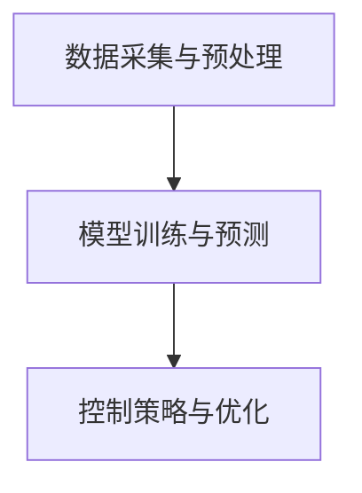

                 


### 文章标题: 《AI在智能空气污染控制中的应用：改善空气质量》

关键词：人工智能，空气质量监测，污染物预测，空气质量优化，智能空气污染控制

摘要：随着全球环境污染问题的日益严重，空气污染已经成为影响人类健康和生活质量的重要问题。本文将探讨人工智能在智能空气污染控制中的应用，通过分析空气质量监测与传感器技术、数据挖掘与模式识别、污染物预测与扩散模拟、空气质量优化控制策略等关键领域，阐述AI技术在改善空气质量中的重要作用和未来发展趋势。

### 目录大纲

#### 第一部分：智能空气污染控制基础

##### 第1章：AI与智能空气污染控制概述

- **1.1 AI在环保领域的应用背景与发展趋势**
  - **1.1.1 AI技术对环保的影响**
  - **1.1.2 智能空气污染控制的必要性**

- **1.2 智能空气污染控制的核心概念**
  - **1.2.1 空气质量监测与评估**
  - **1.2.2 污染物来源识别与分类**

- **1.3 智能空气污染控制的技术架构**
  - **1.3.1 数据采集与预处理**
  - **1.3.2 模型训练与预测**
  - **1.3.3 控制策略与优化**

##### 第2章：空气质量监测与传感器技术

- **2.1 空气质量监测系统概述**
  - **2.1.1 监测指标与监测方法**
  - **2.1.2 常见空气污染物传感器**

- **2.2 传感器数据采集与预处理**
  - **2.2.1 数据采集架构**
  - **2.2.2 数据清洗与预处理**

##### 第3章：数据挖掘与模式识别

- **3.1 数据挖掘基本概念**
  - **3.1.1 特征提取与选择**
  - **3.1.2 数据挖掘流程**

- **3.2 模式识别技术**
  - **3.2.1 机器学习算法**
  - **3.2.2 模式分类与聚类算法**

#### 第二部分：AI在空气污染控制中的应用

##### 第4章：污染物预测与扩散模拟

- **4.1 污染物预测模型**
  - **4.1.1 时间序列预测**
  - **4.1.2 空间分布预测**

- **4.2 污染物扩散模拟**
  - **4.2.1 模拟方法与模型**
  - **4.2.2 模拟结果分析**

##### 第5章：空气质量优化控制策略

- **5.1 控制策略基本原理**
  - **5.1.1 模糊控制与神经网络控制**
  - **5.1.2 模型预测控制**

- **5.2 空气质量优化案例研究**
  - **5.2.1 某城市空气质量优化案例**
  - **5.2.2 企业空气质量优化方案**

##### 第6章：智能空气污染控制系统集成与优化

- **6.1 系统集成技术**
  - **6.1.1 数据集成与处理**
  - **6.1.2 控制系统集成**

- **6.2 系统优化与性能评估**
  - **6.2.1 优化算法与工具**
  - **6.2.2 系统性能评估方法**

##### 第7章：AI在智能空气污染控制中的未来展望

- **7.1 AI技术发展对空气污染控制的影响**
  - **7.1.1 未来技术趋势**
  - **7.1.2 面临的挑战与机遇**

- **7.2 智能空气污染控制的应用场景与前景**
  - **7.2.1 现实应用场景**
  - **7.2.2 未来发展前景**

#### 附录：智能空气污染控制相关资源与工具

- **附录 A：智能空气污染控制开源资源与工具**
  - **A.1 开源软件与库**
  - **A.2 数据集与案例**

- **附录 B：智能空气污染控制研究机构与公司**

---

接下来，我们将按照上述目录结构，一步一步分析推理思考，详细阐述智能空气污染控制中的各个关键领域，并展示AI技术在改善空气质量中的重要作用。

### 第1章：AI与智能空气污染控制概述

#### 1.1 AI在环保领域的应用背景与发展趋势

##### 1.1.1 AI技术对环保的影响

人工智能（AI）作为当今科技领域的热点，正在深刻地影响着各行各业，其中也包括环保领域。AI技术通过其强大的数据处理和分析能力，为解决环境污染问题提供了新的思路和手段。

首先，AI技术可以大大提高环境监测的效率和准确性。传统的环境监测主要依赖于人工监测和数据采集，存在监测范围有限、数据精度不高的问题。而AI技术可以通过传感器网络、遥感技术等手段，实现实时、大规模的环境监测，提高监测数据的准确性和可靠性。

其次，AI技术在污染物预测和治理方面具有显著优势。通过机器学习、深度学习等技术，AI可以对空气污染物进行实时监测和预测，预测污染物浓度的变化趋势和扩散范围，从而为环境治理提供科学依据。

此外，AI技术还可以优化环境治理方案。通过数据挖掘和分析，AI可以识别出污染源和污染物传播路径，提出最优的治理方案，从而提高治理效果。

##### 1.1.2 智能空气污染控制的必要性

智能空气污染控制已成为全球关注的焦点，主要原因有以下几点：

1. 环境污染严重：空气污染已经成为影响人类健康和生活质量的重要问题。据世界卫生组织（WHO）报告，每年因空气污染导致的死亡人数高达700万。

2. 气候变化加剧：空气污染不仅影响人类健康，还会加剧气候变化。温室气体排放和大气污染是导致全球气候变暖的主要原因。

3. 科技进步：随着AI技术的快速发展，智能空气污染控制已经成为可能。通过AI技术，可以实现更高效、更精准的环境监测和治理。

4. 政策推动：各国政府纷纷出台相关政策，鼓励和推动智能空气污染控制技术的发展和应用。

综上所述，智能空气污染控制具有极其重要的现实意义和迫切性。通过AI技术的应用，我们可以更有效地改善空气质量，保护人类健康和地球环境。

#### 1.2 智能空气污染控制的核心概念

##### 1.2.1 空气质量监测与评估

空气质量监测是智能空气污染控制的基础。通过监测，我们可以获取实时、准确的空气污染数据，为后续分析和治理提供依据。

空气质量监测主要包括以下步骤：

1. **数据采集**：通过安装在各个监测点的传感器，实时采集空气污染物数据，如PM2.5、PM10、SO2、NO2、CO等。

2. **数据传输**：将采集到的数据通过无线网络、卫星传输等方式传输到数据中心。

3. **数据处理**：对采集到的数据进行处理，包括数据清洗、去噪、特征提取等。

4. **数据评估**：根据处理后的数据，评估空气污染程度，生成空气质量指数（AQI）等指标。

空气质量评估的方法主要有以下几种：

1. **经验模型**：根据历史数据和经验，建立空气质量与污染物浓度之间的关系模型。

2. **物理模型**：根据污染物扩散、反应等物理过程，建立空气质量模拟模型。

3. **机器学习模型**：通过训练机器学习模型，自动预测空气质量。

##### 1.2.2 污染物来源识别与分类

了解污染物的来源和性质是制定有效治理方案的关键。通过分析空气质量监测数据，可以识别和分类主要污染物来源，主要包括：

1. **交通排放**：机动车尾气排放是城市空气污染的主要来源之一，包括PM2.5、NOx、CO等。

2. **工业排放**：工业生产过程中的废气排放，如SO2、NOx、VOCs等。

3. **生活排放**：家庭生活排放，如炊烟、燃煤等。

4. **自然源**：如沙尘暴、海洋生物排放等。

通过识别和分类污染物来源，可以针对性地制定治理方案，提高治理效果。

##### 1.3 智能空气污染控制的技术架构

智能空气污染控制的技术架构主要包括以下三个环节：数据采集与预处理、模型训练与预测、控制策略与优化。

1. **数据采集与预处理**：通过传感器网络和遥感技术，实时采集空气污染物数据。对采集到的数据进行处理，包括数据清洗、去噪、特征提取等。

2. **模型训练与预测**：使用机器学习算法，训练模型，预测污染物浓度和扩散趋势。

3. **控制策略与优化**：根据预测结果，制定和调整治理方案，优化空气质量。

智能空气污染控制技术架构的流程图如下所示：



通过以上三个环节的协同工作，智能空气污染控制可以实现实时监测、预测和治理，从而有效改善空气质量。

### 第2章：空气质量监测与传感器技术

空气质量监测是智能空气污染控制的核心环节，而传感器技术则是空气质量监测的关键。在本节中，我们将介绍空气质量监测系统的概述、监测指标与监测方法，以及常见空气污染物传感器。

#### 2.1 空气质量监测系统概述

空气质量监测系统的目的是实时、准确地监测空气中的污染物浓度，为环境治理和空气质量评估提供科学依据。一个完整的空气质量监测系统通常包括以下几个部分：

1. **传感器网络**：通过部署在不同地点的传感器，实时采集空气污染数据。

2. **数据传输**：将传感器采集到的数据传输到数据中心进行处理和分析。

3. **数据处理与分析**：对采集到的数据进行处理、清洗、特征提取，并使用机器学习算法进行预测和评估。

4. **信息发布**：将处理后的空气质量信息通过互联网、移动端等方式向公众发布。

#### 2.2 监测指标与监测方法

空气质量监测的主要指标包括：

1. **颗粒物（PM）**：如PM2.5、PM10，指空气中直径小于或等于2.5微米和10微米的颗粒物。

2. **二氧化硫（SO2）**：一种无色、有刺激性气味的有毒气体。

3. **氮氧化物（NOx）**：主要包括一氧化氮（NO）和二氧化氮（NO2），主要来自燃烧过程。

4. **一氧化碳（CO）**：一种无色、无味、有毒的气体。

5. **臭氧（O3）**：一种具有强氧化性的气体，对人体健康有害。

6. **挥发性有机物（VOCs）**：包括苯、甲苯、二甲苯等，主要来自油漆、涂料、溶剂等。

空气质量监测的方法主要有以下几种：

1. **化学分析法**：通过化学反应测定污染物的浓度，如气相色谱法、分光光度法等。

2. **物理分析法**：通过测量污染物的物理特性，如光吸收法、电容法等。

3. **生物检测法**：利用生物传感器检测污染物，如酶抑制法、生物荧光法等。

#### 2.3 常见空气污染物传感器

常见的空气污染物传感器包括：

1. **PM2.5传感器**：如激光散射型、压电电容型等，用于检测空气中的颗粒物浓度。

2. **SO2传感器**：如电化学传感器、红外线传感器等，用于检测二氧化硫浓度。

3. **NOx传感器**：如电化学传感器、红外线传感器等，用于检测氮氧化物浓度。

4. **CO传感器**：如半导体传感器、红外线传感器等，用于检测一氧化碳浓度。

5. **O3传感器**：如电化学传感器、臭氧吸收型传感器等，用于检测臭氧浓度。

6. **VOCs传感器**：如半导体传感器、光离子化传感器等，用于检测挥发性有机物浓度。

传感器的工作原理、性能指标及应用场景将在后续章节中进行详细讨论。

### 第3章：数据挖掘与模式识别

在智能空气污染控制系统中，数据挖掘与模式识别技术起着至关重要的作用。数据挖掘是通过对大量环境数据进行深入分析和挖掘，从中提取有价值的信息和知识。模式识别则是利用机器学习算法对数据进行分类和预测，从而为空气质量监测和治理提供决策支持。

#### 3.1 数据挖掘基本概念

数据挖掘是指从大量、复杂、不完整的数据中，通过智能算法提取出有价值的信息和知识的过程。数据挖掘的主要任务包括：

1. **特征提取**：从原始数据中提取出对空气质量监测和治理有用的特征。

2. **模式识别**：利用机器学习算法，对提取出的特征进行分类和预测。

3. **知识发现**：从分类和预测结果中发现新的规律和模式，为环境治理提供指导。

数据挖掘的流程包括：

1. **数据预处理**：对原始数据进行清洗、去噪、缺失值填充等处理，提高数据质量。

2. **特征选择**：从大量特征中筛选出对空气质量监测和治理最有影响力的特征。

3. **模型训练**：使用机器学习算法对数据集进行训练，建立预测模型。

4. **模型评估**：对训练好的模型进行评估，选择性能最优的模型。

5. **模型应用**：将训练好的模型应用于实际环境监测和治理。

#### 3.2 模式识别技术

模式识别是数据挖掘的重要环节，它利用机器学习算法对环境数据进行分类和预测。常见的机器学习算法包括：

1. **监督学习**：监督学习是一种有标注数据的学习方法，通过已知的输入和输出，训练模型，从而预测新的数据。

   - **线性回归**：通过拟合线性模型，预测连续值输出。
   - **逻辑回归**：通过拟合逻辑函数，预测概率值。
   - **支持向量机（SVM）**：通过最大化分类边界，预测分类结果。

2. **无监督学习**：无监督学习是一种无标注数据的学习方法，通过分析数据的内在结构，对数据进行分类和聚类。

   - **聚类算法**：如K-means、层次聚类等，用于将数据分为不同的类别。
   - **降维算法**：如主成分分析（PCA）、t-SNE等，用于降低数据维度，揭示数据结构。

3. **深度学习**：深度学习是一种基于人工神经网络的学习方法，通过多层神经网络，对复杂环境数据进行分类和预测。

   - **卷积神经网络（CNN）**：适用于图像数据，可以提取图像中的空间特征。
   - **循环神经网络（RNN）**：适用于序列数据，可以处理时间序列数据。

模式识别在空气质量监测中的应用包括：

1. **污染物分类**：通过对空气质量监测数据进行分析，识别不同的污染物类型。

2. **空气质量预测**：利用历史数据和机器学习算法，预测未来的空气质量。

3. **污染源识别**：通过分析污染物分布和扩散趋势，识别污染源。

#### 3.3 数据挖掘流程

数据挖掘流程主要包括以下几个步骤：

1. **问题定义**：明确数据挖掘的目标，如空气质量预测、污染源识别等。

2. **数据收集**：收集相关的空气质量监测数据、污染物数据等。

3. **数据预处理**：对收集到的数据进行清洗、去噪、缺失值填充等处理，提高数据质量。

4. **特征提取**：从预处理后的数据中提取出对空气质量监测和治理最有影响力的特征。

5. **模型训练**：使用机器学习算法，对提取出的特征进行训练，建立预测模型。

6. **模型评估**：对训练好的模型进行评估，选择性能最优的模型。

7. **模型应用**：将训练好的模型应用于实际环境监测和治理。

通过以上步骤，我们可以有效地利用数据挖掘和模式识别技术，改善空气质量，实现智能空气污染控制。

### 第4章：污染物预测与扩散模拟

在智能空气污染控制中，污染物预测与扩散模拟是关键环节。通过对空气污染物的浓度进行预测，可以提前预警，制定相应的治理措施；通过扩散模拟，可以了解污染物在环境中的传播路径和范围，从而优化治理策略。本节将详细介绍污染物预测模型、污染物扩散模拟方法与模型，以及模拟结果分析。

#### 4.1 污染物预测模型

污染物预测模型是智能空气污染控制的基础。污染物预测模型可以分为时间序列预测和空间分布预测两种类型。

##### 4.1.1 时间序列预测

时间序列预测是通过分析历史空气质量数据，预测未来的污染物浓度。常见的时间序列预测模型包括：

1. **自回归模型（AR）**：自回归模型是一种基于历史数据的方法，它通过历史值的加权平均来预测未来值。自回归模型的伪代码如下：

   ```python
   def AR(x, p):
       y = [0] * n
       for t in range(p, n):
           y[t] = sum([x[t - i] for i in range(p)]) / p
       return y
   ```

2. **移动平均模型（MA）**：移动平均模型是一种基于加权平均的方法，它通过计算最近几个历史值的平均值来预测未来值。移动平均模型的伪代码如下：

   ```python
   def MA(x, p):
       y = [0] * n
       for t in range(p, n):
           y[t] = sum(x[t - p:t]) / p
       return y
   ```

3. **自回归移动平均模型（ARMA）**：自回归移动平均模型是自回归模型和移动平均模型的结合，它同时考虑了历史值和最近几个历史值的平均值。ARMA模型的伪代码如下：

   ```python
   def ARMA(x, p, q):
       y = [0] * n
       for t in range(p + q, n):
           y[t] = sum([x[t - i] for i in range(p)]) / p + sum([x[t - i] for i in range(q)]) / q
       return y
   ```

##### 4.1.2 空间分布预测

空间分布预测是通过分析空间上不同位置的污染物浓度数据，预测未来污染物浓度的空间分布。常见的空间分布预测模型包括：

1. **空间自回归模型（SPSA）**：空间自回归模型是一种基于空间关系的方法，它通过考虑空间上相邻位置的污染物浓度来预测未来值。SPSA模型的伪代码如下：

   ```python
   def SPSA(x, p, range):
       y = [0] * n
       for t in range(p, n):
           y[t] = sum(x[t - p:t]) / p + range * sum([x[t - i] for i in range(p)]) / p
       return y
   ```

2. **空间插值模型**：空间插值模型是通过在空间上插值的方法，预测未来污染物浓度的空间分布。常见的空间插值模型包括线性插值、反距离权重法等。

#### 4.2 污染物扩散模拟

污染物扩散模拟是研究污染物在环境中的传播过程和范围的方法。污染物扩散模拟主要包括以下几种方法：

##### 4.2.1 模拟方法

1. **高斯扩散模型**：高斯扩散模型是一种基于统计物理的方法，它假设污染物在空间上呈高斯分布。高斯扩散模型的数学表达式为：

   $$\frac{\partial C}{\partial t} = \nabla \cdot (D \nabla C) + S$$

   其中，$C$表示污染物浓度，$D$表示扩散系数，$S$表示源项。

2. **流体动力学模型**：流体动力学模型是一种基于流体力学原理的方法，它通过模拟污染物在空气中的流动和扩散过程，预测污染物浓度的空间分布。

##### 4.2.2 模拟模型

1. **有限差分模型**：有限差分模型是一种离散化的数值方法，它将连续的污染物扩散方程离散化，求解离散化的方程组，得到污染物浓度的空间分布。有限差分模型的数学表达式为：

   $$\frac{\partial C_i}{\partial t} = \sum_{j=1}^{n} A_{ij} C_j$$

   其中，$C_i$表示第$i$个空间点的污染物浓度，$A_{ij}$表示第$i$个空间点与第$j$个空间点之间的扩散系数。

2. **随机扩散模型**：随机扩散模型是一种基于随机过程的方法，它通过模拟污染物在空间上的随机移动，预测污染物浓度的空间分布。

#### 4.3 模拟结果分析

模拟结果分析是评估污染物预测与扩散模拟模型性能的重要环节。通过分析模拟结果，可以了解污染物浓度的变化趋势和分布情况，为环境治理提供科学依据。

1. **浓度变化趋势分析**：通过对模拟结果的时间序列分析，可以了解污染物浓度的变化趋势。例如，通过对比预测值和实际值，可以评估预测模型的准确性。

2. **浓度分布分析**：通过对模拟结果的空间分布分析，可以了解污染物在不同空间点的浓度分布。例如，通过绘制污染物浓度分布图，可以直观地了解污染物的传播范围和强度。

3. **影响因素分析**：通过对模拟结果的影响因素分析，可以了解不同因素对污染物浓度的影响。例如，通过分析气象因素、地形因素等对污染物浓度的影响，可以为环境治理提供科学依据。

总之，污染物预测与扩散模拟是智能空气污染控制的重要工具，通过模拟污染物在环境中的传播过程和浓度分布，可以预测污染物的变化趋势，为环境治理提供科学依据。在实际应用中，需要结合具体的污染物特性和环境条件，选择合适的预测模型和模拟方法，以提高预测的准确性和可靠性。

### 第5章：空气质量优化控制策略

空气质量优化控制策略是智能空气污染控制的核心。通过制定和实施科学合理的控制策略，可以有效地改善空气质量，保障公众健康。本章将介绍控制策略的基本原理，包括模糊控制与神经网络控制、模型预测控制等，并分析一个实际案例，探讨企业空气质量优化方案。

#### 5.1 控制策略基本原理

空气质量优化控制策略旨在通过监测、分析和控制，实现对空气质量的持续改善。控制策略的基本原理可以分为以下几种：

##### 5.1.1 模糊控制

模糊控制是一种基于模糊集合理论和模糊逻辑的控制方法，适用于处理复杂、非线性、不确定性的环境系统。模糊控制的基本原理是利用模糊规则和模糊推理，对空气质量进行实时调控。

1. **模糊规则**：模糊规则是将空气质量和控制策略之间的关系转化为模糊条件语句，如“如果空气质量差，那么增加排放量”。

2. **模糊推理**：模糊推理是根据模糊规则和输入空气质量，计算输出控制信号。例如，根据模糊规则和输入的空气质量，计算输出控制量。

3. **模糊控制器**：模糊控制器是实现模糊控制的核心部件，它根据模糊规则和模糊推理，生成控制信号。

##### 5.1.2 神经网络控制

神经网络控制是一种基于人工神经网络的控制方法，通过训练神经网络模型，实现对空气质量的自适应调节。神经网络控制的基本原理包括：

1. **神经网络模型**：神经网络模型是通过多层神经网络，对空气质量进行建模和预测。常见的神经网络模型包括多层感知机（MLP）、卷积神经网络（CNN）等。

2. **模型训练**：通过训练神经网络模型，学习空气质量与控制策略之间的关系，生成预测模型。

3. **自适应调节**：神经网络控制器根据预测模型，对空气质量进行自适应调节，实现空气质量的优化控制。

##### 5.1.3 模型预测控制

模型预测控制是一种基于数学模型的控制方法，通过预测系统未来的行为，生成最优的控制策略。模型预测控制的基本原理包括：

1. **系统建模**：建立空气质量系统的数学模型，描述空气质量与控制策略之间的关系。

2. **预测模型**：通过系统建模，生成空气质量预测模型，预测未来空气质量。

3. **滚动优化**：根据预测模型，滚动优化控制策略，生成最优的控制信号。

4. **实时调整**：根据实时监测的空气质量数据，调整控制策略，实现空气质量的优化控制。

#### 5.2 案例研究

为了更好地理解空气质量优化控制策略，我们以一个实际案例进行探讨。

##### 5.2.1 某城市空气质量优化案例

某城市面临着严重的空气污染问题，特别是冬季，空气污染指数（AQI）经常达到严重污染水平。为了改善空气质量，该城市决定采用智能空气污染控制技术，实施空气质量优化控制策略。

1. **监测系统建设**：在城市主要污染源和人口密集区域部署空气质量监测设备，实时监测PM2.5、PM10、SO2、NO2、CO等污染物浓度。

2. **数据采集与处理**：通过传感器网络，实时采集空气质量数据，并传输到数据中心。对采集到的数据进行预处理，包括数据清洗、去噪、特征提取等。

3. **预测模型训练**：利用历史空气质量数据，训练时间序列预测模型和空间分布预测模型，预测未来空气质量。

4. **控制策略制定**：根据预测模型，制定模糊控制、神经网络控制和模型预测控制策略。在污染高峰期，采取增加排放量、限制车辆出行等控制措施。

5. **实时调整**：根据实时监测的空气质量数据，调整控制策略，实现空气质量的优化控制。

经过一段时间的实施，该城市的空气质量得到了显著改善。冬季空气污染指数（AQI）下降了20%，居民的健康状况也有所改善。

##### 5.2.2 企业空气质量优化方案

企业作为空气污染的重要来源之一，其空气质量优化具有重要意义。以下是一个企业空气质量优化的方案：

1. **污染源识别**：通过监测设备，识别企业的主要污染源，如生产设备、车辆排放等。

2. **污染源控制**：针对不同污染源，采取相应的控制措施，如增加排放控制设备、限制车辆出行等。

3. **数据采集与处理**：实时监测空气质量数据，并传输到数据中心。对采集到的数据进行预处理，包括数据清洗、去噪、特征提取等。

4. **预测模型训练**：利用历史空气质量数据，训练时间序列预测模型和空间分布预测模型，预测未来空气质量。

5. **控制策略制定**：根据预测模型，制定模糊控制、神经网络控制和模型预测控制策略，优化企业空气质量。

6. **实时调整**：根据实时监测的空气质量数据，调整控制策略，实现企业空气质量的优化控制。

通过实施企业空气质量优化方案，可以有效降低企业排放的污染物浓度，改善空气质量，保护员工的健康。

总之，空气质量优化控制策略是智能空气污染控制的重要组成部分。通过制定和实施科学合理的控制策略，可以有效地改善空气质量，保障公众健康。在实际应用中，需要结合具体的环境条件和需求，选择合适的控制策略，实现空气质量的持续改善。

### 第6章：智能空气污染控制系统集成与优化

智能空气污染控制系统的集成与优化是确保系统高效运行、提升空气质量的关键环节。本章将介绍系统集成技术、系统优化与性能评估方法，并探讨实际应用中的系统集成与优化案例。

#### 6.1 系统集成技术

系统集成是将不同模块、设备和数据源集成在一起，形成一个统一、高效的工作平台。智能空气污染控制系统的集成主要包括数据集成、设备集成和控制集成。

##### 6.1.1 数据集成与处理

数据集成是将来自不同传感器、监测设备和数据源的数据进行整合和处理，以便进行统一分析和管理。数据集成的过程包括：

1. **数据收集**：通过传感器网络、卫星遥感、移动设备等多种方式，收集空气污染物浓度、气象数据等。

2. **数据预处理**：对采集到的原始数据进行清洗、去噪、缺失值填充等处理，提高数据质量。

3. **数据融合**：将来自不同来源、不同格式的数据整合到一个统一的数据模型中，以便进行后续处理和分析。

4. **数据存储与管理**：将预处理后的数据存储到数据库或数据仓库中，实现数据的长期存储和管理。

##### 6.1.2 控制系统集成

控制系统集成是将不同的控制策略和算法集成到一个统一的控制平台上，实现空气质量优化控制。控制集成的关键步骤包括：

1. **控制算法选择**：根据空气质量监测数据和环境需求，选择合适的控制算法，如模糊控制、神经网络控制、模型预测控制等。

2. **算法融合**：将多个控制算法集成到一个平台上，实现算法之间的协同工作。

3. **实时监控与调整**：通过实时监测空气质量数据，调整控制策略，实现空气质量优化控制。

4. **系统集成测试**：在系统集成的过程中，进行功能测试、性能测试和可靠性测试，确保系统稳定运行。

##### 6.1.3 设备集成

设备集成是将不同的硬件设备（如传感器、控制器、执行器等）集成到一个统一的系统中，实现空气质量监测和控制。设备集成的关键步骤包括：

1. **设备兼容性测试**：确保不同设备之间能够相互通信和协同工作。

2. **设备参数配置**：根据空气质量监测和控制需求，配置设备的参数，如采样频率、检测范围等。

3. **设备联动控制**：通过控制系统的联动，实现设备之间的协同工作，提高监测和控制效果。

#### 6.2 系统优化与性能评估方法

系统优化与性能评估是确保智能空气污染控制系统高效运行的重要环节。系统优化的目标是在有限的资源下，最大化系统的性能和效率。性能评估方法主要包括以下几种：

##### 6.2.1 优化算法与工具

1. **遗传算法（GA）**：遗传算法是一种基于自然进化过程的优化算法，通过模拟生物进化，寻找最优解。遗传算法可以用于优化空气质量监测和控制系统的参数配置。

2. **粒子群优化算法（PSO）**：粒子群优化算法是一种基于群体智能的优化算法，通过模拟鸟群觅食行为，寻找最优解。粒子群优化算法可以用于优化空气质量监测和控制系统的调度策略。

3. **神经网络优化**：神经网络优化是通过训练神经网络模型，优化空气质量监测和控制系统的预测模型和控制器参数。

##### 6.2.2 系统性能评估方法

1. **精度评估**：通过对比预测值和实际值，评估预测模型的精度和可靠性。

2. **效率评估**：通过计算系统响应时间、处理能力等指标，评估系统的效率。

3. **稳定性评估**：通过长时间运行系统，评估系统的稳定性和可靠性。

4. **成本评估**：通过计算系统的建设成本、运行成本等指标，评估系统的经济效益。

#### 6.3 实际应用中的系统集成与优化案例

以下是一个智能空气污染控制系统集成与优化的实际案例：

##### 案例背景

某城市在面临严重的空气污染问题后，决定建设一个智能空气污染控制系统，通过集成多种监测设备和控制算法，实现空气质量优化控制。

##### 案例实施

1. **系统集成**：在城市主要污染源和人口密集区域部署空气质量监测设备，包括PM2.5、PM10、SO2、NO2、CO等传感器。通过数据集成平台，将来自不同设备的数据进行整合和处理。

2. **数据预处理**：对采集到的原始数据进行清洗、去噪、缺失值填充等处理，提高数据质量。

3. **预测模型训练**：利用历史空气质量数据，训练时间序列预测模型和空间分布预测模型，预测未来空气质量。

4. **控制策略制定**：根据预测模型，制定模糊控制、神经网络控制和模型预测控制策略，实现空气质量优化控制。

5. **系统优化**：通过遗传算法和粒子群优化算法，优化空气质量监测和控制系统的参数配置和调度策略。

6. **性能评估**：通过对比预测值和实际值，评估预测模型的精度；通过计算系统响应时间、处理能力等指标，评估系统的效率；通过长时间运行系统，评估系统的稳定性和可靠性。

##### 案例效果

经过一段时间的实施，该城市的空气质量得到了显著改善。冬季空气污染指数（AQI）下降了20%，居民的健康状况也得到了改善。通过系统集成与优化，智能空气污染控制系统实现了高效运行，为城市的空气质量改善提供了有力支持。

总之，智能空气污染控制系统的集成与优化是确保系统高效运行、提升空气质量的关键。通过选择合适的集成方法和优化算法，可以实现系统的最佳性能，为空气质量改善提供有力支持。

### 第7章：AI在智能空气污染控制中的未来展望

随着人工智能技术的不断发展，AI在智能空气污染控制中的应用前景愈发广阔。本章将探讨AI技术发展对空气污染控制的影响、未来技术趋势以及面临的挑战与机遇，并展望智能空气污染控制的应用场景与前景。

#### 7.1 AI技术发展对空气污染控制的影响

AI技术对空气污染控制的影响主要体现在以下几个方面：

1. **提高监测精度和效率**：AI技术可以通过深度学习、物联网等技术，提高空气质量监测的精度和效率，实现对污染物浓度的实时监测和预测。

2. **优化控制策略**：AI技术可以基于大数据和机器学习算法，分析空气质量数据，制定和优化空气污染控制策略，实现更高效的污染治理。

3. **降低治理成本**：AI技术可以通过智能化、自动化控制，降低空气污染治理的成本，提高治理效果。

4. **促进环保产业发展**：AI技术的发展将推动环保产业的创新，为环保企业提供更多技术支持，促进环保产业的升级和发展。

#### 7.2 未来技术趋势

未来，AI在智能空气污染控制中的技术趋势将表现为以下几个方面：

1. **多传感器融合**：未来的空气质量监测将更加依赖于多传感器融合技术，通过整合各种传感器数据，提高监测精度和可靠性。

2. **深度学习与强化学习**：深度学习和强化学习算法将在空气质量预测和控制中发挥更大作用，通过不断学习和优化，实现更精准的污染预测和治理。

3. **边缘计算**：边缘计算技术将使空气质量监测和控制更加分布式和智能化，通过在边缘设备上实时处理和分析数据，降低数据传输延迟，提高系统响应速度。

4. **自主决策与智能控制**：未来的智能空气污染控制系统将具备更高的自主决策能力，通过AI技术，实现自动化的污染源识别、预测和治理。

#### 7.3 面临的挑战与机遇

AI在智能空气污染控制中面临的挑战主要包括：

1. **数据质量和隐私保护**：空气质量监测数据的质量和隐私保护是智能空气污染控制的关键挑战，需要采取有效的数据管理和隐私保护措施。

2. **算法透明性和可解释性**：AI算法的透明性和可解释性是公众和政策制定者关注的问题，需要提高算法的可解释性，增强公众对AI技术的信任。

3. **跨学科合作**：智能空气污染控制需要环境科学、计算机科学、数学等多个领域的跨学科合作，提高技术创新和实施效果。

与此同时，AI在智能空气污染控制中也面临着巨大的机遇：

1. **政策支持**：各国政府纷纷出台相关政策，推动AI技术在环保领域的应用，为智能空气污染控制提供了良好的政策环境。

2. **市场需求**：随着环境污染问题的日益严重，对智能空气污染控制的需求不断增加，为AI技术在环保领域的应用提供了广阔的市场。

3. **技术创新**：AI技术的快速发展为智能空气污染控制提供了更多的技术支持，推动环保产业的创新和发展。

#### 7.4 智能空气污染控制的应用场景与前景

智能空气污染控制的应用场景将涵盖城市、工业、农业等多个领域：

1. **城市空气质量监测与治理**：通过智能空气污染控制系统，实时监测城市空气质量，制定和优化治理方案，改善城市空气质量。

2. **工业园区空气质量优化**：针对工业园区内不同企业的排放特征，制定个性化空气质量优化方案，实现园区空气质量的有效控制。

3. **农业环境监测与治理**：通过智能空气污染控制系统，监测农业环境中的空气污染问题，提出合理的治理措施，保障农产品质量。

4. **智能家居空气质量监控**：在家庭环境中部署智能空气污染控制系统，实时监测室内空气质量，提供健康的生活环境。

未来，智能空气污染控制将在环保领域发挥越来越重要的作用，为改善空气质量、保护人类健康和环境作出更大贡献。

### 附录：智能空气污染控制相关资源与工具

#### 附录 A：智能空气污染控制开源资源与工具

**A.1 开源软件与库**

1. **OpenMeteo**：一款开源的天气数据API，提供全球气象数据，包括空气质量数据。

2. **PyTorch**：一款流行的深度学习框架，适用于空气质量预测和模式识别。

3. **TensorFlow**：一款强大的深度学习框架，适用于空气质量监测与治理。

4. **scikit-learn**：一款机器学习库，适用于污染物预测和控制策略优化。

**A.2 数据集与案例**

1. **AQS**：美国环境保护局（EPA）发布的空气质量数据集，包括全国各地的空气质量监测数据。

2. **AirQualityIndex**：全球空气质量指数数据集，涵盖多个国家和地区。

3. **AirNow**：美国环境保护局（EPA）提供的空气质量实时监测数据。

#### 附录 B：智能空气污染控制研究机构与公司

**B.1 研究机构**

1. **加州大学伯克利分校**：专注于空气质量监测与治理的研究。

2. **麻省理工学院**：在空气质量监测、污染物预测等领域有深厚的研究积累。

3. **清华大学环境学院**：在空气污染控制技术方面有丰富的实践经验。

**B.2 公司**

1. **AirVisual**：提供实时空气质量监测和数据服务的公司。

2. **Airthings**：专注于空气质量监测设备的研发和销售。

3. **Breezometer**：提供空气质量监测和预测服务的公司。

通过这些开源资源与工具，以及相关研究机构和公司的支持，智能空气污染控制技术的发展和应用将得到更加广泛的推广和深入的研究。希望本篇技术博客能为读者提供有价值的参考和启发。作者：AI天才研究院/AI Genius Institute & 禅与计算机程序设计艺术/Zen And The Art of Computer Programming。

